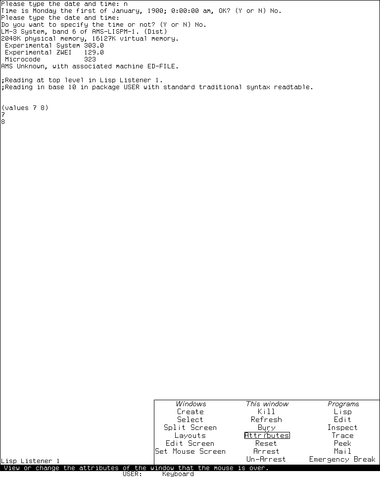
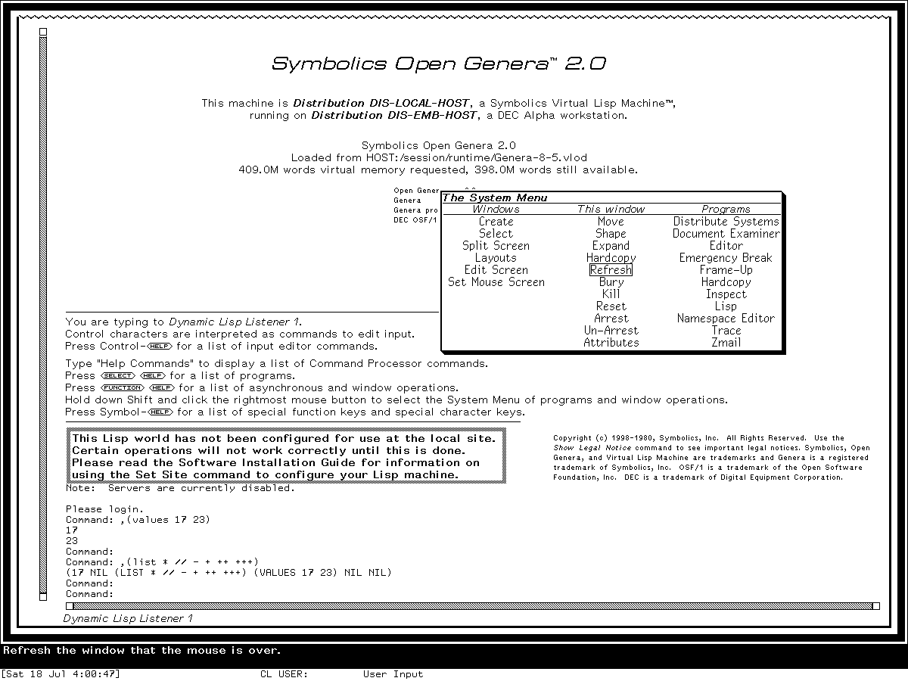
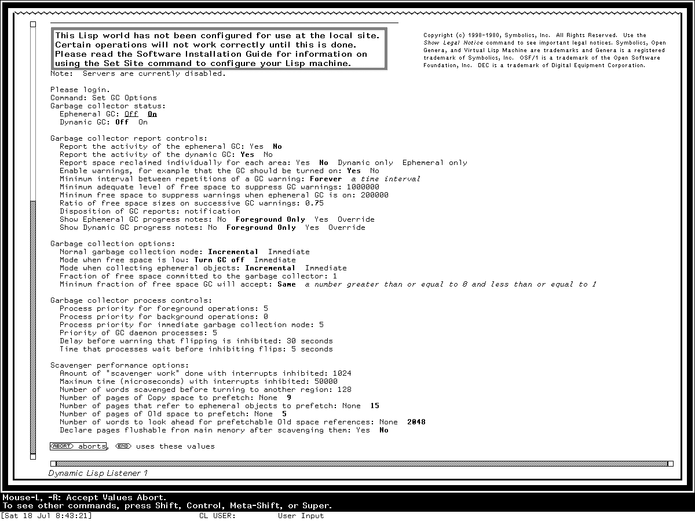

# CADR and Genera interface style guide

## Conclusion

This is not a general retro-interface guide. Its only visual references are the
selected MIT CADR/LM-3 and Symbolics Genera profiles. A conforming design must be
traceable to their source, preserved artifacts, or observed runtime behavior; the
historical motivation does not authorize arcade, terminal, CRT, cyberpunk, or
contemporary “retro” conventions.

The characteristic appearance comes from a tightly coupled system:

- crisp one-bit raster typography;
- black-and-white drawing with Boolean operations and periodic stipples;
- dense, content-sized windows with one-pixel rules;
- mode lines, labels, scroll margins, and a permanently visible who line;
- transient menus whose current item is outlined or reversibly highlighted;
- context-sensitive mouse documentation;
- three-button and modifier-rich interaction; and
- applications that present meaningful objects and commands rather than hiding
  everything behind generic push buttons.

MIT CADR/LM-3 and Symbolics Genera must nevertheless be treated as different
profiles. The selected CADR baseline is the sparse TV window system seen in the
public System 46 source and the preserved System 303 runtime. The selected Genera
baseline is the more typographically varied TV plus Dynamic Windows environment in
Genera 8.5. Genera descends from the same broad tradition, but adds framed program
surfaces, semantic character styles, presentation-sensitive interaction, richer
formatted output, more named stipples, and a stronger visual distinction among
title, display, menu, and interactor panes.

For a website, preserve those relationships while implementing them with accessible
HTML controls, keyboard focus, text alternatives, and responsive layout. Those
facilities are modern implementation machinery, not a source of additional visual
style.

## Evidence profile and design status

This guide distinguishes three kinds of statement:

| Label | Meaning |
| --- | --- |
| **Observed** | Visible in a reviewed runtime capture from the identified System 303 or Genera 8.5 environment. |
| **Source-grounded** | Established by the selected public CADR/LM-3 source or licensed Genera source analysis recorded in the linked museum article. |
| **Implementation mapping** | A way to reproduce an established CADR or Genera relationship in HTML, CSS, Canvas, or another modern toolkit. It is not attributed to the original system and must not introduce a new visual convention. |

The profiles are:

| Profile | Evidence boundary | Good target description |
| --- | --- | --- |
| `CADR-303-MONO` | Experimental System 303.0 runtime, cross-checked against public System 46 and LM-3 sources | A late CADR/LM-3 monochrome TV interface |
| `GENERA-85-MONO` | Open Genera 2.0 / Genera 8.5 world and selected source | A monochrome-first Genera TV and Dynamic Windows interface |
| `CADR-COLOR-4` | Public CADR four-bit color-screen source | An optional 576 by 454 indexed-color laboratory profile, not the ordinary monochrome desktop |
| `GENERA-COLOR` | Genera color protocols and Color Editor source analysis | A device-dependent color extension; do not infer its appearance from the monochrome Open Genera runtime |

Do not silently average the two monochrome profiles. A design that combines
Genera's drop shadow with CADR's portrait composition is a labeled hybrid, not a
reconstruction of either system. A generic modern terminal font is not visually
conforming to either profile merely because it is monospaced.

## The controlled visual comparison

### CADR/LM-3 System 303



*Runtime observation, Experimental System 303.0, 2026-07-18. The image supports the
comparison of sparse popup geometry, column headings, outlined current item,
surrounding Listener, bottom mode line, and pointer-documentation/status region. MIT
and other identified rightsholders retain any interest in the screen; this
scholarly use is reviewed under the repository's case-specific fair-use policy, and
no affiliation or endorsement is implied.*

The visible hierarchy is created almost entirely by position, rules, whitespace,
font changes, and the current-item outline. There is no desktop wallpaper, toolbar,
icon dock, rounded card, or shaded widget chrome. The menu occupies only the area its
items need and leaves the underlying application legible.

### Symbolics Genera 8.5



*Runtime observation, Genera 8.5, 2026-07-18. The image supports comparison of the
menu title, column organization, typography, current-item box, border and shadow,
framed screen, scrollbar, bottom label, and pointer-documentation/status
relationship. Symbolics retains any copyright interest; this limited scholarly use
is reviewed under the repository's case-specific fair-use policy, and no affiliation
or endorsement is implied.*

Genera remains visually economical, but the hierarchy is stronger. The popup has a
title, differentiated headings, a heavier lower-right edge, and more proportional
letterforms. The enclosing Listener has a decorated frame, scrollbar, and label.
These are not grounds for adding modern bevels or arbitrary ornament: the decoration
still communicates window extent, pane role, exposure, selection, or operation.

### Genera Dynamic Windows form language



*Runtime observation, Genera 8.5, 2026-07-18. This capture is used only to analyze
the typographic and spatial language of an Accepting Values form. Its volatile
garbage-collector values are not release defaults or configuration advice.
Symbolics retains any copyright interest; this limited scholarly use is reviewed
under the repository's case-specific fair-use policy.*

This form is especially important evidence against reducing Genera to a terminal.
It is spatial, mouse-sensitive, typed, and redisplay-aware, yet most controls remain
text. Bold and italic raster styles, indentation, blank rows, semantic grouping,
inline alternatives, and bottom-line documentation do the work that contemporary
toolkits often assign to filled cards, colored badges, switches, and tooltips.

## Principles shared by both profiles

### Treat every pixel as deliberate

Historical raster output has hard edges. A rule is one device pixel because one
pixel is an actual drawing unit, not a hairline that a compositor may place between
device pixels.

For an exact-pixel presentation:

- lay out on an integer coordinate grid;
- scale the final surface only by an integer factor;
- disable interpolation for bitmap layers;
- avoid fractional transforms, fractional line heights, and half-pixel borders;
- use square joins and caps unless a source-grounded component says otherwise; and
- repaint transient highlights reversibly or from retained state rather than
  accumulating alpha overlays.

For an accessible responsive website, use the same grid inside components but let
the page reflow. Historical screen dimensions are reference compositions, not a
reason to force a 768-pixel-wide viewport on a phone.

### Use monochrome as the foundation

The ordinary observed profiles are white surfaces with black ink. Reverse video is
an operational state, especially in status areas, selections, cursors, and some
labels—not a mandate to make the entire application black.

Recommended base tokens:

```css
:root {
  --lm-paper: #fff;
  --lm-ink: #000;
  --lm-rule: #000;
  --lm-focus: #000;
  --lm-rule-width: 1px;
  --lm-radius: 0;
}
```

Do not add green phosphor, amber bloom, chromatic aberration, scanlines, vignetting,
or static noise unless the project is explicitly simulating a particular physical
monitor. None of those effects defines the software interface documented here.

### Prefer roles over arbitrary ornament

Every visible distinction should answer a question:

- What window or pane owns this content?
- What is selected?
- What can the pointer act on?
- What mode or buffer is active?
- What will each mouse button do here?
- Is this value current, defaulted, invalid, or merely explanatory?
- Is this region temporary, scrollable, or awaiting input?

When an extra border, color, shadow, icon, or badge answers none of those questions,
remove it.

### Keep information dense but structured

Density does not mean eliminating all whitespace. Both systems use blank space to
separate logical groups and reserve output regions. The characteristic economy comes
from small raster text, shallow controls, compact labels, and the absence of
decorative padding.

Use:

- one text line for an ordinary command or mode row;
- one or two character cells of indentation for hierarchy;
- one blank row between major form groups;
- one-pixel pane separators;
- content-sized transient windows; and
- tables whose columns follow the information rather than a generic card grid.

### Make documentation part of the interface

Pointer documentation belongs in a stable bottom region. It changes as the pointer
crosses menus, presentations, scroll margins, and controls. This is different from a
tooltip that floats over and obscures the content.

One accessible implementation mapping is:

```html
<main class="lm-screen" aria-describedby="pointer-doc">
  <!-- application -->
</main>
<footer class="lm-who-line">
  <div id="pointer-doc" aria-live="polite">Select this buffer.</div>
  <div class="lm-status">USER:  TAY   Package: CL-USER   Run</div>
</footer>
```

Update the same documentation for keyboard focus. Hover-only documentation does not
reproduce the keyboard-and-pointer relationship and is inaccessible.

## CADR/LM-3 visual profile

### Typography

The public font artifacts and source establish a role-based bitmap vocabulary:

| Role | Historical font evidence | Implementation mapping |
| --- | --- | --- |
| ordinary screen text | `CPTFON` source becomes runtime `CPTFONT`; nominal 8-pixel advance, 12-pixel cell | Use a compact fixed bitmap face at an integer 8-by-12 grid. |
| ordinary screen menus and questionnaire buttons | `MEDFNT`; nominal 9-pixel advance and 13-pixel cell | Use a slightly larger fixed face without adding padding-heavy button chrome. |
| distinguished System Menu actions | compiled `MEDFNB`; nominal 10-pixel advance and 13-pixel cell | Use a real bold raster variant for exceptional actions, not synthetic CSS emboldening if exactness matters. |
| very compact labels | `5X5`; 6-pixel advance and 5-pixel glyph cell | Reserve for genuinely tiny functional annotations. |
| special menu choices | `HL12I` | Italic is a semantic distinction, not general decoration. |
| margin scroll messages | `TR10I` | A small serif italic can distinguish transient navigation text. |

For a browser, the most faithful implementation uses a font converted from the
tracked public CADR font sources under their recorded license. A normal outline
monospace fallback can reproduce structure but not exact raster rhythm.

Suggested logical roles:

```css
[data-lm-profile="cadr"] {
  --lm-font-body: "CADR CPTFONT", ui-monospace, monospace;
  --lm-font-menu: "CADR MEDFNT", var(--lm-font-body);
  --lm-font-menu-strong: "CADR MEDFNB", var(--lm-font-menu);
  --lm-body-size: 12px;
  --lm-body-leading: 12px;
  --lm-cell-x: 8px;
  --lm-cell-y: 12px;
}
```

The quoted family names are project-local CSS aliases, not standardized installed
font names. Map them to the files actually supplied by the site.

### Window geometry and chrome

The CADR TV window is a sheet with explicit outside and inside geometry. Borders,
labels, scroll margins, and other decorations consume margins around the client
area. That architecture should remain visible in an implementation.

Use:

- a one-pixel outer rule for ordinary windows;
- optional top or bottom labels measured as part of the window, not floating above
  it;
- square corners;
- no ambient shadow on an ordinary CADR popup;
- narrow scroll regions in the window margin;
- a mode line or label that spans the application width; and
- a separate who-line region below the main application screen.

Do not reproduce a contemporary title bar with close/minimize/maximize buttons.
Window operations live in global or contextual menus and keyboard commands.

### Menus

The observed System 303 menu is a temporary, content-sized rectangle:

- three columns with short headings;
- centered or consistently aligned labels;
- no filled cells;
- the current item enclosed by a one-pixel rectangle;
- pointer documentation in the who line;
- no persistent menubar; and
- exact restoration of the underlay when dismissed.

A CADR menu component implementing the observed relationships:

```css
[data-lm-profile="cadr"] .lm-menu {
  position: absolute;
  display: grid;
  grid-auto-flow: column;
  grid-template-rows: auto repeat(var(--rows), 1lh);
  color: var(--lm-ink);
  background: var(--lm-paper);
  border: 1px solid var(--lm-rule);
  border-radius: 0;
  box-shadow: none;
  padding: var(--cadr-menu-padding);
  font: normal var(--lm-body-size)/1 var(--lm-font-menu);
}

[data-lm-profile="cadr"] .lm-menu [aria-current="true"],
[data-lm-profile="cadr"] .lm-menu [role="menuitem"]:focus-visible {
  outline: 1px solid var(--lm-focus);
}
```

`--cadr-menu-padding` is deliberately undefined. Measure it from the selected
release/application reference instead of treating one convenient inset as a
system-wide CADR constant.

The historical menu can be momentary, tracking while a button is held. A website may
also support click-to-open for accessibility, but should preserve Escape/Abort,
focus movement, current-item documentation, and underlay restoration.

### Mode line and who line

The System 303 capture separates three bottom functions:

1. the application label/mode line at the bottom of its window;
2. a mouse-documentation line; and
3. a status line showing user, keyboard/process context, and other state.

Do not compress these into a floating toast. Use stable horizontal bands. Reverse
video is appropriate only where it matches the chosen release and band. In the
reviewed System 303 capture, both who-line rows use ordinary black-on-white video.
In the reviewed Genera 8.5 captures, the pointer-documentation row is white on black
and the status row immediately beneath it returns to black on white. Do not apply
the Genera documentation row's reverse video to the complete who-line region.

### Scrollbars and cursors

CADR scroll controls are window-margin behavior, not generic browser scrollbars.
They may expose position and navigation through a thin edge region. Use a narrow
track, raster car/marker, and context-sensitive pointer documentation. Avoid rounded
thumbs, translucent overlays, disappearing scrollbars, and inertial overscroll.

Text cursors and blinkers are rectangular raster objects. A block or thin rectangle
that follows the current character cell is more authentic than a glowing caret.
Blinking should respect reduced-motion preferences.

### Grays, stipples, and color

The ordinary monochrome profile uses one-bit repeating masks. The five named CADR
patterns are:

```text
50%-GRAY   25%-GRAY   75%-GRAY   33%-GRAY   HES-GRAY
.#         #...       .###       #..        #...
#.         ..#.       ##.#       .#.        ....
           .#..       #.##       ..#        ..#.
           ...#       ###.                  ....
```

Treat `#` as a mask bit, not inherently as black. The foreground, destination, and
Boolean raster operation determine the visible result.

If using the optional `CADR-COLOR-4` profile, expose a sixteen-entry mutable indexed
palette. Do not declare a permanent “CADR palette”: source-defined routines replace
the color map, and the same pixel index can display a different RGB value later.

### CADR component recipe

A compact CADR-style page usually needs:

```text
screen
├─ application window
│  ├─ content/terminal area
│  ├─ optional narrow scroll margin
│  └─ bottom label or mode line
├─ temporary menu or typeout overlay
└─ who-line screen
   ├─ pointer documentation
   └─ user/process/file/status fields
```

Start with this hierarchy before adding application-specific panels.

## Genera 8.5 visual profile

### Typography and character styles

Genera's native character style is a semantic `(family, face, size)` triple. It is
resolved through a device-specific font map. This supports more visual hierarchy
than a single terminal face without becoming a modern CSS property bundle.

Useful screen roles from the selected profile:

| Role | Genera style or raster family | Implementation mapping |
| --- | --- | --- |
| default fixed text | `FIX.ROMAN.NORMAL`, resident `CPTFONT`, 8-by-12 fixed cell | Commands, Listener output, code, compact status. |
| small fixed text | `FIX.*.SMALL`, `TVFONT` family | Dense labels and secondary status. |
| program/menu text | `JESS` family, commonly normal or large | Human-facing titles and menu roles. |
| sans-serif hierarchy | `SWISS` with roman, bold, italic, and condensed forms | Headings, labels, compact explanatory text. |
| serif/body hierarchy | `DUTCH` family | Document-like body or print-oriented roles. |
| emphatic display | italic `EUREX` at very large or huge sizes | Rare titles and display text, not every heading. |

Faces include roman, bold, italic, bold-italic, uppercase, bold-extended, condensed,
and extra-condensed. Use actual raster variants where available. Synthetic browser
weight or oblique transforms blur and distort the designed pixel forms.

Suggested logical CSS roles:

```css
[data-lm-profile="genera"] {
  --lm-font-fixed: "Local Genera CPTFONT", ui-monospace, monospace;
  --lm-font-ui: "Local Genera JESS13", var(--lm-font-fixed);
  --lm-font-sans: "Local Genera HL12", sans-serif;
  --lm-font-serif: "Local Genera TR12", serif;
  --lm-font-display: "Local Genera EUREX21I", var(--lm-font-serif);
  --lm-fixed-size: 12px;
  --lm-ui-size: 13px;
  --lm-cell-x: 8px;
  --lm-cell-y: 12px;
}
```

These aliases are examples; use the actual family names exported by the selected
font package. The public [Genera Fonts reproduction][genera-fonts] provides the
reviewed 89-font Genera 8.5 resident profile as Unicode BDF and OTB fonts. It
preserves the one-bit glyphs, advances, bearings, baselines, and line metrics rather
than substituting a generic pixel font. Its publication notice relies on the U.S.
“typeface as typeface” rule and deliberately separates the historical font-shape
payload from the BSD-licensed project tooling.

The reproduction repository is the public distribution path. This repository still
keeps its direct licensed-world extraction products under ignored
`build/fonts/genera/`; do not copy those local intermediates into `docs/` or a web
application.

### Program frames and panes

A Genera Dynamic Windows application commonly separates:

- title or status pane;
- display pane;
- command menu pane;
- interactor or Listener pane;
- Accept Values pane; and
- typeout or temporary output region.

Use one-pixel dividers and content-specific character styles. The panes are parts of
one program state, not independent dashboard cards. Avoid separate rounded
containers, unrelated shadows, and large gutters around every pane.

The enclosing TV window may add:

- a thin outer border;
- one or more functional decoration rules;
- a narrow scroll margin;
- a bottom label;
- a gray-patterned shaft or deexposed area; and
- a lower-right drop shadow for a temporary menu.

Do not apply every decoration to every surface. The live System Menu has a shadow;
the underlying Listener is a framed application surface, not another floating card.

### Dynamic Windows menus

The Genera System Menu preserves the three-column organization but adds:

- a title strip;
- typographically distinct column headings;
- a more explicit border;
- a lower-right shadow;
- proportional menu lettering; and
- the same outlined current-item and bottom documentation relationship.

Source analysis establishes 50%-gray stipple use in Dynamic Windows drop shadows.
For a crisp web approximation, tile a 2-by-2 mask and offset it only to the lower and
right sides:

```text
.#
#.
```

Do not use a blurred CSS shadow. An implementation can use an absolutely positioned
pseudo-element with `background-size: 2px 2px`, a hard integer offset, and no blur.
The offset and extent must come from the selected application/release evidence; this
guide has not established one universal Genera shadow measurement.

```css
[data-lm-profile="genera"] .lm-menu {
  position: absolute;
  isolation: isolate;
  overflow: visible;
  color: var(--lm-ink);
  background: var(--lm-paper);
  border: 1px solid var(--lm-rule);
  border-radius: 0;
  box-shadow: none;
}

[data-lm-profile="genera"] .lm-menu::after {
  content: "";
  position: absolute;
  z-index: -1;
  inset:
    var(--genera-menu-shadow-top)
    var(--genera-menu-shadow-right)
    var(--genera-menu-shadow-bottom)
    var(--genera-menu-shadow-left);
  background-image:
    url("data:image/svg+xml,%3Csvg xmlns='http://www.w3.org/2000/svg' width='2' height='2' viewBox='0 0 2 2' shape-rendering='crispEdges'%3E%3Cpath d='M1 0h1v1H1zM0 1h1v1H0z'/%3E%3C/svg%3E");
  background-size: 2px 2px;
}

[data-lm-profile="genera"] .lm-menu__title {
  border-bottom: 1px solid var(--lm-rule);
  font-family: var(--lm-font-ui);
  font-style: italic;
  line-height: 1;
  padding-inline: var(--genera-menu-title-inset);
}
```

Define the four `--genera-menu-shadow-*` values and
`--genera-menu-title-inset` only after measuring the chosen reference. Keep them
integer, hard-edged, and subordinate to the menu. Leaving them undefined is
intentional: a convenient default would turn an unverified number into a de facto
historical claim. The inline two-pixel SVG contains only the documented diagonal
50%-gray mask; it is implementation code, not a recovered Genera asset.

### Accepting Values and semantic forms

A Genera Accepting Values form should read like the observed structured technical
document:

- group heading followed by indented rows;
- prompt and current value on one line when space permits;
- alternatives written inline;
- selected/default alternatives distinguished by real bold;
- validation constraints in italic;
- action presentations such as `Abort` and `End` printed in the content flow;
- keyboard navigation among queries and choices;
- pointer-sensitive highlighting and documentation; and
- redisplay only of affected regions.

Recommended semantic HTML:

```html
<form class="lm-av" aria-describedby="lm-pointer-doc">
  <fieldset class="lm-av__group">
    <legend>Garbage collector status:</legend>

    <div class="lm-av__query">
      <span id="ephemeral-label">Ephemeral GC:</span>
      <span role="radiogroup" aria-labelledby="ephemeral-label">
        <button type="button" role="radio" aria-checked="false">Off</button>
        <button type="button" role="radio" aria-checked="true">On</button>
      </span>
    </div>
  </fieldset>

  <div class="lm-av__actions">
    <button type="button">Abort</button>
    <button type="submit">End</button>
    <span>uses these values</span>
  </div>
</form>
```

Style the buttons as printed presentations rather than filled rectangles:

```css
.lm-av button {
  appearance: none;
  color: inherit;
  background: transparent;
  border: 0;
  border-radius: 0;
  padding: 0;
  font: inherit;
}

.lm-av [aria-checked="true"] {
  font-weight: 700;
}

.lm-av button:focus-visible,
.lm-av button:hover {
  outline: 1px solid currentColor;
  outline-offset: 0;
}
```

The HTML roles preserve accessibility even though the visual treatment rejects
modern pill-shaped controls.

### Presentations and object-sensitive output

Genera output can retain the semantic identity of displayed objects. A value in a
report is not merely colored text: pointer gestures can select it, insert it as
input, translate it to a command, or open a context-dependent operation menu.

For a web implementation:

- render semantic values as focusable elements only when they have an action;
- keep ordinary output ordinary text;
- show the current presentation with a reversible outline, underline, or style
  change;
- update the stable pointer-documentation line with the effective action;
- use a context menu built from the object's type and active command context; and
- ensure keyboard users can reach the same operations.

Avoid making every noun blue and underlined like an ordinary hyperlink. The original
language depends on context, transient highlighting, and documentation rather than
one permanent “clickable” color.

### Genera stipples and color

Genera defines twelve active TV grays and twenty-five active named texture masks,
including hatches, rain, tracks, dashes, bricks, tiles, hearts, diamonds, parquet,
and weaves. Use them sparingly for:

- drop shadows;
- scroll shafts and cars;
- disabled or deexposed regions;
- diagram fill;
- selection feedback; and
- application-specific patterned areas.

The exact cells are cataloged in [Gray patterns, textures, and stipples in Symbolics
Genera](genera/gray-patterns-and-stipples.md). Do not replace all flat white regions
with decorative textures merely because the library contains them.

On a color device, a gray-level request may become a direct achromatic color rather
than a stipple. Native colors, raster ALUs, stipples, Dynamic Windows patterns, CLIM
inks, and character styles are adjacent but distinct systems. A faithful design
should likewise avoid one overloaded “theme color” variable that erases their roles.

### Genera component recipe

```text
screen
├─ framed TV/program window
│  ├─ optional title/status pane
│  ├─ display pane
│  ├─ optional command menu or Accept Values pane
│  ├─ interactor/typeout pane
│  ├─ narrow scroll margin
│  └─ bottom window label
├─ temporary titled menu with hard stippled shadow
└─ bottom status area
   ├─ one or two pointer-documentation lines
   └─ user/package/input state
```

Not every application needs every pane. Preserve the role separation, then remove
unused surfaces.

## Comparative design tokens

This table summarizes source-grounded and observed relationships. It does not supply
unmeasured historical constants.

| Token | CADR profile | Genera profile |
| --- | --- | --- |
| base surface | white | white |
| base ink | black | black |
| body type | fixed `CPTFONT`-class bitmap | fixed `CPTFONT` plus semantic proportional families |
| ordinary cell | 8 by 12 pixels for the selected CPT font | 8 by 12 pixels for FIX normal in the selected world |
| menu type | `MEDFNT`-class fixed raster | JESS/SWISS-style proportional raster |
| primary rules | one pixel | one pixel, sometimes nested by frame role |
| corner radius | zero | zero |
| ordinary popup shadow | none in the observed System Menu | hard lower-right stippled shadow |
| current menu item | one-pixel outline | one-pixel outline |
| inactive/gray treatment | named one-bit stipple | denser gray library plus named texture registry |
| status/help | two-row who-line region | bottom pointer-documentation and status region |
| form controls | menus, choice boxes, textual variable-value forms | inline typed presentations and Accepting Values |
| hierarchy | position, fixed-font variants, rules | position, semantic family/face/size, rules, panes |
| color | optional mutable 16-index screen | device-dependent indexed/direct color; monochrome remains complete |

## A small profile-switchable CSS foundation

The following is intentionally structural. It does not embed or redistribute font or
pattern assets.

```css
.lm-screen {
  --paper: #fff;
  --ink: #000;
  --rule: 1px;
  position: relative;
  overflow: hidden;
  color: var(--ink);
  background: var(--paper);
  border-radius: 0;
  font-synthesis: none;
  font-variant-ligatures: none;
  text-rendering: geometricPrecision;
}

.lm-window {
  position: absolute;
  display: grid;
  grid-template-rows: 1fr auto;
  border: var(--rule) solid var(--ink);
  background: var(--paper);
}

.lm-window__content {
  min-width: 0;
  min-height: 0;
  overflow: auto;
  scrollbar-width: none;
}

.lm-window__label,
.lm-mode-line {
  min-height: 1lh;
  border-top: var(--rule) solid var(--ink);
  white-space: nowrap;
}

.lm-who-line {
  display: grid;
  grid-template-rows: 1lh 1lh;
  color: var(--ink);
  background: var(--paper);
}

.lm-who-line > * {
  overflow: hidden;
  white-space: nowrap;
}

[data-lm-profile="genera"] .lm-who-line__documentation {
  color: var(--paper);
  background: var(--ink);
}

[data-lm-profile="cadr"] {
  font-family: var(--lm-font-body);
  font-size: var(--lm-body-size);
  line-height: var(--lm-body-leading);
}

[data-lm-profile="genera"] {
  font-family: var(--lm-font-fixed);
  font-size: var(--lm-fixed-size);
  line-height: 1;
}

@media (prefers-reduced-motion: reduce) {
  .lm-blinker {
    animation: none;
  }
}
```

Do not rely on `text-rendering` to make an outline font pixel-identical. Exact raster
typography requires a tested bitmap-font path or a Canvas renderer that places
glyphs and advances at integer coordinates.

## Interaction style

### Three-button semantics

The exact command depends on application and context, but an implementation can
preserve the broad interaction grammar:

| Input | Typical role to emulate |
| --- | --- |
| Left / Select | select object, position point, choose primary action |
| Middle | alternate operation, insertion/yank, or application-specific secondary action |
| Right | menu of available operations |
| modified Right | broader system, window, marking/yanking, or debugging operation families |

Do not hard-code this table as a claim about every application. Use the complete
binding dossiers when reproducing a specific program.

On hardware with one pointer button:

- primary click maps to Select;
- context-menu key or secondary click maps to Right;
- an explicit keyboard shortcut exposes the same operation menu;
- Middle-only functions receive a documented alternate binding; and
- touch uses a visible action affordance rather than an undiscoverable long press
  alone.

### Keyboard

Lisp-machine software assumes a rich keyboard with Control, Meta, Super, Hyper,
Shift, and named function keys. For a modern web interface:

- expose commands through a searchable command surface as well as shortcuts;
- display Lisp-machine notation such as `C-M-J`, `S-Right`, or `Select Q`;
- keep multi-stage prefix state visible;
- preserve Abort, Help, End, and Refresh as semantic commands;
- do not rely on browser-reserved chords without a remapping layer; and
- provide a keymap reference generated from the actual active command tree.

The dedicated [CADR](mit-cadr/super-modifier-uses.md) and
[Genera](genera/super-modifier-uses.md) modifier studies, with their Hyper
companions, should guide application-specific choices.

### Menus are semantic and temporary

A menu item has a label, semantic value or command, documentation, enabled state,
and sometimes a submenu or style. Preserve that model in application data rather
than binding behavior to DOM text.

Dismissal should:

- invoke nothing on Abort or outside cancellation;
- restore focus to the prior owner;
- remove transient highlighting and documentation; and
- restore the underlying screen without visual debris.

### More processing and typeout

Long output should stop at a page boundary or use an explicit typeout/scroll region.
Do not silently turn every report into an infinite document. Show `**MORE**` or an
equivalent profile-specific continuation state and accept keyboard and pointer
continuation.

### Audible and visible rejection

Invalid keys, disabled choices, and impossible operations often beep or preserve the
current state rather than silently doing nothing. A modern implementation can use:

- a short optional sound;
- a one-frame reversible flash;
- a stable status-line explanation; and
- `aria-live` error text.

Never use screen shake or a long blocking animation.

## Responsive layout and accessibility

Historical fidelity and accessibility are compatible when visual treatment is kept
separate from semantics.

Required modern concessions:

- preserve a logical reading order independent of absolute visual placement;
- use real headings, lists, tables, forms, radio groups, and buttons;
- expose every pointer operation to keyboard and touch;
- show focus with the same hard outline used for pointer highlighting;
- mirror pointer documentation for focus;
- allow zoom without clipping essential commands;
- reflow multi-column menus into fewer columns when necessary;
- provide a high-legibility font fallback;
- offer a no-blink mode;
- do not encode state only in a 50% stipple whose pixels disappear under scaling;
- keep contrast at black/white levels or otherwise meet current contrast guidance;
  and
- preserve text selection and copy unless the application is explicitly a raster
  canvas.

When exact bitmap text becomes unreadable at the user's zoom or pixel density,
provide a user-selectable legibility mode. That mode is an accessibility adaptation,
not the CADR or Genera visual-conformance mode, and should be labeled accordingly.

## Conformance levels

### Level 1: structural conformance

Preserve:

- pane hierarchy;
- one-pixel rules;
- monochrome palette;
- square geometry;
- mode/who-line structure;
- semantic menus and presentations;
- dense spacing; and
- pointer/focus documentation.

This level does not claim typographic or pixel-level visual conformance. A substituted
font must be disclosed rather than presented as CADR or Genera typography.

### Level 2: visual conformance

Add:

- the public [CADR Fonts][cadr-fonts] or [Genera Fonts][genera-fonts] reproduction
  matching the selected release profile;
- integer-grid glyph placement;
- exact source-grounded stipple cells;
- historical cursor and scroll-margin shapes;
- profile-specific menu typography and shadows; and
- exact bitmap icons whose rights permit distribution.

Do not substitute a direct local extraction from the licensed world for the bounded,
reviewed Genera Fonts publication corpus.

### Level 3: behavioral conformance

Add:

- three-button and modifier-aware gesture dispatch;
- command/prefix trees;
- momentary menus;
- semantic presentation records;
- object-sensitive operation menus;
- input correction and completion;
- More/typeout behavior;
- stable pointer documentation;
- pane redisplay; and
- Abort/failure semantics.

At this level, use the subsystem reimplementation specifications rather than this
style guide as the normative behavioral source.

## Common failure modes

Avoid these shortcuts:

| Shortcut | Why it fails |
| --- | --- |
| green-on-black terminal plus scanlines | Simulates a television cliché, not the observed black-on-white window systems |
| one arcade pixel font everywhere | Erases CADR font roles and Genera's semantic FIX/JESS/SWISS/DUTCH/EUREX hierarchy |
| rounded cards and pill buttons | Imports contemporary mobile/dashboard grammar absent from these profiles |
| blurred drop shadows | Genera uses hard raster decoration and stippled shadows; CADR's observed System Menu has no analogous ambient shadow |
| permanent top menubar | The documented systems rely heavily on momentary global/context menus, command entry, keys, and object gestures |
| colored links for every object | Genera presentations are contextual semantic records, not merely hyperlinks |
| huge padding | Destroys the character-cell rhythm and information density |
| fake random glitches | Confuses emulator or hardware failure with interface design |
| desktop icons and wallpaper | Neither is part of the selected visual baselines |
| calling Dynamic Windows “CLIM” | Genera Dynamic Windows, TV, ZWEI, and CLIM are related but distinct substrates |
| mixing CADR and Genera without a profile label | Produces an ahistorical composite and makes precise criticism impossible |

## Review checklist

### Profile

- [ ] Is the design explicitly CADR, Genera, or a labeled hybrid?
- [ ] Is the release baseline named?
- [ ] Are source-grounded facts separated from implementation mappings?
- [ ] Can every visible stylistic choice be traced to the selected CADR or Genera
  profile rather than a generic historical-computing convention?

### Typography

- [ ] Are body, menu, heading, label, and status roles distinct?
- [ ] Are raster fonts placed at integer coordinates?
- [ ] Is font synthesis disabled where exact variants exist?
- [ ] Does the font package match the selected source/runtime and raw/Unicode
  profile?
- [ ] Are direct Genera extraction intermediates kept local rather than substituted
  for the reviewed public reproduction?

### Geometry

- [ ] Are rules one pixel at the final raster scale?
- [ ] Are corners square?
- [ ] Are windows and menus content-sized rather than card-sized?
- [ ] Are labels, scroll margins, and who-line regions inside the layout model?

### Interaction

- [ ] Does hover and focus update a stable documentation line?
- [ ] Can every pointer operation be performed by keyboard?
- [ ] Do menus preserve current item, enabled state, documentation, Abort, and focus
  restoration?
- [ ] Are semantic objects represented in the interaction model rather than inferred
  from displayed strings?

### Restraint

- [ ] Is every shadow, stipple, bold face, and reverse-video region functional?
- [ ] Are scanlines, glow, gradients, rounded corners, and decorative animation
  absent unless separately justified?
- [ ] Does the design remain usable with bitmap fonts disabled?

## Assets, licensing, and attribution

The public [CADR Fonts reproduction][cadr-fonts] packages both the authored-source
and resident-runtime System 46 profiles as Unicode BDF and OTB fonts. The distinction
matters: select `cadr-unicode-source-*` when an exact surviving authored artifact is
the target, and `cadr-unicode-runtime-*` when the System 46 resident display object
is the target. Its recovered payload and direct derivatives retain the pinned
upstream BSD-3-Clause notice. Consult [MIT CADR font sources and
recovery](mit-cadr/font-sources-and-recovery.md) for the museum evidence.

The public [Genera Fonts reproduction][genera-fonts] packages the 89 one-bit fonts
resident in one pinned Genera 8.5 base world as Unicode BDF and OTB fonts. Its notice
publishes the historical glyph shapes and display metrics on the U.S. “typeface as
typeface” basis; it does not present them as BSD-licensed or claim a Symbolics
license. The corpus excludes the VLOD, supplied BFD/BDF files, Genera code, manuals,
help, and unrelated world data. Use [Extracting resident fonts from a Genera
world](genera/extracting-resident-fonts.md) for the local evidence boundary.

The three screenshots in this article are evidence for historical comparison, not
design assets, wallpapers, templates, or permission to crop interface fragments into
a new product. Their exact approved use, provenance, hashes, rightsholder notices,
and project-license exclusions are in the
[CADR](assets/mit-cadr-screenshots/index.md) and
[Genera](assets/genera-screenshots/index.md) screenshot catalogs and the
[publication rights review](screenshot-publication-rights-review.md).

Under the current U.S. Copyright Office rule, “typeface as typeface” is not subject
to copyright, and Circular 33 says copyright generally does not protect typeface,
font, lettering, or mere variations of typographic ornamentation. A computer program
that generates a typeface can be a separate copyrightable work. The two public font
repositories therefore document the provenance and publication basis of their
bounded font payloads separately from the licenses on their tooling. This is
U.S.-specific and not legal advice; contract restrictions, trademarks, and non-U.S.
law remain separate questions.

Names and marks such as Symbolics and Genera may raise trademark questions separate
from copyright. Identify the historical reference without implying vendor
sponsorship or presenting the implementation as an official surviving product.

## Open questions

- Measure a representative set of CADR and Genera windows to produce
  release-specific decoration token tables without treating application-specific
  values as global defaults.
- Reach the Genera Stipple Editor and Set Screen Options in the isolated world to
  observe pattern-menu order and live phase.
- Capture a public System 46 runtime separately from the System 303 restoration
  baseline to make visual release differences explicit.
- Test browser engines and Canvas paths for exact raster-font metrics, baseline,
  nonspacing glyphs, and integer scaling.
- Add tested WOFF2 packaging guidance to the public CADR and Genera font
  reproductions without changing their profile or publication boundaries.
- Document touch mappings for three-button presentation interaction through
  user testing rather than analogy.

## Sources and museum companions

- [MIT CADR and LM-3 TV window-system specification](mit-cadr/tv-window-system-reimplementation-specification.md)
  for sheet geometry, borders, labels, menus, scroll margins, cursors, who line, and
  raster behavior.
- [Symbolics Genera Dynamic Windows specification](genera/dynamic-windows-reimplementation-specification.md)
  for panes, formatted output, presentations, pointer documentation, command
  processing, Accepting Values, redisplay, and TV integration.
- [Program selection and System Menu specification](program-selection-activities-and-window-management-reimplementation-specification.md)
  and the separate [CADR](mit-cadr/system-menu-and-select.md) and
  [Genera](genera/activities-and-system-menu.md) runtime studies.
- [MIT CADR font usage audit](mit-cadr/font-usage-audit.md) and
  [Genera resident font catalog](genera/font-catalog.md).
- [Genera inks, faces, and character styles](genera/inks-faces-and-character-styles.md).
- [CADR color inks and raster patterns](mit-cadr/color-inks-and-raster-patterns.md)
  and [Genera gray patterns, textures, and stipples](genera/gray-patterns-and-stipples.md).
- [Color systems and the Genera Color Editor](color-systems-and-color-editor.md).
- Symbolics, *Programming the User Interface*, Genera 8 public manual, linked from
  the Genera subsystem studies above.
- MIT and Symbolics primary source artifact identities, public commit/check-in links,
  licensed-media hashes, and runtime records are retained in the cited museum pages.
- [CADR Fonts][cadr-fonts], pinned at commit
  [`97722fa9fc687a3f72e4583acf64dd1721840ec7`](https://github.com/htayj/CADR-fonts/commit/97722fa9fc687a3f72e4583acf64dd1721840ec7),
  for the reproducible System 46 source/runtime BDF and OTB profiles.
- [Genera Fonts][genera-fonts], pinned at commit
  [`892fa057622389b43cdd8f725dc5a2384ab656f8`](https://github.com/htayj/genera-fonts/commit/892fa057622389b43cdd8f725dc5a2384ab656f8),
  for the reproducible Genera 8.5 resident BDF and OTB profile and its bounded
  publication notice.
- U.S. Copyright Office,
  [37 C.F.R. section 202.1(e)](https://www.copyright.gov/title37/202/37cfr202-1.html)
  and [Circular 33](https://www.copyright.gov/circs/circ33.pdf), for the
  U.S.-specific typeface statement summarized above.

Last verified: 2026-07-26.

[cadr-fonts]: https://github.com/htayj/CADR-fonts
[genera-fonts]: https://github.com/htayj/genera-fonts
