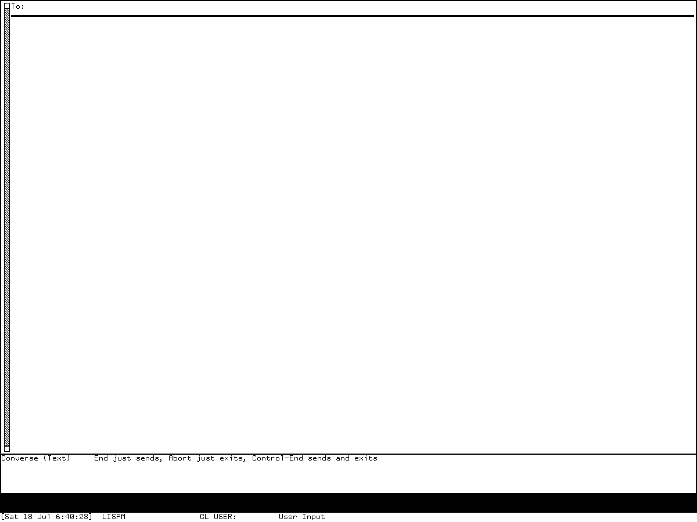
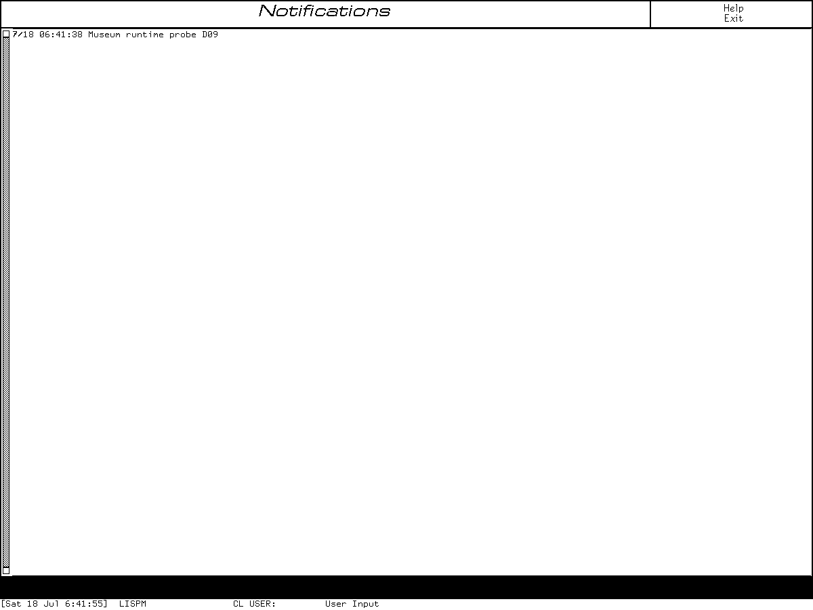

# Converse, direct messages, and notifications reimplementation specification

## Status and reconstruction claim

This specification defines D09 as five separately selectable evidence profiles:

- `DM-C46-SRC`, the direct-message sender, receiver, reply pop-up, and received
  history present in the public MIT CADR System 46 source at Git revision
  `8e978d7d1704096a63edd4386a3b8326a2e584af`;
- `DM-C303-SRC`, the maintained LM-3 System 303 Converse application, QSend
  compatibility interfaces, SHOUT, Chaos `SEND`, network `NOTIFY`, and TV
  notification machinery at Fossil check-in
  `4df393c68d7f083ce42d5c377039d26043cc18a9031ace28258dc97f4137eb91`;
- `DM-C303-3030-RUN`, the tested System `303-0` load-band profile, which is a
  negative reachability and load-failure witness rather than a running Converse
  profile;
- `DM-G452-SRC`, the licensed System 452.1 / Zmail 442.0 source profile for
  Converse, the old and new direct-message protocols, central notification
  delivery, the Notifications activity, network `NOTIFY`, and the relevant Command
  Processor reports; and
- `DM-G85-RUN`, the bounded compiled-world behavior observed in the locally
  preserved Genera 8.5 System 452.22 world: entry to an empty Converse frame and
  retention of one researcher-authored notification in the separate Notifications
  activity.

The contract is implementation-independent. A conforming implementation MAY replace
Flavors, special variables, linked editor lines, extensible strings, TV sheets,
Dynamic Windows frames, Chaosnet streams, processes, and wakeup primitives with
host-language equivalents. It MUST preserve the selected profile's observable
state, input dispatch, ordering, address interpretation, queue ownership,
acknowledgement points, partial failures, retained-history rules, visible
relationships, and explicitly selected historical defects.

This specification does **not** claim source, package, ABI, QFASL, world-image,
packet, byte-for-byte UI, font, or pixel compatibility. The source profiles do not
prove that their bodies reside unchanged in either tested world. The runtime
profiles do not prove unexercised source branches. No preserved run delivered a
message to a peer, and this document therefore makes no runtime claim for peer
delivery, replies, broadcast, duplicate filtering, group-conversation matching, or
wire interoperability. A conforming implementation MAY use inert recording peers at
levels below the preserved-peer comparison level.

The public System 46 snapshot contains no full Converse application, SHOUT, or
network `NOTIFY` implementation. A runner MUST reject a request for a
`DM-C46-CONVERSE` profile rather than substituting System 303 behavior. Conversely,
an implementation MUST NOT add Genera's exact-recipient-set model, asynchronous
status replacement, or central Notifications activity to a strict System 303
profile.

Licensed Genera source and world material remains an evidence-only local input. This
specification is original prose and does not authorize redistribution of that
source, decoded Help, world data, conversations, or extracted assets.

## Normative language and evidence codes

`MUST`, `MUST NOT`, `SHOULD`, `SHOULD NOT`, and `MAY` have their usual requirements
meanings. A requirement qualified by a profile applies only when that profile or its
named feature closure is selected.

| Code | Evidence class | Establishes | Does not establish |
| --- | --- | --- | --- |
| `C46-SRC` | public System 46 source | the quoted QSend entry, destination split, `SEND` exchange, serialized incoming pop-up, reply path, and `SAVED-SENDS` order | a full Converse frame, later notification system, or matching-band runtime |
| `C303-SRC` | maintained LM-3 source | Converse data structures, application table, queueing, options, old `SEND`, SHOUT, network `NOTIFY`, TV notification history, defaults, algorithms, and source-visible defects | pristine historical provenance or residency in the tested System `303-0` band |
| `C303-RUN` | CADR Xvfb harness | absent Converse select key, failed normal load paths, direct-source initialization failure, compile-bridge boundary, and clean stop | a visible Converse frame or any network behavior |
| `G452-SRC` | licensed local System 452.1 / Zmail 442.0 source | exact selected source-profile state, commands, old/new protocols, request ordering, background work, notification delivery, and reports | redistribution permission, configured-site behavior, or identity with the 8.5 world |
| `G8-MAN` | public Genera 8 manuals | contemporary terminology, intended workflow, documented commands, and user options | every source branch, defect, timing constant, or live 8.5 result |
| `G85-RUN` | isolated Genera harness | live `Select C` and `Select N` entry, empty Converse layout, one retained synthetic notification with pop-ups disabled, and exact capture provenance | peer delivery, multiple-record order, pop-up timing, group matching, or source-to-world identity |
| `INTERP` | stated reconstruction interpretation | a portable semantic representation justified by named evidence | a historical implementation fact |
| `TODO-ORACLE-*` | named unresolved oracle | the precise experiment still needed | permission to guess or silently normalize releases |

Source wins for strict source-profile branches that were not exercised. Runtime
wins only for the exact observed compiled-world behavior. Manual/source and
source/runtime disagreement MUST remain a selectable delta or a named oracle; it
MUST NOT be smoothed into an undocumented compromise.

## Compatibility profiles and levels

### Release profiles

| Profile | Normative surface | Required substrate | Explicit exclusions |
| --- | --- | --- | --- |
| `DM-C46-SRC` | `QSEND`, `SEND-MSG`, inbound `SEND`, `PRINT-SENDS`, `SAVED-SENDS`, reply pop-up | System 46 TV streams, input editor, Chaos stream adapter, login and host parser | Converse frame; SHOUT; network `NOTIFY`; Genera central history |
| `DM-C303-SRC` | Converse editor, listener QSend/reply, incoming pop-up, saved sends, SHOUT, Chaos `SEND`, network `NOTIFY`, TV pending/deferred/history facilities | System 303 ZWEI, TV, process/queue services, Chaos and site-machine adapters | Genera CONVERSE protocol; exact-recipient-set grouping; Notifications activity |
| `DM-C303-3030-RUN` | observed select-key and load boundary only | exact recorded System `303-0` band and harness | any claim that Converse became usable in that run |
| `DM-G452-SRC` | Converse editor and QSend, SEND and CONVERSE transports, asynchronous statuses, central notifications, Notifications activity, CP Send/Show reports, network `NOTIFY` | System 452.1 / Zmail 442.0 ZWEI, TV, Dynamic Windows, CP, namespace, network-service and process adapters | CLIM; arbitrary site patches; unselected Mailer or Zmail-reader semantics |
| `DM-G85-RUN` | observed empty Converse and one-record Notifications states | exact recorded Genera 8.5 System 452.22 world and isolated harness | successful peer exchange, popup delivery, more than one record, or complete input execution |

`DM-C303-3030-RUN` and `DM-G85-RUN` are witness profiles. They MAY be combined
with their respective source profile in a report, but they MUST keep provenance and
claims distinct. In particular, `DM-G452-SRC + DM-G85-RUN` means “implement the
selected source contract and compare the bounded states seen in the world,” not
“prove every selected function is the world's loaded implementation.”

### Conformance levels

| Level | Required closure |
| --- | --- |
| `L1` semantic core | profile-tagged state; deterministic direct-message, queue, history, and notification transitions; complete error values; explicit clock, filesystem, address, network, mail, display, and scheduler adapters; inert peer permitted |
| `L2` interactive application | `L1` plus every effective direct, inherited, prefix, transient, menu, pointer, presentation, numeric-argument, repeat, Help, shadowing, fallthrough, and unbound input path incorporated below; frame/view lifecycles; rights-safe visual relationships |
| `L3` preservation fidelity | `L2` plus preserved-system comparison; exact selected wire serialization and acknowledgement order; timing-visible queue and popup behavior; isolated real peers; profile-specific defect results; and closure of every mandatory `TODO-ORACLE` for the claimed feature |

An `L2` implementation MAY use a recording network adapter and MUST identify that
adapter in its conformance label. It MUST NOT describe local acceptance or insertion
of a pending record as historical network delivery. `L3` requires a deliberately
isolated peer configuration and must record both endpoints and all delivered bytes
without publishing licensed payloads.

### Feature closures

| Closure | Profiles | Requirement when selected |
| --- | --- | --- |
| `DIRECT-C46` | `DM-C46-SRC` | quoted QSend macro semantics, raw sender/receiver, serialized popup, reply, arrival-order compatibility history |
| `CONVERSE-C303` | `DM-C303-SRC` | full structured ZWEI buffer, request queue, commands, QSend bridge, incoming modes, newest-first saved sends |
| `SHOUT-C303` | `DM-C303-SRC` | source-selected site iteration and strict/corrected defect mode |
| `NET-NOTIFY-C303` | `DM-C303-SRC` | stream request/reply, duplicate rule, single/all-host behavior |
| `TV-NOTIFY-C303` | `DM-C303-SRC` | pending/deferred queues, terminal command, history and selected-window behavior |
| `CONVERSE-G452` | `DM-G452-SRC` | exact-recipient-set model, synchronous preflight, asynchronous send worker, SEND fallback, CONVERSE parser/server |
| `CENTRAL-NOTIFY-G452` | `DM-G452-SRC` | history, delivery tail, process, console/remote delivery, fallback popup and delivery modes |
| `NOTIFICATIONS-ACTIVITY-G452` | `DM-G452-SRC` | Dynamic Windows history viewer, polling, inherited input and local commands |
| `CP-REPORTS-G452` | `DM-G452-SRC` | `Send Message`, `Show Messages`, and `Show Notifications`, including complete keyword surfaces |
| `NET-NOTIFY-G452` | `DM-G452-SRC` | one-packet receiver/sender, 10-second host-scoped duplicate suppression, site/local helpers |
| `EXPORT` | Converse source profiles | profile-specific write/append behavior; no automatic transcript implied |
| `HARDCOPY-G452` | `DM-G452-SRC` | hardcopy request routing only; D35 owns printer implementation |

A conformance declaration MUST name its selected closures. `CONVERSE-C303` and
`CONVERSE-G452` are mutually versioned and MUST NOT share hidden defaults. A product
offering both MUST expose the release selection before any conversation state is
created.

## Evidence ledger

### Public source artifacts

All paths below are repository-relative descriptions of pinned public upstream
artifacts. Byte counts and SHA-256 values were recomputed from the preserved copies.

| Evidence | Artifact | Bytes | SHA-256 | Role |
| --- | --- | ---: | --- | --- |
| `C46-SRC` | `src/lmio/chsaux.113` | 47,474 | `1990f30c37def0129f7f36faac310f68b303687571d46ff8057b93ac0b6e316d` | QSend macro, SEND client/server, reply popup, saved sends |
| `C303-SRC` | `io1/conver.lisp` | 60,328 | `0142dd413d30445c63fa8347ecf802418a8089066bbc69b66f168d3f8d4904ba` | Converse editor, commands, requests, QSend, incoming service |
| `C303-SRC` | `network/chaos/chsaux.lisp` | 67,218 | `29fb941e5147b5f7ae51331f90dd11ffbf9ed93058c1e0835d6c6900f3803a05` | SHOUT and network NOTIFY |
| `C303-SRC` | `sys2/string.lisp` | 49,754 | `070c8f058bca3410ba5871ac1dbf00cb53d0d01b077111925d1fd314c29b12a5` | symbol/string coercion used to establish SHOUT's source result |
| `C303-SRC` | `window/basstr.lisp` | 81,846 | `8ba3a16e726ed043e6585c7a68b7096bb2dcc5d6f05476afd89f84a48dff2645` | notification command, history, `TV:NOTIFY` |
| `C303-SRC` | `window/baswin.lisp` | 82,708 | `3b86ca413528046887da8371433d656ecd9d5f9130d6eadd764fc54f137b42f1` | notification stream delivery, pending/deferred queues, popup selection |
| `C303-SRC` | [`sys/ltop.lisp`](https://tumbleweed.nu/r/sys/file?name=sys%2Fltop.lisp&ci=4df393c68d7f083ce42d5c377039d26043cc18a9031ace28258dc97f4137eb91) | 42,225 | `57dd2591cfeb84ee00f1d9cb51c17b5c30f22e36026074117e3420f4e3dc943e` | distinct cold, before-cold, and once/first initialization phases |
| `C303-SRC` | `sys/sysdcl.lisp` | 25,396 | `2999f1824666171d729dae611a09204ac0bd42373f30d7d22c733f904c27a6dd` | selected Converse module and outer-system declaration |

The System 46 pin is Git revision
`8e978d7d1704096a63edd4386a3b8326a2e584af`. The maintained System 303 pin is
Fossil check-in
`4df393c68d7f083ce42d5c377039d26043cc18a9031ace28258dc97f4137eb91`.
They are different source lineages and MUST NOT be treated as two directories in one
release tree.

### Licensed Genera evidence-only artifacts

These source files remain local and untracked. Their identities can be checked by an
authorized researcher; their bodies are not reproduced here.

| Artifact | Bytes | SHA-256 | Role |
| --- | ---: | --- | --- |
| `zmail/converse/converse.lisp.~1564~` | 89,288 | `bd15925898941848626bb4fa051a56d70f23e9547aff58deb8bf2c6a1e493bd9` | editor, commands, address grouping, QSend, async send, SEND/CONVERSE services |
| `window/notification.lisp.~116~` | 28,978 | `b845b2795f279919e853d50668bba9f4dcb185b18f0019b347726ec6b81ac10e` | notification record, history, delivery process, popup, printing |
| `window/tvdefs.lisp.~488~` | 68,717 | `8d4f22284a36e6e465ffda185279415a00cb3234251a6a769bd260d61ba79a5a` | notification history, TV last tick, delivery-tail definitions, and temporary-window lifecycle |
| `window/notifications-activity.lisp.~4011~` | 8,339 | `41f5deee29753d0a0fc26c513818cb4e125315d8be6afc5f4cbd8bada5881f02` | Select-N Dynamic Windows activity and its local table |
| `network/protocols.lisp.~134~` | 42,657 | `3fb78acff2b08ee38be796bb4c90825c4a3e89bfc822456251fb94266ca64d64` | one-packet NOTIFY client/server and site helpers |
| `cp/info-commands.lisp.~129~` | 19,303 | `7183e0229b3be5c2e60b4d2ec50e9c2c839d3e2c131882c3aaec359a8d3c42fc` | `Show Notifications` selection and filtering |
| `zmail/definitions.lisp.~1552~` | 98,226 | `f5c96f713e3105acb78d1a79de3d0739afd361f297b3a9b6b647fd4638144aa6` | CP communication command-area ownership |
| `zmail/system.lisp.~81~` | 5,673 | `7a76f3f99df71721376e5cddb247b616568ddbc420fa17cc13aa5fd3804be17b` | one-file Converse subsystem and Zmail build relationship |
| `sys/ltop.lisp.~754~` | 25,132 | `18f1cc03e5a5aefc06b97eaa5649cffdf2717b824f994422d8ea2111f1db6ebb` | distinct before-cold-before-save and once/first initialization scheduler phases |

The inspected patch directory identifies System 452.1 / Zmail 442.0. The runtime
artifact identifies Genera 8.5. No body-by-body source-to-world comparison was
performed, so those are deliberately separate profiles.

### Normative evidence map

| Contract area | System 46 owner | System 303 owner | Genera owner |
| --- | --- | --- | --- |
| entry and direct send | `chsaux.113:542-676` | `conver.lisp:992-1419` | `converse.lisp.~1564~:1195-1495` |
| conversation state and rendering | absent | `conver.lisp:141-519` | `converse.lisp.~1564~:116-587` |
| commands and input | shared query/input editor plus `chsaux.113` | `conver.lisp:523-987` and incorporated CADR companion | `converse.lisp.~1564~:593-1191` and incorporated Genera companion |
| old SEND wire behavior | `chsaux.113` | `conver.lisp:992-1419` | `converse.lisp.~1564~:1513-1908` |
| new CONVERSE wire behavior | absent | absent | `converse.lisp.~1564~:1513-1908` |
| SHOUT/network NOTIFY | absent | `network/chaos/chsaux.lisp` | `network/protocols.lisp.~134~` |
| notification delivery/history | only QSend popup in D09 scope | `basstr.lisp`; `baswin.lisp` | `notification.lisp.~116~` |
| notification viewer/report | terminal notification command only | terminal notification command and printer | `notifications-activity.lisp.~4011~`; `cp/info-commands.lisp.~129~` |
| initialization phase scheduling | selected module-local registration | `sys/ltop.lisp:647-654,691-721,727-776` plus module registrations | `sys/ltop.lisp.~754~:282-319,347-366` plus module registrations |
| runtime reachability and visuals | no D09 run | `d09-converse-20260718`, generation 1 | `d09-converse-notifications-genera-20260718`, generation 2 |

The historical [D09 dossier](converse-direct-messages-and-notifications.md) is an
evidence narrative, not a replacement for this contract. The complete local and
effective input semantics are normatively incorporated below from the two dedicated
companions.

## Architecture and ownership boundaries

### User-interface substrates and CLIM nonrelationship

`DM-C46-SRC` uses TV streams, a shared input editor, a reusable pop-up text window,
and a shared yes/no query reader. It is not a CLIM application.

`DM-C303-SRC` Converse is a one-pane ZWEI application hosted by a TV
`CONVERSE-FRAME`, with a process/select lifecycle, editor command tables, and TV
pop-up/notification facilities. It predates CLIM. Terms such as frame, command
table, menu, and notification do not imply CLIM ownership.

`DM-G452-SRC` Converse remains a Flavors/ZWEI/TV application. It uses a TV frame,
ZWEI intervals and command tables, and a Dynamic Windows margin scrollbar; it is
not a `DEFINE-APPLICATION-FRAME` and does not use a CLIM port or CLIM command-table
protocol. The separate Notifications activity is a Dynamic Windows
`DEFINE-PROGRAM-FRAMEWORK` program with a title pane, command menu, and typeout pane.
Its inherited `Standard Arguments` and `Input Editor Compatibility` tables are
Dynamic Windows/Command Processor facilities, not CLIM.

The CP commands use Genera Command Processor presentations and keyword parsing.
That also does not make Converse or Notifications CLIM applications. A recreation
MAY be implemented on CLIM, but CLIM would be the port's substrate, not a historical
compatibility claim. It MUST reproduce the specified behavior rather than exposing
unselected generic CLIM gestures.

### Functional layers

The specification separates seven layers whose histories and failure boundaries
must not be collapsed:

1. **Composition and conversation:** editing an anonymous `To:` composer and
   retaining sent/received status records.
2. **Address resolution and preflight:** interpreting a destination, locating a
   host or service path, checking login/receive/service policy, and selecting a
   protocol.
3. **Transport:** old stream `SEND`, Genera `CONVERSE`, or one-packet `NOTIFY`.
4. **Server acceptance:** parse, policy checks, optional preliminary response, body
   collection, local handoff, and final acknowledgement.
5. **Foreground/background handoff:** moving completed network or send work onto the
   editor or notification owner's queue without concurrent interval mutation.
6. **Notification delivery:** storing a central record, selecting a destination
   stream, and falling back to a popup or configured noninteractive mode.
7. **Views and reports:** Converse, the Notifications activity, `PRINT-SENDS`,
   `PRINT-NOTIFICATIONS`, and CP `Show` commands.

A delivery acknowledgement is not a durable transcript commit. A Converse record
is not a network queue. A notification history item is not a Converse conversation.
An export file is not automatically reloaded state. These distinctions are
normative.

### Required subsystem interfaces

A portable implementation MUST expose or internally define the following adapters:

| Adapter | Minimum contract |
| --- | --- |
| `Clock` | monotonic ticks for delays/timeouts and wall time for displayed headers; deterministic test control |
| `Identity` | current logged-in user, local host, sender display identity, and source address |
| `AddressResolver` | profile-selected split/canonicalization, bare-user search, host menu, machine/site inventories |
| `DirectTransport` | open/contact, write/read/EOF, preliminary/final response, close state, failure object, timeout |
| `MailFallback` | normalized recipients, subject, body, submission result; separate from direct-delivery success |
| `Editor` | interval lines, point, insertion/deletion, linked conversation boundaries, parent command table |
| `FrameScheduler` | enqueue, wake, post-command hook, exposure, process start/stop, abort boundary |
| `NotificationSink` | selected-window delivery, pending/deferred queues, popup, delivery-mode cell, remote terminals |
| `Filesystem` | choose pathname, probe, read existing bytes for append profile, create/write, close, and failures |
| `PresentationRecorder` | Genera notification content that can be replayed to display streams without storing a live window |
| `Renderer` | divider/header lines, text styles, scrollbar, mode line, popup/query choices, title/menu panes |
| `AuditLog` | profile, ordered state transitions, adapter calls and results without retaining private message data by default |

The `DirectTransport` interface MUST distinguish open failure, header rejection,
preliminary acceptance, body-write failure, EOF, final acknowledgement, timeout,
and close. Returning one undifferentiated boolean cannot satisfy the failure-order
tests.

## Semantic state model

### Common records

The following normalized types are `INTERP` abstractions. Profile adapters determine
which fields exist and how they are rendered.

```text
Address = {
  original_text, person, host, canonical_person?, canonical_host?, path?
}

MessageRecord = {
  direction, sender, recipients[], also_to[], identity?, private?, encrypted?,
  notification?, submitted_at?, received_at?, body, status, diagnostic?,
  transport_profile, display_order_token
}

Conversation = {
  profile, key, header_start, first_content, delimiter, last_content,
  append_mode, old_messages[], visible, temporary_status_ids[]
}

NotificationRecord = {
  time, replayable_text, plain_text_projection?, window_of_interest?
}
```

`status` MUST distinguish at least `composer`, `pending`, `sent`, `mailed`,
`not-sent`, `received`, and `notification-only` where the selected profile can
produce them. The implementation MUST NOT represent `pending` as `sent` merely
because the UI has already restored a blank composer.

### System 46 state

`DM-C46-SRC` contains:

- `saved_sends`, one extensible received-message string;
- `send_popup`, a reusable 400-pixel-high TV text window with saved bits;
- `send_lock`, a global single-owner lock for incoming display/reply interaction;
- `bell_count`, default 2;
- the current incoming stream, parsed requested person, derived reply sender, header,
  body, and notification stream; and
- no D09-defined full conversation list or automatic transcript pathname.

Incoming records append to `saved_sends` with two returns, so print order is oldest
first. The selected file defines no cold-reset hook for this string. A strict port
MUST preserve that absence as “lifetime not established by this module”; it MUST NOT
invent a permanent file or assert survival across every world-save operation.

### System 303 Converse state

The normalized System 303 frame contains:

```text
C303Frame = {
  conversations[], first_conversation, last_conversation,
  anonymous_composer, request_queue, exposed, active,
  receive_mode=:NOTIFY-WITH-MESSAGE, append=false,
  end_exits=false, beep_count=2, extra_hosts=[], wait=true,
  gagged=false-or-string, last_sender?, saved_sends,
  buffer_munged_saved_conversation?
}

C303NotificationState = {
  history_newest_first=[], pending=[], deferred=[],
  last_network_notification_text=NIL
}
```

Each conversation owns a header start, body start, sender/recipient identity, host,
delimiter, last line, append mode, and in-memory old-message list. The first entry is
the headerless anonymous `To:` composer. A qualified group send creates one separate
conversation for each recipient in this profile.

The request queue is FIFO: an ordinary enqueue appends and wakes the frame by forcing
an execute event; a delayed enqueue appends without waking it. Exposure and the
post-command path provide later drains. The command loop applies the oldest request
and deletes it after successful application. A nonlocal exit from the handler MAY
leave that request queued in the strict source profile.

`saved_sends` is separate compatibility state. Its first source binding is an empty
extensible string, but the selected before-cold initializer sets it to `NIL` rather
than a new empty string. Incoming text is prepended, so its print order is newest
first. On the first receive after that reset, the selected string coercion appends
the literal characters `NIL` after the new record; a fresh source load that has not
run before-cold does not. Immediately after reset and before a receive,
`PRINT-SENDS` passes `NIL` to the output stream's string-output operation; the exact
preserved-stream result remains a runtime oracle. The same selected before-cold
initializer does not assign `last_sender`; strict mode MUST retain its exact prior
value across that operation. This is not a claim that the register survives every
cold-boot or world-loading mechanism.

The distinct TV before-cold initializer clears only notification history. It does
not assign the pending or deferred queues, so strict invocation MUST retain exact
sentinel list identities in both. The Chaos NOTIFY duplicate filter begins as NIL,
then retains the last nonduplicate packet text; a duplicate leaves it unchanged.
No selected reset form clears that text register. These are operation-level source
contracts, not claims that arbitrary boot or image-loading machinery preserves the
values.

### Genera Converse state

The normalized Genera frame contains:

```text
G452Frame = {
  conversations[], first_conversation, last_conversation,
  anonymous_composer, request_stack, active, selected,
  receive_mode=:POP-UP, append=false, end_exits=false,
  beep_count=2, gagged=false-or-string,
  last_recipients[], last_ident?, saved_sends,
  divider_height=3/4-line, message_divider_height=1/4-line
}

G452NetworkNotifyFilter = {
  text_buffer[1500], length=0, packet_tick=0, resolved_host=NIL
}
```

A real conversation key is an identity when present, otherwise an exact recipient
set. Recipient equality requires equal list lengths and that every candidate address
matches an existing address. The selected implementation does not consume matched
elements, so repeated-address multiplicity has a strict source-profile edge case:
equal lengths plus membership can make `[A,A]` and `[A,B]` compare equal when every
candidate finds some matching `A`. A corrected multiset comparator MAY be offered,
but MUST be labeled `CORRECTED-RECIPIENT-MULTISET`; it is not strict source identity.

The Genera datagram NOTIFY filter has deterministic fresh-source state: a
1,500-character comparison buffer, zero length, zero packet tick, and NIL host. A
successfully handled nonduplicate packet first assigns packet tick, resolved host,
and length, then copies the payload into the retained buffer; a suppressed duplicate
replaces none of them and therefore does not refresh the ten-second window. A copy
failure leaves the new scalar values and an implementation-defined copied prefix in
the old/new buffer because there is no rollback. The selected source establishes no
initialization registration that clears this tuple. A reset extension MUST be
labelled and MUST NOT be folded into strict operation semantics.

Each retained old-message entry includes a before/after flag, text, and formatting
arguments. Incoming records are placed before the composer and outgoing records
after it according to the profile's rendering rule. Temporary outgoing headers are
identified so the completion handler can replace them. If the user deletes the
conversation during a send, completion finds or recreates the destination
conversation and inserts the final record there.

The frame request structure is LIFO because producers `PUSH` onto it. The
post-command hook removes a request **before** applying it and catches command-loop
abort. A failed or aborted handler is therefore not retried in the strict Genera
source profile.

### Central Genera notification state

```text
NotificationService = {
  history_newest_first[], delivery_tail, process, wakeup,
  allow_popup=true, tv_last_notification_tick?,
  last_popup_tick_by_console{}, consoles[], remote_terminals[]
}

TerminalNotificationMode = {
  cell_state, mode in {NIL, :POP-UP, :IGNORE, :BLAST,
                       :ALWAYS-IGNORE, :ALWAYS-POP-UP},
  selected_window?, prior_io?, pending?
}
```

Each history record retains a time, a presentation-recording string, and optional
window of interest. History is newest first. The delivery process traverses list
tails so undelivered entries reach outputs in oldest-first arrival order. These two
orders are both normative.

Two registrations have separate effects. The selected `:BEFORE-COLD` operation sets
only history and its delivery-tail pointer to NIL; it leaves the TV
last-notification tick and current process object untouched. A distinct `:ONCE`
operation calls the process initializer: it kills a non-NIL prior process, clears
that process slot, constructs a priority-five system process, enables
`:NO-KBD-ARREST`, presets the notification delivery top level, and enables the new
process. The process initializer leaves history, delivery-tail identity, and the TV
last-notification tick untouched. Strict mode MUST expose the two operations
independently and MUST NOT claim that `:ONCE` runs on every cold unless a selected
initialization scheduler proves it. Neither operation creates an automatic
transcript file.

Process recreation is ordered and nontransactional: kill prior process when non-NIL;
set the slot NIL; allocate the new process into the slot; enable no-keyboard-arrest;
preset its top-level function; enable it. Failure after any step retains preceding
effects. Allocation failure can leave no process, while a later setup failure can
leave the slot naming a partially configured process. Strict mode MUST NOT roll this
sequence back.

Popup throttling state is per console, not global. The delivery process retains a
console-to-last-popup-time association, updates only the console whose popup
succeeded, and removes an association after its 600-tick separation interval has
elapsed. This process-local map is distinct from the TV global last-notification
time updated by notification insertion/delivery and from the network duplicate
filter's packet time. A popup on one console MUST NOT throttle
an otherwise eligible popup on another.

### Invariants

Every conforming source-profile implementation MUST continuously satisfy:

1. the first visible line belongs to `first_conversation`;
2. following conversation links reaches every conversation exactly once and ends at
   `last_conversation`;
3. for every retained conversation, `header_start <= first_content <= delimiter <=
   last_content` in visible interval order;
4. no network process directly mutates the editor interval;
5. one anonymous composer exists while the application is initialized;
6. an outgoing temporary status has at most one live completion identity;
7. no acknowledgement is reported before the selected protocol's acknowledgement
   boundary;
8. notification history insertion occurs before attempted delivery;
9. a view may consume or advance a delivery tail only through the selected profile's
   explicit rule; viewing MUST NOT delete retained history;
10. exported bytes never become authoritative in-memory history merely because the
    write succeeded; and
11. profile selection and defect/correction mode are immutable for the lifetime of
    a frame.

The strict System 303 composer-deletion defect is an intentional selectable
invariant violation after that command. A port claiming
`DM-C303-SRC+STRICT-DEFECTS` MUST reproduce and detect it. A normal safety-oriented
port SHOULD select `CORRECTED-COMPOSER-DELETE`, refuse deletion or assign the new
list head, and record the correction.

## Complete effective input and gesture trees

### Normative companion incorporation

The exact finite input contracts are incorporated normatively from:

- [System 46 and System 303 Converse direct-messaging bindings and
  semantics](mit-cadr/converse-direct-messaging-bindings-and-semantics.md); and
- [Genera Converse and Notifications bindings and
  semantics](genera/converse-notifications-bindings-and-semantics.md).

For their selected profiles, those companions own the enumerated direct keys,
inherited parent-table closure, local overrides, prefix nodes and leaves, transient
input-editor and popup contexts, numeric arguments, repeat behavior, menus, pointer
gestures, CP keyword presentations, Help exposure, shadowing, fallthrough, and
unbound results. This main specification owns state, ordering, transactions,
protocols, failures, and conformance composition.

The [System 303 ZWEI inventory](mit-cadr/zwei-zmacs-keybindings.md) and
[Genera Zmacs inventory](genera/zmacs-keybindings.md) define the generic inherited
editor leaves referenced by those companions. Inheritance is normative, not a
license to copy the host editor's current defaults. An implementation MUST resolve
the effective tree for the selected profile and context before claiming `L2`.

### Entry and context tree

```text
DM-C46-SRC
├── Lisp form: (QSEND destination [message])
├── Function: SEND-MSG destination [message]
│   └── omitted message -> shared input-editor termination/abort tree
├── Function: PRINT-SENDS [stream]
└── incoming QSend popup -> shared yes/no reply tree

DM-C303-SRC
├── application selection -> Converse ZWEI table -> Standard ZWEI parent
│   ├── direct local leaves
│   ├── Help -> M local branch
│   └── extended-command name table
├── (QSEND) -> select Converse
├── (QSEND destination [message])
│   └── omitted message -> QSend input-editor local overrides -> parent editor
├── (REPLY) -> most recent sender
├── incoming popup -> local key/mouse choice tree
├── Terminal-N -> notification-history argument tree
└── listener network commands -> prompt editor and host-selection trees

DM-G452-SRC
├── Select C -> Converse ZWEI table -> Standard Zmacs parent
│   ├── direct local leaves and explicit undefined cells
│   ├── Control-X -> local prefix table -> Standard Control-X parent
│   └── extended-command name table
├── QSend/Reply -> CP/input-editor and presentation histories
├── incoming popup -> ordinary or encrypted local choice tree
├── Select N -> Notifications program table
│   ├── local Help/Exit
│   └── Dynamic Windows inherited tables
└── CP Communication/Session areas
    ├── Send Message
    ├── Show Messages -> specialized + common keyword tree
    └── Show Notifications -> specialized + common output tree
```

### System 303 application-owned summary

The companion's exact mapping includes the following direct leaves, which this table
summarizes without replacing their full effective contexts:

| Leaf | Strict source result |
| --- | --- |
| `End` | send; remain by default, exit when `end_exits` is true |
| `Control-End` | send; exit by default, remain when `end_exits` is true |
| `Control-Z` | dispatch to an installed but undefined `COM-CONVERSE-SEND-WITH-EXIT` target; do not silently call the similarly named ordinary function |
| `Abort` | deselect/bury without sending unfinished composer text |
| `Meta-{`, `Meta-}` | previous/next conversation navigation |
| `Control-M` | mail current composer instead of direct send |
| `Control-Meta-Y` | insert last received body; before any receive the direct editor path coerces `NIL` to the literal text `NIL`, while the transient QSend reader inserts no bytes |
| `Help`, then `M` | local Converse Help through the ordinary ZWEI Help dispatcher |

The direct table inherits Standard ZWEI. It installs no Converse-specific pointer
table. Named commands are `Regenerate Buffer`, `Delete Conversation`, `Write
Buffer`, `Write Conversation`, `Append Buffer`, `Append Conversation`, `Disable
Converse`, `Enable Converse`, and `Gag Converse`. `Gag Converse` toggles without a
large numeric argument; an integer argument of 2 or greater forces disable.

The hard-coded Help text reverses `End` and `Control-End` relative to the handlers,
mode line, and release note and omits `Control-Z`. Strict command dispatch follows
the table/handler, not stale prose. Help conformance MUST preserve or explicitly
annotate the mismatch according to the selected compatibility mode.

The QSend prompt accepts `End` and `Control-Z` as completion, `Abort` as
cancellation, `Control-Meta-Y` as last-body yank, and `Control-Meta-E` as transfer
to Converse. Incoming popup choices, including all key aliases, who-line choices,
and the two local click cells (left selects Converse; middle dismisses), are
normative in the CADR companion. Every other pointer button has no local popup
effect.

### Genera application-owned summary

The Genera companion's exact Converse mapping includes:

| Leaf | Result |
| --- | --- |
| `End` | send; remain by default, bury when `end_exits` is true |
| `Control-End` | send; bury by default, remain when `end_exits` is true |
| `Abort` | bury without sending unfinished composer text |
| `Help` | direct local explanation |
| `Control-Meta-[`, `Control-Meta-]` | previous/next conversation |
| `Control-M` | mail rather than direct-send current composer |
| `Meta-Q` | fill paragraph while protecting `To:` and `Also-to:` structural headers |
| `Control-Z`, `Meta-Z`, `Control-Meta-Z` | explicitly undefined in this mode |

Its local `Control-X` prefix leaves are exactly `1` one-window, `2` two-windows,
`3` view-in-two-windows, `^` grow-window, and `O` other-window. Every other
`Control-X` leaf falls through to the selected Standard Zmacs prefix except where
the companion marks it shadowed or unbound.

The exact extended commands are `Regenerate Buffer`, `Delete Conversation`, `Write
Buffer`, `Write Conversation`, `Append Buffer`, `Append Conversation`, `Compile
File`, `Load File`, `Hardcopy Buffer`, `Bug`, and `Report Bug`; the last two names
invoke the same operation. Commented encryption cells are not commands.

The Notifications activity locally maps `Help`, `?`, and menu **Help** to Help;
`End`, `Abort`, and menu **Exit** to bury/deselect. Its inherited exact leaves include
`Scroll`, `Meta-Scroll`, `Super-S`, `Super-R`, `Control-Mouse-L`,
`Control-Mouse-R`, `Super-W`, `Meta-W`, `Refresh`, and the left scrollbar, plus the
source-installed `Show GC Status` command. The companion defines their modifiers,
contexts, fallthrough, and generic table origins.

### Numeric, repeat, Help, and unbound requirements

Numeric arguments are part of command identity. A dispatcher MUST preserve at least:

- System 303 `Gag Converse`: integer 2 or greater means force disabled; other/no
  argument toggles;
- Genera `Meta-Q`: a positive numeric argument requests paragraph adjustment while
  filling; absent or nonpositive follows ordinary fill behavior;
- System 303 Terminal-N: absent means pending, argument `T` means pending with early
  return when none, integer 1 means all, and integer 2 moves pending to deferred
  without display;
- report range/count arguments and common CP output arguments as enumerated by the
  Genera companion; and
- inherited editor repeat and universal-argument semantics only from the selected
  parent table, never from a modern editor's conventions.

Explicitly undefined Genera Z chords MUST stop at the local cell. They do not fall
through. The System 303 `Control-Z` entry MUST attempt its named command and expose
the resulting undefined-target behavior unless a separately selected correction is
active. A key absent locally follows the parent table; a key absent from every
effective table invokes the selected profile's ordinary undefined-command path and
MUST NOT insert a host character silently.

### Exhaustive enumeration requirement

An `L2` implementation MUST provide a machine-readable enumeration tuple for every
reachable input:

```text
(profile, frame, pane, editor-mode, transient-context, prefix-path,
 modifiers, gesture, numeric-argument-class, resolved-owner,
 command-or-presentation, result-class)
```

The enumerator MUST walk prefix tables recursively, detect cycles by table identity,
retain local shadowing, expand inherited tables in precedence order, include
presentation translators and menu accelerators, and emit explicit unbound leaves.
It MUST compare the resulting finite set with the applicable normative companion.
Sampling “important keys” is not conformance.

## Lifecycle, concurrency, and queue contracts

### System 46 incoming transaction

For an accepted old `SEND` connection, `DM-C46-SRC` MUST perform:

1. parse the requested person, defaulting to `anyone` when omitted;
2. remember the prior saved-string end and append the local receive heading before
   accepting/reading message content;
3. read and append the remote first line, derive the reply sender from it, and then
   copy body bytes through EOF directly into `saved_sends` as they arrive;
4. close the transport connection after the copy completes;
5. append the final two returns to terminate the committed record;
6. beep `bell_count` times, before attempting to acquire the interaction lock;
7. wait to acquire the global QSend interaction lock;
8. on only the first failed lock attempt, report a waiting-message notice to the
   notification stream only when the shared popup's status is not `:SELECTED`;
9. prepare the reusable QSend window; when it was hidden, clear it and display only
   the new segment rather than the entire saved history;
10. remove the closed connection from the server's active registry;
11. ask the shared yes/no reply question;
12. on yes, call the same direct sender toward the derived sender; on no, make no
   outbound attempt;
13. on normal completion, clear the lock and yield once to the scheduler;
14. deselect and deactivate the popup only if no successor acquired the lock during
    that scheduling opportunity; and
15. on a nonlocal exit, clear the lock only when the current process still owns it.

If `LISTEN` returns a connection whose state is not `RFC-RECEIVED-STATE`, the server
skips RFC read, accept, history mutation, close, popup allocation/beep/display,
reply, and all sender derivation. It still attempts `REMOVE-CONN` exactly once and
normally returns NIL. A `LISTEN` failure or a failure while obtaining/comparing the
state occurs before that ordinary removal; the unwind protects only an already owned
popup lock and does not remove or close the connection.

An error or nonlocal exit after lock acquisition MUST still release the lock. A
conforming scheduler MUST be able to prove that two simultaneous arrivals never run
the visible reply interaction concurrently and that a successor cannot lose the
shared selected window during handoff.

The selected unwind clause releases only a popup lock owned by the current process;
it does not close or remove the connection. Because history is written incrementally,
a header/body read failure can leave partial saved text and an open, registered
connection without the two terminating returns. `CLOSE` is an ordinary post-copy,
pre-display step, and registry removal is an ordinary post-display step. A later
pre-display failure can leave completed history plus a closed, unremoved registry
entry; a query or reply failure occurs after removal. Strict conformance MUST
preserve and expose all three phase boundaries rather than inventing a general
connection/history cleanup transaction.

### System 303 editor ownership and drain order

Network and background processes MUST NOT edit the ZWEI interval. They create a
request consisting of a handler and arguments and append it to the frame queue.
Ordinary enqueue wakes the frame; delayed enqueue does not. The selected/exposed
frame drains requests through its command loop or post-command hook in FIFO order.

A conformance trace MUST distinguish these states:

```text
received -> locally saved -> request queued -> frame awakened? ->
handler started -> interval mutated -> request removed
```

For the strict profile, removal follows successful application. If application
aborts nonlocally, the request may remain and execute again. A safety correction MAY
remove-before-apply, but MUST be named and MUST NOT be presented as System 303 source
identity.

The executor's `DOLIST` begins on the current FIFO list, while producers extend that
same list tail with destructive `NCONC`. A request appended during a successful
handler is therefore reachable in the current traversal. With initial queue
`[A,B]`, if A enqueues C, the same drain executes A, B, then C. A clone MUST NOT
silently snapshot the initial length or defer C merely because it arrived mid-pass.

System 303 initialization has four distinct operation contracts:

- the cold-only action sets gag state NIL and does not assign receive mode;
- one before-cold action sets saved sends NIL while retaining last sender;
- a second before-cold action calls `FIND-CONVERSE-WINDOW`, which selects an ancestor
  or existing frame or creates one when absent, ensures its process has a run reason,
  and only then clears that frame's request queue; and
- the `:ONCE` action initializes the comtab, creates/activates a frame, and gives its
  process a run reason.

These operations MUST be testable separately. In particular, the queue-clear action
can create a frame as a side effect, while the saved-send action cannot; cold gag
enablement is not before-cold queue behavior; and receive mode remains unchanged by
all four selected forms. The specification does not assert that `:ONCE` runs for
every cold. Selecting the application exposes the existing frame; it does not
create a durable transcript.

### Genera editor ownership and asynchronous sends

Genera producers push requests onto the frame's request stack. The post-command
hook removes the chosen request before application and catches command-loop abort;
failed handlers are not automatically retried. A strict scheduler MUST expose LIFO
order when two requests are pending before a drain.

The Genera hook traverses the list chain captured at entry. A PUSH during one
handler creates a new live head outside that captured chain, so it remains for a
later forced event. With A pushed then B, the initial stack is `[B,A]`; if B pushes
C, the current pass executes B then A and leaves `[C]`, and the next pass executes
C. This is deliberately different from System 303's tail-extending FIFO traversal.

An ordinary interactive direct send MUST use this visible transaction:

1. validate buffer structure, recipients, nonempty body, and address syntax;
2. resolve/canonicalize recipients and perform synchronous service preflight;
3. find or construct the exact-recipient-set conversation;
4. insert a temporary “being sent” or “being mailed” record with an identity;
5. restore a fresh anonymous composer immediately;
6. start a background worker;
7. attempt each selected transport or mail operation and collect its actual result;
8. if a hidden-frame error requires attention, submit a central notification;
9. enqueue final status replacement on the editor owner; and
10. replace the temporary record, or recreate the deleted conversation and add the
    final record.

The preflight prompts execute before the worker. A user-declined preflight can still
produce a brief pending display followed by `not-sent`; this is source-defined and
MUST be preserved in strict mode. Restoring the composer does not mean the send has
succeeded. `Control-End`/the exit variant MAY bury after the synchronous initiation
rules, while later status completion still targets the persistent frame.

### Notification-service process

`TV:NOTIFY` follows a non-NIL synonym stream, validates the resulting window and
format control, and constructs the complete replayable record before mutation. Its
no-interrupt body is ordered: push the record onto newest-first history; set the TV
last-notification tick; when a window exists, add it uniquely to background-interest
state and conditionally activate it; then wake the delivery process. Its normal
return preserves the values of the optional window-interest branch through
`MULTIPLE-VALUE-PROG1`—usually NIL without a window—not the record or wakeup result.
Delivery is later and independent of history insertion.

Only pre-record validation/formatting failure guarantees no history mutation. The
later sequence has no rollback: tick failure can leave history alone; interest-list
or activation failure leaves history and tick (and possibly the interest entry);
wakeup failure leaves every earlier mutation committed. Strict fault tests MUST
expose each boundary.

The central process MUST traverse undelivered tails in arrival order, first attempting
eligible console destinations and then remote terminals. It SHOULD execute no
arbitrary caller code during this delivery pass. A destination handoff follows the
mode-cell protocol specified below; fallback popup creation occurs only after that
protocol returns fallback.

The separate before-cold and `:ONCE` operations in the central-state contract govern
history/tail clearing and process recreation; they MUST NOT be collapsed into one
“cold” transaction. Killing a viewer MUST NOT clear central history.

## Direct-message contracts

### System 46 destination and send order

`QSEND` is a macro. It quotes both destination and optional message and calls
`SEND-MSG`; a port exposing Lisp compatibility MUST preserve non-evaluation of those
macro arguments. A separately exposed ordinary function form evaluates arguments in
the host language as usual.

`SEND-MSG` MUST:

1. ensure a logged-in user;
2. when the destination contains `@`, split at the **last** at-sign, uppercase the
   person part, and parse the host part;
3. otherwise treat the whole destination as a host and use person `anyone`;
4. obtain the body from the shared input editor when omitted, with its exact
   completion/abort tree supplied by the CADR companion;
5. open the old Chaos `SEND person` contact;
6. write the sender/time header, then body, then EOF; and
7. return `NIL` on success or an error string on failure.

This return is an attempt result, not a retained outgoing message record. Raw System
46 sending does not add to `saved_sends`.

### System 303 composer validation and grouping

Before any direct or mail attempt, a command MUST verify that point belongs to a
valid conversation interval, the anonymous composer has a usable `To:` line, body
text is present, comma fields parse, and every explicitly named host exists. This
verification deliberately does not resolve a bare user. Failure in the verified
set before composer restoration leaves the editable content available and
signals/reports the selected error.

Each recipient is sent independently and receives a separate conversation record.
A bare-user lookup occurs only after the composer has been cleared; no match is then
a recorded recipient failure rather than a prevalidation error. Raw `SEND-MSG` error
strings are retained in the corresponding record. The mail branch neither integrates the mail return as a
direct-message error nor clears its per-recipient failure local after an unresolved
recipient. A later successful mail attempt in the same loop can therefore retain the
earlier failure reason in its visible record. A port MUST not silently improve either
result in strict mode. Send-with-exit exits only if every recipient succeeded.

The in-frame loop attempts recipients and appends their records in comma-input order.
Every newly created peer block is inserted immediately after the headerless composer,
so an all-new set ends with peer blocks in reverse creation order; preexisting peer
blocks keep their positions. Validation finishes before composer restoration, but
the composer is cleared before the first delivery attempt. A later failure therefore
does not restore the draft or roll back earlier recipient records.

Regeneration deletes the full visible interval and rebuilds it from old-message
records. Unsent composer edits are discarded. The source saves the initial anonymous
conversation in `buffer_munged_saved_conversation`, and an internal regeneration
path can restore it, but the ordinary command does not select that restoration path.

### System 303 address parsing and QSend

The interactive single-destination parser treats explicit addressing and bare names
differently. Explicit `person@host` parsing uses the first at-sign in this path. A
bare person searches logged-in Lisp Machines and configured extra hosts: zero
matches fails, one selects directly, and multiple matches require the source-defined
host-choice menu. The lower-level raw sender retains its last-at-sign rule. These
different split rules are normative; they MUST NOT be unified without a correction
profile.

`(QSEND)` with no destination selects Converse. With a destination and omitted body
it enters the transient editor. Out-of-frame QSend parses candidates in input order
but pushes each valid recipient onto its work list, so wire attempts and delayed
record enqueues occur in reverse input order. It pushes successful recipients again,
making the synchronous return preserve their original relative input order. FIFO
request drain plus front-insertion happens to restore input-order peer blocks when
all of them are new; that does not change the reverse attempt order. With
`wait=false`, it starts background work and returns `NIL`. Completion records are
delayed editor requests, so a hidden frame may not display them until a later wake
or exposure.

`REPLY` uses the last incoming sender. If that register is `NIL`, zero-argument
`REPLY` delegates to QSend with no destination and therefore selects Converse without
prompting for a body or sending. `QSENDS-OFF` and `QSENDS-ON` disable and enable
server acceptance. A string-valued gag state is the rejection reason; true rejects
with the default reason; false accepts.

### Genera address sets and synchronous preflight

Genera canonicalizes typed addresses through its namespace/address services. A
qualified name avoids bare-user search; an unqualified name may produce a host-choice
menu. Conversation lookup first prefers a matching message identity, then the exact
recipient-set comparator. A new-CONVERSE record supplies its parsed recipient list
directly. A legacy SEND arrival lacks that field: lookup uses the sender plus
addresses parsed from only the first case-insensitive newline-`Also-to: ` header,
ending at the next return. A missing header or any address-parse failure silently
falls back to sender-only; later `Also-to:` headers are not merged.

Before spawning a send worker, QSend/send MUST:

1. ensure login;
2. if receiving is disabled, ask whether to continue or enable it;
3. if the required direct-message service is disabled, ask whether to continue or
   enable it;
4. resolve a path for each recipient;
5. determine whether rich text/font mappings can be transported; and
6. return a distinct symbolic failure for declined policy, no path, or incompatible
   rich content.

The exact prompt tree and acceptance leaves belong to the Genera companion. Preflight
MUST NOT perform body transmission. It MAY change the chosen enablement option when
the user explicitly selects the enable branch.

`QREPLY` snapshots the last recipients and identity before entering composition so a
new arrival cannot retarget the pending reply. Listener-level QSend uses a dedicated
message-string presentation history. Its completion keys are the selected
input-editor `End` and `Control-End` activation gestures.

### Incoming conversation handling

For both full Converse profiles, an incoming network process MUST finish parsing and
local policy checks before queueing an editor mutation. At the exact source-selected
point, System 303 updates compatibility saved sends and its scalar last-sender
reply register; Genera updates compatibility saved sends plus its last-recipient
list and last-identity registers. Genera has no separate last-sender register in the
selected source profile.

System 303 hidden-frame receive modes are:

| Mode | Required result |
| --- | --- |
| `:AUTO` | select Converse and insert the message |
| `:NOTIFY` | send a short TV notification naming the sender |
| `:NOTIFY-WITH-MESSAGE` | strict source mode formats the body in the apparent sender slot; corrected mode may show sender plus body |
| `:SIMPLE` | use the 400-pixel incoming reply popup |
| `:POP-UP` | undocumented accepted alias for `:SIMPLE` |

Genera's default hidden-frame mode is `:POP-UP`. When hidden, `:AUTO` selects
Converse, `:NOTIFY` emits a sender-only notification, and `:POP-UP` serializes the
reply popup through the Converse process. Every other mode value—including the
named `:NOTIFY-WITH-MESSAGE` value and arbitrary garbage—takes the source's
notify-with-message branch. That branch includes trimmed body text unless the
message is encrypted, in which case it reports only an encrypted arrival and sender.
The ordinary and encrypted popups have different exact choice sets in the Genera
companion. If Converse is visible, insertion MUST avoid moving point when the user
is editing a nonblank partial composer.

A CONVERSE-protocol record marked `NOTIFICATION YES` takes a different early path:
it bypasses saved sends, reply identity, and conversations entirely and calls
`TV:NOTIFY` with sender, date, and trimmed body. That path does not suppress the body
when the `ENCRYPTED` property is also present. A compatibility implementation MUST
not conflate this protocol property with hidden-frame
`:NOTIFY-WITH-MESSAGE` privacy behavior.

## Wire and service contracts

### Old stream `SEND`

The old service is a stream contact whose contact name includes `SEND` and a
requested person. The client writes a human-readable sender/time header, body, and
EOF. The server derives the sender for reply, reads to EOF, applies logged-in-user
and gag policy as selected, and hands the completed body to local display/history.

The exact historical text encoding, Chaos packet segmentation, and implementation
stream framing are outside `L1` and `L2`; `L3` requires byte capture against an
isolated compatible peer. A recording adapter MUST nevertheless preserve semantic
field and EOF order. Genera MAY select SEND as a fallback only under the exact
condition below.

### Genera `CONVERSE` protocol grammar

The new stream protocol begins with zero or more property lines terminated by a
blank line. A strict parser recognizes:

| Property | Normal emitter form | Server acceptance |
| --- | --- | --- |
| `DATE` | one textual date | zero or more lines; last parsed value wins |
| `FROM` | one sender | zero or more; last parsed address wins |
| `TO` | one primary recipient | zero or more; last parsed address wins |
| `ALSO` | zero or more additional recipients | every line accumulates; server restores their input order |
| `IDENT` | optional message identity | zero or more; last text wins |
| `PRIVATE` | optional; `YES` enables private delivery | zero or more; last case-insensitive `YES` test wins |
| `ENCRYPTED` | optional encryption keyword/value | zero or more; last interned value wins |
| `NOTIFICATION` | optional; `YES` routes to central notification handling | zero or more; last case-insensitive `YES` test wins |
| `CHARACTER-TYPE-MAPPINGS` | optional parsed mapping expressions | zero or more; last parsed list wins, including an empty parse result |
| `FONTS` | optional comma-separated declarations | zero or more; last parsed list wins |

An unknown property is a syntax error naming the offending line. Repeating a
normally singleton property is accepted rather than rejected. Property names are
case-insensitive because the parser uppercases the substring before the first space;
mixed-case names are valid, while a property line without that separating space
fails during key/value splitting. A network error while reading headers produces no
fabricated response. After the blank line, the
server performs acceptance checks in this order: logged-in user exists, private
recipient matches that user, and Converse is not gagged. It then returns one
pre-body response:

- `-reason` rejects and no body is accepted;
- `%message` warns, such as delivery to a different actual user, while permitting
  the client to proceed; or
- `+Proceed` accepts the body.

The normal emitter always supplies `DATE`, `FROM`, and `TO`, but the server parser
does not enforce those comments as required fields. Their omission has three
different source-visible consequences:

- Missing `DATE` is the only clean default. After preliminary acceptance and before
  body construction, it becomes the injected current universal time.
- Missing `TO` remains `NIL`. In the ordinary logged-in, nonprivate, ungagged case,
  with a user ID other than the literal name `NIL`, the source's `STRING-EQUAL`
  coercion makes the comparison fail: the server returns the `%` “deliver to the
  logged-in user” warning, later emits `To: NIL`, and otherwise continues. Private
  delivery ordinarily rejects the empty-recipient comparison before accepting a
  body.
- Missing `FROM` remains without a user/name component after claimed-host
  normalization. A property notification can format that NIL sender and complete,
  but an ordinary new conversation first mutates receive/reply history and editor
  structures, then passes NIL to `CL:WRITE-STRING` while constructing its header.
  That raises a string-type error, leaves partial editor-state mutation, and does not
  append the new conversation object. Because the server has already claimed the
  request before queued execution, it can nevertheless reach its final delivery
  response. An existing identity or recipient set can instead select an existing
  conversation and avoid the new-header operation.

For an ordinary logged-in, nonprivate, ungagged fixture whose user is not named
`NIL`, whose present `TO` matches that user, whose present `FROM` is valid, and which
has no matching identity or recipient set, the complete presence matrix is:

| `DATE` | `FROM` | `TO` | Strict source path |
| --- | --- | --- | --- |
| present | present | present | Ordinary two-response processing |
| missing | present | present | Current-time default, then ordinary processing |
| present | missing | present | First response proceeds; queued insertion reaches the missing-address failure |
| present | present | missing | `%` first response and `To: NIL`, then ordinary processing |
| missing | missing | present | Current-time default plus the queued missing-address failure |
| missing | present | missing | Current-time default plus `%`/`To: NIL`, then ordinary processing |
| present | missing | missing | `%`/`To: NIL`, then the queued missing-address failure |
| missing | missing | missing | Current-time default plus `%`/`To: NIL`, then the queued missing-address failure |

No row licenses a parser-level required-field or cardinality check. No-login,
private, gagged, property-notification, and existing-identity fixtures override only
the downstream phases just identified. `TODO-ORACLE-G452-MISSING-FIELDS` is limited
to the exact loaded-world condition presentation for the queued missing-`FROM`
failure; the source-level mutation and failure phase above are normative.

On acceptance the client writes the body and EOF. The server optionally converts
font/character mappings, performs local incoming-message handling, and returns
`+Message delivered`. The client interprets leading `+` as success, `-` as remote
error, `%` as warning/notification followed by the selected continuation, and any
other response as a remote-protocol error. Preliminary acceptance MUST NOT be
reported as final delivery.

The client chooses a service path per recipient. If a case-insensitive substring
search of the remote CONVERSE error text finds `CHARACTER-TYPE-MAPPINGS`, it strips
style information and invokes generic `:SEND` service selection exactly once more.
The adapter may choose any then-eligible path; the source does not pin this retry to
the legacy SEND protocol or to the first path. Only after that invocation returns
does the source emit the compatibility notification. A thinning failure or retry
failure therefore produces no warning from this branch. Other errors do not trigger
the retry. A port MUST NOT retry every rejection, silently force an old SEND path,
or announce a retry that did not return.

### System 303 SHOUT

SHOUT obtains a body through the selected input editor and iterates the
site-machine-location alist, opening an old SEND connection to every candidate.
Failed opens are skipped and iteration continues; there is no separate durable
broadcast transcript.

The pinned source leaves the local `PERSON` unassigned. With the selected string
coercion rules, strict mode attempts contact `SEND NIL` and constructs a body suffix
containing `NILanyone`. Implementations MUST choose one of:

- `SHOUT-STRICT-C303`, reproduce that source-visible defect; or
- `SHOUT-CORRECTED-ANYONE`, explicitly set the intended recipient to `anyone`.

The corrected variant is reasonable but not a claim about the tested load band.
`TODO-ORACLE-C303-SHOUT` requires an isolated two-machine runtime to determine
whether a loaded patch changes this behavior.

### System 303 network `NOTIFY`

The stream server receives a request beginning with `NOTIFY `, extracts the
remaining message, submits it to `TV:NOTIFY`, and replies `Done`. It suppresses an
incoming message when case-insensitive string equality matches the immediately
preceding notification string. In this source profile the duplicate check is not
scoped by host or time; case-only variants from different hosts can therefore be
suppressed. The comparison register begins NIL, changes only for a nonduplicate, and
has no selected reset form. Suppressing a duplicate leaves the immediately previous
text unchanged. Strict reinitialization MUST NOT silently clear it; an implementation
that offers such a clear MUST label the extension.

The single-host sender returns the peer response. The all-host operation traverses
the site-machine list in source order, skips hosts its address parser rejects, and
pushes every returned connection. Opens therefore follow parseable source order,
while waiting, reporting, and unwind cleanup traverse the connection list in reverse
parseable-host order. It waits five seconds and reports each answer, nonresponse, or
connection state. One failed host MUST NOT erase other host results.

When either sender is called without a message, strict selected source calls its
message reader with an explicit `NIL` stream. That bypasses the callee's
`*STANDARD-INPUT*` default and reaches a stream-operation failure before the
documented prompt, absent a resident repair. `NOTIFY-CORRECTED-INPUT` MAY omit that
argument or pass the actual standard input, but MUST label the deviation. Supplying
the message argument avoids this defect.

### Genera one-packet `NOTIFY`

The Genera sender constructs a one-packet text record semantically equivalent to
“from user@host: body” after stripping unsupported character bits. When the packet
would exceed the selected maximum it truncates by default; with `error-p` it invokes
the source-selected continuable error/report path instead. It chooses available
paths according to `error-p`, waits ten seconds for multi-host replies, and reports
nonresponders independently.

The receiver treats the packet as a trusted datagram for this service profile,
submits a nonduplicate record to `TV:NOTIFY`, and returns `Done`. A duplicate is
suppressed only when resolved source host and message length match, case-insensitive
string equality matches the prior text, and arrival is within ten seconds of the
retained comparison state. A same-length case-only variant from the same host is
therefore suppressed; a different host or expired interval is not. Duplicate
suppression changes none of the retained buffer/length/packet-time/host tuple, so it
does not refresh the window. A nonduplicate assigns tick, host, and length, then
copies the payload. Fresh source state is a buffer allocated at 1,500 characters,
length zero, time zero, and host NIL, and no selected initializer resets that tuple.
After the cache update, the receiver calls `TV:NOTIFY`, then marks a resolved host
available, then returns `Done`. Copy failure can leave a partial buffer behind the
new scalar tuple; TV failure leaves cache without central history; host-mark failure
leaves cache plus central history without acknowledgement. Suppression itself still
answers `Done`. Site/local helpers enumerate and sort their selected host set;
obsolete Chaos aliases remain aliases rather than new semantics.

The packet's physical network headers and exact maximum payload are an `L3` oracle
unless the implementation selects a pinned network stack profile. `L2` can conform
with a datagram adapter that exposes maximum size, sender identity, timeout, and
exact payload bytes.

## Notification contracts

### System 303 TV notifications

The System 303 notification facility is older than the Genera central service and
MUST remain a separate implementation profile. `TV:NOTIFY` adds `(time, message)` to
a newest-first history before attempting display. It associates an optional window
of interest and may select or enqueue against a background/selected window. An
ordinary call can wait for the selected stream and its locks. The careful variant
may fail to display and return `NIL`; the history insertion remains committed.

Notification-aware streams either display immediately when the notification fits or
defer/use a popup according to stream state. With the default wait-for-notifications
flag true, an unselected stream queues pending messages and beeps until the selection
changes. The source maintains distinct pending and deferred queues. The popup path
protects three seconds of preexisting typeahead and can select the notification's
window of interest with mouse-left.

The selected TV `:BEFORE-COLD` initializer clears only retained notification
history. It does not assign pending or deferred queues. Given distinct sentinel list
objects, strict invocation therefore produces `history=NIL` while preserving the
exact pending and deferred identities. This is an operation-level assertion, not a
claim that every full cold-boot path preserves the queues. A port that clears all
three MUST label that safety correction.

The Terminal-N handler has four documented argument classes plus one strict
catch-all class:

| Argument | Required effect |
| --- | --- |
| absent | show pending notifications; report that there are none when empty |
| `T` | open only when the detached pending/deferred list is nonempty; when it opens, strict source also prints residual old history despite the narrower docstring |
| integer `1` | show all retained notification history |
| integer `2` | move pending notifications to the deferred queue without displaying them |
| every other value | after atomic detach, neither display nor requeue the detached list; physical Terminal input produces an integer, while programmatic callers can pass other values |

For a display operation, pending/deferred inputs are detached atomically. The popup
shows the most recent entry first, absorbs new pending messages while it remains
open, and prompts for Space to flush. The executable loop actually accepts and
discards any available input character before returning when no new notification is
pending; loss of selection also returns, while a newly pending record restarts the
display loop. The exact character classes, fallback-popup input, and pointer paths
are specified by the CADR companion. The history printer uses newest-first indexing.
There is no separate Select-N Notifications activity in this profile.

### Genera selected-stream handoff

For each destination stream, the central service MUST apply this order:

1. if mode is `:ALWAYS-IGNORE`, report consumed without installing a handoff cell;
2. if mode is `:ALWAYS-POP-UP`, request fallback without installing a handoff cell;
3. if no usable cell exists, or its state is already full, request fallback;
4. otherwise install the notification in the cell and wake the destination process;
5. wait at most 180 ticks, three seconds at the source's 60-tick conversion;
6. attempt to take the cell back;
7. if the destination already consumed it, report success;
8. if the cell state is invalid, signal the notification-protocol error; and
9. if the record was recovered, interpret post-timeout mode:
   `:IGNORE` consumes, `:BLAST` schedules asynchronous stream output, and `NIL` or
   `:POP-UP` requests fallback; every other value is an error.

The implementation MUST preserve the race at step 6: consumption immediately before
the take-back still counts as success. It MUST not display the same record again
through fallback in that case. `:BLAST` schedules output rather than executing
arbitrary stream work in the central delivery process.

After console delivery, remote terminals are offered the record. An unaccepted
remote delivery falls back to stream-style output. The process can wait up to 1200
ticks, twenty seconds, for an eligible selected window or newly created popup to
become selected. That timeout is distinct from the three-second handoff.

### Genera popup fallback

Fallback is permitted only when `allow_popup` is true and the delivery-mode result
requires it. Popup creation/delivery obeys these source constants:

| Event | Ticks | Source conversion |
| --- | ---: | --- |
| protect unexpected typeahead | 180 | 3 seconds |
| selected-window wait | 1,200 | 20 seconds |
| selected-stream handoff | 180 | 3 seconds |
| minimum popup separation, per console | 600 | 10 seconds |
| inactive popup popdown | 54,000 | 15 minutes |

The adjacent source comment says the separation is five seconds; the executable
constant and tick conversion specify ten. Strict source conformance uses ten.
`TODO-ORACLE-G85-POPUP-DELAY` remains because the preserved world was not timed.
Each console's successful popup starts only that console's interval; expired
console entries are pruned independently by the delivery loop.

During the initial three-second protection interval, ordinary typein is forwarded
to the previous input stream instead of dismissing the popup. `Abort` can force it
down. After that interval, any non-Help character dismisses it; Help replaces its
contents with local explanation. A mouse action on a record with a window of
interest may select that window and make it available to the system's background
interest-selection history.

New records arriving while the popup is active append to the temporary display and
replace its flush prompt. An inactive popup deactivates after fifteen minutes.
Failure while creating or delivering the popup submits a diagnostic notification;
the strict source then advances its last-delivered marker to current history,
potentially dropping the recent pending set from retry. A corrected retry queue MAY
be offered, but MUST be named `CORRECTED-NOTIFICATION-RETRY`.

When `allow_popup` is false, records remain in central history and the service still
indicates/delivers by nonpopup paths where possible. The Genera runtime witness
establishes retention under this option; it does not establish every indication
path.

### Notifications activity

The activity is a separate view over central history, not the delivery process. On
entry it creates or selects a Dynamic Windows program frame with:

- a large title pane;
- a two-cell fixed menu containing **Help** and **Exit**;
- one scrolling typeout pane with a left margin scrollbar; and
- local notification mode `:IGNORE`, preventing notifications from recursively
  displaying in this pane.

The first redisplay reverses the newest-first history cache so records appear in
chronological arrival order. The activity then polls/waits at one-second intervals
and recursively catches arrivals that occur while it is displaying a batch. A
separate query-I/O typeout surface handles queries; those query strings do not become
notification-viewer records.

Refresh MUST reconstruct or redisplay from central history without changing it.
Exit buries/deselects the activity but does not stop central delivery or clear
history. Its complete local and inherited input tree is the Genera companion's
normative responsibility.

### `PRINT-NOTIFICATIONS`

The printer treats index 0 as the most recent record. Numeric endpoints are clipped
to the available history and swapped when necessary so a confusing range still has
a deterministic result. Output order is newest first. Let `range` be the exact list
tail `(nthcdr from history)`; `to` controls only the print count. After printing, if
the current delivery-tail object is itself a tail of `range`, the source updates the
TV last-notification tick and assigns the delivery tail to `range` itself—not to the
end of the printed subset. Therefore printing `from=0,to=0` can move the cursor to
the history head and mark additional unprinted pending records delivered. A clone
MUST preserve exact list-tail identity, predicate, assignment, and timestamp side
effect independently of visible output.

### CP `Show Notifications`

The command belongs to the `Session` area, not the `Communication` area. Its exact
specialized keywords are:

| Keyword | Selection operation |
| --- | --- |
| `Newest` | retain the requested count of most-recent records |
| `Oldest` | retain the requested count of oldest records |
| `From` | begin at the numeric newest-first history index |
| `Through` | end at the numeric history index, inclusive |
| `Since` | keep only records strictly later than the lower time boundary |
| `Before` | keep only records strictly earlier than the upper time boundary |
| `Matching` | keep a record when case-insensitive substring search finds any supplied string in its projected text |
| `Excluding` | keep a record only when case-insensitive substring search finds none of the supplied strings |

Range choice precedence is `Newest`, otherwise `Oldest`, otherwise `From`/`Through`.
Time filtering follows range selection. Matching/excluding follows time filtering.
Default output is complete newest-first history. Common CP pagination and output
destination arguments are inherited and enumerated in the Genera companion.

When `Before` is supplied without `Since`, strict source obtains the lower boundary
from the third field of the first login-history entry. With nonempty history that is
the default lower bound. With empty login history it becomes `NIL`, and the later
numeric comparison fails; strict mode MUST expose that failure. When `Since` is
supplied without `Before`, the upper bound is the current time.

Installed Help describes Since as inclusive. Source comparison is strict, as is
Before: a timestamp exactly equal to either boundary is excluded. Strict source
conformance MUST retain this discrepancy.

## Histories, display order, and persistence

### History matrix

| Profile/state | Stored order | Default exposed order | Reset/lifetime | File persistence |
| --- | --- | --- | --- | --- |
| System 46 `saved_sends` string | appended, oldest first | `PRINT-SENDS` oldest first | no reset established in selected module | none |
| System 303 `saved_sends` compatibility value | prepended, newest first; first post-reset record gains trailing literal `NIL` | printed newest first after a receive; immediate post-reset stream result is an oracle | before-cold sets `NIL`, unlike the fresh empty-string binding | none |
| System 303 conversation old messages | profile insertion order per conversation | prepend by default; append when option true | in-memory frame/source lifecycle | manual export only |
| Genera `saved_sends` list | newest first | `PRINT-SENDS` reverses to oldest first | cleared before cold | none |
| Genera conversation `old_messages` | pushed newest first with direction metadata | rendering depends on before/after and append option | before-cold removes all old conversation/history state and rebuilds exactly one fresh headerless composer when a frame exists | manual export/hardcopy only |
| System 303 TV history and queues | history newest first; pending/deferred are distinct lists | printer/Terminal-N profile-specific | selected before-cold operation clears history only and retains pending/deferred identities | none in D09 |
| System 303 network duplicate state | immediately previous nonduplicate text; initial NIL | suppress case-insensitive-equal next text | duplicate leaves register unchanged; no selected reset found | none |
| Genera notification history/cursor | newest first | activity oldest first; Show/Print newest first | selected before-cold operation clears history/tail only and retains TV last tick/current process; distinct `:ONCE` recreates process | none |
| Genera network duplicate tuple | 1,500-character buffer, length, packet tick, resolved host | suppress same host/length/case-insensitive text inside 600 ticks | nonduplicate replaces tuple; duplicate does not refresh; no selected reset found | none |

No profile automatically writes a conversation transcript. A port MUST NOT introduce
automatic persistence under an unqualified compatibility mode. Optional modern
persistence MAY be offered only as an explicit extension and MUST NOT affect
historical regeneration, reset, or ordering tests.

### Converse regeneration

Regeneration is destructive to the current interval. It removes all visible text and
reconstructs structural headers, delimiters, and retained messages from the
conversation objects. It discards unsent composer edits. It MUST preserve profile
message ordering and must recreate exactly one anonymous composer.

The Genera Converse `:BEFORE-COLD` reset is an ordered, nontransactional operation:

1. set saved sends to NIL;
2. set last recipients to NIL;
3. look up an already existing Converse frame without starting one; and
4. when a frame exists, send delete-all-conversations.

Delete-all first sets the conversation list to NIL, then destructively regenerates
the interval: delete its content, insert one return, create exactly one fresh
headerless `To:` composer, set the list to that singleton, move point to the end of
the new first line, and request text redisplay. Because the list is cleared before
regeneration takes its old-list snapshot, no old anonymous/named conversation,
`old_messages` record, or unsent interval text remains reachable from the rebuilt
frame. If no frame exists, steps 1–2 are still committed and no frame is created.

The operation leaves `last_ident`, the request stack, receive mode, gag state,
append/end policies, and beep count untouched. Strict mode MUST retain exact
sentinel identities/values for those fields; queued work can later execute against
the rebuilt frame. This is an operation-level contract, not a claim of persistence
through every world-load mechanism. A corrected mode MAY clear last identity only
as `G452-LAST-IDENT-RESET`; any additional queue/policy clear is likewise an
explicit deviation.

There is no rollback. A failure after saved-send or recipient clearing retains those
effects. Frame-send failure can leave the old frame otherwise intact; regeneration
failure after list-NIL, interval deletion, return insertion, composer allocation,
list installation, point move, or redisplay preserves every preceding mutation. In
particular, a pre-composer failure can leave no registered conversation, while a
point/redisplay failure can leave the fresh singleton composer installed without
the later observable step. Strict fault injection MUST distinguish every boundary.

### Delete conversation

Deletion first identifies the conversation at point, removes its object from the
list, then deletes its visible interval. Neither selected source asks for
confirmation. System 303's unassigned `DELQ` result creates the head/composer defect
described above. Genera permits deletion only for a real recipient conversation;
the anonymous composer is not a valid delete target.

Deleting a Genera conversation with a send in flight does not cancel the worker.
Completion recreates or finds the matching conversation and inserts final status.

### Write and append

`Write Buffer` serializes the whole visible interval to a newly selected output
file. `Write Conversation` serializes the interval belonging to the conversation at
point. These commands write directly through the selected file stream; they do not
provide a transactional temporary-file/rename guarantee.

`Append Buffer` and `Append Conversation` open an output destination and, when a
prior file exists, copy its existing contents before writing the selected interval.
This is not an atomic append primitive. A failure can leave a created or partially
rewritten output. Strict conformance MUST expose open/read/copy/write/close failures
in order and MUST NOT roll back unless a named safe-write extension is selected.

Export does not mark conversation records as saved, does not clear history, and does
not establish an import format. The source defines no command to reopen the export
as live Converse state.

### Hardcopy and mail

Genera `Hardcopy Buffer` submits the whole interval through the separate hardcopy
subsystem. D09 specifies selection and request order only; D35 owns printer formats
and device behavior.

Mail-current-message routes the current text through a mail composition/submission
boundary rather than direct-message transport. In Genera, a failed direct Converse
message can use a subject equivalent to `[Failing Converse message]` for a mail path,
but the selected mail return is not integrated into direct-delivery success. Zmail
and Mailer implementation belongs to D08/D21.

## Command Processor message reports

### Command-area ownership

The Genera source defines `Communication` as a parent subset. `Conversation` and
`Mail Reading//Sending` are children. `Mailer` instead belongs below `Site
Administration`. No command is installed directly in `Communication` at this
release. `Show Notifications` belongs to `Session`.

The D09-owned Conversation descendants are `Send Message` and `Show Messages`.
Mail-reading/sending descendants are incorporated only as an ownership boundary and
remain specified by D08.

### `Send Message`

The command accepts one or more address presentations, defaults from the last
Converse recipients, ensures login, accepts a body, canonicalizes addresses, and
enters ordinary QSend. It therefore shares preflight, background status replacement,
error notification, and conversation recording. Command acceptance is not delivery
success.

### `Show Messages`

The complete specialized keyword surface is:

| Keyword | Values/default | Required effect |
| --- | --- | --- |
| `Direction` | Incoming, Outgoing, All, Default | Default is incoming without people; otherwise infer from From/To |
| `From` | address sequence | select matching conversation/sender and incoming direction |
| `To` | address sequence | select matching recipient set and outgoing direction |
| `Recent` | No; mention implies Yes | limit each conversation to its most recent exchanged direction sequence |
| `Mention Empty Sequences` | contextual | default Yes with From, To, or Summarize; otherwise No |
| `Order` | Forward; Reverse | select per-conversation reporting order, including source defect below |
| `Query` | contextual | default No with From, To, or Recent; otherwise Yes |
| `Start` | 1 | first one-based selected message number |
| `Stop` | omitted | last inclusive selected message number |
| `Summarize` | No | report matching sequences without bodies |

Common `More Processing` and `Output Destination` keywords follow the selected CP
contract. If Query resolves true, Summarize MUST be forced false. Normal argument
acceptance requires Start at least one; a defensive internal fallback for absent
Start is not a user-visible zero-based mode.

Report ownership is global, not current-frame-only. The source traverses
`TV:ALL-THE-SCREENS` in list order; for each screen it traverses that screen's
direct `:INFERIORS` in returned order; it selects every direct inferior whose type
is `ZWEI:CONVERSE-FRAME`; and within each selected frame it traverses the frame's
conversation list in list order. It does not recurse through nested inferiors,
restrict to the selected frame, or deduplicate frames/conversations. Only then does
it apply the filters and per-conversation operations below. All mention/query/output
is guarded by a non-NIL recipient list, so the anonymous headerless composer—and any
other conversation whose recipients are NIL—is always silent. `Mention Empty
Sequences` does not override that outer guard.

The `Order Forward` source result depends unexpectedly on the conversation's append
option. Old messages are pushed newest first; selection conditionally reverses using
append mode, then pushes into a result list:

| Conversation append mode | Strict `Order Forward` result | Installed Help |
| --- | --- | --- |
| false, the default | oldest first | contradicts Help's most-recent-first definition |
| true | newest first | agrees with Help |

This is a high-priority runtime oracle, not an observed transcript. Strict source
mode MUST reproduce the table. A corrected report-order mode MAY decouple display
append policy from semantic order but MUST be labeled.

## Visible interface requirements and runtime evidence

### Source-profile layout contracts

Source layout is normative independently of pixel witnesses. The companion tables
hold the exact property spellings and tests; this cross-profile matrix fixes the
minimum implementation state:

| Profile/view | Required source-defined structure |
| --- | --- |
| System 303 Converse | Converse/ZWEI frame with TV process/select mixins; process PDL sizes octal 4000 and decimal 4000; save bits true; exact conditional Disabled/Text/send-exit mode line; one exposed/selected pane named `Converse`; initial return, one headerless `To:` composer, and point at first-line end |
| System 452.1 Converse | Converse top-level editor plus `new-panes-zwei-frame` and TV process/select; delayed save bits promoted before use; exact Gagged/mode/style/send-exit line; one exposed `Converse` pane; ordered ragged-border thickness 1, white-border, and conversations scrollbar margins; initial return/composer/point and Text mode |
| System 452.1 Notifications | Dynamic Windows framework; one-line `Notifications` title in `(:EUREX :ITALIC :HUGE)`; centered two-row Help/Exit menu; display/typeout pane with ignore/no-more/scroll flags; ordered border, scrollbar, left whitespace-2, ragged-1 margins; two-line top row with menu share 0.2 above even display pane |

An `L2` structural test MUST enumerate these frame, pane, mode-line, margin, and
constraint properties. The missing System 303 screenshot remains an independent
runtime oracle and does not weaken source-property conformance.

### Genera Converse witness

`Select C` in `DM-G85-RUN` opened a full-screen editor. The untouched state contains
the `To:` structural template at the top, a thin horizontal message separator, a
left margin scrollbar, a large blank composition area, and a mode line identifying
`Converse (Text)` and summarizing End, Abort, and Control-End lifecycle behavior.
An `L2 DM-G452-SRC` recreation MUST preserve these relationships, not necessarily
the recorded pixels or fonts.



*Runtime observation — Genera 8.5 System 452.22, session
`d09-converse-notifications-genera-20260718`, generation 2, verified 2026-07-18
after local login and `Select C`. The reviewed 1200 by 900 image is 1,532 bytes;
PNG SHA-256 `8a8360166f24aa0d0e6b2ce2df29c9e3f3ac0ad963b2af93e5d78208dabff043`;
normalized-pixel SHA-256
`425d5c9c3b353fa7bb93aa824c1b85a55cbb44e4989da1841ccad8b2c6566bc9`;
its four-record action prefix has SHA-256
`afc0151f07823c9af72cd8fd5bf0e6366aed171422bb7059b89ea48c38693132`.
It establishes only the fresh visible relationships and labels, not message
delivery, address parsing, command effects, history ordering, or source-to-world
identity. Symbolics and other applicable rightsholders retain interests in the
licensed screen; this minimum image is published under the page-specific reviewed
fair-use conclusion for historical criticism and reconstruction, and no endorsement
is implied.*

### Genera Notifications witness

The separate `Select N` activity has a large title, a two-cell Help/Exit menu at the
upper right, a left-scrollable typeout region, and retained records below the title.
After the museum set only `allow_popup` false and called `TV:NOTIFY` with
researcher-authored text, returning to the activity showed exactly that one
timestamped record.



*Runtime observation — Genera 8.5 System 452.22 in the same session and generation,
verified 2026-07-18 after the recorded researcher-authored `TV:NOTIFY` call and
`Select N`. The reviewed 1200 by 900 image is 1,803 bytes; PNG SHA-256
`8b9d2ed2c941eb23f344a37f839757d46e9a5e7b97aebf4780dc1af4518b7592`;
normalized-pixel SHA-256
`3819127ac6504aa52c226e1118a52d91ba46b301bad9b9ec365bc55acdb99d74`;
its 14-record action prefix has SHA-256
`742d8554f5273038b99e555d1262afbbbdb4dc2f0096f2a55f1357d7827eec03`.
It establishes central retention and viewer visibility while fallback popups were
disabled, not multiple-record order, polling, delivery-tail behavior, popup timing,
or network receipt. Symbolics and other applicable rightsholders retain interests
in the licensed screen; this minimum synthetic-data image is published under the
page-specific reviewed fair-use conclusion for historical criticism and
reconstruction, and no endorsement is implied.*

### Screenshot rights and exact identities

Both images are the exact curated 1200 by 900 PNGs reviewed for this scholarly D09
use in the [capture-specific rights review](screenshot-publication-rights-review.md#d09-converse-and-notifications-captures-reviewed-2026-07-19).
The first is 1,532 bytes, SHA-256
`8a8360166f24aa0d0e6b2ce2df29c9e3f3ac0ad963b2af93e5d78208dabff043`,
pixel SHA-256
`425d5c9c3b353fa7bb93aa824c1b85a55cbb44e4989da1841ccad8b2c6566bc9`.
The second is 1,803 bytes, SHA-256
`8b9d2ed2c941eb23f344a37f839757d46e9a5e7b97aebf4780dc1af4518b7592`,
pixel SHA-256
`3819127ac6504aa52c226e1118a52d91ba46b301bad9b9ec365bc55acdb99d74`.

Publication is based on a documented U.S. fair-use conclusion for criticism,
scholarship, research, and historical reconstruction. The images are sparse,
functional evidence; the only substantive record text was written by this museum.
They are excluded from any repository-wide software or content license. Symbolics
may have an interest in the screen expression; use implies no affiliation or
endorsement. The review does not approve real conversations, substantial Help,
errors, popup sequences, additional captures, generic reuse, or extracted assets.

Exact raw-capture mapping, action prefixes, source-session provenance, image hashes,
and shutdown results are normatively incorporated from the
[curated Genera screenshot catalog](assets/genera-screenshots/). A test report MUST
cite that catalog rather than claiming all provenance is embedded in PNG metadata.

### Runtime provenance and bounded shutdown

The Genera witness is session `d09-converse-notifications-genera-20260718`,
generation 2, from 2026-07-18 06:39:03 through 06:42:39 EDT. Its complete action log
has 14 records, 6,881 bytes, SHA-256
`742d8554f5273038b99e555d1262afbbbdb4dc2f0096f2a55f1357d7827eec03`.
Its 26,055-byte run record has SHA-256
`1ffacb2809fa4aee90e12fb7ff65413d1e443e0471adc82e1af2265743ad15f7`.

The catalog incorporates the exact archive, 54,804,480-byte base/private
`Genera-8-5.vlod`, debugger, VLM, preload, responder, configuration, toolchain,
Bubblewrap isolation, X server, selected-window, ordered input, and image identities.
The archive is 206,213,430 bytes with SHA-256
`89fb3e76b91d612834f565834dea950b603acf8f9dbacacdd0b1c3c284a2d36e`;
the world SHA-256 is
`a8ee5e86cc7e322f7385af3e0cd579d7650d4dcfc3ce328acbf8b25515dd0672`.
The VLM and debugger SHA-256 values are respectively
`9f5e18d5770f973879716182b6856ef5a8ee9d3b2bb907476ea0cf35986aa4c7`
and `2db918cfe8f35f52c7ff4b7695b0ecd3bb85e41a3327ea5a94874edf05edb54a`.

The harness used separate user, mount, network, PID, IPC, and hostname namespaces,
no external route or guest file service, and an Xvfb verified not to advertise
MIT-SHM. A generation-1 preflight failed before the VLM started and is not runtime
evidence.

The shutdown prompt was observed, `yes` was accepted, and cleanup began. The known
Cold Load channel mutex stall then required bounded host termination. The record is
`forced_stop=true`, `forced_after_confirmed_shutdown_stall=true`,
`state_may_be_incomplete=true`, and `orderly_vlm_host_shutdown=false`. Base and
private worlds remained byte-identical. The harness invoked neither Save World nor a
host-process checkpoint; unsaved option and notification state was discarded. This
is isolation evidence, not an orderly-shutdown claim.

### CADR visual boundary and load blocker

The System 303 harness session `d09-converse-20260718`, generation 1, ran the
System `303-0` band from 2026-07-18 05:52:24 through 06:12:20 EDT. System Help had no
Converse select key. `MAKE-SYSTEM` and the ordinary SYS load path required the
unavailable `AMS-BRIDGE-1` service. A direct read-only source load reached one-time
initialization and failed because `INTERVAL-LAST-BP` received a `NIL` `*INTERVAL*`;
the local compile attempt fell back to an unavailable remote data connection.

The run stopped cleanly: `forced_stop=false`,
`state_may_be_incomplete=false`, emulator and Xvfb exited zero, and the base/private
disk SHA-256 remained
`bb16e46ad81decfe1efe691d36b6aa4ce3fd4ffb82474365de3520989d397cb5`.
Public System, L, emulator, site, and Chaos revisions and the copied-tree, emulator,
machine-artifact, toolchain, window, action, and screenshot identities are retained
in the [D09 dossier](converse-direct-messages-and-notifications.md#bounded-system-303-runtime-observation).

No blocker screen is a representative Converse view, and none was curated for this
specification. **TODO-ORACLE-C303-VISIBLE:** reach a compatible public band or a
reproducible corrected build, enter the actual application, capture a representative
state through the CADR harness, and complete capture-specific rights review. Until
then an `L2` System 303 implementation uses source-defined geometry with an explicit
visual oracle; it MUST NOT cite a listener error screen as the application UI.

## Release deltas and strict defects

### Selectable differences

| Behavior | `DM-C46-SRC` | `DM-C303-SRC` | `DM-G452-SRC` |
| --- | --- | --- | --- |
| full editor | absent | one-peer conversations | exact-recipient-set conversations |
| send execution | foreground raw send | foreground or QSend background; completion queued | preflight foreground, send worker background, temporary status replacement |
| frame request order | not applicable | FIFO append/drain | LIFO push/drain |
| hidden receive default | QSend reply popup | `:NOTIFY-WITH-MESSAGE` | `:POP-UP` |
| compatibility saved sends | append string, oldest first | prepend string, newest first | newest-first list, printer reverses |
| End default | input editor-specific | send and remain | send and remain |
| send-and-exit | input editor-specific | Control-End; Control-Z target defective | Control-End; Z variants explicitly undefined |
| conversation delete | absent | head deletion defect | composer not deletable |
| network notification duplicate | absent | immediately repeated case-insensitive-equal text, no host/time scope | same host, equal length, and case-insensitive-equal text within ten seconds |
| central retained notification viewer | absent | no Select-N activity | Select-N Dynamic Windows activity |
| new CONVERSE protocol | absent | absent | present, with properties/preliminary/final replies |
| automatic transcript | none | none | none |

### Source-visible defects and correction labels

| Identifier | Strict result | Permitted correction |
| --- | --- | --- |
| `C303-HELP-END-SWAP` | local Help reverses End/Control-End while handler/mode line do not | annotate Help; never change dispatch to match stale prose silently |
| `C303-CONTROL-Z-TARGET` | dispatches undefined `COM-CONVERSE-SEND-WITH-EXIT` | explicit alias to ordinary send-with-exit function |
| `C303-DELETE-HEAD` | unassigned `DELQ` can leave deleted composer as list head | prohibit composer deletion or assign result |
| `C303-YANK-EMPTY` | direct editor yank before a receive inserts literal `NIL`, while transient QSend yank inserts nothing | make both empty, with an explicit deviation |
| `C303-SAVED-SENDS-RESET` | before-cold stores `NIL`; first receive appends literal `NIL`, and immediate print passes non-string `NIL` | allocate a fresh empty extensible string at reset |
| `C303-LAST-SENDER-RESET` | the selected before-cold initializer retains the exact prior last-sender value | clear the register, with an explicit deviation |
| `C303-TV-BEFORE-COLD-QUEUES` | TV before-cold clears history but retains exact pending/deferred list identities | clear all three, with an explicit deviation |
| `C303-NOTIFY-DUPLICATE-LIFETIME` | immediately-previous-text register begins NIL, changes only on nonduplicate, and has no selected reset | add a labelled reset extension |
| `C303-INITIALIZATION-PHASES` | cold clears gag; separate before-cold forms clear saved sends and queue, with frame/run-reason side effects; `:ONCE` constructs; receive mode remains | combine or broaden mutations only as explicit deviations |
| `C303-MAIL-STALE-REASON` | a later successful mail record can retain an earlier unresolved-recipient reason | clear the reason before each recipient |
| `C303-NOTIFY-PROMPT-STREAM` | omitted-message sender passes explicit `NIL` as input stream | use the actual standard input |
| `C303-NOTIFY-WITH-MESSAGE` | body occupies apparent sender slot | format sender and body as documented |
| `C303-TERMINAL-N-PROMPT` | prompt requests Space, but any available character flushes when no new item is pending | accept only Space, with an explicit compatibility deviation |
| `C303-TERMINAL-N-OTHER` | an unsupported argument detaches and drops pending/deferred records | validate before detach or requeue |
| `C303-SHOUT-PERSON` | unassigned local remains `NIL`, yielding `SEND NIL`/`NILanyone` | set person to `anyone` |
| `G452-RECIPIENT-MULTIPLICITY` | equal-length membership comparison is not true multiset equality | consuming multiset comparison |
| `G452-LAST-IDENT-RESET` | before-cold clears saved sends and last recipients but retains the prior last identity | clear the last identity too, with an explicit deviation |
| `G452-CONVERSE-RESET-RETAINED-STATE` | before-cold rebuilds one fresh composer but retains request stack and all receive/gag/append/end/beep policy state | clear selected retained fields only as explicit deviations |
| `G452-NOTIFICATION-INITIALIZATION-PHASES` | before-cold clears history/tail but retains TV last tick/current process; distinct `:ONCE` recreates the process | combine phases or clear the tick only as an explicit deviation |
| `G452-NOTIFY-DUPLICATE-LIFETIME` | fresh tuple is buffer/0/0/NIL; only a nonduplicate replaces it; no selected reset | add a labelled reset extension |
| `G452-SHOW-MESSAGES-ORDER` | Forward depends on append mode | define direction independently of display insertion |
| `G452-POPUP-COMMENT` | executable ten-second separation beats adjacent five-second comment | no correction; comments are not behavior |
| `G452-SHOW-NOTIFICATIONS-TIME` | Since and Before both strict | optional inclusive Since mode |
| `G452-POPUP-FAILURE-TAIL` | popup failure can advance past pending recent set | preserve retryable queue |

A conformance result MUST list each applicable defect as `strict`, `corrected`, or
`not exercised`. “Compatible with CADR/Genera” without this matrix is insufficient.

## Reference semantic protocol inventory

An implementation need not preserve Lisp names internally, but an `L2` design review
MUST map each semantic role below to one owned component and test.

| Semantic role | Required operations |
| --- | --- |
| conversation registry | create anonymous/real conversation, find by point, find by peer/set/identity, link/unlink, first/last |
| structural interval | create headers/dividers, add before/after, preserve point, validate reachability, regenerate, delete |
| outgoing lifecycle | parse, preflight, insert pending, restore composer, start worker, replace/recreate final status |
| incoming lifecycle | parse, reject policy, save compatibility record, update reply identity, choose visible/hidden path, enqueue mutation |
| request ownership | immediate/delayed enqueue, wake, drain order, remove-before/after-apply, abort result |
| QSend facade | quoted macro where applicable, listener selection, input editor, wait/background return, reply snapshot |
| address service | first/last-at split by call path, bare-name search, ambiguity menu, canonical address and set match |
| old SEND adapter | open contact, header/body/EOF, accept/reject, result/close |
| CONVERSE adapter | header grammar, preliminary response, body/EOF, mapping conversion, final response, SEND fallback |
| broadcast/notify adapter | site enumeration, parallel or path attempts, timeout, duplicate state, per-host results |
| notification history | insert newest first, delivery tail, print/index, reset, window-of-interest |
| notification destination | handoff cell, wake, timeout/take-back race, mode result, blast/fallback |
| popup | throttling, selection wait, protected typeahead, Help/dismiss, new-record append, inactivity popdown |
| viewers/reports | Notifications chronological tail, Show Messages selection/order/query, Show Notifications precedence/filters |
| export | select buffer/conversation, direct write or copy-then-append, partial failure, close |

### Exact module-closure boundary

For `DM-C46-SRC`, D09 semantic closure is the selected region of `lmio/chsaux.113`
plus its TV query/input-editor, Chaos stream, login, host parser, time, and string
dependencies. This does not claim that every function in `chsaux.113` belongs to
D09.

For `DM-C303-SRC`, `sys/sysdcl.lisp` selects `SYS:IO1;CONVER` and the outer system
incorporates it, while notification and network owners live in their respective
window/Chaos modules. Semantic closure includes the named command parents and TV
interfaces from the companions. It does not imply that `CONVER` was resident in the
tested `303-0` world.

For `DM-G452-SRC`, Converse is a one-file subsystem in `zmail/system.lisp` and is
also declared in the Zmail build. Central notification, the Notifications activity,
network protocols, CP reports, ZWEI parents, TV, Dynamic Windows, namespace and
service selection are external dependencies. Zmail's use of the subsystem does not
make the Zmail reader part of D09, and D09's mail commands do not make the Mailer
daemon part of D09.

No profile claims exact source symbol, package export, macroexpansion, object-layout,
compiled-call, QFASL, bytecode, wire-packet, or world closure. Those require separate
manifests and compatibility levels.

## Conformance test suite

Every test records profile, correction matrix, adapters, seed/clock, initial state,
ordered inputs, ordered external calls, result, final state, and whether it used
source simulation or a preserved runtime. Tests with message text SHOULD use
researcher-authored synthetic payloads.

### Artifact and profile tests

1. Verify every public artifact byte count, SHA-256, Git/Fossil pin, and URL.
2. On an authorized workstation, verify every licensed evidence-only identity
   without copying content into the test report.
3. Reject `DM-C46-CONVERSE` and every impossible closure/profile combination.
4. Prove source and runtime witness profiles can be reported separately.
5. Prove changing profile requires destroying/recreating frame state.
6. Emit the complete strict/corrected/not-exercised defect matrix.
7. Verify no test writes licensed source, decoded Help, real message content, or world
   data into a tracked output.

### Effective-input tests

1. Enumerate every direct, inherited, prefix, menu, pointer, presentation, transient,
   numeric, repeat, Help, shadowed, fallthrough, and unbound tuple for each context.
2. Diff the C46/C303 tuples against the normative CADR companion with no missing or
   extra application-owned leaf.
3. Diff the Genera tuples against the normative Genera companion likewise.
4. Recursively traverse every prefix table, including Genera local `Control-X`, and
   prove cycle handling does not suppress reachable leaves.
5. Verify local undefined Z chords stop inheritance in Genera.
6. Verify System 303 Control-Z attempts its exact undefined target in strict mode.
7. Verify End/Control-End complement behavior for both values of `end_exits`.
8. Verify the System 303 Help mismatch and Genera Help omissions do not change the
   effective enumeration.
9. Exercise QSend completion, abort, yank, and transfer contexts.
10. Before any receive, compare direct editor `Control-Meta-Y` with the transient
    QSend yank: strict System 303 inserts literal `NIL` only in the former.
11. Exercise every ordinary and encrypted incoming-popup key, who-line choice, and
    pointer gesture.
12. Exercise Notifications Help/Exit menu equivalents and every inherited scroll,
    search, mark, kill, refresh, scrollbar, and `Show GC Status` path.
13. Exercise numeric-argument equivalence classes, including boundary values 1 and 2
    for System 303 gag and every documented/catch-all Terminal-N class.
14. Verify unknown keys take the profile's ordinary unbound path and do not insert
    host text unexpectedly.

### Structural conversation tests

1. Create the anonymous composer and verify all line/link invariants.
2. Insert incoming and outgoing messages under prepend and append modes.
3. Move among first, middle, last, and anonymous conversations.
4. Regenerate and prove retained records survive while unsent edits disappear.
5. Delete first, middle, and last real conversations and recheck all invariants.
6. Reproduce System 303 head deletion in strict mode; prove each correction avoids
   the dangling interval/list state.
7. Verify Genera refuses composer deletion.
8. Create equal, reordered, different-length, duplicate, and identity-bearing
   recipient sets; reproduce the strict multiplicity edge and corrected result.
9. Compare explicit new-CONVERSE recipients with legacy SEND text containing no,
   lowercase/mixed-case, malformed, and multiple `Also-to:` headers; only the first
   parseable header through its next return augments the sender.
10. Delete a Genera conversation during an outstanding worker and prove final status
   recreates/finds it exactly once.
11. Verify a visible incoming message does not move point out of a nonblank partial
    composer.

### Direct-send and failure-order tests

1. Verify System 46 macro arguments are quoted; verify ordinary function arguments
   follow normal evaluation.
2. Test no-at, one-at, and multiple-at destinations through every call path,
   including last-at raw parsing and first-at System 303 interactive parsing.
3. Inject login, explicit-host parse, post-clear bare-user lookup, open, header write,
   body write, EOF, reply, timeout, and close failures one at a time and assert exact
   preceding mutations.
4. Verify System 46 success returns `NIL`, failure returns a string, and neither adds
   an outgoing saved-send record.
5. Send to multiple System 303 recipients with all success, first/middle/last
   failure, and missing host; verify in-frame attempts/records stay in input order,
   all-new peer blocks end in reverse creation order, partial records persist, and
   exit occurs only on all success.
6. Verify out-of-frame System 303 QSend attempts and enqueues in reverse input order,
   wait=true returns only successes in their original relative order, wait=false
   returns immediately, and delayed FIFO/front-insertion produces its specified
   all-new block order.
7. Invoke zero-argument System 303 `REPLY` with no last sender and verify it selects
   Converse without body input or delivery; then verify normal captured-sender use.
8. In one mail loop, follow an unresolved recipient with a successful recipient and
   reproduce the strict stale failure reason; verify the correction separately.
9. Verify Genera preflight prompt order and distinct decline/no-path/rich-content
   results before worker body transmission.
10. Verify pending insertion and composer restoration precede background delivery.
11. Verify hidden-frame worker errors create a central notification.
12. Verify mail results remain separate from direct-delivery success.
13. Race a new incoming sender against QReply and prove the snapshotted destination
    is retained.

### Request-queue and concurrency tests

1. Block the editor owner, enqueue three labeled System 303 requests, unblock, and
   assert FIFO application.
2. Repeat for Genera and assert LIFO application.
3. Verify ordinary System 303 enqueue wakes while delayed enqueue waits for a later
   exposure/command-loop wake.
4. Abort a System 303 handler and verify strict remove-after-apply retention.
5. Abort a Genera handler and verify remove-before-apply nonretry.
6. Run simultaneous System 46 arrivals and prove only one popup/reply transaction
   owns the lock.
7. Force nonlocal exit at each System 46 popup stage and prove unwind releases the
   lock.
8. Instrument editor mutations and prove no network/background thread mutates the
   interval directly.
9. Seed System 303 FIFO `[A,B]`; have A append C while running and prove the same
   `DOLIST`/`NCONC` pass executes A, B, C with no length snapshot.
10. Push Genera A then B; have B push C while running and prove the captured-chain
    pass executes B, A and leaves C for the next pass, which executes C.

### Wire and server tests

1. Record semantic old SEND order: open/contact, header, body, EOF, server handoff,
   result, close.
2. Parse every CONVERSE property, repeated `ALSO`, repeated normally singleton
   properties with last-write-wins, mixed-case property names, empty and nonempty
   mappings/fonts, and reject every unknown or no-space property line at its parse
   phase.
3. Omit `DATE`, `FROM`, and `TO` separately and in combination: prove DATE defaults
   to the injected clock only after preliminary acceptance; missing TO produces the
   ordinary `%` warning, `To: NIL`, and continuation; and an unmatched ordinary
   missing-FROM delivery mutates receive/reply history and partial editor structure,
   raises the string-type failure, and appends no conversation. Reserve only the
   loaded-world presentation of that condition for the named oracle.
4. Cut the stream at every header byte/line and verify no invented response after a
   network read failure.
5. Test logged-out, private-user mismatch, and gag rejection in exact order.
6. Verify `-`, `%`, `+Proceed`, final `+Message delivered`, and malformed response
   handling without conflating preliminary and final status.
7. Trigger upper- and lowercase variants of the `CHARACTER-TYPE-MAPPINGS` substring
   and prove one styled-to-plain generic `:SEND` retry with path reselection followed
   by the warning; prove nonmatching errors do not retry, no legacy path is forced,
   and thinning/retry failures emit no warning from this branch.
8. Send `NOTIFICATION YES` and prove no saved-send, reply identity, or conversation
   mutation occurs while one central notification is inserted.
9. Run System 303 SHOUT in strict and corrected modes across success/failure host
   mixtures and preserve per-host continuation.
10. Invoke System 303 `NOTIFY` and `NOTIFY-ALL-LMS` without a body and prove strict
   explicit-`NIL` stream failure versus the corrected standard-input prompt.
11. Test System 303 network NOTIFY duplicate equality across different times/hosts
   and a case-only text variant from initial NIL state; strict mode suppresses an
   immediately preceding case-insensitive match without host or time scope, changes
   the register only for nonduplicates, and does not clear it under any selected
   reset operation. Inject host-resolution and TV-delivery failure after the cache
   store and prove a same-text retry can be suppressed.
12. Test Genera duplicate boundaries: same/different host, same/different length,
   case-only variants, other same-length text, 9.999/10/exceeding-ten-second clock
   cases, and unchanged duplicate `Done` acknowledgement. Start from the exact
   buffer/0/0/NIL tuple; prove duplicate changes nothing, selected reset operations
   do not clear it, scalar updates precede buffer copy, and failures at copy,
   `TV:NOTIFY`, and host-available marking leave their specified partial state and
   acknowledgement boundary.
13. Test overlong Genera notice under truncate and `error-p` branches.
14. For System 303 all-host notice, use source list `H1, BAD, H2, H3`: open
    `H1,H2,H3`, omit unparseable `BAD`, and report/clean `H3,H2,H1`, including
    unwind after a mid-report failure. Test Genera multi-host timeouts and result
    order separately without erasing responders.

### Incoming and notification tests

1. Verify System 46 saved-send append order, two-return separation, hidden-window
   clear/new-segment display, bell-before-lock, close-before-display,
   registry-removal-after-display/before-query, selected/silent versus hidden/notified
   waiter cases, successor handoff, yes/no reply, and print result `T`; inject
   non-RFC state, mid-copy/pre-close, post-close/pre-display, and reply failures.
   For non-RFC, assert only one registry removal and no accept/read/history/close/UI/
   reply effect; inject LISTEN/state failure before removal. Assert partial history,
   connection registry, and lock cleanup independently.
2. Exercise every System 303 receive mode plus undocumented `:POP-UP` alias.
3. Reproduce the strict `:NOTIFY-WITH-MESSAGE` formatting defect and corrected mode.
4. Exercise Genera hidden `:AUTO`, `:NOTIFY`, `:POP-UP`, named
   `:NOTIFY-WITH-MESSAGE`, and an arbitrary mode value with plain and encrypted text;
   prove the named and arbitrary values share the catch-all branch.
5. Send a new-CONVERSE record with both `NOTIFICATION YES` and `ENCRYPTED`; verify
   sender/date/trimmed body enters `TV:NOTIFY` while every Converse history/register
   remains unchanged.
6. Exercise the four System 303 initialization forms independently. For saved-send
   before-cold, compare fresh binding with NIL reset, first-receive literal suffix,
   immediate-print oracle, and retained last-sender/policy sentinels. For queue
   before-cold, test both an existing and missing frame: ensure ancestor/find/create,
   process run reason, then queue clear. Prove cold alone clears gag and `:ONCE`
   constructs its frame/comtab, while every form retains receive mode. Test labelled
   corrections separately; separately verify Genera saved-send reset.
7. Insert three Genera notifications and assert history newest-first but delivery
   oldest-first.
8. Exercise `:ALWAYS-IGNORE` and `:ALWAYS-POP-UP` before handoff; every cell-full,
   consumed-race, invalid-cell, `:IGNORE`, `:BLAST`, `NIL`, `:POP-UP`, and invalid
   post-timeout result after handoff.
9. Advance a deterministic clock through 179/180 handoff ticks and 1199/1200
   selected-window ticks.
10. Verify `allow_popup=false` retains history and prevents only fallback popup.
11. Exercise popup protected typeahead, Abort, post-delay dismiss, Help replacement,
   window-of-interest selection, active-popup append, and 54,000-tick inactivity.
12. Verify strict ten-second popup spacing and preserve the stale five-second comment
   only as documentation evidence; with two consoles, prove each timestamp is
   independent and that expired per-console entries are pruned.
13. Inject popup failure and assert strict delivery-tail advancement; test corrected
   retry separately.
14. Verify Notifications initial chronological display, one-second tailing, recursive
   arrival capture, refresh, query-I/O exclusion, and nonclearing exit.
15. Verify Terminal-N's four documented classes plus destructive catch-all, atomic
   pending/deferred detach, the `T` residual-history discrepancy, stated-Space
   versus actual-any-character flush behavior, selection-loss return, and restart
   when a new notification arrives.
16. Verify `PRINT-NOTIFICATIONS` clipping, swapping, newest-first output, and exact
   tail-identity cursor assignment. Include `from=0,to=0` with additional pending
   records and prove the cursor moves to the history head, updates the TV tick, and
   can skip unprinted records; also prove the non-tail predicate leaves both state
   values unchanged.
17. Seed System 303 TV history, pending, and deferred with distinct list sentinels;
    invoke only the TV before-cold operation and assert history NIL plus exact queue
    identity retention. Test a labelled all-clear correction separately.
18. Seed Genera history, delivery-tail, TV tick, and process sentinels. Invoke
    `:BEFORE-COLD` and `:ONCE` separately: the former clears only history/tail; the
    latter recreates only the process. Inject failure after every ordered process
    setup step and assert no rollback.
19. Inject Genera `TV:NOTIFY` failures after record formatting, history push, TV tick,
    background-interest insertion, optional activation, and wake. Assert the exact
    committed prefix and verify normal multiple-value return comes from the optional
    interest branch rather than the record or wake operation.

### Report and persistence tests

1. Exhaust the cross-product of Show Messages Direction, From, To, Recent, Mention
   Empty Sequences, Order, Query, Start, Stop, and Summarize on a synthetic corpus.
2. Verify contextual defaults and that Query forces Summarize false.
3. Reproduce Forward order under both conversation append modes.
4. Build two ordered screens with multiple direct Converse frames, a nested frame,
   repeated fixture identities, the anonymous composer, and a NIL-recipient named
   fixture; prove Show Messages uses screen order, direct inferior order, then each
   frame's conversation-list order, excludes the nested frame, performs no
   deduplication/current-frame restriction, and never outputs either NIL-recipient
   object even when Mention Empty Sequences is true.
5. Exhaust Show Notifications range precedence, strict time boundaries, OR matching,
   exclusion-none semantics, case-insensitive `A`/`a` substring equivalence, and
   common output routing.
6. Test timestamps exactly equal to Since and Before, Before-without-Since under
   nonempty login history, its strict empty-login-history failure, and
   Since-without-Before against the injected current time.
7. Write buffer/conversation and compare selected interval bytes.
8. Append with absent and existing targets and inject failures at open, old-content
   read, copy, new write, and close; verify partial outputs are not rolled back in
   strict mode.
9. Prove exports do not clear or mark histories and cannot be imported implicitly.
10. Seed Genera saved sends, recipients, last identity, request stack, every receive
   policy field, named and anonymous conversations, old messages, and unsent text;
   invoke Converse before-cold. Verify saved sends/recipients clear; strict identity,
   queue, and policy sentinels remain; old frame content becomes exactly one fresh
   headerless `To:` composer with point at the new first-line end and redisplay
   requested. Test no-frame behavior, each ordered failure boundary, later execution
   of retained queued work, and labelled corrected clears separately.

### Visual, rights, and provenance tests

1. Compare layout relationships against the two exact curated Genera images without
   requiring pixel identity.
2. Verify a fresh Converse has one `To:` template, separator, scrollbar, blank body,
   and lifecycle mode line.
3. Verify Notifications has title, Help/Exit menu, left scrollbar, and separate
   typeout history.
4. Hash curated images and compare both file and decoded-pixel SHA-256 values.
5. Verify every published capture has the catalog session/generation, action prefix,
   raw mapping, dimensions, rights basis, attribution/no-endorsement notice, and
   license exclusion.
6. Fail publication if a test introduces real addresses/messages, substantial Help,
   ignored-session paths, or unreviewed captures.
7. Keep `TODO-ORACLE-C303-VISIBLE` failing for preservation-fidelity claims until a
   representative CADR application screenshot is captured and reviewed.
8. Verify the Genera run is described as forced after a confirmed cleanup stall, not
   orderly, and the CADR run as clean.

## Preserved-system comparison procedure

### CADR and LM-3

1. Pin the public System, L, site, Chaos, emulator, and machine artifacts and copy
   them through the documented harness.
2. Record both public revisions and private copy-time tree hashes, load-band/base and
   private-disk checksums, `usim_sha256_at_start`, `usim_sha256_at_exec`, toolchain,
   selected window, input actions, and final stop flags.
3. First enumerate the loaded world's select keys and system presence. Do not infer
   residency from the maintained checkout.
4. Prefer a compatible band with Converse already resident. If loading is required,
   record every service and compile dependency and do not patch silently.
5. Use two disposable isolated peers for SEND, SHOUT, NOTIFY, replies, and duplicate
   tests. Never route the experiment to an external site.
6. Capture representative source-owned states and compare semantic traces. Curate
   only the minimum screenshots after capture-specific rights review.
7. Stop cleanly when possible and report forced/incomplete state exactly.

### Genera

1. Use a private copy of the identified world and the documented Genera harness,
   preserving archive/world/debugger/VLM/preload/responder/configuration/toolchain
   hashes and Bubblewrap/Xvfb verification.
2. Record each input intent before XTEST dispatch and append its success, failure, or
   partial result afterward.
3. Use only researcher-authored identities and bodies. Keep raw captures, action
   logs, world copies, and licensed output in the ignored session tree.
4. For local UI tests, disable only the option needed by the test and record its
   unsaved lifetime. For network tests, create a deliberately isolated disposable
   peer; the present harness has none.
5. Compare source and runtime traces without assuming System 452.1 bodies match the
   Genera 8.5 world.
6. Record prompt, confirmation, cleanup progress, forced-stall status, world hash
   change, Save World/checkpoint knowledge, and process cleanup independently.
7. Curate only reviewed images and incorporate the catalog. Never publish licensed
   Help or real conversation content as a screenshot substitute.

### Recorded witnesses

The current CADR witness closes only load/reachability and shutdown assertions. The
current Genera witness closes only the fresh-frame visual state, local select entry,
one synthetic notification's retention/view visibility with popup fallback disabled,
and shutdown/isolation assertions. Every other runtime statement remains a named
source-derived contract or oracle.

## Known unknowns and nonclaims

- `TODO-ORACLE-C303-VISIBLE`: reach and capture a real maintained-System-303
  Converse frame in a compatible public band or reproducible corrected build.
- `TODO-ORACLE-C303-CONTROL-Z`: determine whether a compatible historical loaded
  system signals undefined command, supplies an unselected patch alias, or dispatches
  differently.
- `TODO-ORACLE-C303-DELETE-COMPOSER`: observe the exact visible/error state after
  strict deletion of the anonymous composer and whether ordinary regeneration can
  recover it.
- `TODO-ORACLE-C303-SHOUT`: exercise the apparent `PERSON` defect on two isolated
  peers and check for a loaded patch.
- `TODO-ORACLE-C303-NOTIFY-FORMAT`: observe hidden
  `:NOTIFY-WITH-MESSAGE` output against a synthetic peer.
- `TODO-ORACLE-G85-PEER`: exercise old SEND, new CONVERSE, reply identity,
  multi-recipient grouping, preliminary/final responses, style fallback, and
  notification bypass with a disposable isolated peer.
- `TODO-ORACLE-G85-SHOW-MESSAGES-ORDER`: observe Forward/Reverse under both append
  modes in the compiled world.
- `TODO-ORACLE-G85-POPUP-DELAY`: time popup separation and selected-window/handoff
  boundaries in the compiled world.
- `TODO-ORACLE-G85-DUPLICATE`: observe same/different-host and ten-second boundary
  behavior through the actual one-packet service.
- `TODO-ORACLE-G85-RECIPIENT-DUPLICATES`: exercise repeated-address sets in live
  conversation lookup.
- `TODO-ORACLE-G452-MISSING-FIELDS`: observe the exact loaded-world debugger or
  typeout presentation for an unmatched ordinary missing-`FROM` queued failure. The
  missing-`TO` warning/`To: NIL` path and missing-`FROM` partial mutation/failure
  phase are already normative source contracts.
- `TODO-ORACLE-SOURCE-WORLD`: compare selected licensed source functions with loaded
  world definitions before claiming body identity.
- `TODO-ORACLE-WIRE-BYTES`: capture exact old SEND, CONVERSE, and NOTIFY bytes,
  character encodings, segmentation, and size limits against pinned stacks.

The specification makes no claim about which MIT release first introduced
Converse; System 46 and maintained System 303 only bracket the evidence. It does not
claim every historical site used the maintained source defaults. It does not specify
user directories, authentication security, Chaos routing, namespace database
contents, mail delivery, hardcopy devices, complete ZWEI/Zmacs internals, Dynamic
Windows internals, or Command Processor implementation beyond the named interfaces.

It does not claim that “private” or “encrypted” offers modern confidentiality or
authentication. It does not authorize exposure to an untrusted network. It does not
claim that a notification acknowledgement proves a human saw it, that an outgoing
status is a durable audit record, or that a screenshot proves hidden behavior.

## Artifact identities

| Artifact class | Identity |
| --- | --- |
| System 46 source | Git `8e978d7d1704096a63edd4386a3b8326a2e584af`; exact `chsaux.113` identity in evidence ledger |
| System 303 source | Fossil `4df393c68d7f083ce42d5c377039d26043cc18a9031ace28258dc97f4137eb91`; exact selected file identities above |
| CADR runtime | `d09-converse-20260718`, generation 1; System `303-0`; disk SHA-256 `bb16e46ad81decfe1efe691d36b6aa4ce3fd4ffb82474365de3520989d397cb5` |
| Genera source | System 452.1 / Zmail 442.0; licensed file identities above |
| Genera archive | 206,213,430 bytes; SHA-256 `89fb3e76b91d612834f565834dea950b603acf8f9dbacacdd0b1c3c284a2d36e` |
| Genera world | `Genera-8-5.vlod`, 54,804,480 bytes; SHA-256 `a8ee5e86cc7e322f7385af3e0cd579d7650d4dcfc3ce328acbf8b25515dd0672` |
| Genera runtime | Genera 8.5 System 452.22; `d09-converse-notifications-genera-20260718`, generation 2; action/run hashes above |
| Curated images | exact file/pixel identities above and in the curated Genera screenshot catalog |

## Sources

- MIT CADR System 46,
  [`lmio/chsaux.113`](https://github.com/mietek/mit-cadr-system-software/blob/8e978d7d1704096a63edd4386a3b8326a2e584af/src/lmio/chsaux.113).
- LM-3 System 303,
  [`io1/conver.lisp`](https://tumbleweed.nu/r/sys/file?ci=4df393c68d7f083ce42d5c377039d26043cc18a9031ace28258dc97f4137eb91&name=io1%2Fconver.lisp).
- LM-3 System 303,
  [`network/chaos/chsaux.lisp`](https://tumbleweed.nu/r/sys/file?ci=4df393c68d7f083ce42d5c377039d26043cc18a9031ace28258dc97f4137eb91&name=network%2Fchaos%2Fchsaux.lisp).
- LM-3 System 303,
  [`sys2/string.lisp`](https://tumbleweed.nu/r/sys/file?ci=4df393c68d7f083ce42d5c377039d26043cc18a9031ace28258dc97f4137eb91&name=sys2%2Fstring.lisp).
- LM-3 System 303,
  [`window/basstr.lisp`](https://tumbleweed.nu/r/sys/file?ci=4df393c68d7f083ce42d5c377039d26043cc18a9031ace28258dc97f4137eb91&name=window%2Fbasstr.lisp)
  and
  [`window/baswin.lisp`](https://tumbleweed.nu/r/sys/file?ci=4df393c68d7f083ce42d5c377039d26043cc18a9031ace28258dc97f4137eb91&name=window%2Fbaswin.lisp).
- LM-3 System 303,
  [`sys/sysdcl.lisp`](https://tumbleweed.nu/r/sys/file?ci=4df393c68d7f083ce42d5c377039d26043cc18a9031ace28258dc97f4137eb91&name=sys%2Fsysdcl.lisp).
- LM-3 System 303 release notes,
  [`doc/sys93.msg`](https://tumbleweed.nu/r/sys/file?ci=4df393c68d7f083ce42d5c377039d26043cc18a9031ace28258dc97f4137eb91&name=doc%2Fsys93.msg)
  and
  [`doc/sys94.msg`](https://tumbleweed.nu/r/sys/file?ci=4df393c68d7f083ce42d5c377039d26043cc18a9031ace28258dc97f4137eb91&name=doc%2Fsys94.msg).
- Symbolics, [*Editing and
  Mail*](https://bitsavers.org/pdf/symbolics/software/genera_8/Editing_and_Mail.pdf),
  Genera 8 Converse manual and command reference.
- Symbolics, [*Genera User's
  Guide*](https://bitsavers.org/pdf/symbolics/software/genera_8/Genera_User_s_Guide.pdf),
  Select keys, activities, notifications, and Command Processor guidance.
- Licensed local System 452.1 / Zmail 442.0 source files listed in the evidence
  ledger, verified by byte count and SHA-256; no licensed body is reproduced.
- Installed licensed Sage documentation identified in the
  [D09 dossier](converse-direct-messages-and-notifications.md#sources); used only for
  bounded manual/help comparison.
- Fresh CADR Xvfb session `d09-converse-20260718`, generation 1, observed
  2026-07-18; raw payload retained only in the ignored computer-use tree.
- Fresh Genera Xvfb session
  `d09-converse-notifications-genera-20260718`, generation 2, observed 2026-07-18;
  portable provenance and curated images in the
  [Genera screenshot catalog](assets/genera-screenshots/).
