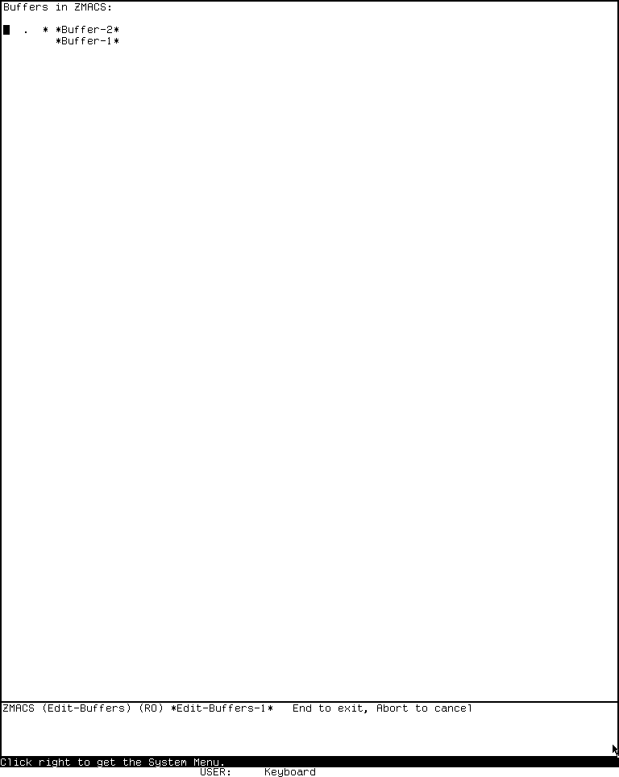
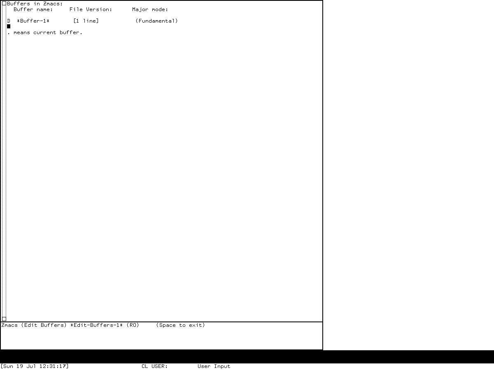

# Directory, difference, and buffer editors reimplementation specification

## Status and reconstruction claim

This specification defines an implementation-independent reconstruction of the
directory and buffer-management applications for three deliberately separate
profiles:

- public MIT CADR **System 46** Dired source at Git revision
  `8e978d7d1704096a63edd4386a3b8326a2e584af`;
- maintained LM-3 **System 303** Dired, BDired, Edit Buffers, List Buffers, and
  Kill Or Save Buffers source at Fossil check-in
  `4df393c68d7f083ce42d5c377039d26043cc18a9031ace28258dc97f4137eb91`,
  plus a separately identified runnable `System 303-0` load band; and
- **Genera 8.5, System 452.22** Dired, Edit Buffers, List Buffers, Kill Or Save
  Buffers, and Command Processor Compare Directories from licensed source media
  and a separately identified Open Genera base world.

A conforming implementation can reproduce, for each closed or source-present member
of its selected profile, the special read-only editor buffers; row identity and
status models; complete
application-owned command tables and their inherited ZWEI boundary; numeric
arguments; pointer menus or presentation translators; deferred mark, confirm,
execute, and abort transactions; sort and rebuild behavior; directory balancing;
buffer-list reporting; multi-choice buffer processing; source-visible errors; and
metadata directory comparison; and the release-specific defects named below.

The strongest claim is **semantic compatibility** for the closed source profiles
and source-present members; `DB-C46-HOSTED` remains explicitly partial. Observable
behavioral compatibility is claimed only for the exercised
System 303 and Genera Edit Buffers paths. The file-service-backed Dired and BDired
workflows have not been exercised end to end in the preserved systems and remain
explicit runtime oracles.

This document does not claim:

- one averaged Dired or buffer manager shared by all three releases;
- that the System 46 snapshot contains the missing Zmacs source or that its
  referenced-but-absent List Buffers and Kill Or Save Buffers implementations can
  be reconstructed from names alone;
- that the maintained System 303 tree built the observed load band byte-for-byte;
- that every inspected Genera source body is resident unchanged in the licensed
  base world;
- an exact historical package API, flavor hierarchy, callable signature set,
  condition/restart surface, selected-module load closure, QFASL compatibility,
  world compatibility, or ABI compatibility;
- a configured Symbolics site, file server, printer, compiler, or network peer;
- atomic file-system effects where the historical implementation performs a
  sequence and reports individual failures; or
- pixel identity, historical font metrics, or timing beyond the bounded visible
  requirements and reviewed screenshots in this document.

An implementation MAY offer every profile, but it MUST make the profile explicit.
It MUST NOT silently combine System 46's parsed `DIR` stream, System 303's nested
pathname list, and Genera's protected node into one alleged historical behavior.

## Normative language and evidence codes

`MUST`, `MUST NOT`, `SHOULD`, and `MAY` are normative only for the profile named
beside the rule. `INF` identifies a clean-room choice or optional corrected mode;
it is not an attribution to the historical implementation.

| Code | Evidence class | Establishes | Does not establish |
| --- | --- | --- | --- |
| `C46-SRC` | Public System 46 source | Source-visible Dired table, data parsing, actions, order, defaults, and failures | A runnable compatible band or later Zmacs behavior |
| `C46-QF` | Public System 46 `dired.qfasl` | Compiled Dired module presence and exact artifact identity; symbol/constant corroboration only where independently decoded | Original function bodies, the unresolved `$` command body, or source-to-artifact identity |
| `C303-SRC` | Maintained LM-3 source | Source-visible Dired, BDired, and buffer-manager behavior at the pinned check-in | That every historical CADR used this revision |
| `C303-RUN` | Isolated `System 303-0` harness session | Exact exercised Edit Buffers pixels, marks, unmark defect, and shutdown result | Configured Dired/BDired behavior or every command leaf |
| `G85-SRC` | Licensed Genera 8.5 source inspected locally | Source-visible data models, command tables, presentations, transactions, and failures in exact hashed files | Redistribution permission or source-to-world build identity |
| `G85-RUN` | Isolated Genera 8.5 harness sessions | Exact exercised List Buffers and true Edit Buffers states and input paths | Unexercised file operations, pointer-hit dispatch, or orderly VLM shutdown |
| `MIT-MAN` | Contemporary MIT operator/editor documentation | Intended System 46 interaction and surrounding TV/ZWEI conventions | Exhaustive System 303 behavior |
| `G8-MAN` | Public Genera 8 manuals | Supported Dired and buffer-management workflows | Exact 8.5 implementation without source/runtime cross-check |
| `ZWEI-PAP` | Contemporary editor design and conversion account | The editor's view, interval, command-table, and display lineage | Application-specific transaction details not discussed there |
| `INF` | Implementation-independent inference | A portable state representation or optional safety correction | Historical internal representation |
| `TODO-RUNTIME` | Named unresolved oracle | Nothing until the probe is run | Permission to fill the result from expectation |

Source controls each named source profile. Runtime evidence controls only the exact
artifact and path exercised. Manuals describe supported use but do not override a
source-visible defect. Licensed bodies and bulk runtime output remain local; this
document states original behavioral analysis only.

## Compatibility profiles and levels

### Release profiles

| Profile | Exact target | Applications in scope | Required substrate |
| --- | --- | --- | --- |
| `DB-C46-DIRED-STANDALONE` | MIT CADR System 46 public source at `8e978d7` | Standalone Dired over the selected Standard/TV parent | System 46 ZWEI and TV |
| `DB-C46-HOSTED` | Same source snapshot | Dired under the referenced but absent Zmacs parent; referenced buffer managers | System 46 ZWEI/TV plus unavailable selected Zmacs body |
| `DB-C303` | LM-3 source at `4df393c` plus separate `System 303-0` runtime | Dired, BDired, Edit Buffers, List Buffers, Kill Or Save Buffers | System 303 ZWEI/Zmacs, TV, FS compiled-directory services |
| `DB-G85` | Genera 8.5 System 452.22 licensed source plus separate base world | Dired, Edit Buffers, List Buffers, Kill Or Save Buffers, Compare Directories | Genera ZWEI/Zmacs, TV, Dynamic Windows presentations, Command Processor, FS services |

The editor members are native ZWEI applications, not CLIM application frames;
Genera Compare Directories is instead a Command Processor command with Dynamic
Windows output. `DB-C46` and `DB-C303` use TV and predate CLIM. `DB-G85` uses
Dynamic Windows presentations for typed List Buffers output and source comparison,
and uses a TV multiple-choice interface for Kill Or Save Buffers. It defines no
CLIM frame, pane, command table, port, or application dependency in the selected
sources. A clean-room implementation MAY use CLIM internally only if its externally
observable profile behavior remains the same.

Where a rule names `DB-C46` without a suffix, it applies to the shared System 46
Dired body. Only `DB-C46-DIRED-STANDALONE` is a closed effective profile.

### Conformance levels

| Level | Required behavior | Reserved behavior |
| --- | --- | --- |
| `L0` | Exact semantic objects, row identities, status and mark state, invariants | User interaction and external effects |
| `L1` | `L0` plus complete effective input trees, reports, menus, marking, sorting, filtering, rebuilds, and local failures | Destructive/remote operation transactions |
| `L2` | `L1` plus confirmation, ordered filesystem or buffer effects, abort/retry behavior, release defects, and bounded visible states | Exact historical source interface |
| `L3` | Exact selected historical packages, symbols, signatures, values, conditions, and module/load closure | QFASL, world, or ABI identity |

This document normatively defines `DB-C46-DIRED-STANDALONE/L2`, `DB-C303/L2`, and
`DB-G85/L2` at the semantic grain. `DB-C46-HOSTED` has a complete Dired-local body
but cannot reach `L1` because the selected public snapshot lacks the parent Zmacs
tree and referenced buffer-manager bodies. The runtime verification axis is
independent:

| Member/profile | Contract defined | Preserved runtime verified | Remaining oracle boundary |
| --- | --- | --- | --- |
| C46 standalone Dired | Source `L2` | No compatible band | Every visible and external-effect path |
| C46 hosted Dired/buffer managers | Partial; local Dired body only | No compatible band | Zmacs parent and buffer-manager implementation |
| C303 Dired | Source `L2` | Entry reached only as an unconfigured login path | Populated view, menus, confirm/effect paths |
| C303 BDired | Source `L2` | No | Two disposable directories and transfer paths |
| C303 Edit Buffers | `L2` | Entry, visible marks, Rubout, `U` defect, Abort exit | Every file-I/O and kill effect |
| C303 List/Kill Or Save | Source `L2` | No D06-specific run | Typeout item hits, choice defaults, ordered effects |
| G85 Dired | Source `L2` | No populated view | Listing, menus, confirmation, errors, protected rollback |
| G85 Edit Buffers | `L2` | True entry and a visible delete mark | Help, compare, actions, normal exit and Abort |
| G85 List Buffers | `L2` | Report and generic pointer/menu feedback | Exact row hit and translator selection |
| G85 Kill Or Save | Source `L2` | No | Choice UI, implications, abort, ordered effects |
| G85 Compare Directories | Source `L2` | No | Disposable directory pair, six resort views, identity edge |

`L3` remains reserved. A test suite MUST report semantic/source conformance
separately from preserved-runtime closure.

## Evidence ledger

### Exact source and compiled artifacts

| Profile | Portable artifact | Bytes | SHA-256 or revision | Principal use |
| --- | --- | ---: | --- | --- |
| `DB-C46` | `src/nzwei/dired.55` | 34,913 | `fc5f0853854383b4c6dc81949b67fb452a478fd728b8b6eae88112ec3e40c3eb` | Dired mode, parsed rows, actions, sort, standalone editor |
| `DB-C46` | `src/nzwei/dired.qfasl` | 37,597 | `6e49c95f79d813faaea647383725fef60f2b48b761dc8d5de03734c7bfddf15f` | Compiled-module corroboration only |
| `DB-C46` | `src/nzwei/macros.36` | 21,668 | `98bb23fae9aec8c3d8582df0b475d11c7dc5241a8fa29fcfc806ce27e1773b51` | Dired retention and automatic-cleanup defaults |
| `DB-C46` | `src/lispm/pkgdcl.230` | 12,516 | `2d08a109871868990f10e1334a8b4d5199ac7c530bb50b04b93d5f552a83e1b9` | Referenced Dired and missing Zmacs load modules |
| `DB-C46` | `src/nzwei/nzwei.tags` | 57,884 | `5d00a87d730ad417b903be596a9f284c0736f664311c1ab3427d710bf54343c7` | Source-era symbol metadata only |
| `DB-C46` | `src/nzwei/nzwei.comdif` | 4,831 | `d1ae94ca60fccf8ff078b3a77a0e01f359fab10e40ded085f6342b9886c2a712` | Source-era change metadata only |
| `DB-C46` | `docs/assets/mit-cadr-online-help/standalone/_comnd.1` | 37,158 | `9cbd632e763c8ff150941f84ddb082edf56f123d513ff3e6c9ff2e6a3e598f36` | Built named-command and key metadata only |
| `DB-C303` | `l/sys/zwei/dired.lisp` | 110,561 | `34155fec3311a969cfbed31c640b59159f28251b179f51b4c4a6c08b19c9eb34` | Dired and Edit Buffers |
| `DB-C303` | `l/sys/zwei/bdired.lisp` | 16,636 | `58c365d9972cb22448e035ed220535e47dc2dc9ea02444a1416441b0c7009d22` | BDired |
| `DB-C303` | `l/sys/zwei/zmacs.lisp` | 115,156 | `513f39d440a6612ff7d3d540a62b397fe6348456bd36a450262ff6fa372799d0` | Entry tables, List Buffers, Kill Or Save Buffers, typeout operations |
| `DB-C303` | `l/sys/zwei/patch/zwei-126-2.lisp` | 24,793 | `45e055c0bda04612dccef58bf6f8994fb0591b78c69fa0f2aa4c23a131871f6a` | installed replacement body for Dired newest-version command |
| `DB-G85` | `sys.sct/zwei/dired.lisp.~465~` | 78,695 | `d988987ca7220fd156a0c35eca2651e009c0054a8b9b86774890bfcaa6055da5` | Dired node, commands, rebuild and execute order |
| `DB-G85` | `sys.sct/zwei/buffer-editor.lisp.~12~` | 24,248 | `f339b6b55994148b02c46dbca3fd532a4784d67b8ae24d89fa9ef954c07bef14` | Edit/List/Kill Or Save Buffers |
| `DB-G85` | `sys.sct/zwei/zmacs.lisp.~1058~` | 31,456 | `082959472626b04d74631ada24bb8ad164bc44ef19f292343f905fbf10bf1d2f` | Zmacs entry bindings |
| `DB-G85` | `sys.sct/zwei/zmacs-buffers.lisp.~54~` | 64,709 | `5e7866786dffc8ec03cc3df6b0cd21277ac34656351a494c8e7656a837549bcf` | List Buffers row selection and buffer lifecycle operations |
| `DB-G85` | `sys.sct/zwei/files.lisp.~378~` | 88,157 | `f627f666b0fe9ca7a1450526f081685b95b2c7e522a06d71b6db962345e957bc` | Save Buffer presentation translator and file-buffer operations |
| `DB-G85` | `sys.sct/zwei/macros.lisp.~276~` | 71,023 | `c7db63e24f706e2fa102db25026a8556ebfbc950d18592c0817f7b48274ad59d` | Dired default retention, temporary-type, expunge-offer and exit-lifecycle variables |
| `DB-G85` | `sys.sct/io1/fquery.lisp.~104~` | 13,320 | `022823ae8dddbf64c598ab59bde00945c9b5e621191617b1374a84f020730e0f` | presentation-aware FQUERY choice dispatch |
| `DB-G85` | `sys.sct/io/readers.lisp.~251~` | 89,420 | `234f313926a322f3d61e7d750c96bd3a1f4408b8eaf9eb8afffb294a28667491` | character-equal FQUERY choice matching |
| `DB-G85` | `sys.sct/io/read.lisp.~602~` | 124,647 | `e60087709843bf2ed37b30f6dd742e5451ca5d1721769e9355a882ec7aad7f92` | underscore shift-number reader syntax used by Compare sentinel |
| `DB-G85` | `sys.sct/sys/iarithdefs.lisp.~24~` | 11,780 | `dc4a01b4d2d5da514e8e713dad5c198234f956e492f8e0c31085c28fbeaa8676` | `//` to quotient mapping used by buffer layout |
| `DB-G85` | `sys.sct/sys/lispfn.lisp.~534~` | 142,630 | `d0729867699c0756585e7d42119d9c44484527c14d6f68db4f9ee6073b152319` | integer quotient behavior used by buffer layout |
| `DB-G85` | `sys.sct/cp/development-commands-2.lisp.~35~` | 53,146 | `97c058d361860a393fe32e0c02bc03f5e5d1ceaff5f3bb4640b96f899439c3ce` | Compare Directories typed command, comparison and resortable output |

The C46 QFASL is artifact evidence, not decompiled source. The public System 46
snapshot's package declaration refers to a separate Zmacs QFASL, but that payload
and its source are absent from the selected tree. Names in tags, load declarations,
or historical correspondence therefore do not close its buffer-manager bodies.

### Normative evidence map

| Contract area | `DB-C46` | `DB-C303` | `DB-G85` |
| --- | --- | --- | --- |
| Entry and local command tables | `dired.55:10-99,569-608` | `dired.lisp:119-261,2318-2367`; `bdired.lisp:89-154`; `zmacs.lisp:2401-2509`; newest body `patch/zwei-126-2.lisp:407-432` | `dired.lisp.~465~:77-194`; `buffer-editor.lisp.~12~:64-141`; `zmacs.lisp.~1058~:129-163` |
| Directory row model/rebuild | `dired.55:70-130,273-343` | `dired.lisp:22-117,282-604` | `dired.lisp.~465~:196-296,203-259` |
| Dired mark and execution transaction | `dired.55:154-243,345-427` | `dired.lisp:731-1554` | `dired.lisp.~465~:346-437,825-1040` |
| Sort and automatic cleanup | `dired.55:217-234,428-568`; defaults `macros.36:549-553` | `dired.lisp:969-1011,1557-1741`; defaults `macros.lisp:785-790` | `dired.lisp.~465~:1042-1337`; defaults `macros.lisp.~276~:1503-1513` |
| BDired model and transfers | Not present | `bdired.lisp:21-331`; inactive code `334-418` | Not present in selected file set |
| Edit Buffers model and execution | Not available | `dired.lisp:2318-2600` | `buffer-editor.lisp.~12~:55-326` |
| List Buffers report | Missing selected C46 Zmacs body | `zmacs.lisp:1335-1415` | `buffer-editor.lisp.~12~:328-498`; heading presentation at `119-127,409-412`; heading translator at `129-134`; row wrapper at `339-345` |
| Kill Or Save Buffers | Missing selected C46 Zmacs body | `zmacs.lisp:1417-1510` | `buffer-editor.lisp.~12~:500-573` |
| Compare Directories | Not present | Not a D06 System 303 member | `cp/development-commands-2.lisp.~35~:182-287` |
| Pointer/presentation operations | Dired local menu in `dired.55:10-24` | Dired pointer menu `dired.lisp:607-725`; buffer typeout items `zmacs.lisp:77,876,941,1326,1568,1731,1865` | Dired menu `dired.lisp.~465~:77-149`; heading translator `buffer-editor.lisp.~12~:119-135`; row Select `zmacs-buffers.lisp.~54~:403-420`; row Not Modified/Kill at `1073-1076,1211-1214`; row Save `files.lisp.~378~:1870-1873`; source compare translator `dired.lisp.~465~:488-528`; FQUERY presentations `io1/fquery.lisp.~104~:195-275` |
| Runtime pixels and action traces | None | Session `d06-d07-20260718`, generation 1 | Sessions `zmacs-research`, generation 1, and `d06-edit-buffers-genera-20260719`, generation 1 |

The exact line numbers above identify the local licensed copy only by portable
artifact name and hash. No licensed source body is reproduced here.

## Architecture and ownership boundaries

The applications are semantic views over file-system or editor objects. The editor
family and the Genera Command Processor report have distinct dispatch paths:

```text
TV input and display
  -> ZWEI command loop and inherited editor tables
      -> D06 application mode or report
          -> row identity and pending action model
              -> FS pathname/CDIRECTORY operations or Zmacs buffer operations

Genera Command Processor typed input
  -> Compare Directories command
      -> FS directory enumeration and comparison
          -> Dynamic Windows presentations and resortable output
```

The boundary is normative:

- TV owns sheets, pointer routing, menus, typeout, and the generic multiple-choice
  transaction;
- ZWEI owns intervals, lines, buffer pointers, read-only enforcement, command-table
  inheritance, numeric arguments, minibuffers, ordinary motion/search, and the
  command loop;
- Dired, BDired, and Edit Buffers own their profile-specific row identity or parsed
  metadata, local tables, pending marks, confirmation policy, and operation order;
  List Buffers owns a transient report schema and semantic row registrations but no
  modal local table or pending actions; Kill Or Save Buffers owns choice/default/
  implication and effect semantics atop TV's transaction but no editor-local table;
  Compare Directories owns its comparison predicate and output schema but no
  editor-local table or pending row actions;
- FS owns pathname canonicalization, directory enumeration, compiled-directory
  comparison, file effects, and file-operation failures;
- Zmacs owns the authoritative live buffer registry, recency/history, save, kill,
  selection, mode, and file association;
- Dynamic Windows owns `DB-G85` presentation recording and translator selection,
  but not the underlying Dired or buffer lifecycle;
- the Genera Command Processor owns typed argument acquisition and command dispatch
  for Compare Directories, while Dynamic Windows owns that command's presented and
  resortable report; and
- CLIM owns none of the selected implementation path.

A conforming clone MUST keep visible strings and line layout separate from the
profile's semantic identity. For C46 that identity combines view-level device and
directory with parsed row fields; later profiles retain pathname, compiled-file, or
buffer references. Re-parsing rendered text instead is nonconforming because
truncation, renaming, aliases, deleted versions, duplicate displays, and nested
directories make it insufficient.

## Semantic data and state model

### Common editor view

```text
SpecialEditorView {
  profile
  owning_command_loop
  interval_or_node
  read_only_to_ordinary_editing
  mode
  rows_in_display_order
  point
  numeric_argument_state
  pending_action_state
  selected_or_exposed_state
  rebuild_generation
}
```

Read-only means ordinary text editing is rejected. Application commands MAY mutate
mark columns, regenerate rows, or replace the interval inside their protected update
scope. The display is derived state; the release-specific parsed row metadata or
attached object is authoritative.

### `DB-C46` directory view and row

```text
C46DirectoryView {
  singleton_buffer_name = "*DIRED*"
  device
  directory
  parsed_rows
  sort_order
}

C46DirectoryRow {
  rendered_DIR_line
  parsed_name_and_version
  size
  creation_date_and_time
  reference_date
  status_flags
  pending_mark: blank | D | P
  newest_version_flag
}
```

`DB-C46` MUST read a `DIR` device stream into the one special buffer and parse the
fixed columns established by the profile. It MUST retain the device and directory as
the implicit identity used by later operations. It MUST compute newest-version marks
only under the source assumption that rows are ordered by file name and numeric
version. It MUST NOT claim pathname-object identity or multiple simultaneous Dired
buffers for this profile. (`C46-SRC`)

### `DB-C303` directory view and row

```text
C303DirectoryView {
  unique_zmacs_buffer
  top_level_pathname_list
  open_subdirectory_pathnames
  sort_state
  rows_with_nesting_levels
}

C303DirectoryRow {
  pathname_object
  translated_pathname_identity
  level
  directory_and_contents_present_flags
  file_property_plist
  pending_mark: blank | D | U | P | F | A
}
```

Each invocation MUST create a unique read-only Zmacs buffer, mark it with special
type `:DIRED`, save Dired as its major mode, activate it, optionally select it, and
retain the exact pathname list. A row MUST carry the pathname and nesting level.
Multiple top-level directories and opened subdirectories MAY coexist. (`C303-SRC`)

The profile's local-host equivalence rule MUST canonicalize the special host named
`LOCAL` to the actual local host before comparing directory identity. Rebuild MUST
remember open subdirectory pathnames and attempt to reopen them after the base
listing has been reconstructed. (`C303-SRC`)

### `DB-G85` directory node and row

```text
G85DirectoryNode {
  pathname
  read_only_node_state
  old_interval_snapshot_during_protected_update
  sorted_up_by_name_property
}

G85DirectoryRow {
  pathname_or_switch_identity
  file_property_plist
  current_display_string
  pending_mark: blank | D | P | F | A
  deleted_state
  newest_and_status_flags
}
```

The Genera node MUST rebuild from `FS:DIRECTORY-LIST` with sorted and deleted-file
options, compute newest-version flags, attach pathname identity to each actionable
file row and switch identity to each switch row, insert the disk-space summary after
header lines, and move point to the first pathname row. Headers and the summary
remain nonrows. A failed protected rebuild MUST restore the old interval and its
sorted-up-by-name property when an old display existed. (`G85-SRC`)

The rollback protects the editor view; it does not undo external file operations
already committed before another failure.

Undelete has no `U` pending glyph. The `U` command writes a blank into the action
column; at execution time, a blank row whose independent file state is `:DELETED`
means undelete. A clone MUST preserve that distinction between the displayed mark
and the underlying deleted-state flag. (`G85-SRC`)

### BDired compiled-directory model

```text
BalanceView {
  primary_cdirectory
  alternate_cdirectory
  read_only_buffer
  two_rendered_directory_sections
}

BalanceRow {
  cfile
  truename_pathname
  alternate_cdirectory
  transfer_destinations
  pending_mark: blank | T
}
```

`DB-C303` BDired MUST build one compiled-directory graph for each pathname, compare
them, store each graph on the first line, attach the actual compiled-file object and
truename to every file row, and attach the alternate directory to each compiled
file. Initial nonempty transfer destinations MUST appear as `T` marks. The model's
transfer destinations, not the glyph alone, are authoritative. (`C303-SRC`)

The `I`/`i` Resolve Inconsistency implementation occurs inside a source `COMMENT`
form and its table entries are commented out. It MUST remain unavailable in the
strict profile.

### System 303 Edit Buffers row

```text
C303BufferActionRow {
  buffer_object
  staged_pathname_or_nil
  kill_column_0: blank | K
  file_io_column_1: blank | S | W | R | ~
  print_column_2: blank | P
  select_column_3: blank | .
  modification_and_identity_display
}
```

The four columns are independent. A conforming strict implementation MUST preserve
that independence, including the historical partial-unmark defect specified below.
The visible buffer name is not its identity. (`C303-SRC`, `C303-RUN`)

### Genera Edit Buffers row

```text
G85BufferActionRow {
  buffer_object_in_line_property
  action_or_current_column_0: blank | . | D | S | ~
  listing_status_and_description
}
```

The Genera editor uses one main pending action per row. The period identifies the
current buffer when the listing is rebuilt; it is not a deferred operation, and a
later `D`, `S`, or `~` mark overwrites it. Its read-only special node retains a
filter that is NIL, one case-insensitive substring, or a list interpreted as the OR
of its strings. The report heading is a
`ZMACS-BUFFER-LISTING` presentation, but editable rows are line-property records;
they MUST NOT be represented as List Buffers row presentations merely because the
heading can translate into the editor. (`G85-SRC`)

### List Buffers report

```text
BufferReportRow {
  buffer_object
  status_character
  displayed_name
  file_version_or_description
  major_mode
  presentation_or_typeout_item_record
}
```

List Buffers is a report, not an Edit Buffers mode. `DB-C303` emits TV typeout items
of type `ZMACS-BUFFER`; `DB-G85` emits Dynamic Windows presentations whose type is
the runtime class of the buffer. `DB-G85` sorts by recency unless its sort variable
is false; a supplied filter limits rows without rewriting the authoritative global
buffer registry. (`C303-SRC`, `G85-SRC`)

### Kill Or Save Buffers choice model

```text
BufferChoiceRow {
  buffer_object
  status_and_name
  available_choices
  selected_choices
}
```

This surface is a TV multiple-choice transaction. Selection state is temporary until
the generic chooser completes. Abort returns an aborted result and MUST cause no
application-owned buffer operation. A successful result is processed in the
profile-specific order below. (`C303-SRC`, `G85-SRC`)

## Invariants

1. Every actionable row carries the identity required by its profile. C46 combines
   parsed name/version fields with view-level device/directory; later file rows hold
   a pathname or compiled-file reference; buffer rows hold the buffer reference
   captured when rendered. Such a reference can later become stale or killed, and
   the operation MUST perform the profile's actual recheck rather than assume it is
   still live.
2. Header, summary, switch, and terminal lines are not actionable rows, but handling
   is profile-specific. Some counted C303 walkers silently skip nonrows, while G85
   Edit Buffers can signal after crossing into one. A clone MUST preserve the
   selected skip, stop, or error behavior rather than normalize it.
3. Ordinary editor insertion MUST NOT mutate a special read-only view. Only a
   profile command or protected rebuild may alter its derived text.
4. A pending glyph together with any independent row state MUST determine the
   semantic action after each completed command. In Genera Dired, blank plus
   `:DELETED` means undelete; in BDired the compiled-file transfer list remains
   authoritative over the glyph.
5. A negative numeric argument reverses row traversal where the command is defined
   as repeatable. Each profile's actual boundary behavior is normative; a clone MUST
   NOT invent wraparound or silent clamping. In particular, the Genera Edit Buffers
   walker resolves a row before its terminal check and can signal an editor error on
   a header or terminal line after retaining marks already made by the same command.
6. `Abort` never means “confirm pending operations.” It exits or cancels according
   to profile and context without deliberately applying them.
7. A report or screenshot cannot establish hidden row identity. Conformance tests
   MUST pair visible output with a synthetic object fixture or event trace.
8. `DB-C303` Edit Buffers permits independent column marks. `DB-G85` Edit Buffers
   permits only one action character per row. A clone MUST NOT merge these models.
9. Current-buffer-last processing is mandatory where stated so that selection and
   final messages are not destroyed prematurely.
10. File-operation errors are per-operation evidence. Unless a profile explicitly
    rolls back, a later error MUST NOT be described as undoing earlier successful
    effects.

## Complete input and gesture binding trees

### Normative incorporation and finite domains

This section incorporates the following companions by reference as normative parts
of the D06 effective tree:

- [MIT ZWEI and Zmacs keybindings](mit-cadr/zwei-zmacs-keybindings.md) for every
  System 46 and System 303 inherited direct leaf, alias, prefix, minibuffer, mode,
  pointer, Help, numeric-argument, undefined, and error path;
- [Genera Zmacs keybindings](genera/zmacs-keybindings.md) for every Genera inherited
  keyboard, pointer, prefix, minibuffer, Help, presentation, and menu path;
- [the editor-family specification](eine-zwei-and-zmacs-editor-family-reimplementation-specification.md)
  for command-loop and editor-context semantics; and
- the [TV](mit-cadr/tv-window-system-reimplementation-specification.md) and
  [Dynamic Windows](genera/dynamic-windows-reimplementation-specification.md)
  specifications for generic menu, choice, typeout, scrolling, recognition, and
  presentation behavior.

This incorporation is exact, not shorthand for an unspecified modern editor.
Applications override only the cells and staged surfaces enumerated below.

| Profile | Keyboard domain per comtab | Fixed pointer domain | Application lookup |
| --- | ---: | ---: | --- |
| `DB-C46` | 160 base codes times 16 modifiers = 2,560 cells | separately enumerated source pointer cells | Dired mode, then Standard in standalone Dired; Zmacs parent unknown in selected public snapshot |
| `DB-C303` | 160 base codes times 16 modifiers = 2,560 cells | separately enumerated source pointer cells | active mode, Zmacs, Standard; mode `C-X`, Zmacs `C-X`, Standard `C-X` |
| `DB-G85` ZWEI members | 192 base codes times 16 modifiers = 3,072 cells, plus explicit other-character-set entries | 3 buttons times 32 modifier states = 96 cells | active mode, Zmacs, Standard; corresponding `C-X` chain |
| `DB-G85` Compare Directories | Complete incorporated Dynamic Windows Input Editor base map plus active typed-command contexts | applicable presentation gestures and CP/DW handlers | command-name, pathname, confirmation, keyword-name, Boolean-value, and resortable-output contexts |

A missing cell falls through; an explicit hard-undefined cell terminates lookup.
Aliases restart resolution at the original top table. Exhaustion invokes the
profile's not-defined behavior; a selected command symbol without an implementation
invokes the distinct not-implemented path. No implementation may invent modifier
stripping.

System 303 has a read-context switch that is essential to effective compatibility.
The ordinary command and prefix readers temporarily inhibit synchronous TV
intercepted characters, so local and parent `Abort` or `Break` comtab cells are
reachable. Other raw or staged reads that do not use that wrapper retain TV's
synchronous Break/Abort interception; asynchronous Control-Abort remains separate.
The active read context MUST therefore be part of a binding dump. (`C303-SRC`)

### Entry tree

```text
DB-C46
├─ named Dired -> prompt, enter System 46 Dired
├─ current-file Dired command
│  ├─ no argument -> whole current directory
│  ├─ exact 1 -> retain current FN1; wildcard remaining components
│  └─ every other explicit value -> prompting Dired
├─ built C-X C-B -> List Buffers metadata-only boundary
└─ absent selected Zmacs body -> other exact host bindings remain TODO-C46-ZMACS

DB-C303 Zmacs
├─ C-X D -> Dired for current file
├─ C-X C-B -> List Buffers
├─ Meta-X Dired / BDired / Edit Buffers / Buffer Edit / Kill Or Save Buffers
│  -> inherited completing-reader tree
└─ Mouse-3-1 generic Zmacs menu
   ├─ List Buffers
   ├─ Kill Or Save Buffers
   └─ Edit Buffers

DB-G85 Zmacs
├─ C-X D -> Dired for current file
├─ C-X C-B -> List Buffers
├─ C-X C-Shift-B -> Edit Buffers
├─ C-X C-Meta-B -> Kill Or Save Buffers
├─ Meta-X Dired / Edit Directory / Edit Buffers / List Buffers /
│  Kill Or Save Buffers -> inherited completing-reader tree
└─ Mouse-3-1 generic Zmacs menu
   ├─ List Buffers
   └─ Kill Or Save Buffers

DB-G85 Command Processor
└─ typed command name Compare Directories
   ├─ first pathname
   ├─ second pathname and confirmation
   └─ optional explicitly mentioned Ignore Versions Boolean
```

System 303's generic Zmacs right menu has these 16 ordered command leaves:

```text
Mouse-3-1
├─ Arglist
├─ Edit Definition
├─ List Callers
├─ List Sections
├─ List Buffers
├─ Kill Or Save Buffers
├─ Edit Buffers
├─ Split Screen
├─ Compile Region
├─ Indent Region
├─ Change Default Font
├─ Change Font Region
├─ Uppercase Region
├─ Lowercase Region
├─ Mouse Indent Rigidly
└─ Mouse Indent Under
```

Genera's full 15-leaf generic Zmacs right menu remains normative in the Genera
binding companion. Dired locally shadows that fixed pointer cell; System 303 BDired
and both Edit Buffers modes do not and therefore inherit their applicable Zmacs
menu. (`C303-SRC`, `G85-SRC`)

For Genera `C-X D`:

- no numeric argument selects the directory of the current file;
- exact numeric value 1 retains the current name and wildcards type/version; and
- any other explicit argument invokes the ordinary prompting Dired command.

The System 303 source has the same three-way current-file entry shape. Entry through
standalone Lisp Dired composes Dired mode directly over Standard rather than Zmacs.

### Complete System 46 Dired local table

The constructor has exactly 30 cells: 20 direct cells and ten lowercase aliases.

| Binding(s) | Operation | Argument behavior |
| --- | --- | --- |
| `Space` | next real line | inherited repeat count |
| `!` | next file not backed up | value ignored |
| `$` | select `COM-DIRED-COMPLEMENT-NO-DELETE-FLAG` | body absent; not-implemented in strict selected-source profile |
| `?`, `Help` | direct Dired explanation | no subtree |
| `D`, `d`, `Control-D`, `K`, `k`, `Control-K` | mark deletion | signed repeat |
| `E`, `e` | edit file | value ignored |
| `H`, `h` | automatic cleanup; any explicit argument means all files | magnitude ignored |
| `N`, `n` | next filename with excess versions | explicit value; otherwise `*FILE-VERSIONS-KEPT*` |
| `P`, `p` | mark printing | signed repeat |
| `Q`, `q`, `End` | enter print/delete exit transaction | value ignored |
| `U`, `u` | unmark current or default preceding row | signed repeat when explicit |
| `V`, `v` | view file | value ignored |
| `X`, `x` | inherited extended-command reader | reader tree from companion |
| `Rubout` | negate direction and unmark | signed reverse |
| `Mouse-3-1` | fixed Dired menu | pointer only |

System 46 Dired has no local `Abort` cell. No selected Standard/standalone cell
supplies one, so an ordinary Dired command read reports Abort as undefined. This is
not an exit command. (`C46-SRC`)

The fixed pointer menu is this exact ordered tree:

```text
Mouse-3-1
├─ Sort Increasing Reference Date
├─ Sort Decreasing Reference Date
├─ Sort Increasing Creation Date
├─ Sort Decreasing Creation Date
├─ Sort Increasing File Name
├─ Sort Decreasing File Name
├─ Sort Increasing Size
├─ Sort Decreasing Size
├─ Automatic
└─ Automatic All
```

Cancel invokes no command. Unlisted cells inherit the selected parent. Because the
public System 46 snapshot lacks the Zmacs body, standalone Dired has the closed
effective parent while Zmacs-hosted parent deltas remain `TODO-C46-ZMACS`.

### Complete System 303 Dired local table

The constructor has exactly 62 cells: 46 direct cells and 16 lowercase aliases.

| Binding(s) | Operation |
| --- | --- |
| `Space` | Down Real Line |
| `!` | Next Undumped |
| `@`, `#`, `$` | complement do-not-delete, do-not-supersede, do-not-reap |
| `.`, `,` | Change File Properties; Print File Attributes |
| `=`, raw character `036` octal | compare with newest; compare with selected file |
| `?`, `Help` | enter Dired Documentation dispatcher |
| `A`, `a` | Apply Function mark |
| `C`, `c` | Copy |
| `D`, `d`, `Control-D`, `K`, `k`, `Control-K` | Delete mark |
| `E`, `e`; `Control-Shift-E` | Edit File; Edit File in two windows |
| `F`, `f` | Find File on exit |
| `H`, `h` | Automatic cleanup marking |
| `L`, `l` | Load |
| `N`, `n` | Next Hog |
| `P`, `p` | Print mark |
| `Q`, `q`, `End` | process and exit |
| `R`, `r` | Rename |
| `S`, `s` | insert/remove subdirectory contents |
| `U`, `u` | undelete/unmark |
| `V`, `v` | View File or directory |
| `X`, `x` | process and remain |
| `0`–`9` | Numbers |
| `<`, `>` | Dired superior directory; newest version |
| `Rubout` | reverse undelete/unmark |
| `Abort` | exit without processing pending marks |
| `Mouse-3-1` | Dired row menu |

The named mode menu has exactly ten leaves: Automatic, Automatic All, then the
increasing/decreasing pairs for reference date, creation date, file name, and size.

The row pointer tree has exactly twelve operations. The source first validates and
labels the clicked row, then opens the menu. It moves point to that row only after a
command has been selected:

```text
Mouse-3-1 over a file row
├─ Delete
├─ Rename
├─ Copy
├─ Subdirectory
├─ Undelete / Cancel
├─ Change Properties
├─ Edit File
├─ View File
├─ Compare
├─ Find File on Exit
├─ Load File
└─ Hardcopy
```

Cancel leaves point unchanged and invokes no command. A click not identifying an
actionable row follows the source error/cancellation path rather than manufacturing
a pathname.

### Complete System 303 BDired local table

The constructor has exactly 21 cells: 14 direct cells and seven lowercase aliases.

| Binding(s) | Operation |
| --- | --- |
| `Space` | Down Real Line |
| `=` | Dired source compare |
| `?`, `Help` | enter BDired Documentation dispatcher |
| `C`, `c` | shared Dired Copy |
| `P`, `p` | print the transfer-destination Lisp object immediately |
| `Q`, `q`, `End` | perform transfers and exit |
| `R`, `r` | shared Dired Rename |
| `T`, `t` | queue transfer |
| `U`, `u` | remove transfer/other mark |
| `V`, `v` | shared Dired View |
| `Rubout` | reverse unmark |
| `Abort` | exit without queued transfers |

There is no local pointer/menu cell. `I`/`i` Resolve Inconsistency is commented-out
source and MUST be unbound. The installed Help's claim that `P` sends hardcopy is
wrong for this source profile: the body prints the transfer-destination object.

### Complete System 303 Edit Buffers local table

The constructor has exactly 27 cells: 18 direct cells and nine lowercase aliases.

| Binding(s) | Operation |
| --- | --- |
| `Space` | Down Real Line, not exit |
| `S`, `s`; `W`, `w`; `R`, `r`; `~` | mark Save, Write, Revert, or Unmodify in column 1 |
| `K`, `k`, `D`, `d`, `Control-K`, `Control-D` | mark Kill in column 0 |
| `.` | mark selection in column 3 |
| `U`, `u` | unmark, subject to strict-profile defect |
| `N`, `n` | clear file-I/O action column 1 and any staged pathname/display |
| `P`, `p` | mark Print in column 2 |
| `Help` | direct mode explanation |
| `Rubout` | reverse unmark |
| `Abort` | exit without executing marks |
| `End`, `Q`, `q` | execute and exit |

`?` is not local and falls through. No local pointer/menu cell or prefix exists.
The visible initial state MAY already contain `S` and `.` marks because rebuild
premarks buffers needing save and the most recently selected non-editor buffer.

### System 303 Help subtree used by Dired and BDired

The first `?` or `Help` is a local application leaf that enters the common
documentation dispatcher with an added `M` operation for that mode:

```text
Dired/BDired ? or Help
├─ M -> Dired Help or BDired Help
├─ C -> read a key; recurse prefixes; `*` enumerates a selected prefix
├─ D -> Describe Command
├─ L -> What Lossage, only when playback exists
├─ A -> Apropos
├─ U -> Undo Help
├─ V -> Variable Apropos
├─ W -> Where Is
├─ Space -> repeat stored request; fresh stored B silently reprompts
├─ Help -> describe this dispatcher
├─ Control-G / Rubout -> abort
└─ every other input, including `?` -> beep and reprompt
```

The body contains a dead later test for `?`, but the valid-input reader cannot pass
`?` to it. This unreachable branch MUST NOT be made reachable in strict mode.

### Complete Genera Dired local table

The constructor has 51 specifications expanding to exactly 60 cells: 59 keyboard
cells and one pointer cell.

| Binding(s) | Operation |
| --- | --- |
| `Space` | Down Real Line |
| `!`, `@`, `$` | Next Undumped; Don't Delete; Don't Reap |
| `.`, `,`, `=` | Change Properties; Describe Attribute List; Source Compare |
| `0`–`9`, `-` | Numbers and Negate Numeric Argument |
| `?`, `Help` | direct Dired Help |
| `A`, `a` | Apply Function mark |
| `C`, `c` | Copy File |
| `D`, `d`, `Control-D`, `K`, `k`, `Control-K` | Delete mark |
| `E`, `e` | Edit File or enter Dired for directory |
| `F`, `f` | Format-and-hardcopy mark |
| `G`, `g` | set/enforce generation retention |
| `H`, `h` | Automatic cleanup |
| `I`, `i` | execute, rebuild, remain |
| `L`, `l` | Load |
| `N`, `n` | Next Hog |
| `P`, `p` | Hardcopy mark |
| `Q`, `q`, `End` | execute and exit |
| `R`, `r` | Rename |
| `U`, `u` | unmark/undelete |
| `V`, `v` | Show File or Directory |
| `X`, `x` | Extended Command reader |
| `Rubout` | reverse unmark |
| `Abort` | with no argument exit without marks; with argument beep and remain |
| `Mouse-3-1` | fixed Dired menu |

The local named-only command is Show File Properties. Dired has no local `C-X`
child. `?` and `Help` shadow the global staged Help dispatcher with direct local
typeout. `X` enters the inherited completing reader.

The fixed menu has exactly fourteen leaves and no application-declared keyboard
accelerators:

```text
Mouse-3-1
├─ reference date: increasing / decreasing
├─ creation date: increasing / decreasing
├─ file name: increasing / decreasing
├─ size: increasing / decreasing
├─ partition: increasing / decreasing
├─ Automatic
├─ Automatic All
├─ Change File Properties
└─ Describe Attribute List
```

It is a cached TV momentary menu, remembers its last selection per screen, and
returns no command on cancel. Ordinary Dired rows are line-property records, not
typed presentations. Pathnames in confirmation output are presentations; applicable
Zmacs pathname translators and Dynamic Windows handlers then participate.

### Complete Genera Edit Buffers local table

The constructor has 27 specifications expanding to exactly 36 keyboard cells and no
local pointer cells.

| Binding(s) | Operation |
| --- | --- |
| `Space`, `Q`, `q`, `End` | execute marked actions and exit |
| `?`, `Help` | direct Edit Buffers Help |
| `D`, `d`, `Control-D`, `K`, `k`, `Control-K` | Delete mark |
| `E`, `e` | immediately select row buffer |
| `H`, `h` | mark applicable modified/new file buffers for Save |
| `S`, `s` | Save mark |
| `U`, `u` | unmark current or default previous row |
| `X`, `x` | Extended Command reader |
| `~` | Not Modified mark |
| `=` | compare buffer to its file |
| `0`–`9` | Numbers |
| `Rubout` | reverse unmark |
| `Abort` | exit without executing marks |

There is no local named array, prefix, pointer binding, or menu accelerator. Every
other keyboard and pointer cell uses the incorporated inherited trees.

### List Buffers effective trees

List Buffers is transient output and owns no modal keyboard comtab, local prefix,
local Help key, or menu accelerator. Once it has returned, ordinary editor keys use
the active Zmacs tree. System 303 ignores numeric-argument state. Genera prompts for
a name substring when any numeric argument is supplied and otherwise ignores its
magnitude.

`DB-C303` rows are TV typeout items. Their exact app-relevant pointer tree is:

```text
ZMACS-BUFFER row
├─ Mouse-1-1 -> queue default Select
├─ Mouse-3-1 -> operation menu, source-registration reverse order
│  ├─ Compile File
│  ├─ Kill
│  ├─ Print
│  ├─ Unmod
│  ├─ Save
│  ├─ Write
│  └─ Select
├─ Mouse-3-2 -> System Menu
└─ other click -> no D06 action / inherited invalid feedback
```

Only Select is the default. The seven menu actions are immediate and independently
fallible; no report-level transaction exists.

The effective `DB-G85` application-relevant presentation subtree is composed from
several owners:

```text
ZMACS-BUFFER-LISTING heading
└─ Select -> Edit Buffer Listing -> enter Edit Buffers with same filter;
             hide typeout after switching

concrete buffer row presentation
├─ Select gesture -> Select Buffer, if buffer remains live
├─ menu-only Save Buffer
├─ menu-only Not Modified
└─ menu-only Kill Buffer
```

The buffer-editor module owns the heading translator. The general Zmacs buffer
module owns row selection. The general Zmacs buffer/file support modules register
Save Buffer, Not Modified, and Kill Buffer. Dynamic Windows owns recognition,
applicability filtering, selection, and menu construction. These registrations are
therefore effective inside List Buffers but are not all owned by the D06 report.

These are application-relevant registrations, not a replacement for the full fixed
and presentation trees. Fixed comtab matches win. Otherwise the recognized candidate
set includes the incorporated 64 ZWEI translators plus two actions and the applicable
Dynamic Windows handler set. Type applicability, testers, gesture mapping, context,
and equal-score registration order determine the winner. A specific live row hit and
final candidate menu remain `TODO-G85-LIST-HIT`.

### Kill Or Save Buffers effective trees

This application owns no keyboard comtab, prefix, keyboard Help leaf, or menu
accelerator after entry. It MUST NOT acquire invented Return, Space, End, Abort, or
mnemonic keys. Keyboard-event fate in the exact chooser is an inherited TV/runtime
oracle.

The `DB-C303` TV multiple-choice pointer surface is:

```text
choice row
├─ Mouse-1-1 or Mouse-3-1 on a box -> toggle choice and apply implications
├─ Mouse-1-1 or Mouse-3-1 in an item-row gap -> beep
├─ same outside a displayed item -> inherited mixin path
└─ every other pointer gesture -> inherited mixin path
bottom margin
├─ any pointer gesture except exact Mouse-3-2 on Do It -> return selected choices
├─ same on Abort -> return aborted result
├─ same in a margin gap -> beep
└─ exact Mouse-3-2 -> inherited mixin path
deexposure -> force abort
scrollbar -> inherited TV scrolling
```

The strict System 303 implementation accepts exactly `Mouse-1-1` and `Mouse-3-1`
on row boxes, despite its who-line documentation saying “Any button.” The source
dispatch wins over that displayed generalization. Turning a box with another pointer
gesture on is not a compatibility extension.

The `DB-G85` TV multiple-choice pointer surface is broader:

```text
choice row
├─ any pointer button/modifier except exact Mouse-3-2 on a box -> toggle
├─ same over row gap -> beep
├─ exact Mouse-3-2 -> deliberately unhandled here
└─ outside row -> inherited mixin path
bottom margin
├─ any pointer button/modifier except exact Mouse-3-2 on Do It -> commit result
├─ same on Abort -> aborted result
└─ same on gap -> beep
deexposure -> force abort
scrollbar / hover / who-line -> inherited TV behavior
```

Choice implications are order-sensitive:

| Profile | Choices | Turning a choice on |
| --- | --- | --- |
| `DB-C303` | Save, Kill, UnMod, conditional Compile | Save or Kill clears UnMod; UnMod clears Save and Kill; Compile independent |
| `DB-G85` | Save, Kill, UnMod, Hardcopy | Save or Kill clears UnMod; UnMod clears Save only; Hardcopy independent |

Turning a choice off has no implication. In `DB-G85`, Kill followed by UnMod can
leave both selected, while UnMod followed by Kill clears UnMod. This asymmetry is a
required profile behavior.

### Genera Compare Directories input boundary

Genera has no active BDired or Balance Directories editor in the selected source
corpus. Its D06 directory-difference surface is the typed Command Processor command
`Compare Directories`. It owns no raw key, local prefix, local Help leaf, pointer
gesture, translator, or menu accelerator. The complete Command Processor name/input
editing tree, typed-command flow, FQUERY behavior, and Dynamic Windows presentation
tree are inherited and MUST be incorporated by a conforming implementation through
the companion [complete Input Editor base map](genera/dynamic-windows-reimplementation-specification.md#input-editor-dispatch-and-complete-base-command-map),
[Command Processor integration](genera/dynamic-windows-reimplementation-specification.md#command-processor-integration),
and [FQUERY compatibility](genera/dynamic-windows-reimplementation-specification.md#fquery-and-query-stream-compatibility).
Loaded-world and site-table conflicts remain a runtime-registry oracle.

The source registers `COM-COMPARE-DIRECTORIES` in the Command Processor's
`Directory` command table.

Its argument grammar is exact:

```text
Compare Directories
├─ first pathname: wildcard name/type/version; default rebuilds the first
│  pathname-history object with all three components wildcarded
├─ second pathname: default first pathname; confirmation required
└─ Ignore Versions: Boolean, default No, explicitly mentionable
```

Its resortable output offers exactly Name, Type, Smallest First, Largest First,
Oldest First, and Newest First. Edit Viewspecs is a generic Dynamic Windows action,
not an application-owned binding.

The six view comparators are exact. Name applies `FS:PATHNAME-LESSP` to the pathname
at the head of each entry. Type applies `STRING-LESSP` to pathname types, but equal
types under `STRING-EQUAL` are broken by `FS:PATHNAME-LESSP` on the full pathnames.
Smallest First and Largest First compare `:LENGTH-IN-BLOCKS` with missing values
replaced by 1,000,000, using `<` and `>` respectively. Oldest First and Newest First
compare `:CREATION-DATE`, then `:FILE-CREATION-DATE`, then `1_40`, using `<` and
`>` respectively.

### Unbound, mode composition, and exhaustive enumeration

Each sparse mode mutates the shared active mode table. Later minor-mode activation
wins collisions. Disabling an older System 303 mode unwinds newer modes, removes the
target, then reapplies newer modes in original order. A binding census MUST therefore
record activation order, comtab identity, aliases, hard undefined cells, named arrays,
pointer registries, presentation registries, and active read context.

The exhaustive test MUST enumerate every finite keyboard cell and raw pointer cell,
recurse through each reachable prefix or staged reader, resolve every alias from the
original top table, enumerate each menu and presentation candidate, and inject one
genuinely unbound value. Constructor counts alone are necessary checks, not proof of
the effective tree.

## Lifecycle, failure, and recovery model

### Special-view lifecycle

```text
ENTER
  -> resolve or allocate special view
  -> establish semantic backing objects
  -> rebuild derived interval
  -> install mode and read-only boundary
  -> select/expose
  -> mark, inspect, or perform immediate actions
  -> confirm and execute, or abort
  -> exit, retain, reuse, revert, or kill special view
```

The phases are not atomic unless a profile explicitly says so. The implementation
MUST expose the selected release's allocation/reuse policy and failure point:

| Profile/application | Allocation or reuse | First destructive display mutation | Failure result |
| --- | --- | --- | --- |
| C46 Dired | reuse global `*DIRED*` | delete existing interval before open/read/parse | empty or partial reused view |
| C303 Dired | unique new Zmacs buffer | delete interval during initial/revert read | empty or partial view; reopened subset possible |
| G85 Dired | pathname-specific reusable special buffer | delete inside protected rebuild | old nonempty interval and sort flag restored on abort only |
| C303 BDired | reusable named special buffer | update pathname metadata, then delete after both graphs compare | old pixels survive early read/compare error; partial view after deletion |
| C303 Edit Buffers | selected special buffer | rebuild four-column list | source-defined partial view/error; no transaction claimed |
| G85 Edit Buffers | clean inactive special-buffer reuse or new instance | delete/rebuild read-only node | source-defined partial view/error; no broad rollback claimed |

An implementation MUST NOT call the Genera protected rebuild generally
transactional. It explicitly restores a copied nonempty interval and one sort
property on abort; it does not establish restoration of point, tick, every buffer
property, an initially empty buffer, or prior filesystem effects.

### Mark transaction

Marking is an editor-view mutation, not the external operation itself:

1. resolve the row object;
2. validate any source-defined precondition;
3. write the mark or semantic queue in the source-defined order;
4. move point according to signed count; and
5. retain all earlier marks if a later repeated row fails.

Zero repeat count performs no row operation where the shared walker receives zero.
A positive count operates then moves down; a negative count moves up before each
operation. Commands that use only numeric-argument presence or ignore the numeric
value are named separately below.

### Confirmation and execution

Execution is a sequence, not a database commit:

```text
scan derived rows
  -> build profile operation lists
  -> display pending work
  -> read profile confirmation
  -> perform categories in exact profile order
  -> report per-item failures or unwind unexpected conditions
  -> exit or rebuild according to caller
```

Earlier successful external or buffer effects survive a later error unless an
individual backend operation supplies its own rollback. A clean-room
`SAFETY-CORRECTED` mode MAY stage or journal operations, but it MUST be separately
selected and MUST report where its observable result differs from strict history.

## Dired contracts

### System 46 entry, parsing, and rebuild

Entry selects the global `*DIRED*` buffer, makes it writable, deletes its old
interval, reads the requested `DIR` stream, parses each fixed-column row, computes
newest-version status, and then makes the interval read-only. (`C46-SRC`)

The current-file entry has an exact three-way argument rule: no numeric argument
uses the whole current directory; explicit value 1 retains the current first name
while wildcarding the remaining components; every other explicit value delegates
to the prompting Dired command. The standalone Lisp entry composes Dired directly
over Standard and TV.

There is no display rollback. An open, read, or parse failure after deletion leaves
the buffer empty or partly filled. A conforming strict implementation MUST preserve
that failure boundary. A safety-corrected implementation MAY build offscreen and
swap only after success, but MUST label the difference. (`C46-SRC`, `INF`)

The parser retains first name, version, size, creation date/time, reference date, and
status flags. Automatic cleanup assumes rows of one first-name family are contiguous
and numeric versions ascend. Sorting by date, size, or decreasing name before
Automatic can violate that assumption; strict mode MUST retain the resulting
source-visible grouping/marking risk rather than silently re-sort by name. (`C46-SRC`)

### System 46 row commands and numeric semantics

- `D`/aliases and `P` apply over `abs(argument)` rows. Earlier marks survive a
  later header/error.
- `U` without an explicit argument targets the preceding row when the current
  first character is neither `D` nor `P`; otherwise it targets current. An explicit
  argument supplies signed count.
- `Rubout` negates the current numeric value and delegates to `U`.
- `N` uses an explicit numeric value as its excess-version threshold and otherwise
  uses mutable `*FILE-VERSIONS-KEPT*`, whose selected-source default is 2. It counts
  only rows whose second name/version field is numeric.
- `H` distinguishes only numeric-argument presence: any explicit argument selects
  Automatic All and the magnitude is ignored.
- `!`, `E`, `V`, `Q`, `X`, sorting, and menu operations ignore numeric value.
- `$` resolves to its named command symbol, but that symbol has no definition in the
  pinned public tree and is absent from the built command listing. Strict selected-
  source behavior is not-implemented, not a guessed protection toggle.

Automatic uses the same retention count. Its exact configured second-name (`FN2`)
list is `MEMO`, `XGP`, `@XGP`, `UNFASL`, `OUTPUT`, and `OLREC`; Automatic All
extends processing beyond that list. Rows whose parsed flags contain `$` are
protected from automatic marking. Grouping still follows the current display order.

### System 46 two-class exit state machine

Exit scans rows, then processes the Print class before the Delete class:

```text
pending prints?
├─ no  -> deletion phase
└─ yes -> show prints; query
         ├─ Y -> print sequentially; then deletion phase
         ├─ N -> return to Dired
         └─ Q or X -> finish this class; then deletion phase

pending deletes?
├─ no  -> exit
└─ yes -> show deletes; query
         ├─ Y -> delete sequentially; exit
         ├─ N -> return to Dired
         └─ Q or X -> exit without deleting
```

`Q` or `X` at the Print query does **not** necessarily abort the whole exit; it can
advance to the Delete query. Per-file string errors are printed and later files
continue. Earlier prints or deletes survive later failure or a later `N`. There is
no cross-class or cross-file rollback. (`C46-SRC`)

### System 303 Dired rebuild and nesting

Initial entry creates a unique read-only buffer and records its pathname list.
Revert records expanded subdirectory pathnames, deletes the entire interval, reads
each top-level directory in sequence, restores point where possible, and attempts to
reopen remembered subdirectories. An error can leave an empty, partial, or only
partly reopened view. (`C303-SRC`)

Subdirectory `S` with no numeric argument inserts or removes the selected subtree.
Any explicit argument prompts for a wildcard subset and ignores the numeric
magnitude. Closing an old subtree before a new read fails can leave it closed; no
rollback is specified. (`C303-SRC`)

The named prompting `Dired` command treats numeric-argument presence as a request
for `:DIRECTORIES-ONLY`; its magnitude is ignored. The separate current-file entry
uses the three-way no-argument/exact-1/other-explicit rule stated in the entry tree.

### System 303 Dired marking defects and numeric semantics

- `D`, `A`, `F`, `P`, and `U` use signed count. Non-file lines are skipped where the
  shared walker specifies it.
- `D` checks `:DONT-DELETE` only on the starting row before counted traversal.
  Later protected rows can therefore receive `D` marks. Strict mode MUST preserve
  this defect.
- `P` validates each row in order; if a later row is unprintable, earlier `P` marks
  remain.
- `U` without an explicit argument goes to the previous row when current is a
  non-file or blank row. It writes `U` for an already-deleted file and blank for an
  ordinary pending mark.
- `N` uses an explicit numeric value as threshold and otherwise uses mutable
  `*FILE-VERSIONS-KEPT*`, whose selected-source default is 2. `H` uses numeric
  presence for Automatic All. Unlike C46, this Next Hog counts every matching
  directory/name/type pathname row without requiring a numeric version, so symbolic
  or special versions can affect the threshold.
  `S` uses presence to request a wildcard. `C`, `R`, flags, load, edit, view,
  compare, and process ignore the value unless their own reader says otherwise.
- Automatic still assumes contiguous filename/type groups after an arbitrary sort,
  although it sorts version numbers inside a discovered group. Its selected
  temporary-type set adds `PRESS` to the early family; it skips `:DONT-REAP` rows and
  truncates a discovered version family at the first nonconsecutive version gap.
- `>` validates that the current line has a plist and is not a directory, then scans
  the contiguous same-name/same-type group forward. On the first differing successor
  it reports the current pathname and moves point to that row; it does not compare
  numeric version values and therefore relies on listing order. The installed patch
  binds the next line's pathname/name/type before evaluating its intended end test.
  A nil, nonfile, or terminal successor can therefore signal before the explicit
  “end of display” branch. Strict mode MUST preserve this evaluation order; only
  source-to-band confirmation remains `TODO-C303-NEWEST-EDGE`.

### System 303 immediate file mutations and partial display state

The strict profile MUST retain these observable orderings:

| Command | Required order | Failure after first mutation |
| --- | --- | --- |
| `@`, `#`, `$` | mutate cached line property while constructing filesystem call; call property change; regenerate line | filesystem failure can leave cached property toggled and old display text |
| Copy | copy backing file; clone displayed plist; replace only pathname; insert row if displayed directory is known | copied file can exist with stale cloned metadata or no row |
| Rename | rename backing stream; mutate pathname; delete old row; find insertion point/regenerate | renamed file can exist with partial or absent row |
| Subdirectory | remove or prepare view; read/insert requested directory | previous subtree state may already be lost |
| Change Properties | enter generic TV value chooser and perform selected property operations | generic chooser and FS partial effects apply |

These are not permission to corrupt host files in tests. Use disposable guest
fixtures and injected backends.

### System 303 Dired confirmation and execution

The scanner displays categories in this order: Delete, Undelete, Find, Print, Apply.
After one confirmation it executes in a different exact order:

1. Apply Function;
2. Delete;
3. Undelete;
4. Find into editor;
5. Print; and
6. optional Expunge.

The confirmation accepts these effective gestures:

| Result | Gestures |
| --- | --- |
| execute | `Y`, `y`, `T`, `t`, `Space`, Hand-Up |
| execute and expunge, when offered | `E`, `e` |
| return to Dired, preserve marks | `N`, `n`, `Rubout`, Hand-Down |
| abort this process request | `Q`, `q`, `X`, `x` |
| describe and reprompt | `Help` |
| redisplay and reprompt | `Clear-Screen` |
| invalid | beep, clear queued input, show choices, reprompt |

This FQUERY uses its own unwrapped `READ-CHAR` while the outer editor intercept list
is installed. Synchronous `Abort`, `Meta-Abort`, `Break`, and `Meta-Break` therefore
take the corresponding TV/editor intercept path rather than becoming FQUERY choices.
Asynchronous Control-Abort remains a substrate path. Application-level cancellation
from this query is `Q` or `X`; an implementation MUST NOT invent an `Abort` choice.

The `Q` caller exits when processing returns true; the `X` caller remains. The
source's `:ABORT` confirmation result maps to no operations, but the processing
function ultimately returns true, which preserves that caller distinction.

Per-file failures are reported and later items continue on the ordinary path.
Multiple-file backend failure callbacks and sequential failure paths update marks
differently and MUST be tested separately. An unexpected condition stops later work
while retaining earlier effects. When multiple top-level directories share one
view, undelete/expunge capability is derived from the first header in this source;
cross-directory behavior MUST remain a profile test rather than a normalized rule.

### Genera Dired entry, reuse, and rebuild

`Dired` and `Edit Directory` are synonyms. Zmacs entry uses the three-way `C-X D`
argument rule above; standalone Lisp entry composes Dired over Standard and rejects
`E` because its interval is not an editable Zmacs buffer. (`G85-SRC`)

A Dired special buffer is reusable exactly when the requested pathname is `EQ` to
the stored pathname. Pathname equality without object identity is insufficient.
Selecting it as new causes revert. Revert's bounded old-display recovery is the only
rollback specified. (`G85-SRC`)

### Genera Dired numeric and command semantics

- `D`, `P`, `F`, and `A` use signed count; earlier marks remain on a later failure.
- `U` without an explicit argument inspects column zero: it targets the preceding
  row unless that action is `D`, `P`, or `A`; notably `F` defaults to the previous
  row. Explicit count supplies direction. `Rubout` negates and delegates.
- `H` with any explicit argument selects Automatic All and ignores magnitude.
- `N` uses explicit numeric value as the version threshold; otherwise the configured
  File Versions Kept value, whose source default is 2.
- `E` with any explicit argument attempts other-window selection. Control-U passes
  the historical special default instead of an ordinary numeric window index.
- `=` with any explicit argument prompts for the comparison pathname. Bit 2 ignores
  case and character style; bit 4 ignores whitespace.
- `C` accepts explicit bit masks 1 through 15. Bits 1 and 2 select 16-bit binary and
  text; both select 8-bit binary. Bits 4 and 8 suppress author and creation-date
  copying. Explicit 0, negative, or greater than 15 barfs. No argument resolves to
  internal mask zero after the source's validity path.
- `G` without an argument accepts `:ALL` or a nonnegative integer, with `:ALL`
  converted to zero. An explicit numeric argument is passed onward without a local
  negative check; downstream negative behavior is `TODO-G85-GENERATION-NEGATIVE`.
- `Abort` with an argument beeps and remains; without one exits without applying
  pending marks.

The Dired signed walker has the same asymmetric boundary shape as the Genera buffer
editor: negative count moves first, positive count acts before moving, zero performs
no row action but moves point to column zero, and pathname resolution precedes the
positive terminal check. Crossing a header or terminal nonrow can therefore signal
after earlier marks. It never wraps. Marking `D` on an already `:DELETED` row is
ignored at execution; blank plus `:DELETED` schedules undelete.

Automatic requires the sorted-up-by-name property, retains configured generations,
and skips Don't Reap/Don't Delete rows. The configured source default for disposable
types is `:UNBIN` and `:OUTPUT`; Dired docstrings that additionally name Press do not
match that default. A mutable live-world value remains `TODO-G85-DIRED-DEFAULTS`.

### Genera Dired sort contract

Increasing name order uses `FS:PATHNAME-LESSP`; every decreasing order swaps the
comparator operands. Reference date and partition ID use -1 when metadata is absent.
Creation date uses `:CREATION-DATE`, then `:FILE-CREATION-DATE`, then -1. File size
is -1 for links; otherwise it is nonzero byte size times length in bytes, else block
size times length in blocks, else -2.

Sorting removes switch rows, sorts pathname rows, and recreates switches at each
device or directory change only if at least one switch existed before sorting. Only
increasing-name sort sets `:SORTED-UP-BY-NAME` true; every other sort writes NIL.
These state changes govern whether later multiple-version operations are accepted.

### Genera Dired immediate actions and execution

Completed immediate property, copy, rename, generation, view, load, compare, and
sort operations are not undone by `Abort`. Rename can complete externally before a
later property-refresh failure, leaving the row stale. The `@` and `$` flag commands
likewise commit `FS:CHANGE-FILE-PROPERTIES` before updating row metadata and text;
generic `.` commits selected property changes before merging the returned pairs and
regenerating. A later row-update failure therefore leaves external success with a
stale or partial view. (`G85-SRC`)

Copy performs the external copy and does not insert, update, or revert a Dired row;
a destination inside the displayed directory remains invisible until refresh.
Generation retention commits the FS property before updating the row plist and
adjusting multi-version marks, so later failure preserves that external change and
any earlier display marks.

Deferred action categories execute in this exact order:

1. Delete;
2. Undelete;
3. Hardcopy;
4. Format and hardcopy;
5. prompt for Apply Function, then apply; and
6. optional Expunge.

Confirmation is:

| Result | Gestures |
| --- | --- |
| execute | `Y`, `y`, `Space` |
| execute then expunge, conditionally offered | `E`, `e` |
| return to Dired, preserve marks | `N`, `n`, `Rubout` |
| exit without action, only on exit path | `Q`, `q`, `X`, `x` |
| describe currently offered choices | `Help` |

FQUERY also records each displayed choice as an `FQUERY-CHOICE` presentation.
Selecting the rendered `Y`, conditional `E`, `N`, `Q`, or `X` choice with the
pointer returns the same semantic `:YES`, `:EXPUNGE`, `:NO`, or `:ABORT` result as
its raw-character route. The presentation object is the complete choice entry;
FQUERY reduces it to the semantic result before Dired dispatch. Exact recognition,
gesture resolution, and menu feedback follow the incorporated Dynamic Windows
FQUERY contract.

If there are no pending marks, exit leaves without asking and Immediate simply
reverts. Apply Function acceptance occurs after preceding operation categories, so
abort/error there cannot roll them back. Per-file returned FS errors are reported
and later files continue; an unexpected condition unwinds with earlier effects.

The `E`/Expunge choice is offered only when the scan found at least one delete mark
and either `*ALWAYS-OFFER-TO-EXPUNGE*` is true or the pathname host advertises the
`:UNDELETE` attribute. Its configured source default is NIL. Expunge derives the
directory of each deleted row and deduplicates that list with `MEMQ`, so two
equal-but-not-`EQ` directory objects can both be processed.

After successful exit processing, `*DIRED-KILL-BUFFER-ON-EXIT*` controls the special
view: NIL selects another buffer and retains Dired, T kills it, and `:ASK` prompts.
The configured source default is NIL. Selection, kill, and history purge use the
special-buffer lifecycle implementation; they are distinct from whether file
operations succeeded. The `:ASK` prompt occurs after confirmed file operations and
optional expunge but before Dired exit; abort or error there cannot undo those file
effects and can leave Dired active. (`G85-SRC`)

When no default printer exists, both hardcopy paths return a diagnostic string. The
generic file-list executor tests only the historical error predicate, so that string
is treated as a nonerror. A conforming strict implementation MUST preserve this
distinction pending `TODO-G85-NO-PRINTER` runtime output.

## BDired contract

### Construction and comparison

BDired reads two directory pathnames, creates both compiled-directory graphs, updates
the special buffer's pathname metadata, compares the graphs, then deletes and
rebuilds the interval. Read/compare errors before deletion preserve old pixels but
can leave metadata updated. Insertion errors after deletion leave a partial display.
(`C303-SRC`)

Each compiled file's nonempty initial transfer destinations MUST render `T`. Both
directory sections share the compared graph state. The view is not a content diff:
its comparison and transfer decisions come from FS compiled-directory semantics.

### Mark and transfer order

| Operation | Required source order | Partial-state consequence |
| --- | --- | --- |
| `T` | paint `T`; then mark compiled file for alternate-directory transfer | backend failure can leave `T` without queued destination |
| `U` | clear displayed mark; then clear transfer destinations | failure can leave blank display with queued destination |
| `P` | immediately print the destination Lisp object | no hardcopy action, despite installed Help |
| Copy | shared Dired copy; displayed row can clone old `:CFILE` | new pathname row can retain old compiled-file identity |
| Rename | shared Dired rename changes pathname | row's compiled-file identity can remain stale |

Only `T`, `U`, `P`, and `Space` consume signed count; `Rubout` negates. With no
explicit argument, `U` targets the preceding row when the current line is not a file
row or its column-zero mark is blank; otherwise it starts on the current row. Copy,
Rename, Compare, View, and exit ignore numeric value despite the broad Help wording.

`Q`/`End` does not ask for one overall confirmation. It sets transfer mode for the
first graph, then the second, transfers the first, then the second, and exits only
after success. Unknown file types can invoke per-file FQUERY. Earlier setup, copies,
or consumed queues survive a later prompt abort or failure. `Abort` exits without
performing queued transfers but does not undo Copy/Rename already performed.

## Buffer-management contracts

### System 303 Edit Buffers rebuild and marks

Rebuild excludes the Edit Buffers interval itself, emits four action columns, marks
`S` for each buffer already needing save, and marks `.` for the most recently used
non-editor buffer. Therefore immediate `End` is not necessarily a no-op: it can save
premarked buffers. (`C303-SRC`)

The signed walker applies to Save, Write, Revert, Unmodify, Kill/Delete, Unmark,
No File I/O, and Print. `Space` is inherited Down Real Line rather than this mark
walker, and `.` ignores the numeric argument. The walker silently skips nonbuffer
lines, reverses for a negative count, stops at interval bounds, and with count zero
performs no action but moves point to column zero. A later prompt or error retains
changes made to earlier repeated rows.

The mark commands have these additional observable rules:

- Kill writes `K`. If that row held the selection period, it removes the period and
  marks the most-recent eligible non-`K` buffer for selection; if the killed buffer
  needs saving, it also writes `S` in column 1.
- Selection beeps on a nonbuffer or `K` row; otherwise it makes that row's period
  unique.
- Save writes `S` for a buffer with a pathname. For a buffer without one, it prompts
  for a pathname and writes `W`. Write prompts for every affected row. Revert
  silently marks only rows whose buffers have pathnames.
- Staging a pathname rewrites the visible row to name the destination, stores that
  pathname in the line plist, then writes the column-1 action. Save on an existing
  pathname, Revert, Unmodify, and No File I/O remove any staged pathname and restore
  the ordinary row rendering before setting their action character. Thus `N`
  changes only the file-I/O action column among the four action columns, but it also
  clears staged pathname/display state.
- With no explicit argument, `U` targets the preceding row only when columns 0, 1,
  and 2 of the current row are all blank. With no explicit argument, `N` targets the
  preceding row only when column 1 is blank. Explicit signed counts use their stated
  direction.

The strict profile MUST preserve the `U` defect: it clears column 0 three times
instead of clearing columns 0, 1, and 2. Thus a row marked Kill and Print loses Kill
but retains Print. The preserved runtime reproduced this exact visible result.
`N` correctly clears only action column 1 while performing the staged-pathname and
row-rendering cleanup above. (`C303-SRC`, `C303-RUN`)

### System 303 Edit Buffers exit

Exit visits rows top-to-bottom. For each row it performs:

1. column 1 Save, Write, Revert, or Unmodify;
2. column 2 Print;
3. remember column 3 selection; and
4. column 0 Kill.

It then exits the special buffer clean and selects the remembered target. A failure
stops later columns/rows and preserves earlier effects. Write changes the buffer
pathname and clears its file identity before performing output, so failed output can
leave a retargeted/detached buffer. (`C303-SRC`)

The selected Zmacs `KILL-BUFFER` accepts a no-save parameter but ignores it in its
body. Killing a modified buffer can therefore prompt to save even when Edit Buffers
passes true; `N` followed by `K` does not reliably suppress that prompt. The same
defect affects new-buffer cleanup helpers. Strict mode MUST preserve it.

### Genera Edit Buffers rebuild and marks

Any explicit numeric argument at entry prompts for a buffer-name substring and
ignores its magnitude. Rebuild lists matching buffers, stores each buffer object on
the line, writes `.` for the current buffer and blank for others in action column 0,
and retains status in column 1. A later action overwrites the period. (`G85-SRC`)

Delete, Save, Not Modified, and Unmark use the signed row walker. With no explicit
argument, Edit Buffers `U` tests the character under point: any literal Space selects
the previous row, while any non-Space selects the current row. Thus the
default depends on point's column, not merely the row's column-zero action. `H`
ignores numeric magnitude and writes `S` only for editing-file rows whose status is
new-file or modified-file; it does not mark ordinary non-file `+` rows. `=` requires
a file buffer and pathname; bits 2 and 4 control case/style and whitespace
comparison.

The signed walker has asymmetric source order: for a negative count it moves upward
before resolving and acting; for a positive count it resolves and acts before moving
down; zero performs no row action but normalizes point to column zero of its current
line. The row resolver runs before the positive terminal check, so a count that
crosses a terminal or header line can signal after preserving marks made by earlier
iterations. It does not wrap.

`E` immediately selects the row's buffer, leaves other marks and the special view
available for later return, and errors if asked to select its own interval.

### Genera Edit Buffers exit

Exit scans rows top-to-bottom but pushes each category, giving bottom-to-top order
within categories. It MUST:

1. resolve the buffer under point without error and select it only if one exists;
2. save all `S` buffers bottom-to-top;
3. set all `~` buffers not modified bottom-to-top;
4. kill all `D` buffers bottom-to-top with no-save true; and
5. exit the original special buffer.

If point is on a heading, legend, or terminal nonrow, selection remains unchanged,
but marked actions still execute and the special buffer still exits. There is no
confirmation or overall transaction. When a row buffer resolved, selection already
occurred if the first save fails; earlier category effects survive later errors. The
historical kill path is required not to prompt when no-save is true. `Abort` performs
no marked action, but a retained/reused special buffer may keep visible marks until
reverted or killed. (`G85-SRC`)

The fresh runtime proves true `C-X C-Shift-B` entry and lowercase `d` changing one
action column to `D`. A later harness alias named `abort` did not leave the mode; that
alias is not accepted as a probe of the Lisp Machine's actual Abort character and
supports no runtime Abort claim. (`G85-RUN`)

### System 303 List Buffers report

The report order uses the current window's history when the configured per-window
history option is true, otherwise the global buffer list. Marker selection is a
priority, not independent flags:

1. file identity `T` -> `+` new file;
2. else read-only -> raw `036` glyph;
3. else modified -> `*`;
4. else blank.

It displays name, file version or non-file line count, Dired/BDired pathname special
case, and major-mode value. Long names truncate and set the source's raw `000`
sentinel/legend. Every row is a TV typeout item carrying the buffer object. (`C303-SRC`)

Selecting an item action is immediate. A failed later menu action cannot roll back
an earlier separately selected one. Typeout regions expire when the underlying
output is cleared or reused as specified by TV.

The layout uses `MAX-SIZE = min(40, output-width - 40)` and
`VERSION-POS = min(max(max-visible-name-length + 3, 16), MAX-SIZE + 2)`. The
heading places its mode label at `VERSION-POS + 15`; rows place major mode at
`VERSION-POS + 20`. A name longer than `MAX-SIZE` becomes its first
`max(MAX-SIZE - 2, 0)` characters followed by raw `000`. Each status or truncation
legend is emitted only if its glyph occurred. These formulas, including narrow
output widths, are strict profile behavior rather than suggested columns.

### Genera List Buffers report

With sorting enabled, the implementation performs a stable sort by position in the
buffer history; buffers absent from history follow those present. An unfiltered
sorted report writes this order back to the global buffer list. A filtered report
does not. Sorting disabled preserves existing list order. (`G85-SRC`)

Status priority is read-only, then new/no-file `+`, then modified `*`, then blank.
Major-mode errors render `<<Error>>`; available width controls name, description,
and mode truncation. List Buffers passes no period flag and therefore MUST NOT show a
current-buffer period or explain one. The period belongs to Edit Buffers. (`G85-SRC`)

The shared formatter budgets `IWIDTH = width - 6` after the status field. Its heading minima
are name 12 (the length of `Buffer name:`), description 13 (the length of
`File Version:`), and mode 9 (two less than the length of `Major mode:`). On each
remaining overflow it performs this exact sequence: unconditionally set mode width
to 11; set description width to `min(33, current)`; set name width to
`max(6, IWIDTH - description - mode)`; set description width to
`max(3, IWIDTH - name - mode)`; then set mode width to
`max(3, IWIDTH - name - description)`. The first step can therefore increase a
9- or 10-column mode field. `EXTRA` is exactly
`min(10, IWIDTH - name - description - mode)` and can be negative at pathological
narrow widths. The exact positions are
`VERSION-POS = 2 + name + (// EXTRA 2)` and
`MODE-POS = VERSION-POS + description + (EXTRA - (// EXTRA 2)) + 1`, using the
profile's integer-quotient operator, which truncates toward zero. Thus negative odd
`EXTRA` differs from floor division. It left-trims before output; an overlong field is shortened to
`maximum - 2` characters plus raw `000`, and the truncation legend is conditional on
that sentinel actually appearing. Edit Buffers calls this formatter at fixed width
94 with period display enabled. List Buffers uses the current typeout-window
character width with period display disabled.

Direct numeric List/Edit Buffers entry prompts for one substring. A translated
`ZMACS-BUFFER-LISTING` heading may carry either one string or a list; a list matches
when any member substring matches.

### System 303 Kill Or Save Buffers

Rows sort by status priority modified `*`, new `+`, ordinary blank, read-only raw
`036`, then alphabetically within a group. Compile is available only to a buffer with
a pathname whose major mode reports Lisp syntax. (`C303-SRC`)

Default selection depends on the exact numeric value:

| Entry argument | Initial choice state |
| --- | --- |
| ordinary/default value 1 | buffers needing save have Save on |
| Control-U value 4 | all default Save boxes forced off |
| Control-U Control-U value 16 | Kill turned on for every row; preselected Saves are **not** cleared |

Thus a modified row can begin with both Save and Kill under value 16. On Do It, move
the current buffer to the end, then for each row perform Save, Compile, UnMod, Kill.
An abort/deexposure result performs nothing. Any error stops later work and retains
earlier effects. Because this profile's kill implementation ignores its no-save
argument, Kill-only on a modified buffer can still prompt to save. (`C303-SRC`)

The chooser row width is the maximum buffer-name length plus five. Padding places a
dot at every fifth absolute character position. The chooser is centered at half the
current Zmacs window width and height; its visible line count is
`min(row-count, floor(sheet-height / 14))`, with TV scrolling when more rows exist.
The hard-coded 14-pixel divisor is part of this source profile.

### Genera Kill Or Save Buffers

Rows sort by display status `*`, `+`, blank, read-only, then alphabetically by their
possibly truncated names. Equal-label order is not established by the source sort.
Names longer than 100 characters are truncated to the first 99 characters.

With no numeric argument, Save starts on only when the buffer's
`:MODIFIED-P :FOR-SAVING` result is true. This is **not** identical to the `+` display
group:

| Fixture | Display | Save initially on? |
| --- | --- | --- |
| modified existing file | `*` | yes |
| new/never-read file | `+` | yes |
| nonempty ordinary non-file buffer | `+` | no |
| empty non-file buffer | blank | no |
| unmodified existing file | blank | no |
| read-only buffer | read-only | no |

Any numeric argument suppresses default Save selection and its magnitude is ignored.
On Do It, move the current buffer to the end, then per row execute UnMod, Save, Kill,
Hardcopy. This is the source-defined order, not necessarily a safe order: selecting
Kill and Hardcopy calls hardcopy on a buffer object after removal. That exact runtime
result remains `TODO-G85-KILL-HARDCOPY`. Any error stops later work and retains
earlier effects. Abort returns no choices, performs no operation, and displays an
aborted completion message; Do It with no choices still displays Done. (`G85-SRC`)

### Genera Compare Directories

Compare Directories obtains both directory listings before emitting its difference
records. It compares name and type with `CL:EQUALP` and, unless Ignore Versions is
true, version as well. It does not compare contents, device, or directory components.
With Ignore Versions, any matching name/type on the other side suppresses each
matching version under the source set-difference algorithm. The internal helper
returns the two resulting pathname lists as two values. (`G85-SRC`)

The output state machine is normative:

1. always print the comparison heading;
2. if either difference list is nonempty, handle side one then side two: emit a
   per-input no-match label when that input listing was empty, otherwise emit a
   “files in A but not B” heading and one resortable record when that side's
   difference list is nonempty;
3. if both inputs are nonempty and neither difference list has entries, emit the
   “no differences encountered” result; and
4. if both inputs are empty, emit the first no-match result and emit the second only
   when the two directory argument objects are not `EQ`.

There are therefore zero, one, or two resortable records, one per nonempty difference
side, and each initially uses the Name view. Missing block counts sort using sentinel
1,000,000. Missing creation dates use source token `1_40`, parsed by the selected
reader as `(ash 1 40)` = 1,099,511,627,776. Directory elements are normal
presentations. Strict mode MUST preserve the identity-sensitive both-empty branch.

The command performs no filesystem mutation. Directory-list errors propagate through
the Command Processor boundary. Partial typeout can remain if later output or
interactive resorting fails.

## Cross-subsystem ordering

| Transaction | Required order | Commit point | Abort/failure result |
| --- | --- | --- | --- |
| C46 Dired rebuild | clear, open/read, parse, compute newest, read-only | completed interval | empty/partial reused interval |
| C303 Dired revert | remember expansions, clear, read top-levels, reopen subdirs | completed display | empty/partial/reopened subset |
| G85 Dired revert | snapshot old nonempty interval/sort flag, rebuild | successful protected continuation | restore only recorded old display pieces |
| C46 Dired exit | Print query/effects, then Delete query/effects | each per-file effect | earlier class/item effects persist |
| C303 Dired process | render Delete/Undelete/Find/Print/Apply; confirm; Apply/Delete/Undelete/Find/Print/Expunge | each per-item effect | earlier effects persist; caller decides exit/remain |
| G85 Dired process | scan; confirm; Delete/Undelete/Hardcopy/Format/Apply/Expunge | each per-item effect | earlier effects persist |
| C303 BDired transfer | setup graph 1, setup graph 2, transfer graph 1, transfer graph 2 | each graph operation | earlier setup/transfers persist |
| C303 Edit Buffers | per row file-I/O, print, selection bookkeeping, kill; final exit/select | each buffer effect | stop at error, retain earlier effects |
| G85 Edit Buffers | select point buffer; reverse-order saves; unmodify; kills; exit | each buffer effect | stop at error, retain selection/earlier effects |
| C303 Kill Or Save | current last; Save, Compile, UnMod, Kill per row | each buffer effect | abort before processing is clean; later error partial |
| G85 Kill Or Save | current last; UnMod, Save, Kill, Hardcopy per row | each buffer effect | abort before processing is clean; later error partial |

## Visible interface requirements and runtime evidence

### Shared visible contract

These applications present structured text rather than generic host file-picker
widgets. A conforming `L2` implementation MUST visibly distinguish:

- headings from actionable rows;
- status from pending action columns;
- read-only editor state from ordinary editable text;
- the current point/row from selected pending operations;
- exit and abort affordances in the mode line where the profile displays them;
- typeout reports from persistent special editor buffers; and
- momentary menus or multiple-choice state from the underlying editor.

Exact historic font rasters and pixel coordinates are not part of `L2`, but columns
MUST remain aligned well enough that action/status meanings are unambiguous. A narrow
window MUST use the profile's truncation behavior rather than allow one field to
silently overwrite another.

### System 303 Edit Buffers



*Runtime observation — `DB-C303`, System 303-0, session
`d06-d07-20260718`, generation 1, 2026-07-18: the named Edit Buffers command
displayed two buffer rows, four action columns, a read-only Edit-Buffers mode line,
and visible `End`/`Abort` guidance. The exact 768-by-963 PNG has SHA-256
`bfb96fecd7fc0bac92cc795a687eb0b1e938756fab07ccd9a3a28635f4453a0b`
and normalized-pixel SHA-256
`7e7e951204b44fe98b13b8c0d9e0bdc00fcbc25c4476e0ec74bf7650505a1be2`.
It proves this initial visible state only, not the later `U` defect, dispatch,
destructive effects, or source-to-band identity. Published for reviewed fair-use
scholarship; MIT, LM-3, and contributors do not endorse this museum.*

Strict `DB-C303` MUST preserve the recognizable four-column design. It MAY use
different screen dimensions at nonvisual conformance levels, but it MUST NOT present
the one-column Genera editor as this profile.

### Genera Edit Buffers



*Runtime observation — `DB-G85`, Genera 8.5, session
`d06-edit-buffers-genera-20260719`, generation 1, 2026-07-19: explicit modifier
down/up events delivered `Control-X Control-Shift-B`, the mode line identified
`Zmacs (Edit Buffers) *Edit-Buffers-1* (RO)`, and lowercase `d` placed `D` in the
single action column. No marked action was executed. The exact 1200-by-900 PNG has
SHA-256
`72ab740da8adc1cbe6c1b784ece34679b5b21d12ad01a54a686d53badc1b1de0`
and normalized-pixel SHA-256
`61469b3f957c209b6860ef00c273393968fc0b735a49466ccce01b992b5ce133`.
It proves only the recorded entry and visible mark transition, not Abort, deletion,
List Buffers, Dired, or source-to-world identity. Published for reviewed fair-use
scholarship; Symbolics and other rightsholders do not endorse this museum.*

Strict `DB-G85` MUST preserve the one-action-column view, distinct status column,
`Buffers in Zmacs` heading presentation, read-only mode line, and visible exit hint.

### Screenshot boundaries for the remaining applications

No login prompt is a substitute for a populated Dired view. No Edit Buffers frame is
a substitute for BDired, List Buffers' row menu, Kill Or Save Buffers' chooser, or
Compare Directories. The current isolated harness exposes no disposable guest-visible
host file service, and the preserved CADR Dired attempt stopped at an unconfigured
ED-FILE login without credentials. Therefore:

- `TODO-VIS-DIRED-C303` and `TODO-VIS-DIRED-G85` require populated disposable
  listings, local Help, fixed menu, and non-destructive confirmation state;
- `TODO-VIS-BDIRED` requires two disposable directories and a visible transfer view;
- `TODO-VIS-LIST-C303` requires a typeout row hit and seven-item menu;
- `TODO-VIS-KOS-C303` and `TODO-VIS-KOS-G85` require synthetic buffers and an
  aborted choice transaction;
- `TODO-VIS-COMPARE-G85` requires two disposable guest directories and both
  resortable difference records; and
- `TODO-G85-LIST-HIT` requires a concrete presentation hit rather than the
  already reviewed generic pointer documentation.

Every future image MUST be captured through the appropriate Xvfb harness, retained
raw under the ignored session tree, reviewed for its exact publication use, and
cataloged with portable provenance before it is linked here.

## Release deltas and optional extensions

| Behavior | `DB-C46` | `DB-C303` | `DB-G85` |
| --- | --- | --- | --- |
| Dired backing view | one reused parsed `DIR` buffer | unique pathname-backed Zmacs buffer | reusable pathname-specific special node |
| Subdirectories/multiple roots | absent | nested and multiple roots | selected Dired node is one pathname; directory switches can appear in listing |
| Rebuild recovery | none | none | bounded old nonempty interval/sort restoration |
| Deferred file marks | delete, print | delete, undelete, find, print, apply | delete, undelete, hardcopy, format, apply |
| Directory balancing | absent | BDired compiled-directory transfer graph | no BDired; CP Compare Directories is nonmutating |
| Edit Buffers | unavailable in selected public evidence | four independent action columns | one main action column |
| List Buffers semantics | built command metadata only | TV typeout items | Dynamic Windows presentations |
| Kill Or Save | unclosed source-era metadata | Save/Kill/UnMod/conditional Compile | Save/Kill/UnMod/Hardcopy |
| CLIM relationship | none | none | none; native Dynamic Windows is not CLIM |

Optional extensions MUST be explicit:

- `SAFETY-CORRECTED-C46-REBUILD` MAY build an interval offscreen and swap only after
  parse success.
- `SAFETY-CORRECTED-C303-UNMARK` MAY clear all intended Edit Buffers columns, but
  MUST fail strict defect test `DB-E03` and report that divergence.
- `SAFETY-CORRECTED-C303-DIRED` MAY validate every counted protected row and keep
  view metadata consistent after backing-store failures.
- `SAFETY-CORRECTED-BDIRED` MAY update display and transfer graph together and
  refresh compiled-file identity after Copy/Rename.
- `SAFETY-CORRECTED-TRANSACTION` MAY stage destructive operations, but MUST not be
  advertised as exact `L2` history.

## Reference semantic protocol inventory

This table specifies behavior, not the historical callable Lisp API.

| Operation family | Inputs | Results/effects | Failure behavior | Evidence |
| --- | --- | --- | --- | --- |
| enter directory editor | pathname/default context, optional argument | selects or creates profile Dired view | prompt/read/allocation error at profile boundary | `C46-SRC`, `C303-SRC`, `G85-SRC` |
| rebuild directory view | backing pathname(s), previous view | derived rows and point/sort state | profile-specific partial or bounded restoration | source map |
| resolve row | line/point | profile identity or parsed metadata | profile-specific skip, stop, stale-object guard, or error; no rendered-text reparsing fallback | source map |
| map signed rows | count, callback | ordered marks/effects and final point | prior callbacks retained on later failure | source map |
| mark/unmark file | row identity, action/count | action glyph and pending semantic state | profile defects retained | source map |
| immediate file action | pathname and command options | copy/rename/property/load/view/compare result | partial backing/display effects as specified | source map |
| automatic cleanup | ordered directory rows, retention variables | deletion marks | sort/group assumptions and status exclusions | source map |
| confirm C303 Dired | pending category set, capability flags, caller | execute/return/exit/expunge choice | invalid reprompt; unwrapped synchronous Abort/Break family follows installed TV intercept | source map |
| execute Dired | confirmed category lists | ordered per-file effects | report/continue or unwind, never global rollback | source map |
| compare balance directories | two compiled-directory graphs | initial transfer destinations and two-section view | pre/post-deletion partial view boundary | `C303-SRC` |
| transfer balanced directories | two graphs and queues | ordered setup and transfer | earlier graph work retained | `C303-SRC` |
| rebuild Edit Buffers | live Zmacs registry/filter | profile row/action model | partial derived view; exact source path | `C303-SRC`, `G85-SRC` |
| execute Edit Buffers | marked rows and point | ordered save/write/revert/unmodify/print/select/kill | stop with earlier effects retained | `C303-SRC`, `G85-SRC` |
| render List Buffers | registry/history/filter/width | transient semantic rows and legends | per-mode description error placeholder in G85 | `C303-SRC`, `G85-SRC` |
| choose buffer actions | classified rows and argument state | temporary choice matrix | abort clean before application processing | `C303-SRC`, `G85-SRC` |
| execute buffer choices | chosen rows | profile-ordered buffer operations, current last | stop at first unexpected error; earlier effects retained | `C303-SRC`, `G85-SRC` |
| compare directories | two listings, Ignore Versions | two optional resortable difference records | listing/output errors propagate; no filesystem mutation | `G85-SRC` |

## Exact source-interface and module closure boundary

`L3` is reserved because this specification does not inventory every public/internal
symbol, lambda list, macro evaluation rule, flavor method, value, condition, restart,
or load dependency used by historical clients. Semantic operation names above are
not a promise that old Lisp code compiles unchanged.

| Selected module/group | `L2` status | `L3` or artifact closure missing |
| --- | --- | --- |
| C46 `dired.55` | normative source body | complete package exports, dependencies, exact historical band |
| C46 `macros.36` selected defaults | normative retention/automatic defaults | complete editor-variable module closure |
| C46 `dired.qfasl` | artifact corroboration | instruction/body decoding and source identity |
| C46 Zmacs buffer managers | metadata-only/open | missing selected source/QFASL and runtime |
| C303 `dired.lisp` | normative Dired/Edit Buffers semantics | exact public signatures, FS and ZWEI transitive API |
| C303 `bdired.lisp` | normative BDired semantics | complete compiled-directory API and conditions |
| C303 `zmacs.lisp` selected spans | normative List/Kill Or Save semantics | entire Zmacs module and load closure |
| C303 `patch/zwei-126-2.lisp` selected replacement | normative newest-version command body | exact historical patch load/residency in the exercised band |
| C303 `macros.lisp`, `io1/fquery.lisp`, `window/choice.lisp`, `window/typwin.lisp` selected support | normative reader-context, confirmation, chooser and typeout semantics incorporated above | complete support-module API, scheduler and stream closure |
| G85 `dired.lisp.~465~` | normative licensed-source semantics | redistribution, source-to-world identity, complete packages/load |
| G85 `buffer-editor.lisp.~12~` | normative licensed-source semantics | same |
| G85 `zmacs.lisp.~1058~`, `zmacs-buffers.lisp.~54~`, `files.lisp.~378~`, `spcbuf.lisp.~295~` selected support | normative entry and buffer-lifecycle semantics incorporated above | complete Zmacs/file/special-buffer API and resident-definition closure |
| G85 `macros.lisp.~276~`, `io1/fquery.lisp.~104~`, `io/readers.lisp.~251~`, `io/read.lisp.~602~` selected support | normative defaults, FQUERY choice matching, and numeric-reader semantics incorporated above | complete support-module API and source-to-world identity |
| G85 `sys/iarithdefs.lisp.~24~`, `sys/lispfn.lisp.~534~` selected support | normative integer-quotient semantics incorporated above | complete arithmetic API and source-to-world identity |
| G85 `cp/development-commands-2.lisp.~35~` | normative Compare Directories semantics | complete Command Processor module/load closure and source-to-world identity |
| G85 `window/choice.lisp.~304~` selected support | normative chooser behavior incorporated above | complete TV choice-window API and event races |
| TV choice/typeout substrate | incorporated `L2` behavior | exact generic historical API and every scheduler/pointer race |
| Dynamic Windows/CP integration | incorporated `L2` behavior | live registry dump, optional patches, exact source API |

The C46 command metadata boundary is narrow. The built command listing establishes
List Buffers at `Control-X Control-B` and Kill Some Buffers as a named command. Tags
and a difference note establish a source-era Kill Or Save Buffers symbol and terse
choice-window description. They do not establish its installed availability,
fields, choice order, failure semantics, or input tree. Edit Buffers and BDired are
not claimed present in `DB-C46`.

## Conformance test suite

Every test records profile, exact source/artifact identity, fixture, input trace,
semantic event trace, final model, visible result where applicable, cleanup, and any
private-state integrity result.

### Binding and entry tests

| ID | Profile/level | Setup and action | Objective pass condition |
| --- | --- | --- | --- |
| `DB-K01` | every closed `L1` profile | enumerate every finite keyboard cell in each application context | dump matches local counts and every incorporated parent leaf, alias, hard undefined, named entry, fallthrough and truly unbound value; `DB-C46-HOSTED` reports its evidence gap instead of false closure |
| `DB-K02` | C303/`L1` | enumerate ordinary command, prefix, FQUERY, Help, pathname and raw read contexts | local Abort reaches comtab in wrapped command reads; synchronous intercept behavior appears only in applicable unwrapped reads |
| `DB-K03` | G85/`L1` | enumerate all 3,072 keyboard and 96 pointer cells for Zmacs Dired, standalone Dired and Edit Buffers | exact 60/36 local expansion, parent paths and fixed-pointer shadow match specification |
| `DB-K04` | C46/`L1` | enumerate standalone Dired and inject `$`, Abort and unbound cells | 30 locals; `$` not-implemented; Abort/unbound not-defined; no invented exit |
| `DB-K05` | C303/`L1` | enumerate Dired, BDired and Edit Buffers | exact 62/21/27 constructors, aliases, raw `036`, menus and parent resolution |
| `DB-K06` | C303/`L1` | invoke `C-X C-B`, named buffer managers and right menu | List direct; other named/menu routes exactly match entry tree; no invented Kill Or Save direct key |
| `DB-K07` | G85/`L1` | invoke all four `C-X` D06 leaves | Dired/List/Edit/Kill Or Save dispatch to distinct surfaces |
| `DB-K08` | C303/`L1` | Dired/BDired `?`, then every Help child, fresh Space, second `?`, prefix `*`, abort | exact staged tree; fresh B silently reprompts; second `?` beeps |
| `DB-K09` | all/`L1` | activate a colliding minor mode before/after application mode | effective winner and reapplication order match selected editor profile |
| `DB-K10` | C303,G85/`L1` | exhaust List row and chooser pointer locations/modifiers | exact application leaf or documented inherited/unhandled result; no invented keyboard shortcuts |
| `DB-K11` | G85/`L1` | invoke Command Processor Compare Directories; exhaust the incorporated Input Editor base map in command-name, first-pathname, second-pathname/confirmation, keyword-name, and Boolean-value contexts; enumerate presentation gestures and six resort views | exact inherited context trees and grammar/views; no invented application raw key, prefix, translator, gesture, or menu accelerator |
| `DB-K12` | C46,C303/`L1` | cross current-file entry with no argument, exact 1 and other explicit values; cross C303 named Dired with absent/present arguments and reset state before fallback prompting | directory/FN1/prompting branches and C303 `:DIRECTORIES-ONLY` presence rule match exactly |

### Dired and BDired tests

| ID | Profile/level | Setup and action | Objective pass condition |
| --- | --- | --- | --- |
| `DB-D01` | C46/`L0` | parse fixed synthetic `DIR` rows | every field and newest marker matches profile assumption |
| `DB-D02` | C46/`L2` | fail open/read/parse after reused-buffer deletion | exact empty/partial interval remains |
| `DB-D03` | C46/`L2` | sort by every order, then Automatic on interleaved family risk | strict grouping/mark behavior matches source, including defect cases |
| `DB-D04` | C46/`L2` | all Print/Delete presence combinations and Y/N/Q/X choices | Print precedes Delete; Q/X are class-local; N returns; partial effects retained |
| `DB-D05` | C303/`L1` | exercise signed, zero and boundary counts for D/A/F/P/U/Space/Rubout | exact rows, skipped nonrows, point and retained earlier marks |
| `DB-D06` | C303/`L2` | count `D` from unprotected row across protected later row | later protected row is marked in strict profile |
| `DB-D07` | C303/`L2` | inject failures after cached flag, copy, rename, subtree and revert mutations | backing and view partial states match ordering table |
| `DB-D08` | C303/`L2` | exhaust all FQUERY keys with/without expunge and exit/remain callers; inject synchronous Abort/Break family and asynchronous Control-Abort separately | result, reprompt, cleanup, Q-versus-X distinction, installed intercept paths, and asynchronous substrate path match |
| `DB-D09` | C303/`L2` | compare sequential and multiple-file failure backends | mark cleanup differences and later continuation match selected backend path |
| `DB-D10` | C303/`L2` | multiple top-level directories with differing undelete support | first-header capability and expunge behavior match source |
| `DB-D11` | G85/`L1` | test D/P/F/A/U/H/N/E/=/C/G argument matrix | presence, value, bit masks, bounds and errors match specification |
| `DB-D12` | G85/`L2` | abort revert of old nonempty versus initially empty node | only established old interval/sort restoration occurs |
| `DB-D13` | G85/`L2` | inject error in each execution category and Apply acceptance | category order and retained earlier effects match |
| `DB-D14` | G85/`L2` | no default printer, hardcopy and format marks | exact string/nonerror path and visible result recorded |
| `DB-D15` | C303/`L2` | BDired T/U failures and U with current marked, current blank, current nonfile, and explicit signed counts | display-first/model-second mismatch and exact prior-row fallback preserved |
| `DB-D16` | C303/`L2` | BDired Copy/Rename then T/U; invoke P | stale compiled identity reproduced; P prints object rather than hardcopy |
| `DB-D17` | C303/`L2` | fail each two-directory setup/transfer phase | earlier graph effects and remaining queues match |
| `DB-D18` | C46,C303/`L1` | cross no-argument and explicit `N`, mutable default 2, numeric/symbolic versions, exact automatic families, protection flags, and a C303 version gap | release-specific counting, FN2/type sets, `$` or `:DONT-REAP`, and first-gap truncation match source |
| `DB-D19` | G85/`L1` | request the same, equal-distinct, and different pathname objects from special-buffer reuse | only the `EQ` pathname reuses the Dired buffer |
| `DB-D20` | G85/`L2` | apply `U` to deleted and ordinary D/P/F/A fixtures, then classify execution | `U` writes Space only; Space plus `:DELETED` undeletes and Space plus ordinary state performs no deferred action |
| `DB-D21` | G85/`L2` | exhaust raw and presented FQUERY choices with delete absent/present, host undelete on/off, and mutable always-offer state; cross NIL/T/`:ASK` exit policy and late-prompt abort | choice equivalence, expunge offer/deduplication, retained effects, active-view outcome, and source defaults match |
| `DB-D22` | G85/`L2` | fail row refresh after flag/property/generation changes and copy into displayed directory | external-first partial states and copy's no-row-until-refresh result match |
| `DB-D23` | G85/`L2` | pass a negative explicit generation-retention value to the instrumented backend | exact downstream result closes `TODO-G85-GENERATION-NEGATIVE` without inference |
| `DB-D24` | G85/`L1` | sort synthetic rows by all ten directions with missing/link/byte/block/random metadata and existing/absent switches; cross signed walker boundaries and deleted rows | comparator sentinels, operand reversal, switch reconstruction, sorted-name property, point/error state, and delete/undelete classification match |
| `DB-D25` | C303/`L2` | invoke `>` at the start/middle/end of contiguous same-name/type groups followed by a different file, nonfile, terminal, or nil successor | listing-order last-row selection and patch-defined pre-termination successor failure match exactly |

### Buffer-manager tests

| ID | Profile/level | Setup and action | Objective pass condition |
| --- | --- | --- | --- |
| `DB-E01` | C303/`L1` | rebuild with modified and recent buffers | four columns, initial S and dot marks correct |
| `DB-E02` | C303/`L1` | exhaust 27 local cells, zero/signed boundaries, nonrows, K-selection replacement, S/W/R, and `.` eligibility | exact mark, prompt, skip, column-zero point, selection, and no-local-`?` behavior |
| `DB-E03` | C303/`L2` | mark K+P then U | K clears and P remains |
| `DB-E04` | C303/`L2` | N then K on modified buffer | exit can still prompt because no-save parameter is ignored |
| `DB-E05` | C303/`L2` | fail Write after retarget and fail each later exit stage | pathname/file identity and earlier effects match source order |
| `DB-E06` | G85/`L1` | enter with/without numeric filter, translate a string-list filter, and exhaust 36 cells | direct prompt, OR-filter transfer, single action column, counts and direct Help match |
| `DB-E07` | G85/`L2` | mark rows in reverse display order, then exit | selection first and bottom-to-top category order match |
| `DB-E08` | G85/`L2` | fail first/later save, unmodify and kill | exact partial selection/effects remain |
| `DB-E09` | G85/`L2` | cross +1/-1/0, default U at Space versus non-Space columns, and overlarge repeats across terminal/header lines | zero moves to column zero; default direction and source-defined editor error occur exactly; earlier row marks are not rolled back |
| `DB-E10` | C303/`L1` | cross default/explicit U on all-blank and each nonblank action column; cross default/explicit N with column 1 blank/nonblank; stage W then issue N and `~` | prior-row fallbacks, strict U defect, action columns, staged pathname plist, and visible row restoration match |
| `DB-E11` | G85/`L2` | exit with point on a buffer row, heading, legend and terminal line | selection changes only for a resolved buffer row; marked actions and exit still occur for nonrows |
| `DB-L01` | C303/`L1` | report every status combination, history option, long name, Dired/BDired row | marker priority, order, special description and legend match |
| `DB-L02` | C303/`L2` | select row and open right menu | actual object selected; exact seven operations in required order |
| `DB-L03` | G85/`L1` | sorting on/off crossed with filtering on/off | global-list mutation occurs only sorted and unfiltered; stable order matches |
| `DB-L04` | G85/`L1` | report every status combination and width boundary, including a negative odd `EXTRA` | status priority, truncation-toward-zero positions, `<<Error>>`, and absence of current period match |
| `DB-L05` | G85/`L2` | select heading and each concrete row translator | correct filter transfer, live-buffer guard, and candidate resolution |
| `DB-M01` | C303/`L1` | default, C-U and C-U C-U chooser entry | Saves/Kills and conditional Compile match exact numeric matrix |
| `DB-M02` | C303/`L2` | exhaust choice implications, abort/deexpose, failure stages | state graph and Save/Compile/UnMod/Kill partial order match |
| `DB-M03` | G85/`L1` | six buffer-status fixtures with/without numeric argument | display groups and Save defaults match `:FOR-SAVING`, not glyph alone |
| `DB-M04` | G85/`L1` | toggle every ordered pair of choices | asymmetric Kill/UnMod and independent Hardcopy match |
| `DB-M05` | G85/`L2` | Do It, Abort, deexpose, no selection and injected failures | messages, current-last order, partial effects and clean precommit abort match |
| `DB-M06` | C303/`L1` | vary name lengths, row count, sheet height and pointer gestures | dotted padding, centering, 14-pixel visible-row cap, scrolling, exact row/bottom-margin gesture fallthrough and who-line discrepancy match |
| `DB-C01` | G85/`L1` | compare name/type/version case matrix with Ignore Versions crossed | exact set membership; contents/device/directory ignored |
| `DB-C02` | G85/`L2` | both-empty same and equal-but-distinct pathname objects | identity-sensitive second message matches source |
| `DB-C03` | G85/`L1` | all six views with equal/different types and missing block/date metadata | exact pathname/type tie-breaks, `<`/`>` direction, sentinels, and directory-element presentations match |
| `DB-C04` | G85/`L1` | cross empty/equal/different sides and each missing-metadata sort | heading, zero-to-two side records, no-match/no-difference order, initial Name view, and exact sentinels match |

### Visual, rights, and provenance tests

| ID | Profile/level | Setup and action | Objective pass condition |
| --- | --- | --- | --- |
| `DB-V01` | C303/`L1` | reproduce initial Edit Buffers fixture | semantic columns and mode state match; reviewed screenshot hash/dimensions verify |
| `DB-V02` | G85/`L1` | exact `C-X C-Shift-B`, then lowercase `d` | true Edit Buffers and visible `D` transition match recorded event trace |
| `DB-V03` | all visible members | capture each open screenshot TODO | raw retained ignored; selected image has exact-use review, portable provenance, hashes and bounded claim |
| `DB-V04` | all | scan tracked assets and docs | no raw session, licensed source/world, credentials, Help payload, unreviewed image, or ignored build link is published |

## Preserved-system comparison procedure

1. Select one profile; verify every source, band/world, emulator/runtime, helper,
   configuration, and base/private-state identity before input.
2. Create synthetic buffers or disposable guest files/directories. Do not use
   credentials, external services, personal files, or mutable base media.
3. Dump the effective comtab/read-context/pointer/presentation state before testing
   input so source registries are not mistaken for live winners.
4. Perform one discriminating sequence, recording each intent before dispatch and
   its linked outcome after dispatch.
5. Record semantic state and event order separately from pixels. Capture only the
   smallest visible state that supports the claim.
6. Exit or abort without committing destructive work unless that exact disposable
   operation is the test. Stop through the bounded harness procedure.
7. Verify base immutability, private-state disposition, emulator/VLM exit, and
   forced/incomplete flags. Do not infer Save World or a host checkpoint from a hash
   change.
8. Keep raw payloads ignored. Publish only original analysis and separately reviewed
   evidence under the repository policy.

### Recorded runtime witnesses

The System 303 session `d06-d07-20260718`, generation 1, used load band
`System 303-0`; disk SHA-256
`bb16e46ad81decfe1efe691d36b6aa4ce3fd4ffb82474365de3520989d397cb5`;
and `usim` SHA-256
`707a77d23e28ea1c45ae0eb0145dc181fa7ba649b9defc30044d4f847ac2c5be`
at start and execution. It ended with `forced_stop=false`,
`state_may_be_incomplete=false`, emulator/Xvfb status zero, and unchanged public
base disk. This intermediate session predates the current structured action log; its
screenshot sidecar does not itself contain the execution-time emulator hash, which
is joined from `run.json`.

The Genera session `d06-edit-buffers-genera-20260719`, generation 1, used base and
private `Genera-8-5.vlod` SHA-256
`a8ee5e86cc7e322f7385af3e0cd579d7650d4dcfc3ce328acbf8b25515dd0672`
at start and stop; VLM SHA-256
`9f5e18d5770f973879716182b6856ef5a8ee9d3b2bb907476ea0cf35986aa4c7`;
26 action records with SHA-256
`a6e95256eb5f29113b39c6a95954246d4d63785c3a700d8591b31947eda89fe5`;
and final run-record SHA-256
`cd12c4a5b93b628835df86af5eef3c511c93fbbb205a955a401d19134a61f48b`.
The stop observed a prompt, sent confirmation, and observed cleanup progress, but did
not record confirmation acceptance. Bounded cleanup was forced with
`forced_after_confirmed_shutdown_stall=false`, `state_may_be_incomplete=true`, and
`orderly_vlm_host_shutdown=false`. The world was unchanged, no process remained,
the harness invoked neither Save World nor a checkpoint, and both remain unknown.

### Runtime closure probes

| Obligation | Setup and action | Discriminating outcomes | Claim closed |
| --- | --- | --- | --- |
| `TODO-C46-ZMACS` | acquire lawful matching source/QFASL or run a matching band; dump buffer commands | exact body/tree versus metadata-only names | C46 List/Kill semantics and host parent |
| `TODO-C303-DIRED` | disposable local file service; populated listing, menu, confirm-only exit | source match or band delta | C303 Dired visible/effective behavior |
| `TODO-C303-BDIRED` | two disposable directories with one safe difference; Abort before transfer | actual view, initial T, menu/Help | BDired runtime/UI |
| `TODO-C303-LIST` | synthetic buffers; List, row left/right hits | exact order/menu and live typeout behavior | C303 List runtime |
| `TODO-C303-KOS` | synthetic buffers; default/C-U/C-U-C-U; pointer Abort | choice defaults and implications | C303 chooser runtime |
| `TODO-C303-NEWEST-EDGE` | run the synthetic `DB-D25` boundary matrix in the preserved band and identify the resident patched command | patch behavior or loaded-band delta | source-to-band confirmation, not source ambiguity |
| `TODO-G85-DIRED` | nonexternal disposable guest pathname; list, menu, confirm without effect | world/source agreement | G85 Dired runtime/UI |
| `TODO-G85-DIRED-DEFAULTS` | read live retention/temp-type variables without mutation | configured world values | mutable defaults |
| `TODO-G85-GENERATION-NEGATIVE` | instrument the generation-retention backend and pass one explicit negative value | backend acceptance, condition, or normalization | exact downstream negative-argument behavior |
| `TODO-G85-NO-PRINTER` | disposable Dired rows with no default printer; confirm marks | diagnostic visibility and continuation | string/nonerror behavior |
| `TODO-G85-LIST-HIT` | present one synthetic row; exact pointer hit and candidate census | concrete winning translator/menu | presentation runtime |
| `TODO-G85-KOS` | six synthetic buffers; exercise choice matrix then Abort | grouping/defaults/implications/keyboard fate | chooser runtime/UI |
| `TODO-G85-KILL-HARDCOPY` | disposable noncurrent buffer; select Kill+Hardcopy under instrumented operations | post-kill hardcopy result/error | source order consequence |
| `TODO-G85-COMPARE` | two disposable guest directories; six resorts; equal-distinct pathnames | output, identity edge, live handlers | Compare Directories runtime/UI |
| `TODO-G85-REGISTRY` | read-only dump of live comtabs, translator/actions, CP command and patches | resident surface versus source registry | source-to-world closure |

## Known unknowns and nonclaims

- The selected System 46 tree lacks the Zmacs implementation named by package/load
  metadata. Its buffer managers are not reconstructed from System 303.
- No preserved matching System 46 band has exercised Dired.
- System 303 source-to-band and Genera source-to-world identities are unproved.
- Dired and BDired external workflows are blocked by the intentionally absent
  disposable guest-visible file service, not filled in from manuals.
- Live Help prose, site variables, printers, file-server capabilities, and patches
  may differ from selected source defaults.
- System 303 `>` patch residency, Genera negative generation-retention backend
  result, no-printer display, Kill-plus-Hardcopy result, and equal-pathname Compare
  Directories behavior remain named runtime oracles; the source-profile semantics
  themselves are specified above.
- List Buffers screenshots do not prove concrete row object recognition; generic
  pointer documentation does not prove a presentation hit.
- The Genera harness alias called `abort` was not an exact Abort-character oracle.
- No exact historical API, compiled instruction compatibility, world layout, ABI,
  pixel identity, or timing compatibility is claimed.

## Artifact identities

| Role | Portable identity | Size/checksum/revision | Rights/publication boundary |
| --- | --- | --- | --- |
| C46 source | `mietek/mit-cadr-system-software` `src/nzwei/dired.55` | 34,913 bytes; `fc5f0853...40c3eb`; commit `8e978d7` | public source/license retained upstream |
| C46 compiled module | `src/nzwei/dired.qfasl` | 37,597 bytes; `6e49c95f...ddf15f` | public artifact; metadata/symbol corroboration only |
| C46 command metadata | `nzwei.tags`, `nzwei.comdif`, `_comnd.1` | 57,884/4,831/37,158 bytes; SHA-256 `5d00a87d...343c7`, `d1ae94ca...a712`, `9cbd632e...98f36` | public; not function-body evidence |
| C303 source | `l/sys/zwei/{dired,bdired,zmacs}.lisp` | hashes in evidence ledger; check-in `4df393c` | public LM-3 Fossil evidence |
| C303 runtime | `System 303-0` load band/private session copy | disk `bb16e46...97cb5`; `usim` `707a77...c2c5be` | raw session ignored; reviewed still only |
| G85 licensed source manifest | purchased Genera 8.5 source corpus | manifest `d32d0930...ed6eb`; archive 206,213,430 bytes, `89fb3e76...2d36e` | local/ignored; original analysis only |
| G85 base world | `Genera-8-5.vlod` | 54,804,480 bytes; `a8ee5e86...dd0672` | licensed local input; never tracked |
| G85 runtime | public historical VLM used with private world | `9f5e18d5...aa4c7` | private runtime/session ignored |
| C303 screenshot | `assets/mit-cadr-screenshots/edit-buffers.png` | 1,573 bytes, 768 x 963; PNG/pixel hashes above | capture-specific reviewed fair use; excluded from project license |
| G85 screenshot | `assets/genera-screenshots/zmacs-edit-buffers-marked-delete.png` | 2,097 bytes, 1200 x 900; PNG/pixel hashes above | capture-specific reviewed fair use; excluded from project license |

Additional source identities used by the audit are:

- System 303 `io/file/baldir.lisp`, 28,438 bytes, SHA-256
  `c4d9d65ebb3d581914777f1fe7bc9f499128214b2c35a4ea5a47fe7ea9099ecc`;
  `io1/fquery.lisp`, 15,618 bytes,
  `3e4a519f9a0f44f87db2c6e594cb21a9bca5cde983df21fbdf9e6237fffdcf23`;
  `zwei/doc.lisp`, 23,055 bytes,
  `533a733139c6de028462f15363edff5cdfcceebfb217a165b830f9838d8d9f6e`;
  `zwei/macros.lisp`, 37,620 bytes,
  `53636f531bc8563228f5e65820bd7c915f0242564443a55f4c2f09012c44a171`;
  `window/choice.lisp`, 84,440 bytes,
  `866900e06a7f55855d84df71dbbb77c07040a4db586cba39e665c93f945f6dbd`;
  and `window/typwin.lisp`, 29,161 bytes,
  `7a09dc5f2540c48fc7d011ea933a8df977214359c626ef705599027f36854b87`.
- System 303 `zwei/patch/zwei-126-2.lisp`, 24,793 bytes, SHA-256
  `45e055c0bda04612dccef58bf6f8994fb0591b78c69fa0f2aa4c23a131871f6a`.
- Genera `zwei/zmacs-buffers.lisp.~54~`, 64,709 bytes,
  `5e7866786dffc8ec03cc3df6b0cd21277ac34656351a494c8e7656a837549bcf`;
  `zwei/files.lisp.~378~`, 88,157 bytes,
  `f627f666b0fe9ca7a1450526f081685b95b2c7e522a06d71b6db962345e957bc`;
  `zwei/spcbuf.lisp.~295~`, 22,232 bytes,
  `ad8abc312034282e2b4d5430dec03d26c2d031e6ad32951cf6bc5b3f9f18b83e`;
  `window/choice.lisp.~304~`, 141,498 bytes,
  `39402085e534848c418a451f307df4072d4dc4cbce4ad98685aed0d45995e635`;
  and `cp/development-commands-2.lisp.~35~`, 53,146 bytes,
  `97c058d361860a393fe32e0c02bc03f5e5d1ceaff5f3bb4640b96f899439c3ce`.

## Sources

- MIT CADR System 46,
  [`nzwei/dired.55`](https://github.com/mietek/mit-cadr-system-software/blob/8e978d7d1704096a63edd4386a3b8326a2e584af/src/nzwei/dired.55),
  [`nzwei/macros.36`](https://github.com/mietek/mit-cadr-system-software/blob/8e978d7d1704096a63edd4386a3b8326a2e584af/src/nzwei/macros.36),
  [`nzwei.tags`](https://github.com/mietek/mit-cadr-system-software/blob/8e978d7d1704096a63edd4386a3b8326a2e584af/src/nzwei/nzwei.tags),
  [`nzwei.comdif`](https://github.com/mietek/mit-cadr-system-software/blob/8e978d7d1704096a63edd4386a3b8326a2e584af/src/nzwei/nzwei.comdif),
  and
  [`_comnd.1`](https://github.com/mietek/mit-cadr-system-software/blob/8e978d7d1704096a63edd4386a3b8326a2e584af/src/nzwei/_comnd.1),
  pinned to commit `8e978d7d1704096a63edd4386a3b8326a2e584af`.
- LM-3 System 303,
  [`zwei/dired.lisp`](https://tumbleweed.nu/r/sys/file?ci=4df393c68d7f083ce42d5c377039d26043cc18a9031ace28258dc97f4137eb91&name=zwei%2Fdired.lisp),
  [`zwei/bdired.lisp`](https://tumbleweed.nu/r/sys/file?ci=4df393c68d7f083ce42d5c377039d26043cc18a9031ace28258dc97f4137eb91&name=zwei%2Fbdired.lisp),
  [`zwei/zmacs.lisp`](https://tumbleweed.nu/r/sys/file?ci=4df393c68d7f083ce42d5c377039d26043cc18a9031ace28258dc97f4137eb91&name=zwei%2Fzmacs.lisp),
  [`zwei/macros.lisp`](https://tumbleweed.nu/r/sys/file?ci=4df393c68d7f083ce42d5c377039d26043cc18a9031ace28258dc97f4137eb91&name=zwei%2Fmacros.lisp),
  [`zwei/doc.lisp`](https://tumbleweed.nu/r/sys/file?ci=4df393c68d7f083ce42d5c377039d26043cc18a9031ace28258dc97f4137eb91&name=zwei%2Fdoc.lisp),
  [`zwei/patch/zwei-126-2.lisp`](https://tumbleweed.nu/r/sys/file?ci=4df393c68d7f083ce42d5c377039d26043cc18a9031ace28258dc97f4137eb91&name=zwei%2Fpatch%2Fzwei-126-2.lisp),
  [`window/choice.lisp`](https://tumbleweed.nu/r/sys/file?ci=4df393c68d7f083ce42d5c377039d26043cc18a9031ace28258dc97f4137eb91&name=window%2Fchoice.lisp),
  [`window/typwin.lisp`](https://tumbleweed.nu/r/sys/file?ci=4df393c68d7f083ce42d5c377039d26043cc18a9031ace28258dc97f4137eb91&name=window%2Ftypwin.lisp),
  [`io1/fquery.lisp`](https://tumbleweed.nu/r/sys/file?ci=4df393c68d7f083ce42d5c377039d26043cc18a9031ace28258dc97f4137eb91&name=io1%2Ffquery.lisp),
  and
  [`io/file/baldir.lisp`](https://tumbleweed.nu/r/sys/file?ci=4df393c68d7f083ce42d5c377039d26043cc18a9031ace28258dc97f4137eb91&name=io%2Ffile%2Fbaldir.lisp),
  pinned to check-in `4df393c68d7f083ce42d5c377039d26043cc18a9031ace28258dc97f4137eb91`.
- Symbolics, [*Genera Workbook*](https://bitsavers.org/pdf/symbolics/software/genera_8/Genera_Workbook.pdf),
  “The Directory Editor - Dired.”
- Symbolics, [*Genera User's Guide*](https://bitsavers.org/pdf/symbolics/software/genera_8/Genera_User_s_Guide.pdf),
  Dired, Edit Buffers, List Buffers, and Kill Or Save Buffers entries.
- Daniel Weinreb, [January 1979 EINE-to-ZWEI conversion
  account](https://github.com/MITDDC/eine-1975-1981/blob/b12f5b7c9a8817886ed85c72fa48bccaf5296be5/eine/701419/arc.thesis/th.64#L20-L27),
  used only for the editor-view lineage, not application transaction details.
- [Directory, difference, and buffer editors on CADR and Genera](directory-difference-and-buffer-editors.md),
  the explanatory companion.
- [Publishing runtime screenshots for museum documentation](screenshot-publication-rights-review.md),
  capture-specific D06 review.

Licensed Genera source files were inspected locally at the exact identities above;
their bodies are not redistributed. Public/manual links and external repository state
were last verified 2026-07-19.
