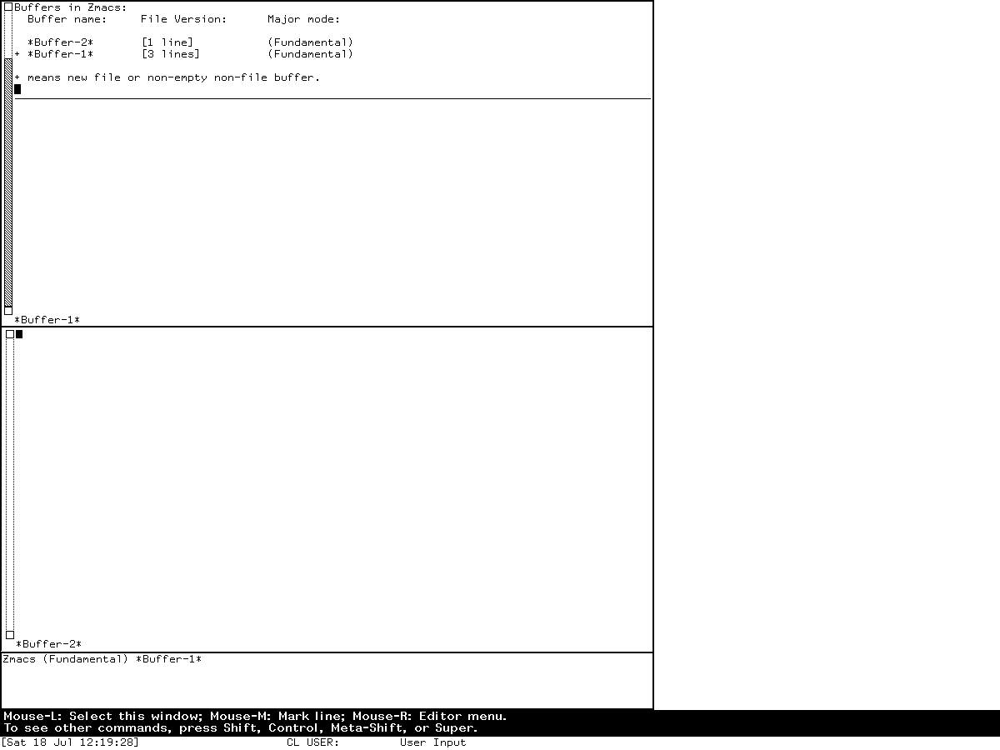

# Directory, difference, and buffer editors on CADR and Genera

Dired and Edit Buffers are not dialog boxes wrapped around file and buffer APIs.
They are special-purpose Zwei editors: each turns structured objects into a
read-only textual buffer, attaches the underlying object to each line, and reuses
normal editor motion, arguments, searching, Help, and command dispatch. LM-3
System 303 also has BDired, the **Balance Directories Editor**, which compares two
directory models and schedules transfers between them.

The family changed substantially. MIT System 46 Dired parses the fixed-format
output of a `DIR` device into one global `*DIRED*` buffer. System 303 gives each
invocation its own Zmacs buffer, supports multiple and nested directories, and adds
BDired and a four-column buffer-operation editor. Genera retains the editable-list
idea but replaces much of the implementation: Dired becomes a protected special
node over `FS:DIRECTORY-LIST`, and Edit Buffers reduces each row to one action while
adding presentations, filtering, comparison, and a separate multiple-choice buffer
manager.

This article separates three evidence boundaries:

| Boundary | Evidence used | What it establishes |
| --- | --- | --- |
| MIT CADR System 46 | Public source snapshot and operator documentation at commit `8e978d7d1704096a63edd4386a3b8326a2e584af` | The early implementation and complete local Dired table |
| LM-3 System 303 | Maintained public Fossil tree at check-in `4df393c68d7f083ce42d5c377039d26043cc18a9031ace28258dc97f4137eb91`, plus a fresh System 303 run | Later Dired, BDired, Edit Buffers, and one observed implementation defect |
| Symbolics Genera 8.5 | Licensed local source, Genera 8 manuals, and an isolated Open Genera runtime observation | The later specialized editors; no licensed source or extracted data is reproduced |

The editor substrates and global bindings are documented separately in
[the cross-system editor history](lisp-machine-text-editors.md), the
[System 303 binding inventory](mit-cadr/zwei-zmacs-keybindings.md), and the
[Genera binding inventory](genera/zmacs-keybindings.md). This page inventories every
local command cell in the specialized modes, including aliases, but does not repeat
the ordinary inherited Zwei motion and search tables.

## The shared interaction model

All three releases use the same durable pattern:

1. create or select a special editor buffer;
2. render one object per editable line and put the object itself in the line's
   property list;
3. make the buffer read-only to ordinary text insertion;
4. let single-character commands change a mark column or act on the row object; and
5. either execute deferred actions at exit or abandon them with `Abort`.

The apparent text is therefore a view with embedded identity, not the authoritative
file-system or buffer data. Normal cursor commands remain useful because the view is
still a Zwei buffer. Commands do not reparse the visible pathname or buffer name;
they recover the pathname, compiled-directory file, or buffer object attached to the
line. This is an early form of semantic list interaction, although the System 46 and
System 303 implementations predate Genera's presentation-oriented UI layer.

## MIT System 46 Dired

### Entry points and representation

`Dired` is available as a named Zwei command, as the current-file directory command,
and as the Lisp function `DIRED`, whose standalone top-level editor makes the same
mode usable without entering Zmacs first. The implementation selects the special
buffer `*DIRED*`, reads a `DIR` device stream, and parses each fixed-column row into
line properties for first name, version, size, creation date and time, reference
date, and status flags. It then marks the interval read-only.

This is a view of one directory at a time. The early code assumes directory output
sorted by file name and numeric version so it can compute the highest-version `>`
flag. The mode line carries the device and directory, not a pathname object attached
to a unique buffer. That architecture explains why the later System 303 rewrite is
more than a command-table expansion.

### Complete System 46 local controls

| Binding(s) | Operation |
| --- | --- |
| `Space` | Move to the next real line |
| `!` | Find the next file not backed up |
| `$` | Toggle this implementation's no-delete protection flag |
| `?`, `Help` | Show Dired's local command explanation |
| `D`, `d`, `Control-D`, `K`, `k`, `Control-K` | Mark one or more files for deletion |
| `E`, `e` | Edit the current file |
| `H`, `h` | Mark excess versions automatically; a numeric argument applies it to the directory |
| `N`, `n` | Find the next file with more retained versions than allowed |
| `P`, `p` | Mark the current file for printing |
| `Q`, `q`, `End` | Review and process requested operations, then exit |
| `U`, `u` | Cancel a deletion mark on the current or preceding applicable row |
| `V`, `v` | View the current file without reading it into an edit buffer |
| `X`, `x` | Enter an extended command |
| `Rubout` | Move upward and cancel the preceding deletion mark |
| `Mouse-3-1` | Open Dired's ten-item menu |

The fixed menu contains increasing and decreasing sorts by reference date, creation
date, file name, and size, followed by Automatic and Automatic All. These ten
actions, the local table above, and inherited Zwei commands are the complete
source-defined System 46 Dired surface at this boundary. Copy, rename, nested
subdirectories, load, source comparison, and BDired are **not** present in this
version's local table.

Deletion and printing are deferred. `Q` displays the requested set and asks for
confirmation; accepting performs the action, declining returns to the editor, and
the quit choices leave without performing it. Automatic deletion retains the
configured number of numeric versions, treats configured temporary types as
disposable, and respects the `$` protection mark.

## LM-3 System 303 Dired

### A pathname-backed, nested view

System 303 creates a unique read-only `ZMACS-BUFFER` for each Dired invocation,
marks its special type `:DIRED`, and retains a list of exact pathname objects. Each
file row stores `:PATHNAME` and its nesting `LEVEL`. A Dired buffer can show several
directories, expand a subdirectory inside the existing view, and remember which
subdirectories were open when the buffer is reverted. Directory operations use the
stored translated pathname rather than reconstructing it from display text.

The first column is an operation/state column: `D` means delete, lowercase `d`
means already deleted, `U` undelete, `P` print, `F` find into the editor, and `A`
apply a function. Exit groups work where file servers support multiple-file
operations. Viewing or editing a directory descends into a Dired view rather than
treating it as ordinary file text.

### Complete System 303 local controls

| Binding(s) | Operation |
| --- | --- |
| `Space` | Move to the next real line |
| `!` | Find the next file not backed up |
| `@`, `#`, `$` | Toggle do-not-delete, do-not-supersede, and do-not-reap flags |
| `.`, `,` | Change file properties; print file attributes |
| `=`, `Control-^` (character `036` octal) | Source-compare with newest; source-compare with a selected file |
| `?`, `Help` | Enter Dired's augmented Help dispatcher |
| `A`, `a` | Mark files for applying a function |
| `C`, `c` | Copy the row's file |
| `D`, `d`, `Control-D`, `K`, `k`, `Control-K` | Mark for deletion |
| `E`, `e`; `Control-Shift-E` | Edit, or enter Dired for a directory; edit in two windows |
| `F`, `f` | Mark a file to be found in the editor at exit |
| `H`, `h` | Apply automatic version cleanup |
| `L`, `l` | Load the file |
| `N`, `n` | Find the next file with excess versions |
| `P`, `p` | Mark for printing |
| `Q`, `q`, `End` | Process marks and exit |
| `R`, `r` | Rename |
| `S`, `s` | Show or remove a subdirectory in the current buffer |
| `U`, `u` | Mark an already deleted file for undeletion, or cancel another mark |
| `V`, `v` | View a file, or open a directory view for a directory |
| `X`, `x` | Execute all requested operations and remain in Dired |
| `0`–`9` | Build a numeric argument |
| `<`, `>` | Edit the superior directory; move to the most recent version |
| `Rubout` | Move upward and unmark |
| `Abort` | Leave without executing pending operations |
| `Mouse-3-1` | Open the file-sensitive Dired mouse menu |

This is the complete 62-cell local table: 46 direct cells and 16 lowercase aliases.
Its named menu commands provide Automatic, Automatic All, and eight increasing or
decreasing sort choices over reference date, creation date, file name, and size. A
separate file-sensitive mouse menu offers delete, rename, copy, subdirectory,
unmark, property change, edit, view, compare, find-on-exit, load, and hardcopy.

`S` is more capable than its short label suggests. With no numeric argument it
inserts or removes the selected subdirectory; an argument can ask for only a wildcard
subset. Revert records the open subdirectory pathnames, reconstructs the directory
list, and attempts to reopen the same nested views.

## BDired: Balance Directories Editor

BDired is present in the maintained System 303 tree but not in the inspected System
46 or Genera Dired sources. It asks for two directories, builds a compiled-directory
model for each, calls `FS:COMPARE-CDIRECTORIES`, and renders both sides in one
read-only Zwei buffer. Each row retains both a compiled-file object (`:CFILE`) and a
pathname; each compiled file also knows the alternate directory.

The comparison engine supplies initial transfer destinations, which BDired displays
as `T` marks before the user edits anything. `End` or `Q` configures transfer mode for
both directory models and performs their queued transfers. `Abort` exits without
performing them.

### Complete BDired local controls

| Binding(s) | Operation |
| --- | --- |
| `Space` | Move to the next real line |
| `=` | Source-compare the row's file with its newest version |
| `?`, `Help` | Enter Help with BDired's mode explanation added |
| `C`, `c` | Copy |
| `P`, `p` | Print the row's intended transfer destinations |
| `Q`, `q`, `End` | Perform selected transfers and exit |
| `R`, `r` | Rename |
| `T`, `t` | Mark for transfer to the alternate directory |
| `U`, `u` | Remove the transfer or other row mark |
| `V`, `v` | View the file |
| `Rubout` | Move upward and unmark |
| `Abort` | Exit without performing transfers |

These are all 21 local cells: 14 direct entries and seven lowercase aliases. Source
contains an `I`/`i` “Resolve Inconsistency” implementation inside a large `COMMENT`
form, and its table entries are themselves commented. It is unfinished historical
code, not an available System 303 command.

## System 303 Edit Buffers

### Four independent operation columns

System 303 Edit Buffers renders every Zmacs buffer as an ordinary line with four
operation columns before its modification marker and name:

| Column | Marks | Meaning |
| ---: | --- | --- |
| 0 | `K` | Kill the buffer |
| 1 | `S`, `W`, `R`, `~` | Save, write to another pathname, revert, or declare unmodified |
| 2 | `P` | Print the buffer |
| 3 | `.` | Select the buffer after processing |

Several independent actions can therefore be scheduled on one row. At exit the
implementation handles column 1, then printing, selection bookkeeping, and killing.
A newly requested kill also requests saving when the buffer needs it and moves the
selection mark if necessary.

### Complete System 303 local controls

| Binding(s) | Operation |
| --- | --- |
| `Space` | Move to the next real line |
| `S`, `s`; `W`, `w`; `R`, `r`; `~` | Mark save, write, revert, or unmodify in column 1 |
| `K`, `k`, `D`, `d`, `Control-K`, `Control-D` | Mark kill in column 0 |
| `.` | Mark the row for selection in column 3 |
| `U`, `u` | Cancel operations on the current row, or the prior row when already clear |
| `N`, `n` | Cancel only the row's file-I/O request |
| `P`, `p` | Mark printing in column 2 |
| `Help` | Show the mode-specific operation summary |
| `Rubout` | Move upward and cancel operations |
| `Abort` | Exit without executing marks |
| `End`, `Q`, `q` | Execute marks and exit |

These are all 27 local cells: 18 direct entries and nine lowercase aliases.

### A source-and-runtime-confirmed unmark bug

The Help text says `U` cancels every operation on a buffer. The implementation should
clear columns 0, 1, and 2, but assigns a space to column 0 three times. In a fresh
System 303 run, a row was marked `K` and `P`; `U` removed `K` while leaving `P`
visible. This is not a hypothetical static-code complaint: source and observed
behavior agree, and the installed Help disagrees with both.

The defect is historically instructive because it follows directly from the
four-column representation. The later Genera editor uses one action column, so the
same class of partial-unmark error cannot occur there.

## Genera 8.5 Dired

Genera preserves the one-row-per-file interaction but implements the buffer as a
`DIRED-NODE-MIXIN` over a read-only node. Revert uses
`FS:DIRECTORY-LIST :SORTED :DELETED`, attaches the pathname or switch metadata to
each line, inserts a disk-space summary, and places point on the first file row. The
protected-update wrapper saves the old interval and sort state, restoring them if an
error aborts a rebuild.

Dired is available through `Edit Directory`, the synonymous `Dired` Zmacs command,
and `Control-X D` for the current file's directory. The Genera workbook additionally
documents Command Processor entry through `Edit Directory pathname`.

### Complete Genera local controls

| Binding(s) | Operation |
| --- | --- |
| `Space` | Move to the next real line |
| `!`, `@`, `$` | Next not-backed-up file; toggle Don't Delete; toggle Don't Reap |
| `.`, `,`, `=` | Change properties; describe attributes/compilation data; source-compare |
| `0`–`9`, `-` | Build or negate a numeric argument |
| `?`, `Help` | Show Dired's local Help |
| `A`, `a` | Mark files for applying a function |
| `C`, `c` | Copy |
| `D`, `d`, `Control-D`, `K`, `k`, `Control-K` | Mark for soft deletion |
| `E`, `e` | Edit a file, or open another Dired buffer for a directory |
| `F`, `f` | Mark for formatting and hardcopy |
| `G`, `g` | Set and enforce generation retention |
| `H`, `h` | Mark excess versions automatically |
| `I`, `i` | Execute marked operations immediately, refresh, and remain in Dired |
| `L`, `l` | Load into Lisp |
| `N`, `n` | Find the next file with excess versions |
| `P`, `p` | Mark for hardcopy |
| `Q`, `q`, `End` | Confirm marked operations and exit |
| `R`, `r` | Rename |
| `U`, `u` | Remove a deletion or other pending mark |
| `V`, `v` | Show a file or directory without editing it |
| `X`, `x` | Enter an extended command |
| `Rubout` | Move upward and unmark |
| `Abort` | Exit without executing marks |
| `Mouse-3-1` | Open Dired's fixed mode menu |

The local named command `Show File Properties` supplements the keys. The fixed menu
has 14 items: increasing and decreasing sorts by reference date, creation date, file
name, size, and partition; Automatic and Automatic All; Change File Properties; and
Describe Attribute List.

Two implementation details extend the manual's task-oriented account. First, before
hardcopying, Dired accepts a canonical file type with an installed hardcopy formatter
or applies a conservative text heuristic; it rejects known binary or structured
types and considers byte size and host machine type. Second, aborting a failed
protected buffer rebuild restores the previous display instead of leaving a partly
rebuilt directory buffer.

## Genera Edit Buffers, List Buffers, and Kill Or Save Buffers

### Edit Buffers is a presentation-backed special node

Genera's `EDIT-BUFFERS-BUFFER` is a read-only special-purpose node with an optional
name substring. A numeric argument to Edit Buffers prompts for that substring. Its
heading is a `ZMACS-BUFFER-LISTING` presentation, so a displayed List Buffers result
can be translated directly into an editable list with the same filter. Each row
stores the actual buffer in `:BUFFER` and is itself displayed through the buffer
listing machinery.

Unlike System 303, there is one action character per row: `D`, `S`, `~`, or blank.
`E` immediately selects the row's buffer without executing any other marks. Exiting
selects the buffer under point, then performs saves, not-modified operations, and
kills. `H` automatically marks modified file buffers for saving.

### Complete Genera Edit Buffers local controls

| Binding(s) | Operation |
| --- | --- |
| `Space`, `Q`, `q`, `End` | Execute marked actions, select the row at point, and exit |
| `?`, `Help` | Show the local command explanation |
| `D`, `d`, `Control-D`, `K`, `k`, `Control-K` | Mark for deletion |
| `E`, `e` | Select immediately without executing marks |
| `H`, `h` | Mark every modified file buffer for saving |
| `S`, `s` | Mark for saving |
| `U`, `u` | Unmark the current row, or the preceding row when current is clear |
| `X`, `x` | Enter an extended command |
| `~` | Mark the buffer not modified |
| `=` | Source-compare the buffer with its associated file |
| `0`–`9` | Build a numeric argument |
| `Rubout` | Move upward and unmark |
| `Abort` | Exit without taking marked actions |

The source table contains 36 local cells when digit expansion and lowercase aliases
are counted. At the surrounding Zmacs level, `Control-X Control-Shift-B` invokes
Edit Buffers in the inspected source; `Control-X Control-B` is List Buffers. The
earlier isolated runtime session mapped host `Control-X Control-B` to the Edit Buffers
display in that world, so the static and host-input observations are recorded
separately rather than silently forced to agree.

`=` requires a file buffer with an associated pathname. Its bit-decoded numeric
argument uses bit 2 to ignore case and character style and bit 4 to ignore
whitespace. This source-visible comparison control is absent from the concise manual
description of Edit Buffers.

### List Buffers is a mouse-sensitive report

List Buffers is not merely the non-editable spelling of Edit Buffers. It sorts by
recent selection unless `*SORT-ZMACS-BUFFER-LIST*` is false, shows the buffer name,
version or description, and major mode, and emits each row as a presentation. Its
status characters distinguish a new or non-file buffer, a modified file, read-only
state, truncation, and the current buffer. A numeric argument filters names by a
prompted substring.

### Kill Or Save Buffers is a multiple-choice manager

`Control-X Control-Meta-B` invokes a separate `TV:MULTIPLE-CHOOSE` interface. It
groups modified files, new/non-file buffers, unmodified files, and read-only buffers,
then alphabetizes within groups. Modified and new/non-file buffers are preselected
for saving unless a numeric argument suppresses that default. Each row offers Save,
Kill, Unmodify, and Hardcopy; multiple choices are allowed and executed in the safe
order not-modified, save, kill, hardcopy. The current buffer is processed last so its
final message remains visible.

This three-way split is easy to miss in a feature list:

| Surface | Best use | Interaction model |
| --- | --- | --- |
| List Buffers | Inspect and point at buffers | Presentation report and row menu |
| Edit Buffers | Schedule one main state change per row with keyboard motion | Special read-only Zwei node |
| Kill Or Save Buffers | Apply several lifecycle actions across many buffers | Multiple-choice graphical menu |

*Runtime observation — Genera 8.5, session `zmacs-research`, generation 1,
verified 2026-07-18: Edit Buffers displayed `*Buffer-2*` and the modified
`*Buffer-1*`. This previously reviewed image is reused here as evidence for the
specialized buffer view; its full provenance and publication review are in the
[Genera screenshot catalog](assets/genera-screenshots/).*

## Fresh System 303 runtime observations

A fresh isolated CADR session named `d06-d07-20260718`, generation 1, used the
System 303 `LISPM` load band and the current LM-3 private copies. The run began at
04:37:29 and ended at 04:57:54 EDT on 2026-07-18. It stopped cleanly:
`forced_stop=false`, `state_may_be_incomplete=false`, and both emulator and Xvfb
exited zero. The base disk remained byte-identical.

| Item | Recorded value |
| --- | --- |
| Load band / base disk | SHA-256 `bb16e46ad81decfe1efe691d36b6aa4ce3fd4ffb82474365de3520989d397cb5` at start and stop |
| Public System tree | check-in `4df393c68d7f083ce42d5c377039d26043cc18a9031ace28258dc97f4137eb91` |
| Public L tree | check-in `d1250f90044f09b6c92014a9aef65f9574e1bcbf8a7163004e53cc6dbed0f2d6` |
| Public emulator / site / Chaos trees | `330d8248ec2e12af071e287920e681600f75df9ffd854aada5f8a64c9adad64d`; `8f717978b458b40adf1e238aaf177f5bc54ef46881268e03b787ba57b0d30a0e`; `db2953fde68d726a605d1d1699bab6c926ef252bd4991f692bae6ee5a634764e` |
| Private System / site / Chaos tree hashes | `21f5215de973aa6ccbddb817f2d64edd95ee1014c3028a9b0711ea7c741b807e`; `adbb720339db225e6635977a869cf3f3d50b507e614b37a976f4a6548d212a81`; `34ab197641aae909e9a224edc307020fddec263e732207a74573d51dac0daa87` |
| Emulator at start and execution | SHA-256 `707a77d23e28ea1c45ae0eb0145dc181fa7ba649b9defc30044d4f847ac2c5be` for both recorded phases |
| Machine artifacts | `promh.mcr` `2c667f99f014a7130a55b255d31df02588d9396beace78abfe9325269e4ff3e6`; `promh.sym` `e9e3dd6a541511dd9541ae96b99dae19cb185d8b79fa09959f21fa52224f233d`; `ucadr.sym` `9071decf16fa8f11d7970c4662db0d6e95600fe43ec86ac41c77b37dbd7caa2a` |
| Toolchain | `manifest.scm` SHA-256 `3adae999bbe420182f22adc2499fcc82449a46eaf580a362de9c0e718fa6b37d` |
| Window | `LOCAL-CADR [running]`, XID 2097202, 768 x 963 |

The meaningful input sequence was: finish the date dialogue; enter Zmacs with
`(ED T)`; invoke Dired; abort the unconfigured remote-file login path; invoke Edit
Buffers; display local Help; mark and unmark rows; create the combined kill-and-print
case and test `U`; abort without executing it; then exercise editor and System Help.
Earlier mistyped date-dialogue input is setup noise and supports no application
claim.

Three visible conclusions were established:

- Dired prompted with the default `ED-FILE: WILD` and then attempted an ED-FILE
  login. This preserved world has no configured credentials or file-service session,
  so a populated Dired listing was not reached. `Abort` left a modified special
  buffer prompt, which was declined. Full Dired and BDired filesystem workflows
  remain runtime `TODO`s requiring a disposable, deliberately configured service.
- Edit Buffers displayed `*Buffer-2*` and `*Buffer-1*`, with a mode line identifying
  the read-only Edit-Buffers mode and its `End`/`Abort` choices. Lowercase `d` visibly
  produced the implementation's `K` kill mark; `Rubout` canceled it.
- The combined `K` and `P` experiment reproduced the `U` defect described above.
  `Abort` then exited without executing either pending action.

Raw captures and records remain in the ignored session tree. The strongest
publication candidates are `0013-edit-buffers-list.png` (PNG SHA-256
`bfb96fecd7fc0bac92cc795a687eb0b1e938756fab07ccd9a3a28635f4453a0b`, normalized
pixel SHA-256 `7e7e951204b44fe98b13b8c0d9e0bdc00fcbc25c4476e0ec74bf7650505a1be2`)
and `0018-edit-buffers-unmark-bug.png` (PNG SHA-256
`efc1243a6d4739fadb94106bce4c109dd0872e43830bf7785e357ee7444aff04`, pixel
SHA-256 `0df5d4f9de829f74162bf628290891aba35ada5537eca5ad3fa8cc618baefe74`).

**Screenshot TODO:** these two CADR captures remain local pending image-specific
publication review and curation. No ignored build path is linked from this article.
The absence of an embedded CADR image is therefore an explicit review boundary, not
a substitution of an unverified description.

## Source findings the manuals do not make obvious

- System 46 does not merely have fewer Dired commands; it consumes a different
  directory representation and reuses one global special buffer. System 303's
  pathname and nesting model is an architectural rewrite.
- System 303 Dired remembers expanded subdirectories across revert and can operate on
  several directory pathnames in one buffer.
- BDired's apparent file list is a view over two mutable compiled-directory graphs.
  Transfer destinations exist in the model before the editor paints `T` marks.
- System 303 Edit Buffers can schedule four independent classes of work on one row,
  which produces both its flexibility and the live `U` bug.
- Genera's Edit Buffers heading and rows are presentations. The filtered List Buffers
  report can therefore act as an entry object for the editable view rather than only
  as printed text.
- Genera's `Kill Or Save Buffers` has dependency ordering between choices and handles
  the current buffer last; neither behavior follows from the four visible choice
  labels alone.
- Genera Dired protects rebuilds transactionally at the display-buffer level by
  restoring the old interval after an aborted revert.

## Preservation and open questions

- Complete a safe System 303 Dired and BDired runtime study against a disposable
  local file service. Do not enter credentials into a preserved public session.
- Capture a fresh Genera Dired listing and confirmation screen in the isolated VLM
  only after a non-external, disposable guest-visible pathname is established. The
  current harness intentionally exposes no host file service.
- Determine why host `Control-X Control-B` reached Edit Buffers in the earlier
  Genera session while the inspected static table assigns the unshifted chord to
  List Buffers. Possible causes include host key translation, world patch state, or
  a runtime table mutation; no cause is asserted yet.
- Review and curate the two System 303 Edit Buffers images above. A Dired login prompt
  is not a useful substitute for the blocked directory listing and should not be
  published decoratively.

## Sources

- MIT CADR System 46, [`nzwei/dired.55`](https://github.com/mietek/mit-cadr-system-software/blob/8e978d7d1704096a63edd4386a3b8326a2e584af/src/nzwei/dired.55),
  34,913 bytes, SHA-256
  `fc5f0853854383b4c6dc81949b67fb452a478fd728b8b6eae88112ec3e40c3eb`.
- MIT CADR System 46, [`lmwind/operat.27`](https://github.com/mietek/mit-cadr-system-software/blob/8e978d7d1704096a63edd4386a3b8326a2e584af/src/lmwind/operat.27),
  contemporary operator documentation for the reusable window and Help environment.
- LM-3 System 303, [`zwei/dired.lisp`](https://tumbleweed.nu/r/sys/file?ci=4df393c68d7f083ce42d5c377039d26043cc18a9031ace28258dc97f4137eb91&name=zwei%2Fdired.lisp),
  110,561 bytes, SHA-256
  `34155fec3311a969cfbed31c640b59159f28251b179f51b4c4a6c08b19c9eb34`.
- LM-3 System 303, [`zwei/bdired.lisp`](https://tumbleweed.nu/r/sys/file?ci=4df393c68d7f083ce42d5c377039d26043cc18a9031ace28258dc97f4137eb91&name=zwei%2Fbdired.lisp),
  16,636 bytes, SHA-256
  `58c365d9972cb22448e035ed220535e47dc2dc9ea02444a1416441b0c7009d22`.
- Symbolics, [*Genera Workbook*](https://bitsavers.org/pdf/symbolics/software/genera_8/Genera_Workbook.pdf),
  “The Directory Editor - Dired” and its walk-through.
- Symbolics, [*Genera User's Guide*](https://bitsavers.org/pdf/symbolics/software/genera_8/Genera_User_s_Guide.pdf),
  entries for Dired, Edit Buffers, List Buffers, and Kill Or Save Buffers.
- Licensed local Genera 8.5 `zwei/dired.lisp.~465~`, 78,695 bytes, SHA-256
  `d988987ca7220fd156a0c35eca2651e009c0054a8b9b86774890bfcaa6055da5`,
  and `zwei/buffer-editor.lisp.~12~`, 24,248 bytes, SHA-256
  `f339b6b55994148b02c46dbca3fd532a4784d67b8ae24d89fa9ef954c07bef14`.
- Fresh System 303 Xvfb session `d06-d07-20260718`, generation 1, observed
  2026-07-18; and the previously reviewed Genera `zmacs-research`, generation 1,
  observation described above.

Last verified: 2026-07-18.
