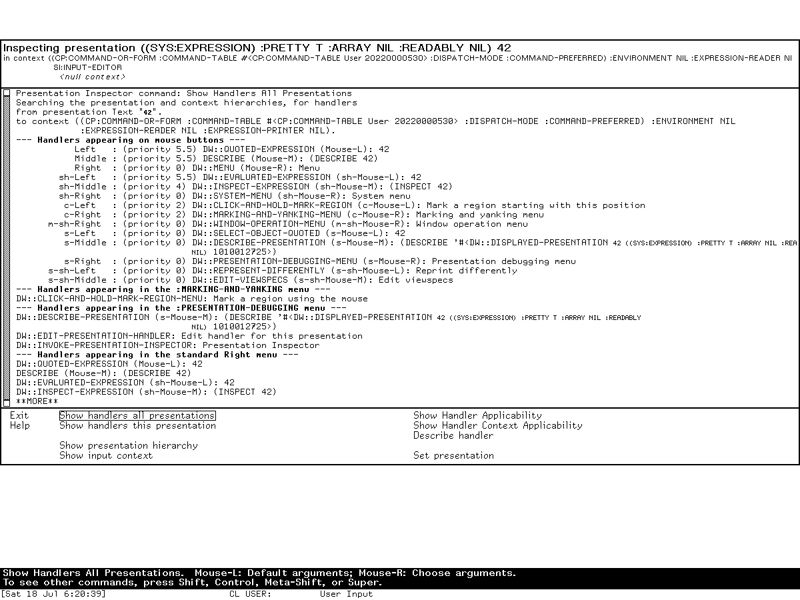
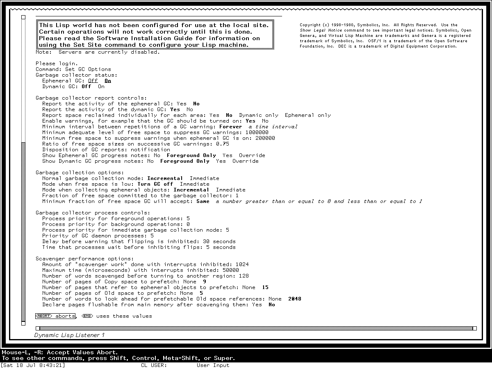

# Dynamic Windows and presentation-based interaction

Dynamic Windows is Genera's semantic user-interface substrate, not merely its window
manager and not a collection of widgets. It records that a visible region represents
a particular application object under a particular **presentation type**. An input
context says what type of object an operation currently needs. The system can then
highlight eligible output, recover the exact object under the pointer, translate it
to another type or a command, document the available gestures, and combine typed
pointer input with the same command language used from the keyboard.

That object/type/display link is the central historical idea. It explains why a
pathname printed by the Command Processor, a row in Edit Buffers, a frame pane name,
and a graphical circuit component can all be live operands without being conventional
buttons. Dynamic Windows also supplies output histories, formatted layout,
incremental redisplay, graphics, panes, command tables, and program frameworks, but
those layers build on the semantic record rather than replacing it.

The MIT CADR and maintained LM-3 systems are genuine antecedents: their TV system has
window flavors, frames, menus, mouse tracking, item lists, dynamic menus, choice
interfaces, highlighting, and who-line pointer documentation. They do **not** thereby
become releases of Dynamic Windows. The inspected Genera source declares a separate
presentation substrate, Command Processor, Dynamic Windows core, and client-framework
layer. This dossier keeps that architectural break explicit.

This article is complete at the **substrate, public programming interface, and bundled
generic-program grain**. It inventories the layered systems, presentation lifecycle,
type and handler model, command language, output/redisplay facilities, program-frame
model, the manuals' six documented standard pane types plus the source registry's
seventh `:TREE-BROWSER` type, and the complete directly interactive controls of
`accept-values`, `menu-program`, `reorder-sequence`, `alter-sequences`, and the
separately delivered `undo-program`. It does not list every presentation type or
every graphics function as if each were an application. The counted standard-type
modules and facility groups below make that boundary reproducible.

For a normative engineering contract rather than this historical and architectural
study, see the
[Dynamic Windows reimplementation specification](genera/dynamic-windows-reimplementation-specification.md).
Its compatibility levels, state models, algorithms, failure semantics, and
conformance cases make explicit what an independent implementation must reproduce
and which preserved-world probes remain open.

## Evidence and rights boundary

| Evidence | Release boundary | What it establishes |
| --- | --- | --- |
| Public System 46 source | Git revision `8e978d7d1704096a63edd4386a3b8326a2e584af` | TV windows, menus, item-list grammar, mouse tracking, highlighting, choices, and frames before Dynamic Windows |
| Public maintained LM-3 source | Fossil check-in `4df393c68d7f083ce42d5c377039d26043cc18a9031ace28258dc97f4137eb91`, tag `system-303` | Continued TV/menu/frame mechanisms and their changed implementation, without retroactively calling them Dynamic Windows |
| Contemporary paper | McKay, York, and McMahon, 1989 | The designers' typed-presentation model, stated goals, contemporary limitations, application examples, and development chronology |
| Genera manuals | Genera 8 programming manual and user-interface dictionary | Supported concepts, interfaces, program-frame options, pane types, formatted output, handlers, and redisplay workflows |
| Licensed Genera 8.5 source | Installed System 452.22 tree from the identified local archive | Exact subsystem composition, defaults, internal generic programs, source-only boundaries, and implementation evolution |
| Preserved Genera 8.5 world | Fresh isolated Xvfb sessions | Actual presentation-sensitive programs, handler diagnosis, command/pane behavior, and loaded-system state |

The Genera source and installed Help remain licensed local inputs. This page uses
interface names, counts, hashes, and original analysis; it does not reproduce source
listings or substantial Help prose. The runtime images are exact stills separately
reviewed for their stated evidentiary uses. Raw captures and session state remain
ignored.

## The model in one interaction

Suppose a command needs a pathname:

1. The application establishes a pathname input context.
2. Earlier output has left presentation records in one or more Dynamic Windows.
3. A displayed pathname is eligible directly; a displayed directory or host might
   also be eligible through a translator.
4. Moving the pointer causes matching presentations to highlight and changes the
   mouse-documentation line according to the applicable gesture.
5. A gesture returns the recorded pathname object, a translated object, or a command
   form. Text entry remains available through the pathname parser and completion
   machinery.
6. The command loop executes the same semantic command whether its arguments came
   from typing, a command menu, or visible presentations.

The presentation record therefore sits between domain state and pixels:

| Layer | Recorded or supplied information | Primary Genera facility |
| --- | --- | --- |
| Application | The real Lisp object and operations on it | application code and command bodies |
| Presentation semantics | Type, object, nested relationships, bounding region, view and internal metadata | `WITH-OUTPUT-AS-PRESENTATION`, `PRESENT`, output history |
| Input semantics | Desired type, predicate and context stack | `ACCEPT`, input contexts |
| Translation | Source type, target type or command, gesture, tester, priority and documentation | presentation translators, actions, command translators |
| Visual result | Text or graphics, highlighting, layout and redisplay records | Dynamic Window stream, formatted output, graphics, redisplay |

This is why a presentation should not be described as a widget. A widget is commonly
a control with callbacks. A presentation can be any textual or graphical output that
retains a semantic link to an application object. The same object can have multiple
presentations or views, and a nested display can offer different semantic objects at
different depths.

## Historical lineage

### CADR TV is an antecedent, not the same system

The public System 46 menu source already supports structured item lists rather than
plain strings. An item can supply a displayed label, return value, evaluator or
function action, documentation, font, and selection restrictions. The menu system
computes geometry, tracks the current item, highlights it, and offers momentary,
pop-up, multiple-choice, dynamic-item-list, and menu-choose interfaces. Mouse and
frame sources coordinate tracking, exposure, selection, pane composition, and the
who-line documentation string.

System 303 retains and expands this family. Its menu implementation includes computed
font maps, dynamic multicolumn lists, temporary menus, multiple choice, and explicit
who-line documentation methods. These mechanisms relate screen regions to operations,
but the relationship is local to a menu or window implementation. The source does not
declare the later presentation-type lattice, general `PRESENT`/`ACCEPT` duality,
input contexts, or cross-application translator selection.

| CADR facility | What it contributes | What must not be inferred |
| --- | --- | --- |
| Window/frame flavors | Composition, selection, exposure, panes and event dispatch | A typed presentation database |
| Menu item lists | Structured labels, values, actions, documentation and geometry | That every displayed application object is a menu item |
| Mouse tracking and highlighting | Pointer feedback over registered regions | General type-directed input matching |
| Choice and multiple-choice interfaces | Early form/menu interaction | The later `ACCEPTING-VALUES` redisplay and typed-query model |
| Who-line documentation | Contextual pointer-operation text | Dynamic Windows handler priority or translator inheritance |

### Dynamic Windows chronology

The 1989 design paper says the original system was developed in Symbolics Common
Lisp during 1986–1987, first delivered to customers in 1987, and improved in early
1988. It describes CLIM as the then-in-progress portable CLOS-based successor. That
is a contemporary lineage statement, not a claim that Genera 8.5 Dynamic Windows and
CLIM 2 are interchangeable APIs. This museum treats [CLIM on Genera](genera/index.md)
as a separate dossier topic.

The paper also records an important intent: replace application programming in terms
of active regions and low-level mouse callbacks with programming in terms of domain
objects and operations. It identifies Concordia, the Font Editor, Graphic Editor,
Display Debugger, and a business-graphics package as applications of the model. The
licensed release and live world independently confirm several of those relationships.

## Genera's declared layer graph

The inspected System 452.22 declaration does not contain one monolithic
`DYNAMIC-WINDOWS` file group. Its order is meaningful:

| Declared subsystem | Direct role | Important boundary |
| --- | --- | --- |
| `TV` | Screens, sheets, windows, mouse, frames, menus, color and graphics base | Loads several Dynamic Windows graphics/flavor mixins early because the window system needs them |
| `PRESENTATION-SUBSTRATE` | Type descriptors, definition macros, standard types, histories, completion, typed input and handlers | Declared `:optional`, while selected standard-type/history/completion files are categorized as basic |
| `CP` | Command tables, command reader, accelerated commands and substrate commands | Uses presentations but remains a separately declared command-language subsystem |
| `DYNAMIC-WINDOWS` | Formatted output, redisplay, output records, windows, graphics, combinations, grapher and activities | Core presentation-aware display and layout layer |
| `DYNAMIC-WINDOW-CLIENTS` | Program-framework panes, framework generator, Accepting Values, `FQUERY`, sequence reorder tools | Higher-level reusable clients, not type primitives |

The dependency ordering resolves a common catalog mistake. `TV`, Dynamic Windows,
the Command Processor, and program frameworks cooperate closely, but they are not
aliases. It also explains why a world can use presentations throughout its core UI
without advertising “Dynamic Windows” as a selectable application.

### Exact module inventory at the dossier grain

`PRESENTATION-SUBSTRATE` has six declared groups:

| Group | Modules and responsibility |
| --- | --- |
| Definitions | good-table storage and substrate descriptors |
| Function-spec/type implementation | type descriptors, type methods and walking, mouse-handler lookup/tests, type keys |
| Histories | generic history inner layer plus presentation history substrate |
| Definition macros | argument restructuring, presentation-type definition, handler definition |
| Type library | type primitives, Accept substrate, core, number and sequence types |
| Interaction | completion, full standard presentation types, character-style types, dynamic input and basic handlers |

The standard type modules contain 133 `DEFINE-PRESENTATION-TYPE` forms at the
selected file versions: 44 in core types, 19 numeric, 15 sequence, 48 general
application/system types, and 7 character-style types. Conditional redefinitions and
one source control escape mean this is a definition-form count, not a claim of 133
simultaneously distinct live names. The library spans Lisp objects, numeric ranges,
sequences and membership, pathnames and files, time, fonts, systems, network and
namespace objects, printers, windows, Flavors/CLOS/function specifications, syntax,
and character styles.

`DYNAMIC-WINDOWS` then declares a main group for formatted output, cold support,
redisplay, box geometry, displayed presentations, Dynamic Window streams, viewport
graphics, window combinations, graphing, color, binary graphics, and activities; a
separate command-method integration module; and graphics/formatted-output tests whose
root module is deliberately false.

## Presentation types

### A user-interface type is not just a Lisp storage type

A presentation type describes the interactive meaning of an object. The same fixnum
may be presented as a decimal number, an octal address, a menu choice, or a bounded
coordinate. Conversely, a pathname type can describe different underlying pathname
representations while retaining a common user-facing role.

The type syntax separates:

- **data arguments**, which refine membership or semantic subtype relationships;
- **presentation arguments**, which affect parsing, printing, view, defaulting or
  other interaction without necessarily changing the set of acceptable Lisp values;
- **meta presentation options**, understood by the substrate around a type; and
- compound types that call `ACCEPT` recursively for structured input.

Presentation types form a lattice. Exact type equality is not required: a subtype can
satisfy a supertype input context, and a type can provide custom subtype/type
predicates or expand into another type. The 8.5 implementation retains descriptors
and cached lookup structures because data and presentation arguments cannot all be
resolved statically.

### Complete public method families

At this dossier's grain, a type descriptor can supply the following interaction
families:

| Family | Role |
| --- | --- |
| Printer and parser | Convert between object and visible/textual representation |
| Type-name printer and describer | Explain the type in prompts, Help and diagnostics |
| Views and view choices | Select among alternate appearances |
| Input history and postprocessing | Reuse and normalize previously accepted values |
| Default preprocessing | Transform or validate defaults before input |
| Highlighting-box function | Compute the visual feedback region |
| Choose, Accepting Values and menu displayers | Present the same semantic type appropriately in different interaction styles |
| Subtype/supertype walkers and predicates | Define lattice relationships and argument-dependent matching |
| Lisp-type generator/equivalent/type predicate | Connect presentation semantics to underlying data types where appropriate |
| Binary-graphics encoder | Represent supported graphical values in the binary graphics stream |

This list is deliberately more precise than “a type has a parser and printer,” while
remaining bounded above the hundreds of application-specific types in the release.

## Typed output and output histories

`PRESENT` chooses the appropriate printer and records its output as a presentation.
`WITH-OUTPUT-AS-PRESENTATION` lets an application draw arbitrary text or graphics
while explicitly supplying object and type. Records can nest, share a single
highlighting box, allow or suppress sensitive inferiors, and carry a view.

A Dynamic Window retains recorded output, including output scrolled out of view,
until its output history is cleared. That enables backward/forward and horizontal
scrolling to restore earlier semantic output. It also creates a storage and correctness
obligation: an application must deliberately clear or supersede stale history rather
than assuming pixels alone define current interaction.

The displayed-presentation layer records boxes and visibility. Input lookup uses the
record tree rather than rescanning screen pixels. Text cutting/pasting remains
available, but it is weaker when the printed form loses identity or cannot be parsed
back into the exact original object.

## Typed input, contexts, and handlers

`ACCEPT` requests an object of a presentation type. The user may type a parsable form,
use completion/history/defaulting, or select compatible recorded output. An input
context can contain nested expectations while a compound parser recursively accepts
parts. Only presentations matching the active context—or having an applicable
translation—become eligible.

### Handler families

| Handler kind | Result |
| --- | --- |
| Direct translator | Converts the presented object to an object satisfying the target context |
| Presentation action | Performs an interaction that helps obtain input, such as exposing a related set, without itself supplying the final operand |
| Presentation-to-command translator | Produces a semantic command form from a presented object and gesture |
| Command-menu handler | Associates menu-level and gesture behavior with a command table |
| Blank-area handler | Makes an operation available when no presented object owns the pointer location |

A handler can specify source and target types, gesture, tester, priority, documentation,
menu visibility, highlighting policy, applicability in nested contexts, and whether it
acts on an object or the presentation record. Selection therefore is not “first
callback attached to this rectangle.” It searches type relationships and context,
tests candidates, resolves priorities, and produces context-sensitive feedback.

The separately documented [Presentation Inspector](genera/presentation-inspector.md)
exists because this matching can be nontrivial. It reports presentation hierarchy,
current contexts, effective priorities, gestures, menu placement, type reductions,
and why candidates did or did not apply.

*Runtime observation: this reviewed Genera 8.5 screen turns the abstract handler
search into visible evidence. The inspected object is researcher-entered; the image
is the first report page, not a dump of the world's handler database.*

## Logical gestures and mixed-mode input

Dynamic Windows gives gestures symbolic names rather than making applications depend
only on raw button/modifier encodings. A translator names a logical gesture; the
current mapping supplies pointer and modifier details. Keyboard accelerators,
command menus, typed command names, completion, and pointer translators all converge
on command objects or accepted application objects.

The design supports both noun-verb and verb-noun interaction:

- invoke a command, then click a displayed operand;
- point at an object and choose an applicable operation;
- choose a command-menu presentation;
- type the command and all operands;
- mix typed and pointed operands within one command; or
- use an accelerator whose command table supplies the complete command form.

The bottom mouse-documentation line is computed from current presentations, contexts,
handlers and modifiers. It is evidence of semantic availability, not a static legend.

## Commands and command tables

The Command Processor and program frameworks use related command definitions. A
command definition specifies typed arguments and options; the reader uses
presentation parsers, prompting, defaults, completion and pointer selection to build
a command form. The command body operates on Lisp objects, not on widget IDs.

Command tables can:

- inherit from one or more other tables;
- hold commands, accelerators and menu levels;
- control whether keyboard accelerators are active;
- give one command several input surfaces;
- install command-menu handlers and presentation translators; and
- be inspected by Help and diagnostic tools.

Program-framework command definers additionally provide lexical access to declared
program state and automatically place commands in the program's table/menu according
to definition options. This is why a visible command menu and the typed interactor are
two renderings of one command model, not separate implementations of each operation.

## Formatted output and redisplay

Dynamic Windows separates four concerns that are often collapsed into “redrawing”:

| Facility | Purpose |
| --- | --- |
| Formatted output | Arrange tables, rows, cells, item lists, graphs and textual blocks without hard-coding final coordinates |
| Replayable output | Retain a callable output description that can be replayed or resorted |
| Redisplayable output | Associate displayed output with a unique identifier and cached comparison value |
| Incremental redisplay | Recompute a hierarchy and update only pieces whose cached values or geometry changed |

The redisplay implementation is box-oriented and hierarchical. A redisplay piece can
contain other pieces, presentations and formatted-output boxes. Stable unique IDs and
an explicit comparison test let the system match new output to old output. Changed
pieces can be erased, moved, or redrawn while unaffected pieces remain. This reduces
flicker and work, but correctness depends on stable identities and adequate cache
values.

The source and manual expose a subtle compiler interaction: formatted-output and
redisplay macros may snapshot lexical variables used in deferred output. Shared
variables that an application intends to mutate must be explicitly exempted. That
behavior is not apparent from a screenshot and is one of the reasons this dossier is
source/manual grounded rather than a visual tour.

## Program frameworks

`DEFINE-PROGRAM-FRAMEWORK` turns a declarative interface description into a program
flavor, state, panes, frame configuration, command table/definer, command loop,
redisplay hooks and optional activity registration. Frame-Up is a source generator
for this form, not the runtime substrate itself.

### Program-level options

At the supported-workflow grain, a framework controls:

- state variables and inherited program flavors;
- command table, inheritance, command definer and keyboard accelerators;
- top-level function and process/selectability behavior;
- pretty name, activity/menu registration and Select key;
- panes, frame constraints and named configurations;
- terminal-I/O and selected interaction panes;
- initialization, selection, deselection and command-loop hooks; and
- whether panes redisplay after commands or on specific application requests.

The macro can define a useful internal program with `:selectable nil`. Therefore a
literal framework definition proves a reusable program object, not that it appears in
the activity table, System Menu, Select-key table, or default-window list. The
[software catalog](genera/software-areas-and-applications.md) applies that distinction
to all 49 framework definitions found in the inspected media.

### Standard pane types: six documented, seven registered

The Genera 8 programming manual documents the first six families below. The selected
System 452.22 source registry also installs `:TREE-BROWSER`; this source/manual delta
is why a compatible designer must enumerate the registry rather than hard-code the
manual's list.

| Pane type | Function and key options |
| --- | --- |
| Accept Values | Typed queries and choices; Accepting Values function; redisplay-after-command; size from output; optional fixed height |
| Display | Application output; pane flavor; string/function redisplayer; incremental redisplay; fixed/content size; optional typeout window |
| Title | Program title/status output; string/function redisplayer; optional incremental redisplay and sizing |
| Command Menu | Commands from a table/menu level; row or column geometry; menu identifier; centering and equalized/compressed columns |
| Interactor | Mixed command input/output; fixed height; optional typeout window and automatic removal |
| Listener | Taller history-oriented interactor; optional height and typeout behavior |
| Tree Browser | Source-registered hierarchical semantic-node display with expansion, selection, and framework integration; omitted from the manual's six-type list |

Frame-Up's complete commands, pane options, horizontal/vertical semantics, generated
form and editor integration are documented in [Screen Editor and Frame-Up](screen-editor-and-frame-up.md).
The actual two-pane model demonstrates that the declaration becomes a live program
frame rather than a static mock-up:

*Runtime observation: the reviewed screen shows a generated two-pane model and short
command transcript. It supports the program-frame/pane analysis here; it does not
claim that this synthetic layout exhausts the pane or constraint system.*

## Bundled generic programs and complete controls

These facilities are small reusable program frameworks. They are documented here
because the release catalogs expose their definitions, not because each is a Programs
menu application.

### `menu-program`

`menu-program` turns an arbitrary choice set into a presentation-aware temporary
menu. Pointer selection can return a choice directly. Keyboard characters build a
case-insensitive prefix, update the underlined match, and allow exact keyboard choice.

| Control | Exact behavior |
| --- | --- |
| Pointer Select on an item | Return that item's recorded object |
| ordinary text | Append to the choice prefix and update the highlighted match |
| Control-N / Control-P | Move highlight down/up, honoring numeric argument |
| End | Return the highlighted object; beep if none |
| Rubout | Delete the final prefix character; beep at the beginning |
| Clear Input | Clear the entire prefix and highlighting |
| Help | Display the short generated interaction/accelerator description |
| Abort | Signal abort and leave the menu |

The source implements six command definitions; the previous/next split shares one
parameterized command through two accelerators. That is why counting labels alone
would undercount interaction while counting accelerators as commands would overcount
implementation entries.

### standalone Accepting Values

`ACCEPTING-VALUES` repeatedly displays typed queries inside a redisplay environment.
Each field retains a query identifier, type, value/default state and presentation.
Changing one query can selectively redisplay dependent output rather than rebuilding
the whole form.

| Control or presentation gesture | Behavior |
| --- | --- |
| Select on value | Replace field through its type's input interface |
| Select-and-Edit | Edit using the old value as initial input |
| Remove | Reset the field to `NIL` through the query command |
| Select on enumerated choice | Apply the choice's selection action and update query/history |
| Space | Enter/replace the currently highlighted question |
| Control-E / Control-D | Edit/remove the highlighted value |
| Control-N / Control-P | Move to next/previous question |
| Control-F / Control-B | Move to next/previous choice in an enumeration |
| Refresh | Force complete redisplay |
| Help | Display generated short form and accelerator guidance |
| End / Done | Validate required confirmations and return the choices |
| Abort | Signal abort without accepting the form |
| Select a sample | Copy a compatible presented sample into the matching query |
| Select a command button | Run its continuation and resynchronize the form |

The file contains 12 standalone command-definition forms, seven explicit cursor
accelerators plus the four command key accelerators (`Refresh`, `Help`, `End`,
`Abort`), and presentation translators for values, choices, samples and buttons.
Accept Values panes reuse the query/redisplay machinery but route four pane commands
through the owning program and can install the same seven cursor accelerators in a
separate inherited command table.

*Runtime observation: in the fresh isolated Genera 8.5 world, `Set GC Options`
opened this standalone typed form. An expression mistakenly entered while a Boolean
field still owned input was rejected by that field's type checker and then removed.
No option changed. Pointing at the printed Abort object changed the bottom mouse
documentation to the form-specific abort operation; left-clicking it returned to the
Dynamic Lisp Listener. This directly verifies typed field input, presentation-sensitive
pointer documentation, redisplay after correction, and noncommitting pointer abort.
The [curated capture catalog](assets/genera-screenshots/index.md) records the exact
interaction prefix, hashes, isolation, and shutdown result; the
[rights review](screenshot-publication-rights-review.md) limits publication to this
analysis.*

### `reorder-sequence`

This nonselectable temporary framework has three commands:

| Command/control | Behavior |
| --- | --- |
| Done / End | Return the reordered sequence |
| Abort / Abort key | Leave by signalling abort |
| Hold Select on an item and drag vertically | Move it through the sequence; redisplay as it crosses recorded item boxes; release at the desired position |

It resizes near its invoking context, uses presentations for each element, and returns
a reordered copy/working sequence. It is not a general list editor with insert/delete
commands.

### `alter-sequences`

This larger nonselectable framework operates on multiple candidate sequences:

| Command/control | Behavior |
| --- | --- |
| Select Sequence | Fill/rotate the two working panes from a presented candidate |
| Hold Select and drag an element | Move it within a sequence or between the two selected sequences |
| Reshape | Invoke the lower-right window reshape operation |
| Done / End | Return one result per input choice, using `:UNCHANGED` where untouched |
| Abort / Abort key | Signal abort |

The source defines five commands and two presentation-to-command translators. It
also wraps the cross-sequence mutation in an abort-inhibited section to avoid losing
or duplicating the element between the delete and insert operations.

### `undo-program`

`undo-program` is a reusable program superclass, but its selected source lives in the
optional Graphic Editor family rather than in the declared Dynamic Windows core or
client modules. Bitmap, Stipple and Font Editors inherit it. That source location is
important catalog evidence: the base framework supports command inheritance, but the
particular branching undo implementation is not proved resident merely because
Dynamic Windows is loaded.

| Command/menu gesture | Behavior |
| --- | --- |
| Undo, left gesture | Undo the current history element |
| Undo, right gesture | Choose a specific undo target from the history menu |
| Redo, left gesture | Redo the next element when unambiguous |
| Redo, right gesture | Choose a specific redo target, including a branch |
| Skip | Advance the current history position without applying an operation |
| Clear Undo History | Drop the linked history so retained state can be reclaimed |

There are four command-definition forms (`Undo`, `Redo`, `Skip`, and clear), while
left/right command-menu handlers provide the immediate-versus-menu variants. The
history can branch: an element's next link can become a list rather than a single
successor. This is more expressive than two flat stacks and is not apparent from the
short Undo/Redo labels inherited by applications.

## Source, manual, and runtime findings

### Established by all three evidence layers

- Genera programs use presentation records to connect visible output to typed Lisp
  objects, and live applications expose those objects through context-sensitive
  gestures and commands.
- Command tables, menus, keyboard accelerators and pointer translators are different
  entry paths into the same command model.
- Program frameworks combine panes, state, command tables, redisplay and activity
  integration; Frame-Up edits/generates that declarative structure.
- Handler selection is sufficiently context- and type-dependent to justify a dedicated
  live Presentation Inspector.

### Source findings that a conceptual manual can hide

- The release splits `TV`, `PRESENTATION-SUBSTRATE`, `CP`, `DYNAMIC-WINDOWS`, and
  `DYNAMIC-WINDOW-CLIENTS`; “Dynamic Windows” is not one indivisible load unit.
- `TV` deliberately loads selected Dynamic Windows graphics/flavor components before
  the complete subsystem, reflecting a boot/dependency constraint rather than a clean
  directory boundary.
- The 133 standard type-definition forms include conditional/repeated names, so a
  textual form count must not be rewritten as a live unique-type count.
- `menu-program` has keyboard prefix matching and one parameterized highlight command,
  behavior more specific than “pops up a menu.”
- Accept Values panes and standalone Accepting Values share query/redisplay machinery
  but use different command tables and resynchronization paths.
- `alter-sequences` protects the cross-pane move's critical mutation against aborts.
- `undo-program` supports branching redo history and is delivered with Graphic Editor
  source, not the base Dynamic Windows subsystem.

### Paper-era limitations versus Genera 8.5

The 1989 paper reports global-translator lookup cost, expensive caches, procedural
compound parsers/printers, limited user view preference, comparatively weak graphical
input gadgets, and performance below conventional toolkits. Those are primary
historical observations about the implementation then. This page does not silently
promote them to verified Genera 8.5 defects. The later source contains expanded
descriptors, lookup machinery, extensive graphics and program frameworks; determining
which paper-era limitations remained requires targeted measurement or revision
history.

### Runtime boundary

The fresh Frame-Up, Presentation Inspector, and standalone Accepting Values sessions
prove the program-frame, pane, presentation, context, typed-query, correction,
redisplay, and handler layers in the preserved Genera 8.5 world.
Other documented applications—Zmacs Edit Buffers, the Inspector, Document Examiner,
Zmail, Flavor Examiner and the Display Debugger—supply additional cross-checks in
their own dossiers. A dedicated standalone `menu-program`, `reorder-sequence`,
`alter-sequences`, and branching-undo exercise remains deferred because these are
internal or optional facilities whose safe invocation should use entirely synthetic
data and an explicitly verified loaded definition.

## Preservation and reproduction notes

- Keep licensed source, Help, raw sessions and worlds untracked. Record file identity
  and describe behavior in original words.
- Treat presentation records as volatile runtime state. A screenshot shows their
  visible effect but cannot preserve the underlying object identities, contexts or
  handler database.
- Preserve the exact release boundary. A later CLIM API or a McCLIM implementation
  can illuminate concepts but is not evidence of a Genera 8.5 function, default or
  key binding.
- Do not infer application availability from a framework definition. Check activity,
  Select-key, menu, loaded-system and package/function evidence separately.
- When capturing a presentation interaction, record the active context and gesture,
  not only the final pixels; identical-looking text can have different semantic types.

## Open questions and deferred tests

- Build a researcher-owned synthetic Accepting Values form to measure every cursor
  accelerator and dependent-field redisplay without relying on operational GC fields.
- Build a tiny researcher-owned program framework in unsaved memory to compare typed
  text input, presentation selection and incremental redisplay without inspecting
  proprietary application data.
- Determine whether the release's registered handler/cache invalidation fully resolves
  the 1989 paper's stated cache-clearing and global-translator problems.
- Establish safe public test data and loaded definitions for `reorder-sequence`,
  `alter-sequences`, and the optional branching undo framework.
- A compatible System 46 load band is needed for a direct runtime comparison of
  menu/item-list pointer feedback against System 303 and Genera.

## Artifact identities

### Public antecedent source

| File | Bytes | SHA-256 |
| --- | ---: | --- |
| System 46 `src/lispm2/window.217` | 57,941 | `3238e99b309b794569405c9f036c393e8c3f30ce163de2ea56824f497983b950` |
| System 46 `src/lmwin/mouse.149` | 40,629 | `2bf88baf3a881a47be520fdbd0e1fa0fa45c0e8fa0c5eb0dc349ed5b8877585d` |
| System 46 `src/lmwin/menu.29` | 44,154 | `dc750a73f9c5983b913890f159c118075f8b5c1566cc0f2420f5637f2f5439a2` |
| System 46 `src/lmwin/frame.120` | 40,532 | `a43a7eed0cd7ebe7e9a8ffabdb402f354702e2071443a313ca7378ad91a40ed0` |
| System 303 `window/mouse.lisp` | 57,256 | `facf7f3dd979a758bd70b0644120ccceb0f243188acd180dcbf0a70a836ec6b2` |
| System 303 `window/menu.lisp` | 60,809 | `4821fb9b3d4541a371ad106f7042d8c59dbb33daf8d9a27ffb24b3141aa796e9` |
| System 303 `window/frame.lisp` | 43,578 | `09177f35461f0cea4bdbf276104ffafe5f4a082a140a7ab1b8a8db12dc49ad4c` |

### Licensed Genera representatives

These identities are evidence metadata. The files remain untracked.

| File | Bytes | SHA-256 |
| --- | ---: | --- |
| `sys.sct/sys/sysdcl.lisp.~1059~` | 39,497 | `3bb5fad39feb2d174c53b94ea7b726a6f3fa3de1ec18a1293352bb68027c1584` |
| `sys.sct/dynamic-windows/substrate-definitions.lisp.~44~` | 47,954 | `d9692d71c5e0237944a32330f2b02ba9cafdee23f6f34b2f586edd706fdf8e3e` |
| `sys.sct/dynamic-windows/define-type.lisp.~8~` | 43,218 | `f7505ed64460c90361b2cdfc09e2a96667dc1381a76270301233aa88573e4046` |
| `sys.sct/dynamic-windows/define-handler.lisp.~12~` | 25,689 | `00d7c33ea97a342ff53877b8c33106f2b1730bb0fd86963d1a086e4bac883ab0` |
| `sys.sct/dynamic-windows/dynamic-input.lisp.~498~` | 55,058 | `a79805ece6844ccb568ecf97e2d818a0c6095e539e51fbf74423944a32b6dd8f` |
| `sys.sct/dynamic-windows/formatted-output.lisp.~397~` | 108,448 | `7317eee2b94d185f6f3ca51feed57a4adec7594760a81c17f7b55b043bb67de0` |
| `sys.sct/dynamic-windows/redisplay.lisp.~185~` | 113,947 | `61134f02a3491966b3f45199af264e622b2004feccc3c2e3263e9866a99b699e` |
| `sys.sct/dynamic-windows/dynamic-window.lisp.~625~` | 177,680 | `92e9322d4e04020d014055ab452036ff7df2adfe13570eb8c99c02e369de55ca` |
| `sys.sct/dynamic-windows/define-program-framework.lisp.~332~` | 132,692 | `e4fde854b9a36492bf4d23eec0a812bd36c7d42e7d32c649c7aaa5786cd30128` |
| `sys.sct/dynamic-windows/accept-values.lisp.~244~` | 82,063 | `1c430c59e77f488fe3b85475bd89c704e2250e343243f7399ab9c0c5896de0d5` |
| `sys.sct/dynamic-windows/reorder-sequence.lisp.~10~` | 31,603 | `d84c935cd8f2b7540e00464ab2a0e58aa98c4975316ea9e375c97665cfaa5a0f` |
| `sys.sct/graphic-editor/undo.lisp.~16~` | 12,680 | `ce9e4a764cda0615c0771a55b3430e0a2c96d4e74cd8d0d910b50f61efaf7e9f` |

## Sources

- MIT System 46, pinned public [window](https://github.com/mietek/mit-cadr-system-software/blob/8e978d7d1704096a63edd4386a3b8326a2e584af/src/lispm2/window.217),
  [mouse](https://github.com/mietek/mit-cadr-system-software/blob/8e978d7d1704096a63edd4386a3b8326a2e584af/src/lmwin/mouse.149),
  [menu](https://github.com/mietek/mit-cadr-system-software/blob/8e978d7d1704096a63edd4386a3b8326a2e584af/src/lmwin/menu.29), and
  [frame](https://github.com/mietek/mit-cadr-system-software/blob/8e978d7d1704096a63edd4386a3b8326a2e584af/src/lmwin/frame.120) source.
- MIT, [*Lisp Machine Manual*, third edition](https://bitsavers.org/pdf/mit/cadr/chinual_3rdEd_Mar81.pdf),
  for windows, menus, frames, choices and pointer interaction.
- LM-3, pinned System 303 [mouse](https://tumbleweed.nu/r/sys/file?ci=4df393c68d7f083ce42d5c377039d26043cc18a9031ace28258dc97f4137eb91&name=window%2Fmouse.lisp),
  [menu](https://tumbleweed.nu/r/sys/file?ci=4df393c68d7f083ce42d5c377039d26043cc18a9031ace28258dc97f4137eb91&name=window%2Fmenu.lisp), and
  [frame](https://tumbleweed.nu/r/sys/file?ci=4df393c68d7f083ce42d5c377039d26043cc18a9031ace28258dc97f4137eb91&name=window%2Fframe.lisp) source.
- Scott McKay, William York, and Michael McMahon,
  [“A Presentation Manager Based on Application Semantics”](https://doi.org/10.1145/73660.73678),
  *Proceedings of UIST 1989*, for the original Dynamic Windows model, chronology,
  design experience and then-current limitations.
- Symbolics, [*Programming the User Interface*](https://bitsavers.org/pdf/symbolics/software/genera_8/Programming_the_User_Interface.pdf)
  and [*User Interface Dictionary*](https://bitsavers.org/pdf/symbolics/software/genera_8/User_Interface_Dictionary.pdf),
  for the supported Genera 8 presentation, command, output, redisplay, frame and
  handler interfaces.
- Licensed local Genera 8.5 release source and the runtime dossiers linked above;
  portable identities and limits recorded here; inspected 2026-07-19.

Last verified: 2026-07-19.
