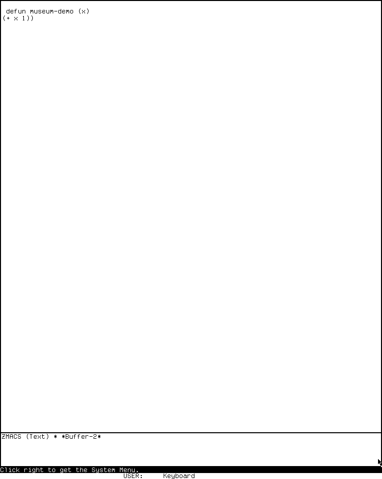
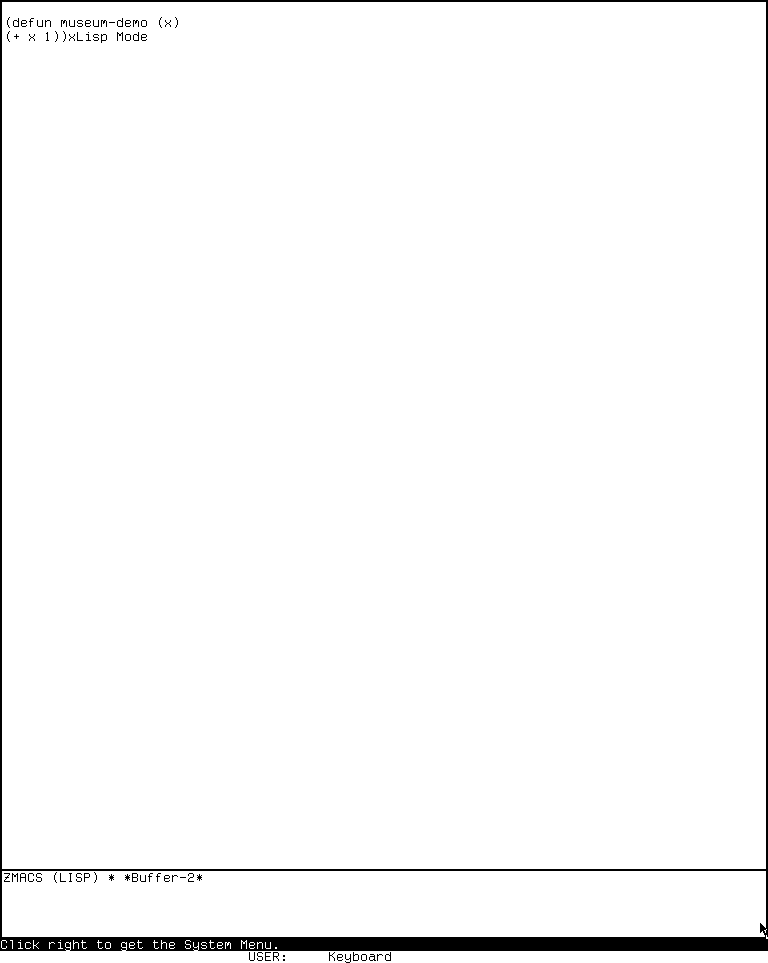
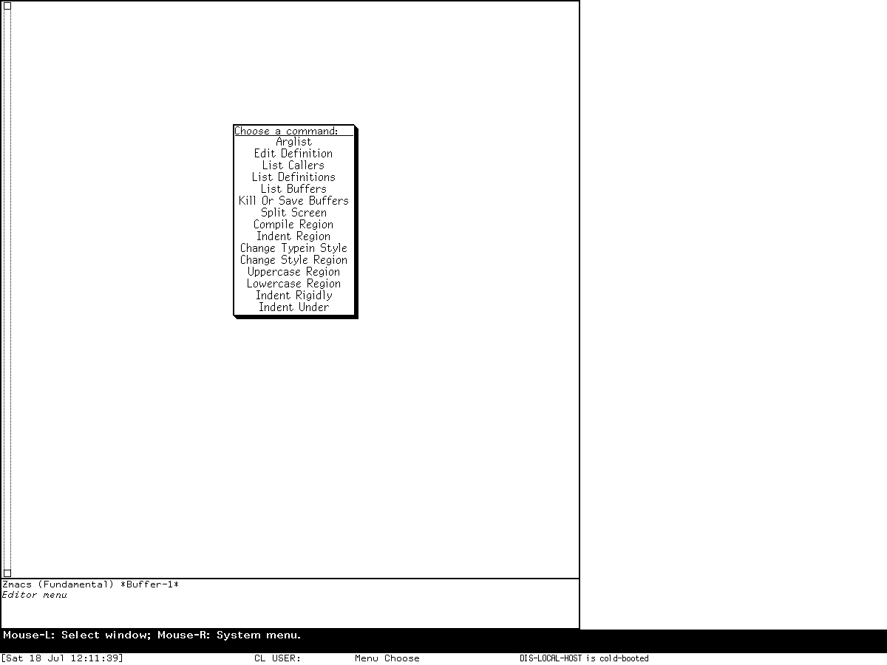
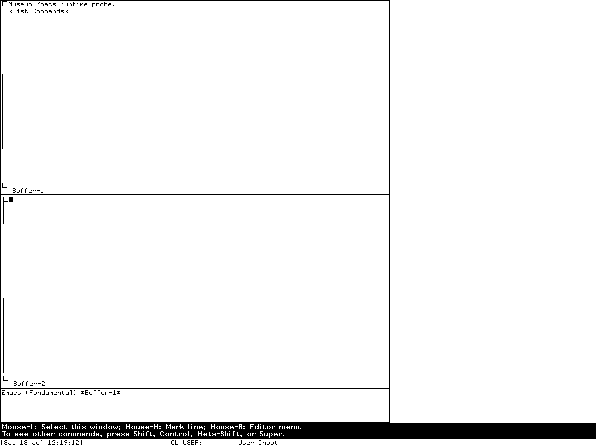

# EINE, ZWEI, and Zmacs editor-family reimplementation specification

## Status and reconstruction claim

This specification defines four deliberately separate historical editor profiles:

- late-1977 EINE selected by the archived 19-module build recipe;
- the public MIT CADR System 46 ZWEI evidence set, including its complete preserved
  Standard tables and generated command listing but not its missing Zmacs overlay;
- maintained LM-3 System 303 ZWEI/Zmacs source, triangulated against a separately
  preserved Experimental System 303.0 band; and
- licensed Genera 8.5 ZWEI/Zmacs source, triangulated against the separately
  identified Open Genera base world.

A conforming implementation can recreate the selected profile's text and buffer
objects, moving buffer pointers, command-table composition, complete effective
editor-owned keyboard and pointer tree, command loop, numeric arguments, regions,
kill and point histories, undo where present, modes, minibuffers, completion,
search, files, editor windows, redisplay, errors, aborts, lifecycle, and the bounded
visible states defined here. The exact binding inventories are normative parts of
this specification through the named in-repository companions in
[Complete effective input and gesture trees](#complete-effective-input-and-gesture-trees).

The profiles are not presented as one monotonic product. EINE uses arrays of lines
and a four-row dispatch array. Later ZWEI uses linked lines, intervals and nodes,
composable command tables, and editor objects; Zmacs is the file/program editor
built on that substrate. Genera retains that architectural split while adding
character styles, Command Processor integration, and Dynamic Windows
presentations.

This document does not claim:

- that EINE, System 46, maintained System 303 source, the System 303-0 band,
  licensed Genera source, and the Genera base world form one build chain;
- a complete System 46 Zmacs overlay: the public snapshot names but does not
  contain the required source or compiled file;
- that a configured Genera source table is identical to every live table after
  patches, optional products, site forms, and user initialization;
- exact historical package, function, macro, flavor/class, condition/restart,
  module-load, QFASL, ABI, band, world, or snapshot compatibility;
- atomic file replacement or rollback where the historical implementation can
  mutate text or perform file I/O before reporting an error;
- complete Dired, Edit Buffers, Zmail, patch-editor, debugger, Listener, or
  Document Examiner application behavior merely because those applications use
  ZWEI; or
- pixel identity beyond the structural claims attached to the reviewed
  screenshots.

An implementation MUST select a profile. It MUST NOT average keymaps, character
sets, modes, file semantics, visual geometry, or error behavior from different
releases into an unnamed “Lisp Machine editor.”

## Normative language and evidence codes

`MUST`, `MUST NOT`, `SHOULD`, and `MAY` are normative. Requirements apply only
to the profile and witness named beside them. `INF` marks a clean-room
implementation rule rather than a claim about historical representation.

| Code | Evidence class | Establishes | Does not establish |
| --- | --- | --- | --- |
| `E77-SRC` | Public EINE source at Git revision `b12f5b7c9a8817886ed85c72fa48bccaf5296be5` | selected modules, data model, command loop, tables, file/section behavior, pointer dispatch and fixed screen geometry | runnable late-1977 pixels or later EINE revisions |
| `E77-MAN` | Contemporary EINE manual and 1977 editor paper | terminology, design purpose and intended operation | identity with every file in the selected recipe |
| `C46-SRC` | Public System 46 source at Git revision `8e978d7d1704096a63edd4386a3b8326a2e584af` | complete preserved Standard ZWEI tables, source-present commands and editor architecture | the absent Zmacs overlay or a runnable band |
| `C46-BUILT` | Public generated `_comnd.1` and compatibility/change files | built named-command listing and contemporary compatibility statements | missing bodies or exact runtime key inheritance |
| `C303-SRC` | Maintained LM-3 source at Fossil check-in `4df393c68d7f083ce42d5c377039d26043cc18a9031ace28258dc97f4137eb91` | complete configured ZWEI/Zmacs tables, semantic objects and operation order | byte-for-byte ancestry of the preserved band |
| `C303-RUN` | Experimental System 303.0, ZWEI 129.0, microcode 323 session | exercised entry, editing, Help, named commands, mode change and visible geometry | every command, mode, error branch or source-to-band identity |
| `G85-SRC` | Licensed Genera 8.5 source inspected locally | configured tables, object model, modes, file/redisplay behavior and application composition | redistribution permission or proof every definition is loaded unchanged |
| `G85-BASE-WORLD` | Exact unconfigured `Genera-8-5.vlod` world | identity and resident state of the exercised world | configured-site or optional-product state |
| `G85-RUN` | Isolated Open Genera session `zmacs-research`, generation 1 | actual editor entry, menu, Help, split, buffer display and contextual pointer behavior | a pristine live-comtab dump or unexercised leaves |
| `MAN` | Public original manuals or reference cards | intended user contract and names | exhaustive release implementation |
| `SUBSTRATE` | Normative TV, Dynamic Windows, program-selection and recovery specifications in this repository | global input and window-system behavior explicitly incorporated below | application behavior not named here |
| `INF` | Implementation-independent reconstruction rule | portable behavior needed to satisfy an observable contract | a historical internal representation |
| `TODO-RUNTIME` | Named unresolved oracle obligation | nothing until executed | permission to guess |

Readable source controls its selected source profile. Runtime controls only the
identified world or band and action sequence. A contemporary manual supplies intent
and terminology but MUST NOT override contrary release-specific source or runtime
evidence. Licensed source is represented by checksums, short symbol names, and
original description; no proprietary body is reproduced.

## Compatibility profiles and levels

### Release profiles

| Profile | Exact target | Principal identity | Required substrate |
| --- | --- | --- | --- |
| `ED-E77` | 19-module late-1977 EINE recipe | array-of-lines editor with fixed raster layout, `Control-X` array and `Meta-X` alist | early TV display, keyboard/mouse or tablet stream, Lisp reader/compiler and file system |
| `ED-Z46` | public MIT CADR System 46 evidence | Standard ZWEI and Standard `Control-X`, completing-reader/minibuffer/search/recursive/standalone contexts, and built named-command help; Zmacs overlay incomplete | System 46 TV, file system, Lisp environment and generated self-documenter |
| `ED-Z303` | maintained `system-303` ZWEI/Zmacs source plus separate `System 303-0` band | linked-line/interval editor, Zmacs application overlay, modes, editor streams and presentations | System 303 TV, process, file, Lisp, Help and error-handler services |
| `ED-G85` | licensed Genera 8.5 source plus separate base world | Genera ZWEI substrate, Zmacs application, styles, CP and Dynamic Windows integration | Genera TV, Dynamic Windows, CP, file, namespace, Lisp and error services |

`ED-Z46` is intentionally asymmetric. Standard ZWEI source and the generated
named-command artifact are normative where identified; a full System 46 Zmacs
application conformance claim is unavailable until the missing artifact is recovered.
No later table may be substituted.

The application boundary is:

- EINE itself for `ED-E77`;
- ZWEI editing and the evidence-bounded Zmacs layer for the later profiles;
- core language/text modes and editor-stream integration owned by those editors;
- only the transition edges to task editors and other applications.

D06 owns Dired, BDIRED and Edit Buffers application closure. D01 owns Lisp
Listeners and ZTOP; D08 owns mail reading and composition; D12 owns Debuggers; D18
owns patch editors; D25 owns source comparison. Their local tables remain listed in
the normative binding companions so the global tree is not hidden, but they do not
gate D05 conformance.

### Conformance levels

| Level | Required behavior | Reserved behavior |
| --- | --- | --- |
| `L0` | selected profile's semantic objects, invariants, ownership, release identities and bounded visual regions | interactive dispatch and mutations |
| `L1` | `L0` plus complete effective D05-owned direct, inherited, aliased, prefix, minibuffer, mode, pointer, menu, Help, numeric-argument, intercepted and unbound input trees; command-loop and core editing behavior | complete files, lifecycle and recovery |
| `L2` | `L1` plus buffers, files, locks, sections, modes, search/completion, histories, undo where applicable, windows, redisplay, lifecycle, error/abort/partial-effect behavior and bounded visuals | exact historical source interface |
| `L3` | exact selected packages, function/macro signatures, object protocols, conditions/restarts and module/load closure | ABI, compiled objects, band/world/image identity |

This specification defines `ED-E77/L2`, `ED-Z303/L2`, and `ED-G85/L2` at the
semantic and behavioral grain stated here. It defines a separately named
`ED-Z46-STANDARD/L1` target only for preserved Standard ZWEI and the built
listing; it makes no full `ED-Z46/L1` claim because the Zmacs artifact is
missing. `L3` is reserved.

An `L1` implementation MUST emit a machine-readable effective binding graph with
ordered table provenance and explicit unbound leaves. A patch, optional product,
site form or user remap MUST be an identified overlay on a selected base graph.

| Profile | Source contract | Runtime closure | Principal open boundary |
| --- | --- | --- | --- |
| `ED-E77` | `L2` | none | runnable band, pixels, timing and live Help |
| `ED-Z46` | Standard source and built-listing partial | none | missing Zmacs source/QFASL and runnable band |
| `ED-Z303` | `L2` | representative `System 303-0` operations | exhaustive runtime leaves, failure paths and source-to-band identity |
| `ED-G85` | `L2` configured-source base | representative base-world operations | pristine live-comtab dump, installed named-command omissions and optional overlays |

## Evidence ledger

### Exact public EINE artifacts

The recipe is `eine/9004365/dlw/eine.8`, 1,129 bytes, SHA-256
`1ae9bed8b613e4bf1997b8a232e66de20c525f399c1cd15964c75f56282f4976`.
Its resolved 19-module corpus totals 276,909 bytes; the ordered manifest SHA-256
is `7aefec316b32dac5ec42db1721655c010a14c394ecb2c9b7f03b42a7261ed8f5`.

| Portable pathname | Bytes | SHA-256 | Principal use |
| --- | ---: | --- | --- |
| `eine/9004365/dlw2/etable.34` | 23,814 | `90bbf97c2c4fa932549f52b50c51705a111dac6e4d22a92b1c0a7b74793cc06a` | initial keyboard, prefix, named and pointer tables |
| `eine/9004365/dlw2/ecmd.50` | 16,531 | `3f552b88c9064f5890938e4ebc0cbf6e662e7b0fe46205bba66a3abb62a5fc10` | loop, lookup, dynamic minibuffer shadows and errors |
| `eine/9004365/dlw2/edefs.50` | 11,307 | `04e034a0f25c8a78e0b2ea270be8d1864d0fef679cacc70385fd38e7e9b635a3` | state and data records |
| `eine/9004365/dlw2/ebasic.64` | 14,423 | `67495ebeeb5f66d6e1172edf5b66008e306be0c7ceb2e7f0854613a9e0312feb` | entry, buffers and fixed screen geometry |
| `eine/9004365/dlw2/edm.122` | 21,803 | `1c0c908101974bfd1f0b48619a9a30f8a41ab461db68ada964c20f177613f27b` | pointer regions, drag and stub gestures |
| `eine/9004365/dlw2/edfn.46` | 18,106 | `7492479912fd11fdc030768b39360be8449a88b1e7fd57d9a91f11d4ed1250fb` | definition sections and files |

### Exact public ZWEI/Zmacs artifacts

| Profile | Portable pathname | Bytes | SHA-256 | Principal use |
| --- | --- | ---: | --- | --- |
| `C46-SRC` | `src/nzwei/comtab.115` | 42,847 | `a40bcc9389cad426faf50ee7aaa507e40c569c90226ba5f53115b53f5f316834` | complete preserved Standard tables |
| `C46-BUILT` | `docs/assets/mit-cadr-online-help/standalone/_comnd.1` | 37,158 | `9cbd632e763c8ff150941f84ddb082edf56f123d513ff3e6c9ff2e6a3e598f36` | generated built named-command listing |
| `C46-BUILT` | `src/nzwei/emacs.comdif` | 7,950 | `6fec019a836715bc19be9ba36eec97e58d2fd23b4d1541ae9be07942eb0526c3` | compatibility notes |
| `C46-BUILT` | `src/nzwei/nzwei.comdif` | 4,831 | `d1ae94ca60fccf8ff078b3a77a0e01f359fab10e40ded085f6342b9886c2a712` | change notes |
| `C303-SRC` | `zwei/defs.lisp` | 42,164 | `1ce50e3cead80a98fdce3c64697cd25837888ce27dbf9d0b61e42dd60f4faefc` | semantic records and dynamic state |
| `C303-SRC` | `zwei/comtab.lisp` | 64,703 | `5e54ab5e70fd7e2e6086fb16d8a83efe27d65173abeaa78e0825804b3866e600` | lookup, command loop and base tables |
| `C303-SRC` | `zwei/screen.lisp` | 98,691 | `7de12b6477492a4d49ffb4a44edb997cfeceadfb2aa69ec0f471cc3206d82187` | window/editor lifecycle |
| `C303-SRC` | `zwei/displa.lisp` | 88,539 | `0c3558d78f50e6337711c79142759886879d331d52fc2cdcb603e2a58bb663f3` | redisplay |
| `C303-SRC` | `zwei/primit.lisp` | 44,003 | `c75513e9dbe055368c868dd26addf42acba2d8c47d83dbb612b13c1c6d7d84db` | lines, pointers, intervals and text mutation |
| `C303-SRC` | `zwei/files.lisp` | 51,705 | `42e2a1e86fc777cdde3d5ad03cc1e3c07ca3cf4e806150921197aac33824aec3` | file buffers and save/read behavior |
| `C303-SRC` | `zwei/search.lisp` | 48,841 | `a575ec6e75d27ef46625c0546e9013fb16c88a00f34f43906c5165bbdded5b67` | extended search hierarchy |
| `C303-SRC` | `zwei/comd.lisp` | 53,391 | `14b5734403c4e2e634a8dd30cb96d541a0d024870dabae5033b8d17df988c407` | registers and general commands |
| `C303-SRC` | `zwei/kbdmac.lisp` | 20,917 | `f361d5e5dd1a2a001bf6e4bd7722523315bd12ce3577291430927d675f51f79d` | keyboard-macro stream state |
| `C303-SRC` | `zwei/comg.lisp` | 24,115 | `920c5f11e55658b04190e63f4ad64687f3c1e9f01205855236951ea99f6c8da1` | keyboard-macro commands |
| `C303-SRC` | `zwei/coms.lisp` | 45,631 | `b0b5e19c9606c8ea66938aec5ec0febe49d2573a6b748923eb79218cb3590392` | replace/query-replace command flows |
| `C303-SRC` | `zwei/font.lisp` | 18,960 | `277f2e9b492e443fea0d11e277f08bcfa25c5547a9109f09e47286d0ba91228b` | raster-font mutation commands |
| `C303-SRC` | `zwei/comb.lisp` | 43,168 | `0d7978fc5a44ad95dda7c58cd91448386d331d3c5d8845a16a367f571427f671` | comments, filling and text commands |
| `C303-SRC` | `zwei/indent.lisp` | 35,103 | `ce16162d3d92c33ac22b8bac0ce6e5eb654f2a6399752b768db8b25932deb718` | rendered-width filling |
| `C303-SRC` | `zwei/ispell.lisp` | 17,218 | `a271f2f18478c31a0e079ae19a1d12eebbe803da5531ec762de3b0067d2033f3` | spelling integration |
| `C303-SRC` | `zwei/doc.lisp` | 23,055 | `533a733139c6de028462f15363edff5cdfcceebfb217a165b830f9838d8d9f6e` | self-documentation |
| `C303-SRC` | `zwei/mouse.lisp` | 29,875 | `d1dd8a2729d8758971842d6611e9b81592c4c1a2565a8511aacf7858de28b405` | editor pointer behavior |
| `C303-SRC` | `zwei/meth.lisp` | 58,940 | `6190d73b52218e3aa355eb88e457266002f83d9699cab948c9b181457c9c5c48` | buffer methods, registration and rename order |
| `C303-SRC` | `zwei/stream.lisp` | 66,047 | `c2f7b82430381c9bfca34806276671f02bb56f1364916943f072e2590e8d6a66` | editor stream, ZDT and ZTOP edges |
| `C303-SRC` | `zwei/zmacs.lisp` | 115,156 | `513f39d440a6612ff7d3d540a62b397fe6348456bd36a450262ff6fa372799d0` | Zmacs buffers, tables and development operations |
| `C303-SRC` | `zwei/modes.lisp` | 68,224 | `732303cda32a8c931ae4f112b7f54d3803a49e2c8206f90e39759235bcad975a` | mode construction and deltas |

The pinned System 303 tree contains 42 selected ZWEI files totaling 1,706,505
bytes; their ordered manifest SHA-256 is
`87af558ea62e894f8f279f73365b1dee69786f09fb657928a90cd76c61d19a1a`.

### Exact licensed Genera artifacts

| Archive-relative pathname | Bytes | SHA-256 | Principal use |
| --- | ---: | --- | --- |
| `sys.sct/zwei/defs.lisp.~292~` | 45,782 | `e0c460db04abb2fb40af0717f3d0a0ba45bd83589f1846c4ba8c778420127b4c` | editor/Zmacs composition |
| `sys.sct/zwei/comtab.lisp.~589~` | 100,220 | `5101f5a25a7222d6d0f8f48401522fa418576eb27d145f659513eb80660ca2b1` | lookup, loop and configured base tables |
| `sys.sct/zwei/zmacs.lisp.~1058~` | 31,456 | `082959472626b04d74631ada24bb8ad164bc44ef19f292343f905fbf10bf1d2f` | Zmacs and prefix overlays |
| `sys.sct/zwei/zmacs-buffers.lisp.~54~` | 64,709 | `5e7866786dffc8ec03cc3df6b0cd21277ac34656351a494c8e7656a837549bcf` | named and file buffers |
| `sys.sct/zwei/screen.lisp.~638~` | 106,998 | `3b7a3353a2831c84a3130390539e419b843efed6d1425296b98242f4d9ffccb6` | windows, redisplay and presentation integration |
| `sys.sct/zwei/files.lisp.~378~` | 88,157 | `f627f666b0fe9ca7a1450526f081685b95b2c7e522a06d71b6db962345e957bc` | versions, locks, attributes and file mutation |
| `sys.sct/zwei/modes.lisp.~254~` | 69,374 | `49d268b554e41a595741b4e6fc3066c9f52f69783fba112e8d3023256018b8f9` | general mode machinery |
| `sys.sct/zwei/language-modes.lisp.~140~` | 39,590 | `ee78472671fd5476fb7bc2a712eedeebcedd90dc3e2e6f33d2595b41a09692fb` | language modes and file-type selection |
| `sys.sct/zwei/text-modes.lisp.~27~` | 12,414 | `34c9bdec02ab8e8c7229c4303c48b59e28df8369f09253333b1eb6e4b0919020` | text-derived modes |
| `sys.sct/zwei/search.lisp.~152~` | 62,618 | `4b98387119a754d74f388a5b94e435b4f492a296859ad009984b2fae80c04279` | extended-search trees |
| `sys.sct/zwei/comd.lisp.~236~` | 16,217 | `adf200c28685aca0fc91f116dd33bdaf44df739b1ca072a67b208d5fda75aef4` | registers and general commands |
| `sys.sct/zwei/kbdmac.lisp.~67~` | 19,853 | `f2044bb86d09e6b5d099d676defb4a9f460a4ebf347d822c4a15e0af164555b8` | keyboard-macro stream state |
| `sys.sct/zwei/coms.lisp.~160~` | 63,871 | `3924c9346eae8aa242183990af83e0c3e8b843f0954ba78aaab20d6778002257` | replace/query-replace flows |
| `sys.sct/zwei/style.lisp.~123~` | 49,844 | `14425902c9cc283588127f811dbcb87004197d40e34a0e19e9fe91fd17f592ca` | character-style commands |
| `sys.sct/zwei/comb.lisp.~190~` | 59,703 | `3fae5ef6b7bde72add9ed791ef71d17afd02f7f5c377296e7626b227c108e5f0` | comments and filling commands |
| `sys.sct/zwei/indent.lisp.~175~` | 54,936 | `6816cbaec42789012fdf1c7763d971401f9a5f4cb9bfb0bbeb5137ec5ad2cf12` | rendered-width filling |
| `sys.sct/zwei/mini-buffer.lisp.~98~` | 59,753 | `202c9494c9ef54f82df12d319183bda65c451a0272a785941d218766d293fa88` | mini-input gateway, rescan and stream behavior |
| `sys.sct/zwei/comg.lisp.~96~` | 17,848 | `66007d528c90407fb162df152e6dfc383282981c0162abd67ebd3c6702784043` | keyboard-macro mover |
| `sys.sct/dynamic-windows/accept-substrate.lisp.~19~` | 53,779 | `3cc5c405bac3dc98d321cef309d51e4f9b1ec77369c3a82019e0fbd983376a33` | generic ACCEPT activation/blip defaults |
| `sys.sct/dynamic-windows/completion.lisp.~206~` | 103,114 | `1af865c9149920a4a47090e2aea50d2db70ebf05550e2ed9a1c1e7fe6c62b07f` | `COMPLETE-INPUT` terminal state machine |
| `sys.sct/io/input-editor.lisp.~332~` | 110,515 | `856548d945403aa4f5fa3036bd2e8b936890b07b231673c9e2cab5f9e42707b3` | special-record layout and input-editor handoff |
| `sys.sct/io1/spell-interface.lisp.~4040~` | 55,647 | `4a07c1387c2ef0629b151b0a6c61fdbc297db6ffa20164fceeeec99ab83e2771` | optional spelling overlay |
| `sys.sct/hardcopy/zwei.lisp.~1512~` | 7,263 | `b802b9feb4da387d482e182a8986861d4de2ab863d5f5b94eae0f32fffa465f1` | optional hardcopy overlay |

The 54-module base Zwei corpus totals 2,405,992 bytes; its declaration-order
manifest SHA-256 is
`d32d09305b38f8636d689cf89161a2e97fba254ea5890fd448bef3b984eed6eb`.
The declaration witness is `sys.sct/zwei/sysdcl.lisp.~3~`, 5,581 bytes,
SHA-256 `69a0dc2c0709cabcf1d3b14c35e745fbcb0b6414efc800057473c1d93545d0c3`.
The purchased archive is 206,213,430 bytes with SHA-256
`89fb3e76b91d612834f565834dea950b603acf8f9dbacacdd0b1c3c284a2d36e`.
Those inputs remain local and ignored.

All three corpus-manifest hashes use the same byte format: each record is the
UTF-8 portable pathname, one NUL byte, and the 32-byte binary SHA-256 digest of
the file; records are concatenated without a terminator and hashed again. E77
and C303 records are ordered by portable pathname. G85 records follow
`sysdcl.lisp.~3~` declaration order and use archive-relative, versioned
`sys.sct/zwei/` pathnames.

### Exact runtime artifacts

Source profiles and runtime witnesses remain separate even when they have the
same release label.

| Witness | Artifact and resident release | Bytes and SHA-256 | Execution identity and provenance |
| --- | --- | --- | --- |
| `C303-RUN` | `System 303-0` disk; banner `Experimental System 303.0`, ZWEI 129.0, microcode 323 | disk 269,562,880 bytes; `bb16e46ad81decfe1efe691d36b6aa4ce3fd4ffb82474365de3520989d397cb5` | `usim` start/exec `707a77d23e28ea1c45ae0eb0145dc181fa7ba649b9defc30044d4f847ac2c5be`; session `eine-zwei-20260718`, generation 1; [curated catalog](assets/mit-cadr-screenshots/index.md#zmacs-editor-session) |
| `G85-BASE-WORLD` / `G85-RUN` | `Genera-8-5.vlod` base and private world | 54,804,480 bytes; `a8ee5e86cc7e322f7385af3e0cd579d7650d4dcfc3ce328acbf8b25515dd0672` at start and stop | VLM `9f5e18d5770f973879716182b6856ef5a8ee9d3b2bb907476ea0cf35986aa4c7`; debugger `2db918cfe8f35f52c7ff4b7695b0ecd3bb85e41a3327ea5a94874edf05edb54a`; session `zmacs-research`, generation 1; [curated catalog](assets/genera-screenshots/index.md#zmacs-session) |

Neither runtime identity proves that the maintained/public or licensed source
tree is the exact source used to build that disk or world.

### Normative evidence map

| Contract surface | Primary witness | Runtime witness | Status |
| --- | --- | --- | --- |
| EINE objects, mutation and loop | `edefs`, `ecmd`, `ebasic`, `edbuf` | none | source normative |
| EINE full input tree | `etable`, `ecmd`, `edt`, `edm` and EINE binding companion | none | source normative; live oracle open |
| ZWEI objects, mutation and loop | each profile's `defs`, `primit`, `comtab` and `screen` | C303 representative session | release-specific source normative |
| Zmacs overlays and modes | `zmacs`, `modes`, language/text modules and binding companions | C303 and G85 representative sessions | source normative; installed overlays bounded |
| files and definition sections | EINE `edfn`; later `files`/`sectio`/Zmacs modules | no mutation probe | source normative; runtime failure oracles open |
| redisplay and editor windows | EINE `ebasic`/display modules; later `screen`/`displa` | C303 and G85 screenshots | structural visual contract only |
| Dynamic Windows presentations | Genera `screen` and task modules plus the exact 64-translator/two-action matrix | generic pointer-documentation/menu session | source matrix normative; the captures do not prove a typed presentation hit, and live applicability remains open |
| source-development commands | source tables and implementation modules | mode/entry probes only | command presence/effects source-grounded |
| exact historical source interface | broad module surface | none | reserved `L3` |

## Architecture and ownership boundaries

The editor lineage is a replacement of representation and composition, not just a
renaming:

~~~text
ED-E77
keyboard/mouse stream -> EINE command loop -> array-of-lines buffer
                                      -> fixed EINE windows and redisplay

ED-Z46 / ED-Z303
TV input/intercepts -> ZWEI command loop -> active comtab chain
                   -> interval/node/buffer -> ZWEI screen and redisplay
                                            -> Zmacs file-editor layer

ED-G85
TV input/intercepts -> ZWEI command loop -> mode/Zmacs/Standard comtabs
                   -> interval/node/buffer -> Zmacs screen
                                            -> Dynamic Windows presentations
                                            -> CP and other Genera services
~~~

| Layer | Owns | Does not own |
| --- | --- | --- |
| TV/window substrate | physical character decoding, global intercepted characters, sheets, selection, pointer ingress | editing semantics |
| EINE or ZWEI core | text records, point/mark, command loop, table lookup, numeric arguments, redisplay requests | global Select/System commands |
| Zmacs application | named/file buffers, file groups, tag tables, Zmacs overlays, development workflows | every ZWEI-based task editor |
| major/minor mode | syntax, local variables, hooks and local table overlays | the inherited base table |
| minibuffer/input context | temporary table overlay, completion, activation and history | ordinary file-buffer lifecycle |
| Dynamic Windows/CP | presentations, translators, typed command parsing and contextual menus | fixed ZWEI key cells unless explicitly installed |
| file system/compiler/evaluator | pathname resolution, byte I/O, locks, reading, evaluation and compilation | editor text topology |

A port MAY implement these roles with different host classes. It MUST preserve
their observable ownership, precedence, lifetimes and failure boundaries.

## Semantic data and state model

### EINE records

| Object | Required semantic fields | Observable constraints | Evidence |
| --- | --- | --- | --- |
| line | character storage with fill pointer; owner buffer; ordinal; modification tick; registered permanent pointers | belongs to at most one live buffer; content and pointer changes advance appropriate redisplay state | `E77-SRC` |
| buffer pointer | line, character index and status `TEMP`, `NORMAL` or `MOVES` | index is between zero and current line length; temporary pointers are not registered; moving behavior differs at insertion boundary | `E77-SRC` |
| buffer | name; array of lines; point; optional mark; point stack; beginning/end pointers; stream; pathname/type; parent/child definition relationship | contains at least one line; point and active mark are in the buffer; killed current buffer must be replaced before the next completed command | `E77-SRC` |
| window | displayed buffer; saved point; raster extents; top line; buffer/view history | two windows MAY show one buffer while retaining distinct viewport state | `E77-SRC` |
| section/file association | definition name/kind; source range; defining file; file identity; modification tick; head/tail role | section buffers remain associated with their source file until updated or forgotten | `E77-SRC` |

EINE invariants:

1. A permanent pointer occurs in its line's pointer registry exactly once.
2. Inserting at a pointer's exact position advances a `MOVES` pointer and leaves
   a `NORMAL` pointer before the inserted text.
3. Inserting before a pointer shifts it right; deleting over it collapses it to
   the deletion start; deleting before it shifts it left.
4. Multi-line deletion joins the surviving prefix and suffix, relocates all
   affected pointers, and removes the consumed line records.
5. Insertion beyond end of line pads intervening columns with blanks.
6. The active mark delimits one region and is cleared after a completed command
   unless that command explicitly requests preservation.
7. A temporary pointer is caller-owned and MUST NOT survive as a line-registered
   anchor.

### ZWEI and Zmacs records

| Object | Required semantic fields | Observable constraints | Evidence |
| --- | --- | --- | --- |
| line | text, length, previous/next links, permanent pointers, tick, node, volatile content properties and persistent line properties | links are reciprocal; mutation invalidates parser/content properties but not properties designated persistent | `C303-SRC`, `G85-SRC` |
| buffer pointer | line, index and `NORMAL`/`MOVES` insertion affinity | remains ordered and valid through insert/delete/split/join | `C303-SRC`, `G85-SRC` |
| interval | first/last pointers and direction/ordering behavior | every editing operation resolves an ordered half-open range before mutation | `C303-SRC`, `G85-SRC` |
| node | line hierarchy, parent/children, ticks, read-only state, properties and undo state | modification propagates to owning node/top-level state; read-only mutation is rejected | `C303-SRC`, `G85-SRC` |
| named buffer | node plus name, saved point/mark, mode set, local variables, saved window start and typein state | buffer identity is independent of any one screen window | `C303-SRC`, `G85-SRC` |
| file buffer | named buffer plus pathname/generic pathname, file identity, read/save ticks, version and attributes | “modified in editor,” “changed on disk,” and “read only” are distinct predicates | `C303-SRC`, `G85-SRC` |
| editor window | interval, local point/mark/point stack, start pointer, display sheet, line cache, redisplay degree and buffer history | two windows may share text but retain independent point/view state according to the selected profile | `C303-SRC`, `G85-SRC` |
| undo status/item | batch boundary, copied interval, saved pointers, modification flag and redo relation | undo batches preserve order and enough pointer state to reverse the recorded editor mutation | `C303-SRC`, `G85-SRC` |
| comtab | keyboard and mouse cells, named commands and optional parent/indirection | a local hard undefined value stops inheritance; an absent value falls through | `C303-SRC`, `G85-SRC` |
| mode | name/kind, syntax, local variables, hooks, table overlay and inverse/undo forms | activation applies a reversible transaction; removal runs its inverse in reverse dependency order | `C303-SRC`, `G85-SRC` |

ZWEI invariants:

1. A line's next pointer and its successor's previous pointer agree.
2. Every permanent buffer pointer belongs to its line registry and uses a valid
   index; temporary working pointers are not leaked into that registry.
3. The first and last boundary pointers of a node remain reachable in document
   order after every mutation.
4. Text mutation advances the owning node's modification state and invalidates
   every display/parser cache whose dependency intersects the mutation.
5. Read tick, save tick, current modification tick and external file identity
   remain independently representable.
6. Window selection changes the active editing context; it MUST NOT copy the
   underlying text merely to provide another view.
7. A mode-local table may shadow, inherit or hard-disable a base leaf; flattening
   must retain that provenance.

## Complete effective input and gesture trees

### Normative companion incorporation

The following files are normative, not explanatory appendices:

| Profile and scope | Normative inventory | Exact completeness boundary |
| --- | --- | --- |
| `ED-E77` | [EINE late-1977 keybindings and commands](mit-cadr/eine-keybindings.md) | every cell in the 576-cell main and 576-cell `Control-X` arrays, all 53 named commands, all 27 pointer cells, EDT overlay, and dynamic string/Lisp minibuffer shadows |
| `ED-Z46` | [MIT ZWEI and Zmacs keybindings](mit-cadr/zwei-zmacs-keybindings.md), System 46 section | complete source-present Standard and Standard `Control-X` tables, completing reader, multi-line/single-line minibuffer, Control-R search, recursive editor and standalone contexts, plus the complete generated built named-command listing; missing Zmacs overlay explicitly nonconforming |
| `ED-Z303` | [MIT ZWEI and Zmacs keybindings](mit-cadr/zwei-zmacs-keybindings.md), System 303 sections | Standard, `Control-X`, Zmacs, Zmacs `Control-X`, reader/minibuffer/search/stream/macro tables, core modes and all stated task-dependency tables |
| `ED-G85` | [Genera 8.5 Zmacs keybindings](genera/zmacs-keybindings.md), [named-command audit](genera/zmacs-named-commands.md), and [Dynamic Windows handler catalog](genera/dynamic-windows-reimplementation-specification.md#configured-built-in-handler-catalog) | every configured fixed base/prefix/context/core-mode cell, all 64 ZWEI translators, both ZWEI presentation actions, the 47-definition/59-record ordinary-Zmacs inherited Dynamic Windows subset, and the ordered named-command candidate boundary; live optional/site/user/patch overlays remain separate oracles |

If this specification and a companion disagree about an individual leaf at the
same repository revision, that is a documentation and conformance defect; a
timestamp does not select a winner. Neither document may turn an explicit
`TODO` into a binding.

The D05 boundary includes every EINE/ZWEI/Zmacs-owned fixed key, pointer cell,
translator, action, menu, mode, and context. It incorporates D28's complete
selected-source three-module catalog and its exact ordinary-Zmacs inherited
47-definition/59-record subset. The other seven Presentation Inspector
translators remain typed delegation edges that require a compatible nested
Command Processor context. TV global ingress and live-world registry identity,
patches, remaps, equal-score order, optional products, and site/user definitions
remain explicit runtime overlays; they MUST NOT be reported as base application
bindings or silently classified as unbound.

### Common effective-tree schema

Every `L1` implementation MUST expose this representation for every input:

| Field | Meaning |
| --- | --- |
| profile | one exact release profile |
| context stack | ordered mode, minibuffer, task, application and base contexts |
| physical/logical input | Lisp Machine character or pointer event before and after supported normalization |
| path | every prefix or staged node traversed |
| numeric state | value, present flag, digit/sign state and repetition semantics |
| candidate cells | local values examined in precedence order |
| selected leaf | command, prefix, menu, sentinel, intercepted operation, explicit undefined or unbound |
| owner | TV, EINE/ZWEI, Zmacs, mode, task application, Dynamic Windows or dependency |
| effect contract | section/test ID here or in the owning dependency; `L1-NAME-ONLY` only outside the selected L2 claim |
| evidence | profile code plus source/companion anchor |

The required abstract lookup result is one of:

~~~text
command(name)
prefix(child-table)
alias(target-character)
menu(menu-id)
sentinel(value)
undefined-hard
unbound
intercept(owner, operation)
~~~

### EINE tree and lookup

~~~text
EINE input
├─ mouse/tablet bit set
│  └─ region(text | line | paragraph)
│     └─ click-count(1 | 2 | 3+)
│        └─ physical button(0 | 1 | 2) -> command or unbound
└─ keyboard
   └─ modifier row(plain | Control | Meta | Control-Meta)
      └─ character code
         ├─ alias(row, code) -> repeat lookup in same table
         ├─ C-X prefix -> read exactly one further input through prefix array
         ├─ M-X -> complete over named-command alist
         ├─ command -> execute
         └─ NIL or unfbound symbol -> editor error
~~~

The initial main array has 576 cells: 263 direct commands, 78 lowercase aliases,
one `Control-X` prefix and 234 unbound cells. The prefix array has 19 direct
commands, 104 aliases and 453 unbound cells. The pointer array has 27 cells: 23
commands and four unbound. The companion lists all 53 named commands.

The effective tree MUST then apply dynamic shallow shadows:

- EDT changes exactly six main cells, including activation, clear and exit, and
  hard-unbinds ordinary `M-Z` and `C-M-Z`;
- a string minibuffer temporarily binds raw modifier-row-0 code `033` octal and
  plain Return to string exit,
  changes `C-G` to minibuffer cancel/beep, and hard-unbinds `C-Z`, `M-Z`, and
  `C-M-Z`;
- a Lisp-reading minibuffer changes `C-G` to minibuffer cancel/beep, binds
  `C-Return` to read/exit, and hard-unbinds `C-Z`, `M-Z`, and `C-M-Z`.

These dynamic bindings unwind with the recursive edit. They are not permanent
mutations of the initial table.

Aliases MUST be cycle-detected in a clean-room implementation. Historical source
does not provide a cycle guard; strict mode MAY reproduce nontermination for a
user-created cycle only in an isolated test, while the default safe profile MUST
report an alias-cycle error without editing text.

### ZWEI/Zmacs precedence tree

For `ED-Z303` and `ED-G85`, effective ordinary input is composed as follows:

~~~text
TV keyboard ingress
├─ Abort / Meta-Abort / Break / Meta-Break -> editor TV intercept tree
├─ special window event -> editor object's special-event handler
└─ ordinary keyboard or mouse character
   └─ transient or task context, if active
      └─ minor-mode overlay(s), in installed precedence order
         └─ major-mode comtab
            └─ Zmacs application comtab
               └─ Standard ZWEI comtab
                  └─ unbound
~~~

`Control-X` is a staged child tree:

~~~text
C-X
└─ Zmacs Control-X table
   └─ Standard Control-X parent
      ├─ local or inherited command
      ├─ Help -> describe containing prefix
      ├─ Abort -> prefix abort
      └─ absent -> not-defined error
~~~

Minibuffer, completing-reader, pathname, FQUERY, extended-search, editor-stream,
recursive-edit and standalone tables have the distinct parent chains drawn in
the normative companions. They MUST NOT be collapsed into one “minibuffer map.”
In particular, a local explicit undefined cell stops lookup; an absent cell
inherits.

System 303 command lookup evaluates a cell in the current table, follows the parent
only for a missing cell, and restarts alias resolution from the original top table.
A top-level override can therefore shadow the destination reached by an inherited
alias. An explicit undefined sentinel is observably different from absence. Genera
MUST retain the equivalent result even if represented differently.

### TV-intercepted editor characters

The later editor binds a TV interception list around the command loop:

| Input | Intercept operation | Editor-owned consequence | Ordinary comtab consulted? |
| --- | --- | --- | --- |
| `Abort` | abort current computation | complete query/typeout as supported, then enter TV abort path | no |
| `Meta-Abort` | abort all/stronger abort | complete query/typeout, then enter TV abort-all path | no |
| `Break` | ordinary break | clear scheduler inhibition, enter break with editor-idle false; if returning outside recursive break/typeout, complete typeout and redisplay all windows | no |
| `Meta-Break` | error break | analogous error-break entry and return redraw | no |

Static comtab cells named `Break` or `Abort` remain evidence about table
construction and contexts in which interception is absent or deliberately altered.
They MUST NOT be presented as the effective top-level path when the TV intercept is
installed. `ED-Z46` interception remains bounded to what its selected source
actually shows; later behavior is not backported.

### Numeric arguments

EINE starts a command with value 1 and presence false. `C-U` multiplies the value by
four and sets presence true. Digits form a signed decimal value. Minus forces the
value negative rather than toggling it; a lone minus leaves EINE's presence flag
false while the value is −1. Argument commands return an internal “continue reading”
sentinel and do not complete a real command.

System 303 starts with value 1, presence false, digit count zero. Minus establishes
negative/sign state; digits accumulate decimal input. The exact configured minus
family is the literal family in the normative companion. It includes a duplicated
`C--` constructor cell and does not contain `H-C--`, even though the digit ranges
do contain the corresponding Hyper-Control digits. An implementation MUST preserve
the selected source tree rather than regularize this asymmetry.

Genera uses its configured argument commands and modifier families as listed in its
companion. A conformance dump MUST enumerate the actual expanded cells; prose such
as “all modifier combinations” is insufficient.

A special window event received during a System 303 numeric argument MUST preserve
the argument and continue reading. After a real command, argument state resets even
if the numeric value happened to be one.

### Help, pointer and dynamic-presentation leaves

Self-documentation receives the active context, not a frozen wall chart. It MUST be
able to:

- describe a direct key and follow a prefix into its child table;
- report the effective command and the table that supplied it;
- distinguish unbound, hard undefined, missing implementation and intercepted
  input;
- enumerate named commands visible through the current table chain; and
- show context-specific completion or minibuffer Help.

EINE pointer dispatch is completely fixed by region, saturated click count and
button. Its two allocated paragraph operations that only beep remain beep-only
stubs. Later ZWEI fixed mouse cells coexist with TV/System gestures. Genera also
creates context-sensitive presentation translators, bottom-line pointer
documentation and right-button menus. Those dynamic objects MUST be exported as a
separate overlay with presentation type, gesture, priority, applicability predicate
and owner; they MUST NOT be invented as fixed comtab cells.

The Genera Zmacs captures prove that bottom-line pointer documentation and an
Operation menu exist in the exercised List Buffers window. They show only generic
window/menu documentation, not that a typed buffer-row presentation won lookup.
The source establishes the presentation machinery; an exact-glyph hit probe and
live translator dump remain `TODO-RUNTIME`.

### Exhaustive enumeration requirement

For each selected context, the conformance runner MUST enumerate the finite physical
character domain used by the release, all supported modifier combinations, every
pointer cell or registered presentation gesture, and recursively every prefix.
It MUST record:

1. candidate tables in lookup order;
2. alias expansion and generated normalization;
3. the selected leaf and owner;
4. whether the leaf is reachable, shadowed, hard undefined or unbound;
5. Help's reported result; and
6. the source companion row and effect-contract section used as the oracle.

Every reachable D05-owned fixed leaf in an `L2` profile MUST resolve to a
normative effect contract in the core editing, register/macro/replacement,
undo/search, mode, file, window, or lifecycle sections. A dependency-owned leaf
MUST name its dossier/specification boundary. A graph that merely maps a bound
key to an otherwise unspecified command symbol is `L1` dispatch evidence, not
an `L2` behavioral implementation.

Enumeration MUST terminate on cycles, repeated prefix/table pairs and dynamically
generated menus. Site or user overlays are compared separately against a pristine
base graph.

## Command-loop and command-transaction contract

### EINE command loop

At editor entry, EINE initializes or reuses its editor state, makes the appropriate
screen records current, clears the screen, performs complete redisplay and enters
the command loop. Each completed command transaction follows this order:

1. Reset numeric and per-command dynamic state.
2. Deactivate stale echo output and repair lost mode-line/blinker state.
3. Reclaim the temporary editor allocation area.
4. Read a character, lookup a command and execute it.
5. If the result is the argument sentinel, preserve argument/mark state and repeat
   step 4 without completing a command.
6. If the command killed the current buffer, require selection of another buffer.
7. Move current command type to last command type.
8. Clear the active mark unless the command requested that it stay.
9. Reset per-command state.
10. Validate that the command result is a numeric redisplay degree.
11. Accumulate that degree and perform minimal, pointer/buffer, or full-screen
    redisplay as required.
12. If a temporary special screen was shown, wait for acknowledgement, invalidate
    the normal display and redraw it.

End of input exits through the editor's EOF path. A normal top-level exit runs
recovery, clears the console cursor record and calls the selected exit continuation.
Recursive minibuffer exit instead restores the enclosing window, redisplay degree,
blinker and screen outline.

An undefined cell, unfbound target, illegal command result or explicit editor
`BARF`:

- clears current command type and argument state;
- can print the diagnostic on the debug/echo stream;
- rings the display bell, with optional separately loaded visual effects;
- marks redisplay lost and, outside debug mode, marks a special screen active; and
- nonlocally returns to the command loop.

Text mutated before `BARF` remains mutated unless the particular command supplied
its own inverse. A clone MUST NOT promise automatic rollback.

### ZWEI command loop

The later loop is entered with a current editor closure, window, interval, active
comtab and mode-line state. It:

1. processes queued window-selection, configuration and redisplay events;
2. begins delayed selection so the frame is not exposed in a half-redrawn state;
3. derives the exposed window list and draws the mode line;
4. flushes covering typeout where appropriate;
5. installs the four editor TV intercepts;
6. resets command type, numeric state, mark-retention state and minibuffer-command
   state before a real command;
7. clears prompts, redisplays all editor windows and refreshes the typein window;
8. reads any keyboard, mouse or special event;
9. sends special events to the editor object; a handled event during a numeric
   argument returns to input without consuming that argument;
10. looks up and executes an ordinary character with command hooks;
11. records minibuffer commands in their ring, updates typeout completion and runs
    post-command behavior; and
12. flushes delayed selection on every normal or abnormal exit.

The loop surrounds command execution with an error restart whose top-level wording
differs from recursive editing. An editor error returns to the appropriate loop,
marks text redisplay because mutation may have occurred, terminates a keyboard macro
being defined or replayed, reports/beeps, and preserves a usable editor context.

The command result is a redisplay degree or the argument sentinel. A command hook
may skip the target by throwing to the command executor. Hooks run in defined
priority order before the command. A port MUST expose that skip as a completed
dispatch with no command body, not as an unbound key.

### Redisplay degrees

Both lineages permit commands to return the least display repair required. A
portable implementation MAY use different numeric constants, but MUST preserve
this ordering:

~~~text
none < point/blinker < changed lines or buffer < mode line/window < complete screen
~~~

Redisplay invalidation is monotonic within one transaction. A later request cannot
downgrade an earlier full redraw. Logical text, point, mark and history are
authoritative; line/pixel caches are disposable.

## Core text-editing contracts

### Insert characters

Preconditions:

- point belongs to the selected writable interval;
- the character is representable in the selected profile; and
- numeric repetition is nonnegative for ordinary insertion.

Required order:

1. Check read-only state before text mutation.
2. Normalize the insertion character only as the active command/mode requires.
3. If EINE point is beyond the line fill pointer, insert blanks to point.
4. Insert at point.
5. Relocate permanent pointers: pointers after point advance; at point, `MOVES`
   advances and `NORMAL` remains before the new text.
6. Advance the active point according to the command.
7. Update node/buffer ticks and undo/history state where the profile supports it.
8. Invalidate syntax and redisplay caches intersecting the changed span.

For a repeated insertion, strict mode performs the historical sequence rather than
one opaque host-string replacement whenever pointer relocation or hooks can observe
intermediate positions. Failure after some repetitions retains the completed prefix.

### Split or insert line boundary

Inserting a line boundary creates a successor line, moves the suffix at point to it,
and places point at the selected command's resulting position. Permanent pointers in
the suffix move to the successor with adjusted indexes; pointers exactly at the split
respect insertion affinity. Linked-line profiles update reciprocal links and node
ownership. EINE updates its line array and line ordinals.

Indent-new-line additionally computes indentation after the split. A failure in
indentation does not retroactively remove a line boundary already inserted unless
the selected release command explicitly recorded it as one undo batch.

### Delete a range

Preconditions:

- both endpoints belong to the same writable top-level text object; and
- the range is converted to ordered start/end positions.

Required effects:

- an empty range changes no text;
- pointers strictly inside collapse to the start;
- pointers after the end shift by the deleted length/topology;
- a same-line delete closes the character gap;
- a multi-line delete retains the start-line prefix and end-line suffix, joins
  them, relocates affected pointers and removes intervening line objects;
- point becomes the selected command's required boundary;
- kill commands append/prepend or create a kill-history entry according to last
  command type, while plain deletion does not masquerade as a kill; and
- modification, undo and redisplay state are updated after the text change.

If the command discovers read-only state before mutation, text and history remain
unchanged. If a lower-level failure occurs after mutation, the profile-specific
partial state remains and the command-loop recovery redraws it.

### Movement and structural navigation

Movement commands accept point, direction, unit and signed repetition. Units include
character, real/display line, screen, edge, buffer, word, sentence, paragraph,
S-expression, list, definition and profile-specific field or section. They MUST:

1. preserve text;
2. either arrive at the furthest legal boundary or report the selected profile's
   boundary/search error;
3. retain the goal column across compatible vertical commands;
4. use active syntax/mode rules for word and Lisp-structure units; and
5. request only the redisplay needed to show point and any changed region feedback.

A negative argument reverses direction where the historical command supports it;
it is not universally equivalent to calling the opposite named command. Unknown
per-command negative behavior is a test obligation, not an inferred convenience.

### Point, mark and region

Point is the active insertion/command position. Mark is a saved pointer plus an
active/present predicate. Setting mark pushes or rotates the point stack according
to command state. A region is the ordered span between point and active mark.

Region-consuming commands MUST reject an inactive or foreign-buffer mark before
mutation. After a completed command, EINE and later ZWEI clear/deactivate mark unless
the command sets mark-retention state. Movement, documentation and redisplay commands
that historically preserve mark MUST do so. Swapping point and mark changes the
active endpoints without changing text.

Each editor window can preserve its own point/mark/view state when buffers or windows
are switched. A buffer also retains saved editing state for later selection. The
implementation MUST define which layer is currently authoritative and round-trip it
without silently merging positions from two windows.

### Kill, save and yank histories

A kill entry contains an ordered text interval copy with the profile's character
style/font information. Consecutive compatible kill commands coalesce in command
direction; Save Region creates history without deleting; Append Next Kill changes
the coalescing state for the following kill.

Yank inserts the current entry and records the exact inserted span. Yank Pop is legal
only after a yank/yank-pop-compatible command; it replaces that span with the next
history entry and updates the recorded span. Matching-yank variants filter candidates
without corrupting the underlying order. If no candidate exists, text remains in the
last coherent state and the editor reports the miss.

### Transposition, case, fill and indentation

Transposition commands exchange the selected adjacent characters, words, sexps,
lines or regions and relocate point/pointers as ordinary delete/insert semantics
require. They reject missing neighbors before mutation where possible.

Case conversion preserves the number and topology of characters unless the selected
character repertoire has a profile-specific non-one-to-one rule. Fill and indent
commands use current mode variables: fill column/prefix, tab stops, comment syntax,
package/readtable and Lisp indentation metadata as applicable. A mode-specific
implementation wins over the base command at the same binding.

EINE font commands change raster-font character state. System 303 font commands
change the editor's character font representation. Genera style commands operate on
character styles and typein style, which can include family, face and size. A clone
MUST NOT substitute vector-font claims for the earlier raster profiles.

## Registers, keyboard macros, replacement, and production helpers

### Registers

A register name is one case-insensitive, unmodified character. Text and saved
position are independent register properties. Help describes this naming context
and resumes acquisition. Abort, a modified name, and—under System 303—a code
outside its supported range fail before register or buffer mutation. Genera
accepts an unmodified printing character.

The fixed leaves are `C-X G` Get, `C-X X` Put, `C-X S` Save Position and
`C-X J` Jump:

- System 303 Get inserts the saved interval exactly. Genera's leaf is Open Get:
  after inserting, it consumes the corresponding blank-line span by performing
  Return semantics and deleting the overwritten span. Missing text fails before
  insertion. Both preserve font/style data and set yank command state.
- With no numeric argument, the executable Get branches swap point and mark.
  Their prose labels the final endpoints in the opposite order; executable
  behavior controls, while exact BP-affinity endpoint naming remains a runtime
  oracle.
- Put copies the ordered region first; any numeric argument then deletes the
  source. Failure during deletion leaves the new register property installed.
  Genera permits an empty region; System 303 applies its ordinary region rule.
- System 303 saves a moving BP and top-level node. Jump first pushes old point,
  selects the saved node, then moves point; a later failure can leave partial
  navigation. Genera saves a moving BP and physical display line and restores
  both through point-history movement. Missing position fails before movement.
- System 303 Kill Register removes text and list membership but can leave an
  independently saved position; a point-only register cannot be killed by that
  command. Genera removes text, point and membership together.

### Keyboard-macro state machine

A keyboard-macro stream owns the active definition/replay stack, current and
previous arrays, inclusive recorded length, current position, repeat/default
counts, and one-character pushback. `C-X (`, `C-X )`, `C-X E`, and `C-X Q`
check stream capability before changing that state.

`C-X (` removes its own key sequence from any enclosing definition and starts a
nested array. With a numeric argument it appends to a previous macro when one
exists; otherwise it starts a new definition. `C-X )` removes its own sequence,
finalizes inclusive length and makes the result previous. Its numeric count
includes the definition run: a value greater than one performs `N-1` additional
runs, zero repeats indefinitely, and the ordinary no-argument close does not
replay. Closing with no active definition beeps/exits without text mutation.

While an outer macro is being recorded, `C-X E` executes the previous array.
System 303 records that invocation as a nested macro item; Genera executes it
with do-not-store semantics. System 303 also runs its configured pop hook after
definition, prompts for a name, generates an internal name on Return and confirms
replacement. Genera has no such pop-hook naming step; naming is a separate
command.

`C-X Q` records a query sentinel. During replay it reads this exact subtree:

| Input | Transition |
| --- | --- |
| `Space` | continue |
| `Help`, `?` | show choices and re-prompt |
| `Rubout` | skip the remaining commands in this iteration |
| `C-R` | accept live input until macro escape-R |
| `Refresh`/Form | redisplay and resume the query |
| `.` | run the remaining suffix once and suppress later repetitions |
| `!` | change this sentinel to no-query for the rest of this invocation |
| other | stop the innermost macro |

A later invocation restores every no-query sentinel to a query sentinel. Genera
also discards redisplay/window blips around the prompt and accepts only typed
mouse-click blips at mouse entries. A macro error stops macro state but does not
roll back completed editor commands. Clear Input clears macro pushback and the
underlying stream.

### Replace and query-replace

Replace String acquires both strings before mutation and rejects an empty search
string. It searches the active region when present, otherwise point through the
selected interval end. A System 303 numeric value bounds the replacement count.
Genera requires one-buffer bounds, holds the write lock during mutation and
rejects an empty active region.

Case preservation applies only when the search contains no uppercase character;
matched capitalization transforms the replacement. Genera additionally disables
that conversion when search and replacement are already equal ignoring case, and
either retains explicitly styled replacement text or uniformly restyles it from
the first non-whitespace matched character according to `*STYLE-REPLACE-P*`.

For every Query Replace candidate, the response tree is:

| Input | Transition |
| --- | --- |
| `Space` | replace and continue |
| `Rubout` | skip and continue |
| `,` | replace and redisplay, but stay at confirmation |
| `End`/Altmode | exit without replacing current candidate |
| `.` | replace current candidate and exit |
| `C-R` | recursively edit while moving endpoint copies preserve the candidate, then restore coherent match/point state |
| `C-W` | delete current match and enter recursive edit |
| `!` | replace current and every remainder without more questions |
| `^` | revisit the previous offered candidate |
| `Help` | describe choices and re-prompt |
| Redisplay | redraw and re-prompt |
| any other character | push it back and terminate as aborted |

System 303 pushes each offered candidate on point history and has no explicit
first-candidate guard for `^`; underflow remains a runtime oracle. Genera tracks
local history depth and beeps/stays when there is no predecessor, and passes
intercepted TV characters to the editor intercept handler.

Each accepted System 303 query replacement is a separate undo save. Genera uses
one sparse undo batch by default, selectable to per-replacement records with
`*UNDO-EACH-REPLACE-SEPARATELY*`. Abort never rolls accepted mutations back.

### Font/style, comments, and fill

System 303 font mutation stores a raster-font index per selected character; a
nonzero index upgrades a thin line to a font-bearing representation. Change One
Font touches only the requested old index. Selection accepts `A` through `Z`,
full-name entry, sampling a pointed character, a menu, Help and Abort; repeated
font commands may reuse the last choice. Default Font changes future input only.
The source's apparent 26-font overflow check is internally ambiguous, so exact
overflow behavior is `TODO-RUNTIME`.

Genera style replacement discards old style, while merge retains components the
new style does not supply. Quick choices include bold, italic, bold-italic, null,
smaller and larger. Undefined ordinary characters can define accelerators;
modified invalid characters fail. Consecutive character/word style commands can
reuse the prior style. `C-X C-J` directly changes the definition region without
an argument and merges with any numeric argument. `C-M-J` changes future typein
style.

Comment commands use the major mode's syntax. Genera calls exit-comment hooks
before terminators and enter-comment hooks before starters. With a numeric
argument, Comment Out Region removes wrappers only from the consecutive fully
wrapped prefix; it stops at the first mismatch and retains the unprocessed suffix
as the active region. Complete success clears it.

A fill column below 200 is measured in default-space widths; 200 or greater is a
pixel coordinate. Fill retains the prefix, normalizes whitespace, inserts two
spaces after sentence punctuation and breaks by rendered width. A positive
numeric argument requests adjustment. System 303 fills under one undo save.
Genera requires a single-section interval, records sparse filling, then records
adjustment as a second undoable operation.

Genera Fill Differently starts from the buffer fill column unless immediately
repeated, inherits adjustment only from the adjacent fill family, applies one
less than the numeric argument in space widths before filling, and advances
retained state by one afterward. Auto Fill runs only after an activation
character, without a numeric argument and outside a minibuffer. Genera also
requires major-mode support and persists buffer `:NOFILL` state.

### Spelling and hardcopy overlays

System 303 `M-$` chooses the current word and uses a loaded local speller or the
Chaos ISPELL service. No available server fails without mutation. A correction
is one undo save. Its optional whole-buffer query-replace path is questioned by
the maintained source itself and remains a runtime oracle.

Genera spelling is optional. Its word alphabet is letters plus apostrophe. It
spells the active region, otherwise the containing/current word, or the preceding
word when point is on whitespace; no prior word fails before scanning.
Corrections preserve case and original style and keep point relative to the
nearer endpoint after a length change. Abort leaves earlier accepted corrections.
Dictionary choices include accept once, accept for this command, and persistent
writable dictionaries.

Hardcopy is external and never text-undoable. System 303 buffer/region printing
is synchronous. Print All gathers every choice first and submits sequentially,
so failure on item `N` leaves earlier jobs submitted. Genera hardcopy is an
optional named-command overlay without a fixed base key. Buffer and region jobs
are synchronous. File hardcopy may query whether to save a modified matching
buffer: failed/aborted save submits nothing, declining uses the disk file, and
successful preflight launches a background job whose later failures are
asynchronous. Missing default printer fails before stream open; spool/device
failure can follow external side effects.

## Undo, redo and history

EINE's selected profile has kill/point histories and command-specific restoration,
but this specification does not impose the later ZWEI undo object model on it.

For `ED-Z303` and `ED-G85`, an undo batch records:

- the original ordered interval or inverse text;
- permanent pointer values needed for restoration;
- the prior modification predicate/tick relationship;
- batch boundaries; and
- redo information after a successful undo.

Undo executes inverse items in reverse mutation order. Redo reapplies the logically
undone batch. A new ordinary edit after undo invalidates incompatible redo history.
Region undo restricts candidate effects to the requested region according to the
selected command and MUST report a conflict rather than silently moving unrelated
text.

Quick Undo/Redo and hardware Undo/Redo are command entries, not proof that every
mutation is undoable. File-system side effects, compilation/evaluation, printing,
external locks and process actions remain outside text undo unless a source-defined
operation explicitly records an inverse.

On undo failure:

- completed inverse items remain visible unless the profile proves rollback;
- the undo status retains enough information to diagnose whether the batch is
  partial;
- text redisplay is invalidated; and
- the command loop recovers without pretending the original or final batch state is
  intact.

## Search, completion and possibility contracts

### Literal and incremental search

Search state contains direction, current pattern, origin, current match and the
previous search history. Each character extends or edits the pattern through the
active search-input table. A successful step selects the next match and exposes it;
a failing extension preserves the last successful position/pattern state needed for
rubout or direction reversal.

Forward and reverse search use the selected profile's case and syntax rules. Repeating
the search at a boundary either wraps, prompts or reports failure exactly as selected
by the command; a clone MUST NOT add implicit wrap globally.

### Extended search

The System 303 and Genera companions normatively define the complete `C-H` operator
prefix trees. A parser MUST preserve grouping and the Boolean operators AND, OR and
NOT, plus the release-specific character predicates and string-search position
operators. Invalid operator input follows that context's unbound/help path and does
not become literal search text.

### Completion and minibuffer activation

A completion context consists of:

- editable input;
- a candidate source and predicate;
- exact/prefix/substring or apropos policy supported by that context;
- default and history values;
- activation characters; and
- the active child/parent comtab chain.

Completion MAY extend input only to the common valid continuation promised by the
selected operation. Complete-and-exit validates the result before returning.
Complete-and-exit-if-unique refuses ambiguity. List-completions and Help display
results without mutating the candidate registry.

Genera mini-input “special character” cells delegate to the exact gateway and
generic-ACCEPT/`COMPLETE-INPUT` matrices in the Genera binding companion. Those
source-profile terminal branches are normative: predicate priority, strict
barf, Return insertion fallback, out-of-band rescan, completion, forced return,
empty input, Help and invalid/ambiguous behavior MUST all be represented. A live
dump is still required to identify caller-supplied predicate sets and patches,
not to fill a missing base-source leaf.

### Possibility sets

A possibility set records ordered locations such as alternate definitions, callers
or warnings plus a current member. Next/previous operations select the corresponding
location, update editor/buffer state and retain the list for repetition. Stale or
unavailable locations are reported and MAY be skipped only where the selected source
does so. Full callers/warnings/debugger application behavior belongs to its dossier;
D05 specifies the editor navigation container and transition only.

## Modes and local environment

At most one major mode supplies the base syntax/behavior for a buffer. Zero or more
minor modes apply in activation order. A mode transaction may install:

- syntax changes;
- buffer-local variables and package/readtable/base;
- command and post-command hooks;
- fixed direct and `Control-X` cells;
- mode-line identity; and
- an inverse form for each reversible change.

Enabling a mode applies built-in forms and then user forms. In the later profiles,
all modes contribute to shared sparse mode tables; a newer mode wins collisions.
Disabling an older mode MUST unwind newer modes, unwind/remove the target, then replay
newer modes so their temporal precedence is retained. Abort is inhibited around the
critical unwind/reapply sequence where the source requires it.

Word Abbrev is a deliberate exception to purely local sparse overlays: it mutates
the shared Standard `Control-X` table with its abbreviation commands. That global
effect MUST be represented with its owner and lifetime and undone when its historical
mode transaction says so.

Mode selection from a pathname or file attributes occurs after enough file metadata
is available and before mode-dependent editing is offered. Explicit file attributes
win over suffix inference according to the selected profile. Unavailable modes are
reported; their command names are not silently mapped to Fundamental mode.

The source-defined mode lists and every fixed local cell are in the binding
companions. Optional product modes are installed overlays and require separate
profile evidence.

## Buffers, files and definition sections

### Create, select, rename and kill buffer

Creating a buffer validates or resolves its requested name, allocates an empty
text object, initializes point/mark/view/mode state, and adds it to the release's
registries in source order. The later source mutates list, name-index, history,
and selection state incrementally; it does not establish an all-or-nothing
creation transaction. A duplicate name follows the selected profile's reuse,
rename, or query rule. An `INF` port MAY stage registration and roll it back on
failure, but MUST expose that strengthening separately from strict injected
failure behavior.

Selecting a buffer:

1. saves the outgoing window's point, mark, start and local environment into the
   appropriate window/buffer records;
2. makes the incoming buffer/interval current;
3. restores its saved point, mark, modes, package and view;
4. updates buffer history; and
5. invalidates the mode line and affected display.

Killing rejects protected buffers and handles modified/file-associated buffers with
the profile's query. After killing the current buffer, the command transaction MUST
select a live replacement before ordinary input resumes. References from windows,
histories and completion caches must not retain a usable pointer to killed text.

Rename behavior is profile-specific and nontransactional:

- System 303 changes the buffer's name slot, then finds the old name-alist cell
  and changes that cell to the new name. An interruption or injected failure
  between those steps can expose a renamed object under the old index; no
  rollback or interrupt exclusion is inferred.
- Genera's Rename Buffer command first validates the requested name, converts a
  file buffer to a non-file buffer, then invokes name change. The name-change
  `:BEFORE` method removes the old hash entry and installs the new one before the
  primary method stores the new slot value. Thus successful rename deliberately
  detaches the visited-file association, and an injected failure can expose
  registry/object disagreement.

If validation rejects the target before either sequence starts, the old state
remains. An atomic clean-room registry transaction is permitted only as labeled
`INF` behavior with strict phase-failure tests retained.

### Visit, find, view, insert and revert

Find/visit canonicalizes a pathname through the selected file system, reuses an
already associated file buffer where required, reads bytes/characters, constructs
lines, records file identity and ticks, applies file attributes/mode, then selects or
displays the buffer. A view/read-only operation marks the resulting editing context
read-only without conflating that state with external file permissions.

Insert File inserts decoded content at point as an editor mutation and participates
in undo where the selected profile records it. Failure after a partial stream read
MUST be reported as partial unless a temporary staging buffer prevented visible
mutation.

Revert first checks or queries about editor modifications, reads the selected file
version, replaces the buffer text, resets association/ticks and invalidates undo or
view state as the profile requires. A read failure before replacement preserves the
old buffer. A failure after destructive replacement is not described as rollback
without evidence.

### Save and write

Before saving, the editor distinguishes:

- editor modified state;
- file read-only state;
- buffer read-only state;
- held file lock;
- saved file identity; and
- current external file identity.

An external-change or lock conflict is detected before opening the destination when
possible and enters the selected query/error path. The historical System 303 save
path writes and closes a stream before updating pathname/file identity/ticks and may
discard undo afterward. It is not an atomic modern replace transaction. A conforming
strict profile MUST preserve observable ordering:

~~~text
validate/query -> open/write -> close -> update association and file identity
               -> update read/save ticks -> release or retain lock as specified
               -> optional undo/history cleanup -> mode-line redisplay
~~~

If write or close fails, dirty state remains true, the old saved identity is not
advanced, and any partial external file effect is reported. A safety-corrected port
MAY stage and atomically replace a host file, but MUST label that as `INF` and offer
strict failure simulation for comparison.

Write File differs from Save File where it changes the associated pathname. Copy,
append and prepend operations do not change association unless the selected command
explicitly does so.

### EINE definition sections

In EINE section style, scanning recognizes the selected top-level defining forms and
explicit `BEGF`/`ENDF` boundaries. It creates sorted section records with original
source ranges and separate `HEAD`/`TAIL` roles. Editing a section changes its
buffer/tick while retaining the defining-file association.

Update File reconstructs one file from its ordered current section set, writes the
modified definitions, then refreshes file/section identities only after successful
I/O. Forget File removes editor associations without deleting the external file.
Load Whole File realizes every section despite the design's preference for demand
loading.

If the current file identity differs from the recorded version/date/time/size
identity, update MUST report or query about the conflict; it MUST NOT silently
overwrite on the assumption that section buffers are authoritative.

### Later definition and tag workflows

Zmacs associates definition names and types with buffers, files, sections and tag
tables. Edit Definition can produce multiple possible locations; the Genera binding
explicitly names “and other definitions.” Compile/evaluate operations accept a
definition, region, buffer, file, changed-definition set or tag-table set according
to the selected command.

For each operation, the editor:

1. resolves an exact text range and package/readtable environment;
2. records source-location/locator metadata where supported;
3. calls the external reader, evaluator or compiler;
4. routes output/typeout and warnings to the associated editor facilities; and
5. preserves text and dirty state unless the command explicitly replaces text.

Compiler, evaluator, source-comparison, warning, patch and debugger semantics are
dependency contracts. D05 owns selection of the source range, environment, output
edge and return navigation.

## Editor windows, typein/typeout and redisplay

### Window layouts

The editor supports one-window and profile-specific two-window layouts, other-window
selection, window growth and two views over one region. Zmacs adds layouts selected
by its `Control-X` child such as ordinary two windows, view two windows, modified two
windows and two windows showing a region.

A layout transition MUST:

1. save current window/buffer view state;
2. validate that the frame can contain the requested panes;
3. create/reuse pane records and assign intervals;
4. choose the new current pane;
5. repair mode-line, minibuffer and typeout associations; and
6. perform a full affected-frame redisplay.

If pane construction fails before commit, the old layout remains selected. If the
historical mutation is incremental and failure can leave a partial layout, strict
mode exposes that state and a recovery command restores a legal one.

### Noncurrent-window pointer dispatch

For the later editors, pointer input over another editor window may temporarily bind
that window, interval, point, mark and active table for the command. Selecting an
unselected frame happens before editing. The first-button selection exception and
minibuffer Standard-table fallback are specified in the binding companions.

The temporary context unwinds after dispatch even on error. Text mutations remain in
the clicked interval; dynamic selection variables do not leak into the formerly
current pane.

### Typein, minibuffer and typeout

The minibuffer/typein area is a recursive editor context with its own active table
chain, prompt and history. Entry saves the enclosing context; normal activation
returns a typed or textual result; Abort restores the enclosing context and display.
An unbound key clears pending input only where the selected ZWEI command executor
does so.

Typeout can cover editor windows and paginate. The command loop waits for or completes
unread typeout according to the input received, then redraws newly exposed editor
regions. A special event during a numeric argument does not consume the argument.

### Display caches

EINE's selected normal non-debug raster regions are:

| Region | Vertical raster extent | Logical rows |
| --- | --- | ---: |
| main editing area | 002–386 | 32 |
| status line | 390–402 | 1 |
| echo/minibuffer | 404–440 | 3 |
| who line | 444–454 | 1 |

Its two-window layout uses main regions 002–182 and 187–367, 15 text lines each.
The debug layout reserves an additional seven-line debug area and reduces the main
window to 25 lines or two 12-line windows. These are selected-source constants; a
scaled accessibility port MAY transform them but MUST preserve region order and
relationships.

Later editors cache physical lines, continuation state, character widths/styles and
the correspondence between logical pointers and screen positions. Text mutation
invalidates every intersecting cached line and following line whose wrapping can
change. Redisplay may reuse unaffected prefix/suffix rows but MUST derive them from
current logical text and selected window state.

Mode lines expose at least application/editor identity, mode, buffer name, modified
state and profile-specific position/file indicators. The bottom who/pointer
documentation line belongs to the TV/Dynamic Windows substrate but must remain
visible where the reviewed profile shows it.

## Entry, reuse, exit and process lifecycle

### EINE entry

An EINE entry operation receives an editing target or constructs an initial buffer,
initializes editor globals on first use, acquires the display/input stream and enters
the screen/command-loop transaction. `ED`, value editing and property editing resolve
different target buffers but converge on that transaction.

Normal exit:

1. leaves recursive editing if present;
2. saves current buffer/window point and view;
3. releases or restores editor-owned display/input state;
4. runs EINE recovery;
5. clears the console cursor record; and
6. invokes the exit continuation with the exit reason/result.

Error exit MUST run the recoverable subset of steps 2–5. The editor's temporary
allocation reset cannot reclaim persistent lines, buffers or pointers.

### Zmacs entry and reuse

Zmacs is a reusable application/process, not a fresh editor object per `ED` call.
Entry resolves a target and then:

1. checks whether an eligible editor activity/process already exists;
2. if idle, selects/reuses it and sends the target editing request;
3. if busy, follows the selected release's wait, use another, skip or query branch;
4. if none is usable, follows the selected release's frame/window construction
   branch and enters its command loop;
5. initializes the current buffer, tables, mode environment and display; and
6. selects the editor through the D02 activity/window-management contract.

The Genera entry rejects an unsupported remote-terminal configuration where the
selected source does so. A port MUST report this before creating a stranded editor
process.

The inspected Genera Zmacs new-frame branch sends `:COMMAND-LOOP` to the result of
constructing a `ZMACS-FRAME`. The nearby unwind protection resets or disables an
already obtained process around selection; it does not establish Zmacs-owned
cleanup of every partial new window/process/activity construction stage. Strict
historical cleanup and registration order are therefore `TODO-RUNTIME`. A safe
`INF` port SHOULD remove only its partial new objects and MUST identify that
behavior as a strengthening rather than attributing it to the historical source.

### Quit, abort and dirty-buffer queries

Quit means leave the current editor invocation or select another activity according
to profile/context. It is not necessarily process destruction. Standalone and
recursive-edit tables have their own exits. Prefix Abort cancels the prefix and any
keyboard macro in progress. TV Abort is intercepted above command lookup.

Before destructive exit with modified buffers, Zmacs enters the selected save/kill
query. Canceling that query leaves the editor, buffers, locks and current selection
active. Saving commits each file independently; a failure on one file does not
justify claiming that earlier successful saves were rolled back. Discarding changes
must be an explicit choice.

## Error, abort and recovery matrix

| Failure or interruption | Required retained state | Required recovery/diagnostic | Evidence |
| --- | --- | --- | --- |
| unbound input | text, point and histories unchanged | clear queued input in later ZWEI; identify key/prefix and beep/error | `E77-SRC`, `C303-SRC`, `G85-SRC` |
| hard undefined cell | same as unbound | stop inheritance; later ZWEI uses not-defined path | `C303-SRC`, `G85-SRC` |
| unfbound command symbol | text unchanged unless a hook mutated it | distinct not-implemented diagnostic | `E77-SRC`, `C303-SRC`, `G85-SRC` |
| alias cycle | legacy outcome unestablished | safe profile detects/reports without edit; strict legacy is `TODO-RUNTIME` | `INF` |
| prefix Abort or bad leaf | prior text unchanged; argument/macro state per context | exit or beep, stop macro where specified, return to parent loop | source companions |
| no active region/mark | text unchanged | region-required error and redraw if needed | source operation bodies |
| read-only buffer/node | text, ticks, undo and file unchanged | report before mutation | later source |
| search/completion miss | last coherent search/input state retained | beep/report and allow edit/retry/abort | source tables and search bodies |
| no kill/yank/undo history | text unchanged | command-specific empty-history error | source bodies |
| missing/invalid register property | buffer unchanged; earlier Put property retained if later deletion fails | report before Get/Jump mutation; report exact Put phase | register command bodies |
| keyboard-macro replay error | completed invoked-command effects retained | stop macro state and return through command recovery; no rollback | macro stream/command bodies |
| query-replace Abort | accepted replacements retained | terminate query; preserve profile undo grouping and coherent point/match state | search/replace bodies |
| command error after text mutation | completed partial mutation retained unless command recorded inverse | mark display dirty, terminate macro, return to loop | command loops |
| killed current buffer | killed object remains unavailable | force selection of a live replacement before next completed command | `E77-SRC`, later buffer code |
| mode enable failure | changes before failure may have applied | execute recorded inverse where available; rebuild shared sparse table from active order | later mode code |
| mode disable/replay failure | active order and table may be partial | report exact phase; rebuild from surviving modes in a safe extension | later mode code, `INF` |
| external file change or lock refusal | editor text/dirty state retained | query/error before write where possible | file code |
| write/close failure | dirty state and old saved identity retained; external file may be partial | report phase and pathname; do not advance save tick | file code |
| spelling/hardcopy failure | accepted spelling corrections and externally submitted jobs retained | stop at failing phase; never claim text/spool rollback | optional overlay source |
| recursive minibuffer Abort | enclosing editor text/context retained except explicit side effects already made | unwind temporary table/prompt and redraw enclosing context | command-loop/context source |
| unread typeout interrupted | logical editor state retained | complete/flush typeout according to input, expose and redraw covered panes | screen/loop source |
| Break/Meta-Break | suspended editor computation retained by debugger substrate | on return, complete typeout/redraw unless recursive exception applies | TV intercept source, D04/D12 |
| process/frame creation failure | historical partial state unestablished | strict profile reports the reached phase; safe `INF` profile destroys only its partial new objects | `TODO-RUNTIME`, `INF` |
| forced harness shutdown | no guest-save implication | label runtime state potentially incomplete; verify immutable input hash | runtime records |

The default clean-room profile SHOULD strengthen cycle detection, staging of external
writes, and mode-table rebuild. Each stronger behavior MUST be labeled and strict
source-compatible failure injection retained.

## Relationship to TV, Dynamic Windows and CLIM

EINE and CADR ZWEI/Zmacs are built on TV and their own editor machinery; they predate
CLIM. Genera Zmacs remains a TV/ZWEI editor integrated with Dynamic Windows
presentations and the Command Processor. It is not a CLIM application merely because
Genera also contains CLIM or because Zmacs can recognize/edit CLIM defining forms.

A reimplementation MAY use CLIM, a web toolkit or another host UI. Conformance is
judged by this editor contract: text/pointer semantics, complete input tree,
presentation applicability, visible regions and failure behavior. Host toolkit
widgets or standard shortcuts MUST NOT leak into the historical profile unless
reported as a separate accessibility overlay.

The [TV specification](mit-cadr/tv-window-system-reimplementation-specification.md),
[Dynamic Windows specification](genera/dynamic-windows-reimplementation-specification.md),
[program-selection specification](program-selection-activities-and-window-management-reimplementation-specification.md)
and [Emergency Break specification](emergency-break-and-degraded-interaction-paths-reimplementation-specification.md)
are normative only for the explicitly referenced substrate edges.

## Observable behavior and bounded visual reference

Screenshots constrain semantic anchors and relationships, not hidden object identity,
exact handlers, timing, font bytes or general pixel identity. All seven images below
are separately cataloged and reviewed for this D05 use.

### System 303 Zmacs

*Runtime observation — Experimental System 303.0, load band `System 303-0`,
session `eine-zwei-20260718` generation 1; `(ED T)`; captured 2026-07-18 and
verified for D05 on 2026-07-19.*

Runtime observation: `(ED T)` selected a fresh buffer whose mode line identifies
`ZMACS (LISP)`. A conforming `ED-Z303/L2` display MUST preserve the dominant
editing pane, a distinct bottom mode line, visible point and application/mode/buffer
identity. The image does not prove the source-to-band build chain.

*Runtime observation — Experimental System 303.0, load band `System 303-0`,
session `eine-zwei-20260718` generation 1; `Help Help`; captured 2026-07-18 and
verified for D05 on 2026-07-19.*

Runtime observation: `Help` followed by `Help` displayed the live staged
self-documentation choices. A conforming display MUST make Help visibly modal or
typeout-distinct, retain the editor relationship and expose the active dispatcher
tree. It MUST NOT copy the screenshot's prose as its implementation oracle; the
source-defined tree is normative.

*Runtime observation — Experimental System 303.0, load band `System 303-0`,
session `eine-zwei-20260718` generation 1; `M-X Text Mode`; captured 2026-07-18
and verified for D05 on 2026-07-19.*

*Runtime observation — Experimental System 303.0, load band `System 303-0`,
session `eine-zwei-20260718` generation 1; `M-X Lisp Mode`; captured 2026-07-18
and verified for D05 on 2026-07-19.*

These two observations constrain a mode transition: the buffer remains the editing
subject while the mode-line mode changes from Text back to Lisp. They do not prove
that the buffer's entire local-variable set is identical before and after.

### Genera 8.5 Zmacs

*Runtime observation — Genera 8.5 base world, session `zmacs-research`
generation 1; `Select E` then right-button Editor menu; captured 2026-07-18 and
verified for D05 on 2026-07-19.*

Runtime observation: `Select E` entered Zmacs and unmodified right button opened
the configured fifteen-action Editor menu. A conforming `ED-G85` base display MUST
preserve a menu clearly associated with the editor and the surrounding editing
pane. Menu entries and order are governed by the normative
binding companion; the image is not a generic Genera menu template.

*Runtime observation — Genera 8.5 base world, session `zmacs-research`
generation 1; mapped `Help`; captured 2026-07-18 and verified for D05 on
2026-07-19.*

Runtime observation: the mapped Help character reached the editor's active
dispatcher. The distinct Help/typeout state and its relationship to the editor are
required; exact glyphs and copied Help prose are not.

*Runtime observation — Genera 8.5 base world, session `zmacs-research`
generation 1; `C-X 3`; captured 2026-07-18 and verified for D05 on
2026-07-19.*

Runtime observation: `C-X 3` produced two stacked editor windows and selected a new
buffer in the lower pane. A conforming layout MUST retain two independent
point/view records, clear pane separation, per-pane mode-line association and one
current pane.

The companion Genera screenshots of the List Buffers report, generic bottom-line
pointer documentation, and opened Operation menu remain cataloged D06 dependency
evidence and are not needed to repeat D05's visual constraints. They do not prove a
typed buffer-row presentation hit. No reviewed Genera Edit Buffers application
capture currently exists; D06 retains both exact-hit and Edit Buffers runtime
obligations.

### EINE and System 46 visual oracle

No compatible public EINE or System 46 band has been exercised. The EINE source
geometry above is normative, but a reconstruction MUST be labeled source-profile
visual conformance until this oracle is closed:

`TODO-RUNTIME`: locate or construct a rights-clear compatible band; enter an empty
editor; insert a synthetic definition; exercise point/mark and one/two-window states;
open Self Document and both minibuffer variants; exercise each pointer region with
non-destructive actions; capture exact client geometry and shutdown state; compare
the fixed raster regions and record every discrepancy.

## Release deltas

| Surface | `ED-E77` | `ED-Z46` | `ED-Z303` | `ED-G85` |
| --- | --- | --- | --- | --- |
| text topology | line array | linked lines/intervals in source-present ZWEI | linked lines, nodes and buffers | linked lines, nodes and Zmacs buffers |
| moving pointer statuses | `TEMP`/`NORMAL`/`MOVES` | later ZWEI model | `NORMAL`/`MOVES` plus temporary pointers | equivalent later model |
| key composition | four-row arrays, one prefix, named alist | comtab parent/aliases; incomplete Zmacs | mode -> Zmacs -> Standard; child prefix | same base pattern plus loaded/DW overlays |
| top-level Abort/Break | source-profile EINE paths | release-specific source only | TV intercepts before comtab | TV/editor intercept layer plus Genera recovery |
| numeric modifiers | C/M/C-M families | C/M/C-M in preserved Standard | Super/Hyper families with strict `H-C--` hole | all 15 nonempty C/M/S/H combinations |
| style model | raster font state | font-oriented characters | font-oriented commands | character styles and typein style |
| file organization | file or definition-section style | source-present ZWEI; Zmacs incomplete | named/file buffers, sections/tags | richer file attributes, locks and Genera development integration |
| pointer model | fixed region × click × button table | fixed mouse cells | fixed cells, dynamic hook and pane routing | fixed cells plus 96-cell Dynamic Windows map and typed translators |
| Help | Self Document/prefix recursion | older A/B/C/D/L/U/V/W tree | C/D/A/U/V/W and conditional L | A/C/D/L/T/U/V/W plus presentation integration |
| runtime status | none | none | representative exercised band | representative base world; full live graph open |

Release-specific oddities—EINE's lone-minus presence flag, System 303's duplicated
`C--` and absent `H-C--`, System 46's missing Zmacs artifact, and Genera's
constructor-versus-installed distinction—are required compatibility facts rather
than cleanup opportunities.

## Reference semantic protocol inventory

This inventory names clean-room behavior. It is not the exact historical callable
API.

| Component | Operations | Success result/effect | Recoverable failure |
| --- | --- | --- | --- |
| `TextStore` | insert, delete, split, join, copy interval | new ordered text topology and changed span | read-only, invalid endpoints, allocation failure with explicit partial state |
| `PointerRelocator` | register, copy, move, relocate through edit | valid pointer with preserved affinity | foreign/dead line or cycle |
| `BufferRegistry` | create, resolve, rename, kill, history | unique live buffer identity | conflict, protected/modified buffer |
| `WindowContext` | select buffer/pane, save/restore view, split/grow | one current pane and coherent per-window state | illegal geometry or stale buffer |
| `ComtabResolver` | lookup, alias, parent, prefix, enumerate | terminal leaf plus provenance path | unbound, hard undefined, missing implementation, cycle |
| `NumericArgumentMachine` | reset, universal, sign, digit, consume | value, presence kind and digit count | unsupported sequence |
| `CommandLoop` | read, intercept, dispatch, recover | command result and redraw degree | editor error/nonlocal exit with usable context |
| `ModeComposer` | enable, disable, replay, dump effective table | ordered active modes and reversible overlay | partial unwind/replay |
| `HistoryManager` | kill/yank, point, minibuffer, undo/redo | updated ring/batch/current member | empty or incompatible history |
| `SearchEngine` | incremental, literal, extended, replace | match/range and updated search state | miss, malformed operator, query abort |
| `FileAssociation` | visit, identify, lock, save, revert | coherent pathname/file identity/ticks | changed external file, lock or I/O failure |
| `SectionIndex` | scan, associate, update/forget, tag lookup | ordered definitions and source locations | malformed boundary or stale file |
| `RedisplayScheduler` | invalidate, map pointer/row, redraw | display derived from current logical state | cache inconsistency forces full redraw |
| `MiniInput` | enter, edit, complete, activate, abort | value or restored parent context | ambiguity, invalid value, abort |
| `HelpAdapter` | describe key/command, recurse prefix, apropos, where-is | current effective-tree explanation | unbound or unavailable documentation |
| `PresentationAdapter` | enumerate/resolve translator, pointer docs/menu | direct/menu/dead result with owner | no applicable translator or stale cache |
| `EditorLifecycle` | enter, reuse, create, select, quit, recover | live selected editor or clean exit | remote refusal, busy choice, partial creation |

## Exact source-interface and module closure

`L3` is reserved. The semantic names above MUST NOT be advertised as historical
functions or messages. A future `L3` dossier must enumerate, for each profile:

- every public package/namespace and exported or documented editor symbol;
- functions, macros, variables, command-definition forms, flavors/classes and
  methods/messages;
- complete lambda lists or macro grammars, defaults, supplied-p distinctions,
  values and multiple values;
- conditions, restart names, nonlocal exits and cleanup behavior;
- command/mode/table constructor grammar and load-time side effects;
- module declarations, compilation/load order and optional dependencies; and
- public source compatibility tests using unmodified selected clients.

| Profile | Current selected-module closure | Missing for `L3` |
| --- | --- | --- |
| `ED-E77` | exact 19-module recipe and semantic audit | full symbol/signature/export/load census and client fixtures |
| `ED-Z46` | 25 source-present files among 31 active modules; Standard tables and built listing | `SEARCH`, `SCREEN`, `STREAM`, `SECTIO`, `ZMACS`, `ZYMURG` and full API closure |
| `ED-Z303` | 42-file active ZWEI manifest | exact public API/signature/condition/module compatibility report |
| `ED-G85` | 54-module base Zwei manifest | installed module/patch census, exact interfaces and licensed clean-room review |

No level in this document claims QFASL, band, world, bytecode, ABI or serialized-image
compatibility.

## Conformance test suite

Every result records selected profile, source/artifact identities, overlay inventory,
ordered logical input, final semantic state and visible anchors. A “pass” against one
profile is not evidence for another.

### Profile and evidence tests

| ID | Test | Required result |
| --- | --- | --- |
| `ED-P01` | verify selected source hashes and aggregate manifest | every byte size/hash above matches; mismatch blocks the profile |
| `ED-P02` | attempt to combine C46 base with C303 Zmacs or G85 modes | runner rejects unnamed mixed profile |
| `ED-P03` | enumerate System 46 declared modules | exactly the six named active modules are absent; no later replacement is inferred |
| `ED-P04` | compare C303 source identity with band banner | report both identities and “triangulated, build chain unproved” |
| `ED-P05` | compare G85 source/archive/world identity | report all separately; source-to-world identity remains unproved |

### Text and pointer property tests

For `ED-T01` through `ED-T08`, generate randomized line text, permanent
`NORMAL`/`MOVES` pointers at every boundary, temporary pointers and an independent
flat-string reference model.

| ID | Test | Required result |
| --- | --- | --- |
| `ED-T01` | insert before/at/after every pointer | content matches reference; affinity rule holds at equality |
| `ED-T02` | split line at every index | topology, reciprocal links/array order and pointer relocation are valid |
| `ED-T03` | delete same-line and every multi-line endpoint pair | joined text and all pointer positions match reference |
| `ED-T04` | insert beyond EINE line end | exact blank padding precedes inserted character |
| `ED-T05` | copy/move interval and point/mark between windows | text identity and per-window saved state round-trip |
| `ED-T06` | mutate line with parser/display caches populated | logical content is authoritative and all dependent caches invalidate |
| `ED-T07` | attempt mutation through read-only node/buffer | no text, pointer, tick, history or file change |
| `ED-T08` | kill current buffer | no live reference remains; replacement selected before another completed command |

The runner repeats random edit sequences and compares after every step, not merely at
the end. It checks line links, owner, interval boundaries, pointer registry
membership, indexes, ticks and rendered logical rows.

### Exhaustive binding-tree tests

| ID | Test | Required result |
| --- | --- | --- |
| `ED-K01` | enumerate all 576 EINE main cells | exact 263 direct, 78 alias, one prefix, 234 unbound denominator and companion mapping |
| `ED-K02` | enumerate all 576 EINE prefix cells | exact 19 direct, 104 alias and 453 unbound mapping |
| `ED-K03` | enumerate EINE 27 pointer cells | exact 23 commands/four unbound; click count 3 and above saturates; two stubs only beep |
| `ED-K04` | apply EDT and both EINE minibuffer contexts | only listed cells change; unlisted base cells inherit; unwind restores exact base graph |
| `ED-K05` | EINE Help on direct, undefined and `C-X` prefix leaf | direct description, undefined report and recursive child result match companion |
| `ED-K06` | enumerate System 46 Standard, prefix, completing-reader, ordinary minibuffer and recursive contexts over 160 × 16 cells | every fixed source cell, uppercase/Control indirection and parent result matches the companion; missing Zmacs blocks full-profile claim |
| `ED-K07` | enumerate C303 Standard, Zmacs, mode and child tables over the exact finite domains | candidate order, generated lowercase/Hyper/Control alias path, local hit, parent path, hard undefined and unbound match companion |
| `ED-K08` | test C303 `H-C--` and all modified digits | minus is unbound at that exact hole; Hyper-Control digits remain numeric |
| `ED-K09` | inject Abort/Meta-Abort/Break/Meta-Break at C303 editor top level | TV intercept owns every path before comtab lookup |
| `ED-K10` | run C303 Read Function Name pointer hook | left returns immediately; right continues; invalid/nonempty cases fall to ordinary pointer logic |
| `ED-K11` | enumerate C303 and G85 Help trees and `C-X Help`, beginning with fresh `Help Space`; in C303 also try `?` after entering Help | initial `B` substitution reprompts without explicit beep; every later repeat, stage, abort, invalid and `*` prefix-enumeration branch matches profile; C303 `?` beeps and re-prompts because its input reader cannot reach the command body's dead `?` test |
| `ED-K12` | enumerate G85 fixed tables and all 15 numeric modifier states | exact base graph, argument transitions and child prefix mappings match companion |
| `ED-K13` | exercise Emacs open prefixes | synthesized modifier resolves through the then-effective table, including Help and unbound leaves |
| `ED-K14` | inject all 96 G85 raw pointer characters over typed fixtures and ordinary/nested contexts | direct/menu-only/dead result, translator/action/tester/priority and pointer docs recorded; all 64 ZWEI translators, two ZWEI actions, 47/59 ordinary inherited Dynamic Windows entries, and seven conditional Presentation Inspector CP translators are considered |
| `ED-K15` | enumerate named commands | configured candidates, omitted undefined candidates and installed effective names reported separately |
| `ED-K16` | add patch/site/user remap | base graph hash remains stable; overlay and changed effective leaves are explicit |
| `ED-K17` | introduce alias and prefix cycles in clone | default safe profile terminates/reports; historical strict result remains separately labeled |
| `ED-K18` | inject each G85 mini-input special cell under generic ACCEPT and `COMPLETE-INPUT` | exact predicate priority, barf/insertion/activation/command record, completion/stay/exit, forced-return and empty-input branch matches companion |
| `ED-K19` | change G85 mini-input predicates across rescan and test `TYI`/`ANY-TYI`/`UNTYI` | stored record is reclassified or restored exactly; presentation blips stay out of band and buffered text precedes special result |

For C303, enumerate all 160 character codes (octal `000` through `237`) by all
16 modifier-bit states and two click buckets by three buttons by all modifier
states. For G85, enumerate the complete release character-array dimensions
rather than assuming the C303 denominator. Every reachable prefix/table pair is
visited once and its complete finite child domain recorded.

### Numeric and command-loop tests

| ID | Input sequence | Required observation |
| --- | --- | --- |
| `ED-N01` | ordinary command with no argument | value 1, presence false; reset after completion |
| `ED-N02` | lone EINE `C--` then command | value −1 with EINE presence false |
| `ED-N03` | digits and negative digits | signed decimal accumulation and one command consumption |
| `ED-N04` | `C-U F`, `C-U C-U F` | profile-specific factor four and sixteen movement; no premature real-command completion |
| `ED-N05` | `C-U - 3 F` and repeated minus | selected sign/digit state machine; minus never toggles |
| `ED-N06` | numeric argument then special window event then command | argument survives the special event in later ZWEI |
| `ED-N07` | numeric argument then `C-X` child | child consumes argument; `C-X C-U` remains its bound region command |
| `ED-N08` | command returns illegal redisplay result | diagnostic and recovered usable loop; no invented rollback |

### Editing, history and mode tests

| ID | Test | Required result |
| --- | --- | --- |
| `ED-E01` | insert/delete/newline/line join | exact text, pointers, ticks and minimal invalidation |
| `ED-E02` | set/swap/deactivate mark and run retaining/nonretaining commands | profile mark lifecycle |
| `ED-E03` | kill forward/backward, append, yank and yank-pop | ordered/coalesced history and exact replacement span |
| `ED-E04` | transpose/case/fill/indent at boundaries | selected mode rules and precondition failures |
| `ED-E05` | undo/redo multi-item batch | inverse order, pointer restoration, modified state and redo invalidation |
| `ED-E06` | region undo conflict and mid-undo injected failure | conflict/partial state is explicit and redraw recovers |
| `ED-M01` | change major mode and return | syntax/table/variables/mode line change and prior state cleans up |
| `ED-M02` | enable two colliding minor modes | later activation wins |
| `ED-M03` | disable older of three modes | newer modes unwind, target unwinds, newer modes replay in order |
| `ED-M04` | inject failure/nonlocal exit in enable/disable | exact partial phase reported; safe rebuild deviation labeled |
| `ED-M05` | enable Word Abbrev | shared Standard `C-X` mutation appears with global owner/lifetime |
| `ED-M06` | switch buffers with distinct package/modes/locals | each environment round-trips independently |

### Register, macro, replacement, and production tests

| ID | Test | Required result |
| --- | --- | --- |
| `ED-C01` | read lowercase, uppercase, Help, modified and abort register names | case aliases one register; Help re-prompts; invalid/abort leaves register and text unchanged |
| `ED-C02` | run `C-X G` on multiline text over blank destination lines, with/without argument | System 303 inserts exactly; Genera consumes the blank-line span; endpoint branch follows profile |
| `ED-C03` | Put Register with empty region and injected numeric-deletion failure | Genera accepts empty text; System 303 follows region rule; stored value survives deletion failure |
| `ED-C04` | save/jump/kill a register containing text and position | node versus physical-line restoration matches profile; System 303 leaves position, Genera removes both |
| `ED-C05` | record a macro and inspect stored entries | initiating/terminating `C-X` sequences absent; length and previous-array state exact |
| `ED-C06` | close definitions with no argument, `3`, and `0` under a bounded zero fixture | additional replay counts are zero, two, and indefinite respectively |
| `ED-C07` | invoke `C-X E` while recording an outer macro | System 303 stores a nested invocation; Genera executes without storing it |
| `ED-C08` | exercise every `C-X Q` leaf and invoke again after `!` | skip, recursive input, final-run, stop and redisplay behavior match; later invocation queries again |
| `ED-C09` | force error after a replayed text edit | macro state stops; completed edit remains; no implicit rollback |
| `ED-C10` | Replace String over buffer/region with count, case and font/style matrices | boundaries, count, capitalization and profile propagation exact |
| `ED-C11` | exercise every Query Replace response | current-candidate mutation, recursive edit, delete/edit, pushback and all-rest state match tree |
| `ED-C12` | press `^` at first query candidate | Genera beeps/stays; System 303 outcome recorded as oracle |
| `ED-C13` | abort after two accepted replacements, then undo | edits remain; System 303 has per-edit boundaries; Genera grouped by default and per-edit when configured |
| `ED-C14` | apply direct/merge/default font or style to mixed text | raster indices and semantic replacement/merge/typein style remain distinct |
| `ED-C15` | uncomment Genera region whose third line lacks wrappers | first two change; processing stops at third; remainder stays active |
| `ED-C16` | fill mixed-width styled text with prefix/sentence punctuation; repeat Fill Differently | width breaks, two-space rule, prefix, retained column and profile undo records exact |
| `ED-C17` | trigger Auto Fill under ordinary, numeric, minibuffer, and unsupported-mode input | only the historically eligible case fills |
| `ED-C18` | run System 303 spelling without server and Genera spelling at word/whitespace boundaries | failure and exact selected interval match profile without unintended mutation |
| `ED-C19` | accept two spelling corrections then Abort | accepted corrections persist; remainder unchanged |
| `ED-C20` | fake spooler fails before open, after first write, and on item `N` | preflight has no job; later failures retain prior external submissions; no text undo record |
| `ED-C21` | dump installed Genera overlays | Spell/Hardcopy claimed effective only when modules and named commands are present |

### Search, file and section tests

| ID | Test | Required result |
| --- | --- | --- |
| `ED-S01` | forward/reverse incremental search, failure, edit and repeat | correct origin/match/history and no invented wrapping |
| `ED-S02` | every extended-search operator/prefix leaf | parse tree and matches satisfy companion grammar |
| `ED-S03` | completion exact, ambiguous, no match and Help | context-specific edit/exit/error with input retained as required |
| `ED-F01` | create/select/rename/kill buffers including conflicts | registry and window histories remain coherent |
| `ED-F01A` | rename a file buffer and inject interruption at each registry mutation phase | C303 retains file association and exposes slot-before-alist order; G85 detaches file association and exposes hash-before-slot order; atomic `INF` variant labeled |
| `ED-F02` | visit same canonical pathname twice | profile-specific buffer reuse and association |
| `ED-F03` | save clean/dirty/read-only/locked/external-change cases | correct query, ticks, file identity and retained text |
| `ED-F04` | inject write and close failure after known byte counts | dirty state stays true; partial external effect and phase reported |
| `ED-F05` | revert with read failure before and after replacement boundary | exact old/partial state according to operation order |
| `ED-F06` | EINE scan synthetic HEAD/definitions/TAIL with explicit boundaries | ordered section buffers and associations |
| `ED-F07` | change one section and update file | only selected current definitions emitted; identities advance after success |
| `ED-F08` | compile/evaluate synthetic range using test double | exact range/environment passed; output edge and text state preserved |

### Window, lifecycle and failure tests

| ID | Test | Required result |
| --- | --- | --- |
| `ED-W01` | one -> two -> other -> grow -> one window | pane count, selection and saved views remain coherent |
| `ED-W02` | two windows on one buffer | shared text update, independent point/start and correct redisplay |
| `ED-W03` | click unselected frame/noncurrent pane with each button | selection precedence and temporary dynamic context match profile |
| `ED-W04` | enter/activate/abort each minibuffer context | exact table, prompt/history and restored enclosing display |
| `ED-W05` | produce paginated typeout then command/special event | correct wait/flush/completion/redraw order |
| `ED-L01` | first editor entry then idle reuse | exactly one registered usable editor and correct target selection |
| `ED-L02` | each busy-editor choice | wait/other/skip/query outcome matches selected release |
| `ED-L03` | unsupported remote entry | refusal before stranded process/frame creation |
| `ED-L04` | injected process/frame construction failure at every stage | only partial new state cleaned; existing editor untouched |
| `ED-L05` | quit with one or more dirty buffers; save failure and query abort | per-buffer effects retained, canceled exit stays in editor |
| `ED-L06` | command `BARF` before/after text mutation | unchanged or explicit partial text; loop and display recover |
| `ED-L07` | Break/debugger entry and return | D04/D12 handoff plus required typeout completion/redisplay |

### Visual tests

Visual comparison is semantic, not a raw pixel-difference gate:

| ID | Profile | Required anchors |
| --- | --- | --- |
| `ED-V01` | E77 source profile | main/status/minibuffer/who regions and exact source raster extents |
| `ED-V02` | C303 | dominant edit pane, point, bottom mode line with Zmacs/Lisp/buffer identity |
| `ED-V03` | C303 | Help/typeout state related to editor; exact current dispatcher choices |
| `ED-V04` | C303 | Text/Lisp mode-line transition with buffer retained |
| `ED-V05` | G85 | right-button editor menu with complete configured action set |
| `ED-V06` | G85 | two vertically stacked panes, one selected, per-pane state |
| `ED-V07` | G85 | Help dispatcher and the generic mouse-documentation area occupy distinct functional regions |

Pixel hashes identify the evidence images but do not impose pixel identity on a
reimplementation.

## Preserved-system comparison procedure

### Public CADR/LM-3

1. Verify the public source revision, private copy hash, emulator, disk/load band,
   microcode and toolchain identities.
2. Clone the public base disk into a disposable private session.
3. Start Xvfb and the CADR harness with exact window targeting.
4. Decline or record boot-time site prompts without adding configured-site state.
5. Use synthetic buffers and definitions only.
6. Dump tables and semantic state without executing destructive leaves.
7. Exercise the smallest representative command in each semantic family.
8. Capture only a state needed for a named visual claim.
9. Exit the guest/session cleanly; record `forced_stop` and state-completeness
   flags.
10. Verify the public base disk is unchanged and hash every retained private report.

No compatible EINE/System 46 band is currently known. Their procedure begins only
after a rights-clear artifact is identified; System 303 is not a substitute.

### Licensed Genera

1. Verify archive, world, VLM, debugger, harness and toolchain hashes.
2. Clone the base world and run under isolated user, mount, network, PID, IPC and
   hostname namespaces.
3. Keep the source tree, world, raw actions, dumps and screenshots under ignored
   build paths.
4. Record loaded systems, patches, site/user forms and active mode order before
   table enumeration.
5. Dump the pristine base/effective comtab and presentation graph without copying
   source bodies or Help prose into tracked output.
6. Exercise synthetic buffers and harmless fixed/input-context leaves.
7. Record the exact action/result prefix for every candidate screenshot.
8. Publish an image only after capture-specific rights review and catalog update.
9. Attempt an orderly guest exit; if the known cold-load mutex stall forces host
   termination, label guest persistence unknown and verify the immutable base world.
10. Publish only original analysis, counts, checksums and bounded interface facts.

The existing `zmacs-research` session had 37 intents and 37 linked outcomes. It
verified representative paths, not the exhaustive graph required by `ED-K12`
through `ED-K16`.

## Known unknowns and nonclaims

- `TODO-E77-RUNTIME`: locate/build a compatible public EINE band and perform the
  exact visual/input oracle stated above.
- `TODO-C46-ZMACS`: recover the declared System 46 `ZMACS` source or QFASL with
  clear provenance; enumerate its overlay without substituting System 303.
- `TODO-C46-RUNTIME`: locate a compatible System 46 band and compare Standard,
  recursive, Help and actual Zmacs state if present.
- `TODO-C303-GRAPH`: perform exhaustive live table, alias, prefix, interceptor,
  dynamic pointer-hook and Help comparison on the preserved band; record patches.
- `TODO-G85-GRAPH`: dump pristine live tables, installed extended commands,
  optional overlays, applicability and ordering of all 64 base ZWEI translators,
  two actions, and the selected-source D28 catalog; record resident/redefined
  identity, equal-score order, gesture remaps, and the 96-cell typed-fixture
  result matrix under ignored output.
- `TODO-G85-MINI-RUNTIME`: compare the now-complete source-profile gateway and
  generic-ACCEPT/`COMPLETE-INPUT` matrices with resident definitions, patches,
  caller predicates, completion options and reused-editor Help state in the
  preserved world.
- `TODO-ALIAS-CYCLE`: establish historical response to an installed alias/prefix
  cycle only in a disposable runtime; no production clone should hang by default.
- `TODO-FILE-FAIL`: inject read/write/close/lock/external-change failures into
  disposable files to close partial-effect and cleanup ordering.
- `TODO-MODE-FAIL`: inject mode enable/disable/replay errors to distinguish strict
  partial state from the proposed safe rebuild.
- `TODO-ENTRY`: exercise all Genera busy-editor reuse choices and remote-terminal
  refusal without touching licensed user data.

The specification deliberately leaves exact source/API compatibility at `L3`,
binary/world compatibility outside all levels, and dependent task applications in
their own dossiers. A screenshot cannot close any of these gaps.

## Artifact identities and rights boundary

Public EINE and System 46 source are linked to exact commits and their stated
repository licenses. The maintained LM-3 tree and System 303 screenshots retain
their distinct provenance and capture-specific fair-use analysis; the System 46
license is not extended to later pixels by implication.

The Genera source, archive, world, machine-derived tables, raw screenshots, Help
corpus and action logs remain ignored licensed inputs. This tracked specification
contains cryptographic identities, interoperability-relevant names and original
technical description. It does not reproduce source bodies or mechanically derived
tables.

The seven embedded images are included only for their reviewed criticism,
scholarship and historical-documentation uses under the repository's
[screenshot publication rights review](screenshot-publication-rights-review.md).
They are excluded from project-wide licensing and grant no sublicense in the
underlying interfaces.

## Sources

- MIT DDC, [EINE 1975–1981 source at
  `b12f5b7`](https://github.com/MITDDC/eine-1975-1981/tree/b12f5b7c9a8817886ed85c72fa48bccaf5296be5),
  especially [`eine.8`](https://github.com/MITDDC/eine-1975-1981/blob/b12f5b7c9a8817886ed85c72fa48bccaf5296be5/eine/9004365/dlw/eine.8),
  [`etable.34`](https://github.com/MITDDC/eine-1975-1981/blob/b12f5b7c9a8817886ed85c72fa48bccaf5296be5/eine/9004365/dlw2/etable.34),
  [`ecmd.50`](https://github.com/MITDDC/eine-1975-1981/blob/b12f5b7c9a8817886ed85c72fa48bccaf5296be5/eine/9004365/dlw2/ecmd.50),
  [`erand.31`](https://github.com/MITDDC/eine-1975-1981/blob/b12f5b7c9a8817886ed85c72fa48bccaf5296be5/eine/9004365/dlw2/erand.31),
  [`edm.122`](https://github.com/MITDDC/eine-1975-1981/blob/b12f5b7c9a8817886ed85c72fa48bccaf5296be5/eine/9004365/dlw2/edm.122)
  and [`edfn.46`](https://github.com/MITDDC/eine-1975-1981/blob/b12f5b7c9a8817886ed85c72fa48bccaf5296be5/eine/9004365/dlw2/edfn.46);
  verified 2026-07-18 and binding re-audited 2026-07-19.
- Daniel L. Weinreb, [“A Real-Time Display-oriented Editor for the LISP
  Machine”](https://tumbleweed.nu/r/lm-3/uv/paper.html), 1977; verified
  2026-07-18.
- MIT CADR System 46, [`comtab.115`](https://github.com/mietek/mit-cadr-system-software/blob/8e978d7d1704096a63edd4386a3b8326a2e584af/src/nzwei/comtab.115),
  [EINE manual source](https://github.com/mietek/mit-cadr-system-software/blob/8e978d7d1704096a63edd4386a3b8326a2e584af/src/lmman/eine.8),
  [internal EINE notes](https://github.com/mietek/mit-cadr-system-software/blob/8e978d7d1704096a63edd4386a3b8326a2e584af/src/lmdoc/eineid.14)
  and [release license](https://github.com/mietek/mit-cadr-system-software/blob/8e978d7d1704096a63edd4386a3b8326a2e584af/src/LICENSE);
  verified 2026-07-18 and binding re-audited 2026-07-19.
- LM-3, [System 303 `zwei` tree at Fossil check-in
  `4df393c`](https://tumbleweed.nu/r/lm-3/tree/l/sys/zwei?ci=4df393c68d7f083ce42d5c377039d26043cc18a9031ace28258dc97f4137eb91),
  including [`comtab.lisp`](https://tumbleweed.nu/r/lm-3/file/l/sys/zwei/comtab.lisp?ci=4df393c68d7f083ce42d5c377039d26043cc18a9031ace28258dc97f4137eb91),
  [`primit.lisp`](https://tumbleweed.nu/r/lm-3/file/l/sys/zwei/primit.lisp?ci=4df393c68d7f083ce42d5c377039d26043cc18a9031ace28258dc97f4137eb91),
  [`screen.lisp`](https://tumbleweed.nu/r/lm-3/file/l/sys/zwei/screen.lisp?ci=4df393c68d7f083ce42d5c377039d26043cc18a9031ace28258dc97f4137eb91),
  [`files.lisp`](https://tumbleweed.nu/r/lm-3/file/l/sys/zwei/files.lisp?ci=4df393c68d7f083ce42d5c377039d26043cc18a9031ace28258dc97f4137eb91),
  [`modes.lisp`](https://tumbleweed.nu/r/lm-3/file/l/sys/zwei/modes.lisp?ci=4df393c68d7f083ce42d5c377039d26043cc18a9031ace28258dc97f4137eb91)
  and [`zmacs.lisp`](https://tumbleweed.nu/r/lm-3/file/l/sys/zwei/zmacs.lisp?ci=4df393c68d7f083ce42d5c377039d26043cc18a9031ace28258dc97f4137eb91);
  verified 2026-07-18 and binding re-audited 2026-07-19.
- Symbolics, [`Editing and Mail, Genera
  8`](https://bitsavers.org/pdf/symbolics/software/genera_8/Editing_and_Mail.pdf)
  and [Genera 8.0 Reference
  Cards](https://bitsavers.org/pdf/symbolics/software/genera_8/Genera_8.0_Reference_Cards.pdf);
  used as public release-adjacent manuals, verified 2026-07-18.
- [EINE system article](mit-cadr/eine.md), [MIT ZWEI/Zmacs
  article](mit-cadr/zwei-and-zmacs.md), [Genera Zmacs
  article](genera/zmacs.md), and [editor-lineage
  overview](lisp-machine-text-editors.md), which retain the wider evidence and
  runtime narratives.
