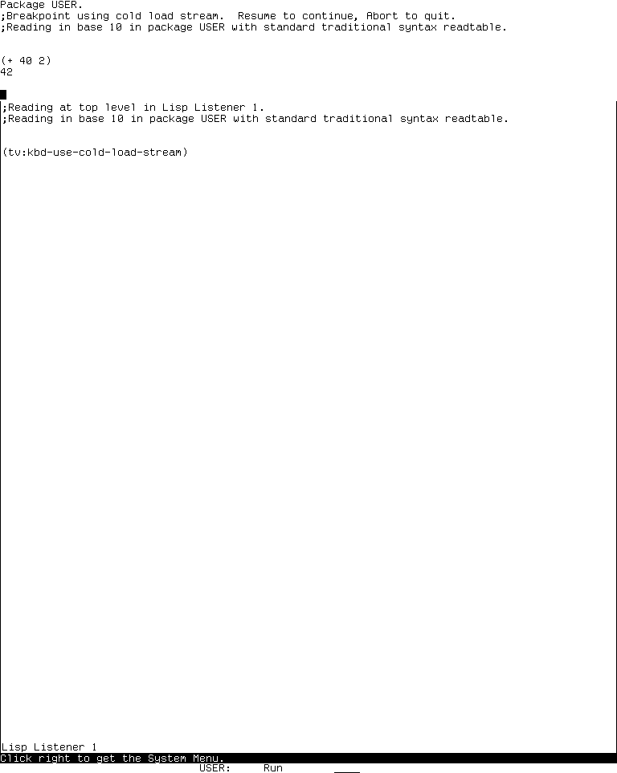
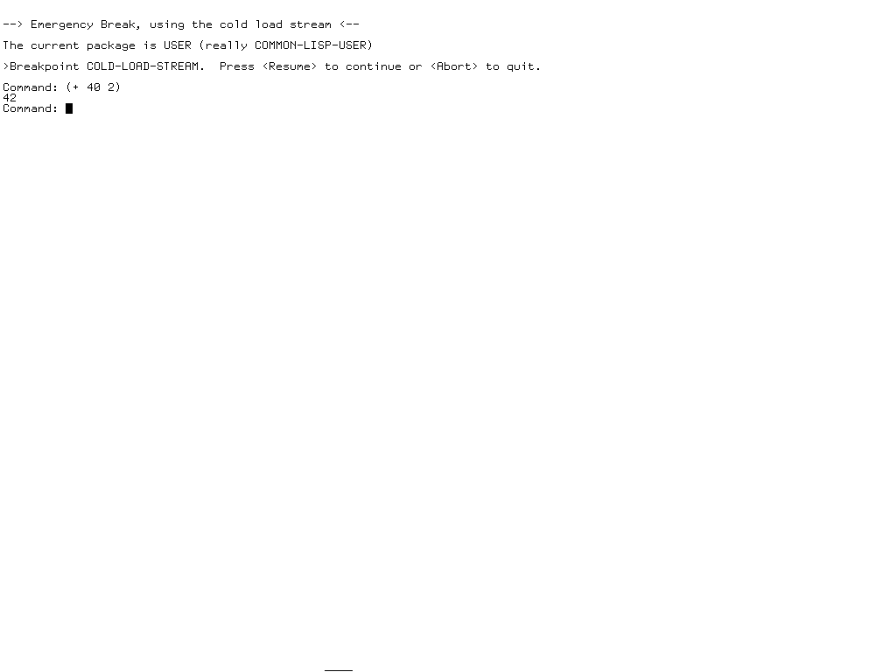

# Emergency Break and the cold-load stream

**Emergency Break is a live recovery console, not a reset, reboot, load-band
restoration, or virtual-machine snapshot.** On both the MIT CADR lineage and
Symbolics Genera it enters a primitive Lisp break loop using a deliberately
primitive stream that does not depend on the ordinary window system. Evaluation
errors or an explicit debugger key can then transition into a Lisp debugger. An
operator can inspect or change the running Lisp world while normal windows are
unusable, then attempt to return to it. That power is also why both implementations
label the path for experienced users and why museum runtime work uses a disposable
private world.

The implementations are related but not identical. System 46 has a compact direct
break loop. The maintained LM-3 System 303 implementation saves and restores the
screen, arbitrates keyboard ownership, and can divert an error whose window is
locked. Genera retains the same architectural escape hatch but adds a front-end
processor-backed console, a more capable input editor, explicit cleanup, and
platform-dependent availability.

The implementation-ready contract, including every source-visible entry prefix,
cold-reader key, pagination branch, breakpoint leaf, debugger transition, recovery
query, pointer route and multi-stage key sequence, is the
[Emergency Break and degraded interaction paths reimplementation specification](emergency-break-and-degraded-interaction-paths-reimplementation-specification.md).

## Evidence and release boundaries

### Public CADR material

The early evidence is the museum's public MIT CADR System 46 snapshot at revision
[`8e978d7`](https://github.com/mietek/mit-cadr-system-software/tree/8e978d7d1704096a63edd4386a3b8326a2e584af/src).
The relevant source files are the 37,385-byte
[`lmwin/basstr.163`](https://github.com/mietek/mit-cadr-system-software/blob/8e978d7d1704096a63edd4386a3b8326a2e584af/src/lmwin/basstr.163),
SHA-256 `19e0771ff876d5325f18b97a2ccbf392f7d5950d3a89751d633d27d7cbe01e72`,
and the 28,436-byte
[`lmwin/sysmen.105`](https://github.com/mietek/mit-cadr-system-software/blob/8e978d7d1704096a63edd4386a3b8326a2e584af/src/lmwin/sysmen.105),
SHA-256 `c203bc08b5550edefb1928349179fc54c483655d273077294211eb778daff6f1`.
The 10,000-byte window-debugging manual source
[`lmwind/wdebug.6`](https://github.com/mietek/mit-cadr-system-software/blob/8e978d7d1704096a63edd4386a3b8326a2e584af/src/lmwind/wdebug.6),
SHA-256 `b1ea2f91d6900369c47b9bda823e943b501371372e74e544915e46bd45f4b51a`,
explains its intended recovery role. Links and local identities were verified on
2026-07-18.

The later public implementation and runtime observation use the maintained LM-3
System repository at Fossil check-in
[`4df393c`](https://tumbleweed.nu/r/sys/info/4df393c68d7f083ce42d5c377039d26043cc18a9031ace28258dc97f4137eb91),
tag `system-303`. This tree is maintained preservation work, not silently treated as
an unmodified 1980s distribution. The active
[`window/basstr.lisp`](https://tumbleweed.nu/r/sys/file?name=l/sys/window/basstr.lisp&ci=4df393c68d7f083ce42d5c377039d26043cc18a9031ace28258dc97f4137eb91)
is 81,846 bytes with SHA-256
`8ba3a16e726ed043e6585c7a68b7096bb2dcc5d6f05476afd89f84a48dff2645`;
[`window/sysmen.lisp`](https://tumbleweed.nu/r/sys/file?name=l/sys/window/sysmen.lisp&ci=4df393c68d7f083ce42d5c377039d26043cc18a9031ace28258dc97f4137eb91)
is 43,408 bytes with SHA-256
`b53b7c3d5a59040f3180d5be0d2072b2a334bb386fa5e19dd6abbd945148b40c`.

### Licensed Genera material

The Genera analysis uses the locally purchased Open Genera 2.0 release and the
Genera 8.5 world it supplies. The source inputs remain ignored and are not linked or
redistributed. The complete specification records the exact locally inspected
source artifacts needed for its contracts. The core stream and entry files are:

| Release pathname | Bytes | SHA-256 | Evidence supplied |
| --- | ---: | --- | --- |
| `sys.sct/window/sysmen.lisp.~250~` | 52,798 | `2f54fdb15335fc7f9f9f5c47a03f1ad2a5803d86787267949825f23853363f4c` | System Menu registration |
| `sys.sct/window/basstr.lisp.~645~` | 65,555 | `112245299c0d46cf81a67f2cc8de714c766711653be215467ef41bb2c6778021` | function-key entry, selection, cleanup, and availability logic |
| `sys.sct/sys/cold-load-stream.lisp.~6~` | 15,225 | `a6ba54d93b4d8b5852653686b183e9e7ba70763da48fe276e842f591f60ff27c` | front-end console stream and input editing |
| `sys.sct/sys/ifepio.lisp.~239~` | 17,345 | `2ea2530f775e4653891e49ea59c2dc05fe16b8155a91bdb8c30521aa2c61ac78` | low-level special-character interception, output, and `**MORE**` |
| `sys.sct/debugger/debugger.lisp.~784~` | 99,026 | `0f12aed40337a76298f42ba16fe3e23723ac005e34a63927c0dbff8b6c91e600` | cold takeover, saved-screen ownership, cleanup, and recursive degradation |
| `sys.sct/sys/ltop.lisp.~754~` | 25,132 | `18f1cc03e5a5aefc06b97eaa5649cffdf2717b824f994422d8ea2111f1db6ebb` | distinct minimal emergency evaluator and warm-reinitialization boundary |

These are local artifact observations verified through 2026-07-19. They support original
technical description here, not publication of the proprietary files.

## Entry points and visible contract

| System boundary | Entry point | What the source advertises |
| --- | --- | --- |
| System 46 | `Terminal Call` | get to the cold-load stream |
| System 46 | **Emergency Break** in the System Menu's Other column | equivalent recovery path when the keyboard or window system is suspect |
| LM-3 System 303 | `Terminal Call` and **Emergency Break** in the Programs column | evaluate Lisp forms without using the window system, with an explicit caution |
| Genera 8.5 | `Function Suspend` | get to the cold-load stream, with caution |
| Genera 8.5 | **Emergency Break** in the System Menu | start a high-priority process that enters the same stream with that reason label |

The menu item and keyboard prefix are not different breakpoint implementations. In
each inspected release they start a process that calls the same keyboard recovery
function. The menu exists partly because a mouse may still work when the relevant
keyboard path does not; a System 46 change note says this explicitly. After the
cold stream is selected, however, it has no pointer or presentation bindings.

## Why it survives window-system failure

The cold-load stream is part of the small I/O environment available during and
below ordinary system startup. It can draw characters and read keyboard input
without acquiring an application window, redisplaying a pane, consulting a command
table, or selecting an editor buffer. “Cold-load” names that implementation layer;
entering Emergency Break does **not** reload the cold load or replace memory with an
older image.

This separation matters in failure cases such as:

- a sheet or superior locked by another process;
- the selected process waiting in `Output Hold` or on a window-system lock;
- the error handler being unable to obtain a usable error window;
- the scheduler discovering an invalid inhibit-scheduling state; or
- a screen that cannot be exposed on the available hardware.

The ordinary debugger can be the thing that cannot display. The cold-load path
changes the I/O dependency first, then runs Lisp and debugger machinery over that
minimal stream.

## System 46: a compact independent breakpoint

`KBD-USE-COLD-LOAD-STREAM` first moves the cold-load cursor home and clears the rest
of the line. It establishes a top-level catch, enables scheduling for the break,
binds `TERMINAL-IO` to the cold-load stream, prints the current package, and calls
`BREAK` on that stream. The operator receives a Lisp break loop drawn directly over
the display rather than a new window.

The contemporary window-debugging documentation gives the intended operating
sequence: enter through `Terminal Call` or the menu, inspect process or window state,
optionally redirect error-handler output to the cold-load stream, continue, and then
force the affected process into the normal error handler. It also suggests the
cold-load stream for trace output when tracing the ordinary window interface itself.
That is a narrow diagnostic purpose, not a recommendation to use this console as the
normal listener.

## System 303: screen preservation and error-window recovery

The maintained implementation adds several layers around the same idea:

1. a global ownership flag prevents the normal keyboard process from consuming
   characters while the cold-load stream owns the keyboard;
2. the current screen is saved before the breakpoint and restored in an unwind
   cleanup;
3. any error windows recorded as locked are offered one at a time for handling over
   the cold-load stream;
4. standard terminal I/O is rebound to the cold-load stream and the current package
   is displayed;
5. `BREAK` runs under an explicit abort/error restart; and
6. screen restoration runs even when the breakpoint exits abnormally.

This is a useful code-only finding beyond the short menu label: Emergency Break can
be the dispatch point for an already-waiting error whose graphical debugger window
could not be used. It does not merely create an unrelated REPL.

The source also contains degraded recovery neighbors: clearing temporary windows,
clearing window-system locks, attempting a lock-aware redisplay, and forcing or
redirecting output. These are separate operations. Emergency Break gives the
operator a place to reason about them; it does not automatically clear every lock or
repair every process.

## Genera 8.5: front-end console and explicit cleanup

Genera's `WITH-COLD-LOAD-STREAM` wrapper saves the selected window and original
terminal stream, redirects query, debug, error, standard input, and standard output
through synthetic terminal streams, marks the cold-load stream selected, and asks
the debugger substrate to take over the console. An unwind cleanup calls the
debugger's cold-load recovery function. The actual Emergency Break path clears the
selected-window binding, prints the current package, and invokes `BREAK` over the
cold-load stream.

That user-facing path is distinct from the function named
`SI:EMERGENCY-BREAK`. When recursive debugger depth reaches 25, Genera bypasses the
ordinary debugger command surface and enters that smaller read/evaluate/print loop;
at depth 30 it halts into the auxiliary FEP/VLM layer. The menu label therefore must
not be used as evidence that the menu directly invokes the minimal evaluator.

The underlying Genera stream is not just a character-output primitive. The inspected
source maintains cursor geometry, a rubout-handler buffer, prompt and “noise string”
state, activator and unread-character cells, single-character Rubout, whole-buffer
Clear Input, screen refresh, Help, activation, and `**MORE**` behavior. It does not
provide the ordinary Input Editor's cursor-motion, word-motion, kill/yank, or
completion maps. Its lowest-level display and keyboard operations go through the
front-end processor interface. This explains how the console can offer a usable
reader while avoiding Dynamic Windows.

The exact source tree is context-sensitive. Before rubout editing,
Control-Suspend recursively enters `BREAK`, Control-Meta-Suspend enters the ordinary
Debugger, and Control-Abort signals Abort. Within the editor, Refresh redraws the
prompt and buffer, Control-Refresh redraws after a fresh line, Help chooses the first
available configured help mode, and any otherwise unhandled modified character
beeps. The Lisp reader uses `End` as its activation character. There is no cold-stream
pointer command or multi-stage editor prefix.

The ordinary Break loop then gives the first nonwhitespace character another
context: Resume returns; Abort and Control-Z take the abort path; Suspend enters a
nested Break; Meta-Suspend enters the ordinary Debugger; and `(RETURN expression)`
returns all values of the expression. Once text has begun, intercepted characters
again follow their ordinary asynchronous behavior. This command-loop layer is
distinct from both the lower cold-stream intercept and the depth-25 minimal
evaluator.

Availability is platform-sensitive:

- on 3600-family builds the source enters the console directly;
- on Ivory-machine builds it checks the applicable system case, including a Domino
  debug switch;
- if the stream is unavailable and the caller did not require it, the user receives
  a notification; and
- a caller that requires a debugger instead signals the stated reason, allowing a
  stack trace and warm-boot path rather than silently pretending the console exists.

This conditional is a high-confidence source fact. Whether the purchased Open
Genera VLM world takes each branch remains a runtime question; the museum has not
forced a failure merely to discover it.

## Capabilities and limits

### What an operator can do

- read and evaluate Lisp forms in the live world;
- inspect packages, variables, functions, processes, windows, locks, and debugger
  state using callable Lisp facilities;
- change live state to redirect diagnostics or repair a known problem;
- enter debugger commands and restarts supplied by the running error system; and
- attempt to recover to the saved screen and process state.

### What the path does not provide

- an isolated address space or rollback point;
- automatic repair, transactional undo, or protection from a mistaken mutation;
- the ordinary window debugger's panes, mouse-sensitive stack frames, source links,
  or presentation menus;
- proof that every scheduler, device, or memory failure leaves enough machine alive
  to run Lisp; or
- a substitute for saving a world, rebuilding a band, or restarting the emulator.

“Independent of the window system” is therefore a dependency claim, not a promise
that the rest of the machine is healthy.

## Runtime observation on LM-3 System 303

Disposable harness session `emergency-break-20260718`, generation 1, booted load
band `System 303-0` as Experimental System 303.0, ZWEI 129.0, microcode 323. After
dismissing the date question, the researcher opened the System Menu and confirmed
the visible **Emergency Break** item. The exact menu click did not expose the
breakpoint in that attempt, so the listener evaluated the menu target directly as
`(tv:kbd-use-cold-load-stream)`.

The observed display then:

1. identified package `USER`;
2. announced a breakpoint using the cold-load stream;
3. said Resume would continue and Abort would quit;
4. accepted the researcher-entered form `(+ 40 2)`; and
5. printed `42` on the cold-load display while the original Lisp Listener remained
   visible underneath.

*Runtime observation: LM-3 System 303 Emergency Break after evaluating a synthetic
arithmetic form, captured 2026-07-18. Underlying software and display material
remain the property of their respective rightsholders; reproduced for criticism,
scholarship, and historical documentation under 17 U.S.C. section 107. No
affiliation or endorsement is implied.*

The harness's `F11` event did not act as Resume in this context; `Page Down` inserted
a visible Resume character into the cold-load reader, and submitting it produced an
unbound-variable error. That is evidence about the present host-to-CADR key mapping,
not evidence that a physical CADR Resume key failed. The session was therefore
stopped through the harness instead of claiming a verified in-guest return path.

| Runtime item | Recorded value |
| --- | --- |
| Session interval | 2026-07-18 04:14:52–04:19:47 EDT |
| Disk | public base and private start SHA-256 `bb16e46ad81decfe1efe691d36b6aa4ce3fd4ffb82474365de3520989d397cb5` |
| Source | public System check-in `4df393c68d7f083ce42d5c377039d26043cc18a9031ace28258dc97f4137eb91`; unchanged private tree SHA-256 `21f5215de973aa6ccbddb817f2d64edd95ee1014c3028a9b0711ea7c741b807e` |
| Emulator | start and execution SHA-256 `707a77d23e28ea1c45ae0eb0145dc181fa7ba649b9defc30044d4f847ac2c5be` |
| Selected screenshot | 768 by 963; PNG SHA-256 `e9af453164e75dccc90a4fe12a12b231e3308af9212b9c3b005a927e09f919ce`; decoded-pixel SHA-256 `f3e531869cdc3255270cde0ce5f808ae738298fe14573673b609a62f56e4e161` |
| Run record | 6,872 bytes; SHA-256 `77bc6037b5f1fcdafdd253c7e32e33e0ad71e9989f9135508e5f9a79f4d0966a` |
| Shutdown | clean: `forced_stop=false`, `state_may_be_incomplete=false`, `usim` and Xvfb exit status 0, public base disk unchanged |

The selected screenshot contains only a functional recovery display, short system
labels, and researcher-entered arithmetic. Its use is reviewed in the
[runtime screenshot publication policy](screenshot-publication-rights-review.md)
and recorded in the [curated CADR screenshot catalog](assets/mit-cadr-screenshots/).
It is not a source, manual, font, or decorative screenshot gallery.

## Runtime observation on Genera 8.5

Disposable isolated session `d04-emergency-break-publication-20260719`, generation
1, used the exact identified Open Genera archive, VLM, debugger, and base world. The
harness explicitly targeted either the main or Cold Load X client and failed closed
if that kind was absent or ambiguous.

The positive action sequence was:

1. hold Shift and the rightmost mouse button to display the System Menu;
2. move to and visibly highlight **Emergency Break**;
3. release the momentary-menu button and select the still-displayed item with Left;
4. observe the separate Cold Load client announce “Emergency Break, using the cold
   load stream,” proving the actual menu dispatch rather than a direct substitute;
5. type the synthetic form `(+ 40 2)`;
6. send the source-defined `End` character through host `KP_End`;
7. observe the value `42` and a new `Command:` prompt; and
8. send `Resume` through host `F5`, then observe the saved main Listener display
   restored.

*Runtime observation: Open Genera Emergency Break after actual System Menu entry,
captured 2026-07-19. Underlying software and display material remain the property of
their respective rightsholders; reproduced for criticism, scholarship, and
historical documentation under 17 U.S.C. section 107. No affiliation or endorsement
is implied. The image is excluded from the repository's project license.*

| Runtime item | Recorded value |
| --- | --- |
| Session interval | 2026-07-19 08:13:46–08:16:36 EDT |
| Archive | 206,213,430 bytes; SHA-256 `89fb3e76b91d612834f565834dea950b603acf8f9dbacacdd0b1c3c284a2d36e` |
| World | 54,804,480 bytes; SHA-256 `a8ee5e86cc7e322f7385af3e0cd579d7650d4dcfc3ce328acbf8b25515dd0672` |
| VLM / debugger | SHA-256 `9f5e18d5770f973879716182b6856ef5a8ee9d3b2bb907476ea0cf35986aa4c7` / `2db918cfe8f35f52c7ff4b7695b0ecd3bb85e41a3327ea5a94874edf05edb54a` |
| Harness | Python source SHA-256 `6f8c65bdc2f814a8408f92eb05d3fac68eafefefe889bd02e570059694145497` |
| Selected screenshot | 1024 by 768; PNG SHA-256 `b7edcce3ba94e9601335ac280438988d5ae40451c1f2235f2b5fe786f8736eb6`; decoded-pixel SHA-256 `219c9bce8d7771553141df4873aced28255317f6e7b1cd9700c61ef5ac834445` |
| Final action log | 42 records; SHA-256 `0e3563bb5af99754dd00e08f294cdfc235e9bc2988b019c418342073f794bcdd` |
| Recovery | `Resume` visibly restored the 1200 by 900 main client; restored capture PNG SHA-256 `641dcef54b379e67a74e5e7bd19bbb5838ae42d01d5b63f8536c8fd2695bb35d` |
| Persistence and stop | base/private world unchanged; `save_world_invoked_by_harness=false`; `process_checkpoint_created_by_harness=false`; in-guest save/checkpoint fields unknown; unsaved state recorded discarded/non-resumable; confirmation and cleanup progress observed; known forced VLM mutex-stall cleanup, so `state_may_be_incomplete=true` |

Two earlier menu gestures in this same session changed global input status without
displaying or selecting the item. They remain negative timing/focus evidence, not
successful entries. The third observed menu, highlight, exact reason banner, value,
and restored display form the positive claim chain.

## Preservation and safety guidance

- Always use a disposable private disk or world. A valid Lisp form can mutate the
  live machine as completely as code evaluated in an ordinary listener.
- Record the exact source/world boundary before testing. The recovery path changed
  substantially between System 46, System 303, and Genera.
- Test with synthetic, side-effect-free forms first. Do not manufacture a disk,
  scheduler, or network failure simply to obtain a dramatic screen.
- Distinguish an in-guest Resume/Abort result from an emulator stop. The latter proves
  containment, not guest recovery.
- Keep raw captures and all Genera inputs ignored. Curate only the minimum screenshot
  required to establish a specific historical claim.

## Open questions

- Which exact physical-key sequence is appropriate for returning from this System
  303 breakpoint through the present `usim` Space Cadet mapping? The source and
  display name Resume, but the current harness delivery was not verified.
- Which actual platform/availability branches besides the now-verified base-world
  menu entry are reachable on 3600, Ivory, and Domino configurations?
- Does `Function Suspend` in the purchased world follow the same complete lifecycle,
  including ignored numeric argument and typeahead release, as the source?
- Which Genera debugger commands remain usable when invoked through the primitive
  stream, and which assume Dynamic Windows despite the stream redirection?
- Can a controlled locked-error-window fixture demonstrate the System 303 diversion
  path without risking unrelated state?
- Can equivalent Genera locked-window and Output Hold fixtures cover the cold
  yes/no/debugger choices without manufacturing destructive failure?

## Related articles

- [Software application dossier coverage](software-application-dossiers.md)
- [Emergency Break and degraded interaction paths reimplementation specification](emergency-break-and-degraded-interaction-paths-reimplementation-specification.md)
- [Lisp Listeners on the MIT CADR and LM-3](mit-cadr/lisp-listener.md)
- [Operating CADR through the Xvfb harness](mit-cadr/cadr-computer-use-harness.md)
- [Operating Genera through the Xvfb harness](genera/genera-computer-use-harness.md)
- [Publishing runtime screenshots](screenshot-publication-rights-review.md)
