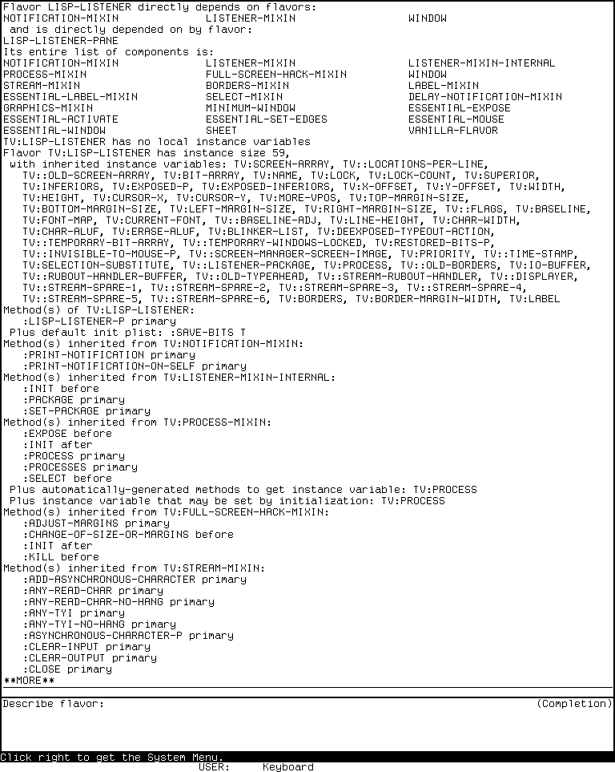
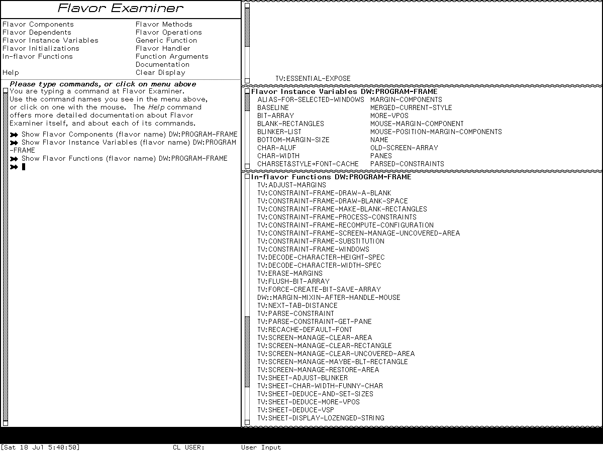
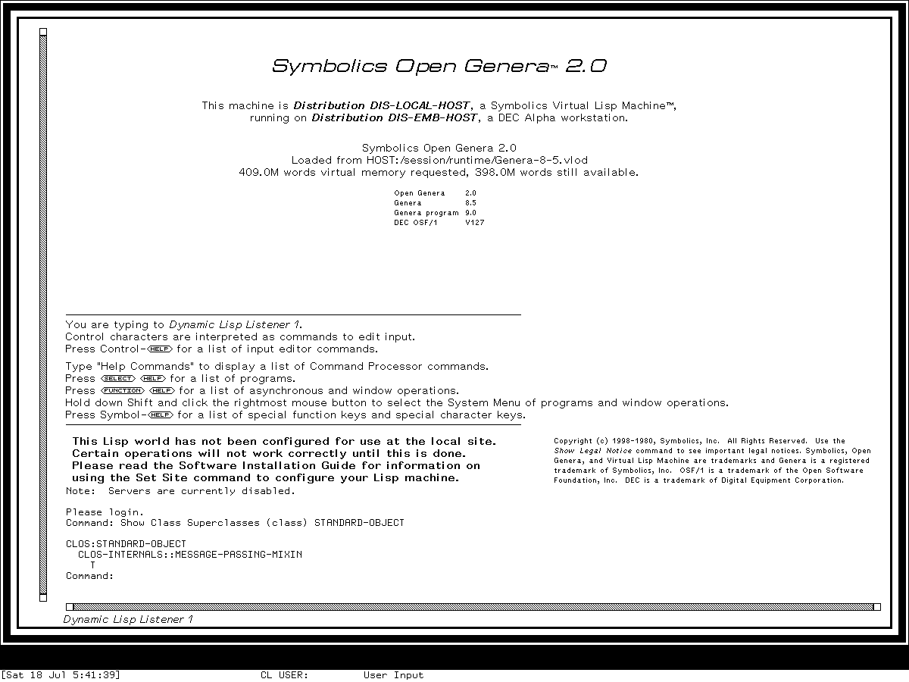

# Flavors, classes, CLOS, and the Flavor Examiner

The direct lineage is **not** “CADR Flavor Examiner becomes Genera Flavor
Examiner.” The CADR releases expose object-system inspection primarily through
Lisp and ZWEI commands. Genera retains command-processor and Zmacs forms of those
tools and also gives Flavors a dedicated **Flavor Examiner** activity, selected
with `Select X`. Genera's co-resident CLOS implementation has an analogous but
separate eight-command inspection family; those commands do not turn the
Flavors-only activity into a CLOS browser.

This distinction matters historically. The public System 46 tree also contains
an older entity-and-class facility whose `DEFCLASS` is not the Common Lisp Object
System. Genera 8.5 has both New Flavors and CLOS, with different class precedence,
slot/initialization, method, and inspection models.

“Complete” on this page means every object-inspection command and option in the
inspected release sources, every fixed Flavor Examiner menu entry, and the
documented editor navigation controls. It does not mean every operator in either
object system, commands added by a site, or every presentation translator that a
separately loaded product might install.

## Evidence and release boundaries

### MIT CADR System 46

The historical source is the public System 46 snapshot at Git revision
[`8e978d7d1704096a63edd4386a3b8326a2e584af`](https://github.com/mietek/mit-cadr-system-software/tree/8e978d7d1704096a63edd4386a3b8326a2e584af/src).

| Public file | Bytes | SHA-256 | Evidence supplied |
| --- | ---: | --- | --- |
| [`src/lispm2/flavor.164`](https://github.com/mietek/mit-cadr-system-software/blob/8e978d7d1704096a63edd4386a3b8326a2e584af/src/lispm2/flavor.164) | 72,844 | `a2fa9725c9dce174efda6306432b5bedba87d0383f9aa30beb0c48dd3d7a7178` | Flavors representation, composition, methods, instances, and textual description |
| [`src/lispm2/class.73`](https://github.com/mietek/mit-cadr-system-software/blob/8e978d7d1704096a63edd4386a3b8326a2e584af/src/lispm2/class.73) | 23,948 | `99dd518019540269e4070b249412f62314688433103e6ffa0cb7805e7204deb3` | pre-CLOS entity/class system |
| [`src/nzwei/comf.25`](https://github.com/mietek/mit-cadr-system-software/blob/8e978d7d1704096a63edd4386a3b8326a2e584af/src/nzwei/comf.25) | 29,106 | `fff824c7bd91421f46feebca6b68e1d87aa28b0ddc21a0a11358289013c41f7a` | `Describe Flavor` implementation and mouse-sensitive output |
| [`src/nzwei/emacs.comdif`](https://github.com/mietek/mit-cadr-system-software/blob/8e978d7d1704096a63edd4386a3b8326a2e584af/src/nzwei/emacs.comdif) | 7,950 | `6fec019a836715bc19be9ba36eec97e58d2fd23b4d1541ae9be07942eb0526c3` | generated visible-command evidence |
| [`src/nzwei/_comnd.1`](https://github.com/mietek/mit-cadr-system-software/blob/8e978d7d1704096a63edd4386a3b8326a2e584af/src/nzwei/_comnd.1) | 37,158 | `9cbd632e763c8ff150941f84ddb082edf56f123d513ff3e6c9ff2e6a3e598f36` | generated command descriptions |
| [`src/nzwei/nzwei.tags`](https://github.com/mietek/mit-cadr-system-software/blob/8e978d7d1704096a63edd4386a3b8326a2e584af/src/nzwei/nzwei.tags) | 57,884 | `5d00a87d730ad417b903be596a9f284c0736f664311c1ab3427d710bf54343c7` | definition-name cross-check for source absent from the snapshot |
| [`src/lmman/flavor.16`](https://github.com/mietek/mit-cadr-system-software/blob/8e978d7d1704096a63edd4386a3b8326a2e584af/src/lmman/flavor.16) | 37,116 | `c4b2635572fcca68a5d86798821170668fc46644f168718f91087b6d692db7ba` | contemporary Flavors manual source |

The System 46 tree preserves complete source for `Describe Flavor`. Its generated
command lists and tags also establish `Edit Methods`, `List Methods`, `Edit
Combined Methods`, and `List Combined Methods`, but the corresponding section
source is absent. This page therefore does not project the later implementation
details of those commands backward as System 46 fact.

### Maintained LM-3 System 303

The runnable later release is backed by the maintained LM-3 System repository at
Fossil check-in
[`4df393c68d7f083ce42d5c377039d26043cc18a9031ace28258dc97f4137eb91`](https://tumbleweed.nu/r/lm-3/info/4df393c68d7f083ce42d5c377039d26043cc18a9031ace28258dc97f4137eb91),
tag `system-303`. This is public restoration work and is kept distinct from the
historical System 46 snapshot.

| Maintained file | Bytes | SHA-256 | Evidence supplied |
| --- | ---: | --- | --- |
| [`zwei/comg.lisp`](https://tumbleweed.nu/r/sys/file?ci=4df393c68d7f083ce42d5c377039d26043cc18a9031ace28258dc97f4137eb91&name=zwei%2Fcomg.lisp) | 24,115 | `920c5f11e55658b04190e63f4ad64687f3c1e9f01205855236951ea99f6c8da1` | evolved `Describe Flavor` |
| [`zwei/poss.lisp`](https://tumbleweed.nu/r/sys/file?ci=4df393c68d7f083ce42d5c377039d26043cc18a9031ace28258dc97f4137eb91&name=zwei%2Fposs.lisp) | 76,797 | `e00c9f4080e3699bc568f8ec13701790fbadbafa6eb1e42549d68925c8ce15cb` | flavor component/dependent/method possibility commands |
| [`zwei/sectio.lisp`](https://tumbleweed.nu/r/sys/file?ci=4df393c68d7f083ce42d5c377039d26043cc18a9031ace28258dc97f4137eb91&name=zwei%2Fsectio.lisp) | 65,249 | `57b11d071f0d3784bdb5b6b1118a10cde58e7203c7c954c70a9f379a13ac7230` | operation and combined-method commands |
| [`man/flavor.text`](https://tumbleweed.nu/r/sys/file?ci=4df393c68d7f083ce42d5c377039d26043cc18a9031ace28258dc97f4137eb91&name=man%2Fflavor.text) | 140,146 | `327b365a82dfff9a12ce705265c42c08d1d19d41a9fc750b755f0bfe85374f14` | maintained Flavors manual and editor workflow |

The byte counts and hashes above are from the private read-only source copy made
by the runtime session from that exact public check-in.

### Licensed Genera 8.5 implementation

The Genera implementation observations use the locally purchased Open Genera 2.0
archive and the Genera 8.5 world it supplies. The source files remain ignored,
are identified here only by release pathname, evacuated version, size, and hash,
and are not linked or redistributed.

| Release pathname | Version | Bytes | SHA-256 | Evidence supplied |
| --- | ---: | ---: | --- | --- |
| `sys.sct/flavor/examine.lisp` | 4032 | 116,658 | `a77cce235d5e58daba7fae09921ce6ade746948741dfb7317f46e5435c0bd649` | ten Flavors commands, output generation, and presentation actions |
| `sys.sct/flavor/examine-window.lisp` | 4012 | 11,939 | `dad4ec739d436bff81d46f0bb435092bb954647c8c3d7cd0a7220ad2a47b58eb` | Flavor Examiner frame, menu, panes, and command routing |
| `sys.sct/flavor/examine-help.lisp` | 4012 | 13,582 | `32c49e6e7a257b99d0f353fc9df923113c1e52a9180635ad923dd949c7b32b70` | in-program overview and Help commands |
| `sys.sct/clos/examine.lisp` | 26 | 68,075 | `ca6248810edfa460ae4f2148a6f0f2e0deede4bfbd358a9de79a6e66c60660a8` | eight CLOS inspection commands |
| `sys.sct/zwei/flavor.lisp` | 50 | 36,786 | `52af01a7653cdd67ac58a10bab2266ae8ff61896b3f76a8dc552871698a8b324` | Zmacs front ends for both command families |

The intended public behavior is cross-checked against Symbolics's
[*Program Development Utilities*, Genera 8](https://bitsavers.org/pdf/symbolics/software/genera_8/Program_Development_Utilities.pdf).
The public manual and pinned source links were verified 2026-07-18.

## What the object systems are

### CADR Flavors

System 46 represents a flavor with a named structure that records local and
composed instance variables, component and dependent relationships, local method
entries, initialization metadata, a package, and a composed select-method.
`DEFFLAVOR` records the declaration. `DEFMETHOD` records methods; the source also
supports wrappers and the usual before, primary, and after daemon pattern.

Composition is deliberately lazy. Creating an instance ensures that the flavor
combination and method combination have been built, allocates an instance with an
instance descriptor, establishes initial values, applies initialization keywords,
and invokes initialization behavior. Redefining a method can selectively
recompose the affected message; changing storage layout can leave existing
instances attached to the old descriptor. Inspection is consequently not merely
pretty-printing a declaration: it exposes computed component order and composed
dispatch state.

`VANILLA-FLAVOR` supplies baseline printing, description, operation enumeration,
and evaluation inside an instance unless `:NO-VANILLA-FLAVOR` is requested.
`DESCRIBE-FLAVOR` reports direct components and dependents, any already-computed
transitive components, instance layout, local methods by message and method type,
automatic accessors, initialization metadata, arbitrary remaining properties, and
the composed select-method when available.

### The CADR entity/class facility is not CLOS

System 46's `class.73` defines a separate older object facility:

- an entity instance is a closure over instance variables plus a class method
  symbol;
- the class method symbol's function cell contains a select-method;
- a class object is itself an entity, normally named by a symbol ending in
  `-CLASS`;
- redefining a class makes a new class method symbol, leaving older instances
  attached to their former class version; and
- a method local to one instance is implemented by creating a phantom subclass
  and transmuting that instance to it.

Its `DEFCLASS`, arrow-style message send, accessor generation, and class hierarchy
are historically interesting, but they are neither ANSI Common Lisp `DEFCLASS`
nor evidence that CLOS was installed on the CADR. ZWEI's `List Methods` deliberately
searches this class hierarchy as well as the Flavors registry, which is why its
manual says “classes and flavors.”

### Genera New Flavors and CLOS

Genera's Flavors system retains components, mixins, instance variables,
initializations, internal flavor functions, and combined handlers, but integrates
them with named generic functions. An operation can be an explicit generic
function, a traditional message, or a generic function declared compatible with a
message. That is why the tools distinguish **methods**—the implementation view—from
**operations**—the interface supported by an instance.

CLOS has a separate class precedence list, direct and effective slots, initargs,
generic functions specialized on argument classes or objects, and effective
methods. Genera's CLOS commands answer analogous questions, but their data types
and algorithms are not aliases for Flavors. In particular, the manuals explicitly
warn that CLOS and Flavors precedence algorithms can choose a different order when
local constraints leave alternatives.

## CADR inspection and editing tools

### Complete release-bounded command lineage

| Command | System 46 evidence | System 303 behavior |
| --- | --- | --- |
| `Meta-X Describe Flavor` | complete source | prompts with completion and emits one mouse-sensitive structural report |
| `Meta-X List Methods` | generated command list and tags | lists class and flavor methods for one operation in a possibilities display |
| `Meta-X Edit Methods` | generated command list and tags | skips the list display and begins visiting matching definitions |
| `Meta-X List Combined Methods` | generated command list and tags | lists methods participating in one flavor/operation handler |
| `Meta-X Edit Combined Methods` | generated command list and tags | begins visiting those participating methods |
| `Meta-X List Flavor Components` | not established | lists the complete computed component order |
| `Meta-X Edit Flavor Components` | not established | visits component `DEFFLAVOR` definitions |
| `Meta-X List Flavor Dependents` | not established | lists all recursive dependents |
| `Meta-X Edit Flavor Dependents` | not established | visits all recursive dependent definitions |
| `Meta-X List Flavor Direct Dependents` | not established | lists only immediate dependents |
| `Meta-X Edit Flavor Direct Dependents` | not established | visits only immediate dependent definitions |
| `Meta-X List Flavor Methods` | not established | lists methods defined locally by one flavor, excluding inherited methods |
| `Meta-X Edit Flavor Methods` | not established | visits those local method definitions |

There is no dedicated Flavor Examiner activity or `System X` registration in the
inspected System 303 tree. These are editor tools. The lower-level
`DESCRIBE-FLAVOR` function is also callable from Lisp, while ordinary `DESCRIBE` on
the internal flavor record delegates to it.

### `Describe Flavor` output and mouse behavior

System 46 and System 303 both show:

1. direct dependencies, direct inclusions, and direct dependents;
2. the computed full component list when available;
3. local and inherited instance variables and instance size;
4. local and inherited methods, grouped by defining flavor and operation;
5. before, primary, after, wrapper, and other method types;
6. generated getter/setter methods, initable variables, accepted init keywords,
   external access macros, and default initialization properties; and
7. unconsumed flavor properties.

System 303 improves the report rather than merely copying it. It composes the
component list if necessary, handles arbitrary method types and `:CASE`
suboperations, sorts several lists, wraps long lines, and uses package-aware
printing. Flavor names and method function specifications are typeout items. Their
menus can describe or edit the selected object; the default action normally enters
the source-navigation path.

### Possibilities navigation

All of the System 303 `List` commands use Zmacs's possibilities substrate. Each
result line stores an executable object and a nesting level in the line property
list, not just display text. The corresponding `Edit` command uses the same list
but goes directly to definitions.

| Control | Effect |
| --- | --- |
| `Control-Shift-P` | visit the next remembered top-level possibility, reading its source file if necessary |
| `Control-/` in a possibilities buffer | execute the possibility attached to the current line |
| `Meta-.` / `Edit Definition` | find a flavor or a method function specification directly |
| Left on a sensitive result | invoke its default action, normally source navigation |
| Right on a sensitive result | offer applicable editor actions |

The combined-method command asks whether it should compose a handler whose methods
are not yet composed. Its order is an implementation-derived approximation:
wrappers, before methods, primary methods, after methods, then other method types.
That order is valuable for navigation, but it is not a decompilation of the final
combined function.

## Genera Flavors command family

The following ten commands are the complete inspected `Flavors` command table.
Nine appear in the Flavor Examiner's fixed command menu. `Show Flavor Differences`
is installed as a command but deliberately omitted from that menu.

| Command | Required inputs | Complete keyword surface | Question answered |
| --- | --- | --- | --- |
| `Show Flavor Components` | flavor | `:Match`, `:Duplicates`, `:Brief`, `:Instance-Variables`, `:Methods`, `:Initializations`, `:Functions`, `:Detailed` | What components make this flavor, in what order, and where do selected attributes originate? |
| `Show Flavor Dependents` | flavor | `:Match`, `:Duplicates`, `:Brief`, `:Levels`, `:Instance-Variables`, `:Methods`, `:Initializations`, `:Functions`, `:Detailed` | What flavors inherit from or require this one? |
| `Show Flavor Instance Variables` | flavor | `:Match`, `:Sort` (`Alphabetical` or `Flavor`), `:Locally`, `:Detailed` | What state is local or inherited, and with what initialization/access properties? |
| `Show Flavor Methods` | flavor | `:Match`, `:Sort` (`Alphabetical` or `Flavor`), `:Using-Instance-Variable`, `:Locally` | What methods are local or inherited, optionally restricted by state they use? |
| `Show Flavor Initializations` | flavor | `:Match`, `:Sort` (`Alphabetical` or `Flavor`), `:Locally`, `:Detailed` | What public and internal initialization forms apply? |
| `Show Flavor Functions` | flavor | `:Match`, `:Sort` (`Alphabetical` or `Flavor`), `:Locally` | What `DEFUN-IN-FLAVOR` and `DEFMACRO-IN-FLAVOR` definitions apply? |
| `Show Flavor Operations` | flavor | `:Match`, `:Detailed` | What generic functions and messages can an instance accept? |
| `Show Flavor Differences` | two flavors | `:Match` | How do component order, state, methods, initializations, and functions differ? |
| `Show Generic Function` | generic function or message | `:Flavors`, `:Methods` | What is the operation's argument contract, method combination, compatibility, implementors, and methods? |
| `Show Flavor Handler` | generic function/message and handling flavor | `:Code` = `No`, `Yes`, or `Detailed` | What combined handler runs, in what method order, and optionally with what reconstructed Lisp outline? |

An empty string is the default substring matcher. The inspected implementation
contains an older wildcard matcher only as commented-out code; the live commands
perform substring matching. `:Locally` excludes inherited material. `:Brief`
removes structural indentation. `:Detailed` is command-specific rather than one
global verbosity switch.

### Mouse actions on semantic output

Flavor names, internal flavor records, method specifications, accessors, and even
presented instances can translate into the flavor-name command family. Generic
function records and method specifications can similarly translate into a generic
function name. The same generated actions are installed for command-processor
output and ZWEI output.

| Presented object | Left | Middle | Right |
| --- | --- | --- | --- |
| flavor, components action | component tree | brief component list | tree including duplicates |
| flavor, dependents action | dependent tree | brief dependent list | tree including duplicates |
| flavor, operations action | operations | prompt for substring match | detailed arguments |
| flavor, instance-variable action | variables | prompt for substring match | detailed initialization/access data |
| flavor, methods action | methods | prompt for substring match | sort by defining flavor |
| flavor, initializations action | public initialization keywords | prompt for substring match | internal details too |
| generic function | general attributes | flavors implementing it | methods implementing it |

Click Right also exposes these as named menu actions rather than forcing the
default gesture. The source contains a disabled attempted handler action for a
generic function: unread command-processor arguments were not accepted by the
substrate, so it is not counted as a working gesture.

## The Flavor Examiner activity

`Select X` or `Select Activity Flavor Examiner` enters a Dynamic Windows program
framework with one title pane and five functional panes:

```text
+----------------------+---------------------------------------------+
| command menu         | second-to-last command output               |
|                      +---------------------------------------------+
|                      | previous command output                     |
| command input        +---------------------------------------------+
|                      | current output with retained history        |
+----------------------+---------------------------------------------+
```

The source names six panes because the title is a separate pane. The in-program
Help calls the interface five panes because it describes the five functional
areas and not the title strip.

### Complete fixed menu

| Left column | Right column |
| --- | --- |
| Flavor Components | Flavor Methods |
| Flavor Dependents | Flavor Operations |
| Flavor Instance Variables | Generic Function |
| Flavor Initializations | Flavor Handler |
| In-flavor Functions | Function Arguments |
| blank separator | Documentation |
| Help | Clear Display |

The first nine analysis entries invoke the Flavors commands. `Function Arguments`
and `Documentation` are general development commands reused by the frame. `Help`
can show the Examiner overview, interface, command summary, or one command's
documentation. `Clear Display` asks for confirmation and clears the input and all
three output histories. Refresh exists as a program command but is not a fixed menu
entry in the inspected definition.

Left-clicking a menu command inserts its ordinary form into the command-input
pane. Right-clicking inserts the command with editable keyword arguments. Typed
command history remains scrollable. The frame's command table directly installs
the ten Flavors commands plus editing, file, activity-selection, package, bug-report,
and Help utilities; it does not inherit the entire global command table.

For a Flavors analysis command, the current result is written to the bottom-right
history pane. Before the next result, the old current output is copied to the
middle-right pane and the older result to the top-right pane, including its
presentations and viewport position. A command outside the special analysis list
uses a typeout window instead and is not added to that three-result comparison.

## Genera CLOS inspection commands

These eight commands are available from the CLOS command area and through Zmacs.
They are not entries in the Flavor Examiner's fixed menu.

| Command | Required inputs | Complete keyword surface | Result |
| --- | --- | --- | --- |
| `Show Class Superclasses` | class | `:Brief`, `:Detailed`, `:Duplicates`, `:Match`, `:Initargs`, `:Slots`, `:Methods` | precedence/superclass structure with optional attached features |
| `Show Class Subclasses` | class | `:Brief`, `:Detailed`, `:Levels`, `:Match`, `:Duplicates`, `:Initargs`, `:Slots`, `:Methods` | recursive subclass structure to a chosen depth |
| `Show Class Slots` | class | `:Detailed`, `:Direct`, `:Sort` (`:Alphabetical` or `:Class`), `:Match` | direct or inherited slot definitions |
| `Show Class Initargs` | class | `:Detailed`, `:Direct`, `:Match`, `:Sort` (`:Alphabetical` or `:Class`) | accepted initialization arguments, slots, defaults, and `&allow-other-keys` state |
| `Show Class Generic Functions` | class | `:Detailed`, `:Match` | generic functions applicable to the class and optionally their specializable arguments |
| `Show Class Methods` | class | `:Direct`, `:Stop-At`, `:Match` | methods specialized on the class and selected superclasses |
| `Show CLOS Generic Function` | generic function | `:Classes` (`No`, `Yes`, or `by class`), `:Methods` (`No`, `Yes`, or `Detailed`), `:Specialized`, `:Sort` (`:Alphabetical` or `:Heuristic`) | generic-function contract, defining classes, and selected methods |
| `Show Effective Method` | generic function and specializers/objects | `:Code` | applicable methods in evaluation order and optionally the computed effective form |

Each Zmacs command normally asks only for the primary object. A numeric argument
uses the command processor's full typed argument reader so the keyword surface is
available. Presented classes can offer superclasses, subclasses, slots, initargs,
generic functions, methods, and Edit Definition. Presented CLOS generic functions
can offer the corresponding generic-function report and source editing.

## Findings visible in source but easy to miss in manuals

### CADR findings

- `Describe Flavor` is computational: System 303 composes an uncomposed component
  list before showing it. A report can therefore populate cached flavor state.
- `List Methods` searches both the old class hierarchy and the Flavors registry.
  Treating every result as a flavor would be wrong.
- `List Combined Methods` may offer to compose a handler, then derives a navigation
  order from debugging metadata. It is not merely a text search.
- The possibilities buffer is executable navigation state stored on lines. Saving
  only its visible text would discard the actions and hierarchy.

### Genera Flavors findings and limitations

- Indentation is capped at 40 percent of the output width; deeply nested trees
  deliberately reduce their indentation rather than running off the screen.
- `Show Flavor Differences` is explicitly experimental in the source and omitted
  from the frame menu even though it remains a usable CP and Zmacs command.
- In dependent-tree pruning, one predicate checks `Initializations` twice and omits
  `Functions`. With only `:Functions` requested, nonmatching branches can remain in
  the pruned traversal. This is a source-level behavioral defect, not a documented
  promise that the filter is exact.
- Detailed operation arglists for implicit generics and messages use a general
  heuristic rather than reconstructing the methods of the selected flavor.
- Requesting source from `Show Flavor Handler` calls a path whose own source comment
  says inherited combined methods are not returned. The schematic code should not
  be mistaken for a complete decompilation in that case.
- The frame's recent-result panes copy presentations as well as pixels/text. Older
  results remain semantic input to later commands.

### Genera CLOS findings and limitations

- `Show Class Initargs` finalizes inheritance when necessary. Inspection can thus
  force a lazy class-finalization step.
- The implementation notes that `Show Class Methods` sorts by generic function but
  does not yet apply its preferred secondary ordering within each method group.
- `Show CLOS Generic Function :Methods Detailed` is accepted by the parser, but the
  inspected body treats it like any other true `:Methods` value; a former
  `detailed-p` distinction is commented out. The advertised choice does not produce
  a distinct detailed path in this version.
- `:Brief` superclass/subclass displays bypass the attached slot, initarg, and
  method matchers. The superclass command warns about some ignored match keywords,
  but this is not a general composable brief-plus-filter mode.

## Runtime observations

### LM-3 System 303 `Describe Flavor`



*Runtime observation: `System E`, `Meta-X Describe Flavor`, and
`TV:LISP-LISTENER` produced this live report in the preserved System 303-0 band on
2026-07-18. The screenshot catches the first page at `**MORE**`; it establishes
the visible breadth and pagination behavior, not that the first page is the whole
report.*

The report visibly showed direct components and one direct dependent, the entire
computed component list, local and inherited instance variables, local and
inherited methods grouped by contributing flavor, generated accessors, and
initialization information. This matches the implementation's data flow. An
exploratory Right click while the `**MORE**` pause was active caused no visible
change and is not treated as proof against the source-defined item menu.

| Provenance field | Value |
| --- | --- |
| Session | `flavors-d16-20260718`, generation 1 |
| Interval | 2026-07-18 05:13:37–05:16:52 EDT |
| Guest | `System 303-0`; visible Zmacs/Flavors report |
| Disk | base and private-start SHA-256 `bb16e46ad81decfe1efe691d36b6aa4ce3fd4ffb82474365de3520989d397cb5`; base unchanged at stop |
| Source | `system` check-in `4df393c68d7f083ce42d5c377039d26043cc18a9031ace28258dc97f4137eb91`; private tree SHA-256 `21f5215de973aa6ccbddb817f2d64edd95ee1014c3028a9b0711ea7c741b807e`, unchanged during the run |
| Emulator | executed `usim` SHA-256 `707a77d23e28ea1c45ae0eb0145dc181fa7ba649b9defc30044d4f847ac2c5be` |
| Raw capture | `0006-describe-lisp-listener-flavor.png`, 768 by 963, 10,994 bytes; PNG SHA-256 `06644ddb231c619ee3de8c6db75c296973e0ca6f9b5a751d53659f0fcaa6e9ee`; pixel SHA-256 `f3c5b45855f2850cc2811364b1194c5532b0862e9aca3b829e0f5e300d070ea2` |
| Sidecar | 4,418 bytes; SHA-256 `5073fd875c044ed2a65fb4fac2f3499579a84ee74d597259f25de5178daa8f5e` |
| Run record | 6,820 bytes; SHA-256 `8b8cbb0c8b69416c8b8f3248ca00e62ca4529a8b333f1bf62f4f1f4c484c0a61` |
| Shutdown | clean; `usim` and Xvfb status 0, `forced_stop=false`, `state_may_be_incomplete=false` |

The ordered user-visible action sequence was: decline the boot time entry with
Return; `System E`; `Meta-X`; type `Describe Flavor`; type
`TV:LISP-LISTENER`; wait for output; capture; make the non-result exploratory
Right click; and stop. No definition was edited and no world or public disk was
saved.

### Genera 8.5 Flavor Examiner



*Runtime observation: `Select X` opened the Flavor Examiner, then three
nonmutating commands inspected `DW:PROGRAM-FRAME` on 2026-07-18. The selected
capture is published to establish the application's actual layout and semantic
result rotation beside source/manual analysis; Symbolics retains interests in
the licensed software, and inclusion implies no endorsement.*

The initial frame visibly matched the source definition: the fixed thirteen-entry
menu occupied the upper-left, a short built-in introduction and command prompt
occupied the lower-left, and three empty result histories filled the right. The
harness then entered, in order:

1. `Show Flavor Components DW:PROGRAM-FRAME`;
2. `Show Flavor Instance Variables DW:PROGRAM-FRAME`; and
3. `Show Flavor Functions DW:PROGRAM-FRAME`.

The first result displayed the full component chain down through
`FLAVOR:VANILLA`. After the second command, that result moved to the middle-right
history while the current instance-variable list appeared below it. After the
third, the component result moved to the top, the instance-variable result to the
middle, and the function list became current at the bottom. This directly confirms
the three-generation rotation described by the implementation. It also confirms
that Select X opens a dedicated frame rather than merely printing a report in the
Listener.

### Genera CLOS command surface



*Runtime observation: after returning from the Flavor Examiner with `Select L`,
the Listener accepted `Show Class Superclasses Standard-Object` and displayed
the live CLOS precedence chain on 2026-07-18. The image is published to establish
that the separate CLOS command surface is available in the base world; inclusion
implies no Symbolics endorsement.*

The result was `CLOS:STANDARD-OBJECT`,
`CLOS-INTERNALS::MESSAGE-PASSING-MIXIN`, and `T`. This is intentionally a
separate runtime observation from the Flavor Examiner: it confirms a CLOS command
through the ordinary Command Processor and does not imply that CLOS classes are
browsed in the Flavors-only frame.

### Genera session provenance

| Provenance field | Recorded value |
| --- | --- |
| Session | `flavors-d16-genera-20260718`, generation 1 |
| Interval | 2026-07-18 05:39:23–05:42:11 EDT |
| Licensed input | `opengenera2.tar.bz2`, 206,213,430 bytes; SHA-256 `89fb3e76b91d612834f565834dea950b603acf8f9dbacacdd0b1c3c284a2d36e` |
| World | `Genera-8-5.vlod`, 54,804,480 bytes; SHA-256 `a8ee5e86cc7e322f7385af3e0cd579d7650d4dcfc3ce328acbf8b25515dd0672` at start and stop |
| VLM and debugger | VLM SHA-256 `9f5e18d5770f973879716182b6856ef5a8ee9d3b2bb907476ea0cf35986aa4c7`; debugger SHA-256 `2db918cfe8f35f52c7ff4b7695b0ecd3bb85e41a3327ea5a94874edf05edb54a` |
| Flavor capture | Raw `0005-flavor-three-result-history.png`, 1200 by 900, 14,236 bytes; PNG SHA-256 `59fedf36cf98ca2a2b6b66a2e26a4c61cbf8e4c5ace187ad0fda213272978af4`; normalized-pixel SHA-256 `45b8207457cafc59e8760b098f6455e498ef4debef8f840a2abd3a6c9b69fcfd`; action prefix 8 records, SHA-256 `993216233ad206a2cdbe1bdd040139d0b63aa170badc3bd2824d65bf793bca47` |
| CLOS capture | Raw `0007-clos-standard-object-superclasses.png`, 1200 by 900, 12,015 bytes; PNG SHA-256 `434dd770bec9bff8b0f67d078099b1b9622bf7b8e29ee73144a6f18d339e3f0a`; normalized-pixel SHA-256 `f669af2afa6fb2585902b82a0cd64079bdaea38c9e734d21395874f555e9bb87`; action prefix 12 records, SHA-256 `e40e7fb78ca413c69a5b40ac19af160f5cc51fd47e74bb211b1873a4496e35ce` |
| Complete action log | 12 linked intent/outcome records, 5,953 bytes; SHA-256 `e40e7fb78ca413c69a5b40ac19af160f5cc51fd47e74bb211b1873a4496e35ce` |
| Final record | 25,689 bytes; SHA-256 `8d9815ad729e1dd6e92c71eed80238a0b5786deb6dc897ee8116780da90b2901` |
| Isolation | Private Xvfb; separate user, mount, network, PID, IPC, and hostname namespaces; no default/external route or guest-visible host file service; MIT-SHM absent |
| Shutdown | Prompt observed, `yes` sent and accepted, cleanup progress observed, then the known Cold Load channel stall required bounded host termination; `forced_after_confirmed_shutdown_stall=true`, no Save World or process checkpoint, private and base worlds unchanged |

The exact ordered input was `Select X`, the three Show Flavor commands above,
`Select L`, and the Show Class command. No presented item was clicked, no source
definition was opened or edited, and no object definition or world was saved.

## Preservation and rights boundary

The CADR screenshot is output of public software and public source and is included
as functional historical evidence after an image- and use-specific review. The two
selected Genera captures also passed a use-specific review: one is the minimum image
that proves the dedicated frame and its result rotation, and the other prevents that
Flavors evidence from being misused as proof of the separate CLOS tools. They contain
functional interface layout, short command/result text, and no source, manual pages,
private user data, or third-party artwork. The asset catalogs record exact raw
mappings and provenance. The Open Genera world, source, unselected raw screenshots,
and full session records remain ignored licensed research inputs. Publication does
not authorize redistribution of the underlying world or source.

## Open questions

- Did a separately distributed late CADR or Lambda band provide a standalone
  Flavor Examiner before the Genera implementation inspected here? No such program
  is present in the bounded System 46 or System 303 evidence.
- The System 46 snapshot's generated command lists establish four method commands
  whose section source is absent. Recovering that exact source would allow their
  implementation details to be compared without relying on System 303.
- Runtime-check the documented presentation menus after dismissing pagination;
  the exploratory click during `**MORE**` is deliberately inconclusive.
- Determine whether a loaded optional Genera system extends the CLOS presentation
  menus or installs a dedicated class browser; do not infer this from the base
  source set.

## Sources

- MIT, [System 46 Flavors implementation](https://github.com/mietek/mit-cadr-system-software/blob/8e978d7d1704096a63edd4386a3b8326a2e584af/src/lispm2/flavor.164),
  [entity/class implementation](https://github.com/mietek/mit-cadr-system-software/blob/8e978d7d1704096a63edd4386a3b8326a2e584af/src/lispm2/class.73),
  and [ZWEI `Describe Flavor`](https://github.com/mietek/mit-cadr-system-software/blob/8e978d7d1704096a63edd4386a3b8326a2e584af/src/nzwei/comf.25),
  pinned public revision; verified 2026-07-18.
- LM-3 project, [System 303 `Describe Flavor`](https://tumbleweed.nu/r/sys/file?ci=4df393c68d7f083ce42d5c377039d26043cc18a9031ace28258dc97f4137eb91&name=zwei%2Fcomg.lisp),
  [possibilities commands](https://tumbleweed.nu/r/sys/file?ci=4df393c68d7f083ce42d5c377039d26043cc18a9031ace28258dc97f4137eb91&name=zwei%2Fposs.lisp),
  [method commands](https://tumbleweed.nu/r/sys/file?ci=4df393c68d7f083ce42d5c377039d26043cc18a9031ace28258dc97f4137eb91&name=zwei%2Fsectio.lisp),
  and [Flavors manual](https://tumbleweed.nu/r/sys/file?ci=4df393c68d7f083ce42d5c377039d26043cc18a9031ace28258dc97f4137eb91&name=man%2Fflavor.text),
  pinned maintained revision; verified 2026-07-18.
- Symbolics, [*Program Development Utilities*, Genera 8](https://bitsavers.org/pdf/symbolics/software/genera_8/Program_Development_Utilities.pdf),
  “Programming with Flavors,” “Show Flavor Commands,” “Flavor Examiner,” and CLOS
  programming tools; verified 2026-07-18.
