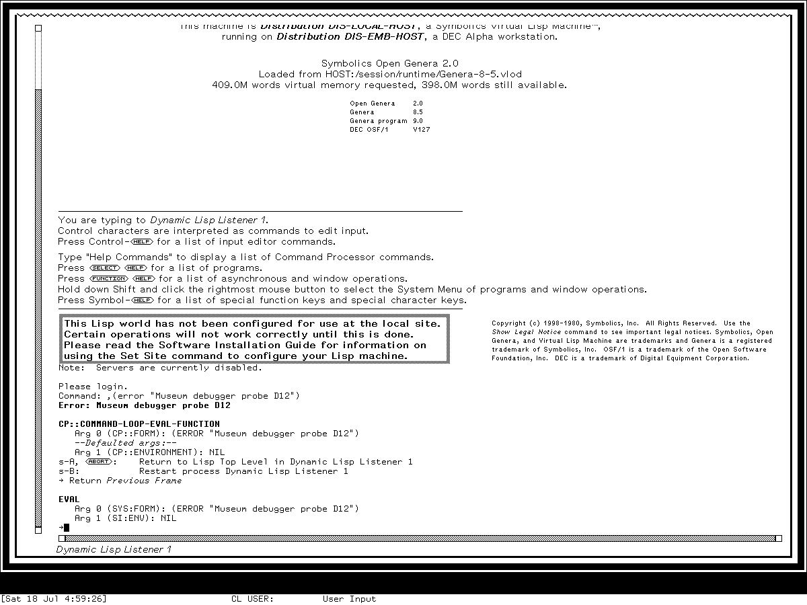
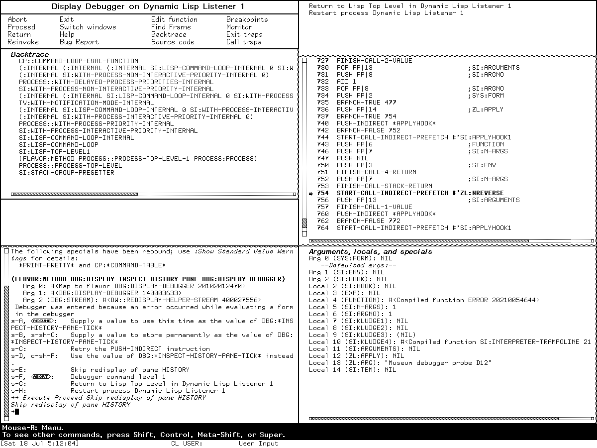

# The Genera Debugger and Display Debugger

Genera has one interactive debugging engine with two principal presentations.
The standard **Debugger** is a Command Processor loop on the error's usable
interactive stream. It reads full English commands, accelerated keystrokes, or
Lisp forms evaluated in the selected stack frame. The **Display Debugger** lays
the same suspended condition, frames, proceed options, source or disassembly,
arguments, locals, inspected objects, and interactor into a Dynamic Windows
program frame.

The Display Debugger is therefore not a second condition system, a copied VM
snapshot, or a standalone activity. The licensed source declares it
nonselectable, allocates it as a temporary reusable resource, shadows the
activity being debugged, and runs the ordinary Debugger command loop inside
that frame. Its buttons, panes, presentations, and incremental redisplay are a
structured view over live suspended execution.

The MIT predecessors are documented in
[The MIT CADR Error Handler and Window Debugger](../mit-cadr/error-handler-and-debuggers.md).
The path used when normal streams or windows are unsafe is documented in
[Emergency Break and the cold-load stream](../emergency-break-and-cold-load-stream.md).

## Evidence and rights boundary

The user-facing manual is the publicly readable Symbolics *Program Development
Utilities* manual for Genera 8. It describes the standard Debugger in depth and
contains a printed alphabetical summary of its commands. It mentions and
enters the Display Debugger, but does not supply a comparable pane-and-gesture
reference. That missing visible behavior was reconstructed from the licensed
Genera 8.5 source and then checked in the user's licensed world.

No licensed source or help payload is reproduced here. The following table
records only filenames, byte counts, hashes, and original analysis sufficient
to identify the local evidence.

| Local licensed source | Bytes | SHA-256 | Evidence used |
| --- | ---: | --- | --- |
| `debugger/defs.lisp.~107~` | 16,053 | `849db8c65d75f1baa8e5e377e8d4e2eb82400cb14bc7c13c3672757345087e97` | state, recursive levels, thresholds |
| `debugger/debugger.lisp.~784~` | 99,026 | `0f12aed40337a76298f42ba16fe3e23723ac005e34a63927c0dbff8b6c91e600` | stream selection, invocation, command loop, help |
| `debugger/commands.lisp.~19~` | 91,999 | `4fa991a004df4cd7c0976f2253b9be8fcb334cb2f3c3b5bffaa80735da1988ec` | frame, code, transfer, trap, and evaluation commands |
| `debugger/display-debugger.lisp.~38~` | 45,535 | `c6802ce33704f5495ba255949034b1a600aa79c21c32876fde835665930177f2` | frame layout, buttons, gestures, menus, redisplay |
| `debugger/debugger-help.lisp.~34~` | 15,121 | `106c8f379e8cb9fecc75c79d53e639eda6719c45873f87d5bdc90aeb1d48f43f` | in-system standard Debugger help |
| `debugger/lisp-support.lisp.~44~` | 38,248 | `19da8e95088f19d58af15b58fb28bbd4127da1034d1501c2b720b21e538a8e99` | Lisp frame and lexical-environment support |
| `debugger/analyze.lisp.~16~` | 20,375 | `75dc075191ccb51a039717c67a82ad504adee1f63542fc01a057d11db2af4cb3` | frame analysis |
| `debugger/stepper.lisp.~7~` | 35,960 | `6e7bbdb140bcee4f8696457699d2b3b70fe67d0907d4fbab4259e68a87d1bc90` | stepping machinery |
| `debugger/imonitor.lisp.~5~` | 75,854 | `19663258623c7010a9bf2a9bf11abd9899de1406e0775ad1d891aba606d68c9d` | monitored-location implementation |
| `cp/debug-commands.lisp.~23~` | 37,591 | `a4ee47f2e64834cfb3a8a996b0fe505e9edf514191d7ef4effa7e7521ff32b67` | global breakpoint and source commands |

The downloaded reference PDF was 2,292,247 bytes with SHA-256
`2c6e23e4a0f969cb7962b71f0ed0eb390b47e394195f6ed9e7a862ba33914d6f`.
It was verified 2026-07-18. The purchased archive, world, extracted source, and
raw screenshots remain untracked.

## From condition to debugger

The condition system decides whether the Debugger is needed. Handlers see a
condition object; if none handles it, the debugger receives that object along
with the stack and the available restart/proceed machinery. Proceed choices
are assembled dynamically from the condition, handlers, and special commands.
That is why a Debugger opening prints a set of choices whose meanings vary by
error rather than relying on one fixed restart menu.

The Debugger then:

1. invokes the one-shot `*debugger-hook*`, rebinding it to prevent accidental
   recursion through the same hook;
2. chooses `*debug-io-override*` if present, otherwise the failing program's
   `debug-io`, and tests whether the resulting stream and window are usable;
3. falls back to the cold-load stream for noninteractive, recursive, or damaged
   window cases;
4. selects the innermost and current language-specific stack frames;
5. constructs condition-specific proceed accelerators and special commands;
6. reads either accelerated commands, full CP commands, or forms;
7. evaluates forms in the current frame's lexical environment by default and
   preserves all returned values; and
8. ends only when a proceed/restart, return, reinvocation, throw, abort, or
   outer recovery operation transfers control.

Before the full command loop, selected conditions can be offered through a
small temporary proceed menu. The source excludes unsuitable cases such as the
cold-load stream, remote terminals, break conditions, and recursive debugging.
This is a convenience path over the same condition choices, not a separate
debugger.

### Recursive-failure ladder

The source defines explicit debugger-depth thresholds. At depth 15 it forces
the cold-load stream; at 20 it requests a break; at 25 it invokes Emergency
Break; and at 30 it halts. These numbers are source-visible safety policy, not
normal user workflow. They show that Genera treats failure of the debugger
itself as a staged degradation problem rather than assuming Dynamic Windows is
always available.

## Entry and exit paths

| Path | Meaning |
| --- | --- |
| Unhandled condition | normal automatic entry after handlers decline the condition |
| `m-SUSPEND` | enter while a program is waiting for terminal input |
| `c-m-SUSPEND` | force immediate entry in a running program |
| `break` or `zl:dbg` | deliberate programmatic debugging entry |
| Abort or Control-Z | abort the failing action to the prior command level/debugger, subject to the active abort choice |
| Resume | choose the default proceed/restart action if one exists |
| `:Display Debugger` or Control-Meta-W | replace the ordinary stream presentation with the Display Debugger |
| End in the Display Debugger | return to the ordinary Debugger while retaining the error context |
| **Switch windows** | temporarily select the shadowed failing activity; Function-S returns to the Display Debugger |

Suspend, Abort, Resume, End, and Function are Symbolics keyboard character
names. Host X11 keysyms in the museum harness are a separate layer and are
reported with the runtime evidence.

## The standard Debugger interaction model

The standard prompt is a right arrow. A colon starts a full CP command such as
`:Show Backtrace`; an accelerator can invoke the same command directly; a Lisp
form is evaluated in the selected frame. Output is presentation-sensitive, so
stack frames, functions, values, and source objects can carry pointer gestures
appropriate to their types.

Evaluation normally inherits the current frame's lexical environment. The
`:Use Dynamic Environment` / `:Use Lexical Environment` toggle changes that
choice. The Debugger protects its own streams, history variables, hooks, and
condition machinery from the borrowed environment. Recursive errors from a
typed form create another debugger level rather than silently corrupting the
first.

The manual says Control-Help lists all commands and accelerators; plain Help is
a shorter introduction. Source further routes Help through a separate Dynamic
Windows help display when the Display Debugger is active.

## Complete printed Debugger command inventory

This table covers every command in the Genera 8 printed “Summary of Debugger
Commands.” Accelerators are stated where the summary gives one. Commands
without a fixed key remain available by their colon-prefixed CP names and, in
some contexts, presentations or Display Debugger menus.

| Full command | Accelerator(s) | Purpose |
| --- | --- | --- |
| `:Abort` | Abort, Control-Z | abandon the failing action to the applicable outer handler/command loop |
| `:Analyze Frame` | Control-Meta-Z | identify the erroneous frame and associated source |
| `:Bottom Of Stack` | Meta-`>` | select the least-recent frame |
| `:Clear All Breakpoints` | — | remove all breakpoints from a chosen compiled function |
| `:Clear Breakpoint` | — | remove one compiled-code breakpoint |
| `:Clear Trap On Call` | Control-X Control-C | clear the selected call trap |
| `:Clear Trap On Exit` | Control-X Control-E | clear selected or all exit traps |
| `:Describe Last` | Control-Meta-D | describe the most recently displayed value and retain it in `*` |
| `:Disable Aborts` | — | suppress the Debugger Abort command |
| `:Disable Condition Tracing` | Control-X T | stop tracing signalled conditions |
| `:Edit Function` | Control-E | visit current or selected function in Zmacs |
| `:Enable Aborts` | — | restore the Abort command |
| `:Enable Condition Tracing` | Control-X T | trace conditions to debug handler behavior |
| `:Find Frame` | Control-S | search function names and select a matching frame |
| `:Help` | Control-Help | list commands, descriptions, and accelerators |
| `:Mail Bug Report` | Control-M | open mail with system identity, error, and backtrace |
| `:Monitor Variable` | — | trap on selected accesses to a special variable/location |
| `:Next Frame` | Line, Control-N, Meta-N, Control-Meta-N | move toward less-recent callers with differing detail/visibility modes |
| `:Previous Frame` | Return, Control-P, Meta-P, Control-Meta-P, Control-Meta-U | move toward more-recent callees or normalize to an interesting frame |
| `:Proceed` | Resume | perform the default available proceed/restart action |
| `:Proceed Trap On Call` | Control-X Meta-C | resume and trap at the next function call |
| `:Reinvoke` | Control-Meta-R | retry the function represented by the current frame |
| `:Restart Trap On Call` | Control-X Control-Meta-C | reinvoke and trap at the next call |
| `:Return` | Control-R | make the selected frame return requested value(s) |
| `:Set Breakpoint` | — | replace a compiled instruction with a Debugger breakpoint |
| `:Set Current Frame` | mouse selection | make a presented stack frame current |
| `:Set Stack Size` | — | set Control, Binding, or Data stack capacity |
| `:Set Trap On Call` | Control-X C | trap at the next call from the current frame |
| `:Set Trap On Exit` | Control-X E | trap when current or selected outer frames exit |
| `:Show Arglist` | manual: Control-X Control-A | display the current function's lambda-list; see discrepancy below |
| `:Show Argument` | Control-Meta-A | display one or all arguments |
| `:Show Backtrace` | Control-B, Meta-B, Control-Meta-B | brief, detailed, or full stack views |
| `:Show Bindings` | Control-X B | display special bindings for one or more frames |
| `:Show Breakpoints` | — | list compiled-code breakpoints |
| `:Show Catch Blocks` | — | show active catch/unwind blocks |
| `:Show Compiled Code` | — | disassemble current or selected function |
| `:Show Condition Handlers` | — | show handlers active around selected frames |
| `:Show Frame` | Refresh, Control-L, Meta-L | redisplay the current frame at selected detail |
| `:Show Function` | Control-Meta-F | display the current function object/name |
| `:Show Instruction` | Control-Meta-I | display trapped or next instruction |
| `:Show Lexical Environment` | — | display bindings inherited from lexical ancestors |
| `:Show Local` | Control-Meta-L | display one or all locals |
| `:Show Monitored Locations` | — | list active location monitors |
| `:Show Proceed Options` | — | redisplay current proceed and restart choices |
| `:Show Rest Argument` | — | display and format the current `&rest` argument |
| `:Show Source Code` | Control-X Control-D | display available source for a function |
| `:Show Special` | — | display a special variable in the selected frame's environment |
| `:Show Stack` | — | show local and temporary stack slots |
| `:Show Standard Value Warnings` | — | explain debugger-relevant nonstandard special bindings |
| `:Show Value` | Control-Meta-V | display one or all outgoing return values |
| `:Single Step` | Control-Shift-S | execute one instruction at a time while stepping over calls |
| `:Symeval In Last Instance` | Control-X Control-I | interpret a symbol as an instance variable in the last shown instance |
| `:Throw` | Control-T | evaluate a tag and value, then perform a nonlocal throw |
| `:Top Of Stack` | Meta-`<` | select the error/most-recent frame |
| `:Unmonitor Variable` | — | remove one or all special-variable monitors |
| `:Use Dynamic Environment` | Control-X I | evaluate subsequent forms outside the selected lexical environment |
| `:Use Lexical Environment` | Control-X I | restore selected-frame lexical evaluation |
| `:Display Debugger` | Control-Meta-W | enter the pane-oriented interface |

### Source-visible additions and one manual discrepancy

The Genera 8.5 command source establishes several effective accelerators or
commands that the printed alphabetical summary does not enumerate:

| Source-visible control | Meaning |
| --- | --- |
| Meta-Shift-N / Meta-Shift-P | move next/previous while explicitly including invisible frames |
| Control-Space | push or pop the current-frame selection PDL |
| Control-Meta-Space | exchange current frame with the frame PDL |
| Control-Shift-B / Meta-Shift-B | brief or invisible-frame backtrace variants |
| Control-Shift-E | explicitly read and evaluate a form in the debugger |
| Control-X Control-A | show all argument values |
| Control-X Control-L | show all local values |
| Control-X Control-R | show the `&rest` argument |
| Control-X D | show compiled code |
| End | leave the Display Debugger for the ordinary error context |

The source binds **Show Arglist** to Control-Shift-A, while Control-X Control-A
invokes **Show Argument** with `:all`. The printed manual assigns Control-X
Control-A to **Show Arglist**. This is retained as a manual/source discrepancy;
without a direct runtime keystroke test, neither is silently rewritten into the
other.

Some additional commands are presentation translators or Display
Debugger-only menu targets—such as showing a pointed function's arguments,
returning or reinvoking an arbitrary pointed frame, choosing source versus
compiled code, and choosing ordinary versus invisible backtraces. They are
visible in the relevant context but are not claimed to be members of the
printed standard summary.

## Debugger evaluation functions

The manual exposes functions specifically for forms evaluated in the Debugger:

| Function | Read behavior | Mutation behavior |
| --- | --- | --- |
| `dbg:arg` | argument by name or number | `(setf (dbg:arg ...) ...)` changes the live frame slot |
| `dbg:loc` | local by name or number | its `setf` changes the live local slot |
| `dbg:fun` | current function object | its `setf` replaces the frame's function object |
| `dbg:val` | numbered outgoing value | its `setf` changes the value the frame will return |
| `dbg:monitor-location` | establish a locative monitor for reads, writes, binding tests, unbinding, or locating | changes monitoring state and causes future Debugger entry |
| `dbg:monitor-instance-variable` | monitor one instance slot | same selected access classes |
| `dbg:unmonitor-location` | identify a monitored locative | removes its monitor |

These APIs make the debugger an execution-control environment, not a passive
viewer. Museum runtime checks avoid all mutation and monitoring operations.

## Display Debugger architecture and layout

The frame has eight named pane specifications arranged as two columns:

| Left column | Right column |
| --- | --- |
| title | proceed options |
| four-by-four command buttons | source or compiled code |
| backtrace | arguments, locals, and specials |
| inspect history | — |
| interactor | — |

The title identifies the activity whose window is shadowed. Selecting a
backtrace frame updates the shared current-frame state; the proceed, code, and
argument panes are then incrementally redisplayed. The inspect history retains
complex objects reached through presentations or description. When source is
available, forms in the code pane are themselves presentations; otherwise the
pane shows disassembly.

The interactor is the ordinary Debugger reader. Every normal Debugger keyboard
command remains usable there. Display Debugger entry is restricted to the main
console and rejected recursively. While the frame is active, its default policy
disables Abort to reduce accidental loss of the suspended computation; the
button path can still invoke the Debugger's applicable abort choice.

## Complete Display Debugger button and gesture inventory

The following matrix is exact for the inspected Genera 8.5 source. “Middle” and
“right” denote distinct Dynamic Windows gestures, not generic context-menu
conventions inferred from modern systems.

| Button | Left | Middle | Right |
| --- | --- | --- | --- |
| **Abort** | abort the failing action | — | — |
| **Proceed** | default proceed choice | — | — |
| **Return** | return from current frame | return from an arbitrary selected frame | — |
| **Reinvoke** | reinvoke current frame | reinvoke an arbitrary selected frame | — |
| **Exit** | leave Display Debugger, retain ordinary error context | — | — |
| **Switch windows** | select the shadowed original activity | — | — |
| **Help** | show Display Debugger help | — | — |
| **Bug Report** | create report with error/backtrace | — | — |
| **Edit function** | edit current/selected function | — | — |
| **Find Frame** | prompt and search | repeat the previous search | — |
| **Backtrace** | ordinary backtrace | include invisible frames | choose from a menu |
| **Source code** | display source | display compiled code | choose from a menu |
| **Breakpoints** | show breakpoints | clear all breakpoints | breakpoint menu |
| **Monitor** | show monitored locations | — | monitor menu |
| **Exit traps** | set current-frame exit trap | clear current-frame exit trap | exit-trap menu |
| **Call traps** | set a call trap | clear the call trap | call-trap menu |

The right-button submenus are also source-complete:

| Menu | Items |
| --- | --- |
| Breakpoints | **Set breakpoint**, **Clear breakpoint**, **Clear all breakpoints**, **Show breakpoints** |
| Monitor | **Monitor variable**, **Unmonitor variable**, **Unmonitor all variables**, **Show monitored locations** |
| Exit traps | **Set trap on exit**, **Set trap on exit (all frames)**, **Clear trap on exit**, **Clear trap on exit (all frames)** |
| Call traps | **Set trap on call**, **Clear trap on call**, **Proceed trap on call**, **Restart trap on call** |
| Source or compiled code | **Display source code**, **Display compiled code** |
| Backtrace type | **Display ordinary backtrace**, **Display invisible backtrace** |

### Pane presentations and pointer operations

- Left on a backtrace frame makes it current; right asks for the complete
  stack-frame gesture set.
- Proceed-option presentations invoke the selected proceed/restart directly.
- Inspect-history entries can be selected for reexamination.
- Source forms carry language-aware presentations when source information is
  available.
- Control-Meta-right on an argument or local value can replace the live slot.
- The interactor accepts mouse-selected objects wherever the command's
  presentation type permits them.

The source's pane updater uses separate redisplay ticks for the backtrace,
condition, proceed choices, source/code, arguments/locals, and inspect history.
This is why changing the current frame need not repaint the whole screen.

## What changed from the MIT window debugger

| Aspect | MIT System 46/303 | Genera 8.5 |
| --- | --- | --- |
| Error model | ETEs in System 46; condition flavors and resume handlers in System 303 | mature condition/restart substrate with language abstraction |
| Ordinary command language | primarily single-character dispatch | full CP commands plus accelerators and forms |
| Graphical frame | constrained window with one command menu and embedded Inspector | Dynamic Windows program frame with presentations, incremental redisplay, and sixteen multi-gesture buttons |
| Relationship to ordinary debugger | alternate window command loop over same stack | explicitly shares the ordinary command table/loop and shadows the failing activity |
| Proceed presentation | fixed Continue in System 46; condition menu on System 303 Proceed right gesture | dedicated proceed-options pane plus Proceed button |
| Source/code view | Inspector-backed stack-frame object/disassembly | language-sensitive source presentations with compiled-code fallback |
| Debug instrumentation | traps, breakpoints, stepping mature in System 303 | adds CP commands, condition tracing, memory monitors, frame analysis, and richer source transfer |

The strongest continuity is the live-frame model: in every generation, the UI
looks at a suspended computation and can change it. The strongest interface
change is that Genera turns that model into typed CP commands and Dynamic
Windows presentations rather than one fixed character table and menu pane.

## Findings not evident from the public manual

- The Display Debugger is declared nonselectable and has no process or Select
  key of its own. It temporarily shadows the failing activity.
- Its panes share the ordinary Debugger state and command loop; it is not a
  second debugging engine.
- Main-console-only and no-recursion checks are explicit at entry.
- The sixteen button labels hide twenty-nine distinct gestures before counting
  submenu entries.
- The source/compiled, ordinary/invisible backtrace, trap, breakpoint, and
  monitor choosers are separate command menus.
- End exits only the Display Debugger. This is the Genera counterpart of System
  303's **Exit Window EH**, not an Abort.
- Arguments and locals in the pane are mutable through a Control-Meta-right
  presentation gesture.
- The source maintains per-pane redisplay ticks and cached displayed-code state.
- The standard manual's Show Arglist accelerator disagrees with the inspected
  source, as documented above.
- The recursive-failure thresholds form an explicit degradation ladder ending
  in a halt.

## Runtime observation: Genera 8.5

The fresh `debuggers-d12-genera-20260718` session booted the licensed Genera
8.5 world into `Dynamic Lisp Listener 1`. The listener evaluated the
project-authored probe `,(error "Museum debugger probe D12")`. The ordinary
Debugger then displayed the exact error text, selected
`CP::COMMAND-LOOP-EVAL-FUNCTION`, printed its arguments and defaulted
environment, and constructed two condition-specific Super choices: return to
the listener's Lisp top level, or restart the listener process. This directly
confirms that the opening choices are derived from the live condition rather
than one fixed menu.

Entering `(+ 40 2)` at the arrow selected the Debugger's **Eval** operation,
printed `42`, and advanced the visible frame display to `SI::EVAL`. No guest
state was changed by the form. A later clean `:Abort` returned to
`Dynamic Lisp Listener 1` and printed the transfer back to its Lisp top level.

*Runtime observation: this exact Genera 8.5 display records the ordinary
Debugger before any proceed or mutation on 2026-07-18. It is published as the
minimum visual evidence for its live condition choices and text-oriented frame
view; Symbolics retains interests in the licensed historical software, and
inclusion implies no endorsement.*

### Display Debugger entry caveat and live layout

The harness's attempted host Control-Meta-W translations did not produce a
claimed guest accelerator event, so this run does not call that keystroke
runtime-confirmed. A typed evaluation of
`(dbg::com-enter-display-debugger)` did enter the pane-oriented frame, but it
also demonstrated why evaluating a command implementation in the selected
error frame is not equivalent to invoking the command through the Debugger
command loop. The selected frame did not contain the Debugger loop's dynamic
binding for `DBG::*INSPECT-HISTORY-PANE-TICK*`; redisplaying the history pane
therefore signalled a nested unbound-variable condition. Source places that
binding around the ordinary command loop, which accounts for the observed
difference without treating the evaluated implementation call as a supported
entry path.

Even in that bounded failure state, the live frame verified the source-derived
layout: the title named `Dynamic Lisp Listener 1`; the complete four-by-four
button matrix was visible; the proceed choices occupied the upper-right pane;
the backtrace and history/interactor occupied the left; and disassembly plus
arguments, locals, and specials occupied the right. The nested condition added
temporary choices to supply or store a tick, retry, skip the history-pane
redisplay, abort the Debugger command level, return to Lisp top level, or
restart the listener. Pointer help identified the presented **Skip redisplay
of pane HISTORY** choice; taking it returned control to the Display Debugger
interactor. Clicking **Exit** then restored the ordinary Debugger while
retaining the original synthetic error context. No proceed, frame mutation,
return, reinvocation, monitor, breakpoint, or trap operation was performed.

This is an evidence-bounded result: the pane structure and Exit semantics are
runtime-confirmed, while normal Control-Meta-W entry remains source/manual-
established and needs a future verified host-to-Symbolics modifier mapping.
The nested tick error is evidence about the deliberately evaluated internal
entry function, not a claim that supported Display Debugger entry normally
fails.

*Runtime observation: this exact pane-oriented state on 2026-07-18 establishes
the Display Debugger's visible organization and the retained synthetic error
context after the explicitly documented internal-entry caveat. It is published
for interface analysis rather than decoration; Symbolics retains interests in
the licensed software, and inclusion implies no endorsement.*

### Capture selection and portable provenance

The ordinary-Debugger and Display-Debugger captures above passed an image- and
use-specific review and were copied byte-for-byte into the curated Genera asset
tree. These two monochrome functional displays are the minimum images needed to
compare the distinct interfaces beside substantial source-, manual-, and
runtime-grounded analysis. They expose no private user data, manual pages,
artwork, or third-party media and are unlikely to substitute for the licensed
system. All other captures remain ignored raw session evidence.

| State | PNG SHA-256 | Pixel SHA-256 |
| --- | --- | --- |
| ordinary Debugger; curated as `debugger-dynamic-choices.png` | `2b768105e7f32ded7bfc746669184d7e0d46fcc683d2c97217d94afbfe88044d` | `770360dcb7b9b46f454e1314c58b7d3794ab1b0bb109dfa2aefe675d27a73134` |
| side-effect-free evaluation and `42` | `06f9369abe03f376a3e15fc347a2565f7b3141e695c1bd40f944bb2a32e278fe` | `2bdb0ef792a03a69e81602a5da22d3cfc1c2fd27cc7d11fd4db51321cd6e43b6` |
| Display Debugger with the nested tick condition | `c3f7fb11f3c4f9b83542a7378d06bf1e06d58cb69b398e9f21689643bbe05a0a` | `6cd88c7652f4e2f7333318bc6fdb2bff5b4005fedbe2a8152c4fab7fa112f9e2` |
| Display Debugger after skipping history redisplay; curated as `display-debugger-layout.png` | `cf6f7a40fc8cf47317e386c85fc9055edb12d7971e9031d9d9877914a3ca94ba` | `d8a52573ebd410c456cc2b2a0adcf22dbcb8bf736e1d1b5aef4f488fe01e770a` |
| ordinary Debugger restored by **Exit** | `8e843c6fcb70d59f9c04267ca0cbcf640b3db0e60c87a12851e3e9928d7fcfd8` | `083fdcbb3094d5d2fee9f569b459c35a9749d1b19f731889973d318573a7f6a5` |
| listener restored by `:Abort` | `d17c227bd7139662bba7b9b7c344509bc5e1843b9da288631a61c57a1591558a` | `3269547bb61ec3e1ad6edc693ea71fa0525219d6b3ea9ed01d88a73bbdf34c08` |

Generation 2 ran from 2026-07-18 04:55:22 through 05:18:00 EDT on
display `:200`; the selected window was XID 4194310, titled `Genera on
DIS-LOCAL-HOST`, at 1200 by 900 pixels. The licensed world was 54,804,480
bytes with SHA-256
`a8ee5e86cc7e322f7385af3e0cd579d7650d4dcfc3ce328acbf8b25515dd0672`;
the VLM and debugger hashes were respectively
`9f5e18d5770f973879716182b6856ef5a8ee9d3b2bb907476ea0cf35986aa4c7`
and
`2db918cfe8f35f52c7ff4b7695b0ecd3bb85e41a3327ea5a94874edf05edb54a`.
The purchased archive was 206,213,430 bytes with SHA-256
`89fb3e76b91d612834f565834dea950b603acf8f9dbacacdd0b1c3c284a2d36e`.

The generation-scoped action record contains 80 linked intent/outcome entries
and has SHA-256
`c865f298f1710ffd67237ed52a6a7abd8fc72dba38e37a6b8387483e09b96386`.
It retains the unsuccessful key and command-entry probes as well as the
successful synthetic error, evaluation, internal entry-function evaluation,
presented skip choice, Display Debugger Exit, and final Abort. The same session
also contains a separately scoped non-mutating Screen Editor menu capture; it
is not evidence for this debugger article. The final run record has SHA-256
`e83a9a7896b44b028d115f0da452b35f38d841bfeead1b805439814984688e03`.

The sandbox had no default or external route and no guest-visible host file
service. It exposed only the private writable runtime, exact X socket and
helpers, and a read-only Guix store. Xvfb did not advertise MIT-SHM. Both exact
guest X substitutions and the single local RFC 868 request/reply were observed;
the responder exited zero. Toolchain provenance used Guix commit
`230aa373f315f247852ee07dff34146e9b480aec`, manifest SHA-256
`3adae999bbe420182f22adc2499fcc82449a46eaf580a362de9c0e718fa6b37d`,
and Python 3.11.14.

Shutdown reached the prompt, sent `yes`, observed acceptance and cleanup
progress, and then encountered the already documented Cold Load channel mutex
stall. The bounded harness therefore forced the VLM after the confirmed stall;
`forced_stop` and `state_may_be_incomplete` are true and
`orderly_vlm_host_shutdown` is false. The base world hash was unchanged. The
harness did not invoke Save World or create a process checkpoint;
`save_world_performed` and `guest_checkpoint_created` remain unknown rather
than being inferred from shutdown behavior.

## Limits and open questions

- “Complete” for the standard Debugger means the printed Genera 8 command
  summary plus the explicitly enumerated source additions. Condition-specific
  proceed commands are dynamic by design and cannot be assigned one fixed list.
- No licensed source or decoded help text is tracked. Hashes identify the local
  evidence without redistributing it.
- The Display Debugger manual reference does not fully describe its layout or
  gestures; those claims depend on local source and the bounded runtime check.
- The Show Arglist accelerator discrepancy requires a dedicated direct
  keystroke test before either mapping can be called runtime-confirmed.
- Mutation, monitoring, breakpoints, traps, returns, and reinvocations are
  source/manual-established but intentionally not exercised on the preserved
  world.
- The two selected captures are publication-reviewed for these documentary uses
  only. Remaining raw captures are not thereby publication-ready.

## Sources

Public documentation link verified 2026-07-18.

- Symbolics,
  [*Program Development Utilities*, Genera 8](https://bitsavers.org/pdf/symbolics/software/genera_8/Program_Development_Utilities.pdf),
  printed pages 182–245, especially the overview, command descriptions, printed
  summary, and Debugger evaluation functions.
- Licensed Genera 8.5 source files identified by filename, byte count, and hash
  in the evidence table above; inspected locally 2026-07-18 and not
  redistributed.
