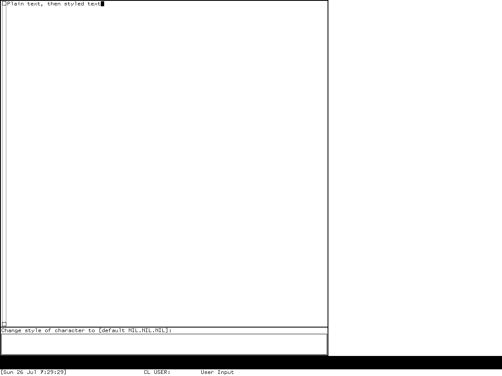

# Inks, faces, and character styles in Symbolics Genera

Genera does not have one unified “ink and face” facility. It has several related
layers that must be kept distinct:

1. a **character style** is a semantic `(family, face, size)` description attached
   to text;
2. a display device resolves that description to a concrete raster font;
3. TV and Dynamic Windows carry character styles through streams and redisplay;
4. native graphics use Boolean raster operations, colors, stipples, tiles, and
   opacity-like opaque/transparent pattern behavior; and
5. CLIM II supplies a separate, more general algebra of designs and inks through its
   Genera port.

This separation is the central finding. A face such as `:BOLD` is not a bitmap, an
RGB color, a stipple, or a CLIM ink. It is one component of a semantic text style.
Likewise, a Dynamic Windows drawing `:PATTERN` is not automatically a CLIM pattern
design. The shipped conversion tool translates between some of these vocabularies,
which is evidence that they are adjacent systems rather than one object model.

## Evidence profile and terminology

The selected profile is the licensed Open Genera 2.0 media's Genera 8.5 world and
selected source tree. Source claims below come from the exact artifacts in the
[provenance table](#preservation-record). Runtime claims apply only to world
`a8ee5e86…0672`, observed through the isolated Xvfb harness on 2026-07-26. No
licensed source or extracted font data is reproduced here.

| Term | Meaning in this article |
| --- | --- |
| character style | Interned semantic triple of family, face, and size, plus an implementation slot for extended attributes |
| family | Broad typographic family such as fixed-width, sans serif, or serif |
| face | Variant such as roman, bold, italic, or condensed |
| size | Absolute named size or relative transformation such as smaller |
| font | Device-specific raster font object selected after style resolution |
| native ink | Informal umbrella here for Dynamic Windows/TV raster ALUs, colors, and patterns; it is not a source-defined common class |
| CLIM ink/design | CLIM II's portable design algebra, including colors, opacity, patterns, and composites |

The source structure does contain an `extended-attributes` slot, but its own merge
routine says it does not handle that slot. This article therefore does not invent an
underline, strikeout, weight-axis, or other extended-attribute protocol.

## Character styles are semantic and interned

`SYS2; CHARACTER-STYLES` defines a permanent named structure with `family`, `face`,
`size`, `index`, and `extended-attributes` slots. Styles are interned by the first
three components. A 256-entry table assigns compact indices suitable for styled
“fat” characters; index zero is the null style `(NIL NIL NIL)`.

The initial vocabulary is:

| Component | Initial accepted values |
| --- | --- |
| family | `NIL`, `:FIX`, `:SWISS`, `:JESS`, `:EUREX`, `:DUTCH`, `:HANDWRITTEN`, `:DEVICE-FONT` |
| face | `NIL`, `:ROMAN`, `:BOLD`, `:ITALIC`, `:BOLD-ITALIC`, `:UPPERCASE`, `:BOLD-EXTENDED`, `:CONDENSED`, `:EXTRA-CONDENSED` |
| size | `NIL`, `:SMALLER`, `:SAME`, `:BIGGER`, `:LARGER`, `:TINY`, `:VERY-SMALL`, `:SMALL`, `:NORMAL`, `:STRETCHED`, `:LARGE`, `:VERY-LARGE`, `:HUGE` |

Compatibility parsing canonicalizes `:SANS-SERIF` and `:HELVETICA` to `:SWISS`,
and `:SERIF` and `:TIMES-ROMAN` to `:DUTCH`. Device mappings also use
`:CONDENSED-CAPS` and `:BOLD-CONDENSED-CAPS`; the implementation can extend each
component registry, so the initial lists are not a closed ontology.

An invalid component signals a typed condition. Its interactive recovery choices
include using the value once, registering a new component, making the value valid,
replacing the whole style, or continuing with an undefined style. Programmatic
extension points are `ADD-CHARACTER-STYLE-FAMILY`, `-FACE`, and `-SIZE`.

### Exact merge behavior

`MERGE-CHARACTER-STYLES` overlays a style on a default:

- a null style returns the default;
- a `:DEVICE-FONT` style wins directly;
- each non-null family or face replaces the corresponding default component;
- null and `:SAME` sizes inherit;
- `:SMALLER` steps down and `:BIGGER` or `:LARGER` steps up the absolute size
  sequence, clamping at `:TINY` and `:HUGE`; and
- when the default is a device font, only a fully specified absolute semantic style
  displaces it. A relative or incomplete overlay retains the device font.

For example, merging `(NIL :BOLD :LARGER)` over
`(:SWISS :ROMAN :NORMAL)` produces `(:SWISS :BOLD :LARGE)`. Repeated relative
merges are therefore stateful transformations of the current effective size, not
stored scalable-font instructions.

## Resolution to a real font

Each display or output device owns mappings from character set and character style
to either:

- a concrete font;
- a `(:FONT ...)` indirection; or
- a `(:STYLE ...)` indirection that merges another semantic style and resolves
  recursively.

A wildcard size mapping may cover otherwise unmapped sizes. Character sets that do
not carry styles fall back to `(:FIX :ROMAN :NORMAL)`. Missing resolution signals
`NO-CHARACTER-STYLE-MAPPING`; recovery can select a replacement style, undefined
style, another font, or font substitution. Successful recovery is cached. Global and
per-device invalidation ticks prevent stale caches after mapping changes.

The `:DEVICE-FONT` family is an explicit escape hatch: its face slot names a literal
font and its size is `:NORMAL` or wildcard. `CHARACTER-STYLE-FOR-DEVICE-FONT` and
font backtranslations bridge concrete fonts back to styles. Undefined styles map to
a box-font stand-in rather than silently selecting an arbitrary ordinary face.

### Built-in monochrome mapping profile

The source-defined black-and-white device mappings establish these families:

| Semantic family | Mapped sizes and representative fonts |
| --- | --- |
| `:FIX` | tiny `TINY`; very small `EINY7` variants; small `TVFONT` variants; normal `CPTFONT` variants; large `MEDFNT` variants; very large `BIGFNT` variants |
| `:SWISS` | very small `HL8`; small `HL10` variants; normal `HL12` variants and condensed-cap forms; large `HL14`; very large `SWISS20` |
| `:DUTCH` | very small `TR8`; small `TR10`; normal `TR12`; large `DUTCH14`; very large `DUTCH20` |
| `:JESS` | small, normal, and large roman/bold/italic `JESS11`, `JESS13`, and `JESS14` families |
| `:EUREX` | very-large and huge italic `EUREX21I` and `EUREX24I` |

The exact FIX normal faces include roman, italic, bold, bold-italic,
bold-extended, condensed, and extra-condensed mappings. Mouse, arrow, and symbol
character sets have their own fonts. This is a raster-font mapping table, not a
vector-font selection or synthetic slant/weight engine. See
[the resident-font catalog and extractor](extracting-resident-fonts.md) for the
separate artifact analysis.

Other devices can preserve the semantics while changing the concrete font. The
selected tree contains separate mappings for printers, NSage, and Macintosh display
devices. Hardcopy therefore need not use the same bitmap that a screen uses.

## How applications carry styles

TV sheets have default, current, and merged character styles. The compatibility
default font is `FONTS:CPTFONT`, while the semantic screen default is
`FIX.ROMAN.NORMAL`. A sheet validates a new default against its device and updates
line height and redisplay state. Its `WITH-CHARACTER-STYLE` operation merges a nested
style with the current style and then the sheet default, validates outside the
dynamic binding to avoid recursive error handling, and can preserve or rebind line
height and baseline.

Dynamic Windows formatted output stores style with buffered output entries.
`WITH-CHARACTER-FAMILY`, `WITH-CHARACTER-FACE`, `WITH-CHARACTER-SIZE`, and
`WITH-CHARACTER-STYLE` provide nested semantic changes, and redisplay carries those
styles back through reconstruction. Style is therefore content/display state, not
merely a transient mutation of an X graphics context.

Representative source-defined uses include:

| Area | Use |
| --- | --- |
| menus | `JESS.ROMAN.LARGE` default; a null selected-item style requests inverse video |
| who line | separately configurable mouse-documentation, status, progress, and file-state styles; defaults combine SWISS and FIX condensed forms |
| Flavor Examiner | condensed SWISS body/heading styles and a large italic EUREX title |
| Concordia/NSage | semantic JESS, SWISS, DUTCH, and EUREX roles with screen and printer mappings |
| Joshua | named heading, emphasis, and deemphasis variables using bold and italic faces |
| editors | large JESS/FIX labels and samples in the bitmap, stipple, and font tools |
| hardcopy | per-printer body and heading styles, independently resolved on printer devices |
| CLIM applications | CLIM text styles, adapted through the Genera CLIM port rather than treated as TV font objects |

These are established uses in the selected source. They are not a claim that every
application uses each style or that the table is an exhaustive inventory of every
literal style form in all optional products.

## User customization

### Zmacs text

Zmacs can replace or merge character style over one character, a word, or a region,
and can set the style for subsequently typed text. Replacing installs the selected
style index. Merging preserves existing non-null components and fills or transforms
the remaining components. Thin lines are promoted to styled fat strings when needed.

| Command | Binding | Result |
| --- | --- | --- |
| Change Style Char | `Control-J` | Change the following character or numeric count |
| Change Style Word | `Meta-J` | Change the following word or numeric count |
| Change Style Region | `Control-X Control-J` | Replace the region; a numeric argument requests merge behavior |
| Change Typein Style | `Control-Meta-J` | Change the style of newly inserted text |
| Change One Style Region | named command | Replace only one selected source style within the region |
| Set Default Character Style | named command | Set a fully specified buffer default and optionally update pathname attributes |
| Find Character in Style | named command | Search for the next character in a selected style |
| Show Character | `Control-Shift-J` | Report the character and resolved style/font |
| Show Character Styles | named command | Display styles, resolved fonts, standard samples, and buffer samples as presentations |

The default **Quick** style dispatch is an interaction tree:

```text
Change Style
├── B -> bold
├── I -> italic
├── P -> bold-italic
├── N -> null style
├── S -> smaller
├── L -> larger
├── Meta + dispatch character -> redefine that dispatch
├── Escape -> prompt for one full style
├── Space or Return -> reuse the previous/default choice
├── End -> null style
├── Help -> show the active dispatch table
└── Abort, Control-G, or Rubout -> cancel
```

Control, Super, or Hyper on an ordinary quick-dispatch character is rejected.
`*CHANGE-STYLE-MODE*` selects Quick or Prompt For Name. The editor remembers the
last style for repeat use. `*UPDATE-TYPEIN-CHARACTER-STYLE-WHEN-MOVING*` can be
Disabled, Before, After, or Heuristic, controlling whether movement adopts nearby
text's style. The window-label character style is also a live editor option.

A character-style presentation accepts `FAMILY.FACE.SIZE`, a face alone such as
`ITALIC`, or `DEVICE-FONT.font-name` when allowed. It can derive a style from a
visible character. Its menu offers common fully specified FIX, SWISS, and DUTCH
choices, valid relative combinations, and an **Other** path that independently
chooses family, face, and absolute or relative size. Device-aware completion filters
choices against real mappings.



*Runtime observation, Genera 8.5 world `a8ee5e86…0672`, 2026-07-26. After selecting
Zmacs, the researcher entered a short test line and dispatched the style command
through the Xvfb modifier mapping. Zmacs displayed `Change style of character to
[default NIL.NIL.NIL]:`. This establishes the visible nested prompt and null-style
default, not every completion or menu branch. The screenshot is included for
nonprofit historical analysis under the image-specific fair-use review; Symbolics
retains any copyright interest, and no affiliation or endorsement is implied.*

### Defaults, files, and mail

`Set Default Character Style` updates the buffer property and current sheet, and can
write a `Default-character-style` pathname/file attribute. The older `Fonts`
attribute remains recognized for compatibility. A major mode supplies a default
when the buffer does not.

The string dump stream serializes styled characters with changes in character set,
bits, offset, and family/face/size. Styled output uses the current standard version-2
encoding in the selected source. The default style travels out of band as a file
attribute, while individual characters retain their actual styles. This is why a
styled file is more than plain characters plus a screen preference.

Zmail has parallel persistence: message data can carry character-type mappings and a
`Default-Character-Style` header, and reply, template, export, and undo paths preserve
or change that state deliberately.

### Screen, printer, and application settings

Set Screen Options exposes who-line styles as fully specified, device-valid
character-style values and applies changes live. Hardcopy's
`*HARDCOPY-DEFAULT-CHARACTER-STYLES*` is explicitly intended for init-file
customization. It maps a qualified or unqualified printer name to body/heading
overrides; printer namespace objects also have Body Character Style and Heading
Character Style attributes. The printer device resolves these semantic styles using
its own font map.

Application authors can:

- define new valid family, face, and size names;
- install or remove device mappings and backtranslations;
- use relative style wrappers around formatted output;
- expose device-aware style presentations in accepting-values forms;
- set application or pane defaults; and
- use semantic role variables, as NSage and Joshua do, rather than hard-code concrete
  raster font names.

## Native graphics: colors, ALUs, and patterns

Dynamic Windows' native drawing state includes thickness, scaled thickness, end and
joint shapes, dashing and phase, `:ALU`, `:PATTERN`, `:STIPPLE`, `:TILE`,
`:GRAY-LEVEL`, `:COLOR`, and `:OPAQUE`. Defaults include the drawing ALU, an all-ones
pattern, gray level 1, no explicit color, and opaque pattern behavior.

An array supplied as `:PATTERN` is normalized as a stipple; a color object is
normalized as a color. With an opaque pattern, zero bits clear the destination. With
a non-opaque pattern, zero bits leave it unchanged. This is raster operation
semantics, not alpha compositing.

The selected source defines 37 active named stipples:

- density grays: 50%, 25%, 75%, 33%, HES, 12%, 10%, 9%, 8%, 7%, 6%, and 5.5%;
- directional marks: southeast/southwest dense, thin, and thick hatches, southeast
  and southwest rain, and alternate rain;
- linear patterns: tracks, horizontal/vertical dashes, and horizontal/vertical
  lines; and
- decorative/geometric patterns: bricks, half-bricks, double-bricks, tiles, hearts,
  small and large diamonds, parquet, weave8, weave8b, and filled diamonds.

A stipple records name, density, and X phase. Named registries support lookup, and
gray selection chooses a nearest density. The broader pattern protocol includes
basic, device, raster, raster-slice, and PostScript representations; simple bundles
of drawing arguments; device-conditional patterns; two-color stipples; and
contrasting-pattern selection. Color devices can choose contrasting named colors,
while monochrome devices use gray-pattern logic.

Genera's standard color objects and RGB/IHS/YIQ facilities are documented with the
interactive editor in [Color systems and the Color Editor](../color-systems-and-color-editor.md).
That article also explains why CADR `COLOR-INKS` are a different, earlier indexed
color-map mechanism.

## CLIM inks are a separate compatibility layer

CLIM II defines portable foreground, background, and flipping inks; colors; opacity;
patterns; composite designs; and contrasting inks. It also defines text styles with
family, face, and size components. The Genera CLIM port maps those abstractions onto
its native display and hardcopy facilities.

The source-visible `DW-TO-CLIM` converter makes the boundary concrete:
Dynamic Windows `default-character-style` becomes a CLIM `default-text-style`, and
`WITH-CHARACTER-STYLE` becomes `WITH-TEXT-STYLE`, with corresponding family, face,
and size conversions. A converter would be unnecessary if the two APIs and object
models were identical.

The selected media retain most Genera CLIM medium/design implementation as compiled
VBin rather than readable source. Therefore the exact per-operation mapping from
every CLIM composite design to Genera raster ALUs is a **TODO**, not an inferred
identity. See [CLIM II on Genera](../clim-2-on-genera.md) for the complete facility
and port inventory.

## Preservation and reconstruction implications

- Preserve semantic style indices and the interning/mapping tables, not only rendered
  glyph pixels. The same styled text can legitimately resolve differently on screen,
  Macintosh, and printer devices.
- Preserve file attributes together with styled character data. The default style
  is intentionally out of band.
- Do not turn relative sizes into point sizes without a selected compatibility
  profile; the source uses a finite named ladder with clamping.
- Keep the native raster drawing protocol separate from CLIM's design algebra.
- Preserve stipple dimensions, phase, density metadata, opaque behavior, ALU, and
  device selection. A PNG of one result is insufficient.
- Do not describe Genera as having a general vector-font renderer based on semantic
  family names. The inspected mappings resolve to device fonts, and the resident
  screen fonts recovered from this world are raster fonts.

## Open questions

- Exercise every character-style presentation menu branch in the world, including a
  successful style change, device-font selection, invalid-component restarts, and
  the complete device-filtered menu.
- Load the optional Color Editor in an isolated, provenance-pinned local source
  service and capture one reviewed color/palette state; the base world had no
  registered color screen.
- Determine the exact compiled Genera CLIM medium mapping for composite,
  translucent, and patterned designs without publishing licensed code.
- Test round trips of styled files, Zmail messages, and printer overrides against
  controlled local fixtures.
- Inventory every optional product's added style-family registrations. The present
  survey covers the selected declared source tree but does not claim every separately
  licensed product.

## Preservation record

The source path prefix is the licensed media's `sys.sct/`; paths below are portable
artifact names, not repository links.

| Artifact | Bytes | SHA-256 |
| --- | ---: | --- |
| `sys2/character-styles.lisp.~214~` | 62,211 | `134aa5e2f6060a36dcea8294002a1396e66a44b4e9ec01930b90e754bb045686` |
| `sys2/character-style-presentations.lisp.~64~` | 45,871 | `0649ab332ccd23954b660d31f21766c5cc18e388372f799c4152ea0113630aed` |
| `window/tvdefs.lisp.~488~` | 68,717 | `8d4f22284a36e6e465ffda185279415a00cb3234251a6a769bd260d61ba79a5a` |
| `window/sheet.lisp.~884~` | 125,271 | `7db635e0e45743d1fc1566a62caed9459b21f56fdee62960c4f286dfcfa8b554` |
| `window/wholin.lisp.~361~` | 86,567 | `8898577e729d1353d49c8ca990d229abe387c39e53d1b8b3ce1a8e5d806bbadb` |
| `dynamic-windows/formatted-output.lisp.~397~` | 108,448 | `7317eee2b94d185f6f3ca51feed57a4adec7594760a81c17f7b55b043bb67de0` |
| `dynamic-windows/redisplay.lisp.~185~` | 113,947 | `61134f02a3491966b3f45199af264e622b2004feccc3c2e3263e9866a99b699e` |
| `dynamic-windows/graphics-generics.lisp.~246~` | 182,943 | `76d11cb53809b2b96a07ed654fa57a63f52676a789978396e05a2b03d69576cd` |
| `dynamic-windows/graphics-patterns.lisp.~12~` | 19,323 | `83a6515079302d4fdf7d69fdf4b6b131d619e5edb3c34651effe099fb7a991ac` |
| `zwei/style.lisp.~123~` | 49,844 | `14425902c9cc283588127f811dbcb87004197d40e34a0e19e9fe91fd17f592ca` |
| `zwei/attributes.lisp.~15~` | 47,274 | `7b4cf251d52cfd7761c0db51d239bfb1b6a8dcc0c1ea93f653cce401eccbf5a5` |
| `zwei/macros.lisp.~276~` | 71,023 | `c7db63e24f706e2fa102db25026a8556ebfbc950d18592c0817f7b48274ad59d` |
| `io/string-dump.lisp.~200~` | 75,627 | `00f3a40fafa55f0ff6028d26944ed9dd05b0d0b14ede1cb4d4ad235c98dc4d5c` |
| `window/colors.lisp.~23~` | 41,944 | `5978600d367b50c87134e4f86ddda6bba2f25471251ee02802b0ac474d9aa5e2` |
| `hardcopy/printer.lisp.~1561~` | 38,045 | `cbc0e4d73d9ba35fbb83e40f25be0fd84f8fb0f68b7c75d7149f3c43d36d4fdf` |
| `hardcopy/defs.lisp.~1519~` | 16,767 | `14c3b2c1a266fe0263aa4b323216fc075f38395180b2d62eba484ddd17b7588e` |
| `conversion-tools/dw-to-clim.lisp.~50~` | 123,785 | `46de18026baecae99595c486d973539e24ff467e0082996460d56b88a5446c8c` |

The runtime capture is an exact 1,545-byte, 1200-by-900 grayscale PNG with PNG
SHA-256 `e83d3cd7…cf09` and decoded-pixel SHA-256 `67474be0…bf7e`.
Session `ink-face-20260726`, generation 1, recorded 18 action records with final
action-log SHA-256 `10ca9183…63d3`. The base and private world hashes remained
`a8ee5e86…0672`. Shutdown prompt and confirmation were observed and cleanup began,
but the known VLM cleanup stall required bounded forced termination. The harness did
not invoke Save World or create a host checkpoint; `save_world_performed` and
`guest_checkpoint_created` remain unknown, and the unsaved session state was
discarded.

## Sources

- Symbolics, licensed Open Genera 2.0 / Genera 8.5 media, exact selected artifacts
  above; inspected locally 2026-07-26. No licensed source text or font data is
  reproduced.
- Symbolics, [Genera Concepts](https://bitsavers.org/pdf/symbolics/software/genera_8/Genera_Concepts.pdf),
  for the user-level relationship among fonts, character styles, streams, and
  Dynamic Windows; verified 2026-07-26.
- Symbolics, [Editing and Mail](https://bitsavers.org/pdf/symbolics/software/genera_8/Editing_and_Mail.pdf),
  for supported style-editing workflows; verified 2026-07-26.
- Symbolics, [Common Lisp Interface Manager, Release 2.0](https://bitsavers.org/pdf/symbolics/software/genera_8/Common_Lisp_Interface_Manager__CLIM__Release_2.0.pdf),
  for the portable CLIM ink/design model used only as a terminology cross-check;
  verified 2026-07-26.
- Museum companions:
  [Color systems and the Color Editor](../color-systems-and-color-editor.md),
  [CLIM II on Genera](../clim-2-on-genera.md),
  [Dynamic Windows](dynamic-windows-reimplementation-specification.md), and
  [Zmacs keybindings](zmacs-keybindings.md).

Last verified: 2026-07-26.
