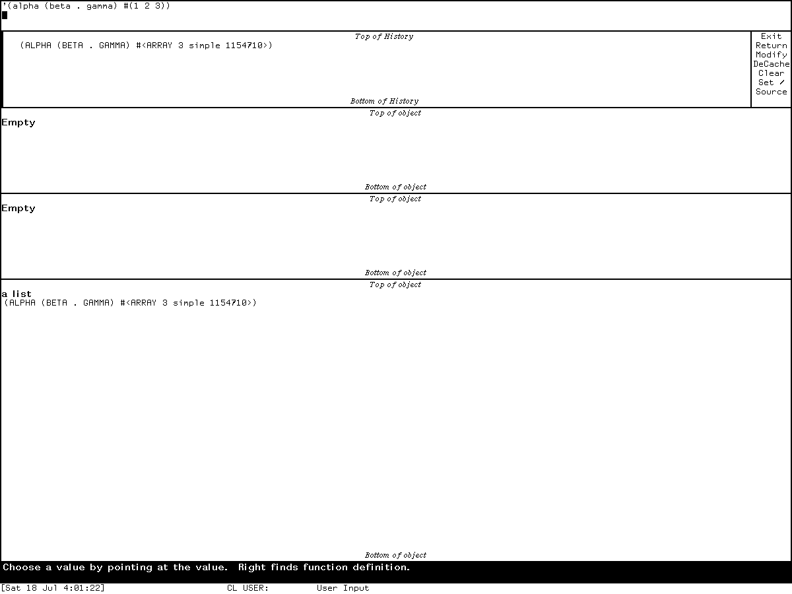
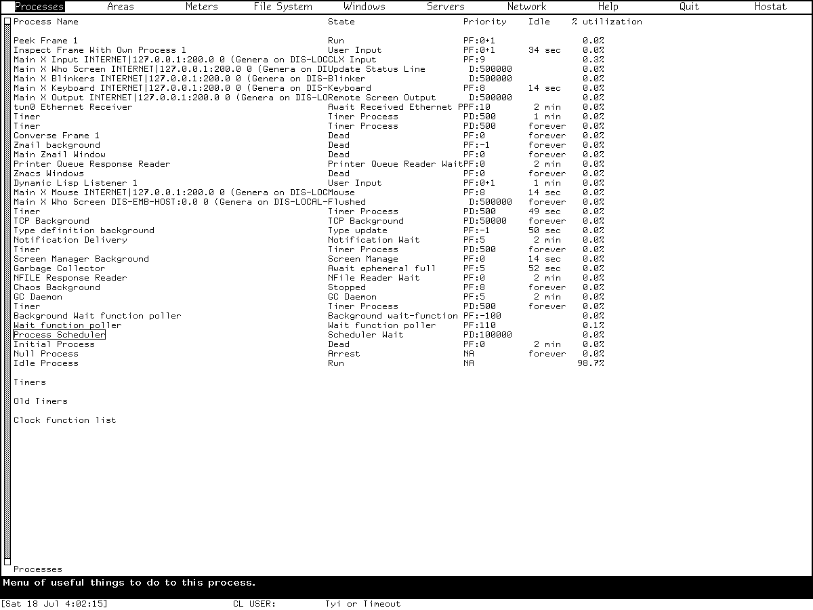

# Inspector and Peek in Symbolics Genera

Inspector and Peek are live instruments, not passive report viewers. Inspector
turns Lisp objects into a mouse-navigable graph and can rewrite slots, symbol
cells, arrays, lists, hash entries, closures, and even compiled-code constants.
Peek continuously reconstructs views of processes, storage, timers, files,
windows, servers, and networks; many of its object menus can arrest, reset,
kill, close, delete, or otherwise change the objects being displayed.

The two applications therefore show an important part of the Lisp-machine
working style: runtime state remains inspectable as structured objects, and the
same display used for diagnosis can lead directly to intervention. This study
uses the public Genera 8 manuals for intended behavior, the licensed local
Genera 8.5 source and on-line documentation for implementation detail, and one
fresh isolated Genera 8.5 run for visible behavior. A claim from one release or
evidence class is not silently generalized to all Genera worlds.

Genera's distinct [Presentation Inspector](presentation-inspector.md) is documented
separately. It diagnoses presentations, input contexts, handlers, translators,
gestures, menus, and priority rather than following arbitrary Lisp object structure.

## Evidence and rights boundary

The following source files came from the licensed Open Genera tree. They remain
untracked. Only their portable identities and original analysis are published
here.

| Portable artifact | Bytes | SHA-256 | Use in this study |
| --- | ---: | --- | --- |
| `sys.sct/window/inspct.lisp.~4053~` | 61,536 | `0f2f2f9f437846f20ca418e2495d1cdf2360332630bb408b7b802f8dc6829f62` | Inspector frame, object dispatch, menu, navigation, cache, and setters |
| `sys.sct/window/peek.lisp.~4073~` | 53,972 | `5e77404cbd17c26b21d457a99354da3c0a755b696597e35e8749b37596b56bcf` | Peek frame, registry, base modes, keys, and general menus |
| `sys.sct/window/peekch.lisp.~4015~` | 20,974 | `7cba80aa6db6aad71ac9a5350f7c7e15193ffd2644ac84e107f74983621c6ad4` | Chaosnet detail, Hostat registration, and Chaos-specific actions |
| `sys.sct/window/peekfs.lisp.~4009~` | 11,822 | `273dc6b26d6252ebb60d0c3fce149232377de7d3c951abbb5dcdd1b4c85ffe70` | QFILE and NFILE status rows and menus |
| `sys.sct/scheduler/timer.lisp.~149~` | 60,877 | `3844bdbb958751301d14403c6e67f126b7bb557438a41b33f365e2ebe28b53ea` | current timer display |
| `sys.sct/sys2/timer-queue.lisp.~56~` | 16,245 | `acea648828b684a9a88dff64d1ecd83f8a64b2ba13121ddbc549a9bf9f627ae4` | old timer queue and mouse menu attachment |
| `sys.sct/network/servers.lisp.~97~` | 26,788 | `f7d84b54df843af0eea3cba86cc790ccb1d06896655906e8b2bfc307bbf1740b` | active-server rows and process/host sensitivity |

The locally decoded Document Examiner payload also remains ignored. Its relevant
source Sage Binaries are:

| Portable Help source | Bytes | Records | SHA-256 | Use |
| --- | ---: | ---: | --- | --- |
| `sys.sct/doc/installed-440/misct/misct1.sab.~20~` | 153,803 | 12 | `d0f08b4c4a4d6f9461424f54b33720f1d304b2195dc1ea4372dfba2b388214f3` | Inspector documentation |
| `sys.sct/doc/installed-440/miscu/miscu1.sab.~36~` | 26,371 | 19 | `216987d719b74507226a5b360c09decb72c09d398ceb289549bc37fb97da14fc` | Peek documentation |
| `sys.sct/doc/installed-440/rn8-0/notes.sab.~18~` | 12,056 | 8 | `b974be3eafef008cf56bf820f3676bccdc0077f79dd5a197dfc410085e6ea02d` | Genera 8.0 notes cross-check |
| `sys.sct/doc/installed-440/rn8-0/utilities.sab.~30~` | 50,564 | 33 | `aec4663ac6a81cc7fe662531bd4c6279014dfcfff3c755934d94345ef287ed70` | update interval and timer-display notes |

No decoded vendor prose is tracked or reproduced here.

The public [Program Development Utilities](https://bitsavers.org/pdf/symbolics/software/genera_8/Program_Development_Utilities.pdf)
manual supplies the Inspector description and another Peek account. The public
[Genera User's Guide](https://bitsavers.org/pdf/symbolics/software/genera_8/Genera_User_s_Guide.pdf)
supplies the user-level Peek account. Both are Genera 8 documents; exact 8.5
statements below require corroboration from local source or runtime.

Raw runtime images, sidecars, action records, logs, and the licensed private
world remain in the ignored computer-use session. Two separately reviewed,
byte-identical captures are published under
[Published runtime screenshots](#published-runtime-screenshots); every other
capture from the study remains ignored.

## Inspector

### What it is and how it is entered

Inspector is a standalone activity and also a callable subprogram. The
difference matters because a call can temporarily take over the invoking
Listener, whereas the activity has its own process and can simply be selected
away from.

| Entry path | Established behavior in this source/world |
| --- | --- |
| `Select Activity Inspector` | Selects or creates the registered Inspector activity. |
| `Select I` | Select-key registration for `Inspector`; freshly exercised in the runtime session. |
| System menu `Inspect` | Programs-column entry that calls the Inspector. |
| System menu `Create` -> `Inspect` | Creates an Inspector frame with its own process. |
| Command Processor `Inspect object` | The implementation accepts a name string, resolves an optionally package-qualified symbol, and inspects its value only if the symbol is bound. It is not an arbitrary-form reader. |
| `lisp:inspect` | Calls the Inspector on an object. When invoked from a Listener, the caller must leave through Inspector rather than assuming `Select L` will unwind the call. |

The top-level `inspect` function rejects a remote terminal and reports that the
facility is available only from the main console. That restriction is in the
implementation, not merely a recommendation in the manual.

### Frame and data-flow architecture

The default frame contains six visible panes:

1. a three-line interaction pane;
2. a history pane and command menu arranged side by side;
3. three vertically arranged inspection panes, the last of which owns the
   Inspector typeout window.

The number of inspection panes is an initialization option; three is the
default, not a structural limit. All panes share an input buffer. The interaction
pane reads and evaluates a form, then appends the resulting object to history
instead of printing it. The last history objects populate the inspection panes,
with the newest in the large bottom pane. Each inspection pane remembers its
own scroll position. Top and bottom margin regions and a scroll bar provide
object-local navigation.

History is more than a transcript. It stores object identity and a cached display
description. Before an object is appended, an `EQ`-identical occurrence is
removed; the same object therefore does not accumulate duplicate history rows.
The cache enables quick redisplay but can become deliberately stale when an
object changes outside Inspector. `DeCache`, deleting the history row, or a
successful modification invalidates the relevant cached material.

### Inspector-specific keyboard controls

Ordinary form editing is supplied by the system Input Editor. The table below is
the complete set of special top-level Inspector characters configured in the
inspected file, plus the activity selector. Input Editor movement, correction,
history, and completion keys are inherited facilities rather than additional
Inspector bindings.

| Input | Effect | Evidence boundary |
| --- | --- | --- |
| `Select I` | Select or create the Inspector activity. | source and runtime |
| `Control-Z` | Exit the Inspector top level. | source and manual |
| `Escape` | Read and evaluate a form, then print its result in the interaction/typeout context instead of inspecting it. Full rubout cancels this subsidiary read. | source and manual |
| `Suspend` / manual `Break` | Enter a break loop in the typeout window. The implementation's input command is named `Suspend`; the manual labels the user operation `Break`. | source/manual naming difference; not runtime-tested |
| `Return` while entering a form | Finish Input Editor input so the form can be evaluated and inspected. | inherited Input Editor behavior, not a separate Inspector command |

### Menu pane

The general menu definition has seven entries. The Common Lisp and Zetalisp
versions differ only in the history symbol named by `Set`.

| Menu item | Effect |
| --- | --- |
| `Exit` | Leave, returning `nil`. |
| `Return` | Ask for a typed or mouse-selected object and return it as the value of the call to `inspect`. |
| `Modify` | Restrict sensitivity to fields with setters, choose one, then obtain a new value from a form or another mouse-sensitive object. Right aborts the operation. |
| `DeCache` | Discard cached display descriptions and rebuild visible objects. |
| `Clear` | Clear history, cache, and inspection panes. |
| `Set //` or the Zetalisp `Set`-backslash variant | Set the Inspector loop's dynamically bound Common Lisp `//` or Zetalisp backslash history symbol from a typed or selected object. |
| `Source` | Toggle the preference between available Lisp source correspondence and disassembly for compiled functions; if source is unavailable, disassembly remains necessary. |

The source contains a wrapper intended to remove `Return` from the
always-running own-process activity, because no useful caller is waiting for a
returned value. The fresh runtime contradicted that intent: the frame was named
`Inspect Frame With Own Process 1`, yet its visible menu included `Return`.
This might reflect compiled-world/source-revision skew or a wrapper not taking
effect. It is left as an observed disagreement, not silently corrected to match
either source or manual.

### Mouse navigation

Inspector turns displayed component fields into sensitive items.

| Location and gesture | Result |
| --- | --- |
| Inspection pane, Left | Follow the selected value into the newest/bottom inspection pane; older objects shift upward. |
| Inspection pane, Middle | Follow the value while keeping the source object adjacent in the history/pane sequence. Middle from a non-inspection pane falls back to Left behavior. |
| Inspection pane, Right | Repeatedly reduce a symbol, closure, lexical closure, or valid function-definition list to its associated function where possible, then inspect it. |
| History object or its left line region, Left | Reinspect that object. |
| History left line region, Middle | Remove the object and its cached display. |
| `Modify` mode, modifiable field | Select the setter anchor rather than follow the displayed value. Right aborts. |

The fresh list probe changed the mouse documentation from the generic value
message to the list-specific `CAR` operation while the pointer was over list
structure. The attempted click did not visibly add another history object, so
that run confirms contextual sensitivity but is not used as proof of a
successful follow operation. The follow semantics above are established by
source and manual.

### Object displays and mutation semantics

The local type dispatch has eleven principal cases. A component is only exposed
in `Modify` mode when its presentation type has a registered setter.

| Object case | Displayed structure | Writable fields in the inspected implementation |
| --- | --- | --- |
| Inspector stack frame | Interpreted form or compiled function view, with current-PC/source-position context where available | compiled-code fields described below, not arbitrary stack-frame fields |
| Flavor message handler | selector-to-handler entries | handler entries can be replaced directly in the dispatch structure |
| Basic hash table | instance information followed by key/value pairs | the selected key anchors replacement of its value |
| Basic table | instance information followed by table entries | entry values through the hash-key setter path |
| Named structure | named slots and values | slots through their generated reference/setf accessors |
| CLOS or flavor instance | class/flavor, dispatch information, slot names and values | a `SET-<slot>` message when handled, otherwise direct slot-value assignment |
| Array | leader cells; one-dimensional elements; a summary for higher-dimensional arrays | leader cells and one-dimensional elements |
| List | ground list structure with selectable cars and tails | cars and cdrs through destructive list update |
| Symbol | value, function, property list, and package | value cell, function cell, and property list; not the package |
| Dynamic closure | function and closed-over variable names/values | closure slots, preferring a setter message where one exists |
| Compiled function | source correspondence when available and preferred; otherwise disassembly and embedded objects | constant or indirect-object operands; the Ivory path writes code storage and clears the instruction cache |

The public manual also describes a `Select Method` display whose keyword/function
pairs are editable. In this source revision, that implementation is guarded for
CADR builds and is absent from the Ivory/Open Genera type dispatch. It is
therefore historical/manual evidence, not asserted as active Open Genera 8.5
behavior.

`Modify` is consequently much stronger than a form-field editor. It can alter
global function bindings, property lists, object dispatch, live list topology,
array leaders, closed-over state, and executable-code constants. Some operations
use an abstraction-preserving setter message; others deliberately write the
representation. The source itself questions the safety of replacing a flavor
message handler. A museum demonstration should use newly allocated probe objects
and avoid modifying system objects unless the mutation itself is the subject of
the experiment.

### Inspector findings the manuals do not fully expose

- Type redirection is intentionally under-annotated. A malformed object handler
  can substitute another object or force another display type without telling
  the user that redirection happened; an unknown type has no graceful fallback.
- Function-following is a normalization loop, not merely “look up a symbol's
  function.” It peels symbols, closures, lexical closures, and valid
  function-definition lists until no further canonical function is found.
- Source display is conditional on both correspondence information and a Lisp
  language model. The menu toggles a global preference, but missing source or a
  non-Lisp function still produces disassembly.
- The source-aware compiled stack-frame path can mark the range associated with
  the current program counter. The disassembly path can instead mark the
  instruction index.
- Cache staleness is part of the design. Reinspection is not a guarantee of a
  fresh read until the cache is invalidated.
- The standalone command's apparent object argument is implemented as a symbol
  name string lookup, whereas the frame interaction loop evaluates arbitrary
  forms. The two input paths are not equivalent.
- The own-process `Return` suppression in source and the visible 8.5 menu do not
  agree, as recorded above.

## Peek

### Architecture and lifecycle

Peek is an initially invisible, process-owning frame with two panes sharing one
input buffer: a one-row dynamic mode menu and a scrolling status pane. The mode
menu highlights exactly one item and sends the selected registry entry to the
status process. The source deliberately leaves precreation disabled to avoid
increasing world size.

On frame start the top level selects Help. The Lisp function `zl:peek` defaults
its optional argument to `P` and force-types that mode character, while selecting
the activity with `Select P` creates the frame without that function call. The
fresh activity therefore opened on Help, matching the top-level source path.

The normal loop:

- waits for input, a redisplay request, or the next update time;
- uses interactive priority when input is pending and noninteractive priority
  for unattended refresh work;
- stops refreshing while the frame is deexposed and wakes immediately when it
  becomes visible again;
- notices changes to the dynamic mode registry and reconstructs the frame menu;
- preserves scroll-display objects so changing numeric fields can be refreshed
  rather than rendering an unrelated text report each cycle;
- waits for a user character before flushing incomplete typeout, preventing a
  background refresh from erasing diagnostic output.

The default refresh interval is twenty seconds. Genera 8.0 release notes
explicitly corrected older documentation that had said two seconds; the local
source constant and runtime Help both say twenty.

### Complete configured keyboard controls

This table covers every character handled by Peek's top loop in the inspected
base source plus the dynamically registered Chaosnet mode.

| Input | Effect |
| --- | --- |
| `P`, `A`, `M`, `F`, `W`, `S`, `N` | Select Processes, Areas, Meters, File System, Windows, Servers, or Network. |
| `Help` | Select the Help mode. |
| `Q` | Bury Peek and restore the previously highlighted mode item; the nominal `peek-quit` function is bypassed by a special case. |
| `H` | Select Hostat when the Chaosnet extension has registered it. |
| digits | Accumulate a decimal numeric argument. |
| `n Z` | Set this Peek loop's update interval to `n` seconds and reschedule the next refresh. With no numeric argument, `Z` leaves the interval unchanged. |
| `Space` | Request immediate redisplay in a normal mode. |
| `Control-V`, `Scroll` | Scroll forward by the numeric number of lines, or approximately one visible screen without an argument. |
| `Meta-V`, `Meta-Scroll` | Scroll backward by the numeric number of lines, or approximately one visible screen without an argument. |
| `Meta-<` | Move to the beginning. |
| `Meta->` | Move near the end, leaving roughly the final two-thirds of a screen visible. |
| any other character | Clear a pending numeric argument and beep. |

Hostat has a subsidiary loop after a host-status pass: `Space` requests another
pass and any other character is pushed back so Peek can resume normal handling.
That subsidiary loop is reached only if the underlying Chaosnet `hostat` call
returns. The manual's `Control-Abort` instruction belongs to that underlying
operation.

### Modes in the inspected source and world

The base file registers seven status modes, Help, and the special Quit menu row.
`peekch` appends Hostat through the same public registry function. The live 8.5
menu therefore contained ten items in this order: Processes, Areas, Meters, File
System, Windows, Servers, Network, Help, Quit, Hostat.

| Mode | What the implementation displays | Mouse-sensitive behavior |
| --- | --- | --- |
| Processes (`P`) | Every process with name, state, priority, idle time, utilization and optional progress note; an alternate detailed layout adds real-time, CPU, and paging percentages. Current timers, old timer-queue entries, and the clock-function list follow. | process menu; expandable current and old timer sections; old timer-entry menu |
| Areas (`A`) | physical, swapping, wired-page, and region totals, followed by each allocated area, region count, free percentage, and used/allocated words | click an area to add or remove ephemeral-level and individual-region detail |
| Meters (`M`) | a registry of Storage, GC, Disk, and ZWEI Sectionization counter groups | click a group to add or remove its counters |
| File System (`F`) | pathname hosts that expose Peek data, direct streams, legacy QFILE host units, and NFILE server units/channels | stream, access-path, unit, channel, network-stream, and host menus |
| Windows (`W`) | every screen and its complete recursive inferior-window hierarchy | one window-operation menu per displayed sheet |
| Servers (`S`) | active server protocol, host, process/state, and connection detail | host, process, connection, and stream menus supplied by the server/network type |
| Network (`N`) | local network state, packet-allocation counters, and network interfaces | network and process menus; protocol modules can insert connection, packet, meter, routing, and host detail |
| Help (`Help`) | a display generated from the live mode registry plus `Z` and `Space` | no object-control menu |
| Quit (`Q`) | no status display; buries the frame while preserving the prior highlighted mode | menu-row selection or key |
| Hostat (`H`) | Chaosnet status typeout followed by a small repeat/return loop | the underlying Hostat interaction rather than normal scroll-maintained redisplay |

The manual's generic Meter description includes Netboot. The local source guards
that meter group with `#-IMACH`; the Open Genera/Ivory runtime showed only the
four groups listed above. This is a platform-conditional difference, not missing
runtime evidence.

### Complete configured object menus

The table is the menu denominator found in the inspected source tree. Network
classes can extend the host and server-connection menus; the only such extension
found for this baseline is the Chaosnet set listed here. An optional package
loaded into another world could add more methods without editing Peek itself.

| Functional group | Menu entries | Consequences |
| --- | --- | --- |
| Process | `Arrest`, `Un-Arrest`, `Flush`, `Reset`, `Kill`, `Debugger`, `Describe`, `Inspect` | arrest state, unwind/disable, restart, destruction, or diagnostic entry; Flush, Reset, and Kill request confirmation |
| Old timer queue entry | `Remove`, `Run`, `Reschedule`, `Describe`, `Inspect` | delete, move to now, or replace the scheduled time; destructive choices request or collect confirmation/input |
| Open file stream | `Close`, `Abort`, `Delete`, `Describe`, `Inspect` | normal or aborting close; `Delete` removes the file without closing the stream |
| QFILE host unit | `Reset`, `Describe`, `Inspect` | kill/reset the control connection after confirmation, or diagnose |
| NFILE server unit | `Reset`, `Describe`, `Inspect` | reset its network connection after confirmation, or diagnose |
| NFILE channel network stream | `Close Abort`, `Describe`, `Inspect` | forcibly close and destroy the channel after confirmation, or diagnose |
| NFILE data channel | `Abort connection`, `Describe`, `Inspect`, `Make Unsafe` | kill the network connection after confirmation; `Make Unsafe` marks the channel as requiring resynchronization |
| Window | `Deexpose`, `Expose`, `Select`, `Deselect`, `Deactivate`, `Kill`, `Bury`, `Attributes`, `Describe`, `Inspect` | directly changes window visibility/lifecycle; Kill and Deactivate confirm |
| File access path | `Reset`, `Describe`, `Inspect` | resets the path after confirmation, or diagnoses it |
| Generic host | `File Reset`; for a network-host object also `Remote Login`, `Show Users`, `Qsend` | resets all file access paths or starts an interactive/network operation |
| Chaosnet host extension | `Hostat One`, `Hostat All`, `Insert Hostat`, `Remove Hostat` | typeout status for one/all hosts or splice/remove a static status block in the display |
| Generic server connection | network-specific entries followed by `Describe`, `Inspect` | dispatches protocol actions or diagnosis |
| Chaosnet server-connection extension | `Close`, `Insert Detail`, `Remove Detail` | forcibly close after confirmation, or add/remove detailed connection data |
| Server stream | `Close`, `Reset`, `Describe`, `Inspect` | close normally or abortively, or diagnose |
| Network | `Reset`, `Enable`, `Describe`, `Inspect` | reset after confirmation, enable, or diagnose |

Several sensitive rows act without opening a menu: area and meter headings toggle
detail; Chaosnet connection headings toggle connection lists, meters, routes, and
packet queues; a Chaosnet connection-state item can request a forced close. A
network-interface overseer delegates to the process menu. Peek should therefore
not be described as read-only even when the user never enters Inspector.

### Peek findings the manuals do not fully expose

- The mode menu is a runtime registry. Hostat is not hard-coded in the base
  frame layout; loading the Chaosnet module appends it, and an already existing
  Peek frame notices the changed list and reconfigures itself.
- Help is generated from that registry, so it can enumerate a mode supplied by
  another module. It documents `Z` and `Space` but omits the six scrolling
  bindings that the same top loop handles.
- Quit is represented as a mode entry but is not a display mode. The selection
  path buries the frame and restores the previous highlight; the defined Quit
  display function is intentionally never called.
- The four base meter groups form another extension registry. Netboot is
  compiled out on IMACH, explaining its absence from the observed Open Genera
  menu without treating the manual as universally wrong.
- Processes can switch between compact utilization and a more detailed
  real/CPU/paging layout through a process subsystem variable. Static screenshots
  from different worlds can therefore show different columns without implying a
  different Peek version.
- Current timers and old timer-queue entries come from two different scheduler
  facilities. Only old queue entries receive Peek's five-operation timer menu.
- Typeout is intentionally modal with respect to refresh: Peek waits for a user
  character before replacing incomplete diagnostic output.
- Hostat does not implement the scroll-maintained function contract used by the
  normal modes. It performs a potentially blocking network operation inside
  Peek's own top-level process. The runtime consequence is recorded below.
- The File System menu's `Delete` operation leaves the stream open, a sharper
  operation than the broad manual phrase “close streams” suggests.
- Hidden-detail lists carry mutable redisplay state in scroll-item leaders and
  compare some canonicalized objects by identity. These are active display
  structures, not a freshly printed report on every update.

## Fresh Genera 8.5 runtime observations

### Session boundary

The isolated session was named `core-dossiers-20260718`, generation 1, and ran
from 2026-07-18 03:59:21 to 04:08:08 EDT. Its reproducibility boundary was:

| Item | Recorded value |
| --- | --- |
| Licensed release archive | `opengenera2.tar.bz2`, 206,213,430 bytes; SHA-256 `89fb3e76b91d612834f565834dea950b603acf8f9dbacacdd0b1c3c284a2d36e` |
| Base and private world | `Genera-8-5.vlod`, 54,804,480 bytes; SHA-256 `a8ee5e86cc7e322f7385af3e0cd579d7650d4dcfc3ce328acbf8b25515dd0672` at start and stop |
| Debugger and VLM | debugger SHA-256 `2db918cfe8f35f52c7ff4b7695b0ecd3bb85e41a3327ea5a94874edf05edb54a`; VLM executable SHA-256 `9f5e18d5770f973879716182b6856ef5a8ee9d3b2bb907476ea0cf35986aa4c7` |
| Harness | execution-time Python harness SHA-256 `bc9276ac766913bc15018dd334a2a2704ae5a926e1fcbc30ccfcff08af8cb48a`; shell entrypoint SHA-256 `e10d07a1c745d37044f1a97903455d334d6dcdb0c1d0e6854598e10fab24fa05` |
| Toolchain | manifest SHA-256 `3adae999bbe420182f22adc2499fcc82449a46eaf580a362de9c0e718fa6b37d`; Guix channel commit `230aa373f315f247852ee07dff34146e9b480aec` |
| X compatibility | source SHA-256 `4db1dee8e71d5ddc5cfd8289ecc3607738370ac97f856853786cfe713e94e392`; preload SHA-256 `acd71dbcb948f05b7fd2730b2b4706c08f16f46d792bd9aa6aa64370e855e4b1` |
| Network/configuration helpers | `ifconfig` preload source SHA-256 `a4d126dbb6fd6f4903835bbb41c39652cfc53c91e942267dc9166c1c938c36e7`; executable SHA-256 `f45f45461622975996ab41138f64bb84a4b17c51fba0dbb649208914898c26b7`; configuration SHA-256 `5ce6509f5adf2cf2d054d34eb4ba777ce462285b8cd9b01bc071bf819139e086` |
| Time responder | source/executable SHA-256 `cc3a2274149c5593b52e6608d732d4048518c766134df5e0f018746ad5cf98bb`; validated evidence SHA-256 `20362e5593d8b810a63e268dbc9b6644d71baf90999e5aeb8ff9a7a1d008c65c`; responder exit status 0 |
| Selected window | `Genera on DIS-LOCAL-HOST`, XID 4194310, x=72, y=55, 1200x900 |

The VLM ran in separate user, mount, network, PID, IPC, and hostname
namespaces. Bubblewrap exposed the read-only Guix store, exact read-only helpers
and private X socket, generated minimal host lookup files, and the writable
private runtime. It did not expose the host root, home, repository, unrelated
runtime sockets, or session metadata. The isolated `tun0` had no default or
external route and no guest-visible host file service. This is native-process
reach reduction, not a claim of a complete kernel security boundary.

Xvfb did not advertise MIT-SHM. Both pinned guest-X request substitutions were
observed before the harness declared the session running. The one-shot RFC 868
responder received the expected local Ethernet request, sent one validated
reply, and exited successfully.

### Inspector observation

Host `F1` was the harness translation used for the Genera `Select` key; this is
not a Symbolics-keyboard layout claim. `Select I` opened a blank own-process
Inspector with the interaction line, history, menu, and three empty object panes.
The menu visibly read `Exit`, `Return`, `Modify`, `DeCache`, `Clear`, `Set //`,
and `Source`, establishing the source/runtime `Return` disagreement discussed
above.

Entering the project-owned probe form
`'(alpha (beta . gamma) #(1 2 3))` evaluated it and placed the result in history
and in the bottom pane labelled `a list`; the two upper object panes remained
empty. A pointer action over the displayed list changed the bottom documentation
to the list-specific `CAR` wording. No system object was modified, and the
`Modify`, `Set`, and `Source` operations were deliberately not exercised.

### Peek observation

`Select P` opened Help with the ten-item row described above. Subsequent keys
reached Processes, Areas, Meters, File System, Windows, Servers, and Network.
Specific visible cross-checks were:

- Processes showed process, state, priority, idle-time, and utilization columns,
  followed by timer headings. A right click on `Peek Frame 1` opened the exact
  eight-item process menu from source. No operation was chosen.
- Areas showed the memory/region header and live areas. A pointer action on an
  area inserted a region-detail row, confirming expandable hidden data.
- Meters showed exactly Storage, GC, Disk, and ZWEI Sectionization groups, with
  no Netboot group.
- File System was empty, consistent with the session's lack of a guest-visible
  host file service; this does not prove that the mode is normally empty.
- Windows displayed the active screen hierarchy, including Peek, the Inspector
  and its panes, and the Dynamic Lisp Listener.
- Servers displayed its headings but no active servers in this isolated run.
- Network displayed the local Internet network, counters, and the VLM Ethernet
  interface on isolated `tun0`. The screen is evidence about the harness network,
  not a configured Symbolics site.

Pressing `H` selected the dynamically registered Hostat row. The status pane
entered Chaosnet host-status typeout and the process state became `Await Chaosnet
enabled`, because this session had an Internet interface but no enabled Chaosnet.
While that call remained blocked, dispatched `P`, `5 Z`, and `Space` inputs did
not replace the Hostat body. Clicking the `Processes` menu row changed its
highlight and the mouse-documentation line, but the body and process state still
showed blocked Hostat. Thus the menu pane handles highlighting before Peek's
top-level process consumes the queued menu event.

Two host-side attempts to synthesize the expected Control-Abort combination did
not unblock this run. That result is specific to this X translation and a Hostat
call already waiting for Chaosnet; it does not establish that Control-Abort fails
on Symbolics hardware. `Select L` subsequently selected the Listener, allowing
the session to continue without claiming that Hostat itself returned.

The complete action log contains 33 intents and 33 linked successful dispatch
outcomes. “Successful” here means XTEST delivery succeeded, not that the guest
performed the intended semantic operation; the blocked Hostat probes illustrate
the distinction.

The application-specific intent sequence, in order, was: host `F1`, then `i`
(`Select I`); type the probe form and `Return`; Left at client coordinates
(120,492); host `F1`, then `p` (`Select P`); `p`; Right at (110,59) to expose
the process menu; `Abort`; `a`; Right at (1100,800) on an area row; `m`, `f`,
`w`, `s`, `n`, and `h`; `p`, `5`, `z`, and `Space` while Hostat was blocked;
two Control/Abort translation probes around another `p`; Left at (55,9) on
the Processes menu row; and finally host `F1`, then `l` (`Select L`). Every
intent was recorded before dispatch and linked to its outcome afterward.

### Raw capture evidence

All entries below are ignored local evidence identifiers, not links or
publishable assets. Each is 1200x900. The action-prefix count and hash bind a
capture to the ordered intents and outcomes that preceded it.

| Raw capture identifier | Captured (EDT) | Observed state | PNG SHA-256 | Pixel SHA-256 | Action prefix |
| --- | --- | --- | --- | --- | --- |
| `0005-inspector-initial` | 04:01:08 | empty own-process Inspector and full visible menu | `3b320e6c1456b43a097d58745f442f2bdc97c12bf86f0d8a13fd9e89634ffae7` | `4838b17a6c604eb3fb96d334bdb4be4ba13f153287e951beb4754b64491d26e5` | 14 records; `289b2b6d5bb5077a7addee2d7061e22c60e7698ad9952229a69d625e57431adc` |
| `0006-inspector-list` | 04:01:23 | probe list in history and bottom inspection pane | `f58fc2395aae855c5db1fe42752684d200373afb3fa8be6e13334c6835514234` | `17201261652263d7f8474829636ca6dc003d7c75f88cf98ca32ce3ab75413ba6` | 16 records; `69d0ab419aea81284fef70fa24d26285950cfff2e78bd40a3c6e354920b50b13` |
| `0007-inspector-follow-value` | 04:01:41 | list-sensitive `CAR` mouse documentation; no claimed follow result | `b9a35f869d5dbd1ce659fb534d545fca45251e97e99465f8abb17e341cef15ab` | `42b300ff6a8f7433d0e0d2cf28893128413b9a79c33576b41e2508244f06a854` | 18 records; `e4ba0d684b3dc390f2d5e7fecf3df7cc6739f1ad7c2e0cfb047ccecec3761a36` |
| `0008-peek-initial-help` | 04:02:01 | Help and ten live menu items | `35e056462f4552b9907375fbb67860ea6886d5c649062fc66452bd2d0a902e67` | `49ee3af4c9f3e3835d1f57cabb26a58befa1ee9e27f8d557571f073e91a20560` | 20 records; `4a5f63f5a2cabb139fe07a0c050e861e6147f06110084ea1b681db9db22f1aaf` |
| `0009-peek-processes` | 04:02:16 | process table and timer headings | `495197133b56601af46a6bda975643d46a3de66fe17eca927969c66ad3a65920` | `b44a3d83b78d71591adbad3896280b8d1ef573586dd17b31db46db0f42ddd02d` | 22 records; `c8f3c54d6f8ccd95e8b942df194a4c9daa7c1bf3e41be89ef3aa4be5f9d75c29` |
| `0010-peek-process-menu` | 04:02:30 | eight process operations on `Peek Frame 1` | `cf40aaeabf9332b1a4be33a8ac730ad67a2f2753c2627343f730d99215b02d15` | `0b225178a6c7b8985015fb4b8b6144e27a870d394185cadba7458430f69e6ac2` | 24 records; `4008ef2db66a53035758769eb225e4cab2ca5e3b2e9587b491e7a29d7ff668b9` |
| `0013-peek-areas-verified` | 04:03:24 | Areas with inserted region detail | `33cfd3d45eda84402367827266eb4e4220ce78697715a09d9ff238859edfeb7e` | `338a101aeccc49be53c513bbf452f8e9e7d2f8a5057d2298fc19599a3db7b27e` | 30 records; `6fd165a5483b355468660d71e3e0dddc4d2ddc7bc16dec62cddf73f88cc927f2` |
| `0014-peek-meters` | 04:03:34 | four IMACH meter groups | `5ce570622661b2562030cb9c68ceca0951ce7b7328324a64e1af99c3062a2edd` | `c0d377a8c2de97c48b5a9b71757096dab731412d1a2e25bf5c50cdeac675cebc` | 32 records; `2f2d1623245c409942338af9caccd06a21c19835ebd9db80a93e53af827c2d80` |
| `0015-peek-file-system` | 04:03:48 | empty isolated File System view | `b003c4efd72bfe89b6fe24459e7c33c0c0647ef41ac1ebd0e0c66ea004adac15` | `2632ad799223870e77f348434a1d344e2d73a863406649bf30e3d2c6ac1f9209` | 34 records; `da02ea59cb855b63e93b35340483f2d925f50711f7c9b27544bb903b2bc9b0dc` |
| `0016-peek-windows` | 04:04:00 | recursive live window hierarchy | `f5b472ebd98b3b073e8325f68c716b96fe3c05faee3a153621a6dae6a6443913` | `783b8257b1ff63093f89f0d72b222bd6cb1e972fc969e81cc6c5fdbad2b905dc` | 36 records; `20c58dcbc05e0ed36e82eee5ed3aa9e7a904a8d025042686f213ea36ae271a10` |
| `0017-peek-servers` | 04:04:17 | empty isolated active-server table | `75b282ffcd56ae6ac0c13d405aa177a91633c3a8fb5a71f7d44b9dcf396f940d` | `315209cc6b6bb6c8b1a007a947f7aaf47ff97b1a00cd1135f1c6c240b0a1a3ba` | 38 records; `1e8f528e0bcd0c59ceea5e019aeef356f11e12f7124d5fa509b8d753f32e387e` |
| `0018-peek-network` | 04:04:33 | Internet counters and isolated `tun0` interface | `0cc31f4cf044eb849f34833ea09ddae4ad1f2c4ddb5ed845dbfdff589418ede5` | `a69a345892d918e7e75f14206241d0900eb9dd9d107757f64f3d92dbf10e6861` | 40 records; `5cd0337330f4a341d7b7cd01bae1b2ee86db7172eb9d6367bdfc3a2eff04c8fa` |
| `0019-peek-hostat` | 04:04:46 | Hostat selected and waiting for Chaosnet | `5ee2d030873b1d66c7ed07fdbf52c7ad922491e635d5c8986b07dbd94e4aeed6` | `5e2eaf4c556d8a1a2ae8e4aadd03bc40abd038314d44ae01e171192cc135f815` | 42 records; `acca1cc1310971a3e951317b8e723cd06524b0ec8c1e7748749d57ed643ad966` |
| `0020-peek-processes-five-second-update` | 04:05:09 | despite the intended `P`, `5 Z`, `Space` actions, Hostat remained blocked | `b50fdd369502a7e536ee39b61c615b6128468dcef1a97d5a4c7b1aa4e9f7d0f4` | `fddf16a7a5437fac738691ff5707786fd44f7b2a57e0ac26ee5780dd60db6127` | 48 records; `25a6e8582b5e55d3fd8919a43f246753475a1815834fdb7d4c3c37ad9c30d20a` |
| `0022-peek-hostat-control-abort` | 04:06:01 | Hostat still blocked after a host key-translation probe | `e5833d45e61db161dfb4d98adc828244d1d5d447c16f37e6cf990c1cafc4e6ae` | `0b723dbe85370cc5e8b73431e29b8261c0efa161ae798c90f723b59d31f53010` | 56 records; `edc38f90d8e0c8e2a6e30256628f6ac7545011efd9f3dd2355c98ed738b9d1dc` |
| `0024-peek-click-process-during-hostat` | 04:06:36 | Processes highlighted while Hostat body/process wait persisted | `1191f08f9f03d9040c6f72f58fafdf5ed838ee55ee3fd800baa72b9a11244ba1` | `2f37a42b3ca533a86d84038ad14c9796d406968056021ce99387fbe3859b8759` | 60 records; `43ccf7057378cde0cb21f8900f15dbc78625ef401f89827f6fa5998bb10f7afd` |

Capture names record the researcher's intended state, not an automatic semantic
verdict. In particular, the `0020` image is evidence that the intended mode and
interval actions had *not* taken visible effect.

The final 25,569-byte run record has SHA-256
`03f497f39e3afc2d34916f6ab817a6664cde14a32224031bf52f90443ea94810`.
The 31,489-byte, 66-record action log has SHA-256
`02df861d873714eb7f75e4fe450d65ec4c965cc407717f0725e1e49e34bb3565`.

### Shutdown and persistence

The shutdown prompt was observed, `yes` was sent and accepted, and cleanup
progress appeared. The current VLM then reached the previously established
cold-load mutex stall and required bounded host termination. The final status is
`forced-stopped`, with `forced_stop=true`,
`forced_after_confirmed_shutdown_stall=true`,
`state_may_be_incomplete=true`, and
`orderly_vlm_host_shutdown=false`.

The harness did not invoke Save World and did not create a host-process
checkpoint. `save_world_performed` and `guest_checkpoint_created` remain
unknown. The private world was byte-identical to the base at start and stop;
that establishes no world-file change, not a general claim that every guest
subsystem lacked other persistence. The run record marks the session's possible
unsaved Lisp state as discarded. The process boundary and shutdown model are
described in [Operating Genera through the Xvfb computer-use harness](genera-computer-use-harness.md).

## Published runtime screenshots

The [capture-specific review](../screenshot-publication-rights-review.md) selected
one sparse state from each application. The Inspector image contains only the
project-owned probe object and functional chrome. The Peek image avoids both the
full Help prose and the process action menu. All other raw captures—including
Areas, Network, blocked Hostat, and pointer-state screens—remain ignored because
these two images are sufficient for the claims made here.

> Runtime observation: the Genera 8.5 Inspector displaying
> `'(alpha (beta . gamma) #(1 2 3))`, captured 2026-07-18. Underlying software
> and display material remain the property of their respective rightsholders;
> reproduced here for criticism, scholarship, and historical documentation
> under 17 U.S.C. section 107. No affiliation or endorsement is implied.

> Runtime observation: Peek's Processes mode in Genera 8.5, captured
> 2026-07-18. Underlying software and display material remain the property of
> their respective rightsholders; reproduced here for criticism, scholarship,
> and historical documentation under 17 U.S.C. section 107. No affiliation or
> endorsement is implied.

## Open questions

- Why does the own-process Inspector display `Return` although the inspected
  source wrapper removes it? A future safe probe should inspect the installed
  method combination and source pathname in the running world.
- Does `Source` show source correspondence for a newly compiled project-owned
  function in this exact world, and does toggling it affect all Inspector frames
  through the global preference? No licensed source display should be captured
  for publication while testing this.
- How does Hostat return and hand queued menu events back to Peek on a safely
  isolated world with a functioning local Chaosnet peer? The present session
  proves only the no-Chaosnet blocked path.
- Context menus whose object types were absent in the isolated run are fully
  source-audited but not runtime-exercised. Future probes should use disposable
  project-owned streams, processes, windows, timers, and local network objects
  and should avoid destructive operations on system state.

## Sources

- Symbolics, [Program Development Utilities, Genera 8](https://bitsavers.org/pdf/symbolics/software/genera_8/Program_Development_Utilities.pdf),
  “The Inspector” and “The Peek Program,” especially PDF pages 264-271;
  verified 2026-07-18.
- Symbolics, [Genera User's Guide, Genera 8](https://bitsavers.org/pdf/symbolics/software/genera_8/Genera_User_s_Guide.pdf),
  “Using Peek,” PDF pages 159-162; verified 2026-07-18.
- Symbolics, [Genera 8.0 Release Notes](https://bitsavers.org/pdf/symbolics/software/genera_8/Genera_8.0_Release_Notes.pdf),
  timer-display addition and correction of Peek's default update interval;
  verified 2026-07-18.
- Licensed local Genera 8.5 source and extracted Document Examiner help,
  portable identities recorded above; inspected 2026-07-18.
- Fresh `core-dossiers-20260718` Genera Xvfb session, generation 1, action,
  capture, isolation, and shutdown evidence recorded above; observed 2026-07-18.
