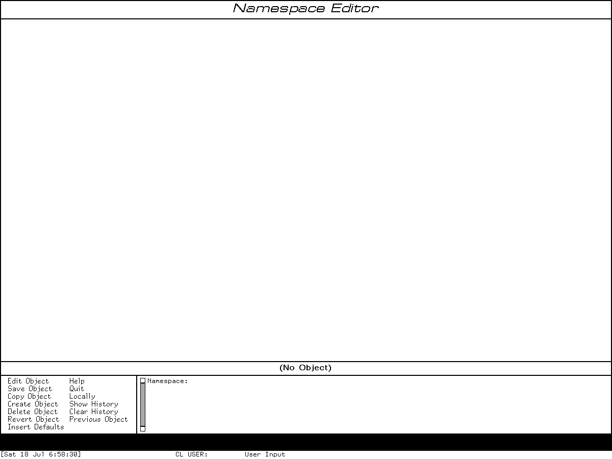

# Namespace administration and the Namespace Editor in Genera

Genera's Namespace is a distributed, typed site database, not a host-table file
loaded into one world. It represents namespaces, sites, hosts, networks,
printers, users, and file systems as validated objects. The Namespace Editor
edits one namespace view of one object at a time; a local save changes only the
current Lisp world, while a global save updates the namespace's primary server.
Separate Command Processor commands show, create, edit, delete, and bulk-change
objects, and the much more consequential Set Site and Define Site commands can
replace the local site configuration or create an entire database and SYS
translation set.

This is a different architecture from the MIT/LMI `DEFSITE`, `LMLOCS`, and
generated host-table lineage. That earlier history and the later LMI Site Data
Editor are documented in
[Login, site data, host tables, and the later Site Data Editor](../mit-cadr/site-data-login-and-site-editor.md).

## Evidence and rights boundary

The implementation source, installed Help, release notes, world image, VLM,
and raw runtime captures used here come from licensed Open Genera media. They
remain untracked. This article records short interface labels, factual
inventories, checksums, and original analysis; it does not reproduce the source,
database contents, or Help prose.

### Licensed implementation evidence

| Artifact basename | Bytes | SHA-256 | Principal use |
| --- | ---: | --- | --- |
| `sys2/login.lisp.~165~` | 19,201 | `a53bea33343ddd4e76f684648271dd068cfec2734112f73b41aad5b38c660240` | namespace-aware login, init file, logout, history |
| `cp/comtab.lisp.~103~` | 36,295 | `f60724c8e2526950000f090f2dae4745b3394079713b3601606be865c23b98e1` | Site Administration and Namespace command-table hierarchy |
| `network/namespace-editor-activity.lisp.~4033~` | 56,636 | `39714a46ce1060e7901fc9cd1e2a21eb85cf162548089bfdc3c45f169b6163ab` | frame, menu, commands, accelerators, defaults, history, validation path |
| `network/site-commands.lisp.~18~` | 47,153 | `7f62137bca7fd72c3525e84a2b58ca4dbd1b369f792706f3a2ebc96fd9a7fbbb` | Set Site, Define Site, site creation, compatibility functions |
| `network/class-definitions.lisp.~31~` | 14,488 | `2703e275c78d0c4eca9afda7d6835306ac8181f5f1071ff38ceaf39aab92f3fc` | all seven Namespace classes and fields |
| `network/namespaces.lisp.~858~` | 108,127 | `12e635827cc6e00835eebffe6831c206855203217fdd6937bb112c638d66f8a5` | object/database core |
| `network/namespace-access-paths.lisp.~90~` | 19,883 | `705cdfc4fd02e9b7ce4e017a4e26384f0c7fb08727158652e1d66fb71151aeb4` | server access paths |
| `network/namespace-local.lisp.~74~` | 21,047 | `09012253a7ee804f71f75986281dd10ddca0b47ac4b36f9b28160048b3ffeec0` | local object state and cache behavior |
| `network/namespace-server.lisp.~55~` | 15,654 | `f7b663d4deeaf4e57512423f835eaf1c64736855e473d3f7a13ca768c5e54085` | primary/secondary service behavior |
| `network/namespace-parse.lisp.~56~` | 24,132 | `79f9c8ddf16ef422fea40f6f4be85222aab474b9b05994340dee0905965e4cdc` | text record parser |
| `network/namespace-validation.lisp.~1506~` | 12,226 | `b4e5ec84a05b789bfb1324dfb2294b3e472961b12c4ed235b0c85b1fd0bb864e` | address, name, service, and property validation |
| `network/namespace-presentation-types.lisp.~1531~` | 44,993 | `bf42bb9a811836669bf6381f8c3feacb847c29b019bc6e5275a6a1d7f655914a` | typed input and presentation behavior |

### Installed Help and release-note evidence

These are the identities of the original Sage Binary inputs, not the decoded
text products in the ignored help build tree.

| Artifact basename | Bytes | SHA-256 | Coverage |
| --- | ---: | --- | --- |
| `site/site10.sab.~50~` | 34,697 | `ed52514ece29030016cb74d6f14b08ba976947ab520e40ca1e6458f183605685` | Namespace Editor use and commands |
| `site/site11.sab.~39~` | 86,454 | `d04500aa6678a03a79e45491a5b3e8b1c5f3747612b98a1be91e6c87c6ae7129` | Host, User, Printer, and Network fields |
| `site/site12.sab.~36~` | 52,381 | `844fd697ce9ce89f6b8fff1b9d8912508aa691c23896094dec3e35323d5a7bae` | Site, Namespace, and database-file formats |
| `cp/cp2.sab.~152~` | 164,164 | `2dda47b43c53edcab060da0d5b513f2d5735d7d4d447157aa2cdd269a3dae7b6` | Edit, Create, and Delete Namespace Object |
| `cp/cp3.sab.~184~` | 404,196 | `24ed5565a80c9857feae331466cffc9cecbdf6439ae30a3de0f650e0f4b1c484` | Show Namespace Object and Set/Define Site |
| `cp/cp5.sab.~74~` | 140,448 | `0b9508993f742a02158c356ac7da2570fcdd46f5f382556d7dc2105b2c53e25a` | Add Services to Hosts |
| `cp/cp6.sab.~50~` | 76,382 | `26e2b0a9a81295f7d3af4aab7c91a51c0bd04c9873dec96d646d873413297d51` | Remove Services From Hosts and Define Site references |
| `rn8-0/site.sab.~22~` | 27,595 | `1ffe437ef33b050fee52a14a1300db09cb75de35ce852fad4ebb9d1404144aef` | Genera 8.0 Namespace and Site Operations changes |

All licensed artifacts were verified locally on 2026-07-18.

## Login identity is a Namespace object

Genera login normally resolves its first argument as a Namespace `User` object.
That object supplies the Lisp Machine display name and home host; its class also
contains file-server login names and the mail address. If a host is specified
explicitly, login can construct an uninterned user identity for that host rather
than using the user's normal home-host view.

The inspected Lisp entry points are:

| Entry point | Complete interface and behavior |
| --- | --- |
| `LOGIN` | `user-name`; keywords `:HOST`, `:LOAD-INIT-FILE` (default true), `:NO-QUERY-WHEN-UNKNOWN`, and `:INIT-FILE-TO-LOAD`. It logs out first, resolves or constructs the user, sets user variables, runs login initializations, records user/local-host/time/init-file history, establishes home-directory defaults, and normally loads the `LISPM` init file. An unknown user can be retried, used on a specified host, or, after confirmation, offered for addition to the user database. |
| `LOGOUT` | Evaluates registered undo forms, runs logout initializations, logs out of the file layer, installs the not-logged-in user, and recomputes user variables. |
| `SHOW-LOGIN-HISTORY` / `PRINT-LOGIN-HISTORY` | Displays user, host, time, and init file, presenting still-resolvable User and Host objects semantically. |
| `LOGIN-TO-SYS-HOST` | Logs in the required `LISP-MACHINE` user without an init file; source notes that this user must exist in each namespace with the correct local account. |

Login and the Namespace Editor are related but distinct. Editing a User object
does not itself log anyone in, and a local-only User edit is not a durable
account change. The login path may query a namespace server and the file host,
so its error/retry behavior is part of network and site state rather than a
purely local password dialog.

## Namespace database architecture

### Four text-file roles

Namespace data is stored as text records on namespace servers. The supported
administrative interface is the editor and CP commands; the installed manual
explicitly warns not to hand-edit the files.

| File role | Contents and invariant |
| --- | --- |
| Descriptor | One per namespace. Maps a class name to an object file, `*` to the catch-all object file, `VERSION` to the log, and `CHANGES` to the incremental changes file. Its pathname is a required Namespace-object field. |
| Object | Current full descriptions. A record starts with class and primary name; following lines are indicator/value attributes; a blank line terminates the record. |
| Log | Human-readable audit history. Its file-system version identifies the database version used in change records. |
| Changes | Chronological changes since the server world's saved state, including timestamp/version context, changed object records, and deletion identities. Superseded old entries can be pruned once their state is represented elsewhere. |

Tokens are whitespace-delimited unless quoted; semicolon, newline, and quote
have syntactic roles. This textual representation is serializable, but it is
not merely a configuration archive: server state, caches, validity timestamps,
access paths, and primary/secondary update behavior determine which version a
machine sees.

### Primary, secondary, cache, and namespace views

One Namespace object can name primary and secondary name servers and search
rules. A global update is sent to the primary server. The editor reports that
other servers and hosts acquire it when they next ask the primary; saving does
not synchronously push every cache. A secondary is a backup/query participant,
not a second writable master.

An object can have views in more than one namespace. Edit and Delete therefore
ask which view to operate on when an object is multihomed. `Show Namespace
Object` displays each view. Removing services is especially careful: it checks
and changes all namespace views of each selected host, except the source's
special excluded `DIAL` view.

## Complete object-class and field inventory

An asterisk below marks source-required data. `Name` is internal to every
class. Fields can be repeated where their template says element or set.

| Class | Release-bounded fields in `class-definitions.lisp.~31~` |
| --- | --- |
| Namespace | Name; Primary Name Server; Secondary Name Server; Search Rules*; Descriptor File*; Internet Domain Name; User Property |
| Site | Name; Pretty Name; Local Namespace*; Site Directory*; Site System; Default Printer; Default Bitmap Printer; Host for Bug Reports*; Timezone*; Secure Subnets; Don't Reply to Mailing Lists; All Mail Addresses Forward; Other Sites in Mail Area; Root Domain Server Address; Query Root Domain Servers Recursively; Standalone; Validate LMFS Dump Tapes; Terminal-F Argument; Host Protocol Desirability; User Property |
| Host | Name; Site; Nickname; Short Name; Machine Type; System Type*; Address; Pretty Name; Console Location; Printer; Bitmap Printer; Print Spooler Options; Spooled Printer; Service; Server Machine; File Control Lifetime; Peripheral; Default Secondary Name Server; Internet Domain Name; User Property |
| Network | Name; Nickname; Site; Type*; Subnet; Global Network Name; User Property |
| Printer | Name; Type*; Site; Pretty Name; Format; Interface; Interface Options; Host; Protocol; Body Character Style; Heading Character Style; DPLT Logo; Character Size; Page Size; Fonts Widths File; Printer Location; User Property |
| User | Name; Login Name; Lispm Name*; Personal Name*; Nickname; Work Address; Work Phone; Home Address; Home Phone; Home Host*; Mail Address*; Birthday; Project; Supervisor; Affiliation; Remarks; Type; User Property |
| File System | Name; Host*; Type*; Root Directory*; Pretty Name*; Nickname; Short Name; User Property |

`File System` is declared as introduced in Namespace protocol version 5. It is
not described in the inspected `site10`–`site12` class chapters, which cover
the other six classes. This is a source-only feature finding, not grounds to
retrofit the older manual silently.

## Namespace Editor frame and entry points

The program framework has no fixed Select key by default. Its supported entry
surfaces are:

- `Select Activity Namespace Editor`, verified in the Genera 8.5 runtime;
- activity selection through the loaded system menu;
- a site-selected Select-key assignment; and
- `Edit Namespace Object` or `Create Namespace Object`, which select the
  activity and inject the corresponding editor command.

The last two CP commands reject remote terminals: object editing and creation
must occur on the local display. `Show Namespace Object` remains a textual CP
operation.

The frame has a title pane, one Accept Values object pane, a current-object
title, a two-column command menu, and a command interactor whose prompt is
`Namespace:`. The source enables a system-menu entry and inherits the Help
Program, Accept Values keyboard commands, full-command syntax, standard
arguments, and input-editor compatibility. Inherited facilities are not
mistaken here for custom Namespace bindings.

## Complete Namespace Editor command inventory

### All menu commands and their command syntax

The live 8.5 frame and source agree on thirteen menu entries.

| Menu command | Arguments/options | Effect and boundary |
| --- | --- | --- |
| Edit Object | object; namespace when multihomed; `:Locally`; `:Insert Defaults` | Push current history, obtain the chosen view, and populate the field database. A global edit first checks server validity; a local edit does not. |
| Save Object | `:Force Save` | Validate required fields and typed values, optionally force an otherwise unmodified save, confirm, require login for global operation, and update locally or at the primary server. Creating a Namespace or Site triggers an additional non-bypassable confirmation. |
| Copy Object | new name; `:Locally`; `:Insert Defaults` | Make a new unsaved object from current fields, stripping Nickname and Short Name. |
| Create Object | class; name; `:Copy From`; `:Property List`; `:Locally`; `:Insert Defaults` | Create an unsaved editor object after rejecting an existing name. Copy source and explicit property list are initialization alternatives. |
| Delete Object | current editor state | Confirm, require login globally, delete the selected namespace view, remove it from history, and select the prior object if one exists. The global CP Delete command is preferred by the source. |
| Revert Object | none | Local: undo changes from this editor session. Global: check validity and request a fresh server copy. An unsaved new object can only revert its session changes. |
| Insert Defaults | none | Toggle defaults for the current object and immediately derive any possible missing values. The setting is not sticky across subsequently opened objects. |
| Help | topic through inherited Help Program | Request program, command, or context help. A command-menu-help gesture on a displayed field requests its class/attribute topic when installed. |
| Quit | none | Deselect the frame; it does not imply save. |
| Locally | none | Toggle local-world versus global-primary-server saving. |
| Show History | none | Display a mouse-sensitive list of editor-history entries; equivalent to Previous Object with count zero. |
| Clear History | none | Clear current object, fields, and all object history without publishing them. |
| Previous Object | `:Count`; internal `:History Object` presentation | Default count 2 selects the prior object; 1 rotates history; 0 displays it; a larger count selects that numbered prior entry. |

### Non-menu commands

| Command | Entry | Effect |
| --- | --- | --- |
| Not Modified | Meta-tilde | Clear the modified flag without reverting field values. A later ordinary Save does nothing unless `:Force Save` is used. |
| Refresh | Refresh key | Clear command-pane history and refresh title, object-title, and object panes. |
| Object Scroll | Scroll/Control-V family | Scroll the object pane by screen, line, beginning, or end according to direction and numeric argument. |
| Remove Typeout / choose highlighted value | Space | Remove exposed object-pane typeout; otherwise enter the highlighted Accept Values choice. |

## Complete editor-specific keys and gestures

| Key or gesture | Exact custom behavior |
| --- | --- |
| Space | enter the highlighted Accept Values answer, or remove exposed typeout |
| Control-Meta-L | Previous Object with default count 2; numeric argument supplies the count |
| Control-0 Control-Meta-L | show object history |
| Scroll or Control-V | forward by screen without an ordinary numeric count, by line with a finite count, or to end with the infinity argument |
| Meta-Scroll or Meta-V | backward by screen, by line with a finite count, or to beginning with the infinity argument |
| Meta-tilde | Not Modified |
| Refresh | Refresh command |
| Help | inherited Help command |
| Return, Tab, Clear Input, Rubout, Line, End at the top-level prompt | explicit no-op; the Accept Values field editor handles appropriate field-local uses |
| Select on an object in Show History output | make that recorded history object current |
| Command Menu Help on a displayed field | open class-and-attribute-specific Help when a record is available |
| Select on a menu label | invoke that menu command through the Dynamic Windows command presentation |
| alphabetic unknown accelerator at `Namespace:` | treat it as the beginning of a typed command rather than beeping |

No additional Namespace-specific mouse button table was found. Editing field
values uses the inherited Accept Values and presentation-type interaction: a
typed object name, service, address, keyword, or set is parsed and completed by
its semantic type, and mouse-sensitive presented choices can supply those
values. This page does not relabel all generic Dynamic Windows editing gestures
as Namespace Editor commands.

## Defaults and validation

Insert Defaults does nothing for Network and Namespace objects. For the other
classes it can derive:

| Field | Derived value |
| --- | --- |
| Pretty Name | capitalized object name |
| Site | for Hosts and Printers, the Site with the same name as the object's Namespace |
| Printer / Bitmap Printer | the Site defaults |
| File Control Lifetime | the file-system default, documented as 30 minutes in the installed Help |
| Home Host | host component of Mail Address, when available |
| Mail Address | User name plus Home Host, when available |
| Lispm Name | User object name |
| Printer Interface | `Serial` |
| Services | commonly supported services derived from System Type and Network |

Before Save, the source checks every required field and invokes registered
validators. It checks network addresses; names, nicknames, and short names;
service/medium/protocol triples; and structured field types. It rejects an
incomplete Peripheral entry. For embedded Unix machine types it warns if an
`EMBEDDED-IN` user property is absent. Genera 8 release notes also warn that
adding TCP/UDP Namespace services can make pre-8.0 systems choose protocols
they cannot boot with.

The primary server checks references before a global deletion and reports
referrers. The release notes identify this as a post-7.2 safety improvement;
older behavior could leave server errors after deleting a referenced object.

## Complete `Namespace` CP command table

`Namespace` is a child of the broader `Site Administration` command table,
alongside Access Control, Spelling, and World Building. The following eight
commands are the complete Namespace administration surface defined by the two
inspected implementation files; commands in sibling tables are not included.

| CP command | Arguments and keywords | Behavior and risk |
| --- | --- | --- |
| Edit Namespace Object | optional object; namespace when multihomed; `:Locally`; `:Insert Defaults` | Select the local Namespace Editor and inject Edit Object. Remote terminals are rejected. |
| Create Namespace Object | class; name; `:Copy From`; `:Property List`; `:Locally`; `:Insert Defaults` | Select the local editor and inject Create Object. Remote terminals are rejected. |
| Show Namespace Object | object; `:Locally`; `:Format` Normal or Detailed | By default refresh from a server, then print every namespace view; local mode uses the in-world copy. Detailed format includes fields without values. |
| Add Services to Hosts | service sequence; host sequence or `All`; for `All`, `:Namespace`, `:Site`, `:Type`; `:Locally`; `:Verbose` | Validate service triples, find and deduplicate hosts, warn above five targets, require login globally, and add only absent services. |
| Remove Services From Hosts | same target filters and `:Locally`/`:Verbose` | Refresh each host globally, traverse all its namespace views, warn above five targets, and remove only present services. |
| Delete Namespace Object | object; namespace when multihomed; `:Locally` | Confirm, require login globally, and remove that namespace view. Primary-server reference checks can reject it. |
| Set Site | Site object/name or `Get from network` | Discover by broadcast or interactive server/descriptor dialog. Moving between two nondistribution sites first requires a confirmed transition through the Distribution site, then changes local Site/Host and fetches the latest timestamp. |
| Define Site | Site name | Gather platform-specific server, SYS, descriptor, login, bug-host, timezone, and standalone parameters; require/restore Distribution-site context; write a new Namespace database and SYS translations; then switch to it. |

Genera 8 changed Add/Remove from one service to a sequence and pluralized their
names. It also completely rewrote the Set Site and Define Site dialogs and
introduced Insert Defaults.

### Set Site discovery choices

When broadcast does not find a known Site, the dialog can identify a Namespace
server by name and network address or use a local descriptor file. If the
descriptor lives on an embedding/file host, the dialog also needs that host's
name, system type, address, and file protocol. These inputs locate an existing
site; Set Site does not create its database.

### Define Site dialog and outputs

The single command argument is the Site name; the interactive dialog then asks
for all configuration-dependent data:

| Scope | Fields |
| --- | --- |
| common | primary Namespace Server Name, Default Login, Host for Bug Reports, Local Timezone, Standalone Site |
| standard platform | System File Directory, Namespace Descriptor File; when SYS or descriptor hosts are distinct, their System Type, Address, and File Protocol |
| Unix embedding / VLM | System File Directory and descriptor file on the embedding host, Unix Host Name and its system/machine/address/protocol information, plus any distinct SYS or name-server data host |
| distinct bug host | System Type and Address for that host |

After confirmation, `create-site` creates directories and writes:

- the descriptor file;
- a log with the initial version timestamp;
- an object file containing the new Namespace, Site, networks, hosts, and
  initial `LISP-MACHINE` User;
- a changes file with its initial timestamp; and
- the SYS logical-pathname directory-translations file.

It then reads the new descriptor and changes the local Site and Host. This is a
site-construction operation, not a harmless way to preview dialog defaults.

## Persistence and safety model

| Operation | Local-world effect | Durable/server effect |
| --- | --- | --- |
| edit fields | changes editor database only | none |
| Save Object with Locally Yes | update current virtual memory | lost at cold boot unless a separate Save World captures it |
| Save Object globally | refresh/validate, require login, update primary server | database log/object/change files are managed through server protocol; other caches update later |
| Revert locally | undo current editor-session changes | none |
| Revert globally | request a fresh server view | may replace local cached view |
| Delete locally | remove local view | no primary-server deletion |
| Delete globally | require login and delete through primary server | durable if accepted; referrers can block it |
| Set Site | replace local Site/Host and database context | may fetch remote descriptor/data; not object creation |
| Define Site | construct and select an entire site | writes several files and translations and changes site context |

The editor's confirmation flag can suppress routine Save/Delete questions, but
the second confirmation for creating globally named Namespace or Site objects
is deliberately not bypassed. `LINK-NAMESPACES` is a source-only Lisp function,
not one of the eight CP commands: it runs only on the primary server, and its
optional network merge is permanent and carries a strong confirmation. Use of
the same global name is preferred where applicable, but the source comment
calls it `GLOBAL-NAMESPACE-NAME` while the inspected Network class actually
defines `GLOBAL-NETWORK-NAME`. This page does not silently choose which spelling
the comment intended.

Compatibility entry points retained by source include
`TV:EDIT-NAMESPACE-OBJECT`, `SI:COM-SET-SITE`, and `NET:SET-SITE`. Their presence
supports old scripts; it does not make the old dialogs the Genera 8 interface.

## Runtime observation in the isolated Genera 8.5 world

The Xvfb harness opened the Namespace Editor without selecting an object or
contacting a namespace server. The world reported Genera 8.5 / Open Genera 2.0
and also reported that it was not configured for a local site and that servers
were disabled. The observation therefore verifies frame behavior and menu
surface, not a configured site's database contents or global update protocol.

| Item | Recorded value |
| --- | --- |
| Session | `d20-namespace-editor`, generation 1; 2026-07-18 06:55:42–06:59:22 EDT |
| Licensed archive | `opengenera2.tar.bz2`, 206,213,430 bytes, SHA-256 `89fb3e76b91d612834f565834dea950b603acf8f9dbacacdd0b1c3c284a2d36e` |
| World | `Genera-8-5.vlod`, 54,804,480 bytes, SHA-256 `a8ee5e86cc7e322f7385af3e0cd579d7650d4dcfc3ce328acbf8b25515dd0672` |
| VLM and debugger | VLM 1,533,760 bytes, SHA-256 `9f5e18d5770f973879716182b6856ef5a8ee9d3b2bb907476ea0cf35986aa4c7`; debugger 346,880 bytes, `2db918cfe8f35f52c7ff4b7695b0ecd3bb85e41a3327ea5a94874edf05edb54a` |
| Configuration | execution SHA-256 `5ce6509f5adf2cf2d054d34eb4ba777ce462285b8cd9b01bc071bf819139e086` |
| Compatibility preloads | X preload SHA-256 `acd71dbcb948f05b7fd2730b2b4706c08f16f46d792bd9aa6aa64370e855e4b1`; ifconfig preload `f45f45461622975996ab41138f64bb84a4b17c51fba0dbb649208914898c26b7` |
| Network boundary | private `tun0`, no default/external route and no host file service; one validated RFC 868 reply, evidence SHA-256 `0b0dcbbc87e4d766d486e763c45ef74199a09cbda682007f19c1b96259bc4b22` |
| Selected window | `Genera on DIS-LOCAL-HOST`, XID 4194310, x=72, y=55, 1200×900 |
| Action record | four intent/outcome records, SHA-256 `ee358e6f0258353aa8fb140ccb911404bbc9330c6a1e275dddcc484e0c2bc62d` |

The exact input sequence was:

1. type `Select Activity Namespace Editor` and Return;
2. observe the empty frame titled `Namespace Editor`, current state `(No
   Object)`, `Namespace:` prompt, and all thirteen menu labels; and
3. press Help once.

The Help key was delivered successfully but produced no visible change in the
empty, unconfigured frame. That does not establish a broken Help system: no
field or topic was selected, and the source's context-help path requires an
installed matching record.

No object was selected, created, edited, saved, reverted, or deleted. Set Site,
Define Site, service changes, server validation, login, and network discovery
were not invoked. The base and private world hashes still matched at shutdown;
the private world did not change. The harness invoked neither Save World nor a
process checkpoint. Shutdown reached its prompt, accepted confirmation, and
showed cleanup progress, then encountered the known VLM cleanup stall and was
forcibly terminated. Accordingly `forced_stop` and `state_may_be_incomplete`
are true, and the run is not called orderly.

## Reviewed runtime screenshot

*Runtime observation: Namespace Editor on Genera 8.5 immediately after `Select
Activity Namespace Editor`, captured 2026-07-18. The frame is intentionally empty:
no object or site data was selected, and no mutation was attempted. Underlying
software and display material remain the property of their respective
rightsholders; reproduced here for criticism, scholarship, and historical
documentation under 17 U.S.C. section 107. No affiliation or endorsement is
implied.*

This one frame is published because the title, `(No Object)` state, prompt, pane
division, and complete short menu are necessary to verify the source/manual
interface analysis. It is a sparse functional display, contains no configured
namespace record or Help prose, cannot substitute for Genera, and is the minimum
image needed for that purpose. The image-specific review and exact raw-to-curated
mapping are recorded in the
[screenshot rights review](../screenshot-publication-rights-review.md) and
[Genera screenshot catalog](../assets/genera-screenshots/index.md). The PNG is an
exact 2,921-byte copy, 1200×900 pixels, SHA-256
`258afd1127848af24d2c3cc91ae6c369b5fa8febbda7b5e79742baace765582c`;
the normalized-pixel SHA-256 is
`3b0b4de8249126f4e790474c13498edcd9e10f195b23ea0944204dcdcce3f7b7`.

The initial Listener capture and the visually identical post-Help capture remain
ignored because they add no necessary editor evidence. A later configured-site run
would require a separate safety and rights review and should use a synthetic,
nonprivate Namespace object.

## Manual, source, and runtime differences

- Installed `site10` presents the principal editor commands but the live/source
  menu also makes Quit and Insert Defaults plainly visible; Not Modified and
  Refresh are keyboard-only.
- The manuals document six object-oriented Namespace CP commands in the editor
  chapter. Set Site and Define Site are documented elsewhere and are still in
  the same source command table; omitting them would understate the table's
  destructive end.
- `File System`, introduced in Namespace protocol version 5, is present in the
  8.5 source class list but absent from the inspected class chapters.
- Source establishes top-level no-op keys, Space's typeout dual role, the
  infinity behavior of scrolling, the global-object second confirmation, the
  dangling-peripheral rejection, and the embedded-host warning; these details
  are not all apparent in the high-level editor overview.
- Runtime confirms the exact empty-frame menu and activity command in this
  unconfigured world. It does not validate object-specific fields, server
  propagation, or mutation commands.

## Open questions

- TODO: identify which installed manual volume first documents the protocol-5
  File System class and compare its exact fields with the 8.5 source.
- TODO: use a synthetic local-only object in an expendable private world to
  verify Accept Values field completion, validation errors, history selection,
  Revert, Not Modified, and Insert Defaults without contacting a server.
- TODO: test a synthetic primary/secondary namespace laboratory before making
  timing claims about lazy cache propagation.
- TODO: compare the source's `LINK-NAMESPACES` behavior with any administrator
  manual that documents the preferred global-name workflow and resolves the
  `GLOBAL-NAMESPACE-NAME` versus `GLOBAL-NETWORK-NAME` discrepancy.
- TODO: do not exercise Set Site or Define Site in the purchased base world;
  construct a disposable synthetic file host and explicit rollback procedure
  first.

## Sources

- Symbolics Genera 8.5 licensed source artifacts identified in the evidence
  tables above, inspected locally 2026-07-18; proprietary files remain
  untracked.
- Symbolics installed Namespace Editor, Site Operations, and Command Processor
  Help, original Sage Binary artifacts identified above, decoded locally with
  the repository's inert Help extractor and inspected 2026-07-18.
- Symbolics Genera 8.0 Site Operations release notes,
  `rn8-0/site.sab.~22~`, SHA-256
  `1ffe437ef33b050fee52a14a1300db09cb75de35ce852fad4ebb9d1404144aef`,
  inspected 2026-07-18.
- Local runtime observation `d20-namespace-editor`, generation 1, performed
  2026-07-18 through the isolated
  [Genera computer-use harness](genera-computer-use-harness.md).
