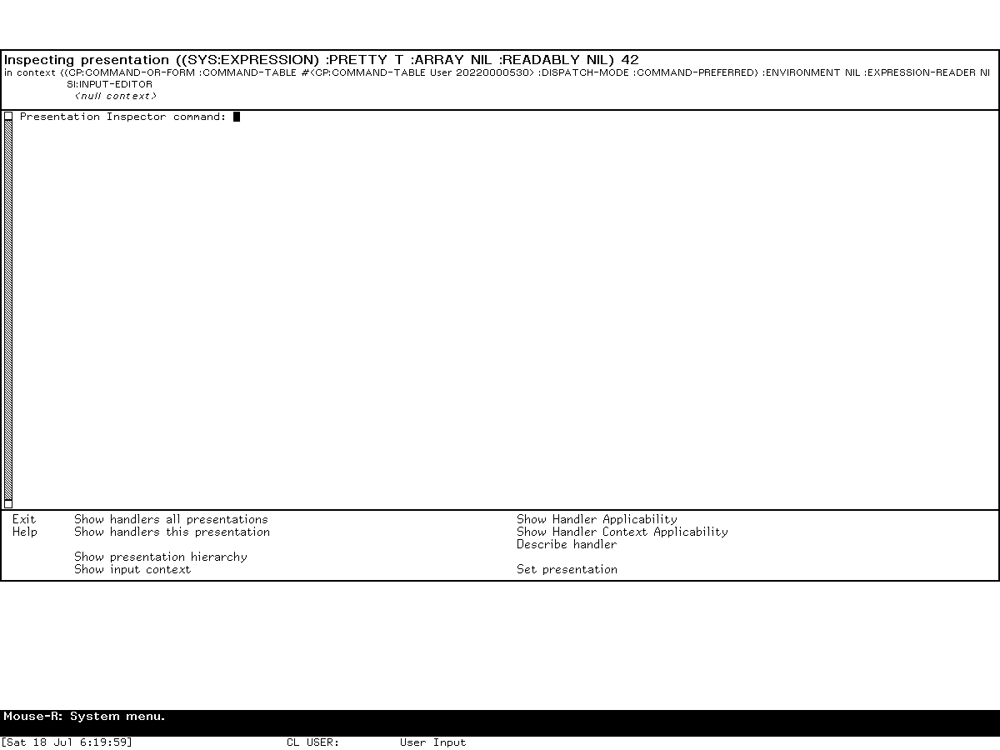

# Presentation Inspector in Symbolics Genera

The Presentation Inspector is a debugger for Genera's semantic user-interface
objects. It explains which presentation mouse handlers were considered for a
displayed object and an active input context, which handlers became accessible,
which were shadowed or suppressed, and why the others failed. It can also expose
the nested presentation tree and the complete input-context chain. It is therefore
more specific than the ordinary [object Inspector](inspector-and-peek.md#inspector):
the latter follows and can modify Lisp data, while the Presentation Inspector
diagnoses the machinery connecting displayed objects, accepted types, gestures,
menus, translators, and commands.

The application is not a passive log viewer. To explain applicability it can call
a handler's tester, type predicates, menu test, and translation value function.
Those calls are normally the same computations Dynamic Windows would use while
deciding whether to offer the handler, but they can execute arbitrary application
code. A preservation run should therefore use synthetic presentations or an
application state in which repeating those computations is safe.

This article describes the inspected Genera 8.5/Open Genera 2.0 world. It combines
the public Genera 8 manuals, the locally recovered 8.5 on-line manual, and direct
inspection of the matching licensed source with a fresh, isolated runtime exercise.
The run invoked the Inspector on the researcher-entered integer `42`, exercised its
context, hierarchy, overview, and applicability reports, compared both values of the
documented `Detailed` option, switched away and recovered the borrowed frame, and
exited without changing or saving the world.

## Evidence and rights boundary

The implementation and recovered Help are licensed local inputs and remain
untracked. Their portable identities are published so another lawful holder of the
same media can reproduce the analysis without this repository redistributing them.

| Portable artifact | Bytes | SHA-256 | Role |
| --- | ---: | --- | --- |
| `sys.sct/dynamic-windows/presentation-inspector.lisp.~4053~` | 45,825 | `9f20e13acd39201e73fee30d6890275aaf9d0b745f6b2089dfad0e05869f494d` | program framework, handler analysis, commands, translators, and invocation |
| decoded `doc/installed-440/uims/new-uims5a` text | 30,541 | `5d76323119a97e5b53d5b292272bb5abe38b5abee447cd60ec10ad8d9e0c9c7f` | 21-record Presentation Inspector manual recovered by the local-only Help extractor |

The decoded text identifies its source Sage Binary as format 7 with SHA-256
`4a5837201e79f0c03ebdebab703527a11b0a15b7456bd94ecdf8643f0ae61fd2`.
The extraction process and the distinction between source database, decoded text,
and tracked analysis are documented in
[Genera on-line help and documentation recovery](online-help-and-documentation-recovery.md).
No recovered vendor prose or source is reproduced here.

Public corroboration comes from the Symbolics Genera 8
[*Program Development Utilities*](https://bitsavers.org/pdf/symbolics/software/genera_8/Program_Development_Utilities.pdf)
and the public Dynamic Windows material in the Genera documentation set. Exact
8.5 implementation claims below come from the identified local source rather than
being projected backward onto every Genera release.

Runtime observations come from session `d11-presentation-inspector-20260718`,
generation 2, run from 06:16:01 through 06:27:04 EDT on 2026-07-18. The generation's
80-record action log is 38,236 bytes with SHA-256
`407e6b7484790c0a4f04876b12292d5794f5ca0400b6bbc364b5b2f3a3052227`;
the 25,887-byte final run record has SHA-256
`057f7c25ff0782b21ac57014ffb813141b77d0dd190dd9cb67be27218d6c315a`.
The network-isolated harness exposed no host file service or external route. Raw
captures, sidecars, logs, and licensed runtime artifacts remain ignored. Two exact
captures passed a separate, image-specific review and are published below; their
raw mappings and hashes are in the
[curated Genera screenshot catalog](../assets/genera-screenshots/).

## What problem it solves

A presentation handler is available only when several independently defined pieces
line up:

1. the object and displayed presentation types must fit the handler's source type;
2. the handler's result type must fit one of the active presentation input contexts;
3. any predicates produced while reducing parameterized types must accept;
4. the handler's tester must accept;
5. for a translating handler, its value function must return a usable value and
   that value must satisfy any predicate derived from the destination context;
6. a handler that defines a menu must produce a nonempty menu;
7. a successful handler still needs a gesture or menu placement, and a gesture can
   be shadowed by another handler with equal or higher effective priority.

Ordinary mouse documentation shows the end result, but not the failed candidates or
the intermediate reasons. The Presentation Inspector reconstructs that decision and
organizes the candidates by outcome. Its two motivating questions in the installed
manual are consequently “why was this handler available?” and “why was it not
available?” It also answers the adjacent questions “what presentation did I really
point at?”, “what does it contain?”, and “what contexts are actually active?”

This is a particularly Lisp-machine kind of development tool: the UI's semantic
objects, type relations, command translations, and live interaction state remain
available for introspection inside the running application rather than being reduced
to pixels and callback identifiers.

## Entry and lifecycle

### Normal invocation

The source installs `INVOKE-PRESENTATION-INSPECTOR` as a presentation action in the
named `:presentation-debugging` menu. Its tester admits presentations for which
`presentation-debug-p` succeeds. The action is also marked for blank areas so the
current input context can be examined even when there is no useful object under the
pointer.

The documented user path is:

1. make the presentation of interest visible;
2. put the application into the input context whose behavior is in question;
3. use `Super-Right` on the presentation;
4. choose the Presentation Inspector from the Presentation Debugging menu.

It is deliberately context-invoked, not an ordinary persistent activity. The
framework declares `:selectable nil`, supplies no process of its own, and does not
appear in the inspected world's live activity table. A catalog entry or manual
mention must not therefore be converted into a claim that `Select Activity
Presentation Inspector` starts it.

### How the frame takes over the caller

Invocation copies the active presentation-input-context tree, temporarily clears
the bindings that would make a nested `accept` recursive, borrows a reusable
`presentation-inspector` frame on the same screen, and initializes that frame with:

- the originally pointed-at presentation;
- the current presentation being investigated;
- the original application window;
- the copied input-context chain; and
- the original Dynamic Windows program, when one was bound.

The frame has no separate process. It is positioned near the selected presentation,
shadows the original window for selection, and runs its top level synchronously by
`window-call` in the invoking program's process. `Exit` throws back to the invocation
site, deactivates the borrowed frame, clears its references, and restores the original
program.

That implementation explains a warning in the manual: switching back to the
original program without exiting the inspector does not make that program accept
normal input, because its process is still inside the Inspector's command loop.

### Frame size and layout

The implementation chooses a height from the original screen:

- below 666 pixels, the lesser of 500 pixels and 90 percent of screen height;
- at 666 pixels or above, three quarters of screen height.

The frame contains three panes from top to bottom:

| Pane | Content and behavior |
| --- | --- |
| title | The current presentation and a recursively abbreviated input-context chain. Both are themselves presented objects and can be used as command arguments. |
| listener | A Command Processor listener for Presentation Inspector and inherited Global commands. It does not evaluate arbitrary Lisp forms as ordinary listener input. |
| command menu | Ten direct commands arranged into General, Overview, Handler, Environment, and Control groups. Empty cells separate the visual groups. |

The manual directs a developer who needs arbitrary Lisp evaluation to enter a
breakpoint with `Suspend`; that is an escape into the debugger, not an additional
form-reading mode in the Inspector listener.

## Complete direct command inventory

The following ten entries are the complete menu and application-command surface in
the inspected source. Commands can be chosen from the menu or entered by name in the
listener. Keyword options that the menu's simple form does not prompt for remain
available from typed command input.

| Group | Command | Arguments and complete effect |
| --- | --- | --- |
| General | `Exit` | Leaves the borrowed frame and returns control to the original application. |
| General | `Help` | Prints the built-in one-screen workflow summary in the listener. |
| Overview | `Show Handlers All Presentations` | Starts from a heuristically chosen leaf/text presentation and follows the presentation hierarchy upward. It reports all candidate handlers and their disposition. Keywords `Show Presentation` and `Show Context` both default to `No`; mentioning either with no value means `Yes`. |
| Overview | `Show Handlers This Presentation` | Runs the same analysis over a selected range. `Presentation Range` defaults to `Current`, accepts `Text`, `Current`, `All`, or an explicitly selected presentation. `Text` starts at the chosen leaf; `All` also walks upward. `Show Presentation` and `Show Context` have the same Boolean defaults as above. |
| Handlers | `Show Handler Applicability` | Accepts a presented mouse handler and analyzes every level from the copied current context through its superiors to the null context. The typed `Detailed` keyword defaults to `No` and has a mentioned default of `Yes`; the implementation issue with this option is recorded below. |
| Handlers | `Show Handler Context Applicability` | Accepts a mouse handler and one presented input-context level, then explains that exact handler/context/presentation combination. |
| Handlers | `Describe Handler` | Calls `describe` on both implementation pieces: the handler-functions object and the presentation-mouse-handler object. This exposes options such as menus, context independence, and defined-menu behavior. |
| Environment | `Show Presentation Hierarchy` | Displays the current nested presentation structure. `Format` is `Text` by default or `Graph`; presentations in the output are mouse-sensitive. |
| Environment | `Show Input Context` | Prints every copied input-context level and, except for the recursive `superior` link, every slot described by the runtime structure definition. Fields are emitted as named-form-slot presentations. |
| Control | `Set Presentation` | Changes the current presentation, switches to the ordinary configuration, and redisplays the title. It is normally reached by clicking a presentation in hierarchy output. |

`Show Handlers This Presentation` has a distinction that is easy to lose in a brief
manual summary. `Text` and `All` first invoke the leaf-finding heuristic, but only
`All` sets the complete-hierarchy flag. An explicit presentation can therefore be
used as a precise single-node start without implying an upward traversal.

## Inherited and adjacent commands

The command table inherits `Global`, so generally available commands remain usable.
The installed manual calls out three presentation-handler queries as useful from the
Inspector even though they are not members of its ten-button menu:

| Command | Boundary |
| --- | --- |
| `Show Presentation Type` | An inherited/global facility for examining a presentation type; it is not defined in the Inspector source file. |
| `Show Handlers For Types` | Another world-level handler query documented beside the Inspector but not implemented by this framework. |
| `Show Presentation Handlers From Type` | Defined in the inspected source in the separate `Presentation` command table. It lists handlers whose displayed source type is a supertype of the supplied presentation type. `Include T` defaults to `No` and has a mentioned default of `Yes`; ordinary Command Processor output-processing keywords are inherited. |

The same manual also documents `Show Mouse Handlers`, a general Command Processor
query that can show declared handlers and expanded lookup-table handlers. It is
related diagnostic infrastructure, not an eleventh Presentation Inspector command.

## Complete application-specific gesture and key inventory

The framework explicitly disables command-table keyboard accelerators. No letter or
function key is secretly bound to each of the ten menu buttons. Text entry and
editing in the listener use inherited Input Editor behavior, while Global commands
retain whatever entry paths their own command tables provide.

| Input | Context | Effect |
| --- | --- | --- |
| `Super-Right` | a debuggable displayed presentation, or an eligible blank area | Opens the Presentation Debugging menu; choosing Presentation Inspector invokes this application. The action itself has no direct gesture beyond its menu placement. |
| `Describe` gesture on a presented presentation | Inspector output | Translates to `Show Handlers This Presentation` with that exact presentation as `Presentation Range`. |
| `Describe` gesture on a presented mouse handler | Inspector output | Translates to `Describe Handler`. |
| ordinary selection gesture on a presented mouse handler | handler-list output | Translates to `Show Handler Applicability`. |
| ordinary selection gesture on a presented handler-in-context pair | applicability output | Translates to `Show Handler Context Applicability`. |
| ordinary selection gesture on a presented presentation | hierarchy or title output | Translates to `Set Presentation`. |
| `Edit Function` gesture on a presented mouse handler | Inspector output | Opens the definition associated with the handler's `define-presentation-translator` form. |
| `Edit Function` gesture on a presented presentation type | Inspector output | Opens the corresponding `define-presentation-type` definition. |
| `Suspend` | Inspector listener | Enters a breakpoint so Lisp forms can be evaluated outside the command-only listener. |

The exact physical chord assigned to the abstract `Describe` and `Edit Function`
gestures is part of the world's global gesture mapping, not an Inspector-local
binding. This article therefore names the semantic gestures rather than inventing a
fixed keyboard chord that the source does not establish.

## What the overview report means

The all-presentations and one-presentation commands sort each examined handler into
the following complete set of printed categories:

| Category | Meaning in the implementation |
| --- | --- |
| handlers appearing on mouse buttons | Matching and successful handlers that own a physical button/modifier slot after priority ordering. |
| handlers shadowed by other handlers | Successful handlers for a button/modifier slot already claimed by an earlier effective-priority candidate. The report identifies the shadowing handler and both priorities. |
| handlers appearing in each menu | Successful handlers whose `:menu` property names the standard Right menu, blank-area menu, or another named menu. A handler can be reported in a menu even when its direct gesture is shadowed or absent. |
| gesture has no mouse character | The handler names a gesture that cannot currently be mapped to a physical mouse character. |
| no gesture | The handler deliberately supplies no gesture and depends on a menu or programmatic path. |
| successful but on no button or menu | The handler matches and its computation succeeds, but it has no reachable mouse placement. |
| tester failed | The handler's tester returned false. |
| empty menu | A handler declared with `:defines-menu` had no applicable members, so its empty menu was suppressed. |
| did not return a value | A translating handler returned neither a non-null value nor a second value identifying a type. Presentation actions are exempt because their values are not used. |
| object/presentation-type predicate failed | Type reduction produced a predicate for the source object/displayed type and that predicate rejected the presented object. |
| context predicate failed | Type reduction tentatively matched the destination context, but the translated result failed the derived context predicate. |

The analysis uses a 32-by-3 table: all modifier-bit combinations for Left, Middle,
and Right. A gesture declared as applying everywhere can fill every still-empty
cell. Later candidates for occupied cells are marked shadowed. Candidate order is
therefore significant; the code preserves the runtime's priority order before doing
this shadow calculation.

The effective priority printed beside a button starts with the handler's explicit
`:priority`. It adds the Dynamic Windows context-priority bonus when the handler and
active-context type names match exactly, and the displayed-priority bonus when the
handler and presentation displayed-type names match exactly. These are name-level
specificity bonuses after the more general subtype matching, not arbitrary scores
invented for the report.

## Per-handler applicability analysis

For one handler and one context the implementation proceeds in a fixed order:

1. derive the presentation's object, object type, and displayed type;
2. test handler result type against the active context type;
3. test the presentation displayed type against the handler's source type;
4. run any source-object predicate produced by type reduction;
5. call the handler tester, if present;
6. unless `:do-not-compose` is set, call the handler value function and require a
   useful value or declared result type;
7. run any predicate derived from the destination context against that result;
8. if `:defines-menu` is present, test whether the resulting menu is nonempty.

The detailed report distinguishes type mismatch, source predicate failure, tester
failure, absent translated value, context-predicate failure, and empty-menu failure.
For success it prints the returned values unless composition was deliberately
suppressed. It also warns if a successful handler could not be found in the runtime
lookup tables under the corresponding types, treating that condition as a probable
cache or handler-table defect.

`Show Handler Applicability` repeats this operation for each superior input context.
`Show Handler Context Applicability` limits it to one selected level. This separation
is useful because a translator may fail in the immediate Input Editor context but
succeed in an enclosing command context.

## Presentation and context selection

The presentation initially supplied by a mouse action is not always the lowest
semantic object under the pointer. The source's `find-text-presentation` method uses
three passes:

1. if the invocation retained the exact original presentation, descend from that
   known node;
2. otherwise search leaf presentations with displayed boxes and ask the original
   window for the presentation at the leaf's top-left position;
3. if no displayed text can be recovered, follow the first-child chain to any leaf.

This is explicitly a heuristic. `Show Presentation Hierarchy` and `Set Presentation`
exist in part so the developer can correct its choice. Text output preserves the
nested structure; graph output renders the hierarchy spatially.

The copied input-context chain is independent of later changes in the original
dynamic binding. `Show Input Context` obtains the live structure description, walks
each level, and emits every non-`superior` slot rather than relying on a hard-coded
field list. The manual explains two common fields: `presentation-type` identifies
what that level accepts, while `throw-p` records whether acceptance should return an
object normally or transfer a presentation blip to the context. Exact additional
slots are release- and structure-definition-dependent and should be read from the
actual output.

## Source findings not evident from the ordinary workflow

### Inspection can execute application code

Both the overview and the per-handler path can evaluate developer-supplied code.
The overview invokes the debugging-description function when a handler has reached
the relevant test phase, catching an error only to fall back to its name. The
per-handler explanation directly invokes source predicates, testers, value
functions, context predicates, and menu availability checks. It binds an internal
“handler test phase” flag, but that flag cannot make arbitrary tester or translator
code intrinsically pure.

The practical consequence is that the Inspector should not be described as merely
reading handler tables. A poorly designed tester or value function with side effects
can repeat those effects during diagnosis.

### `Detailed` is accepted but ignored

`Show Handler Applicability` exposes a `Detailed` Boolean and passes it through each
context-level call. The receiving function immediately declares the argument
ignored. In this source revision `Detailed Yes` and `Detailed No` therefore select
the same reporting path. The on-line manual promises additional detail, so this is a
source/manual disagreement, not an undocumented extra feature.

### Duplicate handler explanations are collapsed

The overview walks combinations of presentations, contexts, gestures, and table
entries, then uses `pushnew` with a custom equivalence test. Two results with the same
handler function name and the same reason collapse even if they came from different
intermediate entries. `Show Presentation` and `Show Context` can reveal the retained
origin, but the report is not an exhaustive trace of every duplicate lookup-table
path.

### The program runs inside the application being inspected

The frame is allocated with `:process nil` and stores the original `*program*` for
handler testing. This preserves the application environment needed by handlers, but
also means the original program remains synchronously occupied. The manual's
otherwise surprising warning about a nonresponsive original window follows directly
from this design.

### Blank-area entry is intentional

The presentation action sets `:blank-area t`; the accompanying source comment says
this is specifically to permit examination of the input context. Presentation
debugging is therefore not limited to cases where a leaf presentation can be
identified.

## Runtime observations in Genera 8.5

### Invocation and visible frame

The fresh Listener evaluated `(values 42 :museum-probe)`. Holding the host
`Super_L` keysym over the printed `42` changed the live mouse documentation to
identify the integer presentation and advertise `Super-Mouse-Right` as the
Presentation Debugging menu. That menu described the exact
`DW:DISPLAYED-PRESENTATION`, offered Edit Handler, and offered Presentation
Inspector. Selecting it opened the source-defined frame.



The frame visibly matched the source in details that a catalog entry alone cannot
prove: the title displayed the `SYS:EXPRESSION` presentation and value `42`; the
copied command and Input Editor contexts appeared below it; the listener prompt read
`Presentation Inspector command:`; and the bottom menu contained exactly the ten
audited commands in the documented groups. On the 900-pixel screen the frame was
675 pixels high, exactly three quarters of screen height as the sizing method
specifies.

A preliminary invocation deliberately made one pointer-coordinate error just to the
right of the printed `42`. The menu described a null presentation, yet the Inspector
still opened and `Show Input Context` successfully displayed the command and
Input Editor levels. This independently confirms that blank-area/context-only entry
is real compiled-world behavior. That exploratory null-presentation image remains
ignored.

### Hierarchy, context, and handler reports

`Show Input Context` printed two active levels. The outer command context contained
the command-or-form type, the live User command table, command-preferred dispatch,
an expression reader, and inherited options; its superior was `SI:INPUT-EDITOR`.
`Show Presentation Hierarchy` on the intentional blank-area run displayed
`DW:NO-TYPE`. The same commands remained available after reinvoking on the integer.

`Show Handlers All Presentations` identified the leaf as Text `"42"` and reported
the active context. Its first page showed effective button priorities, ordinary and
modified gestures, the Marking and Yanking menu, the Presentation Debugging menu,
the standard Right menu, and named handlers with no gesture. Continuing the report
showed tester failures, handlers returning no value, and object/presentation
predicate failures. These are live examples of the source-defined categories, not a
claim that every category must be nonempty for every object.


Selecting one reported handler invoked `Show Handler Applicability` without typing
its internal representation. For `DW::EXTEND-MARKED-TEXT`, the frame walked the
command, Input Editor, and null contexts and distinguished displayed-type mismatch,
context-type mismatch, and tester failure. The operation invoked only existing
handler tests against the researcher-created integer; no editing, activation,
translation result, or menu operation was selected.

### `Detailed` does not change this report

Typed Command Processor input accepted both:

```text
Show Handler Applicability DW::EXTEND-MARKED-TEXT :Detailed Yes
Show Handler Applicability DW::EXTEND-MARKED-TEXT :Detailed No
```

Both completed and produced the same sequence of context entries, handler variants,
and failure explanations for this presentation. This runtime result agrees with the
inspected source's ignored argument and contradicts the on-line manual's promise of
additional detail in this world. It is bounded to the tested 8.5 compiled world and
handler; the source analysis explains why the equality is general for this source
revision.

### Switching away, recovery, and synchronous input

`Select L` exposed the original Dynamic Lisp Listener while the Inspector remained
active. Typing the harmless form `(+ 1 2)` into that Listener produced no visible
input or result, confirming the manual's warning and the source's processless,
synchronous `window-call` design.

The live System menu's **Select** command then displayed a generic window list that
included both `Dynamic Lisp Listener 1` and `Presentation Inspector 1`. Selecting the
latter restored the borrowed Inspector frame and its prior report. Thus
`:selectable nil` and absence from the activity registry do **not** make the active
frame unrecoverable: it is not a launchable activity, but it remains an exposed
window eligible for the System menu's generic window selection. This resolves the
apparent source/manual conflict. The manual's separate `Function-S` shortcut was not
needed and remains untested by this host-key harness.

After `Exit`, the buffered `(+ 1 2)` appeared in the original Listener and evaluated
to `3`. This establishes the full lifecycle rather than merely showing two windows:
the caller did not run while control was inside the Inspector, then resumed with its
pending input when the Inspector unwound.

### Shutdown boundary

The harness did not invoke Save World or create a process checkpoint. The shutdown
prompt was observed and accepted, cleanup began, and the known Cold Load channel
stall required bounded host termination. The final state is therefore
`forced-stopped`, with `forced_after_confirmed_shutdown_stall=true` and
`state_may_be_incomplete=true`, not an orderly host shutdown. Base and private world
files remained byte-identical, unsaved Lisp state was discarded, and no VLM, Xvfb,
launcher, or supervisor process remained.

## Relationship to other museum dossiers

- [Inspector and Peek](inspector-and-peek.md) covers the general-purpose object
  browser and live system displays; neither is a presentation-handler debugger.
- [Dynamic Lisp Listener](dynamic-lisp-listener.md) explains the Command Processor,
  Input Editor, presentations, and history environment in which a convenient probe
  can be built.
- [The Genera Debugger and Display Debugger](debugger-and-display-debugger.md) covers
  conditions and suspended execution. `Suspend` from the Presentation Inspector
  enters that separate debugging layer.
- The forthcoming Dynamic Windows dossier will cover how applications define
  presentations, input contexts, command tables, translators, and redisplay. This
  article instead documents the diagnostic program that observes their interaction.

## Evidence status

| Claim class | Status |
| --- | --- |
| purpose and intended workflow | public manual plus recovered 8.5 Help |
| program lifecycle, panes, frame sizing, and copied state | licensed 8.5 source inspection |
| ten direct commands and all declared options | source/manual cross-check |
| Inspector-local gestures and absence of keyboard accelerators | licensed 8.5 source inspection |
| outcome categories, priority, shadowing, and applicability order | licensed 8.5 source inspection |
| ignored `Detailed` option | source analysis plus live `Yes`/`No` comparison |
| synchronous-process and recovery behavior | source/manual cross-check plus fresh switching, buffered-input, System-menu selection, and Exit exercise |
| visible frame, contexts, hierarchy, handler categories, and screenshots | fresh isolated Genera 8.5 runtime exercise with two capture-specific-reviewed images |

## Sources

- Symbolics, [*Program Development Utilities*, Genera 8](https://bitsavers.org/pdf/symbolics/software/genera_8/Program_Development_Utilities.pdf), presentation and Dynamic Windows debugging material.
- Licensed local Genera 8.5 source and decoded on-line documentation identified by
  hashes in [Evidence and rights boundary](#evidence-and-rights-boundary), inspected
  2026-07-18.
- [Genera software areas and applications](software-areas-and-applications.md), for
  the exact live activity, Select-key, menu, command-area, and loaded-system
  boundaries of the museum world.
