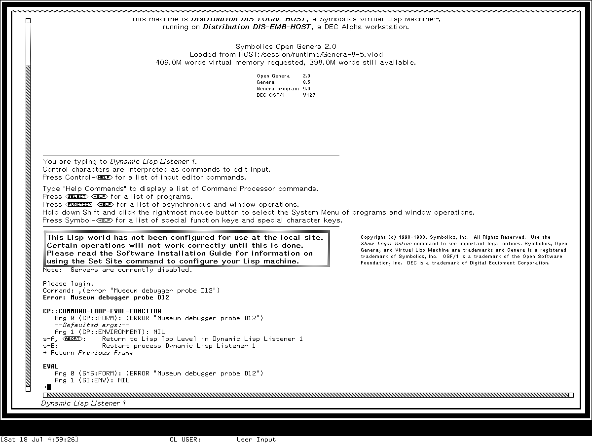

# Ragged window borders in Symbolics Genera

Yes: Genera implements the zig-zag, or **ragged**, border on the left and right
sides as well as the top and bottom. The side form is a rotated renderer, not a
different ornament. In the selected System 452.22 source profile, the four edges
report whether the Dynamic Window has undisplayed content beyond that edge:

| Edge | Becomes ragged when |
| --- | --- |
| left | the viewport's left coordinate is greater than zero |
| top | the viewport's top coordinate is greater than zero, or a secondary viewport exists |
| right | the viewport's right coordinate is less than the recorded maximum horizontal position |
| bottom | the viewport's bottom coordinate is less than the recorded maximum vertical position, or a secondary viewport exists |

The important conclusion is semantic: a ragged edge means **the visible pane is cut
out of a larger retained output area in that direction**. It should not be read as a
title decoration, pane-selection mark, generic separator, or drop shadow.

## What the pattern looks like

The horizontal renderer makes a repeating peak-and-valley path with a ten-pixel
period. The vertical renderer rotates the construction: its first path runs from
one side at vertical offset 0, to the other side at offset 5, and back at offset
10. A second path displaced by one pixel thickens the mark when the configured
border thickness permits it.

These are orientation schematics, not recovered pixels:

```text
top or bottom:  /\/\/\/\/\/\/\/\/\

one side period:
                (0,0)
                    \
                     (width,5)
                    /
                (0,10)
```

The implementation constructs one period in a temporary one-bit raster, doubles
it with bit-block transfers, and copies complete periods into the margin. A
horizontal remainder is placed at the left so the complete periods align at the
right; a vertical remainder is placed at the top so the complete periods align at
the bottom. This anchoring is observable at pane sizes that are not multiples of
ten and belongs in a pixel-compatible reconstruction.

The default ragged-border thickness is two pixels. Margin allocation reserves two
additional pixels beyond that thickness for the diagonal excursions. A pane may
choose another thickness: many inspected application panes request one pixel, while
the supplied tombstone-style composition requests three.

## Why side borders are less often seen

Side support is enabled by default. The source option that controls it is named
`horizontal-too`; despite that name, its effect is to allocate and draw the left and
right pair in addition to the always-allocated top and bottom pair.

The convention is nevertheless easier to notice on horizontal edges:

- output histories commonly grow and scroll vertically;
- ordinary text panes commonly begin at horizontal position zero;
- wrapping or pane width often prevents a recorded horizontal extent from extending
  beyond the right viewport edge; and
- the left or right edge remains a straight border until the corresponding
  horizontal continuation predicate becomes true.

Thus the absence of a zig-zag side in a screenshot is normally a statement about
that viewport state, not the absence of side-border machinery. One inspected
application makes a narrower choice explicitly: the Notifications activity sets
`horizontal-too` false, so its ragged component reserves and draws only the top and
bottom pair. The selected readable source contains no comment establishing the
designer's reason; only the exact effect is asserted here.

## Drawing and update contract

`MARGIN-RAGGED-BORDERS` is a Dynamic Windows margin component derived from the
ordinary border component. Its behavior is:

1. Ask the owning Dynamic Window for four ragged-state booleans.
2. Draw a ragged raster on each true edge and a straight rule on each false edge.
3. Cache the four booleans.
4. After a new scroll position, compare the new booleans with the cached values.
5. Erase and redraw only edges whose state changed.

The renderer uses the window's drawing and erasing raster operations. It is
therefore part of the window margin and viewport update lifecycle, not content
painted into the retained output history.

A secondary viewport forces both top and bottom true in the selected method. The
visible consequence is that both horizontal boundaries advertise that the single
client rectangle is not a simple unbroken view of the complete vertical history.
The selected source establishes that rule, but not its user-facing rationale; the
present runtime set has not isolated every secondary-viewport transition.

## Where Genera used it

The standard Dynamic Window flavor selects a composition containing ragged borders,
a vertical history scrollbar, a bottom history scrollbar, white spacing borders,
and a label. The Listener-specific composition also starts with ragged borders, then
uses a wider vertical scroll target, an italic bottom label, a bottom scrollbar, and
white borders.

A reproducible search of the selected readable System 452.22 source found the
`MARGIN-RAGGED-BORDERS` name in 35 Lisp source files and 78 textual occurrences.
That denominator includes the implementation and presets, live callers, and two
commented-out examples; it is an inventory of selected source text, not proof that
every program was loaded into the preserved world.

Source-visible callers include:

- the Dynamic Window and Listener defaults, Accepting Values, Help, and the generic
  sequence-reordering clients;
- ZWEI/Zmacs screens, Dired, mail screens, Zmail, Converse, and Mailer logging;
- Display Debugger, Peek, Flavor Examiner, Select Key Selector, and Notifications;
- Bitmap Editor, Font Editor, Stipple Editor, Graphic Editor, and Keyboard Control;
- Terminal, Namespace Editor, Document Examiner, Statice Browser, and Remote
  Program; and
- several Joshua example interfaces.

This breadth explains why the motif appears across apparently unrelated
applications: it belongs to a reusable Dynamic Windows margin composition.
Application inclusion says that the pane can display the component. The edge still
becomes ragged only when its current viewport predicate is true.

## Reviewed runtime example



*Runtime observation: the reviewed 1200-by-900 Genera 8.5 capture from 2026-07-18
shows the Dynamic Lisp Listener's top margin in the ragged state while its left and
right outer edges remain straight. It establishes the visible horizontal motif in
this one debugger/listener state. Source establishes the side renderer and its
predicate; this image does not establish that the preserved world exercised a
horizontally panned side-ragged state.*

The visible zig-zag is separate from the diagonally hatched scrollbar shaft at left
and bottom. It is also separate from white spacer borders, straight rules,
tombstone-style nested borders, and the lower-right stippled shadow used on some
temporary windows and menus.

## Reconstruction requirements

For a System 452.22 visual/behavioral reconstruction:

- model the four continuation predicates independently;
- draw top and bottom even when side rendering is disabled;
- enable the side pair by default and honor an application override that disables
  it;
- use straight rules for false predicates instead of removing the margin;
- preserve the ten-pixel repeat and right/bottom phase anchoring for pixel
  compatibility;
- reserve the diagonal excursion outside the configured straight-rule thickness;
- update only the edges whose predicates changed after a scroll; and
- keep the border outside retained application output and presentation hit regions.

For a web interface inspired specifically by Genera, use ragged borders only as
overflow/continuation indicators. A CSS `border-image` repeated decoratively on
every pane would reproduce the silhouette while reversing its meaning. Keep the
one-bit pattern at native or integer-scaled pixels; fractional scaling creates the
same visual damage as resampling the system's bitmap fonts and stipples.

`TODO-RUNTIME-RAGGED-SIDES`: in a fresh isolated Genera harness session, create a
researcher-owned Dynamic Window with an unwrapped horizontal extent wider than its
viewport; capture the right-ragged state at horizontal origin zero, pan right, then
capture simultaneous left-ragged and (until the end is reached) right-ragged states.
Record the exact viewport coordinates, maximum horizontal position, margin options,
input actions, screenshot hashes, and shutdown result. This would close the
preserved-world visual oracle without publishing licensed application content.

## Evidence and provenance

The implementation evidence is readable licensed source selected for the installed
Genera 8.5/System 452.22 tree. The files remain local and untracked; only metadata
and original analysis are published.

| Artifact-relative file | Bytes | SHA-256 | Relevant evidence |
| --- | ---: | --- | --- |
| `sys.sct/dynamic-windows/dynamic-window-mixins.lisp.~204~` | 139,058 | `d1c9db01f37982f10efdd5f7f21dff938a437c4b1f80633c04054158be87a482` | horizontal and vertical drawing, component defaults, allocation, edge redraw, standard compositions |
| `sys.sct/dynamic-windows/dynamic-window.lisp.~625~` | 177,680 | `92e9322d4e04020d014055ab452036ff7df2adfe13570eb8c99c02e369de55ca` | four viewport predicates and secondary-viewport rule |
| `sys.sct/dynamic-windows/dynamic-window-flavors.lisp.~29~` | 7,154 | `50fd3a8d734f63cdac289bac286056ade066a594039fe9dfd15402eefd7d1279` | default Dynamic Window margin composition |
| `sys.sct/window/notifications-activity.lisp.~4011~` | 8,339 | `41f5deee29753d0a0fc26c513818cb4e125315d8be6afc5f4cbd8bada5881f02` | explicit top/bottom-only application configuration |

The source spans inspected were
`dynamic-window-mixins.lisp.~204~:1260-1405,2808-2852`,
`dynamic-window.lisp.~625~:3082-3089`,
`dynamic-window-flavors.lisp.~29~:157-171`, and
`notifications-activity.lisp.~4011~:78-84`.

The runtime image and its complete capture provenance, hashes, attribution, rights
basis, and project-license exclusion are recorded in the
[curated Genera screenshot catalog](../assets/genera-screenshots/index.md). The
[Dynamic Windows specification](dynamic-windows-reimplementation-specification.md)
turns these findings into a normative viewport-margin contract.

Last verified: 2026-07-26.
