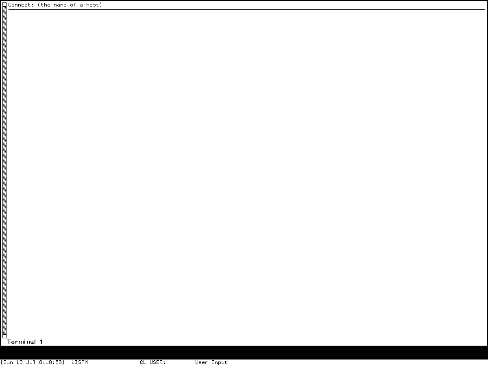

# System 452.1 Genera Terminal bindings, protocols, and simulators

This document is the normative reconstruction companion for the outgoing Genera
**Terminal** program. It specifies the source-selected window, command reader,
complete effective input graph, connection state, protocol/filter pipelines,
terminal simulators, ordering, failures, and test obligations without reproducing
licensed Symbolics source. It should be read with the historical
[SUPDUP, Telnet, and the Genera Terminal program](../network-terminal-applications.md)
dossier, which supplies broader history and the distinct MIT CADR/LM-3 comparison.

The central conclusion is narrow but substantial: the selected program is a TV
stream and Dynamic Windows typeout client with Command Processor command tables and
presentation-aware input. It is not a CLIM application. Its network path is a
composition of a login protocol, ordered input and output filters, mutable state
blocks, and one selected terminal simulator. The preserved Genera 8.5 world has
confirmed the disconnected visual state and entry path only. Connected negotiation,
remote display, and peer-dependent failures remain explicit runtime oracles rather
than inferred world behavior.

## Status, scope, and reconstruction claim

The words **MUST**, **MUST NOT**, **SHOULD**, **SHOULD NOT**, and **MAY** are
normative. A `TODO-RUNTIME` is an oracle gap, not permission to invent behavior.
`STRICT` means preserving a selected-source behavior even when it appears defective;
`CORRECTED` means intentionally substituting a documented safer behavior and
reporting that divergence.

### Release profiles

| Profile | Exact target | Permitted claim |
| --- | --- | --- |
| `NT-G4521-U445-SRC` | The licensed readable Terminal sources selected by Utilities 445, whose component directory was written under System 452.1 | Normative source-profile structure, local bindings, state transitions, protocol/filter behavior, simulator behavior, ordering, and failures specified here |
| `NT-G85-S45222-RUN` | Genera 8.5 System 452.22 under Open Genera 2.0, isolated session `d10-network-terminal-genera-20260719`, generation 1 | Only the entry, disconnected prompt, visible geometry, and other actions explicitly recorded below |
| `NT-G-MAN-R7-I440` | Installed-440 keyboard and networking manuals; the networking manual self-identifies Release 7.0 | Secondary descriptions and terminology, never an override of source or runtime evidence |
| `NT-G4520-HC446-SRC` | Companion-only Hardcopy 446 component directory written under System 452.0, selecting the inspected Hardcopy window source | Conditional marked-text hardcopy gesture only; not proof that the module was resident in the runtime world |
| `NT-G-IMG-SRC` | Companion-only inspected Image Substrate file-format source | Conditional image pickup gesture only; exact release and runtime residency remain unresolved |

The System 452.1 source and System 452.22 world have **not** been proven
load-identical. Every conformance result MUST name one profile. A source fact MUST
NOT be presented as an observation from `NT-G85-S45222-RUN`, and a screenshot MUST NOT
be used to prove an unexercised source branch. A combined label means “implements
the selected source contract and compares the named bounded runtime states,” not
“the world contains byte-identical functions.”

### Compatibility levels

| D10 level | Required Genera closure |
| --- | --- |
| `L1` disconnected shell | Profile-tagged window/stream state, exact entry and reuse rules, disconnected prompt/label, cancellation, no-peer lifecycle, and the reviewed visual relationship |
| `L2` local interaction | `L1`, complete effective direct/prefix/numeric/Help/menu/pointer/presentation/context/unbound tree, two-process behavior, and local option transitions |
| `L3` protocol and display | `L2`, complete connection lifecycle, byte-exact host parsing, all built-in login protocols, filters, terminal simulators, file transfer, wallpaper, ordering, failure injection, and deterministic recording peers |
| `L4` preservation comparison | `L3`, connected System 452.22 comparison against isolated deterministic peers, negotiation and byte-stream traces, timing-visible behavior, runtime registry dump, visual states, and closure of every mandatory oracle for the claimed feature set |

The filter-stream data model, registration interfaces, state blocks, and deterministic
adapters below are prerequisites for every level, not a separately claimable shell.
This document supplies the `NT-G4521-U445-SRC` contract through `L3` and bounded
`NT-G85-S45222-RUN` evidence for part of `L1`. It does not establish `L4`.

It makes no claim of source API compatibility, ABI or compiled-file compatibility,
loader or load-contract compatibility, world-image compatibility, exact pixel or
timing compatibility, Internet interoperability, support for every historical
Symbolics patch level, or correctness
of an arbitrary site-modified command/simulator registry. A reimplementation that
makes one of those stronger claims MUST state and test it separately.

### Normative companion incorporation

The complete effective binding tree is the union of this document's local overlays
and the following exact in-repository sections. These are incorporated normatively,
not cited as optional background:

| Owner | Normatively incorporated section | Terminal use |
| --- | --- | --- |
| Program selection | [G85 Select and Function prefixes](../program-selection-activities-and-window-management-reimplementation-specification.md#g85-select-and-function-prefixes) | `Select T`, Control force-create, modifier normalization, Help, Rubout, disabled keys, and unresolved suffix behavior |
| Program selection | [Pointer and application-local trees](../program-selection-activities-and-window-management-reimplementation-specification.md#pointer-and-application-local-trees) | selected/unselected-window routing, double-Right System Menu escape, blank-screen routing, and generic window operations |
| Dynamic Windows | [Input-editor dispatch and complete base command map](dynamic-windows-reimplementation-specification.md#input-editor-dispatch-and-complete-base-command-map) | disconnected `Connect` argument editing, command argument readers, Options dialog fields, history, correction, numeric state, and unbound behavior |
| Dynamic Windows | [Logical gestures](dynamic-windows-reimplementation-specification.md#logical-gestures) | all 96 primary pointer cells, aliases, chord encoding, double-click construction, and cache obligations |
| Dynamic Windows | [Applicability](dynamic-windows-reimplementation-specification.md#applicability) and [Resolution algorithm](dynamic-windows-reimplementation-specification.md#resolution-algorithm) | context/type/tester gating, nested presentation selection, menu-only handlers, blank-area behavior, dead blips, and precedence |
| Dynamic Windows | [Command tables](dynamic-windows-reimplementation-specification.md#command-tables) and [Prefixes, accelerators, and command-or-form reading](dynamic-windows-reimplementation-specification.md#prefixes-accelerators-and-command-or-form-reading) | inherited command-name acquisition, prefix and accelerator ownership, menu/presentation entry, correction, and execution boundary |
| Dynamic Windows | [Accepting Values](dynamic-windows-reimplementation-specification.md#accepting-values) | `Network X` option-sheet transaction, redisplay, field editing, Exit, Abort, and typed/pointer interaction |
| Dynamic Windows | [Error, abort, and transactional behavior](dynamic-windows-reimplementation-specification.md#error-abort-and-transactional-behavior) | generic Input Editor, command reader, menu, and Accepting Values abort rules where no local override is stated |

Local cells win only in their declared contexts. An absent local cell falls through
to the incorporated owner only where this document explicitly names a parent. A
hard local error or consume result stops lookup. A conforming implementation MUST
emit an effective-tree dump with context, raw event, normalized event, prefix path,
numeric state, owner, selected leaf, shadowed candidates, and fallback; a flat list
without ownership is insufficient.

## Evidence and provenance

### Evidence vocabulary

| Code | Meaning |
| --- | --- |
| `G452-SRC` | Direct inspection of the selected licensed System 452.1 source; only original paraphrase and factual identifiers appear here |
| `G85-RUN` | Direct observation in the separate Genera 8.5 System 452.22 world through the isolated Xvfb harness |
| `G-MAN` | Installed contemporary Genera documentation, used as secondary evidence |
| `INTERP` | Clean-room design rule or conclusion derived from the evidence, explicitly not a historical observation |
| `TODO-RUNTIME` | Required preserved-world or peer oracle not yet established |

### Licensed source identity ledger

The source files remain untracked local licensed inputs. Paths are archive-relative,
sizes are bytes, and hashes are SHA-256 so a licensee can repeat the audit without
this repository redistributing the files.

| Artifact-relative source | Size | SHA-256 | Principal evidence |
| --- | ---: | --- | --- |
| `sys.sct/network/telnet.lisp.~1600~` | 142,464 | `8560d82fc6327e1638769d200c6b9aa32b47a486de4ecdeb7484b1715e8239e5` | Terminal window, commands, filters, login protocols, Telnet, ITP, SUPDUP, 3600, TTY/CHAT, simulators, ANSI, registration |
| `sys.sct/network/network-terminal.lisp.~1542~` | 28,756 | `1d40d93a67f145040fe6792e3153ddcada6feb99739f2ee212fab344d3e1e630` | incoming Network Terminal server substrate and the scope boundary below |
| `sys.sct/network/remote-terminal.lisp.~1597~` | 63,584 | `1a28e88823a10d65616244ad816337658770a16f29886d6dfd7c4a749d2298b1` | incoming remote-console behavior and shared network terminal dependencies |
| `sys.sct/sys/utility-sysdcl.lisp.~133~` | 8,922 | `fa1a9008314855cc991457131fbcb5b46a8746db5aa22078abf7f7911e81baa0` | Utilities system composition |
| `sys.sct/patch/utilities.system-dir.~214~` | 7,861 | `eb400788b288d981abd3c8170a548a9600b438a866db2c68c3079886d29463b1` | Utilities release directory context |
| `sys.sct/patch/utilities-445/utilities-445.component-dir.~2~` | 5,541 | `99484f1129de054b862bfa33022fe822231c354a5e6d8b72bd8cdd44a7789061` | selected component versions and System 452.1 release context |
| `sys.sct/cp/comtab.lisp.~103~` | 36,295 | `f60724c8e2526950000f090f2dae4745b3394079713b3601606be865c23b98e1` | command-table construction, tests, parents, and lookup |
| `sys.sct/cp/read-accelerated-command.lisp.~142~` | 37,639 | `8107cf4e993068344e624ec924c8d0cf0327158a927c1962666d22eb81494388` | accelerated-command reader, Help loop, numeric arguments, and errors |
| `sys.sct/cp/substrate-commands.lisp.~6~` | 14,731 | `558f085cc3953de3f831e4e9e195104303e9e6331861a9ed629b550870fb4f44` | Standard Arguments, unshifted arguments, Marked Text, and Input Editor compatibility |
| `sys.sct/window/peek.lisp.~4073~` | 53,972 | `5e77404cbd17c26b21d457a99354da3c0a755b696597e35e8749b37596b56bcf` | Peek host menu's Remote Login entry path |
| `sys.sct/hardcopy/windows.lisp.~1530~` | 20,471 | `5343be4fec3eb73be175b551e969bb090df4f74275c2cb78ff658d1ed35c8e2d` | conditional marked-text Hardcopy translator |
| `sys.sct/hardcopy/patch/hardcopy-446/hardcopy-446.component-dir.~2~` | 2,355 | `6a0edaa70e3b1e6eb61cf7c55827f3209c39fc722e22e22f43140599f0dc601b` | Hardcopy 446 / System 452.0 selection context |
| `sys.sct/image-substrate/file-formats.lisp.~27~` | 38,632 | `0cf15874adb102eb2f7951d12069ea820bdd19e5995482819cac5adf729d8021` | conditional screen-image pickup translator |

Within the principal Terminal source, the audited regions are: command table and
window classes (lines 69–483), parser/presentations and processes (485–709),
connection lifecycle (711–832), filters and commands (863–1259), login protocols
(1266–1370), More and auxiliary filters (1378–1506), Telnet (1545–1799), ITP
(1803–1908), SUPDUP (1912–2167), 3600 (2170–2232), simulator registry and Glass
(2246–2403), graphics (2411–3237), ANSI simulators (3239–3667), and the `Select T`
registration (3682). Line numbers identify the inspected source only; they are not
public links and no licensed source text is reproduced.

### Manual evidence

| Evidence-only extracted artifact | Size | SHA-256 | Extraction-source SHA-256 | Use |
| --- | ---: | --- | --- | --- |
| installed networking manual `netio1` | 10,688 | `172e25d09c4a94aba0e74b20afe2098139ab77bbebe3499fd83083995aac3fef` | `6760f4cc4a92a2bd5b10733c7918d52a7c62ccf8522561be0d107cd975b50ca7` | user workflow, services, protocol and simulator vocabulary; self-identifies Release 7.0 |
| installed keyboard manual `lms5` | 32,831 | `12cc014888759edb02a506da346803e05f2b6f758959a1f0a0d8ac690bfdbd1d` | `525bfb308edb58075013932701ce8cea9fe600fee6717e5c6a0b379299730ca4` | Network prefix, pointer marking, Input Editor and shared-key descriptions |

These decoded proprietary manuals stay under the ignored Genera help tree. This
specification paraphrases them and treats source/runtime disagreement explicitly.

### Source, manual, and runtime disagreements

| Topic | Manual or intuitive reading | Selected source / bounded runtime | Normative result |
| --- | --- | --- | --- |
| disconnected prompt | The networking manual gives a longer “connect to host” phrase | `G85-RUN` visibly shows `Connect: (the name of a host)` | Runtime wording is the visual oracle for `NT-G85-S45222-RUN`; source-profile parsers need only the semantic host argument unless claiming that runtime profile |
| initial label | Source initializes a disconnected tag | Runtime initially displays `Terminal 1` without the tag | Initialization does not prove recomputation; preserve profile distinction and test label transition on explicit connect/disconnect |
| presentations | Manual says Terminal does not provide presentations | Source provides narrow terminal-input and simulator-type presentation paths plus recorded-text integration | Interpret the manual as “no semantic remote-application object model,” not literal absence of Dynamic Windows presentations |
| backward scrolling | Manual omits or narrows a Meta-Scroll path | Selected source handles local backward Scroll variants | Source profile wins; runtime remains to be exercised |
| marked text | Manual describes removing marked text | Shared source collects marked strings, unmarks them, and pushes them to the kill ring | Preserve collection order, unmarking, and kill-ring effect |
| output recording | Manual command inventory is incomplete | Source has a mutable recording option that controls recorded-text interaction | Include it and test both states |
| pointer actions | Manual gives three prominent mouse actions | Effective Dynamic Windows map has 96 primary raw cells plus aliases and generic/window handlers | Incorporate the complete companion map; do not treat the manual list as exhaustive |
| CTERM | Manual names CTERM | It is not implemented by the selected Terminal source | Model it only as an external registered login protocol when present |
| Help | Manual-style list appears complete | Canned Help omits at least the direct File accelerator and several long commands | Reproduce the selected curated list, not an automatically complete listing |
| VT100 | Broad descriptions can imply a full terminal | Source parser implements a bounded ANSI/VT subset | Claim only the exact subset below |
| filter reset | An output tick can sound like a reset | Tick change rebuilds fast-path composition without resetting filter state | Preserve state unless an explicit reset transition occurs |

## Architecture and ownership boundary

### Component graph

```text
entry and reuse
├─ Create Terminal / Select T / Peek Remote Login
└─ NVT window allocation or idle-window reuse

NVT window
├─ TV minimum-window and graphics/stream behavior
├─ Dynamic Window with typeout and recorded output
├─ Command Processor readers and command table
├─ typein process: keyboard -> input filters -> network stream
├─ typeout process: network stream -> output filters -> screen
├─ connection state blocks and mutable options
└─ label, wallpaper stream, simulator, histories, and locks

connection construction
├─ Generic Network service/path resolver
├─ login protocol registry
├─ ordered input filter chain
├─ ordered output filter chain
└─ one terminal simulator registered into the output chain
```

### Terminal is TV/Dynamic Windows, not CLIM

The selected top-level class combines TV stream, graphics, selection, process, and
minimum-window behavior with a Dynamic Windows window-with-typeout facility. It uses
Command Processor command tables and accelerated-command reading, Dynamic Windows
presentations and Accepting Values, and output recording. No inspected dependency
declares a CLIM application frame, CLIM pane, CLIM port, or direct CLIM protocol use.

A conforming reconstruction MUST identify the substrate as TV + Dynamic Windows +
Command Processor. It MUST NOT infer CLIM from shared terms such as frame, pane,
presentation, command table, graphics, or redisplay.

### Outgoing versus incoming terminal facilities

This document specifies the outgoing `NVT-WINDOW` Terminal application. The
separately named Network Terminal and Remote Terminal sources implement incoming
remote-console/server infrastructure. They share dependencies and some vocabulary,
but they are not alternate names for this outgoing client. A reimplementation MUST
keep incoming listeners, remote console authentication, exported streams, and server
session ownership outside this contract until a separately profiled specification
incorporates them.

## Semantic state model

### Required records

A conforming implementation MUST expose inspectable equivalents of the following
records. Internal representation and names MAY differ.

| Record | Required observable fields |
| --- | --- |
| `terminal-window` | stable identity; display name; label tag; selected/exposed/enabled state; pending target; active network stream or none; typein/typeout process identities; ordered filter roots; simulator identity or Glass; state-block sequence; typeout completion; recording flag; overstrike flag; local-echo flag; More flag; escape character; wallpaper pathname and stream; echo position; output tick |
| `connection-plan` | host specification; resolved host; requested service; login protocol; service arguments; stream kind; ordered input and output filter constructors; simulator request/default; explicit option provenance |
| `filter-node` | direction; upstream/downstream; pending untyi element; setup/reset state; optional fast-path function; optional state-block reference |
| `state-block` | owner/filter kind; current values; setup count; reset count; whether newly allocated for this connection |
| `command-read-state` | active command table; normalized character; prefix stage; argument-present flag; signed magnitude; digit count; Help/retry state; typeout window |
| `simulator` | registered name; output filter; input translation hook if any; viewport; cursor; attributes; character-set selection; simulator-specific parser state |
| `wallpaper` | pathname; open stream or none; last approximated cursor position; disabled/failure reason |

All nondeterministic effects MUST pass through explicit adapters: host/path resolver,
network open/close/read/write/listen, clock/tick, scheduler/process, keyboard/pointer,
screen/graphics, filesystem, kill ring, printer, and condition/debugger. Tests MUST be
able to replace each adapter independently.

### Source-profile initial state

On a newly allocated Terminal screen, the source profile requires:

| Property | Initial value or policy |
| --- | --- |
| overstriking | true |
| output recording | true |
| wallpaper | none |
| character attributes | none |
| echo position | zero |
| output tick | zero |
| saved bits | true |
| deexposed typeout | notify |
| asynchronous characters | none |
| margins | ragged margins, left scroll bar, bottom label using bold Swiss styling, white two-unit border |
| end-of-page action | scroll |
| connection | no network stream; no committed input/output chain |
| processes | one typein process and one typeout process owned by the window |
| name | `Terminal N`, with `N` allocated by an interrupt-protected counter |

The selected source initializes the label tag to its disconnected value, while the
constructor itself does not visibly call the label-recomputation method. Separately,
the System 452.22 runtime witness displayed `Terminal 1`. The screenshot establishes
only those rendered pixels; it cannot reveal the hidden label tag or prove when a
recomputation did or did not occur. `L2-STRICT` MUST preserve the source-visible
initial field value, `NT-G85-S45222-RUN` MUST preserve the observed rendered label,
and the relationship between them remains `TODO-ORACLE-G-INITIAL-LABEL` rather than
being inferred from either evidence layer.

### Core invariants

1. At most one committed network stream belongs to a Terminal window.
2. A window is reusable only when both its network stream and pending target are
   absent.
3. The typein and typeout processes are distinct. Network output must never wait on
   a local command reader in the typein process except through an explicit shared
   state or lock.
4. Network writes are serialized by the connection's write lock. Simulator
   replacement and filter setup are not retroactively covered by that lock.
5. A committed input chain is ordered from screen/keyboard toward the stream; a
   committed output chain is ordered from stream toward the screen.
6. Every filter receives setup/reset in the specified direction and order. Rebuilding
   a fast function because the output tick changed is not a filter reset.
7. The visible label is derived from name, current label tag, connected simulator
   suffix when non-Glass, and wallpaper marker. Stored and rendered values remain
   separately observable.
8. Output recording false disables the recorded-text presentation context; it does
   not merely hide a menu item.
9. The configured local escape character applies only to the current connection's
   More filter and returns to the default on the next connection.
10. Failed or partial transitions preserve their actual intermediate state; no
    transaction rollback may be invented where the selected source has none.

## Entry, allocation, selection, and destruction

### Entry paths

The selected profile has three semantic entry routes, with different allocation
contracts:

1. **Create Terminal** invokes the System menu's generic Create operation, constructs
   a fresh Terminal window with the mouse-selected geometry, and selects it. It does
   not search the idle-window list.
2. **Select T** uses the global Select prefix and generic activity-selection policy,
   which may select an existing current, recently selected, or exposed Terminal or
   create one. The exact Select normalization,
   Control force-create flag, disabled-key handling, Help, Rubout, and failure tree
   are the incorporated D02 `G85 Select` contract. The suffix is uppercased and
   modifier bits are stripped; only Control retains separate meaning as force-create.
   There is no Select numeric-argument stage.
3. **Peek Remote Login** chooses a host from Peek's host menu, calls the direct
   target-reserving lookup described below, and then selects the returned Terminal.

An implementation MAY expose a direct programmatic `get-window-to-host` operation,
but that API name is not required for compatibility. Its observable allocation and
selection behavior is.

### Idle-window reuse

The direct target-reserving lookup used by Peek and programmatic remote-login callers
MUST scan `previously-selected-windows` in array order under one
interrupt-suppression boundary. It MUST claim the first Terminal for which both
`network-stream = none` and `pending-target = none`; this is not an implementation
choice. Claiming calls the window's target setter before leaving the protected scan,
and that setter MUST flush the typein process before storing the pending target. If
the scan finds no eligible window, the lookup leaves the protected region and creates
a fresh Terminal with the target supplied at initialization. It returns the window;
the caller, rather than the lookup itself, selects it.

The Create route always constructs fresh. The Select-T route follows the incorporated
D02 generic activity selector, including Control force-create; it MUST NOT be
silently replaced with the direct first-idle scan. These three routes therefore share
a window flavor but not one allocation algorithm.

This is a reservation protocol: `pending-target` prevents two concurrent callers
from claiming the same disconnected window before its typein process begins the
connection. Clearing that reservation and the exact result of a failure before the
typein process consumes it are `TODO-RUNTIME`; a replacement MUST document its
choice and MUST NOT silently claim strict fidelity.

### Selection and burial

Selecting or exposing a Terminal MAY reset/wake the typein process according to the
TV process substrate. Generic Function-Bury is discovered dynamically by the source
Help command and preserves the connection, protocol state, and screen contents. Its
completion waits for deexposure and then re-exposure; a strict scheduler can
therefore wait indefinitely if the window is never selected again.

### Kill boundary

The Terminal-specific kill method stops or enables its two processes as required by
the inherited lifecycle. Whether inherited destruction always runs the full
connection-disconnect cleanup is not established by the selected local method and is
`TODO-RUNTIME`. `L2-CORRECTED` MAY require disconnect-before-destroy, but MUST
report the divergence; `L2-STRICT` MUST preserve the observed/source-confirmed
path once the oracle is closed.

## Complete effective input and gesture tree

### Context dispatcher

The effective input graph begins with window state and semantic context, not with a
single flat key table:

```text
Terminal input event
├─ global Select/Function/System or unhandled sheet event
│  └─ incorporated D02 prefix and pointer trees
├─ disconnected host prompt or command argument prompt
│  └─ incorporated Dynamic Windows Input Editor tree
├─ connected ordinary keyboard character/list event
│  └─ input protocol mapping, then ordered input filters
├─ connected configured local escape
│  └─ MoreEscape local accelerated-command reader
│     ├─ direct local accelerator
│     ├─ numeric argument stage
│     ├─ full-command stage (`:`, M-X, or C-M-Y)
│     ├─ Help -> display curated Help and reprompt in the same reader
│     ├─ Rubout -> cancel, except when Rubout is the configured escape
│     └─ unknown -> beep, clear input, report, and reprompt
├─ `Network X` Accepting Values sheet
│  └─ local option fields + incorporated Accepting Values/Input Editor trees
├─ recorded terminal text presentation
│  └─ local presentation handlers + incorporated gesture resolver
└─ blank/window/presentation pointer event
   └─ local overlay below + incorporated 96-cell and sheet routing trees
```

Lookup of a fixed accelerator precedes the configurable-escape tester. Therefore an
escape configured to the same character as a fixed accelerator invokes that
accelerator rather than sending a literal escape. The exception is bare Rubout:
when Rubout is configured as the escape, the escape tester runs before the ordinary
Rubout-cancel fallback and sends the literal escape path.

### Fixed accelerated-command cells

The selected Terminal table contributes exactly 63 normalized accelerator cells.
Case-equivalent letters are aliases under the table's character comparison, not
additional Shift-specific cells.

| Family | Cells | Count |
| --- | --- | ---: |
| local commands | `A`, `B`, `D`, `L`, `Q`, `M`, `F`, `C-Y`, `M-W`, `X`, `Help` | 11 |
| Standard Arguments | Control, Meta, and Control-Meta variants of `-`, each digit `0`–`9`, and Infinity; plus `C-U` | 37 |
| Unshifted Arguments | `-`, digits `0`–`9`, Infinity | 12 |
| full-command/history entry | `:`, `M-X`, `C-M-Y` | 3 |
| **Total** |  | **63** |

No other local character is silently self-inserting in this reader. An unknown cell
beeps, clears the current command input, displays an error, and reprompts. Bare
Rubout cancels silently unless it is the current local escape. Help uniquely prints
documentation and stays in the reader; every other successfully completed command
returns from that reader after execution.

### Numeric-argument automaton

The local reader MUST retain exactly the source-visible pair `(argument-kind,
argument-value)`. It begins as `(nil, 1)`; a non-NIL kind is also the
argument-present flag.

```text
minus / :sign:
  kind := :sign
  value := -1

C-U / :control-u:
  kind := :control-u
  value := value * 4

Infinity / :infinity:
  kind := :infinity
  value := (2^40) * signum(value)

digit d / :digit:
  if prior kind != :digits:
    kind := :digits
    value := signum(value) * d
  else:
    value := (value < 0 ? -1 : +1) * (abs(value) * 10 + d)
```

Minus is a reset, not a sign toggle or sign bit: `C-U` then minus and digits then
minus both produce `(:sign, -1)`. Repeated `C-U` from the initial state produces 4,
16, 64; minus then repeated `C-U` produces -4, -16. Infinity from an argument value
of zero remains zero. The first digit after C-U or Infinity replaces that magnitude
using its sign; the first digit after minus preserves the negative sign unless the
digit is zero. Thus minus, `0`, `5` produces positive 5 because the zero loses the
negative sign before the next digit. The `2^40` value is the selected source's finite
sentinel, not mathematical infinity.

Only `Network M` accepts the resulting numeric value among direct local commands:
no argument toggles More processing, explicit zero disables it, and every nonzero
value, including a negative value, enables it. Other direct local commands and the
colon/`M-X` entry reject a supplied argument through the accelerator error path.
`C-M-Y` accepts it: zero opens input-history display/selection, while a nonzero value
selects an initial prior command. After an argument key, the source briefly waits for
typeahead and shows an `Arg` indication only when input pauses.

### Direct local command leaves

| Binding | Command | Exact selected-profile effect |
| --- | --- | --- |
| `Network A` | Send Interrupt | inject the protocol-neutral interrupt event into the input filter chain |
| `Network B` | Bury Window | invoke the dynamically found generic bury command; keep connection and state |
| `Network D` | Disconnect | run the disconnect transition and report completion when control returns |
| `Network L` | Logout | send the protocol logout control, then immediately run abortive disconnect |
| `Network Q` | Disconnect and deselect | disconnect, then take the deselection nonlocal exit; later ordinary completion text is not reached |
| `Network M` | Set More Processing | toggle with no numeric argument; zero disables; any other explicit number enables |
| `Network F` | Send File | enter the active source-selected send-file path and prompt for its arguments |
| `Network C-Y` | Send String | take the top kill-ring entry, convert an interval to a string if needed, and send it without the outer MoreEscape interpretation |
| `Network M-W` | Push Marked Text | gather all supported marked strings, unmark them, and push the ordered collection into shared kill history; do nothing visibly if none exist |
| `Network X` | Set NVT Options | open the Accepting Values option sheet described below |
| `Network Help` | Canned Help | display the curated local help and remain in the local reader |

The `M-W` operation walks the top frame, exposed inferiors, and typeout windows that
support marking. It does **not** install the entire shared Marked Text command table
into Terminal merely because it calls that substrate. `C-Y` and presentation-yanked
text take different routes: `C-Y` deliberately bypasses the outer MoreEscape filter,
while presentation-yanked recorded text is passed through the complete typein filter
chain and can invoke the local escape if its bytes contain that character.

### Full command inventory

The selected command table has 16 live long command names:

| Command | Argument/effect contract |
| --- | --- |
| Connect | parser/entry command that resolves a host/service and begins connection; not a connected local accelerator |
| Send Interrupt | protocol-neutral list event through input filters |
| Disconnect | ordered disconnect transition |
| Set More Processing | Boolean option using the numeric rules above when accelerated |
| Set Output Recording | enable/disable recorded output and its presentation context |
| Send File | source-selected text/file send path |
| Receive File | source-selected receive/XMODEM path when the protocol/stream supports it |
| Send String | send supplied string through its specified bypass route |
| Set Terminal Simulator Type | replace the active output simulator nontransactionally |
| Set Escape Character | update only the current connection's MoreEscape filter |
| Set Wallpaper File | replace or remove the current wallpaper stream |
| Set Overstriking | set screen overwrite behavior |
| Set Local Echoing | update echo state through the applicable filter state block |
| Set NVT Options | open the combined options sheet |
| Canned Help | render the curated Terminal help |
| Bury Window | generic burial while retaining session state |

An older, feature-disabled send-file form is not a seventeenth live command. A
runtime/site command-table dump MAY contain additional registered commands, but it
must report them as profile mutations, not silently fold them into this source
closure.

### Canned Help tree

The Help output is curated rather than generated exhaustively:

```text
Canned Help
├─ single-key rows: A, B, D, L, Q, M, X, C-Y, M-W, :
│  ├─ command presentations: A, B, D, L, Q, X, C-Y
│  └─ plain text only: M, M-W, :
├─ extended-command-name presentations
│  ├─ Set Terminal Simulator Type
│  ├─ Set Escape Character
│  ├─ Set Wallpaper File
│  ├─ Set Overstriking
│  ├─ Send File
│  └─ Send String
└─ omitted despite reachability
   ├─ direct F accelerator
   ├─ Connect parser command
   ├─ Set Output Recording
   ├─ Receive File
   └─ Set Local Echoing
```

The visible Help command is `Canned Help`; it is not a promise to enumerate the
effective table. The `C-Y` Help presentation constructs a Send String command form
without the string argument that ordinary execution needs. Whether selecting that
presentation enters an argument prompt, signals an arity error, or is patched in the
preserved world is `TODO-RUNTIME`.

### Connected keyboard-to-protocol tree

After local-escape interception, every remaining connected input event passes to the
selected input protocol. The exact built-in branches are:

```text
connected remote input
├─ Telnet/NVT ASCII -> Telnet character/list translation
├─ ITP/SUPDUP -> ITP character/list translation
├─ 3600 -> three-byte 3600 encoding or logout byte
├─ TTY serial -> seven-bit/escape serial encoding, break, or finish
├─ CHAT -> character path plus noninterrupting list-event guard
└─ LISPM-null -> character-stream echo path
```

Super and Hyper do not acquire an invented wire representation. Each protocol below
states whether it drops, rejects, consumes, or encodes modifier bits. Ordinary
connected input does not inherit ZWEI editing commands.

### Pointer and presentation overlay

The exact 96-cell raw pointer map, logical aliases, modifier ordering, physical chord
selection, double-click encoding, selected-window routing, and no-window routing are
the incorporated Dynamic Windows and D02 sections above. Terminal adds these
applicable leaves:

| Raw/logical input | Context/tester | Terminal-visible result |
| --- | --- | --- |
| `Control-Left` / Hold-and-Mark-Region | recordable terminal output | drag and establish a marked region |
| `Control-Shift-Middle` / Mark-Word | word under pointer in recordable terminal output | mark that word |
| `Control-Middle` / Yank-Word | word presentation and active Input Editor target | insert/yank the selected word into current input |
| `Control-Right` / Marking-and-Yanking-Menu | applicable marked/recorded content or active Input Editor | open the shared marking/yanking menu |
| Marking/Yanking `Yank Marked Text` | one or more marked regions | collect marked strings through the Terminal path and send them through all typein filters |
| Marking/Yanking `Yank From Kill Ring` | nonempty kill history | choose and send an entry through all typein filters |
| Marking/Yanking `Save`, `Unmark`, `Clear`, interactive `Mark`, `Extend Mark` | corresponding shared tester succeeds | perform the incorporated Dynamic Windows operation |

The `Yank From Kill Ring` menu item is absent when the ring is empty. `Clear` is
conditional on output compression/record state. Generic blank-area Operation,
System Menu, select-this-window, window-operation, presentation-debugging, and
command-menu handlers remain owned by the incorporated substrate.

Two optional loaded-system overlays are not part of the core Terminal source:

- `NT-G4520-HC446-SRC` can add a menu-only Hardcopy handler on blank or broadly typed
  input-editor content and a marked-text tester. It obtains and unmarks the selected
  string, then sends it to the default printer with a title. Runtime residency is
  `TODO-RUNTIME`.
- `NT-G-IMG-SRC` can add a menu-only “pick up image from screen” operation in the same
  broad context; a chosen screen rectangle becomes the default image. Its exact
  release and runtime residency are `TODO-RUNTIME`.

ZWEI buffer-pointer handlers decline on an ordinary Terminal screen. A
source-visible mouse-position translator in the Terminal file is reader-commented
and therefore inactive in `NT-G4521-U445-SRC`; it MUST NOT be exposed as a hidden live
gesture.

### Complete unbound, shadowing, and Help rule

For every raw key or pointer state, a conformance trace MUST produce exactly one of:
local Terminal leaf, incorporated parent leaf, protocol encoding, semantic consume,
silent cancel, dead blip, beep/retry, asynchronous keyboard intercept, or declared
site extension. Unlisted modifier combinations are not “don't care”: they retain
their unique primary pointer gesture, or reach the appropriate keyboard unbound path.
Help exposure is context-specific: Select Help, Input Editor Help, local Canned Help,
Accepting Values Help, presentation-specific Help, and generic pointer documentation
are distinct branches and MUST NOT be merged into one modern help overlay.

## Connection resolution and pipeline construction

### Host and option parser

The disconnected typein process exposes its typeout window and reads a semantic host
argument. Return after the host accepts defaults; Space enters keyword acquisition.
The parser admits these source-profile keywords:

| Keyword | Type and meaning |
| --- | --- |
| login protocol | a protocol registered for the login service; interprets the connection and supplies filter composition |
| connection protocol | a protocol/path used to establish the underlying connection, independent of the login interpretation |
| terminal simulator | a registered simulator type selected by its presentation type |
| echo | Boolean initial local-echo request |
| overstrike | Boolean explicit overwrite policy |
| record output | Boolean output-recording policy, default true |
| wallpaper file | pathname for output journaling |

The dummy `Connect` command exists to make Command Processor parse this template;
executing that dummy command as an ordinary command is an error. The parser renames
the user-facing echo, overstrike, and record-output keywords to the connection
method's internal option names before invocation. A reconstruction MAY use a direct
schema rather than a dummy command but MUST preserve input behavior and distinguish
an omitted option from an explicitly supplied false value.

### Resolution decision tree

```text
resolve(host, login-protocol?, connection-protocol?, simulator?)
├─ neither protocol supplied
│  └─ invoke the most desirable Generic Network LOGIN service on host
│     └─ if host lacks service, use the Generic Network path-specification recovery
├─ login supplied, connection omitted
│  └─ find path to that login protocol on host; invoke with simulator service args
└─ connection supplied
   ├─ login omitted -> use LISPM-null login interpretation
   ├─ find path for the explicit connection protocol
   ├─ find named login-protocol object
   ├─ destructively replace the path's service arguments with simulator args
   └─ invoke the login interpretation over that path
```

The service-argument list contains only a terminal-simulator entry when explicitly
requested. In the explicit-connection branch it **replaces**, rather than extends,
the path's former argument list. That mutation is observable to code retaining the
path and is normative for `STRICT`; a `CORRECTED` implementation MAY copy the path
but must report the change.

Login protocols that declare character streams receive character-to-code and
code-to-character adapters because the underlying Generic Network service path is
known to return the wrong stream kind in this source profile. A remaining kind
mismatch signals a continuable “wrong connection stream sort” condition. Continuing
does not repair the stream and can fail later; tests MUST exercise both abort and
continue branches.

### Simulator selection

An explicit simulator symbol is accepted only when it is identity-equal to a member
of the current mutable simulator registry. A string is compared case-sensitively
with registered display names and, on a match, converted to that registered type. An
invalid string or symbol does not signal here: it leaves the placeholder unchanged,
which yields Glass behavior when the protocol contains that placeholder.

Without an explicit simulator, host system types VMS, VMS4, and VMS4.4 select VT100;
all other matched hosts select Ambassador. Failure to find any mapping falls back to
Glass. The selected source registers by push-to-front; after its four built-ins load,
the predicted clean order is VT100, Ambassador, Imlac, Glass. The registry is mutable,
so `L4` MUST dump names, type identities, and order from the running world.

### Built-in login protocol matrix

Filters below are listed in data-flow order: keyboard to network for input and
network to screen for output. Desirability is the source's numeric service ordering.

| Login protocol | Desirability | Input chain | Output chain | Stream |
| --- | ---: | --- | --- | --- |
| Telnet | 0.70 | MoreEscape → Telnet translation → NVT ASCII/IAC quoting → Echo input | IAC handler → Echo output → simulator placeholder | byte |
| SUPDUP | 0.80 | MoreEscape → ITP | SUPDUP display | byte |
| TELSUP | 0.75 | MoreEscape → TELSUP/ITP → NVT ASCII/IAC quoting | IAC handler → Imlac simulator | byte |
| 3600 Login | 0.85 | MoreEscape → 3600 input | 3600 output | byte |
| TTY Login | 0.50 | MoreEscape → Telnet translation → Echo input → serial encoding | parity strip → Echo output → simulator placeholder | byte |
| CHAT | 0.70 | MoreEscape → Telnet translation → cannot-interrupt guard | CHAT mark handler → simulator placeholder | byte |
| LISPM-null Telnet | 0 | MoreEscape → Echo input | Echo output | character, with compatibility adapters as required |

This registry is extensible. CTERM may appear as an externally registered login
protocol, but it is not a hidden branch in the selected source and MUST NOT be
claimed without registry evidence.

## Connection, disconnection, and process state machines

### Connect transition

Connection construction is nontransactional and MUST preserve this observable order:

1. Suppress completion of the typeout window while acquiring the network stream,
   input-filter type list, output-filter type list, and printable label addition.
2. Store the label tag.
3. Set overstriking to the explicit value when supplied. Otherwise set it false for
   foreign system types Unix, Unix42, VMS, VMS4, or VMS4.4, and to the global default
   (true in the selected profile) for other hosts.
4. Set output recording.
5. Clear the current character attribute.
6. Remove the typeout window.
7. Reset the echo-area position to zero.
8. Clear recorded output history.
9. Instantiate and wire input filters from the Terminal screen toward the stream.
10. Instantiate and wire output filters from the stream toward the Terminal screen.
11. Commit the network-stream field.
12. Recompute the visible label.
13. Run input-filter setup from the keyboard-side root outward until the network
    stream.
14. Run output-filter setup from the screen-side root inward until the network
    stream.
15. Run setup on every retained state block.
16. If initial local echo was requested and an echo input filter exists, enable its
    echo state.
17. If a wallpaper pathname was supplied, apply it.
18. Reset and enable the typeout process.

State-block lookup creates a missing block, pushes it into the retained block list,
and immediately calls setup. The final state-block loop can therefore call setup a
second time on a block created during filter setup. A strict implementation MUST
permit and expose that double setup. Setup methods MUST be idempotent only where the
selected block actually is; a corrected implementation cannot erase the ordering
from its conformance trace.

There is no encompassing unwind/rollback. A failure before step 11 can leave an open
stream not reachable through the committed network-stream field. A failure after
step 11 can leave a partially wired, partially set-up connection. The outer typein
loop's connected-condition handler begins only after the connect call, so a connect
failure is not equivalent to a connected-session error. `L3-STRICT` MUST expose
these partial states under injected failures. `L3-CORRECTED` MAY close/unwind them
but MUST label each divergence.

### Connected typein loop

After connect, the typein process establishes a catch/restart boundary and repeatedly
reads an event from the Terminal screen. If no screen input is pending, it forces
network output first. Characters and keyword-headed list events are passed to the
input-filter root; other objects are ignored unless output recording has installed
the presentation context.

With recording enabled, the active context accepts either an Input Editor target or
Terminal Input. A normal event takes the same character/list path. A selected
presentation contributes its stored object, and every element of that object is
sent through the **entire** input-filter chain. This is why a recorded string that
contains the local escape can enter local-command handling, unlike Send String and
raw-text Send File.

The connected body has an unwind clause: if the committed stream remains non-null,
it invokes disconnect. Connection-closed and end-of-file conditions become a
human-readable “closed by host” reason; other errors preserve the condition object.
A deselect reason deselects the window, disables the typein process, and yields once.
Other non-null reasons expose the typeout window and print the reason.

### Disconnect transition

Disconnect MUST execute in this order:

1. disable the typeout process;
2. close wallpaper output if active;
3. if a network stream is committed, request abortive close;
4. reset each input filter from keyboard root toward the network stream;
5. reset each output filter from screen-side root toward the network stream;
6. clear the network-stream field;
7. reset every retained state block;
8. set the stored label tag to the disconnected marker and recompute the label;
9. reset and enable the typeout process.

There is no unwind protection. Close or reset failure leaves the later steps undone.
If the committed stream remains non-null, the connected body's unwind can retry
disconnect. A conforming failure trace MUST show exactly which close/reset calls ran,
whether the stream remained committed, and which label was last rendered.

Logout first emits the protocol-neutral logout event and then immediately performs
abortive disconnect; it does not wait for a peer acknowledgement. Disconnect and
deselect throws the special deselect reason, so later ordinary “Disconnected”
completion text is skipped.

### Option persistence across connections

| State | Reconnect behavior |
| --- | --- |
| More processing | retained window option unless explicitly changed |
| output recording | set from each connection option, default true |
| overstriking | recomputed from explicit option, host type, or global default |
| local echo | echo block setup clears it, then the connection option may enable it |
| local escape | each new MoreEscape filter begins with Network; prior customization does not carry |
| wallpaper | disconnect closes it; new connection applies only a supplied pathname |
| simulator | reconstructed from protocol placeholder and requested/default selection |
| recorded output history | cleared during connect |
| protocol state blocks | objects persist on the window, but setup/reset reinitialize their selected fields |

### Typeout process and fast path

If no stream is committed, typeout disables itself and yields. Otherwise it snapshots
the output-process tick, finds the echo filter/state, and builds a sequence of each
output filter's fast-test function. The fast path is usable only when every filter
supports it and the network stream supports buffered input.

The fast loop waits for network or synthetic echo data, reads a network buffer, and
copies ordinary bytes into a 100-character screen buffer until any fast test says
the slow path is required. It advances only consumed network bytes. The slow path
then pulls through the full filter chain until network input or filtered input is no
longer immediately available. A tick change exits the current loop and rebuilds the
fast composition; it does not call filter reset.

Output recording is dynamically enabled around both paths. Mouse wakeups are delayed
while output is drawn. Network error or end-of-file injects a local `(:ERROR error)`
event into the screen keyboard queue and disables typeout. The MoreEscape filter in
typein later throws that error to the connected catch boundary.

### Concurrency and notices

All direct network-output operations acquire the window's output lock, serialize
strings/characters, and optionally force output. Telnet negotiation and protocol
controls use this path. Ordinary filter wiring, simulator replacement, and state
setup are not automatically protected by this lock; tests MUST probe replacement
while output is active rather than assuming atomicity.

Remote bell handling first services pending sheet exceptions, beeps only when both
the Terminal screen and effective Terminal stream are exposed, then consumes
consecutive identical bell bytes so a run becomes one audible event. Input/output
activity notices are suppressed while disconnected.

## Filter-stream and viewport contracts

### Generic filter stream

Every filter has one input, one output, and one pending untyi element. `listen`
returns true when either the pending element exists or the upstream listens true.
Nonblocking input repeatedly pulls and filters until a non-null result or upstream
exhaustion, returns the result, and clears the pending cell. Blocking input repeats
that operation and scheduler-waits on `listen`. `untyi` replaces the single pending
cell.

On output, a pending untyi value is emitted downstream **before** the new value is
filtered. A non-null filter result is then emitted; null consumes it. Force-output
delegates downstream. Generic setup and reset are no-ops. Because the pending cell is
singular rather than a stack, a second untyi before consumption replaces the first;
that edge is part of `STRICT` behavior.

### Viewport stream

The viewport maps its origin and size to the Terminal screen's current visible cursor
limits and recomputes after initialization, size/margin changes, and scroll-position
changes. Cursor addressing is therefore relative to the visible terminal area, not
the enclosing sheet.

Its output operation deliberately writes to the underlying screen rather than
applying coordinate translation to ordinary characters. Clear-window homes then
clears the rest. “Terpri and wrap” moves to column zero and `(row+1) mod height`, then
clears the destination line. This wrap is different from normal scrolling newline
and MUST have its own conformance case.

## More processing and local escape

Each connection creates a MoreEscape filter closest to the keyboard, initialized to
the Network character and no pending More break.

| Input | State/effect |
| --- | --- |
| list headed `:ERROR` | throw the attached reason to the connected `NVT-DONE` boundary |
| list headed `:MORE` | save that two-cell waiter object as the pending More break; consume it |
| other list | pass unchanged |
| nonescape with no More break | pass unchanged |
| nonescape with pending More break | set the waiter's completion cell true, clear pending state, and consume the key |
| configured escape | force downstream output, expose the local typeout reader, run the local command loop, and consume the key |

When More is pending, pressing the local escape enters the command reader **without**
releasing the waiter. A later nonescape key releases and is consumed. Unwinding local
command handling always removes the temporary typeout window. Changing the escape
updates only this live filter; disconnect discards it.

## Telnet input encoding and negotiation

### Character translation

The default translation array has 256 cells. Codes 0 through 127 map to themselves;
unassigned cells 128 through 255 are null. The following named Genera characters
override their indexed cells:

| Genera input | Intermediate result |
| --- | --- |
| Clear | erase-line semantic event |
| Help | octal `037` |
| Rubout | octal `177` |
| Backspace | octal `010` |
| Tab | octal `011` |
| Line | octal `012` |
| Refresh | octal `014` |
| Return | octal `015` |
| Abort | interrupt semantic event |
| Escape, Complete | octal `033` |

Before that table, an active simulator may provide an exact character translation.
Otherwise Control reduces the character code to its low five bits. A resulting code
strictly greater than octal `400` is discarded. Equality with octal `400` proceeds
to index 256 of the 256-cell array and is therefore an apparent selected-source
out-of-bounds defect. `STRICT` MUST reproduce the condition; `CORRECTED` SHOULD use
`>=` and discard it, with the profile divergence reported.

For a fixed numeric result with Meta, ASCII letters first flip case, then set octal
`200`. Super and Hyper receive no special encoding and MUST NOT be silently mapped to
modern Alt/GUI conventions. An array-valued translation emits each element in order;
a null mapping consumes the input.

Scroll moves locally forward one screen. Meta-Scroll and Back-Scroll move locally
backward one screen. These are consumed and have no numeric repeat in this protocol
path.

### NVT ASCII output toward the peer

| Intermediate input | Wire effect |
| --- | --- |
| interrupt event | `IAC IP IAC DM`, without forced flush |
| erase-line event | `IAC EL` |
| are-you-there event | `IAC AYT` |
| stop-output event | `IAC AO` |
| logout event | forced `IAC DO LOGOUT` |
| Return / octal `015` | emit CR; return LF as the next downstream byte unless the transmit-binary flag is true |
| IAC / octal `377` | emit doubled IAC and consume original |
| other byte | pass |

### Negotiation state

Each setup clears `new-telnet`, echo, transmit-binary, receive-binary, and SUPDUP
output flags. The first incoming IAC, regardless of following command, first emits
`DO ECHO` and `DO SUPPRESS-GO-AHEAD`, then marks the connection as new-Telnet.

| Incoming negotiation | State and response |
| --- | --- |
| `WILL ECHO` | request remote echo through the echo state machine; because initial echo flag is local, this transition emits another `DO ECHO` |
| `WILL SUPPRESS-GO-AHEAD` | ignore; it was requested |
| `WILL TRANSMIT-BINARY` | set receive-binary true; send `DO TRANSMIT-BINARY` |
| `WILL SUPDUP-OUTPUT` | set SUPDUP-output state and send the SUPDUP-output start subnegotiation and terminal variables; no separate `DO` is emitted by this branch |
| other `WILL x` | send `DONT x` |
| `DO ECHO` | send `WONT ECHO` |
| `DO TRANSMIT-BINARY` with global binary mode enabled | set transmit-binary true; send `WILL TRANSMIT-BINARY` |
| `DO TRANSMIT-BINARY` with default global false | send `WONT TRANSMIT-BINARY` |
| `DO SUPPRESS-GO-AHEAD` or `DO TIMING-MARK` | send `WILL` for that option |
| other `DO x` | send `WONT x` |
| `DONT ECHO` | send `WONT ECHO` |
| `DONT TRANSMIT-BINARY` | clear transmit-binary; send `WONT TRANSMIT-BINARY` |
| other `DONT` | ignore |
| `WONT ECHO` | select local echo through echo state and send `DONT ECHO` only if state changes |
| `WONT TRANSMIT-BINARY` | clear receive-binary; send `DONT TRANSMIT-BINARY` |
| other `WONT` | ignore |
| `IAC IAC` | return one literal IAC to the output simulator |
| unknown Telnet command | ignore |

Unsupported subnegotiation drains input until an IAC followed by SE. After the
SUPDUP-OUTPUT option and its required selector byte have been recognized, its special
counted grammar reads one count byte. Every `:TYI` through the counting stream then
decrements the count, including the outer opcode byte and every operand consumed by
an embedded SUPDUP effector. Interpretation continues until the count is less than or
equal to zero. A negative count signals the hard out-of-phase error immediately; the
success-trailer branch consumes nothing after that error. At exactly zero, the parser
reads and discards two arbitrary bytes, then reads one candidate byte. A non-IAC
candidate signals immediately without consuming a would-be SE byte. Only when that
candidate is IAC does it read one more byte and require SE; a non-SE candidate then
signals after both candidates have been consumed. Screen output and state mutations
performed before truncation, over-consumption, or a trailer error remain in effect;
the parser has no rollback. Negotiation writes are force-flushed through the network
output lock.

The echo state stores a FIFO of locally echoed values. Setup clears it. Input appends
non-list values only while local echo is active. Changing to remote echo stops new
enqueueing but does not clear values already queued; changing back permits new
enqueueing. Listen and fast-test paths can wake on queued echo. The direct output
filter returns `(queued-echo OR peer-value)`: if the slow scalar path has already read
a peer value while an echo is queued, the queued value replaces that peer value and
the selected code does not requeue it. `L3-STRICT` MUST preserve and test this loss;
a corrected mode may retain the peer value only under a separately named profile.

## ITP, SUPDUP keyboard encoding, and auxiliary protocols

### Non-CADR ITP named-key table

For Genera, character codes octal `200` through `241` map as follows; `242` through
`377` and every explicitly blank cell map to null. Values greater than seven bits
carry protocol modifier information and are split by the encoding rule below.

| Code | Named input | Mapping | Code | Named input | Mapping |
| ---: | --- | ---: | ---: | --- | ---: |
| `200` | Null | — | `201` | Suspend | `4102` |
| `202` | Clear Input | `4103` | `203` | reserved | — |
| `204` | Function | `4101` | `205` | Macro | `0037` |
| `206` | Help | `4110` | `207` | Rubout | `0177` |
| `210` | Backspace | `0010` | `211` | Tab | `0011` |
| `212` | Line | `0012` | `213` | Refresh | `0014` |
| `214` | Page | `0014` | `215` | Return | `0015` |
| `216` | Quote | — | `217` | Hold Output | — |
| `220` | Stop Output | — | `221` | Abort | `0032` |
| `222` | Resume | `0350` | `223` | Status | — |
| `224` | End | `0233` | `225` | Square | `4061` |
| `226` | Circle | `4062` | `227` | Triangle | `4063` |
| `230` | Roman IV | — | `231` | Up | — |
| `232` | Scroll | `0037` | `233` | Left | — |
| `234` | Right | — | `235` | Select | — |
| `236` | Network | `4102` | `237` | Escape | `0033` |
| `240` | Complete | `0033` | `241` | Symbol Help | — |

Scroll and Meta-Scroll are intercepted locally for one-screen forward/backward
movement. Control-Scroll is first remapped to the protocol Scroll key, restoring a
wire-visible Scroll operation. The encoder retains all character modifier bits. For
a modified ASCII letter, it flips letter case to reverse the keyboard driver's shift
folding. Control codes other than Escape and Rubout acquire the ITP TOP bit; Rubout
also acquires TOP.

After named-key lookup, a nonzero modifier field emits octal `034`, then
`100 OR bits`, then the seven-bit code. An unmodified code `034` emits doubled
`034`; other unmodified codes emit directly. A null or list-valued mapping is returned
to later handling rather than converted to bytes. Interrupt is translated as the
Genera Abort entry. Logout force-emits octal `300,301`.

TELSUP first consults the Telnet named-key table; if that result is not a semantic
list event it falls back to the ITP table, then uses the same quoting rule. This
priority is part of the TELSUP profile.

### 3600, TTY, CHAT, and LISPM-null input

| Protocol | Character input | List event |
| --- | --- | --- |
| 3600 | emit `3`, complete modifier-bit value, complete character code | logout force-emits zero; every other list event is consumed |
| TTY serial | code below octal `200` passes; code at least `200` emits Escape then low seven bits | finish downstream first; interrupt sends serial break; every other event beeps and is consumed |
| CHAT | ordinary translated characters pass | every list event beeps and is consumed, so interrupt/logout are unavailable |
| LISPM-null | character objects remain characters and participate in echo | exact behavior for arbitrary list events is `TODO-RUNTIME`; no byte-protocol encoding may be invented |

CHAT output consumes data marks, responds to timing mark 5 with forced mark 6, and
consumes other marks; ordinary values pass. TTY output strips the high parity bit
from non-list values. Character-stream compatibility adapters convert character/code
at the stream boundary only where the Generic Network bug requires them.

## Display protocols and terminal simulators

### Shared Glass behavior

The null simulator's user-visible name is **Glass TTY**. It masks every incoming
numeric value to seven bits, then applies this state machine:

| Seven-bit input | Result |
| --- | --- |
| BEL | force pending output, invoke coalescing remote bell, emit no character |
| LF | force pending output, perform simulator line-feed, emit no character |
| CR | force pending output and wait up to 60 machine ticks for a following byte |
| CR followed by LF | move to next line |
| CR followed by NUL | carriage return only |
| CR timeout | carriage return only; timeout is treated as NUL |
| CR followed by another CR | carriage return, then repeat the CR lookahead state |
| CR followed by other byte | carriage return, then recursively process that byte |
| BS, Tab, FF | force pending output and invoke the Terminal viewport format effector |
| SI, SO | invoke shift-in/shift-out hooks; Glass hooks are no-ops |
| graphic/other value | return its character equivalent |

One source comment equates 60 ticks with one second; a timing-fidelity profile MUST
measure the actual runtime tick scale rather than assume modern wall-clock seconds.
The default line-feed moves down without forcing column zero; default next-line uses
the Terminal's newline; reverse line-feed subtracts rows. Multi-line movement uses
cursor addressing rather than repeated effectors.

The Imlac simulator is Glass plus octal `177` escape dispatch into the 128-cell SUPDUP
display-opcode table. In negotiated binary receive mode, every non-CR byte passes
through unchanged as a character; CR still uses Glass handling. Escape reads the next
byte `b` and computes `ch = b + 0o176`. If `b = 1`, `ch = 0o177` and that literal
character is returned without forcing output. Otherwise output is forced first and
the implementation indexes the dispatch table at `ch - 0o200` with no bounds check.
For an eight-bit byte source, only `b = 2` through `0o201` yield valid indices 0
through 127. `b = 0` attempts index -2; `b > 0o201` attempts beyond index 127. Both
cases signal after the force-output effect, and EOF can fail earlier while forming
`ch`. No input clamping or silent ignore may be invented in strict mode.

### SUPDUP connection preamble

SUPDUP setup obtains/reset-compatible SUPDUP state, sets character-insert capability
for host system types WAITS and Multics, emits terminal variables, emits the finger
location string, and then renders an ASCII greeting. Greeting input begins with a CR,
continues until EOF or octal `210`, suppresses LF, and converts every other byte from
ASCII to a screen character.

Each 18-bit terminal value is serialized most-significant six bits first in three
six-bit bytes. The terminal-variable sequence is exactly:

1. `-6`, then `0`;
2. terminal type high half `0`, low half octal `000007`;
3. option high half `054632 OR (CID ? 1 : 0) OR (overstrike ? 001000 : 0)`, low
   half `000054`;
4. maximum vertical high half `0`, low half `character-height - 1`;
5. maximum horizontal high half `0`, low half `character-width - 1`;
6. roll high half `0`, low half `0`;
7. terminal metric high half
   `(line-height << 10) OR (character-width << 6) OR 000055`, low half `040000`;
8. force output.

Here `<< 10` is a ten-bit shift, while numeric literals shown with leading zeroes
are octal. The finger record force-emits octal `300,302`, the local finger-location
ASCII string, and a terminating zero. A clean-room implementation MUST provide a
configurable nonprivate location string for tests.

### SUPDUP text opcode table

Bytes below octal `200` become ordinary characters. Bytes octal `200` through `240`
dispatch as follows; an ignored operation consumes no documented arguments unless
the row says otherwise.

| Opcode | Operation | Arguments and effect |
| ---: | --- | --- |
| `200` | move, extended | consume two ignored bytes, then read vertical and horizontal positions and set the viewport cursor |
| `201` | move | read vertical then horizontal position; set cursor |
| `202` | clear rest of window | clear from cursor through viewport end |
| `203` | clear rest of line | clear from cursor through line end |
| `204` | clear character | clear current character cell |
| `205` | no-op | none |
| `206` | GT40 | enter the GT40 compatibility grammar below |
| `207` | CRLF | perform Terminal newline in wrap mode |
| `210` | no-op | none; also terminates initial greeting before dispatch |
| `211` | backspace | viewport BS effector |
| `212` | line feed | viewport LF effector |
| `213` | carriage return | viewport CR effector |
| `214` | report cursor | force octal `034,020`, then vertical and horizontal character positions |
| `215` | quote | consume and return the next byte as one character |
| `216` | space | viewport Space effector |
| `217` | move alias | same two-byte vertical/horizontal cursor move as `201` |
| `220` | clear | clear GT40 and SUDS display lists, then clear viewport |
| `221` | bell | coalescing remote bell, consuming adjacent identical `221` bytes |
| `222` | no-op | none |
| `223` | insert lines | one count byte |
| `224` | delete lines | one count byte |
| `225` | insert characters | one count byte |
| `226` | delete characters | one count byte |
| `227` | black-on-white attribute | select bold when the mutable bold policy is true, otherwise reverse video |
| `230` | reset | clear character attribute and graphics state |
| `231` | generic graphics | enter the bounded graphics grammar below |
| `232` | region up | region height and scroll-line count |
| `233` | region down | region height and scroll-line count |
| `234` | no-op | none |
| `235` | ARDS set | enter absolute ARDS position grammar |
| `236` | ARDS long | enter long-vector ARDS grammar |
| `237` | ARDS short | enter short-vector ARDS grammar |
| `240` | SUDS | enter SUDS display-list grammar |

Region movement starts at the current pixel row, converts both arguments by line
height, clips the region bottom to the stored viewport height, caps movement to the
clipped region height, and moves the remaining pixels in the requested direction.
Malformed or truncated operations can consume some arguments and mutate state before
the stream error; there is no protocol-level rollback.

### Generic SUPDUP graphics grammar

Graphics state retains viewport-centered offsets, virtual scale, current protocol
position, inclusive clipping limits, XOR/IOR mode, and virtual/physical coordinate
mode. Reset centers protocol origin in the character-cell-aligned interior, chooses
the smaller aligned dimension for a virtual range of octal `4000` on either side,
clears position, selects IOR and physical modes, and derives inclusive clipping
limits. Unlike TV rectangles, all four protocol edge coordinates are inclusive.

Entering graphics repeatedly reads seven-bit commands. If a read value has octal
`200` set, it is pushed back and graphics mode returns so the outer SUPDUP parser can
process it. Otherwise:

| Octal command index | Operation |
| ---: | --- |
| `00`, `03`–`07`, `13`–`20`, `23`–`31`, `33`–`77` | no-op |
| `01`, `21` | move/read point |
| `02` | XOR drawing mode |
| `10` | clear current graphics clipping rectangle |
| `11` | recursively process a dynamically scoped graphics block, restoring position, limits, and modes afterward |
| `12` | virtual coordinates |
| `14` | set two-corner inclusive limits |
| `22` | IOR/non-XOR drawing mode |
| `32` | physical coordinates |

When octal `100` is set, low four bits select a drawing operation:

| Octal low nibble | Draw operation |
| ---: | --- |
| `0`, `7`–`17` | no-op |
| `1` | line from old position to newly decoded position |
| `2` | point at newly decoded position |
| `3` | inclusive rectangle spanning old and new positions |
| `4` | zero-terminated string at current position |
| `5` | packed bitmap run |
| `6` | length/visibility runs terminated by zero |

Point decoding is absolute when octal `20` is set: four seven-bit payloads form
signed 14-bit X and Y. Otherwise two payloads are signed seven-bit deltas added to
the current position. In virtual mode coordinates are multiplied by the reset scale;
all coordinates are clipped to the inclusive limits, with Y inverted around the
stored origin. The drawing ALU is flip in XOR mode, erase when the command has octal
`40`, and draw otherwise.

Packed bitmap data uses six bits per input byte except every third byte, which uses
four. A byte with octal `100` terminates. Bits advance X even outside the clipping
limit; set bits within range draw one-pixel points. Run data uses low six bits as the
advance and octal `100` as visible/run-on; zero terminates. This grammar, including
sign extension, bit order, inclusive rectangle `+1`, nested dynamic restoration,
and malformed-stream partial effects, is mandatory for `L3`.

### GT40, ARDS, and SUDS compatibility graphics

These three emulators are protocol clients inside SUPDUP, not separately selectable
Terminal simulator names.

**GT40.** The byte after opcode `206` is reduced by octal `100`; a negative result
does nothing, otherwise the low four bits address a 16-cell table. Only entries 0,
1, and 2 are live: combined insert/delete, insert, and delete. Every GT40 word is
assembled from three input bytes in 6-low, 4-middle, 6-high bit fields. A count is
`(word - 5) >> 1`.

The retained display-list array has exactly ten cells, indexed 0 through 9, despite
the 16-cell command dispatch above. Peer-supplied item words are used directly as
array indices without a range check. Delete stores the item word in
`current-item-number` before attempting the array read; an out-of-range item therefore
leaves that field changed, signals before erasing or clearing that item and before its
checksum, and does not roll back earlier items in a multi-delete. Insert first reads
its word count and calls one-item delete without checksum; that delete reads and
stores the item number. A valid item may therefore be erased/cleared before the new
display object is allocated, while an out-of-range item signals during that initial
array read before allocation. Insert relies on the current item established by this
delete rather than reading a second item number.

The combined command uses the low two bits of a word: 1 inserts; 2 deletes one plus a
following encoded count. Insert first deletes the named object without consuming a
checksum, reads a word count, then parses command/data words into a growable display
object. Modes are character string, short vector, long vector, absolute point,
unused X/Y graphplot, relative point, and unused. Visibility and blink bits control
flip drawing and a display-list blinker. Short vectors contain signed six-bit X/Y;
long vectors contain signed ten-bit magnitudes; all coordinates scale by 7/10 and Y
is inverted. Insert consumes one final checksum word. Delete reads each item number,
flip-erases it unless its blink phase is already off, clears it, and normally consumes
one checksum. Unsupported command/mode entries are ignored rather than generalized.

**ARDS.** State begins at protocol `(0,0)` with scale 1.0. Each entry computes a
square scale from the smaller viewport dimension over 1023, centers the square in
the larger dimension, and reads until a byte outside octal `100`–`177`; that byte is
pushed back, graphics exits, and the screen cursor is placed at the last graphics
position with an eleven-pixel vertical adjustment. Long values use two payload bytes
for signed magnitudes and derive visibility from one flag bit; short values use one
payload and are always visible. Set replaces absolute X/Y then plots; long and short
add vectors. Visible lines draw with IOR. The selected source itself warns that its
scaling/offset is imperfect; strict fidelity preserves the calculation.

**SUDS.** The first byte uses low six bits as an item number, octal `100` as delete,
and octal `200` as retain/blink. An immediate octal `302` exits. Delete+retain
flip-erases and clears the retained object, then drains through octal `302`.
Otherwise the grammar starts at `(0,0)`, size 0, intensity 0. Bytes without octal
`200` form strings, excluding NUL and SI, until a command byte; strings are drawn in
the configured small fixed Roman style with flip and advance X by
`6 * (size+1) * length`. Coordinate commands carry signed little-endian 16-bit X/Y
and bits for visible, absolute/relative, and vector/point. Visible coordinates draw
flip lines and retained operations are appended to the item.

SUDS commands octal `300` and `301` set the low three size bits and low six intensity
bits respectively; the renderer records but otherwise ignores both. `302` ends,
`303` clears through SUPDUP, and `304` maps a signed Y argument into the bounded echo
area. Setup derives half-scale offsets from a nominal 576-by-512 region and resets
echo position. Retained blinking toggles each display object by redrawing it with
flip. There is no automatic adjustment of existing display lists after window-size
changes.

### 3600 output protocol

On setup, the 3600 filter force-emits record `1,width,height-1`, then record
`2,string-length,local-finger-location-ASCII`. Ordinary bytes below octal `200`
become characters. Opcodes `200` through `207` are, in order: bell, wrapped newline,
clear window, clear rest of window, clear rest of line, insert character, delete
character, and set cursor.

Insert/delete consume one count. Set-cursor consumes X then Y. If that target is on
the current row and exactly one column right, it emits one viewport Space effector;
otherwise it addresses the cursor. Higher opcodes within no registered slot are
consumed. A peer fixture MUST supply a nonprivate location string.

### ANSI base simulator

The ANSI parser is intentionally a subset. It ignores NUL and DEL, dispatches ESC,
and otherwise uses Glass behavior. SI selects set 0; SO selects set 1. Four character
set slots exist. Set 1 initially names the VT100 device font; absent sets pass plain
characters, and present sets merge the byte's character with the selected style.

After ESC, `[` enables CSI parsing. Parameters are decimal values separated by
semicolons; empty positions remain null. Parsing stops on the first non-digit,
non-semicolon byte. Private introducers are delegated to a concrete simulator rather
than parsed generically. Unsupported commands are ignored unless a concrete branch
explicitly drains additional bytes.

Implemented non-CSI official escapes are:

| Escape | Effect |
| --- | --- |
| `(`, `)`, `*`, `+` plus `A` or `B` | assign plain set to G0–G3 |
| same selector plus `0` | assign VT100 device-font set |
| `D` | index/line-feed |
| `E` | next line |
| `M` | reverse index |
| `N`, `O` | consume one byte and output it with G2 or G3 style |
| `P` | drain a device-control string until ESC followed by backslash |
| `n`, `o` | lock G2 or G3 as selected set |

Implemented official CSI final bytes are exhaustive in this table. For count-like
arguments, null, zero, and one mean one.

| CSI final | Effect |
| --- | --- |
| `@` | insert characters |
| `A`, `B`, `C`, `D` | cursor up, down, forward, backward |
| `E`, `F` | next or preceding line at column zero |
| `G`, backtick | one-based horizontal absolute |
| `H`, `f` | one-based row/column absolute |
| `J` | erase display: 0/null to end, 1 from origin through cursor, 2 whole window |
| `K` | erase line: 0/null to end, 1 from line origin through cursor, 2 complete row |
| `L`, `M` | insert or delete lines |
| `P` | delete characters |
| `X` | erase character span |
| `a` | horizontal relative |
| `d` | one-based vertical absolute |
| `e` | vertical relative |
| `m` | select one rendition from first parameter only |

SGR recognizes only null/0 (ordinary), 1 (bold), 4 (underline), 5 (blink), and 7
(reverse video). Multiple later SGR parameters are ignored. Blink is stored as an
attribute, but the selected screen drawing wrapper has no blink branch, so its
established rendering effect is ordinary drawing. Unsupported SGR values yield no
selected attribute.

Cursor arithmetic has no parser-level bounds checks; it delegates out-of-range
behavior to the viewport/screen substrate. Cursor reports, device attributes,
general mode set/reset, repeat, scroll-up/down, tab controls, status reports, and the
many operations mentioned only by comments are **not** implemented. A replacement
MUST NOT advertise a general ANSI terminal at this profile level.

### Ambassador and VT100 deltas

Ambassador delegates ordinary escapes to the ANSI base. CSI `>` drains another
parameter sequence and ignores it. CSI `p` stores the fourth parameter as the
configured screen-line count when present. At that configured bottom line,
line-feed moves a clipped region upward; elsewhere it addresses the next row. Other
Ambassador-specific sequences are absent.

VT100 setup installs exactly four input translations: the four Genera arrow
characters become `ESC [ A`, `ESC [ B`, `ESC [ C`, and `ESC [ D`. No other function
or keypad key translation is established. Non-CSI `=` and `>` write alternate and
numeric keypad-mode state, but no selected input path reads that state; an observable
keypad effect is therefore unestablished. Non-CSI `Y` reads Y then X, subtracts
octal `40`, and addresses the cursor. CSI `?` drains and ignores another parameter
sequence. CSI `r` stores zero-based top and exclusive-looking bottom region values
from its first two parameters and homes the cursor.

At the stored bottom boundary, VT100 line-feed scrolls only the configured region;
at the top boundary, reverse index moves that region downward. Next-line at the
bottom invokes regional line-feed and restores column zero; otherwise it uses
scroll-at-end newline. The source does not implement general VT52 cursor keys,
save/restore, device identification, printer control, reports, or private modes.

### Simulator replacement transaction

Set Terminal Simulator Type locates the current registered simulator in the output
chain. Absence signals an error. An identity-equal request is a no-op. Otherwise it:

1. clears the input-translation alist;
2. constructs the replacement with the old simulator's upstream and downstream;
3. patches the upstream output pointer to the replacement;
4. runs replacement setup;
5. makes the replacement the output-root value returned to the window;
6. recomputes the label.

The old simulator is not reset, the operation does not take the network output lock,
and it does not increment the output-process tick. Failure after upstream patching
can leave a partial chain; concurrent typeout may still hold a fast composition for
the former chain. These are mandatory injected-failure and scheduling tests for
`L3-STRICT`.

## Commands, options, files, and wallpaper

### Accepting Values option transaction

`Network X` snapshots current simulator, More, overstrike, recording, escape,
wallpaper-enabled/path, and echo state, then presents fields in this display order:

1. Escape character;
2. More processing;
3. Overstrike;
4. Record output;
5. Wallpapering, with Wallpaper file only when enabled;
6. Local Echo only when an echo state block exists;
7. Terminal simulator only when a simulator exists in the chain.

The complete field-editing, pointer, Help, correction, Exit, and Abort behavior is
the incorporated Dynamic Windows Accepting Values and Input Editor contract. On a
successful exit, changes apply nontransactionally in this exact order:

1. wallpaper replacement if enable/path changed;
2. escape character;
3. More processing;
4. overstriking;
5. output recording;
6. local echo if supported;
7. terminal simulator if supported;
8. increment output-process tick.

An error at any step leaves earlier changes in effect and skips later ones. Abort
before the successful exit applies none of this post-sheet sequence, subject to the
incorporated Accepting Values contract for field-local temporary state.

### Raw and serial file transfer

Raw-text Send File opens the requested file through the filesystem error-case API.
Open failure prints a local “not sent” condition and writes no peer bytes. On success
it records length and truename, bypasses the outer MoreEscape filter if present,
temporarily changes the Terminal label, removes typeout, streams characters through
the remaining input filters while reporting progress, and restores the derived label
in an unwind clause. Early EOF stops before the reported length. Protocol filters
after MoreEscape still transform the data.

The active Send File parser defaults to the raw-text serial format. Other output
formats and Receive File operate directly on the network stream through the serial
file subsystem; Receive defaults to XMODEM. They run in typein and interrupt typeout
with a closure that waits on a completion flag and acknowledges that it saw the
interrupt. Cleanup sets completion, waits for acknowledgement, sleeps one second as
a workaround, then wakes typeout. A missed interrupt or acknowledgement can hang
indefinitely. Cancellation is a nonlocal serial-file cancellation, and a caught
error is printed locally. There is no transaction that retracts peer bytes or a
partially written receive file.

### Send String paths

The explicit Send String command removes typeout, skips a leading MoreEscape filter,
and emits each supplied character through the remainder of the input chain. The
`C-Y` accelerator obtains the top kill history element and materializes a non-string
interval. By contrast, selecting recorded terminal text sends each stored element
through the complete chain, including MoreEscape. Tests MUST cover an embedded local
escape in both paths and show the difference.

### Wallpaper semantics

Setting a new wallpaper first closes the old one. It then tries to open the new path
for output; failure prints a local error, removes typeout, and leaves wallpapering
disabled. The old stream is not restored. Finally it recomputes the label. Wallpaper
writes are guarded by a local error restart: a failed character/string/effect write
closes and disables the wallpaper rather than failing the screen operation.

Wallpaper receives ordinary character and string output before it reaches the
screen. More prompts temporarily disable copying. Cursor-address approximation is
lossy: movement on the same row writes backspaces or spaces; movement to another row
writes at most one newline when moving downward, none when moving upward, then X
spaces. Clear, arbitrary graphics, attributes, and exact cursor state are not a
faithful screen serialization. A reimplementation MUST call this a text journal, not
a screenshot, transcript of all protocol state, or reversible terminal image.

### Screen attributes and overwrite policy

Graphic output clears the destination character first when overstriking is false.
Bold uses the selected bold face. Underline draws a one-pixel line at the baseline;
reverse video flips the full line-height rectangle spanning the graphic advance.
Other attributes, including blink, do not add a drawing operation. Nongraphic
effectors follow the underlying screen path. String output with overstriking false
computes the affected motion and clears the covered area before drawing.

## Error, abort, and recovery matrix

| Boundary | Selected-profile failure behavior |
| --- | --- |
| disconnected host/argument parse | Input Editor/Command Processor correction or abort; no committed stream |
| service/path resolution | condition propagates outside the connected handler; partial external objects may remain |
| wrong stream kind | continuable condition; continue does not repair kind |
| filter construction before stream commit | no global unwind; acquired stream may leak |
| setup after stream commit | partial chain and retained stream; later outer cleanup may retry disconnect |
| network read EOF/error | typeout injects local error event and disables; typein converts it to session reason |
| local unknown accelerator | beep, clear reader input, report, reprompt |
| local Rubout | silent cancel unless Rubout is configured escape |
| local Help | print curated Help and reprompt |
| disconnect close/reset failure | stop at failing operation; leave actual intermediate state |
| logout | send control then abort close without acknowledgement wait |
| counted SUPDUP-output underflow/trailer mismatch | preserve emitted output and state; negative count consumes no success trailer; exact zero discards two bytes, consumes one non-IAC candidate only, or consumes IAC plus one non-SE candidate |
| Imlac escape dispatch out of range | force output, then signal on the unchecked table index; literal `0o177` is the sole no-force escape result |
| GT40 item outside 0–9 | retain the newly stored current item and prior loop effects; signal at array access before that item's erase/clear/checksum |
| wallpaper replacement failure | old already closed; new disabled; local report |
| simulator replacement failure | no rollback; upstream may point to partial replacement |
| raw file open failure | local report; no bytes |
| raw/serial mid-transfer failure | already sent/written data remains; cleanup follows only the reached unwind path |
| malformed SUPDUP/ANSI sequence | consumed prefix and prior mutations remain; EOF/condition propagates according to stream |
| bell while deexposed | consume/coalesce but do not beep |

An implementation MAY offer a safer corrected mode with resource bounds, rollback,
timeouts, and explicit cancellation. It MUST keep `STRICT` and `CORRECTED` results
separate and MUST never cite the safer mode as evidence of historical behavior.

## Bounded System 452.22 runtime witness

### Verified disconnected appearance



*Runtime observation: Genera 8.5/System 452.22 after a local test login and
`Select T`, captured 2026-07-19. The pixels establish only the prompt, initial label,
left scrollbar, blank surface, border/who-line relationship, and relative geometry.
They do not establish connection, protocol, simulator, command, presentation,
source-residency, font, or timing behavior. Symbolics software and screen expression
remain the property of their respective rightsholders; the intended use is limited
criticism, scholarship, and historical verification under the repository's
case-specific 17 U.S.C. section 107 review. No affiliation or endorsement is
implied.*

**Publication gate: closed for this exact use.** The
[D10 capture-specific rights review](../screenshot-publication-rights-review.md#d10-network-terminal-captures-reviewed-2026-07-19)
and the [curated Genera asset approval](../assets/genera-screenshots/index.md#approved-specification-uses)
both name this exact image and normative companion, with the bounded claims stated
in the caption. The later raw Help capture contains substantial licensed Help prose,
is not covered by that decision, and remains ignored.

The screenshot corrects one manual inference and bounds one source question. The
visible prompt is exactly `Connect: (the name of a host)`, not the manual's nearby
longer phrasing, and the rendered label is exactly `Terminal 1`. Pixels cannot reveal
the hidden source-profile label tag or establish whether or when it was recomputed;
that cross-profile relationship remains `TODO-ORACLE-G-INITIAL-LABEL`.

### Capture provenance

| Field | Recorded value |
| --- | --- |
| session/generation | `d10-network-terminal-genera-20260719`, generation 1 |
| capture time | 2026-07-19 20:18:51 EDT |
| selected client | `Genera on DIS-LOCAL-HOST`, XID 2097158, 1200 by 900 at client position `(72,55)` |
| input prefix | four records: two intents and two successful linked outcomes, local `Login LISP-MACHINE`, then `Select T`; SHA-256 `e0cdc56994bf9a29b69d4c5f08391df47821eeec0ff418d11f5561bc2437dc52` |
| raw image | `screenshots/0003-terminal-disconnected.png`, 1,364 bytes, 1200 by 900; SHA-256 `767a9da73f8ec9c24b778cca9337a1f4cfcd66ed69527f48ac6a79edd4b2616c`; pixel SHA-256 `33a071812b9d5467d9b94df81cc367a3012f1f88c778a464c31359174feddbca` |
| capture sidecar | `screenshots/0003-terminal-disconnected.json`, 13,757 bytes; SHA-256 `0dd4484920d5e20fa96f11ea4e30dba32c9823e170a9422cb20ed09eb1ad1e9b` |
| licensed archive | `opengenera2.tar.bz2`, 206,213,430 bytes; SHA-256 `89fb3e76b91d612834f565834dea950b603acf8f9dbacacdd0b1c3c284a2d36e` |
| base/private world at capture | `Genera-8-5.vlod`, 54,804,480 bytes; SHA-256 `a8ee5e86cc7e322f7385af3e0cd579d7650d4dcfc3ce328acbf8b25515dd0672` |
| VLM/debugger | VLM 1,533,760 bytes, SHA-256 `9f5e18d5770f973879716182b6856ef5a8ee9d3b2bb907476ea0cf35986aa4c7`; debugger 346,880 bytes, SHA-256 `2db918cfe8f35f52c7ff4b7695b0ecd3bb85e41a3327ea5a94874edf05edb54a` |
| compatibility/config | X preload SHA-256 `acd71dbcb948f05b7fd2730b2b4706c08f16f46d792bd9aa6aa64370e855e4b1`; ifconfig preload SHA-256 `f45f45461622975996ab41138f64bb84a4b17c51fba0dbb649208914898c26b7`; configuration SHA-256 `5ce6509f5adf2cf2d054d34eb4ba777ce462285b8cd9b01bc071bf819139e086` |
| harness/toolchain | execution-time Python SHA-256 `c47ca320afb058d802ebd469fd9183e60ce5106eea15044295e98412700a5fcc`; Guix manifest SHA-256 `3adae999bbe420182f22adc2499fcc82449a46eaf580a362de9c0e718fa6b37d`; Guix revision `230aa373f315f247852ee07dff34146e9b480aec` |
| isolation | separate user, mount, network, PID, IPC, and hostname namespaces; no default/external route or guest-visible host file service; exact private X socket; MIT-SHM live-verified absent; both pinned X relay substitutions and one local RFC 868 reply observed |

The screenshot sidecar records only the four-action prefix and capture-time
provenance. It MUST NOT be described as containing later actions or final shutdown
state; those come from the final action log and run record below.

### Frozen final run record

The run began at 2026-07-19 20:18:06 EDT and stopped at 20:38:02 EDT. Its final
`run.json` is 26,230 bytes, SHA-256
`dff005f4dfd273ccdb95bff977bdea5750765af25ff79aa4ac6e697129087b3c`.
The final action log contains six records for three intents and three linked
successful XTEST-dispatch outcomes, is 3,158 bytes, and has SHA-256
`96928167fa6e35b4810ad2bfe6c9c9fdd639be084c09e44df8ac902266b84d83`.
After the capture, a Network/Help physical sequence at the disconnected host prompt
displayed the **Input Editor host-argument Help**, not connected Terminal Canned
Help. This runtime observation confirms the context precedence specified above; the
corresponding raw screen is intentionally not published because the sparse initial
screen is sufficient and the Help screen contains far more licensed prose.

Shutdown prompt observation, `yes` transmission, confirmation acceptance, and
cleanup progress were recorded. Cleanup then reached the known confirmed stall and
required bounded forced termination. Final flags are
`forced_stop=true`, `forced_after_confirmed_shutdown_stall=true`,
`state_may_be_incomplete=true`, and `orderly_vlm_host_shutdown=false`. The private
world remained byte-identical to its start hash. The harness invoked neither Save
World nor a host-process checkpoint. `save_world_performed` and
`guest_checkpoint_created` remain unknown; no world-hash inference may turn them into
false. This witness MUST be described as forced-stopped, never orderly.

### What the runtime does not prove

No network peer or site service was configured. The run does not establish service
resolution, a successful connection, local Network-prefix behavior while connected,
Telnet/SUPDUP bytes, filters, simulators, More, wallpaper, output recording,
presentations over remote data, file transfer, disconnect ordering, connection
reuse, or source-to-world identity. Every such claim remains source-profile behavior
or a test obligation below.

## Clean-room reference architecture

A practical reconstruction SHOULD separate six modules:

1. **Window/session core** owns the two processes, lifecycle, visible options, label,
   history, and state-block registry.
2. **Command/input router** composes the incorporated Select, Input Editor, Command
   Processor, Accepting Values, and pointer trees with Terminal-local accelerators.
3. **Generic Network adapter** resolves host/service paths and supplies a typed stream
   without embedding DNS, Chaosnet, TCP, or site policy into Terminal.
4. **Filter graph** implements one-element untyi, setup/reset, fast tests, ordered
   typein/typeout flow, and inspectable rewiring.
5. **Protocol states** implement Telnet, ITP, SUPDUP, 3600, TTY, CHAT, local echo,
   and graphics as deterministic byte/event transducers.
6. **Screen/simulator adapter** implements viewport coordinates, drawing ALUs,
   attributes, cursor movement, scroll regions, and Glass/ANSI/Imlac simulators.

Each module MUST expose a traceable semantic interface. Historical message names are
not required, but the following operations are:

| Interface | Required operations |
| --- | --- |
| session | allocate/reuse, reserve target, select/expose/bury/kill, connect, disconnect, connected?, render label |
| stream | listen, blocking/nonblocking input, untyi, character/string output, force, finish, break, buffered read/advance, abort close, stream-kind query |
| filter | set input/output, filter one value, setup, reset, optional fast-test |
| state registry | register type, get-or-create with immediate setup, enumerate setup/reset order |
| network | invoke desirable service, find path, invoke login interpretation, print path label, expose foreign host/system type |
| input | read semantic character/list/blip, accelerated command, typed argument, presentation object, pointer gesture |
| screen | record output, history, cursor/size/limits, clear/insert/delete/move region, draw point/line/rectangle/string, marking, typeout exposure |
| scheduler | create/preset/flush/reset/enable/disable/kill/interrupt/wait/wakeup process, interrupt suppression, monotonic tick |

### Explicit extension points

Compatibility requires registries, not hard-coded switches. The login-protocol
registry carries service identity, desirability, stream kind, input/output filter
type lists, and invoke operation. The simulator registry carries type identity and
case-sensitive display name. The state-block registry maps a symbolic protocol-state
kind to its constructor. Host-default simulator mappings and the host-system lists
that suppress overstrike or enable SUPDUP character insertion are mutable policy.
Command tables, Select mappings, pointer gestures/handlers, presentation types, and
serial-file formats are likewise externally extensible through their owning
subsystems.

A conforming implementation MUST support deterministic add, replace, enumerate, and
lookup operations for each applicable registry; retain ordering and identity where
the selected source makes them observable; invalidate inherited command/gesture
caches through the incorporated substrate rules; and include every effective entry
in its test manifest. Site extensions MUST carry a separate profile identifier.

Protocol parsing MUST be incremental. A deterministic test stream must be able to
stop after every byte, return EOF, raise a network error, or switch between buffered
and scalar delivery. The implementation MUST trace bytes consumed and emitted,
filter/state mutations, screen primitives, locks, process transitions, and conditions
without depending on proprietary output.

## Conformance test suite

### Result and fixture rules

Every test result MUST record profile, strict/corrected mode, implementation revision,
effective registries, mutable global values, screen dimensions/font metrics, fake
host attributes, input bytes/events, scheduler decisions, output bytes, screen
primitive trace, state before/after, conditions, and oracle status. `PASS-SOURCE`
means agreement with deterministic selected-source behavior; `PASS-RUNTIME` requires
the named preserved-world oracle as well. A source-only pass MUST NOT be relabeled
runtime-compatible.

Peers MUST run inside the throwaway network namespace, with no external route,
credentials, uncontrolled login daemon, or guest-visible file service. They are
recording protocol fixtures, not simulated historical ITS, TOPS-20, Unix, VMS, or
Symbolics sites.

The cross-system D10 specification owns the canonical `NT-*` test identifiers. The
more granular `GT-*` labels below are subordinate cases, not an alternate conformance
namespace. Reports MUST cite both the canonical owner and the exercised local cases:

| Canonical D10 owner | Expanded cases in this companion |
| --- | --- |
| `NT-ENTRY-G-01`, `NT-G-LIFE-01` | `GT-LIFE-*`, `GT-BIND-10`, `GT-KILL-01` |
| `NT-G-BIND-01` through `NT-G-BIND-06` | `GT-BIND-01` through `GT-BIND-11` |
| `NT-G-CONNECT-01`, `NT-G-CONNECT-02`, `NT-G-DISCONNECT-01`, `NT-G-PERSIST-01`, `NT-PROC-01` | `GT-CONN-*`, `GT-DISC-*`, `GT-PROC-*`, `GT-MORE-01`, `GT-BELL-01` |
| `NT-G-PATH-01`, `NT-G-CMD-01`, `NT-G-OPTION-01`, `NT-G-MORE-01`, `NT-G-SEND-01`, `NT-G-FILE-01`, `NT-G-WALL-01` | same-named semantic families under `GT-*` below |
| `NT-TELNET-01`, `NT-SUPDUP-01`, `NT-SUPDUP-OUTPUT-01`, `NT-G-IMLAC-01` | `GT-TEL-*`, `GT-ITP-01`, `GT-SUP-01`, `GT-GFX-01`, `GT-IMLAC-01`, `GT-GT40-01`, `GT-ARDS-01`, `GT-SUDS-01` |
| `NT-G-3600-01`, `NT-G-TTY-01`, `NT-G-CHAT-01`, `NT-G-LISPM-01`, `NT-G-GLASS-01`, `NT-G-ANSI-01`, `NT-G-VT100-01` | corresponding `GT-*` protocol/display rows plus `GT-AMB-01` and `GT-SIM-01` |
| `NT-RUN-G85-01`, `NT-RUN-PEER-*`, `NT-RIGHTS-01`, `NT-PROVENANCE-G-01` | `GT-RUN-*`, `GT-RIGHTS-01`, and the frozen provenance requirements above |

### Binding and context tests

| ID | Fixture and assertion |
| --- | --- |
| `GT-BIND-01` | Enumerate the local command table after selected initialization; obtain exactly 63 normalized cells in the 11/37/12/3 family counts above, with owner and inheritance path. |
| `GT-BIND-02` | Invoke every one of the 63 cells, both case forms where character equality aliases them, and verify command, numeric state, argument acceptance/rejection, and reader exit/reprompt. |
| `GT-BIND-03` | For every remaining keyboard character/modifier combination in the implementation domain, verify protocol path, incorporated parent, unknown beep/clear/retry, Rubout cancel, or asynchronous intercept; no unexplained cell may remain. |
| `GT-BIND-04` | Exercise the exact `(kind,value)` transitions, including `C-U,-` and digits-then-minus resets, minus then repeated `C-U`, digit 0 then Infinity, C-U/Infinity then first digit, minus-0-next-digit sign loss, repeated digits, paused versus immediate typeahead, and each accepting/rejecting leaf. |
| `GT-BIND-05` | Verify Help reprompts; every other completed local command exits; compare exact curated leaf/presentation membership, including omitted F and long commands. |
| `GT-BIND-06` | Dump and exercise all 96 Dynamic Windows raw pointer cells and aliases through the incorporated resolver on blank, recorded text, word, marked text, empty/nonempty kill ring, selected/unselected window, and no-window targets. |
| `GT-BIND-07` | At disconnected host acquisition, deliver Help and Network/Help; verify the Input Editor context owns the result and connected Canned Help is unreachable. |
| `GT-BIND-08` | Toggle recording. With true, select recorded text and trace the full typein chain; with false, verify no recorded-text context exists. Compare embedded escape against Send String bypass. |
| `GT-BIND-09` | Configure escape equal to each fixed cell and Rubout; verify fixed lookup precedence and the Rubout exception. |
| `GT-BIND-10` | Dump Select T mapping and test base/Shift/Meta/Super normalization, Control force-create, Help, Rubout, disabled Select keys, and absence of numeric parsing. |
| `GT-BIND-11` | Load conditional Hardcopy/Image modules independently; verify menu-only tester gates and label the results with their separate profiles. Core profile must omit them. |

### Lifecycle, failure, and scheduler tests

| ID | Fixture and assertion |
| --- | --- |
| `GT-LIFE-01` | Prove Create always makes a fresh window; exercise generic Select reuse and Control force-create separately; then drive direct/Peek lookup over an ordered mixed window vector and prove first-eligible selection, process-flush-before-target order, stream-or-pending-target exclusion, and fresh construction only when no eligible entry exists. |
| `GT-LIFE-02` | Verify every source-profile initial field, two process identities, margin component relationship, name counter protection, select/expose process reset, and bury retention; compare the runtime rendered label only as a separate profile and leave `TODO-ORACLE-G-INITIAL-LABEL` unresolved unless hidden state is directly observed. |
| `GT-CONN-01` | For every built-in login protocol, record exact filter order, character adapters, setup direction, state-block creation, double setup, label timing, and final typeout enable against the 18-step transition. |
| `GT-CONN-02` | Inject failure before and after every connect step. Strict results preserve stream leaks/partial chains; corrected results document cleanup differences. |
| `GT-CONN-03` | Exercise all three resolution branches, explicit path-argument replacement, invalid simulator string/symbol, host-default simulator cases, and continuable stream-kind mismatch. |
| `GT-DISC-01` | Inject close/reset failure at every disconnect step; record reached resets, committed stream, wallpaper, state blocks, label, and outer retry. |
| `GT-DISC-02` | Compare Disconnect, Logout, and Disconnect-and-deselect byte/event/order traces; prove logout does not await peer acknowledgement. |
| `GT-PROC-01` | Run scalar and buffered output with identical bytes; compare screen trace, 100-character buffering, advance boundary, echo wakeup, fast-to-slow switch, tick rebuild without reset, and error injection. |
| `GT-PROC-02` | Schedule simulator replacement at every typeout yield/lock boundary and retain the actual strict partial graph or corrected exclusion result. |
| `GT-MORE-01` | Exercise error/more/other lists, More release, escape during pending More, literal escape, output force, Help loop, and typeout removal under normal/aborted command. |
| `GT-BELL-01` | Feed exposed/deexposed bell runs interleaved with another byte; verify exception handling, exposure gate, coalescing, and untyi of the first nonbell. |
| `GT-KILL-01` | Kill connected/disconnected windows and establish inherited disconnect behavior; until this oracle closes, result is `TODO-RUNTIME`, not pass. |

### Protocol tests

| ID | Fixture and assertion |
| --- | --- |
| `GT-TEL-01` | Exhaust all 256 translation cells, named overrides, Control/Meta letter case, Scroll variants, arrays/nulls, Super/Hyper, code `377`, `400`, and `401`; classify strict `400` condition and corrected discard. |
| `GT-TEL-02` | For each first IAC command/option pair, assert the unconditional initial `DO ECHO`, `DO SGA` prefix followed by the exact matrix response and state. Repeat as nonfirst IAC. |
| `GT-TEL-03` | Exercise CR-LF versus binary CR, doubled IAC, interrupt, erase-line, AYT, stop-output, logout, local/remote echo transitions, retained queued echo after remote selection, scalar peer-value replacement, and force-output boundaries. |
| `GT-TEL-04` | Feed unknown, unsupported, truncated, and ordinary subnegotiation one byte at a time and buffered. For counted SUPDUP-output, account for every opcode/operand decrement; test exact-zero success with two arbitrary discarded bytes plus IAC-SE, negative-count failure with no success-trailer consumption, non-IAC failure that leaves the following byte unread, IAC/non-SE failure that consumes both candidates, truncation at each trailer read, and persistence of partial display effects. |
| `GT-ITP-01` | Exhaust codes `200`–`377`, all modifier-bit combinations, letter case folding, low-control TOP handling, doubled `034`, Scroll/Meta-Scroll/Control-Scroll, interrupt, logout, and TELSUP lookup priority. |
| `GT-3600-01` | Verify setup geometry/location records, all input characters/list events, all eight output opcodes, arguments, optimized one-column cursor move, and unknown opcode consume. |
| `GT-TTY-01` | Verify parity stripping, seven-bit versus escape-quoted input, finish-before-list-event, serial break, beep/consume, and peer write failures. |
| `GT-CHAT-01` | Verify every list event beeps/consumes, mark 1 consume, mark 5→6 forced response, other marks consume, and ordinary character flow. |
| `GT-LNULL-01` | Exercise character-stream adapters, echo, ordinary characters, and list events; preserve list-event result as a runtime oracle if source dependencies do not close it. |

### Display and simulator tests

| ID | Fixture and assertion |
| --- | --- |
| `GT-FILTER-01` | Test pending untyi replacement, listen, repeated filtered-null input, EOF, blocking wake, pending-before-new output, force, and setup/reset defaults. |
| `GT-VIEW-01` | Resize, change margins, scroll, address visible limits, clear, ordinary TYO, wrap modulo height, and distinguish wrap from scrolling newline. |
| `GT-GLASS-01` | Exhaust seven-bit inputs and CR followed by LF, NUL, CR, other byte, and timeout at tick boundaries; verify recursive processing and SI/SO hooks. |
| `GT-IMLAC-01` | Compare binary non-CR bypass and CR fallback; feed escape operands 0, 1, 2, `0o201`, `0o202`, and `0o377`; verify literal-only operand 1, valid dispatch bounds 2–`0o201`, force-output-before-range-error, EOF behavior, and no invented clamping. |
| `GT-SUP-01` | Verify exact 18-bit terminal-variable byte sequence for multiple dimensions/options, finger framing, greeting terminator/LF suppression, and all opcodes `200`–`240` including truncation after every argument byte. |
| `GT-GFX-01` | Exhaust all generic graphics indices and draw nibbles, absolute/relative signed extrema, virtual/physical scaling, clipping, ALUs, nested push restoration, strings, packed bits, runs, and high-bit return. |
| `GT-GT40-01` | Exercise command entries 0–15, word packing/count, every mode, insert/delete/checksum, visibility, scaling, the exact ten-cell item array, display-list replay, blink phases, unsupported modes, and item 9/10/maximum-word boundaries; assert current-item and checksum/partial-effect state after each failing delete or insert. |
| `GT-ARDS-01` | Exercise set/long/short forms, signs, visibility, square centering in portrait/landscape, terminating pushback, cursor restoration, clipping, and documented imperfect scaling. |
| `GT-SUDS-01` | Exercise immediate end, retained/nonretained/delete/blink items, every coordinate flag, signed arguments, strings, size/intensity, clear, echo-area update, replay, resize nonadjustment, and malformed termination. |
| `GT-ANSI-01` | Exhaust every byte and all listed ESC/CSI finals, empty/multiple parameters, set selection, DCS drain, SGR first-parameter-only, unknown/private paths, out-of-range cursor delegation, and truncation after each byte. |
| `GT-VT100-01` | Verify exactly four input translations, direct address, region scroll/reverse/next-line, private drain, keypad state mutation without input effect, and absence of reports/function keys. |
| `GT-AMB-01` | Verify private drain, fourth-parameter screen-line state, bottom-line movement, and ANSI fallback. |
| `GT-SIM-01` | Dump registry/order, default selection by host type, exact case-sensitive string matching, invalid fallback, same-type no-op, replacement order, old-state nonreset, missing placeholder error, and injected partial rewiring. |

### Options, file, wallpaper, and visual tests

| ID | Fixture and assertion |
| --- | --- |
| `GT-OPT-01` | Exercise every Options field, conditional visibility, pointer and keyboard editing, Help, correction, Abort, Exit, exact apply order, and failure after each applied option. |
| `GT-SEND-01` | Compare explicit Send String, `C-Y`, selected recorded text, and strings containing local escape/control/list-equivalent content through traceable filters. |
| `GT-FILE-01` | Use researcher-owned fixtures for raw send, short read, open failure, each serial format, XMODEM receive, cancellation, partial peer/file failure, acknowledged interrupt, and deliberately missing acknowledgement under bounded test timeout. |
| `GT-WALL-01` | Replace/remove/fail wallpaper; exercise character, string, More suppression, same-row forward/backward, row up/down, attributes, clear, graphics, and journal-write failure. Confirm it is lossy. |
| `GT-REC-01` | Toggle recording during active output, assert tick change and fast rebuild without filter reset, history/presentation availability, and reconnect reset. |
| `GT-RUN-01` | Reproduce local login and `Select T` in the pinned System 452.22 harness; compare prompt, initial label, scrollbar, blank surface, geometry, image/pixel hashes, and action outcomes without requiring exact pixels for lower levels. |
| `GT-RUN-02` | At disconnected prompt invoke Help and Network/Help; verify Input Editor Help ownership and keep the raw prose capture ignored. |
| `GT-RIGHTS-01` | Before publication, verify exact image hash, capture-specific four-factor decision, approved page/use, catalog provenance, attribution/no-endorsement, project-license exclusion, and absence of Help/source/private data. |

### Required connected preserved-world oracles

The following named tests gate `L4` and currently have no `PASS-RUNTIME` result:

- `GT-RUN-PEER-TELNET`: successful isolated Generic Network path, first-IAC matrix,
  echo/binary transitions, input/output, error, and orderly application disconnect;
- `GT-RUN-PEER-SUPDUP`: terminal variables, greeting, keyboard ITP, every text
  effector, selected graphics vectors, bell, and reset;
- `GT-RUN-PEER-SIM`: Glass, Imlac, Ambassador, and VT100 selection, label, parsing,
  registry order, and live replacement;
- `GT-RUN-PEER-MORE`: More waiter, literal escape, Canned Help, commands,
  presentation-yanked text, and output recording;
- `GT-RUN-PEER-FILE`: disposable raw and XMODEM transfers with both byte traces;
- `GT-RUN-PEER-WALL`: disposable journal path, cursor approximation, write failure,
  and disconnect closure; and
- `GT-RUN-IDENTITY`: establish which selected source definitions, if any, correspond
  to resident System 452.22 compiled functions.

## Known unknowns and nonclaims

1. Exact source-to-System-452.22 compiled residency remains unknown.
2. No connected runtime peer test has been completed.
3. Exact pending-target cleanup after a pre-connect failure remains unknown.
4. Inherited kill-time disconnect behavior remains unknown.
5. The Help presentation for argumentless Send String remains a runtime oracle.
6. Site-mutated login-protocol, command, simulator, gesture, and Select registries
   have not been dumped exhaustively from the runtime world.
7. Runtime residency of the Hardcopy and Image Substrate conditional translators is
   unresolved.
8. Exact arbitrary list-event behavior in the LISPM-null character path remains
   unresolved.
9. Timing of the 60-tick CR wait, More scheduling, output fast/slow races, bury wait,
   and serial-transfer workaround is not established for the preserved VLM.
10. This document specifies the selected SUPDUP graphics implementations but does
    not claim equivalence to every ITS, GT40, ARDS, SUDS, or RFC implementation.
11. The selected ANSI/VT100 path is not a complete ANSI X3.64, VT100, VT52, or modern
    terminal emulator.
12. A static screenshot does not prove keyboard, pointer, protocol, simulator,
    lifecycle, or source behavior beyond its named visible state.

## Sources

- [SUPDUP, Telnet, and the Genera Terminal program](../network-terminal-applications.md),
  the museum evidence dossier and CADR/LM-3 comparison.
- [Program selection, activities, and window management reimplementation
  specification](../program-selection-activities-and-window-management-reimplementation-specification.md),
  for the incorporated global prefix and sheet-pointer contract.
- [Dynamic Windows reimplementation
  specification](dynamic-windows-reimplementation-specification.md), for the
  incorporated Input Editor, pointer, presentation, Command Processor, and Accepting
  Values contract.
- [Operating Genera through the Xvfb computer-use
  harness](genera-computer-use-harness.md), for the isolation, provenance, input,
  capture, and shutdown evidence model.
- Locally inspected licensed Genera artifacts identified by size and SHA-256 in the
  evidence ledger. They remain untracked and are not reproduced here.
- RFC Editor primary protocol cross-checks: [SUPDUP RFC
  734](https://www.rfc-editor.org/rfc/rfc734.html), [Telnet SUPDUP option RFC
  736](https://www.rfc-editor.org/rfc/rfc736.html), [SUPDUP graphics RFC
  746](https://www.rfc-editor.org/rfc/rfc746.html), [SUPDUP extensions RFC
  747](https://www.rfc-editor.org/rfc/rfc747.html), [SUPDUP-OUTPUT RFC
  749](https://www.rfc-editor.org/rfc/rfc749.html), and [Telnet RFC
  854](https://www.rfc-editor.org/rfc/rfc854.html). These define standards
  vocabulary; the selected implementation determines this historical profile.

Last verified: 2026-07-19.
