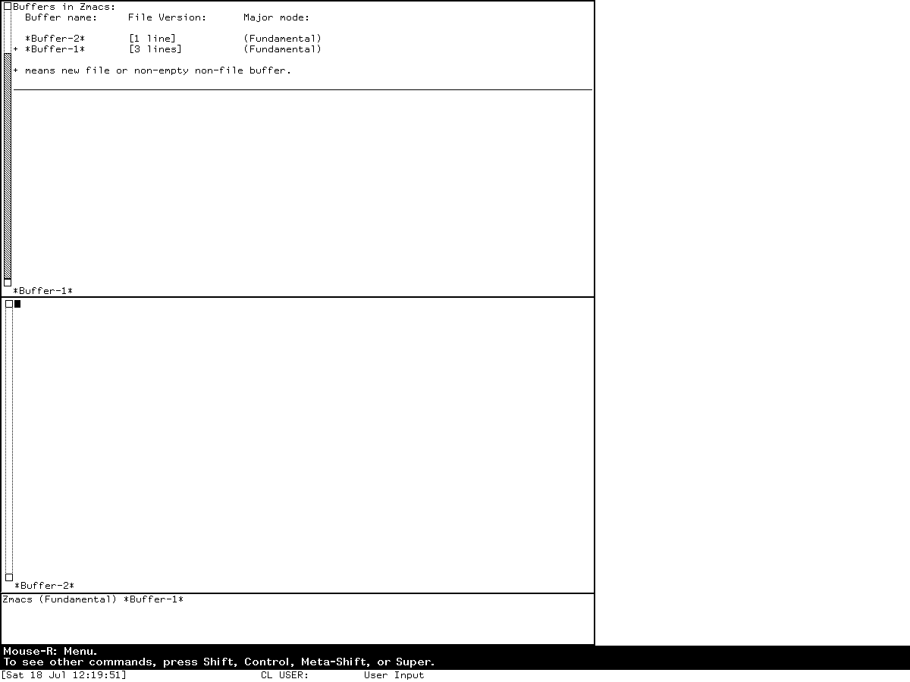
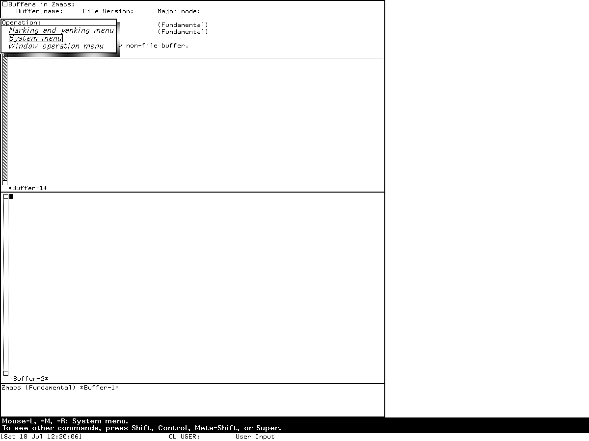

# Zmacs in Symbolics Genera

Zmacs is Genera's general file and program editor. Zwei is the underlying text
editing system used by Zmacs and by specialized applications. In the inspected
Genera 8.5 sources, Zmacs still composes a standard Zwei command table, a Zmacs
overlay, separate `Control-X` tables, and mode-local tables. In the running
world, that architecture appears as context-sensitive Help, mouse documentation,
menus, and buffer-list operations rather than as a static wall chart.

This page documents architecture and features. The
[binding companion](zmacs-keybindings.md) enumerates the configured standard,
Zmacs, prefix, argument, Help, mode, and pointer/presentation layers in the
inspected source revisions, while preserving the installed-world dump as an
explicit oracle. The
[named-command audit](zmacs-named-commands.md) records the counts, functional
groups, and installation semantics of the two base command-alist constructors
and the later CP additions. The
[editor-family reimplementation specification](../eine-zwei-and-zmacs-editor-family-reimplementation-specification.md)
defines the semantic and behavioral reconstruction contract.

## Evidence and rights boundary

The following local files came from the licensed Open Genera runtime and remain
untracked. Evidence-only original prose and cryptographic identities are published
here. Six sparse functional screen states have also passed a capture-specific
fair-use review and are published in the
[curated Genera screenshot catalog](../assets/genera-screenshots/); that review does
not extend to the source tree, decoded Help, worlds, fonts, or other session output.

| Portable artifact | Bytes | SHA-256 | Use in this study |
| --- | ---: | --- | --- |
| `sys.sct/zwei/defs.lisp.~292~` | 45,782 | `e0c460db04abb2fb40af0717f3d0a0ba45bd83589f1846c4ba8c778420127b4c` | generic and Zmacs editor composition |
| `sys.sct/zwei/comtab.lisp.~589~` | 100,220 | `5101f5a25a7222d6d0f8f48401522fa418576eb27d145f659513eb80660ca2b1` | lookup and standard tables |
| `sys.sct/zwei/zmacs.lisp.~1058~` | 31,456 | `082959472626b04d74631ada24bb8ad164bc44ef19f292343f905fbf10bf1d2f` | Zmacs and Zmacs `Control-X` overlays |
| `sys.sct/zwei/zmacs-buffers.lisp.~54~` | 64,709 | `5e7866786dffc8ec03cc3df6b0cd21277ac34656351a494c8e7656a837549bcf` | Zmacs buffer objects and operations |
| `sys.sct/zwei/screen.lisp.~638~` | 106,998 | `3b7a3353a2831c84a3130390539e419b843efed6d1425296b98242f4d9ffccb6` | windows, redisplay state, and presentation integration |
| `sys.sct/zwei/files.lisp.~378~` | 88,157 | `f627f666b0fe9ca7a1450526f081685b95b2c7e522a06d71b6db962345e957bc` | file buffers, attributes, versions, and locking |
| `sys.sct/zwei/modes.lisp.~254~` | 69,374 | `49d268b554e41a595741b4e6fc3066c9f52f69783fba112e8d3023256018b8f9` | general mode machinery and minor modes |
| `sys.sct/zwei/language-modes.lisp.~140~` | 39,590 | `ee78472671fd5476fb7bc2a712eedeebcedd90dc3e2e6f33d2595b41a09692fb` | language mode definitions and file-type selection |
| `sys.sct/zwei/text-modes.lisp.~27~` | 12,414 | `34c9bdec02ab8e8c7229c4303c48b59e28df8369f09253333b1eb6e4b0919020` | text-derived modes and source/manual discrepancies |
| `sys.sct/zwei/search.lisp.~152~` | 62,618 | `4b98387119a754d74f388a5b94e435b4f492a296859ad009984b2fae80c04279` | extended-search table hierarchy and operators |
| `sys.sct/zwei/comg.lisp.~96~` | 17,848 | `66007d528c90407fb162df152e6dfc383282981c0162abd67ebd3c6702784043` | keyboard-macro mover and transient sentinel table |
| `sys.sct/zwei/dired.lisp.~465~` | 78,695 | `d988987ca7220fd156a0c35eca2651e009c0054a8b9b86774890bfcaa6055da5` | Dired mode and local commands |
| `sys.sct/zwei/buffer-editor.lisp.~12~` | 24,248 | `f339b6b55994148b02c46dbca3fd532a4784d67b8ae24d89fa9ef954c07bef14` | Edit Buffers line-property/action model and local table; List Buffers presentations |
| `sys.sct/zwei/mail.lisp.~38~` | 31,024 | `533278201f8538e9709cea2415491543bcc52a250c00acf9a387d391cd8ff93b` | editor Mail mode and bindings |
| `sys.sct/zwei/pated.lisp.~321~` | 127,190 | `010026c3ca264dc76c3278eda79bbbd69d1e9f51e4a6d088c686187ba2f418bf` | patch-description editor integration |

The local `defsystem zwei` declaration names 54 modules, and the highest
evacuated Lisp revision is present for all 54. Together they total 2,405,992
bytes; the declaration-order manifest has SHA-256
`d32d09305b38f8636d689cf89161a2e97fba254ea5890fd448bef3b984eed6eb`.
The declaration witness `sys.sct/zwei/sysdcl.lisp.~3~` is 5,581 bytes with
SHA-256 `69a0dc2c0709cabcf1d3b14c35e745fbcb0b6414efc800057473c1d93545d0c3`.
Each manifest record is its UTF-8 archive-relative versioned pathname, one NUL
byte, and the 32-byte binary file SHA-256; declaration-order records are
concatenated without a terminator and hashed again.
That is the static base-subsystem denominator used here. Conditional or
compiled-only Fortran, C, Pascal, Joshua, Concordia, PostScript, and contributed
Macsyma packages are not promoted to base-world-active modes without runtime
evidence.

The locally extracted Document Examiner corpus contains 23 installed Zmacs
chapters as well as file-attribute, environment, and release documentation. It
was used to find intended behavior and terminology. No extracted Sage Binary text
or source tree is tracked; the only tracked runtime pixels are the six reviewed
functional captures cataloged below. The public Genera 8
[Editing and Mail manual](https://bitsavers.org/pdf/symbolics/software/genera_8/Editing_and_Mail.pdf)
is cited where it establishes product-level behavior.

The public manual is labeled Genera 8, while the local world identifies as 8.5.
Manual statements are therefore cross-checked against local source or runtime
before they are stated as exact 8.5 behavior.

## Zmacs and Zwei are different layers

Genera documentation says that Zwei is not itself the file editor: it is a
text-manipulation and data-structure system used to construct editors. Zmacs is
the editor for files. Dired, Zmail, and Converse are sibling domain editors
built with Zwei. The Input Editor is a separate core facility, although local
source also contains commands that integrate it with Zwei-aware behavior.

The code makes the layering concrete. A generic editor owns a command loop and
dynamically bound editing state. A top-level editor is callable. Zmacs-specific
editor objects add the named buffer set, buffer history, file-group data,
completion state, tag tables, and the Zmacs command environment. The full
top-level object composes those roles with screen windows and process state.

## Text, buffer, and window objects

The implementation is not a single mutable character array. A line is a
doubly-linked object with text, length, permanent buffer pointers, modification
tick, owner, properties, and parser/token data. A buffer pointer identifies a
line and character index and records how it should move when text is inserted.
An interval is bounded by buffer pointers; a node adds hierarchy, modification
state, and read/write locks; a top-level node adds change history and local
variables.

A buffer adds saved point, mark, window start, mode list, sections, and typein
style. A file buffer also records its pathname, read/save ticks, file metadata,
and version string. A window references an interval but owns its own display
sheet, start, point, mark, point stack, blinkers, redisplay state, and buffer
history. This separation predicts independent panes over shared text; the
two-window runtime observation below verifies the visible result in this world.

## Effective command lookup

The active keymap is a chain:

1. a major/minor-mode table, when present;
2. the Zmacs application table;
3. the standard Zwei table.

`Control-X` follows an analogous Zmacs-prefix-to-standard-prefix chain. Entries
can be direct commands, aliases, prefixes, dynamic menu commands, explicitly
undefined cells, or inherited cells. Named commands have parallel alists, and
users, patches, site files, and loaded systems can modify the result.

This is why the companion reference counts configured entries rather than
claiming a universal runtime-active number. The inspected source contains 212
literal entries in the standard direct table, 40 in the standard `Control-X`
table, 13 direct Zmacs overrides, and 22 Zmacs `Control-X` entries, plus the
installed prefix and right-button menu. It also lists 140 standard and 137
Zmacs-specific named-command candidates, counting the two separately supplied
CP candidates. The constructor can warn and omit a command that is undefined at
load time. Inheritance, ranges, shadows, optional packages, and those omissions
prevent the source counts from being added into a meaningful “number of
available keys.” The complete ordered candidate arrays are recorded separately
in ignored local evidence; the publishable
[named-command audit](zmacs-named-commands.md) retains their counts, categories,
checksums, and reproducibility boundary.

## Feature inventory

### Core editing and histories

- ordinary insertion, overwrite mode, quoting of arbitrary characters,
  transposition, whitespace normalization, case conversion, and indentation;
- movement and marking by character, line, screen, page, word, sentence,
  paragraph, definition, s-expression, and list structure;
- active regions, registers, kill/copy/yank history, matching-yank operations,
  and region-specific undo and redo;
- keyboard macros, named macros, mouse macros, command installation, and command
  implementation editing;
- hardware `Cut`, `Copy`, `Paste`, `Undo`, `Redo`, arrows, `Home`, `Find`,
  `Scroll`, `Back-Scroll`, `Complete`, `Help`, and `Abort` characters in
  addition to Control/Meta combinations.

### Buffers, files, locks, and windows

- create, select, show, insert, rename, list, edit, kill, revert, and review
  named buffers;
- file find, visit, read-only find, save, write, insert, append, prepend, copy,
  rename, delete/undelete, link, directory creation, and property display;
- visited-file attributes for mode, package, readtable, base, tab width,
  character style, and other editor state;
- changed-on-disk detection, refinding, file and buffer read-only state, and
  release of file locks;
- one- and two-window layouts, comparison views, multiple buffers, window
  growth, other-window selection, and two views showing one region;
- an Edit Buffers read-only major mode whose rows carry buffer/action line
  properties and whose local command table schedules operations; the separate
  List Buffers typeout report wraps displayed rows as presentations.

### Search, replace, and possibility sets

- forward and reverse incremental search, `Find`-key equivalents, pattern and
  Lisp-oriented searches, occurrences, matching-line lists, and filtering;
- an extended-search mini-language with grouping, Boolean AND/OR/NOT, and
  whitespace, delimiter, symbol-delimiter, alphabetic, digit, some, and any
  predicates, plus beginning/end/top-line/reverse string-search operators;
- literal, query, multi-string, buffer-driven, and tag-table-wide replace;
- definition-name completion and definition lists;
- possibility buffers that turn results, callers, warnings, or alternate
  definitions into a navigable sequence;
- sorting, reversing, counting, and keyboard-macro-driven transformations.

### Lisp and Genera development

- evaluate or compile a region, buffer, definition, file, changed definitions,
  or tag-table set, with locator-aware variants;
- show argument lists, documentation, variables, presentations, resources,
  functions, classes, generic functions, effective methods, flavors, slots,
  initializations, methods, and dependents;
- edit definitions and alternate definitions, callers by package/system,
  methods, combined methods, compiler warnings, and installed or saved forms;
- macro expansion, disassembly, trace/untrace, compiler optimization and effect
  inspection;
- source compare and merge against installed, saved, or newest definitions;
- patch creation, private patches, patch authors/reviewers/comments, changed
  definition collection, recompilation, reload, abort/revoke, and resumption.

### Text, styles, spelling, and abbreviations

- Text, Bolio, Scribe, Lisp, MIDAS, TECO, Macsyma, and Fundamental editing
  configurations in the inspected modules;
- paragraph and region filling, alternative fill choices, comment filling,
  prefix and column control, tabification, and untabification;
- spelling correction exposed by the manual/help environment, and
  word-abbreviation definition, files, listing, and expansion. The audited base
  Zwei source only resets a speller-owned dictionary variable; the speller
  command implementation is external to the 54-module base and was not
  runtime-confirmed here;
- character styles applied to a character, word, region, or typein default,
  with style discovery and display. Older ZWEI “font” concepts survive in some
  text-justifier command names, but the user-facing Genera operation is style-
  based and can carry family, face, and size information.

### Help and customization

`Help` enters an editor Help dispatcher rather than merely opening a static
manual. Its operations include command apropos, character description, command
description, recent input, tutorial/basic help, undo-related help, variable
apropos, and where-is queries. `Meta-?` describes a key; `Control-Meta-?` and
`Help` reach fuller documentation. `Control-?` is instead definition-name
completion in the standard table, a concrete change from the older System 46
self-documentation binding.

Named commands are read with completion. Variables and bindings can be made
local, initialization files can customize the environment, and modes contribute
their own syntax, hooks, and command tables. Self-documentation consults the
active command environment, so its answer can reflect modes and dynamic
objects.

## Modes in the inspected 8.5 source

The general and language/text modules define these user-facing modes:

| Kind | Modes found in source |
| --- | --- |
| Language/text major modes | Lisp, MIDAS, Text, Bolio, Scribe, Fundamental, TECO, Macsyma |
| Task major modes | FEP Command, Dired, Edit Buffers, Edit Word Abbrevs |
| Minor modes | Atom Word, Emacs, Auto Fill, Full Auto Fill, Overwrite, Word Abbrev, Electric Shift Lock, Electric Character Style Lock, Auto Fill Lisp Comments, Patch Description, Mail |

`DEFMODE` is a higher-level mode constructor used by several language/text
modes; `DEFMAJOR` and `DEFMINOR` cover other configurations. A mode can change
syntax and hooks without installing a key, so this inventory comes from mode
definitions rather than only key-table forms.

Patch Comment Editor and Standalone Editor Frame are initialized special
editing contexts rather than mode declarations. Each installs a local `Abort`
Standalone Abort overlay and is therefore documented in the binding companion,
but neither is added to the mode count.

An apparent literal `Common Lisp` minor-mode definition is inside a block
comment. Lisp-syntax registration can define syntax minor modes dynamically,
but this audit did not dump the live registry. “Common Lisp minor mode is active
in the base world” is therefore not asserted.

## Source findings not evident from a feature list

- A source comment says the comment-editing bindings were a nuisance outside
  Zmacs. They are therefore absent/commented in the standard Zwei table and
  installed by the Zmacs overlay. The layering reflects an explicit usability
  decision.
- `M-.` runs “Edit Definition And Other Definitions,” not only a single jump.
  Its possibility mechanism accounts for multiple definitions.
- Standard `C-Q` is `Various Quantities`, not the older quoted-insert binding.
  The richer keyboard and input facilities changed a familiar Emacs-derived
  key.
- Several ordinary mouse-left/middle entries in the static standard table are
  commented, while live Zmacs still supplies dynamic bottom-line mouse
  documentation and contextual menus. Static table parsing alone misses the
  presentation system's contribution.
- `Complete` and `C-?` operate on definition names in the standard table, while
  `Help` retains the documentation dispatcher. This split is more specific than
  saying simply that “Zmacs has help and completion.”
- The Zmacs source installs `Execute CP Command` and `Edit CP Command` in a
  second named-command update after the main command alist. A parser that only
  reads the first constructor undercounts the command environment.
- Single-line and multi-line prompt tables differ intentionally. Ordinary
  `Return` terminates single-line input; it remains insertable in multi-line
  search input, which exits through `C-Return`/`End` or its search-specific
  `Altmode`/`End` leaves.
- Extended-search input is a hierarchy of sparse tables, not one monolithic
  keymap. Its operator prefix, string-search overlay, and single-/multi-line
  minibuffers inherit different parents; the complete chain is recorded in the
  [binding reference](zmacs-keybindings.md#extended-search-contexts).
- Keyboard Macro Mover points a one-cell sparse table at the caller's active
  command table and injects an internal `BLIPS:a/` sentinel to terminate replay.
  That implementation detail is invisible in an ordinary keyboard summary.
- Word Abbrev mode writes its three `Control-X` leaves into the shared standard
  prefix rather than a mode-local prefix. The static mutation is established;
  its live cross-buffer scope remains a runtime `TODO`.
- Bolio's documentation and mode description promise Control-Meta font keys,
  but the implementing mode form is block-commented in this revision. Scribe is
  defined while `:MSS` is mapped to Text and described in source as not really
  existing yet. These are shipped-source contradictions, not features inferred
  from a manual.
- The inspected Macsyma source configures `//* ... *//` comments and Indent
  Nested on `Tab`, while the public manual says `/* ... */` and Indent Relative.
  Which definition is active in the world remains a runtime `TODO`.

## Runtime observations in Genera 8.5

A fresh isolated session named `zmacs-research`, generation 1, used base world
`Genera-8-5.vlod` (54,804,480 bytes; SHA-256
`a8ee5e86cc7e322f7385af3e0cd579d7650d4dcfc3ce328acbf8b25515dd0672`)
and VLM executable SHA-256
`9f5e18d5770f973879716182b6856ef5a8ee9d3b2bb907476ea0cf35986aa4c7`.
The full run boundary was:

| Item | Recorded value |
| --- | --- |
| Session | `zmacs-research`, generation 1; 2026-07-18 00:08:49–00:32:25 EDT |
| Licensed release archive | 206,213,430 bytes; SHA-256 `89fb3e76b91d612834f565834dea950b603acf8f9dbacacdd0b1c3c284a2d36e` |
| Base and private world | 54,804,480 bytes; SHA-256 `a8ee5e86cc7e322f7385af3e0cd579d7650d4dcfc3ce328acbf8b25515dd0672` at start and stop |
| Debugger and VLM | debugger SHA-256 `2db918cfe8f35f52c7ff4b7695b0ecd3bb85e41a3327ea5a94874edf05edb54a`; VLM SHA-256 `9f5e18d5770f973879716182b6856ef5a8ee9d3b2bb907476ea0cf35986aa4c7` |
| Harness | execution-time SHA-256 `bc9276ac766913bc15018dd334a2a2704ae5a926e1fcbc30ccfcff08af8cb48a` |
| Toolchain | `manifest.scm` SHA-256 `3adae999bbe420182f22adc2499fcc82449a46eaf580a362de9c0e718fa6b37d`; Guix channel `230aa373f315f247852ee07dff34146e9b480aec` |
| X compatibility preload | source SHA-256 `4db1dee8e71d5ddc5cfd8289ecc3607738370ac97f856853786cfe713e94e392`; executable SHA-256 `acd71dbcb948f05b7fd2730b2b4706c08f16f46d792bd9aa6aa64370e855e4b1` |
| Network/configuration helpers | `ifconfig` interposer SHA-256 `f45f45461622975996ab41138f64bb84a4b17c51fba0dbb649208914898c26b7`; configuration SHA-256 `5ce6509f5adf2cf2d054d34eb4ba777ce462285b8cd9b01bc071bf819139e086` |
| Time responder | executable SHA-256 `cc3a2274149c5593b52e6608d732d4048518c766134df5e0f018746ad5cf98bb`; validated RFC 868 evidence SHA-256 `166bd62890002c9a34ad4e750f50914f2d80b557614492fc356828b74a1cbe34` |
| Selected window | `Genera on DIS-LOCAL-HOST`, XID 4194310, x=72, y=55, 1200×900 |

The VLM ran in separate user, mount, network, PID, IPC, and hostname namespaces.
The session had no external route or guest-visible host file service, and the
Xvfb server did not advertise MIT-SHM. Both byte-exact X request substitutions
and the one local RFC 868 request/reply were observed and validated; the time
responder exited zero.

Bubblewrap exposed a read-only Guix store, generated `hosts` and `nsswitch`
files, the exact read-only helper scripts and private X socket, and the writable
private runtime. It hid the host root, home, repository, private session
metadata, and unrelated runtime sockets. This is a native-process reach
reduction, not a claim of a complete kernel security boundary.

The ordered input intents were: `Select E`; pointer movement and a held/released
right button; insertion of the probe text; host `Help`, `F11`, and `F12` mapping
probes; Help command/list paths and aborts; Meta-X translation probes; `Control-X
3`; `Control-X Control-B`; pointer movement and a generic right-button menu while
List Buffers was visible;
`Control-X 1`; Help Apropos with empty input; Help command description for List
Commands; and a final Meta-X keysym probe. The generation-scoped log preserves
all 37 intents and their 37 linked outcomes, including attempts that produced no
claimed guest effect.

The following states were directly observed.

### Editor entry and right-button menu

`Select E` opened `Zmacs (Fundamental) *Buffer-1*` in a blank buffer. Moving
into the editor changed the bottom line to contextual mouse help, and holding the
right button displayed the Editor menu. Inserting the project-owned probe text later
added the modified marker in the mode line.

*Runtime observation — Genera 8.5, session `zmacs-research`, generation 1,
verified 2026-07-18: after `Select E`, the pointer moved into the editor and
button 3 was held down, displaying the Editor menu.*

### Active Help dispatcher

Host `F12` reached the Genera `Help` dispatcher; host `F11` and a literal host
`Help` keysym did not in this X translation. This is a harness mapping result,
not a Symbolics-keyboard claim. Help command description, recent-input history,
and Apropos paths were also reached. An empty Apropos input was rejected with
`There is no default.`

*Runtime observation — Genera 8.5, session `zmacs-research`, generation 1,
verified 2026-07-18: host `F12` reached the editor Help dispatcher. The image
records this harness translation, not the position of Help on Symbolics hardware.*

### Windows and buffer lists

`Control-X 3` displayed two windows and selected a new `*Buffer-2*` in the lower
pane.

*Runtime observation — Genera 8.5, session `zmacs-research`, generation 1,
verified 2026-07-18: `Control-X 3` produced two independently selected editor
windows and created the lower `*Buffer-2*` view.*

`Control-X Control-B` then opened the presentation-oriented, nonmodal List Buffers
typeout report. Its own visible legend says that `+` denotes a new file or a
nonempty non-file buffer; it is not a generic modified-buffer marker. This agrees
with the selected source, which binds `Control-X Control-B` to List Buffers and
reserves `Control-X Control-Shift-B` for the distinct Edit Buffers application.

*Runtime observation — Genera 8.5, session `zmacs-research`, generation 1,
verified 2026-07-18 and reclassified 2026-07-19: `Control-X Control-B` opened
List Buffers; the visible heading, legend, and unchanged `Zmacs (Fundamental)`
mode line distinguish the report from Edit Buffers.*

### List-report mouse observations

The pointer was moved to coordinates intended to hit a displayed buffer row. The
captured bottom line still shows generic window/menu documentation, so the image
does not establish a typed presentation hit or buffer-specific operation.

*Runtime observation — Genera 8.5, session `zmacs-research`, generation 1,
captured 2026-07-18 and reassessed 2026-07-19: pointer movement left a generic
`Mouse-R: Menu`-style description visible. An exact-glyph hit probe remains
required before claiming List Buffers row recognition.*

A generic right-button Operation menu was also observed while the list was
displayed.

*Runtime observation — Genera 8.5, session `zmacs-research`, generation 1,
verified 2026-07-18 and reclassified 2026-07-19: button 3 opened a contextual
Operation menu while List Buffers typeout was displayed. Its entries are generic
Marking and Yanking, System, and Window menus; the capture does not establish a
buffer-row presentation or buffer-specific menu owner.*

The six images above are exact, unmodified copies of the selected raw PNGs. Their
raw-to-curated mappings, capture times, per-capture action-prefix hashes, dimensions,
PNG and normalized-pixel hashes, fair-use scope, and project-license exclusion are
recorded in the [curated screenshot catalog](../assets/genera-screenshots/).

The raw PNGs, action records, world copy, VLM, and shutdown evidence remain in
the ignored session tree. The 22,655-byte run record has SHA-256
`7a372b6985f81cf2ad713dc89037177e0d411f266f4c3d17125838844284391a`.
The 35,050-byte, 74-record action log has SHA-256
`8f7ca2510a6f3cc74ee6d72cdd3b3fd875de2df48075e330993b5507a655d721`.
The shutdown prompt was observed, `yes` was sent and accepted, and cleanup
progress appeared. The known cold-load mutex stall then required bounded host
cleanup. The final record says `forced-stopped`, `forced_stop=true`,
`forced_after_confirmed_shutdown_stall=true`, `state_may_be_incomplete=true`,
`orderly_vlm_host_shutdown=false`, and `unsaved_lisp_state_discarded=true`. The
harness did not request Save World or a checkpoint; whether any in-guest
persistence mechanism ran remains unverified. The private world stayed
byte-identical to the base. See
[the Genera computer-use harness article](genera-computer-use-harness.md) for
the isolation and provenance model.

## Sources

- Symbolics, [Editing and Mail, Genera 8](https://bitsavers.org/pdf/symbolics/software/genera_8/Editing_and_Mail.pdf),
  Zmacs and Zwei overview plus editing-command chapters; verified 2026-07-18.
- Symbolics, [Genera 8.0 Reference Cards](https://bitsavers.org/pdf/symbolics/software/genera_8/Genera_8.0_Reference_Cards.pdf),
  used only as an 8.0 cross-check, not proof of exact 8.5 bindings; verified
  2026-07-18.
- Licensed local Genera 8.5 source and extracted Document Examiner help,
  identities recorded above; inspected 2026-07-18.
- Fresh `zmacs-research` Genera Xvfb session, generation 1, input and image
  evidence recorded above; observed 2026-07-18.
