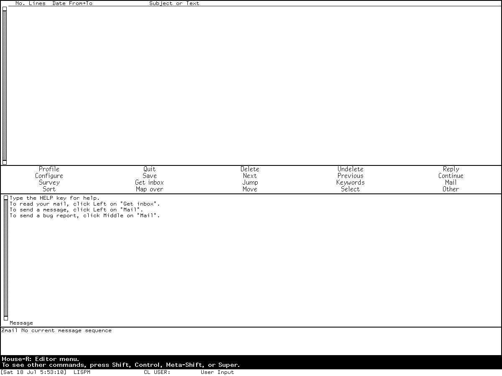
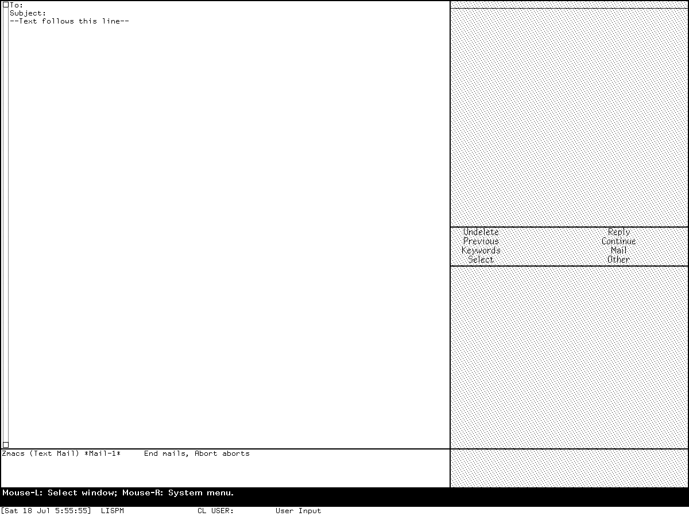

# Zmail and mail composition in Symbolics Genera

Zmail is Genera's display-oriented mail reader, organizer, and sender. It is not
just a mail-composition command in Zmacs, and it is not the store-and-forward
Mailer. The inspected Genera 8.5 release contains all three layers:

- one main Zmail frame for reading, filing, searching, classifying, and composing;
- a separate Zwei `Mail` minor mode used by Zmacs and by a standalone mail editor;
- a separately declared `Mailer` system for queued store-and-forward delivery.

They share address, message, and delivery machinery, which explains the repeated
word *Mail* in the interface. They nevertheless have different command loops,
buffers, processes, and preservation boundaries. The
[command and binding companion](zmail-commands-and-bindings.md) inventories the
release-bounded top-level commands, direct keys, prefix keys, menu surfaces,
draft-editor commands, and Zwei Mail-mode bindings.

## Evidence and rights boundary

The local source and extracted Help below came from the licensed Open Genera
release. They remain untracked. This article publishes only cryptographic
identities, factual names, short interface labels, and original analysis. It does
not reproduce source bodies, extracted Help prose, message data, or licensed
documentation payloads.

| Portable artifact | Bytes | SHA-256 | Use in this study |
| --- | ---: | --- | --- |
| `sys.sct/zmail/system.lisp.~81~` | 5,673 | `7a76f3f99df71721376e5cddb247b616568ddbc420fa17cc13aa5fd3804be17b` | release system declaration and module boundary |
| `sys.sct/zmail/definitions.lisp.~1552~` | 98,226 | `f5c96f713e3105acb78d1a79de3d0739afd361f297b3a9b6b647fd4638144aa6` | objects, command registration, menus, layouts, and options |
| `sys.sct/zmail/top.lisp.~1561~` | 76,649 | `814f6571649adda39594b006cb9375f23c48f6d32da7bb158a0acefbdc09d089` | frame, panes, foreground loop, and background process |
| `sys.sct/zmail/window.lisp.~1538~` | 60,659 | `4e81d597dbf3d6453ddad7efe70a9b2787fb8c8f9c586fd5116117feac535afc` | message and summary display behavior |
| `sys.sct/zmail/commands.lisp.~1600~` | 120,174 | `4b00879c28268561def2e2ee34a34026f73aca9dc8f5a4cb6077a66af342adf1` | top-level keys, menus, Help, and message commands |
| `sys.sct/zmail/collections.lisp.~1552~` | 123,015 | `96ec840410068e90b18d3008cecc346905c93af01bd2b1a2d8d73e79eb1ca345` | sequences, movement, sorting, deletion, and filing |
| `sys.sct/zmail/filter.lisp.~1549~` | 99,538 | `368e8846de981b91fa4d5e03a6714bb9b2b6c009f6ebc8fb01b77a1a6a113cd0` | filters, survey, and temporary selections |
| `sys.sct/zmail/universe.lisp.~1511~` | 55,488 | `2500d0ca328476e5e7cac343b7cf13cd01b64f1f61524fd47e4b09c87333c2a5` | multi-buffer search spaces |
| `sys.sct/zmail/references.lisp.~1515~` | 51,440 | `db8288cedf8463e1a52aaad7e8766875e7c8b7461c1379d0783be06b412a2c37` | reference and conversation operations |
| `sys.sct/zmail/mail.lisp.~1571~` | 152,833 | `6885d44e951270f9b9b4ebde5a2500fd674d4282599ba7c81e1fce017cb38c3a` | Zmail composition, replies, drafts, and sending policy |
| `sys.sct/zmail/mail-files.lisp.~1566~` | 205,514 | `1ade0babfa463a4c2780165f64f59ce4d25191d93af7770f7bf571d440ef3648` | mail-file loading, saving, inboxes, and background saves |
| `sys.sct/zmail/foreign-mail-file-formats.lisp.~1520~` | 57,759 | `6eabd4f8ce57fa85b48542a8c415528c331f78d37101b2e89db23642e91f32ee` | BABYL, RMAIL, TENEX, and UNIX representations |
| `sys.sct/zmail/directory-mail.lisp.~1505~` | 11,544 | `d5b62077554e07496313aea9a864181d2db04cb60246def44ad7740e1e36debe` | directory-backed messages |
| `sys.sct/zmail/kbin/buffer.lisp.~1511~` | 14,113 | `07c45298489141b5c75492b733c826c5468a2a0efbbad6db926058592319efc6` | KBIN buffer integration and upgrade command |
| `sys.sct/zmail/mail-access-paths.lisp.~1517~` | 18,387 | `85d12d2141a66feeb852ef2ccb9a5e0401f51e65b53336a3e697b4f22d7b9103` | transport access-path abstraction |
| `sys.sct/zmail/smtp.lisp.~1537~` | 38,265 | `8f01f92630a0683b0ab25902b6dee6a1b4d936c2ebbd3e857f8ca89cf5471a0d` | SMTP client and server paths |
| `sys.sct/zwei/mail.lisp.~38~` | 31,024 | `533278201f8538e9709cea2415491543bcc52a250c00acf9a387d391cd8ff93b` | Zmacs and standalone Zwei Mail mode |
| `sys.sct/mailer/system.lisp.~76~` | 3,802 | `7e7a7aaaddd478a2da0b7a29ab811705b934e15df044d2106e92d4e780695fd9` | separate Mailer system declaration |
| `sys.sct/mailer/toplevel.lisp.~1560~` | 44,419 | `c1c1fb9c67fabd03932cee1b21f0e18265ec0e70d3f02818e0e846a93b50777d` | separate delivery-process boundary |

The Zmail system declaration resolves to 37 core Zmail Lisp files totaling
1,781,224 bytes. A sorted portable manifest of logical pathname, byte size, and
file SHA-256 has SHA-256
`263df1e5a3329d60daf5cb5c931eb656c682cf405777a44a087601f582388e45`.
Including the declared RTC dependency, the Converse subsystem, and all eight
KBIN files gives 47 implementation files totaling 2,076,239 bytes; the analogous
manifest has SHA-256
`327c325390e71dbc45ae8da530921134da2e524b0bc70503819d941ac2898eae`.
The system declaration itself is metadata and is not included in either total.

The ignored, non-evaluating source-Help extraction contains 522 candidate forms
from 30 `zmail/` logical files. Of those, 150 are direct Zmail top-level command
definitions in the core source. The KBIN subsystem contributes one more namespaced
definition, and Zmail adopts one generic printer-status command. The resulting
clean release closure therefore has 152 completion candidates before patches,
site initialization, or user customization. One core source form contains an
embedded font-change escape in its command symbol; direct inspection establishes
that it is `Set Key`, not a missing command.

The public Symbolics *Editing and Mail* manual for Genera 8 is available from
[Bitsavers](https://bitsavers.org/pdf/symbolics/software/genera_8/Editing_and_Mail.pdf).
The verified copy is 1,965,567 bytes, 358 PDF pages, SHA-256
`80e77cb08b287635f47a781f68ce4ea8a14e05aaf7f19e0df81685d262b81d0d`.
Its Zmail overview begins on printed page 2426, architecture on 2431, integrated
Mail mode on 2442, mail-file formats on 2497, and the command dictionary on 2499.
It describes Genera 8, so exact 8.5 claims below require local source or runtime
corroboration.

## Five meanings of “Mail”

| Name in the system | What it is | What it is not |
| --- | --- | --- |
| Zmail | A Dynamic Windows application with message, summary, command, profile, filter, universe, calendar, and composition panes | Not simply a Zmacs buffer and not a delivery daemon |
| Zmail Mail state | Zmail's integrated draft-composition state, entered by Mail, Reply, Forward, Redirect, Redistribute, Continue, and related operations | Not the ordinary Zmacs Mail minor mode, even though it uses Zwei editing commands |
| Zwei Mail mode | A Text-mode-derived minor mode in a Zmacs special buffer, entered by Zmacs `Control-X M` or a standalone mail frame | Not a second mail reader; it calls Zmail's send machinery |
| `Mail` activity alias | The activity name added to the same `Select M` entry whose primary label is `Zmail` | Not another frame or another implementation |
| Mailer | A separately declared store-and-forward system with queues, logs, hosts, mailboxes, and delivery processes | Not Zmail's internal background file worker |

The distinction is observable. `Select M` selected the single Zmail frame in the
runtime session below. Later, `Select E` followed by `Control-X M` produced a
Zmacs buffer whose mode line read `Zmacs (Text Mail)`. Those are two interfaces
to related machinery, not two names for one window.

## Architecture and data model

### One frame, two Zmail processes

The manual says Zmail has one main window and foreground and background
processes. The 8.5 source agrees. Frame initialization constructs the panes and
creates one process named `Zmail background`; selection code reuses the existing
main frame, moves it to a usable screen when necessary, and reconstructs it only
when the old object cannot be selected. Startup is restricted to the main
console rather than arbitrary remote terminals.

The foreground command loop owns interactive state and consumes both user input
and responses sent through a dedicated background I/O buffer. The background
process handles queued file work, preloading, parsing, saving, and exposed-frame
mail checks. This design lets long mail-file operations yield without making the
interactive command loop itself the storage worker.

### Messages, buffers, sequences, filters, and universes

Zmail's working objects form several layers:

- a message carries header and body intervals, attributes, keywords, parse state,
  file provenance, references, and transmission state;
- a mail buffer associates messages with a storage representation or a temporary
  collection;
- a sequence is an ordered selection with a current message, movement state, and
  point stack;
- a filter selects messages by attributes, headers, keywords, dates, and other
  predicates;
- a universe supplies a wider search space spanning buffers and collections;
- reference operations treat message identifiers and reply chains as
  conversations.

The user-facing result is that Delete, Keywords, Move, Sort, Survey, Map Over,
and conversation operations are not merely text edits. They update message and
collection state, which is then persisted according to the active mail-file
format.

### Panes and configurations

The release defines panes for the summary, displayed message, headers, outgoing
mail text, mode line, minibuffer, filter and universe controls, profile editor,
ordinary and filtering command menus, and calendar views. Public configurations
include Summary only, Both, Message only, Filtering commands, Summary/Message
toggle, Send, Message without menu, Calendar, Month, Four weeks, Week, and Year.
Internal reply, filter, universe, and profile layouts support particular command
states.

The normal initial view is Both: summary above, command menu in the middle, and
message below. Summary rows are interactive presentations. Left selects a row;
middle applies a profile-selected operation such as delete/undelete; right opens
a conditional message menu. The exact menu and binding surfaces are in the
[companion reference](zmail-commands-and-bindings.md#summary-presentations).

## Feature inventory

### Reading and navigating mail

- load an inbox, check for new mail, select or examine mail files, and maintain
  several loaded buffers;
- move by ordinary, undeleted, unseen, and recent messages, with first/last
  variants and a message point stack;
- switch between summary-only, message-only, combined, filtering, and calendar
  views;
- search for strings, list occurrences, jump to messages, show a message or an
  entire selection, and survey compact summaries;
- display and explain headers, routing paths, references, mailing lists, file
  references, and address-directory information.

### Organizing and transforming messages

- delete, undelete, temporarily remove, expunge, concatenate, move, rename, and
  reverse sequences;
- assign and remove keywords, edit the keyword list, and merge keywords across
  a conversation;
- define filters and universes, mark survey results, select temporary
  collections, and apply Map Over operations to a selection;
- sort messages and identify or remove duplicates;
- select, append, move, delete, compare, survey, or merge by reference chain;
- construct or split digests, reformat or restore headers, and run rules over a
  message or a collection.

### Composing and sending

- compose new mail, replies, forwarded mail, redistributed mail, redirected
  mail, bug reports, and local mail;
- choose one-, two-, or zero-window reply layouts and optionally yank the
  original message;
- add To, Cc, Bcc, Fcc, blind Fcc, Subject, From, Reply-To, In-Reply-To,
  References, File-References, Start-Date, and Expiration-Date fields;
- continue, save, restore, write, revoke, inspect, or preserve draft messages;
- use templates, mailing-list expansion, address motion, file references,
  character styles, and optional text encryption;
- compose and survey reminders in calendar mode;
- invoke the source command family named `ECO`. The source examined here does
  not establish a safe expansion of that acronym, so none is asserted.

### Profiles, Help, and customization

The profile editor groups options for reading and checking mail, saving,
sending, replies and forwarding, window configuration, keywords, mail-file
format, collection behavior, reminders, destructive-command confirmation,
summary mouse behavior, and background work. Several menu commands use the
profile's middle-button choice, next/previous policy, reply layout, pruning
policy, and draft-ending policy rather than a fixed global rule.

Zmail has its own Help, key self-documentation, Apropos, Describe Command, and
extended-command reader. The command registry is populated when source files
load and is mutable by patches, site files, profiles, and `Set Key`. The 152
command names in the companion are therefore a clean-release denominator, not
a promise that every configured site exposes an identical live registry.

## Storage formats and mail files

The Genera 8 manual says Zmail understands five mail-file formats: BABYL, RMAIL,
KBIN, TENEX, and UNIX. The 8.5 source retains all five and registers two more
selectable buffer representations:

| Registered name | Representation established by source |
| --- | --- |
| Babyl | BABYL mail file with persistent message and file options |
| Rmail | ITS RMAIL representation |
| KBin | binary, preparsed KBIN representation supplied by the KBIN subsystem |
| Tenex | TOPS-20/MM-style representation |
| Unix | conventional UNIX mailbox representation |
| Directory | one message per file in a directory-backed mail buffer |
| Text | messages separated by blank lines |

This is a source/manual difference, not proof that all seven appeared in every
runtime menu or were equally portable. The isolated runtime did not select an
arbitrary-format file, so live menu membership remains a `TODO`. Directory and
Text are storage representations; neither is a network transport.

Format capabilities differ. Source methods decide which file options and
message attributes can be saved, whether a file can be reparsed, how new-mail
headers are recognized, and whether changes require a rewrite. Zmail therefore
cannot safely treat all mail files as interchangeable bags of RFC 822 text.

## Sending, transport discovery, and the Mailer boundary

The active 8.5 global sending function defaults to `NETWORK-SEND-IT`. An older
site-option table for fixed COMSAT, Chaos, direct-Chaos, and Ethernet modes is
present inside a block comment and is not an active profile definition in this
revision.

The active path groups recipients by their first-hop host or site and asks the
network service framework for a path. It prefers a store-and-forward mail
service when available, can use a host-local mail-to-user path, retries candidate
services, can offer a service believed unavailable, and can fall back to direct
delivery after prompting. The release contains local-file-system, Chaos Mail,
and SMTP implementations; the SMTP and Chaos files contain both serving and
client-side paths.

This discovery code is in Zmail, but a store-and-forward service is supplied by
the separate `Mailer` system. Its declaration names filesystem, log, counter,
UID, queue, options, host, message, hardcopy, top-level, mailbox, and debugging
modules. A full Mailer process/queue/delivery study belongs to the separate
background-services dossier. It must not be inferred from Zmail's UI process.

## Zmail's background process is not the Mailer

Source inspection establishes these implementation details:

- process name `Zmail background`, priority -1, scheduler quantum 10;
- a minimum of five seconds of keyboard inactivity before ordinary background
  work is allowed to proceed;
- mouse-speed threshold 2.5, with polling pauses while the pointer is moving
  faster;
- at least 12 free response-buffer entries and at least 25 percent of the
  response buffer reserved for the foreground;
- background save and parse quanta of ten messages before yielding;
- ordinary queued work can be allowed while the frame is deexposed, but periodic
  background mail checks have an additional explicit exposed-frame test;
- periodic background mail checking and completing inbox reads in the
  background are enabled by their default profile values.

Those are responsiveness and file-work policies inside the interactive Zmail
frame. They are not evidence that the host is running the store-and-forward
Mailer or that mail can leave the machine.

## Two composition editors

### Integrated Zmail composition

Mail, Reply, Forward, Redistribute, Redirect, Continue, and recursive composition
create a Zmail draft and switch the frame to a Send or reply configuration. The
header and body regions are Zwei intervals, so ordinary editing commands are
inherited. Zmail adds mail-header movement, header-field insertion, draft,
reply-layout, send/abort, original-message yanking, encryption, file-reference,
and mailing-list commands.

`End` is policy-sensitive in the reply editor: the configured profile can send,
offer both send choices, return to adding text, or offer both text choices.
`Control-Altmode` sends directly. The right-button draft menu and the extended
command list deliberately share the same command array except that `Show
Expanded Mailing List` is extended-command-only.

### Zwei Mail mode in Zmacs

Zmacs `Control-X M` calls a separate command in `zwei/mail.lisp`. It selects a
special Mail buffer, initializes Text mode, and turns on the Mail minor mode. A
new draft contains To and Subject fields plus a body separator. `End` and
`Control-Altmode` transmit; `Abort`, `Control-Z`, and `Control-]` quit without
transmitting; `Meta-Help` shows a patch-mail example; and its editor menu adds
`Add File References`.

This mode depends on Zmail: if the Zmail window variable is not bound, its source
rejects sending rather than implementing an independent transport. It also has
source-visible behavior not prominent in the public Zmail narrative:

- a nonzero numeric argument requests the most recently selected Mail buffer;
- zero displays existing Mail and bug-mail-frame drafts for selection;
- abort from a standalone mail frame can preserve the draft as a Zmacs buffer;
- retransmitting a previously sent draft can add `Supersedes` and `Comments`
  according to the shared Zmail option;
- sent Mail and bug-mail-frame buffers are deliberately retained rather than
  marked reusable.

The release also supplies a standalone top-level mail editor used by the Lisp
`MAIL` entry point. It is another view over the same Zwei Mail-mode and Zmail
sending boundary, not a separate mail transport.

## Source findings not evident from the manual alone

- The public manual's five mail-file formats are not the full 8.5 registration
  set: Directory and Text are also registered by loaded Zmail source.
- The message and reply editors intentionally keep their extended-command and
  right-button menu lists synchronized, with one documented source exception:
  `Show Expanded Mailing List` is extended-command-only.
- `Select M` and the `Mail` activity label point to the same unique Zmail frame.
  The alias is not evidence of a second application.
- Zmacs Mail mode is implemented outside the Zmail directory, but refuses to
  send unless Zmail is loaded and delegates final transmission to Zmail.
- The active network sender dynamically discovers store-and-forward and direct
  paths. The apparently simpler fixed sending-mode menu is commented out.
- Background responsiveness is encoded through explicit keyboard-idle,
  pointer-speed, queue-reserve, and message-quantum limits. The manual's phrase
  “background file operations” does not expose those thresholds.
- Periodic new-mail checks require the Zmail frame to be exposed even when other
  background requests are permitted while deexposed.
- The main frame is console-bound and reused. “Only one Zmail window” is an
  enforced implementation property, not merely a documentation convention.

## Runtime observations in Genera 8.5

A fresh, isolated session named `zmail-d08-genera-20260718`, generation 1,
verified the reader surface and Zwei Mail mode without transmitting mail. The
world was not configured as a Symbolics site, had no external route, and exposed
no guest-visible host file service.

| Item | Recorded value |
| --- | --- |
| Session | generation 1; 2026-07-18 05:45:11–05:58:11 EDT |
| Licensed release archive | 206,213,430 bytes; SHA-256 `89fb3e76b91d612834f565834dea950b603acf8f9dbacacdd0b1c3c284a2d36e` |
| Base and private world | `Genera-8-5.vlod`, 54,804,480 bytes; SHA-256 `a8ee5e86cc7e322f7385af3e0cd579d7650d4dcfc3ce328acbf8b25515dd0672`; unchanged at stop |
| Debugger and VLM | debugger SHA-256 `2db918cfe8f35f52c7ff4b7695b0ecd3bb85e41a3327ea5a94874edf05edb54a`; VLM SHA-256 `9f5e18d5770f973879716182b6856ef5a8ee9d3b2bb907476ea0cf35986aa4c7` |
| Harness | execution-time SHA-256 `bc9276ac766913bc15018dd334a2a2704ae5a926e1fcbc30ccfcff08af8cb48a` |
| Toolchain | `manifest.scm` SHA-256 `3adae999bbe420182f22adc2499fcc82449a46eaf580a362de9c0e718fa6b37d`; Guix channel `230aa373f315f247852ee07dff34146e9b480aec` |
| X compatibility | source SHA-256 `4db1dee8e71d5ddc5cfd8289ecc3607738370ac97f856853786cfe713e94e392`; executable SHA-256 `acd71dbcb948f05b7fd2730b2b4706c08f16f46d792bd9aa6aa64370e855e4b1` |
| Network/configuration helpers | `ifconfig` interposer SHA-256 `f45f45461622975996ab41138f64bb84a4b17c51fba0dbb649208914898c26b7`; configuration SHA-256 `5ce6509f5adf2cf2d054d34eb4ba777ce462285b8cd9b01bc071bf819139e086` |
| Time responder | executable SHA-256 `cc3a2274149c5593b52e6608d732d4048518c766134df5e0f018746ad5cf98bb`; validated evidence SHA-256 `0882da766af704e417c973f9a0b85e783915e106f26dc511f28c1016767c7df7` |
| Selected window | `Genera on DIS-LOCAL-HOST`, XID 4194310, x=72, y=55, 1200 by 900 |

Bubblewrap placed the VLM in separate user, mount, network, PID, IPC, and
hostname namespaces. The read-only Guix store, exact helper files, and private X
socket were the only host inputs exposed alongside the writable private runtime.
MIT-SHM was disabled and live-verified absent. Both pinned X-protocol
substitutions and the single local RFC 868 request/reply were observed; the time
responder exited zero.

The 23 ordered input intents, each followed by a linked outcome in the ignored
action log, were:

`Select M` → harness `Abort` alias → Mouse-R at `(600,650)` → Mouse-L at
`(600,423)` → Mouse-R at `(672,705)` → Mouse-L at `(720,758)` → `Return` →
harness `Abort` alias → type `LISP-MACHINE` → `Return` → Mouse-L at `(670,702)`
→ `Return` → Mouse-R at `(600,650)` → Mouse-L at `(100,650)` → Mouse-L at
`(1080,437)` → harness `Abort` alias → Mouse-L at `(800,448)` → `Select E` →
`Control-X M` → harness `Abort` alias → `Control-]` → `Control-U 1 Control-X M`
→ `Control-]`.

Coordinates are relative to the selected Genera client. The early pointer and
Abort attempts are retained because they include unsuccessful completion-menu
and host-key translation probes; they are not silently rewritten into an ideal
interaction.

### Reader entry and menus

`Select M` exposed a live Zmail frame with the documented summary, 20-item main
command menu, message pane, and mode line. Because the preserved world began as
`CL-USER`, Zmail required login. Selecting the offered local `LISP-MACHINE` user
and accepting empty keywords completed that login. Zmail then displayed concise
instructions for Help, Get inbox, Mail, and bug mail, and the mode line reported
no current message sequence.

Mouse-R in the message pane displayed all 21 source-defined auxiliary actions,
from conversation selection through mailing-list display. This verifies that
the source menu is active in this world, not merely left in a dormant file.

### Site boundary on integrated composition

Clicking Mail did not send anything. It immediately entered an error handler
because the expected file host `DIS-SYS-HOST` was unavailable for file
operations. Returning to Zmail restored the top-level frame. This establishes a
site-configuration dependency in the preserved world; it does not establish a
defect in a configured Genera site, and the museum harness must not supply or
guess that missing service.

### Live Zwei Mail mode

`Select E`, then `Control-X M`, successfully opened `*Mail-1*` in `Zmacs (Text
Mail)`. The visible buffer contained To and Subject fields and the expected body
separator; the mode line described End as transmit and Abort as quit. No
recipient or body was entered.

The generic harness Abort alias mapped to an unintended editor operation in
this context. `Control-]`, one of the source-defined Mail-mode quit bindings,
returned to Fundamental mode. The editor then told the user that a numeric
argument to `Control-X M` could continue. A subsequent `Control-U 1 Control-X M`
probe displayed a fresh `*Mail-2*` rather than proving reselection of `*Mail-1*`.
The source semantics are clear, but the exact prefix/retained-buffer runtime
path remains a `TODO` rather than being “confirmed” from this ambiguous probe.

### Published runtime screenshots

Two representative captures passed the image- and use-specific review in
[the screenshot publication policy](../screenshot-publication-rights-review.md).
They establish two different application surfaces without publishing a message,
recipient, address book, mailbox, or substantial Help prose.

The reader capture shows the one-frame Zmail organization after local login. The
short hints are retained because they identify what the otherwise empty panes and
menu are for; the image is not evidence about populated-message rendering.

The second capture is deliberately blank. Its documentary purpose is to prove that
`Control-X M` creates a Zwei editing surface with a mail template and a distinct
mode line, rather than selecting the full Zmail reader.

| Raw basename | Evidence purpose | Captured | Dimensions | PNG SHA-256 | Pixel SHA-256 | Action prefix | Sidecar |
| --- | --- | --- | --- | --- | --- | --- | --- |
| `0011-zmail-login-complete.png` | establish the live Zmail summary/message layout and 20-cell main menu after local login | 2026-07-18 05:53:10 EDT | 1200 by 900 | `a947dc4d80238ef0bea331d383603865a4eb653cd2903c2b23cd65217742aab7` | `b4d8c37c43d839b0983d35c244950c1649668bd70ace82a2c2b5bd9ffab12d66` | 24 records; `31f193b620c8d0cf62cbe9bbcc7744c6582f3d16db47aa4a93a84ec17ff0a150` | `0011-zmail-login-complete.json`, 13,735 bytes; SHA-256 `80ddfcefebbb8ba53baf02f2ff3c376a1adecacd691f66535697d85bbd23dd4b` |
| `0017-zwei-mail-mode.png` | establish the distinct live Zmacs Text Mail buffer, header template, body separator, and mode line | 2026-07-18 05:55:56 EDT | 1200 by 900 | `6462902049b81435b2fb7cff480be055f660978bb12a4d5ea49dea091bb7c62c` | `945ae06da781538b6def4937592b1bee5fbbd9d6f0ad0117b276f757ec846e67` | 38 records; `b9f03911419f23c845e23fcc0739984c42e667daf7ec3176d89c399b486a7064` | `0017-zwei-mail-mode.json`, 13,729 bytes; SHA-256 `de631d8705a9bc48afd037ed7378e04c6abde977e16ac5aeb7f807ed197fa648` |

The exact raw-to-curated mappings, image identities, action prefixes, session
record, shutdown result, and publication limits are recorded in the
[curated Genera screenshot catalog](../assets/genera-screenshots/). No other image
from this session is approved by implication.

The ignored run record is 25,641 bytes, SHA-256
`70612937b74496027fb1981586dbd11dd8651fd786fdedd394d20a158c94747c`.
The 46-record action log is 22,038 bytes, SHA-256
`2a65002bf6dcf12b12fb5e364b8aeca652f90b83b1270677687c7c5c3785db72`.
The shutdown prompt was observed, `yes` was sent and accepted, and cleanup
progress appeared. The known cold-load mutex stall then required bounded host
cleanup. Final status is `forced-stopped` with `forced_stop=true`,
`forced_after_confirmed_shutdown_stall=true`,
`orderly_vlm_host_shutdown=false`, and `state_may_be_incomplete=true`. The
harness itself did not invoke Save World and did not create a host-process
checkpoint. The separately recorded `save_world_performed` and
`guest_checkpoint_created` fields remain unknown because the guest input was
not independently audited for either event. The private world remained
byte-identical to the base; that unchanged hash is not by itself proof about
either field. The record marks `unsaved_lisp_state_discarded=true`; this means
only that unsaved guest state was lost when the bounded cleanup ended the VLM,
because the harness has no host-process resume mechanism. Supervisor, Xvfb, and
VLM processes were all absent after stop.

## Open questions

- Which of Directory and Text appears in the arbitrary-format UI of this exact
  world after a fully configured site login?
- What live delivery choices appear when a legitimate store-and-forward service
  and file host are configured? The isolated museum session cannot answer this.
- Does a hardware-faithful numeric prefix reselect the retained Mail buffer after
  `Control-]`, or did the XTEST sequence differ from the intended console input?
- Calendar/reminder layouts, a populated summary, filter presentations, and
  conversation operations still need minimal-data runtime observations. Any
  future captures must avoid real or licensed message content.
- A full process, queue, retry, and mailbox analysis of the separate Mailer
  remains for its own dossier.

## Sources

- Symbolics, [*Editing and Mail*, Genera 8](https://bitsavers.org/pdf/symbolics/software/genera_8/Editing_and_Mail.pdf),
  printed pages 2426–2499 and the Zmail command dictionary; verified 2026-07-18.
- Licensed local Genera 8.5 Zmail, Zwei Mail-mode, Mailer source, and inert
  source-Help extraction, artifact identities recorded above; inspected
  2026-07-18.
- Fresh `zmail-d08-genera-20260718` Genera Xvfb session, generation 1, input,
  image, isolation, and shutdown evidence recorded above; observed 2026-07-18.
