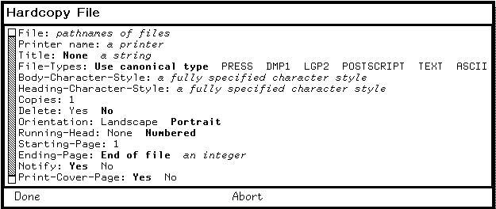
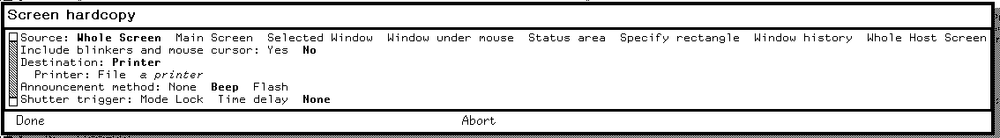

# Hardcopy, Press, printing, and plot output on CADR and Genera

The CADR and Genera printing families share a recognizable architectural line,
but they are not one continuously exposed application.

- The public System 46 CADR snapshot preserves four largely device- or
  format-specific programs: a Press-file generator and Dover sender, an XGP
  bitmap scan-file encoder and queue writer, a SUDS `PLT`-to-Press converter,
  and direct Versatec UNIBUS routines. Later LM-3 source adds a small generic
  dispatcher over printer capabilities and makes screen hardcopy a standard
  Terminal-Q operation.
- Genera makes the dispatcher the center of the design. It registers hardcopy
  formats and device types, converts text and graphics through device-aware
  streams, exposes typed `Printer` and `Printer Maintenance` commands, and can
  either contact a device directly or submit durable requests to the optional
  `Print` system's network-visible spooler.
- Genera's PostScript support has two different meanings. The Hardcopy system
  *generates and submits* PostScript-family printer data. A separately loadable
  `PostScript` system *interprets and displays* PostScript files and also plugs
  that reader into the image system. Neither should be mistaken for a general
  host-side print command.

No configured default printer or surviving CADR output hardware was available in
this audit. Source and manuals establish the interfaces and transformation paths,
but physical output, queue interoperability, and device-specific page appearance
remain runtime `TODO`s. Two tightly cropped Genera forms are published because
they verify the live format registry and Function-Q option structure without
showing the unrelated Listener, a failed exploratory probe, or installed Help.

“Complete” below means complete for the user-facing functions, commands,
gestures, options, formats, and direct program commands found in the pinned
materials. Printer support tapes, site patches, and separately loaded systems
can extend the format and device registries.

## Programs and evidence boundary

| Facility | Primary role | Evidence and installed status | Runtime status in this audit |
| --- | --- | --- | --- |
| System 46 `PRESS` | Build Press files, format text, draw primitive graphics, convert XGP controls, and send or spool output to a Dover | Public Lisp source and QFASL at commit `8e978d7`; latest public source generation is `PRESS 46` | Historical Dover, MC spool directory, and EFTP endpoint unavailable |
| System 46 `XGP` | Encode one-bit arrays as XGP scan files and write XGP queue requests | Public `XGP 21` source and QFASL | AI file server and XGP queue unavailable |
| System 46 `DPLT` | Convert SUDS 36-bit `PLT` drawing records into Press pages for a Dover | Public `DPLT 63`, package file, and QFASL | No representative SUDS plot plus Dover path was exercised |
| System 46 `VERSAT` | Drive a Versatec printer/plotter directly over UNIBUS, including screen copies | Public `VERSAT 15` source and an older QFASL | Required CADR UNIBUS interface and device are absent |
| Maintained LM-3 Hardcopy | Dispatch files, streams, and bit arrays to printer-type methods; provide screen and editor integration | Public Fossil source at check-in `4df393c`; `PRESS`, `XGP`, and `DPLT` remain present | System 303 has no reachable historical printer service |
| Genera `Hardcopy` | Registry, formatters, printer objects, capture UI, file/editor/mail/document integration, and queue client | Licensed source and public Genera manuals; `HARDCOPY`, `PRESS`, and `GPRINT` appeared in the base-world loaded-system inventory | Read-only live census is described below; no request was submitted |
| Genera `Print` | Persistent Print Spooler, per-printer managers and queues, queue/control servers, and device backends | Installed loadable system; not part of the audited base world's loaded-system list | No local spooled-printer object, manager, or queue was available |
| Genera `PostScript` | Interpret PostScript into Genera graphics, expose `Display PostScript File`, and provide image-file integration | Separately declared system in licensed source | Not loaded or exercised in the base world |

The Genera source, extracted Help, and purchased world remain ignored local
research inputs. This article paraphrases their behavior and records evidence
metadata; it does not reproduce proprietary implementation text or printer-font
data.

## The architectural change

The most useful comparison is not “old printer versus new printer.” It is the
movement of policy between layers.

| Concern | System 46 and early CADR | Maintained LM-3 | Genera |
| --- | --- | --- | --- |
| Entry point | Call the device/format package directly | Call one of four `HARDCOPY-*` dispatchers or a legacy package | Use typed commands, program menus, editor/mail/document commands, or programmatic hardcopy streams |
| Device selection | Mostly implicit in the package and fixed host/path defaults | Printer keyword or `(type arguments...)` tuple, with site defaults | Namespace `Printer` object with type, interfaces, service paths, and optional spooler hosts |
| Format selection | Separate Press, XGP, and DPLT entry points | File type maps to Text, Press, XGP, or SUDS Plot | Registered hardcopy-format objects; canonical file type can choose the input formatter |
| Bitmap capture | XGP or direct Versatec function | Terminal-Q snapshots a screen/window/frame into a temporary one-bit array and dispatches it | Function-Q capture has selectable source, destination, shutter trigger, scaling, and image/file extensions |
| Queueing | Write an ITS queue request file, spool a Press stream through MC, or send directly | Same device methods behind the dispatcher | Direct protocols or persistent Print Spooler queues with remote inspection and control |
| Graphics model | Press entity/data records or device scan lines | Same, plus a generic bit-array contract | Device-independent graphics/hardcopy streams with explicit coordinate and character-style mappings |
| Operator UI | Lisp functions and keyboard integration | Lisp functions, Terminal-Q, ZWEI, and Dired | Dynamic Windows forms, presentation-sensitive queue output, command areas, and spooler log program |

This explains why `PRESS` remains a loaded system name in Genera without being
the ordinary top-level application. Press becomes one registered interchange and
device path inside Hardcopy, while the user normally sees `Hardcopy File`, the
System-menu form, Function-Q, or a client application's Hardcopy command.

## CADR and LM-3

### What System 46 actually preserves

The public archive inventory dates the latest preserved source generations as
follows:

| Artifact | Source date in archive inventory | Compiled artifact date | Interpretation |
| --- | --- | --- | --- |
| `DPLT 63` | 18 September 1980 | `DPLT QFASL`, 20 September 1980 | SUDS plot converter was an installed compiled facility |
| `PRESS 46` | 25 September 1980 | `PRESS QFASL`, 2 October 1980 | Press/Dover generator and sender |
| `XGP 21` | 6 September 1980 | `XGP QFASL`, later the same day | Screen/array scan-file encoder and queue client |
| `VERSAT 15` | 14 May 1980 | `VERSAT QFASL`, 27 February 1980 | Surviving compiled file predates the latest source and must not be assumed identical |

The [pinned archive inventory](https://github.com/mietek/mit-cadr-system-software/blob/8e978d7d1704096a63edd4386a3b8326a2e584af/src/moon/wall.3#L520-L523)
and its [Press, Versatec, and XGP entries](https://github.com/mietek/mit-cadr-system-software/blob/8e978d7d1704096a63edd4386a3b8326a2e584af/src/moon/wall.3#L554-L607)
establish source/media presence and dates. They do not establish that every
QFASL was compiled from the latest adjacent source.

System 46 has no source counterpart to the later generic `hardcopy.lisp` in this
snapshot. The four named packages are therefore documented first on their own
terms; the dispatcher is a later integration layer visible in the LM-3 source.

### The LM-3 generic Hardcopy contract

The maintained source defines four public operations:

| Function | Inputs | Dispatch property | Resulting responsibility |
| --- | --- | --- | --- |
| `SI:HARDCOPY-FILE` | pathname plus options | `PRINT-FILE` on printer type | Infer or accept input format, then let the device method print or reject it |
| `SI:HARDCOPY-STREAM` | input stream plus options | `PRINT-STREAM` | Consume text from an already open stream |
| `SI:HARDCOPY-BIT-ARRAY` | one-bit array and left/top/right/bottom rectangle plus options | `PRINT-BIT-ARRAY` | Print a selected raster rectangle |
| `SI:HARDCOPY-STATUS` | optional printer and report stream | `PRINT-STATUS` | Report device/queue state |

A printer value is either a printer-type keyword or a list whose first element
is the type and whose remaining elements are backend arguments. A site table can
also map human-readable strings to those values. Dispatch repeatedly checks the
required property; if the selected printer cannot perform that operation, the
error protocol can request another printer instead of embedding a global case
statement in every client.

`HARDCOPY-FILE` recognizes these defaults from the pathname type:

| Pathname type | Selected format |
| --- | --- |
| `PRESS` or `PRE` | `:PRESS` |
| `XGP` | `:XGP` |
| `PLT` | `:SUDS-PLOT` |
| Anything else | `:TEXT` |

Its declared options are font, font list, heading font, page headings, vertical
spacing in micas, copies, and optional spooling. The dispatcher also has a
per-printer-type defaults layer. The maintained list of defaultable options is
font, font list, heading font, page headings, vertical spacing, copies, and spool.
An explicitly supplied option wins over a printer-type default.

The built-in `:LPT` method is deliberately narrow. It accepts only text, selects
an ITS/Unix/other pathname according to the associated host's system type, and
copies the character stream. It does not simulate fonts or accept Press, XGP, or
plot input.

### Terminal-Q screen hardcopy

In System 303 source, Terminal-Q is the generic screen-hardcopy key. Its Help
text is conditional: the binding advertises itself only when the selected
printer type has a `PRINT-BIT-ARRAY` method.

| Numeric argument | Captured source |
| ---: | --- |
| `0` | Default screen |
| `1` | Selected window |
| `3` | Main screen and who-line, clipped by the configured margin |
| `4` | Nearest superior that is a basic frame |
| Other | Main screen and who-line |

The implementation snapshots the selected region into a reusable one-bit pixel
array while interrupts are inhibited, beeps after capture, and then calls
`HARDCOPY-BIT-ARRAY`. This separation matters: the screen is stable only long
enough to take the snapshot; slow encoding or network transmission can happen
afterward without requiring the visible raster to remain unchanged.

The older XGP package also has foreground and background screen/window helpers.
The background path explicitly snapshots first and launches an `XGP Hardcopy`
process to encode and queue the private copy. Its own source says these helpers
are mostly superseded by the generic escape-key mechanism.

### PRESS: page description and Dover transport

CADR `PRESS` is both a page-description writer and a delivery client. It is not
just a filename extension.

The generator builds a Press file from parts, pages, entities, a data list, and
an entity list. Its primitive operations include:

- open and close a file, page, and entity;
- set the current cursor in micas;
- define and select a Dover font;
- emit characters and strings;
- draw vector lines and rectangles;
- embed a bitmap from a window or pixel array; and
- finish a multi-copy document with title, date, and requestor metadata.

The entity command vocabulary covers short and long character runs, skips,
absolute position, horizontal and vertical spacing, font selection, brightness,
hue, saturation, object display, opaque or transparent dot display, and
rectangles. The corresponding data-list vocabulary includes line movement and
drawing plus raster sampling/window/mode controls. These are Press-format
capabilities, not evidence that the CADR user had a retained drawing editor in
this package.

#### Complete public text-to-Press interface

| Entry point | Purpose |
| --- | --- |
| `PRESS:PRINT-FILE` | Read a text file, format it into Press, and send/spool/write the result |
| `PRESS:PRINT-FROM-STREAM` | Same formatter over an existing input stream |
| `PRESS:SPOOL-FILE` | Force the MC spool path |
| `PRESS:PRINT-PRESS-FILE` | Copy an already generated Press file to the chosen destination |
| `PRESS:PRINT-PRESS-STREAM` | Copy an already generated Press stream |
| `PRESS:PRINT-XGP-FILE` | Interpret XGP text controls and convert them to Press rather than sending XGP scan raster |
| `PRESS:PRINT-DOVER-STATUS` | Report direct Dover status |
| `PRESS:PRINT-DOVER-QUEUE` | Report the queue |

The text formatter accepts these option families:

| Option | Meaning |
| --- | --- |
| `:FONT` | One default Press font, initially `LPT8` |
| `:FONT-LIST`, `:PRESS-FONTS`, or `:FONTS` | Press fonts selected by in-band font controls |
| `:TV-FONTS` | Lisp-machine fonts to translate through the Dover equivalence table |
| `:HEADING-FONT` | Page-heading font |
| `:PAGE-HEADINGS` | Add or suppress filename/date/page headings |
| `:VSP` | Extra interline spacing in micas |
| `:COPIES` | Copy count |
| `:XGP` | Interpret XGP escape controls in the input character stream |
| `:FILE-NAME` | Display name used in headings and cover metadata |
| `:OUTPUT-FILE` | Write generated Press bytes to a file |
| `:SPOOL` | Send to the MC Dover spool pathname |
| `:EFTP` | Use EFTP to the default Dover |
| `:HOST-ADDRESS` | Use EFTP to a specified Ethernet address |

With none of the last four destination overrides, output goes directly to the
configured Dover address over Chaos. The implementation keeps most generator
state in dynamically bound special variables and explicitly supports only one
active construction at a time; it is a procedural writer, not a reentrant print
job object.

Font handling is more elaborate than the generic dispatcher suggests. The
formatter can infer a file's Lisp-machine font metadata, translate known screen
fonts to Dover families, maintain a stack for in-band font changes, synthesize
font metrics when no width file is available, and use a vector font to render
arbitrary line slopes. That translation layer is one reason a “printed CADR
font” cannot be inferred from a screen-font specimen alone.

### XGP scan files and queue requests

The XGP package's raster path takes a one-bit array and writes a scan file rather
than Press. Its complete callable surface is:

| Function | Behavior |
| --- | --- |
| `SCREEN-XGP-HARDCOPY` | Foreground capture of the default or supplied screen |
| `SCREEN-XGP-HARDCOPY-BACKGROUND` | Snapshot then encode in a background process |
| `WINDOW-XGP-HARDCOPY` | Foreground selected/supplied window capture |
| `WINDOW-XGP-HARDCOPY-BACKGROUND` | Background window capture |
| `XGP-WRITE-SCAN-FILE` | Encode an array rectangle with optional top and left margins |
| `XGP-QUEUE-SCAN-FILE` | Write the queue request pointing at an encoded scan file |

Each output scan line first attempts run-length encoding into a bounded buffer.
If that representation overflows, the encoder falls back to literal image bits
for that line. It writes a pair of line records and finishes with a page-cut
record. The default scan file is temporary and the queue request can instruct
the service to delete it after printing.

The queue request is a small textual control file containing status, user/group,
time, page count, optional deletion, a `SCAN` directive, and the scan-file
pathname. Thus the scan file and the queue request are separate artifacts. A
recovered scan file alone does not say whether it was ever queued.

The source leaves three explicit maintenance problems: pathname canonicalization
for queue requests, a separate file connection for background operation, and a
dependency on the Hacks QFASL for one setup path. They are contemporary source
limitations, not failures discovered by the emulator.

### DPLT: SUDS plots to Press

`DPLT` is a format converter for SUDS `PLT` engineering drawings, not a general
interactive plotter. It reads PDP-10-oriented 36-bit records as pairs of 18-bit
values, prescans each drawing to find its coordinate bounds, rotates and scales
the result into Dover coordinates, and then emits Press pages.

The public entry point is `DPLT-PRINT-FILE`. Filenames and keyword/value pairs
may be interspersed:

| Option | Default and effect |
| --- | --- |
| `:SCALE number` | Default 1; scale the drawing |
| `:COPIES number` | Default 1; set document copy count |
| `:FILE pathname` | Change the spool/output file; `NIL` selects direct one-file-at-a-time Dover delivery |
| `:BLANK-PAGE` | Add a final blank page as a device-workaround |

Unadorned names default to type `PLT`. Multiple files normally become pages in
one Press request. `PRINT-TXT-FILE` is a separate convenience path for WLR/text
material using an LPT-style font and the Press formatter.

The record processor handles vectors, text, diamond symbols, frame/title data,
and file/logo metadata. It maps SUDS font number, style, and character size to
candidate SAIL/Math/Helvetica Dover fonts, using nearest-width and fallback
rules when the exact face is absent. It makes two passes because the plot is not
assumed centered.

The source explicitly does not support rotated characters or PAD-related PC
features. Those omissions should remain visible in any reconstruction rather
than silently approximated.

### Versatec: direct hardware, not a file formatter

`VERSAT` operates at the opposite end of the abstraction spectrum. It contains
literal UNIBUS control, data, byte-count, buffer-address, and extended-address
register locations. Its operations are:

| Function family | Role |
| --- | --- |
| wait/reset | Poll device status, reject device errors, reset interface and buffer |
| print character | Write one character to the printer data register |
| plot byte | Write one raster byte to the plotter data register |
| remote line/form/EOT | Issue line terminate, form feed, and end-of-transmission controls |
| test | Emit repeated device-test data |
| `VERSATEC-QWOPY` | Slow byte-at-a-time rotated/reversed screen raster copy |
| `VERSATEC-COPY` | Wire a line buffer, map it into UNIBUS space, rotate the raster, and DMA each line twice |
| `VERSATEC-BIG-COPY` | Scale a raster into a larger line buffer and DMA repeated scan lines |
| `WIRE-ARRAY-AND-MAP` | Change page status and program the UNIBUS map for DMA |

The optimized copies temporarily wire Lisp pages and program fixed UNIBUS map
locations. Running them without the corresponding interface is unsafe and has no
museum value; source inspection is the correct current evidence. `QWOPY` is the
function's literal historical spelling, not an expansion established by the
source.

### Editor and Dired integration

The maintained editor command `Print File` prompts for a pathname and calls the
generic `HARDCOPY-FILE`. Dired uses `P`-marked files and a configurable list of
hardcopy options. These are thin clients: neither implements a printer backend.

This is the earliest preserved form of the later Genera pattern in which file,
mail, documentation, and graphics applications delegate output through a shared
hardcopy service.

## Genera Hardcopy

### Registry and stream architecture

Genera formalizes two registries:

- a **hardcopy format** records its name, documentation, input formatter,
  input options, output stream flavor, output options, canonical file type, and
  binary byte size; and
- a **hardcopy device** records the printer/device flavor, optional hardcopy-file
  object flavor, accepted input formats, generated output format, display-device
  type for character-style mapping, defaults, and serial/interface behavior.

The format layer converts stored input into a device stream or creates an output
stream that generates a stored printer format. The device layer decides what the
printer can consume and how to reach it. Because registration records source
identity and updates a central list, separately loaded support can extend the
system without changing `Hardcopy File`.

The base `basic-hardcopy-stream` is a character output stream with page state,
cursor, bounding box, margins, page number, orientation, title/date metadata,
character metrics, and required device operations. Graphics-capable subclasses
add the drawing protocol. Device-independent callers can therefore use the same
drawing vocabulary for a window and a hardcopy stream while respecting their
different coordinate systems: screen Y grows downward from the upper left;
hardcopy Y grows upward from the lower left.

### Formats established by the inspected source

| Format | Canonical type or extension | Input/output role |
| --- | --- | --- |
| Text | `:TEXT` | Input formatter paginates characters; output stream produces text |
| ASCII | `:ASCII` | Pass-through ASCII/device stream support |
| Press | `:PRESS` | Read or generate Press data through the retained Press subsystem |
| DMP1 | `:DMP1` | Read/generate DMP1 printer data, including printer-specific bitmap fonts |
| PostScript | `:POSTSCRIPT`, extension `PS` | Generic PostScript printer output with ordinary page order |
| LGP2 | `:LGP2`, extension `LGP2` | PostScript-family output with LaserWriter/LGP-specific behavior |

The public user's guide additionally offers `LaserWriter` and `XGP` choices in
the `Hardcopy File` file-type presentation. The inspected Hardcopy source defines
the six registrations above; the pathname layer still defines an XGP canonical
type. A fresh Genera 8.5 runtime census returned exactly the same six registered
names and the live form rendered exactly those six choices. Thus `XGP` and
`LaserWriter` are not active format entries in this base-world load. They may
still come from optional compatibility support or reflect a documentation/release
difference; this article does not invent a missing registration.

### Complete `Hardcopy File` command

`Hardcopy File` accepts a sequence of pathnames and a printer. Wild pathnames
expand before a background process is started. When `Use canonical type` is
selected, files are grouped by detected hardcopy format so a mixed request can
be dispatched correctly.

| Argument or keyword | Accepted values and default | Effect |
| --- | --- | --- |
| Files | One or more pathnames | Files to print; missing files are reported before background submission |
| Printer | A namespace Printer; default text printer | Output device |
| Title | String; derived from pathname | Cover-page title |
| File Types | registered format or `Use canonical type` | Override/detect internal data representation |
| Body Character Style | device-valid style | Body text and in-file relative style merge base |
| Heading Character Style | device-valid style | Running-head style |
| Copies | Integer, default 1 | Requested copy count |
| Delete | Yes/No, default No when unmentioned | Delete source after successful submission |
| Orientation | Portrait/Landscape, default Portrait | Page orientation |
| Running Head | Numbered/None, default Numbered | Enable page headings |
| Starting Page | Integer at least 1, default 1 | First physical page |
| Ending Page | Integer or end of file | Last physical page; reversed bounds are swapped with a warning |
| Notify | Yes/No, default Yes | Notify requestor after submission |
| Print Cover Page | Yes/No, default Yes | Generate a cover page |

The source does not open every file in the background blindly. It first forces
needed file-server logins and probes/expands names in the foreground, then starts
a named process. On success that process can notify the user and delete requested
inputs; file and network failures become notifications. This ordering is a
source-only operational detail that reduces delayed authentication errors.

`Hardcopy System` is a second command in the `Printer` area. It selects a system,
version and optional version-control branch, query policy, silent mode, component
inclusion, title, character styles, copies, orientation, and running head, then
delegates to the system-construction facility. It is source-tree output, not a
world-image dump.

The System menu's `Hardcopy` item calls `Hardcopy File` through an Accepting
Values window. Pathname presentations also translate directly to the command
when the object is a sequentially accessible non-directory file and either is
not binary or has a registered hardcopy format.



*Runtime observation:* the fresh Genera 8.5 world rendered the complete
`Hardcopy File` form with `PRESS`, `DMP1`, `LGP2`, `POSTSCRIPT`, `TEXT`, and
`ASCII` as its explicit format choices. No printer was entered, **Done** was not
selected, and the form was aborted. The image is cropped to the form because
the underlying Listener was irrelevant. Underlying software and display
material remain the property of their respective rightsholders; reproduced
here for criticism, scholarship, and historical documentation under 17 U.S.C.
section 107. No affiliation or endorsement is implied.

### Application entry points

| Surface | Hardcopy operations |
| --- | --- |
| System menu | `Hardcopy` opens the file/format/printer form |
| Zmacs | `Hardcopy Region`, `Hardcopy Buffer`, and `Hardcopy File`; `Kill or Save Buffers` can mark modified buffers for hardcopy |
| Dired | `P` marks the current file, or the next N files with a numeric argument, for output on exit |
| Zmail | `Hardcopy Message`, `Hardcopy All`, `Show Printer Status`, `Hardcopy File`, and print-via-`Format File` |
| File System Editor | A file presentation's operations menu opens the system Hardcopy form |
| Document Examiner | Hardcopy the current topic/viewer or collected private document |
| Bitmap/Image clients | Create a graphics-capable hardcopy stream or use Function-Q/image-file destinations |

The commands belong to their client applications but share the Hardcopy backend.
For complete Zmacs and Zmail editing/mail behavior, see
[the editor dossier](lisp-machine-text-editors.md) and
[Genera Zmail](genera/zmail.md).

### Function-Q screen capture

Function-Q without an argument uses the saved defaults. Function-Q with any
numeric argument opens an Accepting Values form and stores the resulting choices
for subsequent captures.

#### Source choices

| Source | Captured area |
| --- | --- |
| Whole Screen | Entire screen, including border |
| Main Screen | Screen without status area |
| Selected Window | Window of the selected activity |
| Window Under the Mouse | Window currently beneath the pointer |
| Status Area | Bottom status/mouse-documentation area |
| Specify Rectangle | User-dragged rectangular region |
| Window History | Retained output history of a selected window |
| Whole Host Screen | Host/embedding extension when that support is loaded |

#### Destinations

| Destination | Result |
| --- | --- |
| Printer | Bitmap hardcopy to the chosen/default bitmap printer |
| Named Image | Create an image object that can be edited or used by another program |
| File | Write through a registered image-file format |

Named Image and File are supplied by the image substrate, not by the core
Hardcopy file alone. Their presence is an example of the registry's load-time
extension model.

#### Shutter triggers

| Trigger | Behavior |
| --- | --- |
| Mode Lock | Capture when Mode Lock is pressed, allowing menus/cursors to be arranged first |
| Time Delay | Capture after a configurable delay, documented default five seconds |
| None | Capture as soon as the form is completed |

The implementation snapshots before it calls the destination and can announce
capture by beep or another configured action. Specialized bindings also request
the selected window and the main screen without the status area. The Bitmap
Editor reserves Super-Q for an editor-specific capture operation; that local
binding is not evidence that the global Function-Q behavior changed.



*Runtime observation:* invoking the screen-hardcopy entry point with numeric
argument zero rendered the source choices as one presentation row, exposed the
blinker/mouse-cursor toggle, selected the Printer destination, displayed the
printer field, and offered None, Beep, and Flash announcements plus Mode Lock,
Time Delay, and None shutter triggers. The form was aborted without capturing or
submitting anything. The image is cropped to exclude the unrelated Listener and
an earlier failed read-only probe. The same rightsholder, fair-use, and
non-endorsement notice as the preceding runtime image applies.

### Printer defaults

Genera keeps separate defaults for text and bitmap output. This prevents a
screen-image-capable device requirement from constraining ordinary text output.

| Command | Complete visible behavior |
| --- | --- |
| `Set Printer` | Choose a Printer and set it for Text, Bitmap, or Both; changes the corresponding current defaults |
| `Show Printer Defaults` | Report one shared default or distinct text and bitmap defaults |

Programmatic setters support init-file customization. Host namespace attributes
can override site defaults at local-name initialization. If a command reaches a
missing default, it asks for a printer rather than fabricating one.

### Complete user queue commands

The `Printer` command area contains output and queue-request operations:

| Command | Arguments/defaults | Behavior |
| --- | --- | --- |
| `Hardcopy File` | Complete table above | Submit file data |
| `Hardcopy System` | System/version/query/style/output options | Hardcopy a source system |
| `Set Printer` | Printer; Text/Bitmap/Both | Change defaults |
| `Show Printer Defaults` | None | Report defaults |
| `Show Printer Status` | One or more printers or All; defaults to text printer | Display queues as presentation-sensitive request objects |
| `Delete Printer Request` | Request; confirmation policy | Remove queued request; if already printing, optionally reset and delete it |
| `Restart Printer Request` | Request; Entire/Copy and unused starting offset | Requeue a held request or restart the active request/printer |

The request presentations produced by `Show Printer Status` are direct inputs to
Delete and Restart. This is semantic interaction, not text scraping: the printed
queue row retains the printer/request object needed by the next command.

### Complete maintenance commands

`Printer Maintenance` is a subset of `Site Administration`, not a separate
window program:

| Command | Arguments/defaults | Behavior |
| --- | --- | --- |
| `Halt Printer` | Printer; Confirm Yes; urgency ASAP/After Current Request/After Next Copy; unused Starting From 0; disposition Hold/Restart/Delete; reason | Suspend immediately or after an extent and apply disposition to the still-current request |
| `Start Printer` | Printer | Resume the printer controller |
| `Reset Printer` | Printer; Confirm Yes; disposition Hold/Restart/Delete; reason | Reestablish communication, issue device reset where possible, and apply request disposition |

The implementations recheck that a request is still printing after interactive
confirmation. A stale mouse-selected row cannot silently reset a different job
that became current while the user was deciding.

These operations can address a remote spooled printer over the printer-control
service. They are not restricted to the spooler host's console.

### Print Spooler program and persistent queues

The optional `Print` system's pretty name is `Print Spooler`; its visible frame
is `Printer Spooler Log`. `Select S` selects it when installed. The frame has a
scrollable log pane, command menu, and listener whose prompt is `Print Spooler
command:`.

It has exactly two direct program commands:

| Menu command | Effect |
| --- | --- |
| `Start Print Spooler` | Initialize logging, discover locally spooled printers, restore/create managers and queues, and enable service |
| `Halt Print Spooler` | Shut down managers and close the log without deleting queued requests |

Each locally managed printer has a manager process and persistent directory under
the configured Print-Spooler home. Requests have separately saved data and
properties; queues, policies, and printer characteristics also have stable and
temporary representations. Manager states are uninitialized, booting, crashed,
suspended, idle, and printing. The manager's state is distinct from the physical
device's operational/intervention state.

The queue protocol supports query, add/modify/delete entry, query/modify policy,
query/modify printer characteristics, restart, suspend, resume, reset, and
shutdown operations. Not all of those protocol methods have direct user commands;
the documented command surface above is the bounded public UI.

The spooler starts automatically only when the host configuration identifies
locally spooled printers and advertises the appropriate service. It also requires
a usable Internet domain name for completion notifications. Loading the `Print`
system into a world is therefore not sufficient to create a functioning queue.

The deeper lifecycle, state, and log analysis is shared with
[Background services and operations dashboards](background-services-and-operations-dashboards.md#printer-spooler-log).

### Delivery paths and site configuration

| Path | Role and boundary |
| --- | --- |
| Direct serial/interface stream | Local printer backend; device type supplies flow-control and reset behavior |
| Chaos `PRINTER-QUEUE` / printer control | Genera spooler submission, status, and remote control |
| Unix LPD | UX-Support module submits formatted PostScript or DMP1 jobs to a Unix spooler |
| AppleTalk LaserWriter | MacIvory-only module for PostScript printers; manuals say it is not used with the Genera Print Spooler |
| Press/Dover | Retained Press format/device support and network delivery |
| Output file | Generate a printer-format artifact rather than contact hardware |

The namespace Printer object supplies type and interface information; host
attributes identify default printers and spooler hosts; service triples describe
protocol reachability. A printer name alone is therefore insufficient
reconstruction metadata.

### PostScript-family output

Genera 8 separates generic PostScript behavior from LaserWriter-specific LGP
behavior.

| Device type | Input/output behavior |
| --- | --- |
| `POSTSCRIPT` | Accept PostScript, generate `.ps`, preserve ordinary page order, and make no LGP font-memory assumption |
| `LGP2` | Accept PostScript/LGP2; use LGP2 output, printer-name/status commands, Adobe support, font-memory thresholds, and page reversal where configured |
| `LGP3` | Newer LaserWriter-oriented variant over the same framework |
| `LASERWRITER` | Alias of LGP2 |
| `LASERWRITER-2` | Alias of LGP3 |

The printer-type definer controls display-device/font mapping, accepted formats,
output format, XON/XOFF and DTR assumptions, serial defaults, page order,
printer-name commands, Adobe patch/error-handler loading, font-memory threshold,
resolution, completion timeout, cover-page placement, and native color support.
Color capability affects whether image output is reduced to grayscale.

This is not merely passthrough. The hardcopy stream maps character styles to
printer fonts, can download bitmap fonts, emits graphics operations, and may
partition font downloads by page to fit device memory. A generated `.ps` file is
therefore a meaningful preservation artifact, but it may contain device-oriented
font/image data whose redistribution rights must be reviewed independently.

### The separate PostScript interpreter

The `PostScript` system declares a lexer, interpreter, operators, Zmacs
integration, and restricted tests. Its `Display PostScript File` utility opens a
file and interprets it into a Genera graphics output stream. The same interpreter
is used to:

- produce a binary graphics encoding for picture integration;
- register PostScript as an image input format;
- extract raster images encountered in a PostScript program; and
- write image sequences as EPS-compatible output through the images system.

The inspected operator file implements a broad Level-1-style core: stacks,
dictionaries, procedures, arithmetic, comparisons, control flow, files/strings,
transforms, paths, clipping, strokes/fills, images, fonts, and show operations.
That source census does **not** prove conformance to every PostScript language
version or arbitrary modern EPS/PDF producer. Runtime compatibility with a
representative corpus remains a `TODO`.

The interpreter and the printer generator meet at Genera's graphics/image
protocols, but their direction is opposite:

```text
Genera text/graphics -> Hardcopy formatter -> PS/LGP2 bytes -> printer/spooler/file
PostScript bytes      -> PostScript interpreter -> Genera graphics/image objects
```

## Cross-system feature comparison

| Question | CADR/LM-3 | Genera |
| --- | --- | --- |
| Ordinary file output | Direct package or generic `HARDCOPY-FILE` | Typed `Hardcopy File` form with wildcards, format grouping, background submission, and notification |
| Screen capture | Terminal-Q chooses fixed screen/window/frame cases | Function-Q configurable sources, destinations, and shutter triggers |
| Image destination | Printer-specific scan/Press/Versatec output | Printer, named image, or image file when image substrate is loaded |
| Text fonts | Screen-to-Dover equivalence or named Press fonts | Character-style mapping through display-device types; bitmap font download where needed |
| Plot input | SUDS `PLT` converter with known omissions | No DPLT lineage found in the inspected base Hardcopy declaration; generic graphics streams replace the primary application contract |
| Queue model | ITS control files, MC spool files, or direct network/device output | Durable request objects, per-printer managers, network queue/control protocols, and remote presentation-sensitive commands |
| Device abstraction | Property-dispatched printer-type tuple in later LM-3 | Registered Namespace printer objects and extensible device classes |
| Page-description formats | Press and XGP-specific code | Text, ASCII, Press, DMP1, PostScript, LGP2 plus load-time extensions |
| Reverse PostScript path | None | Separately loadable interpreter and image integration |

## Findings not evident from a feature list

1. The System 46 snapshot's compiled Versatec artifact predates its latest
   source; source and QFASL must not be treated as an exact pair.
2. CADR XGP uses two artifacts—a binary scan file and a textual queue request—so
   recovering either one alone gives incomplete job provenance.
3. XGP chooses run-length or literal image encoding independently per scan line.
4. The background XGP functions snapshot before forking, preserving the requested
   pixels while slow encoding continues.
5. DPLT is explicitly two-pass because it must discover plot bounds before
   translating coordinates; it is not a streaming printer driver.
6. DPLT leaves rotated characters and PAD/PC constructs unsupported.
7. Versatec's fast copies wire Lisp pages and program fixed UNIBUS mappings;
   they are hardware integration code, not portable raster exporters.
8. The LM-3 Hardcopy dispatcher checks an operation capability separately for
   files, streams, bit arrays, and status. A “printer” need not implement all
   four.
9. Genera authenticates/probes file inputs before starting background hardcopy,
   reducing delayed login failures.
10. `Hardcopy File` groups a mixed sequence by canonical hardcopy format rather
    than forcing every file through one parser.
11. Named-image and file destinations for Function-Q are load-time image-system
    extensions, not intrinsic printer actions.
12. Queue rows are presentations that carry request identity into delete/restart
    commands.
13. Printer maintenance revalidates the active request after confirmation,
    guarding against a queue race.
14. The `Print` system persists queue data independently of the log frame and
    does not erase requests when the spooler halts.
15. The manual's `XGP`/`LaserWriter` file-type choices exceed both the six format
    registrations found in the inspected Hardcopy source and the exact six-name
    registry returned by this fresh base world; the remaining difference is an
    optional-load or documentation/release question.
16. Genera's PostScript printer generator and PostScript interpreter are separate
    data flows and separately loadable systems.

## Runtime verification and screenshot decision

### CADR

The public source fully establishes interfaces and algorithms, but a meaningful
physical-output test would require at least one of the historical service paths:
an AI XGP queue, MC Dover spooler or reachable Dover protocol endpoint, or the
Versatec UNIBUS interface. The maintained System 303 environment has none of
those configured. Invoking a direct device routine would test failure handling,
not printing.

A future safe CADR runtime audit should first provide an inert sink that records
bytes without claiming device equivalence. It can then verify:

1. Terminal-Q argument-to-rectangle selection;
2. XGP scan-line fallback and queue-file pairing;
3. text-to-Press page, heading, font, and copy metadata;
4. DPLT bounds/rotation against a public sample `PLT`; and
5. exact output hashes from repeated deterministic requests.

The Versatec routines should be tested only in a hardware emulator that models
the documented UNIBUS registers and DMA map. A file sink is not a faithful test
of that path.

### Genera

The dedicated `d35-hardcopy-20260718` generation-1 session started from a fresh
private copy of the identified Genera 8.5 world. It made these read-only
observations:

- both `HARDCOPY:*default-text-printer*` and
  `HARDCOPY:*default-bitmap-printer*` were `NIL`;
- the hardcopy-format registry, in registry order, was exactly `PRESS`, `DMP1`,
  `LGP2`, `POSTSCRIPT`, `TEXT`, and `ASCII`;
- `HARDCOPY` reported released version 446.0;
- `PRESS` and `GPRINT` were present as loaded subsystems whose version query
  selected `:NEWEST`; and
- `Print` and `PostScript` returned no loaded system version.

The session then opened `Hardcopy File` and the numeric-argument Screen hardcopy
form shown above. Both were aborted through their printed **Abort**
presentations. It did not choose **Done**, capture a screen, open an output file,
load `Print` or `PostScript`, contact a printer, or submit a hardcopy request.

One exploratory attempt to apply `CAR` to the screen-option registry's template
helper objects entered the Debugger because those objects are not conses. It was
aborted to the Listener before either selected form was opened. That failure is
not application behavior, so its screen remains ignored; retaining it in the
ordered action log prevents the published images from implying a cleaner
interaction than occurred.

| Runtime evidence | Recorded value |
| --- | --- |
| Session | `d35-hardcopy-20260718`, generation 1; 2026-07-18 09:18:52 through 09:24:15 EDT |
| Licensed archive | `opengenera2.tar.bz2`, 206,213,430 bytes; SHA-256 `89fb3e76b91d612834dea950b603acf8f9dbacacdd0b1c3c284a2d36e` |
| Base/private world | `Genera-8-5.vlod`, 54,804,480 bytes; SHA-256 `a8ee5e86cc7e322f7385af3e0cd579d7650d4dcfc3ce328acbf8b25515dd0672` at start and stop |
| VLM/debugger | SHA-256 `9f5e18d5770f973879716182b6856ef5a8ee9d3b2bb907476ea0cf35986aa4c7` / `2db918cfe8f35f52c7ff4b7695b0ecd3bb85e41a3327ea5a94874edf05edb54a` |
| Complete action log | 26 records, 12,926 bytes; SHA-256 `d9d0a62d68eb59d55a2f1b92c4ac58c531da908b6c2d553d061fd148da947024` |
| Final run record | 25,549 bytes; SHA-256 `1a386587ee7118616f89db38c944225e4fbc20f4ae377d1ef94ef61105ac511f` |
| Persistence result | Shutdown prompt and cleanup progress observed; forced stop after the known cleanup stall; no Save World or process checkpoint; base and private worlds byte-identical and unchanged |

The full-frame raw captures and sidecars remain in ignored session storage. The
two reviewed public crops and their exact transformations are recorded in
[the Genera screenshot catalog](assets/genera-screenshots/index.md) and receive
individual conclusions in
[the screenshot rights review](screenshot-publication-rights-review.md).

## Preservation and reconstruction guidance

### Public CADR material

The public source is sufficient to reconstruct the Press writer, XGP scan
encoder, DPLT parser, and Versatec register protocol. Preserve these separately:

- source revision and exact file generation;
- generated output bytes;
- queue/control metadata;
- font-equivalence and metric inputs;
- printer/site defaults; and
- the endpoint or hardware model used in testing.

Do not replace the original output bytes with a rendered PNG and call the
recovery complete. A specimen rendering is useful, but the page-description or
scan artifact retains transform, font, page, and queue semantics that a bitmap
loses.

### Licensed Genera material

Keep generated Genera printer streams and any downloaded proprietary font data
under ignored build storage until their rights are reviewed. A tracked tool may
describe or extract format metadata without publishing the payload. Public
documentation may state commands, architecture, observed behavior, sizes, and
checksums in original words.

For a future output harness, prefer a deliberately configured file destination
over a fake network printer. Record the live hardcopy-format registry before the
request, select a public synthetic input, disable deletion, and capture both the
command action log and output hash. Test PostScript interpretation separately
with openly licensed fixtures.

## Evidence and provenance

### Public CADR and LM-3 source

| Logical artifact | Bytes | SHA-256 | Evidence use |
| --- | ---: | --- | --- |
| System 46 `src/lmio1/press.46` | 33,389 | `60ede993769d42ac56289ccac835da01a7d5587b7ad601414ab32aae6825c8a8` | Press records, text/font formatter, Dover/EFTP/spool delivery |
| System 46 `src/lmio1/xgp.21` | 7,943 | `c7e9eb812be4c7363c622628c27bd3b927629607e922327073a51d36c6209dfc` | XGP capture, scan encoding, and queue request |
| System 46 `src/lmio1/dplt.63` | 13,694 | `77e5b15dbf63fa81cc62b023841a00d0df003998d073831854001194ffacb6d2` | SUDS plot parser and Press conversion |
| System 46 `src/lmio1/versat.15` | 7,371 | `31828da1b137cd628bd15bd27684216345b9a4583680e1b58b12c7120b8c6609` | UNIBUS printer/plotter and screen-copy code |
| LM-3 `l/sys/io1/hardcopy.lisp` | 8,040 | `e3e38c09e024cb958c00c6f2432f3a8b22389bb0838dc50862d662d267e3a5e9` | Generic dispatcher and LPT method |
| LM-3 `l/sys/io1/press.lisp` | 61,017 | `8259b3782dca69d27ce505921d34a01db126f15d8e3c4d62aa56888681e85341` | Mature Press implementation and dispatcher adapters |
| LM-3 `l/sys/io1/xgp.lisp` | 8,473 | `ae3e385e1a6209e33ac6046e60548b03c23fbc10560f97a6389067ed45b3cab8` | Generic XGP bit-array method and background snapshot |
| LM-3 `l/sys/io1/dplt.lisp` | 18,628 | `15a43748c26b1f0eeb8f0fe43d9a1ceed00fc15529734db42278247e59655065` | Later SUDS font mapping and plot conversion |
| LM-3 `l/sys/demo/versat.lisp` | 7,516 | `e2c86274ecb41d5e124678af7920dba25c5218464cdd4a5b0226632c987def5d` | Maintained direct Versatec implementation |
| LM-3 `l/sys/window/basstr.lisp` | 81,846 | `8ba3a16e726ed043e6585c7a68b7096bb2dcc5d6f05476afd89f84a48dff2645` | Terminal-Q capture and help integration |

The System 46 source is pinned at Git commit
`8e978d7d1704096a63edd4386a3b8326a2e584af`. The maintained LM-3 source is
pinned at Fossil check-in
`4df393c68d7f083ce42d5c377039d26043cc18a9031ace28258dc97f4137eb91`.
Both were verified locally on 18 July 2026.

### Licensed Genera research inputs

| Logical artifact | Bytes | SHA-256 | Evidence use |
| --- | ---: | --- | --- |
| `hardcopy/sysdcl.lisp.~77~` | 4,385 | `f6182624c1096454b01b53e38d457e18f3aecbc21d7eb99e981bbffd3cc05823` | Hardcopy/Press module boundary and optional UX/MacIvory backends |
| `hardcopy/defs.lisp.~1519~` | 16,767 | `14c3b2c1a266fe0263aa4b323216fc075f38395180b2d62eba484ddd17b7588e` | Format/device registries and command areas |
| `hardcopy/stream.lisp.~1590~` | 85,508 | `2037e0d9e2e5220976374989a2826c2eea8eb8e5ef75c5639ceee4337d182fe4` | Streams, Text format, Hardcopy File/System, System menu, background ordering |
| `hardcopy/windows.lisp.~1530~` | 20,471 | `5343be4fec3eb73be175b551e969bb090df4f74275c2cb78ff658d1ed35c8e2d` | Function-Q sources, destinations, triggers, and capture path |
| `hardcopy/postscript.lisp.~1681~` | 173,088 | `01bf69fab42575f88bf414fb415a8774537e90efaa66ff8da5da6ee752db553a` | PostScript/LGP formats, device definitions, graphics and font output |
| `hardcopy/press.lisp.~1519~` | 47,701 | `f30545e28a2f0de1e0679e526782894ac0269810128ccdf6f74fbd244b2ca3cc` | Retained Press formatter/device path |
| `hardcopy/dmp1.lisp.~1531~` | 40,624 | `15e18bd470cffc087f682e65c4b1ae1a6114a03819be0d43503e23da8c41267d` | DMP1 format, device, raster, and font handling |
| `hardcopy/printer-queue-user.lisp.~1542~` | 68,274 | `578226d509ac6bd1fab9188ce11c9ff788c21c6ae8c65268430d0da85c3e892c` | Queue display/control commands and race checks |
| `print/sysdcl.lisp.~23~` | 3,492 | `8a399c4bf7c7011f73c8fcd153443bccb42dde816baaf27566808cae1a3243fb` | Print Spooler module order |
| `print/request.lisp.~1525~` | 24,012 | `ea31c7b880321d0b0ca1df9817acd3e84bb682f726130377466f0aab2de756a7` | Stable requests and queues |
| `print/printer-manager.lisp.~1558~` | 55,907 | `fa34e1ab7736a2e6ec935b6550fdb94c12f52d20c1997abe028976933545cd00` | Manager states, lifecycle, protocols, and persistence |
| `print/log.lisp.~1520~` | 7,856 | `51d991f661d125fe392fa08f6b711f913e04d76d946dd8d0c34c1f535a3472a0` | Printer Spooler Log frame and direct commands |
| `postscript/sysdcl.lisp.~16~` | 3,590 | `d832318d6d5df17fd8edd2baa6bf0f021a7cbaaaf7fbdb731d09079f34411dc9` | Separate interpreter system boundary |
| `postscript/interpreter.lisp.~156~` | 51,714 | `54a5148cdf16e51a17eaec95840ecf028819e046ebeff13eb11d7c05a4f3866d` | Interpreter, display command, picture/image hooks |
| `postscript/operators.lisp.~106~` | 35,294 | `e9ea21e406e307478a1ca73baff6c656410640a1d9b0a1759939503b693afdc9` | Implemented operator census |

The logical paths are media-relative and deliberately omit the machine-specific
licensed archive location.

### Public manuals

| Manual | Bytes | SHA-256 | Evidence use |
| --- | ---: | --- | --- |
| *Genera User's Guide* | 1,377,112 | `a38dd9a070d5a0069aa5baa084d3ed1b8be698587e28ffc5efa9c78db36e5ad8` | User commands, Function-Q form, defaults, queue operations |
| *Site Operations* | 2,293,893 | `6812c8f6131954751ce8f5ca281a451546d9e61e75b34af106971889a3f384f2` | Printer installation, namespaces, services, spooler, Unix/AppleTalk/PostScript operation |

The PDFs were verified locally on 18 July 2026.

## Primary public references

- MIT, [System 46 `PRESS 46`](https://github.com/mietek/mit-cadr-system-software/blob/8e978d7d1704096a63edd4386a3b8326a2e584af/src/lmio1/press.46),
  [`XGP 21`](https://github.com/mietek/mit-cadr-system-software/blob/8e978d7d1704096a63edd4386a3b8326a2e584af/src/lmio1/xgp.21),
  [`DPLT 63`](https://github.com/mietek/mit-cadr-system-software/blob/8e978d7d1704096a63edd4386a3b8326a2e584af/src/lmio1/dplt.63), and
  [`VERSAT 15`](https://github.com/mietek/mit-cadr-system-software/blob/8e978d7d1704096a63edd4386a3b8326a2e584af/src/lmio1/versat.15),
  pinned source snapshot.
- Symbolics, [*Genera User's Guide*](https://bitsavers.org/pdf/symbolics/software/genera_8/Genera_User_s_Guide.pdf),
  user-facing hardcopy and printer commands.
- Symbolics, [*Site Operations*](https://bitsavers.org/pdf/symbolics/software/genera_8/Site_Operations.pdf),
  printer, namespace, service, and Print Spooler administration.
- Symbolics, [*Programming the User Interface*](https://bitsavers.org/pdf/symbolics/software/genera_8/Programming_the_User_Interface.pdf),
  hardcopy streams and graphics-coordinate behavior.

## Related museum articles

- [Background services and operations dashboards](background-services-and-operations-dashboards.md)
- [Bitmap, stipple, and raster paint editors](bitmap-stipple-and-raster-paint-editors.md)
- [Genera images, drawing, and visual-asset substrates](images-drawing-and-visual-asset-substrates.md)
- [Lisp-machine text editors](lisp-machine-text-editors.md)
- [Genera Zmail](genera/zmail.md)
- [File systems and file service](file-systems-and-file-service.md)
- [Network terminal applications](network-terminal-applications.md)
