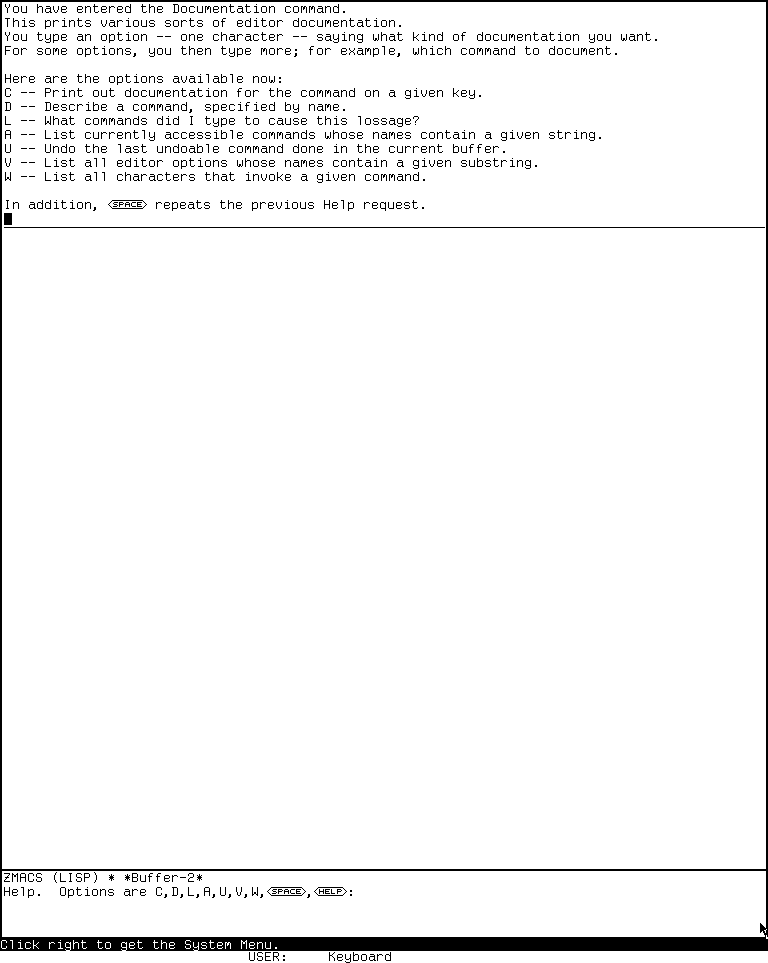
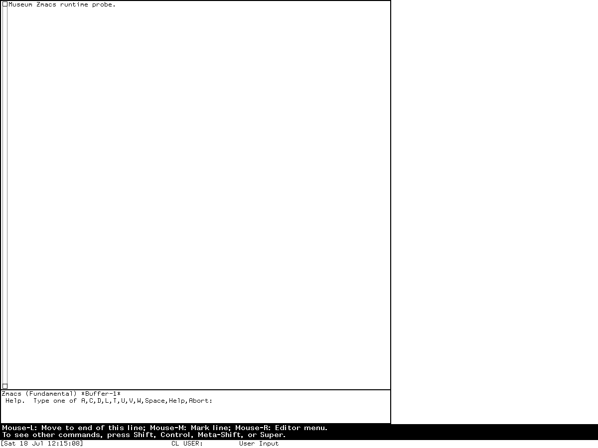
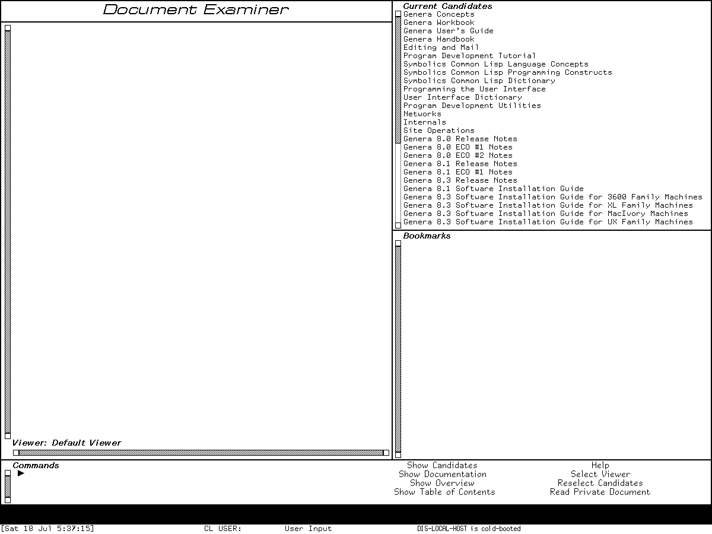

# Help, self-documentation, and Document Examiner on CADR and Genera

On the Lisp Machine, Help is an active protocol among command tables, key
registries, object metadata, presentation types, application handlers, and document
databases. It is not one manual viewer and it is not reducible to a `Help` key.

MIT System 46 already has three distinct layers: ZWEI can explain its live command
environment, the window system can enumerate registered System and Terminal keys,
and Lisp and Flavors retain documentation with definitions. The maintained LM-3
System 303 tree extends those paths and makes their runtime limits visible. Genera
keeps editor self-documentation, adds reusable pop-up Help and program-aware Help
frameworks, and supplies the Document Examiner for searching and reading the full
installed Sage documentation database.

The result is best understood as a routing graph:

| Request | Runtime authority | Typical result |
| --- | --- | --- |
| “What does this editor key do here?” | Active Zwei command-table chain, command hooks, and command documentation | Context-sensitive key explanation |
| “Where is this editor command?” | Active command tables and named-command alists | Current binding or absence |
| “What can follow System/Select or Terminal/Function?” | Mutable key registry | Live table of program or display commands |
| “What is this Lisp definition or flavor?” | Definition properties, compiled debugging records, flavor metadata | Docstring or structural description |
| “What does this program command/menu/option mean?” | Genera Help Program mapping plus the Sage topic index | Program-specific topic in Help or Document Examiner |
| “What documentation discusses this idea?” | Document Examiner topics, types, keywords, links, candidates, and tables of contents | Searchable installed documentation |

The companion preservation articles explain how the
[public CADR help corpus](mit-cadr/online-help-and-documentation-recovery.md) and the
[licensed Genera databases](genera/online-help-and-documentation-recovery.md) are
recovered. This dossier concentrates on the user-facing programs and the code paths
that produce their behavior.

## Evidence and release boundaries

| Boundary | Evidence | Limitation |
| --- | --- | --- |
| MIT CADR System 46 | Public source and operator manual at commit `8e978d7d1704096a63edd4386a3b8326a2e584af` | Source snapshot, not a live census of every historical band |
| LM-3 System 303 | Maintained public Fossil check-in `4df393c68d7f083ce42d5c377039d26043cc18a9031ace28258dc97f4137eb91` and a fresh System 303 run | Maintained restoration tree; loaded-world metadata can differ from source |
| Symbolics Genera 8.5 | Licensed local source, installed documentation inventory, Genera 8 manuals, and isolated runtime evidence | Licensed prose and source remain untracked and are described only in original words |

## System 46 ZWEI self-documentation

### Help is a dispatcher over the active editor

System 46 `Help` runs `COM-DOCUMENTATION`, which reads one more character and
dispatches to a documentation operation. The complete System 46 dispatcher is:

| Option | Operation |
| --- | --- |
| `A` | Command-name apropos; also reports known bindings |
| `B` | View the basic ZWEI introduction at `AI: ZWEI; BASIC ZWEI` |
| `C` | Read a key and document its command in the active command table |
| `D` | Read a named command with completion and show its full documentation |
| `L` | Show the recent input history (“lossage”) |
| `U` | Invoke Undo |
| `V` | Search documented editor variables by name |
| `W` | Read a named command and find every key that invokes it |
| `Space` | Repeat the preceding Help request |
| `?` | Explain the Help dispatcher itself |

The `B` path is a real runtime file consumer, but the public System 46 source tree's
`basic.zwei` is only a short historical placeholder. It proves the intended entry
point, not recovery of the missing tutorial.

### What “document this key” actually handles

The implementation does more than look up a symbol and print a string. It follows
aliases, descends into prefix command tables, can list every subcommand of a prefix,
identifies user keyboard macros, enumerates menu-command members, and invokes
`HOOK-DOCUMENTATION-FUNCTION` handlers contributed by active command hooks. A command
can provide an ordinary documentation property or a `DOCUMENTATION-FUNCTION` that
computes its display name, short description, or full description for the particular
key.

This is why editor Help can describe a mode-sensitive key accurately when a static
manual cannot. The lookup begins with the active command table, not with a global
binding appendix. `Where Is` traverses prefix tables and the current documentation
dispatcher as well as direct keys; `Apropos` can state how a matching command is
invoked.

The source-visible boundaries also matter. A named command without a documentation
property can appear in a command table but produce little useful prose. A basic-help
pathname can exist while its target is missing. Macro expansion, mode hooks, and
runtime table mutation can change the answer after the source is loaded.

## System and Terminal Help on CADR

System Help and Terminal Help belong to the window/keyboard system, not to ZWEI.

`SYSTEM HELP` walks `TV:*SYSTEM-KEYS*`, a mutable registry whose rows identify a
character, a window or flavor, printable documentation, and how a new window may be
created. The same registry drives actual program selection. A Control-modified
System character requests creation; `System Rubout` cancels the prefix. The
contemporary operator manual explicitly recommends System Help because sites and
programs can add choices.

`TERMINAL HELP` walks the independent `*ESCAPE-KEYS*` table. Each row contains a
character, handler, optional documentation, and execution options such as preserving
typeahead or running in the keyboard process. Rows with no documentation are omitted;
the display then appends the fixed special-function-key summary. This is a generated
view of the table, not a hard-coded list pretending the registry cannot change.

The System 46 operator manual describes the ordinary `Help` key as a request for
on-line documentation or programmed assistance and points readers to these two
prefix-help systems. The architecture matches the manual: Help is a convention that
individual programs and registries implement, not one global help process.

## Lisp and flavor self-description on CADR

The Lisp layer provides a parallel path. System 46 `FUNCTION-DOCUMENTATION` checks
symbol metadata, source lambda forms, and documentation retained in a compiled FEF's
debugging information. Flavors carry documentation, instance-variable descriptions,
component relationships, and method metadata. `DESCRIBE`, `APROPOS`, inspector
operations, and `DESCRIBE-FLAVOR` turn these data into user-visible reports.

These paths overlap with editor Help but are not identical. ZWEI's `PRINT-DOC` reads
the command-oriented `DOCUMENTATION` and `DOCUMENTATION-FUNCTION` properties. The
general Lisp documentation accessor follows its own document types and compiled
function records. A DEFCOM can therefore have useful editor Help even when a general
`DOCUMENTATION` query returns `NIL` in a particular world.

## System 303 changes and complete ZWEI Help choices

The maintained System 303 `zwei/doc.lisp` removes the System 46 `B` file-view option
and makes the displayed choice list conditional. `L` appears only when the input
stream supports playback, and `U` only when the current buffer has change history.
Its `A` operation is specifically **current-mode apropos**, whereas a separate
implementation path can search the broader command set.

In the fresh runnable world the dispatcher displayed the complete available set:

| Choice | Observed or source-defined role |
| --- | --- |
| `C` | Describe a key in the active editor context |
| `D` | Describe a named command |
| `L` | Show recent input |
| `A` | Search commands accessible in the current mode |
| `U` | Undo the last editor change |
| `V` | Search editor variables |
| `W` | Find command bindings |
| `Space` | Repeat the prior Help request |
| `Help` | Explain the dispatcher |

The System 303 key documenter adds explicit mouse-scroll explanation and understands
sparse as well as array command tables. The named-command search distinguishes a
key-bound command, a command reachable through the local extended-command dispatcher,
and a command available only through the broader “any extended command” path.

*Runtime observation — System 303, fresh session `d06-d07-20260718`, generation 1,
verified 2026-07-18: pressing `Help` and then `Help` displayed the current editor
dispatcher choices. This reviewed screenshot is evidence for this world, not every
CADR load band; full capture and publication provenance are in the
[CADR screenshot catalog](assets/mit-cadr-screenshots/).*

## Genera Zmacs self-documentation

Genera retains the same command-oriented design while changing the dispatcher. Its
complete static option set is:

| Option | Operation |
| --- | --- |
| `A` | Search command names and, normally, the first documentation line; a numeric argument restricts the search to names |
| `C` | Document a key or mouse character in the active command table |
| `D` | Describe a named extended command |
| `L` | Display the last 60 input characters when playback is available |
| `T` | Load, if necessary, and run the Teach Zmacs tutorial |
| `U` | Offer to undo the last buffer change when change history exists |
| `V` | Search editor variables |
| `W` | Report whether and where a named command is bound |
| `Space` | Repeat the most recent Help request |
| `?`, `Help` | Explain the dispatcher |
| `Abort`, `Rubout` | Leave the dispatcher without a request |

Genera Apropos searches both names and short documentation and, when there is no
match, proposes related search words from explicit synonym sets such as
insert/yank/paste and kill/delete/remove. `Where Is` reports that a command is not
available in the current context rather than treating presence in a global alist as
availability. The key documenter follows aliases and prefixes, enumerates menu
members, and can accept a mouse input object.

`T` is more than a label. If the Teach Zmacs command is not installed, the code loads
`SYS:EXAMPLES;TEACH-ZMACS` with ordinary load chatter suppressed, then invokes the
Command Processor's `Teach Zmacs` command. The tutorial's text remains a licensed
local asset described in the [Genera help recovery article](genera/online-help-and-documentation-recovery.md).

*Runtime observation — Genera 8.5, session `zmacs-research`, generation 1,
verified 2026-07-18: host `F12` reached the Zmacs Help dispatcher after recorded
host-key translation probes. The image establishes that harness mapping and the
displayed choices, not the physical location of Help on a Symbolics keyboard. Full
provenance is in the [Genera screenshot catalog](assets/genera-screenshots/).*

## Genera's reusable Help Program

The `help-program` framework lets a Dynamic Windows application map its own concepts
onto Sage topics. It defines mappings for:

- an application overview topic;
- a command name in the program's inherited command table;
- a command-menu item at any menu level;
- the program title itself; and
- an Accept Variable Values option, using its prompt as a topic component.

The framework checks the live Sage topic index before offering a result and caches
availability only until that index's fill pointer changes. Help-topic completion can
mix overview records, program commands, and command-menu items. When a command or menu
item maps to an available topic, the framework invokes Sage's Show Documentation
command; otherwise it reports that the requested program concept is not documented.

Mouse-middle is assigned the `:command-menu-help` gesture. Thus a program menu item
can use one gesture to invoke its command and another to request documentation about
the item. The program's title is itself a `program-name` presentation that can be
translated to Help about the program. This is semantic application Help: the object
under the pointer and the active program determine the topic.

Source also contains a missing-help audit that would compare inherited commands and
menu handlers with available topics, but the entire definition is block-commented in
the inspected revision. It is evidence of an intended maintenance tool, not an
installed command.

## The Genera pop-up Help frame

The nonselectable `help` program inherits from Help Program and supplies the
ephemeral frame used by Select Help, Function Help, Symbol-Help, and debugger
Control-Help. `SHOW-HELP` reuses an existing frame, changes its title and display
function, selects it, and can wait for the user to return. Deexposure buries the
frame, so it behaves like a temporary inspection surface rather than a permanent
application activity.

Its complete frame-specific and documented inherited controls are:

| Binding or gesture | Operation |
| --- | --- |
| `End`, `Abort` | Bury/exit the Help frame |
| `Help` | Display Help about the Help frame itself |
| `Scroll` | Scroll forward |
| `Meta-Scroll` | Scroll backward |
| `Meta-<`, `Meta->` | Move to the beginning or end |
| `Control-S`, `Control-R` | Search forward or backward in displayed text |
| `Control-Mouse-Left` | Mark text |
| `Control-Mouse-Right` | Open the marked-text menu |
| `Super-W`, `Meta-W` | Push marked text onto the editor kill ring |
| `Refresh` | Redisplay the frame |

Function Help enumerates the mutable function-key table. Select Help enumerates the
live Select-key table and turns each activity name into a presentation, while
explaining Control-modified creation and the cancel gesture. Symbol-Help describes
special function and character keys. The displays are therefore regenerated from
runtime registries where possible, not copied from one static keyboard chart.

## Document Examiner

### Purpose and entry points

Document Examiner is Genera's application for finding, navigating, and reading the
installed documentation database. The *Genera User's Guide* gives three equivalent
entry routes: `Select D`, the Document Examiner item in the System menu, and `Select
Activity Document Examiner` from the Command Processor. Source registers one
dispatching Select key and chooses a frame class from screen width: wider than 950
pixels uses Standard Document Examiner; smaller screens use Small Document Examiner.
The two implementation variants are hidden behind the one activity name.

The application works with documentation **records**. A record has a topic, a type,
keywords, contents, and indexed relationships. Type disambiguates like-named objects;
sections represent conceptual documentation. `Show Documentation` selects by topic;
`Show Candidates` searches topics and keyword tokens; Overview and Table of Contents
move through explicit document relationships rather than full-text adjacency alone.

The underlying 801 Sage Binary files and 17,266 decoded records in this release are
described without redistributing them in the
[Genera help recovery article](genera/online-help-and-documentation-recovery.md).

### Standard and small layouts

The standard frame has six functional surfaces:

| Pane | Role |
| --- | --- |
| Title | Identifies Document Examiner |
| Viewer | Renders documentation topics and retained topic history |
| Current Candidates | Shows search or table-of-contents results |
| Bookmarks | Shows the viewer's saved topic list and current topic marker |
| Command | Accepts completed named commands and arguments |
| Menu | Provides the eight top-level command items |

The standard menu is two columns: Show Candidates, Show Documentation, Show Overview,
Show Table of Contents; then Help, Select Viewer, Reselect Candidates, and Read
Private Document. Small Document Examiner replaces those eight fixed cells with
`Show` and `Other` submenus and rearranges panes to conserve vertical and horizontal
space. This is a real layout specialization, not merely a smaller font.

### Search and navigation model

`Show Candidates` accepts words and two independent search controls:

| Control | Values and effect |
| --- | --- |
| Matching | exact, heuristic, substring, or initial matching |
| Multiple-word order | adjacent words, or words in any order through logical conjunction |

The implementation tokenizes the query, searches topic and keyword tokens, logs the
lookup reason and result set, sorts candidates by their Document Examiner titles,
and replaces the Current Candidates pane. `Reselect Candidates` keeps a history of
earlier queries and can restore a previous result set. `Show Table of Contents`
replaces candidates with the selected topic's structural contents.

A **viewer** is a named reading context with topic history and bookmarks. Select
Viewer can create one by name; Select Previous Viewer cycles among existing contexts;
Remove Viewer discards one. The current topic can be shown from its beginning or its
last displayed screen. The viewer incrementally loads more record material when an
ellipsis reaches the active display region rather than requiring every topic to be
formatted up front.

### Complete core command and menu inventory

The following are the active user-facing core commands defined or imported by the
inspected Document Examiner sources. Optional hardcopy commands are separated below.

| Command | Function or access path |
| --- | --- |
| Show Documentation | Add a selected record group to the current viewer |
| Show Overview | Display context/relationship information for a topic |
| Show Candidates | Search topic names and keywords with the matching controls above |
| Show Table of Contents | Replace candidates with a topic's structural contents |
| Add Bookmark | Add a topic to the current viewer's bookmarks |
| Remove Item | Remove a bookmark/view item |
| Help | Construct and show the live Document Examiner command summary |
| Document Examiner Documentation | Show the full installed Document Examiner documentation |
| Beginning of Topic; End of Topic | Show the first or last previously displayed screen of a topic |
| Reselect Candidates | Choose an earlier candidate query |
| Select Viewer; Select Previous Viewer; Remove Viewer | Manage named reading contexts |
| Refresh | Reformat and redisplay the current context |
| Scroll Viewer; Scroll Typeout Window | Move by screen, line, beginning, or end |
| Scroll Search | Search displayed viewer text forward or backward |
| Clear Marked Text; Push Marked Text | Clear selections or copy selected text to the Zwei kill ring |
| Save Private Document | Save the current bookmark sequence |
| Read Private Document | Load a private document and view all referenced topics |
| Load Private Document | Load its references as bookmarks without viewing them |
| Set, Clear, List Sage Variable | Imported Sage environment controls |
| Run Documentation Example; Edit Documentation Example | Imported executable-example controls |
| Edit Definition | Imported when Development Utilities is loaded |

The full menu hierarchy exposes the top-level eight items plus viewer commands
(select, remove, and optional hardcopy) and private-document commands (read, load,
save, and optional hardcopy). The separate hardcopy module adds Hardcopy Viewer,
Hardcopy Documentation, and Hardcopy Private Document when printer support is
available. It selects only printers accepted by the Sage display backend and can
restrict viewer hardcopy to material already seen.

### Complete explicit keyboard accelerators

| Binding(s) | Operation |
| --- | --- |
| `Help` | Show the computed command summary |
| `Control-Meta-L` | Select the previous viewer; a numeric argument chooses farther back |
| `Space` | Remove a viewer typeout window / return to the main viewer position |
| `Refresh` | Refresh the current viewer |
| `Meta-<`, `Meta->` | Go to the first topic or the last screen of the last topic |
| `Scroll`, `Control-V` | Scroll the viewer forward; a numeric argument switches to lines and an infinite argument goes to the end |
| `Meta-Scroll`, `Meta-V` | Scroll backward; corresponding arguments choose lines or beginning |
| `Control-Scroll` | Scroll the typeout window forward |
| `Control-Meta-Scroll` | Scroll the typeout window backward |
| `Super-S`, `Super-R` | Search viewer text forward or backward |
| `Super-G` | Clear marked text in exposed panes |
| `Super-W` | Push marked text from exposed panes onto the Zwei kill ring |

This is the complete explicit accelerator set installed by the inspected core
`examiner.lisp` and `dexcom.lisp` sources. Named commands, menu handlers,
presentations, standard numeric-argument handling, and optional modules add access
paths without adding another fixed key in those files.

### Pointer gestures and presentations

Document Examiner rows are semantic presentations rather than text-only hotspots.
The core source defines these direct gestures:

| Object and gesture | Result |
| --- | --- |
| Candidate/topic, left | Show the documentation in the current viewer |
| Candidate/topic, middle | Show its Overview |
| Candidate/topic, Shift-middle | Add it as a bookmark |
| Bookmark, left | Show its documentation |
| Bookmark, middle | Show its Overview |
| Bookmark, Shift-middle | Discard the bookmark |
| Ellipsis presentation | Load and display more of that topic |
| Help menu item, left or right | Show the computed command summary |
| Help menu item, middle | Show full Document Examiner documentation |

Right-button subcommand menus also expose operations without assigning every command
a dedicated gesture. Undefined documentation references are presentations with a
handler that reports or follows the forward-reference state instead of being emitted
as inert broken text.

### Private documents are reference lists, not copied manuals

The canonical private-document type is `PSB`. Saving writes the bookmark count and,
for each item, its topic and record type through the Sage symbol-table encoding.
Reading resolves those identities back into installed record groups. The private
file is therefore a curated reading list over the installed database, not an archive
containing the referenced documentation prose. This implementation fact is more
precise than the manual's user-facing analogy to creating a private document.

### Self-help is generated from the installed command environment

The `Help` command does not display one frozen command summary. The macro that defines
a documented Document Examiner command registers the command, its accelerators, and
its documentation in `*DEX-COMMAND-HELP-ALIST*` and increments a tick. Help sorts
keyboard commands, lists named commands, constructs a computed Sage record, and
rebuilds it when that tick changes. Optional modules can therefore extend the summary
when loaded.

The full-documentation path is separate: middle-clicking Help or invoking Document
Examiner Documentation resolves the installed “Document Examiner” section. The
manual's distinction between abbreviated and complete Help follows this implementation
split exactly.

## Source findings beyond the manuals

- System 46, System 303, and Genera editor Help all derive answers from the active
  command environment, but their dispatch choices are not identical. In particular,
  System 46's missing basic-file path becomes System 303's dynamic choice set, while
  Genera adds a load-on-demand tutorial.
- General Lisp `DOCUMENTATION`, Zwei command Help, flavor description, and Document
  Examiner are complementary registries. A `NIL` result in one does not prove that
  another has no documentation.
- Genera Help Program caches topic availability against the Sage index length, so a
  newly installed documentation index invalidates prior negative lookups without
  requiring a static menu rebuild.
- The Help frame is intentionally ephemeral and reuses one program frame by replacing
  its rendering function; it is not a separately accumulating activity history.
- Document Examiner chooses a different frame implementation at a 950-pixel screen
  boundary while preserving one Select key and activity identity.
- Document Examiner closes kept Sage file streams after approximately one idle minute
  when they remain open. The top level resets this timer around user input and closes
  each stream normally or, after an error, in abort mode.
- Candidate search has a source comment acknowledging a tokenization edge case for a
  one-character string that is both an opening and closing delimiter. The code falls
  back to the original string rather than silently returning no token.
- The hardcopy layer can print only topics already seen in a viewer and filters
  candidate printers through the Sage backend; this behavior is not implied by a
  generic “Hardcopy Viewer” label.
- The source contains a complete command/menu missing-documentation auditor, but it is
  block-commented. Documentation coverage was a recognized maintenance problem even
  though this particular audit command did not ship active here.

## Fresh System 303 runtime observations

The same fresh `d06-d07-20260718`, generation 1 session used for the specialized
editor study exercised all reachable CADR help layers. Its load band was System
303-0; the base and session disk SHA-256 at start was
`bb16e46ad81decfe1efe691d36b6aa4ce3fd4ffb82474365de3520989d397cb5`, and the base
remained unchanged. Public and private source identities, emulator and machine
artifact hashes, display geometry, and clean stop are recorded in
[the directory/buffer-editor dossier](directory-difference-and-buffer-editors.md#fresh-system-303-runtime-observations).

The evidence-producing actions and results were:

1. In Zmacs, `Help`, then `Help`, displayed the dynamic dispatcher shown above.
2. `D` followed by the named command `Dired` displayed Dired's full editor-command
   description. This proved the named-command path without requiring a file-server
   login.
3. `System Help` displayed five live choices in this world: Top-L for Lisp(Edit), E
   for Editor, I for Inspector, L for Lisp, and P for Peek. It was a generated
   registry view, not the broader Programs menu.
4. In a Lisp Listener, `(DOCUMENTATION 'CAR)` returned `NIL`. A query for the ZWEI
   Dired command also returned `NIL`. These are direct evidence that the general
   accessor does not subsume all loaded command documentation.
5. `(DESCRIBE-FLAVOR 'TV:WINDOW)` produced a large live structural report including
   direct and inherited components, instance variables, properties, documentation,
   and method-table information. Flavor self-description was therefore functional
   even though the two general `DOCUMENTATION` probes returned no string.

The System Help capture `0023-system-help.png` has PNG SHA-256
`dfc229e0f3ab5cb233b56369abb0c473c78346572ff5febc102d98b565c1fb1f` and pixel
SHA-256 `2a16fab7052e295e3d22c324a75ee813e42cbfbca074bd1334c99de89d6de448`.
The flavor report capture `0027-describe-flavor-window.png` has PNG SHA-256
`8e255c63863084b05e88f59d33262295c36d4f7ba588b9ac2e6d8848ff43cc88`
and pixel SHA-256
`41a87233090d34b7ddbaef0b556c70e0d4eaebbd40a4ea019435cb3d2740c7cd`.
Both remain local pending image-specific publication review; the reviewed ZWEI Help
dispatcher above is the only fresh CADR image needed for the editor-help claim.

## Fresh Genera runtime observations

A fresh isolated run named `d06-d07-genera-20260718`, generation 3, exercised
Document Examiner from 05:36:27 through 05:38:54 EDT on 2026-07-18. The selected
client was `Genera on DIS-LOCAL-HOST`, XID 4194310, at 1200 by 900 pixels. `Select D`
therefore chose the source-predicted Standard Document Examiner rather than the
small-screen variant.

*Runtime observation: `Select D` opened this 1200-pixel Standard Document
Examiner on 2026-07-18. The initial frame is published as the minimum visual
evidence for the six-pane layout and menu; it shows only short installed-document
titles rather than documentation prose. Symbolics retains interests in the
licensed software, and inclusion implies no endorsement.*

The initial frame visibly confirmed all six standard surfaces: title, empty Default
Viewer, Current Candidates, empty Bookmarks, Commands, and the two-column eight-item
menu. Current Candidates began with installed documentation families and release-note
sets. Pressing host `F12`, the harness mapping already established for Genera Help,
inserted the computed **Document Examiner Command Summary** into the viewer and its
bookmark pane. The displayed accelerator list matched the static core inventory
above. Its named-command list included Hardcopy Documentation and Hardcopy Viewer,
so the optional hardcopy command layer is installed in this exact world; source
presence alone was not used to make that claim.

The controlled command sequence then entered `Show Candidates`, accepted the string
`buffer`, and supplied no nondefault search controls. The source defaults were
therefore heuristic matching and words in any order. The Current Candidates pane was
replaced with a sorted mixture of topics and keyword hits, including flavor methods,
buffer commands, and conceptual buffer sections, while the Help record remained in
the viewer and bookmark context. This directly confirms that candidate search
updates one pane without discarding the reading context.

| Provenance item | Recorded value |
| --- | --- |
| Licensed archive | `opengenera2.tar.bz2`, 206,213,430 bytes; SHA-256 `89fb3e76b91d612834f565834dea950b603acf8f9dbacacdd0b1c3c284a2d36e` |
| Base and private world | `Genera-8-5.vlod`, 54,804,480 bytes; SHA-256 `a8ee5e86cc7e322f7385af3e0cd579d7650d4dcfc3ce328acbf8b25515dd0672` at start and stop |
| VLM / debugger | SHA-256 `9f5e18d5770f973879716182b6856ef5a8ee9d3b2bb907476ea0cf35986aa4c7` / `2db918cfe8f35f52c7ff4b7695b0ecd3bb85e41a3327ea5a94874edf05edb54a` |
| Compatibility preloads / configuration | SHA-256 `f45f45461622975996ab41138f64bb84a4b17c51fba0dbb649208914898c26b7`, `acd71dbcb948f05b7fd2730b2b4706c08f16f46d792bd9aa6aa64370e855e4b1`, and `5ce6509f5adf2cf2d054d34eb4ba777ce462285b8cd9b01bc071bf819139e086` |
| Time responder | Source/executable SHA-256 `cc3a2274149c5593b52e6608d732d4048518c766134df5e0f018746ad5cf98bb`; validated responder exit zero |
| Harness / toolchain | Python harness SHA-256 `bc9276ac766913bc15018dd334a2a2704ae5a926e1fcbc30ccfcff08af8cb48a`; `manifest.scm` SHA-256 `3adae999bbe420182f22adc2499fcc82449a46eaf580a362de9c0e718fa6b37d`; Guix revision `230aa373f315f247852ee07dff34146e9b480aec` |
| Input record | Eight records, four intents and four linked successes; SHA-256 `e2a4fc8c15f9f108245f20bb8604767e4789ae9874b6afeec3de751894aa0eb9` |
| Curated capture | Raw `0002-document-examiner-initial.png`, captured 05:37:15 EDT, 1200 by 900, 6,475 bytes; PNG SHA-256 `2579d041983693aec1a794ba1efa23ca70e21421c2a2ca5b7eaab8d39e908834`; normalized-pixel SHA-256 `0f6cf810c2665a4f3d36c6ec6fce918d3149d2489c1c01a3cef77545365d7bdc`; action prefix two records, SHA-256 `aeb83393dc85ed3d90ab081717e341a7b01068090e6bcda5080778f61b6b831b` |
| Final record | 25,592 bytes; SHA-256 `75ab0372da63728ffeaad0d08aa4ac65e639485d7478eb8f9740485e9d09a83c` |
| Isolation | Separate user, mount, network, PID, IPC, and hostname namespaces; no external route or host file service; MIT-SHM live-verified absent |

Shutdown reproduced the already bounded public-VLM defect: the prompt appeared,
`yes` was sent and accepted, cleanup progress began, and the confirmed stall then
required `SIGKILL`. Thus `forced_stop=true`, `state_may_be_incomplete=true`, and the
host shutdown was not orderly. The harness invoked neither Save World nor a process
checkpoint; the private and base worlds remained byte-identical. Any unsaved Lisp
state was discarded conditionally, not proved persisted.

The sparse initial frame above passed an image- and use-specific review and was
copied byte-for-byte to the curated Genera asset tree. It is sufficient for the
layout claim. The computed-summary capture has PNG/pixel SHA-256
`e4d95337f28796ea53dadf16cd7b449c1d14edb1f0ab69fdfce62fd4e06e4957` /
`cbfde31cc403ffc21932163e81f3bf626de90e5c8dfbb2a7e03d157bac6e3a50`;
the controlled candidate result has
`9fd940a4c91dd9e35caf3ad2213100c35d5a30c11d8693d0dd1f482b2722c827` /
`2e038fa0f1b63c79b8c8f4c78d418652a3ebcf615cd172da61b0606dd7c8cd98`.
Those two richer displays remain ignored local evidence: their behavior is reported
from direct observation, but publishing the additional Help/result text is not
necessary to establish the present claims.

## Preservation and rights

The public System 46 recovery may retain source-context extracts under its source
license. The maintained LM-3 cross-check remains metadata-only where the tree's mixed
rights signals are unresolved. Genera's SAB databases, standalone tutorials, decoded
records, pictures, and licensed source remain ignored local inputs.

A runtime screenshot is a separate, image-specific publication decision. A sparse
command summary or frame layout may be used as evidence after review; substantial
manual pages or Help prose, decorative galleries, and bulk interaction sequences are
not appropriate. The governing review is
[Publishing runtime screenshots for museum documentation](screenshot-publication-rights-review.md).
The selected initial Document Examiner frame passed that review for this article
only; it does not authorize redistribution of the underlying documentation corpus.

## Open questions

- Enumerate the live Genera Help Program subclasses and compare their installed topic
  mappings with the 7,809 static help-bearing source candidates.
- Determine whether the Development Utilities `Edit Definition` command is installed
  in the exact Genera 8.5 world. The fresh computed summary confirms the hardcopy
  layer, but the unscrolled first screen does not establish this later optional item.
- Audit compiled-only System 303 documentation records so `NIL` from a few probes is
  not mistaken for a census of the world.
- Recover or identify the intended System 46 Basic ZWEI file without substituting the
  53-byte placeholder or material from a later release.

## Sources

- MIT CADR System 46, [`nzwei/doc.31`](https://github.com/mietek/mit-cadr-system-software/blob/8e978d7d1704096a63edd4386a3b8326a2e584af/src/nzwei/doc.31),
  14,517 bytes, SHA-256
  `9e379b908a508565d3115216dc65abab4db279768b579df6a9e18db17eb63d06`.
- MIT CADR System 46, [`nzwei/basic.zwei`](https://github.com/mietek/mit-cadr-system-software/blob/8e978d7d1704096a63edd4386a3b8326a2e584af/src/nzwei/basic.zwei),
  the 53-byte placeholder reached by the `B` option, SHA-256
  `27ff8f344dc9bd48f4b3ee0178d9eb5df92626c3ef0969e36475203b3b63cc36`.
- MIT CADR System 46, [`lmwind/operat.27`](https://github.com/mietek/mit-cadr-system-software/blob/8e978d7d1704096a63edd4386a3b8326a2e584af/src/lmwind/operat.27),
  85,337 bytes, SHA-256
  `a5ab658210dc09891b0886b58af705368e33a41f013073c8b9a637d99ab0f02d`,
  especially System Help, the Help key, and Terminal Help.
- LM-3 System 303, [`zwei/doc.lisp`](https://tumbleweed.nu/r/sys/file?ci=4df393c68d7f083ce42d5c377039d26043cc18a9031ace28258dc97f4137eb91&name=zwei%2Fdoc.lisp),
  23,055 bytes, SHA-256
  `533a733139c6de028462f15363edff5cdfcceebfb217a165b830f9838d8d9f6e`.
- LM-3 System 303, [`window/basstr.lisp`](https://tumbleweed.nu/r/sys/file?ci=4df393c68d7f083ce42d5c377039d26043cc18a9031ace28258dc97f4137eb91&name=window%2Fbasstr.lisp),
  81,846 bytes, SHA-256
  `8ba3a16e726ed043e6585c7a68b7096bb2dcc5d6f05476afd89f84a48dff2645`,
  for System and Terminal registry Help.
- LM-3 System 303, [`sys/qmisc.lisp`](https://tumbleweed.nu/r/sys/file?ci=4df393c68d7f083ce42d5c377039d26043cc18a9031ace28258dc97f4137eb91&name=sys%2Fqmisc.lisp),
  83,123 bytes, SHA-256
  `d8c022999c40033b0073c0bec364fbe28ac20c4aa4ecb77afa4c70d1bfc9d840`,
  for general Lisp documentation lookup.
- Symbolics, [*Genera User's Guide*](https://bitsavers.org/pdf/symbolics/software/genera_8/Genera_User_s_Guide.pdf),
  “Using the Online Documentation System” and “Document Examiner”.
- Symbolics, [*Genera Workbook*](https://bitsavers.org/pdf/symbolics/software/genera_8/Genera_Workbook.pdf),
  Document Examiner overview, frame, commands, walk-through, and bookmarks.
- Licensed local Genera 8.5 sources: `zwei/doc.lisp.~110~`, 24,234 bytes, SHA-256
  `571f3fe9114376c9e13434e1825f4610198c227594cc3cb44eb35fc65edd0bcd`;
  `dynamic-windows/help-program.lisp.~4013~`, 14,996 bytes, SHA-256
  `9863229903ce00a32262862d2cbc0ff22447ffafcae6169f2a418969b3e70c04`;
  `window/help-frame.lisp.~22~`, 17,047 bytes, SHA-256
  `93f9421715235bb3d1fee377cdee353724b43aee3603a45aafe6c8a8f6397db6`;
  `sys/extended-help.lisp.~21~`, 4,330 bytes, SHA-256
  `2123c65102bbcb0a8d00b3fe5427e39c4c72d7f90216f52f6b162cd22c963979`;
  `nsage/ddex/examiner.lisp.~81~`, 31,580 bytes, SHA-256
  `dece335c917703acf440812d857af0e3e1d03dfe2b8118d21efcf6bfe4c22654`;
  `nsage/ddex/dexcom.lisp.~59~`, 44,235 bytes, SHA-256
  `f07593f5ecf076ad9c6b8ce9f979747414a9cf975615bdae7774ce027db5948d`;
  and optional `hardcopy-dexcom.lisp.~1~`, 7,965 bytes, SHA-256
  `5c5cb342877a5ac3e70480c9239f6ccefa530b06d7108f56c8ddbf549eb3a952`.
- Fresh System 303 Xvfb session `d06-d07-20260718`, generation 1, observed
  2026-07-18; reviewed Genera `zmacs-research`, generation 1, editor-Help
  observation; and fresh isolated Genera `d06-d07-genera-20260718`, generation 3,
  Document Examiner observation.

Last verified: 2026-07-18.
