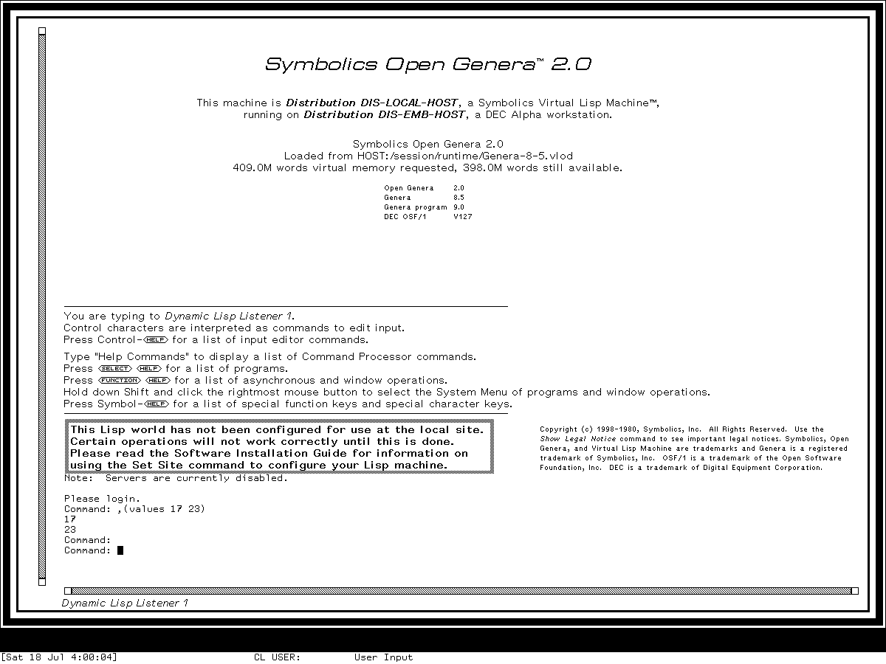

# Lisp Listeners and editable input reimplementation specification

## Status and reconstruction claim

This specification defines an implementation-independent Lisp Listener for three
coherent profiles:

- public MIT CADR **System 46 source** at Git revision
  `8e978d7d1704096a63edd4386a3b8326a2e584af`;
- maintained LM-3 source at check-in
  `4df393c68d7f083ce42d5c377039d26043cc18a9031ace28258dc97f4137eb91`
  and the separately identified runnable **System 303-0** band; and
- **Genera 8.5, System 452.22** source media and the separately identified
  `Genera-8-5.vlod` base world under Open Genera 2.0.

A conforming implementation can reproduce the Listener's semantic state, process and
stream ownership, read/evaluate/print transaction, multiple-value histories, editable
input, and the release-specific distinction between an MIT rubout-handler Listener
and a Genera Dynamic Lisp Listener using the Command Processor, Input Editor, and
Dynamic Windows presentations. The System 303 and Genera profiles additionally have
bounded visual and runtime-observed requirements.

This document does not claim:

- that System 46, System 303, and Genera are interchangeable releases;
- exact historical package, flavor, class, function, macro, condition, or module-load
  compatibility;
- ABI, QFASL/L-BIN, world, saved-band, or byte-identical compatibility;
- identical fonts, boot banners, timing, garbage-collector state, or host window
  furniture outside the visual constraints stated here; or
- runtime confirmation for every input-editor command, nested break path, completion
  population, presentation translator, or error branch.

The implementation MAY expose all three profiles. It MUST NOT silently combine their
different history, package, command-language, or input-editor rules into one alleged
historical release.

## Normative language and evidence codes

`MUST`, `MUST NOT`, `SHOULD`, and `MAY` are normative. A requirement applies only to
the profiles named beside it. Requirements marked `INF` are clean-room rules needed
to preserve established behavior; they are not claims about historical data
structures.

| Code | Evidence class | Establishes | Does not establish |
| --- | --- | --- | --- |
| `C46-SRC` | Public System 46 implementation source | Source-visible state, order, defaults, and old input behavior | A particular running load band or later LM-3 behavior |
| `C303-SRC` | Maintained LM-3 System 303 source | Source-visible System 303 contracts at the pinned check-in | That every historical CADR used those revisions |
| `C303-RUN` | Isolated `System 303-0` runtime session | The exact exercised selection, display, evaluation, and shutdown path | Untested input and error branches |
| `G85-S452.22` | Licensed Genera 8.5 System 452.22 source media inspected locally | Source-visible Listener, Command Processor, Input Editor, and Dynamic Windows behavior in the exact hashed files | Permission to redistribute source, or proof that each body is loaded in the base world |
| `G85-BASE-WORLD` | Exact unconfigured `Genera-8-5.vlod` | World identity, resident state queried at runtime, and the base configuration boundary | Source-to-world build correspondence or enabled-site behavior |
| `G85-RUN` | Isolated Genera 8.5 VLM session | The exact exercised command-preferred and multiple-value path | Other command modes, configured sites, or orderly host shutdown |
| `MIT-MAN` | Contemporary MIT manual source and manuals | Intended CADR user contract for the named document/release | A System 303 implementation or exhaustive behavior |
| `G8-MAN` | Public Genera 8 manuals | Intended Genera 8 user contract | Exact 8.5 behavior without source/runtime cross-check |
| `G85-HELP` | Licensed installed Genera Help records inspected locally | Intended operation of the exact record versions | Permission to redistribute prose or proof of every runtime path |
| `INF` | Implementation-independent reconstruction rule | A portable rule that preserves the cited observations | Historical representation or algorithm |
| `TODO-RUNTIME` | Unclosed runtime obligation | Nothing until the probe is performed | A reason to guess |

When evidence disagrees, source controls the named source profile and runtime controls
only the exact exercised artifact path. A manual can establish supported intent but
cannot erase a source-visible release difference. Genera licensed evidence is cited
by portable identity and summarized in original language; no proprietary body is
reproduced.

## Compatibility profiles and levels

### Release profiles

| Profile | Exact target | Required substrate | Principal difference |
| --- | --- | --- | --- |
| `C46` | MIT CADR System 46 public source snapshot | System 46 top level, TV stream, compact rubout handler | Old keyboard commands; no source-visible per-Listener package synchronization or extended all-values history |
| `C303` | Maintained LM-3 source plus `System 303-0`, ZWEI 129.0, microcode 323 runtime | [TV profile](mit-cadr/tv-window-system-reimplementation-specification.md), process, stream, standard `RH` input editor | Per-Listener package synchronization, extended histories, selectable standard/fallback rubout handlers |
| `G85` | Genera 8.5 System 452.22 source media plus unconfigured `Genera-8-5.vlod` | TV, [Dynamic Windows](genera/dynamic-windows-reimplementation-specification.md), Command Processor, Input Editor, evaluator | Typed command/form dispatch, presentations, localizable input contexts, Standard Values |

`C303-SRC` and `C303-RUN` are triangulated evidence, not a proven build chain: no
record presently establishes that the runnable band was compiled byte-for-byte from
the pinned maintained check-in. Likewise, `G85-S452.22` and `G85-BASE-WORLD` belong
to the inspected release set, but media presence does not prove that every inspected
source body or patch is resident in that world. Requirements identify which witness
supports them rather than silently treating these artifacts as identical.

### Conformance levels

| Level | Required behavior | Reserved behavior |
| --- | --- | --- |
| `L0` | Listener state, independent process/stream, read/evaluate/print, value histories, top-level recovery | Full editable input and release-specific UI |
| `L1` | `L0` plus the selected profile's input buffer, activation, rescan, movement, deletion, history, and abort behavior | Command Processor and presentation interaction |
| `L2` | `L1` plus selection/creation, release-specific visible layout, and, for `G85`, command/form dispatch, typed completion, and presentations | Exact historical source interface |
| `L3` | Exact selected historical source interface and selected-module load closure | ABI, compiled artifacts, or saved worlds |

This specification normatively defines `C46/L1`, `C303/L2`, and `G85/L2` at the
stated semantic grain. The `C46` contract is source-grounded; `C303` and `G85` add
only the bounded runtime observations named below. None of those levels is claimed
as completely verified against a preserved-system oracle until its open conformance
tests and closure probes have run. `L3` is reserved.

| Member/profile | Contract defined | Preserved runtime verified | Remaining oracle boundary |
| --- | --- | --- | --- |
| `C46` ordinary Listener | `L1` | No | Compatible band, old input editing, visual profile, errors |
| `C303` ordinary Listener | `L2` | Selection and multiple-value display only | Complete handler families, parse/break/abort branches |
| `C303` ZDT and ZTOP | `L1` source contract | No | Effective load, lifecycle, activation, abort, and visible states |
| `G85` Dynamic Lisp Listener | `L2` | Command Preferred multiple-value path only | Other dispatch/blank-line modes, typed presentations, errors and aborts |

## Evidence ledger

| Contract area | `C46` witness | `C303` witness | `G85` witness | Status |
| --- | --- | --- | --- | --- |
| Top-level loop and histories | [`src/lispm/ltop.231`](mit-cadr/lisp-listener.md#mit-cadr-system-46) | [`l/sys/sys/ltop.lisp`](mit-cadr/lisp-listener.md#lm-3-system-303) | [`command-loop` and `standard-values`](genera/dynamic-lisp-listener.md#evidence-and-rights-boundary) | Normative from per-file hashed source, with profile deltas |
| Window/process ownership | [`src/lmwin/baswin.428`](mit-cadr/lisp-listener.md#mit-cadr-system-46) | [`l/sys/window/baswin.lisp`](mit-cadr/lisp-listener.md#lm-3-system-303) | [`window/baswin` and Dynamic Windows combinations](genera/dynamic-lisp-listener.md#evidence-and-rights-boundary) | Normative from per-file hashed source |
| Editable input | [`src/lmwin/stream.14`](mit-cadr/lisp-listener.md#mit-cadr-system-46) | [`window/stream`, `window/rh`, and `io/read`](mit-cadr/lisp-listener.md#lm-3-system-303) | [`io/input-editor` and `zwei/ie-commands`](genera/dynamic-lisp-listener.md#evidence-and-rights-boundary) | Normative from per-file hashed source; not every command runtime-exercised |
| Editing-Listener embodiments | Not established in this profile | `l/sys/zwei/stream.lisp`, `comtab.lisp`, `modes.lisp` | Not applicable | `C303-SRC`; effective loaded state remains open |
| Command/form dispatch | Not present | Not present | [`cp/command-processor` and `cp/defs`](genera/dynamic-lisp-listener.md#evidence-and-rights-boundary) | `G85-S452.22` only |
| Presentations | TV text regions only; no typed presentation claim | TV text regions only; no typed presentation claim | Dynamic Windows interactor and program-framework panes | `G85` only |
| Visible multiple values | No System 46 runtime | `core-env-20260718` generation 1 | `core-dossiers-20260718` generation 1 | Runtime-bounded |
| Complete controls | [MIT Listener dossier](mit-cadr/lisp-listener.md#buffered-listener-input-editor) | Same dossier, standard and fallback handler sections | [Genera Listener dossier](genera/dynamic-lisp-listener.md#complete-configured-base-input-editor-bindings) | Normative companion inventories at `L1` |

### Normative evidence map and selected-module coverage

Line spans name the inspected artifact versions in the identity table below; they are
locators, not reproduced proprietary text.

| Contract section | `C46-SRC` | `C303-SRC` | `G85-S452.22` |
| --- | --- | --- | --- |
| Top-level phases and histories | `src/lispm/ltop.231:151-171` | `l/sys/sys/ltop.lisp:430-497` | `sys.sct/sys/command-loop.lisp.~200~:82-112,340-427` |
| Nested break | `src/lispm/ltop.231:173-227` | `l/sys/sys/ltop.lisp:515-643` | `sys.sct/sys/command-loop.lisp.~200~:429-562` |
| Listener lifecycle, selection, reset, and kill | selector/registry in `src/lmwin/basstr.163:683-758`; select/deselect in `src/lmwin/baswin.428:220-280`; process and Listener in `src/lmwin/baswin.428:1142-1203`; Reset/Kill dispatch in `src/lmwin/sysmen.105:61-110` | selector/registry in `l/sys/window/basstr.lisp:1523-1644`; process, restart, recognition, and idle reuse in `l/sys/window/baswin.lisp:1503-1621`; confirmed Reset/Kill dispatch in `l/sys/window/sysmen.lisp:278-303` | activity resolution in `sys.sct/window/activities.lisp.~35~:65-220`; select/deselect/MRU in `sys.sct/window/baswin.lisp.~713~:370-524`; process/reset/kill and Listener in the same file at `2328-2488`; guarded Reset/Kill dispatch in `sys.sct/window/sysmen.lisp.~250~:405-435`; Dynamic Listener composition in `sys.sct/dynamic-windows/dynamic-window-combinations.lisp.~25~:248-310`; registration in `sys.sct/dynamic-windows/cometh.lisp.~65~:66-95`; interactor/listener pane types in `sys.sct/dynamic-windows/program-framework-panes.lisp.~32~:146-159` |
| Compact or standard editable input | `src/lmwin/stream.14:242-348` | fallback loop in `l/sys/window/stream.lisp:261-531`; standard handler loop/history in `l/sys/window/rh.lisp:68-330`; command definitions and installation surface in `l/sys/window/rh.lisp:624-1659`; reader/activation boundary in `l/sys/io/read.lisp:142-279,496-561` | base Input Editor in `sys.sct/io/input-editor.lisp.~332~:1023-2459`; all Lisp-structure additions in `sys.sct/zwei/ie-commands.lisp.~2~:58-527`; exact configured gesture inventory in the [Genera dossier](genera/dynamic-lisp-listener.md#complete-configured-base-input-editor-bindings) |
| ZDT and ZTOP | Not established | `l/sys/zwei/stream.lisp:831-849,1127-1562` | Not applicable |
| Command/form modes, blank lines, command values, CP on/off | Not applicable | Not applicable | `sys.sct/cp/defs.lisp.~5~:57-121`; `sys.sct/cp/command-processor.lisp.~318~:74-219,536-855,2384-2553,3217-3224`; `sys.sct/dynamic-windows/accept-substrate.lisp.~19~:809-819,961-986` |

| Selected module family | Coverage in this specification | Reserved closure |
| --- | --- | --- |
| Three top-level loops and break loops | Phase order, histories, stream routing, nesting, resume/return/abort | Complete callable signatures, conditions, every restart and debugger handoff (`L3`) |
| CADR Listener window/process and selector code | Recognition, idle/busy, delayed start, selector/create behavior, and source-visible Reset/Kill entry points at `L2`; terminal no-dangling cleanup is separately marked `INF` | Exact flavor method protocol, generic sheet-kill closure, and every partial initialization branch (`L3`) |
| CADR rubout handlers and Genera Input Editor | Every configured binding is incorporated by normative companion inventory; buffer/reader invariants specified | Unbound helper internals and untested command partial effects |
| System 303 ZWEI editor stream | ZDT singleton and ZTOP stream/stack-group/mode/abort contracts | Runtime-loaded overlays and exact screenshots |
| Genera Command Processor | Dispatch and blank-line modes, command-value visibility, six-hook enable/disable state | Every command table, presentation subtype, localized prompt context, and patch |
| Dynamic Windows presentation substrate | Delegated to the existing Dynamic Windows specification | Pixel identity and historical internal API beyond that specification |

Every normative section below is governed by one or more rows in this map. Rules
marked `INF` are deliberately portable reconstruction/safety requirements rather than
claims about an uninspected historical branch.

## Architecture and ownership boundaries

The common architecture is a process-owning interactive stream around a Lisp top
level. Editable input is a transaction in front of the reader, not part of the Lisp
evaluator.

```text
selection/creation
    -> Listener window or Dynamic Windows interactor
        -> editable input stream
            -> reader -> evaluator -> multiple values -> printer
        -> per-Listener process and interaction state
```

`G85` adds two semantic layers:

```text
Dynamic Windows presentations
    -> Command Processor: command or Lisp dispatch, typed arguments, completion
        -> Input Editor: mutable current input, contexts, history, typeout
            -> Listener top-level transaction
```

The implementation MUST keep these ownership boundaries observable:

- the Listener owns or is assigned one top-level process;
- the terminal stream owns the current editable input and its stream-local input
  history;
- the top level owns dynamic form and value histories;
- the reader determines when a Lisp object is complete;
- the evaluator may run arbitrary application code and return zero or more values;
- the printer writes each returned value through the Listener output stream; and
- in `G85`, the active input context and Command Processor own command parsing and
  typed completion, while Dynamic Windows owns presentation recording and handlers.

The stream and reader-context rules are profile-specific:

| Profile | Input/history ownership | Reader synchronization | Output routing |
| --- | --- | --- | --- |
| `C46` | The Listener stream owns the current rubout buffer/rescan state; this profile has no required persistent per-stream input-history facility | Package, readtable, and bases are top-level dynamic state; no later two-way stream-package synchronization is claimed | Listener evaluation printing goes to its terminal stream; no later stream-routing rule is projected backward |
| `C303` | Each stream lazily owns input history; Zwei kill history is shared; the ordinary Listener still uses its rubout handler rather than a Zmacs buffer | The loop dynamically binds readtable, print base, and read base. On each iteration it synchronizes the stream package slot and dynamic `*PACKAGE*` in both directions, with the stream winning the first initialized iteration when it has a package | Ordinary terminal, input, output, query, error, and debugger paths follow the Listener stream contract; any separately bound trace output is tested independently |
| `G85` | The interactive stream supplies Input Editor and localized histories; when it implements a Standard Value environment, the command loop dynamically binds that stream-owned environment | Reader environment and command/input contexts are dynamically established for the transaction; nested command loops share already-bound recent-value variables | Standard input/output, error, query, and debug I/O are rebound to the Listener's synthetic terminal stream; trace output is deliberately not rebound and MUST retain its preexisting destination |

Changing the `C303` stream package between iterations MUST affect the next read; changing
dynamic `*PACKAGE*` during an evaluation MUST update the stream before the following
read. Readtable or input/print-base changes remain local to the Listener's dynamically
bound loop unless an explicitly invoked global operation changes the global default.

An implementation MUST NOT call a plain terminal emulator a conforming Listener
unless it supplies the selected profile's process, state, editable-input, and recovery
contracts.

No profile in this specification depends on a CLIM application frame. `C46` and
`C303` use the TV window system plus rubout-handler or ZWEI editor-stream machinery;
`G85` uses native Dynamic Windows, the Command Processor, and the Input Editor. A
CLIM-based reimplementation MAY realize the semantic contract, but CLIM behavior is
not evidence for the historical substrate.

## Semantic data and state model

### Listener

| Field | Meaning | Constraints |
| --- | --- | --- |
| `identity` | Stable identity during the window's lifetime | Distinct simultaneous Listeners MUST remain distinguishable |
| `profile` | `C46`, `C303`, or `G85` | Immutable for one Listener instance |
| `process` | Top-level execution owner | At most one evaluation frame executing per Listener; outer frames may be suspended |
| `terminal-stream` | Input/output and display endpoint | All ordinary Listener I/O is routed here; exceptions are profile-defined |
| `selection-state` | Selected, selectable but not selected, or killed | Selection MUST NOT imply creation on every request |
| `evaluation-state` | Waiting, reading, evaluating, printing, debugging, or aborting | Busy and selected are independent predicates |
| `reader-context` | Package, readtable, input base, and related reader state | Profile-specific synchronization applies |
| `form-history` | Current and preceding submitted forms | Update order is normative |
| `value-history` | First-value and all-values histories | Zero and multiple values MUST remain representable |
| `input-editor` | Mutable pre-read input transaction | Separate from form/value histories |
| `evaluation-frames` | Stack of top-level, break, or debugger interactions | Exactly one top frame may run; every lower frame is suspended with an explicit continuation/unwind target |

Each evaluation frame records its submitted form or special control action, state,
stream/input context, history environment, enclosing frame, and completion kind
(`values`, `resume`, `return`, `abort`, or `condition`). An implementation MAY use
the host language's call stack, but the resulting nesting and recovery MUST remain
observable as specified.

### Editable input

```text
EditableInput {
  text or character sequence
  point
  optional mark
  activation and pass-through sets
  numeric argument
  local input history
  kill/yank state
  prompt and redisplay state
  active input context
}
```

`C46` and `C303` MAY represent the buffer using the historical rubout-handler
leaders and replay pointers, but conformance depends on behavior, not that layout.
`G85` MAY construct temporary Zwei-compatible syntax objects for structural commands;
it MUST NOT expose the current input as an ordinary persistent Zmacs buffer.

### Genera command transaction

| Field | Meaning |
| --- | --- |
| `preference-mode` | Form Only, Form Preferred, Command Preferred, or Command Only |
| `command-loop-hooks` | The actual six-value vector: ordinary and break read, evaluate, and print function designators |
| `processor-installation-class` | Derived observation: exactly the CP-installed vector, exactly the Lisp-only vector, or a custom/mixed vector; it MUST NOT replace the actual hook values |
| `forced-kind` | Explicit Lisp through leading comma, explicit command through leading colon, or none |
| `blank-line-mode` | Reprompt, beep, ignore, return NIL, or make only `End` return NIL |
| `command-table-context` | Active command areas and inherited commands |
| `argument-context` | Expected typed argument/keyword/value at point |
| `completion-population` | Objects admissible in the current typed context |
| `presentation-context` | Displayed semantic objects eligible to supply input |
| `last-command-values-binding` | The dynamically current binding of the special `*LAST-COMMAND-VALUES*`; the selected source does not establish that the default binding is stream-local |

### Invariants

1. Two live Listeners MUST be able to wait or evaluate independently.
2. Within one Listener, at most one evaluation frame executes at a time; entering a
   break suspends rather than replaces its enclosing frame.
3. Selection, visibility, and evaluation/busy state MUST NOT be collapsed.
4. A submitted form becomes the current-form history before its evaluation result is
   committed to value history.
5. Every returned value, including multiple values, MUST be preserved for history
   before the next successful evaluation overwrites the newest entry.
6. Editing mutations MUST NOT enter Lisp form history until the reader successfully
   returns a form. Ordinary CADR input may complete through self-delimiting syntax or
   terminating whitespace; explicit activation is an additional profile/member
   mechanism, not the universal commit event.
7. Aborting or failing an evaluation MUST leave a recoverable top-level or debugger
   path; it MUST NOT silently kill every other Listener.
8. `G85` command and Lisp input MUST remain distinguishable even when their printed
   spelling overlaps.
9. A displayed screenshot MAY constrain visible layout, but MUST NOT be used to infer
   the process, history, cache, or dispatch state not visible in it.
10. Refreshing or scrolling the display MUST NOT mutate the logical editable-input
   sequence. This is a source-grounded state invariant with a runtime oracle, not a
   fact inferred from a still image.

## Lifecycle and transaction model

### Create or select a Listener

1. Resolve a selection request against live registered/selectable Listener instances.
2. If the operation is selection-only and a suitable instance exists, select or
   cycle it without creating another.
3. If creation is explicitly requested, allocate the Listener, stream, editor state,
   and process preset before exposing it for input.
4. Initialize reader and standard-value state according to the profile.
5. Make the window selectable only after its top-level entry path is valid.
6. On partial failure, remove the incomplete registry/window entry and release its
   process and stream resources. `INF`

`C303` MUST distinguish the internal Listener mixin and `LISP-INTERACTOR` from a
public `LISP-LISTENER-P` instance. `G85` MUST support a Dynamic Windows interactor
that can be selected as `Lisp`; the exact historical class composition is an `L3`
concern.

| Profile | Ordinary selection | Explicit creation | Initial/reuse rule |
| --- | --- | --- | --- |
| `C46` | `System L` cycles recognized existing Listeners and creates a normal one only when none is suitable | System Menu `Create` then `Lisp` constructs one | Cold boot creates the initial full-screen Listener |
| `C303` | `System L` follows the same cycle-or-create-if-none rule | `Control-System L`, System Menu `Lisp`, or `Create` then `Lisp` requests a new one | `IDLE-LISP-LISTENER` may reuse an idle full-sized Listener; delayed process start MUST not expose a half-initialized top level |
| `G85` | `Select L` resolves the `Lisp` activity and reuses a suitable current, prior, or exposed frame before creation | System Menu `Lisp` creates another Listener in a separate process | Warm start establishes an initial Listener; activity identity and frame identity remain distinct |

### Deselect, reset, restart, or kill

- Selecting another activity or burying/deselecting a Listener leaves its process,
  stream, histories, and identity live unless a separate reset/kill operation occurs.
- Reset MUST abort or reset the target interaction process and return the same live
  Listener identity to a top-level-ready state. It MUST NOT silently create a
  replacement or retain an executing evaluation frame. Exact partial input retention
  is profile-specific runtime evidence.
- A restart after reset MUST reestablish stream bindings, reader/standard values, and
  one top-level frame before marking the Listener idle/selectable.
- Kill is terminal for that Listener identity. It MUST remove selection/activity
  registry references, terminate or detach its top-level process, release editor and
  stream resources, and make later state queries reject it. `INF` supplies the
  no-dangling-resource rule where a historical partial-failure branch is untested.
- Killing the last ordinary CADR Listener does not itself create another. A subsequent
  `System L` request follows the create-if-none rule above; explicit Genera activity
  selection likewise resolves reuse before its creation path.

### System 303 editing-Listener embodiments

System 303 also exposes two ZWEI-backed Lisp interaction paths. They share the
read/evaluate/print contract above, but they MUST NOT be represented as ordinary TV
Lisp Listener windows or as aliases for one another:

| Member | Owned state | Lifecycle transaction | Visible state contract |
| --- | --- | --- | --- |
| ZDT / `LISP(Edit)` | Singleton `EDITOR-TOP-LEVEL` window whose TV Listener mixin owns the top-level process; editor stream; generic editor-stream command table and overlay | Initialize table; create and select when absent; select from another terminal; deselect when invoked with false `ON-P` or by default from inside the editor top level | Input and output share an editor-top-level text interval; no claim of an independent ZDT keymap |
| ZTOP | Zmacs buffer, per-buffer editor stream and input history, Zmacs stack group, dedicated 40,000/4,000-word evaluation stack group, hooks, and local command table | Enter/reuse mode; cooperatively resume evaluation for reader events; edit/activate forms; reinitialize the evaluation stack group after abnormal transfer; retain the buffer | Exactly one of Reading Input, Editing, or Type End to resume reading input is active when any state label applies |

- `ZDT` creates the singleton `EDITOR-TOP-LEVEL` window when absent. Its default
  argument selects when invoked outside an editor top level and deselects when
  invoked from one; an explicit argument controls the same transition. Its system-key
  registration is `Top-L`, visibly labeled `LISP(Edit)`. Its editing behavior comes
  from the generic editor-stream command table and its eight-entry overlay, not a
  separate fixed ZDT keymap. Reader output is inserted through the same editor stream
  at its stream position and advances the stream end before the next input.
- `ZTOP` is a Zmacs-buffer major mode. It installs pre-command and post-command
  hooks, a local editable-input history, and an eight-entry local table. The Zmacs
  stack group edits the buffer while a dedicated coroutine stack group runs
  `LISP-TOP-LEVEL1` over that buffer's stream. Output is inserted into the buffer at
  the stream end; an optional ZTOP printer may grind values and prefix output lines,
  but those options MUST be selected explicitly rather than assumed as universal
  defaults. Package changes propagate between the editor/buffer and evaluation stack
  group when control crosses between them.

The ZTOP mode-state transition is normative: entry at buffer end is Reading Input;
moving/editing away from stream end enters Editing; if Require Activation is enabled,
such editing sets the activation-needed state and the mode line requests End; an
eligible self-insert, Return insertion, full rubout, mode entry, or explicit ZTOP
activation at stream end returns to Reading Input. Only one of the three state flags
may be true.

For both embodiments, eligible input at the end of the editor stream MAY submit
automatically. Once point is moved away from the end, a Require Activation mode MUST
be able to defer submission until an activation command. In `ZTOP`, `End` and
`Control-Return` finish evaluation; `Abort` and `Meta-Abort` provide the local and
all-level abort paths; `Control-Meta-Y` yanks input history. The complete binding
inventory remains normative in the [editor-stream overlay](mit-cadr/zwei-zmacs-keybindings.md#editor-stream-and-keyboard-macro-mover-tables)
and [ZTOP local table](mit-cadr/zwei-zmacs-keybindings.md#possibilities-warnings-and-ztop).
Local abort invokes the error system's stack-group abort on the ZTOP evaluation group;
all-level abort applies the normal Meta-Abort path inside that group. If either causes
an abnormal coroutine return, the stream re-presets and restarts its ZTOP top level
before accepting another form; the surrounding Zmacs buffer/editor remains live.

### Submit Lisp input

```text
reader returns one form from editable input
  -> apply the selected profile's form-history commit phase
  -> bind the current form
  -> evaluate in the Listener process
  -> collect all returned values
  -> apply the selected profile's value-history commit phase
  -> print each value on a fresh output line
  -> return to editable input
```

Reader return, evaluation, and printing are distinct commit boundaries. In this
table, `f` is the newly read form, `v` is its complete multiple-value list, `H` is
`(+, ++, +++)`, `P` is `(*, **, ***)`, and `V` is `(//, ////, //////)` where that
profile has those variables.

| Outcome/phase | `C46` | `C303` | `G85` |
| --- | --- | --- | --- |
| Before/current read succeeds | Assign `- = f`; leave `H` unchanged during evaluation | Before reading, set `H = (old -, old +, old ++)`, then assign `- = f` | At the next iteration, shift the preceding successfully read form when its read flag is set; then assign `- = f` and mark this read for the following shift |
| Evaluation succeeds with `v` | Set `// = v`; set `P = (first(v), old *, old **)`; there is no required `*VALUES*`, `////`, or `//////` | Push `v` on `*VALUES*`; set `V = (v, old //, old ////)` and `P = (first(v), old *, old **)` | Set `V = (v, old //, old ////)` and `P = (first(v), old *, old **)`; no `*VALUES*` contract is imposed |
| Evaluation returns zero values | Set `// = NIL`, `* = NIL`, and print no value line | Push NIL on `*VALUES*`, set `// = NIL`, `* = NIL`, and print no value line | Set `// = NIL`, `* = NIL`, and print no value object |
| Evaluation aborts/fails before returning | Leave `//` and `P` unchanged; on unwind through the top-level catch, emit the return marker and set `H = (current -, old +, old ++)` | The unwind protection pushes NIL on `*VALUES*`; leave `V` and `P` unchanged; `H` was already shifted before read | Leave `V` and `P` unchanged; after recovery the pending read flag causes `f` to enter `H` at the next iteration |
| Printing succeeds | Print every member of `v`; afterward set `H = (f, old +, old ++)` | Histories are already committed; print every member of `v` | Histories are already committed; the configured print hook prints the permitted values, then the next iteration shifts `H` |
| Printing fails after some output | Value histories remain committed and partial output may remain; the catch still performs the `H` shift | `*VALUES*`, `V`, `P`, and the pre-read `H` shift remain committed; partial output may remain | `V` and `P` remain committed; partial output may remain; the pending form enters `H` on the next recovered iteration |
| Reader fails before returning `f` | No new `-` assignment occurs; if recovery unwinds through the top-level catch, its unconditional final `H` shift uses the preexisting `-` | The pre-read `H` shift has occurred, but no new `-`, value, or `*VALUES*` commit occurs | The prior read's pending `H` shift has occurred; the failing read creates no new pending form or value commit |

These are historical partial effects, not an atomic REPL abstraction. In `G85`, while
`f` is evaluating, `-` already denotes `f` while `//` still denotes the preceding
all-values list. In `C303`, `*VALUES*` begins with an initial NIL entry and also gains
NIL when evaluation unwinds before producing values. Printer faults occur after value
commit in all three inspected loops and MUST NOT roll those histories back.

### Enter and leave a nested break

1. Suspend the current evaluation frame and push a break frame in the same Listener
   process.
2. Establish a fresh input-editing catch/context for the break while preserving the
   selected profile's relationship to the enclosing stream state.
3. Reuse the enclosing recent-form and value-history environment. Forms evaluated in
   the break therefore participate in those histories rather than creating an
   unrelated Listener history.
4. On Resume, pop the break frame and continue the suspended computation.
5. On `(RETURN value)`, pop the break frame and return the evaluated value from the
   break call to its suspended caller.
6. On Abort, unwind the break and user computation to the owning command/top-level
   recovery boundary; do not treat the aborted input as a successful value result.

The editable-input boundary differs by profile:

- `C46` establishes a new rubout-handler level and clears the old stream's input on
  exit when the stream supports that operation. It MUST NOT be claimed to restore an
  interrupted input buffer.
- `C303` saves the enclosing rubout-handler buffer and position, establishes a fresh
  break handler, then restores and redisplays the saved buffer before returning.
- `G85` clears the inherited Input Editor typein/options and presentation input
  context for the break. When the terminal supports its saved-state-for-break
  operation, it MUST wrap the nested loop in that operation. Exact state on a stream
  without that operation remains an open runtime branch.

### Edit and rescan input

1. Apply movement, insertion, deletion, mark, kill/yank, or history operation to the
   current editable input.
2. Maintain point and mark within the current logical buffer, except for explicitly
   source-visible transient states.
3. Rescan the resulting sequence as the profile's reader consumes characters. A
   self-delimiting form or terminating syntax/whitespace MAY complete ordinary CADR
   input without a separate activation command.
4. Where the selected handler or editing-Listener embodiment defines explicit
   activation, `End`, `Control-Return`, or the named activation operation MUST force
   the corresponding reader return/rescan path.
5. If parsing is incomplete, retain the buffer and continue input.
6. If parsing fails through an editor-recoverable error, report it, retain the prompt
   and editable text, and require an edit/rescan before retry.
7. Commit a form only when the reader successfully returns it.

`C303` MUST provide both its standard `RH` behavior and an explicitly selectable
fallback-handler profile if it claims that release's handler-switching facility.

### Dispatch Genera command or form

The four source-defined modes are separate parser contracts:

| Mode | Prompt | Initial parser and override rule |
| --- | --- | --- |
| Form Only | Empty | Accept a Lisp form directly. Comma and colon are not Command Processor kind overrides in this mode. |
| Form Preferred | Empty | Use the combined command-or-form type, prefer a form, accept leading comma as explicit form and leading colon as explicit command. |
| Command Preferred | `Command:` | Use the combined type, try an alphabetic command first, permit the source-defined bound-symbol fallback, and accept the same comma/colon overrides. |
| Command Only | `Command:` | Read a command directly. Comma and colon are not cross-kind overrides in this mode. |

For a nonblank transaction:

1. Select the sole-type parser or combined parser from the matrix above.
2. Only in a mixed preferred mode, apply a leading comma/colon override before the
   preference rule.
3. Parse a command name or Lisp form without interning speculative completion symbols
   merely to display candidates.
4. Request command arguments through their typed input contexts.
5. Allow an applicable displayed presentation to supply an argument.
6. Execute the resulting command object or Lisp form.
7. Record output presentations and return to the same Listener unless the command
   deliberately selects another activity.

At the accept-operation boundary, the selected blank-line mode MUST implement one of
five outcomes: `Reprompt` starts another prompt transaction, `Beep` signals and keeps
reading, `Ignore` consumes blank activations, `Return NIL` returns two NIL values, and
`End Returns NIL` reprompts on Return but returns two NIL values on End. The default
is `Reprompt`. In the ordinary Genera Lisp command loop, a returned `(NIL, NIL)` is
then treated as the Lisp form NIL with no special read-type flags: it is evaluated,
updates form/value history, and prints NIL. A lower-level caller of the accept
operation MAY instead consume those return values itself.

### Execute commands and enable or disable the Command Processor

A command wrapper captures every incidental body value in the dynamically current
binding of the special `*LAST-COMMAND-VALUES*`. `EXECUTE-COMMAND-INTERNAL` establishes
a dynamic binding initialized from the surrounding value and returns the captured
list; a direct generated command wrapper sets whichever binding is current. The
selected source does not establish a stream-local default binding, so a strict
implementation MUST NOT claim per-Listener isolation without separate evidence. If
the command declaration requests visible values, the wrapper returns the captured
list as multiple values to the Listener. Otherwise it returns zero values, so the
Listener commits an empty value list and prints no body value even though the current
`*LAST-COMMAND-VALUES*` binding retains it. A reimplementation MUST NOT print every
command body's incidental return merely because Lisp evaluation would.

Turning the Command Processor on replaces all six actual hooks: ordinary and
break-loop read, evaluate, and print functions. It also sets the selected dispatch mode and prompt;
an explicitly supplied prompt updates that mode's prompt-table entry. Turning it off
replaces the same six hooks with the Lisp-only defaults, but deliberately leaves the
dispatch mode, current prompt, and prompt table unchanged. It is therefore not the
general inverse of turning it on. Exact restoration of arbitrary prior state requires
capturing the six hooks, mode, prompt, and a copy of the prompt table before the
transition, as the historical undo operation does. A hook state can be custom or
mixed; `enabled` and `Lisp-only` are derived equality tests over the six-value vector,
not an exhaustive two-state representation.

Ambiguous completion MUST remain unresolved or display candidates; it MUST NOT choose
an arbitrary command merely to make progress.

## Input-editor compatibility surface

The companion dossiers contain the complete configured binding inventories and are
normative at `L1` for their named profiles:

- [`C46` compact input commands and `C303` fallback/standard handlers](mit-cadr/lisp-listener.md#buffered-listener-input-editor);
- [`G85` complete configured base Input Editor bindings](genera/dynamic-lisp-listener.md#complete-configured-base-input-editor-bindings); and
- [`G85` additional Lisp-structure bindings supplied by Zwei](genera/dynamic-lisp-listener.md#additional-lisp-structure-bindings-supplied-by-zwei-support).

The required semantic families are:

| Family | `C46` | `C303` | `G85` |
| --- | --- | --- | --- |
| Character/line movement | Minimal rubout-oriented editing | Character, line, word, and Lisp-form movement | Character, line, word, Lisp-form, buffer-bound movement |
| Deletion and kill | Rubout, clear, caller pass-through | Character/word/form deletion, region kill/copy | Character/word/form deletion, region and marked-console kill/copy |
| Histories | Rescan buffer | Stream input history plus shared Zwei kill history | Input and kill histories localized by interactive stream/context |
| Numeric arguments | Not required | Modified digits, minus, `Control-U` multiplier | Control/Meta digits, minus, `Control-U` multiplier |
| Help | Caller/keyboard boundary | Active command alist and contextual Lisp information | Active localized command alist and typed input context |
| Completion | Not required | Input-history prefix completion | Typed Command Processor and symbol/input completion |
| Display repair | Form/VT re-echo and clear | Clear/reprint/re-echo operations | Refresh, erase typeout, scrolling, saved scroll position |

Defined but unbound support operations MUST NOT be advertised as base gestures.
Application-local input contexts MAY shadow base bindings; conformance reports MUST
name the context used.

## Error, abort, and recovery behavior

| Failure point | Required result | Evidence/status |
| --- | --- | --- |
| Incomplete form | Retain editable input and continue reading | Source-grounded all profiles |
| Reader failure before return | Apply the profile row in the submit matrix: no new form/value commit in any profile, but `C46` may shift the preexisting `-`, `C303` retains its already-performed pre-read `H` shift, and `G85` has already consumed the preceding pending shift | Source-grounded phase ordering; correction-path runtime probe remains open |
| Parse error | Report the error and preserve a correction/rescan path without presenting the failed text as a successfully read form | Source-grounded; targeted runtime probe remains open |
| Evaluation condition or user abort | Enter the profile's debugger/restart path without destroying unrelated Listeners, and preserve exactly the form/value partial effects in the submit matrix | Source-grounded phase ordering; debugger behavior specified separately and runtime sampling remains open |
| Printer condition after value commit | Retain the committed value histories and any already emitted value lines; recover through the profile top-level path without replaying the evaluation as if it had not happened | Source-grounded phase ordering; injected runtime probe remains open |
| Input-editor command error | Preserve a coherent buffer, point, mark, and prompt, or signal a documented condition | `INF` where historical partial effects are untested |
| Command not found | Keep input correctable and offer completion/help according to context | `G85-S452.22`; broader mode tests open |
| Command argument mismatch | Identify the bad field and return to typed input correction rather than executing a partial command | `G85-S452.22` |
| Command body returns undeclared values | Preserve all body values in `*LAST-COMMAND-VALUES*`, but return zero visible Listener values and print no body value | `G85-S452.22` |
| Listener creation failure | Do not leave a selectable half-initialized Listener | `INF` safety-corrected requirement |
| Reset or restart failure | Never mark the Listener idle/selectable while an old frame still executes or before its stream/reader bindings are reestablished | `INF` safety-corrected requirement; source-visible reset entry points exist, but historical partial branches remain `TODO-RUNTIME` |
| Kill racing selection or input | Reject the dead identity and remove it from future selection; no later input may reach the detached process or stream | `INF` no-dangling-resource rule |
| ZDT initialization or window-creation failure | Remove any partial singleton registration and leave a later invocation able to initialize cleanly | `INF`, pending `TODO-RUNTIME-LL-07` |
| ZTOP local abort | Stop the current ZTOP transaction, restore a coherent editable buffer and mode state, and preserve the enclosing editor | `C303-SRC`; runtime ordering open |
| ZTOP all-level abort | Unwind the nested ZTOP interaction to its owning top-level boundary without presenting the buffer as a successful form | `C303-SRC`; runtime ordering open |
| Deferred editor-stream activation | Preserve the unsubmitted input when point state requires explicit activation; do not evaluate it early | `C303-SRC`; runtime confirmation open |
| Genera VLM shutdown stall | Record confirmation, cleanup progress, forced stop, and incomplete-state flags separately | Harness/runtime boundary, not Listener behavior |

As portable safety rules (`INF`), the implementation MUST release temporary editor,
completion, and presentation state on nonlocal exit. It MUST recheck the active
Listener and input context after any wait that permits another process to mutate
selection or command tables. These rules do not claim identical historical cleanup
ordering in untested failure branches.

## Visual and interaction reference

The screenshots are bounded runtime evidence and normative only for the visual roles
listed beneath them. Exact glyph rasters and pixel identity are not required at `L2`;
the TV and Dynamic Windows substrate specifications define lower-level drawing.

### LM-3 System 303 Listener


> Runtime observation: `System 303-0`, session `core-env-20260718`, generation 1,
> after evaluating the researcher-entered form `(values 7 8)`, captured 2026-07-18.
> The visible contract is a full-screen monochrome text stream, a block input cursor,
> a Listener identification line, pointer documentation, and the who line beneath
> the stream. Evaluation input and each returned value occupy successive text lines.
> The boot text is incidental state, not required application chrome. Underlying
> software and display material remain the property of their respective
> rightsholders; reproduced here for criticism, scholarship, and historical
> documentation under 17 U.S.C. section 107 and the image-specific review in the
> [CADR screenshot catalog](assets/mit-cadr-screenshots/index.md). No affiliation or
> endorsement is implied.

### Genera 8.5 Dynamic Lisp Listener



> Runtime observation: Genera 8.5, System 452.22 under Open Genera 2.0, session
> `core-dossiers-20260718`, generation 1, after evaluating the researcher-entered
> form `(values 17 23)`, captured 2026-07-18. The visible contract is a bordered
> Dynamic Windows interactor with vertical and horizontal scrolling affordances, an
> activity title, Command Processor prompt, text cursor, and separate who line. The
> large startup heading and unconfigured-site notice are world state, not required
> for every Listener. Underlying software and display material remain the property
> of their respective rightsholders; reproduced here for criticism, scholarship,
> and historical documentation under 17 U.S.C. section 107 and the image-specific review in the
> [Genera screenshot catalog](assets/genera-screenshots/index.md). No affiliation or
> endorsement is implied.

For both profiles, the current input MUST be visually distinguishable from prior
typeout and the insertion point MUST be visible when awaiting input. In `G85`, Form
Only and Form Preferred use the source-defined empty prompt, while Command Preferred
and Command Only use `Command:`; the reviewed frame directly confirms that prompt
only for the exercised Command Preferred state. A host implementation MAY add outer
desktop decoration if it does not obscure or change the Listener's semantic regions.

## Reference semantic protocol inventory

| Operation | Inputs | Required result | Failure/recovery |
| --- | --- | --- | --- |
| Create Listener | profile, geometry/context | New initialized process-owning Listener | Remove partial registration on failure |
| Select Listener | identity or next-in-order request | Select an existing registered selectable Listener and cycle/reuse according to profile | Create only when the profile's selection contract says so |
| Deselect Listener | selected Listener or replacement target | Transfer selection while preserving the deselected Listener's live process, stream, and histories | Reject a killed target; do not imply reset |
| Reset/restart Listener | live Listener | Stop the current interaction frame, rebind stream/reader state, and return the same identity to one top-level-ready frame | Do not advertise readiness on partial restart |
| Kill Listener | live disposable Listener | Make the identity terminal, remove future selection paths, and detach process/editor/stream ownership | Later queries and input reject the dead identity |
| Query state | Listener | Independent selection and idle/busy/evaluation state | Dead Listener is rejected |
| Submit Lisp | editable input | Evaluate one accepted form and print every value | Parse correction or debugger/restart path |
| Edit input | gesture/semantic command | Mutate buffer, point, mark, history, or display | Preserve coherent correctable input |
| Complete or activate input | reader completion or a profile/member activation gesture | A successful reader return supplies exactly one accepted object or command; explicit activation forces only its defined rescan/return path | Incomplete input remains editable and uncommitted |
| Abort | current transaction | Unwind to stable Listener or debugger boundary | Release temporary state |
| Enter/leave break | condition and restart choice | Nested evaluation using defined history sharing | Return or abort to enclosing level |
| Dispatch command (`G85`) | typed command, arguments, and visible-values declaration | Resolve the active command table, execute once, retain all body values locally, and expose only declared values to Listener history/printing | Correction/help on ambiguity or mismatch; no replay after a body condition |
| Enable/disable Command Processor (`G85`) | six hooks, mode, prompt, prompt table | `CP-ON` installs command hooks and selected prompt state; `CP-OFF` installs Lisp hooks while retaining mode/prompt/table; explicit undo restores a captured snapshot | A plain off transition MUST NOT be treated as restoration of arbitrary prior state |
| Use presentation (`G85`) | displayed object and active input context | Supply typed input or invoke applicable handler | Reject inapplicable presentation without mutation |

This table is a semantic interface, not an exact historical function or message API.

## Exact source-interface and module closure

`L3` remains reserved. Claiming it requires, for a selected profile:

- exact packages and exported/internal symbols;
- flavor/class composition and method precedence;
- complete function and macro signatures, defaults, return/multiple-value behavior,
  conditions, and restarts;
- stream messages and their historical partial effects;
- command-table, gesture, and presentation-type installation order;
- system/module declarations, cold/warm initialization, and feature gates; and
- black-box compilation and runtime tests for a declared historical client corpus.

The present dossiers inventory behavior and configured controls but do not close that
entire callable surface.

## Conformance test suite

Every test records profile, artifact/revision, initial Listener identity and state,
input event trace, printed output, resulting history/editor state, and cleanup result.

| ID | Profile/level | Setup and action | Objective pass condition |
| --- | --- | --- | --- |
| `LL-T01` | all/`L0` | Create two Listeners; block one on input and evaluate in the other | Processes and histories remain independent |
| `LL-T02` | all/`L0` | Seed `H`, `P`, `V`, and `*VALUES*` where present with distinct sentinels; evaluate forms returning zero, one, and two values | After each phase, the exact tuple and number/order of output lines match the profile commit matrix, including NIL first value for zero values |
| `LL-T03` | `C46`,`C303`/`L0` | Pause after successful read, during evaluation, after value commit, and after printing for three distinct forms | Exact `-`, `H`, `P`, `V`, and `*VALUES*` tuples at every pause match the different C46 post-transaction and C303 pre-read shifts |
| `LL-T04` | `C46`,`C303`/`L0` | Inject evaluation abort and printer failure after the first of two values | C46 and C303 retain exactly the matrix's different form/value commits, abort marker/back-to-top output, `*VALUES*` entry, and partial first printed value |
| `LL-T05` | `G85`/`L0` | Pause around read/evaluation/next-iteration form shift; inject evaluation and printer failures | Exact `-`, `H`, `P`, `V`, pending read behavior, and partial output match the G85 phase matrix |
| `LL-T06` | all/`L1` | Complete one self-delimiting form without an explicit activation, then enter an incomplete list, edit it, and use an available explicit activation path | Reader return—not a universal activation event—is the commit; no history entry exists for incomplete text; exactly one corrected form commits |
| `LL-T07` | `C303`,`G85`/`L1` | Generate one isolated trace for every configured base gesture and every added Zwei gesture in the companion inventories | Every gesture's buffer, point, mark, numeric argument, histories, redisplay, output, and condition matches its named context; denominator and pass count are equal |
| `LL-T08` | `C303`/`L1` | Switch standard `RH` off and on around the same input trace | Each handler exhibits its own declared bindings without corrupting stream state |
| `LL-T09` | all/`L1` | Trigger a recoverable parse error, edit, and resubmit | Error is reported; prompt and correctable input survive; corrected form runs once |
| `LL-T10` | all/`L0` | Abort a synthetic nonterminating evaluation | The Listener returns to a stable prompt/debugger and another Listener remains usable |
| `LL-T11` | `G85`/`L2` | In both preferred modes submit unambiguous commands/forms with and without comma/colon; in both Only modes submit each valid own kind and attempt cross-kind input | Mixed-mode overrides work; Only modes use only their declared parser and never cross-dispatch; each accepted action executes once |
| `LL-T12` | `G85`/`L2` | Request ambiguous completion in command and typed argument contexts | Candidates are displayed or ambiguity retained; no arbitrary execution occurs |
| `LL-T13` | `G85`/`L2` | Use a displayed synthetic object where its presentation type is accepted and rejected | Accepted context supplies the object; rejected context leaves state unchanged |
| `LL-T14` | `C303`,`G85`/`L2` | Capture an awaiting-input state after two returned values | Required semantic regions and value line ordering match the relevant visual reference |
| `LL-T15` | all/`L2` | Exercise each lifecycle-matrix selection path with zero, one, and two suitable Listeners, then explicitly create another | Cycle, create-if-none, idle/activity reuse, and force/new creation remain profile-correct and distinct |
| `LL-T16` | all/`L1` | Inject nonlocal exit during editor/completion callback | Temporary state is released and the input transaction remains coherent or is explicitly aborted |
| `LL-T17` | `C303`/`L1` | Invoke ZDT from another terminal to create/select, invoke it inside the editor top level to deselect, invoke it a third time externally to reselect, then edit and submit | One `EDITOR-TOP-LEVEL` and process are reused; select/deselect/reselect and reader-driven versus explicit activation follow source state |
| `LL-T18` | `C303`/`L1` | Enter ZTOP, submit and recall a synthetic form, then exercise local and all-level aborts | ZTOP mode states, history, activation, and the two abort scopes match the member contract |
| `LL-T19` | `G85`/`L2` | Submit Return and End as applicable under each of the five blank-line modes at both raw accept and ordinary Listener boundaries | Accept returns/reprompt/beep/ignore match the mode; in the Listener, NIL-return modes evaluate NIL once, shift form/value histories, and print NIL |
| `LL-T20` | `G85`/`L2` | Dynamically bind `*LAST-COMMAND-VALUES*` to a sentinel, then invoke synthetic two-value commands through both direct generated wrappers and `EXECUTE-COMMAND-INTERNAL`, one command declaring visible values and one not | The dynamically current binding and restoration boundary match the source; both bodies capture two values; only the declared command commits/prints two Listener values, while the other commits zero values; no unproved stream-local isolation is asserted |
| `LL-T21` | `G85`/`L2` | Seed a custom/mixed six-hook vector, dispatch mode, prompt, and prompt table; capture undo state; run CP on, CP off, and exact undo separately | Every actual hook value is observed; on/off mutate only their specified fields; CP off leaves mode/prompt/table; derived installation class follows vector equality; undo restores all captured fields |
| `LL-T22` | all/`L1` | Change package, readtable, input/print bases, and trace destination from both Listener code and the stream side where supported | C46, C303 two-way package synchronization, G85 Standard Values, scoping, and unrebound G85 trace output match the ownership table |
| `LL-T23` | all/`L2` | Deselect, reset during controlled evaluation, restart, and kill a disposable noninitial Listener | Deselect preserves state; reset reuses identity with no running old frame; restart rebinds state; kill removes registry/process/stream and dead-state queries fail |
| `LL-T24` | `C46`/`L1` | Generate isolated traces for ordinary character input, Rubout to nonempty/empty, Clear with and without full-rubout, Form re-echo, VT re-echo, pass-through, and caller control/meta/full-rubout options | Every compact handler branch matches `stream.14:242-348`, including reader-driven completion and caller-defined returns |
| `LL-T25` | `C303`,`G85`/`L1` | Install an application-local shadow for a base gesture, then enumerate defined-but-unbound helper commands | The local context wins only while active; unbound helpers are absent from advertised base controls; removing the context restores the base binding |
| `LL-T26` | all/`L0` | Suspend a synthetic evaluation in a nested break and independently choose Resume, `(RETURN sentinel)`, and Abort | Resume continues the suspended computation once; Return delivers exactly the sentinel to the break caller; Abort unwinds to the owning recovery boundary; frame depth, shared histories, and profile-specific input restoration match the break contract |
| `LL-T27` | all/`L0` | Seed distinct `-`, `H`, `P`, `V`, and `*VALUES*` sentinels where present, then inject a reader failure before any new object returns | No new form/value commits occur, while the exact C46 preexisting-`-` shift, C303 pre-read shift, or G85 preceding pending shift and output/recovery trace matches the reader-failure row |
| `LL-T28` | all/`L2` | Inject failure after reset begins but before readiness, and race selection/input against Kill on a disposable Listener | A partial restart is never advertised ready; the killed identity disappears from future selection; pending or later input cannot reach its detached process/stream; all `INF` cleanup assertions are reported separately from historical oracle results |
| `LL-T29` | `G85`/`L2` | Submit an unknown command, a command with one deliberately mistyped argument, and a command body that signals after one observable side effect | Unknown and mismatched input return to correction without command execution; the body side effect occurs exactly once, the condition follows the Listener recovery path, and no automatic replay occurs |

## Preserved-system comparison procedure

1. Verify the exact source revision or runtime artifact identity below.
2. Start an isolated disposable disk/world copy through the applicable Xvfb harness.
3. Create only researcher-owned forms, objects, commands, and text.
4. Record Listener identity, selected profile/mode, ordered input, printed output, and
   state queries needed for the test.
5. Capture the smallest screen that proves the visible claim and retain raw sidecars
   in the ignored session tree.
6. Exit through the harness, recording clean CADR shutdown or every Genera
   confirmation/cleanup/forced-stop stage separately.
7. Confirm the public base disk or licensed base world remained unchanged.
8. Publish only a separately reviewed screenshot and original analysis.

### Runtime closure probes

| Obligation | Exact probe | Competing outcomes | Claim closed |
| --- | --- | --- | --- |
| `TODO-RUNTIME-LL-01` | Run the public `C46` profile on an identified compatible band and submit old-keyboard edit/refresh traces | Source behavior appears unchanged versus patched/alternate behavior | `C46` visible and runtime profile |
| `TODO-RUNTIME-LL-02` | In `C303`, trigger a controlled reader error and nested break, then resume and abort separately | Buffer/history retained versus lost; enclosing histories shared versus fresh | Parse/break recovery |
| `TODO-RUNTIME-LL-03` | Sample every `C303` standard-handler semantic family and compare fallback mode | Source-defined operations installed versus shadowed/changed | Effective loaded binding surface |
| `TODO-RUNTIME-LL-04` | Exercise all four `G85` preference modes with the same command/form corpus | Mode table exact versus patch/context deltas | Command dispatch matrix |
| `TODO-RUNTIME-LL-05` | Use synthetic typed presentations as command arguments and record handler trace | Typed reuse/handler resolution versus text-only fallback | Presentation input path |
| `TODO-RUNTIME-LL-06` | Inject aborts before/after evaluation, printing, completion, and presentation dispatch | Complete unwind versus specified partial output/state | Failure and abort ordering |
| `TODO-RUNTIME-LL-07` | Load and invoke `ZDT` and `ZTOP` in a disposable `C303` session; record their creation/reuse, mode-state, activation, history, and abort traces | Source-defined editing-Listener behavior versus load-band or integration differences | ZDT and ZTOP effective runtime behavior |
| `TODO-RUNTIME-LL-08` | Deselect, reset, restart, and kill disposable Listeners in each runnable profile while tracing registry identity, process state, stream reachability, and pending input | Source-defined lifecycle plus safety-corrected cleanup versus patch- or world-specific partial effects | Effective lifecycle transaction and terminal cleanup |
| `TODO-RUNTIME-LL-09` | Mutate package, readtable, input/print bases, and trace destination through both Lisp and stream-facing operations | Exact profile ownership table versus loaded overlay or implementation delta | Reader/standard-value synchronization and output routing |
| `TODO-RUNTIME-LL-10` | Install synthetic Genera commands with and without visible values, then exercise CP on, CP off, and captured undo over sentinel hook/prompt state | Exact command-value and six-hook transition contract versus resident patch delta | Command result visibility and Command Processor transition state |
| `TODO-SCREENSHOT-LL-01` | Capture `ZDT` awaiting input and `ZTOP` in each distinct visible mode state after `TODO-RUNTIME-LL-07`; curate only the minimum frames after separate rights review | The two embodiments are visually distinct as specified versus sharing or omitting source-defined state | ZDT/ZTOP visual contract |
| `TODO-SCREENSHOT-LL-02` | Run an identified System 46-compatible band, capture the ordinary Listener awaiting edited input, and separately review the image before publication | Pinned source-visible display behavior versus band-specific patches | `C46` visual profile |

## Known unknowns and nonclaims

- No compatible System 46 band has been operated for this specification.
- The exact `C303` effective command alist has not been dumped after every possible
  application-local override.
- Reset, restart, kill, and their partial-failure cleanup have not been traced in
  disposable runtime instances for every profile.
- The source-visible reader/package/base synchronization and Genera trace-output
  exception have not yet been cross-checked against every identified runnable image.
- The `G85` source audit covers configured base Input Editor entries, not every
  localized prompt context in the world.
- Genera command-value declarations and CP on/off/undo transitions are specified from
  the selected source, but have not yet been exercised against the base world.
- Exact mouse handler populations depend on presentation type and active input
  context; the Dynamic Windows specification defines their generic resolution.
- The Genera runtime observation ended in the known post-confirmation VLM cleanup
  stall. It establishes the captured Listener path, not orderly host shutdown or a
  saved world.
- Pixel identity, historical font files, source interface, ABI, and compiled-object
  compatibility remain outside the claim.

## Artifact identities

| Role | Portable identity | Size/checksum/revision | Publication boundary |
| --- | --- | --- | --- |
| System 46 source | MIT CADR public snapshot | Git `8e978d7d1704096a63edd4386a3b8326a2e584af`; key file hashes in the [MIT dossier](mit-cadr/lisp-listener.md#mit-cadr-system-46) | Public source; profile is source-only here |
| System 46 lifecycle support | `src/lmwin/basstr.163`; `src/lmwin/sysmen.105` | 37,385 bytes, SHA-256 `19e0771ff876d5325f18b97a2ccbf392f7d5950d3a89751d633d27d7cbe01e72`; 28,436 bytes, SHA-256 `c203bc08b5550edefb1928349179fc54c483655d273077294211eb778daff6f1` | Public selector and Reset/Kill dispatch source at the pinned revision |
| System 303 source | LM-3 maintained System tree | Fossil `4df393c68d7f083ce42d5c377039d26043cc18a9031ace28258dc97f4137eb91` | Public maintained restoration, distinct from System 46 |
| System 303 lifecycle support | `l/sys/window/basstr.lisp`; `l/sys/window/sysmen.lisp` | 81,846 bytes, SHA-256 `8ba3a16e726ed043e6585c7a68b7096bb2dcc5d6f05476afd89f84a48dff2645`; 43,408 bytes, SHA-256 `b53b7c3d5a59040f3180d5be0d2072b2a334bb386fa5e19dd6abbd945148b40c` | Public selector and confirmed Reset/Kill dispatch source at the pinned check-in |
| System 303 ZWEI editor stream | `l/sys/zwei/stream.lisp` at that check-in | 66,047 bytes; SHA-256 `c2f7b82430381c9bfca34806276671f02bb56f1364916943f072e2590e8d6a66` | Public source for ZDT/ZTOP contract; no runtime claim |
| System 303 band | `System 303-0` | Base/private-start SHA-256 `bb16e46ad81decfe1efe691d36b6aa4ce3fd4ffb82474365de3520989d397cb5` | Runtime input remains outside tracked docs; reviewed screenshot tracked |
| Genera release archive | `opengenera2.tar.bz2`, declaring Genera 8.5 System 452.22 | 206,213,430 bytes; SHA-256 `89fb3e76b91d612834f565834dea950b603acf8f9dbacacdd0b1c3c284a2d36e` | Licensed local-only input |
| Genera extracted source tree | `sys.sct` from that archive | 5,075 files; 174,490,231 bytes; relevant per-file hashes in the [Genera dossier](genera/dynamic-lisp-listener.md#evidence-and-rights-boundary) | Licensed local-only input; no whole-tree digest or source-to-world identity claimed |
| Genera lifecycle support | `sys.sct/window/activities.lisp.~35~`; `sys.sct/window/sysmen.lisp.~250~` | 22,385 bytes, SHA-256 `8965c6ae99c41efbab9cf10896d0bca253f99dd7a85ad76c30b3e86b7df91089`; 52,798 bytes, SHA-256 `2f54fdb15335fc7f9f9f5c47a03f1ad2a5803d86787267949825f23853363f4c` | Licensed local-only selection and guarded Reset/Kill source; no source-to-world identity claimed |
| Genera world | `Genera-8-5.vlod` | 54,804,480 bytes; SHA-256 `a8ee5e86cc7e322f7385af3e0cd579d7650d4dcfc3ce328acbf8b25515dd0672` | Licensed local-only input; reviewed screenshot tracked separately |
| CADR runtime evidence | `core-env-20260718`, generation 1 | Run SHA-256 `2d877843f58a8a261bafe68afca846919963dec5584a39bbb5275fcbe6615e22` | Raw session ignored; clean shutdown |
| Genera runtime evidence | `core-dossiers-20260718`, generation 1 | Run SHA-256 `03f497f39e3afc2d34916f6ab817a6664cde14a32224031bf52f90443ea94810` | Raw session ignored; bounded forced cleanup after confirmation |

## Sources

- [The MIT Lisp Machine Lisp Listener](mit-cadr/lisp-listener.md), including pinned
  System 46 and System 303 source links, complete input controls, artifact hashes,
  runtime provenance, and screenshot review.
- [Dynamic Lisp Listener in Symbolics Genera](genera/dynamic-lisp-listener.md),
  including licensed-source identities, complete configured controls, runtime
  provenance, and screenshot review.
- [MIT CADR and LM-3 TV window system reimplementation specification](mit-cadr/tv-window-system-reimplementation-specification.md).
- [Symbolics Genera Dynamic Windows reimplementation specification](genera/dynamic-windows-reimplementation-specification.md).
- Symbolics, [*Genera User's Guide*](https://bitsavers.org/pdf/symbolics/software/genera_8/Genera_User_s_Guide.pdf),
  Dynamic Lisp Listener and Command Processor sections; verified 2026-07-18.
- MIT CADR System 46 public source revision
  [`8e978d7`](https://github.com/mietek/mit-cadr-system-software/tree/8e978d7d1704096a63edd4386a3b8326a2e584af/src),
  verified 2026-07-18.
- LM-3 System 303 source check-in
  [`4df393c`](https://tumbleweed.nu/r/lm-3/info/4df393c68d7f083ce42d5c377039d26043cc18a9031ace28258dc97f4137eb91),
  verified 2026-07-18.
