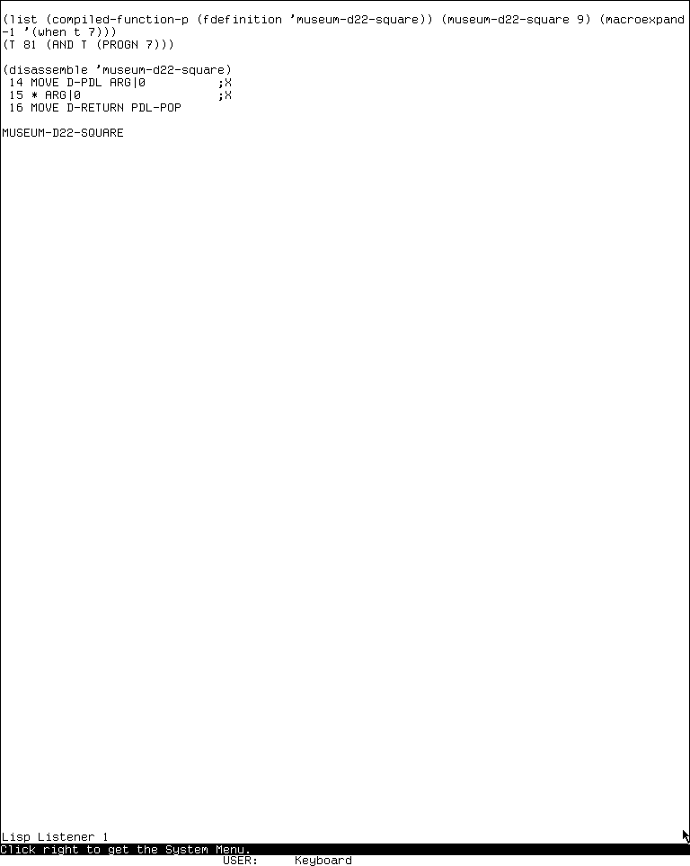
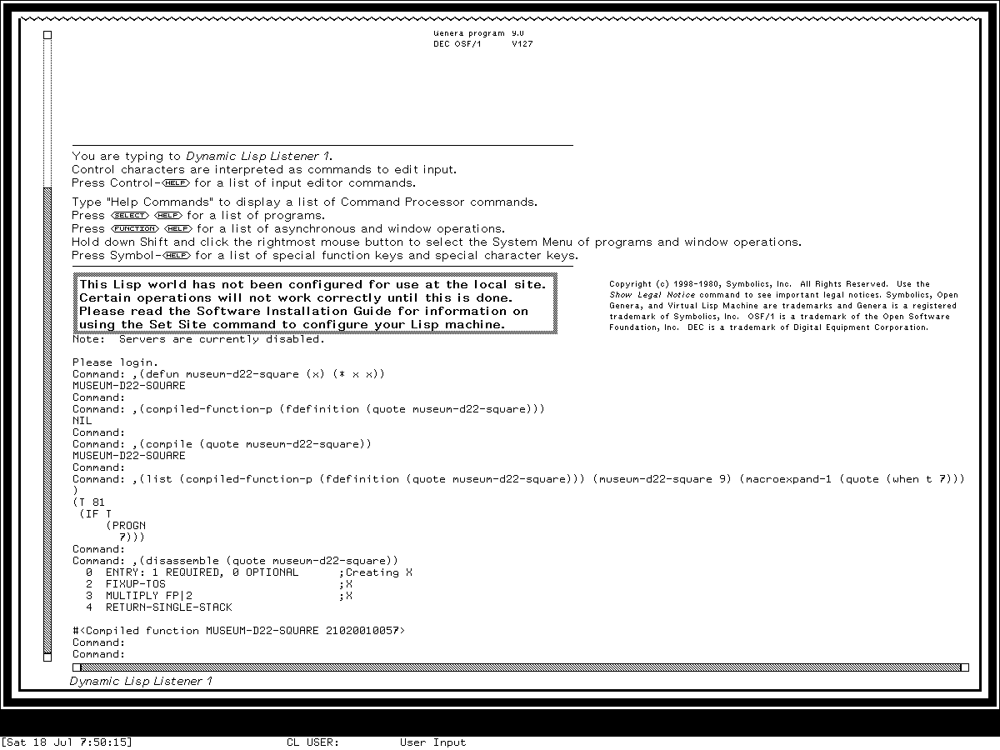
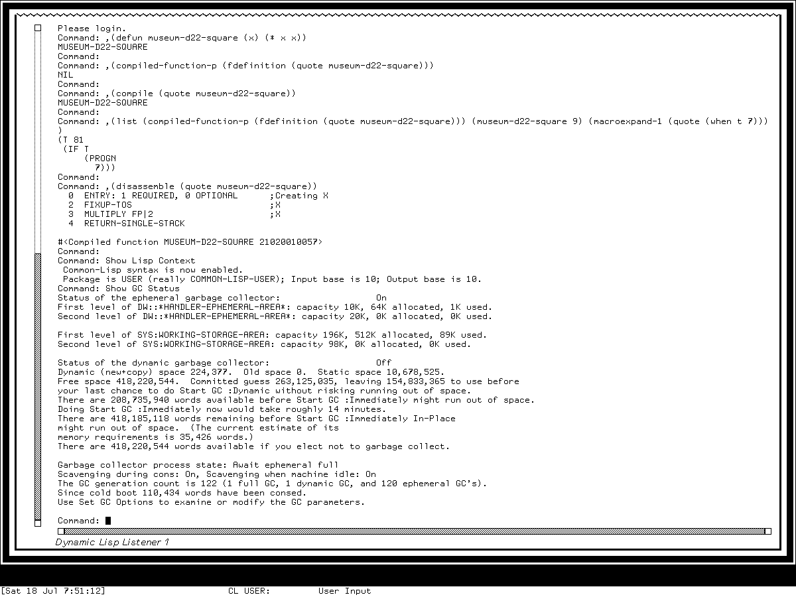

# Lisp runtime, compiler, and development environment

The Lisp environment is not one application beside the editor and debugger. It is
the substrate that reads commands, evaluates forms, allocates objects, schedules
processes, compiles definitions and files, records source relationships, and lets
the other applications call one another. MIT System 46 and maintained LM-3 System
303 expose this substrate as a relatively compact set of core files and a
`COMPILER` system. Genera 8.5 preserves those roles but separates them into
`SYSTEM-INTERNALS`, `SCHEDULER`, `COMMON-LISP`, `LANGUAGE-TOOLS`,
`LISP-COMPILER`, architecture-specific compiler systems, and the separately
patchable `DEVELOPMENT-UTILITIES` release.

The two runnable museum systems confirm the central workflow directly. In fresh,
private sessions, the same researcher-written squaring function began interpreted,
was replaced by a compiled definition, returned `81`, and was disassembled. The
System 303 compiler emitted three CADR instructions; Genera emitted four Ivory
instructions. Their one-step expansion of `WHEN` was also observably different:
System 303 produced a `COND`, while Genera's Common Lisp context produced an `IF`.
Those are equivalent effects for the probe, not identical compiler
representations.

This dossier is complete at the **named-subsystem and supported-workflow grain**.
It inventories the reader/evaluator/printer, package and language contexts,
storage and garbage collection, processes and resources, language-building
facilities, compiler stages, development release, and directly relevant Command
Processor operations. It does not attempt an encyclopedia entry for every Lisp
operator. Separate dossiers cover the [listeners](mit-cadr/lisp-listener.md),
[Dynamic Lisp Listener and Command Processor](genera/dynamic-lisp-listener.md),
[editors](lisp-machine-text-editors.md), [debuggers](genera/debugger-and-display-debugger.md),
[Trace and Step](trace-stepper-breakpoints-and-call-analysis.md),
[compiled file formats](compiled-objects-qfasl-relocation-and-unfasl.md), and
[system construction](system-construction-patches-worlds-and-distribution.md).

## Evidence, release boundary, and rights

| Environment | Primary evidence | Runtime status | Rights boundary |
| --- | --- | --- | --- |
| MIT System 46 | Public source at Git revision `8e978d7d1704096a63edd4386a3b8326a2e584af` and the third-edition Lisp Machine Manual | No compatible System 46 load band is configured in this museum | Public release; source links are pinned |
| LM-3 System 303 | Maintained public source at Fossil check-in `4df393c68d7f083ce42d5c377039d26043cc18a9031ace28258dc97f4137eb91`, tag `system-303` | Fresh `System 303-0` run with a synthetic definition, compilation, macroexpansion, execution, disassembly, and cleanup | Publicly inspectable source; this page does not infer the System 46 license applies to later LMI material |
| Symbolics Genera 8.5 / Open Genera 2.0 | Licensed local release source, public manuals, installed command behavior, and a fresh isolated VLM run | Synthetic definition, compilation, execution, macroexpansion, disassembly, Lisp-context display, and GC-status display | Licensed media and source remain untracked; only original analysis, evidence metadata, and separately reviewed screenshots are published |

The Genera source observations below describe interfaces and architecture in
original words. They do not reproduce proprietary source or installed Help. Raw
captures, action logs, private worlds, and extracted source stay in ignored local
storage.

## What belongs to the runtime

The following division is analytical. On a Lisp Machine the boundaries are porous:
the editor invokes the compiler, compiled functions retain editor source
correspondences, the debugger disassembles live function objects, and the command
reader can evaluate Lisp directly.

| Layer | Responsibility | Representative MIT names | Representative Genera names |
| --- | --- | --- | --- |
| Reader and syntax | Convert characters into Lisp objects under a readtable and package context | `RDTBL`, `READ`, package-prefix reader support | `READ`, `READERS`, `LISP-SYNTAX`, readtable compiler, Common Lisp and ZetaLisp syntaxes |
| Evaluator and command loop | Interpret forms, establish dynamic context, and run read-eval-print loops | `QEV`, `LTOP`, `REP` in System 303 | `EVAL`, `LTOP`, `COMMAND-LOOP`, Listener evaluation and Command Processor Lisp escape |
| Printer and streams | Print readable or human-oriented objects and connect Lisp I/O to windows, files, and devices | `PRINT`, `QIO`, `STREAM`, `FORMAT`, `GRIND` | `PRINT`, `QIO`, streams, `FORMAT`, indenting and interactive streams |
| Names and language context | Resolve symbols and control readable names, syntax, package, and numeric bases | Hierarchical packages; package prefixes; traditional Lisp Machine syntax | Common Lisp package model plus retained ZetaLisp context; extensible Lisp syntaxes; input and output bases |
| Storage | Allocate objects in areas and reclaim memory | areas, storage definitions, resources, System 303 copying GC | areas, resources, ephemeral and dynamic GC, immediate and in-place collection, architecture-specific storage definitions |
| Processes | Run multiple Lisp activities in one shared Lisp address space | stack groups, process wait predicates, run/arrest reasons | scheduler queues, priorities, processes, timers, locks, monitors, events, synchronization forms, wait functions |
| Language construction | Define structures, generalized places, iteration, macro expansion, and type support | `NSTRUC`/`STRUCT`, `SETF`, pre-ANSI `LOOP`, `DEFMAC`, `LMMAC`, `TYPES` | `STRUCT`, `SETF`, ANSI and extended `LOOP`, macroexpansion, lambda-list and language tools, Common Lisp type layers |
| Compiler | Transform Lisp into machine code and preserve load/debug metadata | `QCP1`, `QCP2`, optimizer, macroassembler, LAP, `QC-FILE`, QFASL dumper, disassembler | machine-independent phases and transforms, architecture-specific back ends, byte LAP, warnings, file compiler, L-BIN output, source locators, disassembler |

### Processes are not Unix processes

The CADR manual defines a process around a stack group scheduled when its wait
predicate becomes true. Processes share Lisp objects and the machine address space;
run reasons and arrest reasons control eligibility. Genera expands that model with
explicit priority, queue, timer, lock, monitor, event, and synchronization modules,
but it still does not make each application an address-space-isolated Unix process.
The live process displays are documented in [Inspector and Peek](genera/inspector-and-peek.md)
and [MIT Peek](mit-cadr/peek.md).

### Resources are reusable object pools

The `RESOUR`/resource layer belongs beside storage rather than beside files. It
defines managed pools whose objects can be acquired, initialized, and returned,
reducing allocation and setup cost for frequently reused objects. A resource is not
a Unix file descriptor or a package dependency merely because all three can be
described as resources in modern prose.

## MIT System 46

### Core load order

The public `src/lmdoc/lispm.files` inventory shows the early system as a deliberate
load sequence rather than a monolithic evaluator. The runtime-relevant portion can
be grouped without erasing its file identities:

| Role | Files loaded by the System 46 inventory |
| --- | --- |
| Macro and structure foundation | `DEFMAC`, `LMMAC`, `STRING`, `NSTRUC` |
| Primitive runtime and top level | `QMISC`, `LFL`, `LTOP`, `COLD`, `QFCTNS`, `SGFCTN`, `SGDEFS` |
| Reader, printer, and I/O | `PRINT`, `QEV`, `MINI`, `QIO`, `QRAND`, `RDTBL`, `READ`, `RDDEFS` |
| Objects and dispatch | `CLASS`, `DEFSEL`, `FLAVOR`, `METH`, `SELEV` |
| Storage and execution | `GC`, `PRODEF`, `PROCES`, `PLANE`, `PACK4`, `NUMER`, `ITER`, `SORT` |
| Interactive development | `DRIBBL`, `GRIND`, `QTRACE`, `STEP`, `LOGIN` |
| Compiled/load support | `QFASL`, `BAND`, `RELLD`, `RELDMP` |
| Compiler and machine-code tools | `DISASS`, `MADEFS`, `MA`, `MAOPT`, `MC`, `MLAP`, `QFASD`, `QCDEFS`, `QCFILE`, `QCP1`, `QCP2`, `PEEP`, `QLF`, `DEFMIC`, `DOCMIC` |

The same inventory continues into windows, networking, fonts, diagnostics, and the
CADR microassembler. Those are consumers or adjacent development systems, not
additional reader/compiler stages, and are routed to their own dossiers.

### Compiler pipeline

The third-edition manual describes three ordinary ways to reach the compiler:

1. `COMPILE` replaces an existing interpreted definition with a compiled function.
2. ZWEI compiles a definition, region, buffer, or file from the editor.
3. `QC-FILE` reads a source file one top-level form at a time and writes a QFASL
   binary.

`UNCOMPILE` can restore the saved interpreted definition when one was retained. That
is a development convenience, not source recovery from arbitrary machine code.
`QC-FILE` treats top-level forms according to compile/load/evaluation rules: macro
definitions and declarations may have compile-time effects, while load-time forms
are represented in the output. The [compiled-object dossier](compiled-objects-qfasl-relocation-and-unfasl.md)
explains why this does not make a QFASL a source archive.

| Stage | System 46 files | Function at this dossier's grain |
| --- | --- | --- |
| Definitions | `MADEFS`, `QCDEFS` | Compiler and macroassembler structures, declarations, and shared state |
| Front end | `QCFILE`, `QCP1` | File/top-level processing, macro and declaration handling, initial compilation |
| Transformation and code choice | `QCP2`, `PEEP`, `MAOPT` | Lowering, optimization, and local instruction improvement |
| Assembly | `MA`, `MC`, `MLAP`, `QLF` | Lisp Machine macroassembly and LAP-related emission |
| Binary emission | `QFASD` | QFASL output and load-time representation |
| Inspection | `DISASS` | Convert compiled instructions into a readable machine-code listing |
| Microcode descriptions | `DEFMIC`, `DOCMIC` | Define and document microcoded operations used by compiler/machine support |

### Language facilities and historical caution

System 46's `LOOP` is the Lisp Machine's stylized-English loop macro, not the later
ANSI Common Lisp definition by virtue of sharing its name. Its structure facility
is `NSTRUC`; generalized assignment support is distributed through the macro and
compiler substrate rather than presented as a modern standalone library. Claims
about precise Common Lisp conformance would be anachronistic for this release.

## Maintained LM-3 System 303

### Declared system boundary

System 303 makes the architecture easier to audit because `sys/sysdcl.lisp`
declares systems and modules explicitly. The top-level `SYSTEM` aggregate includes
the following relevant components:

| Declared component | Runtime role |
| --- | --- |
| `SYSTEM-INTERNALS` | evaluator, reader/printer, packages, storage, processes, resources, language utilities, top level |
| `FORMAT` | formatted output, query, and output utilities |
| `COMPILER` | compiler front end, optimizer, LAP/macroassembler, QFASL emission, disassembler |
| `QFASL-REL` | relocatable compiled-file support |
| `TIME` | time representation and parsing; mathematical facilities are separate |
| `MATH` | matrix system; its inclusion has an unresolved maintainer comment asking whether it was still used |
| `METER` | performance measurement, documented separately |
| `SRCCOM` | source comparison, documented separately |

`ZWEI`, `FED`, `COLOR`, `PRESS`, `HACKS`, `CONVERSE`, and `ISPELL` appear as
separate or commented optional systems, not hidden compiler phases. This is why the
catalog does not describe every application in a System 303 source checkout as part
of the resident core.

### `SYSTEM-INTERNALS`

The `SYSTEM-INTERNALS` declaration gives the most complete bounded inventory of the
runtime. Its definition group includes process, reader, stack-group, numeric, and
storage definitions. Its main group contains:

| Concern | Named modules |
| --- | --- |
| Evaluation and top level | `EVAL`, `LTOP`, `REP`, cold `LISP` and `SYSTEM` initialization |
| Syntax and packages | `CLPACK`, `CLMAC`, `GENRIC`, `READ`, `RDTBL`, `CRDTBL`, `PRINT` |
| Storage | `STORAGE`, `STORAGE-DEFS`, `GC`, `RESOUR`, `HASH`, `HASHFL` |
| Processes and execution | `PROCES`, `PRODEF`, `SGFCTN`, `STEP`, `QTRACE` |
| Language facilities | `LOOP`, `RAT`, `NUMER`, `STRING`, `SORT`, `FSPEC`, `DEFSEL`, `FLAVOR`, `CLASS`, `METH` |
| Streams and I/O | `STREAM`, `QIO`, `DRIBBL`, `GRIND`, `DISK`, `SERIAL` |
| Compiled-object support | `QFASL`, `UNFASL`, `BAND`, patch and system construction modules |

The `CLPACK`, `CLMAC`, and `GENRIC` names establish a Common Lisp compatibility
effort. They do not, without a conformance suite and dated standard target,
establish complete ANSI Common Lisp conformance. The live System 303 listener
explicitly described its context as package `USER` with a “standard traditional
syntax” readtable, which is the safer release-specific statement.

### System macros

The separate `SYSTEM-MACROS` declaration loads `DEFMAC`, `LMMAC`, `ERRMAC`,
`STRUCT`, `SETF`, and `TYPES`. This separates language-building definitions needed
early from the later `SYSTEM-INTERNALS` implementation. `LOOP` remains in the main
system. Rebuilding these modules is part of the [system-construction lifecycle](system-construction-patches-worlds-and-distribution.md),
not an ordinary application action.

### Compiler system

System 303's compiler declaration is a compact, exact inventory:

| Group | Modules |
| --- | --- |
| Definitions | `MADEFS`, `QCDEFS` |
| Main compiler | `DISASS`, `MA`, `MAOPT`, `MC`, `MLAP`, `QCFASD`, `QCFILE`, `QCP1`, `QCP2`, `QCOPT`, `QCLUKE`, `QCPEEP`, `QCLAP` |
| Read-for-effect support | `DEFMIC`, `DOCMIC` |
| Loaded initialization | `UCINIT` |

The separate `GARBAGE-COLLECTOR` system recompiles storage definitions and `GC`.
It is a maintenance boundary around the same runtime collector, not a second
interactive collector application.

## Symbolics Genera 8.5

### From one core to coordinated subsystems

The licensed System 452.22 declaration lists the following relevant components in
the main `SYSTEM` build:

| Subsystem | What its declaration establishes |
| --- | --- |
| `SYSTEM-INTERNALS` | packages, evaluator, reader, printer, streams, macroexpansion, allocation, resources, storage, and low-level language support |
| `TABLES` | maintained table system and hooks |
| `SCHEDULER` | 28 ordered scheduler modules covering processes, priorities, queues, timers, locks, monitors, events, waits, and compatibility |
| `COMMON-LISP` | sequence macros; functions over numbers, lists, sequences, arrays, characters and strings; I/O; read/print; layered type support; ANSI syntax; early `DEFSTRUCT`; ANSI and extended `LOOP` |
| `GARBAGE-COLLECTOR` | architecture definitions, machine-independent collector, full/reordering/debug support, and in-place collection |
| `LANGUAGE-TOOLS` | Lisp databases, form walking, annotation, substitution, `SETF`, lambda-list support, and architecture-specific compile-only help |
| `LISP-COMPILER` | shared compiler phases plus 3600- or Ivory/VLM-specific compiler systems |
| `L-BIN` | compiled-function and system binary substrate, documented separately |
| `SCT` | system declarations, plans, journals, patches, and distribution support, documented separately |

The macro group loaded ahead of the components contains `DEFMAC`, `LMMAC`,
structure definitions, `STRUCT`, `SETF`, `LOOP`, Command Processor macros, and a
ZWEI collection module. The fact that the build must load these macros does not make
all language facilities macros at runtime; the declaration itself notes that some
of the files also contain functions.

### Common Lisp and ZetaLisp contexts

Genera treats language context as more than a package variable. A registered Lisp
syntax can establish a readtable, required package relationships, numeric bases,
and other defaults. The directly relevant Evaluation Context commands are:

| Command | Interface and effect |
| --- | --- |
| `Show Lisp Context` | Report current Lisp syntax, package, input base, and output base |
| `Set Lisp Context` | Choose a registered Lisp syntax and turn on its associated context |
| `Set Package` | Select a package, defaulting to `COMMON-LISP-USER` |
| `Set Base` | Set both input and output bases |
| `Set Input Base` | Set only reader numeric base; warns when it differs from output base |
| `Set Output Base` | Set only printer numeric base; warns when it differs from input base |

In the fresh museum world, `Show Lisp Context` reported that Common Lisp syntax was
enabled, the printed package name was `USER` and was really
`COMMON-LISP-USER`, and both bases were 10. This is an observation of the preserved
world, not a claim that every Genera Listener always starts in that context.

### Package-model difference

The CADR manual's package model is hierarchical: symbols can be referenced through
superpackage/subpackage prefixes, the printer chooses prefixes needed for readable
output, and a file's mode line or package association controls compile/load
context. Genera's Common Lisp context instead uses Common Lisp packages and use
lists while retaining ZetaLisp compatibility. A matching printed prefix therefore
does not prove that name resolution followed the same package algorithm in both
generations.

### Scheduler inventory

The Genera scheduler declaration is ordered rather than an unstructured directory.
At this dossier's grain its modules form the following groups:

| Group | Modules |
| --- | --- |
| Definitions | `SCHEDULER-DEFS`, `DEFS`, `METER-DEFS`, priority/process/timer/lock definitions |
| Runnable entities | `PROCESS`, `PROCESS-UTILITIES`, `PROCESS-STATE`, `PRODEF` |
| Scheduling | `SCHEDULER-QUEUE`, `PROCESS-PRIORITY`, `DISPATCHER`, `SCHEDULER` |
| Time and waiting | `TIMER-HOOKS`, `TIMER`, `WAIT-FUNCTIONS`, `CLOCK-FUNCTIONS` |
| Coordination | `SYNCHRONIZATION-FORMS`, `LOCKS`, `MONITOR`, `EVENTS` |
| Lifecycle and compatibility | `INIT`, `COMPATIBILITY1`, forward/backward compatibility, `COMETH` |

This structure explains visible operations such as inspecting process state or
waiting reasons without implying that the scheduler is a separate GUI.

### Garbage-collection modes and commands

Genera exposes three related collection strategies:

- **ephemeral and dynamic collection** reclaim newer generations incrementally;
- **immediate collection** performs a complete collection now, optionally by area;
- **in-place collection** compacts without requiring the ordinary copying space and
  can also be selected by area.

The complete Garbage Collection command area at this grain has four commands:

| Command | Arguments or behavior |
| --- | --- |
| `Halt GC` | Turn the garbage collector off |
| `Start GC` | Keywords `Dynamic` and `Ephemeral` (`Yes`/`No`); `Immediately` (`Yes`, `No`, `In-Place`, or `By-Area`); `Selective` (`Yes`/`No`); `Cleanup` (`Yes`, `No`, or `Ask`) |
| `Set GC Options` | Open the collector-parameter chooser |
| `Show GC Status` | Print collector levels, space estimates, process state, scavenging state, generation count, and the route to option editing |

`By-Area` is normalized internally to immediate selective collection. `Selective`
without `Immediately` is reported as meaningless. With no collection mode named,
`Start GC` defaults to enabling dynamic and ephemeral collection. Those are source
behaviors that are more precise than treating `Start GC` as one undifferentiated
full collection.

The runtime probe invoked only `Show GC Status`. In that exact cold-booted world,
ephemeral GC was on, dynamic GC was off, the collector process was waiting for the
ephemeral level to fill, and the generation count was 122: one full, one dynamic,
and 120 ephemeral collections. The display also estimated immediate and in-place
space thresholds. These quantities are volatile observations, not release
constants; no collector setting or collection was changed.

## Genera compiler architecture

### Shared pipeline

The `LISP-COMPILER` declaration separates portable compiler work from machine code:

| Pipeline part | Named modules | Role |
| --- | --- | --- |
| File and warning environment | `COMFILE`, `CWARNS-FLAVORS`, `CWARNS`, `INNER` | file context, warning objects/reporting, and compiler dynamic environment |
| Definitions and macros | `DEFS`, `MACROS`, `COMDEFS` | compiler representation and shared definitions |
| Emission substrate | `BYTE-LAP`, `EMIT`, `COMPILER-PROTOCOL` | byte-level assembly/emission and the protocol between phases/back ends |
| Front end | `PHASE-1`, `PHASE-1A` | parse and analyze Lisp forms, argument/type/style information, initial representation |
| Transformation | `OPTIMIZE`, `TRANSFORMERS`, `STYLE-CHECKER` | optimizers, rewrites, style diagnostics, and constant/inline opportunities |
| Later phases | `PHASE-2`, `PHASE-3`, `PHASE-3A`, `COMPILE` | lower and finish the machine-independent compilation path |
| User-facing integration | `COMETH` and Development Utilities | methods and commands for editor, debugger, file, and warning workflows |

### Architecture-specific systems

The shared compiler chooses a machine family rather than emitting one universal
instruction set:

| Target | Architecture/compiler systems | Notable modules |
| --- | --- | --- |
| 3600 family | `L-ARCHITECTURE`, `L-LISP-COMPILER` | L instruction set, assembler/disassembler, phase 4, compilers and debugger support |
| Ivory and VLM | `I-ARCHITECTURE`, `I-LISP-COMPILER` | Ivory instruction set, front end, optimizers, transformers, phase 3, back end, disassembler and compiler definitions |

The VLM is declared as an Ivory-family target. The host executable emulates that
architecture; it is not the Lisp compiler's x86-64 back end. Lower-level Ivory
linking and host integration belong to the architecture dossier rather than being
folded into the language compiler.

### Source correspondence survives compilation

The file compiler records source locators and PC intervals that relate compiled
code back to source forms. Debugger and editor commands use those correspondences
to show or edit source when available, and fall back to disassembly when they are
not. This is richer than a raw instruction vector but still does not preserve the
unique original source: macro calls, comments, dead code, and optimization-erased
abstractions can be absent. See [recovering code from worlds](genera/recovering-code-and-assets-from-worlds.md)
for the preservation consequence.

## Genera development release and commands

### `DEVELOPMENT-UTILITIES` is a release boundary

Genera 8.5's release roster records `System 452.22`,
`Development-Utilities 439.0`, and `CL-Developer 428.0`. They are not synonyms:

| System | Declared content |
| --- | --- |
| `DEVELOPMENT-UTILITIES` | development debugger, development commands, C/Lisp octet-structure support, and LMFS `DEFSTORAGE` support |
| `DEVELOPMENT-DEBUGGER` | commands, debugger Help, stepper, machine monitor, analysis, Display Debugger, automatic bug reporter |
| `DEVELOPMENT-COMMANDS` | compiler file command, infix support, SCT commands, two CP development-command modules, program tools, compiler debug commands, timers, Trace and Step |
| `CL-DEVELOPER` | separately patchable Common Lisp Developer system with package declarations, miscellaneous support, syntax, and CLTL special/function material |

This distinction prevents three common catalog errors: calling all development
commands “the compiler,” treating Common Lisp Developer as the base Common Lisp
runtime, or treating C/Lisp embedding support as the `L-BIN` file format.

### Complete directly relevant Command Processor surface

| Command or form | Arguments at this dossier's grain | What it provides |
| --- | --- | --- |
| `Compile File` | sequence of pathnames; `Binary File`; compiler; `Load` (`Yes`/`No`/`Ask`); `Query`; `Silently`; Lisp-only `Compiler Context` | Compile one or more source files, optionally choose output and load the result |
| `Save Compiler Warnings` | output pathname and files (`All`, `No File`, or sequence) | Serialize the current warning report to a user-selected file |
| `Show Compiler Warnings` | files (`All`, `No File`, or sequence) | Print retained compiler warnings |
| `Show Expanded Lisp Code` | form; `Repeat`; `As If Compiler`; expansion subset; `Constant Folding`; `Whole Form` | Explore macro, inline, style, optimizer, and constant transformations |
| `Show Compiled Code` | compiled function specification; octal `From PC`; optional `To PC` | Disassemble a bounded PC interval |
| `MEXP` | interactive special form with repeat/compiler/all-level and transformation options | Repeated macro/compiler expansion at a Lisp input stream until the user ends it |
| Evaluation Context commands | context, package, and base commands listed above | Control how subsequent Lisp input is read and printed |

The `Show Expanded Lisp Code` expansion subset contains exactly macros, inline
functions, style checkers, optimizers, and constants. Its default subset is macros
plus inline functions; constant folding, compiler-equivalent treatment, repetition,
and whole-form descent default off.

`Show Compiled Code` is also wired into presentations: a disassemble gesture on a
compiled function, function specification, or live stack frame invokes it. In the
Debugger, Control-X Control-D accelerates the same operation for the current frame.
The implementation deliberately preserves the exact compiled-function object when
one was presented, so redefining its name does not silently redirect an inspection
of an older frame to newer code.

### Registered compiler names do not prove installed products

The `Compile File` source registers dispatch labels for Lisp, C, Pascal, Prolog, and
Fortran. Before invoking one, it looks up the named package and compiler function.
If either is absent, it reports that it does not know how to compile that type yet.
Therefore a compiler label in command completion establishes a dispatch hook, not
that the optional language product is loaded or licensed in the current world.
This source-only guard is easy to miss in a menu or handbook inventory.

### Editor integration

Zmacs adds compile-definition, region, buffer, changed-definitions, file, and
warning workflows over the same compiler environment. Those keys and menu commands
are exhaustively inventoried in [Genera Zmacs keybindings](genera/zmacs-keybindings.md)
and [MIT ZWEI/Zmacs](mit-cadr/zwei-and-zmacs.md). They are not duplicated here as
though they were a second compiler.

## Controlled runtime comparison

### Safety protocol

Both sessions used only this project-owned definition:

```lisp
(defun museum-d22-square (x) (* x x))
```

The sessions checked whether the definition was compiled, invoked `COMPILE`, called
the result with `9`, expanded a small `WHEN`, and disassembled only the synthetic
function. No source file, system, patch, world, collector setting, package context,
or installed definition was changed. System 303 removed the function with
`FMAKUNBOUND`. In Genera, a later attempt to add unsupported raw keyword text to a
Command Processor line entered input correction; the attempted cleanup form was
therefore not visibly accepted. The run is not presented as cleaned up in guest
memory. Its unchanged private-world hash and explicit unsaved-state-discard record
show that the definition did not persist.

### System 303 observation

The fresh session `d22-runtime-compiler-cadr-20260718`, generation 1, ran from
2026-07-18 07:41:27 through 07:47:05 EDT. It booted `System 303-0`, declined to set
a wall-clock time, and reported Experimental System 303.0, ZWEI 129.0, and microcode
323. The public base and private session disk began with SHA-256
`bb16e46ad81decfe1efe691d36b6aa4ce3fd4ffb82474365de3520989d397cb5`.
The base retained that hash at stop.

The visible sequence established:

| Probe | Result |
| --- | --- |
| `COMPILED-FUNCTION-P` before `COMPILE` | `NIL` |
| `COMPILE` | returned `MUSEUM-D22-SQUARE` |
| compiled predicate / call / `MACROEXPAND-1` | `T`, `81`, `(COND (T (PROGN 7)))` |
| `DISASSEMBLE` | `MOVE D-PDL ARG|0`; multiply `ARG|0`; `MOVE D-RETURN PDL-POP` |
| cleanup | `FMAKUNBOUND` visibly returned the symbol |



*Runtime observation: this exact 768 by 963 System 303 frame is the minimum selected
state that shows the compiled result, macroexpansion, and CADR instruction listing.
It contains no installed source or manual text.*

The executed `usim` hash was
`707a77d23e28ea1c45ae0eb0145dc181fa7ba649b9defc30044d4f847ac2c5be`;
the public System source check-in and unchanged private tree hash were respectively
`4df393c68d7f083ce42d5c377039d26043cc18a9031ace28258dc97f4137eb91`
and `21f5215de973aa6ccbddb817f2d64edd95ee1014c3028a9b0711ea7c741b807e`.
The 7,005-byte final run record has SHA-256
`83b322014ee05c8b68384d3f534406b9057027be03ce2ee39e36830556338be3`.
Shutdown was clean: `forced_stop=false`, `state_may_be_incomplete=false`, and both
`usim` and Xvfb exited 0.

### Genera 8.5 observation

The fresh isolated session `d22-runtime-compiler-genera-20260718`, generation 1,
ran from 2026-07-18 07:47:20 through 07:53:34 EDT. The licensed archive was
206,213,430 bytes with SHA-256
`89fb3e76b91d612834f565834dea950b603acf8f9dbacacdd0b1c3c284a2d36e`.
The base and private world were each 54,804,480 bytes with SHA-256
`a8ee5e86cc7e322f7385af3e0cd579d7650d4dcfc3ce328acbf8b25515dd0672`
at start and stop. The VLM and debugger hashes were
`9f5e18d5770f973879716182b6856ef5a8ee9d3b2bb907476ea0cf35986aa4c7`
and `2db918cfe8f35f52c7ff4b7695b0ecd3bb85e41a3327ea5a94874edf05edb54a`.

The visible compiler sequence established:

| Probe | Result |
| --- | --- |
| compiled predicate before `COMPILE` | `NIL` |
| `COMPILE` | returned `MUSEUM-D22-SQUARE` |
| compiled predicate / call / `MACROEXPAND-1` | `T`, `81`, `(IF T (PROGN 7))` |
| `DISASSEMBLE` | required/optional entry record, `FIXUP-TOS`, `MULTIPLY FP|2`, `RETURN-SINGLE-STACK` |



*Runtime observation: this exact 1,200 by 900 frame documents functional compiler
behavior in the unconfigured museum world. The entered function and test form are
researcher-written; no proprietary source listing is displayed.*

The subsequent read-only commands established the current Common Lisp context and
collector state described above:



*Runtime observation: the displayed capacities, word counts, thresholds, and
generation counts are measurements of this one cold-booted private world. The
command changed no GC option and started no collection.*

The default invocation `Show Expanded Lisp Code (when t 7)` then printed the form
as `(WHEN T 7)`, while the earlier direct `MACROEXPAND-1` returned `IF`. Source
shows that whole-form descent and repetition default off; the observation therefore
must not be rewritten as “Show Expanded Lisp Code is the same as
`MACROEXPAND-1`.” A later attempt to append raw keyword text on the same command
line was rejected by this input path as additional arguments. That failed syntax
probe is not used to infer whether selecting the keywords through Command Processor
completion would work.

The complete Genera action log contains 22 intent/outcome records, 10,979 bytes,
SHA-256
`f0a226c73117f7124a5fc24aab9db597bc832d3d2f65a0c9cc4577b01c832c63`.
The final 25,911-byte run record has SHA-256
`dbca54eaedbb043f1325edb4579fe6b6db4bb0de2e159d40088914d763a9fec2`.
The harness observed the shutdown prompt, confirmation, and cleanup progress, then
encountered the known bounded VLM mutex stall. It records
`forced_after_confirmed_shutdown_stall=true`, launcher status 137,
`orderly_vlm_host_shutdown=false`, and `state_may_be_incomplete=true`. No VLM or
Xvfb process remained, the private world was unchanged, no Save World was invoked,
and unsaved Lisp state was discarded.

### Raw capture provenance and selection

| System | Raw capture | Captured (EDT) | Bytes | PNG SHA-256 | Pixel SHA-256 | Action prefix |
| --- | --- | --- | ---: | --- | --- | --- |
| System 303 | `0008-compiler-runtime.png` | 2026-07-18 07:46:34 | 2,202 | `7116d86cb08eed7fa76b82265d8ca9d0fbec1415518e4cd02625397473f998bf` | `79819849d60b0c0edcd39af5c4d4fd579c5894ae61c165b61d9c41b1308a6e14` | The CADR harness version records the ordered inputs in session evidence but has no separate action-prefix hash |
| Genera | `0003-compiler-runtime.png` | 2026-07-18 07:50:15 | 11,335 | `9513c57e3828fcbe9e0eb462a3a23028ee21839cc2b5647edf3fe0163a8e9c54` | `f7efa4b4db72adda7163413544242adb718e6e50c68fff3d4565cc85b06ea9d4` | 10 records; `3ba56222116e9f22d9f09ac1e171c45c423e27022aa44e2bb5c265ad02ad4a1e` |
| Genera | `0004-lisp-context-gc.png` | 2026-07-18 07:51:12 | 10,115 | `71082f97ab314ad7787fda0eefc561b4fe614d4c5e6a8f3675a92b4bd2df2cd8` | `13018bbd28f52df8a46c4ab16b069c7bbf53f2105139f6164576668d0fbaaa98` | 14 records; `06350866c7bc152656bba6561de4bc422983924c87d621dfb39c26449681f667` |

The three selected PNGs passed image- and use-specific review under the museum's
[screenshot publication policy](screenshot-publication-rights-review.md). They are
the minimum cross-system compiler comparison plus one read-only runtime-status
screen. None contains source, manual prose, private user data, credentials, mail,
network content, or third-party artwork. All other captures and sidecars remain
ignored and unreviewed. The selected images are excluded from any project-wide
license and do not authorize redistribution of a Genera world, source tree, or
other screenshot.

## Source/manual/runtime findings

### Established

- The two systems support an interactive interpreted-to-compiled replacement
  workflow and can disassemble the resulting machine-specific function object.
- System 303's traditional-syntax expansion and Genera's Common Lisp expansion can
  differ while preserving the probe's effect.
- Genera's compiler is split between shared transformations and architecture-specific
  3600 or Ivory/VLM back ends.
- Compiler source correspondence supports editor/debugger integration but is not a
  reversible encoding of unique original source.
- Genera's Garbage Collection command area has four commands, and `Start GC` is a
  multi-mode controller rather than a synonym for immediate full collection.
- Genera's development utilities, Common Lisp Developer, and base Common Lisp
  subsystem are separately declared and versioned systems.

### Source-only findings not evident from a command list

- `Compile File` advertises five compiler labels through dispatch registrations,
  but invocation still checks for the relevant package and function; label presence
  does not prove product availability.
- `Show Compiled Code` can preserve the exact old compiled object presented by a
  stack frame even after its function name has been redefined.
- `Show Expanded Lisp Code` distinguishes root/all-level traversal, repeated
  expansion, compiler-equivalent expansion, style checking, optimizer use, inline
  expansion, named constants, and constant folding.
- The Genera scheduler is an ordered family of queues, priorities, timers, locks,
  monitors, events, and waits rather than a single loop hidden behind `PROCESS`.

### Open questions and deferred work

- A compatible System 46 load band is needed for direct release-specific reader,
  compiler, and disassembler observations.
- A disposable public source file should be compiled on System 303 to compare the
  complete `QC-FILE` warning and QFASL workflow with the manual. This run avoided
  file writes because expression compilation was sufficient for the present claim.
- A Genera world with a configured writable synthetic file host is needed to
  exercise `Compile File`, saved warnings, source locators, and editor navigation
  end to end without involving licensed source files.
- `Show Expanded Lisp Code` should be repeated using verified Command Processor
  keyword selection gestures to compare each option against direct `MACROEXPAND-1`.
- Compiler dispatch labels for optional languages should be tested only in worlds
  whose installed product and license status are independently established.

## Artifact identities

### Public System 46 representatives

| File | Bytes | SHA-256 |
| --- | ---: | --- |
| `src/lispm/qev.220` | 32,272 | `4ce2f3b61f57b50d1d70d6c7dbc325b742475d8675d1038ddb0e8c9d7482083f` |
| `src/lmio/read.256` | 47,179 | `dad1d2ac598fad875c76ef04d9af73bed3b349a964f777eac5c72d97f0b3a3a0` |
| `src/lmio/print.69` | 18,951 | `bc8263aaddeeec24221ac7574717a00c818e549c0b46a9e6b8f6efbbdb98f5c2` |
| `src/lispm2/proces.150` | 28,370 | `7e3f3533d6d2955c111ab63b19f4bbe3b35b0c5bc2b309d9d3c422cda5ce1c18` |
| `src/lispm2/gc.61` | 22,323 | `9c6d1ed59a77cd460bb2d6fb6c01f699663079fa1991725e2754548d6b1b2ce3` |
| `src/lispm/qcp1.256` | 85,278 | `472933cd73cb39bae7535ff29c11f6a1284dadc5d1e76a9b54efed4c7b84f1c2` |
| `src/lispm/qcp2.111` | 68,635 | `81eaf66e754375f85049fb856903c6d393faf7f58863623f1a925a925dbb7e2b` |
| `src/lispm2/qcfile.172` | 26,383 | `a593b7c05e69c674ea45800e545767d705cd4003158a17b8a7ed8c64f2ec978a` |
| `src/lispm2/disass.53` | 7,203 | `d360c7b92be57780fc3bbbf3d1b4925129783831868242f21d7543a5522c6d8c` |
| `src/lispm2/loop.124` | 42,842 | `58bb3bc03844ac665873c83929613d56569f070b418dd850c9cb0dd7a545bcf9` |
| `src/lispm2/nstruc.105` | 26,907 | `f8d2d43cda43025ee32d095a8335b270a16c8138ef1b963ae66deaeba328bca9` |

### Public System 303 representatives

| File | Bytes | SHA-256 |
| --- | ---: | --- |
| `sys/sysdcl.lisp` | 25,396 | `2999f1824666171d729dae611a09204ac0bd42373f30d7d22c733f904c27a6dd` |
| `sys/qev.lisp` | 45,150 | `ab00927909402bf637aa71c4a6664b0df14ba2c993742ca12e6a23a543f53e8a` |
| `io/read.lisp` | 104,944 | `0fa6eea755dcb077bc519d36654597cdf5ee8f6e3a61a1f38f821db15392a02f` |
| `io/print.lisp` | 55,468 | `5a38e861c3e7bac29c58775bd5927e860015b9da900124db60da09ab68df8a78` |
| `sys2/proces.lisp` | 48,454 | `04e883fd24a98de2fa85f2b3dd9e32fd4a4deefd3dc05e12c69570dbee378582` |
| `sys2/gc.lisp` | 55,254 | `2fddc20ad14d34d70e6f43c3456b5603249c05a7c94cc27be697628e56d1ce8a` |
| `sys/qcp1.lisp` | 113,461 | `77816e7d1e04c9ccacbde2f144f0bce597c10c27fde10b6a6ea7605480dc13d6` |
| `sys/qcp2.lisp` | 91,546 | `8dcfecf521d1b9b4f750ab46cc2795924abecc8f9fbacb1778e1313c8c575919` |
| `sys/qcfile.lisp` | 36,112 | `4b9d8970349ef9c3339d94f99302df315d72650f752750d9f9eef01fd35dc290` |
| `sys2/disass.lisp` | 11,618 | `c5fb32231a5c3c158d072b52c0fee050bbad8d7016be01202a0871d20bbe6581` |
| `sys2/loop.lisp` | 100,094 | `e4e1975a4b250ddfd3c3673b10f94d3ac3c8ebe6801a5b51544cd7258b3a8d83` |
| `sys2/setf.lisp` | 55,109 | `3d1115bf53b83daec0f8a0161df7515d6b96dbc54bdcf681010bd6995efd3c57` |
| `sys2/struct.lisp` | 94,270 | `531d0e15d5b0214277f5cf98201aed015334df5cd2f15109592803d277b7780d` |

### Licensed Genera representatives

These are evidence-only identities of local licensed files. The files themselves
remain untracked.

| File | Bytes | SHA-256 |
| --- | ---: | --- |
| `sys.sct/sys/sysdcl.lisp.~1059~` | 39,497 | `3bb5fad39feb2d174c53b94ea7b726a6f3fa3de1ec18a1293352bb68027c1584` |
| `sys.sct/io/read.lisp.~602~` | 124,647 | `e60087709843bf2ed37b30f6dd742e5451ca5d1721769e9355a882ec7aad7f92` |
| `sys.sct/io/print.lisp.~282~` | 83,912 | `c53be3c5d198ae8eca709f9dd2d4dc5e60b8db2dd890bb76bd6b172407d7b329` |
| `sys.sct/scheduler/process.lisp.~371~` | 99,630 | `62bfaa60c40624d0e4765fa887b880b88fda7175b6777b39dd033df37dcfec8a` |
| `sys.sct/gc/gc.lisp.~283~` | 209,764 | `7fb8c8c83d64cda39e68c28a8517df9a2d79b6c4d0456ddfe0f312525c0a291d` |
| `sys.sct/compiler/phase-1.lisp.~1151~` | 177,896 | `4b0fe58e79c0337f09b1f5a770d81b65c7ec11e4e8eaf4b88b61edb5f741a7dd` |
| `sys.sct/compiler/optimize.lisp.~312~` | 89,492 | `fe7e0cd8c1dfb95ca37c7af156772dbf184e23bd03f63bd4aafd8f4fb16a29eb` |
| `sys.sct/compiler/compile-file.lisp.~124~` | 7,115 | `07c9a7f684a61f2481999efb76e723917f50a36058216969bf74d8f085e4d54c` |
| `sys.sct/compiler/byte-lap.lisp.~45~` | 41,646 | `020e9386fb346e4c1f5d94a85f8c6501dce4a27b46ac7a8ae89d569015d2327a` |
| `sys.sct/sys/program-tools.lisp.~5~` | 6,793 | `be9e224d9fc0839152cb0e3651d5583ccea7e3379fac824fd520c338816e5925` |

## Sources

- MIT System 46, pinned [runtime load inventory](https://github.com/mietek/mit-cadr-system-software/blob/8e978d7d1704096a63edd4386a3b8326a2e584af/src/lmdoc/lispm.files),
  [evaluator](https://github.com/mietek/mit-cadr-system-software/blob/8e978d7d1704096a63edd4386a3b8326a2e584af/src/lispm/qev.220),
  [reader](https://github.com/mietek/mit-cadr-system-software/blob/8e978d7d1704096a63edd4386a3b8326a2e584af/src/lmio/read.256),
  [compiler phase 1](https://github.com/mietek/mit-cadr-system-software/blob/8e978d7d1704096a63edd4386a3b8326a2e584af/src/lispm/qcp1.256),
  [file compiler](https://github.com/mietek/mit-cadr-system-software/blob/8e978d7d1704096a63edd4386a3b8326a2e584af/src/lispm2/qcfile.172), and
  [disassembler](https://github.com/mietek/mit-cadr-system-software/blob/8e978d7d1704096a63edd4386a3b8326a2e584af/src/lispm2/disass.53).
- MIT, [*Lisp Machine Manual*, third edition](https://bitsavers.org/pdf/mit/cadr/chinual_3rdEd_Mar81.pdf),
  especially the compiler, macros, iteration, structures, packages, processes,
  areas, stack groups, and resources chapters.
- LM-3, pinned System 303 [system declaration](https://tumbleweed.nu/r/sys/file?ci=4df393c68d7f083ce42d5c377039d26043cc18a9031ace28258dc97f4137eb91&name=sys%2Fsysdcl.lisp),
  [evaluator](https://tumbleweed.nu/r/sys/file?ci=4df393c68d7f083ce42d5c377039d26043cc18a9031ace28258dc97f4137eb91&name=sys%2Fqev.lisp),
  [file compiler](https://tumbleweed.nu/r/sys/file?ci=4df393c68d7f083ce42d5c377039d26043cc18a9031ace28258dc97f4137eb91&name=sys%2Fqcfile.lisp), and
  [disassembler](https://tumbleweed.nu/r/sys/file?ci=4df393c68d7f083ce42d5c377039d26043cc18a9031ace28258dc97f4137eb91&name=sys2%2Fdisass.lisp).
- Symbolics, [*Program Development Utilities*, Genera 8](https://bitsavers.org/pdf/symbolics/software/genera_8/Program_Development_Utilities.pdf),
  for compiler, macroexpansion, debugger, and development workflows.
- Symbolics, [*Genera Handbook*](https://bitsavers.org/pdf/symbolics/software/genera_8/Genera_Handbook.pdf),
  for the Command Processor command reference.
- Symbolics, [*Genera Concepts*](https://bitsavers.org/pdf/symbolics/software/genera_8/Genera_Concepts.pdf),
  for the integrated environment, packages, processes, storage, and development
  model.
- Licensed local Genera 8.5 release source and fresh isolated runtime evidence,
  portable identities and limits recorded above; inspected 2026-07-18.

Last verified: 2026-07-18.
