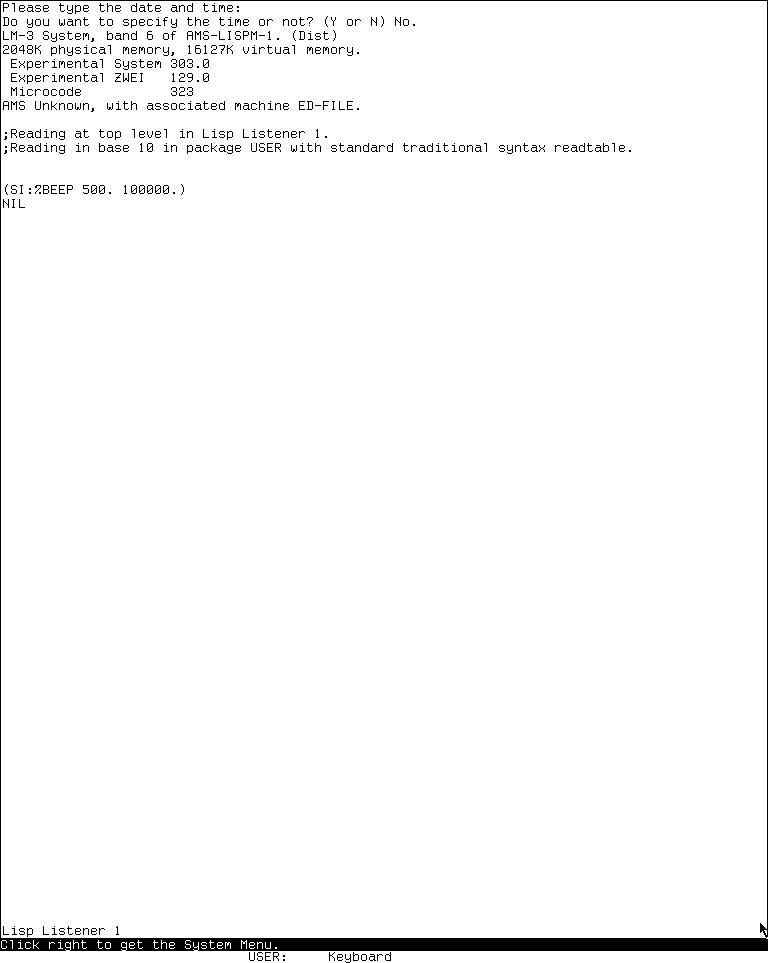

# CADR audio, beeper, and Votrax reimplementation specification

## Status and reconstruction claim

This is the Phase 1 contract for `C-M11`: deterministic audio-event production,
queue transport, and clean-room PCM rendering for the selected CADR-WEB System 303
profile. The M11 build owns one model per machine, maps IOB address `0764110` to a
post-slot beeper event, and exposes an isolated v7 worker subhandler in the narrow
M12 Wasm profile. Its synthetic C, Node, O0/O2 Wasm-export, and Worklet-queue
tests are supplemented by one source-bound System 303 `%BEEP` runtime observation.
No audio-device, browser-integration, Votrax, or System 46 runtime equivalence is
claimed.

It claims:

- semantic event compatibility for the explicitly selected profiles below;
- a fixed little-endian 64-byte event representation and a reproducible
  SHA-256 witness for accepted events; and
- a defined backpressure, partial-acknowledgement, reset, and stale-consumer
  contract.

It does not claim:

- emulation of a CADR analog beeper, a Votrax device, an SC-01/SC-01A, or any
  hardware timing;
- PCM, pixel, timing, perceptual, browser, or AudioWorklet identity;
- a System 46 runtime observation, or a Votrax runtime observation on any system;
- historical device, PCM, or browser identity;
- generic `CDRSNAP1` inclusion of the audio queue: it restores a fresh M11 model;
- a preserved-system or hardware observation of the selected M8/M11 order.

`MUST`, `MUST NOT`, `SHOULD`, and `MAY` are normative in the contract sections.
The model is deliberately independent of the shared core until an integration gate
is satisfied. It therefore does not change the frozen earlier profile merely because
the files are present in the repository.

## Evidence and selected profiles

### Evidence codes

| Code | Class | Establishes | Does not establish |
| --- | --- | --- | --- |
| `303-SRC` | Public System 303 source | The Votrax demo's explicit serial-stream arguments and its byte/sentinel producer | A physical Votrax waveform or the loaded System 303 image's behavior |
| `S46-SRC` | Public System 46 source snapshot | The separately preserved Votrax source and the pinned serial-stream defaults: 300 baud, seven data bits, even parity, and one stop bit | The behavior of a particular System 46 load band |
| `USIM-SRC` | Pinned public `usim` source | Current SDL3 software's use of an 8 kHz signed-16 sine-oriented backend and `%BEEP` inputs | CADR hardware behavior or cross-platform PCM equality |
| `USIM-WITNESS-PREP` | Disposable, content-pinned public-usim source closure | The exact M11 source anchors, patch, and compile-only executable identity can be reproduced without copying media or launching a machine | An observed beep, any PCM output, or CADR behavior |
| `303-RUN-M11` | Isolated System 303 Xvfb session plus the source-injected public-usim witness | The selected Listener form invoked the source-defined beeper path; the retained witness establishes ordered trigger/job and PCM-block metadata for that one session | PCM audible-device output, hardware behavior, browser/Wasm equivalence, Votrax, or a System 46 result |
| `INF-M11` | Clean-room inference | The event queue, canonical record, witness, and failure rules needed for deterministic browser transport | Their use by the historical CADR |
| `TEST-M11` | Synthetic C test | The listed reference-model transitions and byte layouts | A preserved-system or hardware runtime result |
| `TEST-M11-FIXED` | Independent Python reference plus native and selected-M12 Wasm differential execution | The declared synthetic event, witness, snapshot, fixed-table PCM, and pause/adopt/resume cases agree across three implementations | SDL3/device waveform identity, browser integration, or CADR hardware behavior |
| `TODO-RUNTIME-M11` | Further oracle obligation | The exact additional run it names when completed | Any claim outside its selected input, artifact, and runtime path |

The selected source profile wins for its own source-level claim. The Phase 1 queue,
wire records, and safety-oriented backpressure rules are `INF-M11`; they are not
attributed to historical CADR software. A later runtime result may refine only the
profile it exercises.

### Compatibility profiles

| ID | Exact target | Selected rule | Evidence and status |
| --- | --- | --- | --- |
| `CADR-IOB-BEEPER-REF-303-v1` | System 303 IOB beeper trigger | A read/write at IOB address `0764110` is represented by synthetic `%BEEP` arguments: half-wavelength and duration in microseconds | `USIM-SRC`; semantic input reference only |
| `NO-AUDIO` | Headless/deterministic output policy | Record events and witnesses but produce no host sound or PCM | `INF-M11`; Phase 1 normative output policy |
| `USIM-SDL3-SINE-330D8248-CANONICAL-v1` | `usim` check-in `330d8248ec2e12af071e287920e681600f75df9ffd854aada5f8a64c9adad64d` | Reserve a mono 8 kHz signed-16 sine render target | `USIM-SRC`; explicitly a current software model, not hardware |
| `VOTRAX-SERIAL-303-300-8E2-v1` | System 303 Votrax source | 300 baud, eight data bits, even parity, two stops; the source passes `-1` to `:TYO`, but its wire-level disposition is unobserved | `303-SRC`; semantic stream-call events only |
| `VOTRAX-SERIAL-S46-300-7E1-v1` | System 46 Votrax comparison profile | 300 baud, seven data bits, even parity, one stop | `S46-SRC`; source-level defaults, with loaded-artifact behavior untested |

The System 303 Votrax source constructs its serial stream with eight data bits, two
stop bits, parity/framing checks, and baud 300; its speech loop passes serial values
and then `-1` to the stream's `:TYO` operation. The public source establishes that
call sequence, but not whether the serial implementation suppresses, transforms, or
transmits the negative value on a particular artifact.
[The public System 303 source](https://tumbleweed.nu/r/sys/file?ci=4df393c68d7f083ce42d5c377039d26043cc18a9031ace28258dc97f4137eb91&name=demo%2Fvotrax.lisp&ln=24-89)
supports that narrower claim. The System 46 Votrax source calls
`MAKE-SERIAL-STREAM` without arguments, and the pinned implementation defines those
defaults as 300 baud, seven data bits, even parity, and one stop bit.
[The Votrax call](https://github.com/mietek/mit-cadr-system-software/blob/8e978d7d1704096a63edd4386a3b8326a2e584af/src/lmio1/votrax.6#L24-L27)
and [the pinned serial defaults](https://github.com/mietek/mit-cadr-system-software/blob/8e978d7d1704096a63edd4386a3b8326a2e584af/src/lmio1/serial.9#L15-L21)
establish the source-level 300/7E1 profile. Whether a particular loaded System 46
artifact retains those defaults remains a runtime question.

The current upstream SDL3 path fills signed-16 samples from a sine function, asks
for 8 kHz mono audio, and receives `%BEEP` half-wavelength and duration inputs.
That is why `USIM-SDL3-SINE-330D8248-CANONICAL-v1` is a useful software comparison
target, but its host-library math and audio-device behavior are expressly not a
CADR hardware specification. [Pinned `sdl3-audio.c`](https://tumbleweed.nu/r/usim/file?ci=330d8248ec2e12af071e287920e681600f75df9ffd854aada5f8a64c9adad64d&name=sdl3-audio.c&ln=35-101)
and [the IOB dispatch](https://tumbleweed.nu/r/usim/file?ci=330d8248ec2e12af071e287920e681600f75df9ffd854aada5f8a64c9adad64d&name=iob.c&ln=204-219)
were verified on 2026-07-29.

A second local source check used repository worktree revision
`f6d3212c03e563b54b19082a97080eb697d6b060` and content hashes for
`usim/iob.c`, `usim/sdl3-audio.c`, and `usim/Makefile.usim`. The disposable
[`M11 witness preparer`](../../scripts/cadr-m11-native-audio-oracle.py) copies
only source-form inputs, applies a two-file exact patch in an ignored closure,
and records scalar half-wavelength, full-wavelength, duration, and PCM-block
metadata only if a separately authorized native run supplies a new output path.
The 2026-07-29 closure and SDL3 compile succeeded; it was not run. This is
`USIM-WITNESS-PREP`, not a sound, timing, or CADR runtime observation.

### Conformance levels

| Level | Includes | Reserved |
| --- | --- | --- |
| `M11-L0` | Synthetic event construction, ordering, queue operations, witness, and explicit failures | Shared-core integration and wire transport |
| `M11-L1` | `M11-L0` plus selected IOB core mapping, pointer-free `CDRAUDS1` queue-state transport, composed M8/M9/M11 protocol-v7 operations, and M12 direct-Wasm `CDRM12S1` adoption | Protocol-v7 M9 continuation and preserved-runtime ordering evidence |
| `M11-L2` | `M11-L1` plus deterministic fixed-table signed-16 PCM and a bounded AudioWorklet queue | Actual device behavior and hardware comparison |
| `M11-L3` | `M11-L2` plus browser pause/worklet/oracle campaigns | Votrax or SC-01 acoustic identity |

`M11-L0` through the isolated portions of `M11-L2` are implemented and tested.
This does not claim an exact historical source interface: the source’s Lisp stream
API, devices, phoneme tables, load behavior, and preserved-runtime comparison remain
outside this C semantic boundary.

## Architecture and ownership boundaries

```text
selected M11 IOB producer
    -> machine-owned C-M11 semantic event model
        -> `CDRAUDS1` semantic sidecar / isolated protocol-v7 subhandler
            -> deterministic signed-16 PCM / bounded AudioWorklet queue
                -> optional host audio device
```

- The guest-facing producer owns a source event and supplies only selected,
  already-decoded scalar inputs.
- The M11 model owns queue order, generation, acknowledgement state, and witness.
- The isolated worker subhandler owns transport publication and pause/resume
  coordination; it MUST NOT invent or reorder guest events.
- The deterministic renderer owns PCM bytes. It MUST NOT alter the event witness;
  its fixed table is a clean-room approximation of the selected public software
  profile, not an SDL3, CADR, or hardware implementation.
- A host audio device is not an emulator authority and has no role in guest time.

The C model has one serialized owner. Each API call is an atomic model transition:
it has no callback and either makes the documented change or leaves the model
unchanged. This is not a promise of C11 lock-free operation; an integrating producer
and consumer must serialize access or provide an equivalent synchronization boundary.

## Semantic data and state model

### Canonical event

An event has native fields only for manipulation. Native structure alignment, byte
order, and padding are never transferred. `cadr_audio_event_encode` emits exactly
64 bytes in this order:

| Byte offset | Field | Rule |
| ---: | --- | --- |
| 0 | `sequence:u64le` | Assigned from the external accepted-sequence high-water; never decreases or resets within one authority lineage |
| 8 | `generation:u64le` | Nonzero delivery epoch; reset increments it |
| 16 | `post_slot:u64le` | Guest scheduler boundary chosen before production |
| 24 | `intra_slot:u32le` | Starts at zero at a new post-slot; increments for each later event in that slot |
| 28 | `kind:u32le` | `1` beeper or `2` Votrax UART |
| 32 | `frame_count:u32le` | Beeper packet frames `1..512`; UART is zero |
| 36 | `flags:u32le` | Synthetic/not-ready or synthetic/UART bits; unknown bits are invalid in v1 |
| 40 | `primary:u32le` | Beeper half-wavelength in microseconds, or UART byte `0..255` |
| 44 | `secondary:u32le` | Beeper source duration in microseconds, or serial format (`8E2`/`7E1`) |
| 48 | `payload:u64le` | Beeper segment frame offset, or UART baud `300` |
| 56 | `source_profile:u32le` | `1` beeper 303, `2` Votrax 303, or `3` Votrax System 46 |
| 60 | `reserved0:u32le` | Zero |

The v1 numeric serial codes are `8E2 = 0x00020208` and `7E1 = 0x00010207`; the low
byte is data bits, the next byte is parity (`2` = even), and the next byte is stop
bits. A canonical UART primary is exactly `0..255`. The source-side `-1` utterance
call has no canonical UART event in this bounded profile because its wire
disposition is unknown; `0xffffffff` and every other larger primary are invalid.
This is a profile nonclaim, not evidence that the preserved stream suppresses that
call. There is no phoneme lookup, voice-ROM access, or synthesis implicit in a UART
event.

### Invariants

1. The logical queue contains at most 64 packet records and each beeper record
   carries at most 512 frames. Thus its maximum queued synthesized extent is 32,768
   frames; UART records occupy a packet but zero audio frames. One accepted beeper
   job may retain additional not-yet-enqueued frames in explicit pending state.
2. Accepted records are ordered by the host authority's monotonically increasing
   sequence, and within a generation by `(post_slot, intra_slot)`. Sequence does
   not restart on a semantic reset. A new post-slot cannot be opened while the
   64-packet queue is full.
3. The head offset is in `[0, frame_count)` only for a beeper head. A UART head has
   offset zero and is acknowledged with exactly zero frames.
4. A copied native cursor names generation, numeric authority provenance, an
   integer address token captured while the authority was live, a non-recycled
   incarnation, the authority's model-issued consumer epoch, sequence, head offset,
   remaining frame count, and all 64 canonical event bytes. Address token and
   incarnation must both match the current live authority. Cursor validation never
   dereferences the saved address token. Two live objects with the same provenance
   ID cannot cross-ack, and later reuse of the same address cannot revive an old
   cursor. Neither local capability value is put on a wire or in a snapshot.
5. `head_sequence` is the sequence at the logical head, or `next_sequence` when
   empty. At every valid boundary,
   `next_sequence - head_sequence == queue_packet_count`, and the first queued
   event, when present, has sequence `head_sequence`. In addition,
   `next_sequence` MUST equal the separate host authority's
   `accepted_sequence_high_water`. Event append validates both relationships before
   assigning a sequence, so jointly rewinding both serialized claims still cannot
   emit a duplicate.
6. `H_before_logical_head` is the cumulative witness immediately before the
   current logical head. It changes only when a complete head record is removed.
   Partial acknowledgement leaves it unchanged.
7. The final witness is cumulative accepted-record evidence, not a digest of the
   current queue. Pumping a newly available pending-job packet extends it once;
   acknowledging, peeking, copying, or rendering cannot otherwise change it.
8. A pending beep job retains its source arguments, total frame count, next
   unqueued frame offset, and post-slot. While pending, the ring is full, the next
   offset is a nonzero multiple of 512 smaller than the recomputed total, and no
   other producer event may pass it.

### Cumulative witness

Let `LE32` and `LE64` be fixed-width little-endian encodings, `E_(g,k)` the
canonical 64-byte event accepted at zero-based ordinal `k` within generation `g`,
and `SHA256` standard SHA-256. `E_(g,k).sequence` is the independent global
authority sequence and need not equal `k`. The exact Phase 1 witness is:

```text
H_(g,0) = SHA256("CDRAUDW1" || LE32(1) || LE32(6) || LE64(g))
H_(g,k+1) = SHA256("CDRAUDW1" || H_(g,k) || E_(g,k))
```

The domain bytes contain no NUL terminator. Reset starts `H_(g,0)` for its new
generation without resetting global event sequence. `H_before_logical_head` starts
at `H_(g,0)`; removing complete event `E_(g,k)` sets it to `H_(g,k+1)` and
increments the semantic `head_sequence`. Therefore a
verifier folds
every logical queue event over the head anchor and MUST obtain the final witness,
while independently requiring the exact `head_sequence`/queue/`next_sequence`
relationship and equality between `next_sequence` and the non-adopted authority
high-water. The semantic pair alone is not trusted: jointly rewinding it is
rejected against the authority. The witness anchor detects
distinct acknowledged prefixes even when surviving queue bytes are identical. This
hashes canonical bytes, never native structure memory. It is an `INF-M11` transport
witness and is not a historical CADR checksum.

## Lifecycle, ordering, and failure contract

### Initialize and reset

`cadr_audio_authority` is a host-owned object outside adoptable semantic state. It
contains one nonzero transport-lifetime provenance identity, one monotonic consumer
epoch, one monotonic accepted-sequence high-water, and lifecycle/attachment state.
It has no paired current/high-water fields. Authority storage MUST be zero-initialized.
Construction is one-shot: it rejects zero identity, zero epoch, non-virgin storage,
an already live authority, an attached authority, and retired authority storage
without mutation. The trusted wrapper supplies the nonzero provenance ID; live
native capability identity includes the address of the particular authority object,
not the numeric ID alone. Initialization captures that address as
`self_address_token`. Every attach, use, detach, and retirement validates it before
following the allocator or owner pointer. An initialized authority MUST NOT be
moved, relocated, or byte-copied for its entire live or retired storage lifetime.

Each authority lifetime also receives a nonzero incarnation from a zero-initialized,
one-shot `cadr_audio_incarnation_allocator`. One allocator covers one live
capability domain and is accessed under the same serialization boundary as
authority construction. It issues monotonically increasing values and never
recycles them. When its next value is `UINT64_MAX`, construction returns `OVERFLOW`
without changing allocator or authority. The allocator must outlive construction
and every authority it registered, but cursors retain only the issued integer, not
an allocator pointer. It holds 64 simultaneous live address/incarnation leases;
construction with no free lease returns `BACKPRESSURE`.
Allocator initialization also captures its own address; the allocator MUST NOT be
moved, copied, or relocated during that capability-domain lifetime.

The allocator lease is the external check that a self-address token alone cannot
provide. Authority use requires the allocator's active entry at that address to
carry the same incarnation. Copying detached initialized bytes to another address
fails the self-address check; copying those bytes back to the original address
after retirement still fails because the old lease is inactive. A legitimate new
object at the reused address receives a new incarnation.

Model initialization receives an existing authority, a nonzero generation, and a
renderer policy (`NO-AUDIO` or the reserved SDL3-sine comparison target). It
empties the queue and pending job, initializes both semantic sequence claims from
the authority's accepted high-water, and derives `H_(g,0)` for both witness values. A
caller that supplies generation zero receives one. Model storage also starts zeroed.
Phase 1 uses a single-owner attachment rule: exactly zero or one model is attached
to an authority. A second attachment or reinitialization of an attached model fails
atomically. All access to the model and authority shares one caller-provided
serialization boundary. The authority also stores the exact attached-model owner
address. Every stateful operation requires `authority.owner == model`; a byte-copied
model alias therefore cannot acknowledge, reset, start a session, adopt state, or
detach/destroy the real owner's authority. Model initialization likewise captures
`model.self_address_token`, and every public model operation tests it before any
authority dereference. An initialized model MUST NOT be moved, relocated, or
byte-copied for use during its attached lifetime; a copy is never an alias handle.

`model_destroy()` requires a live attached authority, detaches it, and zeroes the
model so no API retains a dangling authority pointer. `authority_destroy()` is
permitted only after detachment and retires the storage permanently; it does not
make that storage virgin again. The authority object MUST outlive its attached
model. Freeing, moving, byte-copying, or zeroing it while attached is outside the C
API contract; public operations never detach, retire, or reinitialize it implicitly.
Outstanding cursors need not be counted or explicitly destroyed: they contain no
dereferenceable authority pointer and become inert stale values after detach,
retirement, session advance, or incarnation change.

Legal teardown is ordered: destroy the exact owner model, retire the now-detached
exact authority, then release their storage. A stale byte-copy of the model checks
its own mismatched self token first; `ack`, reset, session advance, and destroy
therefore reject it without dereferencing the freed authority address.

`start_consumer_session()` accepts no caller-selected epoch. It atomically
increments the authority's sole consumer epoch. At `UINT64_MAX` it
returns `OVERFLOW` without mutation. Consequently the public transition from
session 1 can be only 2, then 3; it cannot return to 1 and revive a session-1
cursor. Reset is atomic: it increments generation and consumer epoch, clears
queue/order/pending state, retains the accepted-sequence high-water as both empty
semantic sequence claims, and derives a new `H_(g,0)`; exhaustion of generation or
consumer epoch fails without mutation. A pre-reset cursor is stale after success.

`adopt_semantic_state(destination, decoded)` ignores any authority pointer attached
to `decoded`. It attaches the destination's existing authority to a temporary
candidate, validates witnesses, queue relations, and the candidate's
`next_sequence` against the authority accepted high-water, checks epoch capacity,
then atomically increments the authority epoch and publishes the semantic candidate.
Thus a copied model with both `head_sequence` and `next_sequence` rewound, or with a
forged epoch/authority attached, cannot roll back the destination authority.

No `cadr_audio_authority` byte is part of CDRSNAP1. Exact sequence and session
continuity across a full host-process restart cannot be proven from the AUDIO chunk
alone, especially for an empty queue. A restart that must accept delayed external
acknowledgements or preserve exact sequence lineage requires a separately trusted
wrapper/head-lineage anchor containing authority identity, consumer epoch, and
accepted-sequence high-water. Without that anchor, the wrapper MUST establish a new
unique authority identity and close or reject every old delivery channel; it MUST
NOT claim continuity from snapshot semantic claims. Starting a session changes no
semantic queue, sequence claim, pending job, slot, or witness.

The incarnation allocator closes address reuse only inside its live capability
domain. A process restart or allocator-lineage loss has the same boundary as other
authority loss: exact continuity requires the separately trusted wrapper/head
lineage anchor and a non-reused capability domain. Otherwise all old cursors and
delivery channels must be rejected rather than treated as resumable.

### Slot reservation and deterministic backpressure

Before a UART event for a guest post-slot, the producer MUST call `begin_slot`. It
first checks queue capacity and the absence of a pending beep. If all 64 packets
are occupied or a beep continuation is pending, it returns `BACKPRESSURE` without
changing the active slot. Otherwise the new slot must be strictly later than the
currently open slot and no earlier than the last emitted event; it becomes the
sole active producer slot.

This rule intentionally makes a full queue visible before the next guest slot is
advanced. A producer MAY emit several events within the active slot. It MUST treat
`BACKPRESSURE` as a scheduling boundary, not discard or coalesce the event, and retry
only after an acknowledgement has made capacity available.

### Synthetic beeper producer

`accept_beep_job(post_slot, half_wavelength_us, duration_us)` accepts the slot and
complete source job at one atomic boundary. It requires a strictly later post-slot,
a nonzero argument pair, no earlier pending job, and at least one free queue
record. It computes with checked integer arithmetic:

```text
total_frames = ceil(duration_us * 8000 / 1,000,000)
packets = ceil(total_frames / 512)
```

Acceptance preflights the sequence and intra-slot range for the entire job. It then
commits the new active slot and exact pending-job state atomically, emits as many
canonical packets as the ring can hold, and retains the next offset if packets
remain. Each packet repeats the source arguments, records a zero-based source-frame
offset that is a multiple of 512, and has exactly
`min(512, total_frames - offset)` frames. A complete head acknowledgement
immediately pumps newly available capacity from that same job before another
producer may advance the slot. A partial acknowledgement creates no packet
capacity and does not pump.

Thus a `4,096,001` microsecond job computes 32,769 frames: 64 packets of 512 are
initially queued and the final one-frame packet is emitted after the first complete
head acknowledgement. A ring containing 63 UART records can atomically accept a
513-frame beep into one queued 512-frame packet plus a one-frame pending
continuation. If the ring is already full, the same call returns `BACKPRESSURE` and
leaves slot, queue, sequence, witness, and pending state byte-for-byte unchanged. A
half-wavelength is semantic input only; Phase 1 must not turn it into samples.

### Synthetic Votrax UART producer

`enqueue_votrax(profile, byte)` requires an open slot, no pending beep, one selected
Votrax profile, and a byte in `0..255`. It enqueues one zero-frame event with
selected 300/8E2 or 300/7E1 format. The model does not apply
parity, framing, baud delay, word/phoneme translation, or an audio waveform. Those
remain future source-profile and runtime obligations.

### Peek, copy, acknowledgement, and render

`peek` snapshots only the logical head into a cursor and does not mutate model
state. `copy` validates that cursor, copies exactly its 64 canonical bytes when its
output capacity is at least 64, and otherwise reports `WRONG_LENGTH` with zero
written. It does not consume anything.

`ack(cursor, frames)` revalidates the cursor atomically. A zero-frame UART event
requires `frames = 0` and is then removed. A beeper requires `1 <= frames <=
frames_remaining`. A short acknowledgement advances only the head offset; an exact
remaining acknowledgement removes the head. An empty queue reports `EMPTY`; a
cursor from a prior offset, another acknowledgement, reset, or consumer session
reports `STALE`. Removing a complete head advances `H_before_logical_head` and then
pumps one or more pending-job packets into newly available capacity. The
acknowledgement plus pump is atomic: an internal validation failure rolls back the
entire operation.

`render_pcm_s16le` validates a current cursor and renders only a beeper selected
for `USIM-SDL3-SINE-330D8248-CANONICAL-v1`. It uses a fixed signed 32-phase table
and integer phase accumulation at 8 kHz; it neither calls `sin` nor links host
`libm`. The result is deterministic clean-room PCM, not bit-identical SDL3 output,
CADR analog behavior, or a host-device observation. It never acknowledges frames.
`NO-AUDIO`, UART, a stale cursor, and an invalid renderer input report the documented
failure without fabricating silent PCM.

### `CDRM11FIX1` fixed-table differential oracle

`M11-T20` has an independent Python reference that constructs the canonical
`CDRAUD1` records, `CDRAUDS1` snapshots, witness chain, and signed-16 bytes without
loading the C model or a Wasm module. It compiles the actual
`cadr_audio_model.c` twice (native `O0` and `O2`) and imports the same synthetic
states into newly created selected-M12 Wasm `O0` and `O2` instances. Each native
and Wasm semantic result must be byte-identical to that reference; agreement between
native and Wasm alone is insufficient.

The inner canonical payload is `CDRM11FIX1`. The outer `CDRM11FIX2` result keeps
semantic results separate from provenance: it records the complete selected-M12
source/header closure, Makefile and build-script hashes, native executable
identities, freshly forced O0/O2 Wasm sizes and hashes, and Guix/clang/wasm-ld build
identities. Both layers are compact canonical JSON with one trailing newline;
duplicate keys, alternate whitespace, booleans in numeric fields, extra keys, and
any non-exact fixture state are rejected.

The fixed table is the signed 32-phase Q0.15 sequence in
`cadr_audio_model.c`. For half wavelength `h`, event-frame offset `e`, cursor offset
`c`, and rendered index `i`, the normative clean-room reference is:

```text
step = floor((1,000,000 * 2^32) / (2 * h * 8,000))
table-index = ((((e + c + i) mod 2^32) * (step mod 2^32)) mod 2^32) >> 27
sample[i] = sine32[table-index]
```

The product and phase are explicitly reduced modulo `2^32`, matching the selected
unsigned-C operation rather than host floating-point arithmetic. This fixture's
short 500-microsecond / 1,058-microsecond case contains exactly nine signed-16
samples:

```text
0, 23170, 32767, 23170, 0, -23170, -32767, -23170, 0
```

Their little-endian signed-16 SHA-256 is
`8184a534d19b4bc250487a11cb896191d3d34837af8c91cd3536af9e9c1d06cb`.
A separate 1,025-frame job uses a 499-microsecond half wavelength, partially
acknowledges 200 frames, and serializes the
resulting 825-frame `CDRAUDS1` state as a transport pause, destroys the source
native model, adopts that snapshot into a fresh native model before resuming, and
does the corresponding fresh-instance Wasm adoption. The exact long-packet hashes
are: frames `0..511`,
`295b2a187b03b4cd96cbbf3f46e189f20e6b0453d4df67bd3b3f10a200ed88dd`;
the partial frames `200..511`,
`5468d03d776da739f624a63ce3a85dc8a0d6c1f01838cacf6bda5a51a6f05563`;
frames `512..1023`,
`18057f330bac60216ca485aa36eabeaf1343bfa22b55bfe1875eddd895734f38`; and
frame `1024`,
`8f96c15501bef61baf5bd943201979595736b66b6a7e3b35c353729ab8d9a561`.
The reference obtains the 499-microsecond half wavelength and each event-frame
offset by decoding the canonical `CDRAUD1` event, and obtains the cursor offset
from the selected render cursor. Its explicit mutant instead forces both offsets
to zero for every resumed packet; every such mutant hash must diverge, preventing
a fixed-zero-offset implementation from ratcheting these results.
The final adopted state is exactly the empty queue with head and next sequence `3`,
zero queued frames, and both witness values equal to the established final witness.
“Pause” here means that pointer-free transfer boundary; it does not claim an
historical CADR audio pause command.

This is `TEST-M11-FIXED` evidence for the clean-room fixed-table renderer and the
selected Wasm transport. It is not evidence that SDL3's floating-point oscillator,
an audio device, the CADR beeper, or a listener's audible output has those hashes.
The public SDL3 implementation carries oscillator phase across repeated jobs, while
the clean-room table starts from each event's encoded frame offset; identical jobs
can therefore have different SDL3 hashes without falsifying this fixture.

## Transfer and snapshot representations

### `CDRAUD1` event-queue transfer

`CDRAUD1` is a proposed Phase 1 transport record, not an existing shared-core
serializer. It carries the logical queue from head to tail; it does not expose a C
ring-array layout.

| Offset | Field |
| ---: | --- |
| 0 | magic `"CDRAUD1\\0"` (8 bytes) |
| 8 | `version:u16le` = 1 |
| 10 | `header_bytes:u16le` = 168 |
| 12 | `flags:u32le` = 0 in v1 |
| 16 | `protocol_version:u32le` = 6, followed by `renderer_profile:u32le` |
| 24 | `generation:u64le` |
| 32 | `authority_identity:u64le` |
| 40 | `consumer_epoch:u64le` |
| 48 | `accepted_sequence_high_water:u64le` |
| 56 | `head_sequence:u64le` |
| 64 | `next_sequence:u64le` |
| 72 | `queue_packet_count:u32le`, followed by `head_frame_offset:u32le` |
| 80 | `queued_frames:u64le` |
| 88 | `witness[32]` |
| 120 | `H_before_logical_head[32]` |
| 152 | `canonical_event_bytes:u32le` = 64, followed by `reserved0:u32le` = 0 |
| 160 | `total_bytes:u64le` = `168 + 64 * queue_packet_count` |

Exactly `queue_packet_count` 64-byte canonical events follow at byte 168, in logical
head-to-tail order. The three authority values appear because this is a live
transfer record, not snapshot semantic state. Native address-token/incarnation capability is
intentionally absent. A receiver MUST compare the values with its trusted transport
authority and bind any resulting native cursor to that exact local authority lifetime;
it MUST NOT treat equal numeric IDs as object identity or overwrite retained
authority from an untrusted or replayed record. It also rejects another version, a
nonzero reserved value, an unknown flag, a zero identity/epoch, unequal accepted-high-water and
`next_sequence`, an inconsistent head/next/count relationship, an invalid event, a
sequence/order/head-witness/final-witness mismatch, or a total/count mismatch.

### `CDRAUDS1` semantic-state sidecar

`CDRAUDS1` is the implemented pointer-free semantic queue sidecar. It is distinct
from `CDRAUD1` live transport and is not a `CDRSNAP1` chunk. The first 16 bytes are
the magic `"CDRAUDS1"`, `version:u32le = 1`, and `total_bytes:u32le`. The remaining
172-byte header, followed by logical head-to-tail canonical events, is:

| Offset | Field |
| ---: | --- |
| 16 | `generation:u64le`, then `head_sequence:u64le`, `next_sequence:u64le` |
| 40 | `last_post_slot:u64le`, `active_post_slot:u64le`, `queued_frames:u64le` |
| 64 | `pending_total_frames:u64le`, `pending_next_frame:u64le`, `pending_post_slot:u64le` |
| 88 | `queue_packet_count:u32le`, `head_frame_offset:u32le`, `last_intra_slot:u32le`, `have_last:u32le` |
| 104 | `slot_open:u32le`, `renderer_profile:u32le`, `pending_active:u32le`, `pending_half_wavelength_us:u32le`, `pending_duration_us:u32le` |
| 124 | `witness[32]`, then `H_before_logical_head[32]` |
| 188 | `64 * queue_packet_count` canonical event bytes |

No cursor, authority identity, native address, or consumer-epoch capability appears
in this payload. Import accepts only an empty live destination, validates the whole
record before publication, retains a fresh local authority, and starts a fresh
consumer epoch; all pre-import cursors are stale. The generic core `CDRSNAP1` path
does not include this sidecar and restores a fresh empty M11 model. A caller that
needs audio continuation MUST save and restore `CDRAUDS1` separately and MUST NOT
claim that a generic snapshot carried its pending continuation or acknowledgement
state. In the M12 direct-Wasm profile, `CDRM12S1` composes an unchanged
`CDRSNAP1` followed by `CDRAUDS1` and `CDRM12C1`; it stages the audio adoption
before publishing the replacement machine. Bare `CDRSNAP1` still restores an
empty audio model, and lower profiles remain byte-for-byte unchanged.

## Worker, pause, and rights contract

The narrow M12 Wasm profile includes the isolated v7 M11 operations `audio-state`,
`audio-peek`, `audio-render`, `audio-ack`, and `audio-snapshot-{size,save,restore}`.
The Wasm adapter retains the native cursor and transfers only scalar identity plus
PCM or `CDRAUDS1` bytes; it never transfers an authority token or pointer. The same
v7 build also exports the existing M8/M9 `CDRINP1` ingress surface. A strict native
composition test accepts `CDRINP1` at a ready boundary before the same boundary's
IOB `BEEP` produces its M11 post-slot event; those two streams intentionally retain
distinct sequence domains.

The AudioWorklet accepts only bounded signed-16 PCM supplied by the Wasm bridge. It
converts samples to Float32 output and reports an acknowledgement only after a whole
posted packet has reached an output block. The main-thread bridge acknowledges the
core only after that report. A generation clear removes queued stale PCM. Worklet
clock time, device latency, underruns, and mute state are output observations, not
guest-time or ordering evidence.

No SC-01 or SC-01A behavior is enabled by this specification. An optional device
profile is gated on all of: an exact public source commit, a separately licensed and
identified ROM or equivalent evidence, a documented clock-rate source, a complete
wire/protocol contract, and synthetic plus preserved-runtime conformance tests. No
ROM, voice table, phoneme payload, or recovered audio belongs in this repository
until its own provenance and rights review permits it.

## C-M11 conformance gates

`C-M11` is closed only when every gate is green. Passing a lower gate does not imply
a later one.

| Gate | Required evidence | Current Phase 1 disposition |
| --- | --- | --- |
| `C-M11-01-MODEL` | Strict C test proves 64-byte LE events, canonical validation, order, external-authority rollback resistance, head-sequence/head-witness/final-witness integrity, resumable 64x512 queueing, atomic backpressure, partial ack, reset/restore stale ack, UART profiles, and `NOT_READY` rendering | Passes locally for the standalone model |
| `C-M11-02-CORE` | M11 core mapping for `0764110`, post-slot enqueue, and composed M8/M9/M11 v7 test with no M6/M7/M10 regression | Passes: the native composition test fixes `CDRINP1`-before-post-slot-`BEEP` order; a runtime comparison remains open |
| `C-M11-03-SNAPSHOT` | Pointer-free `CDRAUDS1` round trip, malformed-sidecar rejection, fresh local authority, stale-cursor-after-adoption, and composed M12 rollback/publication tests | Passes. `CDRSNAP1` remains frozen; M12 carries the sidecar in `CDRM12S1`, while protocol-v7 generic restore remains blocked on M9 continuation. |
| `C-M11-04-PCM` | Deterministic fixed-table signed-16 render fixtures with no host `libm` drift | Passes for `CDRM11FIX2`: an independent reference, native O0/O2, and freshly forced selected-M12 Wasm O0/O2 agree through fresh `CDRAUDS1` adoption; SDL3/device identity is not claimed |
| `C-M11-05-WORKLET` | AudioWorklet queue generation clear, whole-packet acknowledgement, and bounded-backpressure test | Passes in Node queue tests; browser lifecycle campaign remains open |
| `C-M11-06-ORACLE` | Non-destructive, source-bound preserved-system or hardware comparison for each historical claim retained | The System 303 `%BEEP` path now has a source-bound runtime witness; Votrax and System 46 remain open |

Focused Phase 1 test command:

```sh
make -C cadr-web m11-unit
python3 scripts/cadr-m11-fixed-table-oracle.py --output build/cadr-oracle/cdrm11fix2.json
python3 scripts/cadr-m11-native-audio-oracle.py prepare
python3 scripts/cadr-m11-native-audio-oracle.py build
```

The latter two commands create/compile a disposable ignored source closure only;
they do not start `usim` and do not close `C-M11-06-ORACLE`.

The following is the exact standalone native-capture form. Replace only the
bracketed private-runtime path and the date/session fields;
the configuration and disk must be current-owner regular non-symlink files inside a
0700 private runtime, and the output directory must be a new empty 0700 directory
under `build/cadr-oracle/`.

```sh
python3 scripts/cadr-m11-native-audio-oracle.py native-capture \
  --prepared build/cadr-oracle/m11-audio-witness-campaign-20260729-v2 \
  --config <private-runtime>/usim.ini \
  --private-runtime <private-runtime> \
  --private-disk <private-runtime>/disk-sys-303-0.img \
  --output build/cadr-oracle/m11-runtime-YYYYMMDD \
  --session-id m11-YYYYMMDD-1 --execute
```

The command requires explicit `--execute`, copies the pinned public executable into
a fresh child of its output directory, clears locale/timezone ambient state, and
rejects a changed private disk or an empty/non-real witness. A successful capture
records hashes and byte counts for the copied witness, configuration, disk before
and after, executable, source closure and patch, stdout/stderr logs, toolchain,
ordered actions, and clean process exit; it stores none of the disk or PCM bytes.
`CDRM11USIM1` schema version 2 records a SHA-256 of each canonical
`"CDRM11E1" || half-wavelength:u32le || wavelength:u32le || duration:u32le`
beep event and a SHA-256 of each little-endian signed-16 PCM block. Those hashes
make a later controlled capture comparable without redistributing audio samples.
It does not materialize a private runtime itself; the repository's separate
private-runtime preparation policy remains the prerequisite. A refused or invalid
capture exits nonzero.

### System 303 runtime beeper observation

Runtime observation, 2026-07-30: the isolated Xvfb harness booted a fresh
System 303 session, visibly reached `Lisp Listener 1`, evaluated exactly
`(SI:%BEEP 500. 100000.)`, and returned `NIL`.



The image is the reviewed exact 768-by-963 runtime framebuffer. It establishes
the invoked form, Listener return, and surrounding System 303 context; it does
not depict or redistribute the sound samples. Its portable provenance and
capture-specific fair-use conclusion are in the
[curated screenshot catalog](../assets/mit-cadr-screenshots/index.md#native-beeper-witness-session).

The native witness contains 399 strict alternating records: one header,
199 `beep-job` records, and 199 corresponding `pcm-block` records. Every job
precedes its PCM block, uses a 500-microsecond half wavelength and
1,000-microsecond wavelength, and reports a 1,058-microsecond per-call duration.
Every PCM block contains 9 frames, 18 bytes, at 8,000 Hz. The complete stopped
witness is 71,375 bytes with SHA-256
`017d26bc3fa0b86cb0e477a2a6def04d71363f70298bf48ef9a6e39b0fed4b25`.
The trigger ledger's earlier 27,218-byte observation-time prefix has SHA-256
`daba28043df2454bb8518ed5dd580644eeccc55a3938584051bbe3518e89d61f`;
a prefix rehash against the complete stream matched exactly.
The distinction matters because the guest continued repeated beeper calls
after the first complete pair until the form returned.

The session used System check-in
`4df393c68d7f083ce42d5c377039d26043cc18a9031ace28258dc97f4137eb91`,
load band `System 303-0`, and identical start/execution `usim` SHA-256
`8b181ceb3207c8356659ffccf52ead64bebf659820a0022a73b1f236cbe3dcea`.
The prepared executable and runtime configuration SHA-256 values were
`8b181ceb3207c8356659ffccf52ead64bebf659820a0022a73b1f236cbe3dcea`
and `c7572f6354263598af7949cd1e95d5fa905f6e45c55da8995bc02bc74b479faf`;
authenticated Xvfb had MIT-SHM disabled and live-verified absent. Shutdown was clean (`forced_stop=false`,
`state_may_be_incomplete=false`, both processes exit 0), no children remained,
and public and private base-disk SHA-256 stayed
`bb16e46ad81decfe1efe691d36b6aa4ce3fd4ffb82474365de3520989d397cb5`.

This closes the selected System 303 `%BEEP` trigger and native ordering portion
of `C-M11-06-ORACLE`. It does not yet establish Votrax bytes, System 46 loaded
behavior, browser AudioWorklet equivalence, or full `C-M11`.

| Test ID | Gate | Synthetic setup and pass condition |
| --- | --- | --- |
| `M11-T01` | `C-M11-01-MODEL` | A beeper event encodes exact LE fields; validation rejects reserved/flag/duration/offset/frame-count boundary mutations |
| `M11-T02` | `C-M11-01-MODEL` | Partial ack leaves both witnesses correctly related; external authority advances sessions 1→2→3, forged source authority is ignored during adoption, and every older cursor remains stale |
| `M11-T03` | `C-M11-01-MODEL` | A 4,096,001-microsecond beep queues 64 exact 512-frame packets, retains offset 32,768, and pumps one final frame after complete head ack without duplicate events or witness steps |
| `M11-T04` | `C-M11-01-MODEL` | After 63 UART records, a 513-frame beep is accepted atomically as one queued and one pending packet; a completely full ring rejects another job without mutation |
| `M11-T05` | `C-M11-01-MODEL` | UART API and canonical validation accept byte 255 and reject 256 and `UINT32_MAX` for both selected profiles |
| `M11-T06` | `C-M11-01-MODEL` | Distinct acknowledged prefixes leading to identical current head events retain distinct head anchors and final witnesses |
| `M11-T07` | `C-M11-01-MODEL` | Reset clears a pending job, changes generation and external consumer epoch, preserves accepted-sequence lineage, rejects the old cursor, and fails atomically at exhaustion |
| `M11-T08` | `C-M11-01-MODEL` | After acknowledging sequences 0 and 1 to empty, jointly rewinding serialized head/next claims to 1 fails verification and adoption against external high-water 2, and append refuses duplicate sequence 1 |
| `M11-T09` | `C-M11-01-MODEL` | Two distinct authority objects with the same nonzero provenance ID and equal semantic events/epochs reject cross-object cursors by native capability; epoch/adoption and accepted-sequence exhaustion fail without mutation |
| `M11-T10` | `C-M11-01-MODEL` | Zero identity/epoch, live or attached reinitialization, second attachment, attached retirement, double detach, and retired-storage reuse are rejected atomically; detach then retirement succeeds |
| `M11-T11` | `C-M11-01-MODEL` | A byte-copied model alias cannot ack, reset, start a session, adopt, verify, or destroy; the exact owner and authority remain unchanged and usable |
| `M11-T12` | `C-M11-01-MODEL` | A detached authority copy fails at another address and when replayed back into the retired original address because its allocator lease is inactive |
| `M11-T13` | `C-M11-01-MODEL` | Legitimate reuse of the identical authority address with equal provenance, epoch, and event leaves the old cursor stale by incarnation; allocation of `UINT64_MAX-1` and subsequent exhaustion are atomic |
| `M11-T14` | `C-M11-01-MODEL` | After exact owner detach, authority retirement, and freeing both heap objects, alias ack/reset/session/destroy reject without dereferencing the stale authority address under ASan/UBSan |
| `M11-T15` | `C-M11-04-PCM` | The fixed-table SDL3-comparison profile has exact signed-16 fixture samples and `NO-AUDIO` still returns `NOT_READY` with zero frames |
| `M11-T16` | `C-M11-02-CORE` | A real M11 core machine maps IOB `0764110` to the selected duration/half-wavelength inputs, preserves the first slot event, and rejects a second same-slot beeper request |
| `M11-T17` | `C-M11-03-SNAPSHOT` | `CDRAUDS1` round trips valid semantic state, rejects malformed bytes atomically, and leaves pre-import cursors stale after fresh-authority adoption |
| `M11-T18` | `C-M11-05-WORKLET` | The Worklet queue emits Float32 converted from supplied PCM, acknowledges only a fully rendered packet, bounds frames, and clears stale generations |
| `M11-T19` | `C-M11-02-CORE` | The cumulative ABI 1.10 composed M12 profile accepts M8 `CDRINP1` before an M11 `BEEP` at the ready boundary, retains independent input/audio sequence domains, and exposes both surfaces through v7 without widening v6 |
| `M11-T20` | `C-M11-04-PCM` | `CDRM11FIX2` requires a standalone Python event/witness/snapshot/fixed-sine32 reference, native O0/O2, and freshly rebuilt selected-M12 Wasm O0/O2 to agree on every exact semantic field. Its 1,025-frame 499-microsecond fixture derives wavelength and event offsets from `CDRAUD1`, retains the 200-frame partial acknowledgement, and proves that forcing the resumed event/cursor offsets to zero diverges. It rejects alternate canonical-state values, malformed JSON, duplicate keys, wrong long hashes, and direct resume that bypasses fresh `CDRAUDS1` adoption. |

## Runtime closure probes and known unknowns

| Obligation | Safe setup and discriminating action | Claim closed |
| --- | --- | --- |
| `TODO-RUNTIME-M11-01` | **Closed 2026-07-30:** isolated System 303 Xvfb session evaluated `(SI:%BEEP 500. 100000.)`; retained 199 ordered job/PCM pairs, reviewed screenshot, exact source/load-band/run provenance, and clean shutdown | Selected beeper trigger and native ordering established; browser equivalence remains a separate gate |
| `TODO-RUNTIME-M11-02` | Use an isolated serial observation fixture for System 303 Votrax and capture the stream calls, emitted bytes, and utterance boundary | Stream configuration, byte ordering, and the exact wire-level disposition of the source's `:TYO -1` call |
| `TODO-RUNTIME-M11-03` | Repeat the isolated probe for one pinned System 46 artifact | Whether that loaded artifact exhibits the source-default 300/7E1 profile |
| `TODO-RUNTIME-M11-04` | **Closed 2026-07-30:** execute the standalone fixed-sine32 reference against native O0/O2 and freshly rebuilt selected-M12 Wasm O0/O2, including partial-ack snapshot adoption into fresh instances | `C-M11-04-PCM` for the narrow synthetic clean-room profile only |

The reviewed Listener screenshot above is appropriate only for the now-completed
runtime invocation claim; the queue and waveform claims remain hash/record evidence.
Any future CADR runtime observation must use the repository's computer-use harness and retain the
session, artifact identities, ordered input, hashes, and termination status under
the documented policy. Raw sound captures, voice data, and unreviewed browser
recordings remain out of the tracked documentation.

## Artifact identities and sources

| Role | Identity | Publication boundary |
| --- | --- | --- |
| System 303 source | `sys` Fossil `4df393c68d7f083ce42d5c377039d26043cc18a9031ace28258dc97f4137eb91`; Votrax source hash observed locally: `a56933ee5038508d612165685bcf0768cff548dc6fd5d09f75bc7995a3f4ec31` | Public source; only small original descriptions are used here |
| `usim` comparison source | Fossil `330d8248ec2e12af071e287920e681600f75df9ffd854aada5f8a64c9adad64d`; selected source-map policy is [tracked](../../cadr-web/core/usim-port/source-map.json) | Public BSD-derived source; no guest media is imported |
| Prepared public-usim witness | [preparer](../../scripts/cadr-m11-native-audio-oracle.py), [exact patch](../../cadr-web/oracle/patches/0006-m11-audio-witness.patch), and [inert witness](../../cadr-web/oracle/native/cadr_m11_audio_witness.c) | The ignored closure binds its input/executable hashes; the 2026-07-30 System 303 harness campaign executed it and retained only evidence hashes in tracked prose |
| System 46 comparison source | [commit `8e978d7`](https://github.com/mietek/mit-cadr-system-software/tree/8e978d7d1704096a63edd4386a3b8326a2e584af/src) | Public snapshot; source defaults are 300/7E1, loaded-artifact behavior remains untested |
| Phase 1 model | [`cadr_audio_model.h`](../../cadr-web/core/cadr_audio_model.h), [`cadr_audio_model.c`](../../cadr-web/core/cadr_audio_model.c), and [synthetic test](../../cadr-web/tests/test_cadr_m11_audio_model.c) | New clean-room implementation; no private media, waveform, or ROM |

Last verified: 2026-07-30.
