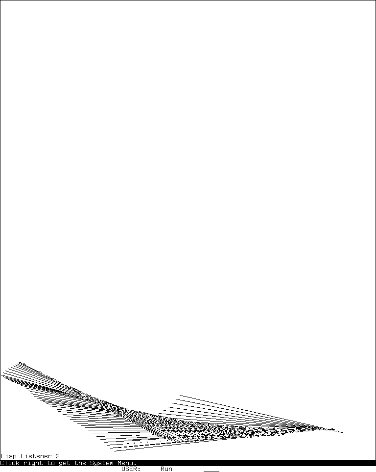

# CADR HACKS, display, sound, and novelty programs

`HACKS` is not one demonstration. In the maintained LM-3 System 303 source it is
an optional system called “Random use programs and demos”: a small sorted menu,
sixteen other application modules, two Doctor files documented separately, MUNCH, and
two compiled graphical support objects. The same `demo/` directory also preserves
eleven substantial Lisp programs which the system declaration does not load. They
range from an alarm scheduler and German number printer to a 3-D scene system,
speech-synthesizer driver, optical illusions, cellular automata, sound instruments,
and deliberately frivolous question answering.

This page accounts for every name in that release-bounded set. A menu entry is not
treated as proof that a program was present in the tested load band, and a source
file in `demo/` is not relabeled as an installed demonstration. [MUNCH](munch.md),
[LEXIPHAGE](lexiphage.md), [Doctor](doctor.md), the
[color experiments](../color-systems-and-color-editor.md#cadr-experiments-three-distinct-programs),
and [the Genera HACKS generation](../genera/genera-hacks-demonstration-suite.md)
have their own deeper pages; their exact places in this suite remain recorded here.

## Evidence boundary

The implementation boundary is public LM-3 System 303 check-in
[`4df393c`](https://tumbleweed.nu/r/sys/info/4df393c68d7f083ce42d5c377039d26043cc18a9031ace28258dc97f4137eb91).
Its [`HACKS` declaration](https://tumbleweed.nu/r/sys/file?ci=4df393c68d7f083ce42d5c377039d26043cc18a9031ace28258dc97f4137eb91&name=sys%2Fsysdcl.lisp&ln=358-373)
is commented out of the base build as optional, but defines the authoritative
component set when a user loads it. The extra-source boundary is every canonical
`demo/*.lisp` file in that same check-in after excluding Doctor, MUNCH, Paint,
continuity testing, and Versatec, which have separate application dossiers.

The public System 46 snapshot at commit
[`8e978d7`](https://github.com/mietek/mit-cadr-system-software/tree/8e978d7d1704096a63edd4386a3b8326a2e584af/src)
is used only where a corresponding released source or compiled artifact survives.
The live runtime boundary and screenshot will be recorded below; source-defined
features not exercised in that session remain labeled as such.

## What the optional system actually loads

| Kind | Exact System 303 members | Meaning |
| --- | --- | --- |
| Registry infrastructure | `HAKDEF` | Defines `DEFDEMO`, the sorted recursive menu, real-time wrapper, and shared drawing windows. |
| Active Lisp modules | `ABACUS`, `ALARM`, `BEEPS`, `CROCK`, `DC`, `DEUTSC`, `DLWHAK`, `DOCTOR`, `DOCSCR`, `GEB`, `HCEDIT`, `MUNCH`, `OHACKS`, `ORGAN`, `QIX`, `ROTATE`, `ROTCIR`, `WORM`, `WORM-TRAILS` | Compiled and loaded after `HAKDEF`; not every module registers a menu item. |
| Compiled support | `TVBGAR`, `WORMCH` | Raster arrays and worm support, not independent applications. |
| Explicitly omitted color modules | `CAFE`, `COLXOR`, `COLORHACK` | Present as source, but commented out with the note to leave out color material. |

The menu itself receives 22 top-level entries when all active modules finish
loading: `Quit`; Abacus; Beep Hacks; Crock; Digital Crock; Splines; TV bug; three GEB
families; two Hollerith editors; Munching Squares; Munching Tunes; Live Bounce;
Lexiphage; Qix; Rotate; Life; Rotating Circles; Worm; and Worm-Trails. Nested
submenus make the number of directly selectable actions larger. `ALARM`, `DEUTSC`,
Doctor, and `ORGAN` are callable facilities without `DEFDEMO` entries.

## HAKDEF: registry, menu, and execution wrapper

`DEFDEMO` does not create a frame class or command. It updates `*DEMO-ALIST*` with
an entry of the form `(name :VALUE value :DOCUMENTATION string)`. A one-form
definition becomes a direct menu action; a multi-form definition becomes a nested
`MENU` tree. Reloading a definition replaces its documentation and value by name
rather than duplicating it.

`HACKS:DEMO` copies and sorts the current list case-insensitively, calls the ordinary
TV menu chooser, recurses into submenus, and evaluates the selected form inside an
Abort restart. A null choice or **Quit** exits. This dynamic registration explains
why system membership, source presence, and a menu entry are three different facts.

`WITH-REAL-TIME` temporarily leaves only keyboard scheduling breaks enabled and
restores the former scheduler state with `UNWIND-PROTECT`. Long-running graphics
and sound loops use it for smooth timing while retaining a keyboard escape. The
shared 1001-by-1001 `HOF-WINDOW` and smaller 200-by-200 variant clear stale input and
labels when selected and are reused by several programs rather than recreated.

## ABACUS

The Abacus is a two-pane process frame. Its lower graphical pane renders ten decimal
columns from the public `ABACUS` raster font: glyph A is the empty rod and glyph B a
bead. The upper interaction pane accepts commands. The two upper beads encode five
units and the five lower beads encode zero through four, so each column represents
one decimal digit.

| Input or operation | Source-defined result |
| --- | --- |
| Left click a bead | Recomputes that decimal digit from the clicked upper or lower position and updates the complete number. Other mouse buttons are not handled. |
| Digits, then Space or Return | Reads and stores a decimal number. Values wrap modulo `10^NBEADS`; the default is ten digits, and negatives wrap from the maximum. |
| `+`, then a number | Adds it one digit at a time, visibly animating changed columns. |
| `-`, then a number | Subtracts it with the same visible digit-by-digit update and modular wrap. |
| `=` | Prints the current number in the interaction pane. |
| End | Deselects the frame. |
| Abort during an operation | Returns to the Abacus command level through its restart. |

The public method API also supplies `:SET-CURRENT-NUMBER`,
`:CURRENT-NUMBER`, and `:OPERATE` with `+` or `-`; this makes the display scriptable,
not only mouse-driven. The demo wrapper waits until the frame is deexposed before
returning to the HACKS menu.

## ALARM

ALARM is a background notification framework, not a clock-window demo. A low-priority
process wakes every 7,200 sixtieths of a second—two minutes by default—and asks each
symbol on `ALARM-LIST` to run property-based `CHECK`, `NOTIFY`, `RESET`, and
`ADD-ALARM` functions. It locks the database during checks, queues notifications
until after the lock is released, removes a failing alarm family, reports its error,
and kills itself when no work remains. Logout initialization kills the process and
clears its state.

| Public operation | Complete direct purpose |
| --- | --- |
| `BACKGROUND-CHECK-MAIL` / `BACKGROUND-MAIL-CHECK` | Watch a user/host mail pathname for creation-date changes, report the last writer when available, and optionally suppress the first notification. |
| `BACKGROUND-CHECK-FILES` | Watch one or more pathnames for changed file information and optionally suppress the initial event. |
| `SET-ALARM` | Parse a time, message, optional repeat interval and end time, and optional function plus arguments; display the message, call the function, or do both. Repeat intervals shorter than the polling period are coerced upward. |
| `BACKGROUND-CHECK-HOSTS` | Open Chaos `STATUS` contacts, wait at most five seconds, and notify when each named host changes between up and down. Planned-shutdown status is described by the data model but not implemented by the checker. |
| `CHECK-FREE-LISPMS` | Compare successive `FINGER-ALL-LMS` results and notify about newly free machines. |
| `PRINT-ALARM`, `PRINT-ALARMS` | Print one family or the complete time/file/host/Lisp-machine/mail inventory. |
| `VIEW-ALARMS` | Multiple-choice UI for viewing or removing alarm families; its `VIEW-ALARM` implementation currently returns the symbol rather than rendering details. |
| `REMOVE-ALARM` | Prompt for family and numbered entry, confirm, and remove it. |
| `DEACTIVATE-ALARM-PROCESS` | Kill the worker; an optional true argument also resets all families. |

The source therefore exposes two important limits absent from a simple “alarm
clock” description: polling precision is bounded by the sleep interval, and mail,
host, and free-machine checks require functioning site, file, and Chaos services.
There is no finished mouse editor; the file explicitly leaves that as future work.

## BEEPS

BEEPS is a sound laboratory built over `SYS:%BEEP`, not one melody. Its top-level
`BEEPS` function prints implementation and parameter documentation; the menu exposes
the following complete action set:

| Menu action | Sound algorithm |
| --- | --- |
| Documentation | Prints the module's routine and `%BEEP` period/duration explanation. |
| `boop`, `poob` | Randomized rising or falling period sweep. |
| `oopb` | Interleaves opposed rising/falling sweeps with independently randomized duty durations. |
| `spoob` | Blends two tones by changing duty cycles. |
| `spoop` | Rapidly alternates a tone and silence. |
| `broop` | Alternates one rising and one falling tone. |
| `breep`, `dreep`, `beep-rise` | Multi-frequency and rising variants. |
| `freep`, `greep`, `nreep` | Recursive random noise, Gaussian-derived variation, and four concurrent-style noise strands. |
| `srieep`, `fsrieep` | Sinusoidal siren between endpoints; the latter also changes its endpoints exponentially. |
| `cscale-up`, `cscale-down`, `cscale` | Chromatic scale in one or both directions. |
| `swars`, `et`, `zowie`, `tzone` | Encoded short tune tables. |
| `rnd-beep` | Weighted random selection across sweeps, songs, scales, and noise functions. |

The source additionally contains encoded `races`, `bat5`, `deck`, `jingle`, `tree`,
`kiss`, `nuts`, and `joy` tunes; functions `RACES`, `BAT5`, and `ZOWIE`; `PLAY-SONG`,
`PLAY-NOTES`, and `PLAY-NOTE`; experimental volume control; and a raw-Unibus `BUZZ`.
`BEEP-INSTALL` is unusually invasive: it replaces `TV:BEEP` with `RND-BEEP` for the
login environment while arranging to restore the old definition at login cleanup.
That operation is callable but deliberately absent from the demo menu.

## CROCK: analog wall clock

Crock owns a process-backed window using `43VXMS`. It draws a circular face and the
numbers 1 through 12, then XOR-erases and redraws three hands. The ornate hour and
minute hands are polygonal curve descriptions; the second hand is a simple line.
The hour hand updates to quarter-hour precision, the minute hand to half-minute
precision, and the second hand each second. The process sleeps 30 ticks, just under
one second, between checks.

On the hour, and once at each half-hour, it calls the shared Organ note-string
interpreter for a prelude and then sounds one chime or the current twelve-hour count.
The HACKS wrapper selects Crock, waits for any character in the previously selected
window, and buries the clock. The `CROCK` entry itself creates or reuses a nearly
full-screen window and selects it.

## DC: Digital Crock

Digital Crock displays `HH:MM:SS` as six generated, slanted seven-segment digits,
with no font glyphs. It renders each old and new digit into temporary bit arrays,
XORs them, and applies only the changed strokes to the screen. The leading hour zero
is suppressed. If Crock's `PLAY-TIME` is loaded, DC reuses its half-hour and hourly
chime behavior.

`DC` centers and exposes the reusable process window; `:START` releases its update
loop. As with Crock, the demo wrapper waits for one character in the selected window
and then buries it. Width, height, stroke thickness, slant, colon geometry, and all
spacing are named source constants, making the display algorithmically scalable
only by editing and reloading those mutually derived constants.

## DEUTSC: German number, date, and time printing

`DEUTSC` is a formatting facility with no demo-menu entry. `GERMAN-PRINT` spells
signed cardinal or ordinal integers in groups from units through quadrillions;
`GERMAN-PRINT-TIME` expresses time in minute, quarter, half, and “before/after”
forms; and `WIEVIEL-UHR` combines the German weekday, ordinal day, month, year, and
spoken time.

The file installs `:GERMAN` as a Lisp printer base. On window streams
`GERMAN-PRINC` temporarily selects `S35GER`, restores the prior font map and current
font with `UNWIND-PROTECT`, and otherwise writes plain transliterations. It also
installs an `:ASK` printer which opens a menu for Decimal, Octal, Binary, two Roman
forms, English, or German. Misspellings in several literal word tables are preserved
implementation data, not corrected linguistic claims.

## DLWHAK: PARC labels, Splines, tally notation, and TV Bug

This module is four related experiments:

### PARC label mixin

`PARC-LABEL-MIXIN` changes TV label margin calculation and draws a three-sided box
around the label, using the window's top border as the fourth side. `TEST-PARC-WINDOW`
asks the pointer for window corners and creates an exposed labeled window. It is a
window-system example, not a HACKS menu item.

### Splines

The Splines demo clears a dedicated window and repeatedly collects pointer-selected
knots. Left adds a point; Middle ends collection and draws a relaxed open cubic
spline; Right closes the point sequence and draws a cyclic spline; Abort exits.
Fewer than two points beep. Point markers are XORed away before the curve is drawn.
Callable arguments choose line width, raster operation, interpolation precision,
and target window.

### Tally numeric printer

Selecting Lisp output base `:TALLY` loads the `TALLY` font if necessary and writes
one “five” glyph per complete group plus one “one” glyph per remainder. It restores
the previous font state afterward and falls back to ordinary decimal on streams
which cannot change fonts.

### TV Bug

`TVBUG` lazily loads `TVBGAR`, constructs XOR differences between four 40-by-40
bug frames, and walks the animation upward from the bottom center one row per frame.
Any character stops it; reaching the top also stops it. The final current frame is
XORed away. The older commented implementation used glyphs A through D of the
`TVBUG` font; the maintained arrays are bit-for-bit equal to those public glyph
rasters, as documented in the [visual-assets inventory](visual-assets-inventory.md#lm-3-only-graphical-fonts).

## GEB: Godel, Escher, Birds, and related experiments

GEB supplies mathematical XOR drawing and sound routines on the shared HOF window.
The four public families are related by endpoints which advance at fixed rates in a
2,000-unit reflected coordinate space.

| Family | Direct behavior and complete menu surface |
| --- | --- |
| Godel | Draws one XOR line between two moving endpoints. Its submenu supplies six exact velocity pairs: `(0,1)/(1,0)`, `(1,2)/(2,3)`, `(0,1)/(3,2)`, `(2,1)/(4,3)`, `(0,2)/(1,3)`, and `(0,1)/(2,3)`. Each waits at completion; a character can stop early. |
| Escher | Draws the line and its three reflections for fourfold symmetry. The demo cycles five built-in velocity sets, clearing and waiting between them. |
| Birds | Draws two XOR triangles sharing two moving vertices. The demo cycles six paired velocity sets and waits between patterns. |
| Atan | Plots a low-order bit of scaled `atan(y,x)` in a small window. Its `DEFDEMO` form is inside `COMMENT`, explicitly because it was not considered interesting enough for the menu. |

Additional callable experiments are `BACH`, which maps the eight reflected
coordinate values to tones; `GODEL*`, which perturbs exact corner coincidences;
`KUPFER`, which admits floating-point velocities; `KUPFER-GOLD`, which derives tone
from line angle; and potential-field drawing over lists of weighted points. These
are real source functions but not separate registered applications.

## HCEDIT: Hollerith card editors

HCEDIT draws an 80-column IBM 5081-style punched card from line, rectangle, tiny-font,
and `TVFONT` operations, then maintains both an 80-character string and the punched
holes implied by a complete source table of accepted characters.

| Input | Result |
| --- | --- |
| Any supported printable character | Uppercases it, appends it if capacity remains, draws the letter and its Hollerith punches. |
| Rubout | Erases the last character and restores underlying row and column labels. Empty input beeps. |
| Clear | Erases every entered character and resets the active length to zero. |
| Return | Finishes and returns the 80-character array with its current fill pointer. |
| Unsupported code or 81st character | Beeps and leaves the card unchanged. |

**Hollerith Editor** edits one card. **Multiple Hollerith Editor** repeats the same
editor indefinitely and shifts each completed screen image by -5 horizontally and
-20 vertically, producing a visible stack; its source defines no ordinary exit from
the outer loop, so Abort is the practical escape.

## OHACKS: retained older demonstrations

OHACKS is a collection rather than one program. Its active menu entries are:

- **Munching Tunes**, which maps the Munching Squares XOR sequence to `%BEEP` periods.
  The submenu offers the exact starts **From the beginning** (`A=0`) and
  **Interesting** (`A=571565`); any character stops and the final accumulator is
  returned.
- **Live Bounce**, a 20-lamp switch-register animation derived from a late SIPB
  PDP-8/S program. It grows and shrinks a moving run of bits, reverses direction at
  the ends, periodically complements the display, accepts an optional busy-wait
  delay, and stops on any character.
- **Lexiphage**, documented fully in [the word-eater dossier](lexiphage.md).

Callable but intentionally unregistered **Green Hornet** draws alternating nested
circles around two nearby centers; **Circles** draws concentric circles. The source
says they are omitted because they are boring and demonstrate slow circle drawing.
The file also preserves commented DDT-style raw-Unibus “Carpet” debugging code; it
is inert historical source, not an available menu tool. Munching Squares itself is
in the separate [MUNCH module](munch.md).

## ORGAN and Gamelan

ORGAN turns ordinary keyboard characters into a live monophonic instrument while
recording the resulting tune string. Every mapped letter has a source-computed tone
period; uppercase and lowercase forms give adjacent pitches. The complete key map,
expressed as the source's octal `PIANO` index, is:

| Key sequence | Source indexes in sequence |
| --- | --- |
| `z Z x X c C v V b B n N m M` | `230 227 226 225 224 223 223 222 221 220 217 216 215 214` |
| `a A s S d D f F g G h H j J` | `214 213 212 211 210 207 207 206 205 204 203 202 201 200` |
| `q Q w W e E r R t T y Y u U` | `200 177 176 175 174 173 173 172 171 170 167 166 165 164` |
| `k K l L i I o O p P` | `164 163 162 161 160 157 157 156 155 154` |

| Control | Exact effect |
| --- | --- |
| `:` as the first character | Marks a tune to repeat until keyboard input interrupts playback. It is not played immediately by the interactive editor. |
| `@` | Reset duration to the initial speed. |
| `<`, `>` | Make notes three times faster or three times slower. |
| `[`, `]` | Make notes twice as fast or twice as slow. |
| `-` | Rest for the current duration. |
| Rubout | Remove the previous character and restore the speed state if it was a speed command. |
| Return or Tab | Retain and echo the character in the tune. |
| Form/Clear keys | Clear the screen, then redisplay the tune buffer. |
| `?` or Help | Display the complete inline control guide and redisplay the buffer. |
| `.` | Stop and return a copy of the tune string. |

`PLAY` recursively accepts a tune string, a symbol naming one, a list of pieces, or
a character code. Zmacs command `Play Region` sends the selected text to it. `GAMELAN`
and `PLAY-GAMELAN` dynamically substitute a seven-note pelog period table on keys
`A` through `J`. There is no HACKS menu entry; users call `ORGAN` or `GAMELAN`.

## QIX

QIX is explicitly not the arcade game. Two endpoints execute bounded random walks;
each cycle XORs a line between them and erases the line which falls out of a circular
history. The resulting moving ribbon has a configurable trail length. Endpoint
velocities change by -1, 0, or +1 each cycle, clamp to magnitude 12, and reverse at
window edges.

The maintained menu calls the faster `NQIX`, whose defaults are trail length 64 in
the file's octal syntax, the current terminal stream, and a very large iteration
limit. It clears stale input before drawing and stops when a hardware keyboard
character becomes available or the explicit `times` count is reached. Cleanup XORs
away every retained line in the older implementation; the faster version exits
without that final history sweep.

## ROTATE and Life

These two algorithms share a file because both were translated from Smalltalk code
published in the August 1981 *Byte*.

**Rotate** accepts a square one-bit array whose dimension is a power of two. It uses
two work arrays and `2 + 15*log2(N)` BITBLTs to rotate the bitmap clockwise in place.
The demo prints the local `FORMAT` function documentation as a random 512-by-512
source image, copies it into an array, displays every transformation stage, and waits
for a character after completion.

**Life** copies the current little HOF window into a one-bit state array, computes
all eight neighbor counts with Boolean BITBLTs, applies Conway's survival/birth
rule, redisplays, and prints the generation number. `RUN-LIFE` seeds it with one
horizontal line. It permits up to 100,000 generations and stops on any character.
The implementation deliberately uses 65 BITBLTs per generation rather than a cell
loop.

## ROTCIR: rotating circles

Rotating Circles opens a small prompt window in decimal input mode and asks for two
values: radius and angle step from 1 through 90. It then selects a reusable labeled
graphics window, draws a central circle plus four equal circles whose centers move
around the four cardinal positions, and advances from angle zero through 90 degrees.
The source does not validate the documented radius range or reject a zero/negative
step, so malformed input can fail or loop; that is an implementation limit.

After drawing it prints “Hit any key to flush,” reads one character, and kills the
graphics window. Despite its menu description as a “spirograph crock,” it is a
deterministic quarter-turn construction, not an interactive freehand Spirograph.

## WORM

WORM overlays six coroutining stack groups which draw recursive ternary paths with
different `WORM` sprite characters and raster operations. It first draws a large
base worm until the recursive shape fits, then presets gray, black, striped, and
erasing wormlets at staggered ternary phases. The font is executable display data:
glyph codes 2 through 5 distinguish the compositing layers.

The command prompt reads its numeric prefixes in base 9:

| Command | Effect |
| --- | --- |
| `P` | Run continuously; any character returns to the prompt. |
| `nR` | Run until absolute generation `n`. |
| `nN` | Run `n` additional generations. |
| `nS` | Run through the next boundary of ternary order `n`, computed from `3^n`. |
| Abort | Exit WORM through its restart. |

The label reports the generation in base 9. Screen-edge clipping changes the
fit flag during the initial size pass rather than wrapping the visible path.

## WORM-TRAILS

Worm-Trails is a training game. A line starts at the pond center. At each step the
program samples the eight neighboring pixels into an eight-bit “node” describing
existing trails. Eight near-dead-end nodes have forced exits; an unknown node stops
and asks the player to choose.

At a decision, a circle and beep mark the node, a magnifying blinker follows the
pointer, and a temporary XOR line previews one of eight directions. Moving over an
occupied direction produces a warning beep. Clicking any mouse button while over an
unoccupied direction selects it. The learned choice is stored for every rotationally
equivalent node, so later encounters proceed automatically.

The worm dies of `brain-damage` on a wall or `starvation` when surrounded. It then
waits for a character, reports cause, move count, and the learned move sequence, and
asks **Again?**. A new round clears learned choices and trails; learning is deliberately
per round rather than persistent.

## Extra canonical demo source outside `HACKS`

The following files are canonical System 303 source but are not active components
of the optional `HACKS` system. Their presence establishes recoverable implementation,
not load-band availability.

## CAFE

CAFE draws the cafe-wall optical illusion in a dedicated four-bit color window. The
simple form uses alternating colors 1 and 2 separated by color 3; the elaborate form
assigns opposing runs of color-map indexes to alternate rows. `CCH` shows a black,
white, and gray version, `CCHC` cycles the three colors sinusoidally, and
`CAFE-SLIDE` animates alternate rows in opposite directions by changing color-map
entries rather than redrawing the tiles.

It explicitly requires a color monitor and is commented out of `HACKS`. Complete
color-map semantics and parameters are in [the color-system dossier](../color-systems-and-color-editor.md#cafe-map-animated-cafe-wall-illusion).

## COLORHACK

COLORHACK is a library and interactive color mixer for the optional four-bit screen.
It initializes screen geometry; reads, writes, prints, saves, restores, shades,
randomizes, blackens, and melts 16-entry RGB maps; provides clipped point, line,
character, string, circle, and filled-circle primitives; and builds an RGB mixing
window. In the mixer, left, middle, and right mouse buttons raise red, green, and
blue; double-click-and-hold lowers the corresponding channel; any keyboard
character finishes and returns the RGB triple.

The implementation works directly with the hardware color map and screen array,
which is why the system declaration leaves it out on ordinary monochrome machines.
Its complete callable surface is cataloged in [the color-system dossier](../color-systems-and-color-editor.md#colorhack-library-and-two-small-interactive-mixers).

## COLXOR

COLXOR layers symmetric line algorithms and color-map animation over COLORHACK.
Its optional **Color TV Hacks** menu, registered only if the file is loaded, exposes
the source-defined color experiments: non-color baseline, Smoking Clover, color
ramp and march, guard, zoom, mash, fractional tour, random ramp, and brighten.
Several functions change the live hardware map continuously and stop only through
keyboard input or an error/Abort path. The module is therefore both peripheral-bound
and globally stateful, not a safe monochrome menu curiosity. See
[the per-experiment inventory](../color-systems-and-color-editor.md#colxor-geometry-plus-color-map-motion).

## CRAZE

`CRAZE` chooses a random interior origin and draws 29 recursively branching,
jagged rays. Each ray advances by randomized vector steps, can fork with a gradually
increasing probability, and can connect to a previous ray through recursively split
“cracks.” All visible segments use XOR.

The source's `CLIPPED-LINE` function is only endpoint clamping: it forces each
coordinate into the bounding box and reports whether any clamp occurred. It is not
a general line-intersection clipper. `CRAZE` has no menu registration, no input
loop, and no explicit clear or wait; it draws one composition into the selected
window and returns.

## FREDKIN

FREDKIN implements a reversible-style XOR cellular image transform. On every
iteration, each output pixel is the XOR of its left, right, upper, and lower
neighbors and, when `middle-toggle` is true, the original center pixel. The menu
form requests the center-inclusive version and stops on any keyboard input.

The file unconditionally loads `SYS:DEMO;ELP-ARRAY` before defining its entry point.
That input is absent from the pinned checkout, so loading the canonical file fails
before the registered **Fredkin** demo can exist. Supplying an arbitrary pattern to
`FAST-FREDKIN` would exercise the algorithm but would not recover the missing
historical picture; a future test must label a researcher-created pattern as such.

## LISS

LISS is a small vector-display substrate rather than a ready-made demo. It accepts
two eight-element duration lists for X and Y. `MERGE-DURATIONS` walks their shared
time line, advancing through the fixed slope sequence `0, 1, 2, 1, 0, -1, -2, -1`,
and produces `(duration, x-slope, y-slope)` segments. `DISPLAY-LISS` repeatedly
integrates those segments from a supplied origin and draws XOR triangles between
the origin and successive positions.

Any input character stops the display. The caller controls slowness and target
window. No canned duration sequence, top-level constructor, or `DEFDEMO` is present,
so the source establishes a programmable Lissajous-like renderer, not a discoverable
application with a default picture.

## PFOM: image window and Lunar Turkey

PFOM expects a 600-column, four-bit input named `SYS:DEMO;RISING SUN`, decodes it
into `FOM-ARRAY`, and displays a centered/cropped view in a color-screen window.
That input is absent from the pinned checkout; its default picture cannot be
reconstructed from this source alone.

`TURKEY` turns any displayed window into a sliding-tile puzzle: it divides the image
into a configurable grid, erases the upper-left tile, scrambles by 30–49 legal
moves without immediate reversal, and animates each tile move in ten steps. A click
on a tile orthogonally adjacent to the hole moves it; an invalid click beeps; the
right mouse button exits. There is no solved-state test, score, move counter, or
menu registration. Running it on researcher-owned pixels can test the mechanism
without substituting another picture for the missing historical input.

## TREEDV: segmented 3-D vector display

At 88,148 bytes, TREEDV is a graphics environment rather than a single visual hack.
It implements:

- named, nested line/point segments with open, close, clear, delete, transform, and
  draw/display operations;
- a stack of homogeneous 4-by-4 transformations, including identity, rotation,
  scale, translation, orthographic `WIND`, perspective `WINDP`, and `MAST`;
- three-dimensional clipping and generalized-coordinate-to-window conversion;
- double-buffered one-bit or four-bit drawing, with named color-map support from
  COLORHACK; and
- primitive constructors for tetrahedra, arrows, cubes, squares, octagons, a color
  wheel, an airplane with moving propeller, and sampled surfaces.

| Demonstration entry | Source-defined scene |
| --- | --- |
| `GO-TEST` | Heavily documented composite of nested segments, colors, transformations, pointer-controlled rotation/translation, and frame swapping. |
| `GO0` | Static cube through the basic perspective and display loop. |
| `GO1` | Airplane with a rotating propeller; pointer position controls two orientation axes. |
| `GO2` | Continuously rotating airplane generated through a temporary segment. |
| `GO2.5` | Continuously rotating sampled wave surface. |
| `GO3` | Six colored cubes along the Z axis, rotated through half a turn. |
| `GO4` | Rotating color wheel and many colored squares; pointer controls additional orientation. The module synopsis calls this a hilly `sin(x)/x` demonstration, but the inspected body draws the wheel/squares, so the implementation is authoritative here. |
| `GO5` | Stereo viewer: red/cyan left/right images on a color display or separated views for crossed-eye use on monochrome. Its `idd` option selects airplane, color wheel, cube, two surface forms, or a square sequence. |
| `BOUNCE` | Moving and rotating constructed objects in a perspective box. |

`TREEDV` prints its own long programming guide through `TREEDV`/`3D-DOCUMENT`, but
registers no HACKS menu entry. The file says updates can take one to ten seconds and
that its experimental fixed-point mode does not work well. Color paths require the
separately omitted COLORHACK module; monochrome operation remains source-defined.

## VOTRAX

VOTRAX drives a physical speech synthesizer through a 300-baud, eight-data-bit,
two-stop-bit serial stream. It maps symbolic phonemes and four stress levels to
device bytes; a number in a phoneme list changes the stress prefix. `SPEAK` sends a
phoneme list, `SPEAK-WORD` and `SPEAK-WORDS` look up `:VOTRAX-WORD` properties,
and `SPEAK-SENTENCE` separates words on spaces or hyphens. An unknown word prompts
the user to enter a phoneme list and stores it on the symbol.

`DUMP-WORD-FILE` and `LOAD-WORD-FILE` persist that learned property database.
Printer base `:VOTRAX` speaks formatted fixnums while also printing them. `SPEAK-RAN`
sends random device values, and `OPERATOR` plays a canned telephone-disconnection
sentence. The older raw DL11 register routines are inside `COMMENT`; the active path
uses the serial-stream abstraction.

No emulator audio substitute can verify the intended speech. Meaningful runtime
testing requires an isolated compatible serial endpoint or a protocol recorder
which can establish emitted bytes without claiming to reproduce the Votrax voice.

## WORDS

`WORDS` is not an application. It is a Lisp data file of `DEFPROP` forms mapping
symbols to `VOTRAX-WORD` phoneme/stress lists, including number words and the canned
operator sentence vocabulary. Loading it extends VOTRAX's lexicon. It has no entry
point, process, display, or input handling, and is therefore kept as support data.

## WHAT

WHAT recreates the style of the ITS `WHAT` utility as a novelty dispatcher. It
canonicalizes a question by trimming terminal `?`, `.`, and `!`, uppercases it, and
walks an ordered database. Its five matching modes are exact match, substring,
beginning, end, and a `$` wildcard; a `:MAP` result rewrites part of the question and
restarts parsing. A response may be a string, a function to call, or a list of files
of which the first present one is displayed. An empty question prints saved sends;
a numeric question requests that many sends; an unknown birthday-shaped question
uses the time parser; all other misses answer “You tell me.”

The shipped database answers or redirects queries about time/date, identity,
version and system, disk errors, users, notifications, patches/modifications,
features, HACKS, Digital Crock, birthdays, saved messages, jokes, and historical
MIT-local news or documentation files. Several file paths and services are site-local
and will be absent. Some function responses are operational—notably loading patches,
printing system data, invoking Crock/DC, or entering the HACKS menu—so arbitrary
questions are not a purely inert text game.

`WHAT-CAN-I-DO` lists every trigger, `WHAT-RANDOMNESS` selects one at random,
`ADD-WHAT` extends the live database, `WHAT-PRINT-DEMONS` reports process reasons,
and `TEST-WHAT` runs a small or complete parser test. The source explicitly lists
old ITS commands it could not implement and several unimplemented candidates. It
has no HACKS menu registration.

## TVBGAR and WORMCH support objects

`TVBGAR` is a 740-byte QFASL loaded after the Lisp modules. It supplies the four
bug raster arrays consumed lazily by `TVBUG`; it has no user entry point.

`WORMCH` is a 1,696-byte QFASL accompanied by a 607-byte assembler/source witness.
The system loads it as support for the worm display, not as a menu item. The public
`WORM` font is also loaded independently by the Lisp code. Treating these binary
names as two more “applications” would inflate a payload dependency into a false
user-interface claim.

## System 46 to System 303 lineage

The released System 46 tree has no equivalent modular `HACKS` declaration. Its
[`lmio1/hacks.189`](https://github.com/mietek/mit-cadr-system-software/blob/8e978d7d1704096a63edd4386a3b8326a2e584af/src/lmio1/hacks.189)
combines Organ, Munching Tunes, Munching Squares, and Lexiphage in one file, while
`lmdemo/organ.6` and compiled GEB/Organ objects provide additional witnesses.
The released `lmio1/votrax.6` is a direct predecessor of the maintained serial speech
facility. System 303 separates programs into files, adds the dynamic `DEFDEMO` menu,
uses reusable HOF windows, and grows a much larger optional suite.

This does not mean every program first appeared in System 303. Individual comments
give earlier authorship/edit dates, and several maintained files clearly preserve
older experiments. The evidence establishes the two snapshots and their organization,
not a complete chronology for every intervening system.

## Runtime verification

The tested System 303 base band does not load `HACKS`; source presence alone did not
put `HACKS:DEMO`, `HACKS:NQIX`, or the other definitions into the initial world.
The repository's isolated FILE bridge can load public lowercase source by constructing
raw pathname components, as established in the [harness guide](cadr-computer-use-harness.md#loading-public-source-through-the-isolated-file-bridge).

Session `hacks-doctor-d56-d57-20260718`, generation 1, loaded the exact public
`demo/hakdef.lisp` and `demo/qix.lisp` files through that bridge. The reproducible
forms were:

```lisp
(load (fs:make-pathname
        :host "LOCAL-BRIDGE"
        :raw-directory '("tree" "demo")
        :raw-name "hakdef"
        :raw-type "lisp"))

(load (fs:make-pathname
        :host "LOCAL-BRIDGE"
        :raw-directory '("tree" "demo")
        :raw-name "qix"
        :raw-type "lisp"))
```

Both loads reported package `HACKS`. Because Listener 1 was deliberately retained
inside the companion [Doctor](doctor.md#successful-raw-file-bridge-conversation)
probe, the live System Menu's **Lisp** action created Listener 2. That new Listener
used its displayed `#<Readable ...>` syntax rather than the boot Listener's
traditional syntax; a direct `HACKS:NQIX` read as an unbound `HACKS` variable.
After declining the debugger, this package-neutral call selected the same function:

```lisp
(funcall (intern "NQIX" (find-package "HACKS")))
```

`NQIX` immediately cleared the full Listener interior and drew the evolving
source-defined XOR line trail. Pressing Space satisfied
`SYS:KBD-HARDWARE-CHAR-AVAILABLE`, stopped the loop, and returned `NIL` to the
Listener. The capture therefore verifies the real stream dimensions, direct drawing,
history trail, XOR evolution, and any-key stop path. It does not verify the menu
wrapper or any other HACKS member.



The published image is the exact 768-by-963 framebuffer, not a reconstruction or
crop. It displays only public CADR runtime graphics and short functional status
labels. Its publication is covered by the
[capture-specific rights review](../screenshot-publication-rights-review.md).

| Item | Recorded value |
| --- | --- |
| Session | `hacks-doctor-d56-d57-20260718`, generation 1; 2026-07-18 12:41:02–12:55:01 EDT |
| Guest and window | Experimental System 303.0; load band `System 303-0`; microcode 323; `LOCAL-CADR [running]`, XID 2097202, 768 by 963 at `(0,0)` |
| Disk | public base and private-start SHA-256 `bb16e46ad81decfe1efe691d36b6aa4ce3fd4ffb82474365de3520989d397cb5`; public base unchanged at stop |
| Source and emulator | System check-in `4df393c68d7f083ce42d5c377039d26043cc18a9031ace28258dc97f4137eb91`; private System tree SHA-256 `21f5215de973aa6ccbddb817f2d64edd95ee1014c3028a9b0711ea7c741b807e`; emulator revision `330d8248ec2e12af071e287920e681600f75df9ffd854aada5f8a64c9adad64d`; start and execution SHA-256 `707a77d23e28ea1c45ae0eb0145dc181fa7ba649b9defc30044d4f847ac2c5be` |
| Curated exact capture | `qix-live.png`, copied without transformation from raw `0027-qix-funcall-live.png`; 4,848 bytes; PNG SHA-256 `4c6d92f19027d7dd73a6934776d4e3361056bd7b006d8059277c5e47abd8131f`; decoded-pixel SHA-256 `8f546c33f9036fb1e0d8447ff93e673f2137c3b2b94669efa1a9b8a0a715b273` |
| Raw sidecar | `0027-qix-funcall-live.json`, 4,423 bytes; SHA-256 `7087a351301bf7fc4a3b0934eee1e62ba96d1672d35905a214cde2578225d5a1` |
| Run record | 6,940 bytes; SHA-256 `89cd8f2726471f0bde8efe411c1a142b97f96418e07f3594367d8f406e9b10a6` |
| Shutdown | Clean: `forced_stop=false`, `state_may_be_incomplete=false`, usim and Xvfb exit status 0, public base disk unchanged |

Programs requiring color hardware, a Votrax, missing `ELP-ARRAY` or `RISING SUN`
data, configured Chaos/file services, printer hardware, or an audio capture fixture
still require separate tests. The monochrome QIX observation must not be generalized
to those members.

## Artifact provenance

The following canonical files were read from the repository's public, pinned System
303 export on 2026-07-18. Paths are relative to `demo/`; no licensed Genera payload
is represented.

| Artifact | Bytes | SHA-256 |
| --- | ---: | --- |
| `hakdef.lisp` | 3131 | `a6db24aa26fe7fd415033c3ce434df1bcbd31eebbfea5a977fc58423aee6df4c` |
| `abacus.lisp` | 8820 | `02e674fea279e5d5a5f3e15c1c4f1f7e3096f575cf83c68933fb81d0e2c0e1a0` |
| `alarm.lisp` | 25393 | `a105982637711dd49ef7cab87c64071c162636ea40046b1276c7b3a38cd6d43f` |
| `beeps.lisp` | 18710 | `62e53706173c5a5dd48996549f138cc0274b7005efc0fca11b3acecdcbdf4867` |
| `crock.lisp` | 7882 | `af860fc7f59197c9492d08ee4c5f130a4e8ea867ab9a962dfe8809245659456b` |
| `dc.lisp` | 8201 | `124b679408b861b17dc77a39fa04d42ef81c634a0dcf28876bd331a7ff3f56e4` |
| `deutsc.lisp` | 5077 | `5fbad345fad666a2d09f135daf8c77341c873890cfb5f47bcb466b4cf2d63056` |
| `dlwhak.lisp` | 9309 | `1f136e9d6c8e09779088898ddf7488d729a40bb8cbba239e077ea1dc6e4855a6` |
| `geb.lisp` | 13445 | `cba149fc018bbb091e1bc1cfcd86776f8a3c95b0914f7b4e8dc02f0139e7b192` |
| `hcedit.lisp` | 9429 | `3beaf8d655f6fe1683b11f5aa93c9ab7a1e8fa746f599ff82c9b3cd10116ae94` |
| `ohacks.lisp` | 20605 | `762ecaf7d5b2c21c860d01be4fcbc81265cb2b9d25c7aa18feefa6ac2745ecb0` |
| `organ.lisp` | 7564 | `8a6de08ee64457348ea724ef0ddf21011995b82c36013ad9747cce51fe7c6e13` |
| `qix.lisp` | 4943 | `fac4da4dfd6e52f1fd8abd719152115ed34e8ecdb72f1fd3640c87480d0a2fd1` |
| `rotate.lisp` | 5994 | `9faaf57d52ebf6d31c7b1f6539d8f83290387e3145de2df840f0efe92b07deaf` |
| `rotcir.lisp` | 3362 | `44fe9b540db009ade8e991eb70d01063e10e82df84d75159d930d0fba882f537` |
| `worm.lisp` | 5510 | `41d20b549b666ccdb44dbe82700d2ad786f8a2eeeedc29484500ed3e74fb3038` |
| `worm-trails.lisp` | 7399 | `0fff8255a68960c9305d8f14cbf67597436ab0485a5c5fd8f1c6096553b696c5` |
| `cafe.lisp` | 6064 | `3794600d089d148640c48c95a3bb806bc09188eb3fbbde4f3770d8dc13c1f0a2` |
| `colorhack.lisp` | 26219 | `3bac643b508464c3e31e5524982efe0410b3fcea09c2975e3750e0a98166d33c` |
| `colxor.lisp` | 13394 | `839135407e86b10091694ec0cd52d46dcace47aa75fdd974f7514b2e74e05707` |
| `craze.lisp` | 3011 | `649d9e4835393027835f6be757ec949753b199f9eeeb05ffd2be03e5cbb694ce` |
| `fredkin.lisp` | 2343 | `4ff361ed39fac7e97be7372cff12d9d760b9392fe41932f92e893788069d2d9e` |
| `liss.lisp` | 2304 | `d633657c28b28c4309976f092e6a376714af9733a0ad74d050c4404760752964` |
| `pfom.lisp` | 4833 | `0c7f4698f51c4201fbce0b6274856258012a1387f4dd6d3684a0fa22d3361b2f` |
| `treedv.lisp` | 88148 | `27a07faef12ffe47b482bc0101c502abca316c7b1061aa85e95930413159c5e4` |
| `votrax.lisp` | 3894 | `a56933ee5038508d612165685bcf0768cff548dc6fd5d09f75bc7995a3f4ec31` |
| `what.lisp` | 16677 | `406f0d0313fee35696c4120842d8f50dee1492a2f7509909de43bdabba7a1e42` |
| `words.lisp` | 5102 | `62e7fc070c3b977eb4f65cc0f7b34679d66fb2a069ffbc4ea391e44fc9ad8ff1` |
| `tvbgar.qfasl` | 740 | `ed50c226d5d34eabd2420acfd3dd6f03e3470802ca8ba64f9d036f59bbb7af43` |
| `wormch.qfasl` | 1696 | `13d6fa5913df2fe176e019f0ee1db457f468d8013f1d01929c267e044c320f0e` |
| `wormch.ast` | 607 | `24d48c12a4bd73c8aa1a2a93ccbd037d463ee39bf4329798a99c37c5d5d73b41` |

## Findings and open work

- **Sourced fact:** the optional `HACKS` system is a loader and registry boundary;
  it is not equivalent to either the menu or the whole `demo/` directory.
- **Implementation finding:** several supposedly casual demos are reusable
  substrates—ALARM, COLORHACK, TREEDV, Organ, and the German printer—while other
  files are one-shot drawing functions with no UI.
- **Implementation finding:** the suite often uses any pending character as an
  asynchronous stop condition. Running it through a modern keyboard bridge must
  distinguish host key delivery from original keyboard legends.
- **Runtime observation:** public `HAKDEF` and `QIX` loaded through the isolated
  bridge; `NQIX` drew the expected evolving XOR trail and stopped on Space. The
  reviewed exact framebuffer is published above. This verifies one representative,
  not the suite as a whole.
- **Open:** FREDKIN's `ELP-ARRAY` and PFOM's `RISING SUN` are absent; their historical
  pixels must remain unknown unless a rights-cleared public witness is found.
- **Open:** VOTRAX needs a serial protocol fixture or real compatible synthesizer;
  color modules need a four-bit screen implementation; network alarms need an
  isolated configured Chaos site.
- **Open:** the exact authorship and pre-System-46 lineage of every experiment is not
  established merely by comments in the latest files. A separate history study
  should corroborate dates and initials against earlier source revisions.

## Sources

- LM-3 maintained System source, [`HACKS` declaration](https://tumbleweed.nu/r/sys/file?ci=4df393c68d7f083ce42d5c377039d26043cc18a9031ace28258dc97f4137eb91&name=sys%2Fsysdcl.lisp&ln=358-373),
  [`HAKDEF`](https://tumbleweed.nu/r/sys/file?ci=4df393c68d7f083ce42d5c377039d26043cc18a9031ace28258dc97f4137eb91&name=demo%2Fhakdef.lisp),
  [`ALARM`](https://tumbleweed.nu/r/sys/file?ci=4df393c68d7f083ce42d5c377039d26043cc18a9031ace28258dc97f4137eb91&name=demo%2Falarm.lisp),
  [`GEB`](https://tumbleweed.nu/r/sys/file?ci=4df393c68d7f083ce42d5c377039d26043cc18a9031ace28258dc97f4137eb91&name=demo%2Fgeb.lisp),
  [`ORGAN`](https://tumbleweed.nu/r/sys/file?ci=4df393c68d7f083ce42d5c377039d26043cc18a9031ace28258dc97f4137eb91&name=demo%2Forgan.lisp),
  [`QIX`](https://tumbleweed.nu/r/sys/file?ci=4df393c68d7f083ce42d5c377039d26043cc18a9031ace28258dc97f4137eb91&name=demo%2Fqix.lisp),
  and [`TREEDV`](https://tumbleweed.nu/r/sys/file?ci=4df393c68d7f083ce42d5c377039d26043cc18a9031ace28258dc97f4137eb91&name=demo%2Ftreedv.lisp),
  check-in `4df393c68d7f083ce42d5c377039d26043cc18a9031ace28258dc97f4137eb91`.
- MIT CADR System Software, [public System 46 source tree](https://github.com/mietek/mit-cadr-system-software/tree/8e978d7d1704096a63edd4386a3b8326a2e584af/src),
  [`lmio1/hacks.189`](https://github.com/mietek/mit-cadr-system-software/blob/8e978d7d1704096a63edd4386a3b8326a2e584af/src/lmio1/hacks.189),
  and [`lmio1/votrax.6`](https://github.com/mietek/mit-cadr-system-software/blob/8e978d7d1704096a63edd4386a3b8326a2e584af/src/lmio1/votrax.6),
  commit `8e978d7d1704096a63edd4386a3b8326a2e584af`.
- [CADR software catalog](software-areas-and-applications.md#system-303-hacks-and-demo-directory-census),
  for the complete release census and inclusion boundary.
- [Genera HACKS demonstration suite](../genera/genera-hacks-demonstration-suite.md),
  for the separately licensed later generation and exact descriptor comparison.

Last verified: 2026-07-18.
