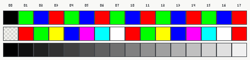

# Color inks and raster patterns in the MIT CADR software

## Conclusion

The literal `COLOR:COLOR-INKS` object preserved in the CADR source is **not** a
collection of icons, named paints, textured brushes, or fixed RGB colors. It is an
older implementation cache containing sixteen solid `BITBLT` source tiles. Tile
number *n* consists entirely of the four-bit pixel value *n*. A separate, mutable
hardware color map determines what RGB color that number displays at any moment.

The distinction is historically important:

- `LMIO; COLOR 69`, dated 1 June 1980 in the recovered tape inventory, contains the
  sixteen-array `COLOR-INKS` implementation.
- the package declarations for System 46 select `LMWIN; COLOR QFASL`, whose surviving
  source had already replaced those arrays with one reusable solid-fill array;
- every preserved LM-3 `WINDOW; COLOR` revision likewise omits the ink name, while
  retaining the same four-bit indexed-color model; and
- actual patterned fills are separate one-bit objects named `50%-GRAY`, `25%-GRAY`,
  `75%-GRAY`, `33%-GRAY`, and `HES-GRAY`.

The public corpus therefore proves that `COLOR-INKS` existed in a legacy CADR source
file. It does **not** prove that the object was resident in a particular System 46
world or that users selected it from a palette interface.

This page uses *ink* only in that exact source-code sense. CADR cursor pictures,
switches, and other icon-like graphics are largely stored as font glyphs and are
covered by the [font usage audit](font-usage-audit.md).

## What one ink contains

[`MAKE-INK-ARRAYS`](https://github.com/mietek/mit-cadr-system-software/blob/8e978d7d1704096a63edd4386a3b8326a2e584af/src/lmio/color.69#L486-L497)
allocates an `ART-Q` vector of octal `20`, or sixteen, entries. Each entry is an 8 by
8 `ART-4B` array, and all 64 elements of entry *n* are assigned *n*. The
[Lisp Machine Manual's array table](https://github.com/mietek/mit-cadr-system-software/blob/8e978d7d1704096a63edd4386a3b8326a2e584af/src/lmman/fd_arr.80#L69-L95)
defines `ART-4B` as retaining the low four bits of each element. The raw pixel payload
is consequently 32 bytes per tile and 512 bytes for all sixteen, excluding Lisp array
headers and the outer vector.

The tile is deliberately larger than a single pixel because
[`BITBLT` can replicate a small source array](https://github.com/mietek/mit-cadr-system-software/blob/8e978d7d1704096a63edd4386a3b8326a2e584af/src/lmman/tv.76#L912-L949)
across a larger destination. With the default `TV-ALU-SETA` operation, the source
value replaces the destination value. Other ALU operations can combine the source
and destination bits; those operations are raster arithmetic, not additional inks.

The complete legacy path is:

```text
COLOR-INKS[color]  ->  uniform 8 x 8 array of that index
                    ->  BITBLT replicates the array over a rectangle
                    ->  destination pixels contain the four-bit index
                    ->  hardware color map translates the index to R, G, B
```

The color screen declared by the same file is 576 by 454 pixels with four bits per
pixel and a software mirror of sixteen three-channel color-map entries. Its
[`WRITE-COLOR-MAP`](https://github.com/mietek/mit-cadr-system-software/blob/8e978d7d1704096a63edd4386a3b8326a2e584af/src/lmio/color.69#L85-L127)
path accepts eight-bit red, green, and blue components. Rewriting a map entry changes
the appearance of every screen pixel holding that index without changing those
pixels.

## What the indexes look like

There is no permanent answer such as “ink 1 is red.” The old `SETUP` routine leaves
its proposed map initialization commented out, and functions such as
`RANDOM-COLOR-MAP`, `GRAY-COLORIZE`, and `COLORATE` deliberately replace or animate
the map. Even the default drawing argument, octal `17` or decimal 15, is not
intrinsically white.

The following museum specimen reconstructs three deterministic mappings directly
from the source. Columns are labeled with the four-bit index in octal. The rows are,
from top to bottom, `R-G-B-COLOR-MAP`, `SPECTRUM-COLOR-MAP`, and
`GRAY-COLOR-MAP` with base zero. The checkered spectrum cell at index `00` means
“unchanged”: that routine writes only indexes `01` through `17`.



The exact logical assignments are:

| Mapping | Source-defined result |
| --- | --- |
| `R-G-B-COLOR-MAP` | Index `00` becomes black. Starting at `01`, green, blue, and red repeat in that order because the source indexes the `(red green blue)` list by `index mod 3`. |
| `SPECTRUM-COLOR-MAP` | `01`-`07` become red, green, yellow, blue, magenta, cyan, and white; the sequence repeats for `10`-`16`, and `17` is red. Index `00` is not written. |
| `GRAY-COLOR-MAP` with base 0 | Index *n* receives `(16n, 16n, 16n)`, from `(0,0,0)` through `(240,240,240)`. A nonzero base rotates these levels modulo 256. |

The PNG renders the requested values as idealized 8-bit RGB swatches. It is an explanatory
rendering, not a measurement or simulation of a physical CADR monitor's phosphors,
analog electronics, gamma, or calibration. The tracked
[`render-cadr-color-inks.py`](../../scripts/render-cadr-color-inks.py) script generates
it without third-party libraries.

System 303 establishes one additional version-specific fact: when its color hardware
probe succeeds and `COLOR-SCREEN` is already bound,
[`SETUP`](https://tumbleweed.nu/r/sys/file?ci=4df393c68d7f083ce42d5c377039d26043cc18a9&ln=285-325&name=window%2Fcolor.lisp.70)
calls `R-G-B-COLOR-MAP`, clears the color framebuffer, and adds a **Color Window**
entry to the system menu. That menu entry creates a window on the separate color
screen; it is not an ink chooser.

## Where `COLOR-INKS` was used

An exact-token search of the pinned System 46 source tree found a very narrow static
call path:

| Code | Established use |
| --- | --- |
| `MAKE-INK-ARRAYS` | Constructs the sixteen tiles during the legacy file's initialization. No other source call was found. |
| `COLOR-INKS` | Read only by `COLOR-BITBLT`; no application reads an individual entry directly. |
| `COLOR-BITBLT` | Selects one tile and replicates it over the requested rectangle. Its only source callers are the horizontal and vertical cases of the adjacent line routine. |
| `COLOR-DRAW-LINE` | Uses `COLOR-BITBLT` for axis-aligned lines. No caller elsewhere in the non-binary public System 46 tree was found. |

The legacy diagonal-line branches instead write the numeric index into individual
pixels. They also ignore the supplied ALU argument, unlike the horizontal and
vertical branches. This is a source-observed inconsistency, not a claimed intentional
design.

There is consequently no evidence that `COLOR-INKS` was a user-facing palette or a
general application convention. It was a small implementation technique inside one
preserved revision of the color graphics library.

## Replacement in System 46 and LM-3

System 46's package declaration points to `AI: LMWIN; COLOR QFASL`, not the older
`LMIO; COLOR`. Surviving `LMWIN; COLOR` versions 32 and 33 contain no `INK` symbol.
They allocate one 8 by 1 `ART-4B` `BITBLT-ARRAY`, refill it with the requested index,
and reuse it for each operation. The framebuffer and mutable color-map semantics stay
the same while fifteen redundant cached arrays disappear.

The LM-3 Fossil tree preserves this progression rather than reviving the old cache:

| Source generation | Solid-fill implementation |
| --- | --- |
| System 46 `LMIO; COLOR 69` | Sixteen cached 8 by 8 arrays in `COLOR-INKS`. |
| System 46 `LMWIN; COLOR 33` | One refillable 8 by 1 `BITBLT-ARRAY`; no ink identifier. |
| LM-3 `WINDOW; COLOR 65` | Retains the single array, adds `RECTANGLE`, and marks `COLOR-BITBLT` obsolete in favor of it. |
| LM-3 `WINDOW; COLOR 66` | Axis-aligned lines call `RECTANGLE`; diagonal lines now apply the requested ALU with `BOOLE`. |
| LM-3 System 303 `WINDOW; COLOR 70` | Retains the version-66 design and exports `COLOR-BITBLT` only as obsolete compatibility. |

The later APIs have real descendant call sites. An older
[`CAFE` revision](https://tumbleweed.nu/r/sys/file?ci=4df393c68d7f083ce42d5c377039d26043cc18a9&ln=19-30&name=demo%2Fcafe.lisp.8)
calls `COLOR-BITBLT`; its
[next preserved revision](https://tumbleweed.nu/r/sys/file?ci=4df393c68d7f083ce42d5c377039d26043cc18a9&ln=19-30&name=demo%2Fcafe.lisp.9)
substitutes `COLOR:RECTANGLE`. Current System 303
[FED code](https://tumbleweed.nu/r/sys/file?ci=4df393c68d7f083ce42d5c377039d26043cc18a9&ln=3075-3089&name=window%2Ffed.lisp)
uses `COLOR-DRAW-LINE` for character-box geometry. These establish continued use of
the *solid indexed-color operation*, not continued use of the sixteen-array
`COLOR-INKS` object.

One preservation warning remains open in `CAFE`: revision 9 changes only the function
name while still passing endpoint coordinates, but `RECTANGLE` expects width and
height. Static inspection therefore does not establish that the edit preserved the
old geometry.

## Named gray patterns are different objects

The window system does contain named repeated surface patterns, but it calls them
*grays* or *stipples*, never inks. `MAKE-GRAY` builds one-bit periodic arrays. In the
following source-faithful sketches, `#` is a set bit and `.` is a clear bit:

```text
50%-GRAY   25%-GRAY   75%-GRAY   33%-GRAY   HES-GRAY
.#         #...       .###       #..        #...
#.         ..#.       ##.#       .#.        ....
           .#..       #.##       ..#        ..#.
           ...#       ###.                  ....
```

`HES-GRAY` is a sparse 2-of-16 pattern, or 12.5 percent set pixels. The inspected
System 46 source does not expand `HES`, so its name should remain unexplained. System
303 additionally binds the clearer name `12%-GRAY` to the same pattern while
retaining `HES-GRAY`.

Verified uses in the System 46 source are:

- `HES-GRAY` is the default pattern for both grayed-deexposed-window mixins and is
  repeatedly `BITBLT`ed over the relevant window rectangle.
- `25%-GRAY` marks an empty text-scroll window until its first item is inserted.
- no executable call site was found for `50%-GRAY`, `75%-GRAY`, or `33%-GRAY` beyond
  their definitions.

These patterns operate on the ordinary one-bit window system and combine with the
destination through a raster ALU. Their alternating pixels create an optical gray on
a monochrome display. They are neither entries in the four-bit color map nor members
of `COLOR-INKS`.

## Preservation and emulation

No standalone ink asset exists to extract. Both the legacy solid tiles and the named
gray masks are generated from Lisp source at load time. Preserving the source and its
array semantics is therefore more faithful than exporting sixteen apparently colored
bitmap files whose RGB values would imply a permanence the system did not have.

The current LM-3 `usim` color-TV implementation follows the same indirection: it
stores four-bit framebuffer pixels separately from a color-map array, then looks up
each pixel while rendering. Its SDL build
[exposes the optional color TV with `-a`](https://tumbleweed.nu/r/usim/file?ci=330d8248ec2e12af071e287920e681600f75df9f&ln=145-218&name=usim.c).
That makes the source-defined map routines observable today, while still not turning
the legacy `COLOR-INKS` cache into a required runtime object.

## Preservation record

System 46 observations use the public
[`mietek/mit-cadr-system-software`](https://github.com/mietek/mit-cadr-system-software/tree/8e978d7d1704096a63edd4386a3b8326a2e584af/src)
snapshot at Git commit `8e978d7d1704096a63edd4386a3b8326a2e584af`:

| File | Size | SHA-256 |
| --- | ---: | --- |
| `src/lmio/color.69` | 20,844 bytes | `7cb1cab3b96a031dc9ba83765b8b5cc285cc9e1e8a528ca828f8680cdb813cc2` |
| `src/lmwin/color.33` | 27,200 bytes | `d9d12f0cb03a1d24b2d35fe80aa9ac20846cfb701b07ab04360606ab80fa782e` |
| `src/lmwin/color.qfasl` | 24,416 bytes | `5ca940ec55dfa2ac03c04b6a9458c054e63363beced30fcb16ff574292238294` |
| `src/lmwin/scrman.144` | 30,539 bytes | `15c29e616fa464a45327f51c8ae63fd4740e29ddf92486c0715aae709d5b9878` |

The inventory records `LMIO; COLOR 69` at 1 June 1980 03:25:04. System 46's
[release announcement](https://github.com/mietek/mit-cadr-system-software/blob/8e978d7d1704096a63edd4386a3b8326a2e584af/src/lmdoc/bug.lispm#L568-L573)
is dated 7 October 1980, but the inspected corpus does not establish the exact date
on which the cached arrays were replaced.

LM-3 observations use the `sys` Fossil repository's maintained
[`system-303` check-in](https://tumbleweed.nu/r/sys/info/4df393c68d7f083ce42d5c377039d26043cc18a9),
`4df393c68d7f083ce42d5c377039d26043cc18a9`. The current `window/color.lisp.70`
artifact is
[`7c3be6f919d0c63138bd6128ee8620c127d30735e3be98ec12bd3d7a70193c1f`](https://tumbleweed.nu/r/sys/artifact/7c3be6f919d0c63138bd6128ee8620c127d30735e3be98ec12bd3d7a70193c1f),
32,431 bytes, with SHA-256
`38e577c94d4ff73e92a48d8368aecb5298f33112bb57421e579168a97b674d62`.
System 303 is a restoration branch; its 2025 Fossil check-in date is not the creation
date of the historical Lisp code.

The generated specimen `docs/assets/mit-cadr-color-inks/palettes.png` is 1,248 bytes
with SHA-256
`006a8cba86d252ab449e146a8b96ad75c58714e47f088b80e0bac2c8eefce404`.
That exact compressed byte stream was reproduced with CPython 3.14.6 and zlib 1.3.2.
The script fixes the pixels and layout, but a different zlib version may encode the
same image into different PNG bytes; use `--check` as a byte-level test of the current
toolchain.
Regenerate or verify it with:

```sh
python3 scripts/render-cadr-color-inks.py
python3 scripts/render-cadr-color-inks.py --check
```

## Open questions

- Was `COLOR-INKS` resident in any preserved pre-System-46 load band, or was the
  source already superseded before compilation into a distributed world?
- What physical color monitor, phosphors, and calibration correspond to the 1980
  program's nominal eight-bit RGB values?
- What did `HES` mean in the sparse gray-pattern name?
- Does `CAFE` revision 9 display incorrect geometry because of its argument-shape
  migration from `COLOR-BITBLT` to `RECTANGLE`?

## Sources

- MIT CADR legacy color source,
  [`LMIO; COLOR 69`](https://github.com/mietek/mit-cadr-system-software/blob/8e978d7d1704096a63edd4386a3b8326a2e584af/src/lmio/color.69#L218-L497),
  with its date in the
  [recovered media inventory](https://github.com/mietek/mit-cadr-system-software/blob/8e978d7d1704096a63edd4386a3b8326a2e584af/src/moon/wall.3#L407-L412).
- MIT CADR System 46 package declaration,
  [`PKGDCL 230`](https://github.com/mietek/mit-cadr-system-software/blob/8e978d7d1704096a63edd4386a3b8326a2e584af/src/lispm/pkgdcl.230#L147-L149),
  and active window-system color source,
  [`LMWIN; COLOR 33`](https://github.com/mietek/mit-cadr-system-software/blob/8e978d7d1704096a63edd4386a3b8326a2e584af/src/lmwin/color.33#L239-L533).
- Lisp Machine Manual,
  [`ART-4B` array representation](https://github.com/mietek/mit-cadr-system-software/blob/8e978d7d1704096a63edd4386a3b8326a2e584af/src/lmman/fd_arr.80#L69-L95)
  and
  [`BITBLT` ALU behavior](https://github.com/mietek/mit-cadr-system-software/blob/8e978d7d1704096a63edd4386a3b8326a2e584af/src/lmman/tv.76#L782-L812)
  and
  [source replication](https://github.com/mietek/mit-cadr-system-software/blob/8e978d7d1704096a63edd4386a3b8326a2e584af/src/lmman/tv.76#L912-L949).
- MIT CADR window-system grays,
  [`LMWIN; SCRMAN 144`](https://github.com/mietek/mit-cadr-system-software/blob/8e978d7d1704096a63edd4386a3b8326a2e584af/src/lmwin/scrman.144#L348-L448),
  and empty-scroll-window use,
  [`LMWIN; TSCROL 41`](https://github.com/mietek/mit-cadr-system-software/blob/8e978d7d1704096a63edd4386a3b8326a2e584af/src/lmwin/tscrol.41#L354-L367).
- LM-3 System 303,
  [`WINDOW; COLOR 70`](https://tumbleweed.nu/r/sys/file?ci=4df393c68d7f083ce42d5c377039d26043cc18a9&ln=285-575&name=window%2Fcolor.lisp.70),
  [`CAFE` migration](https://tumbleweed.nu/r/sys/file?ci=4df393c68d7f083ce42d5c377039d26043cc18a9&ln=19-30&name=demo%2Fcafe.lisp.9),
  and
  [FED line drawing](https://tumbleweed.nu/r/sys/file?ci=4df393c68d7f083ce42d5c377039d26043cc18a9&ln=3075-3089&name=window%2Ffed.lisp).
- LM-3 `usim` color display at check-in
  [`330d8248ec2e12af071e287920e681600f75df9f`](https://tumbleweed.nu/r/usim/info/330d8248ec2e12af071e287920e681600f75df9f),
  especially
  [`colortv.c`](https://tumbleweed.nu/r/usim/file?ci=330d8248ec2e12af071e287920e681600f75df9f&ln=14-27&name=colortv.c)
  and
  [`sdl3-video.c`](https://tumbleweed.nu/r/usim/file?ci=330d8248ec2e12af071e287920e681600f75df9f&ln=540-557&name=sdl3-video.c).

Last verified: 2026-07-17.
