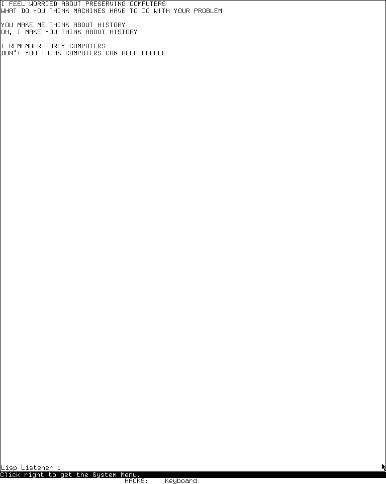

# DOCTOR, the ELIZA-style conversational program on MIT CADR and LM-3

`DOCTOR` is a small ELIZA-style conversational demonstration, not a diagnostic
expert system and not medical software. It turns an input line into symbols,
selects keyword-associated decomposition rules, and rotates through scripted
reassemblies that often reflect the user's words back as questions. `DOCTOR` is
the engine; `DOCSCR` is executable Lisp that installs its vocabulary and rules
on symbol property lists. Treating `DOCSCR` as a separate application would
therefore split one program across its code and knowledge payload.

The inspected Genera catalog has no exact counterpart. This page documents the
public MIT CADR and maintained LM-3 line only; it does not infer that similarly
named Symbolics diagnostic or support facilities are descendants of this
program.

The script contains profanity, sexual references, and dated language about
mental health and sexuality. Those are historical properties of the rule set,
not medically valid classifications. This article inventories their mechanics
without reproducing the response corpus.

## Evidence boundary

The evidence has three different dates and must not be collapsed into one
release:

- Joseph Weizenbaum's 1966 ELIZA paper establishes the earlier engine/script
  architecture and the historical DOCTOR script context. It does not specify
  this Lisp Machine implementation.
- The public System 46 snapshot contains `LMDOC; DOCTOR 5`, inventoried as 14
  February 1977. It preserves an older engine but not the corresponding rule
  script in this snapshot.
- The LM-3 System 303 Fossil tree is a maintained restoration branch. Its
  `system-303` check-in preserves a later engine and `DOCSCR` together; the
  restoration check-in date is not the historical creation date of the code.

The exact artifacts inspected were:

| Layer | File and role | Bytes | SHA-256 |
| --- | --- | ---: | --- |
| System 46 Git snapshot | `src/lmdoc/doctor.5`, older engine and private line reader | 7,088 | `538799a09abeaecf9b84e093017ec23b492a8aa5ff2da0652d493098450e6d72` |
| LM-3 historical copy | `doc/doctor.text.5`, repaired text copy of the older engine | 7,088 | `2a6691de2b640cdb8823de5b662d4cbb7959982ab7540c9c14f7615ff2f4a7f9` |
| LM-3 System 303 | `demo/doctor.lisp.14`, maintained engine | 6,525 | `8690bcba90b721f49b20295eeae94b5018e7d1b53c616a4c3b96037156cf15fa` |
| LM-3 System 303 | `demo/docscr.lisp.6`, rule script | 18,705 | `1d899b060ebe0111f7f799b47c7952982b83c3e87eb97a9daef2477eb08bb7d2` |
| LM-3 System 303 | `sys/sysdcl.lisp.200`, `HACKS` system definition | 25,396 | `2999f1824666171d729dae611a09204ac0bd42373f30d7d22c733f904c27a6dd` |
| LM-3 restoration record | `patch/cwarns-hacks.lisp.1`, saved compiler warnings | 4,617 | `c8382d3f48f8f8af31de31665a345816957d33f1fd51857683869b6169b0fde7` |

The System 46 repository is pinned at Git commit
`8e978d7d1704096a63edd4386a3b8326a2e584af`. The LM-3 source is pinned at
Fossil check-in
`4df393c68d7f083ce42d5c377039d26043cc18a9031ace28258dc97f4137eb91`,
tagged `system-303`.

The two 7,088-byte historical files are not byte-identical. The System 46
artifact has four non-ASCII bytes near the final reminder to load the script;
the LM-3 copy replaces those bytes so the phrase reads `you expect`. This is a
local byte comparison, not evidence that the repaired copy was the exact file
run in 1977.

A bounded search of the System 46 manual tree and the LM-3 documentation tree
found no dedicated DOCTOR user manual. `doctor.text.5` is Lisp source despite
its location and extension, not an operator guide. The controls and detailed
behavior below consequently come from code and the runtime probe, while the
Weizenbaum paper supplies historical context only.

## Lineage

Weizenbaum described ELIZA as a language-analysis framework whose behavior was
largely determined by a replaceable script. The best-known script adopted a
Rogerian conversational pose and was called DOCTOR. The CADR program preserves
that division unusually plainly: `doctor.lisp` implements matching and
reassembly, while `docscr.lisp` consists almost entirely of declarations that
populate the engine's properties.

The maintained source headers identify the immediate inputs more narrowly:

- the engine came from a Multics pathname ending in
  `doctor::doctor.lisp`;
- the script came from a Multics pathname ending in
  `doctor::doctor.script`;
- comments credit `DLW` with removing obarray/readtable machinery, improving
  input, and later removing script readtable hacks;
- the source path contains the initials `bsg`, and the script comment calls
  some removed code “BSG hacks.”

Neither inspected source expands `DLW` or `BSG`, so this page does not guess at
the names. The headers establish a Multics-to-Lisp-Machine source path, but not
byte identity with Weizenbaum's original implementation or sole authorship of
the intervening versions. The script header dates its readtable cleanup to 18
December 1980; that internal historical note must likewise be distinguished
from the later Fossil restoration check-in date.

The System 46 artifact uses older storage, character, readtable, and evaluator
idioms. The maintained LM-3 sequence `.9` through `.14` then records several
restoration changes: constants for break characters, replacement of an
undefined `QUIT` call, Zetalisp readtable/package modernization, removal of a
temporary debug print, and final syntax cleanup. These revisions preserve the
algorithm while changing some observable edge behavior.

## Program boundary and entry

The System 303 system declaration places both files in package `HACKS`, under
the logical pathname default `SYS:DEMO;`. Its `MAIN` module loads `DOCTOR`
before `DOCSCR`. This order matters: the engine can be defined without a useful
script, but the script is just property installation and does not provide a
second top level.

Once the `HACKS` system or the two files are loaded, the callable entry is:

```lisp
(HACKS:DOCTOR)
```

There is no `DEFDEMO` registration for DOCTOR in the pinned tree, no Dynamic
Windows frame, no System Menu entry, no Select key, no command table, and no
mouse command. It runs synchronously in the invoking stream, normally a
[Lisp Listener](lisp-listener.md), prints the one-time prompt `Tell me about
your problem.`, and then repeatedly reads and answers lines.

This absence of a window wrapper is a user-interface fact, not evidence that
the program is incomplete. It is one of the callable programs collected by the
large `HACKS` system rather than one of its registered visual demonstrations.

## How the engine works

The maintained execution path can be summarized as:

```text
input line
  -> uppercase, split, intern, and translate words
  -> build a keyword stack from PRIORITY properties
  -> try keyword RULES and decomposition patterns
  -> rotate to a reassembly or redirect to another rule set
  -> substitute captured spans, print, and optionally remember
  -> alternate stored memory with a generic fallback when no keyword wins
```

### Reading, translation, and keyword selection

`READIN` obtains one string from standard `READLINE`, converts it to uppercase,
and explodes it into characters. Space, tab, newline, and a small punctuation
set delimit words. Each word is interned in the `HACKS` package. A
`TRANSLATION` property can replace it in the sentence, principally to reverse
first- and second-person forms or normalize variants.

Keyword selection is property-driven. A word with a `PRIORITY` property is
added to `KEYSTACK`. A newly encountered keyword moves to the front only when
its priority exceeds the current first entry; otherwise it is appended. The
result always exposes the highest priority seen so far, but the remaining
entries retain encounter effects rather than becoming a fully sorted list.
When one keyword cannot produce a response, `NEWKEY` discards it and tries the
next.

The script's file mode is base 8. An undotted priority such as `62` is
therefore octal, while a trailing dot makes values such as `48.` decimal. The
case-folded static audit found priorities from decimal 0 through 55. Profanity
rules occupy the maximum class; computer vocabulary is decimal 50; the added
chicken, Multics, and Lisp families are decimal 48. These priorities are
dispatch precedence, not confidence scores or medical weights.

### Decomposition and capture

Each rule set contains ordered decomposition/reassembly groups. `TEST` matches
one decomposition against the translated sentence and stores each matched
piece in the global `SPARGS` array. Its source dimension is octal `20`, or 16
elements in decimal:

| Pattern element | Meaning in the engine |
| --- | --- |
| atom | match exactly one equal symbol |
| list with a non-`NIL` first element | match one symbol from the alternatives in that list |
| `(NIL property)` | match one symbol carrying that property, such as `BELIEF` or `FAMILY` |
| positive number | capture exactly that many input symbols |
| zero | capture a variable-length span, stopping where the following pattern can match |

Reassembly is also list based. A numeric element refers to the corresponding
capture slot and splices that word sequence into the response. A response can
therefore appear to understand a phrase while doing only symbolic matching and
substitution. The matcher starts at slot 1, leaving slot 0 unused, so the
allocation permits at most 15 captured elements before an array-bound failure.
The largest decomposition in the inspected script has eight elements. The
engine itself has no explicit bounds check for a replacement script with too
many elements.

### Response rotation, redirects, and memory

The response selector is deterministic. `ADVANCE` destructively rotates the
chosen reassembly list, so repeated matches cycle through its alternatives; no
random-number function appears in either file. Rule state therefore survives
between input lines and, because it is stored on package symbols, between
separate calls to `DOCTOR` in the same world.

An atomic response can redirect to another named rule set. `NEWKEY` tries the
next keyword. A `PRE` form reconstructs an intermediate sentence and sends it
to another rule set. An `EVAL` form prints an optional reassembly and evaluates
trusted Lisp embedded in the script.

`MEMR` properties provide a second state mechanism. After an ordinary answer,
`MEMORY` may construct a response from the current sentence and append it to a
special fallback rule. A flip-flop alternates this remembered material with
the generic last-resort responses. This is delayed template reuse, not a
semantic patient model: there is no database of diagnoses, truth maintenance,
probability, or inference over clinical facts.

## What `DOCSCR` represents

`DOCSCR` is not serialized data, a database image, or a compiled snapshot. It
is an executable Lisp source file containing 185 top-level `DEFPROP` forms
plus one comment form. Loading it mutates properties of interned `HACKS`
symbols.

An inert, non-evaluating parse of the exact 18,705-byte file produced this
inventory. The parser honored parentheses, semicolon comments, slash-escaped
characters, and the file's case-folded symbol semantics before classifying the
four arguments of each `DEFPROP` form.

| Property | Definitions | Role |
| --- | ---: | --- |
| `PRIORITY` | 71 | keyword precedence; 70 case-folded names because `Multics` and `multics` occur separately in the text |
| `RULES` | 73 | 42 full rule sets and 31 one-symbol rule values; 30 are written as redirects and one is the `ZAP` sentinel; there are 72 case-folded target names |
| `TRANSLATION` | 23 | person reversal, contractions, plurals, and synonym normalization |
| `BELIEF` | 5 | semantic class on `feel`, `think`, `believe`, `wish`, and `bet` |
| `FAMILY` | 10 | semantic class on family terms and normalized variants |
| `MEMR` | 3 | delayed-memory rules attached to `MY`, `PROBLEM`, and `PROBLEMS` |

The 42 full rule sets contain 93 decomposition patterns and 313 response
alternatives. Their patterns use 147 variable-length zero captures and six
exact-one captures; the three memory patterns add five and one respectively.
The memory rules have 11 response alternatives. Source-level control responses
are also countable: 25 `NEWKEY` redirects, 14 `HOW` redirects, six `PRE`
forms, one `EVAL` form, and smaller redirect families for `DREAM`, `YOU`,
`DIT`, `XXYYZZ`, `WHAT`, `WAS`, and `COMPUTER`. The matcher invokes
`BELIEF` twice and `FAMILY` once.

These are declaration-corpus counts, not a claim that every declaration
survives as a distinct live property. A later `DEFPROP` for the same symbol and
property replaces the earlier value; the case-folding question around the two
Multics spellings is the material example in this file.

The subject matter spans apologies, recollection, dreams, uncertainty,
machines, family, self-description, comparisons, causation, quantifiers, and
several joke or site-specific additions. A vocabulary list should not be read
as an ontology. Most symbols merely lead to hand-written conversational
templates, and many aliases share the same list.

## Complete user-visible controls

DOCTOR defines no application keymap. Its complete application-owned control
surface consists of its Lisp entry point, ordinary submitted lines, and one
script token. Everything else is inherited from the invoking stream or the
global window system.

| Input or action | Scope | Effect and evidence |
| --- | --- | --- |
| evaluate `(HACKS:DOCTOR)` | DOCTOR | enter the read/analyze/answer loop after engine and script are loaded |
| type ordinary text | DOCTOR | tokenize and analyze the submitted line; printable characters have no immediate command meaning |
| `Return` | inherited `READLINE` | submit the current line through the standard Listener input editor |
| submit an empty line | DOCTOR | ignore it and read another line |
| enter the token `10-4` | `DOCSCR` | select the special `ZAP` rule; the 1977 engine calls `QUIT`, while the maintained `.14` engine was observed to emit no response and continue reading rather than exit |
| submit a line translating to `YOU WANT ... LISP` | `DOCSCR` | select the script's sole `EVAL` response, print its fixed text, and execute the stored `(BREAK DOCTOR)` form |
| `Abort` or `Control-Z` | global Listener/window system | abort the running computation back toward the Listener command level; not a DOCTOR binding |
| `Break` | global Listener/window system | enter a Lisp break loop; additionally, the script's special Lisp response deliberately calls `BREAK` |
| `Help`, `System`, `Terminal`, and right-click System Menu | global input/window system | retain their ordinary meanings; DOCTOR installs no help page, prefix, menu item, or mouse gesture |

While the maintained program waits in `READLINE`, the complete System 303
rubout-handler bindings remain available: numeric arguments; character, word,
line, and Lisp-form movement; mark and region operations; deletion,
transposition, quoting, redisplay, input and kill histories, completion, and
context help. They are enumerated, including every key, in the
[Lisp Listener's input-editor tables](lisp-listener.md#buffered-listener-input-editor).
Duplicating those bindings as “Doctor commands” would give the wrong ownership
and imply an application keymap that does not exist.

### Historical private line reader

The 1977 `doctor.5` engine predates that maintained interface and defines a
private array-backed line reader around `KBD-TYI`. Its numeric dispatch is
exhaustive in the file:

| Source character code | Implemented effect |
| --- | --- |
| `202` | print `QUIT`, clear the accumulated line, and continue reading |
| `203` | enter a `BREAK` labelled `CALL`, then clear the line |
| `207` | remove the previous character and erase its displayed cell; do nothing at the start of the line |
| `215` | print a newline and return the accumulated line |
| any other code at least `200` | ignore it |
| a lower code | echo it and append it to the line |

These are un-dotted numeric reader literals from the old source, not modern
host keysyms. The inspected material does not establish their physical
keyboard labels, so this page does not rename them as particular keys. The
maintained `.14` engine removes this reader and calls standard `READLINE`.

## Workflows and observable behavior

### Starting and conversing

1. Load the `HACKS` system, or load `DOCTOR` followed by `DOCSCR` into package
   `HACKS`.
2. Evaluate `(HACKS:DOCTOR)` in a Listener or another interactive stream.
3. After the initial prompt, type a line and press `Return`.
4. Continue entering lines. The prompt is not repeated; responses are separated
   by blank lines.
5. Use the enclosing Listener's abort facility to leave reliably.

No file is opened by the conversation engine, and no graphical asset or font
is loaded. Loading the source itself may require the site's configured file
host, as the runtime probe demonstrated.

### Why repeated answers change

Response change is not evidence of learning or randomness. Matching the same
rule advances its shared reassembly cursor. Some accepted inputs also append a
reconstructed phrase to the memory fallback. Restarting the function without
reloading the rule properties does not reset either mechanism. A controlled
comparison must therefore record whether the files or world were freshly
loaded, not merely whether the prompt was re-entered.

### Script development

The script is intentionally replaceable in the ELIZA tradition, but there is
no in-program rule editor. A Lisp developer edits or evaluates `DEFPROP` forms,
then exercises the engine again. Reloading declarations overwrites named
properties but does not generally undo unrelated symbols or state left by a
different script. A preservation test should use a disposable world or record
the pre-load property state.

## Security, persistence, and side effects

This program predates modern isolation expectations.

- Every input word is interned in package `HACKS`. Arbitrarily varied input can
  grow the package and world even when no response remembers the text.
- Loading `DOCSCR` installs properties on many symbols. Response rotation then
  mutates those rule lists, and the memory path appends reconstructed material
  to a global fallback list.
- The one `EVAL` response is trusted script code. In the inspected script it
  prints a fixed phrase and calls `(BREAK DOCTOR)`; it does not evaluate the
  user's line as Lisp. A modified script can execute arbitrary Lisp with the
  process's authority.
- The engine supplies no privacy, authentication, medical safeguards, or data
  classification. The surrounding Listener may retain submitted input in its
  history, and a later world save could persist interned symbols and mutated
  rule state.
- The engine itself performs no network access and writes no files. Its normal
  `SYS:` source-loading path can nevertheless involve a network file host.

No raster font, vector font, icon, picture, sound, or other standalone asset is
embedded in either source file. The only visible output is text rendered by the
invoking stream's existing fonts.

## Source-visible discrepancies and defects

Several details would be missed by reading only a general ELIZA description:

1. **The exit token regressed.** `DOCSCR` maps `10-4` to `ZAP`. The 1977 engine
   handles `ZAP` by calling `QUIT`. In maintained revision `.11`, that call was
   replaced by `(RETURN-FROM ANALYZE T)`. The outer `DOCTOR` loop immediately
   reads another line. The live `.14` probe confirmed the static prediction:
   `10-4` produced no answer and did not return the original Listener to Lisp
   evaluation. Two following Lisp-looking lines were echoed but not evaluated;
   a second Listener was required for the next test.
2. **The saved warning is stale.** `cwarns-hacks.lisp.1` reports obsolete
   `EXPLODEC` and `MAKNAM` calls and an undefined `HACKS::QUIT`. The first two
   still apply to `.14`; the `QUIT` warning can only describe a pre-`.11`
   compile or a warning record carried forward without regeneration, because
   `.14` has no such call.
3. **A debug print briefly escaped.** Revision `.12` wrapped the exploded input
   list in `PRINT`, which would expose tokenizer state on every line. Revision
   `.13` removes it; `.14` retains the quiet path.
4. **The Multics rules may collide under case folding.** The script installs
   both `Multics` and `multics` forms, then places a full rule list and a
   one-symbol alias on those spellings. The inert case-folded audit treats them
   as one symbol, in which case the final alias can replace the full rule and
   redirect to itself. Exact live reader/package behavior and the resulting
   response path remain a runtime open question.
5. **The source says input improvement was unfinished.** The maintained header
   labels its `READIN` improvement “in progress,” consistent with the retained
   obsolete character-to-symbol pipeline and the unrestricted interning side
   effect.

These findings attach to the pinned files. They do not establish what a
different historical load band, package case mode, or locally patched script
did.

## Runtime probes: System 303-0

### Normal `SYS:` path remains unavailable

The [CADR Xvfb computer-use harness](cadr-computer-use-harness.md) was used on
18 July 2026. The aim was first to test residency, then load only the public
files through the world's normal logical path. No file service or network route
was added to make the test succeed.

| Item | Recorded value |
| --- | --- |
| Session | `doctor-d56-20260718`, generation 1; 2026-07-18 12:10:46–12:17:08 EDT; boot ID `3ee4cfb0-9636-4c5c-8661-a1b04ab7aa07` |
| Load band | `System 303-0`; runtime banner `Experimental System 303.0`, ZWEI 129.0, microcode 323 |
| Disk | base and private-start SHA-256 `bb16e46ad81decfe1efe691d36b6aa4ce3fd4ffb82474365de3520989d397cb5`; base SHA matched after stop and was unchanged |
| Public revisions | L `d1250f90044f09b6c92014a9aef65f9574e1bcbf8a7163004e53cc6dbed0f2d6`; System `4df393c68d7f083ce42d5c377039d26043cc18a9031ace28258dc97f4137eb91`; usim `330d8248ec2e12af071e287920e681600f75df9ffd854aada5f8a64c9adad64d`; usite `8f717978b458b40adf1e238aaf177f5bc54ef46881268e03b787ba57b0d30a0e`; Chaos `db2953fde68d726a605d1d1699bab6c926ef252bd4991f692bae6ee5a634764e` |
| Private source copy | copied at 12:10:43 EDT at the same System, usite, and Chaos revisions |
| Private tree hashes | System `21f5215de973aa6ccbddb817f2d64edd95ee1014c3028a9b0711ea7c741b807e`; usite `adbb720339db225e6635977a869cf3f3d50b507e614b37a976f4a6548d212a81`; Chaos `34ab197641aae909e9a224edc307020fddec263e732207a74573d51dac0daa87`; all matched copy/start state and all changed-since-copy flags were false |
| Emulator | `usim_sha256_at_start` and `usim_sha256_at_exec` both `707a77d23e28ea1c45ae0eb0145dc181fa7ba649b9defc30044d4f847ac2c5be` |
| Machine artifacts | `promh.mcr` `2c667f99f014a7130a55b255d31df02588d9396beace78abfe9325269e4ff3e6`; `promh.sym` `e9e3dd6a541511dd9541ae96b99dae19cb185d8b79fa09959f21fa52224f233d`; `ucadr.sym` `9071decf16fa8f11d7970c4662db0d6e95600fe43ec86ac41c77b37dbd7caa2a` |
| Toolchain | manifest SHA-256 `3adae999bbe420182f22adc2499fcc82449a46eaf580a362de9c0e718fa6b37d`; Guix channel `230aa373f315f247852ee07dff34146e9b480aec`; Python 3.11.14, Xorg 21.1.21, ImageMagick 6.9.13-5, xdotool 3.20211022.1 |
| Selected window | `LOCAL-CADR [running]`, XID 2097202, x=0, y=0, 768 by 963 pixels |
| Ignored run record | `run.json` SHA-256 `c584b2d4a774910d4305b10e849e972225917fc674147a281f9fb5a9a368e67d` |
| Final state | `forced_stop: false`; `state_may_be_incomplete: false`; usim and Xvfb exit status 0 |

Boot input was `7/18/26`, `N`, `7/18/2026`, `N`, and a second `N` required by
the displayed time question. The relevant ordered input was then:

```lisp
(fboundp 'hacks:doctor)
(load "SYS:DEMO;DOCTOR")
```

The first form returned `NIL`: DOCTOR was not resident in this base world. The
load request displayed a login prompt whose host default was `ED-FILE`, then
entered `CHAOS:CONNECT`; the attempted connection named `AMS-BRIDGE-1`, which
the error reported as not responding. Sending `Control-Z` returned to top level
in Lisp Listener 1. This establishes the runtime/load-band boundary and the
normal `SYS:` dependency; it does not exercise the conversation engine.

The screenshot sidecars carry the start-time emulator hash. The separately
recorded execution-time hash above is joined from `run.json`; it is not
silently attributed to those sidecars.

The ignored raw session retains three relevant 768 by 963 captures:

| Local capture | Observation | PNG SHA-256 | Pixel SHA-256 |
| --- | --- | --- | --- |
| `0006-doctor-residency.png` | `FBOUNDP` result `NIL` | `13e475d16e7105d9570ab0ee27ce4373b2e9f1a3cff268ede42868154c8bc87b` | `7587aeb684814edd48a132ce8cfe82ad1b809140baa62577669f6342a6306b2e` |
| `0007-doctor-code-loaded.png` | misleading legacy label; the image actually shows the `ED-FILE` login prompt and `Chaos Connect: 0%` | `132256d18f142158851538234ec75ebca6696d5061aa0f72e1289151c08f1e09` | `7f262cc08bce0def0f3e280ac1eac1c338434584a0d68e4f2849907d2198a13d` |
| `0008-after-abort.png` | connection error, dynamic choices, and return to Listener after `Control-Z` | `1fda4fd7133aaea3be67e31cbfb9f4ac5e71c8c122aaf6b5b58712b6ccb8c675` | `cc9896c4306e323325e12329bf771e851cce1f73a4200e1d177f44322473bfb4` |

These images remain under the ignored session tree. They do not show DOCTOR,
so publishing them beside this application dossier would add screen content
without proving the program's visible behavior.

### Successful raw FILE-bridge conversation

A second fresh session used the harness's isolated `LOCAL-BRIDGE` FILE service.
The bridge exposed the same pinned public System tree under `tree`; raw lowercase
pathname components avoided Lisp Machine pathname canonicalization:

```lisp
(load (fs:make-pathname
        :host "LOCAL-BRIDGE"
        :raw-directory '("tree" "demo")
        :raw-name "doctor"
        :raw-type "lisp"))

(load (fs:make-pathname
        :host "LOCAL-BRIDGE"
        :raw-directory '("tree" "demo")
        :raw-name "docscr"
        :raw-type "lisp"))
```

Both files reported loading into package `HACKS`. Calling `(HACKS:DOCTOR)` in
the original Listener printed the source-defined opening prompt. After clearing
only the old Listener display, the controlled exchange was:

| Researcher input | Observed response |
| --- | --- |
| `I FEEL WORRIED ABOUT PRESERVING COMPUTERS` | `WHAT DO YOU THINK MACHINES HAVE TO DO WITH YOUR PROBLEM` |
| `YOU MAKE ME THINK ABOUT HISTORY` | `OH, I MAKE YOU THINK ABOUT HISTORY` |
| `I REMEMBER EARLY COMPUTERS` | `DON'T YOU THINK COMPUTERS CAN HELP PEOPLE` |

This verifies line submission, keyword selection, pronoun/reflection rewriting,
and scripted reassembly in the maintained runtime. It does not prove every rule,
response rotation, memory fallback, or the scripted Lisp break. Submitting
`10-4` next produced a blank response and left DOCTOR reading in Listener 1.
The apparent lack of a prompt was not a return to Lisp: subsequent forms were
echoed without results, while a newly created Listener evaluated normally.



The published image is the exact 768-by-963 framebuffer from the clean
conversation state. It contains public CADR runtime output and researcher-written
input, not a source listing, manual page, licensed Genera material, or private
conversation. Its publication is covered by the
[capture-specific rights review](../screenshot-publication-rights-review.md).

| Item | Recorded value |
| --- | --- |
| Session | `hacks-doctor-d56-d57-20260718`, generation 1; 2026-07-18 12:41:02–12:55:01 EDT |
| Guest and window | Experimental System 303.0; load band `System 303-0`; microcode 323; `LOCAL-CADR [running]`, XID 2097202, 768 by 963 at `(0,0)` |
| Disk | public base and private-start SHA-256 `bb16e46ad81decfe1efe691d36b6aa4ce3fd4ffb82474365de3520989d397cb5`; public base unchanged at stop |
| Source and emulator | System check-in `4df393c68d7f083ce42d5c377039d26043cc18a9031ace28258dc97f4137eb91`; private System tree SHA-256 `21f5215de973aa6ccbddb817f2d64edd95ee1014c3028a9b0711ea7c741b807e`; emulator revision `330d8248ec2e12af071e287920e681600f75df9ffd854aada5f8a64c9adad64d`; start and execution SHA-256 `707a77d23e28ea1c45ae0eb0145dc181fa7ba649b9defc30044d4f847ac2c5be` |
| Curated exact capture | `doctor-conversation.png`, copied without transformation from raw `0015-doctor-clean-conversation.png`; 1,891 bytes; PNG SHA-256 `8b98e85838d96c5b86ff1e51d8174c963c9c81f8ea41e53161390e6856609e8e`; decoded-pixel SHA-256 `cfc6572b2e0472bc784ff35a1b6ca8defa912ed78b9a2968af886db693e84391` |
| Raw sidecar | `0015-doctor-clean-conversation.json`, 4,432 bytes; SHA-256 `8dfd8d378be7f128b826fc896d48985d0307bb5897ff60ca981ec14cfe950cde` |
| Run record | 6,940 bytes; SHA-256 `89cd8f2726471f0bde8efe411c1a142b97f96418e07f3594367d8f406e9b10a6` |
| Shutdown | Clean: `forced_stop=false`, `state_may_be_incomplete=false`, usim and Xvfb exit status 0, public base disk unchanged |

The same session loaded public `HAKDEF` and `QIX` for the separate
[HACKS suite probe](cadr-hacks-display-sound-and-novelty-suite.md#runtime-verification).
All raw captures and the private load-band copy remain under the ignored build
tree.

## Open questions

- How does live response rotation compare across a freshly reloaded script, and
  when does the memory fallback become visible in a controlled transcript?
- Does the scripted `YOU WANT ... LISP` response enter the same break loop in
  this load band that static inspection predicts?
- Does the live System 303 reader collapse `Multics` and `multics` in this file,
  and if so, does the final alias make that keyword path self-referential?
- Which people are identified by the source initials `DLW` and `BSG`, and who
  performed the original Multics-to-Lisp-Machine port?
- Where is the exact rule script paired with the inventoried 1977 System 46
  engine, and did it differ from `docscr.lisp.6` beyond readtable cleanup and
  later local jokes?
- Which physical Lisp Machine keys generated the old private reader's numeric
  codes? Source-visible effects are known, but the keyboard mapping is not.
- Was `doctor.lisp.14` ever rebuilt into a surviving HACKS load artifact after
  the stale `QUIT` warning, or is the source ahead of the available compiled
  state?

## Reproducibility and sources

The artifact sizes and hashes above can be reproduced with `wc -c` and
`sha256sum`. The structural inventory was made without loading `DOCSCR`: tokenize
the exact file while honoring semicolon comments and slash escapes, parse only
balanced lists, select four-element forms headed by `DEFPROP`, case-fold symbol
tokens, and classify the fourth element. Pattern and response totals then walk
only full `RULES` and `MEMR` property values; one-symbol `RULES` values are
aliases. This method deliberately performs no `EVAL`, interning, or property
mutation.

- Joseph Weizenbaum,
  [“ELIZA—A Computer Program For the Study of Natural Language Communication Between Man and Machine”](https://doi.org/10.1145/365153.365168),
  *Communications of the ACM* 9(1), 1966, pp. 36–45.
- Public System 46 snapshot,
  [`LMDOC; DOCTOR 5`](https://github.com/mietek/mit-cadr-system-software/blob/8e978d7d1704096a63edd4386a3b8326a2e584af/src/lmdoc/doctor.5)
  and its
  [media-inventory record](https://github.com/mietek/mit-cadr-system-software/blob/8e978d7d1704096a63edd4386a3b8326a2e584af/src/moon/wall.3#L240),
  Git commit `8e978d7d1704096a63edd4386a3b8326a2e584af`.
- LM-3 System 303,
  [`DEMO; DOCTOR LISP 14`](https://tumbleweed.nu/r/sys/file?ci=4df393c68d7f083ce42d5c377039d26043cc18a9031ace28258dc97f4137eb91&name=demo/doctor.lisp),
  [`DEMO; DOCSCR LISP 6`](https://tumbleweed.nu/r/sys/file?ci=4df393c68d7f083ce42d5c377039d26043cc18a9031ace28258dc97f4137eb91&name=demo/docscr.lisp),
  and the
  [`HACKS` system declaration](https://tumbleweed.nu/r/sys/file?ci=4df393c68d7f083ce42d5c377039d26043cc18a9031ace28258dc97f4137eb91&name=sys/sysdcl.lisp),
  Fossil check-in
  `4df393c68d7f083ce42d5c377039d26043cc18a9031ace28258dc97f4137eb91`.
- LM-3 restoration
  [`HACKS` compiler-warning record](https://tumbleweed.nu/r/sys/file?ci=4df393c68d7f083ce42d5c377039d26043cc18a9031ace28258dc97f4137eb91&name=patch/cwarns-hacks.lisp),
  used only as evidence about the saved build and its stale warning.

Last verified: 2026-07-18.
