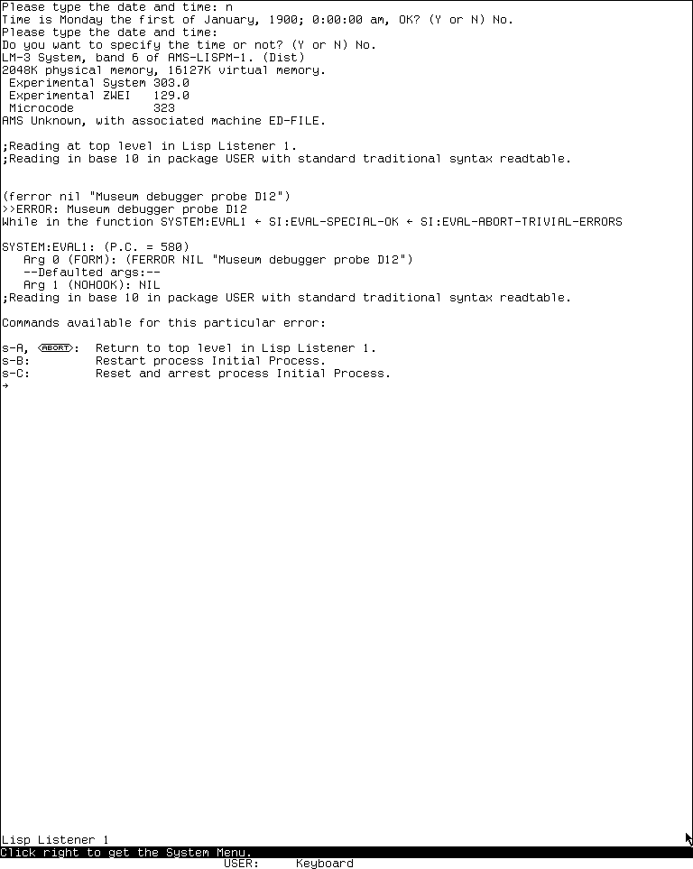
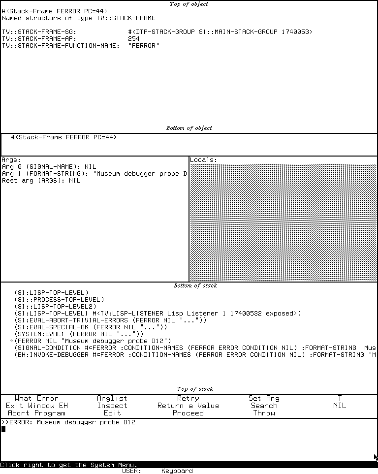

# The MIT CADR Error Handler and Window Debugger

The CADR Error Handler, conventionally called `EH`, is both the last stage of
the machine's error machinery and an interactive debugger. It translates
microcode traps and Lisp-signalled conditions into a suspended computation that
can be inspected, edited, resumed, reinvoked, returned from, or abandoned. Its
ordinary interface is a command-and-form reader on the stream where the error
occurred. Its window interface presents the same suspended stack as panes for
the backtrace, arguments, locals, code, object inspection, history, commands,
and a Lisp interactor.

This is not one release-independent program. The public System 46 snapshot has
the compact 1980 `EH` package and its first graphical debugger. The maintained
LM-3 System 303 branch retains that structure but adds condition objects,
resume handlers, dynamic proceed choices, examine-only debugging, traps,
breakpoints, single stepping, richer help, and a revised resource-managed
window debugger. The latter is a restoration branch, not evidence that every
feature existed unchanged in System 46.

The corresponding Symbolics generation is documented separately in
[The Genera Debugger and Display Debugger](../genera/debugger-and-display-debugger.md).
The degraded recovery path below Dynamic Windows is covered by
[Emergency Break and the cold-load stream](../emergency-break-and-cold-load-stream.md).

## Evidence boundary

### Public System 46

The historical source is pinned at Git revision
[`8e978d7d1704096a63edd4386a3b8326a2e584af`](https://github.com/mietek/mit-cadr-system-software/tree/8e978d7d1704096a63edd4386a3b8326a2e584af/src).
The package declaration is decisive about which duplicate source line belongs
to the release: `LISPM; PKGDCL 230` loads `LMWIN; EH`, `EHR`, `EHC`, and `EHW`
into package `EH`. This article therefore does not silently substitute the
different `LISPM2; EH` implementation found on the same recovered tapes.

| Release file | Bytes | SHA-256 | Role |
| --- | ---: | --- | --- |
| `src/lispm/pkgdcl.230` | 12,516 | `2d08a109871868990f10e1334a8b4d5199ac7c530bb50b04b93d5f552a83e1b9` | package and load declaration |
| `src/lmwin/eh.48` | 46,386 | `4a335742ccb94c9de050bc9340bbc4321d40acf067b8938b4228706de556e87b` | stack-group machinery and debugger loop |
| `src/lmwin/ehr.18` | 31,045 | `e1b927de673117e7b55919777d582bcaf3cfc0fbcf00975460fe98a45dcfc5cd` | trap reports, signalling, and recovery methods |
| `src/lmwin/ehc.36` | 29,496 | `8b7672c24a2713cbca3b9dc9704d58c92170fceeeec697734562513c5af5c4ce` | debugger commands and dispatch table |
| `src/lmwin/ehw.56` | 27,488 | `b85bc19f2a382c8c853d7ee066e664939d1ba2f066bd9f4339ff799afcfe9116` | window debugger |
| `src/lmman/errors.45` | 37,889 | `498f1e24da5c94cecd3b6b7484fb8cb18641167ce4ed175b8cf0948c812d1eb7` | contemporary manual source |

The System 46 tree is publicly MIT-licensed. No compatible System 46 load band
was run for this article, so its visible behavior is source- and manual-grounded
only.

### Maintained LM-3 System 303

The maintained source is pinned at Fossil check-in
[`4df393c68d7f083ce42d5c377039d26043cc18a9031ace28258dc97f4137eb91`](https://tumbleweed.nu/r/lm-3/info/4df393c68d7f083ce42d5c377039d26043cc18a9031ace28258dc97f4137eb91).
Its `EH` system declaration compiles `EH`, `EHF`, `TRAP`,
`CONDITION-FLAVORS`, `EHC`, `EHW`, and `EHBPT`. The source below and the
runtime load band are both labelled System 303, but the maintained checkout is
reported as a restoration artifact rather than projected backward onto the
original historical distribution.

| Maintained file | Bytes | SHA-256 | Role |
| --- | ---: | --- | --- |
| `l/sys/sys/sysdcl.lisp` | 25,396 | `2999f1824666171d729dae611a09204ac0bd42373f30d7d22c733f904c27a6dd` | `EH` system declaration |
| `l/sys/eh/eh.lisp` | 125,233 | `037216f14507392e801f5338ebe3b7230b137979b8fe5a38f392214f5016f78d` | low-level and stack-group machinery |
| `l/sys/eh/ehf.lisp` | 133,003 | `d27954cdb234d3684e34671a7c3f460ddb2ed697b63fd86c749bcda63709b05f` | condition objects, handlers, and resume handlers |
| `l/sys/eh/ehc.lisp` | 81,305 | `767f8821287fd1881cebb318d049c14620842feb9bbd04bcf999bc79356b7c92` | debugger command loop and dispatch |
| `l/sys/eh/ehw.lisp` | 32,236 | `5ee9bbdb5615059ad573f59f9ec1fc9d05606aee3c6497b45301f37ee2f42e18` | window debugger |
| `l/sys/eh/ehbpt.lisp` | 16,529 | `9ea9315bd2ced827f6bf8249916dd49b7f0873f4df4d46cf1dad5283465fc3c3` | breakpoints and stepping |
| `l/sys/man/debug.text.21` | 32,548 | `9caceb99c57f823418601671b4524ef60a194d11d4f2988010f283455ca1ee8d` | debugger manual source |
| `l/sys/man/errors.text.102` | 79,958 | `c437a08a15302caf0432024a0a31346d36be2d252d0b899ac5a671e19f35afe6` | conditions and errors manual source |

## What the subsystem does

The two releases share a recognizable control-flow skeleton:

1. Lisp code signals a condition, or microcode transfers control through an
   error-table entry.
2. A dedicated first-level error-handler stack group receives the event. It
   does only the fragile setup required to get out of the damaged computation.
3. It obtains a reusable second-level error-handler stack group. The interactive
   debugger runs there while the original stack group remains suspended.
4. The second-level handler selects an initial frame and exposes the condition,
   stack, arguments, locals, special bindings, code, and proceed mechanisms.
5. A terminal action either restores and resumes the computation, unwinds or
   reinvokes a selected frame, invokes a handler, throws to an outer command
   loop, or aborts the process.

This separation is not just conceptual. Both source lines keep pools of
second-level stack groups, save and restore the original stack-group state, and
provide cross-stack-group evaluation and function application. It is why a
debugger form can run with the selected frame's environment without executing
the debugger itself on the damaged stack.

### System 46 trap and condition path

System 46's error table maps micro-PCs to *error table entries* (ETEs). The
entry's first symbol has properties for reporting the error, optionally
signalling a Lisp condition, and optionally proceeding at a microcode restart
point. `EHR` supplies cases for wrong argument types, arithmetic over- and
underflow, divide by zero, array bounds, PDL overflow, illegal instructions,
transport traps, function-entry traps, breakpoints, and other low-level events.

Its Lisp condition layer is compact. `condition-bind` searches dynamically
established handlers; `ferror` and `cerror` describe whether an error is
proceedable or restartable; a property on the condition can customize how
Control-C proceeds. If no handler accepts the condition, the interactive
handler owns the suspended computation.

### System 303 condition objects and resume handlers

System 303 changes the center of gravity. `make-condition` constructs a flavor
instance. A condition object supplies methods for reporting itself, choosing a
current frame, entering its debugger loop, listing user proceed types, and
documenting or executing those types. `signal-condition` searches condition and
default handlers, decides whether to invoke the debugger, and then either
returns a locally offered proceed type or invokes the matching nonlocal resume
handler.

Microcode errors are converted into condition objects before interactive
debugging. The source explicitly says this keeps the debugger from needing two
separate user-interface paths for microcode and Lisp errors. Dynamic proceed
choices and resume handlers also explain why the opening list of Super commands
varies with the condition.

The function `EH` can debug a process, a window that yields a process, or a
stack group. A stack group enters *examine-only* mode: frame inspection works,
but operations that would resume or mutate execution are rejected, and Resume
only exits the examiner. This capability is documented and implemented; it is
not present in the System 46 manual's user-facing entry story.

## Entering and leaving the debugger

| Operation | System 46 | System 303 |
| --- | --- | --- |
| Unhandled error | automatic after no condition handler accepts it | automatic after no condition/default handler accepts it |
| Deliberate error | `ferror`, `cerror`, or an unbound symbol; the manual recommends the last as the practical manual entry | same mechanisms, now producing condition objects |
| Keyboard break | the System 46 manual says there is no satisfactory general entry path | Meta-Break enters the debugger while terminal input is pending; Control-Meta-Break forces immediate entry; unmodified Break enters a Lisp `break` loop |
| Programmatic entry | internal `EH` exists, but the System 46 user manual does not present a safe general workflow | `(eh process)` interrupts and debugs a process; `(eh stack-group)` examines it without executing it; `(eh)` offers waiting processes |
| Ordinary abort | Control-Z throws to top level | Abort or Control-Z returns to the prior command loop/debugger; repeated Abort walks outward; Meta-Abort is a global top-level escape |
| Proceed | Control-C or Resume, when the ETE/condition permits | Resume or Control-C selects the default dynamic proceed type; Super-letter choices select the printed proceed/restart alternatives |
| Enter graphical interface | Control-Meta-W | Control-Meta-W |
| Leave graphical interface only | no separate command; the menu's **Exit** abandons to top level | **Exit Window EH** returns to the ordinary debugger without leaving the error context |

The keyboard names are Lisp Machine character names, not assumptions about a
modern host keyboard. The runtime harness maps host X keysyms separately.

## The ordinary command-and-form interface

The prompt is an arrow. An ordinary character begins a Lisp form; Control,
Meta, and named editing characters can dispatch debugger commands. The form is
evaluated in the selected frame's environment, and the debugger prints all
returned values before prompting again. Commands that request an object also
read a form and use its value, which permits objects that have no readable
printed syntax.

System 303 retains the listener-like `+`, `*`, and `-` history but documents
which debugger bindings protect its own streams and condition machinery. It
also adds a special Control-Quote command that deliberately evaluates in the
error handler's environment rather than the selected program frame. This is a
debugger-debugging escape hatch, not the normal evaluation mode.

### Complete System 46 initial key dispatch

“Complete” here means every non-`NIL` entry in the initial dispatch table loaded
from `LMWIN; EHC 36`. It does not include condition-specific questions asked by
a command, site patches, or dynamically rebound characters.

| Key or range | Command | Effect |
| --- | --- | --- |
| `?`, Help | Help | print the debugger help text |
| Line, Control-N | Down stack | select the next less-recent calling frame |
| Form, Control-L | Clear and show | clear, reprint the error, and show the frame |
| Return, Control-P | Up stack | select the more-recent called frame |
| Resume, Control-C | Proceed | perform the error-specific recovery, if any |
| Control-0 through Control-9 | Number | numeric prefix |
| Control-A | Arglist | show current function's argument list |
| Control-B | Short backtrace | print function names |
| Control-E | Edit | visit current function in the editor |
| Control-R | Return one value | make the current frame return a requested value |
| Control-S | Search | find a frame by function-name substring |
| Control-T | Throw | request a tag and value, then throw |
| Control-Z | Top-level throw | abandon the computation to Lisp top level |
| Meta-0 through Meta-9 | Number | numeric prefix |
| Meta-`<`, Meta-`>` | Top, bottom | select the most- or least-recent frame |
| Meta-B | Full backtrace | include arguments and values |
| Meta-C | Bash and proceed | restart-oriented recovery path |
| Meta-L | Full frame | arguments, locals, and disassembly |
| Meta-N, Meta-P | Detailed down, up | move and show the full frame |
| Meta-R | Return many values | reserved but not implemented; both source and manual say so |
| Meta-S | Search and show all | search, then show the full frame |
| Meta-Z | Quit one error | pop one recursive debugger level |
| Control-Meta-0 through Control-Meta-9 | Number | numeric prefix |
| Control-Meta-A | Get argument | put numbered argument in `*` and its locative in `+` |
| Control-Meta-B | Full uncensored backtrace | include normally uninteresting interpreter frames |
| Control-Meta-C | Error restart | continue from an `error-restart` context |
| Control-Meta-F | Get function | put current function in `*` |
| Control-Meta-L | Get local | put numbered local in `*` and its locative in `+` |
| Control-Meta-N, Control-Meta-P | Uncensored motion | move through normally hidden frames |
| Control-Meta-R | Reinvoke | retry the current function with reconstructed original arguments |
| Control-Meta-U | Up to interesting | normalize selection to a non-internal frame |
| Control-Meta-W | Window error handler | enter the graphical debugger |

The manual's shorter summary omits several Control-Meta operations, but its
long-form text explains the important argument/local locatives. Meta-R is an
especially useful negative finding: the key is visibly reserved, the manual
labels it nonworking, and the source body contains only a “write this” marker.

### Complete System 303 initial key dispatch

System 303's table is substantially larger. Super-A through Super-Z are a
range, not twenty-six universal commands: the currently available proceed and
special choices are assembled for the actual condition and printed when the
debugger opens.

| Key or range | Command or family | Effect |
| --- | --- | --- |
| `?`, Help | Help | topical self-documentation |
| Line, Form, Return | next frame, redisplay, previous frame | editing-key aliases |
| Resume | Proceed | default available proceed type, or exit examine-only mode |
| Abort | Abort | return to prior command loop/debugger |
| Rubout | Rubout | debugger input editing |
| Control-minus, Control-0…9 | Number | signed numeric prefix |
| Control-A | Arglist | current function's argument list |
| Control-B | Short backtrace | function names |
| Control-C | Proceed | default proceed type |
| Control-D | Proceed with trap on call | resume, trapping at next call |
| Control-E | Edit | current function in Zmacs |
| Control-I | Macro single step | establish macro-level stepping |
| Control-L | Clear and show | error and current frame |
| Control-M | Bug report | open a report with error and backtrace |
| Control-N, Control-P | Next, previous frame | ordinary censored motion |
| Control-R | Return | return a value from selected frame |
| Control-S | Search | frame-name substring search |
| Control-T | Throw | throw a requested value to a requested tag |
| Control-X | Toggle current exit trap | toggle trap-on-exit for selected frame |
| Control-Z | Abort/top-level transfer | leave the failing computation |
| Meta-minus, Meta-0…9 | Number | signed numeric prefix |
| Meta-`<`, Meta-`>` | Top, bottom | stack endpoints |
| Meta-B | Full backtrace | detailed frames |
| Meta-D | Toggle call trap | trap on next function call |
| Meta-I | Instance variable | show a variable in the current instance |
| Meta-L | Detailed frame | args, locals, and code |
| Meta-N, Meta-P | Detailed motion | move and show full frame |
| Meta-R | Reinvoke with new args | edit the reconstructed call before retrying |
| Meta-S | Frame variable | show a named variable's frame value |
| Meta-T | Stack temporaries | display temporaries |
| Meta-X | Set all exit traps | selected frame and every outer frame |
| Control-Meta-minus, Control-Meta-0…9 | Number | signed numeric prefix |
| Control-Meta-A | Argument | put numbered argument/value locative in `*`/`+` |
| Control-Meta-B | Uncensored full backtrace | include normally hidden frames |
| Control-Meta-C | Catch frames | active catches and unwind-protects |
| Control-Meta-D | Describe `*` | deep object description |
| Control-Meta-E | Lexical environment | show closure/interpreter lexical bindings |
| Control-Meta-F | Function | put current function in `*` |
| Control-Meta-H | Frame handlers | condition and resume handlers active at frame |
| Control-Meta-L | Local | put numbered local/value locative in `*`/`+` |
| Control-Meta-N, Control-Meta-P | Uncensored motion | include hidden interpreter frames |
| Control-Meta-Q | Proceed types | describe current recovery choices |
| Control-Meta-R | Reinvoke same args | retry the selected call |
| Control-Meta-S | Frame bindings | special bindings introduced around frame |
| Control-Meta-T | Stack temporary | put numbered temporary in `*` |
| Control-Meta-U | Out to interesting | normalize to a visible frame |
| Control-Meta-V | Return value | put numbered outgoing value in `*` |
| Control-Meta-W | Window debugger | enter graphical interface |
| Control-Meta-X | Clear all exit traps | selected and outer frames |
| Control-Shift-S | Set breakpoint | insert compiled-code breakpoint |
| Control-Shift-C | Clear breakpoint | remove selected breakpoint |
| Meta-Shift-C | Clear all breakpoints | global removal |
| Control-Shift-L | List breakpoints | display active breakpoints |
| Meta-Shift-S | Macro single step | macro-level evaluator step |
| Super-A…Super-Z | Dynamic proceed/special choice | select the printed condition-specific option by position |
| Control-Quote | Evaluate in EH | evaluate in debugger's own stack group |
| Control-Meta-Delta | Describe deeply | extended description of the last object |

The topical Help dispatcher offers General, Information, Stack Frames,
Stepping, Proceeding, Transferring, and Describe-command topics. Help P
reprints the condition-specific proceed choices. Source adds this structure;
the older System 46 handler prints one fixed help body.

## Traps, breakpoints, and mutation

The debugger is not merely an observer. Both releases can change stack
arguments and locals through locatives, return from a selected frame, reinvoke a
call, throw across frames, edit source, or proceed at a low-level restart point.
System 303 additionally exposes:

- trap-on-call and trap-on-exit flags, including operations over outer frames;
- compiled-code breakpoints that retain displaced instructions;
- macro and instruction single stepping;
- inspection of catch blocks, condition/resume handlers, lexical environments,
  stack temporaries, and outgoing multiple values;
- an explicit examine-only mode that disables operations unsafe for a passive
  stack-group inspection.

These are dangerous on irreplaceable state. Museum verification uses a private
disk and a synthetic error; no argument setter, breakpoint, frame return,
reinvoke, or throw is necessary to establish the visible interfaces.

## The System 46 window error handler

Control-Meta-W transfers from the ordinary handler into one reusable
`ERROR-HANDLER-FRAME`. The frame contains a Lisp interactor, argument and local
panes, a stack pane, a command menu, an Inspector code pane, and Inspector
history. Selecting a stack-frame line changes the current frame and refreshes
the dependent panes. Values can be brought into `*`, inspected, or—through the
argument/local machinery—modified in the suspended stack.

The exact fourteen menu items are:

| Menu item | Action |
| --- | --- |
| **What Error** | reprint the error |
| **Arglist** | show the current function's argument list |
| **Retry** | reinvoke the current frame |
| **Set arg** | select and replace an argument or local |
| **T** | supply true/yes to a pending reader |
| **Quit one level** | leave one recursive error |
| **Inspect** | inspect a typed or pointed-to object |
| **Return a value** | return a requested value from current frame |
| **Search** | find a frame by name substring |
| **NIL** | supply false/no |
| **Exit** | abandon to top level |
| **Edit** | edit a selected/current function |
| **Continue** | perform the ordinary proceed action |
| **Throw** | request a tag and value, then throw |

The first line of `EHW` says the interface “should be an editor top level under
some switch.” That source-only design note helps explain the embedded Lisp
interactor and editor-like frame motion, but it does not establish that such an
editor embodiment was ever shipped.

## The System 303 window debugger

The maintained interface keeps the same overall pane design but allocates a
window resource for each invocation and marks it reusable when deactivated. It
refuses to open on the cold-load stream. Its fourteen menu items are:

| Menu item | Action and differences from System 46 |
| --- | --- |
| **What Error** | reprint the condition |
| **Arglist** | current/pointed function argument list |
| **Retry** | reinvoke selected frame |
| **Set Arg** | replace a selected argument/local |
| **T** | true/yes input |
| **Exit Window EH** | return to the ordinary debugger without abandoning the error |
| **Inspect** | inspect typed or mouse-selected object |
| **Return a Value** | return from selected frame |
| **Search** | find frame |
| **NIL** | false/no input |
| **Abort Program** | ordinary debugger Abort behavior |
| **Edit** | edit selected/current function |
| **Proceed** | left uses default proceed; right opens a menu of the condition's current proceed types |
| **Throw** | throw to requested tag |

Mouse behavior is source-explicit:

- left-clicking a stack frame selects it;
- left-clicking a generic sensitive value puts it into `*`;
- Inspector history can re-inspect an object or put it into `*`;
- the Inspector pane's right gesture transfers an object into the handler;
- argument and local values can be selected for replacement;
- margin regions jump toward the top or bottom of the stack.

The implementation preserves System 46's “editor top level” comment even though
the shipped object remains a special-purpose constrained frame.

## Source findings beyond the manuals

- System 46's package declaration resolves a real archive ambiguity: the
  release selects the four `LMWIN` files, not the concurrently preserved
  `LISPM2` error handler.
- The first-level/second-level split is visible in both implementations and is
  operational, not merely explanatory terminology. Reusable second-level stack
  groups isolate debugger work from the computation being inspected.
- System 303 converts microcode traps into ordinary condition objects before
  the UI. Its debugger consequently consumes one polymorphic error object rather
  than branching into separate microcode and Lisp interfaces.
- System 303's Super-letter choices are dynamically built from condition
  proceed types, resume handlers, and special commands. A static “Super-A means
  X” chart would be false.
- The graphical handler is another view and command loop over the same error
  stack group. It does not copy the stack into a safe data model; setters and
  control transfers affect live suspended execution.
- System 303 allocates its window from a reusable resource, while System 46
  initializes one global window. This is an implementation change that neither
  short user overview foregrounds.
- Both generations carry the unimplemented-editor-top-level design note. No
  inference is made that the proposed mode existed.

## Runtime observation: LM-3 System 303-0

The fresh `debuggers-d12-cadr-20260718` generation-1 session cold-booted the
System 303-0 load band. The three date/time answers were `n`, `n`, and `n`,
declining the default 1900 timestamp and then declining to specify another
time. Lisp Listener 1 entered package `USER` with the standard traditional
syntax readtable.

The listener evaluated the project-authored nonproceedable condition
`(ferror nil "Museum debugger probe D12")`. The ordinary handler printed the
message, initially selected `SYSTEM:EVAL1` at PC 580, showed the signal form as
argument 0 and `NIL` as the defaulted second argument, and then built three
choices for this particular error:

- Super-A, marked **Abort**, returned to top level in Lisp Listener 1;
- Super-B restarted the Initial Process; and
- Super-C reset and arrested the Initial Process.

This is direct runtime confirmation that the Super-letter meanings are
condition-specific. Entering `(+ 40 2)` at the arrow printed `42`; the next
frame display selected `FERROR` at PC 44 and showed its `SIGNAL-NAME`,
`FORMAT-STRING`, and empty rest argument. No argument or frame was changed.

*Runtime observation: this exact System 303 framebuffer records the ordinary
Error Handler before any proceed or mutation on 2026-07-18. It is published as
the minimum visual evidence for the condition-derived choices and text-oriented
debugger layout; the public software's historical interface remains subject to
its original rightsholder interests, and inclusion implies no endorsement.*

### Window-oriented handler

The harness sent host `ctrl+alt+w` through XTEST and `usim`'s configured Cadet
keyboard map. The ordinary handler echoed `c-M-W` and printed “Transfer to
window-oriented debugger!” The live graphical frame then showed:

- an Inspector view of `#<Stack-Frame FERROR PC=44>` and its stack group,
  argument pointer, and function name;
- an Inspector-history row for that same frame;
- arguments on the left and locals on the right;
- a stack pane from `SI:LISP-TOP-LEVEL` through `SIGNAL-CONDITION` and the
  condition object;
- the complete fourteen-item menu documented above; and
- a Lisp interactor retaining the synthetic error message.

A deliberately nonselecting right-button probe over **Proceed** produced no
visible menu and no claimed action in this nonproceedable `FERROR` case. A
left click on **Exit Window EH** returned to the ordinary handler, where the
same `FERROR` frame and error context remained visible. That establishes the
distinction between leaving the graphical presentation and abandoning the
error. Finally, host `ctrl+z` was rendered as `c-Z` and printed “Back to top
level in Lisp Listener 1.” No proceed, restart, reset/arrest, setter,
breakpoint, trap, frame return, reinvocation, edit, or throw was invoked.

*Runtime observation: after the Error Handler received `Control-Meta-W`, the
same suspended computation appeared in this window-oriented debugger on
2026-07-18. The capture is published to establish the pane organization and
complete visible command menu, not as a decorative reproduction; inclusion
implies no endorsement.*

### Capture selection and portable provenance

The ordinary-handler and window-handler captures above passed an image- and
use-specific review and were copied byte-for-byte into the curated CADR asset
tree. These two low-resolution functional displays are the minimum images needed
to compare the distinct interfaces beside substantial source-, manual-, and
runtime-grounded scholarship. They reveal no private data, manual pages,
artwork, or third-party media and are unlikely to substitute for the historical
software. All other captures remain ignored raw session evidence.

| State | PNG SHA-256 | Pixel SHA-256 | Sidecar SHA-256 |
| --- | --- | --- | --- |
| ordinary handler and dynamic choices; curated as `error-handler-dynamic-choices.png` | `fc8917d449d376d2cca2b498d530f9b491332fda48f9f4a2e861bba0125d53b6` | `d481adf9fceae8b2a86ed6e6a16c973daa01ef358dc6343ad1dabab1ecbbf26e` | `66745236811091897ea72386de9599fbd59d5a8c5fb6cef3879fca3334382efd` |
| side-effect-free evaluation and `FERROR` frame | `1365e03c7e46e04637baacc19911e00ecf3ce973b39532a3e495a7dd41286a1a` | `fe5adee6f72193db168655ab1679fdb6c0f5f73043d61a874e10e51203938efc` | `1900d7a04293408e548b2744646986596e45e2a4761f8869d53ce5802db87369` |
| window-oriented handler; curated as `window-error-handler.png` | `e888da9d000589c783f93d43e9dea30973eca98537aaf8691bc668402ec0da9c` | `a7c60e1dace1ca1df6826ee7f5605e3287571a292f57b19ce7b4609187ce93a5` | `1390243853a6fc4b991d57d2122b1d5a963c870842ec83efd193966492a11ae5` |
| ordinary handler after **Exit Window EH** | `85e7d4e356c36005e4398acc9dab1dff555f3e8879a0f42413d9337ea93a1675` | `a9212e0a35ced4a13e8cef99c96ce7dca6b15449c57c6a95f1b62e24527f7d11` | `5c19b50f3386004fcd744ba2737c04455d06efaaf4f484440c7daa98d740b722` |
| listener after Control-Z | `ce8fa0a2a7d2d7b61b03bd82e018717b8c01059cda712a4a63c58ead2ca0b6c1` | `e22ce9449b27b7d8866b607b39cd460839db56730cf29c5259129eb3650c28ee` | `31e39b8435138b7cf7465d30974589460c7f7effb0b62841b4781074c742c1d8` |

The exact ordered guest input after start was: `n` Return at the first date
prompt; `n` Return at its confirmation; `n` Return when asked whether to
specify another time; the `FERROR` form and Return; `(+ 40 2)` and Return;
`ctrl+alt+w`; right-button click at `(380,839)` over **Proceed**; left-button
click at `(55,823)` on **Exit Window EH**; and `ctrl+z`. Screenshots were taken
between those operations. The CADR harness version used here does not yet have
the Genera harness's linked action ledger, so this article records the ordered
sequence explicitly.

The run used display `:90`, XID 2097202, title `LOCAL-CADR [running]`, and a
768 by 963 framebuffer from 2026-07-18 05:18:45 through 05:28:10 EDT. The base
and private working disk began with SHA-256
`bb16e46ad81decfe1efe691d36b6aa4ce3fd4ffb82474365de3520989d397cb5`;
the base remained unchanged, and a direct post-stop hash of the private disk
also matched. The final run record has SHA-256
`fda24f98827655b1815eaf86f8828e4ef702438aae328b10ac64c572bc2b1997`.

Public revisions at session start were `l`
`d1250f90044f09b6c92014a9aef65f9574e1bcbf8a7163004e53cc6dbed0f2d6`,
`system`
`4df393c68d7f083ce42d5c377039d26043cc18a9031ace28258dc97f4137eb91`,
`usim`
`330d8248ec2e12af071e287920e681600f75df9ffd854aada5f8a64c9adad64d`,
`usite`
`8f717978b458b40adf1e238aaf177f5bc54ef46881268e03b787ba57b0d30a0e`,
and `chaos`
`db2953fde68d726a605d1d1699bab6c926ef252bd4991f692bae6ee5a634764e`.
The private `system`, `usite`, and `chaos` copies were made at those same
revisions and were unchanged since copy; their tree hashes were respectively
`21f5215de973aa6ccbddb817f2d64edd95ee1014c3028a9b0711ea7c741b807e`,
`adbb720339db225e6635977a869cf3f3d50b507e614b37a976f4a6548d212a81`,
and
`34ab197641aae909e9a224edc307020fddec263e732207a74573d51dac0daa87`.

`usim_sha256_at_start` and the separately checked
`usim_sha256_at_exec` both equal
`707a77d23e28ea1c45ae0eb0145dc181fa7ba649b9defc30044d4f847ac2c5be`.
The private machine-artifact hashes were `promh.mcr`
`2c667f99f014a7130a55b255d31df02588d9396beace78abfe9325269e4ff3e6`,
`promh.sym`
`e9e3dd6a541511dd9541ae96b99dae19cb185d8b79fa09959f21fa52224f233d`,
and `ucadr.sym`
`9071decf16fa8f11d7970c4662db0d6e95600fe43ec86ac41c77b37dbd7caa2a`.
The screenshot sidecars do not themselves contain the execution-time `usim`
hash; that evidence is joined here from `run.json` as required by the current
provenance layout.

Toolchain provenance used Guix commit
`230aa373f315f247852ee07dff34146e9b480aec`, manifest SHA-256
`3adae999bbe420182f22adc2499fcc82449a46eaf580a362de9c0e718fa6b37d`,
and Python 3.11.14. Shutdown was clean: `usim` and Xvfb both exited zero,
`forced_stop` is false, `state_may_be_incomplete` is false, and no session
process remained.

## Limits and open questions

- No runnable System 46 load band was used. Menu geometry, exact fonts, and any
  load-band patches remain unverified.
- The System 303 key inventory is complete for the pinned initial dispatch
  table. It cannot include site patches or condition-specific dynamically
  installed Super keys except as the documented range.
- Runtime verification deliberately does not exercise mutations, breakpoint
  installation, frame return/reinvocation, or nonlocal transfer.
- The two selected captures are publication-reviewed for these documentary uses
  only. Remaining raw captures are not thereby publication-ready.
- Exact introduction dates for condition flavors, resume handlers,
  examine-only mode, resource allocation, and every new command remain to be
  established from intermediate historical source versions.

## Sources

Public links and revisions last verified 2026-07-18.

- MIT CADR System 46,
  [`LISPM; PKGDCL 230`](https://github.com/mietek/mit-cadr-system-software/blob/8e978d7d1704096a63edd4386a3b8326a2e584af/src/lispm/pkgdcl.230),
  package and load declaration.
- MIT CADR System 46,
  [`LMWIN; EH 48`](https://github.com/mietek/mit-cadr-system-software/blob/8e978d7d1704096a63edd4386a3b8326a2e584af/src/lmwin/eh.48),
  [`EHR 18`](https://github.com/mietek/mit-cadr-system-software/blob/8e978d7d1704096a63edd4386a3b8326a2e584af/src/lmwin/ehr.18),
  [`EHC 36`](https://github.com/mietek/mit-cadr-system-software/blob/8e978d7d1704096a63edd4386a3b8326a2e584af/src/lmwin/ehc.36), and
  [`EHW 56`](https://github.com/mietek/mit-cadr-system-software/blob/8e978d7d1704096a63edd4386a3b8326a2e584af/src/lmwin/ehw.56), implementation.
- MIT CADR System 46,
  [`LMMAN; ERRORS 45`](https://github.com/mietek/mit-cadr-system-software/blob/8e978d7d1704096a63edd4386a3b8326a2e584af/src/lmman/errors.45), contemporary manual source.
- MIT CADR,
  [Lisp Machine Manual, third edition](https://bitsavers.org/pdf/mit/cadr/chinual_3rdEd_Mar81.pdf), especially the errors and debugger chapter.
- LM-3 System 303,
  [`sys/sysdcl.lisp`](https://tumbleweed.nu/r/lm-3/file/l/sys/sys/sysdcl.lisp?ci=4df393c68d7f083ce42d5c377039d26043cc18a9031ace28258dc97f4137eb91),
  `EH` system declaration.
- LM-3 System 303,
  [`eh/eh.lisp`](https://tumbleweed.nu/r/lm-3/file/l/sys/eh/eh.lisp?ci=4df393c68d7f083ce42d5c377039d26043cc18a9031ace28258dc97f4137eb91),
  [`eh/ehf.lisp`](https://tumbleweed.nu/r/lm-3/file/l/sys/eh/ehf.lisp?ci=4df393c68d7f083ce42d5c377039d26043cc18a9031ace28258dc97f4137eb91),
  [`eh/ehc.lisp`](https://tumbleweed.nu/r/lm-3/file/l/sys/eh/ehc.lisp?ci=4df393c68d7f083ce42d5c377039d26043cc18a9031ace28258dc97f4137eb91),
  [`eh/ehw.lisp`](https://tumbleweed.nu/r/lm-3/file/l/sys/eh/ehw.lisp?ci=4df393c68d7f083ce42d5c377039d26043cc18a9031ace28258dc97f4137eb91), and
  [`eh/ehbpt.lisp`](https://tumbleweed.nu/r/lm-3/file/l/sys/eh/ehbpt.lisp?ci=4df393c68d7f083ce42d5c377039d26043cc18a9031ace28258dc97f4137eb91), maintained implementation.
- LM-3 System 303,
  [`man/debug.text`](https://tumbleweed.nu/r/lm-3/file/l/sys/man/debug.text?ci=4df393c68d7f083ce42d5c377039d26043cc18a9031ace28258dc97f4137eb91)
  and
  [`man/errors.text`](https://tumbleweed.nu/r/lm-3/file/l/sys/man/errors.text?ci=4df393c68d7f083ce42d5c377039d26043cc18a9031ace28258dc97f4137eb91),
  maintained manual source.
