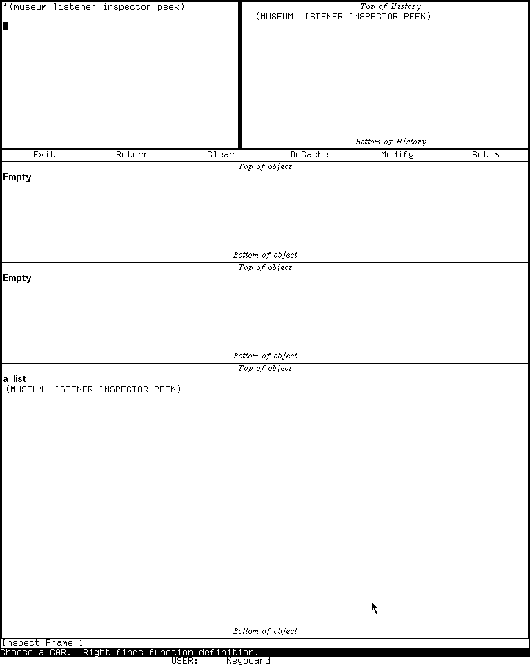

# The MIT Lisp Machine Inspector

The Inspector is an interactive browser and live editor for Lisp objects. It
does not flatten an object into inert text: each displayed field retains enough
identity for the user to follow references, inspect function definitions, and,
where the implementation marks the field settable, replace data in the running
system. Its three-pane history makes navigation visible while the separate
history pane preserves older objects.

That power makes the Inspector both a documentation tool and a potentially
destructive debugger. **Modify** changes the actual object, array, binding, or
memory location being inspected; it does not edit a private copy.

This page treats the public MIT CADR System 46 source and the maintained LM-3
System 303 source as separate evidence sets. Runtime observations apply only to
the System 303-0 load band described below.

## Evidence sets

### MIT CADR System 46

The public System 46 tree is pinned at Git revision
[`8e978d7`](https://github.com/mietek/mit-cadr-system-software/tree/8e978d7d1704096a63edd4386a3b8326a2e584af).

| File | Role | Bytes | SHA-256 |
| --- | --- | ---: | --- |
| `src/lmwin/inspct.80` | Inspector frame, object printers, navigation, and modification | 37,465 | `137fe25adf7df785548e098da2053ce7bac709e021a5abc7039e9aac218bb600` |
| `src/lmwind/operat.27` | contemporary operations-manual source | 85,337 | `a5ab658210dc09891b0886b58af705368e33a41f013073c8b9a637d99ab0f02d` |

### LM-3 System 303

The maintained LM-3 System repository is pinned separately at Fossil check-in
[`4df393c`](https://tumbleweed.nu/r/lm-3/info/4df393c68d7f083ce42d5c377039d26043cc18a9031ace28258dc97f4137eb91),
tag `system-303`.

| File | Role | Bytes | SHA-256 |
| --- | --- | ---: | --- |
| `l/sys/window/inspct.lisp` | current Inspector frame, object dispatch, commands, and mutation paths | 60,805 | `b38e92064d6827528064bca27fe0e36d1ab1d61e54431fe69e3efcf9bf5f083a` |
| `l/sys/window/basstr.lisp` | System-key registration and generic selection behavior | 81,846 | `8ba3a16e726ed043e6585c7a68b7096bb2dcc5d6f05476afd89f84a48dff2645` |

The LM-3 repository is a maintained restoration. Features found only in its
System 303 source are not attributed to the older System 46 snapshot without
independent evidence.

## Purpose and entry points

The System 46 manual describes the Inspector as a program for displaying and
modifying Lisp data structures. The source supports three principal entry
paths:

- `System I` selects or creates an Inspector;
- **Inspect** in the System Menu selects or creates one;
- `(INSPECT object)` enters an Inspector from Lisp.

The process model differs by source line. In System 46, `System I` is registered
as a specialized call to `(TV:INSPECT)`, and `INSPECT` allocates a resource frame
and runs its top level in the caller's process. In System 303, `System I` and the
System Menu select or create an `INSPECT-FRAME` with its own process, while the
function call `(INSPECT object)` deliberately allocates a processless resource
frame and runs its command loop in the caller's process. The latter arrangement
lets evaluated forms see the caller's dynamic special bindings; a standalone
System 303 application does not inherit an arbitrary Listener's dynamic
environment in that way.

Other programs can embed Inspector panes rather than launching the complete
application. The source explicitly anticipates use inside debugging and error
handling interfaces.

## Frame and navigation model

The complete frame has five functional regions:

1. a Lisp interaction pane;
2. a history pane;
3. a one-line command menu;
4. three stacked object-display panes by default;
5. the who line supplied by the window system.

The arrangement changed. System 46 gives the interaction pane a three-line row
and places History and the menu together in the next horizontal constraint.
The observed System 303 frame places interaction at upper left and History at
upper right, with the menu as a full-width row immediately below them.

The three newest navigation objects occupy the object panes, with the newest
at the bottom. Following a reference normally pushes the existing displays
upward. A middle-click variant preserves the source display in the
second-from-bottom pane and puts the followed object at the bottom, allowing a
direct before/after comparison.

The history pane retains previously inspected objects beyond those three
visible slots. Selecting a history item brings it back into the display stack;
the middle-button history operation removes the item and invalidates its
cached display.

### Display records and caching in System 303

System 303 represents each cached display with seven pieces of state:

- the object;
- its printing function;
- an argument for that function;
- the generated lines or selectable items;
- the current top item;
- the pane label;
- an optional incremental item generator.

This cache is observable behavior. If another computation mutates an object,
the existing Inspector text can remain stale until the user chooses
**DeCache**, presses `Clear-Screen`, or otherwise invalidates that display.
**Modify** invalidates the affected object after changing it. The cache is a
display optimization, not a snapshot or isolation mechanism.

## The command menu

Both inspected source lines define the same six visible menu items, but not in
the same order. System 46 orders them **Exit**, **Return**, **Modify**,
**DeCache**, **Clear**, **Set `\\`**. System 303 and the observed frame order
them **Exit**, **Return**, **Clear**, **DeCache**, **Modify**, **Set `\\`**.

| Item | Effect |
| --- | --- |
| **Exit** | leave the command loop; System 46 returns `NIL`, while System 303 returns the current `*` object |
| **Return** | prompt for a value selected by keyboard or mouse, then leave returning that value |
| **Modify** | restrict pointer selection to settable displayed fields and replace the selected value |
| **DeCache** | invalidate cached representations so objects are regenerated |
| **Clear** | clear history, cache, and object panes |
| **Set `\\`** | prompt for a value selected by keyboard or mouse and bind the Inspector-local `\\` variable to it |

**Modify** is a modal pointer operation. In System 303, only fields whose
display records carry a setter remain sensitive. A right click aborts the
selection. After a field is chosen, the replacement can be typed and evaluated
or obtained by selecting a displayed object with the mouse.

The menu is not the only way to modify. System 303 also binds Hyper-left on a
settable field to the direct modification path.

## Keyboard command inventory

### System 46

| Key or input | Effect in `inspct.80` |
| --- | --- |
| `Control-Z` | exit the Inspector |
| `Break` | enter a Lisp break loop |
| `Quote` | read, evaluate, and print a form without inspecting its result |
| `Rubout` | ignored by the outer command loop |
| ordinary form | read and evaluate it, then inspect the result |

The ordinary line editor still handles corrections while it is reading a
form. “Rubout ignored” describes the outer Inspector command dispatch, not a
claim that typed Lisp can never be corrected.

### System 303

| Key or input | Effect in `inspct.lisp` |
| --- | --- |
| `Control-Z` or `Abort` | signal an abort from the current inspection |
| `Control-V` | scroll the bottom Inspector pane down by roughly one screen |
| `Meta-V` | scroll the bottom Inspector pane up by roughly one screen |
| `Break` | enter a Lisp break loop |
| `Clear-Screen` | clear the display cache and fully redisplay |
| `End` | return the current `*` object from the processless Inspector loop |
| `Help` | display the Inspector's in-program help and wait for acknowledgment |
| `Delete` | clear history, cache, and all three object panes |
| `Control-\\` | prompt for a value and set the Inspector-local `\\` variable to it |
| `Rubout` | ignored by the outer command loop |
| `Quote` | read, evaluate, and print a form without inspecting its result |
| ordinary form | read and evaluate it, then inspect the result |

System 46 explicitly maintains `*` as the last inspected object. System 303
adds `**` and `***`, so the three variables mirror the visible three-object
stack. `End` and **Exit** return `*` in System 303; **Return** instead asks for
an explicit value. These exits are useful when `INSPECT` is being used as an
expression-level chooser rather than merely as a standalone application.

## Pointer interaction inventory

Selectable displayed values support these core gestures:

| Gesture | Result |
| --- | --- |
| left click | inspect the value, pushing the display history |
| middle click | inspect the value while preserving the source pane for comparison |
| right click | follow the value as a function definition where meaningful |
| Hyper-left click | System 303: modify that field directly if it has a setter |

The function-following gesture is type-aware. System 303 can follow a symbol's
function, an instance's function, a closure or entity, or another valid
function spec. It does not simply treat every printed token as a function
name.

Within the history pane, left click reinspects an entry; middle click removes
that entry and decaches it. The frame also inherits the generic right-button
System Menu gesture from the window system.

## What the Inspector understands

The object dispatcher chooses a specialized presentation from the object's
runtime type. This is not CLOS pretty-printing layered over a generic list: the
Inspector knows how to expose implementation structures and live locations.

### System 46 object classes

The pinned System 46 dispatcher has specialized paths for:

- stack frames;
- named structures;
- instances and their instance variables;
- arrays and array leaders;
- lists;
- symbols;
- select-method objects;
- closures and entities;
- FEFs, the machine's compiled-function representation.

Its array browser exposes leaders and elements of one-dimensional arrays.
Multi-dimensional arrays fall back to printing the object rather than
enumerating all indexed elements. Its FEF view includes disassembly.

### Additions and extensions in System 303

System 303 preserves those categories and adds or broadens:

- arbitrary-rank arrays, enumerated with row-major indices converted back to
  subscripts;
- locatives, whose referenced contents are displayed directly;
- a catch-all presentation for otherwise unknown objects;
- richer compiled and interpreted lexical-closure displays;
- incremental item generation for large structures.

Named structures are tested before more general categories, preserving their
type-specific descriptions even when their representation overlaps another
Lisp type.

## Fields that can be modified

The Inspector does not make every printed item editable. The setter inventory
is part of its data model and differs between the source lines.

### System 46

The inspected code provides setters for:

- a symbol's value, function, and property list;
- list cars and corresponding list locations;
- instance variables;
- closure variables;
- named-structure slots;
- one-dimensional array elements and array leaders;
- select-method mappings.

FEFs are displayed and disassembled, but the inspected System 46 code does not
establish a general settable FEF-constant interface. Multi-dimensional array
elements likewise lack the later generic indexed path.

### System 303

The maintained source provides setters for:

- named-structure slots;
- instance variables;
- ordinary closure slots and lexical-closure slots;
- unshadowed interpreted-closure variables;
- select-method tails and keyword functions;
- symbol values, functions, and property lists;
- locative contents;
- list cars and list locations;
- array leaders and elements of arbitrary-rank arrays;
- FEF constants.

Special or shadowed interpreted variables are intentionally not marked
settable by that display path. A prospective FEF function setter is present
only as commented-out code; this page does not count it as a feature.

These operations can violate application and runtime invariants. The Inspector
has no transactional undo layer, and the source does not turn **Modify** into a
copy-on-write operation.

## Findings not apparent from the short manual description

- `(INSPECT object)` in System 303 runs a processless frame in the caller's
  process specifically so evaluated forms can see dynamic special bindings;
  the older System 46 `INSPECT` call also runs its resource frame in the caller.
- The visible object text is cached and can become stale even though mutation
  acts on live objects.
- System 303's arbitrary-rank array view computes real multidimensional
  subscripts rather than displaying only a flat row-major number.
- Mouse sensitivity is capability-based: **Modify** narrows selection to
  display items carrying real setters.
- The right-button value gesture follows function identity and is distinct
  from ordinary structural navigation.
- System 303 exposes locatives and implementation-level closure state that are
  not ordinary application records.
- FEF constants are mutable in the maintained System 303 implementation, but a
  different FEF function setter is merely commented out. Source presence alone
  is not treated as an implemented command.

## Runtime observation: System 303-0

A fresh Xvfb computer-use session selected the Inspector with `System I`, then
evaluated and inspected `'(museum listener inspector peek)`. The initial frame
visibly had the interaction, history, six-item menu, and three Inspector panes
described by the source. The top two object panes read `Empty`; after the form
was entered, the history pane showed the expression and the bottom pane showed
the resulting object under the label `a list`.

| Item | Recorded value |
| --- | --- |
| Session | `core-env-20260718`, generation 1; 2026-07-18 03:55:07–04:06:40 EDT; boot ID `3ee4cfb0-9636-4c5c-8661-a1b04ab7aa07`; non-resumed |
| Load band | `System 303-0`; banner `Experimental System 303.0`, ZWEI 129.0, microcode 323 |
| Disk | base/private-start SHA-256 `bb16e46ad81decfe1efe691d36b6aa4ce3fd4ffb82474365de3520989d397cb5`; base unchanged after stop |
| Public revisions | L `d1250f90044f09b6c92014a9aef65f9574e1bcbf8a7163004e53cc6dbed0f2d6`; System `4df393c68d7f083ce42d5c377039d26043cc18a9031ace28258dc97f4137eb91`; usim `330d8248ec2e12af071e287920e681600f75df9ffd854aada5f8a64c9adad64d`; usite `8f717978b458b40adf1e238aaf177f5bc54ef46881268e03b787ba57b0d30a0e`; Chaos `db2953fde68d726a605d1d1699bab6c926ef252bd4991f692bae6ee5a634764e` |
| Private copy | copied 2026-07-18 03:55:03 EDT at those revisions; System tree `21f5215de973aa6ccbddb817f2d64edd95ee1014c3028a9b0711ea7c741b807e`, Chaos `34ab197641aae909e9a224edc307020fddec263e732207a74573d51dac0daa87`, usite `adbb720339db225e6635977a869cf3f3d50b507e614b37a976f4a6548d212a81`; copy/start hashes matched and changed flags were false |
| Emulator | start and execution SHA-256 `707a77d23e28ea1c45ae0eb0145dc181fa7ba649b9defc30044d4f847ac2c5be` |
| Machine artifacts | `promh.mcr` `2c667f99f014a7130a55b255d31df02588d9396beace78abfe9325269e4ff3e6`; `promh.sym` `e9e3dd6a541511dd9541ae96b99dae19cb185d8b79fa09959f21fa52224f233d`; `ucadr.sym` `9071decf16fa8f11d7970c4662db0d6e95600fe43ec86ac41c77b37dbd7caa2a` |
| Toolchain | manifest `3adae999bbe420182f22adc2499fcc82449a46eaf580a362de9c0e718fa6b37d`; Guix channel `230aa373f315f247852ee07dff34146e9b480aec`; Python 3.11.14, Xorg 21.1.21, ImageMagick 6.9.13-5, xdotool 3.20211022.1 |
| Host window | `LOCAL-CADR [running]`, XID 2097202, x=0, y=0, 768×963 |

The relevant ordered input was `System I`, followed by the expression
`'(museum listener inspector peek)`. No modification gesture or other
destructive Inspector operation was attempted.

Two raw 768×963 captures remain in the ignored session:

| Raw capture | State | PNG SHA-256 | Decoded-pixel SHA-256 |
| --- | --- | --- | --- |
| `0008-inspector-initial.png` | initial Inspector frame | `c524f90d50659ca59fb59b8788e3e1f30e980d2265ded8a5657526aa604b9e08` | `19c519454d3a1ca16ead54034043bc97e81ab8432a05bc2d691f5f6b4c0b8cb7` |
| `0009-inspector-list.png` | inspected list | `a8c104631118a10749f4b0a6b6059dfe902c190e4c20075d8f94fcb683c137b3` | `178b6ccd02a999bebaa6e5171d33f6980d6196f210078286dcb6483ec7398044` |

The image-by-image review selected only the synthetic-list state for the
[curated CADR screenshot catalog](../assets/mit-cadr-screenshots/index.md). The
blank initial frame remains ignored because it adds little evidence beyond the
populated layout below.

> Runtime observation: the LM-3 System 303 Inspector displaying
> `'(museum listener inspector peek)`, captured 2026-07-18. Underlying software
> and display material remain the property of their respective rightsholders;
> reproduced here for criticism, scholarship, and historical documentation
> under 17 U.S.C. section 107. No affiliation or endorsement is implied.

The 6,781-byte run record has SHA-256
`2d877843f58a8a261bafe68afca846919963dec5584a39bbb5275fcbe6615e22`.
Shutdown was clean: `forced_stop` and `state_may_be_incomplete` are false, the
emulator and Xvfb both exited zero, and the base disk was unchanged. The
[computer-use harness article](cadr-computer-use-harness.md) explains the
evidence schema and repeat procedure.

## Limits and open questions

- No live mutation was performed. The setter inventory is established from
  source, while the visible modal selection and resulting memory change remain
  to be exercised on a deliberately disposable test object.
- The runtime pass did not open the Inspector's Help screen or exercise every
  scrolling and history gesture. Those bindings are source-established, not
  claimed as individually runtime-confirmed.
- No runnable System 46 band was used. Its behavior here is source- and
  manual-grounded only.
- The exact first release that introduced locatives, arbitrary-rank array
  browsing, `**`/`***`, or Hyper-left modification has not been established.
- The populated-list capture received a separate per-image publication review;
  the unused initial-frame capture remains ignored and unreviewed for publication.

## Sources

Source links and pinned revisions last verified 2026-07-18.

- MIT CADR System 46, [`INSPCT.80`](https://github.com/mietek/mit-cadr-system-software/blob/8e978d7d1704096a63edd4386a3b8326a2e584af/src/lmwin/inspct.80), Inspector implementation.
- MIT CADR System 46, [`OPERAT.27`](https://github.com/mietek/mit-cadr-system-software/blob/8e978d7d1704096a63edd4386a3b8326a2e584af/src/lmwind/operat.27), window-system operations manual source.
- LM-3 System 303, [`window/inspct.lisp`](https://tumbleweed.nu/r/lm-3/file/l/sys/window/inspct.lisp?ci=4df393c68d7f083ce42d5c377039d26043cc18a9031ace28258dc97f4137eb91), maintained Inspector implementation.
- LM-3 System 303, [`window/basstr.lisp`](https://tumbleweed.nu/r/lm-3/file/l/sys/window/basstr.lisp?ci=4df393c68d7f083ce42d5c377039d26043cc18a9031ace28258dc97f4137eb91), System-key and selection infrastructure.
- Local System 303-0 Xvfb observation, session `core-env-20260718`, generation 1, 2026-07-18; raw evidence identified above.
