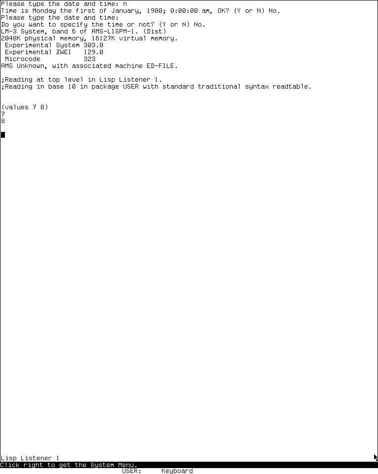

# The MIT Lisp Machine Lisp Listener

The Lisp Listener is the machine's ordinary graphical Lisp interaction window,
but it is not merely a terminal wrapped around a global REPL. Each normal
Listener owns a process, a line-oriented input editor, display state, and, in
the LM-3 System 303 source, a package association synchronized with the
top-level's dynamic `*PACKAGE*`. Multiple Listeners can therefore be idle or
busy independently and retain different interaction contexts.

This page distinguishes the public MIT CADR System 46 snapshot from the
maintained LM-3 System 303 restoration tree. The runnable observation is of the
latter only.

## Evidence sets

### MIT CADR System 46

The public System 46 tree is pinned at Git revision
[`8e978d7`](https://github.com/mietek/mit-cadr-system-software/tree/8e978d7d1704096a63edd4386a3b8326a2e584af).
The relevant local files are:

| File | Role | Bytes | SHA-256 |
| --- | --- | ---: | --- |
| `src/lispm/ltop.231` | top-level and break loops | 17,152 | `5e217afe3b7bd31645a3a793c1c4b4a33cf211cc4c3b5770210bed228a3f8f15` |
| `src/lmwin/baswin.428` | Listener window flavor and process | 56,577 | `2ee1f487e6d14bec5bfc52a1e64b04963b8b1120a4d291be329995de92339dd4` |
| `src/lmwin/stream.14` | stream and rubout-handler input editing | 41,227 | `3a41c4752da5b84f2ed88b1b8e3c215c54ceda75f4db28d3bb461fdc2e30b499` |
| `src/lmwind/operat.27` | contemporary window-system manual source | 85,337 | `a5ab658210dc09891b0886b58af705368e33a41f013073c8b9a637d99ab0f02d` |

### LM-3 System 303

The maintained LM-3 System repository is pinned at Fossil check-in
[`4df393c`](https://tumbleweed.nu/r/lm-3/info/4df393c68d7f083ce42d5c377039d26043cc18a9031ace28258dc97f4137eb91),
tag `system-303`. Its corresponding files are:

| File | Role | Bytes | SHA-256 |
| --- | --- | ---: | --- |
| `l/sys/sys/ltop.lisp` | top-level, histories, package synchronization, and break loop | 42,225 | `57dd2591cfeb84ee00f1d9cb51c17b5c30f22e36026074117e3420f4e3dc943e` |
| `l/sys/sys/sysdcl.lisp` | system composition, including the standard `RH` input editor | 25,396 | `2999f1824666171d729dae611a09204ac0bd42373f30d7d22c733f904c27a6dd` |
| `l/sys/io/read.lisp` | `READ-FOR-TOP-LEVEL` and `End` activation | 104,944 | `0fa6eea755dcb077bc519d36654597cdf5ee8f6e3a61a1f38f821db15392a02f` |
| `l/sys/window/baswin.lisp` | Listener variants and process lifecycle | 82,708 | `3b86ca413528046887da8371433d656ecd9d5f9130d6eadd764fc54f137b42f1` |
| `l/sys/window/stream.lisp` | stream protocol and fallback rubout handler | 26,023 | `3159e4aa22a77a71a2d603cb5fe9ec78c1674af0615dd9ad83d238195613cef8` |
| `l/sys/window/rh.lisp` | standard full rubout-handler input editor | 68,866 | `6e71970e7b481441554ed64af2ac9ca04439a9af6d532a61a24d02cce8a4e0f8` |

The LM-3 repository is a maintained restoration tree. A source comment or
behavior at this check-in is evidence for this exact tree and its System 303
band, not proof that the same line was present in every historical release.

## Purpose and entry points

The System 46 operations manual calls the Listener the first full-screen
window after a cold boot and the usual place to run simple user programs. Its
core operation is a conventional read-eval-print loop: read one Lisp form,
evaluate it, and print every value.

Ways to obtain or select a normal Listener include:

- cold boot, which creates the initial full-screen Listener;
- `System L`, which selects an existing Listener and normally creates one if
  none exists;
- `Control-System L` in System 303, which explicitly requests a new one;
- **Lisp** in the System 303 System Menu's Programs column;
- **Create**, then **Lisp**, in the System Menu;
- code that constructs `TV:LISP-LISTENER` or asks `TV:IDLE-LISP-LISTENER` for
  an idle full-sized Listener.

`System L` is a selector, not an evaluator command. Repeating it cycles through
the most recently selected windows recognized as Listeners. The related
[System Menu and selector article](system-menu-and-select.md) documents that
registry and cycling algorithm.

## The window and the Lisp top level are separate layers

`SI:LISP-TOP-LEVEL1` implements the read-eval-print semantics. The window
system supplies a stream and process that run it. This split permits the same
top-level function to operate over different streams, while the `LISP-LISTENER`
flavor supplies the visible, selectable embodiment.

In System 303, the flavor hierarchy makes several boundaries explicit:

- `LISTENER-MIXIN-INTERNAL` owns the top-level process but is deliberately
  invisible to `System L`;
- `LISTENER-MIXIN` adds recognition by `System L`;
- `LISP-INTERACTOR` is a Lisp interaction window built on the internal mixin,
  but its source documentation explicitly says it is not a normal
  `LISP-LISTENER-P`;
- `LISP-LISTENER` combines notification handling, the public Listener mixin,
  and a saved-bits window;
- `IDLE-LISP-LISTENER` reuses an idle Listener of the requested full-screen
  size or constructs one when necessary.

The process preset gives the top level a regular PDL size of 40,000 and a
special PDL size of 4,000 in both inspected lines. `LISP-LISTENER-P` reports
`:BUSY` while `LISP-TOP-LEVEL-INSIDE-EVAL` is true in that process's stack
group and `:IDLE` otherwise.

System 303 also delays starting many window processes until the window will
actually become visible. The source explains that this reduces boot paging and
prevents partially initialized editor windows from running too early. A nearby
comment calls this process/window selection machinery a “horrible crock” that
ought to be replaced by a program system. That is implementation evidence of a
known architectural boundary, not a museum characterization of the whole
system.

## Per-Listener package and reader state

The System 303 top level synchronizes its dynamic `*PACKAGE*` with a package
slot on the terminal stream. If Lisp code changes `*PACKAGE*`, the window is
updated; if another operation changes the window's package, the next top-level
iteration adopts it. The first iteration initializes whichever side has not
yet been set.

The loop also binds the readtable, print base, and read base for its own
execution. When the readtable changes, it reports the current input base,
package, and readtable. The observed System 303 Listener printed:

```text
;Reading at top level in Lisp Listener 1.
;Reading in base 10 in package USER with standard traditional syntax readtable.
```

This per-window package synchronization is absent from the inspected System 46
`LISP-TOP-LEVEL1`; it should not be retroactively attributed to that snapshot.

## Interaction histories and multiple values

Both implementations preserve recent forms and values as dynamically bound
Listener variables, but System 303 extends the model.

| Variable | System 46 | System 303 |
| --- | --- | --- |
| `-` | form just read | form just read |
| `+`, `++`, `+++` | three recent forms | three recent forms |
| `*`, `**`, `***` | first value of each of three recent evaluations | first value of each of three recent evaluations |
| `//` | list of all values from the current evaluation | list of all values from the current evaluation |
| `////`, `//////` | not maintained by the inspected loop | all-value lists from the two preceding evaluations |
| `*VALUES*` | not maintained by the inspected loop | newest-first history whose elements are complete value lists |

System 303 pushes an entry on `*VALUES*` even when evaluation aborts; the entry
is `NIL` in that case. Its top level prints each value on a separate line. A
fresh runtime evaluation of `(values 7 8)` visibly printed `7` and `8` on
successive lines, confirming the multiple-value path in the loaded band.

The break loop reuses these histories rather than creating an unrelated REPL
state. In System 303, `Resume` continues, `Abort` quits the break, and a form of
the shape `(RETURN value)` returns that value from the break context.

## Buffered Listener input editor

The Listener does not use ZWEI for its ordinary input. It uses the window
stream's rubout handler, a buffered editor that rescans the form after edits.
Ordinary characters insert themselves. Because Lisp forms are self-delimiting,
a Return that supplies terminating whitespace normally lets `READ` finish;
`End` is also declared as an explicit activation character in System 303's
`READ-FOR-TOP-LEVEL`.

“Does not use ZWEI” needs one qualification. The System 303 input editor is its
own rubout-handler implementation and does not create a ZWEI buffer, but it
shares ZWEI's input-history, kill-history, syntax tables, argument-list printer,
and documentation machinery when those facilities are loaded.

### System 46 input commands

| Key | Effect in `stream.14` |
| --- | --- |
| `Rubout` | delete the last buffered character and rescan |
| `Clear` | discard all buffered input |
| `Form` | clear the screen, reprint any prompt, and re-echo the buffer |
| `VT` | start a new line, reprint any prompt, and re-echo the buffer |
| other Control or Meta character | beep; with a full-rubout caller option, return to that caller |

`Form`, `VT`, and `Clear` are old-keyboard names. The operations manual maps
their roles to Clear-Screen, Delete/new-line behavior, and Clear-Input on the
new keyboard.

### System 303 fallback handler

`window/stream.lisp` retains a compact fallback editor:

| Key | Effect in `window/stream.lisp` |
| --- | --- |
| `Rubout` | delete one character backward |
| `Meta-Rubout` | delete backward over one word |
| `Clear-Input` | delete the entire buffered input |
| `Clear-Screen` | clear the window, reprint the prompt, and re-echo the buffer |
| `Delete` | print a newline, reprint the prompt, and re-echo the buffer |
| `End` | activate `READ-FOR-TOP-LEVEL` even when ordinary self-delimitation has not completed |
| other Control or Meta character | beep unless the caller explicitly declares it an editing command, pass-through character, or activation |

That table is not the effective full System 303 command inventory. The file
itself says it is overridden by `SYS:WINDOW;RH`, `sysdcl.lisp` includes `RH` in
the standard Window system, and `rh.lisp` ends by calling `RH-ON`. The loaded
handler can be switched back to this fallback with `(TV:RH-OFF)` and restored
with `(TV:RH-ON)`.

In particular, the standard editor does not retain the fallback's `Delete`
reprint binding. Its explicit refresh commands are `Clear-Screen` and
`Control-L`; the generic keyboard-help source also labels `Delete` unused.

### System 303 standard editor: prefixes and movement

The standard alternate handler supports numeric arguments. Modified decimal
digits accumulate a decimal argument, `Control-U` starts at four and multiplies
an existing argument by four, and a modified minus toggles the negative flag.
The handler passes the resulting signed argument to commands; for ordinary
characters, a positive argument inserts that many copies and a negative one
inserts none.

| Key | Effect in `window/rh.lisp` |
| --- | --- |
| `Control-F`, `Control-B` | move forward or backward by characters |
| `Control-A`, `Control-E` | move to the beginning or end of the current input line |
| `Control-P`, `Control-N` | move to the previous or next input line, preserving the approximate column |
| `Meta-<`, `Meta->` | move to the beginning or end of the entire buffered input |
| `Meta-F`, `Meta-B` | move forward or backward by words |
| `Control-Meta-F`, `Control-Meta-B` | move forward or backward by complete Lisp forms |

The active form commands replace older parenthesis-only implementations that
remain inside a source block comment. The Lisp-aware scanner handles quoting,
strings, lists, package colons, and slash escapes more broadly than a simple
search for matching parentheses.

### Mark, deletion, exchange, and insertion

| Key | Effect in `window/rh.lisp` |
| --- | --- |
| `Control-<`, `Control->` | set the mark at the beginning or end of the buffer |
| `Control-Space`, `Control-@` | set the mark at the current input position |
| `Control-W` | kill the region between point and mark into ZWEI's kill history |
| `Meta-W` | copy the region into kill history without deleting it |
| `Rubout`, `Control-D` | delete characters backward or forward |
| `Clear-Input` | delete the entire buffered input; with the caller's full-rubout option, return to that caller when already empty or after clearing |
| `Control-K` | kill to end of line, or kill the newline when already at line end |
| `Meta-Rubout`, `Meta-D` | delete a word backward or forward |
| `Control-Meta-Rubout`, `Control-Meta-K` | delete a Lisp form backward or forward |
| `Meta-T` | exchange words; direction and repetition follow the numeric argument, while zero uses the marked word |
| `Control-Meta-T` | exchange the neighboring Lisp forms around point |
| `Control-T` | transpose the two characters around point, with special handling at line end |
| `Control-O` | insert one or the numeric number of newlines while leaving point before them |
| `Control-Q` | quote and insert the following character, repeated by the numeric argument |
| `Clear-Screen`, `Control-L` | clear the window and reprint the prompt and full buffered input |

Word commands use ZWEI's active word-syntax table when available and fall back
to alphabetic-character classification otherwise. Region kills and word or
form deletions feed the shared ZWEI kill history. These are concrete forms of
code reuse without making the Listener a ZWEI editor window.

### Input history, kill history, and completion

Each stream lazily acquires its own input history. A completed nontrivial input
is saved only when it differs from the newest entry; the source deliberately
avoids recording one-character inputs. Kill history is shared through ZWEI.

| Key | Effect in `window/rh.lisp` |
| --- | --- |
| `Control-Meta-Y`, `Control-C` | yank an entry from this stream's input history; numeric zero lists it |
| `Control-Y` | yank from kill history; numeric zero lists it |
| `Meta-Y`, `Meta-C` | after a history yank, rotate to another entry and replace the previous yank |
| `Status` | display the first screenful of input history |
| `Control-Status` | display the first screenful of kill history |
| `Meta-Status` | display the remaining or numerically selected portion of input history |
| `Control-Meta-Status` | display the remaining or numerically selected portion of kill history |
| `Control-!` | complete the buffer prefix through point from input history; a numeric argument skips matching entries |
| `Meta-!` | after completion, rotate forward or backward among entries with the same prefix |

The input history is associated with the stream, while the Lisp value and form
variables `*`, `**`, `+`, and their relatives are dynamic bindings in the
top-level process. They are complementary histories, not the same data
structure.

### Help and context-sensitive Lisp information

| Key | Effect in `window/rh.lisp` |
| --- | --- |
| `Help` | explain the input context and point to input, System-key, and Terminal-key help |
| `Meta-Help` | list special-keyboard symbol translations |
| `Control-Help` | generate a complete list from the live rubout-handler command alist plus caller-specific editing commands |
| `Control-Meta-Help` | display internal buffer pointers, status, options, and terminal stream |
| `Control-Shift-A` | locate the function around point and display its argument list |
| `Control-Shift-D` | display that argument list and the function documentation, if present |

With numeric argument 2, the last two commands contain a source-visible
special case that attempts to resolve a method handler from certain `SEND` or
function-call expressions. This behavior is more context-sensitive than the
manual's generic description of line editing.

On a parse error, the System 303 handler prints `>>ERROR`, reports the error,
and forces the user to edit or rub out before the read is retried. It retains
the prompt and buffered input across that rescan.

Two source-visible limitations are not described in the short Listener manual:

- the stream method `:REPLACE-INPUT` unconditionally signals an error saying
  that it has not been written;
- `:START-TYPEOUT` and `:FINISH-TYPEOUT` are present as no-op compatibility
  methods in this source.

These limitations apply to the exact stream protocol implementation, including
when the full rubout handler supplies editing behavior; they do not describe
ZWEI editor streams.

## Mouse and global keyboard behavior

The Listener itself gives the mouse no application-specific object gestures.
The System 46 manual describes its pointer as the ordinary north-by-northwest
arrow and says a single right click summons the System Menu. The System 303
runtime who-line repeated the same instruction: `Click right to get the System
Menu.`

Global keyboard interception still applies. `Abort` returns a computation to
the Listener command level, `Break` enters a break loop, `Help` invokes global
keyboard documentation, and `System` and `Terminal` introduce window-system
commands. These are window-system facilities that operate while the Listener
is selected; they are not additional rubout-handler bindings.

## Runtime observation: System 303-0

The Xvfb computer-use harness made a fresh, non-resumed boot and preserved the
following boundary:

| Item | Recorded value |
| --- | --- |
| Session | `core-env-20260718`, generation 1; 2026-07-18 03:55:07–04:06:40 EDT; boot ID `3ee4cfb0-9636-4c5c-8661-a1b04ab7aa07` |
| Load band | `System 303-0`; banner `Experimental System 303.0`, ZWEI 129.0, microcode 323 |
| Disk | base and private-start SHA-256 `bb16e46ad81decfe1efe691d36b6aa4ce3fd4ffb82474365de3520989d397cb5`; base unchanged after stop |
| Public revisions | L `d1250f90044f09b6c92014a9aef65f9574e1bcbf8a7163004e53cc6dbed0f2d6`; System `4df393c68d7f083ce42d5c377039d26043cc18a9031ace28258dc97f4137eb91`; usim `330d8248ec2e12af071e287920e681600f75df9ffd854aada5f8a64c9adad64d`; usite `8f717978b458b40adf1e238aaf177f5bc54ef46881268e03b787ba57b0d30a0e`; Chaos `db2953fde68d726a605d1d1699bab6c926ef252bd4991f692bae6ee5a634764e` |
| Private source copy | copied 2026-07-18 03:55:03 EDT at the same System, usite, and Chaos revisions |
| Private trees | System `21f5215de973aa6ccbddb817f2d64edd95ee1014c3028a9b0711ea7c741b807e`; Chaos `34ab197641aae909e9a224edc307020fddec263e732207a74573d51dac0daa87`; usite `adbb720339db225e6635977a869cf3f3d50b507e614b37a976f4a6548d212a81`; all copy/start hashes matched and all changed-since-copy flags were false |
| Emulator | start and execution SHA-256 `707a77d23e28ea1c45ae0eb0145dc181fa7ba649b9defc30044d4f847ac2c5be` |
| Machine artifacts | `promh.mcr` `2c667f99f014a7130a55b255d31df02588d9396beace78abfe9325269e4ff3e6`; `promh.sym` `e9e3dd6a541511dd9541ae96b99dae19cb185d8b79fa09959f21fa52224f233d`; `ucadr.sym` `9071decf16fa8f11d7970c4662db0d6e95600fe43ec86ac41c77b37dbd7caa2a` |
| Toolchain | manifest SHA-256 `3adae999bbe420182f22adc2499fcc82449a46eaf580a362de9c0e718fa6b37d`; Guix channel `230aa373f315f247852ee07dff34146e9b480aec`; Python 3.11.14, Xorg 21.1.21, ImageMagick 6.9.13-5, xdotool 3.20211022.1 |
| Selected host window | `LOCAL-CADR [running]`, XID 2097202, x=0, y=0, 768×963 |

The ordered relevant input was: answer the boot date/time questions with `N`
(one early second `N` was sent before the second prompt and had no visible
effect, so the answer was sent again), evaluate `(values 7 8)`, open the System
Menu with right click, request `System Help`, select `System I`, inspect
`'(museum listener inspector peek)`, select `System P`, choose Active Processes,
open the first process's action menu, dismiss it without choosing an action,
and stop the emulator.

The Listener multiple-value capture is 768×963 with PNG SHA-256
`139d66a2ddc3230e46781610a079a0e0134bf440becaa665f9c2042d514d551c`
and decoded-pixel SHA-256
`428ce18e58cbda778a5e33e216f946ada4f8ef1a401961024b085e7f95b90b04`.
The image-specific publication review approved this one sparse state and mapped
it to the [curated CADR screenshot catalog](../assets/mit-cadr-screenshots/index.md).



> Runtime observation: the Lisp Listener in LM-3 System 303 after evaluating
> `(values 7 8)`, captured 2026-07-18. Underlying software and display material
> remain the property of their respective rightsholders; reproduced here for
> criticism, scholarship, and historical documentation under 17 U.S.C. section
> 107. No affiliation or endorsement is implied.

The 6,781-byte run record has SHA-256
`2d877843f58a8a261bafe68afca846919963dec5584a39bbb5275fcbe6615e22`.
Shutdown was clean: `forced_stop` and `state_may_be_incomplete` are false, the
emulator and Xvfb exited zero, and the base disk was unchanged. See the
[computer-use harness article](cadr-computer-use-harness.md) for the evidence
schema.

## What the manual alone does not establish

- The operations manual's short Listener chapter accurately identifies a
  REPL, but it does not describe the per-window process, idle/busy query,
  package synchronization, value histories, or the standard input editor's
  movement, kill, history, completion, and context-help command sets.
- A Listener-shaped interaction pane is not necessarily selectable by
  `System L`; System 303 deliberately distinguishes internal listener mixins
  and `LISP-INTERACTOR` from public Listeners.
- `System L` selecting a Listener does not imply that it creates a new one on
  every invocation. Normal selection cycles existing windows; explicit
  creation is a separate path in System 303.
- The observed System 303 package and history behavior must not be projected
  backward onto System 46 where the corresponding code differs.

## Open questions

- No System 46 load band was run for this article. Its visible prompt shape,
  exact old-keyboard echo behavior, and any patches applied beyond the pinned
  source remain source-grounded rather than runtime-confirmed.
- The System 303 run exercised ordinary evaluation, multiple values, and
  program selection, but did not deliberately trigger a parse error or nested
  break loop, nor did it exercise each full rubout-handler movement, history,
  completion, and context-help command. Those paths are established by source
  and should be sampled in a future non-destructive runtime session.

## Sources

- MIT CADR System 46,
  [`ltop.231`](https://github.com/mietek/mit-cadr-system-software/blob/8e978d7d1704096a63edd4386a3b8326a2e584af/src/lispm/ltop.231),
  [`baswin.428`](https://github.com/mietek/mit-cadr-system-software/blob/8e978d7d1704096a63edd4386a3b8326a2e584af/src/lmwin/baswin.428),
  [`stream.14`](https://github.com/mietek/mit-cadr-system-software/blob/8e978d7d1704096a63edd4386a3b8326a2e584af/src/lmwin/stream.14),
  and [operations manual source](https://github.com/mietek/mit-cadr-system-software/blob/8e978d7d1704096a63edd4386a3b8326a2e584af/src/lmwind/operat.27),
  revision `8e978d7`; verified 2026-07-18.
- LM-3 System 303,
  [`ltop.lisp`](https://tumbleweed.nu/r/lm-3/file/l/sys/sys/ltop.lisp?ci=4df393c68d7f083ce42d5c377039d26043cc18a9031ace28258dc97f4137eb91),
  [`sysdcl.lisp`](https://tumbleweed.nu/r/lm-3/file/l/sys/sys/sysdcl.lisp?ci=4df393c68d7f083ce42d5c377039d26043cc18a9031ace28258dc97f4137eb91),
  [`baswin.lisp`](https://tumbleweed.nu/r/lm-3/file/l/sys/window/baswin.lisp?ci=4df393c68d7f083ce42d5c377039d26043cc18a9031ace28258dc97f4137eb91),
  [`stream.lisp`](https://tumbleweed.nu/r/lm-3/file/l/sys/window/stream.lisp?ci=4df393c68d7f083ce42d5c377039d26043cc18a9031ace28258dc97f4137eb91),
  [`rh.lisp`](https://tumbleweed.nu/r/lm-3/file/l/sys/window/rh.lisp?ci=4df393c68d7f083ce42d5c377039d26043cc18a9031ace28258dc97f4137eb91),
  and [`read.lisp`](https://tumbleweed.nu/r/lm-3/file/l/sys/io/read.lisp?ci=4df393c68d7f083ce42d5c377039d26043cc18a9031ace28258dc97f4137eb91),
  check-in `4df393c`; verified 2026-07-18.
