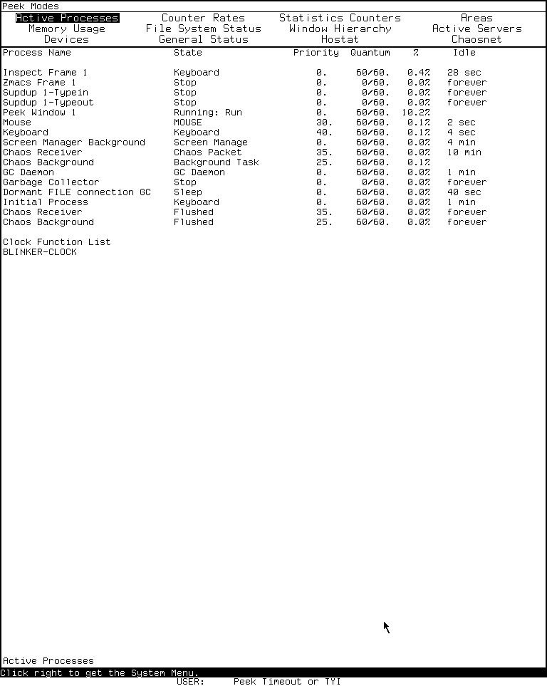

# Peek on the MIT Lisp Machine

Peek is the Lisp Machine's continuously updating system-status browser. Its
modes expose processes, memory areas, counters, file-system connections,
windows, network state, devices, and other implementation data. The display is
not merely a passive dashboard: many rows are mouse-sensitive and open menus
that can inspect, arrest, reset, close, delete, or kill the represented live
object.

Peek therefore combines the roles of process viewer, resource monitor,
network-status display, and direct system-control surface. Read-only viewing is
safe; its context menus are not uniformly read-only.

This page keeps the public MIT CADR System 46 source separate from the
maintained LM-3 System 303 restoration source. The fresh runtime observation is
of the latter only.

## Evidence sets

### MIT CADR System 46

The public System 46 tree is pinned at Git revision
[`8e978d7`](https://github.com/mietek/mit-cadr-system-software/tree/8e978d7d1704096a63edd4386a3b8326a2e584af).

| File | Role | Bytes | SHA-256 |
| --- | --- | ---: | --- |
| `src/lmwin/peek.75` | Peek modes, update loop, and action menus | 30,280 | `837bc1a5fe7ce31ddcee9923db98e804896c8a9c21356a5bdbfd02b464ccdc31` |
| `src/lmwind/operat.27` | contemporary operations-manual source | 85,337 | `a5ab658210dc09891b0886b58af705368e33a41f013073c8b9a637d99ab0f02d` |

### LM-3 System 303

The maintained LM-3 System repository is pinned separately at Fossil check-in
[`4df393c`](https://tumbleweed.nu/r/lm-3/info/4df393c68d7f083ce42d5c377039d26043cc18a9031ace28258dc97f4137eb91),
tag `system-303`.

| File | Role | Bytes | SHA-256 |
| --- | --- | ---: | --- |
| `l/sys/window/peek.lisp` | extensible mode framework, local modes, update loop, and menus | 46,418 | `fa0f22439888127aa59a1dbea1efe57d3587f4663fd8fdce6a647c852a88b9ff` |
| `l/sys/network/chaos/peekch.lisp` | Hostat and Chaosnet modes and host/connection interactions | 17,890 | `0078cfd4571e238440ce2c8704e9a2f2ba0464ab5b9f10bf4510d5e194c32f35` |

LM-3 is a maintained restoration tree. Its additional modes and safety prompts
are evidence for this check-in and the loaded System 303 band, not automatic
claims about historical System 46 behavior.

## Purpose and entry points

Peek can be reached through:

- `System P`, which selects or creates a Peek frame;
- **Peek** in the System 303 System Menu's Programs column;
- **Create**, then **Peek**, in the System Menu;
- the Lisp function `(PEEK)`, optionally with an initial mode.

System 46 has a process-bearing `PEEK` window with no mode menu. One is
pre-created for the System key, and its standalone top level initially invokes
Help. The System 46 function `(PEEK)` is a different entry: it temporarily
binds a `BASIC-PEEK` display over a supplied terminal window and defaults to
Active Processes.

The System 303 source distinguishes two later window forms. `PEEK-FRAME`
combines a mode menu with the display pane. `PEEK-WINDOW` is a standalone
process-bearing display without that menu; it is controlled entirely by
keyboard commands. A standalone instance initially invokes Help before
entering the normal update loop.

The function `(PEEK initial-mode)` selects or creates a frame and injects the
first character of a string or symbol argument, or the supplied character,
into its input stream. The requested mode is therefore selected through the
same command loop as user input rather than by a separate private API.

## Update model

Normal modes produce scrolling display items whose dynamic fields are
reevaluated on redisplay. The default interval is 120 sixtieths of a second,
or two seconds. Each mode can combine:

- fixed text and headings;
- functions that recompute displayed values;
- maintained lists whose members can appear and disappear;
- nested rows inserted or removed by clicking a parent item;
- mouse-sensitive values that open an object-specific menu.

System 303's wait loop treats exposure explicitly. While Peek is deexposed it
notices that an update deadline has passed without drawing into the hidden
window. When the window becomes exposed again, it resumes redisplay instead of
waiting indefinitely for a deadline that expired while hidden.

Some modes are one-shot operations rather than continuously updated displays.
Selecting one lets it write into the typeout window, then restores the prior
mode's label and highlighted menu item after the temporary output is dismissed.

If typeout is still present when Peek needs to resume, it prompts for any
character. Space dismisses the typeout and is consumed. Any other character is
put back into the input stream and handled as a Peek command. This small detail
prevents the acknowledgment from swallowing a requested mode switch.

## Keyboard command inventory

### System 46

| Input | Effect in `peek.75` |
| --- | --- |
| a mode character | switch to that status display |
| decimal digits | accumulate a numeric argument |
| `Q` | quit Peek |
| `n Z` | set the interval to `n` raw sixtieths of a second |
| `?` or `Help` | display the help and mode list |
| Space while dismissing typeout | dismiss it without becoming another command |
| non-Space while dismissing typeout | dismiss it, then process that character as a command |

The old `n Z` unit is easy to misread: in the pinned System 46 source the
numeric argument becomes the sleep time directly, so `120 Z` requests two
seconds.

### System 303

| Input | Effect in `peek.lisp` |
| --- | --- |
| a mode character | switch to that status display |
| decimal digits | accumulate a numeric argument |
| `Q` | quit Peek |
| `n Z` | set the update interval to `n` seconds by multiplying it by 60 |
| Space | force a redisplay |
| `Help` | generate Help from the currently registered mode list |
| Space while dismissing typeout | dismiss it without becoming another command |
| non-Space while dismissing typeout | dismiss it, then process that character as a command |

Thus `2 Z`, not `120 Z`, requests a two-second interval in System 303. The
short operations-manual description does not expose this source-line change.

Peek also accepts internal forced-input commands used by its menus. These can
start Supdup or Telnet, send a message with Qsend, enter the error handler,
inspect or describe an object, evaluate a form, or dispatch a System Menu
request. They are application integration messages, not additional printable
key bindings.

## System 46 mode inventory

The pinned System 46 `peek.75` defines eight modes:

| Key | Mode | Display |
| --- | --- | --- |
| `P` | Active Processes | processes, wait state, scheduling information, and recent activity |
| `M` | Memory Usage | memory use organized by area |
| `C` | Chaosnet Connections | connections and expandable Chaosnet details |
| `A` | Areas | Lisp areas and expandable allocation information |
| `H` | Hostat | one-shot Chaosnet host statistics |
| `%` | Statistics Counters | system and microcode counter values |
| `F` | File System Status | remote file-system channels and open files |
| `W` | Window Hierarchy | window inferiors and exposure hierarchy |

The System 46 application has no mode-menu pane: the source starts in `?` Help
and expects these characters. The contemporary manual lists the broad
subsystems but calls the individual displays self-explanatory; the source is
needed for the action menus and nested interactions below.

## System 303 mode inventory

System 303 makes the mode registry extensible. `DEFINE-PEEK-MODE` adds or
replaces a character entry at load time and rebuilds the command menu from the
effective list. Help reads that same registry. The list can therefore vary
with loaded subsystems.

The pinned core and Chaosnet files, and the fresh loaded System 303-0 band,
provide these twelve modes:

| Key | Menu label | Source-defined meaning |
| --- | --- | --- |
| `P` | Active Processes | each process's wait state, priority, quantum, recent utilization, and idle time; also the clock-function list |
| `R` | Counter Rates | rates of change for maintained counters |
| `%` | Statistics Counters | current values of the microcode meters |
| `A` | Areas | area allocation and use, with expandable per-region details |
| `M` | Memory Usage | percentage of each area's pages currently paged in |
| `F` | File System Status | FILE-protocol remote-file-system access and open streams |
| `W` | Window Hierarchy | screens, inferiors, and exposure hierarchy |
| `S` | Active Servers | servers, clients, processes, connection state, and optional connection details |
| `D` | Devices | shared-device lock holder and bus owner |
| `G` | General Status | processor-switch and other internal processor state |
| `H` | Hostat | one-shot Chaosnet statistics for known hosts |
| `C` | Chaosnet | connections, meters, routes, queues, packets, and expandable details |

The mode menu uses the compact display font rather than the window system's
usual larger menu font. It highlights the active mode, and refreshes its item
list if modes were added while the frame was deexposed.

### Active Processes

The process table has columns for name, state, priority, remaining and total
quantum, recent utilization percentage, and idle time. Idle durations are
rendered as seconds, minutes, or hours; an absent duration is shown as
`forever`. Arrest reasons and runnable or stopped states are reflected in the
state column. A separate section lists clock functions.

Clicking a process name opens the process menu. The Debugger choice is omitted
for a simple process without a stack group.

### Areas and Memory Usage

Areas begins with physical memory, free space, and wired-page counts. It hides
low-numbered implementation areas behind an expandable “uninteresting” row.
Clicking an area inserts or removes its region list, including origin, length,
used words, scavenger progress, space type, and volatility.

Memory Usage answers a different question: it computes the percentage and
count of pages resident for each applicable area. The `A` and `M` modes are not
two labels for the same table.

### File System Status

The file mode enumerates pathname hosts with live access and asks each host
implementation for its Peek header and details. Open streams display direction,
pathname, character or binary mode, byte position, and, for input streams with
a known length, completion percentage.

The label refers to FILE-protocol remote file systems in this source. It should
not be generalized into a filesystem checker for the local load-band device.

### Active Servers

The server mode joins contact name, remote host, server process and state, and
connection. The process, host, and connection are independently sensitive.
For a Chaosnet connection, detail can be inserted into the live display; a
static Hostat can also be nested beneath a host.

### Devices and General Status

Devices lists objects of the shared-device class found among pathname hosts,
showing the process holding the lock and the current owner or bus slot. Its
menu can select a window associated with the lock holder or clear the lock.

General Status builds named records for processor-switch bits. The record type
contains both getter and setter function slots, but the core display path only
renders the getter result and name. No editing gesture is established by this
source, so the mere presence of a setter function is not counted as a visible
General Status editing feature.

### Chaosnet

The Chaosnet mode exposes connections, routing and subnet information, meters,
and packet queues. Connection rows can expand received or transmitted packets.
Packet display includes direction, host, opcode, byte count, sequence and
acknowledgment numbers, indices, selected words, and a sanitized string view.
Clicking host fields can insert host statistics or open communications tools.

These views expose mutable network objects. A “Close” menu item closes a real
connection; an inserted detail view is only presentation state.

## Context-menu inventory

### System 46

The old process menu contains:

| Item | Effect |
| --- | --- |
| **Arrest** | arrest the process |
| **Un-Arrest** | revoke that arrest |
| **Flush** | unwind and make the process unrunnable |
| **EH** | enter the error handler on the process |

The pinned System 46 path does not ask for confirmation before **Flush**.

Its file-channel menu contains **Close**, **Delete**, and **Flush**. Here
**Flush** deletes and closes the file channel; it is not the same operation as
process flushing.

Its window menu contains **Deexpose**, **Expose**, **Select**, **Deselect**,
**Deactivate**, **Kill**, and **Bury**. The Chaos host menu contains **Hostat
One**, **Hostat All**, **Insert Hostat**, **Remove Hostat**, **Supdup**,
**Telnet**, and **Qsend**.

### System 303 process menu

| Item | Effect and safeguard |
| --- | --- |
| **Debugger** | enter the debugger for a process with a stack group |
| **Arrest** | add an arrest reason |
| **Un-Arrest** | revoke the arrest reason |
| **Flush** | unwind the stack and make the process unrunnable; asks for confirmation |
| **Reset** | reset the process; asks for confirmation |
| **Kill** | kill the process; asks for confirmation |
| **Describe** | run `DESCRIBE` on the process in Peek's typeout path |
| **Inspect** | run the Inspector on the process |

### System 303 file-stream menu

| Item | Effect |
| --- | --- |
| **Close** | close normally |
| **Abort** | close with the abort option, especially relevant to output |
| **Delete** | delete without closing |
| **Describe** | describe the stream |
| **Inspect** | inspect the stream |

These file actions do not have a confirmation dialog in the inspected method.

### System 303 window menu

The window menu contains **Deexpose**, **Expose**, **Select**, **Deselect**,
**Deactivate**, **Kill**, **Bury**, and **Inspect**. **Kill** asks for pointer
confirmation; the other actions dispatch directly to the selected sheet, with
**Inspect** routed through Peek.

### System 303 host and connection menus

The host menu contains **Hostat One**, **Hostat All**, **Insert Hostat**,
**Remove Hostat**, **Supdup**, **Telnet**, **Qsend**, and **Inspect**. Insert and
Remove change the nested display; the communication entries inject requests
back into Peek's main command loop.

A server connection always offers **Close** and **Inspect**. Chaosnet
connections additionally offer **Insert Detail** and **Remove Detail**. The
Chaosnet mode's direct connection rows also expose **Close**, **Inspect**, and
**Describe**.

### System 303 device menu

The device menu has two commands:

- **Select window with lock** searches the lock-holding process's run reasons
  for a window and selects it;
- **Clear lock** directly clears the shared device's lock cell.

The second command has no confirmation in the inspected implementation. It can
break an in-progress device protocol and should not be treated as diagnostic
only.

## Findings not evident from the manual's overview

- Peek's mode set is a load-time registry in System 303, so Help and the mode
  menu describe the effective loaded system rather than an immutable manual
  table.
- The `n Z` interval changed units: raw sixtieths in System 46, seconds in
  System 303.
- Hidden Peek windows track missed deadlines and deliberately redisplay after
  reexposure.
- One-shot modes restore the prior label and menu highlight after typeout.
- A non-Space typeout acknowledgment is put back and interpreted as a command.
- Areas can expand into live region and garbage-collector state; it is not
  merely an aggregate memory chart.
- General Status records have setter functions, but the displayed row spec does
  not expose an edit operation. Internal representation is not being promoted
  into a claimed UI feature.
- Later process, window, file, host, and connection menus add inspection and
  description paths and, for several dangerous operations, confirmation. Other
  dangerous operations remain immediate.

## Runtime observation: System 303-0

A fresh Xvfb computer-use session selected Peek with `System P`. The initial
Help view visibly listed all twelve modes above, followed by `Q`, `nZ`, and
Help. Selecting `P` produced the Active Processes table with the source-defined
columns and clock-function section. Clicking the first process opened the
eight-item process menu; it was dismissed without selecting an action.

| Item | Recorded value |
| --- | --- |
| Session | `core-env-20260718`, generation 1; 2026-07-18 03:55:07–04:06:40 EDT; boot ID `3ee4cfb0-9636-4c5c-8661-a1b04ab7aa07`; non-resumed |
| Load band | `System 303-0`; banner `Experimental System 303.0`, ZWEI 129.0, microcode 323 |
| Disk | base/private-start SHA-256 `bb16e46ad81decfe1efe691d36b6aa4ce3fd4ffb82474365de3520989d397cb5`; base unchanged after stop |
| Public revisions | L `d1250f90044f09b6c92014a9aef65f9574e1bcbf8a7163004e53cc6dbed0f2d6`; System `4df393c68d7f083ce42d5c377039d26043cc18a9031ace28258dc97f4137eb91`; usim `330d8248ec2e12af071e287920e681600f75df9ffd854aada5f8a64c9adad64d`; usite `8f717978b458b40adf1e238aaf177f5bc54ef46881268e03b787ba57b0d30a0e`; Chaos `db2953fde68d726a605d1d1699bab6c926ef252bd4991f692bae6ee5a634764e` |
| Private copy | copied 2026-07-18 03:55:03 EDT at those revisions; System tree `21f5215de973aa6ccbddb817f2d64edd95ee1014c3028a9b0711ea7c741b807e`, Chaos `34ab197641aae909e9a224edc307020fddec263e732207a74573d51dac0daa87`, usite `adbb720339db225e6635977a869cf3f3d50b507e614b37a976f4a6548d212a81`; copy/start hashes matched and changed flags were false |
| Emulator | start and execution SHA-256 `707a77d23e28ea1c45ae0eb0145dc181fa7ba649b9defc30044d4f847ac2c5be` |
| Machine artifacts | `promh.mcr` `2c667f99f014a7130a55b255d31df02588d9396beace78abfe9325269e4ff3e6`; `promh.sym` `e9e3dd6a541511dd9541ae96b99dae19cb185d8b79fa09959f21fa52224f233d`; `ucadr.sym` `9071decf16fa8f11d7970c4662db0d6e95600fe43ec86ac41c77b37dbd7caa2a` |
| Toolchain | manifest `3adae999bbe420182f22adc2499fcc82449a46eaf580a362de9c0e718fa6b37d`; Guix channel `230aa373f315f247852ee07dff34146e9b480aec`; Python 3.11.14, Xorg 21.1.21, ImageMagick 6.9.13-5, xdotool 3.20211022.1 |
| Host window | `LOCAL-CADR [running]`, XID 2097202, x=0, y=0, 768×963 |

The relevant ordered input was `System P`, Space and `P` to select or refresh
Active Processes, left click on the first process row to open its action menu,
then a click outside the menu to dismiss it. No action-menu command was chosen.

Three raw 768×963 captures remain in the ignored session:

| Raw capture | State | PNG SHA-256 | Decoded-pixel SHA-256 |
| --- | --- | --- | --- |
| `0010-peek-initial.png` | Help and twelve-mode inventory | `4fb16332dd675a3ce8f92f97e48b659effa5fe41e2214e488e0f6ea9fe63d09a` | `76c01a60f78b3a332c6973e8e2fb62438d519e009a197e44a574caf53a4c8311` |
| `0011-peek-processes.png` | Active Processes | `3685ff9b1c43a40d7992abcc2f3d54e4e1ba7d43a8a4c7d4413bc3fa3368881d` | `fc0edbad746e5a6ef921f249f84c38cc3398fae3311522c9707c2d1d9f8a0772` |
| `0012-peek-process-menu.png` | process action menu | `9267bbfe11f4df7024b991fc88a3e52615a132596bdcd19ea5e4614592d57203` | `628acfabd44e250e8fa004c06a0f8b5d29c20bd5878335536ca082f0948b5b88` |

The image-by-image review selected only the non-menu Active Processes state for
the [curated CADR screenshot catalog](../assets/mit-cadr-screenshots/index.md).
The Help and process-action-menu captures remain ignored: the former contains
more explanatory text than this claim needs, and the latter is unnecessary to
show the monitoring table.

> Runtime observation: Peek's Active Processes mode in LM-3 System 303,
> captured 2026-07-18. Underlying software and display material remain the
> property of their respective rightsholders; reproduced here for criticism,
> scholarship, and historical documentation under 17 U.S.C. section 107. No
> affiliation or endorsement is implied.

The 6,781-byte run record has SHA-256
`2d877843f58a8a261bafe68afca846919963dec5584a39bbb5275fcbe6615e22`.
Shutdown was clean: `forced_stop` and `state_may_be_incomplete` are false, the
emulator and Xvfb both exited zero, and the base disk was unchanged. The
[computer-use harness article](cadr-computer-use-harness.md) explains the
evidence schema and repeat procedure.

## Limits and open questions

- Only Help, Active Processes, and the process-menu surface were exercised in
  the runtime pass. The other mode descriptions and menus are source-grounded,
  not individually runtime-confirmed.
- No destructive command was selected. Confirmation behavior is established
  from source and remains to be exercised only against disposable objects.
- No runnable System 46 band was used. Its behavior here is source- and
  manual-grounded only.
- The twelve-mode list is complete for the pinned core/Chaos files and observed
  band, but the registry design allows another configured band to add modes.
- The exact history of when individual modes and confirmation prompts entered
  the code line has not been established.
- The Active Processes capture received a separate per-image publication review;
  the Help and action-menu captures remain ignored and unreviewed for publication.

## Sources

Source links and pinned revisions last verified 2026-07-18.

- MIT CADR System 46, [`PEEK.75`](https://github.com/mietek/mit-cadr-system-software/blob/8e978d7d1704096a63edd4386a3b8326a2e584af/src/lmwin/peek.75), Peek implementation.
- MIT CADR System 46, [`OPERAT.27`](https://github.com/mietek/mit-cadr-system-software/blob/8e978d7d1704096a63edd4386a3b8326a2e584af/src/lmwind/operat.27), window-system operations manual source.
- LM-3 System 303, [`window/peek.lisp`](https://tumbleweed.nu/r/lm-3/file/l/sys/window/peek.lisp?ci=4df393c68d7f083ce42d5c377039d26043cc18a9031ace28258dc97f4137eb91), maintained Peek framework and local modes.
- LM-3 System 303, [`network/chaos/peekch.lisp`](https://tumbleweed.nu/r/lm-3/file/l/sys/network/chaos/peekch.lisp?ci=4df393c68d7f083ce42d5c377039d26043cc18a9031ace28258dc97f4137eb91), Chaosnet modes and interactions.
- Local System 303-0 Xvfb observation, session `core-env-20260718`, generation 1, 2026-07-18; raw evidence identified above.
