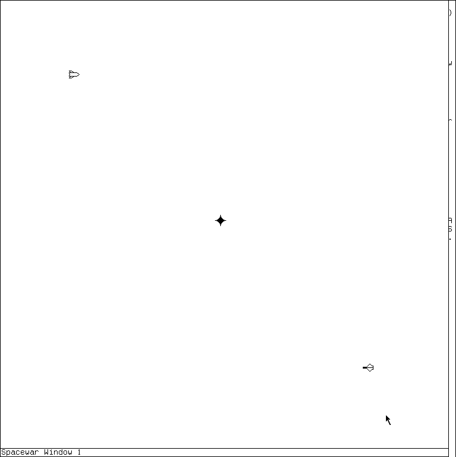

# Spacewar on the MIT Lisp Machine

The Lisp Machine Spacewar is a complete two-player real-time game, not a static
graphics demonstration. Two ships share a wraparound or reflecting playfield,
accelerate and rotate under player control, fire limited-lifetime torpedoes, feel
inverse-square gravity from an optional sun, collide, and can escape temporarily
through risky hyperspace. Its maintained LM-3 form is also unusually Lisp-machine
specific: the playfield is a selectable window and a Lisp Listener, every moving
object is rendered as a character blinker, and the `SHIP` raster font is a sprite
sheet containing the sun, torpedo, and rotated ship images.

This page documents two public implementations:

- the released MIT CADR System 46 source at commit
  [`8e978d7`](https://github.com/mietek/mit-cadr-system-software/blob/8e978d7d1704096a63edd4386a3b8326a2e584af/src/lmio1/swar.2),
  whose accompanying loader starts the game immediately; and
- the maintained LM-3 System 303 implementation at Fossil check-in
  [`4df393c`](https://tumbleweed.nu/r/sys/file?ci=4df393c68d7f083ce42d5c377039d26043cc18a9031ace28258dc97f4137eb91&name=io1%2Fswar.lisp),
  which adds the dedicated window, introductory display, System-key selection,
  abstract key-state input, and several tuning and lifecycle changes.

The runtime claims are narrower than the source claims. On 18 July 2026, the
repository's isolated System 303 harness loaded the exact public source and public
`SHIP` QFASL through its local FILE server, displayed the introductory window, and
entered a live game. The resulting playfield showed both ship designs and the sun.
Starting the game was verified; every control is established by the implementation,
but this run did not separately demonstrate all ten player inputs or a complete
match.

## What it looks like



The capture shows the initial live playfield after the start modifier was pressed.
The left ship begins near the upper-left pointing right, the right ship near the
lower-right pointing left, and the sun at the center. The published image is a
768-by-770 crop of the exact framebuffer: it retains the complete Spacewar window
and removes only an unrelated split-screen debugger beneath it. No retained pixel
was redrawn.

The outlines are glyphs, not vector paths or independent bitmap objects. The
[`SHIP` specimen sheet](../assets/mit-cadr-qfasl-fonts/sheets/ship.png) shows the
underlying public raster font. The game directly addresses a torpedo and sun plus
two runs of 32 ship orientations, beginning at character `@` for the left design
and the backquote character for the right design. The recovered QFASL contains 67
glyphs; Spacewar's source directly assigns 66 character positions. No source-backed
purpose has been established for the remaining recovered glyph, so this page does
not invent one.

## Starting, selecting, pausing, and stopping

### Released System 46 path

The public loader [`lmio1/load.swar`](https://github.com/mietek/mit-cadr-system-software/blob/8e978d7d1704096a63edd4386a3b8326a2e584af/src/lmio1/load.swar)
declares the `SPACEWAR` package, loads `lmio1;swar` and `lmfont;ship`, prints the
form used to stop the game, and calls `SPACEWAR:SPACEWAR`. A contemporary
`INFO-LISPM` record gives the compact user route:

```lisp
(load "lmio1;load swar")
```

The released implementation creates a process and global roving blinkers. It does
not define the later `SPACEWAR-WINDOW`, introductory Listener, or System `W` entry.

### Maintained System 303 path

System 87 release notes instead say to load `SYS:IO1;SWAR` and call the entry point:

```lisp
(spacewar:spacewar)
```

`SPACEWAR` presets and enables the reusable `Spacewar` process. `INIT` loads
`SYS:FONTS;SHIP QFASL` if necessary, creates and selects a square
`SPACEWAR-WINDOW`, explains the controls, and waits until any Control, Meta, Super,
or Hyper modifier is depressed. It then clears the explanatory display, creates
the sun and both ships, and enters the simulation loop.

The maintained implementation registers System key `W` with the label
`Spacewar!`. This selects or creates the Spacewar window through the ordinary TV
system-key registry. The three explicit lifecycle operations are:

| Operation | Effect established by source |
| --- | --- |
| `SPACEWAR:SPACEWAR` | Preset the persistent process to `SPACEWAR-TOP-LEVEL` and enable it. The top level repeatedly initializes and runs games. |
| `SPACEWAR:FREEZE` | Revoke every current run reason from the Spacewar process, stopping simulation activity without deleting the game objects. |
| `SPACEWAR:RESUME` | Enable the existing Spacewar process again. |
| `SPACEWAR:STOP-SPACEWAR` | Hide every current object blinker and revoke all run reasons, stopping the process and removing ships, torpedoes, and sun from view. |

`FREEZE` and `RESUME` are additions in the maintained source; the System 46
version supplies only start and stop. Neither version has a score table, single
player mode, network mode, save file, or independent settings dialog in the
inspected source.

## Complete player controls

The game reads the two physical shift-key banks as ten separate continuous
controls. The names and directions below follow `SHIP-KEY-ALIST` and its source
comment; they are not inferred from modern keyboard conventions.

| Ship | Lisp-machine key | Direct action |
| --- | --- | --- |
| Left ship, `FOO` | Left Top | Accelerate forward while fuel remains. |
| Left ship, `FOO` | Left Super | Turn right at `SHIP-TURNING-RATE`. |
| Left ship, `FOO` | Left Hyper | Turn left at `SHIP-TURNING-RATE`. |
| Left ship, `FOO` | Left Control | Fire a torpedo when ammunition remains and the reload interval has elapsed; holding the key fires at the maximum allowed rate. |
| Left ship, `FOO` | Left Shift | Enter hyperspace when its reload interval has elapsed. This is Shift, deliberately not the Hyper key used for turning. |
| Right ship, `BAR` | Right Top | Accelerate forward while fuel remains. |
| Right ship, `BAR` | Right Super | Turn right at `SHIP-TURNING-RATE`. |
| Right ship, `BAR` | Right Meta | Turn left at `SHIP-TURNING-RATE`. |
| Right ship, `BAR` | Right Control | Fire under the same ammunition and reload rules. |
| Right ship, `BAR` | Right Shift | Enter hyperspace under the same delay, random-return, and failure rules. |

There is one additional start-only input: while the introductory display is
visible, depressing any Control, Meta, Super, or Hyper key begins the game. The
start predicate does not include Top or Shift. Once play begins, the simulation
polls the ten side-specific states above on every cycle rather than consuming
ordinary input characters.

The System 46 program implements the same logical five controls per ship with raw
bits from the keyboard's Unibus register at octal address `764126`. It also exposes
`RB` for reading that register and `DB` for substituting a debugging bit mask. The
maintained source removes the hardware address, bit table, `RB`, and `DB`; it uses
`TV:KEY-STATE` names such as `:LEFT-CONTROL`. That is a real portability change,
not merely a spelling update.

## Simulation and rendering architecture

### Clock and coordinate system

The maintained game requests ten cycles per second (`CPS = 10`) and uses 1,000
internal position units per display dot (`UPD = 1000`). Each cycle:

1. waits until the next scheduled time;
2. waits if the Spacewar window is not exposed;
3. decodes held controls;
4. returns any ships whose hyperspace delay has expired;
5. expires old torpedoes and checks the end condition;
6. detects collisions;
7. moves, accelerates, and rotates objects; and
8. applies gravity.

The order matters. A held control alters acceleration or angular velocity before
movement physics later in the same cycle; gravity is applied after the position
update and therefore affects subsequent movement. This ordering is an
implementation finding not stated on the introductory screen.

The maintained window chooses its inside size from the smaller screen dimension
minus 20 dots. The playable minimum is five dots inside each edge and the maximum
is six dots short of the computed size. System 46 instead hard-codes a much larger
coordinate rectangle, with maxima of 1,377 by 1,530 dots, and renders through
global roving blinkers rather than a dedicated square window.

### Objects and sprite glyphs

Each sun, ship, or torpedo is an `OBJECT` array structure. Its fields include type,
sprite base character, collision radius symbol, position and velocity, acceleration,
orientation and angular velocity, unit-vector projections, collision function,
immovability, ammunition and fuel, last-fire and last-hyperspace cycles, blinker,
and death state.

The rendering is deliberately small:

- a ship is a `TV:CHARACTER-BLINKER` whose character changes among 32 consecutive
  glyphs as its angle changes;
- a torpedo is another character blinker using the first sprite character;
- the sun uses the next sprite character and is marked immovable; and
- object motion changes the blinker's cursor position after rounding internal
  coordinates to display dots.

This design makes the font part of the executable visual logic. Removing or
replacing `FONTS:SHIP` does not merely change typography; it removes the shapes
that communicate object type and direction. The broader sprite-font evidence is
cataloged in [the CADR visual-assets inventory](visual-assets-inventory.md#graphical-fonts-as-sprite-and-symbol-stores)
and [font-usage audit](font-usage-audit.md#direct-runtime-uses).

### Motion and the playfield edge

With the default `WALL-BOUNCE = NIL`, an object crossing an edge reappears at the
opposite edge. Setting it true reflects both position and the corresponding
velocity component; the loop permits repeated reflection when one cycle would
cross more than one boundary.

The collision detector sorts all objects by horizontal position, then stops
comparing once later objects are too far away. This normally reduces the work from
all-pairs quadratic scanning toward a linear pass. The source explicitly retains a
left-edge exception in the stopping test because wraparound can put an object near
the left edge in collision range of one near the right edge. The optimization is
thus aware of the topology rather than treating screen coordinates as an ordinary
bounded plane.

The effective collision threshold is the greater of the two objects' summed radii
and `TORP-TORP-COLLISION-DISTANCE`. The latter is intentionally larger than two
torpedo radii, making defensive torpedo-to-torpedo interception easier. The same
minimum applies to any pair whose radii sum to less than it, a broader effect noted
in the source comment.

### Sun and gravity

The sun is stationary and does not itself take collision damage. Every movable
object receives an acceleration directed toward each sun, scaled by the inverse of
the squared distance. The default collision policy is `:CORNER`: contact sets an
object's velocity to zero and moves it to the minimum horizontal and vertical
coordinates. Setting the policy to true instead invokes the object's ordinary
collision function; setting it to another value, including `NIL`, leaves no
source-defined collision effect.

### Torpedoes, death, and the end of a game

A fired torpedo begins just beyond the firing ship's and torpedo's combined radii.
Its velocity is the ship's current velocity plus a forward component, so it
inherits the motion of its launcher. Firing decrements the ship's supply and
records the current cycle. Each torpedo becomes eligible for removal after its
lifetime, and collided or expired torpedo objects are kept on a free list for
reuse rather than repeatedly allocated.

A ship collision stops its acceleration and rotation, makes its blinker flash,
and sounds a ship-specific death tone—1,000 for `FOO`, 2,000 for `BAR`—for the
same fixed duration. It also schedules the game to end after the death delay.

If no ship has fuel or torpedoes and no fired torpedo remains on screen, the game
beeps and schedules the same delayed ending. `SPACEWAR-TOP-LEVEL` then starts a new
game rather than terminating the process. The inspected implementation does not
record a winner, count kills, or preserve results across that restart.

### Hyperspace

Hyperspace removes the ship from the active-object list and hides its blinker.
After the delay, the ship returns at a random position, with a random orientation
and a fixed-magnitude velocity in a random direction. It has a 12 percent chance
of immediately invoking its death function. The reload timer is recorded on
return, so the source-defined delay between entries is measured from reappearance,
not departure.

## Complete tunable game parameters

Changing parameters from the Spacewar Listener is described by the program itself
as a traditional part of the game. The following table accounts for every
user-designated parameter before the source's “not interesting for the user”
boundary.

| Variable | Maintained default | Meaning and when it takes effect |
| --- | ---: | --- |
| `SHIP-ACCELERATION` | 4,000 internal units per cycle squared | Forward engine acceleration while Top is held. |
| `SHIP-TURNING-RATE` | `0.50` radians per cycle | Signed angular velocity selected by the two turn keys. |
| `SHIP-TORP-SUPPLY` | 40 per ship | Ammunition copied into each ship at game initialization. |
| `TORP-RELOAD-TIME` | 6 cycles, 0.6 seconds | Minimum interval between successful shots. |
| `TORP-VELOCITY` | 10,000 internal units per cycle | Forward velocity added to the firing ship's velocity. |
| `TORP-RADIUS` | 3 dots | Torpedo contribution to ordinary collision distance. |
| `SHIP-RADIUS` | 9 dots | Ship contribution to collision distance and torpedo launch offset. |
| `TORP-LIFETIME` | 60 cycles, 6 seconds | Time from firing until expiration. |
| `TORP-TORP-COLLISION-DISTANCE` | 10 dots | Minimum collision threshold used when summed radii are smaller. |
| `SHIP-FREQ-ALIST` | `FOO` 1,000; `BAR` 2,000 | Death-beep tone chosen by ship name. |
| `WALL-BOUNCE` | `NIL` | False wraps through edges; true reflects position and velocity. |
| `DEATH-DELAY` | 30 cycles, 3 seconds | Delay between a death or exhausted game and the next initialization. |
| `SHIP-FUEL-SUPPLY` | 500 cycles, 50 seconds of thrust | Fuel copied into each ship when a game starts and decremented only during acceleration. |
| `SUN-FLAG` | `T` | Whether `INIT` creates a sun. Takes effect at the next game initialization. |
| `SUN-COLLISION-FLAG` | `:CORNER` | True means ordinary collision, `:CORNER` relocates and stops the object, other values have no defined effect. |
| `MASS-OF-SUN` | expression corresponding to 2,000 in the source's ten-dot acceleration convention | Strength of inverse-square gravitational acceleration. Negative values produce repulsion, the example suggested by the introductory display. |
| `SUN-RADIUS` | 8 dots | Sun contribution to collision distance. |
| `HYPERSPACE-RELOAD-TIME` | 50 cycles, 5 seconds | Minimum time after a return before another entry. |
| `HYPERSPACE-DELAY` | 30 cycles, 3 seconds | Time spent hidden and absent from physics. |
| `HYPERSPACE-DEATH-PROBABILITY` | `0.12` | Probability of dying immediately on return. |
| `HYPERSPACE-VELOCITY` | 15,000 internal units per cycle | Fixed magnitude of randomly directed return velocity. |

`CPS`, `UPD`, and `HALF-UPD` define the simulation quantization rather than an
ordinary game option. Because most defaults are expressed through them, changing
those constants after the file is loaded does not automatically recompute values
already stored in the parameter variables.

## System 46 to System 303 changes

The two files retain the same object model, collision families, gravity,
hyperspace rules, game-ending logic, and five controls per player. Their differences
show how a hardware-oriented demonstration became an integrated window-system
application.

| Area | Released System 46 | Maintained System 303 |
| --- | --- | --- |
| Display ownership | Global roving blinkers and fixed screen coordinates. | Dedicated boxed Listener window sized to the current screen; simulation waits while it is not exposed. |
| Discovery | Load script starts the process and prints the stop form. | Source registers System `W`; `SPACEWAR` documents that it creates and selects the window. |
| Introduction | No source-defined introductory window. | Multi-paragraph control display and modifier-to-start gate. |
| Keyboard | Raw inverted Unibus bit register, fixed octal masks, and `RB`/`DB` diagnostic hooks. | Side-specific `TV:KEY-STATE` names, eliminating the physical register address and debug mask. |
| Lifecycle | Start and stop. | Start, `FREEZE`, `RESUME`, and stop. |
| Playfield | Fixed 1,378-by-1,531-dot coordinate extent. | Square extent derived from the current screen. |
| Engine tuning | Acceleration `20`, turning `0.30`, sun mass `1,000` in the source's display-scale convention. | Acceleration `40`, turning `0.50`, sun mass `2,000`; several division/fix operations modernized to `TRUNCATE` or `ROUND`. |
| Blinkers | Older `TV-DEFINE-BLINKER` and direct slot/function operations. | Window-owned `TV:MAKE-BLINKER` objects and message-based character, position, and visibility changes. |
| Object motion | The movement loop updates every object, including the sun. | Explicitly skips immovable objects, consistent with the sun's `OBJECT-IMMOVABLE-FLAG`. |

The maintained code also removes duplicate free torpedoes during initialization.
These are source-established implementation differences; they should not be turned
into a claim that every historical intermediate system changed at the same time.

## Runtime verification

### Reproduced route

Session `spacewar-d55-20260718`, generation 1, booted the repository's fresh
`System 303-0` disk under Xvfb. The local Chaos host was `LOCAL-BRIDGE`; the FILE
server root exposed the public System tree as `tree`. Ordinary `MAKE-PATHNAME`
components are canonicalized to uppercase, which does not identify the lowercase
Unix files reliably. The successful route therefore used raw components:

```lisp
(load (fs:make-pathname
        :host "LOCAL-BRIDGE"
        :raw-directory '("tree" "io1")
        :raw-name "swar"
        :raw-type "lisp"))

(load (fs:make-pathname
        :host "LOCAL-BRIDGE"
        :raw-directory '("tree" "fonts")
        :raw-name "ship"
        :raw-type "qfasl"))
```

The source reported that it loaded into package `SPACEWAR`; the font reported
package `FONTS`. Calling `SPACEWAR:INIT` synchronously selected the real window and
displayed its own introduction. A held left Control key satisfied the source-defined
start predicate. The live playfield then showed both opposed ship glyphs and the
central sun. The runtime did not contact an external peer, alter the public source
trees, or write the base disk.

The initial attempt to call the asynchronous `SPACEWAR` entry from inside an
unrelated nested Listener debugger left the background process unable to claim its
display cleanly. That was harness setup noise, not a game defect. Returning to the
Listener top level and invoking `INIT` produced the expected window. The article's
behavioral claims rely on that successful state and the source, not on the failed
exploratory screens.

### Capture and session identity

| Item | Recorded value |
| --- | --- |
| Guest | Experimental System 303.0; load band `System 303-0` |
| Session interval | 2026-07-18 11:48:05–12:17:26 EDT |
| Public and private-start disk SHA-256 | `bb16e46ad81decfe1efe691d36b6aa4ce3fd4ffb82474365de3520989d397cb5` |
| Public System check-in | `4df393c68d7f083ce42d5c377039d26043cc18a9031ace28258dc97f4137eb91` |
| Public emulator revision | `330d8248ec2e12af071e287920e681600f75df9ffd854aada5f8a64c9adad64d` |
| Executed emulator SHA-256 | `707a77d23e28ea1c45ae0eb0145dc181fa7ba649b9defc30044d4f847ac2c5be` |
| Toolchain manifest SHA-256 | `3adae999bbe420182f22adc2499fcc82449a46eaf580a362de9c0e718fa6b37d` |
| Raw capture | `0031-spacewar-game-started.png`, 768 by 963; PNG SHA-256 `550d87596d4cc2efd1be24ab58f8955dedf509d9b8515ee98e4492fc2d577f91`; decoded-pixel SHA-256 `356fb32cb25aae5b83aa324cecc4d508900a8accf0217aabd3f7e9eee82a96a5` |
| Curated crop | `spacewar-game.png`, 768 by 770; PNG SHA-256 `c61ba8b27ae2bc50e50de89ea58b35e8825d96fc5daebc24cc2244f2417584c6`; decoded-pixel SHA-256 `fadbc91f7c98825bf1dac2d8a100e9992f6933e934ec58503ad0dff5e8d9cff9` |
| Raw sidecar | 4,412 bytes; SHA-256 `1589849578c31e5c4952052f874c1d891c5fff7a0f27a56a8c377264c4311d83` |
| Final run record | 6,836 bytes; SHA-256 `23ae924f1a71fd7aaa2def9f1a8a2e99f76d05422af1d96752cd7494405981bc` |
| Shutdown | Clean; no forced stop, complete state, emulator and Xvfb exit status zero, public base disk unchanged |

## Artifact provenance

All local paths below are repository-relative descriptions. Licensed Genera media
was not used for this dossier.

| Artifact | Bytes | SHA-256 | Use |
| --- | ---: | --- | --- |
| Maintained `io1/swar.lisp` | 25,927 | `c37346160f0c9a639a8cec5ea2b77f7b55c74c4fbaaeda9a1e6a6baff3dc06b2` | System 303 implementation and runtime-loaded source |
| Released `lmio1/swar.2` | 24,006 | `476ba7e388a19e73decefb54beacf0e102311f483fef6506510b065128979d98` | System 46 comparison |
| Released `lmio1/load.swar` | 165 | `85085c0460fda2e11fc08ffb497d0bf11430f8d90f0650185181707e90a30c86` | Contemporary entry and stop route |
| Maintained `fonts/ship.qfasl` | 10,136 | `3a659de8e98c1ea337785fae1ddca3c8a9446246e3ea00cdec1db2e48e680b24` | Runtime-loaded sprite font |
| Released `lmfont/ship.qfasl` | 13,059 | `385a8bd82f4d3d0edf35a341fefba0259c30d773230460376a4ae1875a7af553` | System 46 public font witness |
| Recovered `SHIP` JSON | 35,051 | `3010fa088808509fe6594b7abf4ca971120fbfba9cd7c94baa73956738543599` | Public normalized glyph evidence |
| Recovered `SHIP` BDF | 15,009 | `0d092631e4f8936e324e271262c3e4b992c6221a8ab11d23efa4fbb0705e7097` | Public interoperable bitmap font |
| Recovered `SHIP` specimen PNG | 8,407 | `f4538c4e64de8f530e4ea670ec5b02a58df4185371a32ced9bce109ad607562b` | Human-readable sprite inventory |
| Maintained `doc/sys87.msg` | 38,059 | `59decde8a629f81ddad5f468f1d04b6e71d89d3acd30dde6725334a9dd8cc045` | System `W` release-note entry and invocation |
| Released `lmdoc/info.lispm` | 74,127 | `84f158cfbf9c0a758955f9cdfb6ca874f79696ea5d1b793576205678fcfbae67` | 1979 loader instruction |

## Findings and open questions

- **Observed:** the maintained public source and QFASL load and produce a live game
  in the isolated System 303 harness.
- **Source-established:** all controls, defaults, physics, collision rules,
  Listener integration, and System-key behavior above.
- **Interpretation:** the shift from raw Unibus bits and global blinkers to named
  key states and a selectable Listener window is an integration and portability
  change, while the game model remains recognizably the same.
- **Open:** a controlled run should map every left/right modifier in the current
  host keyboard layer and capture a torpedo, thrust, turn, and hyperspace return.
  The absence of those captures does not make their code-defined behavior unknown,
  but it leaves emulator-keyboard interoperability unverified for each control.
- **Open:** the recovered `SHIP` font has one glyph beyond the 66 character
  positions directly assigned by the inspected game. Its intended use remains
  unknown.
- **Open:** authorship and the exact revision chain between the 1979 information
  record, released System 46 file, and maintained System 303 edits require a
  separate history study. This page does not infer authorship from package or file
  names.

## Sources

- MIT CADR System Software, [released System 46 `swar.2`](https://github.com/mietek/mit-cadr-system-software/blob/8e978d7d1704096a63edd4386a3b8326a2e584af/src/lmio1/swar.2),
  [`load.swar`](https://github.com/mietek/mit-cadr-system-software/blob/8e978d7d1704096a63edd4386a3b8326a2e584af/src/lmio1/load.swar),
  and [`SHIP` QFASL](https://github.com/mietek/mit-cadr-system-software/blob/8e978d7d1704096a63edd4386a3b8326a2e584af/src/lmfont/ship.qfasl),
  commit `8e978d7d1704096a63edd4386a3b8326a2e584af`.
- Maintained LM-3 System source, [System 303 `io1/swar.lisp`](https://tumbleweed.nu/r/sys/file?ci=4df393c68d7f083ce42d5c377039d26043cc18a9031ace28258dc97f4137eb91&name=io1%2Fswar.lisp),
  Fossil check-in `4df393c68d7f083ce42d5c377039d26043cc18a9031ace28258dc97f4137eb91`.
- [CADR compiled-QFASL font recovery](compiled-qfasl-font-recovery.md) and
  [font-usage audit](font-usage-audit.md), for the tracked `SHIP` recovery and its
  source-established role.
- [CADR computer-use harness](cadr-computer-use-harness.md), for the isolated
  runtime and provenance model used by the live observation.
