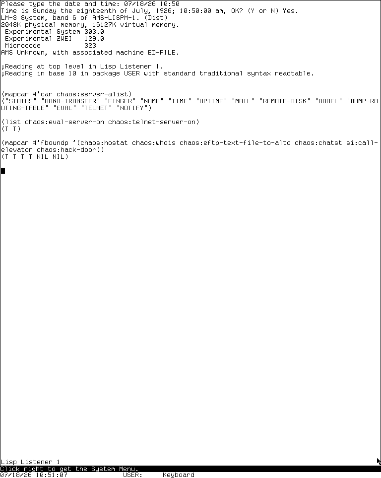
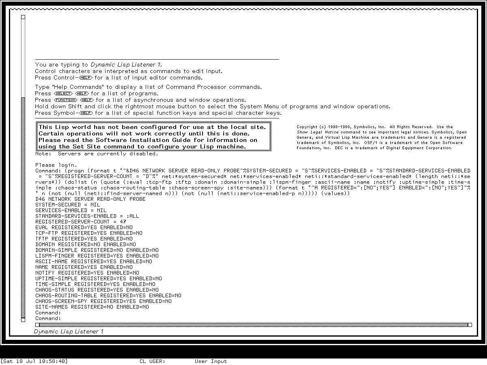

# Network services and site utilities on CADR and Genera

The service layer changed more radically than its familiar contact names suggest.
MIT System 46 registers a small group of Chaosnet servers directly in a global
alist. Maintained LM-3 System 303 retains that mechanism and grows it to thirteen
live contacts, including remote evaluation and a Telnet server that enter the Lisp
environment. Genera 8.5 instead has a generic, medium-independent server registry,
per-service enablement, trusted-host policy, secure server environments, process
and who-line integration, and operator commands for controlling the whole set.

The preserved worlds also demonstrate why source presence must not be confused with
site operation. The live System 303 load band registered thirteen Chaos services
and had its `EVAL` and `TELNET` server switches true. The isolated Genera world had
47 registered core services, but all services were disabled, and the optional
Domain Name Server and example Finger service were not loaded. This study only read
registries, variables, and function cells. It did not enable a service, open a
listener, contact a peer, expose the sandbox, or invoke any historical building
control.

This dossier is complete at the **registered-service, public operator entry-point,
and directly defined command grain**. It inventories every System 46 service
registration, every live System 303 contact observed in the preserved band, all 31
commands dispatched by the inspected Genera FTP server, the TFTP modes and safety
checks, every directly defined Domain Server command, the Show Users options and
Function-F interaction, and every directly exposed TCP diagnostic named below. It
does not reproduce a protocol specification or proprietary Help text, enumerate
internal helper functions, or claim behavior for a service absent from the running
world.

## Evidence, release boundaries, and neighboring dossiers

| Boundary | Evidence | What it establishes |
| --- | --- | --- |
| MIT System 46 | Public source at Git revision [`8e978d7`](https://github.com/mietek/mit-cadr-system-software/tree/8e978d7d1704096a63edd4386a3b8326a2e584af) | The seven directly registered services, Hostat and Finger clients, EFTP entry points, and active MIT-local elevator and door hooks |
| LM-3 System 303 | Maintained public Fossil tree at check-in [`4df393c`](https://tumbleweed.nu/r/sys/info/4df393c68d7f083ce42d5c377039d26043cc18a9031ace28258dc97f4137eb91), the associated Chaos and site trees, and a fresh read-only runtime probe | The later service implementation, its defaults, and the exact thirteen-contact registry in the preserved `System 303-0` band |
| Symbolics Genera 8.5 | Licensed Open Genera source release 452, locally decoded installed Help used as evidence, public Genera 8 manuals, and a fresh read-only runtime probe | The server framework, FTP/TFTP/DNS implementations, user-query interfaces, diagnostics, defaults, and the load boundary of this world |

The [network-transport dossier](network-transports-and-protocol-architecture.md)
explains packets, Chaos connections, Ethernet, IP, TCP, UDP, RPC, NFS transport,
routing, and EFTP's PUP-family wire mechanism. The [file-service dossier](file-systems-and-file-service.md)
covers QFILE, NFILE, NFS, and file access paths. The
[operations-dashboard dossier](background-services-and-operations-dashboards.md)
covers the Genera Mailer, Printer, Domain, and File Server frames plus shared Server
Utilities logging. [Network terminal applications](network-terminal-applications.md)
covers client Telnet, Supdup, and terminal sessions. `CHATST` is placed here only
at the catalog boundary; its hardware-register interface belongs in the CADR
diagnostics dossier.

System 303 is a maintained restoration branch, not proof that every later facility
was present in System 46. Proprietary Genera source was inspected locally and is
identified by checksum, but it is neither reproduced nor offered as redistributable
source.

## The service model across three generations

| Concern | System 46 | Maintained System 303 | Genera 8.5 |
| --- | --- | --- | --- |
| Registration | contact name to initializer in `CHAOS:SERVER-ALIST` | same alist, expanded service family | generic server objects keyed by service/protocol and medium |
| Normal execution | initializer or simple-server function | initializer, simple server, or per-connection process | configurable process creation; simple and non-simple server paths |
| Enablement | registration generally makes a contact available; selected servers have their own booleans | registration plus local booleans for sensitive services | global and per-service enablement, with startup dialogue and Command Processor controls |
| Trust boundary | site assumptions and service-specific checks | site assumptions; sensitive defaults can be permissive | trusted host/network/address policy, secure-server environment, and filesystem access-group restriction |
| Operator visibility | Lisp Listener, who-line, Hostat, Peek | Listener, who-line, Hostat, Peek, notifications | Command Processor, Peek, active-server who-lines, service-specific frames, logs, and notifications |
| Preserved-world observation | no compatible band operated | thirteen contacts; `EVAL` and `TELNET` switches true | 47 registrations; all disabled; optional DNS and example Finger absent |

## MIT System 46 services

### The seven direct registrations

The final `src/lmio/chsaux.113` snapshot directly adds these contacts to
`CHAOS:SERVER-ALIST`:

| Contact | Contract and purpose | Important boundary |
| --- | --- | --- |
| `SEND` | accepts an interactive message for a logged-in user or local display | messaging behavior is covered with Converse and notifications; it is not electronic mail storage |
| `FINGER` | returns local user/session information | a simple request/answer service |
| `NAME` | returns user-directory information over a byte stream | distinct from host-address namespace lookup |
| `MAIL` | consumes recipient lines and rejects them with a direction to use the site's message facility | deliberately a dummy compatibility endpoint, not a mail-delivery implementation |
| `REMOTE-DISK` | reads or writes raw disk blocks and accepts a short displayed message | privileged diagnostic facility; unsafe on preservation media |
| `EVAL` | reads and evaluates Lisp forms when its gate permits | remote code execution, not a benign query service |
| `SPY` | supports remote screen inspection | privacy-sensitive and not exercised here |

`TIME`, `UPTIME`, `BABEL`, `TELNET`, and `NOTIFY` are not in this System 46
registration list. They are later System 303 evidence and must not be projected
backward merely because the maintained file retains related code.

### Hostat, Finger, and Name

`CHAOS:HOSTAT` sends parallel simple `STATUS` requests. With explicit host
arguments it queries those hosts; without arguments it traverses known Chaos
hosts. The implementation waits up to five seconds, allows a typed character to
abort the wait, and prints each host's address, name, status, and subnet counters.
This is a network query, not the local controller-status function that also bears
the name `STATUS`.

The Finger client obtains the short user/session record, while Name uses a byte
stream and can return directory-oriented fields such as user identifier, location,
idle state, personal name, and group. The System 46 keyboard layer makes Finger a
site navigation tool: `Terminal Escape F` defaults to the AI host, while numeric
arguments select a prompt, local Lisp Machines, MC, or AI and MC. Those defaults
are MIT site policy embedded in this snapshot, not a portable Lisp-machine user
interface.

### Dummy mail, raw remote disk, evaluation, and screen spying

The `MAIL` server reads the proposed recipient sequence so an older client gets a
well-formed rejection, then directs the user to the message-sending facility.
Describing it as a “mail server” without the dummy qualifier would falsely imply
delivery, queuing, or mailbox storage.

`REMOTE-DISK` accepts three command families:

| Command shape | Effect |
| --- | --- |
| `READ unit block n-blocks` | transmit raw blocks from the selected unit |
| `WRITE unit block n-blocks` | receive and overwrite raw blocks on the selected unit |
| `SAY text` | display a short message locally |

The write path can destroy a band, filesystem, or label. The museum will not run it
against preserved disks. Its presence is documented because it explains historical
maintenance capability, not as an operational recommendation.

System 46's remote evaluator is off by default. It accepts a connection only when
explicitly enabled or when no user is logged in. When admitted, it reads Lisp forms,
evaluates them in the machine, and returns results. The `SPY` contact similarly
crosses an important boundary by exposing a screen. Both should be treated as
trusted-site-era facilities rather than exposed on an untrusted modern network.

## EFTP as a user-facing transfer service

EFTP supplies four high-level calls in both inspected MIT generations:

| Entry point | Direction and translation |
| --- | --- |
| `EFTP-BINARY-FILE-TO-ALTO` | local binary file to the remote peer |
| `EFTP-BINARY-FILE-FROM-ALTO` | remote binary file to the local machine |
| `EFTP-TEXT-FILE-TO-ALTO` | local text file with Lisp-machine-to-ASCII conversion |
| `EFTP-TEXT-FILE-FROM-ALTO` | remote text file with ASCII-to-Lisp-machine conversion |

The service builds readable or writable streams and implements a stop-and-wait
transfer with data, acknowledgement, end, and abort packet types. It is not the
later Internet FTP protocol and it does not prove that System 46 contained a
standalone Ethernet driver: both inspected implementations carry their PUP-family
traffic through the Chaos foreign-protocol path. Packet sizes, retransmission,
checksums, ports, and encapsulation differences are inventoried in
[EFTP's transport section](network-transports-and-protocol-architecture.md#eftp-is-a-foreign-protocol-carried-by-chaos).

## MIT-local physical and novelty utilities

### System 46 elevator and door controls

Three tiny functions expose how tightly the machine could be integrated with its
building and neighboring hosts:

| Entry | Source-visible behavior | Runtime policy |
| --- | --- | --- |
| `CALL-ELEVATOR` | at Tech Square floor 8 sends `DOOR 8`; at floor 9 sends `DOOR 9` | never run; it targeted physical infrastructure |
| `BUZZ-DOOR` | at floor 9 sends `DOOR D` | never run; it targeted a door mechanism |
| `HACK-DOOR` | contacts the AI host's simple door server | never run; the external service and authorization are absent |

The keyboard layer binds `Terminal Escape D` to the door buzz and `Terminal Escape
E` to the elevator, conditionally advertising them only on the relevant floors and
beeping after the request. The companion PDP-10 MIDAS program maps `D`, `8`, and
`9` to hardware operations: the door path remains energized for about three
seconds and the elevator path for about one third of a second. These durations are
historical implementation facts, not instructions for recreating or contacting a
building-control service.

In maintained System 303 the corresponding function and keyboard forms are inside
comments or block comments, and the live probe found neither `SI:CALL-ELEVATOR` nor
`CHAOS:HACK-DOOR` fbound. This is direct evidence of removal from the active world,
not merely a missing network route.

### Other site-specific clients

System 46 includes a `LIMERICK` client to the MC host. Maintained System 303 retains
or adds small clients whose names encode their historical site:

| Entry | Contact/host role |
| --- | --- |
| `LIMERICK` | request the MC `LIMERICK` service |
| `BYE` | contact the configured XX/OZ service |
| `TINGLE` | send a Name request toward the CMU host named by the source |
| `YOW` | contact the CCC service |
| `LSC` | contact the EE service |
| `QUICK-SERVER-STRING` | shared short request/response helper for such utilities |

They are clients of external site services, not local daemons. Their exact remote
results cannot be reconstructed from the Lisp-machine code alone and were not
requested over the isolated museum network.

## Maintained System 303 service family

### Exact live registry

The fresh `System 303-0` probe evaluated `(MAPCAR #'CAR CHAOS:SERVER-ALIST)` and
returned, in order:

```text
STATUS, BAND-TRANSFER, FINGER, NAME, TIME, UPTIME, MAIL,
REMOTE-DISK, BABEL, DUMP-ROUTING-TABLE, EVAL, TELNET, NOTIFY
```

That is thirteen total contacts. `STATUS` and `BAND-TRANSFER` are registered outside
the auxiliary service file; the remaining eleven come from the later `chsaux.lisp`.
The screenshot preserves the exact Lisp list, the two sensitive default values, and
a small function-cell probe:



*Runtime observation, 2026-07-18: public LM-3 `System 303-0`, after reading the
service alist, `EVAL`/`TELNET` gates, and six function cells. No service or hardware
operation was invoked. This low-resolution frame is published as research evidence
under the capture-specific fair-use review; MIT and other applicable interests are
not licensed by this repository, and no endorsement is implied.*

### Query, time, notification, and diagnostic services

| Service or client | Maintained behavior at the inspected source boundary |
| --- | --- |
| `FINGER`, `NAME`, `WHOIS` | parse responses from ITS, TOPS-20, WAITS, Unix, Multics, VMS, TOPS-10, and Lisp Machine formats; search one user or enumerate local/all/free/down Lisp Machines |
| `TIME` | return canonical time as a 32-bit count of sixtieths |
| `UPTIME` | return elapsed running time in the same time family |
| `BABEL` | continuously repeat a printable character string for connection testing |
| `DUMP-ROUTING-TABLE` | print local routing information to the requester |
| `NOTIFY` | display remote text, suppressing an immediately repeated duplicate |
| `NOTIFY`, `NOTIFY-ALL-LMS` clients | send one entered message to a host or local Lisp-machine set; interactive input ends with End |
| `PRINT-HOST-TIMES` | compare returned host times |
| `RESET-TIME-SERVER` | reset cached time-service state |
| `SHOW-ROUTING-TABLE`, `SHOW-ROUTING-PATH` | query and interpret remote routing state; transport details are in D45 |

`SPELL` is a client of a configured external spelling service, not a server in the
thirteen-contact list. `CHATST` is likewise not a network service. It is a low-level
Chaos-interface board test with register reads/writes, packet loops, resets, echo,
buzz, monitor, status, and soak/continuous tests. It was not run and belongs in D51.

### EVAL and TELNET are active attack surfaces in this band

The maintained source initializes both `CHAOS:EVAL-SERVER-ON` and
`CHAOS:TELNET-SERVER-ON` true, and the runtime probe observed `(T T)`. The evaluator
reads forms, evaluates them, and prints all returned values. The Telnet server emits
a Lisp-machine herald, performs a small set of Telnet negotiations and character
translations, then enters the machine's Lisp top level. These are remote access to
the Lisp environment, not protocol diagnostics.

The preservation harness had no external route and did not establish a Chaos peer,
but isolation is not a substitute for documenting the defaults. A restored System
303 world should not be bridged onto an untrusted network without first disabling or
confining these contacts.

## Genera's generic server framework

### Registration is separate from enablement

`NETI:DEFINE-SERVER` records a service name, medium contract, function, policy, and
execution options. The framework supports byte-stream and datagram servers and can
either call a simple handler or create a managed server process. Direct options
cover host, network, and address acceptance; trusted-host rejection; process and
who-line behavior; EOF and close handling; and error disposition.

The important defaults are conservative relative to System 303:

- a defined server rejects an untrusted requester unless the definition overrides
  that default;
- active server processes normally appear in who-line/service state;
- a non-simple handler runs inside the secure-server environment with LMFS access
  groups restricted;
- an unspecified error disposition produces a notification, while definitions can
  request notification, debugger entry, or ignore behavior explicitly;
- active server instances can be described or closed, and their transient list is
  cleared on warm boot.

`NET:*SYSTEM-SECURED*` was `NIL` in the preserved world. The configured standard
service selection was `:ALL`, but the live enabled-service set was `NIL`. These are
not contradictory: the first says which services the site considers standard if
services are enabled, while the second says none are currently accepting requests.
Before-cold initialization disables the set, and the initial site dialogue decides
whether to turn services on.

The direct operator controls are:

| Command or entry | Effect |
| --- | --- |
| `Enable Services` | enable the standard selection by default, or a specified set |
| `Disable Services` | disable all by default, or specified services |
| `Show Disabled Services` | report global and individual disablement |
| `DESCRIBE-SERVERS` | describe registered and active server state |
| `CLOSE-ALL-SERVERS` | close active instances, for example during shutdown or reconfiguration |

Requests are rejected when the service is disabled. A service configured to reject
untrusted peers is also rejected when its trust test fails. The IP/TCP package guide
adds a site-level rule: Internet hosts or subnets must appear in the site's
`secure-subnets` attribute or access is denied, whereas an absent Chaos entry was
historically treated as trusting Chaos hosts. That asymmetry is important when
restoring an old namespace.

### The live Genera boundary

The runtime probe read only the registry and policy variables. It found 47 registered
core services and these selected registration/enablement pairs:

| Selected contact | Registered | Enabled |
| --- | --- | --- |
| `EVAL`, `TCP-FTP`, `TFTP` | yes | no |
| `LISPM-FINGER`, `ASCII-NAME`, `NAME`, `NOTIFY` | yes | no |
| `UPTIME-SIMPLE`, `TIME-SIMPLE` | yes | no |
| `CHAOS-STATUS`, `CHAOS-ROUTING-TABLE`, `CHAOS-SCREEN-SPY` | yes | no |
| `DOMAIN`, `DOMAIN-SIMPLE`, `SITE-NAMES` | no | no |

The absent final three belong to optional systems not loaded in the base world.
The visible startup notice independently said that servers were disabled.



*Runtime observation, 2026-07-18: licensed Genera 8.5 base world, isolated session
`d46-network-services-genera-20260718`, generation 2. The researcher-entered probe
read policy and registry state only; it did not enable or contact a server. The
minimal functional screen is published beside critical analysis under the
capture-specific fair-use review. Symbolics rights are not licensed by this
repository, and no affiliation or endorsement is implied.*

## Genera Finger, Name, Show Users, and Function F

### Server output and privacy controls

The core Lisp-machine Finger server keeps distinct cached strings for trusted and
untrusted requesters. Site variables can suppress software and hardware information,
WHOIS data, project and supervisor fields, work address and telephone, and home
address and telephone. A site can also override the displayed location. The
`LISPM-FINGER` service accepts untrusted requests, but its response is filtered by
that policy rather than exposing the trusted cache unchanged.

`NAME` and `ASCII-NAME` accept an optional user and a `/W`-style request for fuller
information. They can return the current user and, where directory data exists,
selected WHOIS fields. This is user-directory information; it is not the Domain Name
System and it does not prove a site has configured a directory database.

### Complete Show Users option surface

The directly exposed `Show Users` command accepts these target forms:

- `user`, `user@site`, or `user@host`;
- `@site` or `@host`; and
- a sequence of targets, defaulting to the local site when none is supplied.

Its direct options are:

| Option | Choices and defaults |
| --- | --- |
| format | `Brief`, `Normal`, or `Detailed`; unmentioned users default to brief, specifically mentioned users to normal |
| search | conditionally offered for a user without a site/host; normally true, except detailed queries default not to search |
| order | `Host`, `User`, or `Idle`; an unmentioned set defaults to user order, a mentioned target to idle order |

The output is presentation-sensitive. Selecting a displayed user can invoke a
detailed Show Users request, while selecting a host can invoke a normal request.

Function F is a pop-up interface over the same machinery. With no numeric argument it
uses the login/default site selection. Argument zero reads or prompts for a site;
argument one selects local Lisp Machines. Site dispatch can map a wildcard, numeric
argument, or absent argument to login-associated, local, all, prompted, or explicit
hosts. Its standard display maps to normal format. The pop-up refreshes on a character
and accepts a command presentation selected with the pointer. These mappings are
source-defined behavior, not inferred from the key's letter.

### The optional example Finger server

`examples/server-finger.lisp` is a substantial sample application, not the core
Finger contact. When loaded and enabled at a designated `:server-machine`, it builds
caches for Lisp Machine and non-Lisp-machine results and supports:

| Query | Result family |
| --- | --- |
| blank | busy users |
| `.free` | free-machine aliases such as `Lisp-Machine`, `CM-Hardware-Test`, `Mail-Server`, `ID-WORLD`, and `Zippy` |
| `.all` | combined view |
| `user%host` or `user@host` | explicit host query |
| other user text | cross-host user search, with last-seen fallback |

It regards idle time below one hour as busy, refreshes primary observations every ten
minutes, retains last-seen host data for 24 hours, updates its database file every six
hours, and constrains output width to 116 columns within an accepted 80–132 range.
Site properties can exclude hosts. A companion `SITE-NAMES` contact returns matching
host-prefixed groups and terminates them with `*`.

Warm/now initialization enables the cache and schedules a first scan after 15 minutes,
but only on a host designated as a server machine. Neither this example nor its
`SITE-NAMES` contact was present in the preserved base world, so no output or cache
refresh was exercised.

## Genera Internet FTP server

### Complete command inventory

The inspected dispatcher implements exactly these 31 FTP commands:

| Command | Direct purpose or implemented boundary |
| --- | --- |
| `ABOR` | abort the current transfer/data operation |
| `ALLO` | accept allocation syntax for compatibility |
| `APPE` | append received data to a file |
| `CDUP` | change to the parent directory |
| `CWD` | change working directory |
| `DELE` | delete a file |
| `HELP` | show a command summary or per-command help |
| `LIST` | detailed pathname/directory listing |
| `MKD` | create a directory |
| `MODE` | select stream or block transfer mode (`S` or `B`) |
| `NLST` | short name listing |
| `NOOP` | successful no-operation |
| `PASS` | supply password material for login |
| `PASV` | listen for a passive data connection |
| `PORT` | select the active data endpoint |
| `PWD` | print the current working directory |
| `QUIT` | close the session |
| `REIN` | reinitialize session login/transfer state |
| `RETR` | retrieve a file |
| `RMD` | remove a directory |
| `RNFR` | select a rename source |
| `RNTO` | rename to the destination selected after `RNFR` |
| `SITE` | enter the site-specific subcommand dispatcher |
| `STAT` | report connection/transfer state or pathname details |
| `STOR` | store a received file |
| `STOU` | store under a unique name; equivalent in effect on LMFS because ordinary filenames are unique |
| `STRU` | select file structure; only `F` is implemented |
| `SYST` | identify the server system family |
| `TYPE` | select ASCII, eight-bit image, or local-byte-size representation |
| `USER` | choose the login user and associated initial directory |
| `XMKD` | compatibility alias for directory creation |

The only `SITE` subcommand in this implementation is `EXPUNGE`. The default HELP
list omits `SITE` even though the dispatcher and per-command help implement it. The
source header calls the implementation RFC 765, while its own HELP response names
RFC 959. Those are genuine internal documentation discrepancies; this article does
not silently choose one as the full conformance claim.

### Session, file, and security behavior

The server begins at the local root and changes to the selected user's directory
after `USER`/login. It supports both active and passive data connections. Transfer
mode can be stream or block; file structure is file-only; type can be ASCII, image
with eight-bit bytes, or local with an explicit byte size. `STAT` without a pathname
reports connection endpoints, data state, type, mode, and structure; with a pathname
it emits file properties or a listing.

An untrusted client is rejected when the system is not operating as a secured server.
When an untrusted connection is admitted under secured operation, the code forces
nonpermissive access-control behavior and login. `PASS`, `DELE`, `MKD`, `RMD`,
`RNFR`/`RNTO`, `STOR`, `STOU`, `APPE`, and `SITE EXPUNGE` deserve particular care
because they authenticate or mutate persistent state. None was run here.

## Genera TFTP

The TFTP implementation has the expected request, data, acknowledgement, and error
operation families and supports read and write requests. Its source header calls the
protocol RFC 768, which is the UDP specification rather than the TFTP specification;
the implemented packet exchange, however, is recognizably TFTP. This is another
source-documentation error worth retaining.

| Property | Inspected implementation |
| --- | --- |
| data block | 512 bytes |
| timeout | five seconds |
| retry limit | five retransmissions |
| modes | `netascii` and `octet`/`image` |
| file operations | input, output, and probe; character or unsigned eight-bit streams |
| default path/host | local root on the local host |
| broadcasts | rejected by default; `*ACCEPT-TFTP-BROADCAST-REQUESTS*` is `NIL` |
| desirability as a file access protocol | 0.1, making it a low-preference path |

An untrusted client is rejected when the system is unsecured; a server requiring
login rejects the unauthenticated TFTP path; and an admitted untrusted path forces
nonpermissive ACL handling. The combination of unauthenticated writes and filename
mapping still makes TFTP a service to enable only in a deliberately constrained
site.

## Genera Domain Name Server

The DNS implementation is an optional `domain-name-server` system, source category
Basic, with patch atom `IPDS`. It supplies both byte-stream `DOMAIN` and datagram
`DOMAIN-SIMPLE` contacts and supports primary and secondary domain data, recursive
resolution, authoritative records, zone transfer, and a background work queue.
The service definitions permit untrusted requests, while an internal disabled flag
returns a refused response when the server has been landed.

The direct Domain Server Log program has title, log, command-menu, and Listener
panes, uses `Select @`, and defines four commands at this grain:

| Command | Arguments/defaults | Effect |
| --- | --- | --- |
| `Load` | file and origin | load domain records into the running server |
| `Clear` | none | clear server data/state according to the program's implementation |
| `Launch` | launch file, default `SYS:SITE;LAUNCH-DOMAIN-SERVER.TEXT` | configure and start the service |
| `Land` | none | stop the server and its background work |

Launch first lands/cleans existing state, then interprets launch-file tags for the
domain and its primary/secondary role plus dialnet behavior, sets up resolution, and
starts background work. It normally launches only when the local host advertises the
Domain service, unless explicitly overridden. The service's enable hook can
auto-launch. Landing kills the background and queued work and marks the server
disabled.

The optional system was not loaded in the observed world: neither `DOMAIN` nor
`DOMAIN-SIMPLE` was registered. The frame, persistent logging, and site operations
are described in more detail in [Background services and operations dashboards](background-services-and-operations-dashboards.md#domain-server-log).

## Genera TCP diagnostics

### Peek TCP

Peek's TCP display has a checksum meter and collapsible connection records. Each
connection reports the host and state, local and foreign ports, average round-trip
time and deviation, suggested retransmission timeout, current retransmission delay
and count, next retransmission, read and send sequence/limit state, receive and send
windows, congestion window, and slow-start threshold.

The direct connection menu is exactly:

| Menu item | Effect |
| --- | --- |
| `Close` | confirm, then send a reset and remove the transmission-control block |
| `Insert Detail` | expand the selected connection's detail |
| `Remove Detail` | collapse that detail |

`Close` is disruptive and was not selected.

### Complete Listener diagnostic surface

| Entry point | Arguments/defaults | Output or effect |
| --- | --- | --- |
| `DUMP-TCP-GUTS` | none | aggregate dump: meters, recent acknowledgement reasons, nonverbose connections, and recent headers |
| `CLEAR-METERS` | none | clear TCP meter state |
| `SHOW-TCP-METERS` | none | print current meters |
| `SNAPSHOT-TCP-METERS` | optional interval, default 600 jiffies | retain a comparison snapshot |
| `SHOW-TCP-SNAPSHOT` | none | print the retained snapshot |
| `SHOW-RECENT-TCP-SEND-ACK-REASONS` | none | report recent reasons an acknowledgement was sent |
| `SHOW-TCP-CONNS` | optional verbose flag, default true | list active transmission-control blocks |
| `PRINT-TCB` | transmission-control block | print one connection's internal state |
| `PRINT-SEG-CHAIN` | segment chain | print the chain |
| `PRINT-SEG` | segment | print one segment |
| `PRINT-RECENT-TCP-HEADERS` | optional count | print retained recent headers |

These are implementation diagnostics, not end-user FTP commands. Header dumps can
contain addresses, ports, sequence information, and payload-adjacent state, so they
should not be published from a real site without a separate privacy review.

## The IP/TCP application map

The installed IP/TCP guide explains how Genera's generic service selection maps
ordinary applications to Internet contacts. The relevant namespace service
attributes are:

| Application role | Medium | Service |
| --- | --- | --- |
| send mail to user | TCP | `SMTP` |
| store-and-forward mail | TCP | `SMTP` |
| expand a mail recipient | TCP | `SMTP` |
| configuration exchange | TCP | `CONFIGURATION` |
| file access | TCP | `TCP-FTP` or `NFILE` |
| file access | UDP | `TFTP` |
| login | TCP | `TELNET`, `SUPDUP`, or `3600-LOGIN` |
| Show Users | TCP | `ASCII-NAME` |
| send a message | TCP | `SMTP` |
| time | UDP | `TIME-SIMPLE-MSB` |
| Lisp Machine Finger | UDP | `LISPM-FINGER` |

Thus the Terminal, file, mail, and Show Users commands can select an Internet path
without becoming part of the TCP implementation. A namespace's `server-machine`
attribute identifies designated service hosts; it is configuration evidence, not
proof that their processes are running.

## Runtime provenance and safety result

### System 303 probe

| Item | Recorded value |
| --- | --- |
| Session | `d46-network-services-20260718`, generation 1 |
| Interval | 2026-07-18 10:49:33–10:51:43 EDT |
| Guest | Experimental System 303.0, load band `System 303-0` |
| Disk | public and private start SHA-256 `bb16e46ad81decfe1efe691d36b6aa4ce3fd4ffb82474365de3520989d397cb5`; public base unchanged at stop |
| Public source | System `4df393c`; Chaos `db2953f`; L `d1250f9`; USite `8f71797`; usim `330d824` |
| Emulator | execution SHA-256 `707a77d23e28ea1c45ae0eb0145dc181fa7ba649b9defc30044d4f847ac2c5be` |
| Action sequence | read `SERVER-ALIST`; read the two server gates; test six function cells; stop |
| Selected image | raw `0006-entry-points.png`, 5,015 bytes, 768 by 963; PNG SHA-256 `8794fc0e59f95b1a9ec4c036200ba48ca4a01280328cd4ce5362e0112341165f`; pixel SHA-256 `4267acd29df0ba88c0e9ff5c5dcff97c4b50c49c4bce3298613bbeb24ee83cd4`; captured 10:51:23 EDT |
| Run record | 6,940 bytes; SHA-256 `8c101f8f97391be022a24da222d477eb3a9c258eaa5bd1f74b5956529cf45152` |
| Shutdown | clean; `forced_stop=false`, `state_may_be_incomplete=false`, emulator and Xvfb exit 0 |

The function-cell probe returned true for `CHAOS:HOSTAT`, `CHAOS:WHOIS`, and
`CHAOS:EFTP-TEXT-FILE-TO-ALTO`, and false for `CHAOS:CHATST`,
`SI:CALL-ELEVATOR`, and `CHAOS:HACK-DOOR`. It establishes only the load band's
entry-point boundary. No true result proves that the external peer or hardware was
available.

### Genera probe

| Item | Recorded value |
| --- | --- |
| Session | `d46-network-services-genera-20260718`, generation 2 |
| Interval | 2026-07-18 10:57:31–10:59:10 EDT |
| Archive/world | licensed archive 206,213,430 bytes, SHA-256 `89fb3e76b91d612834f565834dea950b603acf8f9dbacacdd0b1c3c284a2d36e`; base/private world 54,804,480 bytes, SHA-256 `a8ee5e86cc7e322f7385af3e0cd579d7650d4dcfc3ce328acbf8b25515dd0672`, unchanged |
| VLM/harness | VLM SHA-256 `9f5e18d5770f973879716182b6856ef5a8ee9d3b2bb907476ea0cf35986aa4c7`; Python harness SHA-256 `bc9276ac766913bc15018dd334a2a2704ae5a926e1fcbc30ccfcff08af8cb48a`; shell entrypoint `e10d07a...` |
| Isolation | private user, mount, network, PID, IPC, and hostname namespaces; no external/default route or guest-visible host file service |
| Action sequence | one researcher-entered registry/policy expression; one screenshot; shutdown |
| Selected image | raw `0001-service-registry.png`, 12,950 bytes, 1200 by 900; PNG SHA-256 `ad1298d44c6adb84b8114b7e7eff261fe949292d58dd92e89e994b7f5c40a6a2`; pixel SHA-256 `9524047c4186bcbdbbca9ecdaa4472cbb32e8631cbc295a629d933d2a96a3743`; captured 10:58:40 EDT |
| Action log/run record | 1,681 bytes, SHA-256 `6594cfb4374da911d4d97874aac1d4a81a0a86b556cbb18f7d8fe392e0627be1`; 25,910 bytes, SHA-256 `c09bf2bdd43a9a5ea46a46b88d69fed3bf90e535cc8f5495c8e1a85cfda72810` |
| Shutdown | prompt observed, confirmation sent and accepted, cleanup observed; VLM then stalled and was bounded-forced; `forced_stop=true`, `state_may_be_incomplete=true`, unsaved Lisp state discarded; no Save World or checkpoint |

A generation-1 preflight used the Python entry point outside its required Guix
wrapper and failed before the VLM ran. It supplied no guest input and is not runtime
evidence about Genera.

## Preservation and security conclusions

- Do not expose an original System 303 world directly to a modern network. Its live
  default includes remote evaluation and a Telnet path to the Lisp top level.
- Treat `REMOTE-DISK`, service-close/reset operations, FTP mutation, TFTP writes,
  Domain launch/land, and TCP connection close as destructive or state-changing.
- Read-only registry inspection proves definitions and defaults without proving
  reachability, authentication, interoperability, or correctness under real load.
- Run future service experiments in disposable private disk/world copies with an
  explicit simulated peer and packet capture. Do not bridge to a production LAN.
- Scrub hostnames, users, messages, directory data, and packet/header dumps before
  publishing results from a configured site.
- Keep raw Genera sessions and licensed source ignored. The two selected screenshots
  are narrow evidentiary exceptions reviewed for their exact use; they do not create
  permission for a service-output gallery.

## Source/manual/runtime discrepancies and open questions

| Evidence tension | Current conclusion or TODO |
| --- | --- |
| System 46 and System 303 share filenames but not service sets | keep release-specific registration tables; do not backport later services |
| System 303 source contains old door/elevator forms | they are inactive/commented and absent from the live function-cell probe |
| Genera FTP header names RFC 765 while HELP names RFC 959 | preserve both statements; full wire-level conformance remains `TODO` |
| FTP default HELP omits implemented `SITE` | source-defined discrepancy; `SITE EXPUNGE` is nevertheless dispatched |
| TFTP header names RFC 768 | documentation mistake; implementation behavior is TFTP over UDP |
| Genera standard service selection is `:ALL` while enabled set is `NIL` | policy template and live enablement are separate variables |
| Domain and example Finger source are present on media but contacts absent | optional systems are not loaded in the base world |
| Genera service framework supports real configured-site behavior | `TODO`: exercise selected harmless services only after constructing a disposable synthetic namespace and peer |
| DNS frame and TCP Peek are source/manual evidenced | `TODO`: capture their visible states if optional load/configuration can be made reproducibly and without real site data |
| EFTP names an Alto-facing peer | `TODO`: interoperate with a synthetic protocol peer; do not infer compatibility from entry-point presence |

## Reproducible source inventory

### Public System 46

| File | Bytes | SHA-256 |
| --- | ---: | --- |
| `src/lmio/chsaux.113` | 47,474 | `1990f30c37def0129f7f36faac310f68b303687571d46ff8057b93ac0b6e316d` |
| `src/lmio1/eftp.24` | 14,565 | `b54e1e7dd46feb6469fafb5a6d62581aa3ed3063a96d20256c9c1fa6616e8c00` |
| `src/lmio1/escape.6` | 18,149 | `67f279a52db74340df57c4d1e1c8e83d454287aac1d8058b77412fdd63328f32` |
| `src/lmio1/door.1` | 3,212 | `282d138b2b5e06970a08aef299b02728d11ab6915c3b34b1aa4c2463d3ee9e12` |

### Public maintained System 303

All paths are under System check-in `4df393c` unless the associated Chaos or site
revision is explicitly required by the harness provenance.

| File | Bytes | SHA-256 |
| --- | ---: | --- |
| `network/chaos/chsaux.lisp` | 67,218 | `29fb941e5147b5f7ae51331f90dd11ffbf9ed93058c1e0835d6c6900f3803a05` |
| `network/chaos/eftp.lisp` | 14,578 | `6931150a4e2b6a146b5303bf5b9af3c20250958a2dc61c99198c21cdeae74302` |
| `sys/qmisc.lisp` | 83,123 | `d8c022999c40033b0073c0bec364fbe28ac20c4aa4ecb77afa4c70d1bfc9d840` |
| `site/mitspecific.lisp` | 3,583 | `4219382b605c08075a5bd16c3aa43b499f62f2c2d95b575e7a3b84fa4fa463cd` |

### Licensed Genera source and installed Help

These hashes identify local evidence without publishing the proprietary contents.

| File or artifact | Bytes | SHA-256 |
| --- | ---: | --- |
| `network/protocols.lisp.~134~` | 42,657 | `3fb78acff2b08ee38be796bb4c90825c4a3e89bfc822456251fb94266ca64d64` |
| `network/servers.lisp.~97~` | 26,788 | `f7d84b54df843af0eea3cba86cc790ccb1d06896655906e8b2bfc307bbf1740b` |
| `network/chaos-servers.lisp.~83~` | 18,231 | `d500cba92e67db8f5041ee07b65abd9b74bc72688cf199811ec5da43853a9b76` |
| `examples/server-finger.lisp.~28~` | 26,269 | `3c3cb890aeb00c341ad236657c1094231d45a51ca2390dd2eede318214578d9b` |
| `ip-tcp/ftp-server.lisp.~4024~` | 26,716 | `5825ce9f779597a090c2c8d9b6e64d7c70d30519b006f601bfd8b43cda27f93d` |
| `ip-tcp/tftp.lisp.~4034~` | 17,347 | `2a32f027cd3c60daa711a0b918ef607f5da39d3610a8bd3ffb48468fa8b226c8` |
| `ip-tcp/tcp-debug.lisp.~4021~` | 16,677 | `0bc35b5d861113f143870b7a7303f17f87790a5c3149f62d3541e02d9221c28f` |
| `ip-domain-server/domain-server.lisp.~4044~` | 54,420 | `04e7ff791e5b7b0c5d52cecc61f3ecbde768a748323eea5a72d02ca08d71fda3` |
| `server-utilities/sysdcl.lisp.~42~` | 4,455 | `29e6ef832060eb9d182c0888acb6d02e0069f5123bbe34f5b27bc90482e2d0bc` |
| `site/domain-name-server.system.~1~` | 2,334 | `efb2088b40d84f996f78b05ace0a87f396af9e2a0511b006b3cb3fc7ddce2848` |
| decoded `ip-tcp/ip-tcp-doc` Help text | 30,519 | `6ede84f4547e02c64a5714a0fdd7bba6bfc503c3f61d71c9155211527765df64` |

## Sources

- MIT CADR System 46,
  [`chsaux.113`](https://github.com/mietek/mit-cadr-system-software/blob/8e978d7d1704096a63edd4386a3b8326a2e584af/src/lmio/chsaux.113),
  [`eftp.24`](https://github.com/mietek/mit-cadr-system-software/blob/8e978d7d1704096a63edd4386a3b8326a2e584af/src/lmio1/eftp.24),
  [`escape.6`](https://github.com/mietek/mit-cadr-system-software/blob/8e978d7d1704096a63edd4386a3b8326a2e584af/src/lmio1/escape.6), and
  [`door.1`](https://github.com/mietek/mit-cadr-system-software/blob/8e978d7d1704096a63edd4386a3b8326a2e584af/src/lmio1/door.1),
  revision `8e978d7`; verified 2026-07-18.
- LM-3 maintained System 303,
  [`network/chaos/chsaux.lisp`](https://tumbleweed.nu/r/sys/file?ci=4df393c68d7f083ce42d5c377039d26043cc18a9031ace28258dc97f4137eb91&name=network%2Fchaos%2Fchsaux.lisp),
  [`network/chaos/eftp.lisp`](https://tumbleweed.nu/r/sys/file?ci=4df393c68d7f083ce42d5c377039d26043cc18a9031ace28258dc97f4137eb91&name=network%2Fchaos%2Feftp.lisp),
  [`sys/qmisc.lisp`](https://tumbleweed.nu/r/sys/file?ci=4df393c68d7f083ce42d5c377039d26043cc18a9031ace28258dc97f4137eb91&name=sys%2Fqmisc.lisp), and
  [`site/mitspecific.lisp`](https://tumbleweed.nu/r/sys/file?ci=4df393c68d7f083ce42d5c377039d26043cc18a9031ace28258dc97f4137eb91&name=site%2Fmitspecific.lisp),
  check-in `4df393c`; verified 2026-07-18.
- Symbolics, [*Networks*](https://www.bitsavers.org/pdf/symbolics/software/genera_8/Networks.pdf),
  for network-service selection, trusted subnets, Show Users, server control, and
  service administration; verified 2026-07-18.
- Symbolics, [*IP/TCP Software Package*](https://www.bitsavers.org/pdf/symbolics/software/genera_8/IP_TCP_Software_Package.pdf),
  for application/service mappings, security configuration, and the IP/TCP server
  boundary; verified 2026-07-18.
- Licensed Open Genera 8.5 source release 452 and installed Help artifacts identified
  above; inspected 2026-07-18 without reproducing proprietary source or documentation.
- Isolated Xvfb computer-use sessions `d46-network-services-20260718`, generation 1,
  and `d46-network-services-genera-20260718`, generation 2; raw logs and sidecars
  remain in ignored build trees.

Last verified: 2026-07-18.
