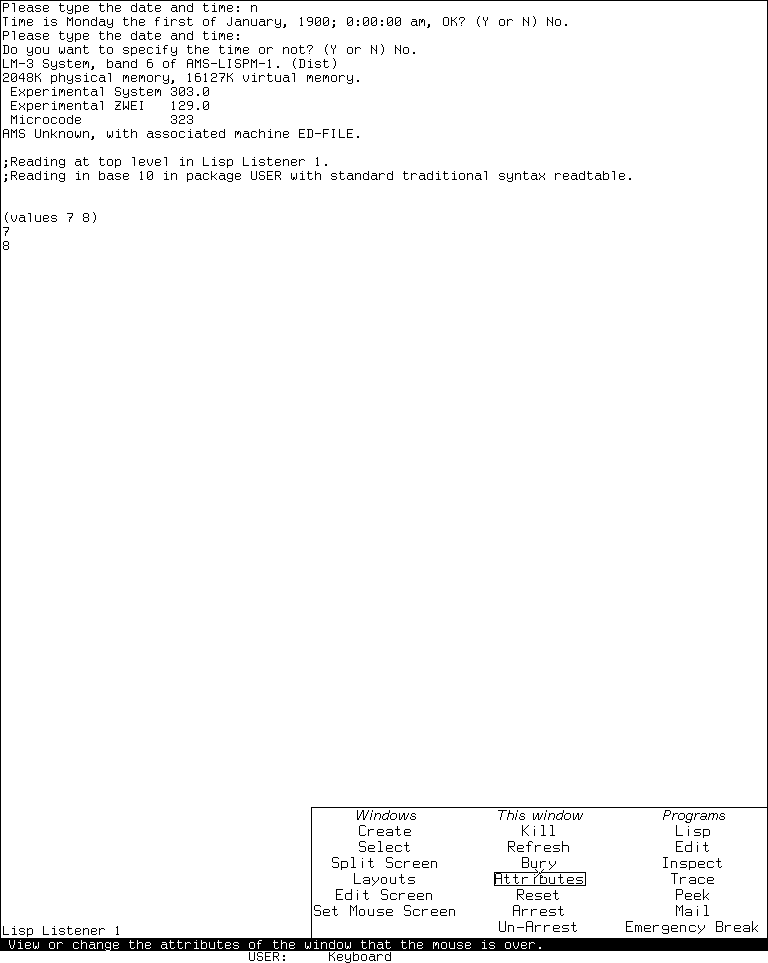
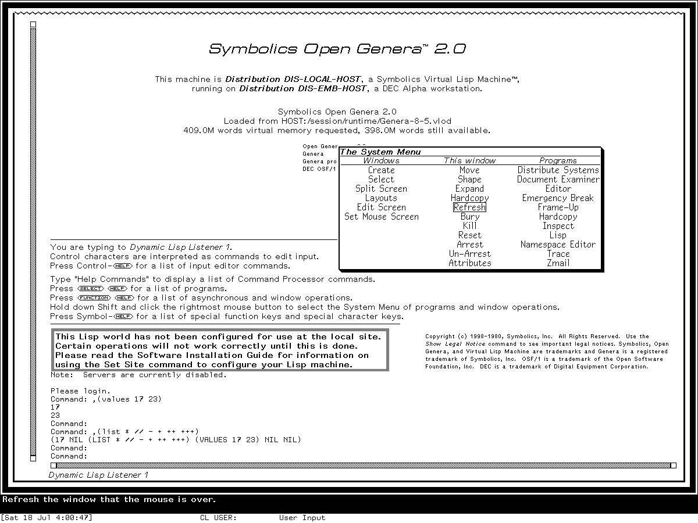

# Program selection, activities, and window management reimplementation specification

## Status and reconstruction claim

This specification defines an implementation-independent reconstruction of program
selection and user-facing window management for three coherent profiles:

- public MIT CADR **System 46 source** at Git revision
  `8e978d7d1704096a63edd4386a3b8326a2e584af`;
- maintained LM-3 source at Fossil check-in
  `4df393c68d7f083ce42d5c377039d26043cc18a9031ace28258dc97f4137eb91`
  and the separately identified runnable **System 303-0** band; and
- **Genera 8.5, System 452.22** licensed source media and the separately
  identified `Genera-8-5.vlod` base world under Open Genera 2.0.

A conforming implementation can reproduce the selected profile's independent menu,
keyboard, activity, and recent-window registries; selection-versus-creation order;
pointer System Menu transaction; per-window operations; Genera Select-key firewall
and Select Key Selector; Split Screen proposal and destructive commit; in-memory
saved-layout behavior; visible menu organization; errors; and partial effects.

This document does not claim:

- that the three releases share one application-manager abstraction or inventory;
- that a registered program is instantiated, active, exposed, selected, running, or
  configured merely because its name appears in one registry;
- exact historical packages, flavor/class precedence, callable signatures,
  conditions, restarts, module closure, or binary compatibility;
- that the maintained System 303 source built the observed band byte-for-byte, or
  that every inspected Genera source body is resident in the base world;
- that saved layouts are serialized desktops, files, restartable recipes, VM
  snapshots, or substitutes for saved Lisp worlds; or
- runtime confirmation for destructive menu operations, the Select Key Selector,
  Split Screen, saved-layout restoration, or the open defects identified below.

The implementation MAY expose all profiles. It MUST NOT average their registries,
selection order, confirmation policy, failure points, or layout representations into
one alleged historical release.

## Normative language and evidence codes

`MUST`, `MUST NOT`, `SHOULD`, and `MAY` are normative. A rule applies only to the
profiles beside it. `INF` marks a clean-room inference or safety-corrected option,
not a claim about an uninspected historical path.

| Code | Evidence class | Establishes | Does not establish |
| --- | --- | --- | --- |
| `C46-SRC` | Public System 46 source | Exact source-visible registries, ordering, transitions, defaults, and partial effects | A compatible running band or later LM-3 behavior |
| `C46-ART` | Public System 46 QFASL recovery | Module and symbol corroboration | Function bodies or a runnable source-to-band chain |
| `C303-SRC` | Maintained LM-3 System 303 source | Source-visible behavior at the pinned check-in | That every historical CADR used this tree |
| `C303-RUN` | Isolated `System 303-0` session | Exact exercised menu, System Help, Select, and display state | Untested destructive or layout operations |
| `G85-S452.22` | Licensed Genera 8.5 source inspected locally | Source-visible activities, menus, Select dispatch, Dynamic Windows selector, and layout behavior in exact hashed files | Redistribution permission or source-to-world build identity |
| `G85-BASE-WORLD` | Exact unconfigured `Genera-8-5.vlod` | Resident registries queried in the identified world | Configured services or every source registration |
| `G85-RUN` | Isolated Genera 8.5 VLM sessions | Exact exercised System Menu and basic Select paths plus the live Hardcopy button triple | Selector mutation, Split Screen, layouts, Hardcopy execution, or orderly VLM shutdown |
| `MIT-MAN` | Contemporary MIT operations manual source | Intended System 46 user operation | System 303 implementation detail |
| `G8-MAN` | Public Genera 8 manuals | Intended product operation | Exact 8.5 implementation without source/runtime cross-check |
| `G85-HELP` | Licensed installed Help records inspected locally | Intended operation of exact record versions | Permission to reproduce Help prose or proof of execution |
| `INF` | Implementation-independent rule | Portable reconstruction or explicit safety correction | Historical representation or untested cleanup order |
| `TODO-RUNTIME` | Unclosed oracle obligation | Nothing until the named probe runs | A reason to guess |

Source controls a named source profile; runtime controls only the exercised artifact
path. Manuals establish intended use but do not erase source-visible release
differences. Licensed Genera evidence is identified and summarized in original
language; proprietary bodies are not reproduced.

## Compatibility profiles and levels

### Release profiles

| Profile | Exact target | Required substrate | Defining management model |
| --- | --- | --- | --- |
| `C46` | MIT CADR System 46 public source | [TV window system](mit-cadr/tv-window-system-reimplementation-specification.md) | Two-page pointer menu, mutable System-key list, MRU selection, Split Screen, live-reference layouts |
| `C303` | Maintained LM-3 source plus separate `System 303-0` runtime | TV, mutable registries, richer sheet status | Three-column menu, stacked System-key entries, Control-System creation, confirmations, richer live-reference layouts |
| `G85` | Genera 8.5 System 452.22 source plus separate base world | TV plus [Dynamic Windows](genera/dynamic-windows-reimplementation-specification.md) | Named activities, Select-key table and firewall, staged Select Key Selector, extensible three-column menu, Split Screen, live-reference layouts |

The optional Genera CLIM system declaration names a compiled `genera-activities`
module, but the inspected source set does not contain that module's body. No CLIM
frame-registration behavior is therefore part of this `L2` contract. CLIM is not the
implementation of the native System Menu, activity registry, or Select Key Selector.

### Conformance levels

| Level | Required behavior | Reserved behavior |
| --- | --- | --- |
| `L0` | Distinct registries, selectable-window state, MRU, exact selected-profile inventories | Full interaction transactions |
| `L1` | `L0` plus keyboard/activity selection, reuse/create ordering, registrations, pointer-menu target semantics | Split/layout tools and pixel-level UI |
| `L2` | `L1` plus System Menu, Select Key Selector where applicable, Split Screen, saved layouts, visible requirements, and failure ordering | Exact historical source API |
| `L3` | Exact selected historical source interface and selected-module load closure | ABI, compiled artifact, band, or world compatibility |

This document normatively defines `C46/L2`, `C303/L2`, and `G85/L2` at the semantic
grain stated here. The C46 claim is source-only. The C303 and G85 runtime claims are
limited to the observed menu and selection paths. `L3` remains reserved.

| Member/profile | Contract defined | Preserved runtime verified | Remaining oracle boundary |
| --- | --- | --- | --- |
| C46 manager | `L2` source contract | No | Compatible band, visible menus, live failures |
| C303 manager | `L2` | System Menu, System Help, basic selectors | Mutations, destructive operations, Split/layout failure paths |
| G85 activity/menu layer | `L2` | Registry census, menu, `Select I/P/L`, live Hardcopy button triple | Full search branches, errors, redefinition, precreation, Hardcopy execution |
| G85 Select Key Selector | `L2` source contract | No | Load state, panes, staged mutation, concurrency, Help |

## Evidence ledger

### Exact source artifacts

| Profile | Portable artifact | Bytes | SHA-256 | Principal use |
| --- | --- | ---: | --- | --- |
| `C46` | `src/lmwin/sysmen.105` | 28,436 | `c203bc08b5550edefb1928349179fc54c483655d273077294211eb778daff6f1` | System Menu, Create/Select, Split, layouts |
| `C46` | `src/lmwin/basstr.163` | 37,385 | `19e0771ff876d5325f18b97a2ccbf392f7d5950d3a89751d633d27d7cbe01e72` | System keys and MRU commands |
| `C46` | `src/lmwin/baswin.428` | 56,577 | `2ee1f487e6d14bec5bfc52a1e64b04963b8b1120a4d291be329995de92339dd4` | selection and process-bearing windows |
| `C46` | `src/lmwin/menu.29` | 44,154 | `dc750a73f9c5983b913890f159c118075f8b5c1566cc0f2420f5637f2f5439a2` | frozen window-under-menu tuple |
| `C46` | `src/lmwin/mouse.149` | 40,629 | `2bf88baf3a881a47be520fdbd0e1fa0fa45c0e8fa0c5eb0dc349ed5b8877585d` | pointer invocation path |
| `C46` | `src/lmwin/scred.62` | 49,289 | `63bdc78c6984cbb6e68b207fea7f2167955bae17350680d6fe2381fec1e8ecb8` | non-abortable rectangle acquisition used by Split Screen |
| `C46` | `src/lmwin/sheet.383` | 68,328 | `4f874b747b47599fadeee83abe6ef16a3a06f5ffecba9ecadc0613e6274ad024` | instance initialization and exposed-sheet traversal |
| `C46` | `src/lmio/read.256` | 47,179 | `dad1d2ac598fad875c76ef04d9af73bed3b349a964f777eac5c72d97f0b3a3a0` | nested-backquote reader depth |
| `C46` | `src/lmman/macros.39` | 18,981 | `9b691e085a50db63136942ae09215d4c5080b606b13665d24973fa95cd7ca15e` | contemporary nested-backquote rule |
| `C46` | `src/lispm/qfctns.438` | 74,495 | `3cecf056aec73028852814edfa0acf0226495226604721c56a98a323c43ea764` | invalid `TYPEP` designator path |
| `C46` | `src/lispm2/string.54` | 21,828 | `fa6a5f406e04e9875a33f66300944220892865ea7414bcfa8aa3ba6746226a5c` | modifier-preserving character uppercase |
| `C46` | `src/lmwind/operat.27` | 85,337 | `a5ab658210dc09891b0886b58af705368e33a41f013073c8b9a637d99ab0f02d` | contemporary intended operation |
| `C303` | `l/sys/window/sysmen.lisp` | 43,408 | `b53b7c3d5a59040f3180d5be0d2072b2a334bb386fa5e19dd6abbd945148b40c` | System Menu, Split, layouts |
| `C303` | `l/sys/window/basstr.lisp` | 81,846 | `8ba3a16e726ed043e6585c7a68b7096bb2dcc5d6f05476afd89f84a48dff2645` | mutable System keys and MRU |
| `C303` | `l/sys/window/baswin.lisp` | 82,708 | `3b86ca413528046887da8371433d656ecd9d5f9130d6eadd764fc54f137b42f1` | TV selection substrate |
| `C303` | `l/sys/window/menu.lisp` | 60,809 | `4821fb9b3d4541a371ad106f7042d8c59dbb33daf8d9a27ffb24b3141aa796e9` | frozen window-under-menu tuple |
| `C303` | `l/sys/window/mouse.lisp` | 57,256 | `facf7f3dd979a758bd70b0644120ccceb0f243188acd180dcbf0a70a836ec6b2` | pointer invocation path |
| `C303` | `l/sys/window/tvdefs.lisp` | 44,999 | `ae8a8a342d10e4bdc89dc119f9afca9606a7797757601fdd593f8477bfc738ed` | deexposed window-resource checker |
| `C303` | `l/sys/sys2/resour.lisp` | 21,957 | `e43ebce2a3c9b3a9ec8625d847c0ab80f071de365bb507cfafe65b0868c6184e` | allocation and one-bit in-use state |
| `G85` | `sys.sct/window/activities.lisp.~35~` | 22,385 | `8965c6ae99c41efbab9cf10896d0bca253f99dd7a85ad76c30b3e86b7df91089` | activity search and registries |
| `G85` | `sys.sct/window/sysmen.lisp.~250~` | 52,798 | `2f54fdb15335fc7f9f9f5c47a03f1ad2a5803d86787267949825f23853363f4c` | System Menu, Split, layouts |
| `G85` | `sys.sct/window/select-select.lisp.~4011~` | 16,841 | `0adc752b87e8f2db51a2426bcd80b43ad34c0702873290f088ae6f7ca599bd58` | Select Key Selector application |
| `G85` | `sys.sct/window/help-frame.lisp.~22~` | 17,047 | `93f9421715235bb3d1fee377cdee353724b43aee3603a45aafe6c8a8f6397db6` | raw firewall-enabled mapping renderer and Help cache |
| `G85` | `sys.sct/window/basstr.lisp.~645~` | 65,555 | `112245299c0d46cf81a67f2cc8de714c766711653be215467ef41bb2c6778021` | Select dispatch and input hold |
| `G85` | `sys.sct/window/baswin.lisp.~713~` | 107,624 | `1f6a9ff8fdeae06518b0829e38c6c10769ddfe8b826368d4ce50922232b83297` | selection, MRU, process windows |
| `G85` | `sys.sct/window/menu.lisp.~223~` | 82,347 | `73c5e594a77bbbba81e630dee92724c7ec72d1fe22740b5e2eda3c466b3241d1` | frozen target tuple |
| `G85` | `sys.sct/window/mouse.lisp.~472~` | 119,392 | `9375d99e127c097e22852dc0ea7f6cd496101f01946a42eb0c6bf58051d4a3b6` | System Menu enable gate and error restart |
| `G85` | `sys.sct/window/tvdefs.lisp.~488~` | 68,717 | `8d4f22284a36e6e465ffda185279415a00cb3234251a6a769bd260d61ba79a5a` | deexposed window-resource checker |
| `G85` | `sys.sct/sys2/resour.lisp.~82~` | 49,516 | `b68c98d9202a4809719dce5967d168ffcead0a06f70c3a2b8b2435b91f81f8dd` | allocation and one-bit in-use state |
| `G85` | `sys.sct/flavor/ctypes.lisp.~10~` | 14,178 | `96159a94815bb1d6fcabbfe6d6a246812bc0722caba3c13794c40da787d34dc7` | default daemon method ordering |
| `G85` | `sys.sct/flavor/defflavor.lisp.~73~` | 87,061 | `1c69084bf3f627bee74b29bf77013158c8da0f32440aa619b12236d488c181d5` | component precedence used by menu mixins |
| `G85` | `sys.sct/clim/rel-2/genera/sysdcl.lisp.~10~` | 3,833 | `df10180278f2d9fe2da608460a1c9c87d5d4b86a1639900e2ff86a7a17dbf780` | declaration of opaque compiled CLIM activity adapter |

Recovered `sysmen.qfasl` and `basstr.qfasl` at 33,301 and 33,941 bytes, with
SHA-256 `b2b75fc4c0f0a9876a994e3c058e1699b487511165bfdae2ed8a845aff64d753`
and `622ca5c92187d4e444e47da80aa12c3c75b50dbea14d9da133465eaad4746921`,
corroborate the C46 module/symbol surface only. They are not body evidence.

### Normative evidence map

| Contract area | `C46-SRC` | `C303-SRC` | `G85-S452.22` |
| --- | --- | --- | --- |
| Pointer-menu inventory and dispatch | `sysmen.105:61-194` | `sysmen.lisp:9-307` | `sysmen.lisp.~250~:60-503` |
| Hardcopy effective button triple | Not applicable | Not applicable | wrappers at `sysmen.lisp.~250~:461-503`; live item in `d01-hardcopy-item-probe-g85-20260719`, generation 1, action log SHA-256 `398e844474cef70a92f774ae466ed6afa7ae29b5685b21283218a9cb33a52de9` |
| Frozen target and invocation | `menu.29:879-890`; `mouse.149:221-226` | `menu.lisp:1142-1153`; `mouse.lisp:446-451` | `menu.lisp.~223~:1571-1583`; `mouse.lisp.~472~:1153-1163,1693-1708` |
| Keyboard/activity selection | `basstr.163:683-758`; modifier preservation at `string.54:275-280`; invalid type path at `qfctns.438:961-982` | `basstr.lisp:1523-1644` | `basstr.lisp.~645~:750-755,1241-1262`; `activities.lisp.~35~:65-220` |
| MRU and sheet selection | `basstr.163:491-557`; dense insertion/removal at `baswin.428:335-376` | `basstr.lisp:826-938`; dense insertion/removal at `baswin.lisp:450-492` | `basstr.lisp.~645~:944-1004`; selection and compact-vector insertion/removal at `baswin.lisp.~713~:370-524,580-668` |
| Activity and Select registries | Not applicable | Not applicable | `activities.lisp.~35~:224-406,410-531` |
| Select Key Selector | Not applicable | Not applicable | `select-select.lisp.~4011~:58-355`; Help at `help-frame.lisp.~22~:341-386` |
| Split Screen and layouts | `sysmen.105:205-465`; choice-time item evaluation at `menu.29:353-366`; nested backquote at `read.256:880-908` and `macros.39:311-364`; rectangle acquisition at `scred.62:5-69` | `sysmen.lisp:319-658`; window resource at `tvdefs.lisp:821-898`; allocator at `resour.lisp:324-415` | `sysmen.lisp.~250~:514-829`; window resource at `tvdefs.lisp.~488~:1325-1396`; allocator at `resour.lisp.~82~:633-767,868-934` |
| Activity command integration | Not applicable | Not applicable | `activities.lisp.~35~:535-575` |
| G85 chosen-menu method order | Not applicable | Not applicable | menu methods/composition at `menu.lisp.~223~:1567-1569,1685-1688,1898-1900`; daemon order at `ctypes.lisp.~10~:72-80`; component precedence at `defflavor.lisp.~73~:1453-1476` |
| Optional CLIM adapter | Not applicable | Not applicable | `sys.sct/clim/rel-2/genera/sysdcl.lisp.~10~:61-84`, declaration of an otherwise uninspected compiled module only |

### Selected-module coverage

| Module family | Closed at `L2` | Reserved |
| --- | --- | --- |
| Pointer menus | target snapshot, dynamic item refresh, dismissal, dispatch ordering, visible organization | Complete generic menu source API and every pointer race (`L3`) |
| System/Select dispatch | configured inventories, typeahead/input hold, reuse/create ordering, registry mutation, known partial effects | Every installed site key and scheduler timing |
| Activities | selected search methods, aliases, conflicts, compatible/program-choice behavior | Every activity subclass in optional products |
| Select Key Selector | pane/state/command surface, staged commit and concurrency effects | Unloaded patches, undocumented Help method behavior |
| Split/layout | proposal, geometry, destructive commit order, profile representations, defects | Exact generic window construction ABI and every constructor failure |
| Native UI/CLIM relation | TV and Dynamic Windows ownership; presence of an opaque adapter declaration | Compiled adapter body, registration behavior, and arbitrary CLIM clients |

## Architecture and ownership boundaries

The manager is a federation of registries and TV/Dynamic Windows transactions, not
one database:

```text
pointer System Menu registry ----> target-snapshot menu transaction
System-key or Select-key map ----> program/activity selection transaction
activity-name registry ----------> reuse/search/create policy       (G85)
previous-selection sequence -----> recency selection and reuse
live sheet tree ------------------> exposure, selection, geometry
layout-menu resource pool -------> per-instance saved live-reference entries
```

The implementation MUST preserve these ownership boundaries:

- TV owns sheet hierarchy, selection, exposure, input routing, geometry, and recent
  selection history;
- pointer-menu registries own menu items and callbacks, not keyboard bindings;
- `C46` and `C303` System-key tables own character-to-target/create policies;
- `G85` separates the activity-name table, Select-character table, and contextual
  Select firewall;
- the Select Key Selector owns a private staged copy until Put;
- Split Screen owns a transient proposal, then mutates the live sheet tree; and
- a saved layout owns references to existing windows, never application recipes.

CADR is TV-based and predates CLIM. Genera's native manager combines TV with Dynamic
Windows. Presentations, program panes, and commands do not make the Select Key
Selector a CLIM application. A clean-room implementation MAY use CLIM internally if
the selected profile's observable semantics remain intact.

## Semantic state model

```text
ConsoleState {
  screens
  selected_window
  selected_input_owner
  previous_selection_sequence
  mouse_screen
  selection_input_hold                 // G85
  select_key_firewall                  // G85
}

RecentSelectionSequence {
  storage_kind                        // resizable NIL-padded array or adjustable fill-pointer vector
  active_length
  dense_unique_active_prefix
  unused_backing_capacity
}

SelectableWindow {
  identity
  selection_alias
  selection_name
  superior
  screen
  active
  exposed
  selected
  process_state
  geometry
  temporary
  killed
}

MenuRegistry {
  windows_column
  this_window_column
  programs_column
  create_types
}

MenuInvocation {
  menu_identity
  frozen_target_window
  frozen_pointer_x_y
  superior
  resolved_items
  highlighted_item
  exposed
  committed_choice
}

SystemKeyEntry {
  normalized_character
  target_window_flavor_or_expression
  documentation
  creation_policy
}

Activity {
  identity
  class
  description
  source_identity
  selection_policy
  creation_policy
}

ActivityRegistry {
  case_insensitive_name_keys_to_activity
  derived_reverse_aliases                 // INF diagnostic index, not object state
}

SelectKeySelectorSession {
  private_assignments_table
}

SplitProposal {
  superior
  region_edges
  ordered_window_entries
  transient_interaction_windows
  use_frame
  frame_name
  selector_key
  committed_prefix
}

SavedLayout {
  name
  live_window_references
  optional_statuses
  edges
  optional_stacking_order
  selected_first
}

LayoutMenuInstance {
  identity
  mutable_item_list
}
```

Registered, defined, instantiated, active, exposed, selected, process-running, and
service-configured are independent predicates. Implementations MUST expose enough
diagnostic state for conformance traces to distinguish them.

## Core invariants

1. Pointer-menu, keyboard-selector, activity-name, Select-character, firewall, and
   MRU registries MUST remain distinct.
2. Display labels are not canonical identities. `Edit`/`Editor`,
   `Inspect`/`Inspector`, `Mail`/`Zmail`, and `Editor`/`Zmacs` MUST be related only by
   actual profile registrations.
3. Changing selection MUST preserve pre-prefix typeahead for the old input owner as
   specified; typed data MUST NOT follow focus accidentally.
4. The mouse trigger starts menu processing asynchronously with only a superior; it
   does not freeze the pointer target. C303/G85 and direct C46 main-menu callbacks use
   the window captured when the chooser's `:CHOOSE :BEFORE` phase later samples the
   pointer. Motion before that phase can retarget; motion afterward cannot. C46
   **Other** adds a second coordinate-warp snapshot.
5. Selection MAY reuse, expose, move, activate, beep, run a form, or create. It MUST
   NOT be reduced to “launch application.”
6. A menu snapshot MAY outlive a registry mutation. Profile-specific structural- or
   list-identity refresh predicates and stale-target failures remain observable; an
   explicit registry generation counter is an optional `INF` diagnostic, not
   historical state.
7. G85 activity lookup is case-insensitive. All aliases supplied by one completed
   definition call map to the same activity object; an accepted later redefinition
   can leave omitted old aliases pointing to the prior object as specified below.
8. The G85 firewall controls contextual enablement separately from the global
   Select-character mapping.
9. Split proposal edits do not change the live layout before Do It, except for
   source-visible prompt/menu side effects. Commit itself is non-atomic.
10. Saved layouts contain live object identities. Restore MUST NOT create replacements
    for killed or absent windows unless an explicitly named safety-corrected profile
    adds that behavior as `INF`.
11. Screenshots constrain only visible pixels and the separately recorded action.
    They cannot prove hidden registry, target, callback, or identity state.

## Exact selected-profile inventories

Inventories below are fixtures for identified source or world states, not immutable
platform constants.

### C46 System 46

Main System Menu: **Create**, **Select**, **Inspect**, **Trace**, **Split Screen**,
**Layouts**, **Edit Screen**, **Other**.

Other page: **Arrest**, **Un-Arrest**, **Reset**, **Kill**, **Emergency Break**,
**Refresh**, **Set Mouse Screen**.

Create: **Supdup**, **Telnet**, **Lisp**, **Edit**, **Peek**, **Any**.

| System key | Target | Creation policy |
| --- | --- | --- |
| `E` | Editor | allowed |
| `I` | Inspector | specialized form |
| `L` | Lisp Listener | allowed |
| `P` | Peek | allowed |
| `R` | window error handler | existing only |
| `S` | Supdup | allowed |
| `T` | Telnet | allowed |

The manual's `M` mail entry is not in this exact initial source table. Split Screen
can later mutate this list by installing a frame key.

### C303 System 303-0 runtime and pinned source

| Windows | This window | Programs |
| --- | --- | --- |
| Create | Kill | Lisp |
| Select | Refresh | Edit |
| Split Screen | Bury | Inspect |
| Layouts | Attributes | Trace |
| Edit Screen | Reset | Peek |
| Set Mouse Screen | Arrest | Mail |
|  | Un-Arrest | Emergency Break |

Default Create source choices: **Supdup**, **Telnet**, **Lisp**, **Edit**, **Peek**,
**Inspect**, **Font Edit**, **Lisp (Edit)**, **Any**.

Observed System Help: `Top-L` **LISP(Edit)**, `E` **Editor**, `I` **Inspector**, `L`
**Lisp**, and `P` **Peek**. This live five-entry set is distinct from source calls in
unloaded optional subsystems.

### G85 Genera 8.5 base world

The 19 observed activity names are **Converse**, **Distribute Systems**, **Document
Examiner**, **Editor**, **File Server**, **Flavor Examiner**, **Frame-Up**,
**Inspector**, **Keyboard Control**, **Lisp**, **Mail**, **Namespace Editor**,
**Notifications**, **Peek**, **Restore Distribution**, **Select Key Selector**,
**Terminal**, **Zmacs**, and **Zmail**.

| Select gesture | Activity | Select gesture | Activity |
| --- | --- | --- | --- |
| `Select =` | Select Key Selector | `Select C` | Converse |
| `Select D` | Document Examiner | `Select E` | Editor |
| `Select I` | Inspector | `Select L` | Lisp |
| `Select M` | Zmail | `Select N` | Notifications |
| `Select P` | Peek | `Select Q` | Frame-Up |
| `Select T` | Terminal | `Select X` | Flavor Examiner |

| Windows | This window | Programs |
| --- | --- | --- |
| Create | Move | Distribute Systems |
| Select | Shape | Document Examiner |
| Split Screen | Expand | Editor |
| Layouts | Hardcopy | Emergency Break |
| Edit Screen | Refresh | Frame-Up |
| Set Mouse Screen | Bury | Hardcopy |
|  | Kill | Inspect |
|  | Reset | Lisp |
|  | Arrest | Namespace Editor |
|  | Un-Arrest | Trace |
|  | Attributes | Zmail |

Read-only runtime observation, 2026-07-19: isolated session
`d01-hardcopy-item-probe-g85-20260719`, generation 1, evaluated only an `ASSOC` lookup
of **Hardcopy** in the live This-window column. The printed item bound Left and Middle
to `TV:SYSTEM-MENU-HARDCOPY-WINDOW` and Right to
`TV:SYSTEM-MENU-HARDCOPY-WINDOW-MENU`; no button or printer path was invoked. The
action log SHA-256 is
`398e844474cef70a92f774ae466ed6afa7ae29b5685b21283218a9cb33a52de9`, the final
evaluator PNG SHA-256 is
`9c2034e9e91de5f8e3ffe7f3122a9a5e6806446b73ac3f2f9674193b75cf8838`, and its
decoded-pixel SHA-256 is
`c22456f9ddf8a88b6a2d3f185f6341642b724fcbc4064b1fda8f2f714b5923e7`. The
evaluator image remains ignored and is not a publication asset. The base and private
world bytes ended unchanged. The harness did not request Save World or create a
process checkpoint; guest Save World and checkpoint fields remain unknown. After the
shutdown prompt, confirmation, and cleanup progress, the harness used its
bounded forced stop on the known VLM stall. Run-record SHA-256:
`71eaa7541ee4a1d19d72ec55b93f597c6f73daa71155d4247aa95874c2dd2c49`.

| Hardcopy-probe field | Portable evidence |
| --- | --- |
| Interval/final record | 2026-07-19 04:18:42–04:24:22 EDT; `forced-stopped`; run SHA-256 above |
| Licensed world | `Genera-8-5.vlod`, 54,804,480 bytes; base/private SHA-256 `a8ee5e86cc7e322f7385af3e0cd579d7650d4dcfc3ce328acbf8b25515dd0672` at start and stop; unchanged |
| VLM/debugger | execution VLM SHA-256 `9f5e18d5770f973879716182b6856ef5a8ee9d3b2bb907476ea0cf35986aa4c7`; debugger SHA-256 `2db918cfe8f35f52c7ff4b7695b0ecd3bb85e41a3327ea5a94874edf05edb54a` |
| Harness/config | harness execution SHA-256 `bc9276ac766913bc15018dd334a2a2704ae5a926e1fcbc30ccfcff08af8cb48a`; config SHA-256 `5ce6509f5adf2cf2d054d34eb4ba777ce462285b8cd9b01bc071bf819139e086` |
| Compatibility inputs | X preload SHA-256 `acd71dbcb948f05b7fd2730b2b4706c08f16f46d792bd9aa6aa64370e855e4b1`; `ifconfig` preload SHA-256 `f45f45461622975996ab41138f64bb84a4b17c51fba0dbb649208914898c26b7` |
| Time/toolchain | RFC 868 responder SHA-256 `cc3a2274149c5593b52e6608d732d4048518c766134df5e0f018746ad5cf98bb`, evidence SHA-256 `ba0d5e7f2093a96e28d1fbb1b7334d4393c18d273e1ca5f6fbc5eb1eea7bd28a`, exit zero; Guix manifest SHA-256 `3adae999bbe420182f22adc2499fcc82449a46eaf580a362de9c0e718fa6b37d`, channel `230aa373f315f247852ee07dff34146e9b480aec` |
| Isolation/display | Bubblewrap user/mount/network/PID/IPC/hostname isolation; no default/external route or guest-visible host file service; MIT-SHM absent; private 1440×1100×24 Xvfb |
| Selected client | `Genera on DIS-LOCAL-HOST`, XID 4194310, x=72, y=55, 1200×900 |
| Ordered input | 16 records forming eight linked intent/outcome pairs; a first combined input failed in the reader before evaluation; after aborting and clearing it, the exact read-only lookup was submitted once and evaluated; action-log SHA-256 above; Hardcopy was never invoked |
| Persistence/shutdown | Harness Save World invocation false; harness-created process checkpoint false; guest Save World/checkpoint unknown; prompt, confirmation, and cleanup progress observed; `forced_stop`, `forced_after_confirmed_shutdown_stall`, `state_may_be_incomplete`, and `unsaved_lisp_state_discarded` true; orderly VLM host shutdown false |

The same run is recorded in the canonical [Genera activities and System Menu
dossier](genera/activities-and-system-menu.md#read-only-hardcopy-binding-probe).

Create: **Terminal**, **Lisp**, **Peek**, **Inspect**, **Edit**, **Frame-Up**,
**Distribute Systems**, **Document Examiner**, **Namespace Editor**, **Any**.

The `Activities` command table directly contains **Select Activity**. No closed
inventory of a broader `Window` command table is claimed from D02's selected source
modules.

## Complete input binding trees

This is the exhaustive tree for operations owned by D02's selected modules, plus the
exact shared-prefix and sheet-pointer dispatch needed to reach them. Other effective
leaves in shared mutable keyboard registries are explicitly delegated rather than
misattributed to this manager; a conformance trace MUST still enumerate their keys
and owners. Generic command-menu highlighting/commit gestures and inherited Dynamic
Windows Command Processor editing remain substrate bindings. Registrars can change
leaf sets after boot, so the trace MUST record the effective table before testing.
“Unbound” behavior is part of the tree, not an omitted case.

### CADR keyboard prefixes

```text
C46 System
├─ unmodified Help or ? -> display current System-key list; wait for flush character
├─ exact effective registered suffix -> dispatch entry
│  └─ initial unmodified E/I/L/P/R/S/T -> targets in the C46 inventory
├─ unregistered unmodified Rubout -> cancel silently
└─ any other unregistered suffix -> beep

C303 System
├─ strip modifiers after recording whether Control was present
├─ Help or ? -> display filtered effective registry; wait for flush character
├─ effective registered base character -> dispatch entry
│  └─ Control present -> force only a valid flavor-valued creation branch
├─ unregistered Rubout -> cancel silently
└─ any other unregistered base character -> beep

C46 Escape shared prefix
├─ unmodified Escape -> clear accumulated argument and minus flag; continue reading suffix
├─ each unmodified 0..9 -> argument := 8 * (argument or 0) + digit; continue
├─ unmodified - -> set sticky minus flag; continue
├─ O -> ignore accumulated argument; select last eligible exposed MRU entry
├─ S -> consume signed argument; use Recent-window selection tree below
├─ unmodified Help/? or another exact registered suffix -> dispatch the effective shared entry
└─ unregistered suffix, including unmodified Rubout -> no operation

C303 Terminal shared prefix
├─ each 0..9 -> argument := 10 * (argument or 0) + digit; continue
├─ - -> set sticky minus flag; continue
├─ B -> bury selected window's selection alias; argument ignored
├─ character #x1D -> Set Mouse Screen; NIL argument cycles, non-NIL opens chooser
├─ O -> ignore accumulated argument; select last eligible exposed MRU entry
├─ S -> consume signed argument; use Recent-window selection tree below
├─ any other registered suffix -> dispatch the effective shared entry
├─ unregistered selected-buffer/global asynchronous suffix -> quote into keyboard input if space
├─ unregistered Rubout -> no operation
└─ every other unregistered suffix -> beep
```

C46 System and Escape preserve suffix modifier bits, so a modifier-bearing C46
System registration is reachable by exact match. C303 System alone normalizes
Meta/Super combinations to the base character while Control with any combination
sets force. C303 Terminal preserves modifier bits and matches the exact registered
suffix, including modified registrations. In both C46 and C303 System, registered
Rubout dispatches because lookup precedes the bare-Rubout fallback. C46 gives Help
precedence only to unmodified Help and `?`, so exact modifier-bearing registrations
for those characters remain reachable; C303 strips the modifiers before its Help
test, making every such registration unreachable. C46's base-eight
accumulator literally accepts `8` and `9`; C303 uses decimal. Minus negates the
accumulated value, or one when no digit preceded it. Repeated C46 Escape resets both
argument states; C303 Terminal has no corresponding reset branch. Shared registered
leaves other than D02's `O` and `S` retain their own typeahead and keyboard-process
metadata and are outside this application's semantic ownership.

### G85 Select and Function prefixes

```text
G85 Select
├─ global Select keys disabled -> beep and return before reading any suffix
├─ =/C/D/E/I/L/M/N/P/Q/T/X -> exact live activity mappings in the G85 inventory
├─ any other firewall-enabled mapped base character -> mapped activity, including digits and Help/?/Rubout
├─ unmapped or firewall-disabled Help/? with KBD-SYS-HELP bound -> Select Help
├─ unmapped or firewall-disabled Rubout -> no-op
└─ every other unresolved/disabled character -> beep

G85 Function shared prefix
├─ global Function keys disabled -> beep and return before reading any suffix
├─ Function -> clear accumulated argument and minus flag; continue reading suffix
├─ each 0..9 -> argument := 10 * (argument or 0) + digit; continue
├─ - -> set sticky minus flag; continue
├─ O -> ignore accumulated argument; select last eligible exposed MRU entry
├─ S -> consume signed argument; use Recent-window selection tree below
├─ firewall-enabled EQL-registered suffix -> dispatch the effective shared entry
│  └─ loaded Help/? registrations -> open Function Help
├─ unresolved Rubout -> no operation
├─ unresolved Abort/Suspend -> asynchronous-intercept fallback
└─ every other unresolved suffix -> beep
```

G85 Select reads exactly one suffix; it has no numeric-argument parser. It uppercases
the suffix, records Control as `force-create`, then strips all modifier bits. Meta,
Super, Shift-derived case, and combinations therefore resolve to the base character,
while only Control changes force-create. A digit can dispatch when the table maps it
and its firewall cell is enabled, otherwise it follows ordinary fallback. The Select
Key Selector omits digits from its displayed Keys pane under a source comment that
they are reserved for arguments, but that comment does not override the actual
dispatcher; the UI policy/dispatcher tension is a preserved runtime oracle.

The G85 Function prefix uses decimal accumulation and preserves suffix modifier bits
for exact `EQL` registry matching. Minus has the same signed-default rule as the CADR
prefixes, and repeated Function resets both argument states. The firewall and
registry lookup gate all registered Function leaves. Other registered leaves are
delegated shared-prefix behavior, not D02-owned semantics.
Select Help's own display/cache limitations remain as specified below.

### Pointer and application-local trees

Sheet-level pointer precedence is part of the binding contract, because an
application window can shadow the bare-screen System Menu gesture:

```text
C46 keyboard-sensitive window
├─ encoded double-Right -> System Menu escape hatch
├─ any other click while window is not selected -> asynchronously select it; consume click
└─ any other click while selected -> deliver encoded fixnum through :FORCE-KBD-INPUT

C46 default/unhandled sheet bitmask
├─ Left bit present -> asynchronously MOUSE-SELECT target (wins over other bits)
├─ otherwise Right bit present -> asynchronously request System Menu
└─ Middle-only/no recognized bit -> no D02 default operation

C303 KBD-MOUSE-BUTTONS window
├─ encoded double-Right -> System Menu escape hatch
└─ any other click -> on unselected single Left select first, then always deliver encoded button through :FORCE-KBD-INPUT and consume

C303 essential non-KBD application window
├─ encoded double-Right -> System Menu escape hatch
├─ single Left on an unselected selectable target -> select target; consume click
├─ otherwise, handled :FORCE-KBD-INPUT -> deliver full mouse event to application
├─ otherwise, accepted single Right -> System Menu dispatcher
└─ other unhandled event -> beep

G85 essential application window
├─ encoded double-Right -> System Menu escape hatch
├─ single Left on an unselected selectable target -> select target, then conditionally forward the same event through :FORCE-KBD-INPUT
├─ otherwise, handled :FORCE-KBD-INPUT -> deliver full mouse event to application
├─ otherwise, accepted single Right -> System Menu dispatcher
└─ other unhandled event -> beep

C303 default no-window handler (button-bit priority Left > Middle > Right)
├─ Left bit -> select active selectable sheet under pointer when handler exists
│  └─ no eligible/handled target -> no-op; do not fall through to another set bit
├─ otherwise Middle bit -> reset asynchronously when mouse sheet is a screen
│  └─ false screen gate -> no-op; do not fall through to Right
└─ Right -> System Menu dispatcher

G85 default no-window handler (button-bit priority Left > Middle > Right)
├─ Left bit -> select active selectable sheet under pointer when handler exists
│  └─ no eligible/handled target -> no-op; do not fall through to another set bit
├─ otherwise Middle bit -> reset only when active mouse is default-screen's mouse and its sheet is a screen
│  └─ false mouse/screen gate -> no-op; do not fall through to Right
└─ Right -> System Menu dispatcher

G85 unhandled single-Right modifier refinement
├─ unmodified or Shift -> asynchronously request System Menu
├─ Meta-Shift -> separate window-editor path
└─ every other encoded Right modifier combination -> beep

C46 System Menu Other -> restore saved coordinates -> auxiliary-menu second target snapshot
C303/G85 Edit Screen Left/Middle -> direct mouse/default superior
C303/G85 Edit Screen Right -> frozen target -> screen finder
C303/G85 Set Mouse Screen Left/Middle -> non-hairy direct/cycle path
C303/G85 Set Mouse Screen Right -> explicit chooser
G85 Move/Shape/Expand/Hardcopy Left/Middle -> ordinary automatic alias path
G85 Move/Shape/Expand/Hardcopy Right -> alias-versus-concrete chooser

G85 Activities command table
├─ typed Select Activity <activity name> [<user-visible superior>]
│  └─ omitted superior -> terminal stream's screen; explicit argument must satisfy USER-VISIBLE-SCREEN
├─ :SELECT on SYS:ACTIVITY-NAME presentation -> translate to Select Activity
│  └─ use the screen of the window containing the presentation as superior
└─ no D02-installed single-character command accelerator

G85 Select Key Selector
├─ no application-specific single-character command accelerators
├─ :SELECT on SELECT-KEY presentation -> partial Add Assignment, confirm activity
├─ :SELECT on SELECTABLE-ACTIVITY presentation -> partial Add Assignment, confirm key
├─ Shift-Middle key with staged mapping -> Delete Assignment by key
├─ Shift-Middle activity with EQ-identical staged value -> Delete Assignment by activity
├─ :COMMAND-MENU-HELP on either presentation type -> its installed Help command translator
├─ either presentation type in Help context -> its registered presentation-specific Help topic
├─ five local typed commands, each :menu-accelerator T and present in pane menu
│  ├─ Add Assignment
│  ├─ Delete Assignment
│  ├─ Save Assignments
│  ├─ Get From system
│  └─ Put Into System
├─ inherited Help menu accelerator -> source-predicted target mismatch
├─ installed SI::COM-SELECT-ACTIVITY -> typed path, absent from six-cell pane menu
├─ inherited help-program command table -> Help commands/translators above
└─ inherited standard arguments command table -> default typed argument acquisition
```

Pointer selection of other System Menu cells dispatches the cell's declared ordinary
operation through the inherited command-menu selection gesture; only the
button-specific branches above differ at this profile boundary. A non-mutating G85
base-world registry query closed the **Hardcopy** branch: Left and Middle use
`SYSTEM-MENU-HARDCOPY-WINDOW`, and Right uses
`SYSTEM-MENU-HARDCOPY-WINDOW-MENU`. The query printed the item only and never invoked
a print path.
The implementation MUST expose a binding-tree dump containing context, prefix path,
modifier normalization, leaf operation, shadowed registrations, and unbound fallback
so the tables and this tree can be compared mechanically.

## Transactions and observable behavior

### Invoke and dismiss the pointer System Menu

The context tree above decides whether a right click is delivered to an application,
selects a previously unselected window, beeps, or reaches the System Menu. At the
default/unhandled boundary, C46/C303 Right invokes the menu. G85 accepts unmodified
or Shift-Right, while Meta-Shift-Right is a separate window-editor path and MUST NOT
be folded into the menu binding. Encoded double-Right is the menu escape hatch from a
keyboard-sensitive application window in every selected profile.

1. The mouse caller freezes the superior and dispatches asynchronous menu work with
   that superior only. G85 then dynamically binds `DEFAULT-SCREEN` to it and
   `*CONSOLE*` to its console before the enable check, resource allocation, and
   choice; registered callbacks can observe those bindings.
2. At chooser startup, in its `:CHOOSE :BEFORE` phase, capture the then-current
   pointer coordinates and lowest target sheet beneath the menu. Pointer motion
   between the trigger and this phase changes the eventual target; later motion does
   not.
3. Resolve the profile's current dynamic item lists. `C46` uses main/Other pages;
   `C303` and `G85` use three columns.
4. Expose the momentary menu near the pointer and update the highlighted item and
   pointer documentation during motion.
5. Pointer exit without choice deexposes the temporary menu and restores its underlay;
   it MUST invoke no item callback.
6. On choice, remove/restore the temporary menu before arbitrary item code runs.
7. Pass the frozen target and coordinates to a direct this-window operation even if
   the pointer moved while the menu was open.

C46 **Other** receives the main menu's frozen `(window, x, y)` tuple but ignores the
window identity, warps the pointer back to `(x, y)`, and opens a second window-hacking
menu. That auxiliary menu captures a fresh lowest sheet under the restored point in
its own `:CHOOSE :BEFORE` phase. An underlay change before that phase can therefore
retarget the operation; a change after the auxiliary menu has taken its snapshot
cannot. Exact C46 compatibility MUST preserve that two-stage behavior and MUST NOT
substitute the discarded main-menu identity.

In `G85`, the mouse trigger always schedules the asynchronous System Menu process.
The console-wide enable gate runs inside that process before menu resource allocation
and `:CHOOSE`; disabled state beeps there. Enabled invocation is wrapped in the named
exit restart; the restart exits the menu but does not roll back an operation already
committed. The inspected C46/C303 paths have no corresponding wrapper.

All three chosen-item paths deactivate the temporary menu before arbitrary callback
code. C46 has no pointer-return/error wrapper around the callback and can retain its
chosen-item slot after failure. C303's inner unwind cleanup clears the choice on
every unwind. An ordinary callback condition unwinds while its `success` flag remains
true, so saved pointer coordinates are restored; a `THROW 'ABORT` is caught by the
outer momentary-menu method, which then clears `success` and deliberately skips the
pointer warp. These cleanup rules are distinct from pointer exit without a choice.

G85's chosen-item order is more specific. `BASIC-MENU` first restores the captured
pointer coordinates only when the global restoration flag is true, the mouse sheet
is unchanged, and pointer speed is below its cutoff. If the chosen item begins with a
string and the current process is still named `System Menu`, the more-specific
process-renaming `:BEFORE` method permanently renames that process to the item label.
The inherited dynamic-menu `:BEFORE` method then auto-deactivates, and only afterward
does the callback run. This rename-before-deactivation order follows the selected
flavor component precedence and default most-specific-first daemon combination; it
is not an alphabetical ordering inference. The named exit path wraps callback
execution. Saved coordinates
remain callback data when actual pointer restoration is skipped. C46/C303 have no
corresponding speed/flag/same-sheet or process-renaming wrapper in the inspected
chosen paths.

Menu refresh has no common generation counter. C46's single-column dynamic menu
recomputes its list and compares old/new structures with `EQUAL`. C303/G85
multicolumn menus compare the column-list identities with `NEQ`. Their flattened
menus share existing item conses: an in-place replacement of an item's tail can
become visible without a rebuild, while a same-head destructive link insertion or
removal can leave the flattened structure stale. A fresh top-level column-list
identity triggers rebuilding. Separately, G85 refreshes Select items before the empty check.
C303 checks a reusable Select menu's cached item list before `:CHOOSE` refresh: an
empty-to-nonempty transition may falsely beep, while a nonempty-to-empty transition
may proceed to an empty refreshed menu. Exact conformance preserves these predicates
and defects; an `INF` safety profile MAY use explicit invalidation.

### C303 System Menu programs-column registration

`ADD-TO-SYSTEM-MENU-PROGRAMS-COLUMN` is the C303 mutable Programs registrar. It
matches an existing label with `EQUALP` and replaces that item's tail in place. For a
new item, `after = T` prepends; a matched `after` label inserts immediately after the
match; NIL or an unmatched `after` value inserts after the final item when the column
is nonempty. With an empty column there is no final reference and the loop inserts
nothing. Because the
multicolumn menu's flattened representation shares item conses and uses column-list
identity as its refresh predicate, in-place tail replacement can be visible without
a rebuild while destructive same-head insertion can leave the flattened links
stale. A conformance implementation MUST retain both the registrar's placement rules
and this cache interaction in C303 strict mode.

### G85 System Menu registration

The raw G85 column and Create registrars use `EQUAL` name matching. Replacing a
matched label mutates that item's tail in place. For new items, `after = T` prepends;
a matched `after` label inserts after that item; otherwise the Windows, This-window,
and Programs registrars append only when the column is already nonempty. With an
empty column, any new insertion other than `after = T` vanishes because their loop has
no final reference at which to collect the item. The Create registrar instead uses a
NIL default position immediately before final **Any**; a non-NIL unmatched `after`
value causes no Create insertion. The This-window
registrar constructs a fixed three-button dispatch description from its ordinary,
right, and middle forms.

The exact raw item shapes are observable. A Windows entry carries
`:FUNCALL-WITH-SELF`; a Programs entry carries `:EVAL`; a Create entry carries
`:VALUE`. A This-window entry has Left bound to its ordinary form, Middle to
`middle-form` or the ordinary fallback, and Right to `right-form` or the ordinary
fallback. The activity-to-Programs adapter closes over a description snapshot and,
when invoked, selects the activity with `:SUPERIOR` equal to the screen of the menu
object passed to the callback. These wrapper and placement contracts MUST NOT be
collapsed into one generic `(label, callback)` registrar.

The activity-to-Programs registrar has a different contract: it matches labels with
`STRING-EQUAL`, updates an existing activity entry, and alphabetically sorts only
when adding a new entry. A matched replacement can preserve the enclosing column-list
identity yet become visible through the shared item cons; a destructive same-head
link change can remain stale, and a fresh list identity rebuilds. Exact G85 mode MUST
preserve these interactions; explicit generation invalidation is `INF`.

### C46 System-key selection

1. Capture and uppercase the suffix without stripping modifier bits. Control, Meta,
   Super, and combinations therefore do not match the initial unmodified entries,
   but they can match a later exact modifier-bearing registration.
2. Transfer typeahead entered before `System` into the old selected input buffer.
3. Dispatch asynchronously outside the keyboard process.
4. Unmodified Help or `?` displays the current mutable list before lookup. An exact
   registered suffix then dispatches, including Rubout or modifier-bearing Help/`?`;
   only an unregistered unmodified Rubout cancels without a beep, and another unknown
   suffix beeps.
5. Resolve a target instance or flavor. Reuse searches only the previous-selection
   ring.
6. If a reusable target exists, deselect the old target, adjust MRU for same-type
   cycling, and mouse-select the found target.
7. If the current window is the only matching instance, beep rather than create.
8. Otherwise interpret the fourth slot exactly: NIL beeps, T performs default
   construction, and every other object is passed to `EVAL`. C46 does not restrict
   that evaluated form to a list.

C46 has no Control-System force-new contract in this source. Modifier-bearing
suffixes are distinct keys rather than force flags. Split Screen directly mutates
the list and can replace only the first matching key; Help and dispatch observe the
resulting current list.
Its Help path leaves `KBD-ESC-TIME` set while the Help window waits for the flushing
character; the flag is cleared only after Help returns.

### C303 System-key selection

C303 retains the typeahead and asynchronous boundary, but the registry is a stack of
entries. `ADD-SYSTEM-KEY` normalizes and stable-sorts; an exact duplicate is
suppressed, while a different same-character entry can override an older entry.
`REMOVE-SYSTEM-KEY` removes one matching occurrence and can reveal the older one.
Help sorts the stack and shows at most the first effective entry per character. Its
initial duplicate sentinel suppresses `?`. It omits any atomic target for which
`GET` of `SI:FLAVOR` is false: this includes an invalid symbol and ordinarily a valid
specific-window object (including a Split frame) unless that object advertises the
property. A cons expression entry is displayed without target validation.

After Control is captured and stripped, Help and `?` are tested before registry
lookup, so a registered Help or `?` entry can never execute. Registry lookup occurs
before the bare Rubout fallback, so a registered Rubout entry does execute; an
unregistered Rubout cancels silently. Another unresolved suffix beeps.

C303 explicitly clears `KBD-ESC-TIME` before its Help window waits for the flushing
character, allowing the keyboard dispatcher to proceed, and clears it again on
normal exit. This differs observably from C46's wait ordering.

C303 captures only Control as `make-new`, then `CHAR-CODE` strips every modifier bit.
Meta or Super without Control therefore selects the base registration without force;
Control combined with Meta, Super, or both selects the base registration with force.

The target can be a window, flavor, or expression evaluated on every invocation.
NIL means the expression already performed the action. Control is stripped from the
character and sets `make-new`, but this changes only a valid flavor-valued target:
it skips flavor reuse/current-only handling and invokes that entry's creation path.
A specific window is still selected under Control, an expression returning NIL is
still a no-op, and an invalid flavor still beeps before creation. Normal valid-flavor
invocation reuses, beeps on the sole current instance, or creates when permitted.
Expression, creation, and selection errors have no rollback and can leave
deselection, MRU, typeahead, and `KBD-ESC-TIME` partial state.

C303 snapshots both `SELECTED-WINDOW` and its selection alias. Reuse cycling and the
sole-current test compare the requested flavor against that alias, not necessarily
the concrete selected sheet; when a reusable prior window exists, the alias match
also controls whether deselection sends the `:END` rotation hint. A pane whose alias
has the requested flavor can therefore beep/cycle as the current instance even when
the concrete pane does not.

C303 alone has the cons-valued target-expression branch. Its evaluation happens
before automatic deselection, so an expression error cannot be blamed for later
selection effects; C46 has no corresponding target-expression branch. C303 validates
an atomic flavor property and beeps for an invalid atom. C46 distinguishes only a
DTP instance; every other raw target is passed as a `TYPEP` flavor designator, so an
unknown type can enter the `TYPEP` error/restart path rather than beep. In either
profile a reusable-flavor or atomic-construction path can deselect/mutate MRU before
a later construction or selection failure. C46 evaluates every non-NIL/non-T fourth
slot for effect; C303 evaluates a cons-valued creation form. Neither evaluated-form
branch receives automatic deselect/select handling. Any earlier
typeahead transfer remains, and `KBD-ESC-TIME` can remain set because normal-exit
cleanup did not run.

Automatic placement is also distinct from pointer-menu Create. C46's atomic
System-key construction uses the window constructor's default-screen context. C303
passes `DEFAULT-SCREEN` explicitly as superior. Evaluated creation forms in either
profile choose their own placement. G85's final activity creator receives the explicit
superior when supplied, otherwise the console screen chosen by activity selection.

### Recent-window selection

The MRU mechanism is independent of the application registry even when System or
activity selection consults it. Its representation and user prefix differ:

| Profile | User gestures | MRU representation |
| --- | --- | --- |
| `C46` | `Escape O`, `Escape S` | resizable NIL-padded array; index 0 is most recent; grows by ten when full |
| `C303` | `Terminal O`, `Terminal S` | resizable NIL-padded array; index 0 is most recent; grows by ten when full |
| `G85` | `Function O`, `Function S` | adjustable vector whose compact active prefix is bounded by a fill pointer; only unused backing capacity is NIL |

`O` scans the sequence without pruning, retains the last exposed entry that still
reports a selection name, and mouse-selects it; because index 0 is most recent, this
chooses the least recently selected eligible exposed window. Repetition therefore
cycles exposed windows. A no-longer-selectable entry is skipped, but a stale object
that faults while receiving status/name messages is not cleaned up by this path.
When no eligible entry remains, every selected profile beeps and leaves selection
unchanged.

`S` defaults to numeric argument 2. Argument 0 asks for a window needing attention
and selects it if one exists. C46 and G85 simply use their found/selection path. C303
instead calls `SELECT-INTERESTING-WINDOW`: it first deexposes a matching exposed
notification window when one exists, then selects the interesting window, then
removes that window's `BACKGROUND-INTERESTING-WINDOWS` association. A nonzero
invocation deselects the current window,
moves its pending typeahead to its old input buffer, prunes entries that no longer
report a selection name, rotates the active sequence, and selects index 0:

- positive `n` moves the 1-origin `n`th entry to the front and shifts the preceding
  prefix right;
- negative `-n` moves the old front to the end of that prefix and shifts the other
  entries left;
- `+1` is rewritten as negative active length, moving the front to the back and
  selecting the next recent entry;
- `-1` is rewritten as positive active length, moving the last active entry to the
  front; and
- an oversized absolute argument is clamped to the active length; `+2` and `-2`
  consequently have the same two-entry result.

C46/C303 compute active length by ignoring trailing NIL padding; G85 uses the fill
pointer. The active prefix is dense and contains each eligible window/selection alias
at most once. The currently selected window and deactivated windows are absent.

Empty rotation exposes a source defect rather than one uniform no-op. With active
length zero, omitted/default `+2` or another positive argument greater than one is
clamped to zero only after initializing from index `-1`, and can fault. Arguments
`+1` and `-1` are rewritten to zero and skip both rotation branches; a larger
negative argument clamps to zero through the negative branch. Those paths can finish
with no selected result instead of the positive-index fault. Strict profiles retain
these distinctions; an `INF` safety profile MAY guard empty active length first.

### G85 Select dispatch and activity search

Select dispatch performs these gates in order:

1. Check the console-wide Select enable state.
2. Uppercase the character while retaining modifier bits long enough to capture
   Control as `force-create`; then strip the bits.
3. Test the character's per-character firewall state before looking up or validating
   its mapping.
4. Only when the character is firewall-enabled, look up the mapping; if one exists,
   resolve and validate its activity, start selection input hold, and dispatch
   selection asynchronously at priority 1. A disabled stale mapping is never
   validated and therefore cannot raise its stale-activity error on this path.
5. Only when that enabled-mapping branch did not apply, test the Help/`?`, Rubout,
   and generic-error fallbacks described next.

If an enabled mapping exists, it wins even when the character is Help, `?`, or
Rubout. Otherwise Help or `?` opens Select Key Help without a second per-character
firewall check only when `KBD-SYS-HELP` is bound; if that function is unbound, the
gesture is unresolved and beeps. Rubout is a no-op, and another unresolved or
disabled key beeps.
Help lists raw mappings that are firewall-enabled and documents Control
force-creation. It does not validate the mapped activity name, so a firewall-enabled
stale mapping appears in Help even though dispatch later errors during activity
lookup. The selected Help implementation forces redisplay only on its first opening:
`*LAST-HELP-DISPLAY-SELECT-KEYS*` begins true and is then permanently set false in the
inspected source, with no assignment/firewall invalidation path found. A later Help
opening after mutation can therefore display cached old output depending on the
`SHOW-HELP` substrate. Exact freshness is a runtime oracle, not a promise that Help
always enumerates the current table.

Stale activity lookup occurs before selection input hold begins and cannot itself
leak a hold. For a successfully resolved mapping, and for the Help fallback, the
historical path begins the hold before `PROCESS-RUN-FUNCTION`; release is not guarded
by unwind cleanup. A synchronous process-spawn failure can therefore leak either
kind of hold. The activity callback's normal-only wrapper also leaks on later
apply/selection error. By contrast, once the Help callback starts, `KBD-SYS-HELP`
ends the hold immediately before `SHOW-HELP`, so a later Help-display error does not
retain it. Exact G85 compatibility preserves and tests these boundaries; an `INF`
safety-corrected profile MUST release the hold on every post-acquisition exit.

Activity selection uses this exact search order:

1. Derive a console from the explicit superior or default; no console returns NIL.
2. Determine whether the selected window or its selection alias is a current match
   within the effective superior subtree.
3. With no explicit superior, run a noncreating current-hierarchy hook pass only when
   a creator exists and `force-create` is false. Then run the creator-capable hook
   pass with the creator. Forced creation skips the first pass and goes directly to
   the second. The second pass MAY create and return before MRU or exposed-window
   reuse is tried.
4. Unless forced, accept the current match only when `selected-ok` or the shadow rule
   permits it.
5. Search the previous-selection sequence.
6. Search exposed/exposable direct inferiors of console selection screens; move a
   found window to the requested/usable screen when required.
7. If only the current match remains and is disallowed, perform the configured
   no-beep, beep, keyword beep, evaluated form, or called function policy and return
   NIL.
8. If no earlier hook, current, MRU, or exposed path returned a result, invoke the
   final direct creator fallback.
9. Return values according to the activity class and path. A specific-window
   compatible path and concrete program/program-choice paths can propagate a frame
   plus `created-p`. The general compatible-activity path wraps frame search in `OR`,
   which preserves only its primary value on success; its later `created-window`
   fallback variable is never assigned. Callers MUST NOT infer a reliable second
   value from that path in strict G85 mode.

An explicit superior skips the two current-hierarchy hook passes, not current-window
matching: the selected window or its alias can still match when it lies in that
superior's subtree. Selection runs inside delayed screen management, but deselection,
MRU burying, and screen movement can precede a later expose/select error; there is no
transactional rollback.

### Activity and Select-key registration

Activity names use a case-insensitive table. All aliases of a definition MUST point
to one activity object when they are supplied in that completed definition call.
Redefinition checks conflicts against source identity before instantiation; refusal
leaves the old mapping. Accepted redefinition updates only names supplied in the new
call: an omitted old alias continues to point at the old object, splitting the former
alias set. Assignments are sequential, and an unexpected error has no proved
rollback. The string-valued `clobber-p` conflict comparison appears to compare a
conflict record rather than its name; retain this as a source-predicted,
runtime-unverified defect.

A compatible activity can carry a cons-valued flavor specification. G85 evaluates it
before console derivation or any search, with `TV:ALWAYS-MAKE-NEW` dynamically bound
from `force-create`; an error there is pre-selection and pre-MRU. A returned specific
window is moved and activated before generic selection.

Compatible creation policy is exact: NIL forbids creation; T creates the first
flavor named by the resolved flavor/list specification; another atom names a
different creation flavor; and a cons is an arbitrary creation form. The arbitrary
form can return a sheet or fall back to the console's selected window. A
program-choice activity can return a string notification, NIL no-op, or concrete
program name.

On the general compatible list-creation path, G85 renames `*CURRENT-PROCESS*` to the
activity description immediately before evaluating the creation form and does not
restore the old name. Evaluation failure can therefore retain the renamed process as
a partial effect.

`SET-SELECT-KEY-ACTIVITY` normalizes the key and resolves conflict before replacement,
but it does not validate the new activity name at installation time. Direct callers
can therefore install a stale mapping; later lookup validates the reference and
errors. Both `ADD-SELECT-KEY` and `ADD-DISPATCHING-SELECT-KEY` define an activity
first and then attempt key replacement. A declined key conflict can leave the new
activity installed under either path. These partial mutations are normative for
strict G85 compatibility.

`PRECREATE-ACTIVITIES` dispatches to the activity method, but the selected source's
basic method is a no-op and its compatible-activity specialization is inside a block
comment. No effective compatible precreation is claimed without a runtime or another
loaded subclass witness.

### Select Key Selector

The G85 selector is a native Dynamic Windows program reached by `Select =`.

| Pane | Required visible/function role |
| --- | --- |
| Title | program title |
| Keys | selectable key presentations |
| Activities | activity-table names sorted when the pane renderer runs; no automatic after-command redisplay |
| Assignments | sorted staged key/activity pairs with incremental redisplay |
| Command menu | Add Assignment, Delete Assignment, Save Assignments, `Get From system`, Put Into System, Help |
| Interactor | typed command arguments, messages, confirmations, and any Help failure/output |

The source-defined configuration is a column containing title, choices, and
interaction regions. Choices is a row: a left column stacks Keys above Activities,
while Assignments occupies the remaining right region. Interaction is a row with the
command menu at left and interactor at right. The title is one line; interaction is
four lines; Keys is ten lines. The left choices stack and command menu each receive a
0.3 share of their row, with the other member taking the even remainder; unsized
vertical regions use the even remainder.

The title uses the Eurex italic huge style. Keys, Activities, and Assignments each
have a top inside-box label in Swiss bold, a one-pixel ragged border, two-pixel left
whitespace, a left scrollbar visible when needed, and a three-pixel white border.
Keys and Activities suppress `MORE` processing and blinkers. Assignments enables
incremental redisplay and a typeout window. These are source-visible layout/style
requirements; exact resulting pixels remain blocked on the selector screenshot
oracle.

On every top-level entry, the program copies the global Select table into its private
`assignments` table, discarding any prior uncommitted session state. The Keys pane
enumerates A-Z; ASCII graphic codes 33 through 126 excluding letters and digits;
control codes 0 through 31; the explicit Integral character (internal code octal 177,
represented by raw byte `0x87` in this preserved source file); Space; and the 50
character codes beginning at octal 200 when they have names, excluding Select,
Function, Rubout, and Symbol-Help. Digits are intentionally omitted under a source
comment that calls them reserved for arguments, but the inspected Select dispatcher
has no numeric parser. The selector source parser accepts either a recognized
character name or any one-character token, including a digit; the end-to-end Command
Processor assignment result is retained as a runtime oracle rather than inferred
from that parser alone.
The Activities renderer reads and sorts the current
activity table when called, but its pane declares `redisplay-after-commands` false.
External or mid-session registry mutation is not guaranteed to appear until some
other redisplay path runs.

The `:SELECT` gesture on a `SELECT-KEY` or `SELECTABLE-ACTIVITY` presentation starts
a partial **Add Assignment** command with that presented argument supplied; the
complementary argument acquisition uses confirmation. Shift-Middle delete
translators exist on both presentation types. The key tester requires a current
staged mapping for that key; the activity tester scans staged values with `eq`, so
an equal-but-distinct string or another alias does not enable the translator. Each
type also has a presentation-specific Help-topic translator and a
`:COMMAND-MENU-HELP` presentation-to-command translator. These gestures are part of
the native selector contract, not generic menu accelerators.

Add Assignment, Delete Assignment, Save Assignments, Get From system, and Put Into
System are local commands declared with `:menu-accelerator T`. Help is the inherited
standard menu accelerator. `SI::COM-SELECT-ACTIVITY` is also installed in the command
table as a typed path but is not one of the six pane-menu cells. The table inherits
`help-program` and `standard arguments`; their generic editing and argument bindings
remain inherited, while the installed Help/presentation routes above are part of the
effective selector tree.

- Add silently adds or replaces one staged mapping.
- Delete by key removes one mapping. Delete by activity removes mappings only when
  the stored activity-name string is `eq` to the supplied string object; it does not
  compare string contents or resolve aliases. It can remove several mappings that
  share that same object, while an equal-but-distinct string or another alias of the
  same activity can remain. A miss prints a message. This identity behavior is a
  strict-profile defect, not portable string semantics.
- Get discards staged changes and recopies the current global table.
- Put replaces the global hash-table object wholesale with a copy of staged state. It
  is neither a merge nor activity validation.
- Save writes a generated setup form to ZWEI kill history, not a file. The generated
  removal list is empty, so replay can add/replace but cannot reproduce deletions
  relative to another baseline.

The visible **Help** command is not established as a working source profile. The
framework requests `STANDALONE-SELECT-KEY-SELECTOR-HELP`, while the only inspected
definition is the differently named `STANDALONE-SELECT-SELECTOR-HELP`; a source
comment says that latter definition seems never to run. Strict reconstruction MUST
preserve or explicitly profile this source-predicted mismatch until runtime shows a
loaded alias or patch. It MUST NOT invent Help output from the installed prose.

Because Put replaces the table object, external holders retain the old object. Two
open sessions implement last-Put-wins and can lose one another's changes. External
changes made after entry remain invisible until Get and are overwritten by Put.
Putting a stale activity name succeeds but later Select lookup can fail. Executing a
malformed setup form applies additions then removals sequentially with no rollback.

### Create and Select menu operations

Create first resolves the current choice count:

| Profile | Zero choices | One choice | More than one |
| --- | --- | --- | --- |
| `C46` | beep | use literal `CDAR`; a dotted pair yields its value, while a standard `(label :VALUE value ...)` item yields the entire property tail as a raw flavor designator and can fail | invoke the choice menu with its implicit/default resource superior |
| `C303` | beep | use `MENU-EXECUTE-NO-SIDE-EFFECTS`: a sole `:VALUE` item yields its value, while a sole `:EVAL` item returns NIL without evaluation | invoke the choice menu with its implicit/default resource superior |
| `G85` | beep | use literal `CDAR`, then evaluate any list result; a standard `(label :VALUE value ...)` tail is treated as a form and is a source-predicted failure | invoke the choice menu on the frozen pre-choice mouse sheet |

After that count branch, the exact Create ordering is profile-specific:

- C46 chooses a type, then saves global `MOUSE-SHEET`, enters unwind cleanup, handles
  **Any** by prompting with the requested superior, switches the mouse to that
  superior, and begins construction. It allocates the instance before `:INIT`;
  `ESSENTIAL-WINDOW`'s `:BEFORE :INIT` then performs the non-abortable mouse rectangle
  acquisition. A condition or nonlocal failure there can therefore leave an
  allocated/partially initialized object and its name-count side effect. Cleanup
  restores the saved global sheet but does not undo that allocation prefix.
- C303 chooses a type, then saves global `MOUSE-SHEET`. A cons-valued type expression
  is evaluated before entering unwind cleanup. Inside unwind, **Any** prompts with
  the then-current `MOUSE-SHEET`, not the requested superior; only afterward does it
  switch the mouse to the superior, acquire abortable geometry, construct, and
  select. Cleanup restores the saved global sheet.
- G85 freezes `MS = MOUSE-SHEET(SHEET-MOUSE(SUP))` before choosing a type and places
  a multi-choice menu on `MS`. A list-valued type expression is evaluated before
  unwind. Inside unwind, **Any** prompts with requested `SUP`, then mouse switching
  targets `SUP`; nevertheless `CREATE-WINDOW-WITH-MOUSE` still receives frozen `MS`
  and uses it both for rectangle acquisition and as the new window's superior, with
  any paired init options. Cleanup restores that mouse to `MS`.

C46 **Any** performs its read without an error/abort catcher; a read condition or
abort propagates through the already-entered unwind cleanup. C303's helper catches
`SYS:ABORT` and `ERROR` around the read and returns NIL; invalid/non-sheet flavors
also beep and return NIL. The enclosing C303 Create then skips mouse switching and
construction. These are distinct from C303/G85 pointer rectangle cancellation after
a valid type has been chosen.

Thus a C303/G85 type-expression failure occurs before the unwind/mouse-switch region.
C303/G85 instantiate only after successful geometry acquisition, so pointer abort
creates nothing. C46 instead allocates before its initializer acquires geometry.
Once unwind has
been entered, prompt, constructor, or selection failure does not suppress the
profile's mouse-sheet restoration.

C46 and C303 finish Create with a direct `:SELECT` send. G85 finishes with
`:MOUSE-SELECT`, so only the G85 Create path takes the mouse-selection typeahead,
activation, and containment ordering. When requested `SUP` differs from frozen G85
`MS`, prompt/switch and acquisition/construction intentionally concern different
superiors; strict compatibility MUST preserve that mixed result.

Select enumerates all relevant screens, not merely the menu's superior. C46/C303
concatenate each screen's selectable-window list in `ALL-THE-SCREENS` traversal
order. G85 first retains eligible current-console, non-generic-who-line screens in
that same order, then adds
each `*OLD-CONSOLE-SCREENS*` member with `PUSHNEW`; an old-console screen bypasses the
generic who-line and current-console filters, while an `EQL` duplicate is suppressed.
The resulting unique screen order is then mapped to each screen's selectable-window
list in order. C303/G85 intend an empty-list beep/error.
C46 has no explicit empty guard in the inspected operation. C303 also has the
cached-list defect described above.

After a choice, the historical callbacks call `MOUSE-SELECT` without a liveness
recheck. C46's mouse-selection path snarf-clears queued keyboard input before
selection and beeps on NIL. C303 deliberately preserves queued input and can requeue
the action through the mouse process; it activates before containment validation, so
an out-of-bounds failure can retain activation/MRU effects. G85's
`:MOUSE-SELECT :BEFORE` moves pending typeahead to the old console input owner; its
primary method also activates before containment and can retain activation/MRU on a
later failure. A chosen window killed
after list snapshot can therefore condition or partially mutate state rather than be
safely rejected. A stale-target guard is allowed only in an explicitly labeled
`INF` safety profile.

### Per-window operations

`Bury`, `Arrest`, `Un-Arrest`, `Reset`, and `Kill` are distinct, but not every profile
offers or targets them alike:

| Operation | C46 | C303 | G85 |
| --- | --- | --- | --- |
| Bury | no System Menu item; separate keyboard behavior is outside this menu row | use selection alias, falling back to concrete target when NIL; no confirmation | reject original screen, then substitute selection alias; no confirmation |
| Kill | concrete auxiliary-menu target, no confirmation | use selection alias, falling back to concrete target when NIL, before naming/confirmation; then kill | reject original screen, substitute alias for naming/confirmation, then kill |
| Reset | send `:ABORT` to concrete target, no confirmation | confirm concrete target first; reset only if its process query returns a process | beep if concrete target lacks reset protocol; otherwise confirm then reset |
| Arrest / Un-Arrest | send concrete operation, no confirmation/capability guard | send concrete operation, no confirmation/capability guard | use concrete target; beep when the corresponding protocol is unsupported |
| Refresh | concrete auxiliary-menu target | concrete target | concrete target |
| Attributes | not present | concrete target through fixed Screen Editor attribute form | concrete target through delegated Screen Editor protocol |

G85 additionally has an operation-specific geometry alias matrix:

| Operation | Required target handling |
| --- | --- |
| Bury, Kill | Check the original frozen target for the screen guard, then use its selection alias or fall back to the original when alias is NIL |
| Refresh, Reset, Arrest, Un-Arrest, Attributes | Operate on the concrete original frozen target |
| Move, Shape, Expand, Hardcopy ordinary/Left/Middle path | Use a distinct selection alias when one exists, otherwise the original |
| Move, Shape, Expand, Hardcopy alternate/Right path | Always open **Which window?**; show alias and concrete rows when distinct, otherwise one concrete row; cancellation performs nothing |

The G85 geometry path contains a mixed-coordinate edge. `OLD-X`/`OLD-Y` are the menu
mouse object's coordinates captured at chooser `:CHOOSE :BEFORE`; the path then
subtracts mouse offsets derived from the original frozen target while choosing the
nearest corner using the selected victim's size. When an alias and concrete pane
differ in offset or extent, exact mode MUST preserve that calculation and report the
resulting coordinates. Cancellation
leaves the target unchanged. A target killed after display but before callback must
be safely rejected in a safety-corrected profile; exact historical race behavior
remains a runtime obligation.

Both Hardcopy wrappers flow through the same geometry-target helper used by the other
row entries. Conformance MUST replace the eventual printer sink with a harmless trace
stub: exercise target routing and coordinate/chooser behavior, but do not submit a
print request.

### Edit Screen dispatch

C46's single **Edit Screen** item passes the chooser-snapshotted target through
`SCREEN-EDITOR-FIND-SCREEN-TO-EDIT`, then opens Screen Editor for the result. C303 and
G85 use button triples: Left and Middle edit the current mouse sheet (`C303`) or the
menu's mouse-default superior (`G85`) directly, while Right uses the frozen target and
the screen-finder path. The editor transaction itself belongs to the
[Screen Editor and Frame-Up dossier](screen-editor-and-frame-up.md) and D03
specification; D02 defines this routing boundary only.

### Set Mouse Screen

| Profile | Candidate filter | One candidate | Left/Middle or ordinary path | Right/hairy path |
| --- | --- | --- | --- | --- |
| `C46` | every exposed screen | select directly | with other counts, open chooser | same single command path |
| `C303` | exposed and user-visible | select directly | cycle to the entry after current, falling back to first | always open chooser |
| `G85` | exposed, user-visible, and owned by `MAIN-MOUSE` | select directly | cycle after `MAIN-MOUSE`'s current sheet, falling back to first | always open chooser |

C303/G85 bind Left and Middle to the non-hairy path and Right to the chooser. With
zero candidates, C46 proceeds toward an empty chooser; C303/G85 non-hairy source
proceeds toward `MOUSE-SET-SHEET NIL`, while the hairy path opens an empty chooser.
Every profile builds the candidate list by `PUSH` while traversing
`ALL-THE-SCREENS`, so chooser and cycling order is reverse enumeration order. The
zero-candidate outcomes are source-predicted defects and runtime oracles, not
permission for an unlabeled implementation to invent a fallback screen.

### Build a Split Screen proposal

The proposal contains ordered planned window entries, a region, and optional frame
configuration. Its two-column menu is labeled **Split screen element:**. The flat
source-order fixture begins with every entry returned by the requested superior's
pane-types alist, in that order. If and only if that dynamic prefix has odd length,
the builder appends one blank `:NO-SELECT` item. It then appends the exact fixed tail
below. Source order is normative; row/column fill orientation remains a runtime
oracle rather than an inference from a two-column declaration.

| Profile | Menu class | Exact fixed tail in flat source order |
| --- | --- | --- |
| `C46` | `DYNAMIC-POP-UP-COMMAND-MENU` | Existing Lisp; Existing Window; Plain Window; Trace & Error; Trace; Error; blank no-select; blank no-select; Frame; Mouse Corners; blank no-select; Undo; Do It; Abort |
| `C303` | `DYNAMIC-TEMPORARY-ABORT-ON-DEEXPOSE-COMMAND-MENU` | Existing Lisp; Existing Window; Plain Window; Trace & Error; Trace; Error; blank no-select; blank no-select; Frame; Mouse Corners; blank no-select; Undo; Do It; Abort |
| `G85` | `DYNAMIC-POP-UP-ABORT-ON-DEEXPOSE-COMMAND-MENU` | Existing Lisp; Existing Window; Plain Window; Trace & Debug; Trace; Debug; blank no-select; blank no-select; Frame; Mouse Corners; blank no-select; Undo; Do It; Abort |

C46 renders Do It and Abort in `FONTS:MEDFNB`; C303 uses `:MENU-STANDOUT`;
G85 uses style `(NIL :BOLD NIL)`. Every C303/G85 nonblank fixed item has pointer
documentation. These are profile-visible distinctions: Error and Debug MUST NOT be
silently normalized to one label.

The proposal loop compares fixed command tokens with `EQUAL` in C46 and G85, but
with `EQUALP` in C303. A case-variant string can therefore enter a fixed branch only
in C303. C303 and G85 temporary menus include abort-on-deexpose behavior: external
deexposure finds the Abort item and injects its result into the interaction stream.
C46's selected menu class has no corresponding deexposure-to-Abort path.

Frame configuration is also profile-specific. C46 exposes use-frame, the default
name `Split-screen frame`, and an optional System character; it has no margin control
or frame-PUNT callback. C303 exposes frame name and optional System character, and
its **Cancel the Frame** margin action PUNTs only while frame use is true. G85 exposes
**Enclose windows in a frame**, the same default name, and an optional Select
character; turning use-frame off PUNTs, and the PUNT handler unconditionally removes
the choose-values window and clears use-frame.

Undo removes only the most recent planned window entry. It does not undo Mouse
Corners or Frame configuration. Abort runs unwind cleanup that deactivates transient
interaction/preview windows and performs no layout commit. C46 uses a non-abortable
pointer rectangle acquisition and unconditionally adopts the returned edges;
C303/G85 use abortable acquisition and retain the old region when it returns NIL.
C303 has an explicit frame cancel; G85 turning frame use off emits its corresponding
PUNT state.

Existing Window differs:

- C46 accepts a selectable-menu result and later reparents it;
- C303 walks the chosen window's superior chain and accepts the direct child of the
  requested superior; and
- G85 enumerates direct inferiors of the requested superior, excludes transient
  interaction windows, and falls back from selection name to sheet name.

Existing Lisp is a reuse-or-create operation in every profile, not an unconditional
constructor. In C46 and C303, `IDLE-LISP-LISTENER` scans the requested superior's
direct inferiors in order and reuses the first whose `:LISP-LISTENER-P` result is
`:IDLE` and whose current size equals that superior's full inside size; otherwise it
creates a `LISP-LISTENER` directly. Split then resizes the result into its region, so
when a proposal contains more than one region the first chosen Listener normally no
longer meets the full-inside-size test and a later Existing Lisp creates another.
G85 calls `FIND-INFERIOR-OF-FLAVOR` on the requested superior for
`DW::DYNAMIC-LISP-LISTENER`, restricted to direct inferiors in sheet order and given
the current proposal's already-chosen Listener list as a `MEMQ` exclusion set. It has
no idle or full-size criterion. When that search is exhausted it creates a direct
Dynamic Lisp Listener. Busy, resized, and otherwise selectable direct Listeners can
therefore be reused once each; nested Listeners are never candidates.

The eventual selection variable is assigned only by Existing Lisp, Existing Window,
and generic flavor entries. Plain, Trace, Debug/Error, and combined Trace/Debug
special entries never become the selection result, even when they appear first.

For an ordinary, nonfixed choice, every selected builder pushes the raw result onto
the proposal list before trying to derive its display label and increments the count
only after the label/frob operation succeeds. A label lookup or `STRING` conversion
condition can therefore leave a proposal whose list gained an entry while its count
and preview did not. In C46/C303, a symbol raw value means a flavor constructor at
commit; every nonsymbol raw value is presumed to be an already concrete window, with
no validation at proposal time. G85 instead uses the evaluated flavor/options branch
described below for every non-instance raw value.

G85 generic planned creation is itself a commit-time branch under the setup lock and
after old-inferior deexposure. It evaluates a list-valued planned type. If the result
is a list, its first element is the flavor and its tail supplies additional
initialization options; an atomic result is the flavor with no extra options. It then
creates the window with actual superior, assigned edges, and those options, assigns
the first eligible result to the selection variable, and exposes it. Evaluation or
construction failure retains the already-deexposed/created prefix.

C46/C303 do not have that noninstance branch. They treat any planned entry whose
first value is not a symbol as a concrete window, without an instance/type check. An
arbitrary list-valued value is therefore sent window messages and can fail after the
same destructive prefix; it is not evaluated and destructured into flavor/options as
in G85.

C303 evaluates menu forms while deriving comparison labels, so a label lookup can
side-effect or fail. G85 uses a no-side-effect evaluator for that purpose.

Selected C303/G85 source comments report disk thrashing before the builder appears,
an intermittently absent choose-variable-values display, and cases where a requested
frame is ignored. These are author-recorded defect oracles, not claims that the
identified runtimes reproduced them.

### Commit Split Screen

For `N < 4`, use one column and `N` rows. For `N >= 4`, use two columns and
`ceiling(N/2)` rows. Fill row-major using integer division. The final planned window
gets its right edge forced to the region's right edge; an odd final item therefore
spans both columns. Bottom remainder is not separately corrected.

C46 Do It with `N=0` divides by zero. C303/G85 beep and remain in the builder.

Strict historical commit is destructive and non-atomic:

1. Deactivate builder/preview windows.
2. If requested, create and expose a frame and make that frame the actual superior
   for the children; otherwise retain the originally requested superior.
3. Only in frame mode and only when a non-NIL selector key was requested, install the
   frame registration. A key value left behind after frame PUNT is ignored. C46 and
   C303 remove only the first `ASSQ` match with `DELQ`, then directly `CONS` the new
   entry `(CHAR-UPCASE key, specific frame object, frame-name documentation,
   create = NIL)`; they bypass the normal sorted registrar and can leave an older
   duplicate while disrupting sort order. G85 calls `ADD-SELECT-KEY` with the key, specific
   frame object, sole frame-name/description, creation disabled, and clobber enabled
   for both activity and key conflicts. Activity definition still precedes key
   replacement, so injected failure can split those registry effects.
   Both CADR paths apply `CHAR-UPCASE` but preserve modifier bits in the stored key.
   C46's System dispatcher also preserves those bits, so a modifier-bearing frame key
   is reachable. C303's dispatcher strips modifiers before lookup: its corresponding
   generated entry is unreachable, and because `ASSQ` did not match the unmodified
   base key during replacement, any older base registration can remain effective.
4. Lock the actual child superior. While holding that lock, deexpose its currently
   exposed direct inferiors, sequentially reparent or create each planned window,
   including the G85 evaluated flavor/options branch above, assign truncated
   geometry, and expose each successful result. In frame mode the
   locked superior is the new frame, not necessarily the original requested
   superior.
5. If proposal construction recorded an eligible selection result, select it directly
   while still holding the setup lock, in both frame and non-frame modes.
6. Release the setup lock.
7. In frame mode after lock release, route that same result through the frame's
   `SELECT-PANE` path only when it is among the frame's exposed inferiors. A proposal
   containing only special plain/trace/debug entries can leave the selection result
   NIL and commit without selecting a new result.

A failure can leave the frame, an optional key/activity, deexposed inferiors of the
actual child superior, and any prefix of new children committed. In non-frame mode,
those can be old inferiors of the originally requested superior; in frame mode, the
explicit deexposure occurs inside the new frame. When frame mode and a key were both
requested, C46/C303 perform their unsorted first-match replacement before children,
and G85 invokes the already non-atomic activity/key registration before children.
`unwind-protect` cleans transient UI; it does not roll back live layout mutation.

Trace/debug stream references are also profile-specific. C46 directly assigns its
globals. C303 trace/error windows save current values on expose and restore them on
deexpose. G85 directly assigns trace output or debugger overrides. A strict
implementation MUST preserve these partial stream-reference effects.

An optional `INF` safety profile MAY stage and roll back the entire layout, but its
conformance report MUST label that divergence and retain strict mode for comparison.

### Save and restore layouts

Every profile's chooser includes **Just Lisp**, **Save This**, and the saved entries
visible in that menu resource. **Just Lisp** finds or creates a Lisp Listener and
synthesizes a one-record, full-inside layout for it; this is a creator-capable path,
not restoration of a previously saved live-reference record. An empty layout's value
is NIL and is indistinguishable from chooser cancellation at the caller's guard, so
it cannot be restored through that path.

C46's nested-backquote `:EVAL` form applies the same direct-inferior, idle,
full-inside-size Listener rule described for Split Screen at **Just Lisp** choice
time. Opening or canceling a fresh menu does not call `IDLE-LISP-LISTENER`; every
choice recomputes the Listener and then-current full-inside edges. C303's evaluated
**Just Lisp** item has an additional choice-time global-state coupling: when
evaluation begins, it freezes the
immediate superior of the then
global `TV:SELECTED-WINDOW`, calls `IDLE-LISP-LISTENER` with that superior, then
separately rereads global `TV:SELECTED-WINDOW` for the saved record's status while
using the frozen superior's inside edges. A selection change between those reads can
therefore combine the original superior/listener and geometry with a later selected
window's status. A NIL or killed selected window can fail at either message send;
there is no atomic snapshot or rollback.

G85 **Just Lisp** searches only direct `LISP-LISTENER` inferiors of the layout menu
resource's superior, in sheet order, and creates one only if that direct search
fails. It neither finds a nested Listener nor uses Split Screen's
`DW::DYNAMIC-LISP-LISTENER` selection rule.

Capture order is not interchangeable across profiles. C46 and G85 walk exposed
descendants depth-first in postorder: each exposed inferior subtree is visited in
`SHEET-EXPOSED-INFERIORS` order before its sheet. They `PUSH` each eligible record,
`NREVERSE` the result to preserve that visitation order, and then move the selected
record to the front. C46 traverses and excludes against global
`MOUSE-SHEET` and tests global `SELECTED-WINDOW`, even when its `SCREEN` argument
selected a different menu resource. G85 also traverses and excludes against global
`MOUSE-SHEET`, but tests `(SHEET-SELECTED-WINDOW SCREEN)` when moving the selected
record. C303 uses `MAPCAR` over only the direct inferiors of global `MOUSE-SHEET`, in
their existing order; ineligible temporary or mouse-sheet entries become NIL holes
rather than being removed, after which global `SELECTED-WINDOW` is moved to the
front only when its record is present.

| Profile | Saved record | Restore behavior | Known edge |
| --- | --- | --- | --- |
| `C46` | exposed nontemporary live window references plus four edges; selected first | sequential set-edges/expose, then select first | within one menu resource, duplicate names accumulate; stale reference fails after any prior prefix; explicit `SCREEN` is mixed with global mouse-screen traversal/exclusion and global selection |
| `C303` | live reference, status, edges, selected-first and stacking information | maps saved Selected to Exposed, sequentially restores states, rebuilds listed order, selects first, reconciles screen management | filtered temporary direct inferiors leave NIL holes; within one menu resource, one duplicate name is replaced; accepted `SCREEN` is inconsistently mixed with global mouse screen |
| `G85` | exposed nontemporary live references plus edges; selected first | sequential set-edges/expose, then select first | within one menu resource, duplicate names accumulate; stale reference fails after prefix; outer named-screen Save and direct save have different screen mixtures |

Restore does not deexpose unlisted windows. C46/G85 do not restore hidden status or a
general stacking order. C303 does not reconstruct killed windows and can fail when a
NIL hole is treated as a layout record. That NIL-hole behavior is a static
source-predicted defect until exercised with a matching inferior population.

C303 saves the layout/menu entry before prompting for an optional System key.
Rubout, invalid input, or key-registration failure therefore leaves the layout
saved. On success it installs a cons-valued target
`(RESELECT-SCREEN-LAYOUT ',layout)` and also places the raw layout in the registry's
fourth slot. Base and Control System dispatch both evaluate that target expression;
restore returns NIL, so dispatch stops and never consults the fourth slot. System
Help displays the cons entry under its normal expression rules. All three profiles
accept a `SCREEN` argument but mix it with one or more
global mouse-screen or global-selection references as summarized in the table; a
strict implementation MUST preserve the selected profile's exact cross-screen
source behavior.

For G85 specifically, `SYSTEM-MENU-LAYOUTS SCREEN` places the outer chooser on the
explicit screen, but **Save This** calls the saver without an argument, so the nested
save defaults to global `MOUSE-SHEET`. A direct call to the saver with an explicit
screen instead traverses global `MOUSE-SHEET` while taking selected-window state from
the named screen. These are two separate conformance branches.

Saved entries reside in the mutable item list of a reusable `SCREEN-LAYOUT-MENU`
instance, not in a proved single global layout list. **Save This** is nested while a
chooser instance is already in use, but the resource mechanism differs by profile.

C303/G85 use `DEFRESOURCE`. Their deexposed-window checker ignores the resource's
in-use bit: when superior/parameters match and the menu is deexposed and unlocked,
the nested allocation can reacquire the same object. In-use state is one bit, not a
nesting count, so inner deallocation can mark that shared object free before the
outer operation exits; a third allocation can then reuse and mutate it. If matching,
exposure, or lock conditions fail, nested Save can instead allocate or reuse a
different resource copy.

C46 instead uses its per-screen `GET-A-SYSTEM-WINDOW` association pool. Availability
depends on deexposure and sheet-lock state, with a `MORE-THAN-ONE` allocation path;
there is no in-use bit or inner deallocation that marks the outer use free. Nested
Save can nevertheless reuse the now-deexposed same menu, or choose/create another
pool member when screen or lock conditions differ. The named
`SCREEN-LAYOUT-MENU-ALIST` variable is unused in the inspected paths.

Eligible-copy preference is also normative. C46 scans the per-screen association
pool from its head, so the newest association wins first. C303/G85 `DEFRESOURCE`
allocation scans existing copies from the highest index downward. Tests MUST arrange
multiple simultaneously eligible copies; merely proving that some matching menu was
returned does not establish this ordering.

Duplicate/replacement rules apply within one menu object. Same-object aliasing and
different-copy visibility apply to every profile; premature one-bit release is only
a C303/G85 behavior. All three representations remain live-object data in the Lisp
environment; no user-facing serialized layout format is established.

## Error, abort, and recovery behavior

| Failure point | Strict required observation | Safety-corrected option/status |
| --- | --- | --- |
| Pointer exit | Dismiss menu; no callback; restore underlay | Source-grounded all profiles |
| G85 System Menu disabled | Beep and do not expose menu | `G85-S452.22` |
| Menu callback condition | Menu was deactivated first; C46 can retain chosen item/no pointer return; C303 always clears choice, restores pointer on ordinary condition, catches `THROW 'ABORT` and suppresses pointer restoration; G85 uses named restart | No rollback of callback prefix; broader cleanup is `INF` |
| Stale chooser target | Historical callback performs no liveness guard and can condition/partially mutate | `INF`: reject without retargeting |
| C303 cached empty Select list | Preserve false beep or empty refreshed menu in strict mode | `INF`: refresh then test |
| System-key target/creation error | C303 target-expression error is pre-deselection and an invalid atomic target beeps; C46 has no target-expression branch, passes every noninstance target to `TYPEP`, and can enter the unknown-type condition/restart path. C46 creation NIL beeps, T constructs, and every other object is evaluated; C303 evaluates only its cons creation form. Reuse/atomic construction may retain deselection/MRU, evaluated forms control their own effects, and escape-time partial state follows profile | No historical rollback; `INF` cleanup MAY clear only stuck dispatcher state |
| No eligible `O` target | Beep and retain selection in every profile | Source-grounded all profiles |
| Stale MRU object during `O` | Status/name message can fault because this path scans without pruning | `INF`: report/remove stale entry; strict result remains a runtime oracle |
| Empty MRU nonzero `S` | Positive argument greater than one can fault at index -1; ±1/larger-negative paths differ | `INF`: empty guard optional |
| G85 Select/Help spawn failure | Hold has begun and can leak before callback | `INF`: release hold on spawn failure |
| G85 activity callback error | Normal-only callback wrapper can leak hold | `INF`: release hold on all callback exits |
| G85 stale activity lookup | Fails before hold and does not leak it | Source-grounded boundary |
| G85 Help display error | Help callback releases hold before `SHOW-HELP`; later display error retains no hold | Source-grounded boundary |
| G85 compatible creation-form error | Process name may already have changed to activity description and is not restored | `INF`: restore only in labeled safety mode |
| Refused activity redefinition | Old aliases remain | Source-grounded |
| Accepted activity redefinition omitting an old alias | Supplied names point to new object; omitted old alias keeps old object | Source-grounded split alias set |
| Refused Select-key replacement after activity definition | New activity may remain without new key mapping | Source-grounded non-atomicity |
| Select Key Selector concurrent Put | Last Put replaces global table; earlier session changes can be lost | Optimistic conflict check is allowed only as explicit `INF` mode |
| Stale Select mapping | Direct Set or Selector Put accepts it; later enabled Select lookup errors | Source-grounded |
| Select Key Selector Help | Framework names a function absent from the inspected source; differently named definition may not run | Source-predicted mismatch; trace loaded aliases/patches before claiming Help output |
| C46 zero-window Split Do It | Division by zero | C303/G85 beep; `INF` C46 guard optional |
| Split generic-label failure | Raw proposal value has already been pushed, but preview and count have not advanced; C303 may additionally have run a label form | `INF` may reject or roll back only in a labeled safety profile |
| Split abort | Clean transient windows; no live-layout commit | Source-grounded |
| Split constructor/reshape failure | Keep committed frame/key/deexposure/child prefix and stream-reference effects | `INF` atomic rollback profile optional |
| Saved-layout stale reference | Restore may fail after a committed prefix | `INF` skip/report policy optional |
| C303 NIL-hole restore | May fail when NIL is treated as a record | Source-predicted; runtime oracle open |
| C303 key prompt abort after save | Layout remains saved | Source-grounded commit order |

## Visual and interaction reference

These reviewed screenshots are normative only for listed visible facts and their
recorded invocation outcomes. They do not prove hidden registries or callback order.

### LM-3 System 303 System Menu



> Runtime observation: `System 303-0`, session `core-env-20260718`, generation 1,
> after a recorded right-click intent and successful displayed-menu outcome, captured
> 2026-07-18. The visible contract is a lower-right three-column menu with headings
> **Windows**, **This window**, and **Programs**; the exact labels in the C303 fixture;
> a box around **Attributes**; and bottom documentation describing that item. Boot and
> Listener text is incidental. The frame is 768 by 963 pixels; PNG SHA-256
> `2abdb00ff42c3d032744785b2964d144b62e468ea92815becb5f479d78519d82`.
> Underlying software and display material remain the property of their respective
> rightsholders; reproduced for criticism, scholarship, and historical documentation
> under 17 U.S.C. section 107 and the image-specific [CADR catalog
> review](assets/mit-cadr-screenshots/index.md). No affiliation or endorsement is
> implied.

### Genera 8.5 System Menu



> Runtime observation: Genera 8.5, System 452.22 under Open Genera 2.0, session
> `core-dossiers-20260718`, generation 1, after a recorded Shift-plus-right-button
> intent and successful displayed-menu outcome, captured 2026-07-18. The visible
> contract is a titled, bordered, drop-shadowed three-column menu with headings
> **Windows**, **This window**, and **Programs**; the exact labels in the G85 fixture;
> a box around **Refresh**; and pointer documentation below the client. Startup and
> Listener text is incidental. The frame is 1200 by 900 pixels; PNG SHA-256
> `e1a8a968d891e68e9f4315ee7d943d4b0b1fb70b103226402ba64d23f91a5d66`.
> Underlying software and display material remain the property of their respective
> rightsholders; reproduced for criticism, scholarship, and historical documentation
> under 17 U.S.C. section 107 and the image-specific [Genera catalog
> review](assets/genera-screenshots/index.md). No affiliation or endorsement is
> implied.

The C303 image MUST NOT be given the G85 title, border, or shadow. Neither image
establishes held-button state, target identity, registry membership, reuse/create
order, callback effects, or persistence.

## Reference semantic protocol inventory

| Operation | Inputs | Required result | Failure/partial effect |
| --- | --- | --- | --- |
| Route sheet pointer event | profile/context/button count/modifiers/bitmask | Apply application-handler, unselected-window, default Left/Middle/Right, double-Right, and G85 modifier precedence exactly | False higher-priority bit gate does not fall through; unhandled application event can beep |
| Invoke System Menu | frozen superior, pointer event | Schedule asynchronously; bind G85 default screen/console; capture target and coordinates only at chooser startup; resolve and display | Disabled G85 beeps after scheduling; pre-snapshot motion retargets; C46 Other later recaptures |
| Dismiss menu | pointer exit or abort | Remove transient menu without callback | Restore underlay |
| Dispatch menu item | chooser-snapshotted target/coordinates, item | Apply profile pointer/deactivation/process-name order, run callback once | Profile-specific choice/pointer/error cleanup; no rollback of callback prefix |
| Register C303 Programs item | label/form/documentation/placement | Match with `EQUALP`; replace shared tail, prepend, insert after match, or append exactly as specified | Identity cache can expose tail replacement yet miss same-head structural change |
| Register G85 menu item | column/name/forms/placement | Apply raw versus activity matching, replacement, placement, button-triple, and list-identity rules | Unmatched Create `after` can add nothing; cache can share or remain stale |
| Select by System key | character/modifiers | Route typeahead, reuse/cycle/create per profile | Beep/cancel/error rules above |
| Select by G85 Select key | character/modifiers/firewall | Gate, normalize, dispatch activity asynchronously | Stale mapping or hold leak remains observable |
| Rotate/select recent window | profile prefix, numeric argument | Preserve representation, `O` last-eligible scan, `S` attention/prune/rotation/typeahead rules | `O` does not clean stale entries; nonzero `S` can retain pre-error partial effects |
| Select activity | activity, console/superior/options | Search/reuse/move/select/create in exact order; return arity follows activity class/path, including the general compatible path's lost secondary value | No rollback after deselect/move; callers cannot assume `created-p` generally |
| Register activity/key | names, policy, conflict option | Install accepted aliases/mapping | Preserve specified partial mutation |
| Edit Select assignments | staged session | Add/delete/get without global mutation | Reentry/Get discard local state |
| Put assignments | staged table | Replace global table object with a copy | Lost update and stale mappings possible |
| Save assignments | staged table | Push setup form to Zwei kill history | Deletions absent from replay |
| Create window | type/options/superior | Follow profile-specific choose/save/evaluate/Any/switch/geometry/construct/select/unwind order | Pre-unwind expression errors and post-switch cleanup differ |
| Select window menu | source-visible screen set | Choose and invoke historical mouse-selection path | C303 cached empty defect; no stale liveness guard; CADR input/activation effects differ |
| Mutate target window | frozen target and operation | Apply distinct bury/arrest/reset/kill/geometry semantics | Confirmation/capability/race rules apply |
| Dispatch Edit Screen | item button, default superior, frozen target | C46 finder path or C303/G85 direct Left/Middle versus finder Right | Cancellation/no found screen does nothing |
| Set Mouse Screen | item button, reverse-ordered candidate screens | Apply profile filters, sole/direct cycle, or chooser | Zero-candidate source defects remain oracle cases |
| Build Split proposal | entries/region/frame | Mutate only transient proposal | Undo removes last window only; Abort cleans UI |
| Commit Split | proposal | Perform exact geometry and ordered live mutation | Prefix remains after failure in strict mode |
| Save layout | menu instance/name/screen | Capture profile record of live identities in that instance | Within-instance duplicate semantics differ; cross-copy visibility is an oracle |
| Restore layout | menu instance/saved record or Just Lisp | Create/reuse for Just Lisp or sequentially restore recorded identity/state subset | Empty record equals cancel; stale/NIL record can fail after prefix |

This is a semantic protocol, not a claim about exact historical function or message
names.

## Exact source-interface and module closure

`L3` remains reserved. Claiming it requires:

- exact packages, exported/internal symbols, flavor/class composition, and method
  precedence;
- full lambda lists, optional defaults, return values, conditions, restarts, aliases,
  and side effects for every registry and sheet message;
- generic menu, mouse, screen-management, process, and resource APIs;
- load/initialization order, feature gates, patch precedence, site registrations,
  and saved-world resource copies;
- compiled QFASL/L-BIN or world correspondence where claimed; and
- black-box execution of a declared historical client corpus.

The names `KBD-SYS`, `KBD-SYS-1`, `FIND-WINDOW-OF-FLAVOR`, `ADD-SYSTEM-KEY`,
`REMOVE-SYSTEM-KEY`, `SELECT-ACTIVITY`, `FIND-FRAME-FOR-ACTIVITY`,
`DEFINE-ACTIVITY`, `LOOKUP-ACTIVITY`, `PRECREATE-ACTIVITIES`,
`SELECT-KEY-ACTIVITY`, `SET-SELECT-KEY-ACTIVITY`, `TV:ADD-SELECT-KEY`, and
`TV:ADD-DISPATCHING-SELECT-KEY` are useful reference names, not a closed API claim.

## Conformance test suite

Every test records profile, exact artifact/revision, registry/table/list identities
and mutations, initial
sheet tree, selected/input owner, MRU, ordered events, callbacks, geometry, output,
conditions, partial commits, and cleanup.

| ID | Profile/level | Setup and action | Objective pass condition |
| --- | --- | --- | --- |
| `D02-T01` | all/`L0` | Enumerate menu, keyboard, activity, Select, firewall, MRU, and sheet registries | Exact profile fixture matches and no registry is inferred from another |
| `D02-T02` | all/`L2` | Mechanically render each exact source fixture over a disposable Listener; for C303/G85 also reproduce the identified captured action | C46 main/Other labels, order, page transition, and source-declared styling match the fixture without a pixel claim; C303/G85 reproduce only the image-grounded facts listed in the Visual section: placement and three-column structure, exact visible labels, boxed current item, pointer documentation, and the G85-only title/border/drop shadow. Incidental startup/Listener pixels are excluded |
| `D02-T03` | all/`L1` | Freeze one superior at trigger, move pointer before chooser startup and again after snapshot, then choose a target-reporting item; for C46 repeat through Other while replacing its underlay once before and once after auxiliary `:CHOOSE :BEFORE` | Frozen superior remains; first motion changes chooser target, second does not; G85 callback observes bound default screen/console; C46 auxiliary restores coordinates, the pre-snapshot replacement retargets, and the post-snapshot replacement does not |
| `D02-T04` | all/`L1` | Exit menu without choice | No callback; transient menu removed; underlay restored |
| `D02-T05` | `G85`/`L1` | Toggle console enable and trace scheduling/resource allocation/choice; inject callback condition before/after one side effect | Trigger schedules in both states; disabled process beeps before resource/choice; restart exits enabled callback and does not roll back committed effect |
| `D02-T06` | `C46`,`C303`/`L1` | Type ordinary data, begin System selection, then type post-prefix data | Pre-prefix input stays with old owner; post-prefix input reaches new owner after dispatch |
| `D02-T07` | `C46`/`L1` | Exercise every initial and mutated key with zero/one-current/one-prior/two matches; use instance, valid and unknown type designators; vary fourth slot across NIL, T, atom, and list; add modified Help/`?`/Rubout registrations and use multiple screens | Exact reuse/cycle/beep/default construction/every-other-form evaluation/default placement, preserved modifier reachability, unmodified Help precedence, registered Rubout dispatch, unknown-`TYPEP` condition/restart, Help-held escape time, and branch-specific partial effects match; no C303-style target-expression branch is invented |
| `D02-T08` | `C303`/`L1` | Stack duplicate/same-character entries for valid flavor, invalid atom, specific window, cons form, `?`, Help, and Rubout; display Help, remove once, and dispatch | Help's sentinel/atomic-property/cons filter and clear-before-wait order match; older definition reappears; Help/? precedence and registered-versus-bare Rubout behavior are exact |
| `D02-T09` | `C303`/`L1` | Exercise NIL/window/flavor/invalid/error targets and atomic/list creation under base, Meta, Super, Control, and combined modifiers across multiple screens | All modifiers normalize to base while only Control forces valid flavor creation; default-screen placement, list-form ownership, and branch-specific nonrollback/escape-time state match |
| `D02-T10` | `C303`/`L1` | Change reusable Select menu from empty to nonempty and back without recreating menu | Strict mode reproduces both cached-list defect directions; safety mode reports correction |
| `D02-T11` | `G85`/`L1` | Exercise the global enable gate, normalization, Control, firewall, enabled/disabled valid and stale mappings, mapped/unmapped Help/`?`/Rubout, bound/unbound Help function, and unknown; trace consecutive Help invocations around table/firewall mutation | Disabled global state returns before suffix input; firewall precedes lookup; disabled stale mapping does not error; enabled stale mapping is emitted by the Help renderer and fails dispatch; precedence/async/force match; first Help call requests forced redisplay and clears the source flag, while every later call passes no force. Whether the substrate nevertheless refreshes visible cached output is deferred to the named runtime oracle |
| `D02-T12` | `G85`/`L1` | Inject stale lookup, synchronous activity/Help spawn failure, activity callback failure, and Help display failure while tracing hold state | Stale lookup is pre-hold; either spawn failure can leak; activity callback error leaks; started Help callback releases before display; safety mode labels corrections |
| `D02-T13` | `G85`/`L1` | Synthetic activities trace cons flavor evaluation, all `create-p` forms, both hook passes, current/MRU/exposed/final creator paths, force/superior, return arity, and creation-form error | Cons flavor error is pre-search; creation policy and placement match; hook order is exact; general compatible success loses secondary; arbitrary creation error can retain renamed process; other paths propagate documented values/effects |
| `D02-T14` | `G85`/`L1` | Define aliases, refuse/allow redefinition while omitting one old alias, use string clobber, and inject alias-assignment error | Supplied aliases share new object, omitted alias keeps old object, refusal/clobber defect/sequential partial mutation are recorded |
| `D02-T15` | `G85`/`L1` | For both Add and Add-Dispatching paths, define activity then decline key replacement; separately direct-Set a stale name | Both add paths leave activity with old key mapping after refusal; direct stale mapping installs and fails only on enabled lookup |
| `D02-T16` | `G85`/`L1` | Resolve each named and character activity in the BASIC-ACTIVITY fixture, invoke its effective precreate method while tracing the ignored `start-process` argument and object count, and separately confirm the compatible specialization is block-commented | Every resolved basic activity method call performs no creation or prestart side effect and returns NIL; the `start-process` value is ignored; the commented compatible method never participates in method selection |
| `D02-T17` | `G85`/`L2` | Enter selector twice around an unsaved edit; inspect the source-defined pane tree/styles and exact displayed key generator including Integral/#o177 and exclusions; invoke the one-character parser directly on a digit; mutate activity table with/without renderer invocation; enumerate translators and Help target symbols | Reentry resets private state; exact pane topology, sizing shares, styles, labels, and displayed key sequence match source; digits are absent from that sequence while the direct parser accepts a digit token; Activities reflects changes only when its renderer runs; presentation translator/tester identities and the mismatched Help target symbol match. Resulting pixels, end-to-end digit assignment, and any loaded Help alias remain named runtime/screenshot obligations |
| `D02-T18` | `G85`/`L2` | Add through typed/presentation paths; exercise Shift-Middle testers on key and activity; delete by key/activity using identical string, equal copy, and alias; exercise miss/Get/Put | Confirmation and identities match, including EQ-only activity translator/delete, surviving equal/alias values, and miss message |
| `D02-T19` | `G85`/`L2` | Open two selector sessions, mutate both and interleave Puts with an external table holder | Global table object replacement, stale external object, last-Put-wins, and lost update occur |
| `D02-T20` | `G85`/`L2` | Install stale names by direct Set and Put; invoke the source Help renderer around firewall/table mutation while recording its force argument; Save/replay after baseline deletion; execute malformed setup | Raw enabled stale mapping and lookup failure match; first-versus-later Help force arguments follow source without asserting substrate cache pixels; saved form lives in kill history; deletion loss and sequential partial setup apply are exact |
| `D02-T21` | all/`L2` | Exercise Create with zero, singleton, and multiple choices and requested superior distinct from current/global mouse sheets; cover dotted and ordinary-plist singleton shapes, singleton `:VALUE`/`:EVAL`, Any read success/error/abort, type-expression failure, geometry abort, constructor failure, and final-selection failure | C46 zero beeps, literal `CDAR` behavior and allocation-before-init hold; C303 singleton no-side-effect interpretation and caught Any failures hold; G85 literal-`CDAR`/list evaluation and frozen-`MS` geometry/superior behavior hold; C46/C303 multi-choice menus use implicit/default resource placement while G85 uses frozen `MS`; mouse restoration and direct `:SELECT` versus G85 `:MOUSE-SELECT` ordering, object counts, and partial effects are exact |
| `D02-T22` | all/`L2` | Enumerate exact screen/window order, empty/refresh Select, choose cross-screen with queued pre/post-prefix input, kill a choice after snapshot, and inject C303/G85 containment failure | C46/C303 concatenate per-screen lists in `ALL-THE-SCREENS` order; G85 current-console filtering, old-console `PUSHNEW`, and resulting per-screen order match; C46 snarf-clears queued input, C303 preserves/requeues, and G85 moves old-console typeahead; C303/G85 activation/MRU can precede containment failure; stale races retain historical conditions/partial state rather than an invented rejection |
| `D02-T23` | all/`L2` | Exercise only applicable Bury/Arrest/Un-Arrest/Reset/Kill/Refresh/Attributes paths; for C303 and G85 use NIL/distinct aliases, and for G85 add screen targets, unsupported protocols, plus ordinary/alternate Move/Shape/Expand/Hardcopy one/two-choice/cancel cases with the final Hardcopy sink stubbed | C46 omits Bury/Attributes and has no confirmations; C303 alias-or-concrete fallback/confirmation/process ordering matches; G85 concrete/alias/fallback/guard/capability/confirmation and mixed-coordinate results match; Hardcopy Left/Middle use the ordinary wrapper and Right the chooser wrapper without submitting output |
| `D02-T24` | all/`L2` | Dump the flat Split menu for even/odd pane-type prefixes; inject exact and case-variant fixed tokens; exercise every fixed choice, repeated Existing Lisp with direct/nested, idle/busy, full-sized/resized Listener fixtures, generic symbol/list/window values, label lookup/coercion failure, generic versus special SEL assignment, then Undo after window, Mouse Corners, and every profile's Frame edit/PUNT path | Exact dynamic-prefix padding, fixed label/order/style/docs/menu class hold; only C303 case variants take fixed branches, while C46/G85 variants become generic proposals; raw value is pushed before label/preview/count in all profiles and failure exposes the list/count mismatch; C46/C303 direct-inferior idle/full-size reuse, G85 distinct-listener exclusion, raw-class rules, selection eligibility, Undo/corners/frame and cancel/PUNT behavior all match |
| `D02-T25` | all/`L2` | Abort explicitly after each interaction stage; separately deexpose the live builder menu externally | Explicit abort causes no live-layout mutation and cleans all transient UI; external deexposure injects Abort and produces the same cleanup in C303/G85, while C46 has no such injected result and is recorded separately without inventing one |
| `D02-T26` | all/`L2` | Commit `N=0..5` into nondivisible region dimensions, including an all-special plain/trace/debug proposal | C46 zero defect, C303/G85 guard, row-major truncation, odd right span, uncorrected bottom remainder, and NIL-selection all-special commit match |
| `D02-T27` | all/`L2` | Enumerate Existing Window candidates with nested/nonselectable/transient sheets | C46, C303 ancestry, and G85 direct-inferior rules differ exactly as specified |
| `D02-T28` | all/`L2` | Inject failure after every Split stage in frame/non-frame modes, including a nonsymbol/list raw proposal, NIL/key-after-PUNT, modifier-bearing CADR frame key, and conflicting base key/name; trace lock, registries, children, direct selection and post-lock frame selection | C46/C303 presume every nonsymbol raw value is a concrete window and fail through message sends; G85 evaluates/destructures non-instance list values as flavor/options. C46/C303 unsorted first-match replacement and G85 exact clobber/define-before-key partial effect match; the C46 modified key is reachable, while C303's stored modified entry is unreachable and leaves the older base registration; actual-superior lock, direct SEL, conditional post-lock SELECT-PANE, and stream prefixes are exact |
| `D02-T29` | `C303`,`G85`/`L2` | Use a menu label form with an observable side effect | C303 evaluates for comparison; G85 safe evaluator avoids the effect |
| `D02-T30` | all/`L2` | Open then cancel a fresh C46 layout menu, choose Just Lisp twice around a size/state change, and otherwise exercise Just Lisp reuse/create and empty-layout choice; for C303 change or kill global selected window between superior and status reads; save duplicate names in one menu; make multiple resource copies simultaneously eligible, nest Save onto the same object and another copy, then attempt a third allocation; restore unlisted/stale refs | C46 cancel causes no Listener lookup and each choice recomputes its direct-inferior idle/full-size result/edges; C303 split snapshot/status coupling and failures, G85 direct Listener rule, and profile Just Lisp layout match; empty equals cancel; C46 chooses the newest eligible per-screen association while C303/G85 choose the highest-index eligible copy; same/different-object visibility matches, only C303/G85 inner deallocation frees a shared object early, and duplicate/no-deexposure/partial-failure behavior remains profile-specific |
| `D02-T31` | all/`L2` | Save/restore an explicit non-mouse screen with nested exposed descendants and multiple direct inferiors; for G85 compare normal outer Layouts->Save with direct named saver; for C303 include temporary inferiors and accept then separately abort the optional key | C46/G85 depth-first postorder traversal in exposed-inferior order, push/reverse result, and selected-first rules differ from C303 direct-inferior order/NIL holes exactly; each profile's named/global screen mixtures and G85 branch split match; C303 saves before the key prompt, and an accepted key installs the cons restore target plus raw fourth-slot layout, displays as an expression in Help, evaluates under base/Control, returns NIL, and never uses the fourth slot |
| `D02-T32` | all/`L1` | Exercise profile `O`/`S` with empty and populated sequence; zero, omitted, `+1`, `-1`, `+2`, `-2`, larger/oversized args, no-name/exposed/attention/stale entries, typeahead, and a C303 interesting window with exposed notification association | Prefix grammar, dense invariants, padded versus fill-pointer state, empty-positive `S` fault versus other `S` paths, least-recent eligible `O`, attention/pruning/clamp/selection/typeahead/stale failure match; `O` with no eligible target beeps without changing selection in every profile; only C303 zero-argument `S` deexposes notification and removes its association |
| `D02-T33` | all/`L2` | Choose callbacks that return, signal ordinary error, `THROW 'ABORT`, and mutate before failure | Menu deactivates first; C46 choice/pointer residue, C303 always clears choice but restores the pointer only for ordinary condition rather than caught abort, G85 restart, and retained callback prefix match |
| `D02-T34` | `G85`/`L2` | Choose string/nonstring items while varying restore flag, mouse sheet, speed, and process name | The exact order is conditional pointer restoration, string-item process rename only when the old name is `System Menu`, automatic deactivation, callback with saved coordinates, then named-restart handling; skipped pointer restoration does not discard callback coordinates and a rename is permanent |
| `D02-T35` | `C303`,`G85`/`L2` | Register/replace C303 Programs and G85 raw Windows/This-window/Programs/Create and activity items using top/named/NIL/unmatched placement, including initially empty raw columns; inspect exact wrapper/item shapes and callback superior; mutate tail, same-head links, and fresh list identity | C303 `EQUALP` replacement and placement differ from G85 `EQUAL`; non-`after=T` insertion vanishes for empty C303 Programs and empty G85 raw Windows/This-window/Programs; G85 Create's before-Any/unmatched rules, This-window button triple, raw wrappers, activity superior capture, replacement/no-sort and new-entry alphabetical sort are exact; shared-tail visibility, stale same-head structure, and fresh-list rebuild are distinguished |
| `D02-T36` | all/`L2` | Exercise Edit Screen button routes and Set Mouse Screen with zero/one/many candidates/current absent across exact filters | Direct versus finder routing, reverse candidate order, sole/cycle/fallback/chooser, G85 MAIN-MOUSE filter, and zero-candidate defects match |
| `D02-T37` | all/`L2` | Dump every D02-owned keyboard leaf and shared-prefix path, numeric/minus/reset parser state, modifier normalization/false gate, global Select/Function gate, application/sheet pointer context including multi-bit priority, System Menu button branch, Activities/Selector presentation translator/tester, and command-menu accelerator; inject every D02-owned leaf plus one unbound/disabled/fallthrough case per context | Dump is isomorphic to the complete release fixture and binding trees; every D02-owned leaf, parser state, precedence/shadowing rule, no-fallthrough gate, Help path, and unbound fallback reaches exactly the specified operation. Delegated shared-prefix/framework leaves need exact key, metadata, and owner enumeration but no invented D02 semantics |

## Preserved-system comparison procedure

1. Verify the exact source revision, band, world, emulator, and harness identity.
2. Start an isolated disposable copy through the applicable Xvfb harness.
3. Create only researcher-owned windows, labels, activities, mappings, and failure
   injectors; never mutate the licensed base world.
4. Snapshot registries, sheet tree, selection/input owner, MRU, geometry, process
   state, and relevant stream references before each operation.
5. Record ordered input intent/outcome and callback/state traces separately from
   screenshots.
6. Capture the smallest visible state needed for a visual assertion.
7. Exercise destructive paths only on disposable objects; report historical strict
   behavior separately from any safety correction.
8. Exit through the harness, recording clean CADR shutdown or each Genera
   confirmation/cleanup/forced-stop stage.
9. Confirm the public base disk or licensed base world remains byte-identical.
10. Publish only separately reviewed screenshots and original analysis.

### Runtime and screenshot closure obligations

| Obligation | Exact probe | Claim closed |
| --- | --- | --- |
| `TODO-RUNTIME-D02-01` | Run C46 on an identified compatible band; enumerate menu/System/MRU state and exercise non-destructive selector branches | C46 runtime profile |
| `TODO-RUNTIME-D02-02` | Execute C303 stacked key, expression failure, cached Select menu, and destructive-operation cancellation traces | C303 effective selector/menu failures |
| `TODO-RUNTIME-D02-03` | Trace all G85 activity search branches, registry conflict paths, Select hold error, and precreation methods | G85 effective activity behavior |
| `TODO-RUNTIME-D02-04` | Exercise Select Key Selector topology, presentation gestures, confirmations, reentry, staging, two-session Put, stale mapping, Save replay, and the mismatched Help target in a disposable world | Selector effective application behavior and loaded Help resolution |
| `TODO-RUNTIME-D02-05` | Run Split `N=0..5`, all proposal operations, injected stage failures, startup timing/I/O, choose-variable-values visibility, and requested-frame retention on C303/G85; C46 when available | Geometry, partial commit, and source-comment defect closure |
| `TODO-RUNTIME-D02-06` | Trace layout-menu resource allocation/reuse and cross-copy visibility while saving/restoring duplicates, stale references, unlisted windows, status/order, C303 NIL holes/cross-screen/key abort | Layout resource scope, representation, and defects |
| `TODO-RUNTIME-D02-07` | Recover or inspect the optional CLIM `genera-activities` compiled body and trace it with a synthetic frame before specifying any adapter registration behavior | CLIM adapter direction and participation semantics |
| `TODO-RUNTIME-D02-08` | Create a named/keyed Split frame, kill it, and inspect System-key or Select/activity registries without reusing the base world | Generated-frame registration cleanup lifecycle |
| `TODO-SCREENSHOT-D02-C46-01` | Capture compatible C46 main and Other menus after runtime identification and separate rights review | C46 visible menu profile |
| `TODO-SCREENSHOT-D02-CREATE-01` | Capture minimal C46/C303/G85 Create submenus, or record a deliberate nonpublication decision for each | Create-choice visual states |
| `TODO-SCREENSHOT-D02-C303-HELP-01` | Reassess the existing ignored System Help frame or make a fresh minimal capture; publish only after separate review | C303 effective Help appearance |
| `TODO-SCREENSHOT-D02-G85-SELECTOR-01` | Open `Select =`, capture untouched Keys/Activities/Assignments plus minimum Help state, exit without Put, then review | Select Key Selector visual contract |
| `TODO-SCREENSHOT-D02-SPLIT-01` | Capture C303/G85 proposal and harmless committed layout; C46 when available; pair pixels with object/edge trace | Split visible states, not hidden identity |
| `TODO-SCREENSHOT-D02-LAYOUTS-01` | Capture minimum chooser/restored arrangement for runnable profiles with identity/edges/status/order/selection trace | Layout appearance; persistence remains trace-only |

The unpublished C303 `0007-system-help.png` remains intentionally outside the
curated catalog pending a specific review. No ignored Genera evaluator capture is a
substitute for the Select Key Selector application.

## Known unknowns and nonclaims

- No compatible C46 band has been operated for this specification.
- The maintained C303 source is not proven to be the exact build tree of the runtime
  band; live and source facts remain labeled separately.
- Most C303/G85 destructive menu, Split Screen, and saved-layout paths have not been
  runtime-exercised in the identified artifacts.
- The selected Split files do not establish whether killing a generated frame removes
  its System/Select/activity registration; no automatic cleanup is claimed.
- The G85 string `clobber-p`, Select hold leak, compatible precreation, selector Help,
  and stale-map paths remain source-grounded or predicted rather than observed.
- The C303 saved-layout NIL hole and every profile's explicit-screen/global-screen
  inconsistency remain source-predicted until matching screen populations are
  exercised.
- Saved-layout survival through Save World and behavior across resource copies are
  untested; no deterministic single global layout list or file-format claim is made.
- Pixel identity, historical font files, exact source APIs, ABI, compiled-object, and
  saved-world compatibility remain outside `L2`.

## Runtime and artifact identities

| Role | Portable identity | Size/checksum/revision | Publication boundary |
| --- | --- | --- | --- |
| C46 source | MIT CADR public tree | Git `8e978d7d1704096a63edd4386a3b8326a2e584af`; exact file hashes above | Public; no runtime band claim |
| C303 source | LM-3 maintained tree | Fossil `4df393c68d7f083ce42d5c377039d26043cc18a9031ace28258dc97f4137eb91` | Public restoration; distinct from C46 |
| C303 band | `System 303-0` disk | 269,562,880 bytes; SHA-256 `bb16e46ad81decfe1efe691d36b6aa4ce3fd4ffb82474365de3520989d397cb5` | Runtime input outside docs; reviewed screenshot tracked |
| C303 run | `core-env-20260718`, generation 1 | Run SHA-256 `2d877843f58a8a261bafe68afca846919963dec5584a39bbb5275fcbe6615e22` | Clean shutdown; raw session ignored |
| Genera release | `opengenera2.tar.bz2`, System 452.22 | 206,213,430 bytes; SHA-256 `89fb3e76b91d612834f565834dea950b603acf8f9dbacacdd0b1c3c284a2d36e` | Licensed local-only input |
| Genera source tree | extracted `sys.sct` | 5,075 files; 174,490,231 bytes; per-file hashes above | Licensed local-only; no whole-tree/source-to-world claim |
| Genera world | `Genera-8-5.vlod` | 54,804,480 bytes; SHA-256 `a8ee5e86cc7e322f7385af3e0cd579d7650d4dcfc3ce328acbf8b25515dd0672` | Licensed local-only base input |
| Genera run | `core-dossiers-20260718`, generation 1 | Run SHA-256 `03f497f39e3afc2d34916f6ab817a6664cde14a32224031bf52f90443ea94810` | Raw session ignored; bounded forced cleanup after confirmed shutdown stall |
| Genera Hardcopy binding probe | `d01-hardcopy-item-probe-g85-20260719`, generation 1 | Run SHA-256 `71eaa7541ee4a1d19d72ec55b93f597c6f73daa71155d4247aa95874c2dd2c49`; action log SHA-256 `398e844474cef70a92f774ae466ed6afa7ae29b5685b21283218a9cb33a52de9` | Read-only item print; ignored evaluator image; unchanged base/private world; bounded forced cleanup after confirmed shutdown stall |

## Sources

- [System Menu and program selection on the MIT Lisp Machine](mit-cadr/system-menu-and-select.md),
  including exact inventories, source identities, runtime provenance, and image
  review.
- [Activities, Select keys, and the System Menu in Symbolics Genera](genera/activities-and-system-menu.md),
  including live registry censuses, source identities, runtime provenance, and image
  review.
- [MIT CADR/LM-3 TV window-system reimplementation specification](mit-cadr/tv-window-system-reimplementation-specification.md).
- [Symbolics Genera Dynamic Windows reimplementation specification](genera/dynamic-windows-reimplementation-specification.md).
- MIT CADR System 46 public source revision
  [`8e978d7`](https://github.com/mietek/mit-cadr-system-software/tree/8e978d7d1704096a63edd4386a3b8326a2e584af/src),
  verified 2026-07-19.
- LM-3 System 303 source check-in
  [`4df393c`](https://tumbleweed.nu/r/lm-3/info/4df393c68d7f083ce42d5c377039d26043cc18a9031ace28258dc97f4137eb91),
  verified 2026-07-19.
- Symbolics, [*Genera User's Guide*, Genera 8](https://bitsavers.org/pdf/symbolics/software/genera_8/Genera_User_s_Guide.pdf),
  activities, Select keys, and System Menu sections; verified 2026-07-18.
- Symbolics, [*Genera Workbook*, Genera 8](https://bitsavers.org/pdf/symbolics/software/genera_8/Genera_Workbook.pdf),
  selection and System Menu exercises; verified 2026-07-18.
- Symbolics, [*Programming the User Interface*, Genera 8](https://bitsavers.org/pdf/symbolics/software/genera_8/Programming_the_User_Interface.pdf),
  window and interaction architecture; verified 2026-07-18.
