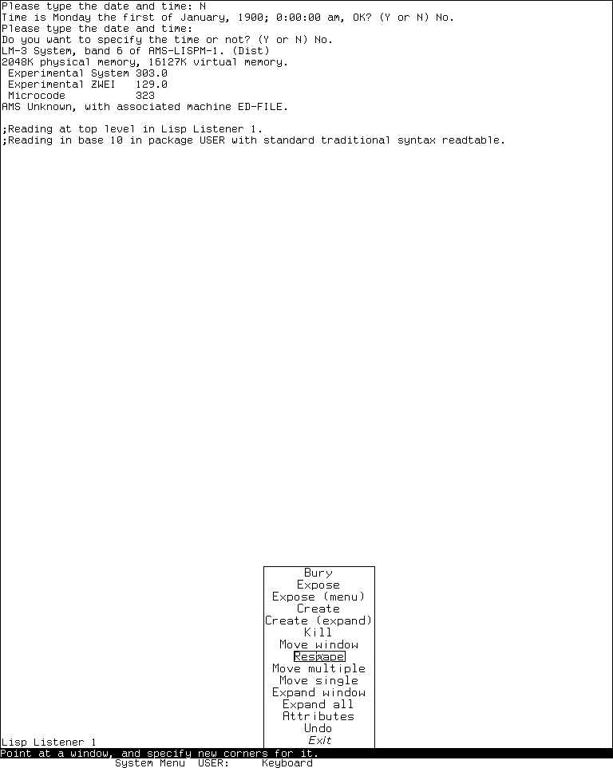
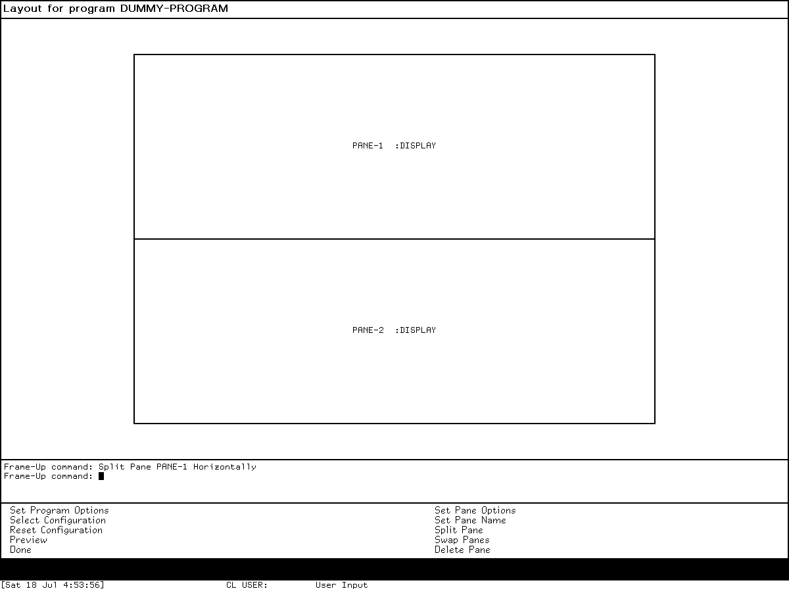
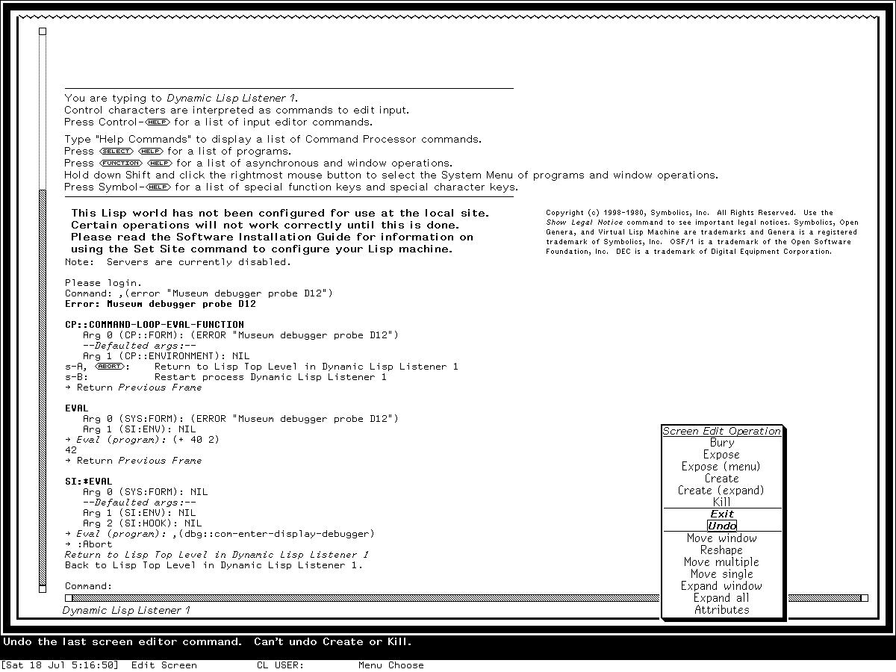

# Screen Editor and Frame-Up on the MIT Lisp Machine and Genera

## Bottom line

The Screen Editor and Frame-Up both manipulate rectangular layouts, but they do
different jobs. The Screen Editor changes a **live hierarchy of windows**: it can
move, reshape, expose, bury, create, destroy, expand, and edit the attributes of
windows already participating in a screen or frame. Frame-Up is a **program-interface
designer**: it edits a model of a future Dynamic Windows program frame and emits a
`DEFINE-PROGRAM-FRAMEWORK` form.

The Screen Editor did not disappear between the CADR and Genera. The inspected
System 46 release has a 13-command version, LM-3 System 303 has a 15-command version,
and the licensed Genera 8.5 source contains a closely descended 15-command version.
Genera adds Frame-Up alongside that inherited live-window tool; Frame-Up is not its
replacement.

Two fresh observations establish the distinction. System 303 displayed the complete
15-item Screen Editor operation menu without changing any window geometry. In the
Genera 8.5 world, Frame-Up started with one `:DISPLAY` pane, accepted **Split Pane
PANE-1 Horizontally**, displayed the resulting two-pane model, and returned to the
previous Listener when **Done** was selected.

## Evidence and release boundaries

This article keeps four evidence classes separate:

- **Public source fact:** MIT System 46 comes from the released source tree at
  revision `8e978d7d1704096a63edd4386a3b8326a2e584af`.
- **Maintained-source and runtime observation:** LM-3 System 303 source is pinned to
  Fossil check-in
  `4df393c68d7f083ce42d5c377039d26043cc18a9031ace28258dc97f4137eb91`,
  and the matching public `System 303-0` band was run in the museum harness.
- **Public manual fact:** the Genera descriptions were cross-checked against the
  public *Genera Workbook*, *Genera User's Guide*, and *Programming the User
  Interface* material.
- **Licensed-artifact observation:** implementation details for Genera 8.5 were
  derived locally from purchased media and are paraphrased here. No proprietary
  source or recovered payload is tracked.

The exact inspected source artifacts were:

| System and file | Bytes | SHA-256 | Role |
| --- | ---: | --- | --- |
| System 46 `lmwin/scred.62` | 49,289 | `63bdc78c6984cbb6e68b207fea7f2167955bae17350680d6fe2381fec1e8ecb8` | Public Screen Editor implementation |
| System 46 `lmwind/operat.27` | 85,337 | `a5ab658210dc09891b0886b58af705368e33a41f013073c8b9a637d99ab0f02d` | Public operator-manual source |
| System 303 `window/scred.lisp` | 69,028 | `8f76df709ca1b913925370463248d00c13d059c97a2bdb6d5154db3797749cf9` | Maintained public Screen Editor implementation |
| Genera 8.5 `window/scred.lisp` | 94,187 | `d0756bb5102789ad748a08bb1087166c9e13f071ec233adbeca1730107d1e542` | Licensed Screen Editor implementation; metadata only |
| Genera 8.5 `dynamic-windows/layout-designer.lisp` | 50,166 | `3fe3957872d881daf28bc9cb60079fbb32bfdca28dbefb098722cea5befb46a4` | Licensed Frame-Up implementation; metadata only |
| Genera 8.5 `dynamic-windows/program-framework-panes.lisp` | 18,999 | `4ebc7fac734b83b7f9c2be4e81fb47b6443157460c0fcdbbb864dd242eeb27ea` | Licensed pane-type registry; metadata only |

## Screen Editor: entry and interaction model

In all three inspected generations, **Edit Screen** is a System Menu operation.
The ordinary action edits the inferiors of the current screen. The alternate
right-button path can select a visible frame or screen beneath the pointer, allowing
the same machinery to rearrange the panes inside a program frame rather than only
top-level windows.

The interaction is deliberately pointer-driven rather than key-driven:

1. Select an operation from the temporary Screen Editor menu.
2. When prompted in the who line, point at the requested window, edge, corner, or
   destination.
3. Click **Left** to accept. **Middle** or **Right** aborts the current pointing
   operation and returns to the operation menu.
4. Choose **Exit** to leave the editor.

There is no independent Screen Editor keybinding table in the inspected releases.
Its complete user command surface is the operation menu plus the mouse gestures
described below.

### Complete command comparison

| Operation | System 46 | System 303 | Genera 8.5 | Effect and controls |
| --- | :---: | :---: | :---: | --- |
| **Bury** | yes | yes | yes | Point with Left to move a live window beneath the other active inferiors; Middle or Right aborts. |
| **Expose** | yes | yes | yes | Point at a visible part of a window and move it to the exposed front of the ordering. |
| **Expose (menu)** | yes | yes | yes | Choose by name from the deexposed active inferiors, including windows that cannot be pointed at. Later code reports an empty list instead of silently doing nothing. |
| **Create** | yes | yes | yes | Invoke the same extensible window-type creation menu used by the System Menu, then specify the new geometry. |
| **Create (expand)** | no | yes | yes | Create a window and immediately expand it into free space. |
| **Kill** | yes | yes | yes | Destroy a selected window. System 303 and Genera explicitly ask for confirmation. It cannot be undone. |
| **Exit** | yes | yes | yes | Leave Screen Editor and reselect the prior window when its exposed ancestry still permits it. |
| **Undo** | yes | yes | yes | Restore the saved geometry, exposure state, and ordering from before the previous successful command, subject to the limitations below. |
| **Move window** | yes | yes | yes | Preserve width and height while moving the selected window to a pointer-selected position. |
| **Reshape** | yes | yes | yes | Select a window and set a new shape. System 46 and System 303 use the older size-selection interaction; Genera delegates to its newer window reshaper. |
| **Move multiple** | yes | yes | yes | Toggle coincident edges and corners into a highlighted set with Left; Left Long on a feature begins movement; a final Left places the set; Middle or Right aborts. |
| **Move single** | yes | yes | yes | Use the following-arrow cursor to select one exposed edge or corner, move it, and place with Left; Middle or Right aborts. |
| **Expand window** | yes | yes | yes | Grow one window into adjacent space not occupied by another exposed window. |
| **Expand all** | yes | yes | yes | Grow every exposed window outward to fill free space without taking away any window's previous territory. |
| **Attributes** | no | yes | yes | Edit the selected window's non-geometric attributes. The implementation model changes substantially between System 303 and Genera. |

System 46 contains 13 entries. System 303 adds **Create (expand)** and
**Attributes**, moves **Exit** to the last position, and supplies item-specific mouse
documentation. Genera retains the same 15 operations but places **Exit** and **Undo**
before the geometry group and gives the pop-up a **Screen Edit Operation** label.

### Move Multiple and Move Single

These two commands expose behavior that a short menu label cannot convey.

**Move Multiple** treats window boundaries as connected geometry. A Left click on an
edge or corner toggles it in the move set; selecting one member of a group of
coincident features includes the others so adjacent windows can remain joined. A
second click removes an unwanted member. Left Long both selects and starts the move,
and the next Left click fixes the group at its new position.

**Move Single** uses a large arrow cursor. At an edge it points perpendicular to the
edge; at a corner it rotates to keep pointing at that corner. Once selected, the
feature follows the pointer until placed. The implementation validates the proposed
edges before applying them; maintained System 303 and Genera beep and report an
illegal result instead of accepting an invalid rectangle.

### What Undo really stores

The Screen Editor does not record an inverse function for every command. It snapshots
each editable inferior as:

```text
(window exposed-state left top right bottom)
```

Commands return a transformed list, and the central loop applies the geometric and
exposure side effects. This makes ordinary geometry changes reversible with one
saved prior list. System 303 and Genera reread the live screen immediately before a
command so changes made by other processes or by screen management are incorporated;
an aborted command does not replace Undo history.

The source also records exact limits:

- **Kill** cannot be undone because the window object has been destroyed.
- Undoing **Create** buries the new window; it does not destroy it.
- Reconstructing the precise order of deexposed inferiors is not always possible.
  Undoing an exposure can therefore return a window to the wrong place in that
  hidden ordering.
- For the same reason, two successive Undo operations are not guaranteed to be a
  no-op, and undoing the bury of an already deexposed window is inexact.

These are implementation comments and behaviors, not retrospective guesses.

### Attribute editing changed from a fixed form to delegation

System 303's **Attributes** command builds a fixed variable-value editor. Depending
on what the selected window supports, it offers:

- current font;
- `**MORE**` processing;
- reverse video and vertical line spacing;
- actions for input and output attempted while deexposed;
- character-drawing and erasing ALU functions;
- screen-manager priority and save-bits behavior;
- window name or label; and
- border width and border-margin width.

The form has **Done** and **Abort** choices. Changing reverse video also updates the
default draw and erase ALU operations so their polarity remains coherent.

Genera replaces that hard-coded catalog with a protocol. The Screen Editor asks the
selected window for its own attribute queries and applies the returned message/value
pairs. This lets different window classes expose different editable attributes
without changing the Screen Editor itself.

### Source-only lineage findings

The Genera code is recognizably descended from the MIT implementation: the operation
names, edge-alist transaction model, `:BURY` marker, expansion algorithms, following
arrow, and Undo caveats remain. It is not merely a new tool with a reused name.

The later implementation is nevertheless adapted to Genera's multi-console window
environment. It obtains the mouse, selected window, and who line from the edited
sheet's console; considers an ancestor editable only when it advertises editable
inferiors; uses the Genera window reshaper; and delegates attribute selection to the
window. This is a concrete example of old Lisp Machine UI machinery surviving while
its protocols evolved.

## Frame-Up: designing a program frame

Frame-Up is a separate Genera program named internally `layout-designer`. It is
registered as activity and System Menu entry **Frame-Up**, and its direct Select key
is `Select Q`. The default frame contains:

- a one-line title pane;
- a graphical layout-model display;
- a Command Processor interactor; and
- a two-column menu containing five program/frame commands and five pane commands.

On a direct start, its initial model is program `DUMMY-PROGRAM` with one pane named
`PANE-1` of type `:DISPLAY`. Starting it from Zmacs associates the result with the
calling buffer instead.

### Complete Frame-Up command inventory

Frame-Up itself requests no single-character keyboard accelerators. All ten commands
are available by name through its Command Processor and as menu choices.

| Command | Arguments | Complete behavior at the inspected boundary |
| --- | --- | --- |
| **Set Program Options** | none; opens an accepting-values form | Sets program name, Select key, command-defining macro, whether the generated command table reads single-character accelerators, and inherited command tables. |
| **Select Configuration** | one standard configuration | After a beep and destructive confirmation, replaces the current pane tree with either **command-menu listener** or **title display command-menu interactor**. |
| **Reset Configuration** | none | After a beep and destructive confirmation, discards the current tree and restores one `:DISPLAY` pane. |
| **Preview** | none | Evaluates the generated framework definition in a redefinition-enabled environment, creates a temporary full program frame, prints pane names into its panes, and waits for a character before returning to Frame-Up. |
| **Done** | none | Generates and remembers the newest definition for this program name, increments the result tick used by waiting Zmacs commands, and deselects Frame-Up. Direct invocations return to the preceding activity; editor invocations insert or replace code. |
| **Set Pane Options** | pane | Opens an accepting-values display for the pane name, type, and the options allowed by the selected registered pane type. Middle-clicking a leaf pane invokes this command directly. |
| **Set Pane Name** | pane, new symbol | Renames a leaf pane. Its presentation translator produces a nonactivated command, allowing the new name to be completed before execution. |
| **Split Pane** | leaf pane, `Horizontally` or `Vertically` | Creates a second `:DISPLAY` pane. Horizontal means a horizontal dividing line and a vertical stack; vertical means a vertical dividing line and a horizontal row. Left on a leaf requests horizontal splitting; Shift-Left requests vertical splitting. |
| **Swap Panes** | two panes | Exchanges two siblings in the same row or column. It rejects the same pane twice, the top pane, or panes with different parents. |
| **Delete Pane** | pane | Removes a pane. If its hidden row/column parent then has one child, the surviving child is promoted. The only pane cannot be deleted. |

No base Frame-Up keybinding is installed for these commands. `:MENU-ACCELERATOR T`
marks their menu role; it is not a character binding. Standard inherited Command
Processor editing and completion remain available in the interactor.

### Pane types and editable options

The public Genera manual describes six Frame-Up pane types. The inspected Genera 8.5
source registry defines those six plus `:TREE-BROWSER`, and Frame-Up enumerates the
registry dynamically. Loaded systems can therefore extend the set; the menu is not a
fixed six-element constant.

| Pane type | Purpose | Options exposed by the inspected registry |
| --- | --- | --- |
| `:INTERACTOR` | Compact interactive input/output | typeout window, automatic typeout removal, height in lines |
| `:LISTENER` | Taller interaction history | typeout window, automatic typeout removal, height in lines |
| `:COMMAND-MENU` | Program command choices | menu level, row or column number/contents, centering, compressed/equalized columns, width extension |
| `:TITLE` | Program title | redisplay function or string, redisplay after commands, height, size from output |
| `:DISPLAY` | Application output | flavor, redisplay function or string, incremental and after-command redisplay, typeout behavior, height, size from output |
| `:ACCEPT-VALUES` | Editable program-state queries | accepting function, query independence, changed-value/default policy, program-state modification, after-command redisplay, typeout behavior, height, size from output |
| `:TREE-BROWSER` | Dynamic hierarchical browser | height and output sizing; margins; literal or generated root; open branches; leaf predicate/style; branch description, walking, style, comparison, inferior, and data functions |

The options form special-cases two interacting groups. Redisplay can be **None**,
**String**, or **Function**; choosing one removes incompatible properties, and a
function can enable incremental redisplay. Command menus can use defaults, a numeric
row/column count, or explicit lists of item strings.

The source and manual disagree on one default. The manual describes inherited tables
including `standard scrolling`; the inspected definition initializes Frame-Up's model
with `colon full command`, `standard arguments`, and `input editor compatibility`.
The source value is the claim made here for this Genera 8.5 artifact.

### How the pane model works

Frame-Up stores a tree of `layout-pane` objects. Leaves are the panes that will
appear in generated code. Internal nodes use private `:ROW` and `:COLUMN` types and
must not escape into the emitted pane catalog.

Splitting a leaf follows two rules:

1. If the parent already has the desired orientation, add the new sibling directly
   after the selected pane.
2. Otherwise wrap the old leaf and its new sibling in a new hidden row or column,
   replacing the old leaf in its former parent.

The selected leaf remembers the opposite orientation for its next split. Deletion
performs the inverse cleanup by collapsing a hidden parent with one survivor. Swap is
intentionally restricted to siblings so the operation never has to reconcile two
different constraint contexts.

### What Frame-Up generates

The result is a `DEFINE-PROGRAM-FRAMEWORK` form containing:

- optional Select key;
- command-defining macro;
- inherited command-table names and accelerator policy;
- state variables;
- leaf pane descriptions with only allowed options; and
- one named configuration with layout and size constraints.

If any leaf is `:ACCEPT-VALUES`, generation automatically adds the
`accept-values-pane` command table. A last-resort path emits a one-pane column and an
even size when the default unsplit model would otherwise produce no layout
description.

`Done` stores one latest definition per program name in memory. A direct Frame-Up
session therefore does not write a file; **Insert Program Definition** is needed later
from Zmacs. An editor-launched session waits for the result tick and inserts the form
at point.

### Complete Zmacs integration

Four named commands are installed in the standard Zmacs command table; the base
source assigns none of them a direct key sequence.

| Zmacs command | Behavior |
| --- | --- |
| **Create Program Definition** | Prompts for a program name, resets Frame-Up to a new one-pane model in the current package, selects Frame-Up, waits for **Done**, and inserts the generated form at point. |
| **Insert Program Definition** | Selects one of the definitions remembered in the current Lisp world and inserts it at point. |
| **Edit Program Definition** | Reopens only the most recent Frame-Up model for the same program, then replaces the definition interval after **Done**. It cannot reconstruct an arbitrary hand-edited definition. |
| **Edit Program Redisplay Function** | Prompts for a program and pane whose pane description has an explicit redisplay function, then invokes the editor on that function. |

The public Frame-Up chapter lists the first three commands; the fourth is a
source-visible addition. **Edit Program Definition** is intentionally conservative:
it warns that added options will be lost, edited values will revert, and deleted
options will reappear, and asks before proceeding. This behavior follows from the
fact that Frame-Up retains its last model rather than parsing arbitrary framework
code back into a model.

### Source-visible limitations omitted or understated by the manual

- The graphical display is a simulation of constraint-frame layout, not the normal
  layout engine. Its size functions estimate command-menu width from an average item
  width and scale character units internally, so it should not be read as a
  pixel-exact WYSIWYG renderer. **Preview** is the authoritative visual check.
- A source comment identifies unique pane naming as buggy when a standard layout has
  more than one pane of a given type.
- The state-variable editor is commented out with a note that it does not work well.
  State variables can still appear in generated forms, but this source does not
  provide the intended interactive editor for them.
- The source contains a release-7 fallback for an unsplit one-pane configuration,
  described there as a last-minute fix rather than the preferred layout model.
- Editing an existing definition is model-based and lossy, as described above; it is
  not a general code-to-layout decompiler.

## Runtime observations

### System 303 Screen Editor



*Runtime observation: the 15-item Screen Editor menu in LM-3 System 303, captured
2026-07-18 after selecting **Edit Screen** from the live System Menu. No geometry or
window command was executed. MIT and other underlying software/display interests
remain with their respective rightsholders; the image is reproduced for criticism,
scholarship, and historical documentation under 17 U.S.C. section 107. No affiliation
or endorsement is implied.*

The captured ordering exactly matches the pinned System 303 source. The pointer
landed on **Reshape**, and the who line displayed its operation-specific explanation,
which also confirms that the maintained menu's documentation metadata is live UI.
The menu was then exited without changing geometry.

| Runtime item | Recorded value |
| --- | --- |
| Session | `layout-tools-20260718`, generation 1 |
| Interval | 2026-07-18 04:45:30–04:54:25 EDT |
| Guest | Experimental System 303.0, ZWEI 129.0, microcode 323; `System 303-0` band |
| Disk | Base and private-start SHA-256 `bb16e46ad81decfe1efe691d36b6aa4ce3fd4ffb82474365de3520989d397cb5`; base unchanged at stop |
| Source | System check-in `4df393c68d7f083ce42d5c377039d26043cc18a9031ace28258dc97f4137eb91`; private tree SHA-256 `21f5215de973aa6ccbddb817f2d64edd95ee1014c3028a9b0711ea7c741b807e`, unchanged during the run |
| Emulator | Executed SHA-256 `707a77d23e28ea1c45ae0eb0145dc181fa7ba649b9defc30044d4f847ac2c5be` |
| Curated frame | 768 by 963; 4,688 bytes; PNG SHA-256 `87cb86efce54505176e82157a09aab6a0ba693359012afefc02f33e01c525c6e`; normalized-pixel SHA-256 `12f8b164a5105aa996f480d8f8631c27ae5cdc214961b0afb34ba90c3a6d44b3` |
| Final record | 6,601 bytes; SHA-256 `794a35bb1223a152e0f9093d39d577fc7bccd55c002fe27ed53d159749d519dd` |
| Shutdown | Clean; `forced_stop=false`, complete emulator state, emulator and Xvfb status 0, public base disk unchanged |

### Genera 8.5 Frame-Up



*Runtime observation: Frame-Up in the licensed Genera 8.5 world after executing
**Split Pane PANE-1 Horizontally**, captured 2026-07-18. The pane model and command
transcript substantiate the source/manual analysis. Symbolics and other underlying
software/display interests remain with their respective rightsholders; reproduced
for criticism, scholarship, and historical documentation under 17 U.S.C. section
107. No affiliation or endorsement is implied.*

`Select Q` opened Frame-Up directly with the documented dummy program and one display
pane. Choosing **Split Pane**, pointing at the `PANE-1` presentation, and completing
`Horizontally` produced two equal panes stacked above and below a horizontal divider.
The interactor retained the exact command. Choosing **Done** returned to the prior
Dynamic Lisp Listener. This direct invocation changed only unsaved Lisp state; it did
not insert source into a buffer or save the world.

The action prefix also preserves two unsuccessful exploratory inputs: a Left click in
pane whitespace caused no visible layout change, and a Right click opened Genera's
generic Operation menu rather than a Frame-Up pane menu. The operation menu was
dismissed without a choice. No broader gesture inference is made from those attempts.

| Runtime item | Recorded value |
| --- | --- |
| Session | `layout-tools-20260718`, generation 1 |
| Interval | 2026-07-18 04:45:37–04:54:45 EDT |
| Licensed input | `opengenera2.tar.bz2`, 206,213,430 bytes, SHA-256 `89fb3e76b91d612834f565834dea950b603acf8f9dbacacdd0b1c3c284a2d36e` |
| World | `Genera-8-5.vlod`, 54,804,480 bytes, SHA-256 `a8ee5e86cc7e322f7385af3e0cd579d7650d4dcfc3ce328acbf8b25515dd0672` at start and stop |
| VLM and debugger | VLM SHA-256 `9f5e18d5770f973879716182b6856ef5a8ee9d3b2bb907476ea0cf35986aa4c7`; debugger SHA-256 `2db918cfe8f35f52c7ff4b7695b0ecd3bb85e41a3327ea5a94874edf05edb54a` |
| Isolation | Private Xvfb and separate user, mount, network, PID, IPC, and hostname namespaces; no external route or guest-visible host file service |
| Curated frame | 1200 by 900; 2,940 bytes; PNG SHA-256 `74925b70d33db0041b024d9fd68c2132d10f071839fc9cd688d09c0385966bb0`; normalized-pixel SHA-256 `c74dcb59fac25239f723eb3be43327c39866f6a1533fe2838a8b2f94bb51b90a` |
| Capture action prefix | 26 records; SHA-256 `ff67d57b9d36482395c5d5afc288bf7fd6aa86d9919593171882d927e3fbd2c9` |
| Complete action log | 28 records; 13,301 bytes; SHA-256 `0e8cc59f1dda23f0f34484911ade97928b986c55dcbdd54f4d79507e85a42e24` |
| Final record | 25,545 bytes; SHA-256 `90171c2f3881211b699160ccf43a11010fef820111ca549635496ce252536956` |
| Shutdown | The known confirmed-shutdown stall required bounded host termination; `forced_stop=true`, unsaved Lisp state discarded, no Save World or checkpoint, base world unchanged |

### Genera 8.5 Screen Editor



*Runtime observation: selecting **Edit Screen** from the live Genera 8.5 System
Menu opened this inherited Screen Editor menu on 2026-07-18. No geometry command
was selected. The capture is published to compare the actual menu with the MIT
lineage beside substantive source analysis; Symbolics and other underlying
interests remain with their rightsholders, and inclusion implies no endorsement.*

The rendered menu has the same fifteen labels and grouping established by the
licensed source: Bury, Expose, Expose (menu), Create, Create (expand), Kill,
Exit, Undo, Move window, Reshape, Move multiple, Move single, Expand window,
Expand all, and Attributes. The pointer was on **Undo**, and the bottom line
confirmed the source-defined exception that Undo cannot reverse Create or Kill.
The harness then selected **Exit** without applying a geometry operation and
returned to the Listener. The prior synthetic debugger transcript visible behind
the menu is session context, not an input to Screen Editor and contains no user data.

| Runtime item | Recorded value |
| --- | --- |
| Session | `debuggers-d12-genera-20260718`, generation 2 |
| Interval | 2026-07-18 04:55:22–05:18:00 EDT |
| Licensed input | `opengenera2.tar.bz2`, 206,213,430 bytes; SHA-256 `89fb3e76b91d612834f565834dea950b603acf8f9dbacacdd0b1c3c284a2d36e` |
| World | `Genera-8-5.vlod`, 54,804,480 bytes; SHA-256 `a8ee5e86cc7e322f7385af3e0cd579d7650d4dcfc3ce328acbf8b25515dd0672` at start and stop |
| Curated frame | Raw `0029-edit-screen-menu.png`, 1200 by 900, 14,224 bytes; PNG SHA-256 `c917789c97344cd4b0a5e23ffa0949b3292b197a76a105d96933e90e9992231d`; normalized-pixel SHA-256 `1c2ba250dffe05ce195acb029cc1748c0053a049e7da7ef3ff1851ec31a620e0` |
| Capture action prefix | 76 records; SHA-256 `477e0cbbd983afb4e7f162e29bb1020ff6cb660860885e63c22340d2c9ce0c30` |
| Complete action log | 80 records; SHA-256 `c865f298f1710ffd67237ed52a6a7abd8fc72dba38e37a6b8387483e09b96386` |
| Final record | 22,969 bytes; SHA-256 `e83a9a7896b44b028d115f0da452b35f38d841bfeead1b805439814984688e03` |
| Shutdown | Prompt, confirmation acceptance, and cleanup progress observed; known Cold Load channel stall then required bounded host termination; no Save World or checkpoint, base world unchanged |

## Preservation and rights boundary

The System 46 and LM-3 source observations come from public repositories. The Genera
implementation observations come from licensed local media and are presented only as
original analysis and artifact metadata. The tracked Genera screenshot is a narrow
runtime state, not redistributed source, documentation, pane assets, or a substitute
for the software.

All three curated screenshots passed the image- and use-specific review in
[Publishing runtime screenshots for museum documentation](screenshot-publication-rights-review.md).
They are excluded from any repository-wide software or content license. Raw captures,
sidecars, logs, disks, worlds, and exploratory states remain under ignored build
trees.

## Open questions

- Exercise Frame-Up's **Preview** in a disposable session to measure how the simulated
  model differs from the generated live constraint frame for several constrained
  pane types.
- Determine from release history when `:TREE-BROWSER` became a registered Frame-Up
  pane type and whether a public manual revision documents it.
- Establish whether any later patch repaired the source-commented duplicate-type
  pane-naming bug or interactive state-variable editor.

## Sources

- MIT, [System 46 Screen Editor source](https://github.com/mietek/mit-cadr-system-software/blob/8e978d7d1704096a63edd4386a3b8326a2e584af/src/lmwin/scred.62),
  pinned public release revision; verified 2026-07-18.
- MIT, [System 46 operator manual source](https://github.com/mietek/mit-cadr-system-software/blob/8e978d7d1704096a63edd4386a3b8326a2e584af/src/lmwind/operat.27),
  “The Screen Editor”; verified 2026-07-18.
- LM-3 project, [System 303 Screen Editor source](https://tumbleweed.nu/r/sys/file?ci=4df393c68d7f083ce42d5c377039d26043cc18a9031ace28258dc97f4137eb91&name=window%2Fscred.lisp),
  pinned Fossil check-in; verified 2026-07-18.
- Symbolics, [*Genera User's Guide*](https://bitsavers.org/pdf/symbolics/software/genera_8/Genera_User_s_Guide.pdf),
  “System Menu”; verified 2026-07-18.
- Symbolics, [*Genera Workbook*](https://bitsavers.org/pdf/symbolics/software/genera_8/Genera_Workbook.pdf),
  “Editing the Screen Using the System Menu” and walk-through; verified 2026-07-18.
- Symbolics, [*Programming the User Interface*](https://bitsavers.org/pdf/symbolics/software/genera_8/Programming_the_User_Interface.pdf),
  “Using Frame-Up” and “Window Hierarchies”; verified 2026-07-18.
- Local licensed Genera 8.5 source and extracted documentation artifacts identified
  by the byte counts and SHA-256 records above, inspected 2026-07-18; not distributed.
