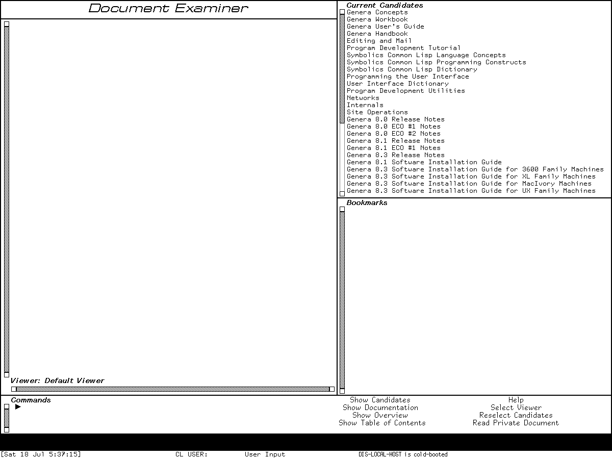

# Symbolics Genera application atlas

This is a map of the **inspected Genera 8.5 world and media**, not a promise that
every Symbolics product is loaded or configured. Each D01-D60 row tells you what the
area is for, a good first encounter, and the honest runtime boundary. Start with
[Genera orientation](orientation.md).

## Everyday environment: D01-D16

| Area | What you would do | First tour stop | Preserved boundary |
| --- | --- | --- | --- |
| D01 Dynamic Lisp Listener | Evaluate Lisp and enter Command Processor commands with typed arguments. | `Select L`; evaluate `(+ 40 2)`; enter `Help Commands`. [Dossier](../../genera/dynamic-lisp-listener.md) | Hands-on and reviewed; site warnings are real context. |
| D02 activities/windows | Select or create activities and manage windows/layouts. | Hold Shift-Right for System Menu; try `Select E`, then `Select L`. [Dossier](../../genera/activities-and-system-menu.md) | Hands-on basic selection; layout mutation remains a deliberate follow-up. |
| D03 Screen Editor/Frame-Up | Edit the live screen or design a program-frame layout. | Inspect **Edit Screen**, then `Select Q` for Frame-Up and study its pane model. [Dossier](../../screen-editor-and-frame-up.md) | Both distinct tools verified; do not treat Frame-Up as the replacement Screen Editor. |
| D04 Emergency Break | Recover through the separate cold-load stream. | Read the entry/resume sequence, then use only the verified synthetic arithmetic exercise. [Dossier](../../emergency-break-and-cold-load-stream.md) | Hands-on but recovery-oriented; the current VLM's bounded host-shutdown stall is separate. |
| D05 Zmacs | Edit code/text with modes, buffers, commands, presentations, and panes. | `Select E`; Help; `Meta-X`; `Control-X 3` for a second editor window. [Dossier](../../genera/zmacs.md) | Hands-on selected profile; optional/site overlays remain an oracle. |
| D06 directories/buffers | Stage file and buffer actions and compare directories. | From Zmacs, open Edit Buffers and mark a disposable buffer. [Dossier](../../directory-difference-and-buffer-editors.md) | Mark verified; destructive execution and populated directory paths need controlled data. |
| D07 Document Examiner/Help | Search structured installed documentation and ask contextual Help. | `Select D`; identify Current Candidates, Bookmarks, Commands, and the menu; then ask Zmacs Help. [Dossier](../../help-self-documentation-and-document-examiner.md) | Initial DEX frame reviewed; do not reproduce licensed Help prose. |
| D08 Zmail | Read collections, inspect messages, compose, filter, and send mail. | `Select M`; study the empty reader panes, then open a blank Text Mail composition buffer. [Dossier](../../genera/zmail.md) | Local frames verified; delivery host is absent. |
| D09 Converse/Notifications | Hold direct conversations and review retained notifications. | `Select C` for an empty form; `Select N` for the synthetic notification record. [Dossier](../../converse-direct-messages-and-notifications.md) | UI states verified; no peer delivery/reply transaction. |
| D10 Terminal | Connect to remote hosts with Telnet/NVT and terminal simulators. | `Select T`; inspect the `Connect:` prompt and abort. [Dossier](../../network-terminal-applications.md) | Disconnected state verified; no route or connected negotiation. |
| D11 Inspectors | Browse Lisp objects and diagnose presentation types/handlers. | `Select I` on a short list; then follow the Presentation Inspector's integer example. [Dossiers](../../genera/inspector-and-peek.md) | Synthetic objects verified; Presentation Inspector is a distinct diagnostic client. |
| D12 Debuggers | Navigate conditions, frames, restarts, and graphical stack displays. | Signal the documented synthetic condition; compare ordinary Debugger and Display Debugger. [Dossier](../../genera/debugger-and-display-debugger.md) | Reviewed safe probe; never casually proceed from an unfamiliar real condition. |
| D13 Trace/Stepper | Trace calls, step execution, install breakpoints, and find callers. | Trace a researcher-owned function and remove the trace afterward. [Dossier](../../trace-stepper-breakpoints-and-call-analysis.md) | Basic trace/call analysis verified; disruptive breakpoint paths deferred. |
| D14 Peek | Watch processes, windows, files, and networks. | `Select P`; choose Processes and read the display before using any object operation. [Dossier](../../genera/inspector-and-peek.md) | Process view verified; destructive actions not exercised. |
| D15 Metering | Sample, report, and visualize performance data. | Read the [metering dossier](../../metering-and-performance-analysis.md) and identify the substrate versus Metering Interface. | Optional load reached unavailable file service; no visible frame claimed. |
| D16 Flavors/CLOS | Examine Flavor and CLOS class relationships and methods. | `Select X` for Flavor Examiner; inspect a researcher-defined CLOS class separately. [Dossier](../../flavors-clos-and-flavor-examiner.md) | Both views reviewed; distinct object systems. |

*Runtime observation: the D07 first-tour frame. It establishes the visible application
layout without reproducing a documentation article or claiming every search result.*

## Files, operations, and implementation: D17-D27

| Area | What you would use it for | First tour stop | Preserved boundary |
| --- | --- | --- | --- |
| D17 file systems | Work with host files, NFILE, NFS, LMFS, Dired, and File Server. | Learn logical pathnames, then inspect Dired with synthetic data. [Dossier](../../file-systems-and-file-service.md) | Harness provides no guest-visible host file service. |
| D18 FSEdit | Inspect and repair file systems. | Read the [FSEdit dossier](../../genera/fsedit-and-file-system-maintenance.md) and classify every command before use. | Destructive runtime intentionally deferred. |
| D19 tape | Read/write formats, transports, distributions, and FEP tape media. | Tour the command inventory in the [tape dossier](../../tape-systems-and-tape-utility-frame.md). | No device or remote tape service; do not infer from installed commands. |
| D20 Namespace Editor | Browse and edit namespace objects for sites, hosts, users, and services. | Open Namespace Editor from System Menu and study the empty frame. [Dossier](../../genera/namespace-administration-and-editor.md) | Empty frame reviewed; world is not a configured site and persistence is deferred. |
| D21 service dashboards | Operate Mailer, Printer Spooler, Domain Server, and File Server programs. | Compare their common program/log architecture in the [dossier](../../background-services-and-operations-dashboards.md). | Services are disabled/unconfigured; local program presence is not service success. |
| D22 runtime/compiler | Compile, macroexpand, disassemble, schedule, collect, and inspect execution contexts. | Compile and disassemble a tiny function; check GC Status. [Dossier](../../lisp-runtime-compiler-and-development-environment.md) | Harmless probes reviewed. |
| D23 compiled objects | Load/dump compiled code, relocate, serialize, and inspect UNFASL limits. | Read the [QFASL dossier](../../compiled-objects-qfasl-relocation-and-unfasl.md). | Infrastructure; `L-BIN`, `BIN`, `KBIN`, and C+LISP support are not one format family. |
| D24 systems/worlds | Build systems, apply patches, create worlds, and distribute systems. | Query loaded versions and inspect System Construction declarations. [Dossier](../../system-construction-patches-worlds-and-distribution.md) | Do not Save World or build distributions in the base preservation input. |
| D25 compare/version control | Compare source and use optional Compare/Merge or Version Control products. | Start with SRCCOM's non-mutating comparison model. [Dossier](../../source-comparison-compare-merge-and-version-control.md) | Optional product systems are media-present but disabled/unloaded. |
| D26 text production | Format, query, grind, spellcheck, dribble, use Sage/Bolio, and work with fonts. | Explore harmless FORMAT/FQUERY examples, then Zmacs spelling/document commands. [Dossier](../../formatting-spelling-and-text-production-utilities.md) | Printer and full publishing pipeline not configured. |
| D27 mathematics | Use matrices, rational/complex arithmetic, elementary functions, and infix input. | Evaluate one small audited matrix operation. [Dossier](../../mathematical-and-numeric-facilities.md) | Core numeric facilities available; Macsyma is a separate D42 product. |

## Interface, graphics, and output: D28-D36

| Area | What you would use it for | First tour stop | Preserved boundary |
| --- | --- | --- | --- |
| D28 Dynamic Windows | Build typed, presentation-based program interfaces. | Use Inspector and Accepting Values, then inspect one handler with Presentation Inspector. [Dossier](../../dynamic-windows-and-presentation-based-interaction.md) | Hands-on clients plus source-grounded substrate; not CLIM. |
| D29 CLIM 2 | Build portable application frames, panes, commands, and presentations. | Read the [Genera CLIM audit](../../clim-2-on-genera.md), then choose a loaded demo only if the system is present. | CLIM definitions on media do not prove loaded frames. |
| D30 Font Editor | Edit character rasters, metrics, families, and font generations. | Study the resident font identities and [FED dossier](../../fed-and-font-editor-generations.md). | Font products extracted from Genera stay local; editor runtime profile remains bounded. |
| D31 bitmap/stipple editors | Paint raster images and edit repeat patterns. | Open the verified Stipple Editor `HEARTS` state and compare named patterns. [Dossier](../../bitmap-stipple-and-raster-paint-editors.md) | Pattern screen may be published; extracted proprietary glyph/picture data may not. |
| D32 Graphic Editor | Construct and edit structured drawings. | Read its command/presentation model in the [dossier](../../genera-graphic-editor-and-structured-drawing.md). | Entry is source/media-grounded; complete live drawing session remains pending. |
| D33 Color Editor | Define colors and color maps and inspect device conversion. | Study the [color dossier](../../color-systems-and-color-editor.md) before changing the world palette. | Color support exists; editor runtime is not claimed from names alone. |
| D34 images/assets | Display, convert, draw, and preserve raster and structured images. | Compare the public/restricted asset boundaries in the [CADR asset inventory](../../mit-cadr/visual-assets-inventory.md) and Genera graphics dossiers. | Licensed extracted images stay local. |
| D35 Hardcopy | Capture screens/windows and send Press, print, or plot output. | Open the reviewed Hardcopy option form without executing output. [Dossier](../../hardcopy-press-printing-and-plot-output.md) | Options verified; no printer configured and execution deferred. |
| D36 Concordia | Author structured documents, preview pages, and design books. | Read the [Concordia dossier](../../concordia-document-and-book-design.md), starting with NSage records and Zmacs integration. | Media/source present; exact system unloaded in base world. |

*Runtime observation: a D28 interface-language example. It shows that a form can be
semantic printed output rather than a grid of modern widgets; volatile GC values are
not documented defaults.*

## Languages, networking, and machine engineering: D37-D52

| Area | What you would use it for | First tour stop | Preserved boundary |
| --- | --- | --- | --- |
| D37 C/FORTRAN/Pascal | Edit, compile, debug, build, and call foreign-language code. | Use the [language dossier](../../symbolics-c-fortran-and-pascal-environments.md) to compare each product's editor/listener/debugger path. | Product documentation/source evidence; not loaded-world equivalence. |
| D38 Compiler Tools | Generate parsers/lexers and use syntax-aware editor support. | Follow the architecture from grammar definition to Syntax Editor. [Dossier](../../compiler-tools-grammar-lexer-and-syntax-editor.md) | Exact system unloaded. |
| D39 Conversion Tools | Run structured source-to-source conversions from Zmacs. | Read all 14 commands and query controls before choosing a conversion set. [Dossier](../../conversion-tools-and-source-migration.md) | Exact system unloaded; no mutation demonstration. |
| D40 Joshua | Define predicates/rules and use unification, RETE, truth maintenance, tracing, and metering. | Tour the Jericho examples and presentation model through the [dossier](../../joshua-rule-and-inference-environment.md). | Optional product; base-world runtime not claimed. |
| D41 Statice | Define persistent classes and browse a database/server. | Follow object-to-DBFS/B*-tree layers in the [dossier](../../statice-persistent-object-and-database-environment.md). | Optional server/product; no configured database. |
| D42 Macsyma | Manipulate symbolic expressions, plot, and use MEDIT/Display Editor. | Learn the expression gestures and menu panels in the [dossier](../../macsyma-421-symbolic-mathematics-environment.md). | Product unloaded in inspected world. |
| D43 NS design | Design schematics, simulate gates, lay out boards and ICs, and exchange design data. | Choose the Basic/Schematic/Gate-Array/PCB/VLSI layer in the [NS dossier](../../ns-electronic-design-family.md). | Product/media evidence; no live project or screenshot invented. |
| D44 CLOE | Migrate and deliver Genera Lisp applications to Intel DOS/Windows. | Follow development-to-delivery stages in the [CLOE dossier](../../cloe-development-and-runtime-environment.md). | Absent from preserved media and base world. |
| D45 transports | Understand Chaos, IP/TCP, NFS, name/service paths, and protocol layering. | Inspect the disabled network registry, then read the [architecture dossier](../../network-transports-and-protocol-architecture.md). | Sandbox has no external route. |
| D46 services | Configure and operate network/site utilities. | Read the live registry view and service-state vocabulary in the [dossier](../../network-services-and-site-utilities.md). | Disabled/unconfigured is the observed state. |
| D47 RPC/embedding/Mac | Integrate Genera with UNIX, host RPC, MacIvory, and Keyboard Control. | Open Keyboard Control only for a read-only view; trace the layers in the [dossier](../../rpc-embedding-ux-and-macintosh-integration.md). | Host/product combinations vary; no blanket interoperability claim. |
| D48 CLX/X | Create remote X screens or serve X facilities. | Read the [CLX dossier](../../clx-remote-x-screens-and-x-server-facilities.md). | Harness X11 is the VLM display transport, not proof of a configured Genera remote X service. |
| D49 CL-HTTP | Run HTTP servers/clients, proxy, W3P/W4, and contributed systems. | Study controls and security findings in the [dossier](../../cl-http-and-contributed-web-systems.md). | Systems are contributed/media-present and unloaded. |
| D50 CADR microassembler | Build CADR microcode. | Use the [CADR microassembler dossier](../../mit-cadr/cadr-microcode-microassembler-and-console-debugger.md) as historical comparison. | Not a Genera application. |
| D51 CADR diagnostics | Checkout and diagnose physical CADR hardware. | Use the [CADR diagnostics dossier](../../mit-cadr/cadr-diagnostics-checkout-and-hardware-tools.md) as lineage comparison. | Not a Genera application. |
| D52 Ivory/FEP/VLM | Understand processor, front end, Life Support, VLM host, and debugger layers. | Compare the live version probes with the [implementation-layer dossier](../../ivory-fep-and-open-genera-vlm-implementation-layers.md). | Hands-on read-only probes; guest Save World and host checkpoints are not inferred. |

## Demonstrations and examples: D53-D60

| Area | What you would do | First tour stop | Preserved boundary |
| --- | --- | --- | --- |
| D53 MUNCH | View the historical Munching Squares algorithm. | Read the [CADR MUNCH writeup](../../mit-cadr/munch.md) as lineage. | CADR program, not claimed as a Genera base-world app. |
| D54 LEXIPHAGE | Explore the CADR word-display novelty program. | Read the [LEXIPHAGE writeup](../../mit-cadr/lexiphage.md). | CADR program, not a Genera activity. |
| D55 Spacewar | Play the CADR two-ship game. | Use the [Spacewar dossier](../../mit-cadr/spacewar-on-the-lisp-machine.md) as historical comparison. | No Genera application claimed. |
| D56 Doctor | Converse with the CADR ELIZA-style program. | Use the [Doctor dossier](../../mit-cadr/doctor.md) as historical comparison. | No Genera base-world application claimed. |
| D57 CADR HACKS | Run the earlier display/sound/novelty suite. | Compare its members with the [CADR suite](../../mit-cadr/cadr-hacks-display-sound-and-novelty-suite.md). | Distinct from Genera HACKS. |
| D58 Genera HACKS | Run 18 registered demonstration names. | Choose one member by its audited purpose and controls in the [suite dossier](../../genera/genera-hacks-demonstration-suite.md). | Exact demo system failed at unavailable file service; no live demo frame invented. |
| D59 CLIM demos | Learn CLIM frames, presentations, formatting, and gadgets through examples. | Follow the [CLIM demonstrations dossier](../../clim-demonstrations-and-tutorial.md). | Definitions/media are cataloged; runtime load state must be checked per frame. |
| D60 product/examples | Study small Dynamic Windows, CLIM, graphics, networking, and product examples. | Use the [examples dossier](../../product-and-programming-examples.md) to choose one with satisfied prerequisites. | Examples are not automatically loaded, safe, or standalone applications. |

## Completeness and evidence

Every D01-D60 area appears above. The canonical [application dossier coverage
matrix](../../software-application-dossiers.md) supplies exact release profiles,
complete input trees, source/manual/runtime discrepancies, and open oracles. This
atlas tells a newcomer where to go and what not to assume.
