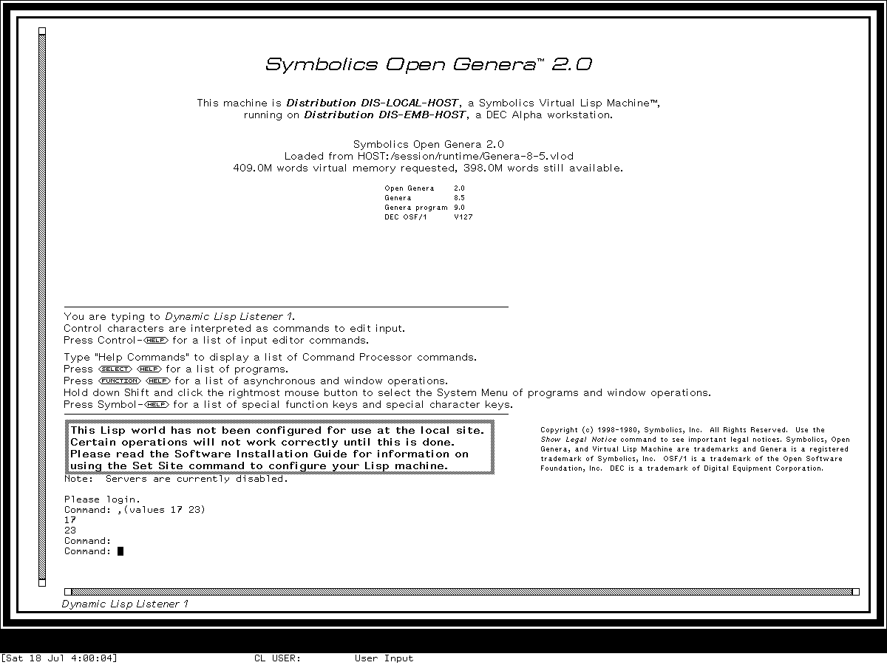

# Tour of Symbolics Genera

This tour uses the licensed **Genera 8.5, System 452.22** base world exercised through
the isolated Genera Xvfb harness. The world is deliberately not configured as a
Symbolics site: external routing and guest-visible file service are absent, and
server names or menu entries therefore do not prove a working network service.

## Your first hour

1. Learn the [screen, mouse, keyboard, presentation, and activity language](orientation.md).
2. Evaluate a harmless expression in the Dynamic Lisp Listener.
3. open the System Menu and distinguish selecting a window from starting a program.
4. use `Select E` to reach the Editor and ask for Zmacs Help.
5. use `Select D`, `Select I`, and `Select P` to visit Document Examiner, Inspector,
   and Peek.
6. Visit the [application atlas](applications.md) for mail, terminals, development
   tools, administration, and optional products.

*Runtime observation: the Genera 8.5 Dynamic Lisp Listener in the inspected base
world. The image establishes the framed interactor, scrollbar, prompt and value
ordering, and bottom status regions. It does not establish a configured site or
every Genera release. Symbolics does not endorse this project.*

## The central idea: semantic interaction

Genera often remembers what displayed text *means*. A pathname, command name, class,
or object can be a **presentation**: moving the pointer over it changes the
pointer-documentation line, and clicking may offer operations appropriate to that
object. This is more than a hyperlink and more than a conventional widget. The
current input context decides which translations are available.

Activities are similarly richer than modern process-launcher entries. `Select E`
asks the activity machinery to find an appropriate Editor window or create one
according to its policy. It does not necessarily start a fresh application.

## Application coverage

The [application atlas](applications.md) covers every Genera-relevant member of the
D01-D60 catalog, including optional products that are present only as media, source,
installed documentation, or declarations. Those entries explain the exact boundary
instead of turning catalog presence into a runnable-world claim.
