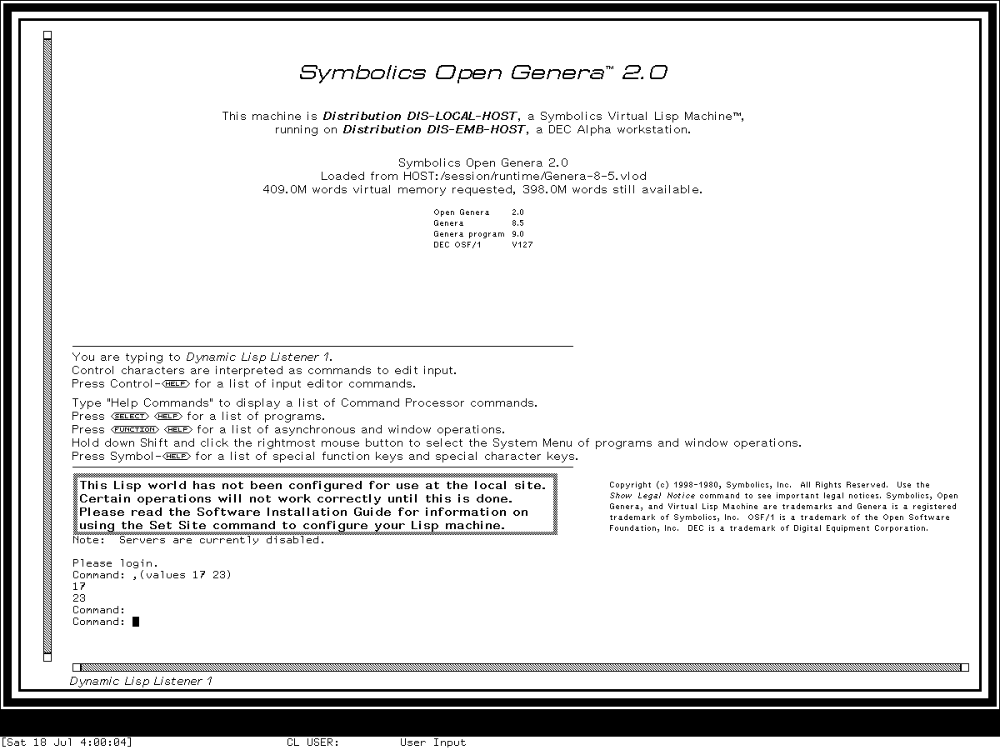

# Finding your way around Genera 8.5

Genera rewards a simple habit: before clicking or typing, look at the bottom of the
screen. The selected program, its input context, the object under the pointer, and the
available gesture all affect what an action means. The interface tells you much of
that state through labels, mode lines, highlighted presentations, and pointer
documentation.

## Read the frame

A Dynamic Windows program commonly combines:

- one or more named panes;
- an interactor or command-input area;
- a label or mode line identifying the activity, buffer, or context;
- a left-side scroll margin;
- a bottom **pointer-documentation** region and adjacent status fields.

The white status background and the black pointer-documentation field have different
jobs. The black field explains the object or operation under the pointer. Watch it as
you cross menu cells, pathnames, commands, buffer names, and other presentations.

## Presentations: displayed things that retain meaning

When Genera prints an object as a presentation, it records a relationship among:

1. the actual object;
2. a presentation type;
3. the visible region; and
4. the current input context and applicable handlers.

Left, Middle, Right, and modified clicks can therefore act on the object rather than
reparse its printed characters. Right commonly offers an operation menu. Highlighting
and pointer documentation tell you which nested object and handler will win.

This is why a row in Inspector, a pathname in a directory display, and a command name
in Help can all feel interactive without being conventional buttons.

## Select an activity

The inspected base world has these direct Select gestures:

| Gesture | Activity | Gesture | Activity |
| --- | --- | --- | --- |
| `Select =` | Select Key Selector | `Select C` | Converse |
| `Select D` | Document Examiner | `Select E` | Editor |
| `Select I` | Inspector | `Select L` | Lisp |
| `Select M` | Zmail | `Select N` | Notifications |
| `Select P` | Peek | `Select Q` | Frame-Up |
| `Select T` | Terminal | `Select X` | Flavor Examiner |

Select consumes one suffix. The activity layer then searches for a suitable existing
window, considers recent windows and compatibility, and creates one only when its
policy requires that. “Select launches an app” is therefore an unreliable mental
model.

If a facility lacks a one-character binding, type the Command Processor command
`Select Activity` and complete its activity name. `Select =` opens the selector used
to inspect or stage assignments; do not change a preserved system's bindings merely
to explore them.

## Open the System Menu

In the tested Listener, hold Shift and the Right mouse button over the client. Release
after inspecting the menu or selecting a cell.

*Keybinding and pointer illustration: the first complete frame is a reviewed Dynamic
Lisp Listener state; the second is the reviewed Genera 8.5 System Menu state produced
by holding Shift and Right over a Listener. The loop is a teaching comparison assembled
from separately captured states, not a real-time recording. It does not establish
transient timing, pointer motion, or every callback.*

The three columns answer different questions:

- **Windows** creates, selects, splits, edits, and manages the screen.
- **This Window** acts on a selected or pointed-at window: refresh, bury, reshape,
  inspect, hardcopy, and related operations.
- **Programs** selects registered facilities such as Lisp, Editor, Inspector,
  Document Examiner, Frame-Up, Namespace Editor, Trace, and Zmail.

An item can have different Left, Middle, and Right behavior. Read the pointer
documentation before committing a This Window operation.

## Try the Dynamic Lisp Listener

1. Use `Select L`.
2. Type `(+ 40 2)` and press Return.
3. Type `Help Commands` to see command areas available in this world.
4. Type a command name with spaces as ordinary words; the Command Processor parses
   commands and typed arguments rather than requiring every action to be a Lisp form.
5. Use Abort to leave an incomplete input transaction.

Commands and Lisp forms share the interaction surface but are not the same parser.
Typed arguments may use completion, histories, defaults, and presentation selection.
The [Dynamic Lisp Listener dossier](../../genera/dynamic-lisp-listener.md) defines
the exact inspected behavior.

## Try the Editor and contextual Help

1. Use `Select E`.
2. Press Help to open the Zmacs Help dispatcher.
3. Use `Meta-X` for a named editor command.
4. Use `Control-X 3` to split the editor and select a new buffer in the second pane.
5. Watch the mode lines: they tell you which buffer and mode will receive the next
   editor gesture.

Do not assume every Emacs binding. Zmacs shares ancestry and concepts with Emacs, but
its command tables, mouse presentations, Help, extended character set, Super/Hyper
families, and system integration are Lisp-machine facilities. Use the
[complete Genera Zmacs binding reference](../../genera/zmacs-keybindings.md)
when a tour step leaves the basic path.

## Scroll margins are active controls

The left scroll margin is not ornamental. Its shaft and moving region communicate
document position, and button gestures provide movement with semantics owned by the
window. Exact button and double-click behavior varies by scroll-window family. Do not
infer modern “drag the thumb” behavior where the historical program defines a
different mouse protocol.

Watch the pane rule as well as the scrollbar. A `/\/\/\` top or bottom edge means
that retained output continues beyond that edge (or that the pane is using a
secondary viewport). Genera also has left and right versions for horizontal
continuation; they are uncommon in ordinary text because the pane often has no
horizontal offset or overflow. A straight edge means that continuation predicate is
false, not that this pane uses a different decorative theme. See
[Ragged window borders](../../genera/ragged-window-borders.md) for the four exact
states and a reviewed example.

## Safe exploration boundaries

This world is not a configured site. Terminal, mail, namespace, printer, file-server,
tape, and network entries may open a local frame while their external operation
remains unavailable. Never convert “the menu offered it” into “the service worked.”
Disk repair, world saving, distribution, and administration commands deserve a
private disposable world and their dossier's failure-ordering guidance.

## Where to go next

- [Genera application atlas](applications.md)
- [Activities, Select keys, and System Menu evidence](../../genera/activities-and-system-menu.md)
- [Genera Zmacs](../../genera/zmacs.md)
- [Dynamic Windows specification](../../genera/dynamic-windows-reimplementation-specification.md)
- [Presentation Inspector](../../genera/presentation-inspector.md)

Last runtime evidence verified: 2026-07-19.
