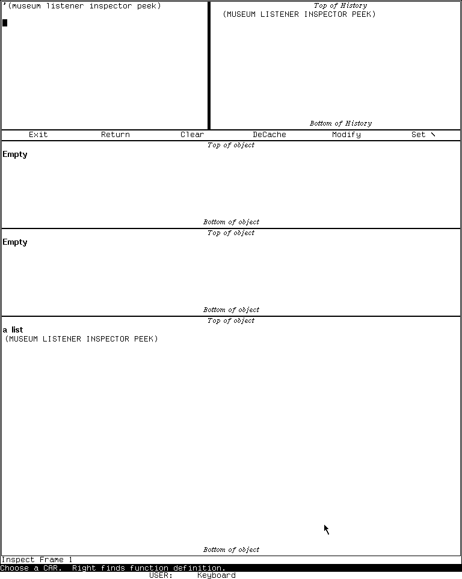
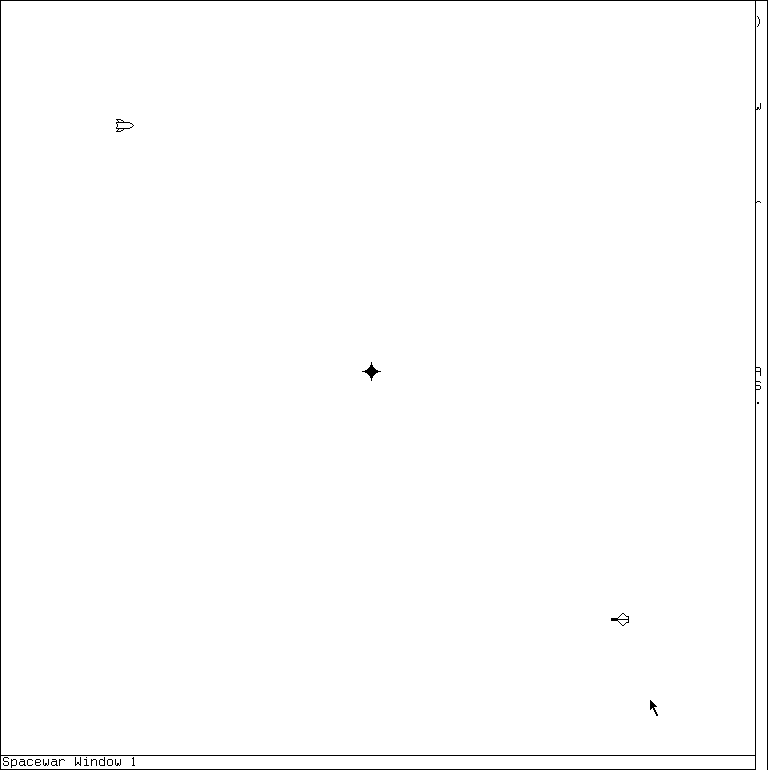

# MIT CADR and LM-3 application atlas

This atlas answers three practical questions for every D01-D60 catalog area: **what
would I use it for, how should I first approach it, and can the preserved System
303-0 band demonstrate it honestly?** “Read” is a real tour outcome when the area is
infrastructure, destructive, hardware-dependent, or absent from this band.

Start with [System 303 orientation](orientation.md). Follow the linked dossier before
using a facility on valuable guest state.

## Everyday environment: D01-D16

| Area | What you would do | First tour stop | Preserved boundary |
| --- | --- | --- | --- |
| D01 Listeners | Evaluate Lisp, inspect values, and work with editable input. | Select Lisp; enter `(+ 40 2)`, then a form returning several values. [Dossier](../../mit-cadr/lisp-listener.md) | Hands-on and reviewed. |
| D02 selection and windows | Find existing programs, create windows, and manage the exposed screen. | Right-click for the System menu; compare **Create**, **Select**, and program entries. [Dossier](../../mit-cadr/system-menu-and-select.md) | Hands-on; avoid destructive cells during the first tour. |
| D03 Screen Editor | Change the live TV window layout. | Choose **Edit Screen**, point at an operation, read the who line, then Abort without mutation. [Dossier](../../screen-editor-and-frame-up.md) | Menu verified; staged mutation deserves a disposable session. |
| D04 Emergency Break | Reach a degraded evaluator when the ordinary environment is unusable. | Read the [dossier](../../emergency-break-and-cold-load-stream.md) before entering it; the tour capture evaluates `(+ 40 2)`. | Hands-on recovery path; not an everyday Listener. |
| D05 EINE/ZWEI/Zmacs | Edit Lisp and text with modes, buffers, commands, and structural operations. | `System E`; ask for Help; run `Meta-X Text Mode` and `Meta-X Lisp Mode`. [Dossier](../../mit-cadr/zwei-and-zmacs.md) | Zmacs hands-on; EINE lacks a compatible runnable band. |
| D06 Dired/BDired/Edit Buffers | Navigate files, compare directories, and stage buffer actions. | In Zmacs, open Edit Buffers and learn its mark-then-execute model. [Dossier](../../directory-difference-and-buffer-editors.md) | Empty/synthetic buffer view verified; populated file operations need disposable guest files. |
| D07 Help | Ask the current program, editor mode, or System registry what it can do. | Press Help twice in Zmacs; try `System Help`; compare their scopes. [Dossier](../../help-self-documentation-and-document-examiner.md) | Hands-on contextual Help; no Genera-style Document Examiner application on CADR. |
| D08 ZMail | Compose and, in later LM-3 software, read mail. | Read the [CADR ZMail dossier](../../mit-cadr/zmail.md), then inspect the registered Mail path without configuring delivery. | Reader absent from the tested band; composition/source profiles remain distinct. |
| D09 Converse/messages | Send interactive messages and notices to other machines. | Read the [cross-system dossier](../../converse-direct-messages-and-notifications.md) and learn QSend/SHOUT/NOTIFY roles. | Maintained Converse cannot load in the tested band; no isolated peer transaction claimed. |
| D10 SUPDUP/Telnet | Open a remote terminal session. | Create a terminal window and inspect the disconnected prompt; exit without a peer. [Dossier](../../network-terminal-applications.md) | Disconnected shells verified; no connected negotiation oracle. |
| D11 Inspector | Browse a live Lisp object through mouse-sensitive rows. | Select Inspect; inspect a short list and follow one safe component. [Dossier](../../mit-cadr/inspector.md) | Hands-on with synthetic data. |
| D12 Error Handler | Understand a condition, stack, frames, and available recovery choices. | Signal only the dossier's synthetic error in a disposable session, then Abort. [Dossier](../../mit-cadr/error-handler-and-debuggers.md) | Ordinary and windowed states reviewed; do not experiment on irreplaceable state. |
| D13 Trace/Stepper | Observe calls, arguments, returns, and call relationships. | Trace a researcher-defined function, call it once, then untrace it. [Dossier](../../trace-stepper-breakpoints-and-call-analysis.md) | Safe trace path verified; breakpoint mutation intentionally unexercised. |
| D14 Peek | Observe processes, memory, windows, files, and network state. | Open Peek, choose Processes, and read the mode-specific Help. [Dossier](../../mit-cadr/peek.md) | Process view reviewed; mutation controls remain source-grounded only. |
| D15 Metering | Measure counters, page behavior, or maintained LM-3 events. | Read the [metering dossier](../../metering-and-performance-analysis.md) before choosing a profile. | System 46, LMETER/PTRAC, and maintained System 303 are different facilities; runtime meter remains pending. |
| D16 Flavors | Examine classes, components, instance variables, and methods. | Use `Meta-X Describe Flavor` on `TV:LISP-LISTENER`. [Dossier](../../flavors-clos-and-flavor-examiner.md) | Hands-on Flavors; do not import Genera CLOS/Flavor Examiner behavior backward. |

*Runtime observation: the Inspector's mouse-sensitive list view in the preserved
System 303 band. It illustrates the D11 tour stop, not arbitrary-object safety or
every Inspector release.*

## Files, operations, and implementation: D17-D27

| Area | What you would use it for | First tour stop | Preserved boundary |
| --- | --- | --- | --- |
| D17 file systems | Work with pathnames, local stores, QFILE, LMFILE, and file servers. | Learn pathname syntax in the Listener, then tour Dired with disposable files. [Dossier](../../file-systems-and-file-service.md) | Local and network backends differ; external service is not configured. |
| D18 disk repair | Inspect labels, packs, checkout state, salvage, and repair. | Read the [disk dossier](../../mit-cadr/disk-labels-packs-and-file-system-repair.md); identify read-only versus mutating commands. | Do not hands-on-tour destructive commands against the preservation disk. |
| D19 tape | Archive, restore, inspect, and administer later LMI tape formats/devices. | Study TFrame's seven modes in the [tape dossier](../../tape-systems-and-tape-utility-frame.md). | No System 46 subsystem; maintained System 303 hardware/remote-device runtime is blocked. |
| D20 site/login data | Define hosts, users, sites, and login behavior. | Compare the site tables and Site Editor model in the [dossier](../../mit-cadr/site-data-login-and-site-editor.md). | Site mutation is administrative and not exercised. |
| D21 services dashboards | Observe operator processes and background facilities. | Use Peek Processes as the safe dashboard, then read the [services dossier](../../background-services-and-operations-dashboards.md). | Later mailer/printer/domain frames are primarily Genera; CADR service mutation is deferred. |
| D22 runtime/compiler | Read, evaluate, compile, disassemble, schedule, and collect Lisp. | Compile a tiny researcher-defined function and disassemble it. [Dossier](../../lisp-runtime-compiler-and-development-environment.md) | Hands-on compiler path reviewed. |
| D23 QFASL/UNFASL | Understand compiled objects, relocation, loading, and recoverable structure. | Read the [format dossier](../../compiled-objects-qfasl-relocation-and-unfasl.md); do not treat UNFASL as original-source recovery. | Infrastructure, not a standalone GUI. |
| D24 system construction | Build systems, patches, bands, and distributions. | Inspect declarations and loaded-version queries in the [dossier](../../system-construction-patches-worlds-and-distribution.md). | Band writing and distribution mutation are not first-tour operations. |
| D25 source comparison | Compare Lisp sources and merge differences. | Start with SRCCOM's non-mutating comparison model in the [dossier](../../source-comparison-compare-merge-and-version-control.md). | Genera Compare/Merge must not be inferred for CADR. |
| D26 text production | Format output, query users, grind Lisp, dribble sessions, spellcheck, and prepare documents. | Dribble a disposable Listener transcript, then stop it; inspect Zmacs formatting commands. [Dossier](../../formatting-spelling-and-text-production-utilities.md) | Ispell is optional; printers and historical document pipelines are not configured. |
| D27 mathematics | Use matrix, rational, complex, elementary, and infix facilities. | Evaluate a small non-mutating matrix operation from the audited API. [Dossier](../../mathematical-and-numeric-facilities.md) | Hands-on arithmetic is possible; keep the documented preserved anomaly in mind. |

## Interface, graphics, and output: D28-D36

| Area | What you would use it for | First tour stop | Preserved boundary |
| --- | --- | --- | --- |
| D28 Dynamic Windows | Later typed presentations and program frameworks. | Learn CADR's TV/mouse-sensitive typeout model instead. [Comparison](../../dynamic-windows-and-presentation-based-interaction.md) | Dynamic Windows is Genera, not the CADR UI substrate. |
| D29 CLIM 2 | Portable application frames and presentation interfaces. | Read the [cross-catalog CLIM audit](../../clim-use-across-lisp-machine-software.md). | No CADR CLIM application claimed. |
| D30 FED | Design and edit raster fonts. | Study public font source, then open FED only in a disposable band if available. [Dossier](../../fed-and-font-editor-generations.md) | Source assets are public; runtime generation/profile differences remain explicit. |
| D31 raster paint | Edit bitmap pictures and raster patterns. | Inspect the screen/raster editor controls and public ink patterns. [Dossier](../../bitmap-stipple-and-raster-paint-editors.md) | Some recovered pictures have unresolved embedded-content rights and stay local. |
| D32 Graphic Editor | Construct structured drawings. | Read the [drawing dossier](../../genera-graphic-editor-and-structured-drawing.md). | Genera application; do not invent a CADR equivalent from shared drawing primitives. |
| D33 color | Define color maps and edit colors. | Study the CADR color model and monochrome runtime boundary. [Dossier](../../color-systems-and-color-editor.md) | Tested display is monochrome; Genera Color Editor is separate. |
| D34 image primitives/assets | Draw lines, text, raster ops, icons, patterns, and pictures. | Run a harmless QIX demonstration, then compare the [asset census](../../mit-cadr/visual-assets-inventory.md). | Public-source QIX verified; unresolved decoded pictures remain untracked. |
| D35 hardcopy | Produce Press, printer, and plot output. | Read the [hardcopy dossier](../../hardcopy-press-printing-and-plot-output.md) and identify device assumptions. | No configured output device; do not equate menu presence with successful printing. |
| D36 Concordia | Structured authoring and book design. | Read the [Concordia dossier](../../concordia-document-and-book-design.md). | Genera product; CADR/LM-3 boundary is explicit and no CADR hands-on path is claimed. |

## Languages, networking, and machine engineering: D37-D52

| Area | What you would use it for | First tour stop | Preserved boundary |
| --- | --- | --- | --- |
| D37 C/FORTRAN/Pascal | Develop non-Lisp languages inside Genera. | Read the [language-environments dossier](../../symbolics-c-fortran-and-pascal-environments.md). | Symbolics products, not CADR applications. |
| D38 Compiler Tools | Build grammars, lexers, parsers, and syntax-aware editors. | Read the [Compiler Tools dossier](../../compiler-tools-grammar-lexer-and-syntax-editor.md). | Genera optional system; no CADR tour claim. |
| D39 Conversion Tools | Perform structured source migrations. | Read the [Conversion Tools dossier](../../conversion-tools-and-source-migration.md). | Genera optional system; no CADR tour claim. |
| D40 Joshua | Build rule, inference, truth-maintenance, and expert systems. | Read the [Joshua dossier](../../joshua-rule-and-inference-environment.md). | Optional Genera product; public AMORD lineage is not a CADR Joshua runtime. |
| D41 Statice | Persist and browse objects in a database. | Read the [Statice dossier](../../statice-persistent-object-and-database-environment.md). | Genera product and server stack; no CADR application claim. |
| D42 Macsyma | Perform symbolic mathematics, plotting, and expression editing. | Read the [Macsyma dossier](../../macsyma-421-symbolic-mathematics-environment.md). | Lineage includes Lisp machines, but the preserved runnable band does not establish this product. |
| D43 NS design | Design schematics, gates, PCBs, and VLSI. | Read the [NS family dossier](../../ns-electronic-design-family.md). | Genera product/media evidence; no CADR hands-on tour. |
| D44 CLOE | Develop and deliver Lisp applications for Intel/DOS/Windows targets. | Read the [CLOE dossier](../../cloe-development-and-runtime-environment.md). | Absent from preserved media/world; not a CADR facility. |
| D45 transports | Understand Chaosnet and higher-level network paths. | Inspect the safe network registry and Peek network view. [Dossier](../../network-transports-and-protocol-architecture.md) | Architecture can be toured; no external route or peer transaction is claimed. |
| D46 network services | Use name, time, file, mail, and site utilities. | Display the runtime service registry without starting services. [Dossier](../../network-services-and-site-utilities.md) | Registry presence is not configured service operation. |
| D47 RPC/host integration | Connect Lisp-machine software to UNIX and host environments. | Trace the CADR UNIX-interface boundary in the [dossier](../../rpc-embedding-ux-and-macintosh-integration.md). | Infrastructure and later Genera extensions, not one portable app. |
| D48 CLX/X | Use remote X screens and X-server facilities. | Read the [CLX dossier](../../clx-remote-x-screens-and-x-server-facilities.md). | Primarily Genera/CLX; CADR display is the TV framebuffer in this tour. |
| D49 CL-HTTP | Serve and browse the Web from Lisp. | Read the [CL-HTTP dossier](../../cl-http-and-contributed-web-systems.md). | Contributed Genera systems are unloaded; no CADR application claimed. |
| D50 microassembler | Assemble CADR microcode and manage symbols/artifacts. | Study the [microassembler dossier](../../mit-cadr/cadr-microcode-microassembler-and-console-debugger.md) before touching machine state. | Source/build tool; not a beginner GUI. |
| D51 diagnostics | Checkout hardware, exercise devices, and debug the CADR. | Read the [diagnostics dossier](../../mit-cadr/cadr-diagnostics-checkout-and-hardware-tools.md). | Physical hardware paths are unavailable or unsafe to simulate casually. |
| D52 Ivory/FEP/VLM | Understand later Symbolics execution and front-end layers. | Compare CADR's emulator/microcode boundary with the [dossier](../../ivory-fep-and-open-genera-vlm-implementation-layers.md). | Genera-specific layers are not CADR applications. |

## Demonstrations and examples: D53-D60

| Area | What you would do | First tour stop | Preserved boundary |
| --- | --- | --- | --- |
| D53 MUNCH | Generate the XOR-based Munching Squares display. | Read the [MUNCH writeup](../../mit-cadr/munch.md), then use the audited stop control. | Source-grounded; use a disposable runtime session. |
| D54 LEXIPHAGE | Watch a word-oriented display process consume and transform text. | Read the [LEXIPHAGE writeup](../../mit-cadr/lexiphage.md) before loading it. | Source/runtime boundary is recorded in the dossier. |
| D55 Spacewar | Play the two-ship gravity-and-torpedo game. | Learn both players' controls, then enter the verified playfield. [Dossier](../../mit-cadr/spacewar-on-the-lisp-machine.md) | Live playfield reviewed; keyboard mapping is part of the exercise. |
| D56 Doctor | Converse with the ELIZA-style rule program. | Start Doctor, enter a harmless sentence, and learn its explicit exit phrase. [Dossier](../../mit-cadr/doctor.md) | Synthetic conversation reviewed; historical rule/source defects are documented. |
| D57 CADR HACKS | Explore graphics, sound, novelty programs, and QIX. | Begin with QIX because its live start/stop path is verified. [Dossier](../../mit-cadr/cadr-hacks-display-sound-and-novelty-suite.md) | Each demo has its own dependencies and controls; do not bulk-run the suite. |
| D58 Genera HACKS | Explore the later Genera demonstration suite. | Read the [Genera suite dossier](../../genera/genera-hacks-demonstration-suite.md). | Not the CADR suite and not runnable in the CADR band. |
| D59 CLIM demos | Learn CLIM concepts through demonstration frames. | Read the [CLIM demonstrations dossier](../../clim-demonstrations-and-tutorial.md). | Genera optional system; no CADR CLIM tour. |
| D60 examples | Study small product and programming examples. | Use the [examples dossier](../../product-and-programming-examples.md) to select a source example with known prerequisites. | “Example” does not imply loaded, safe, or standalone. |

*Runtime observation: a representative D55 application state. It is included to teach
what the game surface looks like beside the source-grounded control explanation, not
as a decorative gallery image.*

## Completeness and evidence

Every D01-D60 area appears above. The canonical [application dossier coverage
matrix](../../software-application-dossiers.md) remains authoritative for exact
release entries, full bindings, source/manual/runtime discrepancies, and open
oracles. This atlas is the safe navigation layer, not a replacement specification.
