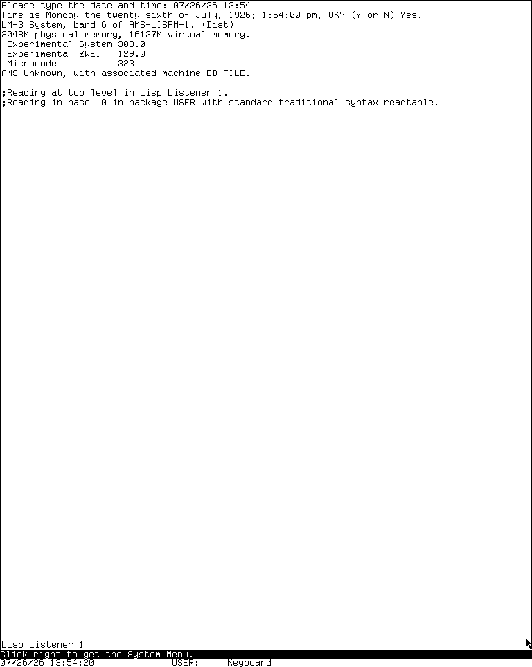
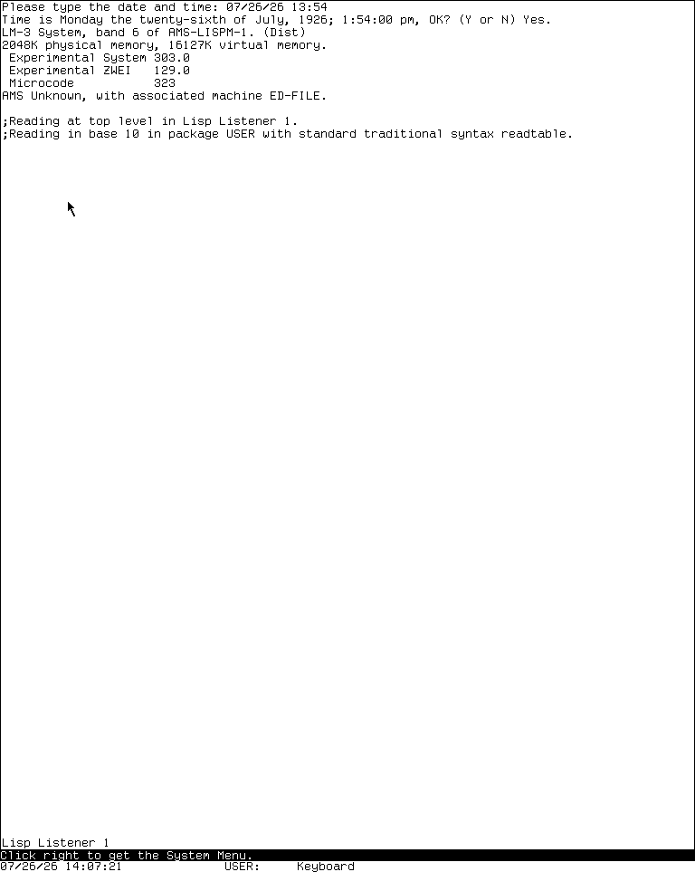
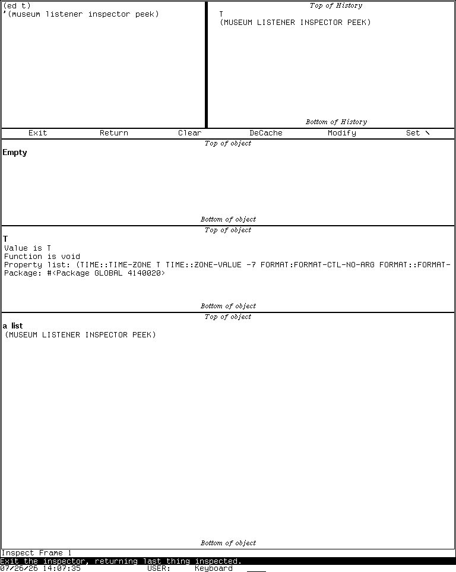
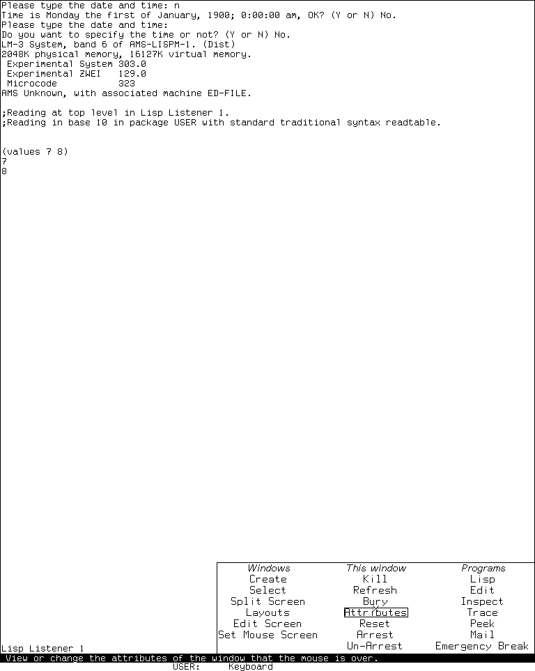
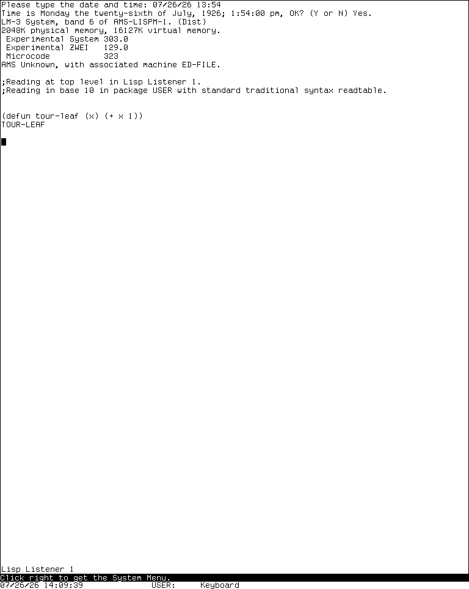
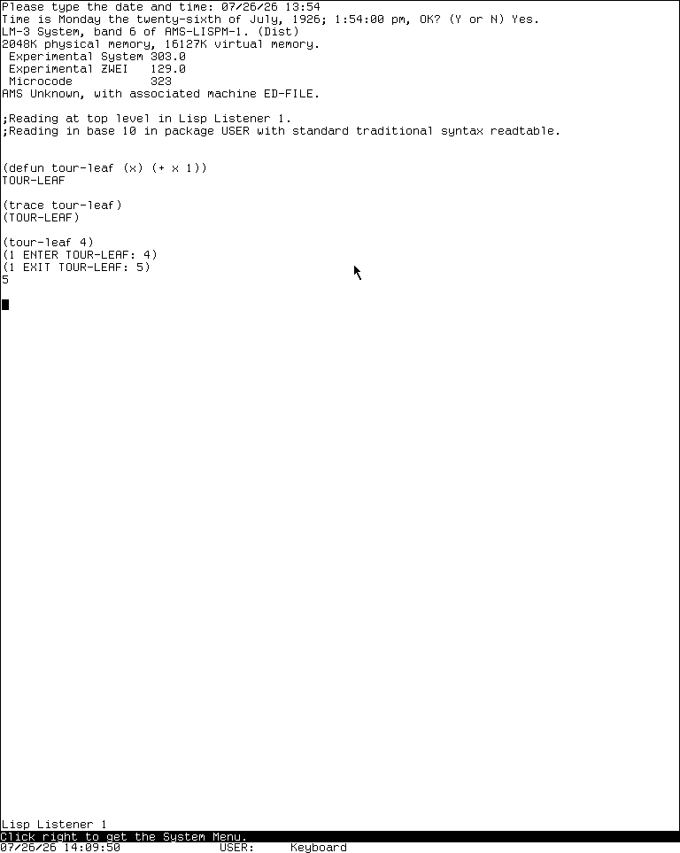
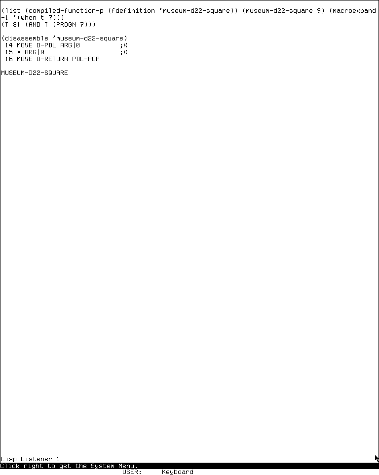
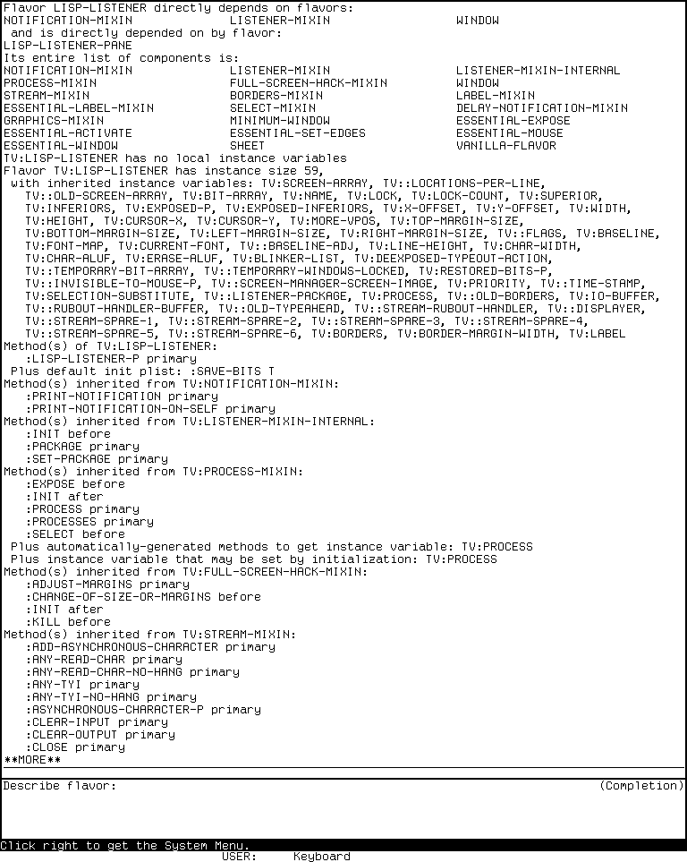
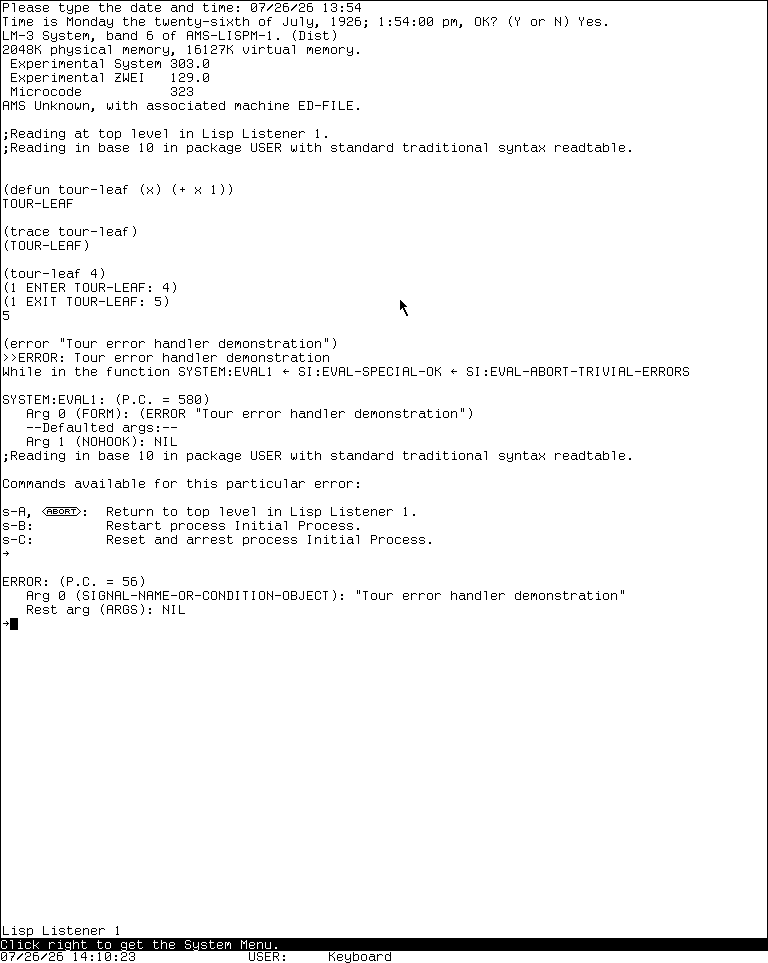

# A working session on the MIT CADR

Imagine that you have just sat down at a CADR running the preserved System 303
environment. Your small job is to define a Lisp function, edit it, understand the
object it returns, and find out why one call fails. Along the way we will deliberately
take detours through the programs that make the machine feel like an integrated
workstation rather than a Lisp REPL attached to a terminal.

This is a linear tour. Follow it from top to bottom the first time. The separate
[application atlas](applications.md) remains the exhaustive D01-D60 reference for
facilities that are unavailable, unsafe, hardware-dependent, or outside this
particular band.

## Before touching anything

The large selected window owns most of the screen. Its label or mode line describes
the current program. Two stable rows at the bottom describe mouse actions and machine
state. Read those rows before clicking: the three mouse buttons are part of the
command language, not interchangeable substitutes for a modern primary click.

If an interaction begins asking for something you did not intend, press **Abort**.
Abort cancels the current interaction; it does not mean “close the application.”

The animations below are slow teaching loops made from separately captured,
reviewed states. They preserve complete native-size frames but do not claim
real-time latency, pointer motion, or unrecorded intermediate redisplay.

## 1. Meet the Lisp Listener

You begin in the Lisp Listener. Enter:

```lisp
(values 7 8)
```

The Listener prints both values in order. Unlike a conventional terminal, its
input is editor-backed: you can move through and correct the form before submitting
it, and printed values can feed later mouse-sensitive operations.


*Runtime observation: the selected System 303 Listener after a harmless
researcher-entered form. Notice the application label, editable input area, and
two-row bottom status region.*

You have learned the first recurring pattern: **type into an active interaction,
submit with Return, and use Abort to abandon incomplete input**.

## 2. Ask the whole machine what exists

Press the Right mouse button over the Listener client to expose the System menu.



*Gesture illustration: two separately captured complete states. It establishes the
visible result of opening the menu, not the timing or pointer trajectory.*

Read the menu by role:

- program entries select registered facilities;
- **Create** makes a new window according to a chosen type;
- **Select** finds an existing window;
- screen-management entries act on the exposed layout.

This is not a desktop launcher. Selecting and creating are intentionally different
operations, and an existing program can continue to exist while deexposed.

## 3. Move the experiment into Zmacs

Use `System E` to select the editor. Create or choose a scratch Lisp buffer and enter
a tiny definition:

```lisp
(defun tour-square (x)
  (* x x))
```

Zmacs inherits the EINE/ZWEI editing tradition. Control commands usually perform
local character or line movement; Meta commands commonly operate on larger syntactic
units or invoke extended commands. `Meta-X` prompts for a named command.

Run `Meta-X Text Mode`, then `Meta-X Lisp Mode`, watching the mode line:


*Named-command illustration: separately captured mode states with slow pauses. The
changed mode line is the claim; the loop does not synthesize command execution.*

The buffer did not become a different document. Its **mode** changed the active
editing grammar: indentation, syntax-sensitive motion, commands, and Help context.

## 4. Let Help describe the current context

Press Help twice in the Lisp-mode buffer.


*Keybinding illustration: the complete before and Help states are separately
captured. Only the visible dispatcher categories and contextual transition are
asserted.*

Help is not one global manual page. Zmacs can describe a key, list commands, show
mode-specific bindings, or dispatch to other self-documentation. The answer depends
on which program and command table currently owns the keyboard.

Return to the buffer with Abort. You now know the second recurring pattern:
**ask for Help in the context you are trying to understand**.

## 5. Inspect the value, not its printed spelling

Evaluate `(list 'alpha 42 (list 'nested 'value))` in the Listener, then select
Inspector for that object. The tour uses a small researcher-created list so every
operation is harmless and legible.



*Application-selection illustration: separately captured states. It establishes
Inspector's visible list presentation, not an automatic transition for arbitrary
Listener output.*

Rows in Inspector are mouse-sensitive regions. Pointing and clicking operate on the
underlying component rather than merely positioning a text caret. This is an early
object-oriented interaction style, but it is not Genera Dynamic Windows or CLIM.

Follow the nested list once, then return. The important lesson is that **displayed
objects can remain actionable objects**.

## 6. Look at the living machine with Peek

Select Peek and choose its process view.



*Application-selection illustration: the second frame is the reviewed process view.
The loop does not claim that every Peek mode is safe or available.*

Peek is a family of live views over processes, memory, windows, files, and network
state. Its mode and Help determine the effective keys. Treat it as an observatory
before treating it as a control panel: some commands can affect the running system.

This establishes another Lisp-machine habit: development tools and operational tools
share the same object-rich window environment.

## 7. Rearrange the screen without adopting a desktop metaphor

Open the System menu and choose **Edit Screen**. Stop at the Screen Editor menu and
read the mouse-documentation line.



*Menu-transition illustration: separately captured complete states. No reshape or
layout mutation is performed by the loop.*

The Screen Editor can reshape, move, expose, bury, split, and otherwise manage TV
windows. For this preservation tour, inspect the operations and press Abort rather
than mutating the saved layout. The screen is a hierarchy of windows and sheets, not
a pile of independent modern application cards.

## 8. Trace the function you wrote

Compile `TOUR-SQUARE`, enable Trace for it, call it once, and remove the trace.



*Workflow illustration: the result frame comes from a verified synthetic trace
exercise. The loop omits intermediate command entry and does not claim real-time
call timing.*

Trace reports calls, arguments, and returns. Step and Who-Calls answer related but
different questions. They are integrated with the Lisp environment: function names,
frames, and displayed results are system objects, not text scraped from a log.

The [trace dossier](../../trace-stepper-breakpoints-and-call-analysis.md) is the
binding-complete reference once you go beyond this safe path.

## 9. Learn what failure looks like

Now deliberately signal only the synthetic error described in the debugger dossier.
The Error Handler replaces the normal flow with a condition report, stack context,
and dynamically available recovery choices.



*Recovery illustration: separately captured pre-error and reviewed synthetic-error
states. It does not claim that every condition offers these choices.*

Read before choosing. The available commands depend on the condition and frame.
Abort is often the correct first-tour exit, but it is not a universal rollback:
side effects performed before the signal may already exist.

## 10. Take two network-shaped detours

The machine has terminal applications even when this isolated environment has no
peer. Open Telnet and SUPDUP only far enough to see their disconnected prompts:


These are applications with their own protocol and terminal semantics, not generic
terminal skins. The absence of a peer is part of the preserved observation. Exit
without inventing a successful connection.

## 11. Compile, expand, and look underneath

Return to the Listener and use the reviewed compiler workflow on a tiny definition:
macroexpand a harmless form, compile it, and disassemble the resulting function.



The compiler is not hidden behind a build button. Compilation, macroexpansion,
disassembly, tracing, source editing, and object inspection are neighboring
operations in one live Lisp environment.

For object-system context, ask Zmacs to describe a known Flavor:



This connects the visible window you have been using to its implementation model.

## 12. End with the machine's playful side

The same display substrate supports demonstrations and games. Three safe,
representative stops show the range:


QIX exercises raster drawing, Doctor turns pattern-driven text interaction into a
program, and Spacewar combines continuous simulation, two-player controls, status,
and the TV display. They are historically specific programs, not decorative “retro”
effects. Read each dossier's stop or exit controls before running it.

## 13. Know the emergency path, then leave it alone

Emergency Break reaches a degraded evaluator when the ordinary environment cannot
be trusted. It is not a second everyday Listener.



*Recovery comparison: the second state evaluates a researcher-entered `(+ 40 2)`.
The loop does not imply that entering Emergency Break is harmless in an arbitrary
machine state.*

You should now recognize the system's main interaction language: selected windows,
System operations, contextual Help, editor command tables, mouse-sensitive objects,
live inspection, explicit recovery, and integrated development tools.

## Continue from here

- Use the [CADR application atlas](applications.md) to find every D01-D60 area and
  its preservation boundary.
- Keep [System 303 orientation](orientation.md) beside you as a compact control
  reference.
- Follow the linked dossiers for complete bindings, source/runtime differences, and
  safe exit behavior.

[Back to the CADR tour entrance](index.md) ·
[Continue to the application atlas](applications.md)
