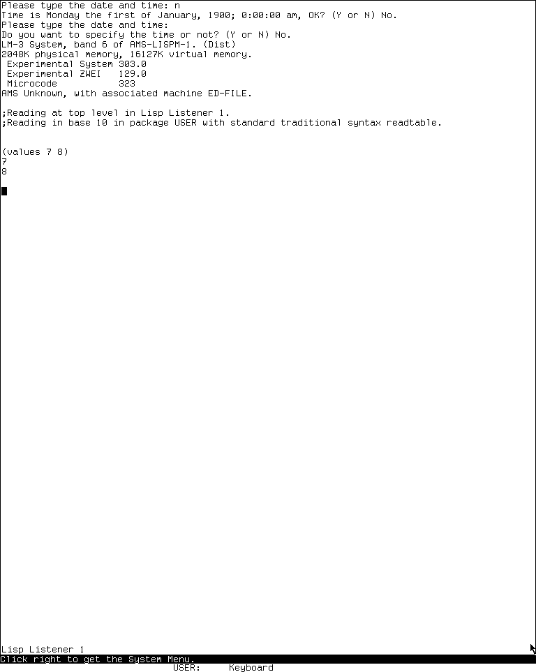

# Tour of the MIT CADR / LM-3 environment

This tour uses the preserved **System 303-0** load band exercised through the isolated
CADR Xvfb harness. System 46 source is used to explain earlier lineage, but a gesture
described as hands-on belongs to System 303 unless the text says otherwise.

## Your first hour

1. Learn the [screen, mouse, keyboard, and navigation language](orientation.md).
2. Evaluate a harmless expression in the Lisp Listener.
3. Open the System menu and notice the three different kinds of operation.
4. Select Zmacs, create a scratch buffer, and ask for editor Help.
5. Inspect a small Lisp object, then use Peek to observe processes.
6. Visit the [application atlas](applications.md) to choose a deeper route.

*Runtime observation: the System 303 Lisp Listener after evaluating a
researcher-entered form. The image establishes the main text area, mode line,
input cursor, and bottom who-line arrangement; it does not claim that every listener
release has identical geometry. MIT and the named contributors do not endorse this
project.*

## What makes this interface different

The screen is usually owned by one selected full-screen window. Other programs may
still exist but be deexposed. You bring them forward with the System menu or a
registered System-key selection gesture. Menus and the two-line area at the bottom
tell you what a pointer button or current mode will do; watch them rather than
expecting modern tooltips.

The CADR keyboard has Control, Meta, Super, and Hyper modifiers. Do not treat Super
and Hyper as decorative “extra Meta” keys: applications assign them distinct command
families. The [complete modifier audits](../../mit-cadr/index.md#modifier-key-audits)
are the reference when a tour uses one.

## Application coverage

The [application atlas](applications.md) covers every CADR-relevant member of the
D01-D60 catalog. A few facilities are source-visible but not runnable in this band;
the atlas identifies those as boundaries and routes you to the source-grounded
dossier rather than inventing a screen.
