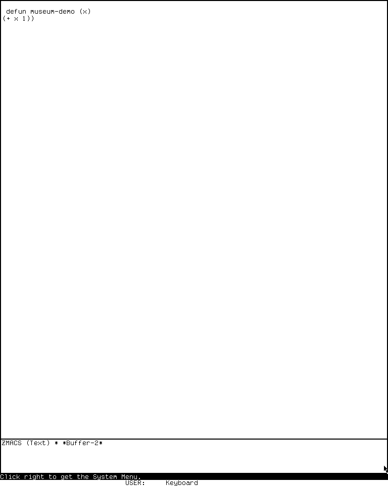

# Finding your way around System 303

The easiest way to become comfortable with CADR is to stop thinking in terms of
desktop icons. You normally work in one selected, nearly full-screen TV window. Other
windows still exist behind it. The System menu and keyboard selectors expose, select,
create, reshape, or remove those windows.

## Read the screen from top to bottom

A typical application has:

- a large application area;
- a **mode line** near its lower edge, naming the buffer, mode, package, file, or
  application state;
- a separate two-row **who line** at the very bottom of the display.

The first who-line row is contextual pointer documentation. Move over a menu item and
read that line before clicking. The other fields report the selected process,
package, run state, time, and related status. This is active interface state, not a
decorative footer.

## The three mouse buttons

The historical buttons are **Left**, **Middle**, and **Right**. Their meanings belong
to the current window:

- Left commonly selects or performs the primary operation.
- Middle commonly performs a related alternate operation.
- Right commonly asks for a menu; over an ordinary Listener it opens the System menu.

The exact command is shown in the who line when the window supports pointer
documentation. A click in an unselected visible window may select it before the
application receives any further action.

## Open the System menu

In the tested System 303 Listener, click Right near the middle of the application
area. The menu has three columns:

| Windows and layout | Current-window operations | Programs |
| --- | --- | --- |
| Create, Select, Split Screen, Layouts | Kill, Refresh, Bury, Edit Screen, and related operations | Lisp, Edit, Inspect, Trace, Mail, Emergency Break, and registered tools |


*Runtime observation, 2026-07-18: Right at framebuffer position 400,500 opened this
three-column menu. The image establishes visible labels and the contextual who-line
text for the current item, not every callback or destructive result. MIT and the
named contributors do not endorse this project.*

Three menu verbs are easy to confuse:

- **Create** asks for a kind of window and a rectangle, then constructs a new one.
- **Select** lists existing selectable windows and exposes the one you choose.
- A program name may select an existing registered program window or create one
  according to that registration.

Press Abort or move out of a momentary menu without committing a choice when you only
wanted to look.

## Use System-key selection

System selection is a prefix gesture followed by one selector character. In the
tested band, `System Help` prints the live registry. The exact table can vary with
loaded software, so Help is more trustworthy than a memorized universal list.

The useful starting gesture is:

```text
System
├─ Help or ?  show the live selector registry
├─ E          select or create the registered editor
├─ L          select or create a Lisp Listener
└─ other      dispatch only if the live registry owns that character
```

Do not hold System as though it were Control unless your emulator mapping explicitly
requires that physical action. Think of it as a prefix in the Lisp-machine input
language.

## Try the Lisp Listener

1. Select a Lisp Listener from the System menu or the live System-key registry.
2. At the prompt, type `(+ 40 2)` and press Return.
3. Observe `42` as the value. A form may return more than one value; these appear as
   separate value lines.
4. Use Abort to abandon an incomplete or unwanted interaction.

The Listener is both a REPL and a window-system citizen. Its input editor, history,
package, and process state are richer than a bare terminal line discipline. The
[Listener tour dossier](../../mit-cadr/lisp-listener.md) explains the complete
observed model.

## Try Zmacs and named commands

1. Use `System E`.
2. If prompted for a buffer, choose a scratch name rather than an irreplaceable file.
3. Type a small definition.
4. Press Help twice to expose the editor's contextual dispatcher.
5. Invoke `Meta-X`, type `Text Mode`, and press Return.
6. Invoke `Meta-X` again, type `Lisp Mode`, and press Return.



*Keybinding illustration: the complete tracked frames were captured in one System
303 Zmacs session after `Meta-X Text Mode Return` and `Meta-X Lisp Mode Return`.
The 4.8-second loop pauses on the two verified states; it is not a real-time recording
and makes no claim about redisplay latency or omitted completion prompts.*

`Meta-X` runs a named command from the active editor command tables. Modes change the
effective tables, so a binding can mean something different—or be absent—in another
mode. Read the mode line before diagnosing an unexpected key.

## Help and Abort are part of the grammar

Help is contextual: in Zmacs it opens the editor dispatcher; in the System prefix it
describes system selectors; in another program it may explain that program's current
keys. Abort unwinds the current interactive operation. It does not mean “close the
application,” and a destructive operation may have explicitly documented partial
effects before an abort.

## Where to go next

- [CADR application atlas](applications.md)
- [System Menu and System selection evidence](../../mit-cadr/system-menu-and-select.md)
- [ZWEI and Zmacs](../../mit-cadr/zwei-and-zmacs.md)
- [Complete CADR ZWEI/Zmacs bindings](../../mit-cadr/zwei-zmacs-keybindings.md)
- [TV window-system specification](../../mit-cadr/tv-window-system-reimplementation-specification.md)

Last runtime evidence verified: 2026-07-18.
