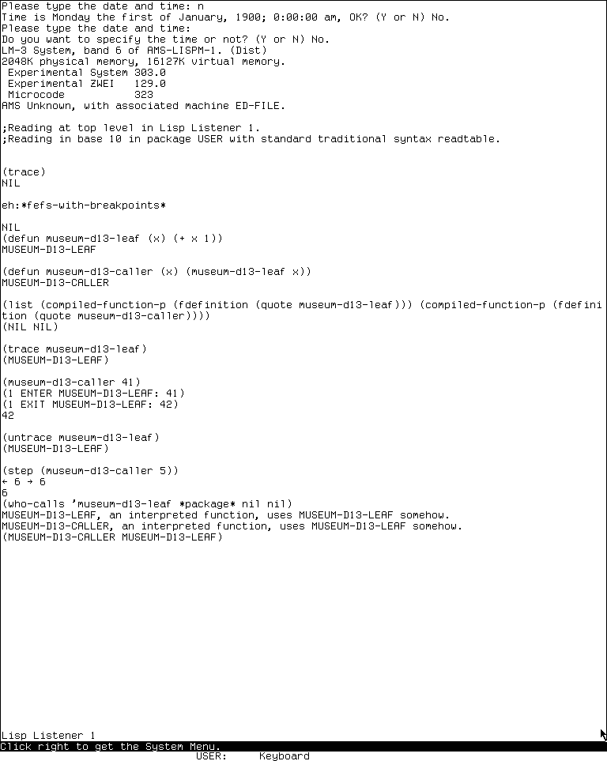
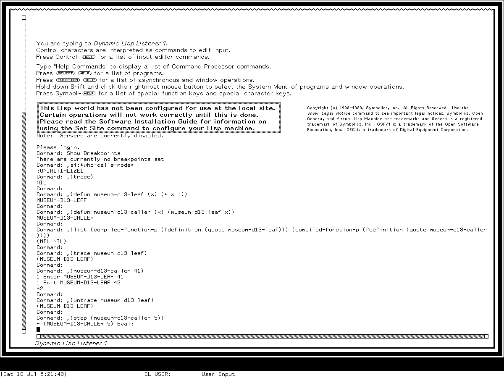

# Trace, Stepper, Breakpoints, and Call Analysis on Lisp Machines

These systems do not have one monolithic “debugger.” They provide a set of
complementary instruments at different points in the execution pipeline:

- **Trace** wraps a function call and reports or conditionally intercepts entry
  and return.
- **Step** hooks the interpreter and pauses around the evaluation of forms.
- **Break loops, entry traps, exit traps, and compiled-code breakpoints** stop a
  computation at progressively lower levels.
- **Call analysis** works in the opposite direction: it searches or indexes
  definitions to answer which code refers to a given name and how.

The family resemblance is real, but the feature set is not monotonic. System 46
exposes break-loop choices in its Trace menu. The maintained LM-3 System 303 menu
deliberately hides those choices, adds conditional stepping and editor-directed
output, and makes selections reversible. Genera 8.5 exposes the break choices
again, drops conditional stepping, and adds process-local tracing. Likewise,
System 303's interpreter stepper adds a useful Control-A operation that Genera's
later source does not contain.

This page treats “complete” at four explicit grains:

1. every option recognized by the release's inspected `TRACE` parser;
2. every item in the inspected default Trace menu;
3. every command recognized by the inspected Step command loop; and
4. every breakpoint or callers command in the named default command table or
   editor command family.

It does not claim to enumerate site patches, user extensions, arbitrary
condition-specific debugger restarts, or packages not loaded into the inspected
world.

## Evidence and exact release boundaries

### MIT CADR System 46

The historical source is the public System 46 snapshot at Git revision
[`8e978d7d1704096a63edd4386a3b8326a2e584af`](https://github.com/mietek/mit-cadr-system-software/tree/8e978d7d1704096a63edd4386a3b8326a2e584af/src).
The files used here are:

| Release file | Bytes | SHA-256 | Evidence supplied |
| --- | ---: | --- | --- |
| [`src/lispm2/qtrace.101`](https://github.com/mietek/mit-cadr-system-software/blob/8e978d7d1704096a63edd4386a3b8326a2e584af/src/lispm2/qtrace.101) | 17,808 | `d11b69d32ae22c119223250b4b7798f1d4e194341574eaf3c1b9d4879d95fb1c` | trace parser and wrapper |
| [`src/lispm2/step.45`](https://github.com/mietek/mit-cadr-system-software/blob/8e978d7d1704096a63edd4386a3b8326a2e584af/src/lispm2/step.45) | 7,871 | `b08878d02197322d1fccc096917094af5b3cc7868e484aafdf3d4b95f2f02514` | interpreted stepper and live help |
| [`src/lmwin/sysmen.105`](https://github.com/mietek/mit-cadr-system-software/blob/8e978d7d1704096a63edd4386a3b8326a2e584af/src/lmwin/sysmen.105) | 28,436 | `c203bc08b5550edefb1928349179fc54c483655d273077294211eb778daff6f1` | Trace menu and menu state machine |
| [`src/lispm/qmisc.281`](https://github.com/mietek/mit-cadr-system-software/blob/8e978d7d1704096a63edd4386a3b8326a2e584af/src/lispm/qmisc.281) | 62,028 | `ed80c13e4d51f5d9b3132a8f193673f081f25d310835087c40cc8c9b08d063ad` | `WHO-CALLS` scanner |
| [`src/nzwei/comc.75`](https://github.com/mietek/mit-cadr-system-software/blob/8e978d7d1704096a63edd4386a3b8326a2e584af/src/nzwei/comc.75) | 26,254 | `96f46dafa5c487959755df7a68fc01d8658941a0d79f3df1bf263a0fce74d10d` | editor Trace entry point |
| [`src/lmman/db_aid.35`](https://github.com/mietek/mit-cadr-system-software/blob/8e978d7d1704096a63edd4386a3b8326a2e584af/src/lmman/db_aid.35) | 15,111 | `e1465b9cfb85ff23212390e74d97b647cf29467fa49b60c4fa4dfb2632137b60` | contemporary Trace and Step manual |
| [`src/lmcons/cc.516`](https://github.com/mietek/mit-cadr-system-software/blob/8e978d7d1704096a63edd4386a3b8326a2e584af/src/lmcons/cc.516) | 101,897 | `e81c03f764a6e7e6840c476508b25276fc91eefaae854ca474285c62e63e2b9e` | separate CADR console breakpoint mechanism |

No compatible System 46 load band is currently configured in the museum
harness. Runtime observations below therefore do not project System 303 behavior
backward onto this release.

### Maintained LM-3 System 303

The later public source is the maintained LM-3 System repository at Fossil
check-in
[`4df393c68d7f083ce42d5c377039d26043cc18a9031ace28258dc97f4137eb91`](https://tumbleweed.nu/r/lm-3/info/4df393c68d7f083ce42d5c377039d26043cc18a9031ace28258dc97f4137eb91),
tag `system-303`. It is maintained restoration work, not silently treated as an
unaltered historical distribution.

| Maintained file | Bytes | SHA-256 | Evidence supplied |
| --- | ---: | --- | --- |
| [`sys2/qtrace.lisp`](https://tumbleweed.nu/r/sys/file?ci=4df393c68d7f083ce42d5c377039d26043cc18a9031ace28258dc97f4137eb91&name=sys2%2Fqtrace.lisp) | 14,005 | `df93bdcc6fa17c9a9fbebee5e9ffc4390d4c3357ca4969929b74ec1e0e9be087` | encapsulating Trace implementation |
| [`sys2/step.lisp`](https://tumbleweed.nu/r/sys/file?ci=4df393c68d7f083ce42d5c377039d26043cc18a9031ace28258dc97f4137eb91&name=sys2%2Fstep.lisp) | 12,666 | `44eb3e33e4c292988a90bc315dabfea9a4f4899e8792f06b91bcfea11a4e2651` | evaluator and apply stepper |
| [`window/sysmen.lisp`](https://tumbleweed.nu/r/sys/file?ci=4df393c68d7f083ce42d5c377039d26043cc18a9031ace28258dc97f4137eb91&name=window%2Fsysmen.lisp) | 43,408 | `b53b7c3d5a59040f3180d5be0d2072b2a334bb386fa5e19dd6abbd945148b40c` | Trace menu |
| [`sys2/analyze.lisp`](https://tumbleweed.nu/r/sys/file?ci=4df393c68d7f083ce42d5c377039d26043cc18a9031ace28258dc97f4137eb91&name=sys2%2Fanalyze.lisp) | 29,971 | `86f927079cc3e35b7e4da4f9446ce815001cfdefcd62417007049234859d6293` | expanded callers scanner |
| [`eh/ehbpt.lisp`](https://tumbleweed.nu/r/sys/file?ci=4df393c68d7f083ce42d5c377039d26043cc18a9031ace28258dc97f4137eb91&name=eh%2Fehbpt.lisp) | 16,529 | `9ea9315bd2ced827f6bf8249916dd49b7f0873f4df4d46cf1dad5283465fc3c3` | traps, breakpoints, and experimental stepping |
| [`eh/ehc.lisp`](https://tumbleweed.nu/r/sys/file?ci=4df393c68d7f083ce42d5c377039d26043cc18a9031ace28258dc97f4137eb91&name=eh%2Fehc.lisp) | 81,305 | `767f8821287fd1881cebb318d049c14620842feb9bbd04bcf999bc79356b7c92` | actual debugger key dispatch |
| [`zwei/sectio.lisp`](https://tumbleweed.nu/r/sys/file?ci=4df393c68d7f083ce42d5c377039d26043cc18a9031ace28258dc97f4137eb91&name=zwei%2Fsectio.lisp) | 65,249 | `57b11d071f0d3784bdb5b6b1118a10cde58e7203c7c954c70a9f379a13ac7230` | Zmacs callers commands |
| [`man/db-aid.text`](https://tumbleweed.nu/r/sys/file?ci=4df393c68d7f083ce42d5c377039d26043cc18a9031ace28258dc97f4137eb91&name=man%2Fdb-aid.text) | 38,898 | `d97120298b2a58cfa4882205e2b9a2a477ee5abcef0f0f8d10120ab59684d824` | maintained manual source |

### Licensed Genera 8.5 material

The Genera source observations use the locally purchased Open Genera 2.0
archive and the Genera 8.5 world it supplies. These files remain ignored and are
not linked or redistributed. Original descriptions here are evidence summaries,
not reproduced source.

| Release pathname | Evacuated version | Bytes | SHA-256 | Evidence supplied |
| --- | ---: | ---: | --- | --- |
| `sys.sct/sys2/qtrace.lisp` | 164 | 15,189 | `15a579721775bd988064b880d21b6c50f37e80bd1c8d11dbc5cbe03621e17a11` | Trace wrapper and output controls |
| `sys.sct/sys2/step.lisp` | 75 | 11,032 | `b75b03f38fa4d2b6780f0298b273dc2b40b56374d8ee002896b18775dfb6b983` | interpreted stepper |
| `sys.sct/sys2/who-calls.lisp` | 4096 | 60,868 | `e0a7d63e0434c13e8969c052d9795ec9730bdd1046dcefbb6bd8e62cd7629400` | persistent callers database and CP command |
| `sys.sct/debugger/stepper.lisp` | 7 | 35,960 | `6e7bbdb140bcee4f8696457699d2b3b70fe67d0907d4fbab4259e68a87d1bc90` | compiled breakpoints and single stepping |
| `sys.sct/window/sysmen.lisp` | 250 | 52,798 | `2f54fdb15335fc7f9f9f5c47a03f1ad2a5803d86787267949825f23853363f4c` | Trace menu |
| `sys.sct/zwei/comf.lisp` | 259 | 65,200 | `cc4362f1b89bf7f4f6953b730399c62e7c7b3215b465ecd537c0a6886e6022d4` | Zmacs Trace and Untrace commands |
| `sys.sct/zwei/functions-buffers.lisp` | 44 | 57,073 | `d94ea0d74bcabcc815fc6058aa2be52a4be3cfa5405cb30ee755d9a03ea036bf` | Zmacs callers command family |
| `sys.sct/dynamic-windows/dynamic-input.lisp` | 498 | 55,058 | `a79805ece6844ccb568ecf97e2d818a0c6095e539e51fbf74423944a32b6dd8f` | breakpoint mouse gestures |

The public manuals used for intended behavior are Symbolics's
[Program Development Utilities, Genera 8](https://bitsavers.org/pdf/symbolics/software/genera_8/Program_Development_Utilities.pdf)
and the
[Genera 8.1 Release Notes](https://bitsavers.org/pdf/symbolics/software/genera_8/Genera_8.1_Release_Notes.pdf),
both verified 2026-07-18.

## Trace: observe and interpose at a function boundary

### Common control flow

All three implementations replace or encapsulate the named function with an
intermediary that owns the call boundary. The intermediary can:

1. decide whether tracing applies in this dynamic context;
2. print the entry depth, function, arguments, and requested extra values;
3. enter a break loop, debugger, or interpreter stepper;
4. call the preserved definition while temporarily allowing nested traces;
5. collect all returned values;
6. print requested exit information or break on exit; and
7. return the original multiple values.

An `INSIDE-TRACE` dynamic flag prevents the trace implementation's own calls
from recursively tracing themselves. A total trace depth supplies indentation,
while a counter attached to each trace wrapper numbers recursive entries of that
function. `:WHEREIN` asks whether another function is active anywhere above the
call, not merely whether it is the immediate caller.

The implementation strategy changes at the release boundary. System 46 installs
a generated `NAMED-LAMBDA` in the function cell and records the old and new
definitions in `TRACE-TABLE`. `UNTRACE` restores the old definition only if its
own wrapper is still present, avoiding destruction of a later redefinition.
System 303 and Genera use the general encapsulation machinery. Their manuals and
source explicitly preserve tracing across a redefinition by moving the
encapsulation to the replacement definition.

### Complete parser option matrix

“Yes” means that the inspected parser recognizes the option, whether or not the
default menu offers it.

| Trace syntax | System 46 | System 303 | Genera 8.5 | Effect |
| --- | :---: | :---: | :---: | --- |
| `:BREAK predicate` | Yes | Yes | Yes | break after entry reporting, before the call |
| `:EXITBREAK predicate` | Yes | Yes | Yes | break after return reporting, before returning |
| `:ERROR` | Yes | Yes | Yes | enter the release's error handler or Debugger on entry |
| `:STEP` | Yes | Yes | Yes | step the interpreted body on each applicable call |
| `:STEPCOND predicate` | No | Yes | No | step only when the predicate is true |
| `:COND predicate` | Yes | Yes | Yes | gate both entry and exit reporting |
| `:ENTRYCOND predicate` | Yes | Yes | Yes | gate entry reporting |
| `:EXITCOND predicate` | Yes | Yes | Yes | gate exit reporting |
| `:WHEREIN function` | Yes | Yes | Yes | trace only while that function is dynamically active |
| `:PER-PROCESS process` | No | No | Yes | trace only in one process |
| `:ARGPDL symbol` | Yes | Yes | Yes | maintain a dynamic recent-call stack |
| `:PRINT form` | Yes | Yes | Yes | print a computed value at entry and exit |
| `:ENTRYPRINT form` | Yes | Yes | Yes | print a computed value at entry |
| `:EXITPRINT form` | Yes | Yes | Yes | print a computed value at exit |
| `:ENTRY list` | Yes | Yes | Yes | evaluate and print a list of entry expressions |
| `:EXIT list` | Yes | Yes | Yes | evaluate and print a list of exit expressions |
| `:ARG`, `:VALUE`, `:BOTH`, or `NIL` | Yes | Yes | Yes | choose standard entry/exit fields, then treat all remaining forms as extras |
| `:TO-EDITOR` | No | Yes | No | direct output to `ed-buffer:trace-output` |

The last four selector forms deliberately consume everything following them.
They must therefore be last if later words are intended as options rather than
expressions to print.

System 303's parser offers both `:BREAK` options even though its default menu
comments them out. Genera provides separate Zetalisp and future Common Lisp
`TRACE` entry points; the latter supplies the ANSI-style default subset rather
than the complete Zetalisp option language tabulated above.

### Entry paths

| System | Listener/programmatic | System menu | Editor |
| --- | --- | --- | --- |
| System 46 | `TRACE`, `UNTRACE`, `TV:TRACE-VIA-MENUS` | **Trace** | `Meta-X Trace` opens the menu for a prompted defined function |
| System 303 | same core entry points | **Trace** | `Meta-X Trace` opens the menu |
| Genera 8.5 | Zetalisp or future Common Lisp `TRACE` and `UNTRACE`; `TV:TRACE-VIA-MENUS` | **Trace** | `Meta-X Trace`; a numeric argument skips the menu and applies default tracing; `Meta-X Untrace`; a numeric argument untraces all |

Calling `TRACE` with no specifications returns the currently traced function
specifications. Calling `UNTRACE` with none removes all traces. The safe runtime
rule is correspondingly simple: inspect `(TRACE)` before work, untrace the
research function in cleanup, and confirm that it is absent afterward.

### Complete default Trace menus

The order below is the source order. It matters because these are concrete
visible menus, not a union of all parser options.

| System 46, 17 items | System 303, 15 items | Genera 8.5, 18 items |
| --- | --- | --- |
| Break before | Step | Break before |
| Break after | Cond Step | Break after |
| Step | Error | Step |
| Error | Print | Error |
| Print | Print before | Print |
| Print before | Print after | Print before |
| Print after | Conditional | Print after |
| Conditional | Cond before | Conditional |
| Cond before | Cond after | Cond before |
| Cond after | ARGPDL | Cond after |
| Cond break before | Wherein | Cond break before |
| Cond break after | To editor buffer | Cond break after |
| ARGPDL | Do It | ARGPDL |
| Wherein | Untrace | Wherein |
| Untrace | Abort | Untrace |
| Abort |  | Per Process |
| Do It |  | Abort |
|  |  | Do It |

System 303's source explains its omission directly: it regards this kind of
break loop as unhelpful in lexical Lisp. That is a menu-design choice, not
removal of the parser feature. Its state machine also improves interaction:
choosing an already selected flag removes it, choosing an expression option
again replaces the expression, and **Untrace** acts immediately. System 46 only
appends choices; once **Untrace** changes the displayed form, other option clicks
beep and **Do It** is still required. Genera retains that latter two-stage
Untrace interaction but adds keyboard Abort and End paths.

### Output changes that manuals do not fully explain

System 46 prints a compact parenthesized entry/exit record. Its manual mentions
a proposed `SPRINTER` pretty-output mode and immediately says it is unsupported;
the inspected implementation has no working `SPRINTER` path.

System 303 can grind individual arguments and write to a special editor buffer.
Genera instead adds four live formatting variables: columns per call level,
whether to draw vertical bars, the bar interval, and an old-style compatibility
switch. Thus Genera's call-tree bars are policy in the trace printer, not glyphs
emitted by the traced program.

## Step: pause around interpreted evaluation

### Architecture and limits

The Step facility is an evaluator hook, not a compiled-code debugger. It keeps
an array of pending forms indexed by evaluation depth, prints the current form,
lets one keystroke choose how far evaluation may proceed, gathers all values,
and asks again on return. Macro forms are expanded and displayed distinctly.

System 46 temporarily redirects `EVAL` through its hook. System 303 uses lexical
environment-aware eval and apply hooks and records whether a displayed event is
an evaluation or an impending function application. Genera passes an optional
lexical environment but returns to the older evaluation-only display model.
Genera also prevents deep indentation from squeezing output against the right
margin: after a configurable fraction of the window width it restarts at the
left with an ellipsis.

The practical boundary is the same in the manuals: `STEP` and Trace `:STEP`
operate on interpreted forms. System 303 and Genera direct compiled-code work to
the debugger's lower-level stepping machinery.

### Complete Step command matrix

| Command | System 46 | System 303 | Genera 8.5 | Meaning |
| --- | :---: | :---: | :---: | --- |
| Control-N | Yes | Yes | Yes | stop at the next event, including deeper evaluation |
| Space | Yes | Yes | Yes | finish lower levels and stop at the next event at this level |
| Control-A | No | Yes | No | evaluate arguments without stepping, then stop before application |
| Control-U | Yes | Yes | Yes | continue until evaluation returns one level |
| Control-X | Yes | Yes | Yes | finish without further stepping |
| Control-E | Yes | Yes | Yes | enter the editor |
| Control-T | Yes | Yes | Yes | print the current form in full |
| Control-G | Yes | Yes | Yes | pretty-print the current form or returned values |
| Control-B | Yes | Yes | Yes | enter a break loop with step state and lexical context available |
| Clear-Screen or Control-L | Yes | Yes | Yes | clear and redisplay the last ten pending forms |
| Meta-L | Yes | Yes | Yes | redisplay the last ten without clearing |
| Control-Meta-L | Yes | Yes | Yes | clear and redisplay every pending form |
| Help or `?` | Yes | Help only | Help only | display command and marker help; `?` aliases Help only in System 46's numeric-character test |
| Call key | Yes | Yes | No | enter a generic break loop; source-visible and omitted from normal Step help |
| ordinary Lisp form | Yes | Yes | Yes | read and evaluate the form at Step command level, then print its values |

System 303's source has an internal automatic mode callable by program: it can
simulate repeated Control-N, optionally without normal printing, until disabled.
It is not a default interactive key and is therefore not counted as another row.

System 46's source comment wishes for Control-A, but its command loop does not
implement it. System 303 implements and documents it while retaining the stale
wish-list comment. Genera 8.5 again has the wish-list comment and no Control-A
case. This is unusually clear evidence that the maintained System 303 feature
must not be assumed to exist in Genera simply because Genera is later.

The displayed event markers also differ. All releases distinguish ordinary
form, macro expansion, returned value, and additional returned value. System 303
adds a fifth marker for an impending function application, required by its
Control-A path.

## “Breakpoint” names four different mechanisms

### 1. Trace break loops

Trace `:BREAK` and `:EXITBREAK` suspend inside the generated wrapper, where
`ARGLIST` and, on exit, `VALUES` are dynamically available. These are Lisp
read-eval-print break loops. They are not patches in compiled instructions.

### 2. Function-entry and frame traps

System 303's `BREAKON` is an encapsulation that arranges a trap on the next call
when a condition is true. Repeated conditions for one function are combined;
`UNBREAKON` can remove one condition, one function, or every breakon. The
debugger separately supports trap-on-call and trap-on-exit bits:

| System 303 debugger key | Operation |
| --- | --- |
| Control-D | proceed and trap on the next function call |
| Meta-D | toggle trapping on the next function call |
| Control-X | toggle trap on exit for the selected frame |
| Meta-X | set exit traps on the selected and all outer frames |
| Control-Meta-X | clear exit traps on the selected and all outer frames |

Genera retains named Trap on Call and Trap on Exit debugger commands. Its
compiled single-step command deliberately steps over a called function; the
manual's procedure for stepping into it is to set Trap on Call first and then
single-step.

### 3. Compiled instruction breakpoints

No compiled-instruction breakpoint command appears in the loaded System 46 Lisp
Error Handler source. The feature exposed there is Trace's break loop. System
303 adds an `EHBPT` module whose setter validates that the PC lies on an
instruction boundary, requires a compiled function with a debugging-info slot,
saves the original instruction, writes a breakpoint instruction, and records
the patch for restoration.

The complete System 303 default key surface for that module is:

| Key | Actual dispatch | Argument behavior |
| --- | --- | --- |
| Control-Shift-S | Set compiled breakpoint | numeric prefix is a PC in the selected frame; otherwise prompt for function and PC |
| Control-Shift-C | Clear compiled breakpoint | no prefix prompts; `-1` clears the selected function; another prefix is a PC |
| Meta-Shift-C | Clear every compiled breakpoint | no argument |
| Control-Shift-L | List compiled breakpoints | no argument |
| Meta-Shift-S | Macro single-step | numeric argument is accepted but ignored |

The comments beside the list and clear functions claim different keys; the
actual `COMMAND-DISPATCH-LIST` above is authoritative for the loaded default.
More importantly, the source that should proceed through an encountered patched
instruction is commented out and marked unfinished. Setting and restoring the
patch is implemented, but reliable hit-and-proceed behavior in this maintained
checkout remains **TODO** rather than being inferred from the command names.

Genera turns this into a Command Processor and presentation-based interface:

| Command or gesture | Complete default operation |
| --- | --- |
| `Set Breakpoint function pc` | set a compiled breakpoint; keywords are `Conditional` and `Action` |
| `Clear Breakpoint function pc` | clear one breakpoint |
| `Clear All Breakpoints [function]` | clear one function's breakpoints, or all if no function is supplied |
| `Show Breakpoints` | list every currently set breakpoint |
| `Single Step` / Control-Shift-S | execute one compiled instruction and suspend again |
| Control-Meta-Left on disassembly or source | set a simple breakpoint at that code location |
| Control-Meta-Middle | clear the breakpoint at that location |
| Control-Meta-Right | offer a complex breakpoint; this source-visible gesture is omitted from the manual's suggested pair |

`Conditional` accepts Always, Mode-Lock, Never, Once, or an expression in the
frame's lexical context. `Action` accepts Show-All, Show-Args, Show-Locals, or
an expression in that context. The implementation keeps breakpoint metadata in
the compiled function's debugging information, updates source/disassembly
presentations, and uses temporary cleanup breakpoints to step across control
flow. The manual's safety warning is unequivocal: breakpoint only the user's
program, never I/O, input editing, storage, hardware, or garbage-collection
functions on which the system itself depends.

### 4. The separate CADR console mechanism

System 46's CADR console debugger operates below Lisp function semantics. It
sets a machine breakpoint by changing the MF field of a C-memory microinstruction
and maintains permanent and temporary address lists. Its complete breakpoint
colon-command set is:

| Console command | Operation |
| --- | --- |
| `:B` | set a permanent breakpoint at the prefix address or open location |
| `:TB` | set a temporary breakpoint there |
| `:TBP` | set a temporary breakpoint and proceed |
| `:UB` | unset the breakpoint there |
| `:LISTB` | list permanent and temporary breakpoints |
| `:UAB` | unset all breakpoints |

These are microcode console addresses, not Lisp source locations or the later
Debugger's compiled-function PCs. They were source-audited but not exercised in
the application harness.

## Call analysis: from world scan to persistent semantic index

### System 46: scan definitions now

`WHO-CALLS` maps over symbols in a package, examines each function definition
and compiled-function-valued property, and reports references to the requested
symbol. For compiled FEFs it distinguishes value-cell use, function call,
property-list access, constant use, and a supported microcoded-instruction call.
For an interpreted definition it tree-walks the lambda and can only say that the
symbol is used somehow. `UNBOUND-FUNCTION` is a special query for calls whose
target is not defined. The function prints findings and returns `NIL`.

System 46 Zmacs exposes **Edit Callers** and **List Callers**. This release's
public source snapshot contains their generated command documentation and the
supporting `LIST-CALLERS` scanner, but not a trustworthy source-form definition
for every compiled command. The boundary is therefore two evidenced commands,
not the later command family projected backward.

### System 303: broader scan and reusable results

System 303 moves the machinery to `SYS2; ANALYZE`. `WHO-CALLS` accepts one
symbol or a list, defaults to all packages, optionally includes packages that
inherit from or are inherited by the named package, prints each relationship,
and returns a de-duplicated caller list. It understands:

- variable, ordinary function, misc-instruction, and constant references;
- unbound function calls and macro expansion dependencies;
- flavor dependencies;
- interpreted uses whose exact role is unknown;
- compiled-function-valued properties, methods, and initialization forms; and
- an encapsulated definition hidden behind tracing or advice.

Zmacs supplies exactly four named commands at this release: **Edit Callers**,
**List Callers**, **Multiple Edit Callers**, and **Multiple List Callers**.
Ordinary invocation searches the current package; one Control-U searches all
packages; two Control-U prefixes prompt for a package. The “Multiple” variants
continue accepting callees until an empty final answer, then operate on the
union of results.

### Genera: maintain a callers database

Genera no longer searches every definition from scratch for each question. A
persistent database is keyed first by the relationship and then by the callee.
Its modes have materially different scope and cost:

| Mode | Meaning |
| --- | --- |
| `:ALL` / `:ALL-REMAKE` | build the whole world database; source warns this takes many minutes and about 2,000 pages |
| `:NEW` | record definitions made or loaded from now on |
| `:ALL-NO-MAKE` | record new definitions now and defer a full build until full GC |
| `:EXPLICIT` | include only files or systems explicitly added |
| `:DISABLED` | do not maintain callers data |
| `:UNINITIALIZED` | startup sentinel; lookup treats it the same as disabled |

A query first applies queued updates unless told not to. It filters obsolete
compiled definitions, can remove duplicates, and can restrict by relationship,
package, or system. Source-visible special handling follows `SETF` and `LOCF`
derived functions, presentation translators, flavor dependencies and instance
variables, and CLOS constructors.

The complete relationship vocabulary in the inspected 8.5 source is:

`Variable`, `Function`, `Microcoded-Function` on applicable 3600 builds,
`Constant`, `Unbound-Function`, `Instance-Variable`, `Macro`,
`Defined-Constant`, `Condition`, `Flavor-Component`, `Generic-Function`,
`Setf`, `Locf`, `Presentation-Translator-From`,
`Presentation-Translator-To`, `Defines-Instance-Variable`, `Resource`, and
`Constructor`, plus an unknown interpreted-use category.

The 8.1 release notes list only the then-public subset. The larger 8.5 list is a
real source/release difference, not a claim that the release note was complete
for future releases.

The `Callers` Command Processor table exposes one command:

```text
Show Callers function [Called How ...] [Package ...] [System ...]
```

The Zmacs source defines the following complete named-command family at the
inspected grain:

| Combination | All/default scope | In Package | In System |
| --- | --- | --- | --- |
| one callee, edit | Edit Callers | Edit Callers in Package | Edit Callers in System |
| one callee, list | List Callers | List Callers in Package | List Callers in System |
| union of multiple callees, edit | Multiple Edit Callers | Multiple Edit Callers in Package | Multiple Edit Callers in System |
| union of multiple callees, list | Multiple List Callers | Multiple List Callers in Package | Multiple List Callers in System |
| intersection of multiple callees, edit | Multiple Edit Callers Intersection | Multiple Edit Callers Intersection in Package | Multiple Edit Callers Intersection in System |
| intersection of multiple callees, list | Multiple List Callers Intersection | Multiple List Callers Intersection in Package | Multiple List Callers Intersection in System |

A numeric argument to the ordinary commands asks for the exact “called how”
relationship. Results are function-spec presentations; the list display can be
used to begin editing them rather than serving as dead text.

## Controlled runtime observations

### Research function and safety protocol

Both runnable systems were given private interpreted definitions equivalent to:

```lisp
(defun museum-d13-leaf (x) (+ x 1))
(defun museum-d13-caller (x) (museum-d13-leaf x))
```

Only these researcher-defined names were traced or stepped. No system function
was traced, broken on, or patched. The experiment recorded the initial trace and
breakpoint lists and used ordinary trace output. The System 303 run exited Step
with Control-X, checked the lists again, and removed both research definitions.
The Genera run untraced the leaf before entering Step, but the Dynamic Listener's
Input Editor intercepted the attempted single-character Step controls; that run
therefore does not claim a verified Step exit or post-Step Lisp cleanup. Its
unchanged private-world hash and shutdown record establish that the remaining
definitions were discarded as unsaved state. Compiled breakpoint mutation was
intentionally not exercised; read-only “show/list” paths and source inspection
establish those surfaces without risking system code.

### LM-3 System 303 runtime

The fresh Xvfb session was `d13-analysis-20260718`, generation 1, booting load
band `System 303-0` between `2026-07-18T05:05:50-04:00` and
`2026-07-18T05:10:36-04:00`. The base and private disk both began with SHA-256
`bb16e46ad81decfe1efe691d36b6aa4ce3fd4ffb82474365de3520989d397cb5`.
Both still had that hash after shutdown, and the base was explicitly reported
unchanged. The executed `usim` hash was
`707a77d23e28ea1c45ae0eb0145dc181fa7ba649b9defc30044d4f847ac2c5be`
at both start and execution.

The public revisions at session start were `system` `4df393c68d7f083c...`,
`chaos` `db2953fde68d726a...`, `usite` `8f717978b458b40a...`, `usim`
`330d8248ec2e12af...`, and machine tree `l` `d1250f90044f09b6...`.
The private copies were made from those same `system`, `chaos`, and `usite`
revisions. Their tree hashes were respectively `21f5215de973aa6c...`,
`34ab197641aae909...`, and `adbb720339db225e...`, and all three were unchanged
since copy. The private machine-artifact hashes were `promh.mcr`
`2c667f99f014a713...`, `promh.sym` `e9e3dd6a541511dd...`, and `ucadr.sym`
`9071decf16fa8f1...`. The Guix toolchain record pins channel commit
`230aa373f315f247852ee07dff34146e9b480aec`, manifest SHA-256
`3adae999bbe420182f22adc2499fcc82449a46eaf580a362de9c0e718fa6b37d`,
Python 3.11.14, and the exact Xvfb, `xdotool`, ImageMagick, coreutils, make,
and util-linux store paths in `run.json`. That 6,833-byte record has SHA-256
`196a2975d02d3911f19eeee6241a7d24fa1861b58f04bd74bfa4f5e08489e283`.

After declining to set a wall-clock time, the ordered application inputs were:

```text
(trace)
eh:*fefs-with-breakpoints*
(defun museum-d13-leaf (x) (+ x 1))
(defun museum-d13-caller (x) (museum-d13-leaf x))
(list (compiled-function-p (fdefinition 'museum-d13-leaf))
      (compiled-function-p (fdefinition 'museum-d13-caller)))
(trace museum-d13-leaf)
(museum-d13-caller 41)
(untrace museum-d13-leaf)
(step (museum-d13-caller 5))
Help, x to dismiss Help, Control-X
(who-calls 'museum-d13-leaf *package* nil nil)
(list (trace) eh:*fefs-with-breakpoints*)
(list (fmakunbound 'museum-d13-caller)
      (fmakunbound 'museum-d13-leaf))
```

Both initial lists were `NIL`, and both function definitions were confirmed
interpreted. Trace printed `ENTER MUSEUM-D13-LEAF: 41`, then
`EXIT MUSEUM-D13-LEAF: 42`, without altering the return value 42. Step paused
on the value 6, its live Help displayed the command and marker vocabulary
tabulated above, and Control-X returned 6 to the Listener. The package-local
`WHO-CALLS` scan reported `MUSEUM-D13-CALLER` as an interpreted function using
the leaf and returned it in the result list. It also reported the leaf itself
as an unknown interpreted use, a concrete example of why the `NIL` relationship
must not be rewritten as the more precise “calls.” Final trace and compiled
breakpoint lists were both `NIL`; both research definitions were then removed.



*Runtime observation: this exact System 303 display on 2026-07-18 combines the
nonmutating Trace result, returned Step value, and package-local WHO-CALLS output
for the museum-owned functions. It is published as the minimum visual evidence
for the three live behaviors beside the implementation analysis; inclusion
implies no project endorsement by MIT or LM-3 contributors.*

Representative raw 768-by-963 captures remain ignored and unpromoted:

| Evidence | Bytes | PNG SHA-256 | Pixel SHA-256 |
| --- | ---: | --- | --- |
| `build/cadr-computer-use/d13-analysis-20260718/screenshots/0006-trace-call.png` | 5,111 | `9fbf845208c63a181cb2a47d57e89b1793cc109b09e5a8779a543d2723323e41` | `82e27b508e94d0b9162dddaad6a049c488273e01d1962b24df8fc08f5b3a1a64` |
| `build/cadr-computer-use/d13-analysis-20260718/screenshots/0008-step-help.png` | 5,503 | `6808d78fbbc07fbfab88cb5bf4cb2907a62c5b34d64cf30ae36a913fcf02e466` | `fc001c99154b69c32a6e6ba1ed6577b95c54d856becbd86bac02cf7d93c704ed` |
| `build/cadr-computer-use/d13-analysis-20260718/screenshots/0010-who-calls.png`, curated as `trace-step-and-who-calls.png` | 5,950 | `42f691c9b82dd411ee2643ca55ce418563db0fe4063e3f69207b162bcf9f1aae` | `8fa3ce461df0faa9dc966b2b3bf9d62a2a9119bc2c64f01cc83c1d17479516c7` |
| `build/cadr-computer-use/d13-analysis-20260718/screenshots/0011-cleanup.png` | 6,426 | `46da35dc736cfaafb1d0a0bab0959d749e9099451a98f0594cfb688cf189143d` | `b96da30d21d3f2ae92e433feca0552d11854cff03e27ffcda6561b72dd8a017e` |

Shutdown was clean: `usim` and Xvfb both returned status 0,
`forced_stop=false`, and `state_may_be_incomplete=false`. The ignored saved
emulator state has SHA-256 `a51de14bf92f10aac5ab6527be7510c36dafebb6cd3f5a8344bca21ba8d42899`;
it is runtime evidence, not a published load band.

### Genera 8.5 runtime

The fresh isolated session was `d13-analysis-genera-20260718`, generation 1,
running from `2026-07-18T05:18:42-04:00` until
`2026-07-18T05:35:21-04:00`. Xvfb display `:200` contained the selected main
window `Genera on DIS-LOCAL-HOST`, XID 4194310, 1,200 by 900 pixels at
host-X coordinates (72,55). This is a runtime observation in an unconfigured
museum world, not a configured Symbolics site.

The licensed input archive was 206,213,430 bytes, SHA-256
`89fb3e76b91d612834f565834dea950b603acf8f9dbacacdd0b1c3c284a2d36e`.
The base and private world were each 54,804,480 bytes with SHA-256
`a8ee5e86cc7e322f7385af3e0cd579d7650d4dcfc3ce328acbf8b25515dd0672`.
The debugger was 346,880 bytes,
`2db918cfe8f35f52c7ff4b7695b0ecd3bb85e41a3327ea5a94874edf05edb54a`,
and the VLM executable was 1,533,760 bytes,
`9f5e18d5770f973879716182b6856ef5a8ee9d3b2bb907476ea0cf35986aa4c7`.
The VLM hash at execution was the same. The 285-byte private configuration had
SHA-256
`5ce6509f5adf2cf2d054d34eb4ba777ce462285b8cd9b01bc071bf819139e086`.

The exact compatibility and harness identities were:

| Input | Bytes | SHA-256 |
| --- | ---: | --- |
| `ifconfig` interposer source | 870 | `a4d126dbb6fd6f4903835bbb41c39652cfc53c91e942267dc9166c1c938c36e7` |
| executed `ifconfig` interposer | 15,248 | `f45f45461622975996ab41138f64bb84a4b17c51fba0dbb649208914898c26b7` |
| X compatibility source | 22,573 | `4db1dee8e71d5ddc5cfd8289ecc3607738370ac97f856853786cfe713e94e392` |
| executed X compatibility preload | 21,280 | `acd71dbcb948f05b7fd2730b2b4706c08f16f46d792bd9aa6aa64370e855e4b1` |
| RFC 868 responder source and executable copy | 10,032 | `cc3a2274149c5593b52e6608d732d4048518c766134df5e0f018746ad5cf98bb` |
| Python harness | 132,919 | `bc9276ac766913bc15018dd334a2a2704ae5a926e1fcbc30ccfcff08af8cb48a` |
| network-namespace helper | 1,071 | `17a3e297930eef45a6f59a349f92ec1f6dc99b2c4d5caa2392dc0521636af01c` |
| VLM launch helper | 6,785 | `cbf9ee0520b4892325266ed17afba8f1b663e7d266fea6d80de9cf98de17d2f8` |
| Guix entry point | 256 | `e10d07a1c745d37044f1a97903455d334d6dcdb0c1d0e6854598e10fab24fa05` |

The generated sandbox hosts and name-service files had hashes
`645a9c7cd536cf84abe87ee5a2643fa82ba35e7f2dceaae59b82b9de0f44b36f`
and
`bfc6be87fadc435bad993523e78249bc43ed4c84f1ca6cb05b832d43087dc25b`.
Bubblewrap used separate user, mount, network, PID, IPC, and hostname
namespaces. The host root was hidden; only the read-only Guix store, exact
read-only helpers and X socket, generated `/etc` files, and writable private
runtime were exposed. Private `tun0` had no external route, no default route,
and no guest-visible host file service. Xvfb disabled MIT-SHM and verified it
absent. The replacement extension name used by the compatibility layer was
also live-verified absent. The run observed both required exact guest-relay X
substitutions; nonmatching writes remained byte-for-byte delegated.

The one-shot raw-Ethernet RFC 868 responder sent one validated reply and exited
0. Its evidence SHA-256 was
`baab25e538be357af75059708a18b74ec33d2d2383bfd2c15221de877f4d5e2e`;
the completion record was
`08dcf19fda38837e49097b53f2647f20bfb05582536c716eb9c94770edb15052`.
The Guix record pins channel commit
`230aa373f315f247852ee07dff34146e9b480aec`, manifest SHA-256
`3adae999bbe420182f22adc2499fcc82449a46eaf580a362de9c0e718fa6b37d`,
Python 3.11.14, and exact store paths for every invoked tool. The final
25,715-byte `run.json` has SHA-256
`0dd0b4de5446bdc6dc29c5289e967106ff761151a15f84694f2deb4f5d8742f3`.

The ordered meaningful guest inputs were:

```text
Show Breakpoints
,si:*who-calls-mode*
,(trace)
,(defun museum-d13-leaf (x) (+ x 1))
,(defun museum-d13-caller (x) (museum-d13-leaf x))
,(list (compiled-function-p (fdefinition (quote museum-d13-leaf)))
       (compiled-function-p (fdefinition (quote museum-d13-caller))))
,(trace museum-d13-leaf)
,(museum-d13-caller 41)
,(untrace museum-d13-leaf)
,(step (museum-d13-caller 5))
```

`Show Breakpoints` reported that there were currently no breakpoints. The
initial callers mode was `:UNINITIALIZED`, and `(trace)` returned `NIL`. Both
research definitions were confirmed interpreted. Tracing the leaf and calling
the caller printed:

```text
1 Enter MUSEUM-D13-LEAF 41
1 Exit MUSEUM-D13-LEAF 42
42
```

`UNTRACE` returned `(MUSEUM-D13-LEAF)` before Step began. Step visibly paused
before evaluating `(MUSEUM-D13-CALLER 5)` and printed its `Eval:` prompt. This
confirms entry into the interpreter stepper; it does not by itself establish
the behavior of every Step command.



*Runtime observation: this exact Genera 8.5 state on 2026-07-18 is the minimum
capture that establishes both the controlled trace and entry into Step while
retaining the initial breakpoint and callers-mode observations. It contains
only researcher-entered forms and functional system output; Symbolics retains
interests in the licensed software, and inclusion implies no endorsement.*

An integration limit appeared at that prompt. The Step implementation reads a
single character through `TRACE-OUTPUT`, but this Dynamic Listener had its
Input Editor active on the same stream. Help and control gestures were handled
by the Input Editor instead of producing a visibly verified Step response;
F12 displayed Dynamic Listener help, not Step's own help. This behavior makes
the source's nearby doubt about rebinding `STANDARD-INPUT` to `TRACE-OUTPUT`
operationally relevant. It is a runtime/source finding absent from the manual,
not a basis for guessing which layer consumed any one key.

For reproducibility, the remaining ordered X input intents were `Help`, `F5`,
`ctrl+x`, `Control_L+x`, `space`, `KP_Subtract`, a left click at (400,780),
explicit `Control_L` down, `x`, `Control_L` up, `Delete`, `Control_L+x`, `F12`,
`Control_L+q`, `Control_L+x`, `Return`, the text
`,(si:who-calls (quote museum-d13-leaf))` with Return, `Delete`, `Return`,
`Control_L+g`, `Control_L+a`, `Control_L+d`, `Return`, the text `)` with
Return, and `Control_L+KP_Subtract`. Every host dispatch completed, but a
successful XTEST dispatch is not evidence that the intended guest layer
accepted it. The attempted callers text entered the Step reader's correction
path after the leading comma; no callers query result was obtained and the
dossier does not present one.

The exact mode-specific blocker is nevertheless established without enabling
or rebuilding a licensed world's global database: the live world returned
`:UNINITIALIZED`, and the inspected 8.5 lookup branch groups
`:UNINITIALIZED` with `:DISABLED` and emits `Who-calls database is disabled`.
Enabling `:ALL` would have been a substantial global operation, while `:NEW`
would have changed the system's maintenance policy; neither was justified for
this read-mostly probe. Call-analysis behavior beyond that exact disabled-state
boundary remains source-grounded rather than runtime-confirmed here.

The final action log contains 70 intent/outcome records in a 33,665-byte JSON
file, SHA-256
`baa9b2806a8fa1adb3add0aac399c4112d99e0f4f316ad5bf665456dc2b133db`.
Representative ignored 1,200-by-900 raw captures are:

| Evidence | Bytes | PNG SHA-256 | Pixel SHA-256 | Action prefix count / SHA-256 |
| --- | ---: | --- | --- | --- |
| `build/genera-computer-use/d13-analysis-genera-20260718/screenshots/0002-initial-breakpoints.png` | 11,828 | `37500a8d85ea35132fc0750a01273e799c2bcbd843eb14c5d912666707aba90d` | `e7169caf26959d5d904cb1f24c831a3658b2a6ffede668e3a99fecd82a28292e` | 2 / `c056725fc317efe46deb9eac1ba09d2f5c63338bd74bff33b387feb8d7a88732` |
| `build/genera-computer-use/d13-analysis-genera-20260718/screenshots/0003-initial-mode-traces.png` | 12,294 | `c2635ec97d1db12697616e5d60994bc8bc3f4841294613b055912bf0422ec740` | `37b427f45eef3bcbf873a0872f408965ff3da455237d7709855f131cfec7dbad` | 6 / `913176288b7293feb0a9f2b40bbae81be083f93719662b81b8ea30a6c58ec3d5` |
| `build/genera-computer-use/d13-analysis-genera-20260718/screenshots/0005-trace-call.png` | 11,127 | `2049bf8fbf37c6b221413a22b2b5aad0f56c2cbe96fb11d7f9858a8722e467e8` | `a8ea39ad768a536fc56eb25ad5757a885a680415c16eceb2c30687b6b387b1f5` | 16 / `d766a04df00a30d5145d5476a7242a6102b9754a5cbbec30cec6cde64226c7d1` |
| `build/genera-computer-use/d13-analysis-genera-20260718/screenshots/0006-step-entry.png`, curated as `trace-and-step-entry.png` | 11,429 | `30f2de809a3be93f5a595b04ae6944b099d47b8bafb07ed18add96fdfdc7d823` | `134cb3a3c972dfbc6ff16929b77298924f4aecf1ad48d6ad0091cf9f6e40a155` | 20 / `d9893872872078f0be051e781f49e1e6ef15d4922213009e4775dbdfef17006a` |
| `build/genera-computer-use/d13-analysis-genera-20260718/screenshots/0015-step-help-f12.png` | 13,066 | `bfa4bb8b1db3eba91f1b2e224117f825f04df3d550d199e51034251df0da88c0` | `21065924ae4d861bebd6a4af5065b5300683f360feedb02f37c35c402a508ac6` | 46 / `c81ef66582f74fd212ce223e701fd9bf2d01b5e1792978b46ca8e332d04eb0ca` |

Shutdown retained every stage separately. The prompt was observed, `yes` was
sent, confirmation was accepted, and cleanup progress was observed. The VLM
then reached the already characterized shutdown stall and was killed only after
that confirmed stall. Consequently `forced_stop=true`,
`forced_after_confirmed_shutdown_stall=true`, launcher return status was 137,
`orderly_vlm_host_shutdown=false`, and `state_may_be_incomplete=true`; Xvfb
returned 0 and no VLM, launcher, supervisor, or Xvfb process remained. This is
not an orderly VLM shutdown. The private world did not change and still matched
the unchanged base hash above, so the harness records unsaved Lisp state as
discarded. The harness invoked neither Save World nor a host-process
checkpoint, but `save_world_performed` and `guest_checkpoint_created` remain
unknown rather than inferred from the unchanged file.

### Screenshot selection and rights

The two embedded captures passed image- and use-specific review and were copied
byte-for-byte into the curated system asset trees. One System 303 image combines
Trace, Step, and WHO-CALLS evidence; one Genera image combines the corresponding
controlled trace, Step entry, and initial breakpoint/callers states. This is the
minimum cross-system pair needed for the visible comparison. Neither contains
source, manual prose, private data, or third-party artwork, and neither can
substitute for the interactive systems. All remaining raw captures stay ignored
and unreviewed. The selection is excluded from any repository-wide license and
does not authorize redistribution of the Genera world or other licensed inputs.

## What is established, inferred, and still open

### Established by source and manuals

- Trace wraps the function boundary while Step hooks interpreted evaluation;
  neither is a substitute for compiled-instruction stepping.
- System 303's Trace menu intentionally omits break-loop choices while its parser
  retains them.
- System 303 adds Control-A to Step; Genera 8.5 does not retain it.
- Genera's callers facility is a maintained semantic database rather than a
  package scan performed wholly at query time.
- Compiled breakpoint safety depends on exact PC validation, retained original
  instructions, and guaranteed cleanup.

### Interpretation

The tools form a deliberate escalation ladder: ask who might call the code,
observe actual calls, step a small interpreted expression, trap a controlled
function boundary, and only then patch compiled code. That ordering is an
interpretation of their capabilities and risk, not a quoted vendor workflow.

### Open questions

- A System 46 load band is needed to confirm the exact visible Trace menu and
  stepper markers in that release.
- System 303's commented breakpoint-proceed machinery needs controlled
  microcode-level investigation before its compiled breakpoint feature can be
  described as end-to-end operational.
- Genera Step should be rerun through a stream or listener configuration that
  demonstrably passes its single-character controls through the Input Editor;
  this run establishes Step entry but not a verified key-to-Step path.
- Genera callers lookup should be exercised in a disposable world whose
  database is already enabled with a provenance-recorded mode. The inspected
  world's `:UNINITIALIZED` state establishes only the disabled-state boundary.
- Genera's complex Control-Meta-Right breakpoint dialog is source-grounded but
  was not invoked, because a read-only runtime probe was sufficient and safer.

## Sources

- MIT CADR System 46 source files and manual at Git revision
  [`8e978d7`](https://github.com/mietek/mit-cadr-system-software/tree/8e978d7d1704096a63edd4386a3b8326a2e584af/src),
  file identities recorded above; verified 2026-07-18.
- Maintained LM-3 System source and manual at Fossil check-in
  [`4df393c`](https://tumbleweed.nu/r/lm-3/info/4df393c68d7f083ce42d5c377039d26043cc18a9031ace28258dc97f4137eb91),
  tag `system-303`; verified 2026-07-18.
- Symbolics,
  [Program Development Utilities, Genera 8](https://bitsavers.org/pdf/symbolics/software/genera_8/Program_Development_Utilities.pdf),
  Trace, Step, and Debugger breakpoint chapters; verified 2026-07-18.
- Symbolics,
  [Genera 8.1 Release Notes](https://bitsavers.org/pdf/symbolics/software/genera_8/Genera_8.1_Release_Notes.pdf),
  `SI:SHOW-CALLERS` introduction and CLOS callers changes; verified 2026-07-18.
- Licensed local Genera 8.5 source, extracted source-help records, and fresh
  isolated runtime evidence, identities and limits recorded above; inspected
  2026-07-18.
